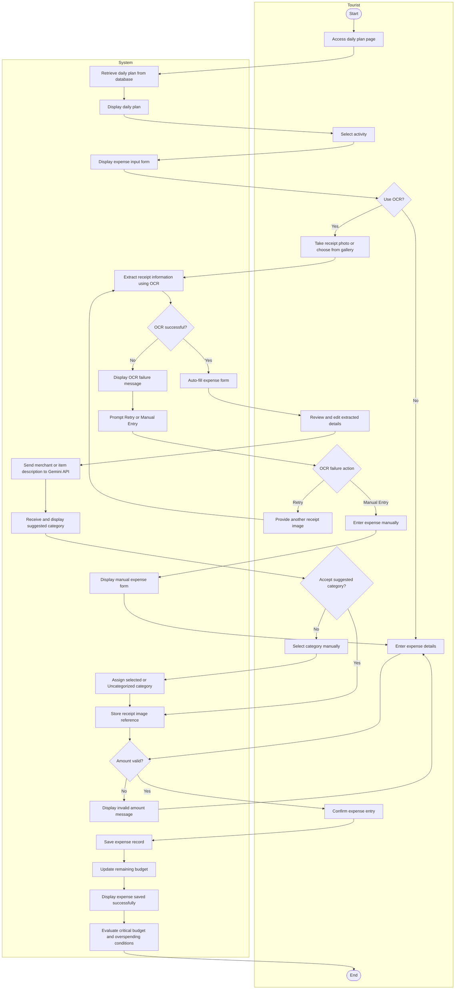
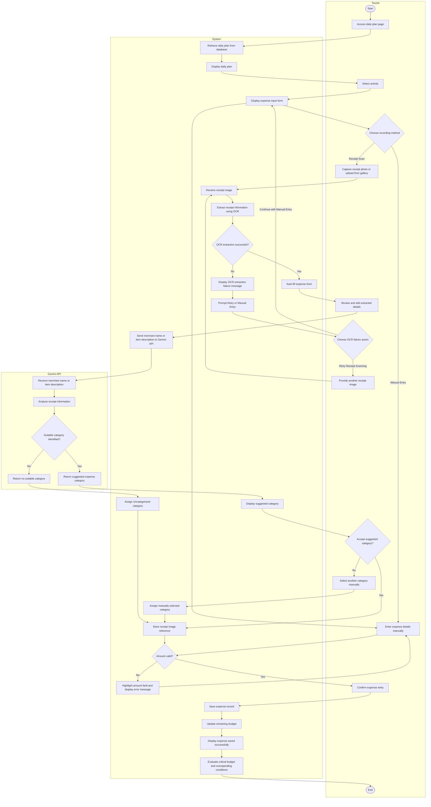
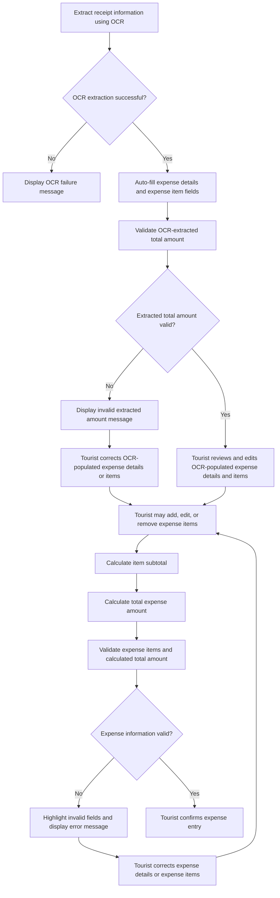

# Collaborative Assignment

**User:** Anonymous  
**Created:** 7/30/2026 23:14:23  
**Updated:** 8/31/2026 19:49:06  
**Exported:** 9/1/2026 1:10:54  
**Link:** [https://chatgpt.com/c/6a6b6a3a-1cd4-83ec-949c-a2c5da64361b](https://chatgpt.com/c/6a6b6a3a-1cd4-83ec-949c-a2c5da64361b)  

## Prompt:
7/30/2026, 11:14:21 PM

what is the projected shortfall

[Attachment: Pasted text(10).txt]

## Response:
7/30/2026, 11:14:22 PM

A **projected shortfall** is the **estimated amount by which available resources (usually money) will fall below what is needed in the future**.

In the context of your travel budgeting system, it means:

> **Projected Shortfall = Estimated Future Expenses - Remaining Budget**

If the result is positive, the tourist is expected to run out of money before the trip ends.

### Example 1
- Remaining budget: **RM 500**
- Estimated remaining trip expenses: **RM 650**

**Projected shortfall = RM 650 - RM 500 = RM 150**

**Message to user:**
> *"Based on your current spending rate, you are projected to have a budget shortfall of RM150 before your trip ends."*

### Example 2
- Remaining budget: **RM 800**
- Estimated remaining expenses: **RM 650**

**Projected shortfall = RM 650 - RM 800 = -RM150**

There is **no shortfall**. Instead, the tourist is projected to have **RM150 remaining**.

---

### For your FYP requirement
Instead of saying:

> **"The system shall display the projected shortfall."**

You can make it clearer as:

> **The system shall display the projected budget shortfall, representing the estimated amount by which the remaining budget is insufficient to cover the projected remaining trip expenses.** `Pasted text.txt`

Or, more simply:

> **The system shall display the estimated budget shortage amount if the projected remaining trip cost exceeds the remaining budget.** `Pasted text.txt`

In short, **projected shortfall = predicted future budget deficit**. It is not the amount already overspent, but the amount the user is expected to be short by if their current spending pattern continues.

## Prompt:
7/30/2026, 11:27:20 PM

i hate the name

## Response:
7/30/2026, 11:27:20 PM

If you don't like **"Projected Shortfall"**, here are some alternatives depending on the tone you want.

### Formal / Academic
- **Budget Deficit**
- **Estimated Budget Deficit**
- **Expected Budget Deficit**
- **Predicted Budget Deficit**
- **Estimated Budget Gap**
- **Budget Gap**
- **Expected Funding Gap**

### User-Friendly (best for app UI)
- **Budget Warning**
- **Budget Risk**
- **Budget Alert**
- **Expected Budget Shortage**
- **Estimated Shortage**
- **Insufficient Budget**
- **Running Low on Budget**
- **Budget Remaining Forecast**

### If this feature predicts overspending
Instead of "Projected Shortfall", you could rename it to:
- **Overspending Prediction** ⭐ (my favourite)
- **Budget Forecast**
- **Budget Outlook**
- **Spending Forecast**
- **Future Budget Status**
- **Budget Sustainability**
- **Budget Projection**

### For your FYP
Since your module is already called **Overspending Prediction**, I'd keep the requirement consistent:

- **The system shall display the predicted budget deficit.**
- **The system shall display the estimated budget shortage amount.**
- **The system shall display the estimated budget gap.**
- **The system shall display the predicted overspending amount.** ⭐ *(if the feature is specifically about overspending)*

I think **Estimated Budget Gap** or **Predicted Overspending Amount** sounds much more natural than **Projected Shortfall** in a software requirements document.

## Prompt:
7/30/2026, 11:29:22 PM

i asked my leader about basic flow uc300 step 10 update remaining budget since it wa my part before but now haandled by her

The system saves the expense record. (FR300_6) [C1: Sync Status] update remaining budget
[23:23, 30/07/2026] +60 16-342 8861: for this I'm thinking whether need to mention update the remaining budget anot
[23:23, 30/07/2026] +60 16-342 8861: because before this update budget is my part rite
[23:23, 30/07/2026] ernestyip500: because before this update budget is my part rite
correct
[23:23, 30/07/2026] +60 16-342 8861: then now I think can be combined
[23:23, 30/07/2026] +60 16-342 8861: so when the user input their expense successfully then the remaining budget automatically updated
[23:24, 30/07/2026] +60 16-342 8861: do u think need to mention?
[23:24, 30/07/2026] ernestyip500: ohhh liddat
[23:24, 30/07/2026] ernestyip500: yup better to mention
[23:24, 30/07/2026] ernestyip500: ridzuan said to mention detailed parts
[23:24, 30/07/2026] ernestyip500: else ltr he ask whether got auto update or not
[23:24, 30/07/2026] +60 16-342 8861: owhh okayy
[23:25, 30/07/2026] +60 16-342 8861: see how to put inside ba
[23:25, 30/07/2026] +60 16-342 8861: before this is separate in two de
[23:25, 30/07/2026] +60 16-342 8861: Step 10 & 11
[23:26, 30/07/2026] ernestyip500: see how to put inside ba
oakyyy

what is she saying step10 and 11

## Response:
7/30/2026, 11:29:22 PM

She's referring to the **old version** of your UC300 basic flow, where **saving the expense** and **updating the remaining budget** were two separate steps.

Something like this:

**Before**
- **Step 10:** The system saves the expense record.
- **Step 11:** The system updates the remaining budget.

Now that **Budget Management** is her module, she's suggesting that these two actions happen together when an expense is successfully recorded.

That's why she said:

> "before this is separate in two de"
>
> "Step 10 & 11"

Meaning:
- Previously there were two separate steps.
- Now she's wondering whether to merge them into one step since updating the budget happens automatically after saving the expense.

When you replied that Ridzuan likes detailed steps, she agreed to keep the update mentioned:
> "owhh okayy"
>
> "see how to put inside ba"

So she isn't saying to remove it. She's saying she'll think about **how to word it**.

For example, she could write either:

**Option 1 (combined into one step):**
> **Step 10:** The system saves the expense record and automatically updates the remaining budget. (FR300_6, FR200_19)

or

**Option 2 (more detailed):**
> **Step 10:** The system saves the expense record. (FR300_6)
>
> **Step 11:** The system automatically updates the remaining budget. (FR200_19)

Since your lecturer prefers detailed use cases, **Option 2** is generally the better choice. It makes the automatic budget update explicit and is easier for the examiner to trace to the corresponding functional requirement.

## Prompt:
7/30/2026, 11:33:22 PM

and before it was someone else doing the notification for messages but they said only me using so im the one gonna do it now handle it

check my flow whether its me using only

[23:13, 30/07/2026] ernestyip500: those notification no nid put in fr etc rite just like we know ourselves nia handle by me
[23:21, 30/07/2026] +60 16-342 8861: overspend detection & also prediction
[23:21, 30/07/2026] +60 16-342 8861: yaaa alert only for reminding tourist to input their expense
[23:21, 30/07/2026] ernestyip500: overspend detection & also prediction
okayyy
[23:21, 30/07/2026] +60 16-342 8861: others no need
[23:21, 30/07/2026] +60 16-342 8861: just directly display the message when they enter the expense
[23:22, 30/07/2026] ernestyip500: okayyy cann
[23:22, 30/07/2026] +60 16-342 8861: ltr i modify xia the uc and ad
[23:22, 30/07/2026] ernestyip500: sure no probbb

## Response:
7/30/2026, 11:33:22 PM

Based on the conversation, your teammate is saying that **only certain notifications should go through the Dynamic Alerts module**, while the rest should just be normal system messages displayed immediately.

Specifically:

- ✅ **Use Dynamic Alerts** for:
  - **Overspend Detection** (e.g., budget exceeded)
  - **Overspending Prediction** (e.g., predicted to run out of budget)
  - **Expense reminder** (e.g., "You haven't recorded any expense for 2 hours.")

- ❌ **Do NOT use Dynamic Alerts** for:
  - "Expense recorded successfully."
  - "OCR extraction failed."
  - "Receipt uploaded successfully."
  - "Category updated."
  - Any immediate feedback after the user performs an action.

These should simply be displayed as **normal success/error messages** within the Expense Tracking module.

This also matches your requirements:

- Dynamic Alerts is responsible for notifications such as overspending, budget reallocation, itinerary changes, and expense reminders. `Pasted text.txt`
- Overspending Prediction explicitly states it should **notify the Dynamic Alerts** when a predicted overspend is detected. `Pasted text.txt`

### So, check your UC300 flow like this:

If you have something like:

- System displays "Expense recorded successfully." ✅ (keep as a normal message)
- System displays OCR failure. ✅ (keep as a normal message)
- System displays invalid amount. ✅ (keep as a normal message)

But if you have:

- System sends notification that the tourist is predicted to overspend. ➜ This should go through **Dynamic Alerts**.
- System sends notification that a category has been overspent. ➜ This should also go through **Dynamic Alerts**.

So yes, from your teammate's messages, it sounds like **you are now responsible only for the Dynamic Alerts related to Overspend Detection and Overspending Prediction**, while ordinary UI messages remain inside your own module and don't need to involve the Dynamic Alerts module.

## Prompt:
7/30/2026, 11:34:02 PM

but also mentioned she now handled overspend detection & also prediction

Not me anymore im doing ocr and notification and expense recording

## Response:
7/30/2026, 11:34:03 PM

Yes, I noticed that. The conversation is a little confusing because she first mentions **"overspend detection & also prediction"**, but from the rest of the chat, she's actually talking about **who owns the notifications**, not who owns the features.

Here's how I interpret it:

> **Her:** "overspend detection & also prediction"

She is referring to the **notifications** generated by those features.

Then she immediately says:

> **"yaaa alert only for reminding tourist to input their expense"**

and

> **"others no need"**

and

> **"just directly display the message when they enter the expense"**

This suggests the division is:

### Her module (Budget Management)
- Overspend Detection
- Overspending Prediction
- Logic for deciding when the budget is exceeded

### Your module (Expense Tracking)
- Expense Recording
- OCR Receipt Scanning
- Normal success/error messages
- Dynamic Alerts / notification mechanism (or at least integrating the alerts)

In other words:

- When her module detects an overspend, **it requests a notification**.
- Your notification component (Dynamic Alerts) displays it to the user.

This actually matches your requirements. The Budget Management module **requests** Dynamic Alerts when overspending is detected, while the Dynamic Alerts module is responsible for displaying the notification. `Pasted text.txt` `Pasted text.txt`

Likewise, Overspending Prediction **requests** Dynamic Alerts when a predicted overspend is detected. `Pasted text.txt`

### So if your work is now:
- ✅ Expense Recording
- ✅ OCR
- ✅ Notification/Dynamic Alerts

Then you **should not** implement the overspend detection or prediction logic itself. Your responsibility is only to display or manage the notifications that those modules trigger.

I think it would be worth confirming one thing with your leader:

> "Just to confirm, Overspend Detection and Overspending Prediction logic are under your module, while I'm only handling the notification (Dynamic Alerts) part, right?"

That removes any ambiguity before you update your UC and activity diagram.

## Prompt:
7/30/2026, 11:37:09 PM

wait so her module detect overspend and request notif , my notif will tell user what

"yaaa alert only for reminding tourist to input their expense"???

## Response:
7/30/2026, 11:37:09 PM

That's exactly why I think the chat is ambiguous.

Let's read it carefully:

> **Her:** "overspend detection & also prediction"

Then immediately:

> **"yaaa alert only for reminding tourist to input their expense"**

Those two statements don't really fit together.

If taken literally, she's saying:
- Overspend Detection & Prediction → (something)
- Dynamic Alert → **only** reminds tourists to record expenses.

Those are different features.

### Looking at your requirements

Your Dynamic Alerts module has these responsibilities:

- Notify when **overspending is detected**.
- Notify when **budget allocation has been reallocated**.
- Notify when **the itinerary has changed**.
- **Remind tourists to record expenses** every 2 hours or at 9 pm if no expense has been recorded. `Pasted text.txt`

So if she's now taking over **Overspend Detection** and **Overspending Prediction**, then she should either:

1. **Display the overspend messages herself**, or
2. **Request your Dynamic Alerts module** to display:
   - "You have exceeded your Food budget by RM20."
   - "Based on your spending, you may run out of budget in 2 days."

Meanwhile, **your own notification feature** would still handle:
- "Don't forget to record your expenses." (2-hour / 9 pm reminder)

### I think what she meant

I suspect she meant:

> "For notifications, only the expense reminder belongs to you. Overspend Detection and Prediction are now my module."

Because she literally said:

> **"others no need"**
>
> **"just directly display the message when they enter the expense"**

That sounds like she doesn't want you handling overspend notifications anymore.

### I would clarify with one message

You could ask:

> "Just to confirm, since Overspend Detection and Overspending Prediction are under your module now, am I only handling the expense reminder notification (2-hour/9 pm), while the overspend and prediction messages are handled by your module?"

That question is very specific and should clear up the confusion immediately.

From the chat alone, I **can't confidently conclude** that you're responsible for overspend notifications. In fact, it sounds more likely that you're only responsible for the **expense reminder** notification, while she's responsible for everything related to overspending.

## Prompt:
7/30/2026, 11:38:58 PM

where do u find the expense reminder notif

## Response:
7/30/2026, 11:38:59 PM

I found it in **your requirements document**, under the **Financial Dashboard Module → FR4: Dynamic Alerts**.

Specifically:

> **FR600_38:** *"The system shall remind the tourist to record their expenses if no expense has been recorded within every 2 hours or at the end of the day like 9.00pm."* `Pasted text.txt`

That's why your teammate said:

> **"yaaa alert only for reminding tourist to input their expense"**

She was almost certainly referring to **FR600_38**.

---

However, your document also says:

- **FR600_35:** The system shall notify the tourist when overspending is detected.
- **FR300_14:** Overspending Prediction shall notify the Dynamic Alerts and display the predicted overspend information.
- **FR200_39:** Overspend Detection shall request the Dynamic Alerts feature when overspending is detected. `Pasted text.txt` `Pasted text.txt` `Pasted text.txt`

So there is actually a contradiction:

- **The SRS says** Dynamic Alerts handles overspending notifications **and** expense reminders.
- **Your teammate's message sounds like** only the expense reminder belongs to you now.

That means your team has likely changed the module ownership **without updating the requirements document yet**.

So don't rely on the document alone here-ask your leader which ownership is the latest. The chat suggests the design has changed, but the SRS hasn't been updated accordingly.

## Prompt:
7/30/2026, 11:45:14 PM

heres our architectural diagram check it out

did u know before this we were doing mvvm + layered which we put mvvm on presentation where viewmodel connects to application and we got scolded so hard so now we using mvvm only

[Attachment: Pasted text(11).txt]

## Response:
7/30/2026, 11:45:18 PM

Yes, I can see the new diagram. It is now presented as **one MVVM architecture**, with three main sections:

**View → ViewModel → Model** `Pasted text.txt`

Your earlier approach likely got criticised because you claimed to use **MVVM + Layered Architecture**, but placed MVVM only inside the presentation layer:

> Presentation layer: View + ViewModel  
> Application layer  
> Domain layer  
> Data layer

That representation makes **ViewModel communicate with an Application layer**, which starts looking more like Clean Architecture or layered architecture rather than straightforward MVVM. Your lecturer probably viewed it as mixing two architectural styles without clearly defining their relationship.

## Your current diagram

The overall structure is much clearer:

```text
View
  ↕
ViewModel
  ↕
Model
```

Inside **Model**, you currently have:

- Entities
- Repositories
- Device Services
- API Services

That is acceptable for MVVM because **Model does not mean only database entities**. In MVVM, Model can contain data, business logic, repositories and external service access.

## Correct communication direction

Your architecture should show:

```text
View ↔ ViewModel ↔ Repository ↔ Services/APIs
                         ↕
                      Entities
```

More specifically:

```text
ExpenseScreen
      ↕
ExpenseViewModel
      ↕
ExpenseRepository
   ↙       ↘
Camera/OCR  Supabase API
```

The View should **not directly access**:

- Repository
- Supabase
- Gemini API
- Camera
- Local storage
- Notifications

Everything should go through its relevant ViewModel.

## Important problems to fix

### 1. Add the missing notification components

Your diagram only contains **Notifications** under Device Services. It does not show:

- `NotificationViewModel`
- `NotificationRepository`
- A notification-related entity, such as `Notification` or `Alert`

Since you said that you are responsible for notifications, I recommend adding:

```text
View:
NotificationScreen or AlertHistoryScreen

ViewModel:
NotificationViewModel

Entities:
Notification / Alert

Repository:
NotificationRepository

Device Services:
Local Notifications
```

Then the flow becomes:

```text
NotificationScreen
        ↕
NotificationViewModel
        ↕
NotificationRepository
        ↕
Notification entity + Device Notification Service
```

For the expense reminder:

```text
NotificationViewModel
→ checks whether an expense has been recorded
→ NotificationRepository
→ Local Notification Service
→ displays reminder
```

### 2. OCR is not clearly represented

You have Camera and Gallery, but no actual **OCR service**. Camera and Gallery only obtain the image; they do not extract text.

Add one of these under API Services:

```text
Gemini OCR Service
```

or, if Gemini performs OCR and categorisation:

```text
Gemini API
- Receipt OCR
- Expense categorisation
```

A clearer expense flow would be:

```text
ExpenseScreen
      ↕
ExpenseViewModel
      ↕
ExpenseRepository
  ↙       ↓        ↘
Camera   Gallery   Gemini API
                      ↓
             OCR and categorisation
```

### 3. The repository arrows should be clearer

Your current diagram shows arrows in both directions between ViewModel and the entire Repository container. That is understandable, but it does not show which ViewModel uses which repository.

Ideally, connect them specifically:

```text
AuthViewModel ↔ AuthRepository
ProfileViewModel ↔ UserRepository
ExpenseViewModel ↔ ExpenseRepository
BudgetViewModel ↔ BudgetRepository
TripViewModel ↔ TripRepository
RecommendationViewModel ↔ RecommendationRepository
DashboardViewModel ↔ DashboardRepository
NotificationViewModel ↔ NotificationRepository
```

This makes responsibility ownership much easier for your lecturer to understand.

### 4. “Supabase API” and “Supabase” may appear duplicated

You currently have:

- `Supabase API` under API Services
- A separate external `Supabase` datastore/cloud

This can be correct, but the arrow should communicate:

```text
Repository → Supabase API → Supabase Cloud
```

The external Supabase symbol represents the actual cloud platform/database. The Supabase API represents the interface used by your application.

### 5. Gemini is also duplicated

Similarly, you have:

- `Gemini API` inside API Services
- External `Gemini`

That is fine when shown as:

```text
RecommendationRepository / ExpenseRepository
→ Gemini API Service
→ External Gemini API
```

However, the cloud symbol currently appears unlabeled and connects to both Gemini and Supabase. Label it something such as:

> **Internet / Cloud Services**

Otherwise, it may confuse the reader.

## Regarding your module ownership

Based on this architecture, your responsibility should probably be represented as:

```text
ExpenseViewModel
NotificationViewModel

ExpenseRepository
NotificationRepository

Expense
ExpenseCategory
Notification

Camera
Gallery
Local Storage
Local Notifications
Gemini OCR/API
Supabase API
```

Your teammate’s Budget module can detect overspending without you owning that logic:

```text
BudgetViewModel
→ BudgetRepository
→ detects overspending
→ directly displays overspend result
```

Your notification feature, based on her latest message, appears to be only:

```text
No expense recorded for required period
→ trigger local reminder
→ “Remember to record your expenses.”
```

Therefore, do **not** connect `BudgetViewModel` to your `NotificationViewModel` unless the team confirms that detected overspending must also generate a notification.

## Overall verdict

The new version is **far better than placing MVVM inside a layered architecture**. The fundamental design is valid:

> **View communicates with ViewModel, while ViewModel accesses repositories and services contained within the Model.**

The main missing items for your part are **NotificationViewModel, NotificationRepository, Notification entity, and a clearly labelled OCR service**. Also make each ViewModel-to-Repository relationship explicit rather than connecting the entire containers with one general arrow.

## Prompt:
7/30/2026, 11:53:29 PM

before u tell me to remove the projected shortfall analyse my whole docs whether its needed

because yesterday we got scolded by teacher and he wanted restructure on some part, if we remove projected shortfal what would happen, if we dont, will it sstill be ok

leader asking
this is for what ahh? like calculate when the tourist will finish their budget? I think this part has to restructure according to what ridzuan told this Wednesday

## Response:
7/30/2026, 11:53:32 PM

I’ll trace every place “projected shortfall” appears, what depends on it, and whether removing it breaks the revised module responsibilities.

> **Searched files for relevant information**
>
> 
>
> Worked for 16s

After checking the full flow, **“Projected Shortfall” is currently needed only because your document contains a budget-sufficiency prediction feature**. However, the present structure is inconsistent and should be restructured rather than simply deleting one phrase.

## What “Projected Shortfall” currently does

Your document defines:

> **Projected Shortfall = (Daily Spending Rate × Remaining Trip Days) - Remaining Budget** `Pasted text(10).txt`

This calculates the **estimated amount of money the tourist will be lacking by the end of the trip**.

Example:

```text
Daily spending rate = RM100
Remaining trip days = 5
Remaining budget = RM350

Projected shortfall
= RM100 × 5 - RM350
= RM150
```

Meaning:

> The tourist is predicted to be short by RM150 for the remaining trip.

It does **not directly calculate when the tourist will finish the budget**.

To calculate how many days the budget can last, the correct calculation is:

```text
Estimated sustainable days
= Remaining Budget ÷ Average Daily Spending Rate
```

Example:

```text
RM350 ÷ RM100 = 3.5 days
```

Therefore, your leader’s question is valid:

> “Is this used to calculate when the tourist will finish their budget?”

The answer is:

> **Not exactly. Projected Shortfall calculates how much money is expected to be missing. A separate calculation determines how many days the budget can last.**

## The inconsistency in your current document

Your requirements contain three related but different outputs:

1. **Whether the remaining budget is sufficient**
   - FR300_11 projects whether the budget will cover the remaining trip. `Pasted text(10).txt`

2. **How many days the budget can sustain**
   - FR300_13 sends the estimated number of remaining days the budget can last. `Pasted text(10).txt`

3. **Predicted overspend information**
   - FR300_14 displays predicted overspending information. `Pasted text(10).txt`

But the only prediction formula written is the **projected shortfall amount formula**. It does not produce the “remaining days” shown in your message:

> “Your remaining budget is estimated to last {remaining_days} more day(s).” `Pasted text(10).txt`

So the current documentation is mathematically incomplete.

## More importantly: it is now under the wrong module

Your revised responsibility is:

- Expense recording
- OCR
- Expense reminder notification

Your leader now handles:

- Remaining-budget calculation
- Overspend detection
- Overspending prediction
- Budget recovery/reallocation

Your Budget Management requirements already contain:

- Monitoring whether the budget is sufficient for the remaining trip
- Estimating the required budget for the remaining itinerary
- Displaying the estimated shortage amount `Pasted text(10).txt`

Therefore, **Projected Shortfall belongs much more naturally under the Budget Management module**, not your Expense Tracking module.

Currently, Expense Tracking still owns `FR300_8-FR300_14`, including average spending rate, prediction, sustainable days and predicted overspending alerts. `Pasted text(10).txt` That conflicts with the new ownership your leader described.

# What happens if you remove it?

## If you remove only the formula

If you delete only:

> C11 Projected Shortfall formula

but keep FR300_11-FR300_14, your documentation becomes incomplete.

The system would still claim to:

- Predict whether the budget is sufficient
- Estimate how long it can last
- Display predicted overspending

But it would no longer explain how the prediction is calculated.

So **do not remove only C11 while leaving the prediction requirements unchanged**.

## If you remove the whole prediction feature from Expense Tracking

This would be acceptable and probably matches what your lecturer requested, provided that you **move the feature to Budget Management**.

You would remove from your Expense Tracking module:

- FR300_8
- FR300_9
- FR300_10
- FR300_11
- FR300_12
- FR300_13
- FR300_14

Then your module would focus cleanly on:

```text
Expense Recording
Receipt OCR
Expense Categorisation
Expense Reminder Notification
```

Your leader’s Budget Management module would own:

```text
Remaining-budget calculation
Overspend detection
Average spending-rate calculation
Budget sufficiency prediction
Estimated sustainable days
Estimated budget shortfall
Budget recovery
Budget reallocation
```

That is the cleanest restructuring.

# What happens if you keep it?

You can keep “Projected Shortfall,” but only if you fix these issues:

### 1. Move it under Budget Management

It should support requirements such as:

> The system shall estimate whether the remaining budget is sufficient for the remaining itinerary.

> The system shall calculate the estimated budget shortage when the projected remaining cost exceeds the remaining budget.

### 2. Rename it clearly

“Projected Shortfall” is technically valid, but your leader did not immediately understand it. A clearer name would be:

> **Estimated Budget Shortage**

Formula:

```text
Estimated Budget Shortage
= Estimated Remaining Trip Cost - Remaining Budget
```

Where:

```text
Estimated Remaining Trip Cost
= Average Daily Spending Rate × Remaining Trip Days
```

This is easier to explain than one combined formula.

### 3. Add a separate sustainable-days formula

To support the existing prediction message:

```text
Estimated Sustainable Days
= Remaining Budget ÷ Average Daily Spending Rate
```

The two outputs serve different purposes:

| Output | Meaning |
|---|---|
| Estimated Sustainable Days | How many more days the budget may last |
| Estimated Budget Shortage | How much extra money may be needed to finish the trip |

## Recommended restructuring

I would not completely remove the concept. I would **remove it from your module and restructure it under your leader’s Budget Management module**.

A cleaner requirement set would be:

```text
FR: Budget Sufficiency Prediction

The system shall calculate the tourist’s average daily spending rate based on recorded expenses.

The system shall estimate the cost required for the remaining trip duration.

The system shall compare the estimated remaining trip cost with the remaining budget.

The system shall determine whether the remaining budget is sufficient for the remaining trip.

When the remaining budget is insufficient, the system shall calculate and display the estimated budget shortage.

The system shall estimate the number of days that the remaining budget can sustain based on the tourist’s average daily spending rate.

The system shall display “Not enough data yet” when insufficient expense records are available to generate a reliable prediction.
```

Constraints:

```text
Average Daily Spending Rate
= Total Recorded Expenses ÷ Number of Trip Days Elapsed

Estimated Remaining Trip Cost
= Average Daily Spending Rate × Remaining Trip Days

Estimated Budget Shortage
= max(0, Estimated Remaining Trip Cost - Remaining Budget)

Estimated Sustainable Days
= Remaining Budget ÷ Average Daily Spending Rate
```

## What to tell your leader

**chat_message: **

Projected shortfall is not exactly used to calculate when the tourist will finish the budget. It calculates the estimated shortage amount for the remaining trip:

Estimated shortage = estimated remaining trip cost - remaining budget.

To calculate how many days the budget can last, we need a separate formula:

Remaining budget ÷ average daily spending rate.

Since overspend detection and prediction are now under your Budget Management module, I think we should remove the prediction requirements and projected shortfall from my Expense Tracking module, then restructure them under your module. We can rename “Projected Shortfall” to “Estimated Budget Shortage” so it is clearer.

So the best decision is:

> **Do not simply delete Projected Shortfall. Move and rename it, while separating it from the calculation of how many days the budget can sustain.**

## Prompt:
7/30/2026, 11:57:11 PM

this waas before when im handling overspend prediction, now she is handling so i pass over to her but she doesnt know what it is

so i need explain

## Response:
7/30/2026, 11:57:13 PM

Since you're handing this feature over, I'd explain **the purpose**, not just the formula.

You can tell her:

> **Projected Shortfall is used to estimate how much money the tourist will be lacking if they continue spending at their current rate until the end of the trip.** It is **not** used to calculate how many days the budget will last.

Then give an example:

```text
Average daily spending = RM100
Remaining trip days = 5
Remaining budget = RM350

Estimated remaining cost = RM100 × 5 = RM500
Projected shortfall = RM500 − RM350 = RM150
```

Meaning:

> "If the tourist continues spending like this, they are predicted to be short by RM150 before the trip ends."

You can also explain why it existed:

> We used it to support the prediction feature. If the projected shortfall is greater than RM0, the system predicts the remaining budget is insufficient and can trigger a prediction message, budget recovery, or recommendation feature.

One thing I'd also mention is that the **name can be improved**. "Projected Shortfall" isn't immediately obvious, which is probably why she asked:

> "this is for what ahh?"

A clearer name would be:

- **Estimated Budget Shortage** (my favourite)
- Predicted Budget Deficit
- Estimated Budget Gap

Those names immediately tell the reader what the value represents.

If Ridzuan wants the flow simplified, I'd suggest she **keeps the concept** but renames it to **Estimated Budget Shortage** and, if she still wants to show "your budget will last X days", use a separate calculation:

```text
Estimated Sustainable Days
= Remaining Budget ÷ Average Daily Spending Rate
```

That way there are two clear outputs:

- **Estimated Budget Shortage (RM)** → How much extra money is needed.
- **Estimated Sustainable Days** → How many days the current budget can last.

That separation is much easier to explain to a lecturer than trying to make one formula represent both.

## Prompt:
7/30/2026, 11:58:55 PM

so the projected shortfall is actually for prediction?
and 

name should be change

## Response:
7/30/2026, 11:58:57 PM

Yes, exactly.

The **Projected Shortfall** is **not the prediction itself**. It is the **calculation used to support the prediction**.

Think of it like this:

```text
Recorded expenses
        ↓
Average daily spending rate
        ↓
Estimated remaining trip cost
        ↓
Projected Shortfall (or Budget Shortage)
        ↓
Prediction
```

For example:

```text
Average daily spending = RM100
Remaining trip days = 5
Remaining budget = RM350

Estimated remaining trip cost = RM500

Projected Shortfall = RM500 - RM350 = RM150
```

Then the system makes the prediction:

> "Your current budget is **predicted to be insufficient**. You may be short by **RM150** if your spending continues."

So yes, **Projected Shortfall is an internal calculation for the prediction feature**.

---

## Should the name change?

**I would change it.**

When your leader immediately asked:

> "this is for what ahh?"

that's already a sign the term isn't very intuitive.

I'd recommend one of these:

1. **Estimated Budget Shortage** ⭐⭐⭐⭐⭐ (best)
2. Predicted Budget Shortage
3. Estimated Budget Deficit
4. Budget Gap
5. Predicted Budget Gap

Then your constraint becomes much clearer:

```text
Estimated Budget Shortage
= Estimated Remaining Trip Cost − Remaining Budget
```

instead of

```text
Projected Shortfall
= (Daily Spending Rate × Remaining Trip Days) − Remaining Budget
```

It's the **same calculation**, but the first name immediately tells the reader what the value means.

So if Ridzuan asked you to restructure things, I'd recommend **keeping the calculation but renaming it**. It will be much easier for your teammates and lecturer to understand.

## Prompt:
7/30/2026, 11:59:39 PM

Projected shortfall is like used to est how much money the tourist will be lacking if they continue spending at their current rate until the end of the trip, and it is not used to calculate how many days the budget will last. 

add telling her to support prediction and said name changed

## Response:
7/30/2026, 11:59:41 PM

**chat_message: **

Projected Shortfall is used to estimate how much money the tourist will be lacking if they continue spending at their current rate until the end of the trip. It is **not** used to calculate how many days the budget will last.

We originally used it to support the **overspending prediction** feature. The system uses this value to predict whether the remaining budget will be sufficient for the rest of the trip and whether a budget shortage is expected.

I think we should also rename it to something clearer, like **Estimated Budget Shortage**, since "Projected Shortfall" isn't very intuitive and can be confusing.

## Prompt:
7/31/2026, 12:13:04 AM

this is what she said

[00:04, 31/07/2026] +60 16-342 8861: ermm but I think hor prediction will be triggered when overspending detected, then it definitely not sufficient for the rest of the trip ady
[00:07, 31/07/2026] +60 16-342 8861 replied to "ohh ya for the projected shortfall is like used to est how much money the tourist will be lacking if they continue spending at their current rate until the end of the trip, is not used to calculate how many days the budget will last."
so u will display like "If you keep spending like this, your budget will be exceeded how much?
[00:08, 31/07/2026] +60 16-342 8861: how about the days, still got?

## Response:
7/31/2026, 12:13:06 AM

I actually think your leader has raised a good design point.

Before, your flow was:

```
Expense recorded
→ Overspend detected
→ Prediction
```

Her point is:

> **If overspending has already been detected, then we already know the tourist is over budget. Why do we still need another prediction saying the budget will be insufficient?**

That's a valid question.

### About the first message

> "prediction will be triggered when overspending detected, then it definitely not sufficient for the rest of the trip ady"

Not necessarily.

Example:

- Total budget = RM2000
- Remaining budget = RM1200
- Today's food budget = RM50
- Tourist spends RM70

They **overspent today's food budget by RM20**, but they may still have plenty of money remaining overall. So overspending **doesn't always mean** the whole trip budget is insufficient.

Prediction is supposed to answer a different question:

> "If you continue spending like this every day, will you run out of money before the trip ends?"

So conceptually they're different.

### About her second message

> "so u will display like 'If you keep spending like this, your budget will be exceeded how much?'"

Yes. That's exactly what the projected shortfall (or Estimated Budget Shortage) was for.

Example:

```
Estimated Budget Shortage: RM180

Message:
"If you continue spending at your current rate, you are estimated to exceed your remaining budget by RM180."
```

### About the days

> "how about the days, still got?"

I would say:

> The days calculation is actually a separate formula. We originally had both:
>
> - Estimated Budget Shortage (how much money you'll be short)
> - Estimated Sustainable Days (how many more days the current budget can last)
>
> If we're simplifying the flow based on Ridzuan's comments, we can remove one or even both depending on how much prediction he still wants to keep.

You could reply:

**chat_message: **

Ya, originally there were actually two different outputs.

- **Estimated Budget Shortage**: "If you keep spending like this, you're estimated to exceed your remaining budget by RMxxx."
- **Estimated Sustainable Days**: "Your remaining budget is estimated to last xx more day(s)."

The projected shortfall was only used to support the first one. If Ridzuan wants to simplify the prediction flow, we can remove or restructure these since they're part of the prediction feature anyway.

Personally, after hearing what your leader said, I suspect **Ridzuan may want to simplify the whole prediction feature**, not just rename "Projected Shortfall." The next meeting should clarify whether he still wants predictive analytics at all, or only immediate overspend detection.

## Prompt:
7/31/2026, 12:15:41 AM

where did u find the estimated sustainable dys

## Response:
7/31/2026, 12:15:44 AM

Good catch. I **didn't invent it**, but I did infer the formula from your requirements. Your document never explicitly defines **"Estimated Sustainable Days"** as a constraint.

What your document **does** say is:

- **FR300_13**
  > "The system shall send a prediction message to the tourist indicating the **estimated number of remaining days the current budget can sustain** based on the current spending rate." `Pasted text(10).txt`

And in the use case message:

> "Based on your current spending rate, your remaining budget is estimated to last **{remaining_days} more day(s)**..." `Pasted text(10).txt`

So the **feature exists** in your requirements.

---

However, **the formula is not written anywhere**.

I inferred the obvious calculation:

```text
Remaining Budget ÷ Average Daily Spending Rate
```

because that's the standard way to determine how many days a budget will last.

For example:

- Remaining budget = RM300
- Average daily spending = RM100/day

```
300 ÷ 100 = 3 days
```

---

So your document currently has:

✅ Formula for **Projected Shortfall** (C11). `Pasted text(10).txt`

❌ No formula for **remaining_days**, even though FR300_13 and the message use it. `Pasted text(10).txt` `Pasted text(10).txt`

That's actually an inconsistency in the documentation.

If Ridzuan is asking you to restructure this feature anyway, it's a good opportunity to either:
1. remove the days prediction entirely, or
2. add the missing formula if the days prediction is kept.

## Prompt:
7/31/2026, 12:20:50 AM

she said
[00:19, 31/07/2026] +60 16-342 8861: for me, I think that can remain second one
[00:20, 31/07/2026] +60 16-342 8861: because the first one is like the user ady exceeded, then the system still tells them the estimated amount of how much you are exceeding

## Response:
7/31/2026, 12:20:56 AM

Her reasoning makes sense **if the prediction is only triggered after the overall trip budget is already exceeded**. In that case, telling the user how much they are predicted to exceed is less useful because they have already overspent.

The more useful output would be:

> “Based on your current spending rate, your remaining budget is estimated to last another 3 days.”

However, one distinction matters:

- **Already exceeded budget** = actual overspending amount  
- **Estimated Budget Shortage** = predicted amount they may lack by the end of the trip

They are not exactly the same, but keeping only the remaining-days prediction is simpler and more useful for the user.

You can reply:

**chat_message: **

Ya, I understand. We can keep the second one, which tells the user how many more days their remaining budget can sustain based on their current spending rate.

For the first one, although the estimated shortage refers to how much they may lack by the end of the trip rather than the amount they have already exceeded, it may still feel repetitive after overspending is detected. So we can remove the Projected Shortfall calculation and retain only the remaining-days prediction.

## Prompt:
7/31/2026, 8:55:11 PM

convo after

[00:19, 31/07/2026] +60 16-342 8861: owhhh
[00:19, 31/07/2026] +60 16-342 8861: for me, I think that can remain second one
[00:20, 31/07/2026] +60 16-342 8861: because the first one is like the user ady exceeded, then the system still tells them the estimated amount of how much you are exceeding
[00:22, 31/07/2026] ernestyip500: yeaa haobaa i think estimated shortage means like how much they may lack by the end of the trip rather than the amount they have already exceeded liao der,  may still feel a bit repetitive right after overspending is detected
[00:22, 31/07/2026] ernestyip500: for me, I think that can remain second one
cannn
[00:23, 31/07/2026] +60 16-342 8861: yeaa haobaa i think estimated shortage means like how much they may lack by the end of the trip rather than the amount they have already exceeded liao der,  may still feel a bit repetitive right after overspending is detected
yaa but I think remain first, we can ask opinions from others tmr, no prob
[00:24, 31/07/2026] +60 16-342 8861: if sys show the amount & days, oso will be better
[01:22, 31/07/2026] ernestyip500: Okayyy sure sure tmr we cc

## Response:
7/31/2026, 8:55:14 PM

I think the conversation actually ended in a good place.

Both of you are talking about **different perspectives**, and neither is wrong.

- **Your point:** Once overspending is detected, showing the estimated shortage might feel repetitive because the user already knows they're spending too much.
- **Her point:** Showing **both** the estimated shortage (money) and estimated remaining days gives the user more information, so it could still be useful.

Her last message:

> "if sys show the amount & days, oso will be better"

is a reasonable compromise. The outputs answer two different questions:

- **Estimated Budget Shortage** → *"If you continue spending like this, you'll be short by RM150 by the end of the trip."*
- **Estimated Remaining Days** → *"At your current spending rate, your remaining budget will last about 3 more days."*

These aren't duplicates—they complement each other.

And your reply:

> "Okayyy sure sure tmr we cc"

was probably the best response. Since Ridzuan asked for restructuring, it's better to let the group decide than argue over something that may change after the discussion.

If this comes up tomorrow, you can explain it simply:

> "The estimated shortage is the predicted amount the tourist may lack by the end of the trip, while the remaining days tells the tourist how long their current budget can sustain their spending. They're two different prediction outputs. Whether we keep one or both depends on how much prediction functionality we want in the system."

That's a clear, neutral explanation that lets the team decide without making it sound like either of you is wrong.

## Prompt:
7/31/2026, 8:56:44 PM

gonna have meeting later, ill try to note down and tell u later

## Response:
7/31/2026, 8:56:47 PM

Sounds good. During the meeting, just focus on capturing **what was decided**, not trying to remember every detail. Even rough notes are enough.

A simple structure like this works well:

- **Issue discussed**
  - e.g. "Overspend Prediction"

- **What was changed?**
  - Removed?
  - Renamed?
  - Moved to another module?
  - Formula changed?

- **Reason**
  - e.g. "Ridzuan said it was redundant after overspend detection."

- **Final decision**
  - e.g. "Keep only remaining days prediction."
  - or "Keep both estimated shortage and remaining days."

- **Action items**
  - Who updates FR?
  - Who updates UC/activity diagram?
  - Any formulas to add/remove?

For example:

```text
Overspend Prediction
- Projected Shortfall renamed to Estimated Budget Shortage.
- Keep both shortage amount and remaining days.
- Prediction only triggered after X.
- Leader updates FR300.
- Ernest removes old constraint C11.
```

After the meeting, just paste your notes (even if they're messy or in point form), and I can help you:
- interpret what Ridzuan meant,
- identify what requirements need updating,
- check for inconsistencies,
- and suggest exactly what to change in your documentation.

That'll be much easier than trying to reconstruct the discussion from memory later.

## Prompt:
7/31/2026, 9:11:22 PM


our architecture diagram update btw 
with a cloud below model connected 
with gemini and supabase

## Response:
7/31/2026, 9:11:26 PM

This is a definite improvement over the previous version. Adding the **cloud (backend infrastructure)** below the Model and connecting it to the **Gemini API** and **Supabase API** makes the architecture much clearer.

A few comments:

### 👍 What's good

- **Clear MVVM separation**
  - View → ViewModel → Model is easy to follow.
- **Model decomposition**
  - Separating **Use Cases**, **Entities**, **Repositories**, **Device Services**, and **API Services** is a good practice and makes responsibilities clearer.
- **Cloud backend**
  - Having a cloud (e.g., "Cloud Services" or "Backend Cloud") containing **Gemini** and **Supabase** shows that these are external services rather than local components.

### Small improvements I'd recommend

#### 1. Rename "API Services"
Instead of:

> API Services

I'd use one of these:

- **Remote Services** ⭐ (my preference)
- External Services
- Cloud Services

Since both Gemini and Supabase are external cloud services.

---

#### 2. OCR is still missing

Your Expense Tracking uses OCR, but I don't see an OCR component.

Instead of

```
Camera
Gallery
```

I'd have something like

```
Camera
Gallery
OCR Service
```

or

```
Image Capture
OCR Service
```

Otherwise the diagram doesn't explain how receipt scanning works.

---

#### 3. Notification

If reminder notifications are part of the app, having

```
Notifications
```

under Device Services is fine.

---

#### 4. Cloud connection

I like the idea you mentioned.

Something like

```
Repository
      │
      ▼
Remote Services
      │
 ┌───────────────┐
 │ Gemini API    │
 │ Supabase API  │
 └───────────────┘
      │
      ▼
Cloud
```

makes it obvious that both APIs communicate with cloud infrastructure.

---

### Overall

I'd rate this around **9/10**.

Compared to the previous architecture, this version:
- follows MVVM much more closely,
- has a cleaner separation of responsibilities,
- makes repositories and use cases explicit,
- and is much easier for a lecturer to understand.

The only notable thing I think is missing is the **OCR Service**, since it's a core feature of your expense tracking module. Otherwise, the architecture looks solid.

## Prompt:
7/31/2026, 9:12:27 PM

explain the flow so i can understand perfeclty

## Response:
7/31/2026, 9:12:38 PM

Think of your architecture as a chain of responsibility:

```text
User
  ↓
View
  ↓
ViewModel
  ↓
Use Case
  ↓
Repository
  ↓
Device Service / API Service
  ↓
Supabase or Gemini Cloud
```

Then the result travels back upward:

```text
Cloud / Device
  ↓
Repository
  ↓
Use Case
  ↓
ViewModel
  ↓
View
  ↓
User sees the result
```

## 1. View

The **View** is everything the tourist sees and interacts with.

Examples from your diagram:

- LoginScreen
- RegistrationScreen
- HomeScreen
- BudgetScreen
- TripScreen
- RecommendationScreen
- FinancialDashboardScreen

The View should only:

- display information;
- collect user input;
- send user actions to the ViewModel;
- update when the ViewModel provides new data.

For example, the tourist presses:

> “Add Expense”

The `ExpenseScreen` sends that action to `ExpenseViewModel`.

The View should **not**:

- calculate spending;
- access Supabase directly;
- call Gemini directly;
- save data directly;
- decide whether the tourist overspent.

So this is incorrect:

```text
ExpenseScreen → Supabase API
```

The correct flow is:

```text
ExpenseScreen → ExpenseViewModel → Model
```

---

## 2. ViewModel

The **ViewModel** acts as the coordinator between the View and the Model.

Examples:

- AuthViewModel
- DashboardViewModel
- ExpenseViewModel
- BudgetViewModel
- TripViewModel
- ProfileViewModel
- RecommendationViewModel

A ViewModel normally handles:

- user actions from the screen;
- loading states;
- error messages;
- calling the appropriate use case;
- formatting results for display;
- notifying the View when data changes.

For example, when the tourist adds an expense:

```text
ExpenseScreen
    ↓
ExpenseViewModel
```

The `ExpenseViewModel` may change its state to:

```text
Loading
```

Then it calls:

```text
ExpenseTrackingUseCase
```

After completion, it may update the state to:

```text
Expense saved successfully
Remaining budget: RM420
```

The screen observes that state and displays it.

The ViewModel should not normally contain the full business calculation itself. It should ask a **Use Case** to perform the operation.

---

## 3. Use Case

The **Use Case** represents a specific business operation.

Examples:

- AuthUseCase
- CalculateBudgetUseCase
- ExpenseTrackingUseCase
- RecommendationUseCase
- GenerateItineraryUseCase
- FinancialDashboardUseCase
- ProfileUseCase

A use case answers:

> “What operation is the user trying to perform?”

For example:

```text
CalculateBudgetUseCase
```

may:

1. retrieve the trip budget;
2. retrieve recorded expenses;
3. calculate the remaining budget;
4. analyse the current spending rate;
5. determine whether the budget is sufficient;
6. return the result.

The use case coordinates the business process, but it does not need to know how Supabase stores the data.

For example, it can say:

```text
expenseRepository.getExpenses()
budgetRepository.getBudget()
```

It does not need to write Supabase queries directly.

---

## 4. Repository

The **Repository** is the middle layer between your business logic and your data sources.

Examples:

- UserRepository
- AuthRepository
- ExpenseRepository
- BudgetRepository
- TripRepository
- RecommendationRepository
- DashboardRepository

The repository answers:

> “Where should I obtain or save this data?”

For example, `ExpenseRepository` may:

- save an expense to Supabase;
- retrieve expenses from Supabase;
- save an unsynced expense to local storage;
- synchronise local expenses when the internet becomes available.

The use case only asks:

```text
expenseRepository.saveExpense(expense)
```

The repository decides whether to use:

```text
Supabase API
```

or:

```text
Local Storage
```

That separation is important because the use case does not need to care about the actual database implementation.

---

## 5. Entities

The **Entities** are the main data objects used throughout the system.

Examples:

- User
- Trip
- Budget
- Expense
- ExpenseCategory
- SpendingPattern
- FinancialAnalysis
- BudgetRecommendation

For example, an `Expense` entity may contain:

```text
expenseId
tripId
amount
category
date
description
receiptImage
syncStatus
```

An entity mainly represents data and possibly basic rules.

For example:

```text
Expense amount must be greater than RM0
```

Entities move between the repository, use case and ViewModel.

---

## 6. Device Services

**Device Services** provide access to features available on the user's phone or device.

Your diagram contains:

- Camera
- Gallery
- Location (GPS)
- Local Storage
- Notifications

Examples:

### Camera

Used to capture a receipt image.

### Gallery

Used to select an existing receipt image.

### GPS

Used to obtain the tourist's location for recommendations or itinerary planning.

### Local Storage

Used to save data temporarily when there is no internet connection.

### Notifications

Used to display reminders such as:

> “Remember to record today's expenses.”

These are local device capabilities. They are not Supabase or Gemini services.

---

## 7. API Services

The **API Services** communicate with external systems.

Your diagram contains:

- Gemini API
- Supabase API

### Supabase API

Used for:

- authentication;
- database storage;
- retrieving users, trips, expenses and budgets;
- syncing local records;
- possibly storing receipt images.

### Gemini API

Used for AI-generated functions such as:

- itinerary generation;
- recommendations;
- budget recovery suggestions;
- alternative attraction or restaurant suggestions.

The repository communicates with these APIs instead of the View or ViewModel communicating with them directly.

---

## 8. Cloud

The cloud shown below the Model represents the actual external platforms.

A clearer interpretation is:

```text
Gemini API Service → Google Gemini Cloud
Supabase API Service → Supabase Cloud
```

The API Service is the code inside your Flutter application that knows how to send requests.

The cloud is the external system processing or storing the information.

For example:

```text
RecommendationRepository
    ↓
Gemini API Service
    ↓
Gemini Cloud
```

Gemini processes the request and sends a response back through the same layers.

---

# Full example 1: Recording a manual expense

Suppose the tourist records RM30 for lunch.

## Step 1: User interacts with the View

The tourist enters:

```text
Amount: RM30
Category: Food
Description: Lunch
```

Then presses **Save**.

```text
ExpenseScreen
    ↓
ExpenseViewModel
```

## Step 2: ViewModel receives the action

The ViewModel may:

- collect the entered information;
- show a loading indicator;
- call `ExpenseTrackingUseCase`.

```text
ExpenseViewModel
    ↓
ExpenseTrackingUseCase
```

## Step 3: Use Case validates and coordinates

The use case may:

1. check that RM30 is greater than RM0;
2. create an `Expense` entity;
3. ask `ExpenseRepository` to save it;
4. ask `BudgetRepository` for the current budget;
5. recalculate the remaining budget.

```text
ExpenseTrackingUseCase
    ↓
ExpenseRepository
```

## Step 4: Repository chooses the data source

When online:

```text
ExpenseRepository
    ↓
Supabase API
    ↓
Supabase Cloud
```

When offline:

```text
ExpenseRepository
    ↓
Local Storage
```

The expense may be marked as:

```text
Unsynced
```

and uploaded later.

## Step 5: Result returns upward

```text
Supabase / Local Storage
    ↓
ExpenseRepository
    ↓
ExpenseTrackingUseCase
    ↓
ExpenseViewModel
    ↓
ExpenseScreen
```

The screen displays:

> “Expense recorded successfully.”

It may also show:

> “Remaining budget: RM470.”

---

# Full example 2: Scanning a receipt using OCR

Your current diagram shows Camera and Gallery, but the OCR processor itself should ideally be added.

The recommended flow is:

```text
ExpenseScreen
    ↓
ExpenseViewModel
    ↓
ExpenseTrackingUseCase
    ↓
Camera / Gallery
    ↓
OCR Service
    ↓
Extracted receipt data
    ↓
ExpenseViewModel
    ↓
ExpenseScreen
```

Detailed flow:

1. The tourist selects **Scan Receipt**.
2. `ExpenseViewModel` calls `ExpenseTrackingUseCase`.
3. The use case requests an image from Camera or Gallery.
4. OCR Service analyses the image.
5. OCR extracts:
   - merchant;
   - total amount;
   - date;
   - possible expense category.
6. The extracted details return to the ViewModel.
7. The screen displays the information for confirmation.
8. The tourist confirms.
9. The expense is saved through `ExpenseRepository`.

The OCR should not automatically save uncertain information without user confirmation.

---

# Full example 3: Budget prediction

Suppose the tourist opens the Budget Screen.

```text
BudgetScreen
    ↓
BudgetViewModel
    ↓
CalculateBudgetUseCase
```

The use case obtains:

```text
BudgetRepository → trip budget
ExpenseRepository → recorded expenses
TripRepository → remaining trip days
```

Then it may calculate:

```text
Remaining Budget
Average Daily Spending
Estimated Remaining Days
Estimated Budget Shortage
```

The result returns:

```text
CalculateBudgetUseCase
    ↓
BudgetViewModel
    ↓
BudgetScreen
```

The screen may display:

> Remaining budget: RM350  
> Average spending: RM100 per day  
> Your budget is estimated to last another 3.5 days.

The calculations belong in the Model, particularly the use case or domain logic—not inside `BudgetScreen`.

---

# Full example 4: AI recommendation

Suppose the tourist asks for cheaper activities because their budget is limited.

```text
RecommendationScreen
    ↓
RecommendationViewModel
    ↓
RecommendationUseCase
    ↓
RecommendationRepository
```

The repository may collect:

- remaining budget;
- location;
- trip preferences;
- current itinerary.

Then:

```text
RecommendationRepository
    ↓
Gemini API
    ↓
Gemini Cloud
```

Gemini returns suggestions.

The result travels back:

```text
Gemini Cloud
    ↓
Gemini API
    ↓
RecommendationRepository
    ↓
RecommendationUseCase
    ↓
RecommendationViewModel
    ↓
RecommendationScreen
```

The user sees:

> “Replace the RM80 attraction with a free heritage walk.”

---

# Full example 5: Login

```text
LoginScreen
    ↓
AuthViewModel
    ↓
AuthUseCase
    ↓
AuthRepository
    ↓
Supabase API
    ↓
Supabase Cloud
```

Supabase verifies the email and password.

The result returns:

```text
Supabase Cloud
    ↓
AuthRepository
    ↓
AuthUseCase
    ↓
AuthViewModel
    ↓
LoginScreen
```

If successful:

```text
Navigate to HomeScreen
```

If unsuccessful:

```text
Display “Invalid email or password”
```

---

# Meaning of each arrow

Your main arrows should be understood as communication, not that every component can freely access every other component.

## View ↔ ViewModel

```text
View → ViewModel
```

The View sends user actions.

```text
ViewModel → View
```

The ViewModel sends updated state.

## ViewModel ↔ Model

```text
ViewModel → Model
```

The ViewModel requests an operation.

```text
Model → ViewModel
```

The Model returns data, success, or error results.

## Repository → Services

The repository calls the appropriate local or remote service.

For example:

```text
ExpenseRepository → Local Storage
ExpenseRepository → Supabase API
RecommendationRepository → Gemini API
```

---

# The easiest way to remember it

Use this sentence:

> **The View shows, the ViewModel coordinates, the Use Case performs the business operation, the Repository manages data access, and the Services communicate with the device or cloud.**

Or even more simply:

```text
View = What the user sees
ViewModel = Controls screen behaviour
Use Case = Performs the task
Repository = Obtains or saves the data
Entity = Represents the data
Service = Connects to the device or external system
Cloud = Stores or processes data externally
```

The most important rule is:

```text
View never directly accesses Repository, Supabase, Gemini or Device Services.
```

Everything should normally pass through:

```text
View → ViewModel → Use Case → Repository → Service
```

## Prompt:
7/31/2026, 9:52:02 PM

any source where arrow should be there

## Response:
7/31/2026, 9:52:04 PM

Yes. There are established references for **which components communicate with which** in MVVM and Clean Architecture. However, **there is no single official arrow layout** because architecture diagrams are conceptual. Different books and companies draw them slightly differently.

Here are the most authoritative sources.

---

## 1. Google Android Architecture (Recommended ⭐⭐⭐⭐⭐)

Google's recommended architecture for Android using MVVM:

```text
UI (View)
      │
      ▼
ViewModel
      │
      ▼
Repository
      │
      ▼
Local Data Source / Remote Data Source
```

Source:
- [Android Architecture Guide](https://developer.android.com/topic/architecture?utm_source=chatgpt.com)

This is the architecture most lecturers expect when they see MVVM.

Notice:

- View ↔ ViewModel
- ViewModel → Repository
- Repository → Remote/Local source

NOT

```text
View
   ↓
Supabase
```

---

## 2. Google Now in Android (Official Sample)

Google's own production-quality MVVM app.

Flow:

```text
UI
↓
ViewModel
↓
Use Case (optional)
↓
Repository
↓
Network / Database
```

Source:

[Now in Android Architecture Learning Journey](https://github.com/android/nowinandroid/blob/main/docs/ArchitectureLearningJourney.md?utm_source=chatgpt.com)

---

## 3. Clean Architecture (Robert C. Martin)

This introduces Use Cases between ViewModel and Repository.

Flow:

```text
View
↓
Presenter / ViewModel
↓
Use Case
↓
Repository
↓
Database/API
```

Book:

> Robert C. Martin,
> *Clean Architecture: A Craftsman's Guide to Software Structure and Design* (2017)

This is why your architecture has:

```text
View
↓
ViewModel
↓
Use Case
↓
Repository
```

which is perfectly valid.

---

## 4. Microsoft MVVM

Microsoft's MVVM explanation:

```text
View
↕
ViewModel
↓
Model
```

The ViewModel exposes commands and data.

Source:

[Microsoft MVVM Pattern](https://learn.microsoft.com/en-us/dotnet/architecture/maui/mvvm?utm_source=chatgpt.com)

---

# Applying it to YOUR diagram

Your diagram should roughly follow:

```text
View
   ↕
ViewModel
   ↓
Use Case
   ↓
Repository
  ↙      ↘
Device   API
Services Services
           ↓
        Cloud
```

---

## Should arrows be two-way?

### View ↔ ViewModel

✅ Yes

Because:

- View sends user actions
- ViewModel updates UI state

---

### ViewModel ↔ Model

Usually drawn as

```text
ViewModel
      ↓
Model
```

The return data is implied.

Some people draw:

```text
ViewModel ↔ Model
```

Both are accepted.

---

### Use Case → Repository

One direction.

```text
Use Case
     ↓
Repository
```

Repository returns data through the function call, so another arrow isn't necessary.

---

### Repository → API

One direction.

```text
Repository
      ↓
Supabase API
```

Response comes back through the same call.

---

### API → Cloud

One direction.

```text
Supabase API
      ↓
Supabase Cloud
```

---

# If your lecturer asks

You can simply explain:

> "The arrows represent the direction of communication or dependency between components. The View communicates with the ViewModel, the ViewModel invokes Use Cases in the Model layer, the Use Cases access data through Repositories, and the Repositories communicate with device services or external cloud services such as Supabase and Gemini. This follows the MVVM architecture recommended by Google together with Clean Architecture principles."

That explanation aligns well with the references above and should satisfy an academic review.

## Prompt:
7/31/2026, 9:53:56 PM

cite it out find exactly the wording or linesays, whether viewmodel sshould connect to usecase

## Response:
7/31/2026, 9:53:58 PM

> **Searched 5 websites**
>
> 
>
> Worked for a couple of seconds

Yes. Google's official Android Architecture documentation explicitly supports the **ViewModel → Use Case → Repository** relationship when a domain layer is used.

### 1. Official statement: Use Cases sit between ViewModels and Repositories

From the Android Developers **Domain layer** guide:

> **"In a typical app architecture, use case classes fit between ViewModels from the UI layer and repositories from the data layer."** ([Android Developers](https://developer.android.com/topic/architecture/domain-layer?utm_source=chatgpt.com))

It continues:

> **"This means that use case classes usually depend on repository classes..."** ([Android Developers](https://developer.android.com/topic/architecture/domain-layer?utm_source=chatgpt.com))

This directly supports your architecture:

```text
View
   ↓
ViewModel
   ↓
UseCase
   ↓
Repository
```

---

### 2. Official statement: ViewModel works with repositories or use cases

From Google's **UI layer** guide:

> **"For navigation destinations or screens, the ViewModel works with repositories or use case classes to get data and transform it into the UI state..."** ([Android Developers](https://developer.android.com/topic/architecture/ui-layer?utm_source=chatgpt.com))

So Google explicitly says a ViewModel can communicate with:

- Repository (simple applications), or
- Use Case (when using a domain layer).

---

### 3. Official statement: Domain layer sits between UI and Data

From the **Guide to App Architecture**:

> **"The domain layer is an optional layer between the UI and data layers."** ([Android Developers](https://developer.android.com/topic/architecture?authuser=7&utm_source=chatgpt.com))

It further explains:

> **"The domain layer is responsible for encapsulating complex business logic or simpler business logic that is reused by multiple view models."** ([Android Developers](https://developer.android.com/topic/architecture?authuser=7&utm_source=chatgpt.com))

and:

> **"Classes in the domain layer are commonly called use cases or interactors."** ([Android Developers](https://developer.android.com/topic/architecture?authuser=7&utm_source=chatgpt.com))

This is exactly why your **Use Case** box belongs between **ViewModel** and **Repository**.

---

## So should ViewModel connect directly to UseCase?

**Yes**, if you're using a domain layer (which your architecture clearly is).

The official flow recommended by Google is effectively:

```text
View
   ↕
ViewModel
   ↓
UseCase (Domain Layer)
   ↓
Repository
   ↓
Local Data Source / Remote Data Source
```

supported by the quotations above. ([Android Developers](https://developer.android.com/topic/architecture/domain-layer?utm_source=chatgpt.com))

---

## For your FYP report

If your lecturer asks why you drew the arrows that way, you can confidently say:

> "The architecture follows Google's recommended Android architecture. The View interacts with the ViewModel. The ViewModel invokes Use Cases in the domain layer to execute business logic. The Use Cases access data through Repositories, which then communicate with local device services or remote services such as Supabase and Gemini." ([Android Developers](https://developer.android.com/topic/architecture/domain-layer?utm_source=chatgpt.com))

This explanation is consistent with the official Android Architecture guidance.

---

**Sources:**

- [Domain layer  |  App architecture  |  Android Developers](https://developer.android.com/topic/architecture/domain-layer?utm_source=chatgpt.com)

## Prompt:
7/31/2026, 10:03:25 PM

how about entity wiyth my architecture diagram, use case <-> entitiy right

## Response:
7/31/2026, 10:03:28 PM

> **Searching the web**
>
> [Domain layer  |  App architecture  |  Android Developers](https://developer.android.com/topic/architecture/domain-layer)
>
> **Searched 1 website**
>
> 
>
> Worked for 8s

Not exactly **Use Case ↔ Entity** as a main architectural dependency arrow.

For your diagram, the clearer structure is:

```text
View
  ↕
ViewModel
  ↓
Use Case
  ↓
Repository
  ↓
Device/API Services
```

The **entities are data objects used by both the Use Cases and Repositories**, so you may show dashed “uses” relationships rather than a main two-way flow.

```text
Use Case ─ ─ ─ → Entity
Repository ─ ─ ─ → Entity
```

## Why?

A use case accepts, creates, analyses or returns entities.

For example:

```text
ExpenseTrackingUseCase
```

may receive or return:

```text
Expense
ExpenseCategory
SpendingPattern
FinancialAnalysis
```

Meanwhile, the repository stores and retrieves those entities:

```text
ExpenseRepository
    ↓
Expense
```

Google’s architecture guide says repositories expose application data to the rest of the app, and recommends separating model classes so repositories expose the models required by the domain and UI layers. ([Android Developers](https://developer.android.com/topic/architecture/data-layer?hl=en&utm_source=chatgpt.com))

Google also shows use cases receiving data from repositories and producing combined domain models. For example, its `GetLatestNewsWithAuthorsUseCase` retrieves repository data and returns a `List<ArticleWithAuthor>`. ([Android Developers](https://developer.android.com/topic/architecture/domain-layer?utm_source=chatgpt.com))

Therefore, the practical relationship is:

```text
Use Case → uses Entity
Repository → provides/stores Entity
```

## Should it be two-way?

I would **not use a double-headed arrow**:

```text
Use Case ↔ Entity
```

because an entity does not normally call or depend on the use case.

Instead, use a one-way dashed dependency:

```text
Use Case - - - - > Entity
```

Label it:

```text
uses
```

Similarly:

```text
Repository - - - - > Entity
```

Label it:

```text
manages
```

or:

```text
returns/stores
```

## For your exact architecture

You could draw:

```text
ExpenseTrackingUseCase - - - > Expense
CalculateBudgetUseCase - - - > Budget
CalculateBudgetUseCase - - - > FinancialAnalysis
RecommendationUseCase - - - > BudgetRecommendation
GenerateItineraryUseCase - - - > Trip
AuthUseCase - - - > User
```

And repositories:

```text
ExpenseRepository - - - > Expense
BudgetRepository - - - > Budget
TripRepository - - - > Trip
UserRepository - - - > User
RecommendationRepository - - - > BudgetRecommendation
```

However, drawing every one of these arrows may make the diagram too crowded. A cleaner option is to draw only two general dashed arrows:

```text
Use Cases - - - > Entities
Repositories - - - > Entities
```

Use these labels:

```text
Use Cases → uses/processes Entities
Repositories → stores/retrieves Entities
```

One more correction: Google states that arrows in its architecture diagrams represent **dependencies between classes**, not necessarily the direction in which runtime data travels. ([Android Developers](https://developer.android.com/topic/architecture?authuser=7&utm_source=chatgpt.com))

So your best arrow arrangement is:

```text
View → ViewModel → Use Case → Repository → Services
                         ↓         ↓
                      Entities   Entities
```

The Entity box should not sit directly in the main execution chain because it is a shared data model, not a processing layer.

---

**Sources:**

- [Data layer  |  App architecture  |  Android Developers](https://developer.android.com/topic/architecture/data-layer?hl=en&utm_source=chatgpt.com)

## Prompt:
7/31/2026, 10:05:19 PM


this is the flow
do u think entitiy need connect where

## Response:
7/31/2026, 10:05:31 PM

Yes, the **Entities** box should connect to both **Use Case** and **Repository**.

Use this:

```text
Use Case ─ ─ ─ → Entities
Repository ─ ─ ─ → Entities
```

Use dashed dependency arrows rather than solid flow arrows.

### Meaning of each connection

```text
Use Case - - -> Entities
```

Label it:

> `uses / processes`

Use cases perform business operations using entities.

Examples:

```text
ExpenseTrackingUseCase → Expense
BudgetUseCase → Budget, Expense, FinancialAnalysis
RecommendationUseCase → Trip, BudgetRecommendation
AuthUseCase → User
```

Then:

```text
Repository - - -> Entities
```

Label it:

> `stores / retrieves`

Repositories save and retrieve entity data.

Examples:

```text
ExpenseRepository → Expense
BudgetRepository → Budget
TripRepository → Trip
UserRepository → User
```

## Recommended arrangement for your diagram

```text
┌─────────────┐       ┌──────────────┐
│  Use Cases  │ ─ ─ → │              │
└──────┬──────┘       │   Entities   │
       │              │              │
       ▼              └──────────────┘
┌─────────────┐              ▲
│ Repositories│ ─ ─ ─ ─ ─ ─ ┘
└──────┬──────┘
       ▼
Device Services / API Services
```

However, your main operational flow should still be:

```text
ViewModel
    ↓
Use Case
    ↓
Repository
    ↓
Device Services / API Services
```

The entity is **not another processing step**, so avoid drawing this:

```text
Use Case → Entity → Repository
```

That would suggest the entity forwards requests from the use case to the repository, which is incorrect.

Also avoid:

```text
Use Case ↔ Entity
```

The entity does not call the use case. A one-way dashed arrow is more accurate.

### Best final version

Add these two arrows:

```text
Use Case - - - - > Entities
Repository - - - > Entities
```

With labels:

- Use Case → Entities: **uses/processes**
- Repository → Entities: **stores/retrieves**

You can draw the arrows to the overall **Entities container**, rather than connecting every individual entity, to prevent the diagram from becoming crowded.

## Prompt:
7/31/2026, 10:14:20 PM

does viewmodel has ui state and presentation logic

## Response:
7/31/2026, 10:14:21 PM

Yes. In MVVM, **the ViewModel is responsible for both UI state and presentation logic**, but **not business logic**.

Google's Android Architecture guide states:

> **"The ViewModel works with repositories or use case classes to get data and transform it into UI state."**

and

> **"The UI layer's role in app architecture is to display the application data on the screen. Whenever the data changes... the UI should update to reflect the changes."**

This means the ViewModel sits between the View and the Model and prepares data specifically for the UI.

### Responsibilities of the ViewModel

✅ **UI State**
- Current screen data
- Loading state
- Error state
- Success state
- Form input state

Example:

```text
ExpenseUiState
- expenses
- remainingBudget
- isLoading
- errorMessage
```

---

✅ **Presentation Logic**
- Calls the appropriate Use Case.
- Converts domain data into something the UI can display.
- Decides which screen state to show.

Example:

```text
User taps "Save Expense"

ExpenseViewModel
    ↓
ExpenseTrackingUseCase
    ↓
Result
    ↓
Update UI State:
- Show loading
- Show success message
- Refresh remaining budget
```

---

❌ **Not Business Logic**

The ViewModel should **not** perform calculations like:

- Remaining budget calculation
- Budget prediction
- Itinerary generation
- Recommendation algorithm

Those belong in the **Use Cases**.

For example:

```text
❌ ExpenseViewModel

remainingBudget =
budget - expenses
```

Instead:

```text
ExpenseViewModel
      ↓
CalculateBudgetUseCase
      ↓
RemainingBudget = RM420
      ↓
ExpenseViewModel updates UI
```

---

### For your architecture diagram

You don't need to explicitly write "UI State" or "Presentation Logic" inside the `ViewModel` box unless your lecturer specifically asks for internal responsibilities.

If you want to annotate it, something like this is appropriate:

```text
ViewModel
---------------------
• UI State
• Presentation Logic
```

This accurately reflects MVVM:
- **View** → Displays the UI.
- **ViewModel** → Holds UI state and presentation logic.
- **Use Case** → Business logic.
- **Repository** → Data access.
- **Entity** → Domain data model.

## Prompt:
7/31/2026, 10:19:54 PM

so use case is like service right

## Response:
7/31/2026, 10:19:55 PM

Yes, **conceptually**, a **Use Case is similar to a Service**, but there is an important distinction.

### If you're coming from a typical layered architecture

You may have seen:

```text
Controller
    ↓
Service
    ↓
Repository
```

In **Clean Architecture / MVVM with a Domain Layer**, the **Use Case replaces the Service layer**.

It becomes:

```text
View
    ↓
ViewModel
    ↓
Use Case
    ↓
Repository
```

So your **ExpenseTrackingUseCase** is essentially the service responsible for recording expenses.

---

### Why call it "Use Case" instead of "Service"?

A **Service** is a general term and often contains many related operations.

For example:

```text
ExpenseService
- addExpense()
- deleteExpense()
- updateExpense()
- getExpenses()
- analyseExpenses()
```

A **Use Case** represents **one specific business action**.

For example:

```text
ExpenseTrackingUseCase
```

Its only responsibility is:

> "Record an expense."

Another use case might be:

```text
CalculateBudgetUseCase
```

Its only responsibility is:

> "Calculate the remaining budget."

This follows the **Single Responsibility Principle (SRP)**, where each use case focuses on one business operation.

---

### In your architecture

Your flow is:

```text
View
      ↓
ViewModel
      ↓
ExpenseTrackingUseCase
      ↓
ExpenseRepository
      ↓
Supabase API
```

Think of it this way:

| Component | Responsibility |
|-----------|----------------|
| View | Display UI and receive user input |
| ViewModel | Manage UI state and presentation logic |
| **Use Case** | Execute one business operation (like a service) |
| Repository | Access and manage data |
| Services (Device/API) | Communicate with hardware or external systems |
| Entity | Represent the application's data |

So yes, if someone asked, **"Is a Use Case like a Service?"**, the answer is:

> **Yes. In Clean Architecture, a Use Case is essentially the business service for one specific application action, whereas a traditional Service class may group many related actions together.**

For your FYP, using **Use Cases** is actually preferable because Google recommends them when a domain layer is present, and they make the architecture more modular and easier to test.

## Prompt:
7/31/2026, 10:21:38 PM

if entity has constructor then we use oop right

## Response:
7/31/2026, 10:21:39 PM

Yes, but more accurately:

> **If your Entity has a constructor, it is an object (class), which means you're applying Object-Oriented Programming (OOP).**

However, **having a constructor alone doesn't define OOP**. The constructor is just one OOP feature.

### Example

Suppose you have an `Expense` entity in Flutter/Dart:

```dart
class Expense {
  final String id;
  final double amount;
  final String category;

  Expense({
    required this.id,
    required this.amount,
    required this.category,
  });
}
```

This is OOP because:

- `Expense` is a **class**.
- Each recorded expense is an **object** created from that class.
- The `Expense(...)` method is the **constructor** that initializes the object.

For example:

```dart
Expense expense = Expense(
  id: "EXP001",
  amount: 30.50,
  category: "Food",
);
```

Here, `expense` is an object (instance) of the `Expense` class.

---

### OOP concepts in your architecture

Your **Entities** are typically OOP classes:

```text
Entity
├── User
├── Trip
├── Budget
├── Expense
├── ExpenseCategory
├── FinancialAnalysis
└── BudgetRecommendation
```

Each of these is represented as a class with:

- attributes (fields)
- constructor
- optionally methods (business rules)

For example:

```dart
class Budget {
  final double totalBudget;
  final double remainingBudget;

  Budget({
    required this.totalBudget,
    required this.remainingBudget,
  });

  bool get isExceeded => remainingBudget < 0;
}
```

This uses OOP because it encapsulates both **data** and **related behaviour**.

---

### For your FYP report

If your lecturer asks:

> **"Are the entities object-oriented?"**

You can answer:

> "Yes. The entities are implemented as classes following Object-Oriented Programming principles. Each entity encapsulates related attributes and is instantiated using constructors. These objects are then used throughout the ViewModel, Use Cases, and Repositories."

That is technically correct and aligns with how entities are typically implemented in Flutter/Dart.

## Prompt:
7/31/2026, 10:22:26 PM

any other alternative rather than device service cuz use case changed to service

## Response:
7/31/2026, 10:22:32 PM

Yes. Since **Use Case** is being renamed to **Service**, keeping another box called **Device Services** may sound confusing.

The clearest replacement is:

## Recommended name: **Local Data Sources**

Then your Model structure becomes:

```text
Service
Repository
Entities
Local Data Sources
Remote Data Sources
```

For your components:

```text
Local Data Sources
- Camera
- Gallery
- GPS
- Local Storage
- Notifications
```

```text
Remote Data Sources
- Gemini API
- Supabase API
```

This naming is clean and commonly used in architecture diagrams.

Your flow would be:

```text
View
↓
ViewModel
↓
Service
↓
Repository
↓
Local Data Sources / Remote Data Sources
```

### Other possible names

You could also use:

- **Platform Services**
- **Device Integrations**
- **Native Services**
- **Local Services**

But I would avoid **Local Services**, because it may still be confused with your business `Service` layer.

So the best choice is:

```text
Device Services → Local Data Sources
API Services → Remote Data Sources
```

One small accuracy note: Camera, Gallery, GPS, and Notifications are technically device/platform capabilities rather than stored “data sources.” Therefore, another strong option is:

```text
Platform Interfaces
- Camera
- Gallery
- GPS
- Notifications
- Local Storage
```

If your lecturer values technical precision, use:

```text
Platform Services
Remote Services
```

My final recommendation for your diagram is:

```text
Service
Repository
Entities
Platform Services
Remote Services
```

That avoids duplicate “service” only partially, though. For the least confusion overall:

```text
Business Services
Repositories
Entities
Platform Interfaces
External APIs
```

This is probably the clearest naming set.

## Prompt:
7/31/2026, 10:25:33 PM

why repo use entity

## Response:
7/31/2026, 10:25:34 PM

Because a **Repository stores and retrieves objects**, and those objects are your **Entities**.

Think of it this way:

```text
View
 ↓
ViewModel
 ↓
Service
 ↓
Repository
 ↓
Supabase
```

When your `ExpenseRepository` gets data from Supabase, it doesn't return raw database rows to the Service. Instead, it converts them into an **Expense entity**.

For example:

### Saving an expense

```dart
Expense expense = Expense(
  id: "EXP001",
  amount: 30,
  category: "Food",
);

expenseRepository.saveExpense(expense);
```

The repository receives an **Expense entity**, then converts it into a format that Supabase can store.

---

### Retrieving an expense

Supabase returns:

```json
{
  "id": "EXP001",
  "amount": 30,
  "category": "Food"
}
```

The repository converts it into:

```dart
Expense(
  id: "EXP001",
  amount: 30,
  category: "Food",
);
```

and returns that `Expense` object to the Service.

---

## So why does Repository "use" Entity?

Because its job is to **map between the data source and your application's objects**.

```text
Expense Entity
      ↓
ExpenseRepository
      ↓
Supabase
```

and

```text
Supabase
      ↓
ExpenseRepository
      ↓
Expense Entity
```

---

## What about the Service?

The Service also uses entities because business logic operates on domain objects.

For example:

```text
ExpenseService
```

may do:

```text
Expense expense
      ↓
Validate amount
      ↓
Calculate remaining budget
      ↓
Pass Expense to Repository
```

So both layers use entities, but for different reasons:

| Component | Why it uses Entity |
|-----------|--------------------|
| **Service** | Performs business logic using the entity (e.g., validate, calculate, analyse). |
| **Repository** | Saves entities to the database and reconstructs entities when reading from the database. |

That's why, if you draw dependencies in your architecture, it's perfectly reasonable to have:

```text
Service ─ ─ ─▶ Entities
Repository ─ ─ ─▶ Entities
```

The entity is the **shared domain model** used by both layers. It doesn't call either of them; they both depend on it.

## Prompt:
7/31/2026, 10:28:39 PM

so service expense save in there will save to entitiy then repo will somehow get entity info and store to supabase which supabase will be in json formt

ssame goes to repo use supabase

## Response:
7/31/2026, 10:28:40 PM

You're very close. The only thing I'd change is that **the Service doesn't "save to the Entity."** The Entity is **created** (or updated), not stored. The Repository is responsible for storing it.

The flow is:

```text
User
↓
ExpenseScreen
↓
ExpenseViewModel
↓
ExpenseService
↓
Create Expense Entity
↓
ExpenseRepository
↓
Supabase API
↓
JSON
↓
Supabase Database
```

### Step-by-step

#### 1. Service creates or updates the Entity

The user enters:

- Amount = RM30
- Category = Food

The `ExpenseService` creates an object:

```dart
Expense expense = Expense(
  id: "EXP001",
  amount: 30,
  category: "Food",
);
```

The entity now exists **in memory**. It isn't stored anywhere yet.

---

#### 2. Repository receives the Entity

The service calls:

```dart
expenseRepository.saveExpense(expense);
```

Now the repository has the `Expense` object.

---

#### 3. Repository converts Entity → JSON

Since Supabase stores JSON-like records, the repository converts the object:

```dart
expense.toJson()
```

Result:

```json
{
  "id": "EXP001",
  "amount": 30,
  "category": "Food"
}
```

---

#### 4. Supabase API sends JSON

```text
ExpenseRepository
      ↓
Supabase API
      ↓
Supabase Database
```

The database stores the JSON.

---

# Retrieving data is the reverse

Suppose you open the Expense History page.

```text
Supabase Database
↓
Supabase API
↓
JSON
↓
ExpenseRepository
↓
Expense Entity
↓
ExpenseService
↓
ExpenseViewModel
↓
ExpenseScreen
```

Supabase returns:

```json
{
  "id": "EXP001",
  "amount": 30,
  "category": "Food"
}
```

The repository converts it back:

```dart
Expense.fromJson(json)
```

Now you have:

```dart
Expense
```

The service can then perform calculations or validations using that entity before returning it to the ViewModel.

---

## So does the Repository use the Entity?

**Yes.** It uses the Entity as the application's internal data model.

Think of the Repository as a **translator**:

```text
Entity  ←→  JSON
```

It translates:

- **Entity → JSON** when saving to Supabase.
- **JSON → Entity** when retrieving from Supabase.

---

### A simple way to remember it

- **Entity** = The app's object (used in your Dart code).
- **Repository** = Translates between Entity and JSON.
- **Supabase** = Stores JSON records in the database.
- **Service** = Uses Entities to perform business logic and asks the Repository to save or retrieve them.

That's why both the **Service** and the **Repository** depend on **Entities**, but for different reasons:
- **Service** uses Entities to perform business operations.
- **Repository** uses Entities to map data to and from the database.

## Prompt:
7/31/2026, 10:35:27 PM

so does my expense traacking use case uses internal storage or supabse

## Response:
7/31/2026, 10:35:28 PM

Yes, **indirectly**, not directly.

Your **ExpenseTrackingService (formerly Use Case)** should **not know whether the data is stored in Local Storage or Supabase**. That decision belongs to the **ExpenseRepository**.

The flow should be:

```text
ExpenseScreen
      ↓
ExpenseViewModel
      ↓
ExpenseTrackingService
      ↓
ExpenseRepository
     ↙           ↘
Local Storage   Supabase API
```

### Example 1: Online

```text
ExpenseTrackingService
        ↓
ExpenseRepository
        ↓
Supabase API
        ↓
Supabase Database
```

The service simply calls:

```dart
expenseRepository.saveExpense(expense);
```

It doesn't care that Supabase is used.

---

### Example 2: Offline

Suppose there is no internet.

```text
ExpenseTrackingService
        ↓
ExpenseRepository
        ↓
Local Storage
```

The repository may decide:

> "No internet, I'll save this expense locally first."

Later, when the internet is available:

```text
Local Storage
      ↓
ExpenseRepository
      ↓
Supabase API
      ↓
Supabase Database
```

The repository syncs the unsynced records.

---

## So who decides?

| Component | Responsibility |
|-----------|----------------|
| ExpenseTrackingService | Record an expense, validate it, create the Expense entity |
| ExpenseRepository | Decide where to save/retrieve the expense |
| Local Storage | Temporary offline storage |
| Supabase | Permanent cloud storage |

So the service **uses the repository**, and the repository **uses both Local Storage and Supabase**.

### In your architecture diagram

Your arrows should be:

```text
ExpenseTrackingService
        ↓
ExpenseRepository
      ↙       ↘
Local Storage  Supabase API
```

**Not:**

```text
ExpenseTrackingService
     ↙        ↘
Local Storage  Supabase
```

because that would make the service responsible for data access, which is the repository's job.

This separation is actually one of the main reasons repositories exist: **the business logic doesn't need to know where the data comes from or where it is stored.**

## Prompt:
7/31/2026, 10:37:42 PM

should services and repo have 2 way line

## Response:
7/31/2026, 10:37:43 PM

**No, I would not draw a two-way line.** A **one-way dependency arrow** is more accurate.

For your architecture:

```text
View
  ↕
ViewModel
  ↓
Service
  ↓
Repository
```

Then:

```text
Repository
   ↓
Platform Services
```

or

```text
Repository
   ↓
Supabase API
```

### Why not two-way?

At runtime, yes, the repository **calls** the service/API and **gets a response back**.

Example:

```text
ExpenseRepository
      ↓
Supabase API
      ↑
JSON Response
```

But in architecture diagrams, arrows usually represent **dependency**, not request/response.

The repository **depends on** the API service.

The API service **does not depend on** the repository.

The same applies to:

```text
Service
   ↓
Repository
```

The service depends on the repository, but the repository doesn't know or care who called it.

---

### Recommended arrows

| Connection | Arrow |
|-----------|:----:|
| View ↔ ViewModel | ✅ Two-way (UI interaction & state updates) |
| ViewModel → Service | ✅ One-way |
| Service → Repository | ✅ One-way |
| Repository → Platform Services | ✅ One-way |
| Repository → Remote Services (Supabase/Gemini) | ✅ One-way |
| Repository → Entity | ✅ One-way dashed ("uses") |
| Service → Entity | ✅ One-way dashed ("uses") |

---

### Why is View ↔ ViewModel two-way?

Because:

- View sends user actions to the ViewModel.
- ViewModel exposes UI state back to the View.

So a bidirectional relationship makes sense conceptually.

---

### For your FYP

If your lecturer asks why you didn't use two-way arrows everywhere, you can answer:

> "The arrows represent dependencies between components rather than runtime request/response messages. The Service depends on the Repository, and the Repository depends on platform or remote services. Although responses are returned during execution, those return values are implicit and do not require separate reverse arrows in the architecture diagram."

That explanation aligns with common UML and MVVM/Clean Architecture conventions.

## Prompt:
7/31/2026, 10:39:24 PM


is this correct shud service connect to entity

## Response:
7/31/2026, 10:39:30 PM

Mostly correct, but I would adjust the **Entity connections**.

Your current main flow is good:

```text
Services → Repository → Local Data Source / Configurations
```

But this arrow:

```text
Repository → Entities
```

by itself is incomplete, because **Services also use Entities**.

## Recommended structure

```text
Services → Repository
Services - - -> Entities
Repository - - -> Entities
Repository → Local Data Source
Repository → Remote/API Data Source
```

Use **dashed arrows** for Entity relationships because Entities are data models, not processing steps.

### Why Services connect to Entities

Your services perform business logic using entity objects.

Example:

```text
ExpenseTrackingService
→ creates/validates Expense
→ sends Expense to ExpenseRepository
```

So:

```text
ExpenseTrackingService - - -> Expense
```

Similarly:

```text
BudgetService - - -> FinancialAnalysis
RecommendationService - - -> Recommendation
AuthService - - -> User
```

### Why Repository connects to Entities

The repository stores and retrieves those objects.

```text
ExpenseRepository
→ converts Expense to JSON
→ sends JSON to Supabase
```

and on retrieval:

```text
Supabase JSON
→ ExpenseRepository
→ Expense entity
```

## Do not draw this as a main chain

Avoid:

```text
Service → Repository → Entity
```

That can imply that Entity is the next processing layer after Repository.

Instead, show Entities as shared domain models:

```text
          - - -> Entities
Services
    ↓
Repository - - -> Entities
    ↓
Data Sources
```

## Two naming corrections

Your **Configurations** box is not quite right.

`Gemini API` is a remote service, while `Supabase Configuration` is configuration information. They are different categories.

Better:

```text
Remote Data Sources
- Gemini API
- Supabase API
```

Then configuration values such as API keys and Supabase URLs should usually not appear as architectural components.

Also, `Camera`, `Gallery`, `GPS`, and `Notifications` are not all data sources. A more accurate name is:

```text
Platform Interfaces
```

or:

```text
Device Integrations
```

So the clean final model would be:

```text
Services
    ↓
Repositories
   ↙       ↘
Platform   Remote Data
Interfaces Sources

Services - - -> Entities
Repositories - - -> Entities
```

So yes, **Service should connect to Entity**, but use a dashed `uses` arrow, not a solid main-flow arrow.

## Prompt:
7/31/2026, 10:42:45 PM

they said no need our team

## Response:
7/31/2026, 10:42:46 PM

If your **team** decided not to connect **Services → Entities**, that's a perfectly reasonable simplification for a high-level architecture diagram.

Your current diagram would be interpreted as:

```text
View
   ↓
ViewModel
   ↓
Service
   ↓
Repository
   ↓
Local Data Source / Remote Data Source
```

with **Entities** shown as the domain models used by the Model layer, rather than explicitly showing every dependency.

Many academic architecture diagrams do exactly this to avoid clutter.

### Should Repository → Entity stay?

I'd actually **remove that arrow as well** if you're not showing Service → Entity.

Why?

Because with only:

```text
Repository → Entity
```

it gives the impression that **only the Repository uses Entities**, which isn't true. Services also create and manipulate entities.

So you have two consistent options:

### Option 1 (Recommended for FYP) ⭐

No arrows to Entities at all.

```text
Model
├── Services
├── Repositories
└── Entities
```

Entities are simply part of the Model layer, and it's understood that Services and Repositories both use them.

### Option 2

Show both:

```text
Service - - -> Entity
Repository - - -> Entity
```

using dashed "uses" arrows.

---

### My recommendation

Since this is a **high-level architecture diagram** (not a UML class diagram), I'd simplify it.

I'd make it:

```text
Services → Repositories
Repositories → Local Data Source
Repositories → Remote Data Source
```

and **remove the Repository → Entities arrow**.

It looks cleaner, and lecturers generally understand that entities are shared domain models within the Model layer without needing explicit dependency arrows. This is a common way to present layered or MVVM architectures in academic reports.

## Prompt:
7/31/2026, 10:43:32 PM

remember this is mvvm they said mvvm dont have

## Response:
7/31/2026, 10:43:37 PM

Yes—**pure MVVM does not formally require a separate Service layer, Repository layer, or Use Case layer**.

The basic MVVM pattern is simply:

```text
View ↔ ViewModel → Model
```

The **Model** can contain:

- entities/data classes,
- business logic,
- repositories,
- API access,
- local storage,
- services.

So when your teammates say:

> “MVVM don’t have Service”

they probably mean that **Service is not one of the three official MVVM components**.

That is correct.

However, having Services and Repositories **inside the Model** is still acceptable. It means you are using:

> **MVVM with an internally structured Model layer**

not a different architecture.

For your diagram, the safest explanation is:

```text
MVVM
├── View
├── ViewModel
└── Model
    ├── Services
    ├── Repositories
    ├── Entities
    ├── Local data access
    └── Remote API access
```

So do not present:

```text
View → ViewModel → Service → Repository
```

as though **Service and Repository are official MVVM layers**.

Instead say:

> “The system follows MVVM. The Model component is further organised into Services, Repositories, Entities, and data sources to separate business logic and data access responsibilities.”

Regarding the Entities arrow, your team is also reasonable to omit it. In a high-level MVVM diagram, Entities can simply sit inside the Model without explicit arrows:

```text
View ↔ ViewModel ↔ Model
```

Then inside Model:

```text
Services → Repositories → Data sources
Entities
```

The entities are shared data objects used internally, so no line is necessary unless you are drawing detailed dependency relationships.

## Prompt:
7/31/2026, 10:45:27 PM

viewmodel we decided to seperate dependency instead of budgetviewmodel, we want to make ui state and presentation logic

## Response:
7/31/2026, 10:45:31 PM

That can work, but I would be careful with how you name and structure it.

Instead of having feature-based ViewModels like:

```text
BudgetViewModel
ExpenseViewModel
TripViewModel
```

you want the ViewModel section to contain:

```text
UI State
Presentation Logic
```

Conceptually, that is correct because those are responsibilities of the ViewModel. But they are usually **inside each ViewModel**, not replacements for ViewModel classes.

A clearer structure would be:

```text
ViewModel
├── UI State
└── Presentation Logic
```

Then explain:

- **UI State** holds what the screen currently displays.
- **Presentation Logic** handles user actions and prepares data for the View.

For example:

```text
UI State
- isLoading
- errorMessage
- expenseList
- remainingBudget
- selectedCategory
```

```text
Presentation Logic
- handleSaveExpense()
- validateFormInput()
- call ExpenseTrackingService
- update UI state
- prepare display messages
```

The flow becomes:

```text
View
  ↕
Presentation Logic
  ↓
Services / Model
  ↓
UI State updated
  ↓
View refreshes
```

However, do not imply that `UI State` and `Presentation Logic` are two separate MVVM layers. They are both still part of the **ViewModel component**.

The best diagram label would be:

```text
ViewModel
┌─────────────────────────────┐
│ Presentation Logic          │
│ UI State Management         │
└─────────────────────────────┘
```

This is cleaner than making them two independent boxes with no feature ownership.

One possible weakness is that the diagram no longer shows which ViewModel supports which screen. A lecturer may ask:

> “Where is the login logic, expense logic, and budget logic separated?”

You can explain:

> “The architecture diagram presents the general responsibilities of the ViewModel rather than individual implementation classes. In implementation, each screen or feature may still have its own ViewModel containing its own UI state and presentation logic.”

So yes, the decision is valid for a **high-level MVVM diagram**, but the wording should be:

- **UI State Management**
- **Presentation Logic**

rather than simply `UI State` and `Presentation Logic` as if they are standalone modules.

## Prompt:
7/31/2026, 10:47:13 PM

make for me

## Response:
7/31/2026, 10:47:22 PM

Use this inside your **ViewModel** section:

```text
ViewModel
┌──────────────────────────────────────────┐
│                                          │
│  ┌──────────────────────┐                │
│  │ UI State Management  │                │
│  │                      │                │
│  │ • Loading State      │                │
│  │ • Success State      │                │
│  │ • Error State        │                │
│  │ • Form Input State   │                │
│  │ • Displayed Data     │                │
│  └──────────────────────┘                │
│                                          │
│  ┌──────────────────────┐                │
│  │ Presentation Logic   │                │
│  │                      │                │
│  │ • Handle User Actions│                │
│  │ • Validate UI Input  │                │
│  │ • Invoke Model       │                │
│  │ • Transform Data     │                │
│  │ • Update UI State    │                │
│  └──────────────────────┘                │
│                                          │
└──────────────────────────────────────────┘
```

The overall MVVM flow should be:

```text
View
  ↕
ViewModel
  ↓
Model
```

Inside the ViewModel:

```text
User action from View
        ↓
Presentation Logic
        ↓
Call Model service/repository
        ↓
Receive result
        ↓
Update UI State
        ↓
View observes and displays state
```

For example, when saving an expense:

```text
Expense Screen
      ↓
Presentation Logic
• Handles Save button
• Checks required fields
• Calls Expense Tracking Service
      ↓
Model
• Processes and stores expense
      ↓
UI State Management
• isLoading = false
• successMessage = "Expense saved"
• remainingBudget = RM450
      ↓
Expense Screen updates
```

For a clean architecture diagram, put only these two boxes:

```text
┌────────────────────────┐
│  UI State Management   │
└────────────────────────┘

┌────────────────────────┐
│  Presentation Logic    │
└────────────────────────┘
```

Do not list `BudgetViewModel`, `ExpenseViewModel`, or `TripViewModel` if your team has decided to show the **general responsibilities of the ViewModel** rather than implementation classes.

## Prompt:
7/31/2026, 10:48:55 PM

ui state put this?

<mxGraphModel><root><mxCell id="0"/><mxCell id="1" parent="0"/><mxCell id="2" parent="1" style="whiteSpace=wrap;html=1;align=center;" value="TripUiState" vertex="1"><mxGeometry height="60" width="120" x="-4480" y="70" as="geometry"/></mxCell><mxCell id="3" parent="1" style="whiteSpace=wrap;html=1;align=center;" value="ExpenseUiState" vertex="1"><mxGeometry height="60" width="120" x="-4330" y="70" as="geometry"/></mxCell><mxCell id="4" parent="1" style="whiteSpace=wrap;html=1;align=center;" value="BudgetUiState" vertex="1"><mxGeometry height="60" width="120" x="-4180" y="70" as="geometry"/></mxCell><mxCell id="5" parent="1" style="whiteSpace=wrap;html=1;align=center;" value="RecommendationUiState" vertex="1"><mxGeometry height="60" width="140" x="-4480" y="230" as="geometry"/></mxCell><mxCell id="6" parent="1" style="whiteSpace=wrap;html=1;align=center;" value="TripUIState" vertex="1"><mxGeometry height="60" width="120" x="-4480" y="150" as="geometry"/></mxCell><mxCell id="7" parent="1" 

and presentation logic

<mxGraphModel><root><mxCell id="0"/><mxCell id="1" parent="0"/><mxCell id="2" parent="1" style="whiteSpace=wrap;html=1;align=center;" value="TripUiState" vertex="1"><mxGeometry height="60" width="120" x="-4480" y="70" as="geometry"/></mxCell><mxCell id="3" parent="1" style="whiteSpace=wrap;html=1;align=center;" value="ExpenseUiState" vertex="1"><mxGeometry height="60" width="120" x="-4330" y="70" as="geometry"/></mxCell><mxCell id="4" parent="1" style="whiteSpace=wrap;html=1;align=center;" value="BudgetUiState" vertex="1"><mxGeometry height="60" width="120" x="-4180" y="70" as="geometry"/></mxCell><mxCell id="5" parent="1" style="whiteSpace=wrap;html=1;align=center;" value="RecommendationUiState" vertex="1"><mxGeometry height="60" width="140" x="-4480" y="230" as="geometry"/></mxCell><mxCell id="6" parent="1" style="whiteSpace=wrap;html=1;align=center;" value="TripUIState" vertex="1"><mxGeometry height="60" width="120" x="-4480" y="150" as="geometry"/></mxCell><mxCell id="7" parent="1" style="whiteSpace=wrap;html=1;align=center;" value="ExpenseUiState" vertex="1"><mxGeometry height="60" width="120" x="-4330" y="150" as="geometry"/></mxCell></root></mxGraphModel>
style="whiteSpace=wrap;html=1;align=center;" value="ExpenseUiState" vertex="1"><mxGeometry height="60" width="120" x="-4330" y="150" as="geometry"/></mxCell></root></mxGraphModel>

## Response:
7/31/2026, 10:48:58 PM

You're mixing **UI State** and **feature names**.

If your team has decided to organize the ViewModel by **responsibility**, then the two sections should look like this:

## UI State Management

These are good:

```text
TripUiState
ExpenseUiState
BudgetUiState
RecommendationUiState
```

That's all you need.

❌ Remove the duplicate:

```text
TripUIState
ExpenseUiState
```

Those are duplicates of the ones above.

---

## Presentation Logic

Don't use `TripUiState` here. These should represent the logic for each feature.

Use something like:

```text
TripPresentationLogic
ExpensePresentationLogic
BudgetPresentationLogic
RecommendationPresentationLogic
```

or even shorter:

```text
TripLogic
ExpenseLogic
BudgetLogic
RecommendationLogic
```

---

### Your ViewModel should look like:

```
ViewModel
│
├── UI State Management
│     ├── TripUiState
│     ├── ExpenseUiState
│     ├── BudgetUiState
│     └── RecommendationUiState
│
└── Presentation Logic
      ├── TripPresentationLogic
      ├── ExpensePresentationLogic
      ├── BudgetPresentationLogic
      └── RecommendationPresentationLogic
```

This keeps the responsibilities clear:

- **UI State** → stores the screen state (loading, success, data, errors).
- **Presentation Logic** → handles user interactions, calls the Model, and updates the UI state.

This structure fits your team's decision to avoid showing individual `BudgetViewModel`, `ExpenseViewModel`, etc., while still illustrating what the ViewModel is responsible for in MVVM.

## Prompt:
8/1/2026, 9:01:56 AM

final activity diagram still can be changed what do u think

[Attachment: Pasted text(12).txt]

## Response:
8/1/2026, 9:02:15 AM

Yes, it can still be changed. Based on the latest diagram, the **overall MVVM structure is understandable**, but several parts should be cleaned up before treating it as final. `Pasted text.txt`

## 1. Your ViewModel structure is currently inconsistent

You divided ViewModel into:

- `UI State`
- `PresentationLogic`

But under `PresentationLogic`, you still placed:

- `AuthViewModel`
- `ExpenseViewModel`
- `BudgetViewModel`
- `TripViewModel`
- etc.

This is actually reasonable, but the heading should not be **PresentationLogic** alone, because those classes are still ViewModels.

Use:

```text
Presentation Logic / ViewModels
```

or:

```text
ViewModel Logic
```

A clearer structure is:

```text
ViewModel
├── Presentation Logic
│   ├── AuthViewModel
│   ├── ProfileViewModel
│   ├── ExpenseViewModel
│   ├── BudgetViewModel
│   ├── TripViewModel
│   ├── DashboardViewModel
│   └── RecommendationViewModel
│
└── UI State
    ├── AuthUiState
    ├── ProfileUiState
    ├── ExpenseUiState
    ├── BudgetUiState
    ├── TripUiState
    ├── DashboardUiState
    └── RecommendationUiState
```

Each ViewModel should control its matching UI state:

```text
ExpenseViewModel → ExpenseUiState
BudgetViewModel → BudgetUiState
TripViewModel → TripUiState
```

You do not necessarily need to draw all seven internal arrows, but this relationship should be understood.

---

## 2. View should have two-way communication with ViewModel

Your diagram currently shows an arrow from the View to a small blank box near ViewModel. That blank box should be removed.

Use a clear relationship:

```text
View ↔ ViewModel
```

Meaning:

```text
View → ViewModel:
User actions and input

ViewModel → View:
UI state updates
```

For example:

```text
ExpenseScreen
→ ExpenseViewModel
→ ExpenseUiState
→ ExpenseScreen updates
```

A double-headed arrow is acceptable here because you are showing conceptual interaction. Alternatively, use two separately labelled one-way arrows.

---

## 3. ViewModel → Model should remain

Your current arrow from ViewModel to Model is appropriate.

More specifically, the internal flow is:

```text
ViewModel
    ↓
Service
    ↓
Repository
```

For example:

```text
ExpenseViewModel
    ↓
ExpenseTrackingService
    ↓
ExpenseRepository
```

You do not need to connect the outer ViewModel container to the entire Model and then also connect every individual class unless the lecturer requests detailed dependencies. For a high-level diagram, the container-level arrow is enough.

---

## 4. Repository → Entities arrow is questionable

You currently show:

```text
Repository → Entities
```

Your team previously decided that explicit entity arrows were unnecessary. I agree that removing this arrow would make the diagram more consistent.

Entities are shared model objects used by both Services and Repositories:

```text
ExpenseTrackingService uses Expense
ExpenseRepository stores/retrieves Expense
```

Showing only:

```text
Repository → Entities
```

may incorrectly suggest that Services do not use entities.

Choose one consistent approach:

### Cleaner option

Remove all arrows to Entities.

Entities remain visibly inside Model, and their usage is implied.

### Detailed option

Show dashed arrows:

```text
Services - - -> Entities
Repositories - - -> Entities
```

For your high-level MVVM diagram, I recommend the **cleaner option**.

---

## 5. “Configurations” is the wrong heading

The box contains:

- Gemini API
- Supabase Configuration

These are not the same type of component.

`Gemini API` is an external API interface.  
`Supabase Configuration` sounds like API keys, URL or setup values.

A better heading is:

```text
Remote Data Source
```

Inside it:

```text
Gemini API
Supabase API
```

Do not show `Supabase Configuration` as the actual remote component. Configuration is usually implementation detail.

Then:

```text
Repository → Remote Data Source → Cloud Services
```

The external cloud contains:

```text
Gemini
Supabase
```

---

## 6. “Local Data Source” is not fully accurate

The box currently contains:

- Gallery
- Camera
- GPS
- Notifications
- Internal Storage
- Shared Preferences

Only Internal Storage and Shared Preferences are strictly data sources. Camera, GPS and Notifications are device capabilities.

A better heading is:

```text
Device and Local Resources
```

or:

```text
Platform Resources
```

My recommendation:

```text
Platform Resources
├── Camera
├── Gallery
├── Location
├── Notifications
├── Internal Storage
└── Shared Preferences
```

This avoids calling every device function a data source.

---

## 7. Repository should not necessarily control every platform resource

Your current diagram connects the Repository container to the entire Local Data Source box.

That works for:

```text
Repository → Internal Storage
Repository → Shared Preferences
```

But it is less natural for:

```text
Repository → Camera
Repository → Notifications
```

For example, receipt scanning may be:

```text
ExpenseViewModel
→ ExpenseTrackingService
→ Camera/Gallery
```

while saving the extracted expense is:

```text
ExpenseTrackingService
→ ExpenseRepository
→ Supabase/Internal Storage
```

Similarly, notification scheduling may be invoked by a service rather than treated as repository data access.

A cleaner internal structure would be:

```text
Services
├── access Platform Resources
└── use Repositories

Repositories
├── access Internal Storage
└── access Remote Data Sources
```

However, drawing all of that could become crowded. For a high-level diagram, you may keep a general Model-internal connection, but be ready to explain that repositories mainly manage persistence, while services coordinate camera, GPS and notification operations.

---

## 8. Check service and repository matching

You have these services:

- GenerateItineraryService
- BudgetService
- RecommendationService
- ExpenseTrackingService
- ProfileService
- FinancialDashboardService
- AuthService

But repositories include:

- UserRepository
- DashboardRepository
- ExpenseRepository
- RecommendationRepository
- TripRepository
- AuthRepository

There is no `BudgetRepository`.

That may be fine if the BudgetService gets budget data through TripRepository or another repository, but it could look like an omission.

Also:

```text
ProfileService
```

may logically use:

```text
UserRepository
```

That is fine.

Possible mapping:

```text
AuthService → AuthRepository
ProfileService → UserRepository
ExpenseTrackingService → ExpenseRepository
BudgetService → ExpenseRepository + TripRepository
FinancialDashboardService → DashboardRepository
RecommendationService → RecommendationRepository
GenerateItineraryService → TripRepository
```

Be ready to explain why BudgetService has no dedicated BudgetRepository, or add one if budget is separately persisted.

---

## 9. Remove corrupted hidden text

The `RecommendationService` value contains a large hidden `<span>` with encoded draw.io XML. This likely came from accidentally pasting another component into the label.

Visually it may look normal, but the file contains unwanted embedded text. Clean the label so it contains only:

```text
RecommendationService
```

This is important before final submission.

---

## Recommended final flow

```text
View
  ↕
ViewModel
  ├── Presentation Logic / ViewModels
  └── UI State
        ↓
Model
  ├── Services
  │     ↓
  ├── Repositories
  │    ↙          ↘
  │ Local Storage  Remote Data Sources
  │                    ↓
  ├── Entities      Cloud Services
  └── Platform Resources
```

For your expense feature:

```text
ExpenseScreen
    ↓ user action
ExpenseViewModel
    ↓
ExpenseTrackingService
    ├── Camera/Gallery for receipt input
    ├── Gemini API for receipt processing/category suggestion
    └── ExpenseRepository
            ├── Internal Storage when offline
            └── Supabase API when online
    ↓
ExpenseUiState updated
    ↓
ExpenseScreen refreshes
```

## Final verdict

The architecture is **close**, but I would still change these items before finalizing:

1. Rename `PresentationLogic` to **Presentation Logic / ViewModels**.
2. Fix the View-ViewModel arrow and remove the blank connector box.
3. Remove the lone Repository → Entities arrow, or add both dashed entity dependencies.
4. Rename `Configurations` to **Remote Data Sources**.
5. Change `Supabase Configuration` to **Supabase API**.
6. Rename `Local Data Source` to **Platform Resources** or **Device and Local Resources**.
7. Verify whether `BudgetRepository` is needed.
8. Remove the corrupted hidden XML inside `RecommendationService`.

After those corrections, the diagram will be much easier to defend as an **MVVM architecture with an internally organized Model component**.

## Prompt:
8/1/2026, 9:07:01 AM

i think the cloud is the api, supabase config is like a passing

## Response:
8/1/2026, 9:07:24 AM

Yes, that interpretation can work.

In your diagram:

```text
Repository
   ↓
Configurations
   ↓
Cloud
   ↓
Gemini / Supabase
```

the **cloud** represents the actual external platforms:

- Gemini cloud service
- Supabase cloud backend/database

While the items inside **Configurations** represent the app-side connection setup used to access those platforms.

So:

```text
Gemini API
```

means the interface/client used by your Flutter app to send requests to Gemini.

And:

```text
Supabase Configuration
```

can mean the app-side Supabase setup, such as:

- Supabase URL
- anonymous key
- client initialization
- connection settings

Then the flow is:

```text
Repository
   ↓
Gemini API / Supabase Configuration
   ↓
Cloud
   ↓
Gemini / Supabase
```

For Supabase, the meaning would be:

```text
ExpenseRepository
   ↓
Supabase Configuration / Client
   ↓
Supabase Cloud
   ↓
Database
```

So your idea that **Supabase Configuration acts as the passing connector** is understandable.

However, the label **Configurations** may still sound like static settings rather than something that actually sends requests. A clearer label would be:

```text
External Service Connectors
```

Inside:

```text
Gemini API Client
Supabase Client
```

That would accurately show that these components connect your application to the cloud.

Best naming:

```text
External Service Connectors
├── Gemini API Client
└── Supabase Client
```

Then:

```text
Repositories
      ↓
External Service Connectors
      ↓
Cloud Services
├── Gemini
└── Supabase
```

This is clearer than `Supabase Configuration`, because a configuration usually only stores settings, while a **Supabase Client** actually performs queries and sends data.

So your current concept is fine, but I would rename:

```text
Configurations → External Service Connectors
Supabase Configuration → Supabase Client
Gemini API → Gemini API Client
```

That makes the “passing” role much easier to understand.

## Prompt:
8/1/2026, 10:33:33 AM

view upcoming plan, we are able to see in user profile part to see, view and remove

view previous trip we decided to put in financial where financial theres part u can view ur trip had day1-5, while just view function

view previous trip under Financial Dashboard - same alternative under suggestion
view upcoming plan under Manage Profile - alternative

## Response:
8/1/2026, 10:33:48 AM

Your latest arrangement is understandable, but you need to make the ownership and naming very clear because **“upcoming plan”** and **“previous trip”** are two different types of records.

## 1. View Upcoming Plan - under Manage Profile

This can work as an alternative flow under **Manage Profile**:

```text
Manage Profile
└── View Upcoming Plan
    ├── View upcoming trip details
    └── Remove upcoming trip plan
```

The tourist can:

- view a future or ongoing planned trip;
- see the itinerary details;
- remove or cancel the upcoming plan.

A suitable alternative flow could be:

```text
A6: View Upcoming Plan

1. The tourist selects the “Upcoming Plans” option.
2. The system retrieves the tourist’s upcoming travel plans.
3. The system displays the destination, travel dates, and itinerary summary.
4. The tourist selects an upcoming plan.
5. The system displays the complete itinerary.
6. The tourist may choose to remove the upcoming plan. [A6-1: Remove Upcoming Plan]
```

For removal:

```text
A6-1: Remove Upcoming Plan

1. The tourist clicks the “Remove Plan” button.
2. The system requests confirmation.
3. The tourist confirms the removal.
4. The system removes the selected upcoming plan.
5. The system displays “Upcoming plan removed successfully.”
6. Use case returns to A6 Step 2.
```

However, **“Remove” should be defined carefully**:

- If the plan has not started: `Remove Upcoming Plan`
- If the trip is already active: `Terminate Trip`
- If you only want to hide it from the profile: `Archive Plan`

Do not use “delete” and “terminate” as though they mean the same thing.

---

## 2. View Previous Trip - under Financial Dashboard

This placement also makes sense because the Financial Dashboard already displays:

- total budget;
- total expenses;
- remaining budget;
- category summaries;
- spending patterns;
- financial health;
- trip summary.

Your document already states that the dashboard allows filtering by trip and displays the total trip budget, expenses, remaining budget, category summary and financial analysis for the selected trip. `Pasted text(10).txt`

So under **Get Financial Analysis**, you can have:

```text
A2: Analysis Filter
└── A2-2: By Trip
    └── View Previous Trip
```

The flow could be:

```text
A2-2: View Previous Trip

1. The system retrieves the tourist’s completed trips.
2. The system displays the previous trips as a list.
3. The tourist selects a trip.
4. The system displays the trip itinerary by day, such as Day 1 to Day 5.
5. The system displays the total budget, total expenses, remaining budget, and spending summary.
6. The tourist views the previous trip details.
7. Use case ends.
```

Since you said this is **view-only**, do not add:

- Edit previous trip
- Delete previous trip
- Adjust previous itinerary

unless your team explicitly requires them.

## 3. “Same alternative under suggestion”

Be careful with this wording.

If **Personalized Suggestions** is displayed after the tourist views a previous trip, it can remain an alternative flow from the selected trip:

```text
View Previous Trip
├── View Trip Details
└── View Personalized Suggestions
```

That would mean:

```text
A2-2: View Previous Trip
    ↓
A2-2-1: View Personalized Suggestions
```

This is logical because suggestions use historical spending information from the selected previous trip.

Your existing Financial Dashboard requirements already generate personalized suggestions based on spending behaviour and previous trip patterns. `Pasted text.txt`

## Recommended final separation

```text
UC101 Manage Profile
└── Alternative: View Upcoming Plan
    ├── View upcoming itinerary
    └── Remove upcoming plan
```

```text
UC400 Get Financial Analysis
└── Alternative: View Previous Trip
    ├── View Day 1-Day 5 itinerary
    ├── View financial summary
    └── View personalized suggestions
```

This separation is good because:

- **Upcoming plans** relate to the tourist’s current account and future plans.
- **Previous trips** relate to historical spending and financial analysis.

One issue remains: your original Planning requirements currently say that Trip History allows tourists to view previous trips and their complete itineraries. `Pasted text.txt` If you officially move that feature to the Financial Dashboard, update or remove those Planning requirements so the same function is not owned by two modules.

## Prompt:
8/1/2026, 10:34:31 AM

view upcoming sstarts with
The system displays upcoming itinerary plans in a list.

## Response:
8/1/2026, 10:34:34 AM

Yes, that's a good starting point. Since it's a **view** function, the system should display the list first, then the tourist selects one.

A basic flow could be:

1. The tourist selects **View Upcoming Plans**.
2. The system displays upcoming itinerary plans in a list.
3. The tourist selects an upcoming itinerary plan.
4. The system displays the selected itinerary details.
5. The tourist reviews the itinerary.
6. The use case ends.

If you also allow deletion:

**Alternative Flow A1: Remove Upcoming Plan**

1. The tourist selects **Remove** for an upcoming itinerary plan.
2. The system requests confirmation.
3. The tourist confirms the removal.
4. The system removes the selected itinerary plan.
5. The system displays a success message.
6. The system refreshes the upcoming itinerary plan list.

This follows a common UI pattern:

```text
View Upcoming Plans
        ↓
Display List
        ↓
Select Plan
        ↓
Display Details
        ↓
(Optional) Remove Plan
```

It's cleaner than displaying the details immediately because the user may have multiple upcoming trips to choose from.

## Prompt:
8/1/2026, 10:45:35 AM

for whole trip we will have 2 fields initial budget and the remaining budget (at day 2 now and remianing day 3-5 budget)

## Response:
8/1/2026, 10:45:44 AM

Then for each **upcoming itinerary plan**, showing these two fields is clear:

- **Initial Budget** — the total budget originally set for the whole trip.
- **Remaining Budget** — the amount still available from the current day onward.

Example for a 5-day trip currently on Day 2:

```text
Initial Budget: RM1,500
Remaining Budget: RM900
Remaining Trip Duration: Day 3–Day 5
```

The important correction is that **Remaining Budget is not “Day 3–Day 5 budget” by itself**. It is the total unused amount available for the remaining part of the trip.

So your flow can say:

> The system displays the selected upcoming itinerary plan, including the destination, travel dates, initial budget, remaining budget, and the daily itinerary.

For the remaining days:

> The system displays the itinerary from the current day onward, such as Day 3 to Day 5.

A cleaner list-card example:

```text
Penang Trip
12–16 August 2026

Initial Budget: RM1,500
Remaining Budget: RM900
Trip Progress: Day 2 of 5
```

Then after the tourist selects it:

```text
Day 3
Day 4
Day 5
```

One naming note: if the trip has already started, it may be clearer to call it **Active Trip Plan** rather than **Upcoming Plan**, because “upcoming” usually means the trip has not started yet.

## Prompt:
8/1/2026, 10:46:18 AM

A6: View Upcoming Plan
The system displays upcoming itinerary plans in a list.
The tourist selects an upcoming itinerary plan.
The system displays the selected itinerary plan.
The tourist reviews the itinerary.
Use case ends.
A6-1: Remove Upcoming Plan
The system displays upcoming itinerary plans in a list.

connect them format

## Response:
8/1/2026, 10:46:21 AM

You can connect it like your other alternative flows:

### A6: View Upcoming Plan
1. The tourist selects **View Upcoming Plan**.
2. The system displays upcoming itinerary plans in a list.
3. The tourist selects an upcoming itinerary plan.
4. The system displays the selected itinerary plan.
5. The tourist reviews the itinerary.
6. The tourist may choose to remove the upcoming itinerary plan. **[A6-1: Remove Upcoming Plan]**
7. Use case ends.

### A6-1: Remove Upcoming Plan
1. The tourist selects **Remove** for the selected upcoming itinerary plan.
2. The system requests confirmation.
3. The tourist confirms the removal.
4. The system removes the selected upcoming itinerary plan.
5. The system displays a success message.
6. **Use case returns to A6 Step 2**, where the updated list of upcoming itinerary plans is displayed.

This format is consistent with standard use case alternative flows:
- The main flow references the alternative at the decision point.
- The alternative finishes by returning to the appropriate step in the main flow (Step 2, since the list is refreshed after removal).

## Prompt:
8/1/2026, 10:54:13 AM

success message add a M12

M1 = “Invalid image format. Please select a JPG or PNG image.”
M2 = “Image size exceeds. Please select an image under 5MB.”
M3 = “Profile updated successfully.”
M4 = “Personal constraint updated successfully.”
M5 = “Current password is required.”
M6 = “New password is required.”
M7 = “Confirm new password is required.”
M8 = “Incorrect current password. Please try again.”
M9 = “Password must have at least 8 characters, one uppercase letter, one lowercase letter, one digit, and one special character.”
M10 = “New password cannot be the same as the current password.”
M11 = “Password does not match.”

## Response:
8/1/2026, 10:54:15 AM

A consistent message would be:

**M12 = “Upcoming itinerary plan removed successfully.”**

So your list becomes:

- M1 = “Invalid image format. Please select a JPG or PNG image.”
- M2 = “Image size exceeds. Please select an image under 5MB.”
- M3 = “Profile updated successfully.”
- M4 = “Personal constraint updated successfully.”
- M5 = “Current password is required.”
- M6 = “New password is required.”
- M7 = “Confirm new password is required.”
- M8 = “Incorrect current password. Please try again.”
- M9 = “Password must have at least 8 characters, one uppercase letter, one lowercase letter, one digit, and one special character.”
- M10 = “New password cannot be the same as the current password.”
- M11 = “Password does not match.”
- **M12 = “Upcoming itinerary plan removed successfully.”**

Then in your use case:

> 5. The system displays **M12: “Upcoming itinerary plan removed successfully.”**
> 6. Use case returns to A6 Step 2.

## Prompt:
8/1/2026, 12:48:37 PM

Requirements Study
No
Module
Requirements
1
User Management Module
FR1: User Registration
FR100_1: The system shall provide a clickable button labeled "Register an Account" on the login page.
FR100_2: The system shall provide an input form for tourists to enter full name, email address, password, and confirm password.
FR100_3: The system shall allow tourists to select currency.
FR100_4: The system shall allow tourists to click the “Register” button.
FR100_5: The system shall validate that the full name field is not empty.
FR100_6: The system shall validate that the email address field is not empty.
FR100_7: The system shall validate that the password field is not empty.
FR100_8: The system shall validate that the confirm password field is not empty.
FR100_9: The system shall validate that a currency has been selected.
FR100_10: The system shall validate that the entered email address format follows the standard email address formatting (local@domain.com).
FR100_11: The system shall display the error message “Invalid email address. Email must follow local@domain.com format.” when the format is invalid.
FR100_12: The system shall verify that the email address does not already exist in the user database.
FR100_13: The system shall display an error message "Email already exists" when a tourist enters a used email address.
FR100_14: The system shall enforce a password policy requiring a minimum password length of 8 characters, including at least one uppercase letter, one lowercase letter, one digit, and one special character. Same with FR100_64
FR100_15: The system shall display an error message when the password does not satisfy the password policy.
FR100_16: The system shall validate that the password and confirm password fields match.
FR100_17: The system shall display the error message “Password does not match” when the password and confirm password do not match.
FR100_18: The system shall store the tourist’s account information in the user database.
FR100_19: The system shall automatically send an email verification link to the tourist’s registered email address after successful account registration.
FR100_20: The system shall allow tourists to resend the email verification link if the previous verification email is not received.
FR100_21: The system shall display a success message “Registered successfully. Please verify your email address.” after successful account registration.
FR100_22: The system shall activate the tourist’s account after successful email verification.
FR100_23: The system shall redirect the tourist to the login page after registration.
FR100_24: The system shall provide a masked input field for the password and confirm password by default.
FR100_25: The system shall allow the tourist to unmask and view their entered password and confirm password by clicking the password visibility toggle.

FR2: User Login
FR100_26: The system shall display a login page containing input fields for email address and password.
FR100_27: The system shall allow the tourist to enter an email address and password.
FR100_28: The system shall validate that the email address field is not empty.
FR100_29: The system shall validate that the password field is not empty.
FR100_30: The system shall validate that the entered email address format follows the standard email address formatting (local@domain.com). Same with FR100_52
FR100_31: The system shall display the error message “Invalid email address. Email must follow local@domain.com format.” when the format is invalid. Same with FR100_53
FR100_32: The system shall verify that the entered email address exists in the user database.Same with FR100_54
FR100_33: The system shall verify that the entered password matches the stored password in the user database.
FR100_34: The system shall check whether the account is currently locked.
FR100_35: The system shall display an error message "Invalid email or password" when a tourist enters incorrect credentials.
FR100_36: The system shall prevent a tourist from logging in if their account status is still pending verification.
FR100_37: The system shall display an error message "Please verify your email before logging in" when the tourist’s account has not been activated.
FR100_38: The system shall track consecutive failed login attempts by incrementing the failed login attempt counter to 5 times for each account if the password is incorrect.
FR100_39: The system shall lock the tourist account for 5 minutes after 5 consecutive failed login attempts.
FR100_40: The system shall display an error message "Your account has been temporarily locked. Please try again after 5 minutes." when the account is locked.
FR100_41: The system shall unlock the tourist account after the 5 minute lockout period has expired.
FR100_42: The system shall create an authenticated user session upon successful login.
FR100_43: The system shall display a success message “Logged in successfully” upon successful login.
FR100_44: The system shall redirect the authenticated tourist to the application's home page after successful login.
FR100_45: The system shall provide a masked input field for the password by default.
FR100_46: The system shall allow the tourist to unmask and view the entered password using a password visibility toggle.

FR3: Reset Password
FR100_47: The system shall provide a clickable button labeled "Forgot Password?" on the login page.
FR100_48: The system shall redirect the tourist to the password reset page that provides the tourist with an email address input field and a "Send" button.
FR100_49: The system shall allow the tourist to enter an email address for password reset.
FR100_50: The system shall allow the tourist to click the “Send” button.
FR100_51: The system shall validate that the email address field is not empty.
FR100_52: The system shall validate that the entered email address follows the standard email address format (local@domain.com). 
FR100_53: The system shall display the error message “Invalid email address. Email must follow local@domain.com format.” when the email address format is invalid.
FR100_54: The system shall verify that the entered email address exists in the user database.
FR100_55: The system shall display a success message even though the entered email is not registered.
FR100_56: The system shall send a password reset link to the entered email when the tourist clicks the "Send" button.
FR100_57: The system shall display the message “Please check your inbox. We have sent a password reset link to your email.” after successfully sending the password reset link.
FR100_58: The system shall allow tourists to resend the password reset link to the entered email when the tourist clicks the “Resend” button.
FR100_59: The system shall display an input field for the tourist to enter a new password and a confirm new password after the tourist accesses the password reset link.
FR100_60: The system shall allow the tourist to enter a new password. Same with FR100_131
FR100_61: The system shall allow the tourist to enter a new confirm password. Same with FR100_131
FR100_62: The system shall validate that the new password field is not empty. Same with FR100_136
FR100_63: The system shall validate that the new confirm password field is not empty. Same with FR100_137
FR100_64: The system shall enforce a password policy requiring a minimum password length of 8 characters, including at least one uppercase letter, one lowercase letter, one digit, and one special character.
FR100_65: The system shall display an error message when the new password does not satisfy the password policy.
FR100_66: The system shall validate that the new password and confirm new password fields match.
FR100_67: The system shall display the error message “Password does not match” when the new password and confirm new password do not match.
FR100_68: The system shall update the tourist’s password in the user database after successful password reset.
FR100_69: The system shall redirect to the login page after successful password reset.
FR100_70: The system shall provide masked input fields for the new password and new confirm password by default.
FR100_71: The system shall allow the tourist to unmask and view the entered new password and new confirm password using a password visibility toggle.

FR4: User Profile Management
FR100_72: The system shall allow authenticated tourists to click the profile icon from the home page.
FR100_73: The system shall display the tourist's full name, currency, email address, and profile picture on the profile page.
FR100_74: The system shall provide an “Edit Profile” option on the profile page.
FR100_75: The system shall provide an “Edit Profile Picture” option on the profile page.
FR100_76: The system shall provide an “Edit Personal Constraints” option on the profile page.
FR100_77: The system shall provide a “Change Password” option on the profile page.
FR100_78: The system shall provide a “Logout” option on the profile page.
FR100_79: The system shall redirect the tourist to the profile page. Same with FR100_72
FR100_80: The system shall allow tourists to click the “Edit Profile Picture” option.
FR100_81: The system shall allow tourists to click the “Logout” option.
FR100_82: The system shall allow tourists to click the “Edit Profile” option.
FR100_83: The system shall provide an input field for the tourist to enter a full name.
FR100_84: The system shall provide a selection field for the tourist to select a currency.
FR100_85: The system shall disable the email address field to prevent tourists from modifying their registered email address.
FR100_86: The system shall allow tourists to enter a new full name or retain their existing full name.
FR100_87: The system shall allow tourists to select a new currency or retain their existing currency. Same with FR100_84
FR100_88: The system shall provide a “Save” button to save profile changes.
FR100_89: The system shall provide a “Cancel” button to cancel profile editing.
FR100_90: The system shall validate that the full name field is not empty before saving profile changes.
FR100_91: The system shall update the tourist's full name in the user database.
FR100_92: The system shall update the tourist's currency in the user database.
FR100_93: The system shall redirect the tourist to the profile page after successfully updating their profile information.
FR100_94: The system shall display the success message “Profile updated successfully.” after successfully updating the tourist's profile information.
FR100_95: The system shall discard all unsaved profile changes when the tourist clicks the “Cancel” button.
FR100_96: The system shall redirect the tourist to the profile page when profile editing is cancelled.
FR100_97: The system shall provide two options for changing the profile picture: “Take Photo” and “Choose from Library”.
FR100_98: The system shall request permission to access the device camera when the tourist selects the “Take Photo” option.
FR100_99: The system shall open the device camera after the tourist grants camera permission.
FR100_100: The system shall allow the tourist to take a photo using the device camera.
FR100_101: The system shall request permission to access the device gallery when the tourist selects the “Choose from Library” option.
FR100_102: The system shall open the device gallery after the tourist grants gallery permission.
FR100_103: The system shall allow the tourist to select an image from the device gallery.
FR100_104: The system shall validate that the uploaded profile picture is in JPG or PNG format.
FR100_105: The system shall display the error message “Invalid image format. Please select a JPG or PNG image.” when the uploaded profile picture is not in JPG or PNG format.
FR100_106: The system shall validate that the uploaded profile picture does not exceed 5MB.
FR100_107: The system shall display the error message “Image size exceeds. Please select an image under 5MB.” when the uploaded profile picture exceeds 5MB.
FR100_108: The system shall provide a “Save” button to save the new profile picture.
FR100_109: The system shall provide a “Cancel” button to cancel profile picture editing.
FR100_110: The system shall update the tourist's profile picture after successful image validation.
FR100_111: The system shall discard all unsaved profile picture changes when the tourist clicks the “Cancel” button.
FR100_112: The system shall redirect the tourist to the profile page after profile picture editing is cancelled.
FR100_113: The system shall allow the tourist to log out of the system.

FR5: Personal Constraint Management
FR100_114: The system shall allow tourists to edit their personal constraints through the “Edit Personal Constraints” option.
FR100_115: The system shall allow tourists to click the “Edit Personal Constraints” option.
FR100_116: The system shall redirect the tourist to the Personal Constraint Management page when the tourist clicks the “Edit Personal Constraint” option.
FR100_117: The system shall display the constraint categories Cultural & Religious, Dietary & Nutrition Preferences, Food Exclusions, and Activity & Environment Preferences, each containing selectable personal constraint tags.
FR100_118: The system shall allow tourists to select personal constraint tags.
FR100_119: The system shall allow tourists to remove selected personal constraint tags.
FR100_120: The system shall provide a “Save” button to save personal constraint changes.
FR100_121: The system shall provide a “Cancel” button to cancel personal constraint editing.
FR100_122: The system shall update the tourist's selected personal constraints in the user database after the tourist saves the changes.
FR100_123: The system shall display the success message “Personal constraint updated successfully.” after successfully updating the tourist's personal constraints.
FR100_124: The system shall discard all unsaved personal constraint changes when the tourist clicks the “Cancel” button.
FR100_125: The system shall redirect the tourist to the profile page when personal constraint editing is cancelled.
FR100_126: The system shall disable the tags to prevent tourists from selecting another tag on the same constraint category if it conflicts with the chosen one.
FR100_127: The system shall enable the conflicted tags if the tourists unselect the chosen tag on the same constraint category.

FR6: Change Password
FR100_128: The system shall allow tourists to change their password through the “Change Password” option.
FR100_129: The system shall allow tourists to click the “Change Password” option.
FR100_130: The system shall redirect the tourist to the Change Password page when the tourist clicks the “Change Password” option.
FR100_131: The system shall provide input fields for the current password, new password, and confirm new password.
FR100_132: The system shall allow the tourist to enter their current password.
FR100_133: The system shall allow the tourist to enter a new password.
FR100_134: The system shall allow the tourist to enter a new confirm password.
FR100_135: The system shall provide a “Change Password” button to submit the password change request.
FR100_136: The system shall provide a “Cancel” button to cancel the password change process.
FR100_137: The system shall validate that the current password field is not empty.
FR100_138: The system shall validate that the new password field is not empty.
FR100_139: The system shall validate that the confirm new password field is not empty.
FR100_140: The system shall verify that the current password matches the tourist's stored password.
FR100_141: The system shall enforce the password policy requiring a minimum of 8 characters, including at least one uppercase letter, one lowercase letter, one digit, and one special character. 
FR100_142: The system shall validate that the new password is different from the current password.
FR100_143: The system shall validate that the new password and confirm new password fields match.
FR100_144: The system shall update the tourist's password in the user database after successful password validation.
FR100_145: The system shall terminate all other active sessions associated with the tourist's account after successfully changing the password.
FR100_146: The system shall log the tourist out of the current session after successfully changing the password.
FR100_147: The system shall display the success message “Password updated successfully.” after successfully changing the password.
FR100_148: The system shall discard all unsaved password changes when the tourist clicks the “Cancel” button.
FR100_149: The system shall redirect the tourist to the profile page when password changing is cancelled.
FR100_150: The system shall provide masked input fields for the current password, new password and new confirm password by default.
FR100_151: The system shall allow the tourist to unmask and view the entered current password, new password and new confirm password using a password visibility toggle.
2
Budget and Expense Management Module (Budget)
FR200_11: The system shall retrieve the tourist’s revised budget allocation from the Financial Dashboard Module. 
FR200_12: The system shall allocate the total travel budget by referring to the suggestions from revised budget allocation.
FR200_8: The system shall allow tourists to top up additional budgets when the initial budget is insufficient.
FR200_9: The system shall recalculate the budget after the tourist updates the budget.
FR200_15: The system shall allow tourists to select the emergency fund percentage based on their preference. (5% or 10%)
FR200_16: The system shall allocate the travel emergency fund based on the percentage selected.
FR200_18: The system shall calculate the remaining budget after deducting recorded expenses.
FR200_19: The system shall update the remaining budget whenever a new expense is recorded, edited, or deleted.

FR1: Budget Recovery
FR200_1: The system shall display the estimated budget shortage amount.
FR200_2: The system shall allow tourists to top up their travel budget.
FR200_3: The system shall update the remaining budget after additional budget is added.
FR200_4: The system shall allow tourists to terminate the trip plan when they decide not to continue.
FR200_5: The system shall update the trip status after the tourist chooses to terminate the trip.

FR2: Overspend Detection
FR200_6: The system shall retrieve all expenses records from the database.
FR200_7: The system shall compare each recorded expense with the allocated budget for the corresponding category.
FR200_8: The system shall compare the accumulated daily expenses with the allocated daily budget.
FR200_9: The system shall display an overspend message when overspend is detected.
FR200_10: The system shall calculate the overspent percentage to detect whether the amount exceeds the threshold of the remaining allocated daily budget or next day's budget.
FR200_11: The system shall automatically reallocate the remaining budget when overspend percentage is within 20% of the remaining daily budget.
FR200_12: The system shall notify the Recommendation and Planning Module when overspending that exceeds 20% of the remaining budget is detected.

FR3: Overspending Prediction
FR200_13: The system shall retrieve the allocated budget (daily/category/total) from the database.
FR200_14: The system shall calculate the tourist’s average daily spending rate based on recorded expenses.
FR200_15: The system shall analyze recorded category data to identify recurring spending patterns (e.g. frequency of expenses in a given category). 
FR200_16: The system shall project whether the remaining budget will be sufficient for the remaining trip duration based on the current spending rate.
FR200_17: The system shall require a minimum number of logged expenses/days before generating a prediction, to avoid false early-trip alarms.
FR200_18: The system shall display a prediction message to the tourist indicating the estimated number of remaining days the current budget can sustain based on the current spending rate.


Budget and Expense Management Module (Expense)
FR1: Expense Recording and Categorization
FR201_1: The system shall allow tourists to select a recording mode.
FR201_2: The system shall provide an input form for amount, date/time, category, with an optional payment method field. 
FR201_3: The system shall allow the tourist to select an activity type for the recorded expense. 
FR201_4: The system shall validate that the entered amount is a positive, non-zero value.
FR201_5: The system shall reject amounts exceeding a realistic threshold (e.g. RM 999,999).
FR201_6: The system shall save unsynced expenses locally and automatically sync them once internet connectivity is restored.
FR201_7: The system shall display a success message upon successful expense recording.

FR2: Receipt Scanning (OCR)
FR201_8: The system shall allow tourists to capture a receipt photo via camera or upload one from the gallery.
FR201_9: The system shall extract the merchant name, itemized list with individual item prices, total amount, and date from the receipt image using OCR.
FR201_10: The system shall auto-fill the expense recording form using the extracted OCR data.
FR201_11: The system shall allow tourists to review and edit any OCR-extracted field before confirming the expense.
FR201_12: The system shall validate that the extracted total amount is a valid positive number.
FR201_13: The system shall fall back to manual entry if OCR extraction fails or confidence is low.
FR201_14: The system shall store the receipt image as a reference attached to the expense record.
FR201_15: The system shall notify the tourist if the uploaded or captured image is unreadable or exceeds the file size limit.
FR201_16: The system shall use the Gemini API to auto-suggest a spending category based on the extracted merchant name or item description from the receipt.
FR201_17: The system shall allow tourists to manually override the Gemini-suggested category. 
FR200_18: The system shall default the category to "Uncategorized" if Gemini cannot determine a suitable category. 
4
Recommendation
FR1: AI Recommendations Engine
FR400_1: The system shall send a prompt to the Gemini API based on the parameter to obtain the recommendation result.
FR400_2: The system shall generate the recommendation by considering Price, Proximity, Operating Hours and User Preference.
FR400_3: The system shall display the generated recommendation result.
FR400_4: The system shall provide tourists decision-making to either accept or reject the results of recommendation one by one.
FR400_5: The system shall temporarily rack the rejected recommendations and provide other recommendations to avoid proposing rejected recommendations.
FR400_6: The system shall place the accepted recommendation result to the empty slot.
FR400_7: The system shall transmit all the information to the itinerary planning session.
FR400_8: The system shall process the requests for the budget-compliant alternative recommendation.
FR400_9: The system shall generate recommendations that fit within the tourist’s budget parameters respectively once receiving the recommendation request for the same itinerary plan.
FR400_10: The system shall return the information of alternative solutions accepted by the tourist to the itinerary planning session.
FR400_11: The system shall trigger the recommendation session if receiving the overspending alert from the itinerary planning session.
FR400_12: The system shall retrieve the tourist’s current GPS location and real-time remaining budget limit to ensure all suggestions are geographically and financially feasible.
FR400_13: The system shall provide an alternative budget-friendly recommendation based on the overspent category. 
FR400_14: The system shall retrieve previously  rejected or bypassed recommendations and display them when run out of recommendation inventory.
FR400_15: The system shall request the tourist to opt for budget-friendly alternatives or add extra budget.
Planning
FR1: Budget Setup and Travel Plan 
FR401_1: The system shall allow tourists to enter the travel destination, travel dates, and total trip budget.
FR401_2: The system shall validate the travel destination, travel dates, and total trip budget before generating the travel itinerary.
FR401_3 The system shall allow tourists to specify their travel preferences, such as nature, adventure and culture.
FR401_4: The system shall generate a day-by-day travel itinerary based on the tourist’s travel information. 
FR401_5: The system shall retrieve pricing information for the generated itinerary.
FR401_6: The system shall send the itinerary and pricing information to the Budget Management Module for budget validation
FR401_7: The system shall receive the budget validation result from the Budget Management Module
FR401_8: The system shall generate the final itinerary after the tourist accepts the validated itinerary.

FR2: AI Itinerary Adjustment
FR401_9: The system shall automatically monitor events that may affect the travel itinerary, including budget changes, attraction availability, tourist activity, and transportation status. 
FR401_10: The system shall automatically adjust the itinerary when the allocated budget is exceeded.
FR401_11: The system shall automatically adjust the itinerary when a selected attraction is closed or unavailable.
FR401_12: The system shall automatically adjust the itinerary when the tourist skips a planned attraction.
FR401_13: The system shall request and receive alternative recommendations from the Recommendation Engine to adjust the travel itinerary.

FR3: Trip History
FR401_15: The system shall store confirmed travel itineraries in the trip history.
FR401_16: The system shall allow tourists to view their previous trips.
FR401_17: The system shall display the destination, travel dates, daily travel plan, and complete itinerary and total trip expenses for each trip.
FR401_18: The system shall allow tourists to search or filter their trip history by destination or travel date.
FR401_19: The system shall allow tourists to view the daily plan.
FR401_20: The system shall allow tourists to view the whole trip plan.
5
Financial Dashboard Module
   FR1: Expense Analysis
FR600_1: The system shall retrieve all recorded expenses from the Expense Tracking Module.
FR600_2: The system shall allow tourists to filter expense analysis by selected date.
FR600_3: The system shall allow tourists to filter expense analysis by trip. 
FR600_4: The system shall display the percentage of total expenses contributed by each spending category.
FR600_5: The system ranks the spending categories from the highest to the lowest expenditure. 
FR600_6: The system calculates the remaining budget for categories that are within budget.
FR600_7: The system shall allow tourists to select an expense category to view its detailed expense records.
FR600_8: The system shall display graphical visualizations (pie chart) of spending distribution. (Actually both feature”Expense and Overbudget” will also display the pie chart) 
4&12 also same, because both have same features, so should I put on one side or ..
FR600_9: The system shall update the expense analysis automatically whenever an expense is added, edited, or deleted
 FR2: Over Budget Analysis
FR600_10: The system shall retrieve the overspent spending categories, overspending amounts, and allocated budgets for the current day from the Budget Management Module.
FR600_11: The system shall visually highlight overspent categories on the dashboard.
FR600_12: The system shall calculate the percentage for each category.
FR600_14: The system shall display graphical visualizations (pie chart) of spending distribution.
FR600_15: The system shall update the over budget analysis whenever the budget allocation or recorded expenses change.
FR3: Trip Summary and Personalized Suggestions
FR600_16: The system shall generate a summary of the completed or ongoing trip.
FR600_17: The system shall display the total trip budget, total expenses, remaining budget, and budget utilization percentage.
FR600_18: The system shall summarize spending for each expense category.
FR600_19: The system shall identify the category with the highest expenditure.
FR600_20: The system shall display a financial health status (e.g., Excellent, Good, Moderate, Poor) based on the tourist’s overall budget management performance.
FR600_21: The system shall identify spending patterns based on the tourist’s recorded expenses.
FR600_22: The system shall generate personalized suggestions based on the tourist’s spending behaviour.
FR600_23: The system shall notify tourists of categories that consistently exceed the allocated budget across previous trips.
FR600_25: The system shall suggest practical cost-saving tips, such as reducing spending on frequently overspent categories or selecting lower-cost alternatives.
FR600_26: The system shall prompt the tourist to choose whether the unused budget should be reallocated to other spending categories for future trips.
FR600_27: The system shall allow the tourist to select one or more spending categories to receive the reallocated budget.
FR600_28: The system shall recommend a revised budget allocation for future trips based on the tourist’s historical spending patterns and selected budget preferences.
FR600_29:The system shall store the generated spending patterns and revised budget allocation for future trip planning. 
FR4: Dynamic Alerts
FR600_30: The system shall display alert messages in real time through in-app notifications.
FR600_31: The system shall allow tourists to view the history of previous alerts.
FR600_32: The system shall display the detailed alert information to tourists.
FR600_33: The system shall mark the selected alert as read.
FR600_34: The system shall detect alert requests triggered by the Budget Management Module, Expense Tracking Module, and Recommendation and Planning Module.
FR600_35: The system shall notify the tourist when overspending is detected in any spending category.
FR600_36: The system shall notify the tourist whenever the budget allocation has been reallocated.
FR600_37: The system shall notify the tourist whenever the travel plan or itinerary has been modified.
FR600_38: The system shall remind the tourist to record their expenses if no expense has been recorded within every 2 hours or at the end of the day like 9.00pm.
FR5: Currency Converter
FR600_39: The system shall retrieve the tourist’s currency from the User Management Module to determine the default preferred currency.
FR600_40: The system shall allow tourists to change their preferred currency manually (malaysian & their currency) 
FR600_41:  The system shall retrieve the latest exchange rates from the Frankfurter API.
FR600_42: The system shall convert all Malaysian Ringgit (RM) values to the currency based on the tourist’s selected currency.
FR600_43: The system shall allow the tourist to switch the displayed currency back to Malaysian Ringgit (RM).
FR600_44: The system shall display the converted currency symbol and value throughout the Financial Dashboard.
FR600_45: The system shall display the exchange rate used for the conversion.
FR600_46: The system shall automatically recalculate converted values whenever the tourist changes the selected currency.
FR600_47: The system shall display an error message if the exchange rate cannot be retrieved from the API.
FR600_48: The system shall use the Gemini API to retrieve exchange rate if the Gemini API is temporarily unavailable.
FR600_49: The system shall disable the currency conversion feature if no currency has been selected by the tourist. 
FR600_50: The system shall detect currency conversion requests from other modules
FR600_51: The system shall retrieve the required currency conversion parameters from the requesting module. 
FR600_52: The system shall return the converted currency values to the requesting module.

Comment:
Target user: Foreigner, Local?
Include currency values based on their currency (budget & expenses)
How to suggest alternatives? 

Bad comment:
Manual input budget & expenses (OCR scan receipt and categorize expenses)
Price in Google API is not correct (Accuracy of recommendation)
Suggest places based on distance, budget, operating hours, fit user’s pattern & interest
Consider add on personal constraint (diet preferences)
Should tell users not to overspend
Recommendation!
Budget limited: Provide mechanisms that tell users to follow this strictly to avoid overspend
Dynamically adjust itinerary before hit the critical point (to ask the users either top up or terminate trip)
Singapore, baht, pounds

Record expense, Get recommendations
Manage Profile (sign up, login under alternative flows)
Use Case Description Example
Use Case: UC100 Login

Basic Flow

Customer 
System 


Use case begins by prompting user to enter card [M1: Enter Card] (FR100_1)
System receive card entered from card reader
System prompt customer to enter pin number [M2: Enter pin number]
Customer enter pin number
System connect to bank central DB
System query customer status using the entered pin number [A1: Customer not found] [A2: Customer inactive]
System display main menu
Customer select withdrawal menu
System prompt user to enter withdrawal amount
Customer enter withdrawal amount
System connect to bank central DB
System query customer account balance and compare to withdrawal amount
System approve withdrawal [A3: Invalid withdrawal amount] [C2: Invalid amount]
System signalled card reader to eject the card
System signalled the cash dispenser to dispense the case 
System update customer balance [C1: update balance formula]
System display withdrawal success message
System prompt user to print receipt
Customer select print receipt [A4: No receipt]
System redirect to main page
Use case ends
Alternative flow 
A1: XXX
1 
2
3 Return to BF-1
A2: XXX
1
2 xxxxxxxx [A2-1:xxx]
3 Return to BF- 6
A1: XXX
1System prompt user to choose filter
2 user select filter[Cx: Filter option]
3 Use case ends
Message
M1=”XXXXXX”
M2=”xxxxxxxx”
Constraints / notes (general notes)
C1 Update balance = current balance - withdrawal balance 
C2 Invalid withdrawal amount = withdrawal amount > balance
C3 Filter Option = Distance | Newest | Star
C4 Sorting Option = Descending, Ascending {Bubble, insertion}


[] - 
() - requirement

No system verify card

Overall Use Case Diagram
   
User Management
 

Use Case: UC100_Login
Description: 
This use case allows tourists to register a new account, log in to the system, and recover their password if they forget their login credentials. The system validates the tourist’s information and manages account access through registration, email verification, authentication, and password recovery.
Pre-condition: -
Post-condition:
A new user account is created and activated after successful registration and email verification.
An existing user is successfully authenticated and granted access to the system.
A user’s password is successfully reset.
Basic Flow
Tourist
System


The use case begins by displaying the Login page. [C4: Login Page] (FR100_1, FR100_26, FR100_47)
The tourist enters email address and password. [A1: Register Account, A2: Password Recovery] (FR100_27)


The system validates that the email address field is not empty. [A3: Empty Email] (FR100_28)
The system validates that the password field is not empty.  [A4: Empty Password] (FR100_29)
The system validates the email address format. [A5: Invalid Email Format] (FR100_30)
The tourist clicks the “Login” button.


The system checks whether the account is locked. [A8: Account Being Locked] (FR100_34)
The system verifies that the account exists. [A6: Invalid Credentials] (FR100_32)
The system verifies that the password is correct. [A6: Invalid Credentials]  (FR100_33)
The system verifies that the tourist's account has been activated. [A7: Account Not Active] (FR100_36)
The system creates an authenticated user session. (FR100_42)
The system displays "Logged in successfully." [M6: Login successfully] (FR100_43)
The system redirects to the application's Home page. (FR100_44)
Use case ends.
Alternative Flow 
A1: Register Account
The tourist clicks the “Register an Account” button.
The system redirects to the Registration page. [C5: Registration Page] (FR100_2, FR100_3)
The tourist enters full name, email address, password, confirm password, and selects currency.
The system validates that the full name field is not empty. [A1-1: Empty Full Name] (FR100_5)
The system validates that the email address field is not empty. [A1-2: Empty Email] (FR100_6)
The system validates that the password field is not empty. [A1-3: Empty Password] (FR100_7)
The system validates that the confirm password field is not empty. [A1-4: Empty Confirm Password] (FR100_8)
The system validates that the currency is selected. [A1-5: Empty Currency] (FR100_9)
The system validates the email address format. [A1-6: Invalid Email Format] [C1: Email Format] (FR100_10)
The system validates the password according to the password policy. [A1-8: Invalid Password] [C3: Password Policy] (FR100_14)
The system validates the password and confirm password match. [A1-9: Password Mismatch] (FR100_16)
The tourist clicks the “Register” button. (FR100_4)
The system validates that the email address does not already exist. [A1-7: Email Already Exists] (FR100_12)
The system stores the tourist's account information in the user database. (FR100_18)
The system sends an email verification link to the registered email address. [A1-10: Verification Email Not Received] (FR100_19, FR100_21) [M14: Registered successfully] 
Use case returns to BF-1. 
A1-1: Empty Full Name
The system displays an empty full name error message. [M7: Empty full name]
The system prompts the tourist to enter a full name.
Use case returns to A1 Step 3.
A1-2: Empty Email
The system displays an empty email address error message. [M1: Empty email]
The system prompts the tourist to enter an email address.
Use case returns to A1 Step 3.
A1-3: Empty Password
The system displays an empty password error message. [M2: Empty password]
The system prompts the tourist to enter a password.
Use case returns to A1 Step 3.
A1-4: Empty Confirm Password
The system displays an empty confirm password error message. [M8: Empty confirm password]
The system prompts the tourist to enter a confirm password.
Use case returns to A1 Step 3.
A1-5: Empty Currency
The system displays an empty currency error message. [M9: Empty currency]
The system prompts the tourist to select a currency.
Use case returns to A1 Step 3.
A1-6: Invalid Email Format
The system displays an invalid email format error message. [M10: Invalid email format] (FR100_11)
The system prompts the tourist to enter a valid email address.
Use case returns to A1 Step 3.
A1-7: Email Already Exists
The system displays an email exists error message.  [M11: Email exists] (FR100_13)
The system prompts the tourist to enter another email address.
Use case returns to A1 Step 3.
A1-8: Invalid Password
The system displays the corresponding password validation error message. [M12: Invalid password] (FR100_15)
The system prompts the tourist to enter a password that satisfies the password policy.
Use case returns to A1 Step 3.
A1-9: Password Mismatch
The system displays a password mismatch error message. [M13: Password mismatch] (FR100_17)
The system prompts the tourist to re-enters the password and confirm password.
Use case returns to A1 Step 3.
A1-10: Verification Email Not Received
The tourist clicks the “Resend” button. (FR100_20)
The system displays a resend successful message. [M16: Resent email verification link]
Use case returns to A1 Step 15.
A2: Password Recovery
The tourist clicks the “Forgot Password?” button.
The system redirects to the Email Submission page. [C6: Email Submission Page] (FR100_48)
The tourist enters an email address. (FR100_49)
The system validates that the email address field is not empty. [A2-1: Empty Email] (FR100_51)
The system validates the email address format. [A2-2: Invalid Email Format] (FR100_52)
The tourist clicks the “Send” button. (FR100_50)
The system verifies that the email address exists in the user database. [A2-3: Email Not Registered] (FR100_54)
The system sends a password reset link to the registered email address. [A2-4: Reset Link Not Received] (FR100_56)
The system displays a password reset link message. [M15: Reset link] (FR100_57)
The system redirects to the Password Reset page after the tourist clicks the password reset link from their email. [C7: Password Reset Page] (FR100_59)
The tourist enters the new password and confirm new password. (FR100_60, FR100_61)
The system validates that the new password field is not empty. [A2-5: Empty New Password] (FR100_62)
The system validates that the confirm new password field is not empty. [A2-6: Empty Confirm New Password] (FR100_63)
The system validates the new password according to the password policy. [A2-7: Invalid Password] [C3: Password Policy] (FR100_64)
The system validates the new password and confirm new password match. [A2-8: Password Mismatch] (FR100_66)
The tourist clicks the “Set Password” button.
The system updates the tourist's new password in the user database. (FR100_68)
The system displays a password reset success message. 
Use case returns to BF-1.
A2-1: Empty Email
The system displays an empty email address error message. [M1: Empty email]
The system prompts the tourist to enter an email address.
Use case returns to A2 Step 3.
A2-2: Invalid Email Format
The system displays an invalid email format error message. [M10: Invalid email format] (FR100_53)
The system prompts the tourist to enter a valid email address.
Use case returns to A2 Step 3.
A2-3: Email Not Registered
The system will not send a password reset link to the entered email address.
Use case returns to A2 Step 9.
A2-4: Reset Link Not Received
The tourist clicks the “Resend” button.
The system displays a resend successful message. [M15: Password reset link] (FR100_58)
Use case returns to A2 Step 8.
A2-5: Empty New Password
The system displays an empty new password error message. [M2: Empty password]
The system prompts the tourist to enter a new password.
Use case returns to A2 Step 11.
A2-6: Empty Confirm New Password
The system displays an empty confirm new password error message. [M8: Empty confirm new password]
The system prompts the tourist to enter a confirm new password.
Use case returns to A2 Step 11.
A2-7: Invalid Password
The system displays the corresponding password validation error message. [M12: Invalid password] (FR100_65)
The system prompts the tourist to enter a password that satisfies the password policy.
Use case returns to A2 Step 11.
A2-8: Password Mismatch
The system displays a password mismatch error message. [M13: Password mismatch] (FR100_67)
The system prompts the tourist to re-enters the password and confirm password.
Use case returns to A2 Step 11.
A3: Empty Email
The system displays an empty email address error message. [M1: Empty email]
The system prompts the tourist to enter an email address.
Use case returns to BF-2.
A4: Empty Password
The system displays an empty password error message. [M2: Empty password]
The system prompts the tourist to enter a password.
Use case returns to BF-2.
A5: Invalid Email Format
The system displays an invalid email format error message. [M10: Invalid email format] (FR100_31)
The system prompts the tourist to enter a valid email address.
Use case returns to BF-2.
A6: Invalid Credentials
The system displays an invalid credentials error message. [M3: Invalid email or password] (FR100_35)
The system tracks consecutive failed login attempts by incrementing the failed login attempt counter to 5 times if the password is incorrect. [A6-1: Account Locked] [C2: Account Locked] (FR100_38)
The system prompts the tourist to enter an email address and a password.
Use case returns to BF-2.
A6-1: Account Locked
The system locks the account for 5 minutes. (FR100_39)
The system displays a locked account error message. [M5: Account locked] (FR100_40)
The system unlocks the tourist account after the 5 minute lockout period expires. (FR100_41)
Use case ends.
A7: Account Not Active
The system prevents the tourist from logging in because the account has not been activated. (FR100_36)
The system displays an inactive account error message. [M4: Verify email] (FR100_37)
The system displays a “Resend” button.
The tourist clicks the “Resend” button. (FR100_20)
The system sends an email verification link to the entered email address. [A7-1: Verification Email Not Received]
The system displays a resend successful message. [M16: Resent email verification link]
Use case returns to BF-1.
A7-1: Verification Email Not Received
The tourist clicks the “Resend” button. (FR100_20)
Use case returns to A7 Step 5.
A8: Account Being Locked
The system displays a locked account error message. [M5: Account locked] (FR100_40)
Use case ends.
Message
M1 = “Email address is required.”
M2 = “Password is required”
M3 = “Invalid email or password.”
M4 = “Please verify your email before logging in.”
M5 = “Your account has been temporarily locked. Please try again after 5 minutes.”
M7 = “Full name is required.”
M8 = “Confirm password is required.”
M9 = “Please select a currency.”
M10 = “Invalid email address. Email must follow local@domain.com format.”
M11 = “Email already exists.”
M12 = “Password must have at least 8 characters, one uppercase letter, one lowercase letter, one digit, and one special character.”
M13 = “Password does not match.”
M14 = “Registered successfully. Please verify your email address.”
M15 = “Please check your inbox. We have sent a password reset link to your email.”
M16 = “Resent successfully. Please verify your email address.”
Constraints / Notes
C1 Email Format = local@domain.com

C2 Account Locked = 5 consecutive failed login attempts

C3 Password Policy = Minimum 8 characters + At least one uppercase letter + At least one lowercase letter + At least one digit + At least one special character

C4 Login Page =  Containing input fields for email address and password, including the “Register an Account” button, “Forgot Password?” button, and “Login” button.

C5 Registration Page = Containing input fields for full name, email address, password, confirm password, and selection list for currency.

C6 Email Submission Page =  Containing an email address input field and a "Send" button.

C7 Password Reset Page = Containing input fields for new password and confirm new password.


Use Case: UC101_ManageProfile
Description: 
This use case allows authenticated tourists to view their profile, edit profile, edit profile picture, edit personal constraints, change password, and logout. Tourists can update their profile information, change their password, and manage their personal constraints used to support personalised travel recommendations.
Pre-condition: 
The tourist has successfully logged in to the system.
Post-condition: 
The tourist’s profile information is successfully updated.
The tourist’s password is successfully changed and the tourist is required to log in again.
The tourist personal constraints are successfully updated.
Basic Flow
Tourist
System
The use case starts with the tourist request to access the profile page. (FR100_72)


The system redirects to the Profile page. (FR100_79)
The system displays the Profile page.
The system displays available actions. [C5: Profile Page]
The tourist selects an action. (FR


The system performs the selected action. [A1: Edit Profile Picture,] [A2: Edit Personal Constraints] [A3: Change Password] [A4: Logout] [A5: Edit Profile] (FR100_73, FR100_74, FR100_75, FR100_76, FR100_77, FR100_78)
Use case ends.
Alternative Flow 
A1: Edit Profile Picture
The system provides two options which are “Take Photo” and “Choose from Library”. [C6: Upload Image Option] (FR100_97)
The tourist selects one of the available options. [A1-1: Take Photo, A1-2: Choose From Library]
The system validates the uploaded image format. [A1-3: Invalid Image Format] [C1: Image Format] (FR100_104)
The system validates the uploaded image size. [A1-4: Invalid Image Size] [C2: Maximum Image Size] (FR100_106)
The tourist clicks the “Save” button. [A1-5: Cancel Edit Profile Picture] (FR100_108)
The system updates the tourist’s profile picture after successful image validation. (FR100_110)
Use case returns BF-2.
A1-1: Take Photo
The tourist selects the “Take photo” option.
The system requests permission to access the device camera. (FR100_98)
The tourist grants camera permission.
The system opens the device camera. (FR100_99)
The tourist uploads an image by taking a picture using their device camera. (FR100_100)
Use case returns to A1 Step 4.
A1-2: Choose From Library
The tourist selects the “Choose from library” option.
The system requests permission to access the device gallery. (FR100_101)
The tourist grants gallery permission.
The system opens the device gallery. (FR100_102)
The tourist uploads an image from their device gallery. (FR100_103)
Use case returns to A1 Step 4.
A1-3: Invalid Image Format
The system displays an invalid image format error message. [M1: Invalid image format] (FR100_105)
The system prompts the tourist to upload an image that is JPG or PNG format.
Use case returns to A1 Step 2.
A1-4: Invalid Image Size
The system displays an invalid image size error message. [M2: Invalid image size] (FR100_107)
The system prompts the tourist to upload an image that is less than 5MB.
Use case returns to A1 Step 2.
A1-5: Cancel Edit Profile Picture
The tourist clicks the “Cancel” button. (FR100_109)
The system discards all unsaved changes. (FR100_111)
Use case returns to BF-2.
A2: Edit Personal Constraints
The system redirects to the Personal Constraint Management page. [C7: Personal Constraint Management Page, C8: Constraint Categories, C9: Personal Constraint Tags] (FR100_116, FR100_117)
The tourist selects personal constraint tags by clicking on each tag. [A2-2: Remove Personal Constraint Tags] (FR100_118)
The system disables the tags to prevent tourists from selecting another tag on the same constraint category if it conflicts with the chosen one. (FR100_126)
The tourist clicks the “Save” button. [A2-1: Cancel Edit Personal Constraints] (FR100_120)
The system updates the changes made by the tourist to the user database. (FR100_122)
The system displays a personal constraints updated successfully message. [M4: Personal constraint updated] (FR100_123)
Use case returns to BF-2.
A2-1: Cancel Edit Personal Constraints
The tourist clicks the “Cancel” button. (FR100_121)
The system discards all unsaved changes. (FR100_124)
Use case returns to BF-2.
A2-2: Remove Personal Constraint Tags
The tourist removes personal constraint tags by clicking on each tag. (FR100_119)
The system enables the conflicted tags if the tourists unselect the chosen tag on the same constraint category. (FR100_127)
Use case returns to A2 Step 5.
A3: Change Password
The tourist clicks the “Change Password” option. (FR100_128, FR100_129)
The system redirects the tourist to the Change Password page. [C10: Change Password Page] (FR100_130, FR100_131)
The tourist enters the current password, new password, and confirm new password. (FR100_132, FR100_133, FR100_134)
The system validates that the current password is not empty. [A3-1: Empty Current Password] (FR100_137)
The system validates that the new password is not empty. [A3-2: Empty New Password] (FR100_138)
The system validates that the confirm new password is not empty. [A3-3: Empty Confirm New Password] (FR100_139)
The system validates the new password according to the password policy. [A3-5: Invalid Password] [C4: Password Policy] (FR100_141)
The system verifies the new password and confirm new password match. [A3-7: Password Mismatch] (FR100_143)
The tourist clicks the “Change Password” button. [A3-8: Cancel Change Password] (FR100_135)
The system verifies that the current password matches the tourist’s stored password. [A3-4: Incorrect Current Password] (FR100_140)
The system verifies that the new password is different from the current password. [A3-6: Password Reused] (FR100_142)
The system updates the tourist’s new password in the user database. (FR100_144)
The system displays a password updated success message. (FR100_147)
The system terminates all other active sessions for the tourist’s account. (FR100_145)
The system logs the tourist out of the current session. (FR100_146)
The system redirects to the Login page.
Use case ends.
A3-1: Empty Current Password
The system displays an empty current password error message. [M5: Empty current password]
The system prompts the tourist to enter a current password.
Use case returns to A3 Step 3.
A3-2: Empty New Password
The system displays an empty new password error message. [M6: Empty new password]
The system prompts the tourist to enter a new password.
Use case returns to A3 Step 3.
A3-3: Empty Confirm New Password
The system displays an empty confirm password error message. [M7: Empty confirm new password]
The system prompts the tourist to enter a confirm password.
Use case returns to A3 Step 3.
A3-4: Incorrect Current Password
The system displays an incorrect current password error message. [M8: Incorrect current password]
The system prompts the tourist to re-enters the current password.
Use case returns to A3 Step 3.
A3-5: Invalid Password
The system displays the corresponding password validation error message. [M9: Invalid password]
The system prompts the tourist to enter a password that satisfies the password policy.
Use case returns to A3 Step 3.
A3-6: Password Reused
The system displays a password reused error message. [M10: Password reused]
The system prompts the tourist to re-enters the new password.
Use case returns to A3 Step 3.
A3-7: Password Mismatch
The system displays a password mismatch error message. [M11: Password mismatch]
The system prompts the tourist to re-enters the new password and confirm new password.
Use case returns to A3 Step 3.
A3-8: Cancel Change Password
The tourist clicks the “Cancel” button. (FR100_136)
The system discards all unsaved changes. (FR100_148)
Use case returns to BF-2.
A4: Logout
The tourist clicks the “Logout” option. (FR100_81) 
The system logs the tourist out of the current session. (FR100_113) 
The system redirects to the Login page.
Use case ends.
A5: Edit Profile
The tourist clicks the “Edit Profile” option. (FR100_82) 
The system redirects to the Edit Profile page. [C11: Edit Profile Page] (FR100_83, FR100_84)
The system disabled the email address field to prevent tourists from modifying. [C3: Email Address Disabled] (FR100_85)
The tourist enters a full name to update their full name or retain the same. (FR100_86)
The system validates that the full name field is not empty. [A5-2: Empty Full Name] (FR100_90)
The tourist selects a currency to update or retain the same. (FR100_87)
The tourist clicks the “Save” button. [A5-1: Cancel Edit Profile] (FR100_88)
The system updates the tourist's new full name and new currency in the user database. (FR100_91, FR100_92)
The system displays the profile updated success message. [M3: Profile updated] (FR100_94)
Use case returns to BF-2.
A5-1: Cancel Edit Profile
The tourist clicks the “Cancel” button. (FR100_89)
The system discards all unsaved changes. (FR100_95)
Use case returns to BF-2.
A5-2: Empty Full Name
The system displays an empty full name error message. [M7: Empty full name]
The system prompts the tourist to enter a full name.
Use case returns to A5 Step 4.
A6: View Upcoming Plan
The system displays upcoming itinerary plans in a list.
The tourist selects an upcoming itinerary plan.
The system displays the selected itinerary plan.
The tourist reviews the itinerary.
The tourist may choose to remove the upcoming itinerary plan. [A6-1: Remove Upcoming Plan]
Use case ends.
A6-1: Remove Upcoming Plan
The system displays upcoming itinerary plans in a list.
The system requests confirmation.
The tourist confirms the removal.
The system removes the selected upcoming itinerary plan.
The system displays a success message. [M12: Upcoming Itinerary plan removed]
Use case returns to A6 Step 2.
Message
M1 = “Invalid image format. Please select a JPG or PNG image.”
M2 = “Image size exceeds. Please select an image under 5MB.”
M3 = “Profile updated successfully.”
M4 = “Personal constraint updated successfully.”
M5 = “Current password is required.”
M6 = “New password is required.”
M7 = “Confirm new password is required.”
M8 = “Incorrect current password. Please try again.”
M9 = “Password must have at least 8 characters, one uppercase letter, one lowercase letter, one digit, and one special character.”
M10 = “New password cannot be the same as the current password.”
M11 = “Password does not match.”
M12 = “Upcoming itinerary plan removed successfully.”
Constraints / Notes
C1 Image Format = JPG or PNG

C2 Maximum Image Size = 5MB

C3 Email Address Disabled = Tourist cannot modify their email address.

C4 Password Policy = Minimum 8 characters + At least one uppercase letter + At least one lowercase letter + At least one digit + At least one special character

C5 Profile Page = Containing full name, currency, email address, and profile picture, including options for “Edit Profile”, “Edit Profile Picture”, “Edit Personal Constraints”, “Change Password”, and “Logout”.

C6 Upload Image Option = Take Photo or Choose from Library

C7 Personal Constraint Management Page = Containing constraint categories with selectable personal constraint tags.

C8 Constraint Categories = Containing Cultural & Religious, Dietary & Nutrition Preferences, Food Exclusions, and Activity & Environment Preferences.

C9 Personal Constraint Tags = Containing Halal, Non-Halal, Vegetarian, Vegan, No Alcohol, No Fast Food.

C10 Change Password Page = Containing input fields for the current password, new password, and confirm new password.

C11 Edit Profile Page = Containing an input field for full name and a selection list for currency.


Budget Management | Planning | Expense | Recommendation | Financial
Get Budget and Travel Recommendation
 

Use Case Name: UC200_GetBudgetandTravelRecommendation
Description: 
This use case allows the tourist to create a personalized travel itinerary by entering travel information, including the destination, travel dates, total travel budget, and travel preferences. The system validates the entered information, generates a day-by-day travel itinerary, retrieves pricing information, and estimates the total trip cost. It then compares the estimated cost with the tourist's available budget, displays the budget status, and allocates the travel budget into daily budgets and spending categories. The tourist may also specify an emergency fund percentage, which is incorporated into the budget allocation. After reviewing and confirming the itinerary, the system generates the final travel plan and stores it in the trip history.
Pre-Conditions:
The tourist has logged in to the system.
Post-Conditions: 
The budget status is generated and updated.
The budget is analyzed and allocated.
The final travel itinerary is generated.
The confirmed itinerary is stored in the Trip History.
Basic Flow
Tourist
System


The use case starts when the tourist presses a “start” button to enter the travel information. (FR401_1) [M1: Travel Information] [C1: Travel Information]  [C5: Input Validation]
The tourist enters the required travel information. [A1: Invalid Travel Information] [M2: Travel Preferences] (FR401_3)
The system shall verify the travel information
The system displays an emergency fund percentage menu. [M3: Enter emergency fund percentage]
The tourist selects an emergency fund option. (FR200_15) [C2:Emergency fund option]
The system allocates the travel emergency fund based on the percentage selected. (FR200_16) 
The system sends the travel information and preferences to Gemini API to generate a validated day-by-day travel itinerary. (FR401_4) [A3: Tourist has previous trip plan] [C6: Gemini API Input Parameter]
Gemini API returns the itinerary plan with recommended attractions and restaurants, estimated cost for each location, daily budgets and the total trip budget. [A2: Budget is insufficient]
The system displays the itinerary and estimated travel cost.
The tourist reviews the itinerary plan. [A4: Remove activity]
The tourist confirms the itinerary plan.
The system stores the confirmed itinerary in Trip History. (FR401_8)
Use case ends.
Alternative Flow 
A1: Invalid Travel Information
The system detects that one or more required travel information fields are missing or invalid. (FR401_2)
The system displays appropriate validation messages indicating the invalid or missing information.
The system prompts the tourist to reenter the travel information.
Use case returns to BF-2.

A2: Budget is insufficient
The system displays a warning message. [M5: Budget insufficient message] [C7: Budget Insufficient Action]
The system prompts them to enter the top-up amount.
The system updates the total trip budget. ok
Use case returns to BF-7. 
A3: Tourist has previous trip plan
The system retrieves the tourist’s revised budget allocation from the Financial Dashboard Module.
Use case returns to BF-7.

A4: Remove Activity
The system removes the activity from the plan. CHANGE FR
The system sends a prompt to the Gemini API based on the parameter to obtain the alternative recommendation result (FR400_1) [C4: Recommendation Parameter] 
The system generates and displays the recommendation result. (FR400_2, FR400_3) [A4-1: Fallback Mechanism]
The system allows tourists to make their decisions. (FR400_4) [M4: Recommendation Acceptance] [C3: Recommendation Action]
The tourist accepts the recommendation result from each. [A4-2: Reject recommendation result]
The accepted alternative recommendation result will be placed at the empty slot. (FR400_6) 
Use case returns to BF-10.

A4-1: Fallback Mechanism
The system displays the rejected or bypassed recommendations for re-consideration by tourists due to insufficient recommendation inventory. (FR400_14)
Use case returns to A4 Step 5.

A4-2: Reject Recommendation Result
The system racks the rejected recommendation and provides new recommendations that exclude rejected recommendations. (FR400_5)
Use case returns to A4 Step 3.
Messages
M1 = “Please enter your destination, travel dates, travel preferences and total trip budget”

M2 = “Please select your travel preferences such as nature and adventure”  

M3 = “Please enter an emergency fund percentage (5% or 10%): ”

M4 = “Do you want to accept this recommendation or reject and find another?”

M5 = “Your budget is not sufficient to cover all wishlist items, do you want to add on budget?”
Constraints / Notes
C1 Travel Information = Users are required to enter the following information: travel destination, travel dates, total trip budget, travel preferences and wishlist. 

C2 Emergency fund option = 5 | 10

C3 Recommendation Action = Accept | Reject

C4 Recommendation Parameter = {Remaining Budget, Proximity, Operating Hours, User Preferences}

C5 Input Validation = All required fields must be completed, inputs must follow the required format, travel dates must be selected using the system calendar, and total trip budget must be validated amount not exceeding RM 999,999.

C6 Gemini API Input Parameter = The system transmits the tourist’s input travel information, including travel destination, travel dates, total trip budget, travel preferences, wishlist while the system optionally transmits the recommended results and revised budget allocation if exist.

C7 Budget Insufficient Action = Top-up budget | Cancel


Record Expenses and Adjust Plan
 

Use Case: UC300_RecordExpensesandAdjustPlan
Description:
This use case allows the tourist to record travel expenses either manually or by scanning a receipt using OCR. The system validates the entered expense information, associates the expense with the corresponding trip day, and updates the remaining travel budget. It then compares the recorded expense against the allocated daily and category budgets to determine whether the tourist has exceeded the planned budget. If overspending or a critical remaining budget is detected, the system provides budget recovery suggestions, automatically reallocates the remaining travel budget, recommends alternative attractions and restaurants based on the updated budget, and predicts whether the remaining budget is sufficient for the rest of the trip.
Pre-condition: 
The tourist is logged into the application.
An active trip itinerary exists.
Post-condition:
A new expense record is saved.
If the budget limits are breached, overspend detection is triggered.
Prediction alerts and optimization suggestions are displayed to the tourist if an overspend signal is detected.
Basic Flow
Tourist
System
The use case starts when the tourist accesses the daily plan page.
The system retrieves the daily plan page from the database.
The system displays the daily plan.
The tourist selects the activity for the expense.


The system displays an input form for amount, date/time, category, and payment method. (FR201_2) 
The tourist enters the expense details. [A1: OCR Receipt Scanning]
The system validates that the entered amount meets system rules. (FR201_4) [A2: Invalid Amount]
The tourist confirms the expense entry.
The system saves the expense record. (FR201_6) [C1: Sync Status]
The system updates the remaining budget. [C2: Remaining Budget Formula]
The system  displays a success message. (FR201_7) [M4: Record Successful] [A4: Critical remaining budget detected] [C3: Critical remaining budget formula] [C4: Overspend formula] [A5: Overspend detected]
Use case ends.
Alternative Flow 
A1: OCR Receipt Scanning
The tourist selects OCR to scan the receipt.
The system prompts the tourist to capture a photo or upload from the gallery. [M2: Upload Method] (FR201_15)
The tourist provides the receipt image.
The system extracts the merchant name, itemized list, total amount, and date using OCR. (FR201_16) [A1-1: OCR Extraction Failed]
The system auto-fills the expense recording form with the extracted data. (FR201_17)
The tourist reviews and edits the extracted fields. [A1-2: Invalid Extracted Amount] (FR201_18)
The system sends the extracted merchant name or item description to the Gemini API. 
The system receives the suggested spending category from the Gemini API. (FR201_23)
The system displays the suggested category to the tourist to accept or override. [A3: Override Category] (FR201_23)
The system stores the receipt image as a reference attached to the expense record. (FR201_21)
Use case returns to BF-9.

A1-1: OCR Extraction Failed
The system displays a message "Unable to read receipt, please enter manually." [C7: Unreadable Image] (FR201_22)
Maybe can ask user  to choose whether to continue retry or go manual
The system falls back to manual expense entry. (FR201_20)
Use case returns to BF-4.

A1-2: Invalid Extracted Amount
The system validates that the extracted total amount is a valid positive number. (FR201_19)
The system displays an error message "Extracted amount is invalid, please correct it."
Use case returns to A1 Step 6.

A2: Invalid Amount
The system detects that the entered amount fails the expense validation rules. [C18: Expense Validation] 
The system highlights the amount field in red.
The system displays an error message "Amount must be a positive number within the allowed transaction limit."
The system prompts the tourist to re-enter the expense details.
Use case returns to BF-7.

A3: Override Category
The tourist selects a different category manually. Note: multiple expenses may share the same category, this only changes the category of the current expense. (FR201_24)
If no category can be determined, the system defaults to "Uncategorized." (FR201_25)
Return to A1 Step 10.

A4: Critical Remaining Budget Detected
The system calculates the estimated budget shortage amount. 
The system displays the remaining budget and estimated budget shortage amount. (FR200_1, FR200_2)
The system prompts the tourist to recover their budget. [M3: Select budget recovery method] [C15: Budget Recovery Method] [A4-1: Top-up Budget] [A4-2: Terminate Trip] [M6: Insufficient Top-up] 

A4-1: Top-up Budget
The system prompts them to enter the top-up amount.
The system updates the remaining budget after an additional budget is added. (FR200_3) [A4-3: Insufficient Top-up Budget] [C14: Updated Remaining Budget]
The system returns to the home page.
Use case ends.

A4-2: Terminate Trip
The system updates the trip status. (FR200_5) [C16: Trip Status]
The system returns to the home page.
Use case ends.

A4-3: Insufficient Top-up Budget
The system tells the tourist the top-up budget amount is still not sufficient to support the remaining trip plan.
The system prompts alternative recommendations from Gemini API based on remaining budget parameters. [C6: Budget Reallocation Parameters]
The system displays the recommendation result. (FR400_3)
The system allows tourists to make their decisions. (FR400_4) [A5-1: Fallback Mechanism] [M5: Recommendation Acceptance] [C19 Recommendation Action]
The tourist accepts the recommendation result from each. [A5-2: Reject recommendation result]
The system displays all the accepted recommendation results to the tourist. (FR400_6) 
The system sends the travel information and preferences to Gemini API to generate a validated day-by-day travel itinerary.
Gemini API returns the itinerary with recommended attractions and restaurants, estimated cost for each location, daily budgets and the total trip budget.
The tourist confirms the itinerary plan.
The system stores the confirmed itinerary in Trip History.
The system returns to the home page.
Use case ends.

A4-1: Fallback Mechanism
The system displays the rejected or bypassed recommendations for re-consideration by tourists due to insufficient recommendation inventory. (FR400_14)
Use case returns to A4 Step 4. 

A4-2: Reject Recommendation Result
The system racks the rejected recommendation and provides new recommendations that exclude rejected recommendations. (FR400_5)
Use case returns to A5 Step 4.

A5: Overspend Detected
The system displays an overspend message. [FR200_9] [M7: Overspend message]
The system calculates the overspent percentage to detect whether the amount exceeds the threshold of the remaining allocated daily budget or next day's budget. [FR200_10] [A5-4: Within 20%] [C5: Overspend threshold]
The system displays a prediction message to the tourist indicating the estimated number of days the remaining budget can sustain. (FR200_18) [M8: Prediction Message]
The system sends a prompt to Gemini API for recommending the relevant restaurants and attractions while providing the optimized suggestion based on several parameters. [C12: Recommendation Parameter] (FR400_2)
The system displays the recommendation result. (FR400_3)
The system allows tourists to make their decisions. (FR400_4)  [A5-1: Fallback Mechanism] [M5: Recommendation Acceptance] [C19 Recommendation Action]
The tourist accepts the recommendation result from each. [A5-2: Reject recommendation result]
The system displays all the accepted recommendation results to the tourist. (FR400_6) [M6: Accepted Recommendation] 
The system calculates the tourist's average daily spending rate. (FR200_14) [C10: Daily Spending Rate Formula] [A5-3: Insufficient Data]
The system analyzes recorded category data to identify recurring spending patterns. (FR200_15)
The system projects whether the remaining budget is sufficient for the remaining trip duration. (FR200_16) [C11: Projected Shortfall Formula]
The system displays a prediction message to the tourist. (FR200_18)
The system returns to the home page.
Use case ends.

A5-1: Fallback Mechanism
The system displays the rejected or bypassed recommendations for re-consideration by tourists due to insufficient recommendation inventory. (FR400_14)
Use case returns to A5 Step 6.

A5-2: Reject Recommendation Result
The system racks the rejected recommendation and provides new recommendations that exclude rejected recommendations. (FR400_5)
Use case returns to A5 Step 6.

A5-3: Insufficient Data
The system checks whether the minimum number of logged expenses or days has been met. (FR201_12)
The system suppresses the prediction and displays "Not enough data yet."
Use case ends.

A5-4: Within 20%
The system automatically reallocates the remaining budget. (FR200_11) [C9: Budget Reallocation Formula]
The system displays a budget reallocated message to the tourist. [M9: Budget Reallocated Message]
The system returns to the home page.
Use case ends.
Messages
M1 = "Please select a recording mode: Manual Entry or Receipt Scan."

M2 = “Would you like to take a photo or select from the gallery?”

M3 = 
“Please select a budget recovery method: 
1. Top-up budget
2. Terminate trip earlier”

M4 = “The expense record has been successfully saved.”

M5 = “Do you want to accept this recommendation or reject and find another?”

M6 = “Insufficient Top-up amount will trigger alternative recommendation directly.”

M7 = “You have overspent RM {overspend_amount} today.”

M8 = "Based on your current spending rate, your remaining budget is estimated to last {remaining_days} more day(s). Please review your spending to avoid running out of budget." 

M9 = “The budget allocated for {remaining | next’days} restaurants have been modified.”
Constraints / Notes
C1 Sync Status = Online (saved to database immediately) | Offline (saved locally, synced automatically once connection is restored) 

C2 Remaining budget = Total budget - Total expenses

C3 Critical remaining budget = Total Remaining Budget <= Remaining Estimated Cost * 20%

C4 Overspend formula
Overspend formula = Accumulated Expenses > Allocated Budget 

C5 Overspend Threshold
Remaining allocated budget or Allocated next day’s budget: 
<=RM100:  15%
RM101-500: 10%
>RM500: 5%

C6 Budget Reallocation Parameters = updated remaining budget and the remaining itinerary plan

C7 Unreadable Image = image is unclear, corrupted, or exceeds the file size limit (FR201_22)

C8 Maximum Transaction Threshold = A single expense entry amount exceeding RM 999,999 is considered unrealistic and will be rejected by the system.

C9 Budget Reallocation Formula = Budget allocated for each restaurant - (Overspend amount/Number of remaining restaurants)

C10 Daily Spending Rate = Total Recorded Expenses ÷ Number of Trip Days Elapsed

C11 Projected Shortfall = (Daily Spending Rate × Remaining Trip Days) − Remaining Budget

C12 Recommendation Parameter = {Remaining Budget, Proximity, Operating Hours, Personal Constraints, Travel Preferences, Overspent Category, Allocated Category Budget, and Overspent Amount}

C13 Activities Spent = {Food, Attractions, Transportation}

C14 Updated Remaining Budget = Remaining Budget + Top-up Budget

C15 Budget Recovery Method = Top-up Budget | Terminate Trip

C16 Trip Status = pending | on-going | end

C18 Expense Validation = Amount must be a positive, non-zero value (FR201_4) and must not exceed RM 999,999 (FR201_5) 

C19 Recommendation Action = Accept | Reject


Get Financial Analysis
  

Use Case: UC400_GetFinancialAnalysis
Description:
This use case allows the tourist to retrieve and view financial analysis for the selected trip or date, including expense analysis and over budget analysis. The system displays spending distribution, remaining budget, and highlights overspent spending categories. If the selected trip is completed, the system also generates a trip summary and provides personalized financial suggestions based on the tourist's spending patterns.
Pre-condition: 
The tourist is logged into the system.
Post-condition:
The financial analysis is displayed.
The latest expense analysis and over budget analysis are presented to the tourist.
Basic Flow
Tourist
System
The use case starts when the tourist accesses the Financial Dashboard page.
The system retrieves all recorded expenses from the current day. (FR600_1)
The system retrieves allocated budgets for category,  overspent spending categories, and overspending amounts from the database. (FR600_10) [A1: Overspending Detected]
The system calculates the spending percentage for each category. (FR600_4,  FR600_12)
The system ranks the spending categories from the highest to the lowest expenditure. (FR600_5)
The system calculates the total allocated budget.
The system calculates the remaining budget that is within the budget. (FR600_6)
The system displays the total allocated budget and remaining budget. (FR600_16)
The system displays graphical visualizations of the expense analysis. (FR600_8, FR600_14) [A4: View Trip Summary]
The tourist views the financial dashboard. [C1: Filter Option] [A2: Analysis Filter] [A3: View Expense Category Details] [M1: Selected Filter]
Use case ends.


Alternative Flow
A1: Overspending Detected
The system highlights the overspent categories on the Financial Dashboard. (FR600_11)
Use case returns to BF-4.
A2: Analysis Filter
The system displays the filter options. [C1: Filter Option] [M1: Selected Filter] (FR600_2, FR600_3)
The tourist select a filter option [A2-1: By Date] [A2-2: By Trip]
Use case ends.
A2-1: By Date
The system displays a calendar containing all dates with available expense records. (FR600_2)
The tourist selects a date.
The system retrieves all records from the selected date. [A2: Overspending Detected]
Use case returns to BF-4.
A2-2: By Trip
The system retrieves all available trips. (FR600_7)
The system displays the available trips as a list.
The tourist selects a trip.
The system retrieves all records from the selected trip [A1: Overspending Detected]
The system displays the total trip budget, total expenses, remaining budget, budget utilization percentage, and trip plan details. (FR600_17)
The system summarizes the spending for each expense category. (FR600_18)
The system identifies the category with the highest expenditure. (FR600_19)
The system identifies the tourist’s spending patterns based on the recorded expenses. (FR600_21)
The system displays the tourist’s financial health status. (FR600_20) [C2: Financial Health Status] 
The system displays practical cost-saving tips. (FR600_25)
The system displays the Personalized Suggestion option. (FR600_22) [A2-2-1: Future Budget Recommendation]
The system stores the generated spending patterns for future trip planning. (FR600_29)
Use case returns to the BF-8.
A2-2-1: Future Budget Recommendation
The tourist selects Personalized Suggestion. 
The system retrieves the tourist's historical spending patterns and budget allocation data.
The system identifies categories that consistently exceeded the allocated budget across previous trips. (FR600_23)
The system requests future budget allocation percentages recommendations from the Gemini API based on the tourist's financial analysis data. [C3: Future Budget Recommendation Parameters]
The Gemini API returns the recommended budget allocation percentages for each spending category.
The system displays the AI-generated budget allocation percentage recommendations for each spending category. (FR600_27)
The tourist reviews the AI-generated recommendations. [A2-2-1-1: Modify Recommendation]
The tourist accepts the recommended budget allocation percentages.  
The system stores the accepted future budget allocation percentages for future trip planning. (FR600_29)
Use case returns to A2-2-BF-12.
A2-2-1-1: Modify Recommendation
The tourist modifies one or more recommended budget allocation percentages.
The tourist clicks update budget allocation percentages.
The system validates the modified budget allocation percentages. [A2-2-1-1-1: Invalid Budget Allocation] [C4: Budget Allocation Percentage Validation]
If the modified budget allocation percentages are valid, the system updates the final budget allocation percentages based on the tourist's modifications.
Return to A2-2-1 Step 8.
A2-2-1-1-1: Invalid Budget Allocation
The system displays a validation message indicating that the total budget allocation percentage must equal 100%.
The tourist revises the budget allocation percentages.
Return to A2-2-1-1-BF-1.
A3: View Expense Category Details
The tourist selects an expense category. [C: Expense Categories] 
The system displays the detailed expense information for the selected category. (FR600_7)
Use case returns to BF-9.
Messages
M1 = "Select an analysis filter."
Constraints / Notes
C1 Filter Option: By Date | By Trip
C2 Financial Health Status: Healthy | Unhealthy
Unhealthy = { is_critical_budget = true }
C3 Future Budget Recommendation Parameters = {Historical Spending Patterns, Budget Allocation, Trip Spending Summary, Overspending Analysis (if any)}
C4 Budget Allocation Percentage Validation = Each Allocation Percentage ≥ 0% AND Σ(Category Allocation Percentages) = 100%
C5 Expense Categories: Food | Transportation | Attractions


this is our latest uc desc, check out uc300 uc desc, remove activity for me activities spent since not used anymore check out the latest basic flow now
since fr200 is now belongs to my friend who does prediction, overspend detectiion

fr201 is mine

and give me swimlane mermaid so i see ur activity diagram u made

A1-1: OCR Extraction Failed
The system displays a message "Unable to read receipt, please enter manually." [C7: Unreadable Image] (FR201_22)
Maybe can ask user  to choose whether to continue retry or go manual
The system falls back to manual expense entry. (FR201_20)
Use case returns to BF-4.

## Response:
8/1/2026, 12:48:51 PM

Your latest **UC300 basic flow should remove “activity type” completely**, because `FR201_3` is no longer needed in the actual interaction. The tourist now enters or confirms the expense category directly through the expense form or OCR suggestion.

Also, your OCR references are still using the old numbering. Based on your latest FR201 list:

- Capture/upload receipt → `FR201_8`
- Extract receipt information → `FR201_9`
- Auto-fill form → `FR201_10`
- Review/edit OCR fields → `FR201_11`
- Validate extracted amount → `FR201_12`
- Fall back to manual entry → `FR201_13`
- Store receipt image → `FR201_14`
- Unreadable image notification → `FR201_15`
- Gemini category suggestion → `FR201_16`
- Override category → `FR201_17`
- Default to Uncategorized should be **FR201_18**, not `FR200_18`

## Revised UC300 description

> This use case allows the tourist to record travel expenses manually or by scanning a receipt using OCR. The system validates and saves the expense record, updates the remaining budget, and displays a success message. After the expense is recorded, the Budget Management functions evaluate the updated spending data for critical budget conditions, overspending, budget reallocation, and overspending prediction. If necessary, the system provides budget recovery options or requests alternative recommendations based on the remaining budget.

This separates ownership clearly:

- **FR201:** expense recording and OCR — your responsibility.
- **FR200:** budget recovery, overspend detection and prediction — your friend’s responsibility.
- **FR400:** alternative recommendations — recommendation member’s responsibility.

---

# Revised basic flow

## UC300: Record Expenses and Adjust Plan

### Basic Flow

1. The use case starts when the tourist accesses the daily plan page.
2. The system retrieves the daily plan from the database.
3. The system displays the daily plan.
4. The tourist selects an activity for which an expense will be recorded.
5. The system displays an expense input form containing amount, date/time, category and an optional payment method field. `(FR201_2)`
6. The tourist enters the expense details. `[A1: OCR Receipt Scanning]`
7. The system validates that the entered amount satisfies the expense validation rules. `(FR201_4, FR201_5)` `[A2: Invalid Amount]`
8. The tourist confirms the expense entry.
9. The system saves the expense record. `(FR201_6)` `[C1: Sync Status]`
10. The system updates the remaining budget. `(FR200_18, FR200_19)` `[C2: Remaining Budget Formula]`
11. The system displays the successful expense-recording message. `(FR201_7)` `[M4: Record Successful]`
12. The system evaluates the updated budget. `[A4: Critical Remaining Budget Detected] [A5: Overspend Detected]`
13. Use case ends.

### Important distinction

Step 10 and Step 12 are still shown in the combined UC300 because UC300 covers multiple integrated modules. However:

- `FR201_6` and `FR201_7` belong to you.
- `FR200_18`, `FR200_19`, critical-budget checks and overspending checks belong to your friend.

---

# Revised OCR alternative flow

## A1: OCR Receipt Scanning

1. The tourist selects the receipt-scanning option.
2. The system prompts the tourist to take a receipt photo or choose one from the gallery. `(FR201_8)` `[M2: Upload Method]`
3. The tourist selects an upload method and provides the receipt image.
4. The system attempts to extract the merchant name, itemised list, individual prices, total amount and date from the receipt. `(FR201_9)` `[A1-1: OCR Extraction Failed]`
5. The system auto-fills the expense form using the extracted information. `(FR201_10)`
6. The tourist reviews and edits the extracted information. `(FR201_11)` `[A1-2: Invalid Extracted Amount]`
7. The system sends the extracted merchant name or item description to the Gemini API.
8. The Gemini API returns a suggested expense category. `(FR201_16)`
9. The system displays the suggested category for the tourist to accept or override. `[A3: Override Category]`
10. The system stores the receipt image as a reference attached to the expense record. `(FR201_14)`
11. Use case returns to **BF Step 7** for amount validation.

Returning to BF Step 7 is better than BF Step 9 because the extracted amount must still be validated before the tourist confirms and saves it.

---

# Improved OCR failure flow

Your note says:

> Maybe ask user to choose whether to continue retry or go manual.

That is better than automatically forcing manual entry.

## A1-1: OCR Extraction Failed

1. The system detects that the receipt image is unreadable, corrupted, exceeds the file-size limit, or has insufficient extraction confidence. `[C7: Unreadable Image]`
2. The system displays an OCR failure message. `(FR201_15)` `[M10: OCR Extraction Failed]`
3. The system prompts the tourist to select an action. `[C20: OCR Failure Action]`
4. The tourist selects an action. `[A1-1-1: Retry Receipt Scanning] [A1-1-2: Continue with Manual Entry]`

### A1-1-1: Retry Receipt Scanning

1. The tourist selects **Retry**.
2. The system prompts the tourist to take another photo or choose another image.
3. Use case returns to **A1 Step 3**.

### A1-1-2: Continue with Manual Entry

1. The tourist selects **Manual Entry**.
2. The system displays the manual expense form. `(FR201_13)`
3. Use case returns to **BF Step 6**.

Add:

```text
M10 = “Unable to read the receipt. Please try another image or continue with manual entry.”
```

```text
C20 OCR Failure Action = Retry Receipt Scanning | Continue with Manual Entry
```

---

# Corrected remaining OCR flows

## A1-2: Invalid Extracted Amount

1. The system detects that the extracted total amount is invalid. `(FR201_12)`
2. The system highlights the amount field.
3. The system displays an invalid extracted amount message.
4. The system prompts the tourist to correct the extracted amount.
5. Use case returns to **A1 Step 6**.

## A2: Invalid Amount

1. The system detects that the entered amount violates the expense validation rules. `[C18: Expense Validation]`
2. The system highlights the amount field.
3. The system displays:  
   **“Amount must be a positive number within the allowed transaction limit.”**
4. The system prompts the tourist to correct the amount.
5. Use case returns to **BF Step 6**.

## A3: Override Category

1. The tourist rejects the Gemini-suggested category.
2. The system displays the available expense categories.
3. The tourist selects another category manually. `(FR201_17)`
4. If Gemini cannot identify a suitable category and the tourist does not choose one, the system assigns **Uncategorized**. `(FR201_18)`
5. Use case returns to **A1 Step 10**.

---

# Mermaid swimlane activity diagram



## One important issue in your current A5

The current order is wrong:

> Display remaining-days prediction  
> Then calculate average daily spending rate  
> Then project budget sufficiency  
> Then display prediction again

Calculation must happen before displaying the result.

Correct order:

1. Check whether sufficient expense data exists.
2. Calculate average daily spending rate.
3. Analyse spending patterns.
4. Project whether the budget is sufficient.
5. Calculate how many days the budget can sustain.
6. Display the prediction message.

Also remove `C11: Projected Shortfall Formula` if the team finally keeps only the **remaining-days prediction**. The current message only displays `{remaining_days}`, so C11 is not used by that output.

## Prompt:
8/2/2026, 1:57:13 PM

my friend said she wanted to remove

FR200_15: The system shall analyze recorded category data to identify recurring spending patterns (e.g. frequency of expenses in a given category). 

i think i prefer removing this one
r u okay with it?
because i think like if overspend = true, then the system must do overspend prediction, and would display message for the tourist
so i think i would prefer like directly do overspend prediction without considering the number of expenses
The system analyzes recorded category data to identify recurring spending patterns. (FR200_15)
and this one
because i think this is to identify which category the tourist always spending

## Response:
8/2/2026, 1:57:21 PM

Yes, removing **FR200_15** is reasonable.

That requirement:

> “The system shall analyze recorded category data to identify recurring spending patterns…”

is more related to **historical spending analysis** or **personalized financial suggestions**, not the core overspending prediction itself.

For overspending prediction, the system mainly needs:

- current remaining budget;
- average daily spending rate;
- remaining trip days;
- sufficient recorded data to make a reliable prediction.

So this flow is cleaner:

1. Overspending is detected.
2. The system checks whether enough expense data exists.
3. The system calculates the average daily spending rate.
4. The system predicts how many days the remaining budget can sustain.
5. The system displays the prediction message.

However, I would **not remove the minimum-data requirement completely**.

Your friend said:

> “directly do overspend prediction without considering the number of expenses”

That can produce unreliable results. For example, if the tourist records only one unusually expensive meal on Day 1, the system may predict that the budget will run out very quickly, even though that expense is not representative of normal daily spending.

So my recommendation is:

### Remove
> **FR200_15:** Analyze recurring category spending patterns.

### Keep
> **FR200_17:** Require a minimum number of logged expenses or elapsed days before generating a prediction.

The revised prediction requirements could be:

> **FR200_13:** The system shall retrieve the remaining budget and recorded expense data from the database.  
> **FR200_14:** The system shall calculate the tourist’s average daily spending rate based on recorded expenses.  
> **FR200_15:** The system shall determine whether sufficient expense data is available before generating an overspending prediction.  
> **FR200_16:** The system shall project whether the remaining budget is sufficient for the remaining trip duration based on the current spending rate.  
> **FR200_17:** The system shall display a prediction message indicating the estimated number of days the remaining budget can sustain.

You can reply to her:

> Yaa, I’m okay with removing the recurring spending pattern requirement because it is more suitable for financial analysis or personalized suggestions. For overspending prediction, we can directly use the average daily spending rate and remaining budget. But I think we should still keep a minimum-data check so the prediction is not based on only one or two unusual expenses.

## Prompt:
8/2/2026, 1:59:42 PM

she said

because I'm not sure whether historical spending where to use

## Response:
8/2/2026, 1:59:46 PM

She probably means she does not see where **recurring category spending patterns** would be used inside the overspending prediction flow.

And honestly, in your latest structure, she is right.

That requirement is more suitable for the **Financial Dashboard**, because your dashboard already has requirements to:

- identify spending patterns;
- identify categories that repeatedly exceed budget;
- generate personalized suggestions;
- recommend future budget allocation.

So instead of keeping it under **FR200 Overspending Prediction**, move that idea to the Financial Dashboard side.

You can tell her:

> Yaa, I think historical or recurring spending patterns are more suitable for the Financial Dashboard and future budget recommendations. For overspending prediction, we only need the current trip data, such as remaining budget, average daily spending rate, and remaining trip days. So FR200_15 can be removed from the prediction flow.

For the latest prediction logic, keep it simple:

```text
Recorded expenses
→ Calculate average daily spending rate
→ Compare with remaining budget and remaining trip duration
→ Estimate how many days the budget can sustain
→ Display prediction message
```

One small correction: **historical spending** and **current recorded category data** are not exactly the same.

- Current trip spending pattern = based on this trip
- Historical spending pattern = based on previous trips

But both are better placed under Financial Dashboard analysis than under the immediate overspending prediction feature.

## Prompt:
8/2/2026, 3:29:03 PM

FOR THE MERMAID SWIMLANE ACITIBVIRTY DIAEGARMEA DD ANOTHER COLUMN FOR GEMINI API
Mermaid swimlane activity diagram

## Response:
8/2/2026, 3:29:09 PM

Here is the updated **Mermaid swimlane activity diagram** with a separate **Gemini API** lane:



### Lane responsibilities

**Tourist**
- Selects the activity.
- Chooses manual entry or receipt scanning.
- Provides and reviews expense information.
- Accepts or overrides the suggested category.
- Confirms the expense.

**System**
- Retrieves and displays the daily plan.
- Performs OCR extraction.
- Auto-fills and validates the expense form.
- Sends extracted information to Gemini.
- Saves the expense and updates the remaining budget.
- Detects critical budget and overspending conditions.

**Gemini API**
- Receives the merchant name or item description.
- Determines a suitable expense category.
- Returns the suggested category or reports that no suitable category was found.

One correction: in your latest requirement numbering, the OCR upload action should reference **FR201_8**, extraction should reference **FR201_9**, and Gemini categorisation should reference **FR201_16**.

## Prompt:
8/2/2026, 4:11:27 PM

Requirements Study
No
Module
Requirements
1
User Management Module
FR1: User Registration
FR100_1: The system shall provide a clickable button labeled "Register an Account" on the login page.
FR100_2: The system shall provide an input form for tourists to enter full name, email address, password, and confirm password.
FR100_3: The system shall allow tourists to select currency.
FR100_4: The system shall allow tourists to click the “Register” button.
FR100_5: The system shall validate that the full name field is not empty.
FR100_6: The system shall validate that the email address field is not empty.
FR100_7: The system shall validate that the password field is not empty.
FR100_8: The system shall validate that the confirm password field is not empty.
FR100_9: The system shall validate that a currency has been selected.
FR100_10: The system shall validate that the entered email address format follows the standard email address formatting (local@domain.com).
FR100_11: The system shall display the error message “Invalid email address. Email must follow local@domain.com format.” when the format is invalid.
FR100_12: The system shall verify that the email address does not already exist in the user database.
FR100_13: The system shall display an error message "Email already exists" when a tourist enters a used email address.
FR100_14: The system shall enforce a password policy requiring a minimum password length of 8 characters, including at least one uppercase letter, one lowercase letter, one digit, and one special character. Same with FR100_64
FR100_15: The system shall display an error message when the password does not satisfy the password policy.
FR100_16: The system shall validate that the password and confirm password fields match.
FR100_17: The system shall display the error message “Password does not match” when the password and confirm password do not match.
FR100_18: The system shall store the tourist’s account information in the user database.
FR100_19: The system shall automatically send an email verification link to the tourist’s registered email address after successful account registration.
FR100_20: The system shall allow tourists to resend the email verification link if the previous verification email is not received.
FR100_21: The system shall display a success message “Registered successfully. Please verify your email address.” after successful account registration.
FR100_22: The system shall activate the tourist’s account after successful email verification.
FR100_23: The system shall redirect the tourist to the login page after registration.
FR100_24: The system shall provide a masked input field for the password and confirm password by default.
FR100_25: The system shall allow the tourist to unmask and view their entered password and confirm password by clicking the password visibility toggle.

FR2: User Login
FR100_26: The system shall display a login page containing input fields for email address and password.
FR100_27: The system shall allow the tourist to enter an email address and password.
FR100_28: The system shall validate that the email address field is not empty.
FR100_29: The system shall validate that the password field is not empty.
FR100_30: The system shall validate that the entered email address format follows the standard email address formatting (local@domain.com). Same with FR100_52
FR100_31: The system shall display the error message “Invalid email address. Email must follow local@domain.com format.” when the format is invalid. Same with FR100_53
FR100_32: The system shall verify that the entered email address exists in the user database.Same with FR100_54
FR100_33: The system shall verify that the entered password matches the stored password in the user database.
FR100_34: The system shall check whether the account is currently locked.
FR100_35: The system shall display an error message "Invalid email or password" when a tourist enters incorrect credentials.
FR100_36: The system shall prevent a tourist from logging in if their account status is still pending verification.
FR100_37: The system shall display an error message "Please verify your email before logging in" when the tourist’s account has not been activated.
FR100_38: The system shall track consecutive failed login attempts by incrementing the failed login attempt counter to 5 times for each account if the password is incorrect.
FR100_39: The system shall lock the tourist account for 5 minutes after 5 consecutive failed login attempts.
FR100_40: The system shall display an error message "Your account has been temporarily locked. Please try again after 5 minutes." when the account is locked.
FR100_41: The system shall unlock the tourist account after the 5 minute lockout period has expired.
FR100_42: The system shall create an authenticated user session upon successful login.
FR100_43: The system shall display a success message “Logged in successfully” upon successful login.
FR100_44: The system shall redirect the authenticated tourist to the application's home page after successful login.
FR100_45: The system shall provide a masked input field for the password by default.
FR100_46: The system shall allow the tourist to unmask and view the entered password using a password visibility toggle.

FR3: Reset Password
FR100_47: The system shall provide a clickable button labeled "Forgot Password?" on the login page.
FR100_48: The system shall redirect the tourist to the password reset page that provides the tourist with an email address input field and a "Send" button.
FR100_49: The system shall allow the tourist to enter an email address for password reset.
FR100_50: The system shall allow the tourist to click the “Send” button.
FR100_51: The system shall validate that the email address field is not empty.
FR100_52: The system shall validate that the entered email address follows the standard email address format (local@domain.com). 
FR100_53: The system shall display the error message “Invalid email address. Email must follow local@domain.com format.” when the email address format is invalid.
FR100_54: The system shall verify that the entered email address exists in the user database.
FR100_55: The system shall display a success message even though the entered email is not registered.
FR100_56: The system shall send a password reset link to the entered email when the tourist clicks the "Send" button.
FR100_57: The system shall display the message “Please check your inbox. We have sent a password reset link to your email.” after successfully sending the password reset link.
FR100_58: The system shall allow tourists to resend the password reset link to the entered email when the tourist clicks the “Resend” button.
FR100_59: The system shall display an input field for the tourist to enter a new password and a confirm new password after the tourist accesses the password reset link.
FR100_60: The system shall allow the tourist to enter a new password. Same with FR100_131
FR100_61: The system shall allow the tourist to enter a new confirm password. Same with FR100_131
FR100_62: The system shall validate that the new password field is not empty. Same with FR100_136
FR100_63: The system shall validate that the new confirm password field is not empty. Same with FR100_137
FR100_64: The system shall enforce a password policy requiring a minimum password length of 8 characters, including at least one uppercase letter, one lowercase letter, one digit, and one special character.
FR100_65: The system shall display an error message when the new password does not satisfy the password policy.
FR100_66: The system shall validate that the new password and confirm new password fields match.
FR100_67: The system shall display the error message “Password does not match” when the new password and confirm new password do not match.
FR100_68: The system shall update the tourist’s password in the user database after successful password reset.
FR100_69: The system shall redirect to the login page after successful password reset.
FR100_70: The system shall provide masked input fields for the new password and new confirm password by default.
FR100_71: The system shall allow the tourist to unmask and view the entered new password and new confirm password using a password visibility toggle.

FR4: User Profile Management
FR100_72: The system shall allow authenticated tourists to click the profile icon from the home page.
FR100_73: The system shall display the tourist's full name, currency, email address, and profile picture on the profile page.
FR100_74: The system shall provide an “Edit Profile” option on the profile page.
FR100_75: The system shall provide an “Edit Profile Picture” option on the profile page.
FR100_76: The system shall provide an “Edit Personal Constraints” option on the profile page.
FR100_77: The system shall provide a “Change Password” option on the profile page.
FR100_78: The system shall provide a “Logout” option on the profile page.
FR100_79: The system shall redirect the tourist to the profile page. Same with FR100_72
FR100_80: The system shall allow tourists to click the “Edit Profile Picture” option.
FR100_81: The system shall allow tourists to click the “Logout” option.
FR100_82: The system shall allow tourists to click the “Edit Profile” option.
FR100_83: The system shall provide an input field for the tourist to enter a full name.
FR100_84: The system shall provide a selection field for the tourist to select a currency.
FR100_85: The system shall disable the email address field to prevent tourists from modifying their registered email address.
FR100_86: The system shall allow tourists to enter a new full name or retain their existing full name.
FR100_87: The system shall allow tourists to select a new currency or retain their existing currency. Same with FR100_84
FR100_88: The system shall provide a “Save” button to save profile changes.
FR100_89: The system shall provide a “Cancel” button to cancel profile editing.
FR100_90: The system shall validate that the full name field is not empty before saving profile changes.
FR100_91: The system shall update the tourist's full name in the user database.
FR100_92: The system shall update the tourist's currency in the user database.
FR100_93: The system shall redirect the tourist to the profile page after successfully updating their profile information.
FR100_94: The system shall display the success message “Profile updated successfully.” after successfully updating the tourist's profile information.
FR100_95: The system shall discard all unsaved profile changes when the tourist clicks the “Cancel” button.
FR100_96: The system shall redirect the tourist to the profile page when profile editing is cancelled.
FR100_97: The system shall provide two options for changing the profile picture: “Take Photo” and “Choose from Library”.
FR100_98: The system shall request permission to access the device camera when the tourist selects the “Take Photo” option.
FR100_99: The system shall open the device camera after the tourist grants camera permission.
FR100_100: The system shall allow the tourist to take a photo using the device camera.
FR100_101: The system shall request permission to access the device gallery when the tourist selects the “Choose from Library” option.
FR100_102: The system shall open the device gallery after the tourist grants gallery permission.
FR100_103: The system shall allow the tourist to select an image from the device gallery.
FR100_104: The system shall validate that the uploaded profile picture is in JPG or PNG format.
FR100_105: The system shall display the error message “Invalid image format. Please select a JPG or PNG image.” when the uploaded profile picture is not in JPG or PNG format.
FR100_106: The system shall validate that the uploaded profile picture does not exceed 5MB.
FR100_107: The system shall display the error message “Image size exceeds. Please select an image under 5MB.” when the uploaded profile picture exceeds 5MB.
FR100_108: The system shall provide a “Save” button to save the new profile picture.
FR100_109: The system shall provide a “Cancel” button to cancel profile picture editing.
FR100_110: The system shall update the tourist's profile picture after successful image validation.
FR100_111: The system shall discard all unsaved profile picture changes when the tourist clicks the “Cancel” button.
FR100_112: The system shall redirect the tourist to the profile page after profile picture editing is cancelled.
FR100_113: The system shall allow the tourist to log out of the system.

FR5: Personal Constraint Management
FR100_114: The system shall allow tourists to edit their personal constraints through the “Edit Personal Constraints” option.
FR100_115: The system shall allow tourists to click the “Edit Personal Constraints” option.
FR100_116: The system shall redirect the tourist to the Personal Constraint Management page when the tourist clicks the “Edit Personal Constraint” option.
FR100_117: The system shall display the constraint categories Cultural & Religious, Dietary & Nutrition Preferences, Food Exclusions, and Activity & Environment Preferences, each containing selectable personal constraint tags.
FR100_118: The system shall allow tourists to select personal constraint tags.
FR100_119: The system shall allow tourists to remove selected personal constraint tags.
FR100_120: The system shall provide a “Save” button to save personal constraint changes.
FR100_121: The system shall provide a “Cancel” button to cancel personal constraint editing.
FR100_122: The system shall update the tourist's selected personal constraints in the user database after the tourist saves the changes.
FR100_123: The system shall display the success message “Personal constraint updated successfully.” after successfully updating the tourist's personal constraints.
FR100_124: The system shall discard all unsaved personal constraint changes when the tourist clicks the “Cancel” button.
FR100_125: The system shall redirect the tourist to the profile page when personal constraint editing is cancelled.
FR100_126: The system shall disable the tags to prevent tourists from selecting another tag on the same constraint category if it conflicts with the chosen one.
FR100_127: The system shall enable the conflicted tags if the tourists unselect the chosen tag on the same constraint category.

FR6: Change Password
FR100_128: The system shall allow tourists to change their password through the “Change Password” option.
FR100_129: The system shall allow tourists to click the “Change Password” option.
FR100_130: The system shall redirect the tourist to the Change Password page when the tourist clicks the “Change Password” option.
FR100_131: The system shall provide input fields for the current password, new password, and confirm new password.
FR100_132: The system shall allow the tourist to enter their current password.
FR100_133: The system shall allow the tourist to enter a new password.
FR100_134: The system shall allow the tourist to enter a new confirm password.
FR100_135: The system shall provide a “Change Password” button to submit the password change request.
FR100_136: The system shall provide a “Cancel” button to cancel the password change process.
FR100_137: The system shall validate that the current password field is not empty.
FR100_138: The system shall validate that the new password field is not empty.
FR100_139: The system shall validate that the confirm new password field is not empty.
FR100_140: The system shall verify that the current password matches the tourist's stored password.
FR100_141: The system shall enforce the password policy requiring a minimum of 8 characters, including at least one uppercase letter, one lowercase letter, one digit, and one special character. 
FR100_142: The system shall validate that the new password is different from the current password.
FR100_143: The system shall validate that the new password and confirm new password fields match.
FR100_144: The system shall update the tourist's password in the user database after successful password validation.
FR100_145: The system shall terminate all other active sessions associated with the tourist's account after successfully changing the password.
FR100_146: The system shall log the tourist out of the current session after successfully changing the password.
FR100_147: The system shall display the success message “Password updated successfully.” after successfully changing the password.
FR100_148: The system shall discard all unsaved password changes when the tourist clicks the “Cancel” button.
FR100_149: The system shall redirect the tourist to the profile page when password changing is cancelled.
FR100_150: The system shall provide masked input fields for the current password, new password and new confirm password by default.
FR100_151: The system shall allow the tourist to unmask and view the entered current password, new password and new confirm password using a password visibility toggle.
2
Budget and Expense Management Module (Budget)
FR200_11: The system shall retrieve the tourist’s revised budget allocation from the Financial Dashboard Module. 
FR200_12: The system shall allocate the total travel budget by referring to the suggestions from revised budget allocation.
FR200_8: The system shall allow tourists to top up additional budgets when the initial budget is insufficient.
FR200_9: The system shall recalculate the budget after the tourist updates the budget.
FR200_15: The system shall allow tourists to select the emergency fund percentage based on their preference. (5% or 10%)
FR200_16: The system shall allocate the travel emergency fund based on the percentage selected.
FR200_18: The system shall calculate the remaining budget after deducting recorded expenses.
FR200_19: The system shall update the remaining budget whenever a new expense is recorded, edited, or deleted.

FR1: Budget Recovery
FR200_1: The system shall display the estimated budget shortage amount.
FR200_2: The system shall allow tourists to top up their travel budget.
FR200_3: The system shall update the remaining budget after additional budget is added.
FR200_4: The system shall allow tourists to terminate the trip plan when they decide not to continue.
FR200_5: The system shall update the trip status after the tourist chooses to terminate the trip.

FR2: Overspend Detection
FR200_6: The system shall retrieve all expenses records from the database.
FR200_7: The system shall compare each recorded expense with the allocated budget for the corresponding category.
FR200_8: The system shall compare the accumulated daily expenses with the allocated daily budget.
FR200_9: The system shall display an overspend message when overspend is detected.
FR200_10: The system shall calculate the overspent percentage to detect whether the amount exceeds the threshold of the remaining allocated daily budget or next day's budget.
FR200_11: The system shall automatically reallocate the remaining budget when overspend percentage is within 20% of the remaining daily budget.
FR200_12: The system shall notify the Recommendation and Planning Module when overspending that exceeds 20% of the remaining budget is detected.

FR3: Overspending Prediction
FR200_13: The system shall retrieve the allocated budget (daily/category/total) from the database.
FR200_14: The system shall calculate the tourist’s average daily spending rate based on recorded expenses.
FR200_15: The system shall analyze recorded category data to identify recurring spending patterns (e.g. frequency of expenses in a given category). 
FR200_16: The system shall predict whether the remaining budget will be sufficient for the remaining trip duration based on the current spending rate.
FR200_17: The system shall display a prediction message to the tourist indicating the estimated number of remaining days the current budget can sustain based on the current spending rate.


Budget and Expense Management Module (Expense)
FR1: Expense Recording and Categorization
FR201_1: The system shall allow tourists to select a recording mode.
FR201_2: The system shall provide an input form for amount, date/time, category, with an optional payment method field. 
FR201_3: The system shall allow the tourist to select an activity type for the recorded expense. 
FR201_4: The system shall validate that the entered amount is a positive, non-zero value.
FR201_5: The system shall reject amounts exceeding a realistic threshold (e.g. RM 999,999).
FR201_6: The system shall save unsynced expenses locally and automatically sync them once internet connectivity is restored.
FR201_7: The system shall display a success message upon successful expense recording.

FR2: Receipt Scanning (OCR)
FR201_8: The system shall allow tourists to capture a receipt photo via camera or upload one from the gallery.
FR201_9: The system shall extract the merchant name, itemized list with individual item prices, total amount, and date from the receipt image using OCR.
FR201_10: The system shall auto-fill the expense recording form using the extracted OCR data.
FR201_11: The system shall allow tourists to review and edit any OCR-extracted field before confirming the expense.
FR201_12: The system shall validate that the extracted total amount is a valid positive number.
FR201_13: The system shall fall back to manual entry if OCR extraction fails or confidence is low.
FR201_14: The system shall store the receipt image as a reference attached to the expense record.
FR201_15: The system shall notify the tourist if the uploaded or captured image is unreadable or exceeds the file size limit.
FR201_16: The system shall use the Gemini API to auto-suggest a spending category based on the extracted merchant name or item description from the receipt.
FR201_17: The system shall allow tourists to manually override the Gemini-suggested category. 
FR201_18: The system shall default the category to "Uncategorized" if Gemini cannot determine a suitable category. 
4
Planning & Recommendation Module (Recommendation)
FR1: AI Recommendations Engine
FR400_1: The system shall send a prompt to the Gemini API based on the parameter to obtain the recommendation result.
FR400_2: The system shall receive the recommendation result from Gemini API.
FR400_3: The system shall display the generated recommendation result to fulfill the empty slot.
FR400_4: The system displays the rejected alternative recommendation result for re-consideration by tourist if insufficient recommendation inventory or request timeout.
FR400_5: The system shall temporarily rack the rejected recommendations and provide other recommendations to avoid proposing rejected recommendations.
FR400_6: The system shall retrieve the remaining itinerary plan of the current day and next day.
FR400_7: The system shall transmit the itinerary plan to Gemini API for removing the high expense activities.
Planning & Recommendation Module (Planning)
FR1: Budget Setup and Travel Plan 
FR401_1: The system shall allow tourists to enter the travel destination, travel dates, total trip budget, and travel preferences, such as nature, adventure, and culture. 
FR401_2: The system shall validate the travel destination, travel dates, and total trip budget.
FR401_3: The system shall allocate the travel emergency fund based on the percentage selected.
FR401_4: The system shall generate a validated day-by-day travel itinerary containing recommended attractions, restaurants, estimated costs, daily budgets, and the total estimated trip cost based on the tourist's travel information and preferences.  
FR401_5: The system shall retrieve the estimated pricing information for each attraction, restaurant accommodation, and activity included in the generated itinerary. 
FR401_6: The system shall display the generated itinerary together with the estimated travel cost to the tourist. 
FR401_7: The system shall allow tourists to review the generated itinerary before confirmation. 
FR401_8: The system shall allow tourists to confirm the generated itinerary. 

FR2: AI Itinerary Adjustment
FR401_9: The system shall automatically monitor events that may affect the travel itinerary, including budget changes, attraction availability, tourist activity, and transportation status. 
FR401_10: The system shall automatically adjust the itinerary when a selected attraction is closed or unavailable.
FR401_11: The system shall automatically adjust the itinerary when the tourist removes a planned activity. 
FR401_12: The system shall request alternative itinerary recommendations from the Recommendation Engine when itinerary adjustments are required. 

FR3: Trip History
FR401_13: The system shall store the confirmed travel itinerary in Trip History after the tourist confirms the itinerary. 
FR401_14: The system shall allow tourists to view their previous trips.
FR401_15: The system shall display the destination, travel dates, daily travel plan, and complete itinerary and total trip expenses for each trip.
FR401_16: The system shall allow tourists to search or filter their trip history by destination or travel date.
FR401_17: The system shall allow tourists to view the daily plan.
FR401_18: The system shall allow tourists to view the whole trip plan.
5
Financial Dashboard Module
   FR1: Expense Analysis
FR600_1: The system shall retrieve all recorded expenses from the Expense Tracking Module.
FR600_2: The system shall allow tourists to filter expense analysis by selected date.
FR600_3: The system shall allow tourists to filter expense analysis by trip. 
FR600_4: The system shall display the percentage of total expenses contributed by each spending category.
FR600_5: The system ranks the spending categories from the highest to the lowest expenditure. 
FR600_6: The system calculates the remaining budget for categories that are within budget.
FR600_7: The system shall allow tourists to select an expense category to view its detailed expense records.
FR600_8: The system shall display graphical visualizations (pie chart) of spending distribution. (Actually both feature”Expense and Overbudget” will also display the pie chart) 
4&12 also same, because both have same features, so should I put on one side or ..
FR600_9: The system shall update the expense analysis automatically whenever an expense is added, edited, or deleted
 FR2: Over Budget Analysis
FR600_10: The system shall retrieve the overspent spending categories, overspending amounts, and allocated budgets for the current day from the Budget Management Module.
FR600_11: The system shall visually highlight overspent categories on the dashboard.
FR600_12: The system shall calculate the percentage for each category.
FR600_14: The system shall display graphical visualizations (pie chart) of spending distribution.
FR600_15: The system shall update the over budget analysis whenever the budget allocation or recorded expenses change.
FR3: Trip Summary and Personalized Suggestions
FR600_16: The system shall generate a summary of the completed or ongoing trip.
FR600_17: The system shall display the total trip budget, total expenses, remaining budget, and budget utilization percentage.
FR600_18: The system shall summarize spending for each expense category.
FR600_19: The system shall identify the category with the highest expenditure.
FR600_20: The system shall display a financial health status (e.g., Excellent, Good, Moderate, Poor) based on the tourist’s overall budget management performance.
FR600_21: The system shall identify spending patterns based on the tourist’s recorded expenses.
FR600_22: The system shall generate personalized suggestions based on the tourist’s spending behaviour.
FR600_23: The system shall notify tourists of categories that consistently exceed the allocated budget across previous trips.
FR600_25: The system shall suggest practical cost-saving tips, such as reducing spending on frequently overspent categories or selecting lower-cost alternatives.
FR600_26: The system shall prompt the tourist to choose whether the unused budget should be reallocated to other spending categories for future trips.
FR600_27: The system shall allow the tourist to select one or more spending categories to receive the reallocated budget.
FR600_28: The system shall recommend a revised budget allocation for future trips based on the tourist’s historical spending patterns and selected budget preferences.
FR600_29:The system shall store the generated spending patterns and revised budget allocation for future trip planning. 
FR4: Dynamic Alerts
FR600_30: The system shall display alert messages in real time through in-app notifications.
FR600_31: The system shall allow tourists to view the history of previous alerts.
FR600_32: The system shall display the detailed alert information to tourists.
FR600_33: The system shall mark the selected alert as read.
FR600_34: The system shall detect alert requests triggered by the Budget Management Module, Expense Tracking Module, and Recommendation and Planning Module.
FR600_35: The system shall notify the tourist when overspending is detected in any spending category.
FR600_36: The system shall notify the tourist whenever the budget allocation has been reallocated.
FR600_37: The system shall notify the tourist whenever the travel plan or itinerary has been modified.
FR600_38: The system shall remind the tourist to record their expenses if no expense has been recorded within every 2 hours or at the end of the day like 9.00pm.
FR5: Currency Converter
FR600_39: The system shall retrieve the tourist’s currency from the User Management Module to determine the default preferred currency.
FR600_40: The system shall allow tourists to change their preferred currency manually (malaysian & their currency) 
FR600_41:  The system shall retrieve the latest exchange rates from the Frankfurter API.
FR600_42: The system shall convert all Malaysian Ringgit (RM) values to the currency based on the tourist’s selected currency.
FR600_43: The system shall allow the tourist to switch the displayed currency back to Malaysian Ringgit (RM).
FR600_44: The system shall display the converted currency symbol and value throughout the Financial Dashboard.
FR600_45: The system shall display the exchange rate used for the conversion.
FR600_46: The system shall automatically recalculate converted values whenever the tourist changes the selected currency.
FR600_47: The system shall display an error message if the exchange rate cannot be retrieved from the API.
FR600_48: The system shall use the Gemini API to retrieve exchange rate if the Gemini API is temporarily unavailable.
FR600_49: The system shall disable the currency conversion feature if no currency has been selected by the tourist. 
FR600_50: The system shall detect currency conversion requests from other modules
FR600_51: The system shall retrieve the required currency conversion parameters from the requesting module. 
FR600_52: The system shall return the converted currency values to the requesting module.

Comment:
Target user: Foreigner, Local?
Include currency values based on their currency (budget & expenses)
How to suggest alternatives? 

Bad comment:
Manual input budget & expenses (OCR scan receipt and categorize expenses)
Price in Google API is not correct (Accuracy of recommendation)
Suggest places based on distance, budget, operating hours, fit user’s pattern & interest
Consider add on personal constraint (diet preferences)
Should tell users not to overspend
Recommendation!
Budget limited: Provide mechanisms that tell users to follow this strictly to avoid overspend
Dynamically adjust itinerary before hit the critical point (to ask the users either top up or terminate trip)
Singapore, baht, pounds

Record expense, Get recommendations
Manage Profile (sign up, login under alternative flows)
Use Case Description Example
Use Case: UC100 Login

Basic Flow

Customer 
System 


Use case begins by prompting user to enter card [M1: Enter Card] (FR100_1)
System receive card entered from card reader
System prompt customer to enter pin number [M2: Enter pin number]
Customer enter pin number
System connect to bank central DB
System query customer status using the entered pin number [A1: Customer not found] [A2: Customer inactive]
System display main menu
Customer select withdrawal menu
System prompt user to enter withdrawal amount
Customer enter withdrawal amount
System connect to bank central DB
System query customer account balance and compare to withdrawal amount
System approve withdrawal [A3: Invalid withdrawal amount] [C2: Invalid amount]
System signalled card reader to eject the card
System signalled the cash dispenser to dispense the case 
System update customer balance [C1: update balance formula]
System display withdrawal success message
System prompt user to print receipt
Customer select print receipt [A4: No receipt]
System redirect to main page
Use case ends
Alternative flow 
A1: XXX
1 
2
3 Return to BF-1
A2: XXX
1
2 xxxxxxxx [A2-1:xxx]
3 Return to BF- 6
A1: XXX
1System prompt user to choose filter
2 user select filter[Cx: Filter option]
3 Use case ends
Message
M1=”XXXXXX”
M2=”xxxxxxxx”
Constraints / notes (general notes)
C1 Update balance = current balance - withdrawal balance 
C2 Invalid withdrawal amount = withdrawal amount > balance
C3 Filter Option = Distance | Newest | Star
C4 Sorting Option = Descending, Ascending {Bubble, insertion}


[] - 
() - requirement

No system verify card

Overall Use Case Diagram
   
User Management
 

Use Case: UC100_Login
Description: 
This use case allows tourists to register a new account, log in to the system, and recover their password if they forget their login credentials. The system validates the tourist’s information and manages account access through registration, email verification, authentication, and password recovery.
Pre-condition: -
Post-condition:
A new user account is created and activated after successful registration and email verification.
An existing user is successfully authenticated and granted access to the system.
A user’s password is successfully reset.
Basic Flow
Tourist
System


The use case begins by displaying the Login page. [C4: Login Page] (FR100_1, FR100_26, FR100_47)
The tourist enters email address and password. [A1: Register Account, A2: Password Recovery] (FR100_27)


The system validates that the email address field is not empty. [A3: Empty Email] (FR100_28)
The system validates that the password field is not empty.  [A4: Empty Password] (FR100_29)
The system validates the email address format. [A5: Invalid Email Format] (FR100_30)
The tourist clicks the “Login” button.


The system checks whether the account is locked. [A8: Account Being Locked] (FR100_34)
The system verifies that the account exists. [A6: Invalid Credentials] (FR100_32)
The system verifies that the password is correct. [A6: Invalid Credentials]  (FR100_33)
The system verifies that the tourist's account has been activated. [A7: Account Not Active] (FR100_36)
The system creates an authenticated user session. (FR100_42)
The system displays "Logged in successfully." [M6: Login successfully] (FR100_43)
The system redirects to the application's Home page. (FR100_44)
Use case ends.
Alternative Flow 
A1: Register Account
The tourist clicks the “Register an Account” button.
The system redirects to the Registration page. [C5: Registration Page] (FR100_2, FR100_3)
The tourist enters full name, email address, password, confirm password, and selects currency.
The system validates that the full name field is not empty. [A1-1: Empty Full Name] (FR100_5)
The system validates that the email address field is not empty. [A1-2: Empty Email] (FR100_6)
The system validates that the password field is not empty. [A1-3: Empty Password] (FR100_7)
The system validates that the confirm password field is not empty. [A1-4: Empty Confirm Password] (FR100_8)
The system validates that the currency is selected. [A1-5: Empty Currency] (FR100_9)
The system validates the email address format. [A1-6: Invalid Email Format] [C1: Email Format] (FR100_10)
The system validates the password according to the password policy. [A1-8: Invalid Password] [C3: Password Policy] (FR100_14)
The system validates the password and confirm password match. [A1-9: Password Mismatch] (FR100_16)
The tourist clicks the “Register” button. (FR100_4)
The system validates that the email address does not already exist. [A1-7: Email Already Exists] (FR100_12)
The system stores the tourist's account information in the user database. (FR100_18)
The system sends an email verification link to the registered email address. [A1-10: Verification Email Not Received] (FR100_19, FR100_21) [M14: Registered successfully] 
Use case returns to BF-1. 
A1-1: Empty Full Name
The system displays an empty full name error message. [M7: Empty full name]
The system prompts the tourist to enter a full name.
Use case returns to A1 Step 3.
A1-2: Empty Email
The system displays an empty email address error message. [M1: Empty email]
The system prompts the tourist to enter an email address.
Use case returns to A1 Step 3.
A1-3: Empty Password
The system displays an empty password error message. [M2: Empty password]
The system prompts the tourist to enter a password.
Use case returns to A1 Step 3.
A1-4: Empty Confirm Password
The system displays an empty confirm password error message. [M8: Empty confirm password]
The system prompts the tourist to enter a confirm password.
Use case returns to A1 Step 3.
A1-5: Empty Currency
The system displays an empty currency error message. [M9: Empty currency]
The system prompts the tourist to select a currency.
Use case returns to A1 Step 3.
A1-6: Invalid Email Format
The system displays an invalid email format error message. [M10: Invalid email format] (FR100_11)
The system prompts the tourist to enter a valid email address.
Use case returns to A1 Step 3.
A1-7: Email Already Exists
The system displays an email exists error message.  [M11: Email exists] (FR100_13)
The system prompts the tourist to enter another email address.
Use case returns to A1 Step 3.
A1-8: Invalid Password
The system displays the corresponding password validation error message. [M12: Invalid password] (FR100_15)
The system prompts the tourist to enter a password that satisfies the password policy.
Use case returns to A1 Step 3.
A1-9: Password Mismatch
The system displays a password mismatch error message. [M13: Password mismatch] (FR100_17)
The system prompts the tourist to re-enters the password and confirm password.
Use case returns to A1 Step 3.
A1-10: Verification Email Not Received
The tourist clicks the “Resend” button. (FR100_20)
The system displays a resend successful message. [M16: Resent email verification link]
Use case returns to A1 Step 15.
A2: Password Recovery
The tourist clicks the “Forgot Password?” button.
The system redirects to the Email Submission page. [C6: Email Submission Page] (FR100_48)
The tourist enters an email address. (FR100_49)
The system validates that the email address field is not empty. [A2-1: Empty Email] (FR100_51)
The system validates the email address format. [A2-2: Invalid Email Format] (FR100_52)
The tourist clicks the “Send” button. (FR100_50)
The system verifies that the email address exists in the user database. [A2-3: Email Not Registered] (FR100_54)
The system sends a password reset link to the registered email address. [A2-4: Reset Link Not Received] (FR100_56)
The system displays a password reset link message. [M15: Reset link] (FR100_57)
The system redirects to the Password Reset page after the tourist clicks the password reset link from their email. [C7: Password Reset Page] (FR100_59)
The tourist enters the new password and confirm new password. (FR100_60, FR100_61)
The system validates that the new password field is not empty. [A2-5: Empty New Password] (FR100_62)
The system validates that the confirm new password field is not empty. [A2-6: Empty Confirm New Password] (FR100_63)
The system validates the new password according to the password policy. [A2-7: Invalid Password] [C3: Password Policy] (FR100_64)
The system validates the new password and confirm new password match. [A2-8: Password Mismatch] (FR100_66)
The tourist clicks the “Set Password” button.
The system updates the tourist's new password in the user database. (FR100_68)
The system displays a password reset success message. 
Use case returns to BF-1.
A2-1: Empty Email
The system displays an empty email address error message. [M1: Empty email]
The system prompts the tourist to enter an email address.
Use case returns to A2 Step 3.
A2-2: Invalid Email Format
The system displays an invalid email format error message. [M10: Invalid email format] (FR100_53)
The system prompts the tourist to enter a valid email address.
Use case returns to A2 Step 3.
A2-3: Email Not Registered
The system will not send a password reset link to the entered email address.
Use case returns to A2 Step 9.
A2-4: Reset Link Not Received
The tourist clicks the “Resend” button.
The system displays a resend successful message. [M15: Password reset link] (FR100_58)
Use case returns to A2 Step 8.
A2-5: Empty New Password
The system displays an empty new password error message. [M2: Empty password]
The system prompts the tourist to enter a new password.
Use case returns to A2 Step 11.
A2-6: Empty Confirm New Password
The system displays an empty confirm new password error message. [M8: Empty confirm new password]
The system prompts the tourist to enter a confirm new password.
Use case returns to A2 Step 11.
A2-7: Invalid Password
The system displays the corresponding password validation error message. [M12: Invalid password] (FR100_65)
The system prompts the tourist to enter a password that satisfies the password policy.
Use case returns to A2 Step 11.
A2-8: Password Mismatch
The system displays a password mismatch error message. [M13: Password mismatch] (FR100_67)
The system prompts the tourist to re-enters the password and confirm password.
Use case returns to A2 Step 11.
A3: Empty Email
The system displays an empty email address error message. [M1: Empty email]
The system prompts the tourist to enter an email address.
Use case returns to BF-2.
A4: Empty Password
The system displays an empty password error message. [M2: Empty password]
The system prompts the tourist to enter a password.
Use case returns to BF-2.
A5: Invalid Email Format
The system displays an invalid email format error message. [M10: Invalid email format] (FR100_31)
The system prompts the tourist to enter a valid email address.
Use case returns to BF-2.
A6: Invalid Credentials
The system displays an invalid credentials error message. [M3: Invalid email or password] (FR100_35)
The system tracks consecutive failed login attempts by incrementing the failed login attempt counter to 5 times if the password is incorrect. [A6-1: Account Locked] [C2: Account Locked] (FR100_38)
The system prompts the tourist to enter an email address and a password.
Use case returns to BF-2.
A6-1: Account Locked
The system locks the account for 5 minutes. (FR100_39)
The system displays a locked account error message. [M5: Account locked] (FR100_40)
The system unlocks the tourist account after the 5 minute lockout period expires. (FR100_41)
Use case ends.
A7: Account Not Active
The system prevents the tourist from logging in because the account has not been activated. (FR100_36)
The system displays an inactive account error message. [M4: Verify email] (FR100_37)
The system displays a “Resend” button.
The tourist clicks the “Resend” button. (FR100_20)
The system sends an email verification link to the entered email address. [A7-1: Verification Email Not Received]
The system displays a resend successful message. [M16: Resent email verification link]
Use case returns to BF-1.
A7-1: Verification Email Not Received
The tourist clicks the “Resend” button. (FR100_20)
Use case returns to A7 Step 5.
A8: Account Being Locked
The system displays a locked account error message. [M5: Account locked] (FR100_40)
Use case ends.
Message
M1 = “Email address is required.”
M2 = “Password is required”
M3 = “Invalid email or password.”
M4 = “Please verify your email before logging in.”
M5 = “Your account has been temporarily locked. Please try again after 5 minutes.”
M7 = “Full name is required.”
M8 = “Confirm password is required.”
M9 = “Please select a currency.”
M10 = “Invalid email address. Email must follow local@domain.com format.”
M11 = “Email already exists.”
M12 = “Password must have at least 8 characters, one uppercase letter, one lowercase letter, one digit, and one special character.”
M13 = “Password does not match.”
M14 = “Registered successfully. Please verify your email address.”
M15 = “Please check your inbox. We have sent a password reset link to your email.”
M16 = “Resent successfully. Please verify your email address.”
Constraints / Notes
C1 Email Format = local@domain.com

C2 Account Locked = 5 consecutive failed login attempts

C3 Password Policy = Minimum 8 characters + At least one uppercase letter + At least one lowercase letter + At least one digit + At least one special character

C4 Login Page =  Containing input fields for email address and password, including the “Register an Account” button, “Forgot Password?” button, and “Login” button.

C5 Registration Page = Containing input fields for full name, email address, password, confirm password, and selection list for currency.

C6 Email Submission Page =  Containing an email address input field and a "Send" button.

C7 Password Reset Page = Containing input fields for new password and confirm new password.


Use Case: UC101_ManageProfile
Description: 
This use case allows authenticated tourists to view their profile, edit profile, edit profile picture, edit personal constraints, change password, and logout. Tourists can update their profile information, change their password, and manage their personal constraints used to support personalised travel recommendations.
Pre-condition: 
The tourist has successfully logged in to the system.
Post-condition: 
The tourist’s profile information is successfully updated.
The tourist’s password is successfully changed and the tourist is required to log in again.
The tourist personal constraints are successfully updated.
Basic Flow
Tourist
System
The use case starts with the tourist request to access the profile page. (FR100_72)


The system redirects to the Profile page. (FR100_79)
The system displays the Profile page.
The system displays available actions. [C5: Profile Page]
The tourist selects an action. (FR


The system performs the selected action. [A1: Edit Profile Picture,] [A2: Edit Personal Constraints] [A3: Change Password] [A4: Logout] [A5: Edit Profile] (FR100_73, FR100_74, FR100_75, FR100_76, FR100_77, FR100_78)
Use case ends.
Alternative Flow 
A1: Edit Profile Picture
The system provides two options which are “Take Photo” and “Choose from Library”. [C6: Upload Image Option] (FR100_97)
The tourist selects one of the available options. [A1-1: Take Photo, A1-2: Choose From Library]
The system validates the uploaded image format. [A1-3: Invalid Image Format] [C1: Image Format] (FR100_104)
The system validates the uploaded image size. [A1-4: Invalid Image Size] [C2: Maximum Image Size] (FR100_106)
The tourist clicks the “Save” button. [A1-5: Cancel Edit Profile Picture] (FR100_108)
The system updates the tourist’s profile picture after successful image validation. (FR100_110)
Use case returns BF-2.
A1-1: Take Photo
The tourist selects the “Take photo” option.
The system requests permission to access the device camera. (FR100_98)
The tourist grants camera permission.
The system opens the device camera. (FR100_99)
The tourist uploads an image by taking a picture using their device camera. (FR100_100)
Use case returns to A1 Step 4.
A1-2: Choose From Library
The tourist selects the “Choose from library” option.
The system requests permission to access the device gallery. (FR100_101)
The tourist grants gallery permission.
The system opens the device gallery. (FR100_102)
The tourist uploads an image from their device gallery. (FR100_103)
Use case returns to A1 Step 4.
A1-3: Invalid Image Format
The system displays an invalid image format error message. [M1: Invalid image format] (FR100_105)
The system prompts the tourist to upload an image that is JPG or PNG format.
Use case returns to A1 Step 2.
A1-4: Invalid Image Size
The system displays an invalid image size error message. [M2: Invalid image size] (FR100_107)
The system prompts the tourist to upload an image that is less than 5MB.
Use case returns to A1 Step 2.
A1-5: Cancel Edit Profile Picture
The tourist clicks the “Cancel” button. (FR100_109)
The system discards all unsaved changes. (FR100_111)
Use case returns to BF-2.
A2: Edit Personal Constraints
The system redirects to the Personal Constraint Management page. [C7: Personal Constraint Management Page, C8: Constraint Categories, C9: Personal Constraint Tags] (FR100_116, FR100_117)
The tourist selects personal constraint tags by clicking on each tag. [A2-2: Remove Personal Constraint Tags] (FR100_118)
The system disables the tags to prevent tourists from selecting another tag on the same constraint category if it conflicts with the chosen one. (FR100_126)
The tourist clicks the “Save” button. [A2-1: Cancel Edit Personal Constraints] (FR100_120)
The system updates the changes made by the tourist to the user database. (FR100_122)
The system displays a personal constraints updated successfully message. [M4: Personal constraint updated] (FR100_123)
Use case returns to BF-2.
A2-1: Cancel Edit Personal Constraints
The tourist clicks the “Cancel” button. (FR100_121)
The system discards all unsaved changes. (FR100_124)
Use case returns to BF-2.
A2-2: Remove Personal Constraint Tags
The tourist removes personal constraint tags by clicking on each tag. (FR100_119)
The system enables the conflicted tags if the tourists unselect the chosen tag on the same constraint category. (FR100_127)
Use case returns to A2 Step 5.
A3: Change Password
The tourist clicks the “Change Password” option. (FR100_128, FR100_129)
The system redirects the tourist to the Change Password page. [C10: Change Password Page] (FR100_130, FR100_131)
The tourist enters the current password, new password, and confirm new password. (FR100_132, FR100_133, FR100_134)
The system validates that the current password is not empty. [A3-1: Empty Current Password] (FR100_137)
The system validates that the new password is not empty. [A3-2: Empty New Password] (FR100_138)
The system validates that the confirm new password is not empty. [A3-3: Empty Confirm New Password] (FR100_139)
The system validates the new password according to the password policy. [A3-5: Invalid Password] [C4: Password Policy] (FR100_141)
The system verifies the new password and confirm new password match. [A3-7: Password Mismatch] (FR100_143)
The tourist clicks the “Change Password” button. [A3-8: Cancel Change Password] (FR100_135)
The system verifies that the current password matches the tourist’s stored password. [A3-4: Incorrect Current Password] (FR100_140)
The system verifies that the new password is different from the current password. [A3-6: Password Reused] (FR100_142)
The system updates the tourist’s new password in the user database. (FR100_144)
The system displays a password updated success message. (FR100_147)
The system terminates all other active sessions for the tourist’s account. (FR100_145)
The system logs the tourist out of the current session. (FR100_146)
The system redirects to the Login page.
Use case ends.
A3-1: Empty Current Password
The system displays an empty current password error message. [M5: Empty current password]
The system prompts the tourist to enter a current password.
Use case returns to A3 Step 3.
A3-2: Empty New Password
The system displays an empty new password error message. [M6: Empty new password]
The system prompts the tourist to enter a new password.
Use case returns to A3 Step 3.
A3-3: Empty Confirm New Password
The system displays an empty confirm password error message. [M7: Empty confirm new password]
The system prompts the tourist to enter a confirm password.
Use case returns to A3 Step 3.
A3-4: Incorrect Current Password
The system displays an incorrect current password error message. [M8: Incorrect current password]
The system prompts the tourist to re-enters the current password.
Use case returns to A3 Step 3.
A3-5: Invalid Password
The system displays the corresponding password validation error message. [M9: Invalid password]
The system prompts the tourist to enter a password that satisfies the password policy.
Use case returns to A3 Step 3.
A3-6: Password Reused
The system displays a password reused error message. [M10: Password reused]
The system prompts the tourist to re-enters the new password.
Use case returns to A3 Step 3.
A3-7: Password Mismatch
The system displays a password mismatch error message. [M11: Password mismatch]
The system prompts the tourist to re-enters the new password and confirm new password.
Use case returns to A3 Step 3.
A3-8: Cancel Change Password
The tourist clicks the “Cancel” button. (FR100_136)
The system discards all unsaved changes. (FR100_148)
Use case returns to BF-2.
A4: Logout
The tourist clicks the “Logout” option. (FR100_81) 
The system logs the tourist out of the current session. (FR100_113) 
The system redirects to the Login page.
Use case ends.
A5: Edit Profile
The tourist clicks the “Edit Profile” option. (FR100_82) 
The system redirects to the Edit Profile page. [C11: Edit Profile Page] (FR100_83, FR100_84)
The system disabled the email address field to prevent tourists from modifying. [C3: Email Address Disabled] (FR100_85)
The tourist enters a full name to update their full name or retain the same. (FR100_86)
The system validates that the full name field is not empty. [A5-2: Empty Full Name] (FR100_90)
The tourist selects a currency to update or retain the same. (FR100_87)
The tourist clicks the “Save” button. [A5-1: Cancel Edit Profile] (FR100_88)
The system updates the tourist's new full name and new currency in the user database. (FR100_91, FR100_92)
The system displays the profile updated success message. [M3: Profile updated] (FR100_94)
Use case returns to BF-2.
A5-1: Cancel Edit Profile
The tourist clicks the “Cancel” button. (FR100_89)
The system discards all unsaved changes. (FR100_95)
Use case returns to BF-2.
A5-2: Empty Full Name
The system displays an empty full name error message. [M7: Empty full name]
The system prompts the tourist to enter a full name.
Use case returns to A5 Step 4.
A6: View Upcoming Plan
The system displays upcoming itinerary plans in a list.
The tourist selects an upcoming itinerary plan.
The system displays the selected itinerary plan.
The tourist reviews the itinerary.
The tourist may choose to remove the upcoming itinerary plan. [A6-1: Remove Upcoming Plan]
Use case ends.
A6-1: Remove Upcoming Plan
The system displays upcoming itinerary plans in a list.
The system requests confirmation.
The tourist confirms the removal.
The system removes the selected upcoming itinerary plan.
The system displays a success message. [M12: Upcoming Itinerary plan removed]
Use case returns to A6 Step 2.
Message
M1 = “Invalid image format. Please select a JPG or PNG image.”
M2 = “Image size exceeds. Please select an image under 5MB.”
M3 = “Profile updated successfully.”
M4 = “Personal constraint updated successfully.”
M5 = “Current password is required.”
M6 = “New password is required.”
M7 = “Confirm new password is required.”
M8 = “Incorrect current password. Please try again.”
M9 = “Password must have at least 8 characters, one uppercase letter, one lowercase letter, one digit, and one special character.”
M10 = “New password cannot be the same as the current password.”
M11 = “Password does not match.”
M12 = “Upcoming itinerary plan removed successfully.”
Constraints / Notes
C1 Image Format = JPG or PNG

C2 Maximum Image Size = 5MB

C3 Email Address Disabled = Tourist cannot modify their email address.

C4 Password Policy = Minimum 8 characters + At least one uppercase letter + At least one lowercase letter + At least one digit + At least one special character

C5 Profile Page = Containing full name, currency, email address, and profile picture, including options for “Edit Profile”, “Edit Profile Picture”, “Edit Personal Constraints”, “Change Password”, and “Logout”.

C6 Upload Image Option = Take Photo or Choose from Library

C7 Personal Constraint Management Page = Containing constraint categories with selectable personal constraint tags.

C8 Constraint Categories = Containing Cultural & Religious, Dietary & Nutrition Preferences, Food Exclusions, and Activity & Environment Preferences.

C9 Personal Constraint Tags = Containing Halal, Non-Halal, Vegetarian, Vegan, No Alcohol, No Fast Food.

C10 Change Password Page = Containing input fields for the current password, new password, and confirm new password.

C11 Edit Profile Page = Containing an input field for full name and a selection list for currency.


Budget Management | Planning | Expense | Recommendation | Financial
Get Budget and Travel Recommendation
 

Use Case Name: UC200_GetBudgetandTravelRecommendation
Description: 
This use case allows the tourist to create a personalized travel itinerary by entering travel information, including the destination, travel dates, total travel budget, and travel preferences. The system validates the entered information, generates a day-by-day travel itinerary, retrieves pricing information, and estimates the total trip cost. It then compares the estimated cost with the tourist's available budget, displays the budget status, and allocates the travel budget into daily budgets and spending categories. The tourist may also specify an emergency fund percentage, which is incorporated into the budget allocation. After reviewing and confirming the itinerary, the system generates the final travel plan and stores it in the trip history.
Pre-Conditions:
The tourist has logged in to the system.
Post-Conditions: 
The budget status is generated and updated.
The budget is analyzed and allocated.
The final travel itinerary is generated.
The confirmed itinerary is stored in the Trip History.
Basic Flow
Tourist
System


The use case starts when the tourist presses a “start” button to enter the travel information. (FR401_1) [M1: Travel Information] [C1: Travel Information]  [C5: Input Validation]
The tourist enters the required travel information. [A1: Invalid Travel Information] [M2: Travel Preferences] (FR401_3)
The system shall verify the travel information
The system displays an emergency fund percentage menu. [M3: Enter emergency fund percentage]
The tourist selects an emergency fund option. [C2:Emergency fund option]
The system allocates the travel emergency fund based on the percentage selected. 
The system sends the travel information and preferences to Gemini API to generate a validated day-by-day travel itinerary. (FR401_4) [A3: Tourist has previous trip plan] [C6: Gemini API Input Parameter]
Gemini API returns the itinerary plan with recommended attractions and restaurants, estimated cost for each location, daily budgets and the total trip budget. [A2: Budget is insufficient]
The system displays the itinerary and estimated travel cost.
The tourist reviews the itinerary plan. [A4: Remove activity]
The tourist confirms the itinerary plan.
The system stores the confirmed itinerary in Trip History. (FR401_8)
Use case ends.
Alternative Flow 
A1: Invalid Travel Information
The system detects that one or more required travel information fields are missing or invalid. (FR401_2)
The system displays appropriate validation messages indicating the invalid or missing information.
The system prompts the tourist to reenter the travel information.
Use case returns to BF-2.

A2: Budget is insufficient
The system displays a warning message. [M5: Budget insufficient message] [C3: Budget Insufficient Action]
The system prompts them to enter the top-up amount.
The system updates the total trip budget. ok
Use case returns to BF-7. 
A3: Tourist has previous trip plan
The system retrieves the tourist’s revised budget allocation from the Financial Dashboard Module.
Use case returns to BF-7.

A4: Remove Activity
The tourist removes the activity from the plan.
The system sends a prompt to the Gemini API based on the parameter to obtain the alternative recommendation result (FR400_1) [C4: Recommendation Parameter] 
The system receives the recommendation result from Gemini API. (FR400_2)
The system displays the alternative activity in the empty slot. (FR400_3) [A4-1: Fallback Mechanism]
Return to BF-10.

A4-1: Fallback Mechanism
The system displays the rejected recommendations for re-consideration by tourists if insufficient recommendation inventory or request timeout. (FR400_4)
Return to BF-10.
Messages
M1 = “Please enter your destination, travel dates, travel preferences and total trip budget”

M2 = “Please select your travel preferences such as nature and adventure”  

M3 = “Please enter an emergency fund percentage (5% or 10%): ”

M4 = “Your budget is not sufficient to cover all wishlist items, do you want to add on budget?”
Constraints / Notes
C1 Travel Information = Users are required to enter the following information: travel destination, travel dates, total trip budget, travel preferences and wishlist. 

C2 Emergency fund option = 5 | 10

C3 Budget Insufficient Action = Top-up budget | Cancel

C4 Recommendation Parameter = {Remaining Budget, Proximity, Operating Hours, User Preferences}

C5 Input Validation = All required fields must be completed, inputs must follow the required format, travel dates must be selected using the system calendar, and total trip budget must be validated amount not exceeding RM 999,999.

C6 Gemini API Input Parameter = The system transmits the tourist’s input travel information, including travel destination, travel dates, total trip budget, travel preferences, wishlist while the system optionally transmits the recommended results and revised budget allocation if exist.


Record Expenses and Adjust Plan
 

Use Case: UC300_RecordExpensesandAdjustPlan
Description:
This use case allows the tourist to record travel expenses either manually or by scanning a receipt using OCR. The system validates the entered expense information, associates the expense with the corresponding trip day, and updates the remaining travel budget. It then compares the recorded expense against the allocated daily and category budgets to determine whether the tourist has exceeded the planned budget. If overspending or a critical remaining budget is detected, the system provides budget recovery suggestions, automatically reallocates the remaining travel budget, recommends alternative attractions and restaurants based on the updated budget, and predicts whether the remaining budget is sufficient for the rest of the trip.
Pre-condition: 
The tourist is logged into the application.
An active trip itinerary exists.
Post-condition:
A new expense record is saved.
If the budget limits are breached, overspend detection is triggered.
Prediction alerts and optimization suggestions are displayed to the tourist if an overspend signal is detected.
Basic Flow
Tourist
System
The use case starts when the tourist accesses the daily plan page.
The system retrieves the daily plan page from the database.
The system displays the daily plan.
The tourist selects the activity for the expense.


The system displays an input form for amount, date/time, category, and payment method. (FR201_2) 
The tourist enters the expense details. [A1: OCR Receipt Scanning]
The system validates that the entered amount meets system rules. (FR201_4) [A2: Invalid Amount]
The tourist confirms the expense entry.
The system saves the expense record. (FR201_6) [C1: Sync Status]
The system updates the remaining budget. [C2: Remaining Budget Formula]
The system displays a success message. (FR201_7) [M4: Record Successful] [A4: Critical remaining budget detected] [C3: Critical remaining budget formula] [C4: Overspend formula] [A5: Overspend detected]
Use case ends.
Alternative Flow 
A1: OCR Receipt Scanning
The tourist selects OCR to scan the receipt.
The system prompts the tourist to capture a photo or upload from the gallery. [M2: Upload Method] (FR201_15)
The tourist provides the receipt image.
The system extracts the merchant name, itemized list, total amount, and date using OCR. (FR201_16) [A1-1: OCR Extraction Failed]
The system auto-fills the expense recording form with the extracted data. (FR201_17)
The tourist reviews and edits the extracted fields. [A1-2: Invalid Extracted Amount] (FR201_18)
The system sends the extracted merchant name or item description to the Gemini API. 
The system receives the suggested spending category from the Gemini API. (FR201_23)
The system displays the suggested category to the tourist to accept or override. [A3: Override Category] (FR201_23)
The system stores the receipt image as a reference attached to the expense record. (FR201_21)
Use case returns to BF-9.

A1-1: OCR Extraction Failed
The system displays a message "Unable to read receipt, please enter manually." [C7: Unreadable Image] (FR201_22)
Maybe can ask user  to choose whether to continue retry or go manual
The system falls back to manual expense entry. (FR201_20)
Use case returns to BF-4.

A1-2: Invalid Extracted Amount
The system validates that the extracted total amount is a valid positive number. (FR201_19)
The system displays an error message "Extracted amount is invalid, please correct it."
Use case returns to A1 Step 6.

A2: Invalid Amount
The system detects that the entered amount fails the expense validation rules. [C18: Expense Validation] 
The system highlights the amount field in red.
The system displays an error message "Amount must be a positive number within the allowed transaction limit."
The system prompts the tourist to re-enter the expense details.
Use case returns to BF-7.

A3: Override Category
The tourist selects a different category manually. Note: multiple expenses may share the same category, this only changes the category of the current expense. (FR201_24)
If no category can be determined, the system defaults to "Uncategorized." (FR201_25)
Use case returns to A1 Step 10.

A4: Critical Remaining Budget Detected
The system calculates the estimated budget shortage amount. 
The system displays the estimated budget shortage amount. (FR200_1)
The system prompts the tourist to recover their budget. [M3: Select budget recovery method] [C15: Budget Recovery Method] [A4-1: Top-up Budget] [A4-2: Terminate Trip] [A4-3: Insufficient Top-up Budget] [M6: Insufficient Top-up] 
The system returns to the home page.
Use case ends.

A4-1: Top-up Budget
The system prompts them to enter the top-up amount.
The system updates the remaining budget after an additional budget is added. (FR200_3) [A4-3: Insufficient Top-up Budget] [C14: Updated Remaining Budget]
Use case returns to A4 Step 4.

A4-2: Terminate Trip
The system updates the trip status. (FR200_5) [C16: Trip Status]
Use case returns to A4 Step 4.

A4-3: Insufficient Top-up Budget
The system displays a message to inform the tourist the top-up budget amount is still not sufficient to support the remaining trip plan. [M9: Insufficient Top-up]
The system calculates the exact remaining deficit amount.
The system retrieves the remaining ongoing itinerary plan of the current day and next day. (FR400_6)
The system transmits the itinerary plan and prompts the Gemini API to remove the high expense activities from the remaining itinerary plan.(FR400_7) [C12: Recommendation Parameter]
The Gemini API returns a new itinerary plan for the required itinerary trip with the remaining budget. 
The system displays the new itinerary plan with the latest recommended activities. [A4-4: Remove Activity]
The tourist confirms the itinerary plan.
The system updates the itinerary plan in the trip plan.
Use case ends.

A4-4: Remove Activity
The tourist removes the recommended activity they are not interested in.
The system recommends another alternative recommendation result. [A4-5: Fallback Mechanism]
Return to A5 Step 6.

A4-5: Fallback Mechanism
The system displays the removed alternative recommendations for re-consideration by tourists due to insufficient recommendation inventory. (FR400_4)
Use case returns to A5 Step 6.

A5: Overspend Detected
The system displays an overspend message. [FR200_9] [M7: Overspend message]
The system calculates the overspent percentage to detect whether the amount exceeds the threshold. [FR200_10] [A5-4: Within 20%] [C5: Overspend threshold]
The system retrieves and sends the remaining ongoing itinerary plan to Gemini API (FR400_6).
The system transmits the itinerary plan and prompts the Gemini API to remove the high expense activities from the remaining itinerary plan. (FR400_7)
The Gemini API returns a new itinerary plan for the remaining trip with the remaining budget. [C12: Recommendation Parameter] (FR400_2)
The system displays the new itinerary plan. [A5-1: Remove Activity]
The tourist confirms the itinerary plan.
The system update the itinerary plan in the trip plan
The system calculates the tourist's average daily spending rate. (FR200_14) [C10: Daily Spending Rate Formula] [A5-3: Insufficient Data]
The system analyzes recorded category data to identify recurring spending patterns. (FR200_15)
The system predicts whether the remaining budget is sufficient for the remaining trip duration. (FR200_16) [C11: Projected Shortfall Formula]
The system displays a prediction message to the tourist. (FR200_17) [M8: Prediction Message]
The system returns to the home page.
Use case ends.

A5-1: Remove Activity
The tourist removes the recommended activity they are not interested in.
The system recommends an alternative recommendation result. [A5-2: Fallback Mechanism]
Return to A5 Step 7.

A5-2: Fallback Mechanism
The system displays the removed alternative recommendations for re-consideration by tourists due to insufficient recommendation inventory. (FR400_4)
Use case returns to A5 Step 7.

A5-4: Within 20%
The system automatically reallocates the remaining budget. (FR200_11) [C9: Budget Reallocation Formula]
The system displays a budget reallocated message to the tourist. [M5: Budget Reallocated Message]
The system returns to the home page.
Use case ends.
Messages
M1 = "Please select a recording mode: Manual Entry or Receipt Scan."

M2 = “Would you like to take a photo or select from the gallery?”

M3 = 
“Please select a budget recovery method: 
1. Top-up budget
2. Terminate trip earlier”

M4 = “The expense record has been successfully saved.”

M5 = “The budget allocated for {remaining | next’days} restaurants have been modified.”

M6 = “Insufficient Top-up amount will trigger alternative recommendation directly.”

M7 = “You have overspent RM {overspend_amount} today.”

M8 = "Based on your current spending rate, your remaining budget is estimated to last {remaining_days} more day(s). Please review your spending to avoid running out of budget." 

M9 = "You did not top-up a sufficient amount." 
Constraints / Notes
C1 Sync Status = Online (saved to database immediately) | Offline (saved locally, synced automatically once connection is restored) 

C2 Remaining budget = Total budget - Total expenses

C3 Critical remaining budget = Total Remaining Budget <= Remaining Estimated Cost * 20%

C4 Overspend formula
Overspend formula = Accumulated Expenses > Cumulative Allocated Budget 

C5 Overspend Threshold
Remaining allocated budget or Allocated next day’s budget: 
<=RM100:  15%
RM101-500: 10%
>RM500: 5%

C6 Budget Reallocation Parameters = updated remaining budget and the remaining itinerary plan

C7 Unreadable Image = image is unclear, corrupted, or exceeds the file size limit (FR201_22)

C8 Maximum Transaction Threshold = A single expense entry amount exceeding RM 999,999 is considered unrealistic and will be rejected by the system.

C9 Budget Reallocation Formula = Budget allocated for each restaurant - (Overspend amount/Number of remaining restaurants)

C10 Daily Spending Rate = Total Recorded Expenses ÷ Number of Trip Days Elapsed

C11 Projected Shortfall = (Daily Spending Rate × Remaining Trip Days) − Remaining Budget

C12 Recommendation Parameter = {Remaining Budget, Proximity, Operating Hours, Personal Constraints, Travel Preferences, Overspent Category, Allocated Category Budget, and Overspent Amount}

C13 Activities Spent = {Food, Attractions, Transportation}

C14 Updated Remaining Budget = Remaining Budget + Top-up Budget

C15 Budget Recovery Method = Top-up Budget | Terminate Trip

C16 Trip Status = pending | on-going | end

C17 Expense Validation = Amount must be a positive, non-zero value (FR201_4) and must not exceed RM 999,999 (FR201_5) 


Get Financial Analysis
  

Use Case: UC400_GetFinancialAnalysis
Description:
This use case allows the tourist to retrieve and view financial analysis for the selected trip or date, including expense analysis and over budget analysis. The system displays spending distribution, remaining budget, and highlights overspent spending categories. If the selected trip is completed, the system also generates a trip summary and provides personalized financial suggestions based on the tourist's spending patterns.
Pre-condition: 
The tourist is logged into the system.
Post-condition:
The financial analysis is displayed.
The latest expense analysis and over budget analysis are presented to the tourist.
Basic Flow
Tourist
System
The use case starts when the tourist accesses the Financial Dashboard page.
The system retrieves all recorded expenses from the current day. (FR600_1)
The system retrieves allocated budgets for category,  overspent spending categories, and overspending amounts from the database. (FR600_10) [A1: Overspending Detected]
The system calculates the spending percentage for each category. (FR600_4,  FR600_12)
The system ranks the spending categories from the highest to the lowest expenditure. (FR600_5)
The system calculates the total allocated budget.
The system calculates the remaining budget that is within the budget. (FR600_6)
The system displays the total allocated budget and remaining budget. (FR600_16)
The system displays graphical visualizations of the expense analysis. (FR600_8, FR600_14) [A4: View Trip Summary]
The tourist views the financial dashboard. [C1: Filter Option] [A2: Analysis Filter] [A3: View Expense Category Details] [M1: Selected Filter]
Use case ends.


Alternative Flow
A1: Overspending Detected
The system highlights the overspent categories on the Financial Dashboard. (FR600_11)
Use case returns to BF-4.
A2: Analysis Filter
The system displays the filter options. [C1: Filter Option] [M1: Selected Filter] (FR600_2, FR600_3)
The tourist select a filter option [A2-1: By Date] [A2-2: By Trip]
Use case ends.
A2-1: By Date
The system displays a calendar containing all dates with available expense records. (FR600_2)
The tourist selects a date.
The system retrieves all records from the selected date. [A2: Overspending Detected]
Use case returns to BF-4.
A2-2: By Trip
The system retrieves all available trips. (FR600_7)
The system displays the available trips as a list.
The tourist selects a trip.
The system retrieves all records from the selected trip [A1: Overspending Detected]
The system displays the total trip budget, total expenses, remaining budget, budget utilization percentage, and trip plan details. (FR600_17)
The system summarizes the spending for each expense category. (FR600_18)
The system identifies the category with the highest expenditure. (FR600_19)
The system identifies the tourist’s spending patterns based on the recorded expenses. (FR600_21)
The system displays the tourist’s financial health status. (FR600_20) [C2: Financial Health Status] 
The system displays practical cost-saving tips. (FR600_25)
The system displays the Personalized Suggestion option. (FR600_22) [A2-2-1: Future Budget Recommendation]
The system stores the generated spending patterns for future trip planning. (FR600_29)
Use case returns to the BF-8.
A2-2-1: Future Budget Recommendation
The tourist selects Personalized Suggestion. 
The system retrieves the tourist's historical spending patterns and budget allocation data.
The system identifies categories that consistently exceeded the allocated budget across previous trips. (FR600_23)
The system requests future budget allocation percentages recommendations from the Gemini API based on the tourist's financial analysis data. [C3: Future Budget Recommendation Parameters]
The Gemini API returns the recommended budget allocation percentages for each spending category.
The system displays the AI-generated budget allocation percentage recommendations for each spending category. (FR600_27)
The tourist reviews the AI-generated recommendations. [A2-2-1-1: Modify Recommendation]
The tourist accepts the recommended budget allocation percentages.  
The system stores the accepted future budget allocation percentages for future trip planning. (FR600_29)
Use case returns to A2-2-BF-12.
A2-2-1-1: Modify Recommendation
The tourist modifies one or more recommended budget allocation percentages.
The tourist clicks update budget allocation percentages.
The system validates the modified budget allocation percentages. [A2-2-1-1-1: Invalid Budget Allocation] [C4: Budget Allocation Percentage Validation]
If the modified budget allocation percentages are valid, the system updates the final budget allocation percentages based on the tourist's modifications.
Return to A2-2-1 Step 8.
A2-2-1-1-1: Invalid Budget Allocation
The system displays a validation message indicating that the total budget allocation percentage must equal 100%.
The tourist revises the budget allocation percentages.
Return to A2-2-1-1-BF-1.
A3: View Expense Category Details
The tourist selects an expense category. [C: Expense Categories] 
The system displays the detailed expense information for the selected category. (FR600_7)
Use case returns to BF-9.
Messages
M1 = "Select an analysis filter."
Constraints / Notes
C1 Filter Option: By Date | By Trip
C2 Financial Health Status: Healthy | Unhealthy
Unhealthy = { is_critical_budget = true }
C3 Future Budget Recommendation Parameters = {Historical Spending Patterns, Budget Allocation, Trip Spending Summary, Overspending Analysis (if any)}
C4 Budget Allocation Percentage Validation = Each Allocation Percentage ≥ 0% AND Σ(Category Allocation Percentages) = 100%
C5 Expense Categories: Food | Transportation | Attractions


 our latest updated docs

## Response:
8/2/2026, 4:11:35 PM

I checked the latest version. The **module ownership is much clearer now**:

- **FR200**: your friend — budget recovery, overspend detection, overspending prediction.
- **FR201**: you — expense recording, OCR, categorisation.
- **FR400/FR401**: recommendation and planning.
- **FR600**: dashboard and alerts.

However, **UC300 still contains several old requirement numbers and logical inconsistencies** that should be corrected before drawing the final activity diagram.

## 1. Remove the unused activity-type requirement

Your latest basic flow says:

> The tourist selects the activity for the expense.

This makes sense because the expense is being recorded from a selected activity in the daily plan.

Therefore, you no longer need:

> **FR201_3: The system shall allow the tourist to select an activity type for the recorded expense.**

The activity is already selected from the daily itinerary. The user does not need to separately choose:

- Food
- Attraction
- Transportation

Remove **FR201_3** and also remove:

> **C13 Activities Spent = {Food, Attractions, Transportation}**

Your form can still contain an expense **category**, but that is different from asking the tourist to select an activity type again.

---

# 2. Correct the OCR requirement references

Your UC300 still uses old FR numbers.

### Current incorrect references

```text
Prompt camera/gallery — FR201_15
Extract OCR information — FR201_16
Auto-fill form — FR201_17
Review/edit — FR201_18
Gemini category — FR201_23
Store receipt — FR201_21
OCR failure — FR201_22
Fallback manual — FR201_20
```

### Correct references according to your latest requirements

```text
Capture/upload receipt       → FR201_8
Extract receipt information  → FR201_9
Auto-fill form               → FR201_10
Review/edit OCR data         → FR201_11
Validate extracted amount    → FR201_12
Fallback to manual entry     → FR201_13
Store receipt image          → FR201_14
Unreadable image message     → FR201_15
Gemini category suggestion   → FR201_16
Override category            → FR201_17
Default Uncategorized        → FR201_18
```

This must be fixed throughout UC300.

---

# 3. Revised OCR flow

## A1: OCR Receipt Scanning

1. The tourist selects OCR receipt scanning.
2. The system prompts the tourist to capture a receipt photo or upload one from the gallery. **(FR201_8)** `[M2: Upload Method]`
3. The tourist provides the receipt image.
4. The system extracts the merchant name, itemised list, individual prices, total amount and date using OCR. **(FR201_9)** `[A1-1: OCR Extraction Failed]`
5. The system auto-fills the expense form using the extracted OCR data. **(FR201_10)**
6. The tourist reviews and edits the extracted fields. **(FR201_11)** `[A1-2: Invalid Extracted Amount]`
7. The system sends the extracted merchant name or item description to the Gemini API.
8. The Gemini API returns a suggested spending category. **(FR201_16)**
9. The system displays the suggested category for the tourist to accept or override. `[A3: Override Category]`
10. The system stores the receipt image as a reference attached to the expense record. **(FR201_14)**
11. Use case returns to **BF Step 7** for amount validation.

Returning to BF Step 7 is safer than BF Step 9 because the extracted amount must be validated before confirmation and saving.

---

# 4. Improve OCR failure handling

Your note says:

> Maybe can ask user to choose whether to continue retry or go manual.

Yes, that is better than automatically forcing manual entry.

## A1-1: OCR Extraction Failed

1. The system detects that the receipt image is unreadable, corrupted, exceeds the file-size limit, or has insufficient OCR confidence. `[C7: Unreadable Image]`
2. The system displays an OCR extraction failure message. **(FR201_15)** `[M10: OCR Extraction Failed]`
3. The system prompts the tourist to choose an action. `[C18: OCR Failure Action]`
4. The tourist selects either **Retry Receipt Scanning** or **Continue with Manual Entry**. `[A1-1-1: Retry Receipt Scanning] [A1-1-2: Manual Entry]`

### A1-1-1: Retry Receipt Scanning

1. The tourist selects **Retry**.
2. The system prompts the tourist to capture another photo or select another image.
3. Use case returns to **A1 Step 3**.

### A1-1-2: Manual Entry

1. The tourist selects **Continue with Manual Entry**.
2. The system displays the manual expense form. **(FR201_13)**
3. Use case returns to **BF Step 6**.

Add:

```text
M10 = “Unable to read the receipt. Please try another image or continue with manual entry.”
```

```text
C18 OCR Failure Action = Retry Receipt Scanning | Continue with Manual Entry
```

Your constraints currently jump from C17 backwards or use old numbers, so renumber them consistently.

---

# 5. Your UC300 basic flow is mostly fine

A cleaner final basic flow is:

1. The use case starts when the tourist accesses the daily plan page.
2. The system retrieves the daily plan from the database.
3. The system displays the daily plan.
4. The tourist selects an activity for which an expense will be recorded.
5. The system displays an input form containing amount, date/time, category and optional payment method. **(FR201_2)**
6. The tourist enters the expense details. `[A1: OCR Receipt Scanning]`
7. The system validates the entered amount. **(FR201_4, FR201_5)** `[A2: Invalid Amount]`
8. The tourist confirms the expense entry.
9. The system saves the expense record. **(FR201_6)** `[C1: Sync Status]`
10. The system updates the remaining budget. **(FR200_18, FR200_19)** `[C2: Remaining Budget Formula]`
11. The system displays a successful expense-recording message. **(FR201_7)** `[M4: Record Successful]`
12. The system evaluates whether a critical budget condition or overspending has occurred. `[A4: Critical Remaining Budget Detected] [A5: Overspend Detected]`
13. Use case ends.

Step 10 and Step 12 belong to your friend's FR200 responsibilities, but they can remain inside the integrated UC300 flow.

---

# 6. FR200_15 should be removed

This requirement:

> **FR200_15: Analyze recorded category data to identify recurring spending patterns**

does not contribute directly to the remaining-days prediction.

It already belongs conceptually to the Financial Dashboard:

- FR600_21 identifies spending patterns.
- FR600_23 identifies repeatedly overspent categories.
- FR600_28 recommends future budget allocation.

Therefore, remove FR200_15 from:

- Requirements Study
- UC300 A5
- Activity diagram

Your prediction flow then becomes:

```text
Overspending detected
→ Calculate average daily spending rate
→ Predict whether remaining budget is sufficient
→ Calculate estimated remaining sustainable days
→ Display prediction message
```

---

# 7. Remove Projected Shortfall if only days are displayed

Your current prediction message says:

> “Your remaining budget is estimated to last {remaining_days} more day(s).”

But your constraint still contains:

```text
C11 Projected Shortfall
= (Daily Spending Rate × Remaining Trip Days) − Remaining Budget
```

That formula calculates a **money shortage**, not remaining days.

If the team keeps only the days prediction, remove C11 and replace it with:

```text
C11 Estimated Sustainable Days
= Remaining Budget ÷ Average Daily Spending Rate
```

Then FR200_16 and FR200_17 align correctly.

If you keep both shortage amount and days, then retain two separate formulas.

---

# 8. A5 order should change

Your current A5 performs recommendation adjustment before calculating the prediction.

A more logical order is:

1. Display overspending message.
2. Calculate overspent percentage.
3. Determine whether overspending is within the reallocation threshold.
4. Calculate average daily spending rate.
5. Predict whether the remaining budget is sufficient.
6. Display remaining-days prediction.
7. If the overspend exceeds the threshold, retrieve the remaining itinerary.
8. Send it to Gemini to remove high-cost activities.
9. Display the revised itinerary.
10. Tourist confirms the itinerary.
11. Update the trip plan.

This ensures the system predicts first and then adjusts the plan when needed.

---

# 9. A4 numbering errors

Inside A4, you have:

```text
A4-4: Remove Activity
Return to A5 Step 6
```

That should return to an **A4 step**, not A5.

For example:

```text
Use case returns to A4-3 Step 6.
```

The same problem appears in A4-5.

Check every return statement to ensure it points to the correct parent flow.

---

# 10. Mermaid swimlane with Gemini API

```mermaid
flowchart TB

    subgraph Tourist
        T1([Start])
        T2[Access daily plan]
        T3[Select activity]
        T4{Recording mode}
        T5[Enter expense details manually]
        T6[Capture receipt or choose image]
        T7[Review and edit extracted fields]
        T8{Accept suggested category?}
        T9[Select another category]
        T10[Confirm expense entry]
        T11{OCR failure action}
        T12[Provide another receipt image]
        T13[Review prediction or revised itinerary]
        T14[Confirm revised itinerary]
        T15([End])
    end

    subgraph System
        S1[Retrieve daily plan from database]
        S2[Display daily plan]
        S3[Display expense form]
        S4[Receive receipt image]
        S5[Extract receipt information using OCR]
        S6{OCR successful?}
        S7[Auto-fill expense form]
        S8[Send merchant or item description to Gemini]
        S9[Display suggested category]
        S10[Assign selected category]
        S11[Assign Uncategorized]
        S12[Store receipt image reference]
        S13{Amount valid?}
        S14[Display amount validation error]
        S15[Save expense record]
        S16[Update remaining budget]
        S17[Display expense saved message]
        S18{Critical budget detected?}
        S19{Overspending detected?}
        S20[Display budget shortage and recovery options]
        S21[Display overspending message]
        S22[Calculate overspent percentage]
        S23{Within reallocation threshold?}
        S24[Automatically reallocate remaining budget]
        S25[Display budget reallocation message]
        S26[Calculate average daily spending rate]
        S27[Predict remaining sustainable days]
        S28[Display prediction message]
        S29[Retrieve remaining itinerary]
        S30[Send itinerary and budget parameters to Gemini]
        S31[Display revised itinerary]
        S32[Update trip plan]
        S33[Display OCR failure message]
        S34[Prompt Retry or Manual Entry]
    end

    subgraph Gemini_API["Gemini API"]
        G1[Receive merchant or item description]
        G2[Determine suitable expense category]
        G3{Category identified?}
        G4[Return suggested category]
        G5[Return no suitable category]
        G6[Receive remaining itinerary and budget parameters]
        G7[Remove high-cost activities and generate alternatives]
        G8[Return revised itinerary]
    end

    T1 --> T2
    T2 --> S1
    S1 --> S2
    S2 --> T3
    T3 --> S3
    S3 --> T4

    T4 -- Manual Entry --> T5
    T5 --> S13

    T4 -- Receipt Scan --> T6
    T6 --> S4
    S4 --> S5
    S5 --> S6

    S6 -- Yes --> S7
    S7 --> T7
    T7 --> S8
    S8 --> G1
    G1 --> G2
    G2 --> G3

    G3 -- Yes --> G4
    G4 --> S9
    S9 --> T8

    G3 -- No --> G5
    G5 --> S11
    S11 --> S12

    T8 -- Yes --> S12
    T8 -- No --> T9
    T9 --> S10
    S10 --> S12

    S12 --> S13

    S6 -- No --> S33
    S33 --> S34
    S34 --> T11
    T11 -- Retry --> T12
    T12 --> S4
    T11 -- Manual Entry --> S3

    S13 -- No --> S14
    S14 --> T5

    S13 -- Yes --> T10
    T10 --> S15
    S15 --> S16
    S16 --> S17
    S17 --> S18

    S18 -- Yes --> S20
    S20 --> T15

    S18 -- No --> S19
    S19 -- No --> T15

    S19 -- Yes --> S21
    S21 --> S22
    S22 --> S23

    S23 -- Yes --> S24
    S24 --> S25
    S25 --> T15

    S23 -- No --> S26
    S26 --> S27
    S27 --> S28
    S28 --> S29
    S29 --> S30
    S30 --> G6
    G6 --> G7
    G7 --> G8
    G8 --> S31
    S31 --> T13
    T13 --> T14
    T14 --> S32
    S32 --> T15
```



The biggest corrections now are the **OCR FR numbering**, removal of **FR201_3/C13**, removal of **FR200_15**, and deciding whether C11 represents a shortage amount or sustainable days.

## Prompt:
8/2/2026, 5:12:16 PM

<mxGraphModel><root><mxCell id="0"/><mxCell id="1" parent="0"/><mxCell id="2" parent="1" style="swimlane;whiteSpace=wrap;strokeColor=#000000;" value="Tourist" vertex="1"><mxGeometry height="4630" width="390" x="2080" y="250" as="geometry"/></mxCell><mxCell id="3" edge="1" parent="2" source="4" style="edgeStyle=orthogonalEdgeStyle;rounded=0;orthogonalLoop=1;jettySize=auto;html=1;entryX=0.5;entryY=0;entryDx=0;entryDy=0;endArrow=open;endFill=0;" target="14"><mxGeometry relative="1" as="geometry"/></mxCell><mxCell id="4" parent="2" style="ellipse;shape=startState;fillColor=#000000;strokeColor=#000000;" value="" vertex="1"><mxGeometry height="30" width="30" x="120" y="40" as="geometry"/></mxCell><mxCell id="5" edge="1" parent="2" source="6" style="edgeStyle=orthogonalEdgeStyle;rounded=0;orthogonalLoop=1;jettySize=auto;html=1;entryX=0.25;entryY=0;entryDx=0;entryDy=0;fontSize=12;startSize=8;endSize=8;endArrow=open;endFill=0;" target="25"><mxGeometry relative="1" as="geometry"><Array as="points"><mxPoint x="40" y="380"/></Array></mxGeometry></mxCell><mxCell id="6" parent="2" style="rhombus;whiteSpace=wrap;html=1;" value="&lt;div&gt;&lt;br&gt;&lt;/div&gt;" vertex="1"><mxGeometry height="80" width="80" x="95" y="340" as="geometry"/></mxCell><mxCell id="7" parent="2" style="strokeColor=#000000;" value="Review and &#10;edit extracted fields" vertex="1"><mxGeometry height="60" width="120" x="255" y="840" as="geometry"/></mxCell><mxCell id="8" parent="2" style="strokeColor=#000000;" value="Select category&#10; manually" vertex="1"><mxGeometry height="60" width="120" x="90" y="1070" as="geometry"/></mxCell><mxCell id="9" edge="1" parent="2" source="10" style="edgeStyle=orthogonalEdgeStyle;rounded=0;orthogonalLoop=1;jettySize=auto;html=1;exitX=0.5;exitY=1;exitDx=0;exitDy=0;entryX=0.5;entryY=0;entryDx=0;entryDy=0;endArrow=open;endFill=0;" target="11"><mxGeometry relative="1" as="geometry"/></mxCell><mxCell id="10" parent="2" style="whiteSpace=wrap;html=1;" value="View budget reallocated message" vertex="1"><mxGeometry height="60" width="120" x="135" y="3230" as="geometry"/></mxCell><mxCell id="11" parent="2" style="ellipse;html=1;shape=endState;fillColor=strokeColor;" value="" vertex="1"><mxGeometry height="30" width="30" x="180" y="3310" as="geometry"/></mxCell><mxCell id="12" parent="2" style="text;html=1;whiteSpace=wrap;strokeColor=none;fillColor=none;align=center;verticalAlign=middle;rounded=0;" value="[Recording Mode]" vertex="1"><mxGeometry height="30" width="40" x="55" y="340" as="geometry"/></mxCell><mxCell id="13" parent="2" style="whiteSpace=wrap;html=1;" value="Enter top-up amount" vertex="1"><mxGeometry height="60" width="120" x="135" y="2290" as="geometry"/></mxCell><mxCell id="14" parent="2" style="strokeColor=#000000;" value="Access daily &#10;plan page" vertex="1"><mxGeometry height="60" width="120" x="75" y="140" as="geometry"/></mxCell><mxCell id="15" parent="2" style="strokeColor=#000000;" value="Select activity" vertex="1"><mxGeometry height="60" width="120" x="75" y="235" as="geometry"/></mxCell><mxCell id="16" parent="2" style="text;html=1;whiteSpace=wrap;strokeColor=none;fillColor=none;align=center;verticalAlign=middle;rounded=0;" value="OCR" vertex="1"><mxGeometry height="30" width="40" x="210" y="350" as="geometry"/></mxCell><mxCell id="17" edge="1" parent="2" source="19" style="edgeStyle=none;curved=1;rounded=0;orthogonalLoop=1;jettySize=auto;html=1;fontSize=12;startSize=8;endSize=8;endArrow=open;endFill=0;" target="21"><mxGeometry relative="1" as="geometry"/></mxCell><mxCell id="18" edge="1" parent="2" source="19" style="edgeStyle=orthogonalEdgeStyle;rounded=0;orthogonalLoop=1;jettySize=auto;html=1;entryX=0.5;entryY=0;entryDx=0;entryDy=0;fontSize=12;startSize=8;endSize=8;endArrow=open;endFill=0;" target="22"><mxGeometry relative="1" as="geometry"/></mxCell><mxCell id="19" parent="2" style="rhombus;whiteSpace=wrap;html=1;" value="" vertex="1"><mxGeometry height="80" width="80" x="240" y="510" as="geometry"/></mxCell><mxCell id="20" parent="2" style="text;html=1;whiteSpace=wrap;strokeColor=none;fillColor=none;align=center;verticalAlign=middle;rounded=0;" value="[OCR failure action]" vertex="1"><mxGeometry height="30" width="120" x="215" y="480" as="geometry"/></mxCell><mxCell id="21" parent="2" style="strokeColor=#000000;" value="Enter expense&#10;manually" vertex="1"><mxGeometry height="60" width="120" x="220" y="650" as="geometry"/></mxCell><mxCell id="22" parent="2" style="strokeColor=#000000;" value="Provide another&#10; receipt image" vertex="1"><mxGeometry height="60" width="120" x="60" y="650" as="geometry"/></mxCell><mxCell id="23" parent="2" style="text;html=1;whiteSpace=wrap;strokeColor=none;fillColor=none;align=center;verticalAlign=middle;rounded=0;" value="Manual Entry" vertex="1"><mxGeometry height="30" width="60" x="220" y="605" as="geometry"/></mxCell><mxCell id="24" parent="2" style="text;html=1;whiteSpace=wrap;strokeColor=none;fillColor=none;align=center;verticalAlign=middle;rounded=0;" value="Manual" vertex="1"><mxGeometry height="30" width="40" x="45" y="400" as="geometry"/></mxCell><mxCell id="25" parent="2" style="strokeColor=#000000;" value="Enter expense details" vertex="1"><mxGeometry height="60" width="120" x="10" y="980" as="geometry"/></mxCell><mxCell id="26" parent="2" style="text;html=1;whiteSpace=wrap;strokeColor=none;fillColor=none;align=center;verticalAlign=middle;rounded=0;" value="Upload Again" vertex="1"><mxGeometry height="30" width="60" x="165" y="510" as="geometry"/></mxCell><mxCell id="27" parent="2" style="whiteSpace=wrap;html=1;" value="Select budget recovery method" vertex="1"><mxGeometry height="60" width="120" x="115" y="1990" as="geometry"/></mxCell><mxCell id="28" parent="2" style="whiteSpace=wrap;html=1;" value="View budget shortage amount" vertex="1"><mxGeometry height="60" width="120" x="115" y="1890" as="geometry"/></mxCell><mxCell id="29" edge="1" parent="2" source="30" style="edgeStyle=orthogonalEdgeStyle;rounded=0;orthogonalLoop=1;jettySize=auto;html=1;" target="8"><mxGeometry relative="1" as="geometry"/></mxCell><mxCell id="30" parent="2" style="rhombus;whiteSpace=wrap;html=1;" value="" vertex="1"><mxGeometry height="80" width="80" x="270" y="910" as="geometry"/></mxCell><mxCell id="31" parent="2" style="text;html=1;whiteSpace=wrap;strokeColor=none;fillColor=none;align=center;verticalAlign=middle;rounded=0;" value="[Accept suggested category?]" vertex="1"><mxGeometry height="30" width="130" x="165" y="910" as="geometry"/></mxCell><mxCell id="32" parent="2" style="text;html=1;whiteSpace=wrap;strokeColor=none;fillColor=none;align=center;verticalAlign=middle;rounded=0;" value="No" vertex="1"><mxGeometry height="30" width="60" x="140" y="1040" as="geometry"/></mxCell><mxCell id="33" parent="2" style="text;html=1;whiteSpace=wrap;strokeColor=none;fillColor=none;align=center;verticalAlign=middle;rounded=0;" value="Yes" vertex="1"><mxGeometry height="30" width="40" x="260" y="1020" as="geometry"/></mxCell><mxCell id="34" parent="2" style="strokeColor=#000000;" value="Confirm expense&#10; entry" vertex="1"><mxGeometry height="60" width="120" x="230" y="1250" as="geometry"/></mxCell><mxCell id="35" parent="1" style="swimlane;whiteSpace=wrap;strokeColor=#000000;" value="System" vertex="1"><mxGeometry height="4630" width="440" x="2470" y="250" as="geometry"/></mxCell><mxCell id="36" edge="1" parent="35" source="37" style="edgeStyle=orthogonalEdgeStyle;rounded=0;orthogonalLoop=1;jettySize=auto;html=1;endArrow=open;endFill=0;" target="40"><mxGeometry relative="1" as="geometry"/></mxCell><mxCell id="37" parent="35" style="strokeColor=#000000;" value="Extract receipt&#10;information using&#10;OCR" vertex="1"><mxGeometry height="60" width="120" x="160" y="350" as="geometry"/></mxCell><mxCell id="38" edge="1" parent="35" source="40" style="edgeStyle=orthogonalEdgeStyle;rounded=0;orthogonalLoop=1;jettySize=auto;html=1;endArrow=open;endFill=0;" target="116"><mxGeometry relative="1" as="geometry"/></mxCell><mxCell id="39" edge="1" parent="35" source="40" style="edgeStyle=orthogonalEdgeStyle;rounded=0;orthogonalLoop=1;jettySize=auto;html=1;entryX=0.5;entryY=0;entryDx=0;entryDy=0;endArrow=open;endFill=0;" target="42"><mxGeometry relative="1" as="geometry"/></mxCell><mxCell id="40" parent="35" style="rhombus;whiteSpace=wrap;html=1;" value="" vertex="1"><mxGeometry height="80" width="80" x="180" y="460" as="geometry"/></mxCell><mxCell id="41" edge="1" parent="35" source="42" style="edgeStyle=orthogonalEdgeStyle;rounded=0;orthogonalLoop=1;jettySize=auto;html=1;entryX=0.5;entryY=0;entryDx=0;entryDy=0;endArrow=open;endFill=0;" target="122"><mxGeometry relative="1" as="geometry"/></mxCell><mxCell id="42" parent="35" style="strokeColor=#000000;" value="Display OCR failure&#10;message" vertex="1"><mxGeometry height="60" width="120" x="30" y="540" as="geometry"/></mxCell><mxCell id="43" edge="1" parent="35" source="44" style="edgeStyle=orthogonalEdgeStyle;rounded=0;orthogonalLoop=1;jettySize=auto;html=1;" target="143"><mxGeometry relative="1" as="geometry"/></mxCell><mxCell id="44" parent="35" style="rhombus;whiteSpace=wrap;html=1;" value="" vertex="1"><mxGeometry height="80" width="80" x="215" y="1170" as="geometry"/></mxCell><mxCell id="45" parent="35" style="text;html=1;whiteSpace=wrap;strokeColor=none;fillColor=none;align=center;verticalAlign=middle;rounded=0;" value="No" vertex="1"><mxGeometry height="30" width="40" x="50" y="510" as="geometry"/></mxCell><mxCell id="46" parent="35" style="text;html=1;whiteSpace=wrap;strokeColor=none;fillColor=none;align=center;verticalAlign=middle;rounded=0;" value="Yes" vertex="1"><mxGeometry height="30" width="40" x="350" y="570" as="geometry"/></mxCell><mxCell id="47" edge="1" parent="35" source="48" style="edgeStyle=orthogonalEdgeStyle;rounded=0;orthogonalLoop=1;jettySize=auto;html=1;" target="141"><mxGeometry relative="1" as="geometry"/></mxCell><mxCell id="48" parent="35" style="strokeColor=#000000;" value="Assign selected or&#10;Uncategorized&#10;category" vertex="1"><mxGeometry height="60" width="120" x="30.000000000000014" y="1070" as="geometry"/></mxCell><mxCell id="49" edge="1" parent="35" source="50" style="edgeStyle=orthogonalEdgeStyle;rounded=0;orthogonalLoop=1;jettySize=auto;html=1;entryX=0;entryY=0.5;entryDx=0;entryDy=0;" target="147"><mxGeometry relative="1" as="geometry"/></mxCell><mxCell id="50" parent="35" style="strokeColor=#000000;" value="Save expense&#10;record" vertex="1"><mxGeometry height="60" width="120" x="20" y="1320" as="geometry"/></mxCell><mxCell id="51" parent="35" style="strokeColor=#000000;" value="Calculate remaining&#10;budget" vertex="1"><mxGeometry height="60" width="120" x="280" y="1580" as="geometry"/></mxCell><mxCell id="52" edge="1" parent="35" source="51" style="edgeStyle=orthogonalEdgeStyle;rounded=0;orthogonalLoop=1;jettySize=auto;html=1;exitX=0.5;exitY=1;exitDx=0;exitDy=0;entryX=0.5;entryY=0;entryDx=0;entryDy=0;endArrow=open;endFill=0;" target="64"><mxGeometry relative="1" as="geometry"><mxPoint x="225" y="1569.9999999999998" as="sourcePoint"/><mxPoint x="175" y="1590" as="targetPoint"/></mxGeometry></mxCell><mxCell id="53" edge="1" parent="35" source="54" style="edgeStyle=orthogonalEdgeStyle;rounded=0;orthogonalLoop=1;jettySize=auto;html=1;exitX=0.5;exitY=1;exitDx=0;exitDy=0;entryX=0.5;entryY=0;entryDx=0;entryDy=0;endArrow=open;endFill=0;" target="80"><mxGeometry relative="1" as="geometry"/></mxCell><mxCell id="54" parent="35" style="whiteSpace=wrap;html=1;" value="Calculates overspend percentage" vertex="1"><mxGeometry height="60" width="120" x="80" y="2905" as="geometry"/></mxCell><mxCell id="55" parent="35" style="whiteSpace=wrap;html=1;" value="Display budget shortage amount" vertex="1"><mxGeometry height="60" width="120" x="115" y="1890" as="geometry"/></mxCell><mxCell id="56" edge="1" parent="35" source="58" style="edgeStyle=orthogonalEdgeStyle;rounded=0;orthogonalLoop=1;jettySize=auto;html=1;exitX=0;exitY=0.5;exitDx=0;exitDy=0;entryX=0.5;entryY=0;entryDx=0;entryDy=0;endArrow=open;endFill=0;" target="60"><mxGeometry relative="1" as="geometry"/></mxCell><mxCell id="57" edge="1" parent="35" source="58" style="edgeStyle=orthogonalEdgeStyle;rounded=0;orthogonalLoop=1;jettySize=auto;html=1;exitX=1;exitY=0.5;exitDx=0;exitDy=0;entryX=0.5;entryY=0;entryDx=0;entryDy=0;endArrow=open;endFill=0;" target="74"><mxGeometry relative="1" as="geometry"/></mxCell><mxCell id="58" parent="35" style="rhombus;whiteSpace=wrap;html=1;" value="" vertex="1"><mxGeometry height="80" width="80" x="134.9999999999998" y="2100" as="geometry"/></mxCell><mxCell id="59" edge="1" parent="35" source="60" style="edgeStyle=orthogonalEdgeStyle;rounded=0;orthogonalLoop=1;jettySize=auto;html=1;exitX=0.5;exitY=1;exitDx=0;exitDy=0;endArrow=open;endFill=0;" target="88"><mxGeometry relative="1" as="geometry"/></mxCell><mxCell id="60" parent="35" style="whiteSpace=wrap;html=1;" value="Display required budget to continue original travel plan" vertex="1"><mxGeometry height="60" width="120" x="38.99" y="2210" as="geometry"/></mxCell><mxCell id="61" parent="35" style="whiteSpace=wrap;html=1;" value="&lt;div&gt;Update remaining budget&lt;/div&gt;" vertex="1"><mxGeometry height="60" width="120" x="38.99" y="2390" as="geometry"/></mxCell><mxCell id="62" edge="1" parent="35" source="74" style="edgeStyle=orthogonalEdgeStyle;rounded=0;orthogonalLoop=1;jettySize=auto;html=1;entryX=0.5;entryY=0;entryDx=0;entryDy=0;endArrow=open;endFill=0;" target="75"><mxGeometry relative="1" as="geometry"/></mxCell><mxCell id="63" edge="1" parent="35" source="64" style="edgeStyle=orthogonalEdgeStyle;rounded=0;orthogonalLoop=1;jettySize=auto;html=1;entryX=0.5;entryY=0;entryDx=0;entryDy=0;exitX=0;exitY=0.5;exitDx=0;exitDy=0;endArrow=open;endFill=0;" target="72"><mxGeometry relative="1" as="geometry"><mxPoint x="174.98999999999978" y="1794" as="targetPoint"/></mxGeometry></mxCell><mxCell id="64" parent="35" style="rhombus;whiteSpace=wrap;html=1;" value="" vertex="1"><mxGeometry height="80" width="80" x="200" y="1700" as="geometry"/></mxCell><mxCell id="65" parent="35" style="text;html=1;whiteSpace=wrap;strokeColor=none;fillColor=none;align=center;verticalAlign=middle;rounded=0;" value="[Critical remaining budget?]" vertex="1"><mxGeometry height="30" width="150" x="255" y="1690" as="geometry"/></mxCell><mxCell id="66" parent="35" style="text;html=1;whiteSpace=wrap;strokeColor=none;fillColor=none;align=center;verticalAlign=middle;rounded=0;" value="No" vertex="1"><mxGeometry height="30" width="60" x="375" y="1740" as="geometry"/></mxCell><mxCell id="67" parent="35" style="text;html=1;whiteSpace=wrap;strokeColor=none;fillColor=none;align=center;verticalAlign=middle;rounded=0;" value="Yes" vertex="1"><mxGeometry height="30" width="60" x="115" y="1740" as="geometry"/></mxCell><mxCell id="68" parent="35" style="rhombus;whiteSpace=wrap;html=1;" value="" vertex="1"><mxGeometry height="80" width="80" x="210" y="2710" as="geometry"/></mxCell><mxCell id="69" parent="35" style="text;html=1;whiteSpace=wrap;strokeColor=none;fillColor=none;align=center;verticalAlign=middle;rounded=0;" value="[Accumulated Expenses &amp;gt; Cumulative Allocated budget?]" vertex="1"><mxGeometry height="30" width="150" x="280" y="2710" as="geometry"/></mxCell><mxCell id="70" parent="35" style="text;html=1;whiteSpace=wrap;strokeColor=none;fillColor=none;align=center;verticalAlign=middle;rounded=0;" value="Yes" vertex="1"><mxGeometry height="30" width="60" x="85" y="2740" as="geometry"/></mxCell><mxCell id="71" edge="1" parent="35" source="72" style="edgeStyle=orthogonalEdgeStyle;rounded=0;orthogonalLoop=1;jettySize=auto;html=1;exitX=0.5;exitY=1;exitDx=0;exitDy=0;entryX=0.5;entryY=0;entryDx=0;entryDy=0;endArrow=open;endFill=0;" target="55"><mxGeometry relative="1" as="geometry"/></mxCell><mxCell id="72" parent="35" style="whiteSpace=wrap;html=1;" value="Calculates budget shortage amount" vertex="1"><mxGeometry height="60" width="120" x="115.00000000000001" y="1810" as="geometry"/></mxCell><mxCell id="73" parent="35" style="whiteSpace=wrap;html=1;" value="Prompt budget recovery" vertex="1"><mxGeometry height="60" width="120" x="114.98999999999978" y="1990" as="geometry"/></mxCell><mxCell id="74" parent="35" style="whiteSpace=wrap;html=1;" value="Update trip status to terminated" vertex="1"><mxGeometry height="60" width="120" x="219.99999999999977" y="2210" as="geometry"/></mxCell><mxCell id="75" parent="35" style="ellipse;html=1;shape=endState;fillColor=strokeColor;" value="" vertex="1"><mxGeometry height="30" width="30" x="264.9999999999998" y="2310" as="geometry"/></mxCell><mxCell id="76" parent="35" style="text;html=1;whiteSpace=wrap;strokeColor=none;fillColor=none;align=center;verticalAlign=middle;rounded=0;" value="[Budget recovery = Top-up budget]" vertex="1"><mxGeometry height="30" width="100" x="14.99999999999978" y="2110" as="geometry"/></mxCell><mxCell id="77" parent="35" style="text;html=1;whiteSpace=wrap;strokeColor=none;fillColor=none;align=center;verticalAlign=middle;rounded=0;" value="[Budget recovery = Terminate trip]" vertex="1"><mxGeometry height="30" width="140" x="202.49" y="2110" as="geometry"/></mxCell><mxCell id="78" edge="1" parent="35" source="64" style="edgeStyle=orthogonalEdgeStyle;rounded=0;orthogonalLoop=1;jettySize=auto;html=1;exitX=1;exitY=0.5;exitDx=0;exitDy=0;endArrow=open;endFill=0;entryX=0.5;entryY=0;entryDx=0;entryDy=0;" target="68"><mxGeometry relative="1" as="geometry"><Array as="points"><mxPoint x="375.12" y="1740"/><mxPoint x="375.12" y="2480"/><mxPoint x="250.06" y="2480"/></Array><mxPoint x="240" y="2675" as="targetPoint"/></mxGeometry></mxCell><mxCell id="79" edge="1" parent="35" source="80" style="edgeStyle=orthogonalEdgeStyle;rounded=0;orthogonalLoop=1;jettySize=auto;html=1;exitX=0;exitY=0.5;exitDx=0;exitDy=0;endArrow=open;endFill=0;" target="84"><mxGeometry relative="1" as="geometry"/></mxCell><mxCell id="80" parent="35" style="rhombus;whiteSpace=wrap;html=1;" value="" vertex="1"><mxGeometry height="80" width="80" x="100" y="3005" as="geometry"/></mxCell><mxCell id="81" parent="35" style="text;html=1;whiteSpace=wrap;strokeColor=none;fillColor=none;align=center;verticalAlign=middle;rounded=0;" value="[Within 20%?]" vertex="1"><mxGeometry height="30" width="90" x="152.48999999999978" y="2975" as="geometry"/></mxCell><mxCell id="82" parent="35" style="text;html=1;whiteSpace=wrap;strokeColor=none;fillColor=none;align=center;verticalAlign=middle;rounded=0;" value="No" vertex="1"><mxGeometry height="30" width="60" x="339.9999999999998" y="2740" as="geometry"/></mxCell><mxCell id="83" edge="1" parent="35" source="84" style="edgeStyle=orthogonalEdgeStyle;rounded=0;orthogonalLoop=1;jettySize=auto;html=1;exitX=0.5;exitY=1;exitDx=0;exitDy=0;entryX=0.5;entryY=0;entryDx=0;entryDy=0;endArrow=open;endFill=0;" target="85"><mxGeometry relative="1" as="geometry"/></mxCell><mxCell id="84" parent="35" style="whiteSpace=wrap;html=1;" value="Reallocates the remaining budget" vertex="1"><mxGeometry height="60" width="120" x="9.54" y="3160" as="geometry"/></mxCell><mxCell id="85" parent="35" style="whiteSpace=wrap;html=1;" value="Displays a budget reallocated message" vertex="1"><mxGeometry height="60" width="120" x="9.539999999999964" y="3230" as="geometry"/></mxCell><mxCell id="86" parent="35" style="rhombus;whiteSpace=wrap;html=1;" value="" vertex="1"><mxGeometry height="80" width="80" x="58.99" y="2490" as="geometry"/></mxCell><mxCell id="87" edge="1" parent="35" source="61" style="edgeStyle=orthogonalEdgeStyle;rounded=0;orthogonalLoop=1;jettySize=auto;html=1;entryX=0.5;entryY=0;entryDx=0;entryDy=0;endArrow=open;endFill=0;exitX=0.5;exitY=1;exitDx=0;exitDy=0;" target="86"><mxGeometry relative="1" as="geometry"><mxPoint x="125" y="2410" as="sourcePoint"/><mxPoint x="60" y="2460" as="targetPoint"/></mxGeometry></mxCell><mxCell id="88" parent="35" style="whiteSpace=wrap;html=1;" value="Prompt budget top-up input field" vertex="1"><mxGeometry height="60" width="120" x="38.98999999999997" y="2290" as="geometry"/></mxCell><mxCell id="89" parent="35" style="text;html=1;whiteSpace=wrap;strokeColor=none;fillColor=none;align=center;verticalAlign=middle;rounded=0;" value="[Sufficient top-up budget?]" vertex="1"><mxGeometry height="20" width="120" x="105" y="2490" as="geometry"/></mxCell><mxCell id="90" edge="1" parent="35" source="86" style="edgeStyle=orthogonalEdgeStyle;rounded=0;orthogonalLoop=1;jettySize=auto;html=1;entryX=0.5;entryY=0;entryDx=0;entryDy=0;endArrow=open;endFill=0;exitX=1;exitY=0.5;exitDx=0;exitDy=0;" target="135"><mxGeometry relative="1" as="geometry"><Array as="points"><mxPoint x="180" y="2530.04"/></Array><mxPoint x="130" y="2670" as="sourcePoint"/><mxPoint x="228.75" y="2675" as="targetPoint"/></mxGeometry></mxCell><mxCell id="91" parent="35" style="ellipse;html=1;shape=endState;fillColor=strokeColor;" value="" vertex="1"><mxGeometry height="30" width="30" x="315.49" y="2900" as="geometry"/></mxCell><mxCell id="92" edge="1" parent="35" source="68" style="edgeStyle=orthogonalEdgeStyle;rounded=0;orthogonalLoop=1;jettySize=auto;html=1;exitX=1;exitY=0.5;exitDx=0;exitDy=0;entryX=0.5;entryY=0;entryDx=0;entryDy=0;endArrow=open;endFill=0;" target="91"><mxGeometry relative="1" as="geometry"><Array as="points"><mxPoint x="330.06" y="2750"/><mxPoint x="330" y="2900"/></Array><mxPoint x="260" y="3515" as="targetPoint"/></mxGeometry></mxCell><mxCell id="93" parent="35" style="text;html=1;whiteSpace=wrap;strokeColor=none;fillColor=none;align=center;verticalAlign=middle;rounded=0;" value="Yes" vertex="1"><mxGeometry height="30" width="60" x="50" y="3012" as="geometry"/></mxCell><mxCell id="94" parent="35" style="text;html=1;whiteSpace=wrap;strokeColor=none;fillColor=none;align=center;verticalAlign=middle;rounded=0;" value="No" vertex="1"><mxGeometry height="30" width="60" x="174.98999999999978" y="3012" as="geometry"/></mxCell><mxCell id="95" edge="1" parent="35" source="80" style="edgeStyle=orthogonalEdgeStyle;rounded=0;orthogonalLoop=1;jettySize=auto;html=1;exitX=1;exitY=0.5;exitDx=0;exitDy=0;entryX=0.5;entryY=0;entryDx=0;entryDy=0;endArrow=open;endFill=0;" target="114"><mxGeometry relative="1" as="geometry"><Array as="points"><mxPoint x="282.43" y="3045"/></Array><mxPoint x="350" y="2942" as="sourcePoint"/><mxPoint x="282.4899999999998" y="3105" as="targetPoint"/></mxGeometry></mxCell><mxCell id="96" parent="35" style="text;html=1;whiteSpace=wrap;strokeColor=none;fillColor=none;align=center;verticalAlign=middle;rounded=0;" value="Yes" vertex="1"><mxGeometry height="30" width="60" x="180" y="2530" as="geometry"/></mxCell><mxCell id="97" parent="35" style="text;html=1;whiteSpace=wrap;strokeColor=none;fillColor=none;align=center;verticalAlign=middle;rounded=0;" value="No" vertex="1"><mxGeometry height="30" width="60" x="9.539999999999782" y="2530" as="geometry"/></mxCell><mxCell id="98" edge="1" parent="35" source="86" style="edgeStyle=orthogonalEdgeStyle;rounded=0;orthogonalLoop=1;jettySize=auto;html=1;endArrow=open;endFill=0;exitX=0;exitY=0.5;exitDx=0;exitDy=0;entryX=0;entryY=0.5;entryDx=0;entryDy=0;" target="105"><mxGeometry relative="1" as="geometry"><Array as="points"><mxPoint x="-290" y="2530"/><mxPoint x="-290" y="3400"/></Array><mxPoint x="220" y="2560" as="sourcePoint"/><mxPoint x="80" y="3560" as="targetPoint"/></mxGeometry></mxCell><mxCell id="99" parent="35" style="rhombus;whiteSpace=wrap;html=1;" value="" vertex="1"><mxGeometry height="80" width="80" x="-225.03000000000011" y="3752" as="geometry"/></mxCell><mxCell id="100" parent="35" style="text;html=1;whiteSpace=wrap;strokeColor=none;fillColor=none;align=center;verticalAlign=middle;rounded=0;" value="[Remove activity?]" vertex="1"><mxGeometry height="30" width="60" x="-250.03" y="3722" as="geometry"/></mxCell><mxCell id="101" parent="35" style="text;html=1;whiteSpace=wrap;strokeColor=none;fillColor=none;align=center;verticalAlign=middle;rounded=0;" value="No" vertex="1"><mxGeometry height="30" width="60" x="-280.03000000000003" y="3762" as="geometry"/></mxCell><mxCell id="102" parent="35" style="text;html=1;whiteSpace=wrap;strokeColor=none;fillColor=none;align=center;verticalAlign=middle;rounded=0;" value="Yes" vertex="1"><mxGeometry height="30" width="60" x="-145.03" y="3762" as="geometry"/></mxCell><mxCell id="103" parent="35" style="whiteSpace=wrap;html=1;" value="review itinerary plan" vertex="1"><mxGeometry height="60" width="120" x="-245.03" y="3641" as="geometry"/></mxCell><mxCell id="104" edge="1" parent="35" source="103" style="edgeStyle=orthogonalEdgeStyle;rounded=0;orthogonalLoop=1;jettySize=auto;html=1;exitX=0.5;exitY=1;exitDx=0;exitDy=0;endArrow=open;endFill=0;entryX=0.5;entryY=0;entryDx=0;entryDy=0;" target="99"><mxGeometry relative="1" as="geometry"><mxPoint x="354.9699999999999" y="3642" as="sourcePoint"/><mxPoint x="64.97000000000001" y="3643" as="targetPoint"/></mxGeometry></mxCell><mxCell id="105" parent="35" style="whiteSpace=wrap;html=1;" value="Retrieve exact remaining deficit amount" vertex="1"><mxGeometry height="60" width="120" x="32.48999999999975" y="3370" as="geometry"/></mxCell><mxCell id="106" parent="35" style="whiteSpace=wrap;html=1;" value="Retrieve itinerary plan" vertex="1"><mxGeometry height="60" width="120" x="160" y="3480" as="geometry"/></mxCell><mxCell id="107" edge="1" parent="35" source="105" style="edgeStyle=orthogonalEdgeStyle;rounded=0;orthogonalLoop=1;jettySize=auto;html=1;exitX=0.5;exitY=1;exitDx=0;exitDy=0;entryX=0.5;entryY=0;entryDx=0;entryDy=0;endArrow=open;endFill=0;" target="106"><mxGeometry relative="1" as="geometry"><mxPoint x="-55.029999999999994" y="3302" as="sourcePoint"/><mxPoint x="-55.029999999999994" y="3352" as="targetPoint"/></mxGeometry></mxCell><mxCell id="108" parent="35" style="whiteSpace=wrap;html=1;" value="Display itinerary plan" vertex="1"><mxGeometry height="62" width="120" x="164.97" y="3640" as="geometry"/></mxCell><mxCell id="109" parent="35" style="whiteSpace=wrap;html=1;" value="Remove the activity" vertex="1"><mxGeometry height="60" width="120" x="164.97" y="3762" as="geometry"/></mxCell><mxCell id="110" parent="35" style="whiteSpace=wrap;html=1;" value="Generate new itinerary plan for remaining trip" vertex="1"><mxGeometry height="62" width="120" x="524.9699999999999" y="3640" as="geometry"/></mxCell><mxCell id="111" edge="1" parent="35" source="99" style="edgeStyle=orthogonalEdgeStyle;rounded=0;orthogonalLoop=1;jettySize=auto;html=1;exitX=1;exitY=0.5;exitDx=0;exitDy=0;endArrow=open;endFill=0;entryX=0;entryY=0.5;entryDx=0;entryDy=0;" target="109"><mxGeometry relative="1" as="geometry"><mxPoint x="354.97" y="3652" as="sourcePoint"/><mxPoint x="164.97000000000008" y="3792" as="targetPoint"/></mxGeometry></mxCell><mxCell id="112" edge="1" parent="35" source="108" style="edgeStyle=orthogonalEdgeStyle;rounded=0;orthogonalLoop=1;jettySize=auto;html=1;exitX=0;exitY=0.5;exitDx=0;exitDy=0;endArrow=open;endFill=0;entryX=1;entryY=0.5;entryDx=0;entryDy=0;" target="103"><mxGeometry relative="1" as="geometry"><mxPoint x="169.97000000000008" y="3601" as="sourcePoint"/><mxPoint x="24.970000000000073" y="3601" as="targetPoint"/></mxGeometry></mxCell><mxCell id="113" edge="1" parent="35" source="110" style="edgeStyle=orthogonalEdgeStyle;rounded=0;orthogonalLoop=1;jettySize=auto;html=1;exitX=0;exitY=0.5;exitDx=0;exitDy=0;entryX=1;entryY=0.5;entryDx=0;entryDy=0;endArrow=open;endFill=0;" target="108"><mxGeometry relative="1" as="geometry"><mxPoint x="414.97" y="3470" as="sourcePoint"/><mxPoint x="654.97" y="3470" as="targetPoint"/></mxGeometry></mxCell><mxCell id="114" parent="35" style="whiteSpace=wrap;html=1;" value="Retrieve itinerary plan" vertex="1"><mxGeometry height="60" width="120" x="222.48999999999978" y="3370" as="geometry"/></mxCell><mxCell id="115" edge="1" parent="35" source="114" style="edgeStyle=orthogonalEdgeStyle;rounded=0;orthogonalLoop=1;jettySize=auto;html=1;exitX=0.5;exitY=1;exitDx=0;exitDy=0;entryX=0.75;entryY=0;entryDx=0;entryDy=0;endArrow=open;endFill=0;" target="106"><mxGeometry relative="1" as="geometry"><mxPoint x="200" y="3420" as="sourcePoint"/><mxPoint x="245" y="3460" as="targetPoint"/></mxGeometry></mxCell><mxCell id="116" parent="35" style="strokeColor=#000000;" value="Auto-fill &#10;expense form" vertex="1"><mxGeometry height="60" width="120" x="290" y="630" as="geometry"/></mxCell><mxCell id="117" edge="1" parent="35" source="118" style="edgeStyle=orthogonalEdgeStyle;rounded=0;orthogonalLoop=1;jettySize=auto;html=1;endArrow=open;endFill=0;" target="119"><mxGeometry relative="1" as="geometry"/></mxCell><mxCell id="118" parent="35" style="strokeColor=#000000;" value="Retrieve daily plan&#10;from database" vertex="1"><mxGeometry height="60" width="120" x="50" y="140" as="geometry"/></mxCell><mxCell id="119" parent="35" style="strokeColor=#000000;" value="Display daily plan" vertex="1"><mxGeometry height="60" width="120" x="245" y="140" as="geometry"/></mxCell><mxCell id="120" parent="35" style="strokeColor=#000000;" value="Display expense &#10;input form" vertex="1"><mxGeometry height="60" width="120" x="50" y="235" as="geometry"/></mxCell><mxCell id="121" parent="35" style="text;html=1;whiteSpace=wrap;strokeColor=none;fillColor=none;align=center;verticalAlign=middle;rounded=0;" value="[OCR Successful?]" vertex="1"><mxGeometry height="30" width="40" x="130" y="460" as="geometry"/></mxCell><mxCell id="122" parent="35" style="strokeColor=#000000;" value="Prompt Retry or &#10;Manual Entry" vertex="1"><mxGeometry height="60" width="120" x="30" y="630" as="geometry"/></mxCell><mxCell id="123" parent="35" style="strokeColor=#000000;" value="Display manual&#10;expense form" vertex="1"><mxGeometry height="60" width="120" x="30" y="720" as="geometry"/></mxCell><mxCell id="124" parent="35" style="whiteSpace=wrap;html=1;" value="Calculate average daily spending rate" vertex="1"><mxGeometry height="60" width="120" x="162.97" y="4150" as="geometry"/></mxCell><mxCell id="125" parent="35" style="whiteSpace=wrap;html=1;" value="Analyses recorded category" vertex="1"><mxGeometry height="60" width="120" x="162.97000000000003" y="4230" as="geometry"/></mxCell><mxCell id="126" edge="1" parent="35" source="124" style="edgeStyle=orthogonalEdgeStyle;rounded=0;orthogonalLoop=1;jettySize=auto;html=1;endArrow=open;endFill=0;exitX=0.5;exitY=1;exitDx=0;exitDy=0;entryX=0.5;entryY=0;entryDx=0;entryDy=0;" target="125"><mxGeometry relative="1" as="geometry"><mxPoint x="305.02999999999975" y="4490" as="sourcePoint"/><mxPoint x="315.03" y="4510" as="targetPoint"/></mxGeometry></mxCell><mxCell id="127" parent="35" style="whiteSpace=wrap;html=1;" value="Identify recurring spending pattern" vertex="1"><mxGeometry height="60" width="120" x="160.00000000000003" y="4310" as="geometry"/></mxCell><mxCell id="128" edge="1" parent="35" source="125" style="edgeStyle=orthogonalEdgeStyle;rounded=0;orthogonalLoop=1;jettySize=auto;html=1;endArrow=open;endFill=0;entryX=0.5;entryY=0;entryDx=0;entryDy=0;exitX=0.5;exitY=1;exitDx=0;exitDy=0;" target="127"><mxGeometry relative="1" as="geometry"><mxPoint x="305.0300000000002" y="4510" as="sourcePoint"/><mxPoint x="305.0300000000002" y="4560" as="targetPoint"/></mxGeometry></mxCell><mxCell id="129" parent="35" style="whiteSpace=wrap;html=1;" value="Predicts budget sufficiency for remaining trip duration" vertex="1"><mxGeometry height="60" width="120" x="160" y="4390" as="geometry"/></mxCell><mxCell id="130" edge="1" parent="35" source="127" style="edgeStyle=orthogonalEdgeStyle;rounded=0;orthogonalLoop=1;jettySize=auto;html=1;endArrow=open;endFill=0;entryX=0.5;entryY=0;entryDx=0;entryDy=0;exitX=0.5;exitY=1;exitDx=0;exitDy=0;" target="129"><mxGeometry relative="1" as="geometry"><mxPoint x="325.0300000000002" y="4620" as="sourcePoint"/><mxPoint x="325.0300000000002" y="4670" as="targetPoint"/></mxGeometry></mxCell><mxCell id="131" parent="35" style="whiteSpace=wrap;html=1;" value="Display prediction message" vertex="1"><mxGeometry height="60" width="120" x="160" y="4470" as="geometry"/></mxCell><mxCell id="132" edge="1" parent="35" source="129" style="edgeStyle=orthogonalEdgeStyle;rounded=0;orthogonalLoop=1;jettySize=auto;html=1;endArrow=open;endFill=0;entryX=0.5;entryY=0;entryDx=0;entryDy=0;exitX=0.5;exitY=1;exitDx=0;exitDy=0;" target="131"><mxGeometry relative="1" as="geometry"><mxPoint x="395.0300000000002" y="4750" as="sourcePoint"/><mxPoint x="395.0300000000002" y="4780" as="targetPoint"/></mxGeometry></mxCell><mxCell id="133" parent="35" style="ellipse;shape=endState;fillColor=#000000;strokeColor=#000000;" value="" vertex="1"><mxGeometry height="30" width="30" x="205" y="4550" as="geometry"/></mxCell><mxCell id="134" edge="1" parent="35" source="131" style="edgeStyle=orthogonalEdgeStyle;rounded=0;orthogonalLoop=1;jettySize=auto;html=1;endArrow=open;endFill=0;entryX=0.5;entryY=0;entryDx=0;entryDy=0;exitX=0.5;exitY=1;exitDx=0;exitDy=0;" target="133"><mxGeometry relative="1" as="geometry"><mxPoint x="305.0300000000002" y="4680" as="sourcePoint"/><mxPoint x="305.0300000000002" y="4710" as="targetPoint"/></mxGeometry></mxCell><mxCell id="135" parent="35" style="ellipse;html=1;shape=endState;fillColor=strokeColor;" value="" vertex="1"><mxGeometry height="30" width="30" x="164.9699999999998" y="2660" as="geometry"/></mxCell><mxCell id="136" edge="1" parent="35" source="137" style="edgeStyle=orthogonalEdgeStyle;rounded=0;orthogonalLoop=1;jettySize=auto;html=1;exitX=0.5;exitY=1;exitDx=0;exitDy=0;entryX=0.5;entryY=0;entryDx=0;entryDy=0;endArrow=open;endFill=0;" target="54"><mxGeometry relative="1" as="geometry"/></mxCell><mxCell id="137" parent="35" style="whiteSpace=wrap;html=1;" value="Displays overspend message" vertex="1"><mxGeometry height="60" width="120" x="80" y="2808" as="geometry"/></mxCell><mxCell id="138" edge="1" parent="35" source="68" style="edgeStyle=orthogonalEdgeStyle;rounded=0;orthogonalLoop=1;jettySize=auto;html=1;entryX=0.5;entryY=0;entryDx=0;entryDy=0;endArrow=open;endFill=0;" target="137"><mxGeometry relative="1" as="geometry"><mxPoint x="205" y="2865" as="sourcePoint"/></mxGeometry></mxCell><mxCell id="139" parent="35" style="strokeColor=#000000;" value="Send merchant or &#10;item description to &#10;Gemini API" vertex="1"><mxGeometry height="60" width="120" x="290" y="740" as="geometry"/></mxCell><mxCell id="140" edge="1" parent="35" source="141" style="edgeStyle=orthogonalEdgeStyle;rounded=0;orthogonalLoop=1;jettySize=auto;html=1;" target="44"><mxGeometry relative="1" as="geometry"><Array as="points"><mxPoint x="310" y="1210"/></Array></mxGeometry></mxCell><mxCell id="141" parent="35" style="strokeColor=#000000;" value="Store receipt image&#10;reference" vertex="1"><mxGeometry height="60" width="120" x="230" y="1070" as="geometry"/></mxCell><mxCell id="142" parent="35" style="text;html=1;whiteSpace=wrap;strokeColor=none;fillColor=none;align=center;verticalAlign=middle;rounded=0;" value="[Amount&amp;nbsp;&lt;div&gt;valid?]&lt;/div&gt;" vertex="1"><mxGeometry height="30" width="60" x="175" y="1160" as="geometry"/></mxCell><mxCell id="143" parent="35" style="strokeColor=#000000;" value="Display invalid&#10;amount mesage" vertex="1"><mxGeometry height="60" width="120" x="20" y="1180" as="geometry"/></mxCell><mxCell id="144" parent="35" style="text;html=1;whiteSpace=wrap;strokeColor=none;fillColor=none;align=center;verticalAlign=middle;rounded=0;" value="No" vertex="1"><mxGeometry height="30" width="60" x="130" y="1180" as="geometry"/></mxCell><mxCell id="145" parent="35" style="text;html=1;whiteSpace=wrap;strokeColor=none;fillColor=none;align=center;verticalAlign=middle;rounded=0;" value="Yes" vertex="1"><mxGeometry height="30" width="40" x="260" y="1250" as="geometry"/></mxCell><mxCell id="146" edge="1" parent="35" source="147" style="edgeStyle=orthogonalEdgeStyle;rounded=0;orthogonalLoop=1;jettySize=auto;html=1;" target="149"><mxGeometry relative="1" as="geometry"/></mxCell><mxCell id="147" parent="35" style="strokeColor=#000000;" value="Save expense&#10;record" vertex="1"><mxGeometry height="60" width="120" x="212.48999999999978" y="1320" as="geometry"/></mxCell><mxCell id="148" edge="1" parent="35" source="149" style="edgeStyle=orthogonalEdgeStyle;rounded=0;orthogonalLoop=1;jettySize=auto;html=1;" target="151"><mxGeometry relative="1" as="geometry"/></mxCell><mxCell id="149" parent="35" style="strokeColor=#000000;" value="Update remaining&#10; budget" vertex="1"><mxGeometry height="60" width="120" x="212.48999999999978" y="1410" as="geometry"/></mxCell><mxCell id="150" edge="1" parent="35" source="151" style="edgeStyle=orthogonalEdgeStyle;rounded=0;orthogonalLoop=1;jettySize=auto;html=1;" target="51"><mxGeometry relative="1" as="geometry"><Array as="points"><mxPoint x="340" y="1525"/></Array></mxGeometry></mxCell><mxCell id="151" parent="35" style="strokeColor=#000000;" value="Dissplay expense&#10;saved successfully" vertex="1"><mxGeometry height="60" width="120" x="212.48999999999978" y="1495" as="geometry"/></mxCell><mxCell id="152" parent="1" style="swimlane;whiteSpace=wrap;strokeColor=#000000;" value="Gemini API" vertex="1"><mxGeometry height="4630" width="330" x="2910" y="250" as="geometry"/></mxCell><mxCell id="153" parent="152" style="text;html=1;whiteSpace=wrap;strokeColor=none;fillColor=none;align=center;verticalAlign=middle;rounded=0;" value="[Accept result?]" vertex="1"><mxGeometry height="30" width="60" x="-590" y="3863" as="geometry"/></mxCell><mxCell id="154" parent="152" style="text;html=1;whiteSpace=wrap;strokeColor=none;fillColor=none;align=center;verticalAlign=middle;rounded=0;" value="No" vertex="1"><mxGeometry height="30" width="60" x="-615" y="3810" as="geometry"/></mxCell><mxCell id="155" parent="152" style="rhombus;whiteSpace=wrap;html=1;" value="" vertex="1"><mxGeometry height="80" width="80" x="-670.0000000000001" y="3863" as="geometry"/></mxCell><mxCell id="156" parent="152" style="text;html=1;whiteSpace=wrap;strokeColor=none;fillColor=none;align=center;verticalAlign=middle;rounded=0;" value="Yes" vertex="1"><mxGeometry height="30" width="60" x="-615" y="3960" as="geometry"/></mxCell><mxCell id="157" parent="152" style="whiteSpace=wrap;html=1;" value="Display result" vertex="1"><mxGeometry height="60" width="120" x="-280" y="3873" as="geometry"/></mxCell><mxCell id="158" parent="152" style="whiteSpace=wrap;html=1;" value="Place the result at the itinerary plan slot" vertex="1"><mxGeometry height="60" width="120" x="-275" y="3963" as="geometry"/></mxCell><mxCell id="159" parent="152" style="whiteSpace=wrap;html=1;" value="Confirm itinerary plan" vertex="1"><mxGeometry height="60" width="120" x="-690" y="4060" as="geometry"/></mxCell><mxCell id="160" edge="1" parent="152" style="endArrow=open;strokeColor=#000000;endFill=0;rounded=0;entryX=0.5;entryY=0;entryDx=0;entryDy=0;" target="124" value=""><mxGeometry relative="1" as="geometry"><mxPoint x="-217.4999999999999" y="4120" as="sourcePoint"/><mxPoint x="-217.4799999999991" y="4170" as="targetPoint"/></mxGeometry></mxCell><mxCell id="161" parent="152" style="whiteSpace=wrap;html=1;" value="Update confirmed itinerary in Trip Plan" vertex="1"><mxGeometry height="60" width="120" x="-274.9999999999999" y="4060" as="geometry"/></mxCell><mxCell id="162" edge="1" parent="152" source="159" style="edgeStyle=orthogonalEdgeStyle;rounded=0;orthogonalLoop=1;jettySize=auto;html=1;endArrow=open;endFill=0;entryX=0;entryY=0.5;entryDx=0;entryDy=0;" target="161"><mxGeometry relative="1" as="geometry"><mxPoint x="-277.5" y="4090.04" as="targetPoint"/></mxGeometry></mxCell><mxCell id="163" parent="152" style="whiteSpace=wrap;html=1;" value="Generate alternative recommendation reuslt" vertex="1"><mxGeometry height="60" width="120" x="79.99999999999991" y="3760" as="geometry"/></mxCell><mxCell id="164" edge="1" parent="152" source="163" style="edgeStyle=orthogonalEdgeStyle;rounded=0;orthogonalLoop=1;jettySize=auto;html=1;exitX=0.5;exitY=1;exitDx=0;exitDy=0;endArrow=open;endFill=0;entryX=1;entryY=0.5;entryDx=0;entryDy=0;" target="157"><mxGeometry relative="1" as="geometry"><mxPoint x="-259.9999999999999" y="3710" as="sourcePoint"/><mxPoint x="50.00000000000003" y="3710" as="targetPoint"/></mxGeometry></mxCell><mxCell id="165" edge="1" parent="152" source="157" style="edgeStyle=orthogonalEdgeStyle;rounded=0;orthogonalLoop=1;jettySize=auto;html=1;exitX=0;exitY=0.5;exitDx=0;exitDy=0;endArrow=open;endFill=0;entryX=1;entryY=0.5;entryDx=0;entryDy=0;" target="155"><mxGeometry relative="1" as="geometry"><mxPoint x="60.00000000000003" y="3873" as="sourcePoint"/><mxPoint x="-239.99999999999991" y="3963" as="targetPoint"/></mxGeometry></mxCell><mxCell id="166" edge="1" parent="152" source="155" style="edgeStyle=orthogonalEdgeStyle;rounded=0;orthogonalLoop=1;jettySize=auto;html=1;exitX=0.5;exitY=1;exitDx=0;exitDy=0;endArrow=open;endFill=0;entryX=0;entryY=0.5;entryDx=0;entryDy=0;" target="158"><mxGeometry relative="1" as="geometry"><mxPoint x="-19.99999999999997" y="3913" as="sourcePoint"/><mxPoint x="-329.99999999999994" y="3913" as="targetPoint"/></mxGeometry></mxCell><mxCell id="167" edge="1" parent="152" source="155" style="edgeStyle=orthogonalEdgeStyle;rounded=0;orthogonalLoop=1;jettySize=auto;html=1;endArrow=open;endFill=0;entryX=0.25;entryY=1;entryDx=0;entryDy=0;exitX=0.5;exitY=0;exitDx=0;exitDy=0;" target="163"><mxGeometry relative="1" as="geometry"><mxPoint x="80.00000000000003" y="3920" as="sourcePoint"/><mxPoint x="-339.99999999999994" y="3950" as="targetPoint"/></mxGeometry></mxCell><mxCell id="168" parent="152" style="whiteSpace=wrap;html=1;" value="Generate alternative recommendation result" vertex="1"><mxGeometry height="62" width="120" x="84.96999999999991" y="3560" as="geometry"/></mxCell><mxCell id="169" parent="152" style="whiteSpace=wrap;html=1;" value="&lt;div&gt;Remove high expense activiti&lt;span style=&quot;color: rgba(0, 0, 0, 0); font-family: monospace; font-size: 0px; text-align: start; white-space: nowrap; background-color: transparent;&quot;&gt;%3CmxGraphModel%3E%3Croot%3E%3CmxCell%20id%3D%220%22%2F%3E%3CmxCell%20id%3D%221%22%20parent%3D%220%22%2F%3E%3CmxCell%20id%3D%222%22%20edge%3D%221%22%20parent%3D%221%22%20style%3D%22edgeStyle%3DorthogonalEdgeStyle%3Brounded%3D0%3BorthogonalLoop%3D1%3BjettySize%3Dauto%3Bhtml%3D1%3BexitX%3D0%3BexitY%3D0.5%3BexitDx%3D0%3BexitDy%3D0%3BendArrow%3Dopen%3BendFill%3D0%3BentryX%3D1%3BentryY%3D0.5%3BentryDx%3D0%3BentryDy%3D0%3B%22%3E%3CmxGeometry%20relative%3D%221%22%20as%3D%22geometry%22%3E%3CmxPoint%20x%3D%222630%22%20y%3D%223758%22%20as%3D%22sourcePoint%22%2F%3E%3CmxPoint%20x%3D%222340%22%20y%3D%223759%22%20as%3D%22targetPoint%22%2F%3E%3C%2FmxGeometry%3E%3C%2FmxCell%3E%3C%2Froot%3E%3C%2FmxGraphModel%3E&lt;/span&gt;&lt;span style=&quot;background-color: transparent; color: light-dark(rgb(0, 0, 0), rgb(255, 255, 255));&quot;&gt;es&lt;/span&gt;&lt;/div&gt;" vertex="1"><mxGeometry height="60" width="120" x="84.96999999999991" y="3480" as="geometry"/></mxCell><mxCell id="170" edge="1" parent="152" source="169" style="edgeStyle=orthogonalEdgeStyle;rounded=0;orthogonalLoop=1;jettySize=auto;html=1;exitX=0.5;exitY=1;exitDx=0;exitDy=0;entryX=0.5;entryY=0;entryDx=0;entryDy=0;endArrow=open;endFill=0;" target="168"><mxGeometry relative="1" as="geometry"><mxPoint x="-115.0300000000002" y="3430" as="sourcePoint"/><mxPoint x="-115.0300000000002" y="3459" as="targetPoint"/></mxGeometry></mxCell><mxCell id="171" edge="1" parent="152" source="172" style="edgeStyle=orthogonalEdgeStyle;rounded=0;orthogonalLoop=1;jettySize=auto;html=1;" target="173"><mxGeometry relative="1" as="geometry"/></mxCell><mxCell id="172" parent="152" style="strokeColor=#000000;" value="Receive merchant &#10;name or item&#10;description" vertex="1"><mxGeometry height="60" width="120" x="100" y="370" as="geometry"/></mxCell><mxCell id="173" parent="152" style="strokeColor=#000000;" value="Display suggested&#10;category" vertex="1"><mxGeometry height="60" width="120" x="100" y="470" as="geometry"/></mxCell><mxCell id="174" edge="1" parent="1" source="85" style="edgeStyle=orthogonalEdgeStyle;rounded=0;orthogonalLoop=1;jettySize=auto;html=1;exitX=0;exitY=0.5;exitDx=0;exitDy=0;endArrow=open;endFill=0;" target="10"><mxGeometry relative="1" as="geometry"/></mxCell><mxCell id="175" edge="1" parent="1" source="13" style="edgeStyle=orthogonalEdgeStyle;rounded=0;orthogonalLoop=1;jettySize=auto;html=1;exitX=0.5;exitY=1;exitDx=0;exitDy=0;entryX=0.5;entryY=0;entryDx=0;entryDy=0;endArrow=open;endFill=0;" target="61"><mxGeometry relative="1" as="geometry"/></mxCell><mxCell id="176" edge="1" parent="1" source="88" style="edgeStyle=orthogonalEdgeStyle;rounded=0;orthogonalLoop=1;jettySize=auto;html=1;exitX=0;exitY=0.5;exitDx=0;exitDy=0;endArrow=open;endFill=0;" target="13"><mxGeometry relative="1" as="geometry"/></mxCell><mxCell id="177" edge="1" parent="1" source="15" style="edgeStyle=orthogonalEdgeStyle;rounded=0;orthogonalLoop=1;jettySize=auto;html=1;endArrow=open;endFill=0;" target="120"><mxGeometry relative="1" as="geometry"/></mxCell><mxCell id="178" edge="1" parent="1" source="119" style="edgeStyle=orthogonalEdgeStyle;rounded=0;orthogonalLoop=1;jettySize=auto;html=1;entryX=0.5;entryY=0;entryDx=0;entryDy=0;endArrow=open;endFill=0;" target="15"><mxGeometry relative="1" as="geometry"><Array as="points"><mxPoint x="2775" y="470"/><mxPoint x="2215" y="470"/></Array></mxGeometry></mxCell><mxCell id="179" edge="1" parent="1" source="14" style="edgeStyle=orthogonalEdgeStyle;rounded=0;orthogonalLoop=1;jettySize=auto;html=1;entryX=0;entryY=0.5;entryDx=0;entryDy=0;endArrow=open;endFill=0;" target="118"><mxGeometry relative="1" as="geometry"/></mxCell><mxCell id="180" edge="1" parent="1" source="120" style="edgeStyle=orthogonalEdgeStyle;rounded=0;orthogonalLoop=1;jettySize=auto;html=1;endArrow=open;endFill=0;" target="6"><mxGeometry relative="1" as="geometry"><Array as="points"><mxPoint x="2580" y="570"/><mxPoint x="2215" y="570"/></Array></mxGeometry></mxCell><mxCell id="181" edge="1" parent="1" source="6" style="edgeStyle=orthogonalEdgeStyle;rounded=0;orthogonalLoop=1;jettySize=auto;html=1;entryX=0;entryY=0.5;entryDx=0;entryDy=0;endArrow=open;endFill=0;" target="37"><mxGeometry relative="1" as="geometry"/></mxCell><mxCell id="182" edge="1" parent="1" source="122" style="edgeStyle=orthogonalEdgeStyle;rounded=0;orthogonalLoop=1;jettySize=auto;html=1;entryX=1;entryY=0.5;entryDx=0;entryDy=0;fontSize=12;startSize=8;endSize=8;endArrow=open;endFill=0;" target="19"><mxGeometry relative="1" as="geometry"/></mxCell><mxCell id="183" edge="1" parent="1" source="22" style="edgeStyle=orthogonalEdgeStyle;rounded=0;orthogonalLoop=1;jettySize=auto;html=1;entryX=0.25;entryY=1;entryDx=0;entryDy=0;fontSize=12;startSize=8;endSize=8;endArrow=open;endFill=0;" target="37"><mxGeometry relative="1" as="geometry"><Array as="points"><mxPoint x="2180.03" y="690.03"/><mxPoint x="2660.03" y="690.03"/></Array></mxGeometry></mxCell><mxCell id="184" edge="1" parent="1" source="21" style="edgeStyle=orthogonalEdgeStyle;rounded=0;orthogonalLoop=1;jettySize=auto;html=1;entryX=0;entryY=0.5;entryDx=0;entryDy=0;fontSize=12;startSize=8;endSize=8;endArrow=open;endFill=0;" target="123"><mxGeometry relative="1" as="geometry"><Array as="points"><mxPoint x="2360" y="1000"/></Array></mxGeometry></mxCell><mxCell id="185" edge="1" parent="1" source="123" style="edgeStyle=orthogonalEdgeStyle;rounded=0;orthogonalLoop=1;jettySize=auto;html=1;fontSize=12;startSize=8;endSize=8;endArrow=open;endFill=0;" target="25"><mxGeometry relative="1" as="geometry"><Array as="points"><mxPoint x="2560" y="1050"/><mxPoint x="2170" y="1050"/></Array></mxGeometry></mxCell><mxCell id="186" edge="1" parent="1" source="99" style="edgeStyle=orthogonalEdgeStyle;rounded=0;orthogonalLoop=1;jettySize=auto;html=1;exitX=0;exitY=0.5;exitDx=0;exitDy=0;endArrow=open;endFill=0;entryX=0;entryY=0.5;entryDx=0;entryDy=0;" target="159"><mxGeometry relative="1" as="geometry"><Array as="points"><mxPoint x="2155" y="4042"/><mxPoint x="2155" y="4340"/></Array><mxPoint x="2564.9700000000003" y="4060" as="sourcePoint"/><mxPoint x="2874.9700000000003" y="4060" as="targetPoint"/></mxGeometry></mxCell><mxCell id="187" edge="1" parent="1" source="109" style="endArrow=open;strokeColor=#000000;endFill=0;rounded=0;exitX=1;exitY=0.5;exitDx=0;exitDy=0;entryX=0;entryY=0.5;entryDx=0;entryDy=0;" target="163" value=""><mxGeometry relative="1" as="geometry"><mxPoint x="2750" y="4040" as="sourcePoint"/><mxPoint x="2770" y="4120" as="targetPoint"/></mxGeometry></mxCell><mxCell id="188" edge="1" parent="1" source="27" style="edgeStyle=orthogonalEdgeStyle;rounded=0;orthogonalLoop=1;jettySize=auto;html=1;exitX=0.5;exitY=1;exitDx=0;exitDy=0;entryX=0.5;entryY=0;entryDx=0;entryDy=0;endArrow=open;endFill=0;" target="58"><mxGeometry relative="1" as="geometry"><Array as="points"><mxPoint x="2255" y="2330"/><mxPoint x="2645" y="2330"/><mxPoint x="2645" y="2350"/></Array></mxGeometry></mxCell><mxCell id="189" edge="1" parent="1" source="73" style="edgeStyle=orthogonalEdgeStyle;rounded=0;orthogonalLoop=1;jettySize=auto;html=1;endArrow=open;endFill=0;" target="27"><mxGeometry relative="1" as="geometry"/></mxCell><mxCell id="190" edge="1" parent="1" source="28" style="edgeStyle=orthogonalEdgeStyle;rounded=0;orthogonalLoop=1;jettySize=auto;html=1;exitX=0.5;exitY=1;exitDx=0;exitDy=0;endArrow=open;endFill=0;" target="73"><mxGeometry relative="1" as="geometry"/></mxCell><mxCell id="191" edge="1" parent="1" source="55" style="edgeStyle=orthogonalEdgeStyle;rounded=0;orthogonalLoop=1;jettySize=auto;html=1;endArrow=open;endFill=0;" target="28"><mxGeometry relative="1" as="geometry"/></mxCell><mxCell id="192" edge="1" parent="1" source="168" style="edgeStyle=orthogonalEdgeStyle;rounded=0;orthogonalLoop=1;jettySize=auto;html=1;exitX=0.5;exitY=1;exitDx=0;exitDy=0;entryX=0.5;entryY=0;entryDx=0;entryDy=0;endArrow=open;endFill=0;" target="110"><mxGeometry relative="1" as="geometry"><mxPoint x="3174.9700000000003" y="3810" as="sourcePoint"/><mxPoint x="2944.97" y="3810" as="targetPoint"/></mxGeometry></mxCell><mxCell id="193" edge="1" parent="1" source="106" style="edgeStyle=orthogonalEdgeStyle;rounded=0;orthogonalLoop=1;jettySize=auto;html=1;exitX=1;exitY=0.5;exitDx=0;exitDy=0;entryX=0;entryY=0.5;entryDx=0;entryDy=0;endArrow=open;endFill=0;" target="169"><mxGeometry relative="1" as="geometry"><mxPoint x="2774.9700000000003" y="3659" as="sourcePoint"/><mxPoint x="2774.9700000000003" y="3709" as="targetPoint"/></mxGeometry></mxCell><mxCell id="194" edge="1" parent="1" source="116" style="edgeStyle=orthogonalEdgeStyle;rounded=0;orthogonalLoop=1;jettySize=auto;html=1;entryX=0.5;entryY=0;entryDx=0;entryDy=0;" target="7"><mxGeometry relative="1" as="geometry"><Array as="points"><mxPoint x="2690" y="910"/><mxPoint x="2690" y="1070"/><mxPoint x="2395" y="1070"/></Array></mxGeometry></mxCell><mxCell id="195" edge="1" parent="1" source="7" style="edgeStyle=orthogonalEdgeStyle;rounded=0;orthogonalLoop=1;jettySize=auto;html=1;entryX=0;entryY=0.5;entryDx=0;entryDy=0;" target="139"><mxGeometry relative="1" as="geometry"><Array as="points"><mxPoint x="2730" y="1120"/><mxPoint x="2730" y="1020"/></Array></mxGeometry></mxCell><mxCell id="196" edge="1" parent="1" source="139" style="edgeStyle=orthogonalEdgeStyle;rounded=0;orthogonalLoop=1;jettySize=auto;html=1;entryX=0;entryY=0.5;entryDx=0;entryDy=0;" target="172"><mxGeometry relative="1" as="geometry"/></mxCell><mxCell id="197" edge="1" parent="1" source="173" style="edgeStyle=orthogonalEdgeStyle;rounded=0;orthogonalLoop=1;jettySize=auto;html=1;entryX=1;entryY=0.5;entryDx=0;entryDy=0;" target="30"><mxGeometry relative="1" as="geometry"><Array as="points"><mxPoint x="3070" y="1200"/></Array></mxGeometry></mxCell><mxCell id="198" edge="1" parent="1" source="25" style="edgeStyle=orthogonalEdgeStyle;rounded=0;orthogonalLoop=1;jettySize=auto;html=1;entryX=0.5;entryY=0;entryDx=0;entryDy=0;" target="44"><mxGeometry relative="1" as="geometry"><Array as="points"><mxPoint x="2150" y="1400"/><mxPoint x="2725" y="1400"/></Array></mxGeometry></mxCell><mxCell id="199" edge="1" parent="1" source="8" style="edgeStyle=orthogonalEdgeStyle;rounded=0;orthogonalLoop=1;jettySize=auto;html=1;entryX=0;entryY=0.5;entryDx=0;entryDy=0;" target="48"><mxGeometry relative="1" as="geometry"><Array as="points"><mxPoint x="2380" y="1350"/><mxPoint x="2380" y="1350"/></Array></mxGeometry></mxCell><mxCell id="200" edge="1" parent="1" source="30" style="edgeStyle=orthogonalEdgeStyle;rounded=0;orthogonalLoop=1;jettySize=auto;html=1;" target="141"><mxGeometry relative="1" as="geometry"><Array as="points"><mxPoint x="2390" y="1290"/><mxPoint x="2765" y="1290"/></Array></mxGeometry></mxCell><mxCell id="201" edge="1" parent="1" source="143" style="edgeStyle=orthogonalEdgeStyle;rounded=0;orthogonalLoop=1;jettySize=auto;html=1;entryX=0.25;entryY=1;entryDx=0;entryDy=0;" target="25"><mxGeometry relative="1" as="geometry"/></mxCell><mxCell id="202" edge="1" parent="1" source="44" style="edgeStyle=orthogonalEdgeStyle;rounded=0;orthogonalLoop=1;jettySize=auto;html=1;entryX=1;entryY=0.5;entryDx=0;entryDy=0;" target="34"><mxGeometry relative="1" as="geometry"><Array as="points"><mxPoint x="2725" y="1530"/></Array></mxGeometry></mxCell><mxCell id="203" edge="1" parent="1" source="34" style="edgeStyle=orthogonalEdgeStyle;rounded=0;orthogonalLoop=1;jettySize=auto;html=1;entryX=0;entryY=0.5;entryDx=0;entryDy=0;" target="50"><mxGeometry relative="1" as="geometry"><Array as="points"><mxPoint x="2370" y="1600"/></Array></mxGeometry></mxCell></root></mxGraphModel>

check my swimlane diagram whether coorect or not
show me updated

## Response:
8/2/2026, 5:12:33 PM

Your diagram is **not fully correct yet**. The general structure is good, but several activities are in the wrong swimlane, some steps are duplicated, and the removed spending-pattern analysis is still present.

## Main corrections needed

### 1. Remove these prediction activities

Your friend decided to remove recurring category-pattern analysis, but your diagram still contains:

- `Analyses recorded category`
- `Identify recurring spending pattern`

Delete both.

The prediction should be:

```text
Calculate average daily spending rate
→ Predict budget sufficiency / remaining sustainable days
→ Display prediction message
```

---

### 2. Gemini API should return data, not display it

These activities are incorrectly placed in the Gemini API lane:

- `Display suggested category`
- `Display result`
- `Place the result at the itinerary plan slot`
- `Confirm itinerary plan`
- `Update confirmed itinerary in Trip Plan`

Correct responsibilities:

```text
Gemini API:
- Receive merchant/item description
- Determine category
- Return suggested category
- Receive itinerary and budget parameters
- Generate revised itinerary
- Return revised itinerary
- Generate an alternative recommendation
```

```text
System:
- Display suggested category
- Display revised itinerary
- Place alternative activity into the empty slot
- Update confirmed itinerary
```

```text
Tourist:
- Review itinerary
- Remove an activity
- Confirm itinerary
```

---

### 3. Add the missing receipt-image action

Your OCR branch currently moves almost directly from the recording-mode decision to OCR extraction.

Add:

```text
Tourist: Capture receipt photo or upload from gallery
System: Receive receipt image
System: Extract receipt information using OCR
```

The system cannot perform OCR before the tourist provides an image.

---

### 4. Remove duplicate expense-saving activities

You have two system nodes named:

```text
Save expense record
```

You also have both:

```text
Update remaining budget
Calculate remaining budget
```

Use only one sequence:

```text
Save expense record
→ Calculate and update remaining budget
→ Display expense saved successfully
```

---

### 5. Fix the manual/OCR decision

The first diamond should be labelled clearly:

```text
[Recording mode?]
```

Branches:

```text
Manual Entry
Receipt Scan
```

Do not label one branch only as `OCR` and another as `Manual`.

---

### 6. OCR failure decision

Your retry/manual-entry branch is conceptually correct, but the flow should be:

```text
OCR unsuccessful
→ Display OCR failure message
→ Prompt Retry or Manual Entry
→ Tourist chooses
```

Then:

```text
Retry → Capture/upload another image
Manual Entry → Display manual expense form
```

---

### 7. Category flow

The Gemini lane currently says `Display suggested category`. Change it to:

```text
Return suggested category
```

Then the System performs:

```text
Display suggested category
```

If Gemini cannot identify a category:

```text
System assigns “Uncategorized”
```

If the tourist rejects the category:

```text
Tourist selects category manually
→ System assigns selected category
```

---

### 8. Budget-recovery decision wording

Instead of a blank diamond after selecting the recovery method, label it:

```text
[Selected recovery method?]
```

Branches:

```text
Top-up Budget
Terminate Trip
```

For top-up:

```text
Prompt top-up amount
→ Tourist enters amount
→ Update remaining budget
→ [Top-up sufficient?]
```

---

### 9. Overspending branch

The order should be:

```text
Overspending detected
→ Display overspending message
→ Calculate overspending percentage
→ [Within 20% threshold?]
```

If **Yes**:

```text
Reallocate remaining budget
→ Display reallocation message
→ End
```

If **No**:

```text
Retrieve remaining itinerary
→ Send itinerary and budget parameters to Gemini
→ Gemini removes high-cost activities
→ Gemini returns revised itinerary
→ System displays revised itinerary
```

---

### 10. Fix spelling and wording

Change:

- `Dissplay expense saved successfully` → `Display expense saved successfully`
- `mesage` → `message`
- `reuslt` → `result`
- `review itinerary plan` → `Review itinerary plan`
- `Calculates overspend percentage` → `Calculate overspending percentage`
- `Generate alternative recommendation reuslt` → `Generate alternative recommendation result`
- `Remove high expense activities` → `Remove high-cost activities`

---

# Updated swimlane activity diagram

```mermaid
flowchart TB

    subgraph Tourist["Tourist"]
        T0((Start))
        T1[Access daily plan page]
        T2[Select an activity]
        T3{Select recording mode}
        T4[Enter expense details manually]
        T5[Capture receipt photo or upload from gallery]
        T6{Select OCR failure action}
        T7[Capture or upload another receipt image]
        T8[Review and edit extracted fields]
        T9{Accept suggested category?}
        T10[Select category manually]
        T11[Confirm expense entry]

        T12[View estimated budget shortage]
        T13[Select budget recovery method]
        T14[Enter top-up amount]

        T15[View budget reallocation message]

        T16[Review revised itinerary]
        T17{Remove an activity?}
        T18[Remove an unwanted activity]
        T19[Confirm revised itinerary]

        T20[View prediction message]
        T99((End))
    end

    subgraph System["System"]
        S1[Retrieve daily plan from database]
        S2[Display daily plan]
        S3[Display expense input form]

        S4[Receive receipt image]
        S5[Extract receipt information using OCR]
        S6{OCR extraction successful?}
        S7[Display OCR failure message]
        S8[Prompt Retry or Manual Entry]
        S9[Display manual expense form]
        S10[Auto-fill expense form]

        S11[Send merchant name or item description to Gemini API]
        S12[Display suggested category]
        S13[Assign selected category]
        S14[Assign Uncategorized category]
        S15[Store receipt image reference]

        S16{Amount valid?}
        S17[Display invalid amount message]
        S18[Save expense record]
        S19[Calculate and update remaining budget]
        S20[Display expense saved successfully]

        S21{Critical remaining budget detected?}
        S22[Calculate estimated budget shortage]
        S23[Display estimated budget shortage]
        S24[Prompt budget recovery method]
        S25{Selected recovery method?}

        S26[Prompt top-up amount]
        S27[Update remaining budget]
        S28{Top-up sufficient?}
        S29[Display insufficient top-up message]
        S30[Update trip status to terminated]

        S31{Overspending detected?}
        S32[Display overspending message]
        S33[Calculate overspending percentage]
        S34{Within 20% threshold?}
        S35[Reallocate remaining budget]
        S36[Display budget reallocation message]

        S37[Retrieve remaining itinerary plan]
        S38[Send itinerary and remaining-budget parameters to Gemini API]
        S39[Display revised itinerary]
        S40[Place alternative activity in empty itinerary slot]
        S41[Update confirmed itinerary in Trip Plan]

        S42[Calculate average daily spending rate]
        S43[Predict budget sufficiency and remaining sustainable days]
        S44[Display prediction message]
    end

    subgraph Gemini["Gemini API"]
        G1[Receive merchant name or item description]
        G2{Suitable category identified?}
        G3[Return suggested category]
        G4[Return no suitable category]

        G5[Receive itinerary and remaining-budget parameters]
        G6[Remove high-cost activities and generate revised itinerary]
        G7[Return revised itinerary]

        G8[Receive request for replacement activity]
        G9[Generate alternative recommendation]
        G10[Return alternative activity]
    end

    T0 --> T1
    T1 --> S1
    S1 --> S2
    S2 --> T2
    T2 --> S3
    S3 --> T3

    T3 -- Manual Entry --> T4
    T4 --> S16

    T3 -- Receipt Scan --> T5
    T5 --> S4
    S4 --> S5
    S5 --> S6

    S6 -- No --> S7
    S7 --> S8
    S8 --> T6

    T6 -- Retry --> T7
    T7 --> S4

    T6 -- Manual Entry --> S9
    S9 --> T4

    S6 -- Yes --> S10
    S10 --> T8
    T8 --> S11
    S11 --> G1
    G1 --> G2

    G2 -- Yes --> G3
    G3 --> S12
    S12 --> T9

    G2 -- No --> G4
    G4 --> S14
    S14 --> S15

    T9 -- Yes --> S15
    T9 -- No --> T10
    T10 --> S13
    S13 --> S15

    S15 --> S16

    S16 -- No --> S17
    S17 --> T4

    S16 -- Yes --> T11
    T11 --> S18
    S18 --> S19
    S19 --> S20
    S20 --> S21

    S21 -- Yes --> S22
    S22 --> S23
    S23 --> T12
    T12 --> S24
    S24 --> T13
    T13 --> S25

    S25 -- Top-up Budget --> S26
    S26 --> T14
    T14 --> S27
    S27 --> S28

    S28 -- Yes --> T99

    S28 -- No --> S29
    S29 --> S37

    S25 -- Terminate Trip --> S30
    S30 --> T99

    S21 -- No --> S31

    S31 -- No --> T99

    S31 -- Yes --> S32
    S32 --> S33
    S33 --> S34

    S34 -- Yes --> S35
    S35 --> S36
    S36 --> T15
    T15 --> T99

    S34 -- No --> S37
    S37 --> S38
    S38 --> G5
    G5 --> G6
    G6 --> G7
    G7 --> S39
    S39 --> T16
    T16 --> T17

    T17 -- Yes --> T18
    T18 --> G8
    G8 --> G9
    G9 --> G10
    G10 --> S40
    S40 --> T16

    T17 -- No --> T19
    T19 --> S41
    S41 --> S42
    S42 --> S43
    S43 --> S44
    S44 --> T20
    T20 --> T99
```



## Final verdict

Your existing version has the correct **overall idea**, but revise it before submission because:

- Gemini and System responsibilities are mixed;
- expense-saving steps are duplicated;
- the OCR image-input step is missing;
- removed spending-pattern analysis is still present;
- several activities are outside their correct swimlanes;
- some branches and return paths are unclear.

The updated version above matches your latest ownership structure:

```text
FR201 → Expense recording and OCR
FR200 → Budget recovery, overspend detection and prediction
FR400 → Gemini-based itinerary alternatives
```

## Prompt:
8/2/2026, 5:38:30 PM

Update the uc201 numbering as i shifted the FR

FR1: Expense Recording and Categorization
FR201_1: The system shall allow tourists to select a recording mode.
FR201_2: The system shall provide an input form for amount, date/time, category, with an optional payment method field. 
FR201_3: The system shall validate that the entered amount is a positive, non-zero value.
FR201_4: The system shall reject amounts exceeding a realistic threshold (e.g. RM 999,999).
FR201_5: The system shall save unsynced expenses locally and automatically sync them once internet connectivity is restored.
FR201_6: The system shall display a success message upon successful expense recording.

FR2: Receipt Scanning (OCR)
FR201_7: The system shall allow tourists to capture a receipt photo via camera or upload one from the gallery.
FR201_8: The system shall extract the merchant name, itemized list with individual item prices, total amount, and date from the receipt image using OCR.
FR201_9: The system shall auto-fill the expense recording form using the extracted OCR data.
FR201_10: The system shall allow tourists to review and edit any OCR-extracted field before confirming the expense.
FR201_11: The system shall validate that the extracted total amount is a valid positive number.
FR201_12: The system shall fall back to manual entry if OCR extraction fails or confidence is low.
FR201_13: The system shall store the receipt image as a reference attached to the expense record.
FR201_14: The system shall notify the tourist if the uploaded or captured image is unreadable or exceeds the file size limit.
FR201_15: The system shall use the Gemini API to auto-suggest a spending category based on the extracted merchant name or item description from the receipt.
FR201_16: The system shall allow tourists to manually override the Gemini-suggested category. 
FR201_17: The system shall default the category to "Uncategorized" if Gemini cannot determine a suitable category. 


chec my 201 all related correct or not

[Attachment: Pasted text(13).txt]

## Response:
8/2/2026, 5:38:36 PM

Your new **FR201 numbering is internally consistent**, but the uploaded UC300 still uses many of the old numbers. The UC must be updated to match the new list. `Pasted text.txt`

## Correct FR201 mapping

| Function | Correct FR |
|---|---|
| Select recording mode | FR201_1 |
| Display expense input form | FR201_2 |
| Validate positive, non-zero amount | FR201_3 |
| Reject amount above RM999,999 | FR201_4 |
| Save locally and sync when online | FR201_5 |
| Display successful recording message | FR201_6 |
| Capture/upload receipt image | FR201_7 |
| Extract receipt data using OCR | FR201_8 |
| Auto-fill expense form | FR201_9 |
| Review/edit OCR fields | FR201_10 |
| Validate extracted amount | FR201_11 |
| Fall back to manual entry | FR201_12 |
| Store receipt image | FR201_13 |
| Notify unreadable/oversized image | FR201_14 |
| Gemini category suggestion | FR201_15 |
| Override suggested category | FR201_16 |
| Default to Uncategorized | FR201_17 |

## What to change in UC300

### Basic Flow

Current references in the file are wrong:

- Amount validation currently says `FR201_4`; change to **FR201_3 and FR201_4**.
- Save expense currently says `FR201_6`; change to **FR201_5**.
- Success message currently says `FR201_7`; change to **FR201_6**. `Pasted text.txt`

Use:

> The system validates that the entered amount is a positive, non-zero value and does not exceed RM999,999. **(FR201_3, FR201_4)** `[A2: Invalid Amount]`

> The system saves the expense record locally when offline and synchronizes it when connectivity is restored. **(FR201_5)** `[C1: Sync Status]`

> The system displays a success message. **(FR201_6)** `[M4: Record Successful]`

---

### A1: OCR Receipt Scanning

Current → corrected:

- `FR201_8` → **FR201_7**
- `FR201_9` → **FR201_8**
- `FR201_10` → **FR201_9**
- `FR201_11` → **FR201_10**
- `FR201_16` → **FR201_15**
- `FR201_14` → **FR201_13** `Pasted text.txt`

Corrected flow:

> The system prompts the tourist to capture a photo or upload one from the gallery. **(FR201_7)**

> The system extracts the merchant name, itemized list, individual prices, total amount, and date using OCR. **(FR201_8)**

> The system auto-fills the expense form using the extracted data. **(FR201_9)**

> The tourist reviews and edits the extracted fields. **(FR201_10)**

> The system receives the suggested spending category from Gemini API. **(FR201_15)**

> The system stores the receipt image as a reference attached to the expense record. **(FR201_13)**

---

### A1-1: OCR Extraction Failed

The current file still contains obsolete references `FR201_22`, `FR201_15`, and `FR201_13`. `Pasted text.txt`

Use:

> The system displays an OCR extraction failure message. **(FR201_14)** `[M10: OCR Extraction Failed]`

> The system prompts the tourist to choose Retry Receipt Scanning or Continue with Manual Entry.

> If the tourist selects manual entry, the system displays the manual expense form. **(FR201_12)**

Also remove the duplicated first sentence:

> “Unable to read receipt, please enter manually.”

because M10 already provides the complete message.

---

### A1-2: Invalid Extracted Amount

Current `FR201_19` is wrong. Use:

> The system validates that the extracted total amount is a valid positive number. **(FR201_11)** `Pasted text.txt`

---

### A3: Override Category

Current `FR201_24` and `FR201_25` are wrong. Use:

> The tourist selects a different category manually. **(FR201_16)**

> If Gemini cannot determine a suitable category, the system defaults the category to “Uncategorized.” **(FR201_17)** `Pasted text.txt`

## Constraints that must also be updated

Current constraints still use old numbers. `Pasted text.txt`

Change:

```text
C7 Unreadable Image =
image is unclear, corrupted, or exceeds the file-size limit (FR201_14)
```

Change:

```text
C17 Expense Validation =
Amount must be a positive, non-zero value (FR201_3)
and must not exceed RM999,999 (FR201_4)
```

## One requirement wording issue

`FR201_14` currently combines two different conditions:

> unreadable image  
> exceeds file-size limit

That is acceptable, but “unreadable” and “oversized” may need different messages. A clearer version is:

> **FR201_14:** The system shall notify the tourist when the uploaded or captured receipt image is unreadable, unsupported, or exceeds the permitted file-size limit.

## Final corrected FR201 references for UC300

```text
Basic Flow:
FR201_2
FR201_3
FR201_4
FR201_5
FR201_6

OCR:
FR201_7
FR201_8
FR201_9
FR201_10
FR201_11
FR201_12
FR201_13
FR201_14
FR201_15
FR201_16
FR201_17
```

So yes, **your new FR201 requirements themselves are correctly numbered from 1 to 17**. The problem is only that UC300 and its constraints still contain the previous numbering.

## Prompt:
8/2/2026, 5:49:29 PM

Double check again whether all my uc201steps or alternative steps to baasic flow correct

[Attachment: Pasted text(14).txt]

## Response:
8/2/2026, 5:49:30 PM

I checked it line by line. Overall, I'd say it's about **90-95% correct**, but there are still a few logical inconsistencies that your supervisor may notice.

---

# ✅ Basic Flow

The flow is logical.

```
Access page
→ Display plan
→ Select activity
→ Display expense form
→ Enter expense
→ Validate amount
→ Confirm
→ Save
→ Update budget
→ Success
```

No issues.

However, BF Step 22 says:

> validates that the entered amount meets system rules (FR201_3)

This should reference **both** validation requirements.

> **(FR201_3, FR201_4)**

since "system rules" include:

- positive number
- ≤ RM999,999 `Pasted text.txt`

---

# ✅ A1 OCR Receipt Scanning

This flow is good.

Only one improvement.

Current:

> receives the suggested spending category

Better:

> **receives the suggested spending category from the Gemini API and displays it for the tourist to accept or override**

because otherwise Step 38 feels disconnected. `Pasted text.txt`

---

# ❌ A1-1 Manual Entry

Here is the first mistake.

Current:

> displays the manual expense form (FR201_13)

FR201_13 is

> Store receipt image

Manual entry belongs to

> **FR201_12**

So change:

```
The system displays the manual expense form.
(FR201_12)
```

`Pasted text.txt`

---

# ⚠ A1-2 Invalid Extracted Amount

Current:

```
Validate extracted amount
Display error
Return
```

Logically OK.

But this sentence

> validates that the extracted total amount is a valid positive number

already happened before entering A1-2.

Alternative flows usually start after failure.

I'd write:

```
The system detects that the extracted amount is invalid.
The system displays
"Extracted amount is invalid..."
Return to Step 6.
```

Cleaner UML/use-case style. `Pasted text.txt`

---

# ✅ A2 Invalid Amount

Correct.

Nothing wrong.

---

# ⚠ A3 Override Category

Current:

```
Tourist selects another category.
If no category can be determined,
system defaults Uncategorized.
```

This is slightly incorrect logically.

If the tourist is overriding,

Gemini **already** returned a category.

The Uncategorized case belongs to

Gemini failing.

I'd write

```
The tourist manually selects another category.
The system updates the expense category.
Return to Step 10.
```

Then move

```
If Gemini cannot determine a category,
the system defaults to Uncategorized.
```

back into A1 after Step 37.

Otherwise you're mixing two different scenarios. `Pasted text.txt`

---

# ⚠ A4 Critical Remaining Budget

Current:

```
Prompt recovery
Return home
End
```

This isn't quite right.

You're already branching into

- Top-up
- Terminate
- Insufficient top-up

So don't return home immediately.

Instead:

```
Prompt recovery
→ A4-1
or
→ A4-2
```

Only after those branches finish should the use case end. `Pasted text.txt`

---

# ✅ A4-1

Correct.

---

# ✅ A4-2

Correct.

---

# ⚠ A4-3

Current:

```
Retrieve itinerary
Gemini generates
Display
Confirm
Update
End
```

Looks good.

I'd only add

```
Gemini API returns the revised itinerary.
```

instead of

```
returns a new itinerary plan
```

because revised itinerary is more consistent with FR400.

---

# ❌ A4-4 Remove Activity

Current:

```
Return to A5 Step 6
```

This is wrong.

It belongs to

**A4**

not

A5.

Should return to

```
A4-3 Step 7
```

(or whichever display-itinerary step is appropriate). `Pasted text.txt`

---

# ⚠ A4-5

Same issue.

Current:

```
Return to A5 Step 6
```

Should return to

A4

not A5.

---

# ❌ A5 Overspend

This is the biggest issue.

You previously removed

```
Analyze recorded category
Identify recurring spending patterns
```

from your design.

Yet UC300 still contains

```
The system analyzes recorded category data
to identify recurring spending patterns.
```

Delete this step entirely.

Flow should become

```
Daily spending rate
↓

Predict remaining budget sufficiency

↓

Display prediction
```

No category analysis anymore. `Pasted text.txt`

---

# ⚠ Grammar

Line 119

Current

```
The system update the itinerary plan
```

Should be

```
updates
```

`Pasted text.txt`

---

# A5-1

Correct.

---

# A5-2

Correct.

---

# A5-4

Correct.

---

# Final score

| Section | Status |
|---------|--------|
| Basic Flow | ✅ Good |
| A1 OCR | ✅ Good |
| A1-1 OCR Failure | ⚠ FR reference needs correction (FR201_12) |
| A1-2 Invalid OCR Amount | ⚠ Minor wording improvement |
| A2 Invalid Amount | ✅ Good |
| A3 Override Category | ⚠ Separate override from Uncategorized logic |
| A4 Critical Budget | ⚠ Don't end before branches execute |
| A4-1 | ✅ |
| A4-2 | ✅ |
| A4-3 | ✅ |
| A4-4 | ❌ Wrong return target (returns to A5 instead of A4) |
| A4-5 | ❌ Wrong return target |
| A5 Overspend | ❌ Remove recurring category analysis |
| A5-1 | ✅ |
| A5-2 | ✅ |
| A5-4 | ✅ |

Overall, after fixing these **six issues** (incorrect FR201 reference in A1-1, two wrong return targets in A4-4/A4-5, removing the obsolete recurring-category analysis, correcting A3 logic, and adjusting the A4 ending), your use case would be at a submission-ready standard.

## Prompt:
8/3/2026, 1:04:35 PM

<mxGraphModel><root><mxCell id="0"/><mxCell id="1" parent="0"/><mxCell id="2" parent="1" style="rounded=0;whiteSpace=wrap;html=1;verticalAlign=top;align=left;" value="" vertex="1"><mxGeometry height="915" width="3270" x="140" y="679.8800000000001" as="geometry"/></mxCell><mxCell id="3" parent="1" style="rounded=0;whiteSpace=wrap;html=1;verticalAlign=top;align=left;" value="TREK" vertex="1"><mxGeometry height="835" width="3220" x="170" y="719.8800000000001" as="geometry"/></mxCell><mxCell id="4" parent="1" style="text;html=1;whiteSpace=wrap;strokeColor=none;fillColor=none;align=center;verticalAlign=middle;rounded=0;" value="Client / Device" vertex="1"><mxGeometry height="30" width="110" x="130" y="679.88" as="geometry"/></mxCell><mxCell id="5" edge="1" parent="1" source="7" style="edgeStyle=orthogonalEdgeStyle;rounded=0;orthogonalLoop=1;jettySize=auto;html=1;entryX=0.5;entryY=0;entryDx=0;entryDy=0;exitX=0.875;exitY=0.5;exitDx=0;exitDy=0;exitPerimeter=0;endArrow=open;endFill=0;" target="14"><mxGeometry relative="1" as="geometry"/></mxCell><mxCell id="6" parent="1" style="text;html=1;whiteSpace=wrap;strokeColor=none;fillColor=none;align=center;verticalAlign=middle;rounded=0;fontSize=16;" value="&lt;b&gt;&lt;font style=&quot;font-size: 32px;&quot;&gt;&lt;span&gt;MVVM&lt;/span&gt;&lt;/font&gt;&lt;/b&gt;" vertex="1"><mxGeometry height="30" width="442.5" x="1221.25" y="624.88" as="geometry"/></mxCell><mxCell id="7" parent="1" style="ellipse;shape=cloud;whiteSpace=wrap;html=1;" value="" vertex="1"><mxGeometry height="80" width="120" x="2695.75" y="1627.8700000000001" as="geometry"/></mxCell><mxCell id="8" parent="1" style="rounded=0;whiteSpace=wrap;html=1;align=left;verticalAlign=top;" value="ViewModel" vertex="1"><mxGeometry height="720" width="810" x="853.75" y="784.8900000000001" as="geometry"/></mxCell><mxCell id="9" parent="1" style="text;html=1;whiteSpace=wrap;strokeColor=none;fillColor=none;align=center;verticalAlign=middle;rounded=0;" value="Flutter widget" vertex="1"><mxGeometry height="30" width="60" x="505" y="879.88" as="geometry"/></mxCell><mxCell id="10" parent="1" style="rounded=0;whiteSpace=wrap;html=1;align=center;verticalAlign=middle;" value="Gemini" vertex="1"><mxGeometry height="55" width="100" x="2560" y="1722.8700000000001" as="geometry"/></mxCell><mxCell id="11" parent="1" style="rounded=0;whiteSpace=wrap;html=1;align=left;verticalAlign=top;" value="Model" vertex="1"><mxGeometry height="725.59" width="1660" x="1700" y="784.8800000000001" as="geometry"/></mxCell><mxCell id="12" parent="1" style="rounded=0;whiteSpace=wrap;html=1;align=left;verticalAlign=top;" value="View" vertex="1"><mxGeometry height="720" width="580" x="200" y="784.89" as="geometry"/></mxCell><mxCell id="13" edge="1" parent="1" source="7" style="edgeStyle=orthogonalEdgeStyle;rounded=0;orthogonalLoop=1;jettySize=auto;html=1;entryX=0.5;entryY=0;entryDx=0;entryDy=0;exitX=0.16;exitY=0.55;exitDx=0;exitDy=0;exitPerimeter=0;endArrow=open;endFill=0;" target="10"><mxGeometry relative="1" as="geometry"/></mxCell><mxCell id="14" parent="1" style="shape=datastore;whiteSpace=wrap;html=1;" value="Supabase" vertex="1"><mxGeometry height="60" width="60" x="2830" y="1722.8700000000001" as="geometry"/></mxCell><mxCell id="15" edge="1" parent="1" source="16" style="edgeStyle=orthogonalEdgeStyle;rounded=0;orthogonalLoop=1;jettySize=auto;html=1;exitX=0;exitY=0.25;exitDx=0;exitDy=0;entryX=0;entryY=0.5;entryDx=0;entryDy=0;endArrow=open;endFill=0;" target="21"><mxGeometry relative="1" as="geometry"><Array as="points"><mxPoint x="250" y="894.8800000000001"/><mxPoint x="250" y="824.8800000000001"/></Array></mxGeometry></mxCell><mxCell id="16" parent="1" style="whiteSpace=wrap;html=1;align=center;" value="LoginScreen" vertex="1"><mxGeometry height="60" width="120" x="271.5" y="879.8800000000001" as="geometry"/></mxCell><mxCell id="17" parent="1" style="whiteSpace=wrap;html=1;align=center;" value="HomeScreen" vertex="1"><mxGeometry height="60" width="120" x="271.5" y="1134.88" as="geometry"/></mxCell><mxCell id="18" parent="1" style="whiteSpace=wrap;html=1;align=center;" value="RecommendationScreen" vertex="1"><mxGeometry height="60" width="140" x="621" y="1394.88" as="geometry"/></mxCell><mxCell id="19" parent="1" style="whiteSpace=wrap;html=1;align=center;" value="RegistrationScreen" vertex="1"><mxGeometry height="60" width="120" x="605" y="879.8800000000001" as="geometry"/></mxCell><mxCell id="20" parent="1" style="whiteSpace=wrap;html=1;align=center;" value="FinancialDashboardScreen" vertex="1"><mxGeometry height="60" width="160" x="243.5" y="1434.88" as="geometry"/></mxCell><mxCell id="21" parent="1" style="whiteSpace=wrap;html=1;align=center;" value="EmailSubmissionScreen" vertex="1"><mxGeometry height="60" width="140" x="280" y="794.8800000000001" as="geometry"/></mxCell><mxCell id="22" edge="1" parent="1" source="23" style="edgeStyle=orthogonalEdgeStyle;rounded=0;orthogonalLoop=1;jettySize=auto;html=1;exitX=1;exitY=0.5;exitDx=0;exitDy=0;entryX=0;entryY=0.5;entryDx=0;entryDy=0;endArrow=open;endFill=0;" target="68"><mxGeometry relative="1" as="geometry"><Array as="points"><mxPoint x="800.0699999999997" y="824.95"/><mxPoint x="800.0699999999997" y="884.95"/></Array></mxGeometry></mxCell><mxCell id="23" parent="1" style="whiteSpace=wrap;html=1;align=center;" value="&lt;font style=&quot;font-size: 12px;&quot;&gt;PasswordResetScreen&lt;/font&gt;" vertex="1"><mxGeometry height="60" width="140" x="465" y="794.8800000000001" as="geometry"/></mxCell><mxCell id="24" parent="1" style="whiteSpace=wrap;html=1;align=center;" value="WholeTripScreen" vertex="1"><mxGeometry height="60" width="120" x="595" y="1224.88" as="geometry"/></mxCell><mxCell id="25" edge="1" parent="1" source="27" style="edgeStyle=orthogonalEdgeStyle;rounded=0;orthogonalLoop=1;jettySize=auto;html=1;exitX=1;exitY=0.5;exitDx=0;exitDy=0;entryX=0;entryY=0.5;entryDx=0;entryDy=0;endArrow=open;endFill=0;" target="78"><mxGeometry relative="1" as="geometry"><Array as="points"><mxPoint x="540.0699999999997" y="984.8800000000001"/><mxPoint x="540.0699999999997" y="1044.88"/></Array></mxGeometry></mxCell><mxCell id="26" edge="1" parent="1" source="27" style="edgeStyle=orthogonalEdgeStyle;rounded=0;orthogonalLoop=1;jettySize=auto;html=1;exitX=1;exitY=0.75;exitDx=0;exitDy=0;entryX=0;entryY=0.5;entryDx=0;entryDy=0;endArrow=open;endFill=0;" target="76"><mxGeometry relative="1" as="geometry"><Array as="points"><mxPoint x="510" y="999.8800000000001"/><mxPoint x="510" y="1114.88"/></Array></mxGeometry></mxCell><mxCell id="27" parent="1" style="whiteSpace=wrap;html=1;align=center;" value="ProfileScreen" vertex="1"><mxGeometry height="60" width="120" x="271.5" y="954.8800000000001" as="geometry"/></mxCell><mxCell id="28" edge="1" parent="1" source="8" style="endArrow=open;html=1;rounded=0;exitX=1;exitY=0.5;exitDx=0;exitDy=0;entryX=0;entryY=0.5;entryDx=0;entryDy=0;endFill=0;" target="11" value=""><mxGeometry height="50" relative="1" width="50" as="geometry"><mxPoint x="1423" y="1154.88" as="sourcePoint"/><mxPoint x="1370" y="1154.88" as="targetPoint"/></mxGeometry></mxCell><mxCell id="29" connectable="0" parent="1" style="group" value="" vertex="1"><mxGeometry height="172.8" width="410" x="2209" y="1280.67" as="geometry"/></mxCell><mxCell id="30" connectable="0" parent="29" style="group;movable=1;resizable=1;rotatable=1;deletable=1;editable=1;locked=0;connectable=1;" value="" vertex="1"><mxGeometry height="172.8" width="365.09523809523813" x="9.248120300751907" y="40" as="geometry"/></mxCell><mxCell id="31" connectable="0" parent="30" style="group" value="" vertex="1"><mxGeometry height="172.8" width="365.09523809523813" as="geometry"/></mxCell><mxCell id="32" parent="31" style="rounded=0;whiteSpace=wrap;html=1;align=left;verticalAlign=top;" value="Local Data Source" vertex="1"><mxGeometry height="172.8" width="349.3734335839599" as="geometry"/></mxCell><mxCell id="33" parent="31" style="rounded=0;whiteSpace=wrap;html=1;align=center;verticalAlign=middle;" value="Gallery" vertex="1"><mxGeometry height="55" width="96.07769423558896" x="28.823308270676698" y="29.99999999999997" as="geometry"/></mxCell><mxCell id="34" parent="31" style="rounded=0;whiteSpace=wrap;html=1;align=center;verticalAlign=middle;" value="Internal Storage" vertex="1"><mxGeometry height="55" width="96.07769423558896" x="134.5083709273183" y="94.99999999999989" as="geometry"/></mxCell><mxCell id="35" parent="31" style="rounded=0;whiteSpace=wrap;html=1;align=center;verticalAlign=middle;" value="Camera" vertex="1"><mxGeometry height="55" width="96.07769423558896" x="134.5087719298246" y="30.000000000000114" as="geometry"/></mxCell><mxCell id="36" parent="31" style="rounded=0;whiteSpace=wrap;html=1;align=center;verticalAlign=middle;" value="Location (GPS)" vertex="1"><mxGeometry height="55" width="96.07769423558896" x="240.19423558897248" y="30" as="geometry"/></mxCell><mxCell id="37" parent="31" style="rounded=0;whiteSpace=wrap;html=1;align=center;verticalAlign=middle;" value="Notifications" vertex="1"><mxGeometry height="55" width="96.07769423558896" x="240.19344611528822" y="95" as="geometry"/></mxCell><mxCell id="38" parent="31" style="rounded=0;whiteSpace=wrap;html=1;align=center;verticalAlign=middle;" value="Shared Preferences" vertex="1"><mxGeometry height="55" width="96.07769423558896" x="28.751879699248093" y="95" as="geometry"/></mxCell><mxCell id="39" connectable="0" parent="1" style="group" value="" vertex="1"><mxGeometry height="172.8" width="325.66" x="2600" y="1320.67" as="geometry"/></mxCell><mxCell id="40" connectable="0" parent="39" style="group" value="" vertex="1"><mxGeometry height="172.8" width="311.49872424242426" as="geometry"/></mxCell><mxCell id="41" connectable="0" parent="40" style="group" value="" vertex="1"><mxGeometry height="172.8" width="311.49872424242426" as="geometry"/></mxCell><mxCell id="42" parent="41" style="rounded=0;whiteSpace=wrap;html=1;align=left;verticalAlign=top;" value="Configurations" vertex="1"><mxGeometry height="172.8" width="311.49872424242426" as="geometry"/></mxCell><mxCell id="43" parent="41" style="whiteSpace=wrap;html=1;align=center;" value="Gemini API" vertex="1"><mxGeometry height="55" width="97.7" x="42.47" y="30" as="geometry"/></mxCell><mxCell id="44" parent="41" style="whiteSpace=wrap;html=1;align=center;" value="Supabase Configuration" vertex="1"><mxGeometry height="55" width="97.7" x="165.19" y="30" as="geometry"/></mxCell><mxCell id="45" edge="1" parent="1" source="49" style="endArrow=open;html=1;rounded=0;exitX=0.5;exitY=1;exitDx=0;exitDy=0;entryX=0.5;entryY=0;entryDx=0;entryDy=0;edgeStyle=orthogonalEdgeStyle;endFill=0;" target="32" value=""><mxGeometry height="50" relative="1" width="50" as="geometry"><mxPoint x="2659" y="1242.8700000000001" as="sourcePoint"/><mxPoint x="2882" y="1207.8700000000001" as="targetPoint"/></mxGeometry></mxCell><mxCell id="46" edge="1" parent="1" source="49" style="endArrow=open;html=1;rounded=0;exitX=0.5;exitY=1;exitDx=0;exitDy=0;entryX=0.5;entryY=0;entryDx=0;entryDy=0;edgeStyle=orthogonalEdgeStyle;endFill=0;" target="42" value=""><mxGeometry height="50" relative="1" width="50" as="geometry"><mxPoint x="2922" y="1227.8700000000001" as="sourcePoint"/><mxPoint x="2699" y="1262.8700000000001" as="targetPoint"/></mxGeometry></mxCell><mxCell id="47" edge="1" parent="1" source="42" style="edgeStyle=orthogonalEdgeStyle;rounded=0;orthogonalLoop=1;jettySize=auto;html=1;entryX=0.504;entryY=0.092;entryDx=0;entryDy=0;entryPerimeter=0;exitX=0.5;exitY=1;exitDx=0;exitDy=0;endArrow=open;endFill=0;" target="7"><mxGeometry relative="1" as="geometry"><Array as="points"><mxPoint x="2755.69" y="1635.2600000000002"/></Array><mxPoint x="2670" y="1747.8700000000001" as="sourcePoint"/></mxGeometry></mxCell><mxCell id="48" connectable="0" parent="1" style="group" value="" vertex="1"><mxGeometry height="240" width="671" x="2209" y="847.8700000000001" as="geometry"/></mxCell><mxCell id="49" parent="48" style="rounded=0;whiteSpace=wrap;html=1;align=left;verticalAlign=top;" value="&lt;div&gt;Repository&lt;/div&gt;" vertex="1"><mxGeometry height="240" width="671" as="geometry"/></mxCell><mxCell id="50" parent="48" style="whiteSpace=wrap;html=1;align=center;" value="UserRepository" vertex="1"><mxGeometry height="60" width="132" x="83.48774193548388" y="36.5" as="geometry"/></mxCell><mxCell id="51" parent="48" style="whiteSpace=wrap;html=1;align=center;" value="DashboardRepository" vertex="1"><mxGeometry height="60" width="132" x="83.48662058371735" y="160" as="geometry"/></mxCell><mxCell id="52" parent="48" style="whiteSpace=wrap;html=1;align=center;" value="ExpenseRepository" vertex="1"><mxGeometry height="60" width="132" x="277.9999231950845" y="36.5" as="geometry"/></mxCell><mxCell id="53" parent="48" style="whiteSpace=wrap;html=1;align=center;" value="RecommendationRepository" vertex="1"><mxGeometry height="60" width="187" x="242.00270353302608" y="160" as="geometry"/></mxCell><mxCell id="54" parent="48" style="whiteSpace=wrap;html=1;align=center;" value="TripRepository" vertex="1"><mxGeometry height="60" width="132" x="456.00041474654375" y="160" as="geometry"/></mxCell><mxCell id="55" parent="48" style="whiteSpace=wrap;html=1;align=center;" value="AuthRepository" vertex="1"><mxGeometry height="60" width="132" x="454.5529646697388" y="36.5" as="geometry"/></mxCell><mxCell id="56" parent="1" style="whiteSpace=wrap;html=1;align=center;" value="ExpenseScreen" vertex="1"><mxGeometry height="60" width="120" x="631" y="1299.88" as="geometry"/></mxCell><mxCell id="57" edge="1" parent="1" style="rounded=0;orthogonalLoop=1;jettySize=auto;html=1;exitX=1;exitY=0.5;exitDx=0;exitDy=0;entryX=0.001;entryY=0.737;entryDx=0;entryDy=0;entryPerimeter=0;endArrow=open;endFill=0;"><mxGeometry relative="1" as="geometry"><mxPoint x="2180" y="977.8750000000002" as="sourcePoint"/><mxPoint x="2209.43" y="978.1000000000001" as="targetPoint"/></mxGeometry></mxCell><mxCell id="58" parent="1" style="whiteSpace=wrap;html=1;align=left;verticalAlign=top;" value="Entities" vertex="1"><mxGeometry height="240" width="429.99999999999994" x="2900" y="847.8700000000001" as="geometry"/></mxCell><mxCell id="59" parent="1" style="whiteSpace=wrap;html=1;align=center;" value="User" vertex="1"><mxGeometry height="60" width="121.12676056338027" x="2982.626666666667" y="880.0700000000002" as="geometry"/></mxCell><mxCell id="60" parent="1" style="whiteSpace=wrap;html=1;align=center;" value="Expense" vertex="1"><mxGeometry height="60" width="121.12676056338027" x="2917.916666666667" y="1017.8700000000001" as="geometry"/></mxCell><mxCell id="61" parent="1" style="whiteSpace=wrap;html=1;align=center;" value="ExpenseCategory" vertex="1"><mxGeometry height="60" width="121.12676056338027" x="3047.370892018779" y="1017.8700000000001" as="geometry"/></mxCell><mxCell id="62" parent="1" style="whiteSpace=wrap;html=1;align=center;" value="FinancialAnalysis" vertex="1"><mxGeometry height="60" width="121.12676056338027" x="2982.6272769953057" y="947.8700000000001" as="geometry"/></mxCell><mxCell id="63" parent="1" style="whiteSpace=wrap;html=1;align=center;" value="Trip" vertex="1"><mxGeometry height="60" width="120" x="3120" y="880.0700000000002" as="geometry"/></mxCell><mxCell id="64" parent="1" style="whiteSpace=wrap;html=1;align=center;" value="SpendingPattern" vertex="1"><mxGeometry height="60" width="121.12676056338027" x="3178.5915492957747" y="1017.8700000000001" as="geometry"/></mxCell><mxCell id="65" parent="1" style="whiteSpace=wrap;html=1;align=center;" value="Recommendation" vertex="1"><mxGeometry height="60" width="120" x="3120" y="947.8700000000001" as="geometry"/></mxCell><mxCell id="66" edge="1" parent="1" source="49" style="edgeStyle=orthogonalEdgeStyle;rounded=0;orthogonalLoop=1;jettySize=auto;html=1;exitX=1;exitY=0.5;exitDx=0;exitDy=0;entryX=0;entryY=0.5;entryDx=0;entryDy=0;endArrow=open;endFill=0;" target="58"><mxGeometry relative="1" as="geometry"/></mxCell><mxCell id="67" parent="1" style="rounded=0;whiteSpace=wrap;html=1;align=left;verticalAlign=top;" value="&lt;div&gt;PresentationLogic&lt;/div&gt;" vertex="1"><mxGeometry height="361.08" width="770" x="873.75" y="816.3100000000002" as="geometry"/></mxCell><mxCell id="68" parent="1" style="whiteSpace=wrap;html=1;align=center;" value="AuthViewModel" vertex="1"><mxGeometry height="60" width="120" x="1513.75" y="854.89" as="geometry"/></mxCell><mxCell id="69" parent="1" style="whiteSpace=wrap;html=1;align=center;" value="ExpenseViewModel" vertex="1"><mxGeometry height="60" width="120" x="1211.27" y="1045.87" as="geometry"/></mxCell><mxCell id="70" parent="1" style="whiteSpace=wrap;html=1;align=center;" value="ProfileViewModel" vertex="1"><mxGeometry height="60" width="120" x="1446.3000000000002" y="924.8800000000001" as="geometry"/></mxCell><mxCell id="71" parent="1" style="whiteSpace=wrap;html=1;align=center;" value="DashboardViewModel" vertex="1"><mxGeometry height="60" width="140" x="883.75" y="1104.89" as="geometry"/></mxCell><mxCell id="72" parent="1" style="whiteSpace=wrap;html=1;align=center;" value="TripViewModel" vertex="1"><mxGeometry height="60" width="120" x="1351.27" y="994.12" as="geometry"/></mxCell><mxCell id="73" parent="1" style="whiteSpace=wrap;html=1;align=center;" value="&lt;font style=&quot;font-size: 12px;&quot;&gt;RecommendationViewModel&lt;/font&gt;" vertex="1"><mxGeometry height="60" width="167" x="1034.2700000000004" y="1074.88" as="geometry"/></mxCell><mxCell id="74" parent="1" style="whiteSpace=wrap;html=1;align=center;" value="TripSummaryScreen" vertex="1"><mxGeometry height="60" width="132" x="440" y="1434.88" as="geometry"/></mxCell><mxCell id="75" edge="1" parent="1" source="76" style="edgeStyle=orthogonalEdgeStyle;rounded=0;orthogonalLoop=1;jettySize=auto;html=1;exitX=1;exitY=0.5;exitDx=0;exitDy=0;endArrow=open;endFill=0;entryX=0;entryY=0.5;entryDx=0;entryDy=0;" target="70"><mxGeometry relative="1" as="geometry"><Array as="points"><mxPoint x="800.0500000000002" y="1114.93"/><mxPoint x="800.0500000000002" y="954.9300000000001"/></Array><mxPoint x="870" y="1004.8800000000001" as="targetPoint"/></mxGeometry></mxCell><mxCell id="76" parent="1" style="whiteSpace=wrap;html=1;align=center;" value="PersonalConstraintManagementScreen" vertex="1"><mxGeometry height="60" width="221" x="540" y="1084.88" as="geometry"/></mxCell><mxCell id="77" edge="1" parent="1" source="78" style="edgeStyle=orthogonalEdgeStyle;rounded=0;orthogonalLoop=1;jettySize=auto;html=1;entryX=0;entryY=0.5;entryDx=0;entryDy=0;endArrow=open;endFill=0;" target="70" value=""><mxGeometry relative="1" as="geometry"><Array as="points"><mxPoint x="800.0500000000002" y="1034.93"/><mxPoint x="800.0500000000002" y="954.9300000000001"/></Array></mxGeometry></mxCell><mxCell id="78" parent="1" style="whiteSpace=wrap;html=1;align=center;" value="ChangePasswordScreen" vertex="1"><mxGeometry height="60" width="140" x="595" y="1014.8800000000001" as="geometry"/></mxCell><mxCell id="79" parent="1" style="whiteSpace=wrap;html=1;align=left;verticalAlign=top;" value="Services" vertex="1"><mxGeometry height="352.5" width="430" x="1750" y="847.8700000000001" as="geometry"/></mxCell><mxCell id="80" parent="1" style="whiteSpace=wrap;html=1;align=center;" value="GenerateItineraryService" vertex="1"><mxGeometry height="62.5" width="170" x="1788.13" y="897.8700000000001" as="geometry"/></mxCell><mxCell id="81" parent="1" style="whiteSpace=wrap;html=1;align=center;" value="BudgetService" vertex="1"><mxGeometry height="62.5" width="170" x="1971.88" y="897.8700000000001" as="geometry"/></mxCell><mxCell id="82" parent="1" style="whiteSpace=wrap;html=1;align=center;" value="RecommendationService&lt;span style=&quot;color: rgba(0, 0, 0, 0); font-family: monospace; font-size: 0px; text-align: start; white-space: nowrap;&quot;&gt;%3CmxGraphModel%3E%3Croot%3E%3CmxCell%20id%3D%220%22%2F%3E%3CmxCell%20id%3D%221%22%20parent%3D%220%22%2F%3E%3CmxCell%20id%3D%222%22%20parent%3D%221%22%20style%3D%22whiteSpace%3Dwrap%3Bhtml%3D1%3Balign%3Dcenter%3B%22%20value%3D%22GenerateItineraryUseCase%22%20vertex%3D%221%22%3E%3CmxGeometry%20height%3D%2262.5%22%20width%3D%22170%22%20x%3D%22-4190%22%20y%3D%22-152.5%22%20as%3D%22geometry%22%2F%3E%3C%2FmxCell%3E%3C%2Froot%3E%3C%2FmxGraphModel&lt;/span&gt;" vertex="1"><mxGeometry height="62.5" width="170" x="1788.13" y="970.3700000000001" as="geometry"/></mxCell><mxCell id="83" parent="1" style="whiteSpace=wrap;html=1;align=center;" value="ExpenseTrackingService" vertex="1"><mxGeometry height="62.5" width="170" x="1971.88" y="970.3700000000001" as="geometry"/></mxCell><mxCell id="84" parent="1" style="whiteSpace=wrap;html=1;align=center;" value="ProfileService" vertex="1"><mxGeometry height="62.5" width="170" x="1788.13" y="1043.3700000000001" as="geometry"/></mxCell><mxCell id="85" parent="1" style="whiteSpace=wrap;html=1;align=center;" value="FinancialDashboardService" vertex="1"><mxGeometry height="62.5" width="170" x="1971.88" y="1043.3700000000001" as="geometry"/></mxCell><mxCell id="86" parent="1" style="whiteSpace=wrap;html=1;align=center;" value="AuthService" vertex="1"><mxGeometry height="62.5" width="170" x="1878.13" y="1117.8700000000001" as="geometry"/></mxCell><mxCell id="87" edge="1" parent="1" source="88" style="edgeStyle=orthogonalEdgeStyle;rounded=0;orthogonalLoop=1;jettySize=auto;html=1;entryX=0;entryY=0.5;entryDx=0;entryDy=0;endArrow=open;endFill=0;" target="70"><mxGeometry relative="1" as="geometry"><Array as="points"><mxPoint x="1090" y="954.8800000000001"/><mxPoint x="1090" y="954.8800000000001"/></Array></mxGeometry></mxCell><mxCell id="88" parent="1" style="whiteSpace=wrap;html=1;align=center;" value="EditProfileScreen" vertex="1"><mxGeometry height="60" width="120" x="605" y="947.8800000000001" as="geometry"/></mxCell><mxCell id="89" edge="1" parent="1" source="16" style="edgeStyle=orthogonalEdgeStyle;rounded=0;orthogonalLoop=1;jettySize=auto;html=1;endArrow=open;endFill=0;entryX=0;entryY=0.5;entryDx=0;entryDy=0;exitX=1;exitY=0.5;exitDx=0;exitDy=0;" target="19"><mxGeometry relative="1" as="geometry"><Array as="points"/><mxPoint x="697" y="909.8800000000001" as="sourcePoint"/><mxPoint x="737" y="909.8800000000001" as="targetPoint"/></mxGeometry></mxCell><mxCell id="90" edge="1" parent="1" source="16" style="edgeStyle=orthogonalEdgeStyle;rounded=0;orthogonalLoop=1;jettySize=auto;html=1;endArrow=open;endFill=0;entryX=0;entryY=0.25;entryDx=0;entryDy=0;exitX=0;exitY=0.5;exitDx=0;exitDy=0;" target="17"><mxGeometry relative="1" as="geometry"><Array as="points"><mxPoint x="250" y="909.8800000000001"/><mxPoint x="250" y="1149.88"/></Array><mxPoint x="257.5" y="944.8800000000001" as="sourcePoint"/><mxPoint x="452.5" y="910.3800000000001" as="targetPoint"/></mxGeometry></mxCell><mxCell id="91" edge="1" parent="1" source="17" style="edgeStyle=orthogonalEdgeStyle;rounded=0;orthogonalLoop=1;jettySize=auto;html=1;endArrow=open;endFill=0;entryX=0.25;entryY=1;entryDx=0;entryDy=0;exitX=0.25;exitY=0;exitDx=0;exitDy=0;" target="27"><mxGeometry relative="1" as="geometry"><Array as="points"><mxPoint x="301.5" y="1024.88"/><mxPoint x="301.5" y="1024.88"/></Array><mxPoint x="277.5" y="1058.21" as="sourcePoint"/><mxPoint x="257.5" y="1019.8800000000001" as="targetPoint"/></mxGeometry></mxCell><mxCell id="92" edge="1" parent="1" source="27" style="edgeStyle=orthogonalEdgeStyle;rounded=0;orthogonalLoop=1;jettySize=auto;html=1;endArrow=open;endFill=0;entryX=0;entryY=0.5;entryDx=0;entryDy=0;exitX=1;exitY=0.25;exitDx=0;exitDy=0;" target="88"><mxGeometry relative="1" as="geometry"><Array as="points"/><mxPoint x="510" y="857.8800000000001" as="sourcePoint"/><mxPoint x="790" y="857.8800000000001" as="targetPoint"/></mxGeometry></mxCell><mxCell id="93" edge="1" parent="1" source="20" style="edgeStyle=orthogonalEdgeStyle;rounded=0;orthogonalLoop=1;jettySize=auto;html=1;exitX=1;exitY=0.5;exitDx=0;exitDy=0;endArrow=open;endFill=0;" target="74"><mxGeometry relative="1" as="geometry"><mxPoint x="532.5" y="1177.38" as="sourcePoint"/><mxPoint x="687.5" y="1324.38" as="targetPoint"/></mxGeometry></mxCell><mxCell id="94" edge="1" parent="1" source="95" style="edgeStyle=orthogonalEdgeStyle;rounded=0;orthogonalLoop=1;jettySize=auto;html=1;entryX=0.5;entryY=0;entryDx=0;entryDy=0;endArrow=open;endFill=0;exitX=0.5;exitY=1;exitDx=0;exitDy=0;" target="104"><mxGeometry relative="1" as="geometry"><Array as="points"><mxPoint x="500" y="1294.88"/><mxPoint x="500" y="1294.88"/></Array></mxGeometry></mxCell><mxCell id="95" parent="1" style="whiteSpace=wrap;html=1;align=center;" value="DailyTripScreen" vertex="1"><mxGeometry height="60" width="120" x="439" y="1224.88" as="geometry"/></mxCell><mxCell id="96" edge="1" parent="1" source="17" style="edgeStyle=orthogonalEdgeStyle;rounded=0;orthogonalLoop=1;jettySize=auto;html=1;endArrow=open;endFill=0;entryX=0;entryY=0.5;entryDx=0;entryDy=0;exitX=0;exitY=0.5;exitDx=0;exitDy=0;" target="20"><mxGeometry relative="1" as="geometry"><Array as="points"><mxPoint x="230" y="1164.88"/><mxPoint x="230" y="1464.88"/></Array><mxPoint x="270" y="1064.88" as="sourcePoint"/><mxPoint x="287.5" y="1191.21" as="targetPoint"/></mxGeometry></mxCell><mxCell id="97" edge="1" parent="1" source="17" style="edgeStyle=orthogonalEdgeStyle;rounded=0;orthogonalLoop=1;jettySize=auto;html=1;endArrow=open;endFill=0;entryX=0.5;entryY=0;entryDx=0;entryDy=0;exitX=1;exitY=0.75;exitDx=0;exitDy=0;" target="95"><mxGeometry relative="1" as="geometry"><Array as="points"><mxPoint x="500" y="1179.88"/><mxPoint x="500" y="1224.88"/></Array><mxPoint x="295" y="1085.38" as="sourcePoint"/><mxPoint x="285" y="1144.38" as="targetPoint"/></mxGeometry></mxCell><mxCell id="98" edge="1" parent="1" source="27" style="edgeStyle=orthogonalEdgeStyle;rounded=0;orthogonalLoop=1;jettySize=auto;html=1;endArrow=open;endFill=0;entryX=0.5;entryY=0;entryDx=0;entryDy=0;exitX=0.75;exitY=1;exitDx=0;exitDy=0;" target="24"><mxGeometry relative="1" as="geometry"><Array as="points"><mxPoint x="355" y="1014.8800000000001"/><mxPoint x="355" y="1114.88"/><mxPoint x="490" y="1114.88"/><mxPoint x="490" y="1164.88"/><mxPoint x="655" y="1164.88"/></Array><mxPoint x="440" y="1115.38" as="sourcePoint"/><mxPoint x="555" y="1314.38" as="targetPoint"/></mxGeometry></mxCell><mxCell id="99" edge="1" parent="1" source="24" style="edgeStyle=orthogonalEdgeStyle;rounded=0;orthogonalLoop=1;jettySize=auto;html=1;entryX=1;entryY=0.5;entryDx=0;entryDy=0;endArrow=open;endFill=0;exitX=0;exitY=0.5;exitDx=0;exitDy=0;" target="95"><mxGeometry relative="1" as="geometry"><Array as="points"/><mxPoint x="500" y="1284.88" as="sourcePoint"/><mxPoint x="500" y="1324.88" as="targetPoint"/></mxGeometry></mxCell><mxCell id="100" parent="1" style="whiteSpace=wrap;html=1;align=center;" value="TravelInfoScreen" vertex="1"><mxGeometry height="60" width="132" x="265.5" y="1224.88" as="geometry"/></mxCell><mxCell id="101" edge="1" parent="1" source="21" style="edgeStyle=orthogonalEdgeStyle;rounded=0;orthogonalLoop=1;jettySize=auto;html=1;entryX=0;entryY=0.5;entryDx=0;entryDy=0;endArrow=open;endFill=0;exitX=1;exitY=0.5;exitDx=0;exitDy=0;" target="23"><mxGeometry relative="1" as="geometry"><Array as="points"/><mxPoint x="510" y="1274.88" as="sourcePoint"/><mxPoint x="510" y="1314.88" as="targetPoint"/></mxGeometry></mxCell><mxCell id="102" edge="1" parent="1" source="17" style="edgeStyle=orthogonalEdgeStyle;rounded=0;orthogonalLoop=1;jettySize=auto;html=1;endArrow=open;endFill=0;entryX=0;entryY=0.5;entryDx=0;entryDy=0;exitX=0;exitY=0.75;exitDx=0;exitDy=0;" target="100"><mxGeometry relative="1" as="geometry"><mxPoint x="276.5" y="1089.8700000000001" as="sourcePoint"/><mxPoint x="283.5" y="1264.8700000000001" as="targetPoint"/></mxGeometry></mxCell><mxCell id="103" edge="1" parent="1" source="100" style="edgeStyle=orthogonalEdgeStyle;rounded=0;orthogonalLoop=1;jettySize=auto;html=1;entryX=0;entryY=0.5;entryDx=0;entryDy=0;endArrow=open;endFill=0;exitX=1;exitY=0.5;exitDx=0;exitDy=0;" target="95"><mxGeometry relative="1" as="geometry"><Array as="points"><mxPoint x="400" y="1254.88"/><mxPoint x="400" y="1254.88"/></Array><mxPoint x="500" y="1274.88" as="sourcePoint"/><mxPoint x="500" y="1314.88" as="targetPoint"/></mxGeometry></mxCell><mxCell id="104" parent="1" style="whiteSpace=wrap;html=1;align=center;" value="ActivityScreen" vertex="1"><mxGeometry height="60" width="120" x="440" y="1334.88" as="geometry"/></mxCell><mxCell id="105" edge="1" parent="1" source="104" style="edgeStyle=orthogonalEdgeStyle;rounded=0;orthogonalLoop=1;jettySize=auto;html=1;entryX=0;entryY=0.5;entryDx=0;entryDy=0;endArrow=open;endFill=0;exitX=1;exitY=0.25;exitDx=0;exitDy=0;" target="56"><mxGeometry relative="1" as="geometry"><Array as="points"><mxPoint x="620" y="1349.88"/><mxPoint x="620" y="1329.88"/></Array><mxPoint x="570" y="1304.88" as="sourcePoint"/><mxPoint x="570" y="1352.88" as="targetPoint"/></mxGeometry></mxCell><mxCell id="106" edge="1" parent="1" source="104" style="edgeStyle=orthogonalEdgeStyle;rounded=0;orthogonalLoop=1;jettySize=auto;html=1;entryX=0;entryY=0.5;entryDx=0;entryDy=0;endArrow=open;endFill=0;exitX=1;exitY=0.75;exitDx=0;exitDy=0;" target="18"><mxGeometry relative="1" as="geometry"><Array as="points"><mxPoint x="609.9499999999998" y="1379.88"/><mxPoint x="609.9499999999998" y="1424.88"/></Array><mxPoint x="620" y="1324.88" as="sourcePoint"/><mxPoint x="691" y="1324.88" as="targetPoint"/></mxGeometry></mxCell><mxCell id="107" edge="1" parent="1" source="16" style="edgeStyle=orthogonalEdgeStyle;rounded=0;orthogonalLoop=1;jettySize=auto;html=1;exitX=0.5;exitY=0;exitDx=0;exitDy=0;endArrow=open;endFill=0;" target="68"><mxGeometry relative="1" as="geometry"><Array as="points"><mxPoint x="325.0500000000002" y="879.9300000000001"/><mxPoint x="325.0500000000002" y="864.8800000000001"/><mxPoint x="800" y="864.8800000000001"/><mxPoint x="800" y="884.8800000000001"/></Array></mxGeometry></mxCell><mxCell id="108" edge="1" parent="1" source="24" style="edgeStyle=orthogonalEdgeStyle;rounded=0;orthogonalLoop=1;jettySize=auto;html=1;exitX=1;exitY=0.5;exitDx=0;exitDy=0;entryX=0;entryY=0.5;entryDx=0;entryDy=0;endArrow=open;endFill=0;" target="72"><mxGeometry relative="1" as="geometry"><Array as="points"><mxPoint x="810.0799999999999" y="1254.88"/><mxPoint x="810.0799999999999" y="1024.1100000000001"/></Array></mxGeometry></mxCell><mxCell id="109" parent="1" style="rounded=0;whiteSpace=wrap;html=1;align=left;verticalAlign=top;" value="&lt;div&gt;UI State&lt;/div&gt;" vertex="1"><mxGeometry height="275" width="770" x="873.75" y="1214.89" as="geometry"/></mxCell><mxCell id="110" parent="1" style="whiteSpace=wrap;html=1;align=center;" value="TripUiState" vertex="1"><mxGeometry height="60" width="122.5531914893617" x="1349.9970212765961" y="1414.89" as="geometry"/></mxCell><mxCell id="111" parent="1" style="whiteSpace=wrap;html=1;align=center;" value="ExpenseUiState" vertex="1"><mxGeometry height="60" width="122.5531914893617" x="1209.9955319148935" y="1414.89" as="geometry"/></mxCell><mxCell id="112" parent="1" style="whiteSpace=wrap;html=1;align=center;" value="RecommendationUiState" vertex="1"><mxGeometry height="60" width="142.9787234042553" x="1046.2785106382976" y="1414.89" as="geometry"/></mxCell><mxCell id="113" parent="1" style="whiteSpace=wrap;html=1;align=center;" value="ProfileUiState" vertex="1"><mxGeometry height="60" width="122.5531914893617" x="1445.0185106382983" y="1260.67" as="geometry"/></mxCell><mxCell id="114" parent="1" style="whiteSpace=wrap;html=1;align=center;" value="AuthUiState" vertex="1"><mxGeometry height="60" width="122.5531914893617" x="1511.1955319148938" y="1414.89" as="geometry"/></mxCell><mxCell id="115" parent="1" style="whiteSpace=wrap;html=1;align=center;" value="DashboardUiState" vertex="1"><mxGeometry height="60" width="122.5531914893617" x="891.9970212765957" y="1414.89" as="geometry"/></mxCell><mxCell id="116" edge="1" parent="1" source="73" style="edgeStyle=orthogonalEdgeStyle;rounded=0;orthogonalLoop=1;jettySize=auto;html=1;exitX=0.5;exitY=1;exitDx=0;exitDy=0;entryX=0.5;entryY=0;entryDx=0;entryDy=0;endArrow=open;endFill=0;" target="112"><mxGeometry relative="1" as="geometry"/></mxCell><mxCell id="117" edge="1" parent="1" source="69" style="edgeStyle=orthogonalEdgeStyle;rounded=0;orthogonalLoop=1;jettySize=auto;html=1;exitX=0.5;exitY=1;exitDx=0;exitDy=0;endArrow=open;endFill=0;" target="111"><mxGeometry relative="1" as="geometry"/></mxCell><mxCell id="118" edge="1" parent="1" source="71" style="edgeStyle=orthogonalEdgeStyle;rounded=0;orthogonalLoop=1;jettySize=auto;html=1;exitX=0.5;exitY=1;exitDx=0;exitDy=0;endArrow=open;endFill=0;" target="115"><mxGeometry relative="1" as="geometry"/></mxCell><mxCell id="119" edge="1" parent="1" source="19" style="edgeStyle=orthogonalEdgeStyle;rounded=0;orthogonalLoop=1;jettySize=auto;html=1;exitX=1;exitY=0.5;exitDx=0;exitDy=0;entryX=0;entryY=0.5;entryDx=0;entryDy=0;endArrow=open;endFill=0;" target="68"><mxGeometry relative="1" as="geometry"><Array as="points"><mxPoint x="800" y="909.8800000000001"/><mxPoint x="800" y="884.8800000000001"/></Array></mxGeometry></mxCell><mxCell id="120" edge="1" parent="1" source="72" style="edgeStyle=orthogonalEdgeStyle;rounded=0;orthogonalLoop=1;jettySize=auto;html=1;exitX=0.5;exitY=1;exitDx=0;exitDy=0;entryX=0.5;entryY=0;entryDx=0;entryDy=0;endArrow=open;endFill=0;" target="110"><mxGeometry relative="1" as="geometry"/></mxCell><mxCell id="121" edge="1" parent="1" source="70" style="edgeStyle=orthogonalEdgeStyle;rounded=0;orthogonalLoop=1;jettySize=auto;html=1;exitX=0.5;exitY=1;exitDx=0;exitDy=0;entryX=0.5;entryY=0;entryDx=0;entryDy=0;endArrow=open;endFill=0;" target="113"><mxGeometry relative="1" as="geometry"/></mxCell><mxCell id="122" edge="1" parent="1" source="68" style="edgeStyle=orthogonalEdgeStyle;rounded=0;orthogonalLoop=1;jettySize=auto;html=1;exitX=0.75;exitY=1;exitDx=0;exitDy=0;entryX=0.75;entryY=0;entryDx=0;entryDy=0;endArrow=open;endFill=0;" target="114"><mxGeometry relative="1" as="geometry"/></mxCell><mxCell id="123" edge="1" parent="1" source="56" style="edgeStyle=orthogonalEdgeStyle;rounded=0;orthogonalLoop=1;jettySize=auto;html=1;exitX=1;exitY=0.5;exitDx=0;exitDy=0;entryX=0;entryY=0.25;entryDx=0;entryDy=0;endArrow=open;endFill=0;" target="69"><mxGeometry relative="1" as="geometry"><Array as="points"><mxPoint x="820.0799999999999" y="1329.96"/><mxPoint x="820.0799999999999" y="1060.88"/></Array></mxGeometry></mxCell><mxCell id="124" edge="1" parent="1" source="18" style="edgeStyle=orthogonalEdgeStyle;rounded=0;orthogonalLoop=1;jettySize=auto;html=1;exitX=1;exitY=0.5;exitDx=0;exitDy=0;entryX=0;entryY=0.25;entryDx=0;entryDy=0;endArrow=open;endFill=0;" target="73"><mxGeometry relative="1" as="geometry"><Array as="points"><mxPoint x="830.0799999999999" y="1424.88"/><mxPoint x="830.0799999999999" y="1089.96"/></Array></mxGeometry></mxCell><mxCell id="125" edge="1" parent="1" source="74" style="edgeStyle=orthogonalEdgeStyle;rounded=0;orthogonalLoop=1;jettySize=auto;html=1;exitX=1;exitY=0.5;exitDx=0;exitDy=0;entryX=0;entryY=0.5;entryDx=0;entryDy=0;endArrow=open;endFill=0;" target="71"><mxGeometry relative="1" as="geometry"><Array as="points"><mxPoint x="840" y="1464.88"/><mxPoint x="840" y="1134.88"/></Array></mxGeometry></mxCell></root></mxGraphModel>

this is our latest architectural diagram
in the role im a code lead i need to able to understand architectural diagram, explain in detailed to tutor
im the • Each team member will be assigned specific roles and responsibilities, including Project Manager,
Requirement Lead, Design Lead, Programmers and Tester. However, everybody must contribute
to each phase of the project.

programmer aka code lead

explain this architectural diagram like detailed

## Response:
8/3/2026, 1:04:46 PM

As the **Programmer / Code Lead**, your job is to explain not only what each box means, but also **how the code moves through the architecture, how responsibilities are separated, and how the team should implement features consistently**.

# 1. Overall architecture

The system uses the **Model–View–ViewModel architecture**, or MVVM.

The three main components are:

```text
View ↔ ViewModel → Model
```

In your diagram:

- **View** contains Flutter screens and widgets.
- **ViewModel** contains presentation logic and UI state.
- **Model** contains services, repositories, entities, local resources and external-service configurations.
- The Model communicates with cloud services such as **Gemini** and **Supabase**.

A suitable opening explanation to your tutor is:

> “TREK adopts the MVVM architectural pattern to separate the user interface, presentation logic and system data or business operations. The View displays information and receives tourist input. The ViewModel manages screen behaviour and UI state. The Model performs application operations, accesses data through repositories and communicates with local device resources and cloud platforms such as Supabase and Gemini.”

---

# 2. Why MVVM is used

The main purpose is **separation of responsibility**.

Without MVVM, a Flutter screen might contain:

- widget code;
- validation;
- API calls;
- database queries;
- budget calculations;
- navigation logic;
- loading and error handling.

That would make the screen difficult to maintain.

With your design:

```text
Screen
→ ViewModel
→ Service
→ Repository
→ Data source
```

Each component has one main responsibility.

For example:

```text
ExpenseScreen
→ ExpenseViewModel
→ ExpenseTrackingService
→ ExpenseRepository
→ Internal Storage / Supabase
```

This helps the team:

- divide implementation work;
- avoid duplicated code;
- test components separately;
- replace APIs or storage mechanisms more easily;
- reduce direct coupling between the user interface and database.

---

# 3. View component

The **View** is implemented using Flutter widgets.

Your diagram contains screens such as:

- `LoginScreen`
- `RegistrationScreen`
- `EmailSubmissionScreen`
- `PasswordResetScreen`
- `HomeScreen`
- `ProfileScreen`
- `EditProfileScreen`
- `ChangePasswordScreen`
- `PersonalConstraintManagementScreen`
- `TravelInfoScreen`
- `DailyTripScreen`
- `WholeTripScreen`
- `ActivityScreen`
- `ExpenseScreen`
- `RecommendationScreen`
- `FinancialDashboardScreen`
- `TripSummaryScreen`

## What the View does

The View is responsible for:

- displaying buttons, forms, cards and charts;
- receiving tourist input;
- forwarding user actions to the appropriate ViewModel;
- observing UI state;
- rebuilding the screen when UI state changes;
- handling navigation between screens.

For example:

```text
Tourist enters RM50
→ ExpenseScreen receives the input
→ ExpenseScreen sends the action to ExpenseViewModel
```

The View should not directly:

- query Supabase;
- call Gemini;
- calculate remaining budget;
- save an expense;
- perform OCR categorisation;
- determine whether overspending occurred.

Those operations belong below the View.

## View navigation arrows

The arrows between View screens represent navigation.

Examples from your diagram:

```text
LoginScreen → RegistrationScreen
LoginScreen → EmailSubmissionScreen
EmailSubmissionScreen → PasswordResetScreen
LoginScreen → HomeScreen
HomeScreen → ProfileScreen
ProfileScreen → EditProfileScreen
ProfileScreen → ChangePasswordScreen
ProfileScreen → PersonalConstraintManagementScreen
HomeScreen → TravelInfoScreen
TravelInfoScreen → DailyTripScreen
DailyTripScreen → ActivityScreen
ActivityScreen → ExpenseScreen
ActivityScreen → RecommendationScreen
HomeScreen → FinancialDashboardScreen
FinancialDashboardScreen → TripSummaryScreen
```

These arrows represent screen transitions, not architectural dependencies.

---

# 4. ViewModel component

Your ViewModel is divided into two parts:

```text
ViewModel
├── Presentation Logic
└── UI State
```

This is a good way to show the internal responsibility of the ViewModel.

## 4.1 Presentation Logic

The presentation-logic section contains:

- `AuthViewModel`
- `ProfileViewModel`
- `TripViewModel`
- `ExpenseViewModel`
- `RecommendationViewModel`
- `DashboardViewModel`

Presentation logic controls how a screen responds to tourist actions.

It handles tasks such as:

- receiving button-click events;
- receiving form submissions;
- checking basic UI-level input;
- calling the appropriate Model service;
- handling returned success or failure results;
- updating UI state;
- controlling whether loading indicators or messages appear.

For example:

```text
Tourist clicks Save Expense
→ ExpenseScreen calls ExpenseViewModel
→ ExpenseViewModel sets loading state
→ ExpenseViewModel calls ExpenseTrackingService
→ ExpenseViewModel receives the result
→ ExpenseViewModel updates ExpenseUiState
```

The ViewModel should not contain the main business calculations.

For example, avoid:

```text
ExpenseViewModel:
remainingBudget = totalBudget - totalExpenses
```

Instead:

```text
ExpenseViewModel
→ ExpenseTrackingService or BudgetService
→ service calculates the result
→ ViewModel receives the result
```

## 4.2 UI State

Your UI states include:

- `AuthUiState`
- `ProfileUiState`
- `TripUiState`
- `ExpenseUiState`
- `RecommendationUiState`
- `DashboardUiState`

Each ViewModel manages its corresponding state:

```text
AuthViewModel → AuthUiState
ProfileViewModel → ProfileUiState
TripViewModel → TripUiState
ExpenseViewModel → ExpenseUiState
RecommendationViewModel → RecommendationUiState
DashboardViewModel → DashboardUiState
```

A UI state represents what the screen currently needs to display.

For example:

```text
ExpenseUiState
- isLoading
- amount
- selectedCategory
- extractedReceiptData
- suggestedCategory
- errorMessage
- successMessage
- remainingBudget
```

Another example:

```text
AuthUiState
- email
- password
- isPasswordVisible
- isLoading
- loginError
- isAuthenticated
```

The flow is:

```text
User action
→ ViewModel
→ Model operation
→ ViewModel updates UI state
→ View observes UI state
→ Screen rebuilds
```

---

# 5. Connection between View and ViewModel

The View communicates with the relevant ViewModel.

Examples:

```text
LoginScreen → AuthViewModel
RegistrationScreen → AuthViewModel
PasswordResetScreen → AuthViewModel

ProfileScreen → ProfileViewModel
EditProfileScreen → ProfileViewModel
ChangePasswordScreen → ProfileViewModel
PersonalConstraintManagementScreen → ProfileViewModel

ExpenseScreen → ExpenseViewModel
RecommendationScreen → RecommendationViewModel
TripSummaryScreen → DashboardViewModel
WholeTripScreen → TripViewModel
```

Conceptually, the relationship works in both directions:

```text
View → ViewModel
```

The View sends actions and input.

```text
ViewModel → View
```

The ViewModel exposes updated UI state.

Although your diagram uses one-way arrows in several places, you can explain that returned state is handled through state observation.

A useful tutor explanation is:

> “The View sends user interactions to the ViewModel. The ViewModel does not directly manipulate widgets; instead, it updates the corresponding UI state. Flutter observes this state and rebuilds the relevant screen.”

---

# 6. Model component

The Model contains:

- Services
- Repositories
- Entities
- Local Data Source
- Configurations
- Cloud integrations

Your Model is not just a database.

It contains the system’s:

- business operations;
- data-access logic;
- data objects;
- local device integrations;
- external API connectors.

The internal flow is generally:

```text
ViewModel
→ Service
→ Repository
→ Local source or external connector
```

Entities are used as the application’s internal data models.

---

# 7. Services

Your services include:

- `AuthService`
- `ProfileService`
- `GenerateItineraryService`
- `BudgetService`
- `ExpenseTrackingService`
- `RecommendationService`
- `FinancialDashboardService`

Services contain business or application operations.

## AuthService

Responsible for operations such as:

- registering an account;
- logging in;
- requesting password reset;
- validating authentication results;
- logging out;
- managing sessions.

Flow:

```text
AuthViewModel
→ AuthService
→ AuthRepository
→ Supabase
```

## ProfileService

Responsible for:

- updating name and currency;
- changing profile picture;
- updating personal constraints;
- changing password;
- retrieving profile information.

Flow:

```text
ProfileViewModel
→ ProfileService
→ UserRepository
→ Supabase / local device resources
```

## GenerateItineraryService

Responsible for:

- receiving travel details;
- preparing itinerary-generation parameters;
- requesting Gemini-generated itineraries;
- returning the validated itinerary;
- saving confirmed trip information through TripRepository.

Flow:

```text
TripViewModel
→ GenerateItineraryService
→ TripRepository / RecommendationRepository
→ Gemini API / Supabase
```

## BudgetService

Responsible for:

- allocating budgets;
- calculating remaining budget;
- identifying critical budget conditions;
- handling top-up logic;
- detecting overspending;
- predicting budget sufficiency;
- reallocating remaining budget.

It may use several repositories rather than only one repository.

For example:

```text
BudgetService
→ ExpenseRepository to retrieve expenses
→ TripRepository to retrieve trip duration and itinerary
→ DashboardRepository for financial information
```

## ExpenseTrackingService

This is especially important for your module.

It handles:

- manual expense recording;
- receipt-scanning workflow;
- expense validation;
- constructing an Expense entity;
- requesting Gemini category suggestions;
- saving through ExpenseRepository;
- initiating offline or online storage behaviour.

Example:

```text
ExpenseViewModel
→ ExpenseTrackingService
→ ExpenseRepository
→ Internal Storage or Supabase
```

It may also coordinate:

```text
Camera
Gallery
Gemini API
```

However, it should not directly contain Flutter widget code.

## RecommendationService

Responsible for:

- preparing recommendation parameters;
- requesting Gemini recommendations;
- filtering or replacing activities;
- handling rejected recommendations;
- returning suitable alternatives.

Flow:

```text
RecommendationViewModel
→ RecommendationService
→ RecommendationRepository
→ Gemini API
```

## FinancialDashboardService

Responsible for:

- expense analysis;
- category percentages;
- spending rankings;
- budget-utilisation calculation;
- financial-health analysis;
- historical spending analysis;
- future-budget suggestions;
- dashboard output preparation.

Flow:

```text
DashboardViewModel
→ FinancialDashboardService
→ DashboardRepository
→ ExpenseRepository / TripRepository
```

---

# 8. Repository component

Your repositories include:

- `AuthRepository`
- `UserRepository`
- `ExpenseRepository`
- `TripRepository`
- `RecommendationRepository`
- `DashboardRepository`

The repository provides a controlled interface for accessing data.

A service should not need to know:

- how Supabase queries are written;
- where offline records are stored;
- whether data came from local or cloud storage;
- how JSON is mapped into Dart objects.

The service should call a simple operation such as:

```dart
expenseRepository.saveExpense(expense);
```

The repository handles the data-access details.

## Repository responsibilities

A repository may:

- retrieve data;
- save data;
- update data;
- delete data;
- convert JSON into entities;
- convert entities into JSON;
- select local or remote storage;
- coordinate synchronization.

## Example: saving an expense

```text
ExpenseTrackingService
→ ExpenseRepository.saveExpense(expense)
```

The repository checks connectivity.

Online:

```text
ExpenseRepository
→ Supabase client
→ Supabase cloud
```

Offline:

```text
ExpenseRepository
→ Internal Storage
→ mark record as unsynced
```

When connectivity returns:

```text
ExpenseRepository
→ retrieve unsynced records
→ convert to remote format
→ send to Supabase
→ update sync status
```

## Example: retrieving expenses

```text
Supabase returns record data
→ ExpenseRepository converts it into Expense entities
→ ExpenseTrackingService receives Expense objects
→ ExpenseViewModel updates ExpenseUiState
→ ExpenseScreen displays the records
```

---

# 9. Entities

Your entities include:

- `User`
- `Trip`
- `Expense`
- `ExpenseCategory`
- `FinancialAnalysis`
- `SpendingPattern`
- `Recommendation`

Entities are the internal data objects used by the Model.

They are normally implemented as Dart classes.

For example:

```dart
class Expense {
  final String id;
  final String tripId;
  final double amount;
  final String category;
  final DateTime dateTime;
  final String? paymentMethod;
  final String syncStatus;

  const Expense({
    required this.id,
    required this.tripId,
    required this.amount,
    required this.category,
    required this.dateTime,
    this.paymentMethod,
    required this.syncStatus,
  });
}
```

## Why entities are needed

They give the application a consistent internal representation.

Supabase might return JSON:

```json
{
  "id": "EXP001",
  "amount": 45.50,
  "category": "Food"
}
```

The repository converts this into:

```text
Expense object
```

Services then use that object without depending on the raw database format.

Entities are not storage locations.

You should not say:

> “The service saves data into the entity.”

Say:

> “The service creates or processes an entity, and the repository stores or retrieves that entity.”

## SpendingPattern entity

Since your team removed recurring spending-pattern analysis from immediate overspending prediction, `SpendingPattern` can still remain because it is used by:

- Financial Dashboard analysis;
- historical spending analysis;
- personalized suggestions;
- future budget allocation.

It should not be described as part of immediate FR200 overspending prediction unless the requirement is restored.

---

# 10. Local Data Source

Your Local Data Source contains:

- Gallery
- Camera
- Location (GPS)
- Notifications
- Internal Storage
- Shared Preferences

Strictly speaking, not all of these are data sources, but this is how your team has grouped local device functions.

## Camera and Gallery

Used for:

- profile-picture upload;
- receipt scanning;
- selecting existing receipt images.

Expense example:

```text
ExpenseTrackingService
→ Camera or Gallery
→ receipt image
→ OCR processing
```

## Location (GPS)

Used for:

- retrieving the tourist’s location;
- generating nearby recommendations;
- checking proximity to attractions or restaurants.

## Notifications

Used for:

- expense reminders;
- overspending alerts;
- itinerary modification alerts;
- budget-reallocation alerts.

## Internal Storage

Used for:

- offline expense records;
- receipt image references;
- records waiting for synchronization;
- temporary local data.

## Shared Preferences

Used for small local settings such as:

- selected currency;
- theme or app preferences;
- session-related non-sensitive flags;
- notification preferences;
- whether onboarding has been completed.

Shared Preferences should not normally store full financial records.

---

# 11. Configurations

Your Configurations section contains:

- `Gemini API`
- `Supabase Configuration`

This represents the application-side connectors and setup required to communicate with external platforms.

## Gemini API

The Gemini API connector sends prompts and receives AI-generated responses.

Uses include:

- expense-category suggestions;
- itinerary generation;
- alternative attraction or restaurant recommendations;
- removal of high-cost activities;
- future budget-allocation suggestions.

## Supabase Configuration

This represents:

- Supabase URL;
- anonymous key;
- client initialization;
- authentication configuration;
- database connection;
- storage-bucket configuration.

A clearer implementation term would be `SupabaseClient`, but if the team keeps “Supabase Configuration,” explain it as:

> “The Supabase Configuration initializes and provides the client connection used by repositories to communicate with the Supabase cloud backend.”

---

# 12. Cloud section

The cloud symbol represents external internet-based infrastructure.

It connects to:

- Gemini;
- Supabase.

The difference is:

```text
Gemini API configuration
```

is the client-side connector inside the application.

```text
Gemini cloud
```

is the external AI service.

Similarly:

```text
Supabase Configuration
```

is the client setup inside the application.

```text
Supabase
```

is the external cloud platform containing:

- authentication;
- PostgreSQL database;
- file storage;
- possibly real-time synchronization.

The flow is:

```text
Repository or Service
→ Configuration/client
→ Cloud
→ Gemini or Supabase
```

Then the response returns through the same route.

---

# 13. Detailed expense-recording flow

This is likely the flow you should understand best as Code Lead.

## Manual expense recording

```text
Tourist
→ ActivityScreen
→ ExpenseScreen
→ ExpenseViewModel
→ ExpenseTrackingService
→ ExpenseRepository
```

Detailed sequence:

1. The tourist opens the daily trip.
2. The tourist selects an activity.
3. The application opens `ExpenseScreen`.
4. The tourist chooses manual recording.
5. The tourist enters amount, date/time, category and payment method.
6. `ExpenseScreen` sends the input to `ExpenseViewModel`.
7. `ExpenseViewModel` changes `ExpenseUiState.isLoading` to true.
8. `ExpenseViewModel` invokes `ExpenseTrackingService`.
9. The service validates the amount.
10. The service creates an `Expense` entity.
11. The service sends the entity to `ExpenseRepository`.
12. The repository checks connectivity.
13. If online, it sends the expense to Supabase.
14. If offline, it saves the expense to Internal Storage with an unsynced status.
15. The result returns to `ExpenseTrackingService`.
16. The service returns a success or error result to `ExpenseViewModel`.
17. `ExpenseViewModel` updates `ExpenseUiState`.
18. `ExpenseScreen` rebuilds and displays the result.

---

# 14. Detailed OCR expense flow

```text
ExpenseScreen
→ ExpenseViewModel
→ ExpenseTrackingService
→ Camera/Gallery
→ OCR
→ Gemini
→ ExpenseRepository
```

Detailed sequence:

1. The tourist selects receipt scanning.
2. The application accesses Camera or Gallery.
3. The tourist provides a receipt image.
4. OCR extracts:
   - merchant name;
   - itemized list;
   - item prices;
   - total amount;
   - date.
5. The extracted data is placed into an Expense-related temporary model.
6. `ExpenseViewModel` updates `ExpenseUiState` so the form displays the extracted fields.
7. The tourist reviews and edits the information.
8. The application sends the merchant name or item description through the Gemini API connector.
9. Gemini returns a category suggestion.
10. The system displays the suggestion.
11. The tourist accepts or overrides it.
12. If Gemini cannot determine a category, the category becomes `Uncategorized`.
13. The tourist confirms.
14. `ExpenseTrackingService` creates the final `Expense` entity.
15. `ExpenseRepository` saves it locally or through Supabase.
16. The receipt image reference is associated with the expense.
17. `ExpenseUiState` is updated.
18. The screen displays the successful recording message.

---

# 15. Detailed login flow

```text
LoginScreen
→ AuthViewModel
→ AuthService
→ AuthRepository
→ Supabase Configuration
→ Supabase
```

Detailed sequence:

1. Tourist enters email and password.
2. `LoginScreen` passes the values to `AuthViewModel`.
3. `AuthViewModel` updates `AuthUiState` to loading.
4. `AuthService` handles the login operation.
5. `AuthRepository` sends authentication data to Supabase.
6. Supabase verifies credentials and account status.
7. Supabase returns the authentication result.
8. `AuthRepository` maps the result into the application format.
9. `AuthService` returns success or failure.
10. `AuthViewModel` updates `AuthUiState`.
11. On success, the View navigates to `HomeScreen`.
12. On failure, the View displays the error message.

---

# 16. Detailed itinerary-generation flow

```text
TravelInfoScreen
→ TripViewModel
→ GenerateItineraryService
→ TripRepository / RecommendationRepository
→ Gemini API
→ Gemini
```

Detailed sequence:

1. Tourist enters destination, dates, budget and preferences.
2. `TravelInfoScreen` sends input to `TripViewModel`.
3. `TripViewModel` updates `TripUiState`.
4. `GenerateItineraryService` prepares the request parameters.
5. It requests itinerary generation through Gemini.
6. Gemini returns attractions, restaurants, estimated costs and daily plans.
7. The service validates or prepares the itinerary.
8. `TripViewModel` updates `TripUiState`.
9. `DailyTripScreen` and `WholeTripScreen` display the result.
10. Once confirmed, `TripRepository` stores the Trip entity in Supabase.

---

# 17. Detailed recommendation flow

```text
RecommendationScreen
→ RecommendationViewModel
→ RecommendationService
→ RecommendationRepository
→ Gemini API
→ Gemini
```

The parameters may include:

- remaining budget;
- location;
- operating hours;
- personal constraints;
- travel preferences;
- overspent category;
- current itinerary.

Gemini generates an alternative.

The result returns:

```text
Gemini
→ RecommendationRepository
→ RecommendationService
→ RecommendationViewModel
→ RecommendationUiState
→ RecommendationScreen
```

---

# 18. Detailed dashboard flow

```text
FinancialDashboardScreen
→ DashboardViewModel
→ FinancialDashboardService
→ DashboardRepository
```

The dashboard service may also access:

```text
ExpenseRepository
TripRepository
```

It combines:

- expenses;
- budget allocations;
- trip details;
- previous spending data.

It produces a `FinancialAnalysis` entity containing:

- total expenses;
- remaining budget;
- budget utilisation;
- category percentages;
- highest-spending category;
- financial health;
- spending patterns;
- recommendations.

Then:

```text
DashboardViewModel
→ DashboardUiState
→ FinancialDashboardScreen
```

The View displays:

- cards;
- pie charts;
- spending rankings;
- trip summary;
- personalized suggestions.

---

# 19. What you should say about arrows

Your arrows represent either:

- navigation;
- dependency;
- invocation;
- state update;
- external communication.

You should distinguish them.

## Between screens

They represent navigation:

```text
HomeScreen → FinancialDashboardScreen
```

## View to ViewModel

They represent user-action forwarding:

```text
ExpenseScreen → ExpenseViewModel
```

## ViewModel to UI State

They represent state management:

```text
ExpenseViewModel → ExpenseUiState
```

## ViewModel to Model

The large ViewModel-to-Model arrow represents delegation:

```text
ViewModel → Model
```

The ViewModel asks the Model to perform system operations.

## Service to Repository

This represents a business component requesting data access.

## Repository to local/configuration components

This represents the repository retrieving or storing data through local or remote mechanisms.

## Configuration to cloud

This represents external API communication.

You can say:

> “The arrows mainly represent dependency and communication direction. A returned value is implied even when a reverse arrow is not drawn. For example, ExpenseRepository sends a request to Supabase and receives a result, but the architecture only needs to show that ExpenseRepository depends on the Supabase connector.”

---

# 20. Your responsibilities as Code Lead

As Code Lead, you are not only another programmer. You are responsible for ensuring that implementation follows the agreed architecture.

## Architecture enforcement

You should ensure:

- Views do not directly call Supabase.
- Views do not directly call Gemini.
- Views do not contain business calculations.
- ViewModels control UI state.
- Services contain application logic.
- Repositories manage data access.
- Entities are consistently defined.
- Local and cloud persistence are separated.
- feature modules use consistent naming and folder structure.

## Code organization

A possible Flutter structure is:

```text
lib/
├── view/
│   ├── auth/
│   ├── profile/
│   ├── trip/
│   ├── expense/
│   ├── recommendation/
│   └── dashboard/
│
├── viewmodel/
│   ├── auth_viewmodel.dart
│   ├── profile_viewmodel.dart
│   ├── trip_viewmodel.dart
│   ├── expense_viewmodel.dart
│   ├── recommendation_viewmodel.dart
│   └── dashboard_viewmodel.dart
│
├── state/
│   ├── auth_ui_state.dart
│   ├── profile_ui_state.dart
│   ├── trip_ui_state.dart
│   ├── expense_ui_state.dart
│   ├── recommendation_ui_state.dart
│   └── dashboard_ui_state.dart
│
├── model/
│   ├── entities/
│   ├── services/
│   ├── repositories/
│   ├── local/
│   └── configuration/
│
└── main.dart
```

## Interface contracts

You should establish repository interfaces.

Example:

```dart
abstract interface class ExpenseRepository {
  Future<void> saveExpense(Expense expense);
  Future<List<Expense>> getExpensesByTrip(String tripId);
  Future<List<Expense>> getUnsyncedExpenses();
  Future<void> synchronizeExpenses();
}
```

This prevents feature code from becoming dependent on a particular database implementation.

## Code-review checks

During review, check whether:

- a screen is performing API calls;
- a ViewModel contains large budget formulas;
- a service contains widget code;
- a repository contains UI messages;
- entity fields are inconsistent;
- exception handling is missing;
- asynchronous operations update loading states;
- the same logic is duplicated in multiple modules.

## Integration responsibility

You should ensure flows work across modules.

Example:

```text
Expense saved
→ remaining budget updated
→ overspend detection triggered
→ recommendation request triggered if needed
→ dashboard updated
→ alert displayed
```

Each feature may belong to a different teammate, but the code lead ensures their interfaces connect correctly.

---

# 21. Issues you should be prepared to explain or fix

Your diagram is understandable, but there are several details a tutor may ask about.

## No BudgetViewModel or BudgetUiState

Your diagram includes `BudgetService`, but no dedicated:

```text
BudgetViewModel
BudgetUiState
BudgetScreen
```

This may be intentional if budget functions appear inside:

- `DailyTripScreen`;
- `WholeTripScreen`;
- `ExpenseScreen`;
- `FinancialDashboardScreen`.

Explain:

> “Budget operations are performed by BudgetService but presented through Trip, Expense and Dashboard ViewModels, so the system does not require a standalone Budget screen or BudgetViewModel.”

Only use that explanation if it is your actual implementation decision.

## No BudgetRepository

There is a `BudgetService`, but no `BudgetRepository`.

You should know which repository stores budget data.

Possible answer:

> “Budget information is part of the Trip data model and is accessed through TripRepository, while recorded spending is accessed through ExpenseRepository. Therefore, BudgetService combines data from TripRepository and ExpenseRepository.”

That is a valid design if true.

## Repository-to-Entities arrow

Your diagram has:

```text
Repository → Entities
```

Explain:

> “Repositories convert external or stored records into internal entities and convert entities back into storage formats.”

However, services also use entities even though the diagram does not draw that connection. State that entity usage is implied within the Model to keep the diagram readable.

## Local Data Source naming

Camera, GPS and Notifications are device resources, not only storage sources.

If asked, say:

> “The Local Data Source box groups local device-level integrations used by the Model, including persistent storage and hardware or platform capabilities.”

## PresentationLogic wording

Use the spoken term:

> **Presentation Logic**

not “PresentationLogic” as one word.

## Corrupted RecommendationService label

Your XML still contains hidden pasted draw.io content inside the `RecommendationService` label. Clean that component so its value is only:

```text
RecommendationService
```

This may not be visible in the diagram, but it should be cleaned before submission.

---

# 22. Two-minute tutor explanation

You can present it like this:

> “Our system follows MVVM. The View is implemented using Flutter widgets and contains screens such as LoginScreen, ProfileScreen, ExpenseScreen and FinancialDashboardScreen. The View only displays data, captures tourist input and forwards events to the ViewModel.
>
> The ViewModel is divided into presentation logic and UI state. Feature ViewModels such as ExpenseViewModel and TripViewModel receive user actions, invoke Model operations and update corresponding states such as ExpenseUiState and TripUiState. The screens observe these states and rebuild when loading, success, error or display data changes.
>
> The Model contains Services, Repositories, Entities, local device resources and external-service configurations. Services perform application operations. For example, ExpenseTrackingService validates and records expenses, BudgetService handles budget calculations, and GenerateItineraryService coordinates itinerary generation.
>
> Repositories isolate data access. ExpenseRepository stores or retrieves Expense entities and decides whether to use Internal Storage when offline or Supabase when online. Entities such as User, Trip and Expense provide consistent internal Dart objects instead of exposing raw JSON throughout the application.
>
> The Local Data Source section contains device functions such as Camera, Gallery, GPS, Notifications, Internal Storage and Shared Preferences. The Configurations section provides the Gemini API and Supabase client setup. These communicate through the cloud with the Gemini and Supabase platforms.
>
> As Code Lead, my responsibility is to ensure every feature follows this dependency direction: View to ViewModel, ViewModel to Service, Service to Repository, and Repository to local or cloud data sources. This prevents screens from directly accessing APIs or databases and makes the code easier to maintain, test and integrate.”

# 23. One-sentence memory guide

Remember this:

> **The View displays, the ViewModel coordinates and manages UI state, the Service performs the operation, the Repository accesses data, the Entity represents data, and the local or cloud source stores or processes it.**

## Prompt:
8/3/2026, 1:07:05 PM

and i need to explain how we implement too btw

btw we doing mobile flutter

Layer
Technology
Justification
Frontend
Flutter (Dart) version 3.10.7


Flutter enables the development of a cross-platform mobile application for Android and iOS using a single codebase. It also provides rich UI components and supports efficient development.
Backend
Supabase Backend-as-a-Service (BaaS)
Supabase is selected as the backend platform because it provides integrated services including database management, authentication, APIs, and secure data access, reducing the complexity of backend development.
Database
Supabase
(PostgreSQL) 
PostgreSQL is used to store structured data, including user profiles, travel plans, budgets, expense records, recommendations, and travel preferences. It provides reliability, scalability, and strong data consistency.
Artificial Intelligence (AI)
Google Gemini API
Gemini API is integrated to support features such as budget optimization suggestions, itinerary updates, and trip summaries. It is also suitable for this application because it can analyse tourists’ spending patterns, travel preferences, remaining budget, and planned activities to generate recommendations.
Integrated Development Environment (IDE)
Android Studio
Android Studio is used as the development environment for coding, debugging, testing, and deploying the Flutter mobile application.
Version Control
Git and GitHub
Git and GitHub are used to manage source code versions, support collaboration among team members, and track the development progress.
User Interface (UI) Design
Figma
Figma is used to design application interfaces and create prototypes before implementation, ensuring better usability and consistent design.
System Design
draw.io
draw.io is used to create system design diagrams, including use case diagrams, activity diagrams, architecture diagrams, and entity relationship diagrams (ERD). It helps visualise the system structure, database relationships, and interactions between users and system components before implementation.

## Response:
8/3/2026, 1:07:14 PM

Since you also need to explain **how the architecture will be implemented**, present it in two parts:

1. **Architectural structure**
2. **Technology implementation**

## 1. Overall implementation approach

TREK will be implemented as a **mobile application using Flutter and Dart**. Flutter provides the View layer, while the application code is separated into ViewModels, UI states, Services, Repositories, Entities, local resources and external service configurations.

The main implementation flow is:

```text
Flutter Screen
→ ViewModel
→ Service
→ Repository
→ Local Storage / Supabase / Gemini API
```

The result then returns through:

```text
Data Source
→ Repository
→ Service
→ ViewModel
→ UI State
→ Flutter Screen updates
```

You can explain:

> “The architectural diagram is not only conceptual. Each component will be implemented as separate Dart classes and folders. Flutter widgets implement the View, ViewModel classes handle presentation logic, state classes hold the screen state, Services perform application operations, Repositories manage data access, and Entities represent data objects used throughout the application.”

---

# 2. Flutter mobile implementation

## View implementation

The View will be implemented using Flutter widgets.

Examples:

```text
LoginScreen
ExpenseScreen
DailyTripScreen
FinancialDashboardScreen
ProfileScreen
```

Each screen will be created as a Flutter widget, such as:

```dart
class ExpenseScreen extends StatelessWidget {
  const ExpenseScreen({super.key});

  @override
  Widget build(BuildContext context) {
    return Scaffold(
      appBar: AppBar(
        title: const Text('Record Expense'),
      ),
      body: const ExpenseForm(),
    );
  }
}
```

The View is responsible for:

- displaying forms, buttons, cards and charts;
- receiving tourist input;
- displaying loading, success and error states;
- navigating between screens;
- forwarding actions to the ViewModel.

The View will not directly call Supabase or Gemini.

Incorrect implementation:

```dart
await supabase.from('expenses').insert(...);
```

inside `ExpenseScreen`.

Correct implementation:

```dart
expenseViewModel.recordExpense(...);
```

The ViewModel then coordinates the operation.

---

# 3. ViewModel implementation

Each feature will have a ViewModel.

Examples:

```text
AuthViewModel
ProfileViewModel
TripViewModel
ExpenseViewModel
RecommendationViewModel
DashboardViewModel
```

A ViewModel will:

- receive actions from the screen;
- update loading states;
- call a Service;
- receive success or error results;
- update the corresponding UI state.

Example:

```dart
class ExpenseViewModel extends ChangeNotifier {
  final ExpenseTrackingService expenseService;

  ExpenseUiState _state = const ExpenseUiState();

  ExpenseUiState get state => _state;

  ExpenseViewModel({
    required this.expenseService,
  });

  Future<void> recordExpense(ExpenseInput input) async {
    _state = _state.copyWith(
      isLoading: true,
      errorMessage: null,
    );
    notifyListeners();

    try {
      final result = await expenseService.recordExpense(input);

      _state = _state.copyWith(
        isLoading: false,
        successMessage: 'Expense recorded successfully.',
        remainingBudget: result.remainingBudget,
      );
    } catch (error) {
      _state = _state.copyWith(
        isLoading: false,
        errorMessage: error.toString(),
      );
    }

    notifyListeners();
  }
}
```

Your team must decide which Flutter state-management approach to use, such as:

- `ChangeNotifier`
- Provider
- Riverpod
- Bloc

Your current documentation does not specify one, so do not claim one has been selected unless your team decides it.

---

# 4. UI State implementation

Each ViewModel will manage a corresponding UI state.

Examples:

```text
ExpenseViewModel → ExpenseUiState
TripViewModel → TripUiState
AuthViewModel → AuthUiState
```

Example:

```dart
class ExpenseUiState {
  final bool isLoading;
  final double? remainingBudget;
  final String? suggestedCategory;
  final String? successMessage;
  final String? errorMessage;

  const ExpenseUiState({
    this.isLoading = false,
    this.remainingBudget,
    this.suggestedCategory,
    this.successMessage,
    this.errorMessage,
  });

  ExpenseUiState copyWith({
    bool? isLoading,
    double? remainingBudget,
    String? suggestedCategory,
    String? successMessage,
    String? errorMessage,
  }) {
    return ExpenseUiState(
      isLoading: isLoading ?? this.isLoading,
      remainingBudget: remainingBudget ?? this.remainingBudget,
      suggestedCategory:
          suggestedCategory ?? this.suggestedCategory,
      successMessage: successMessage,
      errorMessage: errorMessage,
    );
  }
}
```

The screen observes this state.

For example:

```dart
if (viewModel.state.isLoading) {
  return const CircularProgressIndicator();
}
```

If an error exists:

```dart
Text(viewModel.state.errorMessage ?? '');
```

If the operation succeeds:

```dart
Text(viewModel.state.successMessage ?? '');
```

---

# 5. Service implementation

Services perform the application or business operations.

Your services include:

```text
AuthService
ProfileService
GenerateItineraryService
BudgetService
ExpenseTrackingService
RecommendationService
FinancialDashboardService
```

## Example: ExpenseTrackingService

It may:

- validate the expense amount;
- create an Expense entity;
- call the repository to save the expense;
- request category suggestions;
- return the updated result to the ViewModel.

```dart
class ExpenseTrackingService {
  final ExpenseRepository expenseRepository;

  ExpenseTrackingService({
    required this.expenseRepository,
  });

  Future<ExpenseRecordResult> recordExpense(
    ExpenseInput input,
  ) async {
    if (input.amount <= 0) {
      throw ArgumentError(
        'Amount must be greater than zero.',
      );
    }

    if (input.amount > 999999) {
      throw ArgumentError(
        'Amount exceeds the allowed transaction limit.',
      );
    }

    final expense = Expense(
      id: input.id,
      tripId: input.tripId,
      amount: input.amount,
      category: input.category,
      dateTime: input.dateTime,
      paymentMethod: input.paymentMethod,
      syncStatus: SyncStatus.pending,
    );

    await expenseRepository.saveExpense(expense);

    final remainingBudget =
        await expenseRepository.calculateRemainingBudget(
      input.tripId,
    );

    return ExpenseRecordResult(
      expense: expense,
      remainingBudget: remainingBudget,
    );
  }
}
```

The Service should not:

- display a dialog;
- build Flutter widgets;
- navigate to another screen;
- directly manipulate UI state.

---

# 6. Repository implementation

Repositories separate the application logic from Supabase and local storage.

Example interface:

```dart
abstract interface class ExpenseRepository {
  Future<void> saveExpense(Expense expense);

  Future<List<Expense>> getExpensesByTrip(
    String tripId,
  );

  Future<double> calculateRemainingBudget(
    String tripId,
  );

  Future<void> synchronizeUnsyncedExpenses();
}
```

An implementation may use both local and remote data sources:

```dart
class ExpenseRepositoryImpl implements ExpenseRepository {
  final ExpenseLocalDataSource localDataSource;
  final ExpenseRemoteDataSource remoteDataSource;
  final ConnectivityService connectivityService;

  ExpenseRepositoryImpl({
    required this.localDataSource,
    required this.remoteDataSource,
    required this.connectivityService,
  });

  @override
  Future<void> saveExpense(Expense expense) async {
    final isOnline =
        await connectivityService.isConnected();

    if (isOnline) {
      await remoteDataSource.saveExpense(expense);
    } else {
      await localDataSource.saveExpense(
        expense.copyWith(
          syncStatus: SyncStatus.pending,
        ),
      );
    }
  }

  @override
  Future<void> synchronizeUnsyncedExpenses() async {
    final expenses =
        await localDataSource.getUnsyncedExpenses();

    for (final expense in expenses) {
      await remoteDataSource.saveExpense(expense);
      await localDataSource.markAsSynced(expense.id);
    }
  }
}
```

This implements your requirement:

```text
Online → save immediately to Supabase
Offline → save locally
Connection restored → synchronize automatically
```

---

# 7. Entity implementation

Entities will be implemented as Dart classes.

Examples:

```text
User
Trip
Expense
ExpenseCategory
Recommendation
FinancialAnalysis
SpendingPattern
```

Example:

```dart
class Expense {
  final String id;
  final String tripId;
  final double amount;
  final String category;
  final DateTime dateTime;
  final String? paymentMethod;
  final String? receiptImagePath;
  final SyncStatus syncStatus;

  const Expense({
    required this.id,
    required this.tripId,
    required this.amount,
    required this.category,
    required this.dateTime,
    this.paymentMethod,
    this.receiptImagePath,
    required this.syncStatus,
  });
}
```

The entity represents application data in Dart.

It is not the database itself.

The repository converts between:

```text
Dart Entity ↔ JSON ↔ Supabase PostgreSQL record
```

---

# 8. Supabase implementation

Supabase will provide:

- user authentication;
- PostgreSQL database;
- API access;
- secure cloud data storage;
- possibly receipt-image storage;
- session management.

The Flutter application will initialize Supabase when the app starts.

Example:

```dart
Future<void> main() async {
  WidgetsFlutterBinding.ensureInitialized();

  await Supabase.initialize(
    url: supabaseUrl,
    anonKey: supabaseAnonKey,
  );

  runApp(const TrekApp());
}
```

The Supabase configuration should be stored outside normal source files, such as through environment configuration.

Do not hard-code secret values directly into public GitHub code.

## Example repository operation

```dart
class ExpenseRemoteDataSource {
  final SupabaseClient client;

  ExpenseRemoteDataSource(this.client);

  Future<void> saveExpense(Expense expense) async {
    await client.from('expenses').insert({
      'id': expense.id,
      'trip_id': expense.tripId,
      'amount': expense.amount,
      'category': expense.category,
      'date_time': expense.dateTime.toIso8601String(),
      'payment_method': expense.paymentMethod,
      'sync_status': 'synced',
    });
  }
}
```

Supabase uses PostgreSQL underneath, although Flutter communicates through the Supabase client API rather than directly writing SQL for every operation.

---

# 9. PostgreSQL database implementation

The Supabase PostgreSQL database will store structured tables such as:

```text
users
trips
daily_plans
activities
budgets
expenses
expense_categories
recommendations
personal_constraints
alerts
```

Possible relationship:

```text
User
 └── has many Trips

Trip
 ├── has one Budget
 ├── has many Daily Plans
 └── has many Expenses

Daily Plan
 └── has many Activities

Expense
 ├── belongs to Trip
 └── belongs to Expense Category
```

Example `expenses` fields:

```text
expense_id
trip_id
activity_id
amount
category
date_time
payment_method
receipt_image_url
sync_status
created_at
```

Supabase Row Level Security should be configured so that one tourist cannot access another tourist’s records.

You can explain:

> “The Flutter application accesses PostgreSQL through Supabase APIs. Supabase authentication identifies the current tourist, while database security policies restrict data access to records owned by that authenticated user.”

---

# 10. Gemini API implementation

Gemini will support AI-related functions such as:

- itinerary generation;
- expense-category suggestions;
- budget-friendly alternatives;
- itinerary adjustment;
- trip summaries;
- budget optimization suggestions.

The Model will prepare structured parameters before sending them to Gemini.

Example expense-category flow:

```text
Receipt OCR result
→ Merchant and item description
→ Gemini API request
→ Suggested category
→ Tourist accepts or overrides
```

Example request service:

```dart
class GeminiService {
  final HttpClient client;

  GeminiService(this.client);

  Future<String?> suggestExpenseCategory({
    required String merchantName,
    required List<String> itemDescriptions,
  }) async {
    final prompt = '''
Classify this travel expense into one of these categories:
Food, Transportation, Attractions, or Uncategorized.

Merchant: $merchantName
Items: ${itemDescriptions.join(', ')}

Return only the category name.
''';

    final response = await client.sendPrompt(prompt);

    return response.text;
  }
}
```

The output must still be validated.

For example:

```dart
const allowedCategories = {
  'Food',
  'Transportation',
  'Attractions',
  'Uncategorized',
};
```

If Gemini returns an unsupported value:

```dart
return 'Uncategorized';
```

Gemini should not be treated as the permanent data store. Supabase stores the confirmed result.

---

# 11. OCR implementation

Your architecture currently shows Camera and Gallery, but OCR is described in your requirements rather than as a separate box.

The implementation flow is:

```text
Camera or Gallery
→ Image selected
→ OCR extracts receipt details
→ Form is auto-filled
→ Gemini suggests category
→ Tourist reviews
→ Expense is saved
```

The Flutter application will need:

- camera access;
- gallery access;
- image-file validation;
- OCR processing;
- extracted-data mapping.

Your current technology table does not specify the OCR library or API. Therefore, during presentation, say:

> “The OCR mechanism is required by the functional requirements, but the specific OCR library or service must be finalized by the team before implementation.”

Do not claim a particular OCR technology unless your team has selected it.

---

# 12. Internal storage and synchronization

Your architecture includes:

- Internal Storage
- Shared Preferences

They should be used differently.

## Internal Storage

Used for larger or structured local records such as:

- unsynced expenses;
- receipt image paths;
- pending upload information;
- cached trip records.

## Shared Preferences

Used for small settings such as:

- selected currency;
- notification preferences;
- onboarding completion;
- basic user preferences.

Shared Preferences should not be used as the main expense database.

Offline synchronization flow:

```text
Expense recorded
→ Check internet connection
→ If offline, save locally with pending status
→ Connectivity restored
→ Retrieve pending expenses
→ Upload to Supabase
→ Mark records as synchronized
```

---

# 13. Notification implementation

The Notifications component supports:

- expense-recording reminders;
- overspending alerts;
- budget reallocation alerts;
- itinerary modification alerts.

Example:

```text
No expense recorded for required interval
→ Notification scheduler detects condition
→ Local notification displayed
→ Tourist opens ExpenseScreen
```

For real-time system alerts:

```text
BudgetService detects overspending
→ alert is created
→ UI state is updated
→ in-app notification displayed
```

Your team must distinguish:

- local scheduled notifications;
- in-app alert messages;
- cloud push notifications.

Your documentation currently mentions notifications, but does not identify the exact Flutter notification technology.

---

# 14. GPS implementation

Location will be requested only when required, such as for recommendations.

Flow:

```text
Recommendation requested
→ Ask location permission
→ Retrieve current latitude and longitude
→ Send proximity parameter to RecommendationService
→ Gemini generates nearby suggestions
```

Permission failure must be handled.

For example:

```text
Permission denied
→ ask tourist to enter location manually
or
→ continue without proximity filtering
```

---

# 15. Figma-to-Flutter implementation

Figma is used before coding.

Implementation process:

```text
Figma prototype
→ define screen layout
→ define reusable components
→ create Flutter widgets
→ connect widgets to ViewModels
→ test against prototype
```

Reusable widgets may include:

```text
TrekButton
TrekTextField
BudgetCard
ExpenseCategoryCard
TripActivityCard
LoadingIndicator
ErrorMessageWidget
```

This ensures consistency across screens.

---

# 16. Git and GitHub implementation

As Code Lead, you should establish a branching and review process.

Example:

```text
main
develop
feature/authentication
feature/profile
feature/trip-planning
feature/expense-tracking
feature/recommendation
feature/dashboard
```

Suggested workflow:

1. Programmer creates a feature branch.
2. Programmer implements and tests the feature.
3. Programmer pushes to GitHub.
4. Programmer creates a pull request.
5. Code Lead reviews architecture and code quality.
6. Errors are corrected.
7. Approved code is merged into `develop`.
8. Stable versions are merged into `main`.

Do not allow everyone to directly push unfinished code to `main`.

---

# 17. Recommended Flutter project structure

A practical structure that matches your diagram is:

```text
lib/
├── core/
│   ├── config/
│   │   ├── supabase_config.dart
│   │   └── gemini_config.dart
│   ├── constants/
│   ├── errors/
│   ├── network/
│   └── utilities/
│
├── model/
│   ├── entities/
│   │   ├── user.dart
│   │   ├── trip.dart
│   │   ├── expense.dart
│   │   ├── expense_category.dart
│   │   ├── recommendation.dart
│   │   └── financial_analysis.dart
│   │
│   ├── repositories/
│   │   ├── auth_repository.dart
│   │   ├── user_repository.dart
│   │   ├── expense_repository.dart
│   │   ├── trip_repository.dart
│   │   ├── recommendation_repository.dart
│   │   └── dashboard_repository.dart
│   │
│   ├── services/
│   │   ├── auth_service.dart
│   │   ├── profile_service.dart
│   │   ├── expense_tracking_service.dart
│   │   ├── budget_service.dart
│   │   ├── itinerary_service.dart
│   │   ├── recommendation_service.dart
│   │   └── dashboard_service.dart
│   │
│   ├── local/
│   │   ├── local_storage.dart
│   │   ├── shared_preferences_service.dart
│   │   ├── camera_service.dart
│   │   ├── gallery_service.dart
│   │   ├── location_service.dart
│   │   └── notification_service.dart
│   │
│   └── remote/
│       ├── supabase_data_source.dart
│       └── gemini_data_source.dart
│
├── viewmodel/
│   ├── auth/
│   │   ├── auth_viewmodel.dart
│   │   └── auth_ui_state.dart
│   ├── profile/
│   ├── trip/
│   ├── expense/
│   ├── recommendation/
│   └── dashboard/
│
├── view/
│   ├── auth/
│   ├── profile/
│   ├── trip/
│   ├── expense/
│   ├── recommendation/
│   └── dashboard/
│
├── routes/
│   └── app_routes.dart
│
└── main.dart
```

This maps directly to your architecture.

---

# 18. Full implementation example: expense recording

You can explain this to your tutor step by step.

## Step 1: View

The tourist opens `ExpenseScreen` and enters:

```text
Amount: RM30
Category: Food
Payment method: Card
```

The screen calls:

```dart
expenseViewModel.recordExpense(input);
```

## Step 2: ViewModel

`ExpenseViewModel`:

- sets `isLoading = true`;
- invokes `ExpenseTrackingService`;
- waits for the result.

## Step 3: Service

`ExpenseTrackingService`:

- checks that the amount is positive;
- checks that it does not exceed RM999,999;
- creates an Expense entity;
- calls `ExpenseRepository`.

## Step 4: Repository

`ExpenseRepository`:

- checks connectivity;
- saves to Supabase when online;
- saves to internal storage when offline.

## Step 5: Supabase

Supabase:

- stores the expense in PostgreSQL;
- returns success.

## Step 6: Return result

```text
Supabase
→ Repository
→ Service
→ ViewModel
```

The ViewModel updates:

```text
isLoading = false
successMessage = "Expense recorded successfully"
remainingBudget = RM470
```

## Step 7: View updates

`ExpenseScreen` observes the state and displays:

```text
Expense recorded successfully.
Remaining budget: RM470
```

---

# 19. Full implementation example: OCR receipt

```text
ExpenseScreen
→ Camera/Gallery
→ OCR
→ Gemini
→ Tourist confirmation
→ ExpenseRepository
→ Supabase
```

Detailed implementation:

1. Tourist selects receipt scanning.
2. Flutter requests Camera or Gallery permission.
3. Tourist provides an image.
4. The image is checked for size and readability.
5. OCR extracts merchant name, items, prices, total and date.
6. `ExpenseUiState` is updated with the extracted values.
7. The tourist edits any incorrect value.
8. `ExpenseTrackingService` sends merchant/item information to Gemini.
9. Gemini suggests a category.
10. The tourist accepts or overrides it.
11. A final Expense entity is created.
12. The repository saves it.
13. The receipt image reference is attached to the expense.
14. The ViewModel updates the screen state.

---

# 20. How to explain your technology table

## Frontend — Flutter and Dart

> “Flutter is used to implement the entire mobile user interface for Android and iOS through one Dart codebase. Each screen in the View section of the architecture is implemented as a Flutter widget. Flutter also supports reactive UI updates, which fits the ViewModel and UI State structure.”

## Backend — Supabase BaaS

> “Supabase is used instead of developing a custom server from the beginning. It provides authentication, APIs, database access and storage. Repositories in the Model communicate with Supabase through the initialized Supabase client.”

## Database — PostgreSQL

> “The Supabase PostgreSQL database stores structured system records such as users, trips, budgets, expenses and recommendations. Relationships and constraints are defined in the database, while Row Level Security protects each tourist’s data.”

## AI — Gemini API

> “Gemini is accessed through the Model rather than directly from Flutter screens. Services prepare structured prompts containing relevant information, such as remaining budget, travel preferences, activities and spending details. The returned results are validated and shown to the tourist before being stored.”

## Android Studio

> “Android Studio is used to run the Flutter project, manage mobile emulators, debug Dart code, inspect logs and build the Android application. iOS builds will require an Apple development environment if they are implemented and tested.”

## Git and GitHub

> “Git manages version history locally, while GitHub supports team collaboration, feature branches, pull requests and code review. As Code Lead, I ensure code is reviewed before integration.”

## Figma

> “Figma is used to define the screen layout and interaction design. The designs are then converted into reusable Flutter widgets and connected to the ViewModels.”

## draw.io

> “draw.io is used to create the architecture, use case, activity and database diagrams before coding. These diagrams guide component ownership, workflow implementation and database design.”

---

# 21. What you should say as Code Lead

> “As Code Lead, I ensure that the implementation follows the agreed MVVM structure. I define the project folder structure, coding conventions, repository contracts and service responsibilities. I also review pull requests, prevent Views from directly accessing Supabase or Gemini, coordinate module integration, resolve code conflicts and ensure that the UI state, error handling and asynchronous operations are implemented consistently.”

You are also responsible for confirming that:

```text
View does not access database directly
ViewModel does not contain database queries
Service does not contain Flutter widgets
Repository does not control UI
Entities do not depend on screens
Supabase and Gemini keys are not exposed
```

## Tutor-ready implementation explanation

> “The architecture will be implemented using Flutter and Dart as a mobile application. Flutter widgets implement the View, while feature ViewModels receive tourist actions and update immutable UI state objects. ViewModels call Services in the Model to execute operations such as recording expenses, calculating budgets and generating itineraries. Services access data through repository interfaces. Repositories then communicate with local storage, device capabilities, the Supabase client or the Gemini API. Supabase provides authentication, PostgreSQL storage and APIs, while Gemini performs AI-based categorisation, itinerary adjustment and recommendation generation. The result returns through the repository and service to the ViewModel, which updates the UI state and causes the Flutter screen to rebuild.”

## Prompt:
8/3/2026, 1:15:47 PM

we decide to use ood cuz 
<mxGraphModel><root><mxCell id="0"/><mxCell id="1" parent="0"/><mxCell id="2" parent="1" style="shape=table;startSize=30;container=1;collapsible=1;childLayout=tableLayout;fixedRows=1;rowLines=0;fontStyle=1;align=center;resizeLast=1;html=1;" value="User" vertex="1"><mxGeometry height="360" width="180" x="1460" y="1190" as="geometry"/></mxCell><mxCell id="3" parent="2" style="shape=tableRow;horizontal=0;startSize=0;swimlaneHead=0;swimlaneBody=0;fillColor=none;collapsible=0;dropTarget=0;points=[[0,0.5],[1,0.5]];portConstraint=eastwest;top=0;left=0;right=0;bottom=1;" value="" vertex="1"><mxGeometry height="30" width="180" y="30" as="geometry"/></mxCell><mxCell id="4" parent="3" style="shape=partialRectangle;connectable=0;fillColor=none;top=0;left=0;bottom=0;right=0;fontStyle=1;overflow=hidden;whiteSpace=wrap;html=1;" value="PK" vertex="1"><mxGeometry height="30" width="30" as="geometry"><mxRectangle height="30" width="30" as="alternateBounds"/></mxGeometry></mxCell><mxCell id="5" parent="3" style="shape=partialRectangle;connectable=0;fillColor=none;top=0;left=0;bottom=0;right=0;align=left;spacingLeft=6;fontStyle=5;overflow=hidden;whiteSpace=wrap;html=1;" value="user_id" vertex="1"><mxGeometry height="30" width="150" x="30" as="geometry"><mxRectangle height="30" width="150" as="alternateBounds"/></mxGeometry></mxCell><mxCell id="6" parent="2" style="shape=tableRow;horizontal=0;startSize=0;swimlaneHead=0;swimlaneBody=0;fillColor=none;collapsible=0;dropTarget=0;points=[[0,0.5],[1,0.5]];portConstraint=eastwest;top=0;left=0;right=0;bottom=0;" value="" vertex="1"><mxGeometry height="30" width="180" y="60" as="geometry"/></mxCell><mxCell id="7" parent="6" style="shape=partialRectangle;connectable=0;fillColor=none;top=0;left=0;bottom=0;right=0;editable=1;overflow=hidden;whiteSpace=wrap;html=1;" value="" vertex="1"><mxGeometry height="30" width="30" as="geometry"><mxRectangle height="30" width="30" as="alternateBounds"/></mxGeometry></mxCell><mxCell id="8" parent="6" style="shape=partialRectangle;connectable=0;fillColor=none;top=0;left=0;bottom=0;right=0;align=left;spacingLeft=6;overflow=hidden;whiteSpace=wrap;html=1;" value="full_name" vertex="1"><mxGeometry height="30" width="150" x="30" as="geometry"><mxRectangle height="30" width="150" as="alternateBounds"/></mxGeometry></mxCell><mxCell id="9" parent="2" style="shape=tableRow;horizontal=0;startSize=0;swimlaneHead=0;swimlaneBody=0;fillColor=none;collapsible=0;dropTarget=0;points=[[0,0.5],[1,0.5]];portConstraint=eastwest;top=0;left=0;right=0;bottom=0;" value="" vertex="1"><mxGeometry height="30" width="180" y="90" as="geometry"/></mxCell><mxCell id="10" parent="9" style="shape=partialRectangle;connectable=0;fillColor=none;top=0;left=0;bottom=0;right=0;editable=1;overflow=hidden;whiteSpace=wrap;html=1;" value="" vertex="1"><mxGeometry height="30" width="30" as="geometry"><mxRectangle height="30" width="30" as="alternateBounds"/></mxGeometry></mxCell><mxCell id="11" parent="9" style="shape=partialRectangle;connectable=0;fillColor=none;top=0;left=0;bottom=0;right=0;align=left;spacingLeft=6;overflow=hidden;whiteSpace=wrap;html=1;" value="email" vertex="1"><mxGeometry height="30" width="150" x="30" as="geometry"><mxRectangle height="30" width="150" as="alternateBounds"/></mxGeometry></mxCell><mxCell id="12" parent="2" style="shape=tableRow;horizontal=0;startSize=0;swimlaneHead=0;swimlaneBody=0;fillColor=none;collapsible=0;dropTarget=0;points=[[0,0.5],[1,0.5]];portConstraint=eastwest;top=0;left=0;right=0;bottom=0;" value="" vertex="1"><mxGeometry height="30" width="180" y="120" as="geometry"/></mxCell><mxCell id="13" parent="12" style="shape=partialRectangle;connectable=0;fillColor=none;top=0;left=0;bottom=0;right=0;editable=1;overflow=hidden;whiteSpace=wrap;html=1;" value="" vertex="1"><mxGeometry height="30" width="30" as="geometry"><mxRectangle height="30" width="30" as="alternateBounds"/></mxGeometry></mxCell><mxCell id="14" parent="12" style="shape=partialRectangle;connectable=0;fillColor=none;top=0;left=0;bottom=0;right=0;align=left;spacingLeft=6;overflow=hidden;whiteSpace=wrap;html=1;" value="password" vertex="1"><mxGeometry height="30" width="150" x="30" as="geometry"><mxRectangle height="30" width="150" as="alternateBounds"/></mxGeometry></mxCell><mxCell id="15" parent="2" style="shape=tableRow;horizontal=0;startSize=0;swimlaneHead=0;swimlaneBody=0;fillColor=none;collapsible=0;dropTarget=0;points=[[0,0.5],[1,0.5]];portConstraint=eastwest;top=0;left=0;right=0;bottom=0;" value="" vertex="1"><mxGeometry height="30" width="180" y="150" as="geometry"/></mxCell><mxCell id="16" parent="15" style="shape=partialRectangle;connectable=0;fillColor=none;top=0;left=0;bottom=0;right=0;editable=1;overflow=hidden;whiteSpace=wrap;html=1;" value="" vertex="1"><mxGeometry height="30" width="30" as="geometry"><mxRectangle height="30" width="30" as="alternateBounds"/></mxGeometry></mxCell><mxCell id="17" parent="15" style="shape=partialRectangle;connectable=0;fillColor=none;top=0;left=0;bottom=0;right=0;align=left;spacingLeft=6;overflow=hidden;whiteSpace=wrap;html=1;" value="currency" vertex="1"><mxGeometry height="30" width="150" x="30" as="geometry"><mxRectangle height="30" width="150" as="alternateBounds"/></mxGeometry></mxCell><mxCell id="18" parent="2" style="shape=tableRow;horizontal=0;startSize=0;swimlaneHead=0;swimlaneBody=0;fillColor=none;collapsible=0;dropTarget=0;points=[[0,0.5],[1,0.5]];portConstraint=eastwest;top=0;left=0;right=0;bottom=0;" value="" vertex="1"><mxGeometry height="30" width="180" y="180" as="geometry"/></mxCell><mxCell id="19" parent="18" style="shape=partialRectangle;connectable=0;fillColor=none;top=0;left=0;bottom=0;right=0;editable=1;overflow=hidden;whiteSpace=wrap;html=1;" value="" vertex="1"><mxGeometry height="30" width="30" as="geometry"><mxRectangle height="30" width="30" as="alternateBounds"/></mxGeometry></mxCell><mxCell id="20" parent="18" style="shape=partialRectangle;connectable=0;fillColor=none;top=0;left=0;bottom=0;right=0;align=left;spacingLeft=6;overflow=hidden;whiteSpace=wrap;html=1;" value="profile_picture" vertex="1"><mxGeometry height="30" width="150" x="30" as="geometry"><mxRectangle height="30" width="150" as="alternateBounds"/></mxGeometry></mxCell><mxCell id="21" parent="2" style="shape=tableRow;horizontal=0;startSize=0;swimlaneHead=0;swimlaneBody=0;fillColor=none;collapsible=0;dropTarget=0;points=[[0,0.5],[1,0.5]];portConstraint=eastwest;top=0;left=0;right=0;bottom=0;" value="" vertex="1"><mxGeometry height="30" width="180" y="210" as="geometry"/></mxCell><mxCell id="22" parent="21" style="shape=partialRectangle;connectable=0;fillColor=none;top=0;left=0;bottom=0;right=0;editable=1;overflow=hidden;whiteSpace=wrap;html=1;" value="" vertex="1"><mxGeometry height="30" width="30" as="geometry"><mxRectangle height="30" width="30" as="alternateBounds"/></mxGeometry></mxCell><mxCell id="23" parent="21" style="shape=partialRectangle;connectable=0;fillColor=none;top=0;left=0;bottom=0;right=0;align=left;spacingLeft=6;overflow=hidden;whiteSpace=wrap;html=1;" value="account_status" vertex="1"><mxGeometry height="30" width="150" x="30" as="geometry"><mxRectangle height="30" width="150" as="alternateBounds"/></mxGeometry></mxCell><mxCell id="24" parent="2" style="shape=tableRow;horizontal=0;startSize=0;swimlaneHead=0;swimlaneBody=0;fillColor=none;collapsible=0;dropTarget=0;points=[[0,0.5],[1,0.5]];portConstraint=eastwest;top=0;left=0;right=0;bottom=0;" value="" vertex="1"><mxGeometry height="30" width="180" y="240" as="geometry"/></mxCell><mxCell id="25" parent="24" style="shape=partialRectangle;connectable=0;fillColor=none;top=0;left=0;bottom=0;right=0;editable=1;overflow=hidden;whiteSpace=wrap;html=1;" value="" vertex="1"><mxGeometry height="30" width="30" as="geometry"><mxRectangle height="30" width="30" as="alternateBounds"/></mxGeometry></mxCell><mxCell id="26" parent="24" style="shape=partialRectangle;connectable=0;fillColor=none;top=0;left=0;bottom=0;right=0;align=left;spacingLeft=6;overflow=hidden;whiteSpace=wrap;html=1;" value="failed_login_attempts" vertex="1"><mxGeometry height="30" width="150" x="30" as="geometry"><mxRectangle height="30" width="150" as="alternateBounds"/></mxGeometry></mxCell><mxCell id="27" parent="2" style="shape=tableRow;horizontal=0;startSize=0;swimlaneHead=0;swimlaneBody=0;fillColor=none;collapsible=0;dropTarget=0;points=[[0,0.5],[1,0.5]];portConstraint=eastwest;top=0;left=0;right=0;bottom=0;" value="" vertex="1"><mxGeometry height="30" width="180" y="270" as="geometry"/></mxCell><mxCell id="28" parent="27" style="shape=partialRectangle;connectable=0;fillColor=none;top=0;left=0;bottom=0;right=0;editable=1;overflow=hidden;whiteSpace=wrap;html=1;" value="" vertex="1"><mxGeometry height="30" width="30" as="geometry"><mxRectangle height="30" width="30" as="alternateBounds"/></mxGeometry></mxCell><mxCell id="29" parent="27" style="shape=partialRectangle;connectable=0;fillColor=none;top=0;left=0;bottom=0;right=0;align=left;spacingLeft=6;overflow=hidden;whiteSpace=wrap;html=1;" value="locked_until" vertex="1"><mxGeometry height="30" width="150" x="30" as="geometry"><mxRectangle height="30" width="150" as="alternateBounds"/></mxGeometry></mxCell><mxCell id="30" parent="2" style="shape=tableRow;horizontal=0;startSize=0;swimlaneHead=0;swimlaneBody=0;fillColor=none;collapsible=0;dropTarget=0;points=[[0,0.5],[1,0.5]];portConstraint=eastwest;top=0;left=0;right=0;bottom=0;" value="" vertex="1"><mxGeometry height="30" width="180" y="300" as="geometry"/></mxCell><mxCell id="31" parent="30" style="shape=partialRectangle;connectable=0;fillColor=none;top=0;left=0;bottom=0;right=0;editable=1;overflow=hidden;whiteSpace=wrap;html=1;" value="" vertex="1"><mxGeometry height="30" width="30" as="geometry"><mxRectangle height="30" width="30" as="alternateBounds"/></mxGeometry></mxCell><mxCell id="32" parent="30" style="shape=partialRectangle;connectable=0;fillColor=none;top=0;left=0;bottom=0;right=0;align=left;spacingLeft=6;overflow=hidden;whiteSpace=wrap;html=1;" value="created_at" vertex="1"><mxGeometry height="30" width="150" x="30" as="geometry"><mxRectangle height="30" width="150" as="alternateBounds"/></mxGeometry></mxCell><mxCell id="33" parent="2" style="shape=tableRow;horizontal=0;startSize=0;swimlaneHead=0;swimlaneBody=0;fillColor=none;collapsible=0;dropTarget=0;points=[[0,0.5],[1,0.5]];portConstraint=eastwest;top=0;left=0;right=0;bottom=0;" value="" vertex="1"><mxGeometry height="30" width="180" y="330" as="geometry"/></mxCell><mxCell id="34" parent="33" style="shape=partialRectangle;connectable=0;fillColor=none;top=0;left=0;bottom=0;right=0;editable=1;overflow=hidden;whiteSpace=wrap;html=1;" value="" vertex="1"><mxGeometry height="30" width="30" as="geometry"><mxRectangle height="30" width="30" as="alternateBounds"/></mxGeometry></mxCell><mxCell id="35" parent="33" style="shape=partialRectangle;connectable=0;fillColor=none;top=0;left=0;bottom=0;right=0;align=left;spacingLeft=6;overflow=hidden;whiteSpace=wrap;html=1;" value="updated_at" vertex="1"><mxGeometry height="30" width="150" x="30" as="geometry"><mxRectangle height="30" width="150" as="alternateBounds"/></mxGeometry></mxCell><mxCell id="36" parent="1" style="shape=table;startSize=30;container=1;collapsible=1;childLayout=tableLayout;fixedRows=1;rowLines=0;fontStyle=1;align=center;resizeLast=1;html=1;" value="PersonalConstraint" vertex="1"><mxGeometry height="120" width="180" x="1940" y="1200" as="geometry"/></mxCell><mxCell id="37" parent="36" style="shape=tableRow;horizontal=0;startSize=0;swimlaneHead=0;swimlaneBody=0;fillColor=none;collapsible=0;dropTarget=0;points=[[0,0.5],[1,0.5]];portConstraint=eastwest;top=0;left=0;right=0;bottom=1;" value="" vertex="1"><mxGeometry height="30" width="180" y="30" as="geometry"/></mxCell><mxCell id="38" parent="37" style="shape=partialRectangle;connectable=0;fillColor=none;top=0;left=0;bottom=0;right=0;fontStyle=1;overflow=hidden;whiteSpace=wrap;html=1;" value="PK" vertex="1"><mxGeometry height="30" width="30" as="geometry"><mxRectangle height="30" width="30" as="alternateBounds"/></mxGeometry></mxCell><mxCell id="39" parent="37" style="shape=partialRectangle;connectable=0;fillColor=none;top=0;left=0;bottom=0;right=0;align=left;spacingLeft=6;fontStyle=5;overflow=hidden;whiteSpace=wrap;html=1;" value="constraint_id" vertex="1"><mxGeometry height="30" width="150" x="30" as="geometry"><mxRectangle height="30" width="150" as="alternateBounds"/></mxGeometry></mxCell><mxCell id="40" parent="36" style="shape=tableRow;horizontal=0;startSize=0;swimlaneHead=0;swimlaneBody=0;fillColor=none;collapsible=0;dropTarget=0;points=[[0,0.5],[1,0.5]];portConstraint=eastwest;top=0;left=0;right=0;bottom=0;" value="" vertex="1"><mxGeometry height="30" width="180" y="60" as="geometry"/></mxCell><mxCell id="41" parent="40" style="shape=partialRectangle;connectable=0;fillColor=none;top=0;left=0;bottom=0;right=0;editable=1;overflow=hidden;whiteSpace=wrap;html=1;" value="" vertex="1"><mxGeometry height="30" width="30" as="geometry"><mxRectangle height="30" width="30" as="alternateBounds"/></mxGeometry></mxCell><mxCell id="42" parent="40" style="shape=partialRectangle;connectable=0;fillColor=none;top=0;left=0;bottom=0;right=0;align=left;spacingLeft=6;overflow=hidden;whiteSpace=wrap;html=1;" value="category" vertex="1"><mxGeometry height="30" width="150" x="30" as="geometry"><mxRectangle height="30" width="150" as="alternateBounds"/></mxGeometry></mxCell><mxCell id="43" parent="36" style="shape=tableRow;horizontal=0;startSize=0;swimlaneHead=0;swimlaneBody=0;fillColor=none;collapsible=0;dropTarget=0;points=[[0,0.5],[1,0.5]];portConstraint=eastwest;top=0;left=0;right=0;bottom=0;" value="" vertex="1"><mxGeometry height="30" width="180" y="90" as="geometry"/></mxCell><mxCell id="44" parent="43" style="shape=partialRectangle;connectable=0;fillColor=none;top=0;left=0;bottom=0;right=0;editable=1;overflow=hidden;whiteSpace=wrap;html=1;" value="" vertex="1"><mxGeometry height="30" width="30" as="geometry"><mxRectangle height="30" width="30" as="alternateBounds"/></mxGeometry></mxCell><mxCell id="45" parent="43" style="shape=partialRectangle;connectable=0;fillColor=none;top=0;left=0;bottom=0;right=0;align=left;spacingLeft=6;overflow=hidden;whiteSpace=wrap;html=1;" value="constraint_name" vertex="1"><mxGeometry height="30" width="150" x="30" as="geometry"><mxRectangle height="30" width="150" as="alternateBounds"/></mxGeometry></mxCell><mxCell id="46" parent="1" style="shape=table;startSize=30;container=1;collapsible=1;childLayout=tableLayout;fixedRows=1;rowLines=0;fontStyle=1;align=center;resizeLast=1;html=1;" value="EmailVerification" vertex="1"><mxGeometry height="210" width="180" x="1700" y="1320" as="geometry"/></mxCell><mxCell id="47" parent="46" style="shape=tableRow;horizontal=0;startSize=0;swimlaneHead=0;swimlaneBody=0;fillColor=none;collapsible=0;dropTarget=0;points=[[0,0.5],[1,0.5]];portConstraint=eastwest;top=0;left=0;right=0;bottom=1;" value="" vertex="1"><mxGeometry height="30" width="180" y="30" as="geometry"/></mxCell><mxCell id="48" parent="47" style="shape=partialRectangle;connectable=0;fillColor=none;top=0;left=0;bottom=0;right=0;fontStyle=1;overflow=hidden;whiteSpace=wrap;html=1;" value="PK" vertex="1"><mxGeometry height="30" width="30" as="geometry"><mxRectangle height="30" width="30" as="alternateBounds"/></mxGeometry></mxCell><mxCell id="49" parent="47" style="shape=partialRectangle;connectable=0;fillColor=none;top=0;left=0;bottom=0;right=0;align=left;spacingLeft=6;fontStyle=5;overflow=hidden;whiteSpace=wrap;html=1;" value="verification_id" vertex="1"><mxGeometry height="30" width="150" x="30" as="geometry"><mxRectangle height="30" width="150" as="alternateBounds"/></mxGeometry></mxCell><mxCell id="50" parent="46" style="shape=tableRow;horizontal=0;startSize=0;swimlaneHead=0;swimlaneBody=0;fillColor=none;collapsible=0;dropTarget=0;points=[[0,0.5],[1,0.5]];portConstraint=eastwest;top=0;left=0;right=0;bottom=0;" value="" vertex="1"><mxGeometry height="30" width="180" y="60" as="geometry"/></mxCell><mxCell id="51" parent="50" style="shape=partialRectangle;connectable=0;fillColor=none;top=0;left=0;bottom=0;right=0;editable=1;overflow=hidden;whiteSpace=wrap;html=1;" value="" vertex="1"><mxGeometry height="30" width="30" as="geometry"><mxRectangle height="30" width="30" as="alternateBounds"/></mxGeometry></mxCell><mxCell id="52" parent="50" style="shape=partialRectangle;connectable=0;fillColor=none;top=0;left=0;bottom=0;right=0;align=left;spacingLeft=6;overflow=hidden;whiteSpace=wrap;html=1;" value="verification_token" vertex="1"><mxGeometry height="30" width="150" x="30" as="geometry"><mxRectangle height="30" width="150" as="alternateBounds"/></mxGeometry></mxCell><mxCell id="53" parent="46" style="shape=tableRow;horizontal=0;startSize=0;swimlaneHead=0;swimlaneBody=0;fillColor=none;collapsible=0;dropTarget=0;points=[[0,0.5],[1,0.5]];portConstraint=eastwest;top=0;left=0;right=0;bottom=0;" value="" vertex="1"><mxGeometry height="30" width="180" y="90" as="geometry"/></mxCell><mxCell id="54" parent="53" style="shape=partialRectangle;connectable=0;fillColor=none;top=0;left=0;bottom=0;right=0;editable=1;overflow=hidden;whiteSpace=wrap;html=1;" value="" vertex="1"><mxGeometry height="30" width="30" as="geometry"><mxRectangle height="30" width="30" as="alternateBounds"/></mxGeometry></mxCell><mxCell id="55" parent="53" style="shape=partialRectangle;connectable=0;fillColor=none;top=0;left=0;bottom=0;right=0;align=left;spacingLeft=6;overflow=hidden;whiteSpace=wrap;html=1;" value="created_at" vertex="1"><mxGeometry height="30" width="150" x="30" as="geometry"><mxRectangle height="30" width="150" as="alternateBounds"/></mxGeometry></mxCell><mxCell id="56" parent="46" style="shape=tableRow;horizontal=0;startSize=0;swimlaneHead=0;swimlaneBody=0;fillColor=none;collapsible=0;dropTarget=0;points=[[0,0.5],[1,0.5]];portConstraint=eastwest;top=0;left=0;right=0;bottom=0;" value="" vertex="1"><mxGeometry height="30" width="180" y="120" as="geometry"/></mxCell><mxCell id="57" parent="56" style="shape=partialRectangle;connectable=0;fillColor=none;top=0;left=0;bottom=0;right=0;editable=1;overflow=hidden;whiteSpace=wrap;html=1;" value="" vertex="1"><mxGeometry height="30" width="30" as="geometry"><mxRectangle height="30" width="30" as="alternateBounds"/></mxGeometry></mxCell><mxCell id="58" parent="56" style="shape=partialRectangle;connectable=0;fillColor=none;top=0;left=0;bottom=0;right=0;align=left;spacingLeft=6;overflow=hidden;whiteSpace=wrap;html=1;" value="expires_at" vertex="1"><mxGeometry height="30" width="150" x="30" as="geometry"><mxRectangle height="30" width="150" as="alternateBounds"/></mxGeometry></mxCell><mxCell id="59" parent="46" style="shape=tableRow;horizontal=0;startSize=0;swimlaneHead=0;swimlaneBody=0;fillColor=none;collapsible=0;dropTarget=0;points=[[0,0.5],[1,0.5]];portConstraint=eastwest;top=0;left=0;right=0;bottom=0;" value="" vertex="1"><mxGeometry height="30" width="180" y="150" as="geometry"/></mxCell><mxCell id="60" parent="59" style="shape=partialRectangle;connectable=0;fillColor=none;top=0;left=0;bottom=0;right=0;editable=1;overflow=hidden;whiteSpace=wrap;html=1;" value="" vertex="1"><mxGeometry height="30" width="30" as="geometry"><mxRectangle height="30" width="30" as="alternateBounds"/></mxGeometry></mxCell><mxCell id="61" parent="59" style="shape=partialRectangle;connectable=0;fillColor=none;top=0;left=0;bottom=0;right=0;align=left;spacingLeft=6;overflow=hidden;whiteSpace=wrap;html=1;" value="verified_at" vertex="1"><mxGeometry height="30" width="150" x="30" as="geometry"><mxRectangle height="30" width="150" as="alternateBounds"/></mxGeometry></mxCell><mxCell id="62" parent="46" style="shape=tableRow;horizontal=0;startSize=0;swimlaneHead=0;swimlaneBody=0;fillColor=none;collapsible=0;dropTarget=0;points=[[0,0.5],[1,0.5]];portConstraint=eastwest;top=0;left=0;right=0;bottom=0;" value="" vertex="1"><mxGeometry height="30" width="180" y="180" as="geometry"/></mxCell><mxCell id="63" parent="62" style="shape=partialRectangle;connectable=0;fillColor=none;top=0;left=0;bottom=0;right=0;editable=1;overflow=hidden;whiteSpace=wrap;html=1;" value="FK" vertex="1"><mxGeometry height="30" width="30" as="geometry"><mxRectangle height="30" width="30" as="alternateBounds"/></mxGeometry></mxCell><mxCell id="64" parent="62" style="shape=partialRectangle;connectable=0;fillColor=none;top=0;left=0;bottom=0;right=0;align=left;spacingLeft=6;overflow=hidden;whiteSpace=wrap;html=1;" value="user_id" vertex="1"><mxGeometry height="30" width="150" x="30" as="geometry"><mxRectangle height="30" width="150" as="alternateBounds"/></mxGeometry></mxCell><mxCell id="65" parent="1" style="shape=table;startSize=30;container=1;collapsible=1;childLayout=tableLayout;fixedRows=1;rowLines=0;fontStyle=1;align=center;resizeLast=1;html=1;" value="PasswordReset" vertex="1"><mxGeometry height="210" width="180" x="1590" y="1600" as="geometry"/></mxCell><mxCell id="66" parent="65" style="shape=tableRow;horizontal=0;startSize=0;swimlaneHead=0;swimlaneBody=0;fillColor=none;collapsible=0;dropTarget=0;points=[[0,0.5],[1,0.5]];portConstraint=eastwest;top=0;left=0;right=0;bottom=1;" value="" vertex="1"><mxGeometry height="30" width="180" y="30" as="geometry"/></mxCell><mxCell id="67" parent="66" style="shape=partialRectangle;connectable=0;fillColor=none;top=0;left=0;bottom=0;right=0;fontStyle=1;overflow=hidden;whiteSpace=wrap;html=1;" value="PK" vertex="1"><mxGeometry height="30" width="30" as="geometry"><mxRectangle height="30" width="30" as="alternateBounds"/></mxGeometry></mxCell><mxCell id="68" parent="66" style="shape=partialRectangle;connectable=0;fillColor=none;top=0;left=0;bottom=0;right=0;align=left;spacingLeft=6;fontStyle=5;overflow=hidden;whiteSpace=wrap;html=1;" value="reset_id" vertex="1"><mxGeometry height="30" width="150" x="30" as="geometry"><mxRectangle height="30" width="150" as="alternateBounds"/></mxGeometry></mxCell><mxCell id="69" parent="65" style="shape=tableRow;horizontal=0;startSize=0;swimlaneHead=0;swimlaneBody=0;fillColor=none;collapsible=0;dropTarget=0;points=[[0,0.5],[1,0.5]];portConstraint=eastwest;top=0;left=0;right=0;bottom=0;" value="" vertex="1"><mxGeometry height="30" width="180" y="60" as="geometry"/></mxCell><mxCell id="70" parent="69" style="shape=partialRectangle;connectable=0;fillColor=none;top=0;left=0;bottom=0;right=0;editable=1;overflow=hidden;whiteSpace=wrap;html=1;" value="" vertex="1"><mxGeometry height="30" width="30" as="geometry"><mxRectangle height="30" width="30" as="alternateBounds"/></mxGeometry></mxCell><mxCell id="71" parent="69" style="shape=partialRectangle;connectable=0;fillColor=none;top=0;left=0;bottom=0;right=0;align=left;spacingLeft=6;overflow=hidden;whiteSpace=wrap;html=1;" value="reset_token" vertex="1"><mxGeometry height="30" width="150" x="30" as="geometry"><mxRectangle height="30" width="150" as="alternateBounds"/></mxGeometry></mxCell><mxCell id="72" parent="65" style="shape=tableRow;horizontal=0;startSize=0;swimlaneHead=0;swimlaneBody=0;fillColor=none;collapsible=0;dropTarget=0;points=[[0,0.5],[1,0.5]];portConstraint=eastwest;top=0;left=0;right=0;bottom=0;" value="" vertex="1"><mxGeometry height="30" width="180" y="90" as="geometry"/></mxCell><mxCell id="73" parent="72" style="shape=partialRectangle;connectable=0;fillColor=none;top=0;left=0;bottom=0;right=0;editable=1;overflow=hidden;whiteSpace=wrap;html=1;" value="" vertex="1"><mxGeometry height="30" width="30" as="geometry"><mxRectangle height="30" width="30" as="alternateBounds"/></mxGeometry></mxCell><mxCell id="74" parent="72" style="shape=partialRectangle;connectable=0;fillColor=none;top=0;left=0;bottom=0;right=0;align=left;spacingLeft=6;overflow=hidden;whiteSpace=wrap;html=1;" value="created_at" vertex="1"><mxGeometry height="30" width="150" x="30" as="geometry"><mxRectangle height="30" width="150" as="alternateBounds"/></mxGeometry></mxCell><mxCell id="75" parent="65" style="shape=tableRow;horizontal=0;startSize=0;swimlaneHead=0;swimlaneBody=0;fillColor=none;collapsible=0;dropTarget=0;points=[[0,0.5],[1,0.5]];portConstraint=eastwest;top=0;left=0;right=0;bottom=0;" value="" vertex="1"><mxGeometry height="30" width="180" y="120" as="geometry"/></mxCell><mxCell id="76" parent="75" style="shape=partialRectangle;connectable=0;fillColor=none;top=0;left=0;bottom=0;right=0;editable=1;overflow=hidden;whiteSpace=wrap;html=1;" value="" vertex="1"><mxGeometry height="30" width="30" as="geometry"><mxRectangle height="30" width="30" as="alternateBounds"/></mxGeometry></mxCell><mxCell id="77" parent="75" style="shape=partialRectangle;connectable=0;fillColor=none;top=0;left=0;bottom=0;right=0;align=left;spacingLeft=6;overflow=hidden;whiteSpace=wrap;html=1;" value="expires_at" vertex="1"><mxGeometry height="30" width="150" x="30" as="geometry"><mxRectangle height="30" width="150" as="alternateBounds"/></mxGeometry></mxCell><mxCell id="78" parent="65" style="shape=tableRow;horizontal=0;startSize=0;swimlaneHead=0;swimlaneBody=0;fillColor=none;collapsible=0;dropTarget=0;points=[[0,0.5],[1,0.5]];portConstraint=eastwest;top=0;left=0;right=0;bottom=0;" value="" vertex="1"><mxGeometry height="30" width="180" y="150" as="geometry"/></mxCell><mxCell id="79" parent="78" style="shape=partialRectangle;connectable=0;fillColor=none;top=0;left=0;bottom=0;right=0;editable=1;overflow=hidden;whiteSpace=wrap;html=1;" value="" vertex="1"><mxGeometry height="30" width="30" as="geometry"><mxRectangle height="30" width="30" as="alternateBounds"/></mxGeometry></mxCell><mxCell id="80" parent="78" style="shape=partialRectangle;connectable=0;fillColor=none;top=0;left=0;bottom=0;right=0;align=left;spacingLeft=6;overflow=hidden;whiteSpace=wrap;html=1;" value="reset_at" vertex="1"><mxGeometry height="30" width="150" x="30" as="geometry"><mxRectangle height="30" width="150" as="alternateBounds"/></mxGeometry></mxCell><mxCell id="81" parent="65" style="shape=tableRow;horizontal=0;startSize=0;swimlaneHead=0;swimlaneBody=0;fillColor=none;collapsible=0;dropTarget=0;points=[[0,0.5],[1,0.5]];portConstraint=eastwest;top=0;left=0;right=0;bottom=0;" value="" vertex="1"><mxGeometry height="30" width="180" y="180" as="geometry"/></mxCell><mxCell id="82" parent="81" style="shape=partialRectangle;connectable=0;fillColor=none;top=0;left=0;bottom=0;right=0;editable=1;overflow=hidden;whiteSpace=wrap;html=1;" value="FK" vertex="1"><mxGeometry height="30" width="30" as="geometry"><mxRectangle height="30" width="30" as="alternateBounds"/></mxGeometry></mxCell><mxCell id="83" parent="81" style="shape=partialRectangle;connectable=0;fillColor=none;top=0;left=0;bottom=0;right=0;align=left;spacingLeft=6;overflow=hidden;whiteSpace=wrap;html=1;" value="user_id" vertex="1"><mxGeometry height="30" width="150" x="30" as="geometry"><mxRectangle height="30" width="150" as="alternateBounds"/></mxGeometry></mxCell><mxCell id="84" parent="1" style="shape=table;startSize=30;container=1;collapsible=1;childLayout=tableLayout;fixedRows=1;rowLines=0;fontStyle=1;align=center;resizeLast=1;html=1;" value="UserSession" vertex="1"><mxGeometry height="210" width="180" x="1160" y="1480" as="geometry"/></mxCell><mxCell id="85" parent="84" style="shape=tableRow;horizontal=0;startSize=0;swimlaneHead=0;swimlaneBody=0;fillColor=none;collapsible=0;dropTarget=0;points=[[0,0.5],[1,0.5]];portConstraint=eastwest;top=0;left=0;right=0;bottom=1;" value="" vertex="1"><mxGeometry height="30" width="180" y="30" as="geometry"/></mxCell><mxCell id="86" parent="85" style="shape=partialRectangle;connectable=0;fillColor=none;top=0;left=0;bottom=0;right=0;fontStyle=1;overflow=hidden;whiteSpace=wrap;html=1;" value="PK" vertex="1"><mxGeometry height="30" width="30" as="geometry"><mxRectangle height="30" width="30" as="alternateBounds"/></mxGeometry></mxCell><mxCell id="87" parent="85" style="shape=partialRectangle;connectable=0;fillColor=none;top=0;left=0;bottom=0;right=0;align=left;spacingLeft=6;fontStyle=5;overflow=hidden;whiteSpace=wrap;html=1;" value="session_id" vertex="1"><mxGeometry height="30" width="150" x="30" as="geometry"><mxRectangle height="30" width="150" as="alternateBounds"/></mxGeometry></mxCell><mxCell id="88" parent="84" style="shape=tableRow;horizontal=0;startSize=0;swimlaneHead=0;swimlaneBody=0;fillColor=none;collapsible=0;dropTarget=0;points=[[0,0.5],[1,0.5]];portConstraint=eastwest;top=0;left=0;right=0;bottom=0;" value="" vertex="1"><mxGeometry height="30" width="180" y="60" as="geometry"/></mxCell><mxCell id="89" parent="88" style="shape=partialRectangle;connectable=0;fillColor=none;top=0;left=0;bottom=0;right=0;editable=1;overflow=hidden;whiteSpace=wrap;html=1;" value="" vertex="1"><mxGeometry height="30" width="30" as="geometry"><mxRectangle height="30" width="30" as="alternateBounds"/></mxGeometry></mxCell><mxCell id="90" parent="88" style="shape=partialRectangle;connectable=0;fillColor=none;top=0;left=0;bottom=0;right=0;align=left;spacingLeft=6;overflow=hidden;whiteSpace=wrap;html=1;" value="session_token" vertex="1"><mxGeometry height="30" width="150" x="30" as="geometry"><mxRectangle height="30" width="150" as="alternateBounds"/></mxGeometry></mxCell><mxCell id="91" parent="84" style="shape=tableRow;horizontal=0;startSize=0;swimlaneHead=0;swimlaneBody=0;fillColor=none;collapsible=0;dropTarget=0;points=[[0,0.5],[1,0.5]];portConstraint=eastwest;top=0;left=0;right=0;bottom=0;" value="" vertex="1"><mxGeometry height="30" width="180" y="90" as="geometry"/></mxCell><mxCell id="92" parent="91" style="shape=partialRectangle;connectable=0;fillColor=none;top=0;left=0;bottom=0;right=0;editable=1;overflow=hidden;whiteSpace=wrap;html=1;" value="" vertex="1"><mxGeometry height="30" width="30" as="geometry"><mxRectangle height="30" width="30" as="alternateBounds"/></mxGeometry></mxCell><mxCell id="93" parent="91" style="shape=partialRectangle;connectable=0;fillColor=none;top=0;left=0;bottom=0;right=0;align=left;spacingLeft=6;overflow=hidden;whiteSpace=wrap;html=1;" value="created_at" vertex="1"><mxGeometry height="30" width="150" x="30" as="geometry"><mxRectangle height="30" width="150" as="alternateBounds"/></mxGeometry></mxCell><mxCell id="94" parent="84" style="shape=tableRow;horizontal=0;startSize=0;swimlaneHead=0;swimlaneBody=0;fillColor=none;collapsible=0;dropTarget=0;points=[[0,0.5],[1,0.5]];portConstraint=eastwest;top=0;left=0;right=0;bottom=0;" value="" vertex="1"><mxGeometry height="30" width="180" y="120" as="geometry"/></mxCell><mxCell id="95" parent="94" style="shape=partialRectangle;connectable=0;fillColor=none;top=0;left=0;bottom=0;right=0;editable=1;overflow=hidden;whiteSpace=wrap;html=1;" value="" vertex="1"><mxGeometry height="30" width="30" as="geometry"><mxRectangle height="30" width="30" as="alternateBounds"/></mxGeometry></mxCell><mxCell id="96" parent="94" style="shape=partialRectangle;connectable=0;fillColor=none;top=0;left=0;bottom=0;right=0;align=left;spacingLeft=6;overflow=hidden;whiteSpace=wrap;html=1;" value="expires_at" vertex="1"><mxGeometry height="30" width="150" x="30" as="geometry"><mxRectangle height="30" width="150" as="alternateBounds"/></mxGeometry></mxCell><mxCell id="97" parent="84" style="shape=tableRow;horizontal=0;startSize=0;swimlaneHead=0;swimlaneBody=0;fillColor=none;collapsible=0;dropTarget=0;points=[[0,0.5],[1,0.5]];portConstraint=eastwest;top=0;left=0;right=0;bottom=0;" value="" vertex="1"><mxGeometry height="30" width="180" y="150" as="geometry"/></mxCell><mxCell id="98" parent="97" style="shape=partialRectangle;connectable=0;fillColor=none;top=0;left=0;bottom=0;right=0;editable=1;overflow=hidden;whiteSpace=wrap;html=1;" value="" vertex="1"><mxGeometry height="30" width="30" as="geometry"><mxRectangle height="30" width="30" as="alternateBounds"/></mxGeometry></mxCell><mxCell id="99" parent="97" style="shape=partialRectangle;connectable=0;fillColor=none;top=0;left=0;bottom=0;right=0;align=left;spacingLeft=6;overflow=hidden;whiteSpace=wrap;html=1;" value="is_active" vertex="1"><mxGeometry height="30" width="150" x="30" as="geometry"><mxRectangle height="30" width="150" as="alternateBounds"/></mxGeometry></mxCell><mxCell id="100" parent="84" style="shape=tableRow;horizontal=0;startSize=0;swimlaneHead=0;swimlaneBody=0;fillColor=none;collapsible=0;dropTarget=0;points=[[0,0.5],[1,0.5]];portConstraint=eastwest;top=0;left=0;right=0;bottom=0;" value="" vertex="1"><mxGeometry height="30" width="180" y="180" as="geometry"/></mxCell><mxCell id="101" parent="100" style="shape=partialRectangle;connectable=0;fillColor=none;top=0;left=0;bottom=0;right=0;editable=1;overflow=hidden;whiteSpace=wrap;html=1;" value="FK" vertex="1"><mxGeometry height="30" width="30" as="geometry"><mxRectangle height="30" width="30" as="alternateBounds"/></mxGeometry></mxCell><mxCell id="102" parent="100" style="shape=partialRectangle;connectable=0;fillColor=none;top=0;left=0;bottom=0;right=0;align=left;spacingLeft=6;overflow=hidden;whiteSpace=wrap;html=1;" value="user_id" vertex="1"><mxGeometry height="30" width="150" x="30" as="geometry"><mxRectangle height="30" width="150" as="alternateBounds"/></mxGeometry></mxCell><mxCell id="103" parent="1" style="shape=table;startSize=30;container=1;collapsible=1;childLayout=tableLayout;fixedRows=1;rowLines=0;fontStyle=1;align=center;resizeLast=1;html=1;whiteSpace=wrap;" value="UserConstraint" vertex="1"><mxGeometry height="90" width="180" x="1700" y="1200" as="geometry"/></mxCell><mxCell id="104" parent="103" style="shape=tableRow;horizontal=0;startSize=0;swimlaneHead=0;swimlaneBody=0;fillColor=none;collapsible=0;dropTarget=0;points=[[0,0.5],[1,0.5]];portConstraint=eastwest;top=0;left=0;right=0;bottom=0;html=1;" value="" vertex="1"><mxGeometry height="30" width="180" y="30" as="geometry"/></mxCell><mxCell id="105" parent="104" style="shape=partialRectangle;connectable=0;fillColor=none;top=0;left=0;bottom=0;right=0;fontStyle=1;overflow=hidden;html=1;whiteSpace=wrap;" value="PK,FK1" vertex="1"><mxGeometry height="30" width="60" as="geometry"><mxRectangle height="30" width="60" as="alternateBounds"/></mxGeometry></mxCell><mxCell id="106" parent="104" style="shape=partialRectangle;connectable=0;fillColor=none;top=0;left=0;bottom=0;right=0;align=left;spacingLeft=6;fontStyle=5;overflow=hidden;html=1;whiteSpace=wrap;" value="user_id" vertex="1"><mxGeometry height="30" width="120" x="60" as="geometry"><mxRectangle height="30" width="120" as="alternateBounds"/></mxGeometry></mxCell><mxCell id="107" parent="103" style="shape=tableRow;horizontal=0;startSize=0;swimlaneHead=0;swimlaneBody=0;fillColor=none;collapsible=0;dropTarget=0;points=[[0,0.5],[1,0.5]];portConstraint=eastwest;top=0;left=0;right=0;bottom=1;html=1;" value="" vertex="1"><mxGeometry height="30" width="180" y="60" as="geometry"/></mxCell><mxCell id="108" parent="107" style="shape=partialRectangle;connectable=0;fillColor=none;top=0;left=0;bottom=0;right=0;fontStyle=1;overflow=hidden;html=1;whiteSpace=wrap;" value="PK,FK2" vertex="1"><mxGeometry height="30" width="60" as="geometry"><mxRectangle height="30" width="60" as="alternateBounds"/></mxGeometry></mxCell><mxCell id="109" parent="107" style="shape=partialRectangle;connectable=0;fillColor=none;top=0;left=0;bottom=0;right=0;align=left;spacingLeft=6;fontStyle=5;overflow=hidden;html=1;whiteSpace=wrap;" value="constraint_id" vertex="1"><mxGeometry height="30" width="120" x="60" as="geometry"><mxRectangle height="30" width="120" as="alternateBounds"/></mxGeometry></mxCell><mxCell id="110" parent="1" style="shape=table;startSize=30;container=1;collapsible=1;childLayout=tableLayout;fixedRows=1;rowLines=0;fontStyle=1;align=center;resizeLast=1;html=1;" value="Budget" vertex="1"><mxGeometry height="250.00000000000023" width="180" x="1040" y="190" as="geometry"/></mxCell><mxCell id="111" parent="110" style="shape=tableRow;horizontal=0;startSize=0;swimlaneHead=0;swimlaneBody=0;fillColor=none;collapsible=0;dropTarget=0;points=[[0,0.5],[1,0.5]];portConstraint=eastwest;top=0;left=0;right=0;bottom=1;" value="" vertex="1"><mxGeometry height="30" width="180" y="30" as="geometry"/></mxCell><mxCell id="112" parent="111" style="shape=partialRectangle;connectable=0;fillColor=none;top=0;left=0;bottom=0;right=0;fontStyle=1;overflow=hidden;whiteSpace=wrap;html=1;" value="PK" vertex="1"><mxGeometry height="30" width="30" as="geometry"><mxRectangle height="30" width="30" as="alternateBounds"/></mxGeometry></mxCell><mxCell id="113" parent="111" style="shape=partialRectangle;connectable=0;fillColor=none;top=0;left=0;bottom=0;right=0;align=left;spacingLeft=6;fontStyle=5;overflow=hidden;whiteSpace=wrap;html=1;" value="budget_id" vertex="1"><mxGeometry height="30" width="150" x="30" as="geometry"><mxRectangle height="30" width="150" as="alternateBounds"/></mxGeometry></mxCell><mxCell id="114" parent="110" style="shape=tableRow;horizontal=0;startSize=0;swimlaneHead=0;swimlaneBody=0;fillColor=none;collapsible=0;dropTarget=0;points=[[0,0.5],[1,0.5]];portConstraint=eastwest;top=0;left=0;right=0;bottom=0;" value="" vertex="1"><mxGeometry height="30" width="180" y="60" as="geometry"/></mxCell><mxCell id="115" parent="114" style="shape=partialRectangle;connectable=0;fillColor=none;top=0;left=0;bottom=0;right=0;editable=1;overflow=hidden;whiteSpace=wrap;html=1;" value="" vertex="1"><mxGeometry height="30" width="30" as="geometry"><mxRectangle height="30" width="30" as="alternateBounds"/></mxGeometry></mxCell><mxCell id="116" parent="114" style="shape=partialRectangle;connectable=0;fillColor=none;top=0;left=0;bottom=0;right=0;align=left;spacingLeft=6;overflow=hidden;whiteSpace=wrap;html=1;" value="total_allocated" vertex="1"><mxGeometry height="30" width="150" x="30" as="geometry"><mxRectangle height="30" width="150" as="alternateBounds"/></mxGeometry></mxCell><mxCell id="117" parent="110" style="shape=tableRow;horizontal=0;startSize=0;swimlaneHead=0;swimlaneBody=0;fillColor=none;collapsible=0;dropTarget=0;points=[[0,0.5],[1,0.5]];portConstraint=eastwest;top=0;left=0;right=0;bottom=0;" value="" vertex="1"><mxGeometry height="40" width="180" y="90" as="geometry"/></mxCell><mxCell id="118" parent="117" style="shape=partialRectangle;connectable=0;fillColor=none;top=0;left=0;bottom=0;right=0;editable=1;overflow=hidden;whiteSpace=wrap;html=1;" value="" vertex="1"><mxGeometry height="40" width="30" as="geometry"><mxRectangle height="40" width="30" as="alternateBounds"/></mxGeometry></mxCell><mxCell id="119" parent="117" style="shape=partialRectangle;connectable=0;fillColor=none;top=0;left=0;bottom=0;right=0;align=left;spacingLeft=6;overflow=hidden;whiteSpace=wrap;html=1;" value="daily_limit" vertex="1"><mxGeometry height="40" width="150" x="30" as="geometry"><mxRectangle height="40" width="150" as="alternateBounds"/></mxGeometry></mxCell><mxCell id="120" parent="110" style="shape=tableRow;horizontal=0;startSize=0;swimlaneHead=0;swimlaneBody=0;fillColor=none;collapsible=0;dropTarget=0;points=[[0,0.5],[1,0.5]];portConstraint=eastwest;top=0;left=0;right=0;bottom=0;" value="" vertex="1"><mxGeometry height="30" width="180" y="130" as="geometry"/></mxCell><mxCell id="121" parent="120" style="shape=partialRectangle;connectable=0;fillColor=none;top=0;left=0;bottom=0;right=0;editable=1;overflow=hidden;whiteSpace=wrap;html=1;" value="" vertex="1"><mxGeometry height="30" width="30" as="geometry"><mxRectangle height="30" width="30" as="alternateBounds"/></mxGeometry></mxCell><mxCell id="122" parent="120" style="shape=partialRectangle;connectable=0;fillColor=none;top=0;left=0;bottom=0;right=0;align=left;spacingLeft=6;overflow=hidden;whiteSpace=wrap;html=1;" value="remaining_balance" vertex="1"><mxGeometry height="30" width="150" x="30" as="geometry"><mxRectangle height="30" width="150" as="alternateBounds"/></mxGeometry></mxCell><mxCell id="123" parent="110" style="shape=tableRow;horizontal=0;startSize=0;swimlaneHead=0;swimlaneBody=0;fillColor=none;collapsible=0;dropTarget=0;points=[[0,0.5],[1,0.5]];portConstraint=eastwest;top=0;left=0;right=0;bottom=0;" value="" vertex="1"><mxGeometry height="30" width="180" y="160" as="geometry"/></mxCell><mxCell id="124" parent="123" style="shape=partialRectangle;connectable=0;fillColor=none;top=0;left=0;bottom=0;right=0;editable=1;overflow=hidden;" value="" vertex="1"><mxGeometry height="30" width="30" as="geometry"><mxRectangle height="30" width="30" as="alternateBounds"/></mxGeometry></mxCell><mxCell id="125" parent="123" style="shape=partialRectangle;connectable=0;fillColor=none;top=0;left=0;bottom=0;right=0;align=left;spacingLeft=6;overflow=hidden;" value="topup_amount" vertex="1"><mxGeometry height="30" width="150" x="30" as="geometry"><mxRectangle height="30" width="150" as="alternateBounds"/></mxGeometry></mxCell><mxCell id="126" parent="110" style="shape=tableRow;horizontal=0;startSize=0;swimlaneHead=0;swimlaneBody=0;fillColor=none;collapsible=0;dropTarget=0;points=[[0,0.5],[1,0.5]];portConstraint=eastwest;top=0;left=0;right=0;bottom=0;" value="" vertex="1"><mxGeometry height="30" width="180" y="190" as="geometry"/></mxCell><mxCell id="127" parent="126" style="shape=partialRectangle;connectable=0;fillColor=none;top=0;left=0;bottom=0;right=0;editable=1;overflow=hidden;" value="" vertex="1"><mxGeometry height="30" width="30" as="geometry"><mxRectangle height="30" width="30" as="alternateBounds"/></mxGeometry></mxCell><mxCell id="128" parent="126" style="shape=partialRectangle;connectable=0;fillColor=none;top=0;left=0;bottom=0;right=0;align=left;spacingLeft=6;overflow=hidden;" value="created_at" vertex="1"><mxGeometry height="30" width="150" x="30" as="geometry"><mxRectangle height="30" width="150" as="alternateBounds"/></mxGeometry></mxCell><mxCell id="129" parent="110" style="shape=tableRow;horizontal=0;startSize=0;swimlaneHead=0;swimlaneBody=0;fillColor=none;collapsible=0;dropTarget=0;points=[[0,0.5],[1,0.5]];portConstraint=eastwest;top=0;left=0;right=0;bottom=0;" value="" vertex="1"><mxGeometry height="30" width="180" y="220" as="geometry"/></mxCell><mxCell id="130" parent="129" style="shape=partialRectangle;connectable=0;fillColor=none;top=0;left=0;bottom=0;right=0;fontStyle=0;overflow=hidden;whiteSpace=wrap;html=1;" value="FK" vertex="1"><mxGeometry height="30" width="30" as="geometry"><mxRectangle height="30" width="30" as="alternateBounds"/></mxGeometry></mxCell><mxCell id="131" parent="129" style="shape=partialRectangle;connectable=0;fillColor=none;top=0;left=0;bottom=0;right=0;align=left;spacingLeft=6;fontStyle=0;overflow=hidden;whiteSpace=wrap;html=1;" value="trip_id" vertex="1"><mxGeometry height="30" width="150" x="30" as="geometry"><mxRectangle height="30" width="150" as="alternateBounds"/></mxGeometry></mxCell><mxCell id="132" parent="1" style="shape=table;startSize=30;container=1;collapsible=1;childLayout=tableLayout;fixedRows=1;rowLines=0;fontStyle=1;align=center;resizeLast=1;html=1;" value="WholeTrip" vertex="1"><mxGeometry height="390" width="245" x="1160" y="900" as="geometry"/></mxCell><mxCell id="133" parent="132" style="shape=tableRow;horizontal=0;startSize=0;swimlaneHead=0;swimlaneBody=0;fillColor=none;collapsible=0;dropTarget=0;points=[[0,0.5],[1,0.5]];portConstraint=eastwest;top=0;left=0;right=0;bottom=1;" value="" vertex="1"><mxGeometry height="30" width="245" y="30" as="geometry"/></mxCell><mxCell id="134" parent="133" style="shape=partialRectangle;connectable=0;fillColor=none;top=0;left=0;bottom=0;right=0;fontStyle=1;overflow=hidden;whiteSpace=wrap;html=1;" value="PK" vertex="1"><mxGeometry height="30" width="30" as="geometry"><mxRectangle height="30" width="30" as="alternateBounds"/></mxGeometry></mxCell><mxCell id="135" parent="133" style="shape=partialRectangle;connectable=0;fillColor=none;top=0;left=0;bottom=0;right=0;align=left;spacingLeft=6;fontStyle=5;overflow=hidden;whiteSpace=wrap;html=1;" value="trip_id" vertex="1"><mxGeometry height="30" width="215" x="30" as="geometry"><mxRectangle height="30" width="215" as="alternateBounds"/></mxGeometry></mxCell><mxCell id="136" parent="132" style="shape=tableRow;horizontal=0;startSize=0;swimlaneHead=0;swimlaneBody=0;fillColor=none;collapsible=0;dropTarget=0;points=[[0,0.5],[1,0.5]];portConstraint=eastwest;top=0;left=0;right=0;bottom=0;" value="" vertex="1"><mxGeometry height="30" width="245" y="60" as="geometry"/></mxCell><mxCell id="137" parent="136" style="shape=partialRectangle;connectable=0;fillColor=none;top=0;left=0;bottom=0;right=0;editable=1;overflow=hidden;whiteSpace=wrap;html=1;" value="" vertex="1"><mxGeometry height="30" width="30" as="geometry"><mxRectangle height="30" width="30" as="alternateBounds"/></mxGeometry></mxCell><mxCell id="138" parent="136" style="shape=partialRectangle;connectable=0;fillColor=none;top=0;left=0;bottom=0;right=0;align=left;spacingLeft=6;overflow=hidden;whiteSpace=wrap;html=1;" value="destination" vertex="1"><mxGeometry height="30" width="215" x="30" as="geometry"><mxRectangle height="30" width="215" as="alternateBounds"/></mxGeometry></mxCell><mxCell id="139" parent="132" style="shape=tableRow;horizontal=0;startSize=0;swimlaneHead=0;swimlaneBody=0;fillColor=none;collapsible=0;dropTarget=0;points=[[0,0.5],[1,0.5]];portConstraint=eastwest;top=0;left=0;right=0;bottom=0;" value="" vertex="1"><mxGeometry height="30" width="245" y="90" as="geometry"/></mxCell><mxCell id="140" parent="139" style="shape=partialRectangle;connectable=0;fillColor=none;top=0;left=0;bottom=0;right=0;editable=1;overflow=hidden;whiteSpace=wrap;html=1;" value="" vertex="1"><mxGeometry height="30" width="30" as="geometry"><mxRectangle height="30" width="30" as="alternateBounds"/></mxGeometry></mxCell><mxCell id="141" parent="139" style="shape=partialRectangle;connectable=0;fillColor=none;top=0;left=0;bottom=0;right=0;align=left;spacingLeft=6;overflow=hidden;whiteSpace=wrap;html=1;" value="start_date" vertex="1"><mxGeometry height="30" width="215" x="30" as="geometry"><mxRectangle height="30" width="215" as="alternateBounds"/></mxGeometry></mxCell><mxCell id="142" parent="132" style="shape=tableRow;horizontal=0;startSize=0;swimlaneHead=0;swimlaneBody=0;fillColor=none;collapsible=0;dropTarget=0;points=[[0,0.5],[1,0.5]];portConstraint=eastwest;top=0;left=0;right=0;bottom=0;" value="" vertex="1"><mxGeometry height="30" width="245" y="120" as="geometry"/></mxCell><mxCell id="143" parent="142" style="shape=partialRectangle;connectable=0;fillColor=none;top=0;left=0;bottom=0;right=0;editable=1;overflow=hidden;whiteSpace=wrap;html=1;" value="" vertex="1"><mxGeometry height="30" width="30" as="geometry"><mxRectangle height="30" width="30" as="alternateBounds"/></mxGeometry></mxCell><mxCell id="144" parent="142" style="shape=partialRectangle;connectable=0;fillColor=none;top=0;left=0;bottom=0;right=0;align=left;spacingLeft=6;overflow=hidden;whiteSpace=wrap;html=1;" value="end_date" vertex="1"><mxGeometry height="30" width="215" x="30" as="geometry"><mxRectangle height="30" width="215" as="alternateBounds"/></mxGeometry></mxCell><mxCell id="145" parent="132" style="shape=tableRow;horizontal=0;startSize=0;swimlaneHead=0;swimlaneBody=0;fillColor=none;collapsible=0;dropTarget=0;points=[[0,0.5],[1,0.5]];portConstraint=eastwest;top=0;left=0;right=0;bottom=0;" value="" vertex="1"><mxGeometry height="30" width="245" y="150" as="geometry"/></mxCell><mxCell id="146" parent="145" style="shape=partialRectangle;connectable=0;fillColor=none;top=0;left=0;bottom=0;right=0;editable=1;overflow=hidden;" value="" vertex="1"><mxGeometry height="30" width="30" as="geometry"><mxRectangle height="30" width="30" as="alternateBounds"/></mxGeometry></mxCell><mxCell id="147" parent="145" style="shape=partialRectangle;connectable=0;fillColor=none;top=0;left=0;bottom=0;right=0;align=left;spacingLeft=6;overflow=hidden;" value="total_budget" vertex="1"><mxGeometry height="30" width="215" x="30" as="geometry"><mxRectangle height="30" width="215" as="alternateBounds"/></mxGeometry></mxCell><mxCell id="148" parent="132" style="shape=tableRow;horizontal=0;startSize=0;swimlaneHead=0;swimlaneBody=0;fillColor=none;collapsible=0;dropTarget=0;points=[[0,0.5],[1,0.5]];portConstraint=eastwest;top=0;left=0;right=0;bottom=0;" value="" vertex="1"><mxGeometry height="30" width="245" y="180" as="geometry"/></mxCell><mxCell id="149" parent="148" style="shape=partialRectangle;connectable=0;fillColor=none;top=0;left=0;bottom=0;right=0;editable=1;overflow=hidden;" value="" vertex="1"><mxGeometry height="30" width="30" as="geometry"><mxRectangle height="30" width="30" as="alternateBounds"/></mxGeometry></mxCell><mxCell id="150" parent="148" style="shape=partialRectangle;connectable=0;fillColor=none;top=0;left=0;bottom=0;right=0;align=left;spacingLeft=6;overflow=hidden;" value="emergency_fund" vertex="1"><mxGeometry height="30" width="215" x="30" as="geometry"><mxRectangle height="30" width="215" as="alternateBounds"/></mxGeometry></mxCell><mxCell id="151" parent="132" style="shape=tableRow;horizontal=0;startSize=0;swimlaneHead=0;swimlaneBody=0;fillColor=none;collapsible=0;dropTarget=0;points=[[0,0.5],[1,0.5]];portConstraint=eastwest;top=0;left=0;right=0;bottom=0;" value="" vertex="1"><mxGeometry height="30" width="245" y="210" as="geometry"/></mxCell><mxCell id="152" parent="151" style="shape=partialRectangle;connectable=0;fillColor=none;top=0;left=0;bottom=0;right=0;editable=1;overflow=hidden;" value="" vertex="1"><mxGeometry height="30" width="30" as="geometry"><mxRectangle height="30" width="30" as="alternateBounds"/></mxGeometry></mxCell><mxCell id="153" parent="151" style="shape=partialRectangle;connectable=0;fillColor=none;top=0;left=0;bottom=0;right=0;align=left;spacingLeft=6;overflow=hidden;" value="remaining_balance" vertex="1"><mxGeometry height="30" width="215" x="30" as="geometry"><mxRectangle height="30" width="215" as="alternateBounds"/></mxGeometry></mxCell><mxCell id="154" parent="132" style="shape=tableRow;horizontal=0;startSize=0;swimlaneHead=0;swimlaneBody=0;fillColor=none;collapsible=0;dropTarget=0;points=[[0,0.5],[1,0.5]];portConstraint=eastwest;top=0;left=0;right=0;bottom=0;" value="" vertex="1"><mxGeometry height="30" width="245" y="240" as="geometry"/></mxCell><mxCell id="155" parent="154" style="shape=partialRectangle;connectable=0;fillColor=none;top=0;left=0;bottom=0;right=0;editable=1;overflow=hidden;" value="" vertex="1"><mxGeometry height="30" width="30" as="geometry"><mxRectangle height="30" width="30" as="alternateBounds"/></mxGeometry></mxCell><mxCell id="156" parent="154" style="shape=partialRectangle;connectable=0;fillColor=none;top=0;left=0;bottom=0;right=0;align=left;spacingLeft=6;overflow=hidden;" value="is_critical_budget: Boolean" vertex="1"><mxGeometry height="30" width="215" x="30" as="geometry"><mxRectangle height="30" width="215" as="alternateBounds"/></mxGeometry></mxCell><mxCell id="157" parent="132" style="shape=tableRow;horizontal=0;startSize=0;swimlaneHead=0;swimlaneBody=0;fillColor=none;collapsible=0;dropTarget=0;points=[[0,0.5],[1,0.5]];portConstraint=eastwest;top=0;left=0;right=0;bottom=0;" value="" vertex="1"><mxGeometry height="30" width="245" y="270" as="geometry"/></mxCell><mxCell id="158" parent="157" style="shape=partialRectangle;connectable=0;fillColor=none;top=0;left=0;bottom=0;right=0;editable=1;overflow=hidden;" value="" vertex="1"><mxGeometry height="30" width="30" as="geometry"><mxRectangle height="30" width="30" as="alternateBounds"/></mxGeometry></mxCell><mxCell id="159" parent="157" style="shape=partialRectangle;connectable=0;fillColor=none;top=0;left=0;bottom=0;right=0;align=left;spacingLeft=6;overflow=hidden;" value="status(ongoing, pending, completed)" vertex="1"><mxGeometry height="30" width="215" x="30" as="geometry"><mxRectangle height="30" width="215" as="alternateBounds"/></mxGeometry></mxCell><mxCell id="160" parent="132" style="shape=tableRow;horizontal=0;startSize=0;swimlaneHead=0;swimlaneBody=0;fillColor=none;collapsible=0;dropTarget=0;points=[[0,0.5],[1,0.5]];portConstraint=eastwest;top=0;left=0;right=0;bottom=0;" value="" vertex="1"><mxGeometry height="30" width="245" y="300" as="geometry"/></mxCell><mxCell id="161" parent="160" style="shape=partialRectangle;connectable=0;fillColor=none;top=0;left=0;bottom=0;right=0;editable=1;overflow=hidden;" value="" vertex="1"><mxGeometry height="30" width="30" as="geometry"><mxRectangle height="30" width="30" as="alternateBounds"/></mxGeometry></mxCell><mxCell id="162" parent="160" style="shape=partialRectangle;connectable=0;fillColor=none;top=0;left=0;bottom=0;right=0;align=left;spacingLeft=6;overflow=hidden;" value="created_at" vertex="1"><mxGeometry height="30" width="215" x="30" as="geometry"><mxRectangle height="30" width="215" as="alternateBounds"/></mxGeometry></mxCell><mxCell id="163" parent="132" style="shape=tableRow;horizontal=0;startSize=0;swimlaneHead=0;swimlaneBody=0;fillColor=none;collapsible=0;dropTarget=0;points=[[0,0.5],[1,0.5]];portConstraint=eastwest;top=0;left=0;right=0;bottom=0;" value="" vertex="1"><mxGeometry height="30" width="245" y="330" as="geometry"/></mxCell><mxCell id="164" parent="163" style="shape=partialRectangle;connectable=0;fillColor=none;top=0;left=0;bottom=0;right=0;fontStyle=0;overflow=hidden;whiteSpace=wrap;html=1;" value="FK" vertex="1"><mxGeometry height="30" width="30" as="geometry"><mxRectangle height="30" width="30" as="alternateBounds"/></mxGeometry></mxCell><mxCell id="165" parent="163" style="shape=partialRectangle;connectable=0;fillColor=none;top=0;left=0;bottom=0;right=0;align=left;spacingLeft=6;fontStyle=0;overflow=hidden;whiteSpace=wrap;html=1;" value="travel_preference_id" vertex="1"><mxGeometry height="30" width="215" x="30" as="geometry"><mxRectangle height="30" width="215" as="alternateBounds"/></mxGeometry></mxCell><mxCell id="166" parent="132" style="shape=tableRow;horizontal=0;startSize=0;swimlaneHead=0;swimlaneBody=0;fillColor=none;collapsible=0;dropTarget=0;points=[[0,0.5],[1,0.5]];portConstraint=eastwest;top=0;left=0;right=0;bottom=0;" value="" vertex="1"><mxGeometry height="30" width="245" y="360" as="geometry"/></mxCell><mxCell id="167" parent="166" style="shape=partialRectangle;connectable=0;fillColor=none;top=0;left=0;bottom=0;right=0;fontStyle=0;overflow=hidden;whiteSpace=wrap;html=1;" value="FK" vertex="1"><mxGeometry height="30" width="30" as="geometry"><mxRectangle height="30" width="30" as="alternateBounds"/></mxGeometry></mxCell><mxCell id="168" parent="166" style="shape=partialRectangle;connectable=0;fillColor=none;top=0;left=0;bottom=0;right=0;align=left;spacingLeft=6;fontStyle=0;overflow=hidden;whiteSpace=wrap;html=1;" value="user_id" vertex="1"><mxGeometry height="30" width="215" x="30" as="geometry"><mxRectangle height="30" width="215" as="alternateBounds"/></mxGeometry></mxCell><mxCell id="169" parent="1" style="shape=table;startSize=30;container=1;collapsible=1;childLayout=tableLayout;fixedRows=1;rowLines=0;fontStyle=1;align=center;resizeLast=1;html=1;" value="TravelPreferences" vertex="1"><mxGeometry height="90" width="180" x="900" y="1180" as="geometry"/></mxCell><mxCell id="170" parent="169" style="shape=tableRow;horizontal=0;startSize=0;swimlaneHead=0;swimlaneBody=0;fillColor=none;collapsible=0;dropTarget=0;points=[[0,0.5],[1,0.5]];portConstraint=eastwest;top=0;left=0;right=0;bottom=1;" value="" vertex="1"><mxGeometry height="30" width="180" y="30" as="geometry"/></mxCell><mxCell id="171" parent="170" style="shape=partialRectangle;connectable=0;fillColor=none;top=0;left=0;bottom=0;right=0;fontStyle=1;overflow=hidden;whiteSpace=wrap;html=1;" value="PK" vertex="1"><mxGeometry height="30" width="30" as="geometry"><mxRectangle height="30" width="30" as="alternateBounds"/></mxGeometry></mxCell><mxCell id="172" parent="170" style="shape=partialRectangle;connectable=0;fillColor=none;top=0;left=0;bottom=0;right=0;align=left;spacingLeft=6;fontStyle=5;overflow=hidden;whiteSpace=wrap;html=1;" value="travel_preference_id" vertex="1"><mxGeometry height="30" width="150" x="30" as="geometry"><mxRectangle height="30" width="150" as="alternateBounds"/></mxGeometry></mxCell><mxCell id="173" parent="169" style="shape=tableRow;horizontal=0;startSize=0;swimlaneHead=0;swimlaneBody=0;fillColor=none;collapsible=0;dropTarget=0;points=[[0,0.5],[1,0.5]];portConstraint=eastwest;top=0;left=0;right=0;bottom=0;" value="" vertex="1"><mxGeometry height="30" width="180" y="60" as="geometry"/></mxCell><mxCell id="174" parent="173" style="shape=partialRectangle;connectable=0;fillColor=none;top=0;left=0;bottom=0;right=0;editable=1;overflow=hidden;whiteSpace=wrap;html=1;" value="" vertex="1"><mxGeometry height="30" width="30" as="geometry"><mxRectangle height="30" width="30" as="alternateBounds"/></mxGeometry></mxCell><mxCell id="175" parent="173" style="shape=partialRectangle;connectable=0;fillColor=none;top=0;left=0;bottom=0;right=0;align=left;spacingLeft=6;overflow=hidden;whiteSpace=wrap;html=1;" value="description" vertex="1"><mxGeometry height="30" width="150" x="30" as="geometry"><mxRectangle height="30" width="150" as="alternateBounds"/></mxGeometry></mxCell><mxCell id="176" parent="1" style="shape=table;startSize=30;container=1;collapsible=1;childLayout=tableLayout;fixedRows=1;rowLines=0;fontStyle=1;align=center;resizeLast=1;html=1;" value="Expense" vertex="1"><mxGeometry height="270" width="180" x="1820" y="560" as="geometry"/></mxCell><mxCell id="177" parent="176" style="shape=tableRow;horizontal=0;startSize=0;swimlaneHead=0;swimlaneBody=0;fillColor=none;collapsible=0;dropTarget=0;points=[[0,0.5],[1,0.5]];portConstraint=eastwest;top=0;left=0;right=0;bottom=1;" value="" vertex="1"><mxGeometry height="30" width="180" y="30" as="geometry"/></mxCell><mxCell id="178" parent="177" style="shape=partialRectangle;connectable=0;fillColor=none;top=0;left=0;bottom=0;right=0;fontStyle=1;overflow=hidden;whiteSpace=wrap;html=1;" value="PK" vertex="1"><mxGeometry height="30" width="30" as="geometry"><mxRectangle height="30" width="30" as="alternateBounds"/></mxGeometry></mxCell><mxCell id="179" parent="177" style="shape=partialRectangle;connectable=0;fillColor=none;top=0;left=0;bottom=0;right=0;align=left;spacingLeft=6;fontStyle=5;overflow=hidden;whiteSpace=wrap;html=1;" value="expense_id" vertex="1"><mxGeometry height="30" width="150" x="30" as="geometry"><mxRectangle height="30" width="150" as="alternateBounds"/></mxGeometry></mxCell><mxCell id="180" parent="176" style="shape=tableRow;horizontal=0;startSize=0;swimlaneHead=0;swimlaneBody=0;fillColor=none;collapsible=0;dropTarget=0;points=[[0,0.5],[1,0.5]];portConstraint=eastwest;top=0;left=0;right=0;bottom=0;" value="" vertex="1"><mxGeometry height="30" width="180" y="60" as="geometry"/></mxCell><mxCell id="181" parent="180" style="shape=partialRectangle;connectable=0;fillColor=none;top=0;left=0;bottom=0;right=0;editable=1;overflow=hidden;whiteSpace=wrap;html=1;" value="" vertex="1"><mxGeometry height="30" width="30" as="geometry"><mxRectangle height="30" width="30" as="alternateBounds"/></mxGeometry></mxCell><mxCell id="182" parent="180" style="shape=partialRectangle;connectable=0;fillColor=none;top=0;left=0;bottom=0;right=0;align=left;spacingLeft=6;overflow=hidden;whiteSpace=wrap;html=1;" value="total_amount" vertex="1"><mxGeometry height="30" width="150" x="30" as="geometry"><mxRectangle height="30" width="150" as="alternateBounds"/></mxGeometry></mxCell><mxCell id="183" parent="176" style="shape=tableRow;horizontal=0;startSize=0;swimlaneHead=0;swimlaneBody=0;fillColor=none;collapsible=0;dropTarget=0;points=[[0,0.5],[1,0.5]];portConstraint=eastwest;top=0;left=0;right=0;bottom=0;" value="" vertex="1"><mxGeometry height="30" width="180" y="90" as="geometry"/></mxCell><mxCell id="184" parent="183" style="shape=partialRectangle;connectable=0;fillColor=none;top=0;left=0;bottom=0;right=0;editable=1;overflow=hidden;whiteSpace=wrap;html=1;" value="" vertex="1"><mxGeometry height="30" width="30" as="geometry"><mxRectangle height="30" width="30" as="alternateBounds"/></mxGeometry></mxCell><mxCell id="185" parent="183" style="shape=partialRectangle;connectable=0;fillColor=none;top=0;left=0;bottom=0;right=0;align=left;spacingLeft=6;overflow=hidden;whiteSpace=wrap;html=1;" value="payment_method" vertex="1"><mxGeometry height="30" width="150" x="30" as="geometry"><mxRectangle height="30" width="150" as="alternateBounds"/></mxGeometry></mxCell><mxCell id="186" parent="176" style="shape=tableRow;horizontal=0;startSize=0;swimlaneHead=0;swimlaneBody=0;fillColor=none;collapsible=0;dropTarget=0;points=[[0,0.5],[1,0.5]];portConstraint=eastwest;top=0;left=0;right=0;bottom=0;" value="" vertex="1"><mxGeometry height="30" width="180" y="120" as="geometry"/></mxCell><mxCell id="187" parent="186" style="shape=partialRectangle;connectable=0;fillColor=none;top=0;left=0;bottom=0;right=0;editable=1;overflow=hidden;whiteSpace=wrap;html=1;" value="" vertex="1"><mxGeometry height="30" width="30" as="geometry"><mxRectangle height="30" width="30" as="alternateBounds"/></mxGeometry></mxCell><mxCell id="188" parent="186" style="shape=partialRectangle;connectable=0;fillColor=none;top=0;left=0;bottom=0;right=0;align=left;spacingLeft=6;overflow=hidden;whiteSpace=wrap;html=1;" value="created_at" vertex="1"><mxGeometry height="30" width="150" x="30" as="geometry"><mxRectangle height="30" width="150" as="alternateBounds"/></mxGeometry></mxCell><mxCell id="189" parent="176" style="shape=tableRow;horizontal=0;startSize=0;swimlaneHead=0;swimlaneBody=0;fillColor=none;collapsible=0;dropTarget=0;points=[[0,0.5],[1,0.5]];portConstraint=eastwest;top=0;left=0;right=0;bottom=0;" value="" vertex="1"><mxGeometry height="30" width="180" y="150" as="geometry"/></mxCell><mxCell id="190" parent="189" style="shape=partialRectangle;connectable=0;fillColor=none;top=0;left=0;bottom=0;right=0;editable=1;overflow=hidden;" value="" vertex="1"><mxGeometry height="30" width="30" as="geometry"><mxRectangle height="30" width="30" as="alternateBounds"/></mxGeometry></mxCell><mxCell id="191" parent="189" style="shape=partialRectangle;connectable=0;fillColor=none;top=0;left=0;bottom=0;right=0;align=left;spacingLeft=6;overflow=hidden;" value="receipt_image_url" vertex="1"><mxGeometry height="30" width="150" x="30" as="geometry"><mxRectangle height="30" width="150" as="alternateBounds"/></mxGeometry></mxCell><mxCell id="192" parent="176" style="shape=tableRow;horizontal=0;startSize=0;swimlaneHead=0;swimlaneBody=0;fillColor=none;collapsible=0;dropTarget=0;points=[[0,0.5],[1,0.5]];portConstraint=eastwest;top=0;left=0;right=0;bottom=0;" value="" vertex="1"><mxGeometry height="30" width="180" y="180" as="geometry"/></mxCell><mxCell id="193" parent="192" style="shape=partialRectangle;connectable=0;fillColor=none;top=0;left=0;bottom=0;right=0;editable=1;overflow=hidden;" value="" vertex="1"><mxGeometry height="30" width="30" as="geometry"><mxRectangle height="30" width="30" as="alternateBounds"/></mxGeometry></mxCell><mxCell id="194" parent="192" style="shape=partialRectangle;connectable=0;fillColor=none;top=0;left=0;bottom=0;right=0;align=left;spacingLeft=6;overflow=hidden;" value="is_overspend" vertex="1"><mxGeometry height="30" width="150" x="30" as="geometry"><mxRectangle height="30" width="150" as="alternateBounds"/></mxGeometry></mxCell><mxCell id="195" parent="176" style="shape=tableRow;horizontal=0;startSize=0;swimlaneHead=0;swimlaneBody=0;fillColor=none;collapsible=0;dropTarget=0;points=[[0,0.5],[1,0.5]];portConstraint=eastwest;top=0;left=0;right=0;bottom=0;" value="" vertex="1"><mxGeometry height="30" width="180" y="210" as="geometry"/></mxCell><mxCell id="196" parent="195" style="shape=partialRectangle;connectable=0;fillColor=none;top=0;left=0;bottom=0;right=0;editable=1;overflow=hidden;" value="" vertex="1"><mxGeometry height="30" width="30" as="geometry"><mxRectangle height="30" width="30" as="alternateBounds"/></mxGeometry></mxCell><mxCell id="197" parent="195" style="shape=partialRectangle;connectable=0;fillColor=none;top=0;left=0;bottom=0;right=0;align=left;spacingLeft=6;overflow=hidden;" value="overspend_amount" vertex="1"><mxGeometry height="30" width="150" x="30" as="geometry"><mxRectangle height="30" width="150" as="alternateBounds"/></mxGeometry></mxCell><mxCell id="198" parent="176" style="shape=tableRow;horizontal=0;startSize=0;swimlaneHead=0;swimlaneBody=0;fillColor=none;collapsible=0;dropTarget=0;points=[[0,0.5],[1,0.5]];portConstraint=eastwest;top=0;left=0;right=0;bottom=0;" value="" vertex="1"><mxGeometry height="30" width="180" y="240" as="geometry"/></mxCell><mxCell id="199" parent="198" style="shape=partialRectangle;connectable=0;fillColor=none;top=0;left=0;bottom=0;right=0;fontStyle=0;overflow=hidden;whiteSpace=wrap;html=1;" value="FK" vertex="1"><mxGeometry height="30" width="30" as="geometry"><mxRectangle height="30" width="30" as="alternateBounds"/></mxGeometry></mxCell><mxCell id="200" parent="198" style="shape=partialRectangle;connectable=0;fillColor=none;top=0;left=0;bottom=0;right=0;align=left;spacingLeft=6;fontStyle=0;overflow=hidden;whiteSpace=wrap;html=1;" value="activities_id" vertex="1"><mxGeometry height="30" width="150" x="30" as="geometry"><mxRectangle height="30" width="150" as="alternateBounds"/></mxGeometry></mxCell><mxCell id="201" parent="1" style="shape=table;startSize=30;container=1;collapsible=1;childLayout=tableLayout;fixedRows=1;rowLines=0;fontStyle=1;align=center;resizeLast=1;html=1;" value="FinancialAnalysis" vertex="1"><mxGeometry height="210" width="180" x="890" y="880" as="geometry"/></mxCell><mxCell id="202" parent="201" style="shape=tableRow;horizontal=0;startSize=0;swimlaneHead=0;swimlaneBody=0;fillColor=none;collapsible=0;dropTarget=0;points=[[0,0.5],[1,0.5]];portConstraint=eastwest;top=0;left=0;right=0;bottom=1;" value="" vertex="1"><mxGeometry height="30" width="180" y="30" as="geometry"/></mxCell><mxCell id="203" parent="202" style="shape=partialRectangle;connectable=0;fillColor=none;top=0;left=0;bottom=0;right=0;fontStyle=1;overflow=hidden;whiteSpace=wrap;html=1;" value="PK" vertex="1"><mxGeometry height="30" width="30" as="geometry"><mxRectangle height="30" width="30" as="alternateBounds"/></mxGeometry></mxCell><mxCell id="204" parent="202" style="shape=partialRectangle;connectable=0;fillColor=none;top=0;left=0;bottom=0;right=0;align=left;spacingLeft=6;fontStyle=5;overflow=hidden;whiteSpace=wrap;html=1;" value="analysis_id" vertex="1"><mxGeometry height="30" width="150" x="30" as="geometry"><mxRectangle height="30" width="150" as="alternateBounds"/></mxGeometry></mxCell><mxCell id="205" parent="201" style="shape=tableRow;horizontal=0;startSize=0;swimlaneHead=0;swimlaneBody=0;fillColor=none;collapsible=0;dropTarget=0;points=[[0,0.5],[1,0.5]];portConstraint=eastwest;top=0;left=0;right=0;bottom=0;" value="" vertex="1"><mxGeometry height="30" width="180" y="60" as="geometry"/></mxCell><mxCell id="206" parent="205" style="shape=partialRectangle;connectable=0;fillColor=none;top=0;left=0;bottom=0;right=0;editable=1;overflow=hidden;whiteSpace=wrap;html=1;" value="" vertex="1"><mxGeometry height="30" width="30" as="geometry"><mxRectangle height="30" width="30" as="alternateBounds"/></mxGeometry></mxCell><mxCell id="207" parent="205" style="shape=partialRectangle;connectable=0;fillColor=none;top=0;left=0;bottom=0;right=0;align=left;spacingLeft=6;overflow=hidden;whiteSpace=wrap;html=1;" value="total_spent" vertex="1"><mxGeometry height="30" width="150" x="30" as="geometry"><mxRectangle height="30" width="150" as="alternateBounds"/></mxGeometry></mxCell><mxCell id="208" parent="201" style="shape=tableRow;horizontal=0;startSize=0;swimlaneHead=0;swimlaneBody=0;fillColor=none;collapsible=0;dropTarget=0;points=[[0,0.5],[1,0.5]];portConstraint=eastwest;top=0;left=0;right=0;bottom=0;" value="" vertex="1"><mxGeometry height="30" width="180" y="90" as="geometry"/></mxCell><mxCell id="209" parent="208" style="shape=partialRectangle;connectable=0;fillColor=none;top=0;left=0;bottom=0;right=0;editable=1;overflow=hidden;whiteSpace=wrap;html=1;" value="" vertex="1"><mxGeometry height="30" width="30" as="geometry"><mxRectangle height="30" width="30" as="alternateBounds"/></mxGeometry></mxCell><mxCell id="210" parent="208" style="shape=partialRectangle;connectable=0;fillColor=none;top=0;left=0;bottom=0;right=0;align=left;spacingLeft=6;overflow=hidden;whiteSpace=wrap;html=1;" value="highest_spent_category" vertex="1"><mxGeometry height="30" width="150" x="30" as="geometry"><mxRectangle height="30" width="150" as="alternateBounds"/></mxGeometry></mxCell><mxCell id="211" parent="201" style="shape=tableRow;horizontal=0;startSize=0;swimlaneHead=0;swimlaneBody=0;fillColor=none;collapsible=0;dropTarget=0;points=[[0,0.5],[1,0.5]];portConstraint=eastwest;top=0;left=0;right=0;bottom=0;" value="" vertex="1"><mxGeometry height="30" width="180" y="120" as="geometry"/></mxCell><mxCell id="212" parent="211" style="shape=partialRectangle;connectable=0;fillColor=none;top=0;left=0;bottom=0;right=0;editable=1;overflow=hidden;" value="" vertex="1"><mxGeometry height="30" width="30" as="geometry"><mxRectangle height="30" width="30" as="alternateBounds"/></mxGeometry></mxCell><mxCell id="213" parent="211" style="shape=partialRectangle;connectable=0;fillColor=none;top=0;left=0;bottom=0;right=0;align=left;spacingLeft=6;overflow=hidden;" value="financial_health" vertex="1"><mxGeometry height="30" width="150" x="30" as="geometry"><mxRectangle height="30" width="150" as="alternateBounds"/></mxGeometry></mxCell><mxCell id="214" parent="201" style="shape=tableRow;horizontal=0;startSize=0;swimlaneHead=0;swimlaneBody=0;fillColor=none;collapsible=0;dropTarget=0;points=[[0,0.5],[1,0.5]];portConstraint=eastwest;top=0;left=0;right=0;bottom=0;" value="" vertex="1"><mxGeometry height="30" width="180" y="150" as="geometry"/></mxCell><mxCell id="215" parent="214" style="shape=partialRectangle;connectable=0;fillColor=none;top=0;left=0;bottom=0;right=0;editable=1;overflow=hidden;whiteSpace=wrap;html=1;" value="" vertex="1"><mxGeometry height="30" width="30" as="geometry"><mxRectangle height="30" width="30" as="alternateBounds"/></mxGeometry></mxCell><mxCell id="216" parent="214" style="shape=partialRectangle;connectable=0;fillColor=none;top=0;left=0;bottom=0;right=0;align=left;spacingLeft=6;overflow=hidden;whiteSpace=wrap;html=1;" value="created_at" vertex="1"><mxGeometry height="30" width="150" x="30" as="geometry"><mxRectangle height="30" width="150" as="alternateBounds"/></mxGeometry></mxCell><mxCell id="217" parent="201" style="shape=tableRow;horizontal=0;startSize=0;swimlaneHead=0;swimlaneBody=0;fillColor=none;collapsible=0;dropTarget=0;points=[[0,0.5],[1,0.5]];portConstraint=eastwest;top=0;left=0;right=0;bottom=0;" value="" vertex="1"><mxGeometry height="30" width="180" y="180" as="geometry"/></mxCell><mxCell id="218" parent="217" style="shape=partialRectangle;connectable=0;fillColor=none;top=0;left=0;bottom=0;right=0;fontStyle=0;overflow=hidden;whiteSpace=wrap;html=1;" value="FK" vertex="1"><mxGeometry height="30" width="30" as="geometry"><mxRectangle height="30" width="30" as="alternateBounds"/></mxGeometry></mxCell><mxCell id="219" parent="217" style="shape=partialRectangle;connectable=0;fillColor=none;top=0;left=0;bottom=0;right=0;align=left;spacingLeft=6;fontStyle=0;overflow=hidden;whiteSpace=wrap;html=1;" value="trip_id" vertex="1"><mxGeometry height="30" width="150" x="30" as="geometry"><mxRectangle height="30" width="150" as="alternateBounds"/></mxGeometry></mxCell><mxCell id="220" parent="1" style="shape=table;startSize=30;container=1;collapsible=1;childLayout=tableLayout;fixedRows=1;rowLines=0;fontStyle=1;align=center;resizeLast=1;html=1;" value="SpendingPattern" vertex="1"><mxGeometry height="210" width="180" x="2210" y="1410" as="geometry"/></mxCell><mxCell id="221" parent="220" style="shape=tableRow;horizontal=0;startSize=0;swimlaneHead=0;swimlaneBody=0;fillColor=none;collapsible=0;dropTarget=0;points=[[0,0.5],[1,0.5]];portConstraint=eastwest;top=0;left=0;right=0;bottom=1;" value="" vertex="1"><mxGeometry height="30" width="180" y="30" as="geometry"/></mxCell><mxCell id="222" parent="221" style="shape=partialRectangle;connectable=0;fillColor=none;top=0;left=0;bottom=0;right=0;fontStyle=1;overflow=hidden;whiteSpace=wrap;html=1;" value="PK" vertex="1"><mxGeometry height="30" width="30" as="geometry"><mxRectangle height="30" width="30" as="alternateBounds"/></mxGeometry></mxCell><mxCell id="223" parent="221" style="shape=partialRectangle;connectable=0;fillColor=none;top=0;left=0;bottom=0;right=0;align=left;spacingLeft=6;fontStyle=5;overflow=hidden;whiteSpace=wrap;html=1;" value="pattern_id" vertex="1"><mxGeometry height="30" width="150" x="30" as="geometry"><mxRectangle height="30" width="150" as="alternateBounds"/></mxGeometry></mxCell><mxCell id="224" parent="220" style="shape=tableRow;horizontal=0;startSize=0;swimlaneHead=0;swimlaneBody=0;fillColor=none;collapsible=0;dropTarget=0;points=[[0,0.5],[1,0.5]];portConstraint=eastwest;top=0;left=0;right=0;bottom=0;" value="" vertex="1"><mxGeometry height="30" width="180" y="60" as="geometry"/></mxCell><mxCell id="225" parent="224" style="shape=partialRectangle;connectable=0;fillColor=none;top=0;left=0;bottom=0;right=0;editable=1;overflow=hidden;whiteSpace=wrap;html=1;" value="" vertex="1"><mxGeometry height="30" width="30" as="geometry"><mxRectangle height="30" width="30" as="alternateBounds"/></mxGeometry></mxCell><mxCell id="226" parent="224" style="shape=partialRectangle;connectable=0;fillColor=none;top=0;left=0;bottom=0;right=0;align=left;spacingLeft=6;overflow=hidden;whiteSpace=wrap;html=1;" value="spending_category" vertex="1"><mxGeometry height="30" width="150" x="30" as="geometry"><mxRectangle height="30" width="150" as="alternateBounds"/></mxGeometry></mxCell><mxCell id="227" parent="220" style="shape=tableRow;horizontal=0;startSize=0;swimlaneHead=0;swimlaneBody=0;fillColor=none;collapsible=0;dropTarget=0;points=[[0,0.5],[1,0.5]];portConstraint=eastwest;top=0;left=0;right=0;bottom=0;" value="" vertex="1"><mxGeometry height="30" width="180" y="90" as="geometry"/></mxCell><mxCell id="228" parent="227" style="shape=partialRectangle;connectable=0;fillColor=none;top=0;left=0;bottom=0;right=0;editable=1;overflow=hidden;whiteSpace=wrap;html=1;" value="" vertex="1"><mxGeometry height="30" width="30" as="geometry"><mxRectangle height="30" width="30" as="alternateBounds"/></mxGeometry></mxCell><mxCell id="229" parent="227" style="shape=partialRectangle;connectable=0;fillColor=none;top=0;left=0;bottom=0;right=0;align=left;spacingLeft=6;overflow=hidden;whiteSpace=wrap;html=1;" value="spending_time" vertex="1"><mxGeometry height="30" width="150" x="30" as="geometry"><mxRectangle height="30" width="150" as="alternateBounds"/></mxGeometry></mxCell><mxCell id="230" parent="220" style="shape=tableRow;horizontal=0;startSize=0;swimlaneHead=0;swimlaneBody=0;fillColor=none;collapsible=0;dropTarget=0;points=[[0,0.5],[1,0.5]];portConstraint=eastwest;top=0;left=0;right=0;bottom=0;" value="" vertex="1"><mxGeometry height="30" width="180" y="120" as="geometry"/></mxCell><mxCell id="231" parent="230" style="shape=partialRectangle;connectable=0;fillColor=none;top=0;left=0;bottom=0;right=0;editable=1;overflow=hidden;whiteSpace=wrap;html=1;" value="" vertex="1"><mxGeometry height="30" width="30" as="geometry"><mxRectangle height="30" width="30" as="alternateBounds"/></mxGeometry></mxCell><mxCell id="232" parent="230" style="shape=partialRectangle;connectable=0;fillColor=none;top=0;left=0;bottom=0;right=0;align=left;spacingLeft=6;overflow=hidden;whiteSpace=wrap;html=1;" value="spending_risk_level" vertex="1"><mxGeometry height="30" width="150" x="30" as="geometry"><mxRectangle height="30" width="150" as="alternateBounds"/></mxGeometry></mxCell><mxCell id="233" parent="220" style="shape=tableRow;horizontal=0;startSize=0;swimlaneHead=0;swimlaneBody=0;fillColor=none;collapsible=0;dropTarget=0;points=[[0,0.5],[1,0.5]];portConstraint=eastwest;top=0;left=0;right=0;bottom=0;" value="" vertex="1"><mxGeometry height="30" width="180" y="150" as="geometry"/></mxCell><mxCell id="234" parent="233" style="shape=partialRectangle;connectable=0;fillColor=none;top=0;left=0;bottom=0;right=0;editable=1;overflow=hidden;" value="" vertex="1"><mxGeometry height="30" width="30" as="geometry"><mxRectangle height="30" width="30" as="alternateBounds"/></mxGeometry></mxCell><mxCell id="235" parent="233" style="shape=partialRectangle;connectable=0;fillColor=none;top=0;left=0;bottom=0;right=0;align=left;spacingLeft=6;overflow=hidden;" value="created_at" vertex="1"><mxGeometry height="30" width="150" x="30" as="geometry"><mxRectangle height="30" width="150" as="alternateBounds"/></mxGeometry></mxCell><mxCell id="236" parent="220" style="shape=tableRow;horizontal=0;startSize=0;swimlaneHead=0;swimlaneBody=0;fillColor=none;collapsible=0;dropTarget=0;points=[[0,0.5],[1,0.5]];portConstraint=eastwest;top=0;left=0;right=0;bottom=0;" value="" vertex="1"><mxGeometry height="30" width="180" y="180" as="geometry"/></mxCell><mxCell id="237" parent="236" style="shape=partialRectangle;connectable=0;fillColor=none;top=0;left=0;bottom=0;right=0;fontStyle=0;overflow=hidden;whiteSpace=wrap;html=1;" value="FK" vertex="1"><mxGeometry height="30" width="30" as="geometry"><mxRectangle height="30" width="30" as="alternateBounds"/></mxGeometry></mxCell><mxCell id="238" parent="236" style="shape=partialRectangle;connectable=0;fillColor=none;top=0;left=0;bottom=0;right=0;align=left;spacingLeft=6;fontStyle=0;overflow=hidden;whiteSpace=wrap;html=1;" value="user_id" vertex="1"><mxGeometry height="30" width="150" x="30" as="geometry"><mxRectangle height="30" width="150" as="alternateBounds"/></mxGeometry></mxCell><mxCell id="239" parent="1" style="shape=table;startSize=30;container=1;collapsible=1;childLayout=tableLayout;fixedRows=1;rowLines=0;fontStyle=1;align=center;resizeLast=1;html=1;" value="Category" vertex="1"><mxGeometry height="90" width="280" x="2160" y="1080" as="geometry"/></mxCell><mxCell id="240" parent="239" style="shape=tableRow;horizontal=0;startSize=0;swimlaneHead=0;swimlaneBody=0;fillColor=none;collapsible=0;dropTarget=0;points=[[0,0.5],[1,0.5]];portConstraint=eastwest;top=0;left=0;right=0;bottom=1;" value="" vertex="1"><mxGeometry height="30" width="280" y="30" as="geometry"/></mxCell><mxCell id="241" parent="240" style="shape=partialRectangle;connectable=0;fillColor=none;top=0;left=0;bottom=0;right=0;fontStyle=1;overflow=hidden;whiteSpace=wrap;html=1;" value="PK" vertex="1"><mxGeometry height="30" width="30" as="geometry"><mxRectangle height="30" width="30" as="alternateBounds"/></mxGeometry></mxCell><mxCell id="242" parent="240" style="shape=partialRectangle;connectable=0;fillColor=none;top=0;left=0;bottom=0;right=0;align=left;spacingLeft=6;fontStyle=5;overflow=hidden;whiteSpace=wrap;html=1;" value="category_id" vertex="1"><mxGeometry height="30" width="250" x="30" as="geometry"><mxRectangle height="30" width="250" as="alternateBounds"/></mxGeometry></mxCell><mxCell id="243" parent="239" style="shape=tableRow;horizontal=0;startSize=0;swimlaneHead=0;swimlaneBody=0;fillColor=none;collapsible=0;dropTarget=0;points=[[0,0.5],[1,0.5]];portConstraint=eastwest;top=0;left=0;right=0;bottom=0;" value="" vertex="1"><mxGeometry height="30" width="280" y="60" as="geometry"/></mxCell><mxCell id="244" parent="243" style="shape=partialRectangle;connectable=0;fillColor=none;top=0;left=0;bottom=0;right=0;editable=1;overflow=hidden;whiteSpace=wrap;html=1;" value="" vertex="1"><mxGeometry height="30" width="30" as="geometry"><mxRectangle height="30" width="30" as="alternateBounds"/></mxGeometry></mxCell><mxCell id="245" parent="243" style="shape=partialRectangle;connectable=0;fillColor=none;top=0;left=0;bottom=0;right=0;align=left;spacingLeft=6;overflow=hidden;whiteSpace=wrap;html=1;" value="category_name: String (attractions, transportation, restaurant)" vertex="1"><mxGeometry height="30" width="250" x="30" as="geometry"><mxRectangle height="30" width="250" as="alternateBounds"/></mxGeometry></mxCell><mxCell id="246" parent="1" style="shape=table;startSize=30;container=1;collapsible=1;childLayout=tableLayout;fixedRows=1;rowLines=0;fontStyle=1;align=center;resizeLast=1;html=1;" value="DayTrip" vertex="1"><mxGeometry height="270" width="245" x="1480" y="870" as="geometry"/></mxCell><mxCell id="247" parent="246" style="shape=tableRow;horizontal=0;startSize=0;swimlaneHead=0;swimlaneBody=0;fillColor=none;collapsible=0;dropTarget=0;points=[[0,0.5],[1,0.5]];portConstraint=eastwest;top=0;left=0;right=0;bottom=1;" value="" vertex="1"><mxGeometry height="30" width="245" y="30" as="geometry"/></mxCell><mxCell id="248" parent="247" style="shape=partialRectangle;connectable=0;fillColor=none;top=0;left=0;bottom=0;right=0;fontStyle=1;overflow=hidden;whiteSpace=wrap;html=1;" value="PK" vertex="1"><mxGeometry height="30" width="30" as="geometry"><mxRectangle height="30" width="30" as="alternateBounds"/></mxGeometry></mxCell><mxCell id="249" parent="247" style="shape=partialRectangle;connectable=0;fillColor=none;top=0;left=0;bottom=0;right=0;align=left;spacingLeft=6;fontStyle=5;overflow=hidden;whiteSpace=wrap;html=1;" value="day_trip_id" vertex="1"><mxGeometry height="30" width="215" x="30" as="geometry"><mxRectangle height="30" width="215" as="alternateBounds"/></mxGeometry></mxCell><mxCell id="250" parent="246" style="shape=tableRow;horizontal=0;startSize=0;swimlaneHead=0;swimlaneBody=0;fillColor=none;collapsible=0;dropTarget=0;points=[[0,0.5],[1,0.5]];portConstraint=eastwest;top=0;left=0;right=0;bottom=0;" value="" vertex="1"><mxGeometry height="30" width="245" y="60" as="geometry"/></mxCell><mxCell id="251" parent="250" style="shape=partialRectangle;connectable=0;fillColor=none;top=0;left=0;bottom=0;right=0;editable=1;overflow=hidden;whiteSpace=wrap;html=1;" value="" vertex="1"><mxGeometry height="30" width="30" as="geometry"><mxRectangle height="30" width="30" as="alternateBounds"/></mxGeometry></mxCell><mxCell id="252" parent="250" style="shape=partialRectangle;connectable=0;fillColor=none;top=0;left=0;bottom=0;right=0;align=left;spacingLeft=6;overflow=hidden;whiteSpace=wrap;html=1;" value="destination" vertex="1"><mxGeometry height="30" width="215" x="30" as="geometry"><mxRectangle height="30" width="215" as="alternateBounds"/></mxGeometry></mxCell><mxCell id="253" parent="246" style="shape=tableRow;horizontal=0;startSize=0;swimlaneHead=0;swimlaneBody=0;fillColor=none;collapsible=0;dropTarget=0;points=[[0,0.5],[1,0.5]];portConstraint=eastwest;top=0;left=0;right=0;bottom=0;" value="" vertex="1"><mxGeometry height="30" width="245" y="90" as="geometry"/></mxCell><mxCell id="254" parent="253" style="shape=partialRectangle;connectable=0;fillColor=none;top=0;left=0;bottom=0;right=0;editable=1;overflow=hidden;whiteSpace=wrap;html=1;" value="" vertex="1"><mxGeometry height="30" width="30" as="geometry"><mxRectangle height="30" width="30" as="alternateBounds"/></mxGeometry></mxCell><mxCell id="255" parent="253" style="shape=partialRectangle;connectable=0;fillColor=none;top=0;left=0;bottom=0;right=0;align=left;spacingLeft=6;overflow=hidden;whiteSpace=wrap;html=1;" value="date" vertex="1"><mxGeometry height="30" width="215" x="30" as="geometry"><mxRectangle height="30" width="215" as="alternateBounds"/></mxGeometry></mxCell><mxCell id="256" parent="246" style="shape=tableRow;horizontal=0;startSize=0;swimlaneHead=0;swimlaneBody=0;fillColor=none;collapsible=0;dropTarget=0;points=[[0,0.5],[1,0.5]];portConstraint=eastwest;top=0;left=0;right=0;bottom=0;" value="" vertex="1"><mxGeometry height="30" width="245" y="120" as="geometry"/></mxCell><mxCell id="257" parent="256" style="shape=partialRectangle;connectable=0;fillColor=none;top=0;left=0;bottom=0;right=0;editable=1;overflow=hidden;" value="" vertex="1"><mxGeometry height="30" width="30" as="geometry"><mxRectangle height="30" width="30" as="alternateBounds"/></mxGeometry></mxCell><mxCell id="258" parent="256" style="shape=partialRectangle;connectable=0;fillColor=none;top=0;left=0;bottom=0;right=0;align=left;spacingLeft=6;overflow=hidden;" value="created_at" vertex="1"><mxGeometry height="30" width="215" x="30" as="geometry"><mxRectangle height="30" width="215" as="alternateBounds"/></mxGeometry></mxCell><mxCell id="259" parent="246" style="shape=tableRow;horizontal=0;startSize=0;swimlaneHead=0;swimlaneBody=0;fillColor=none;collapsible=0;dropTarget=0;points=[[0,0.5],[1,0.5]];portConstraint=eastwest;top=0;left=0;right=0;bottom=0;" value="" vertex="1"><mxGeometry height="30" width="245" y="150" as="geometry"/></mxCell><mxCell id="260" parent="259" style="shape=partialRectangle;connectable=0;fillColor=none;top=0;left=0;bottom=0;right=0;editable=1;overflow=hidden;" value="" vertex="1"><mxGeometry height="30" width="30" as="geometry"><mxRectangle height="30" width="30" as="alternateBounds"/></mxGeometry></mxCell><mxCell id="261" parent="259" style="shape=partialRectangle;connectable=0;fillColor=none;top=0;left=0;bottom=0;right=0;align=left;spacingLeft=6;overflow=hidden;" value="is_overspend: Boolean" vertex="1"><mxGeometry height="30" width="215" x="30" as="geometry"><mxRectangle height="30" width="215" as="alternateBounds"/></mxGeometry></mxCell><mxCell id="262" parent="246" style="shape=tableRow;horizontal=0;startSize=0;swimlaneHead=0;swimlaneBody=0;fillColor=none;collapsible=0;dropTarget=0;points=[[0,0.5],[1,0.5]];portConstraint=eastwest;top=0;left=0;right=0;bottom=0;" value="" vertex="1"><mxGeometry height="30" width="245" y="180" as="geometry"/></mxCell><mxCell id="263" parent="262" style="shape=partialRectangle;connectable=0;fillColor=none;top=0;left=0;bottom=0;right=0;editable=1;overflow=hidden;" value="" vertex="1"><mxGeometry height="30" width="30" as="geometry"><mxRectangle height="30" width="30" as="alternateBounds"/></mxGeometry></mxCell><mxCell id="264" parent="262" style="shape=partialRectangle;connectable=0;fillColor=none;top=0;left=0;bottom=0;right=0;align=left;spacingLeft=6;overflow=hidden;" value="overspend_amount: Double" vertex="1"><mxGeometry height="30" width="215" x="30" as="geometry"><mxRectangle height="30" width="215" as="alternateBounds"/></mxGeometry></mxCell><mxCell id="265" parent="246" style="shape=tableRow;horizontal=0;startSize=0;swimlaneHead=0;swimlaneBody=0;fillColor=none;collapsible=0;dropTarget=0;points=[[0,0.5],[1,0.5]];portConstraint=eastwest;top=0;left=0;right=0;bottom=0;" value="" vertex="1"><mxGeometry height="30" width="245" y="210" as="geometry"/></mxCell><mxCell id="266" parent="265" style="shape=partialRectangle;connectable=0;fillColor=none;top=0;left=0;bottom=0;right=0;editable=1;overflow=hidden;" value="" vertex="1"><mxGeometry height="30" width="30" as="geometry"><mxRectangle height="30" width="30" as="alternateBounds"/></mxGeometry></mxCell><mxCell id="267" parent="265" style="shape=partialRectangle;connectable=0;fillColor=none;top=0;left=0;bottom=0;right=0;align=left;spacingLeft=6;overflow=hidden;" value="overspend_category: List&lt;Category&gt;" vertex="1"><mxGeometry height="30" width="215" x="30" as="geometry"><mxRectangle height="30" width="215" as="alternateBounds"/></mxGeometry></mxCell><mxCell id="268" parent="246" style="shape=tableRow;horizontal=0;startSize=0;swimlaneHead=0;swimlaneBody=0;fillColor=none;collapsible=0;dropTarget=0;points=[[0,0.5],[1,0.5]];portConstraint=eastwest;top=0;left=0;right=0;bottom=0;" value="" vertex="1"><mxGeometry height="30" width="245" y="240" as="geometry"/></mxCell><mxCell id="269" parent="268" style="shape=partialRectangle;connectable=0;fillColor=none;top=0;left=0;bottom=0;right=0;fontStyle=0;overflow=hidden;whiteSpace=wrap;html=1;" value="FK" vertex="1"><mxGeometry height="30" width="30" as="geometry"><mxRectangle height="30" width="30" as="alternateBounds"/></mxGeometry></mxCell><mxCell id="270" parent="268" style="shape=partialRectangle;connectable=0;fillColor=none;top=0;left=0;bottom=0;right=0;align=left;spacingLeft=6;fontStyle=0;overflow=hidden;whiteSpace=wrap;html=1;" value="trip_id" vertex="1"><mxGeometry height="30" width="215" x="30" as="geometry"><mxRectangle height="30" width="215" as="alternateBounds"/></mxGeometry></mxCell><mxCell id="271" parent="1" style="shape=table;startSize=30;container=1;collapsible=1;childLayout=tableLayout;fixedRows=1;rowLines=0;fontStyle=1;align=center;resizeLast=1;html=1;" value="Activities" vertex="1"><mxGeometry height="300" width="260" x="1820" y="870" as="geometry"/></mxCell><mxCell id="272" parent="271" style="shape=tableRow;horizontal=0;startSize=0;swimlaneHead=0;swimlaneBody=0;fillColor=none;collapsible=0;dropTarget=0;points=[[0,0.5],[1,0.5]];portConstraint=eastwest;top=0;left=0;right=0;bottom=1;" value="" vertex="1"><mxGeometry height="30" width="260" y="30" as="geometry"/></mxCell><mxCell id="273" parent="272" style="shape=partialRectangle;connectable=0;fillColor=none;top=0;left=0;bottom=0;right=0;fontStyle=1;overflow=hidden;whiteSpace=wrap;html=1;" value="PK" vertex="1"><mxGeometry height="30" width="30" as="geometry"><mxRectangle height="30" width="30" as="alternateBounds"/></mxGeometry></mxCell><mxCell id="274" parent="272" style="shape=partialRectangle;connectable=0;fillColor=none;top=0;left=0;bottom=0;right=0;align=left;spacingLeft=6;fontStyle=5;overflow=hidden;whiteSpace=wrap;html=1;" value="activities_id" vertex="1"><mxGeometry height="30" width="230" x="30" as="geometry"><mxRectangle height="30" width="230" as="alternateBounds"/></mxGeometry></mxCell><mxCell id="275" parent="271" style="shape=tableRow;horizontal=0;startSize=0;swimlaneHead=0;swimlaneBody=0;fillColor=none;collapsible=0;dropTarget=0;points=[[0,0.5],[1,0.5]];portConstraint=eastwest;top=0;left=0;right=0;bottom=0;" value="" vertex="1"><mxGeometry height="30" width="260" y="60" as="geometry"/></mxCell><mxCell id="276" parent="275" style="shape=partialRectangle;connectable=0;fillColor=none;top=0;left=0;bottom=0;right=0;editable=1;overflow=hidden;whiteSpace=wrap;html=1;" value="" vertex="1"><mxGeometry height="30" width="30" as="geometry"><mxRectangle height="30" width="30" as="alternateBounds"/></mxGeometry></mxCell><mxCell id="277" parent="275" style="shape=partialRectangle;connectable=0;fillColor=none;top=0;left=0;bottom=0;right=0;align=left;spacingLeft=6;overflow=hidden;whiteSpace=wrap;html=1;" value="destination" vertex="1"><mxGeometry height="30" width="230" x="30" as="geometry"><mxRectangle height="30" width="230" as="alternateBounds"/></mxGeometry></mxCell><mxCell id="278" parent="271" style="shape=tableRow;horizontal=0;startSize=0;swimlaneHead=0;swimlaneBody=0;fillColor=none;collapsible=0;dropTarget=0;points=[[0,0.5],[1,0.5]];portConstraint=eastwest;top=0;left=0;right=0;bottom=0;" value="" vertex="1"><mxGeometry height="30" width="260" y="90" as="geometry"/></mxCell><mxCell id="279" parent="278" style="shape=partialRectangle;connectable=0;fillColor=none;top=0;left=0;bottom=0;right=0;editable=1;overflow=hidden;whiteSpace=wrap;html=1;" value="" vertex="1"><mxGeometry height="30" width="30" as="geometry"><mxRectangle height="30" width="30" as="alternateBounds"/></mxGeometry></mxCell><mxCell id="280" parent="278" style="shape=partialRectangle;connectable=0;fillColor=none;top=0;left=0;bottom=0;right=0;align=left;spacingLeft=6;overflow=hidden;whiteSpace=wrap;html=1;" value="date" vertex="1"><mxGeometry height="30" width="230" x="30" as="geometry"><mxRectangle height="30" width="230" as="alternateBounds"/></mxGeometry></mxCell><mxCell id="281" parent="271" style="shape=tableRow;horizontal=0;startSize=0;swimlaneHead=0;swimlaneBody=0;fillColor=none;collapsible=0;dropTarget=0;points=[[0,0.5],[1,0.5]];portConstraint=eastwest;top=0;left=0;right=0;bottom=0;" value="" vertex="1"><mxGeometry height="30" width="260" y="120" as="geometry"/></mxCell><mxCell id="282" parent="281" style="shape=partialRectangle;connectable=0;fillColor=none;top=0;left=0;bottom=0;right=0;editable=1;overflow=hidden;" value="" vertex="1"><mxGeometry height="30" width="30" as="geometry"><mxRectangle height="30" width="30" as="alternateBounds"/></mxGeometry></mxCell><mxCell id="283" parent="281" style="shape=partialRectangle;connectable=0;fillColor=none;top=0;left=0;bottom=0;right=0;align=left;spacingLeft=6;overflow=hidden;" value="allocated_budget" vertex="1"><mxGeometry height="30" width="230" x="30" as="geometry"><mxRectangle height="30" width="230" as="alternateBounds"/></mxGeometry></mxCell><mxCell id="284" parent="271" style="shape=tableRow;horizontal=0;startSize=0;swimlaneHead=0;swimlaneBody=0;fillColor=none;collapsible=0;dropTarget=0;points=[[0,0.5],[1,0.5]];portConstraint=eastwest;top=0;left=0;right=0;bottom=0;" value="" vertex="1"><mxGeometry height="30" width="260" y="150" as="geometry"/></mxCell><mxCell id="285" parent="284" style="shape=partialRectangle;connectable=0;fillColor=none;top=0;left=0;bottom=0;right=0;editable=1;overflow=hidden;" value="" vertex="1"><mxGeometry height="30" width="30" as="geometry"><mxRectangle height="30" width="30" as="alternateBounds"/></mxGeometry></mxCell><mxCell id="286" parent="284" style="shape=partialRectangle;connectable=0;fillColor=none;top=0;left=0;bottom=0;right=0;align=left;spacingLeft=6;overflow=hidden;" value="status(pending, completed, incomplete)" vertex="1"><mxGeometry height="30" width="230" x="30" as="geometry"><mxRectangle height="30" width="230" as="alternateBounds"/></mxGeometry></mxCell><mxCell id="287" parent="271" style="shape=tableRow;horizontal=0;startSize=0;swimlaneHead=0;swimlaneBody=0;fillColor=none;collapsible=0;dropTarget=0;points=[[0,0.5],[1,0.5]];portConstraint=eastwest;top=0;left=0;right=0;bottom=0;" value="" vertex="1"><mxGeometry height="30" width="260" y="180" as="geometry"/></mxCell><mxCell id="288" parent="287" style="shape=partialRectangle;connectable=0;fillColor=none;top=0;left=0;bottom=0;right=0;editable=1;overflow=hidden;" value="" vertex="1"><mxGeometry height="30" width="30" as="geometry"><mxRectangle height="30" width="30" as="alternateBounds"/></mxGeometry></mxCell><mxCell id="289" parent="287" style="shape=partialRectangle;connectable=0;fillColor=none;top=0;left=0;bottom=0;right=0;align=left;spacingLeft=6;overflow=hidden;" value="start_time" vertex="1"><mxGeometry height="30" width="230" x="30" as="geometry"><mxRectangle height="30" width="230" as="alternateBounds"/></mxGeometry></mxCell><mxCell id="290" parent="271" style="shape=tableRow;horizontal=0;startSize=0;swimlaneHead=0;swimlaneBody=0;fillColor=none;collapsible=0;dropTarget=0;points=[[0,0.5],[1,0.5]];portConstraint=eastwest;top=0;left=0;right=0;bottom=0;" value="" vertex="1"><mxGeometry height="30" width="260" y="210" as="geometry"/></mxCell><mxCell id="291" parent="290" style="shape=partialRectangle;connectable=0;fillColor=none;top=0;left=0;bottom=0;right=0;editable=1;overflow=hidden;" value="" vertex="1"><mxGeometry height="30" width="30" as="geometry"><mxRectangle height="30" width="30" as="alternateBounds"/></mxGeometry></mxCell><mxCell id="292" parent="290" style="shape=partialRectangle;connectable=0;fillColor=none;top=0;left=0;bottom=0;right=0;align=left;spacingLeft=6;overflow=hidden;" value="end_time" vertex="1"><mxGeometry height="30" width="230" x="30" as="geometry"><mxRectangle height="30" width="230" as="alternateBounds"/></mxGeometry></mxCell><mxCell id="293" parent="271" style="shape=tableRow;horizontal=0;startSize=0;swimlaneHead=0;swimlaneBody=0;fillColor=none;collapsible=0;dropTarget=0;points=[[0,0.5],[1,0.5]];portConstraint=eastwest;top=0;left=0;right=0;bottom=0;" value="" vertex="1"><mxGeometry height="30" width="260" y="240" as="geometry"/></mxCell><mxCell id="294" parent="293" style="shape=partialRectangle;connectable=0;fillColor=none;top=0;left=0;bottom=0;right=0;fontStyle=0;overflow=hidden;whiteSpace=wrap;html=1;" value="FK" vertex="1"><mxGeometry height="30" width="30" as="geometry"><mxRectangle height="30" width="30" as="alternateBounds"/></mxGeometry></mxCell><mxCell id="295" parent="293" style="shape=partialRectangle;connectable=0;fillColor=none;top=0;left=0;bottom=0;right=0;align=left;spacingLeft=6;fontStyle=0;overflow=hidden;whiteSpace=wrap;html=1;" value="category_id" vertex="1"><mxGeometry height="30" width="230" x="30" as="geometry"><mxRectangle height="30" width="230" as="alternateBounds"/></mxGeometry></mxCell><mxCell id="296" parent="271" style="shape=tableRow;horizontal=0;startSize=0;swimlaneHead=0;swimlaneBody=0;fillColor=none;collapsible=0;dropTarget=0;points=[[0,0.5],[1,0.5]];portConstraint=eastwest;top=0;left=0;right=0;bottom=0;" value="" vertex="1"><mxGeometry height="30" width="260" y="270" as="geometry"/></mxCell><mxCell id="297" parent="296" style="shape=partialRectangle;connectable=0;fillColor=none;top=0;left=0;bottom=0;right=0;fontStyle=0;overflow=hidden;whiteSpace=wrap;html=1;" value="FK" vertex="1"><mxGeometry height="30" width="30" as="geometry"><mxRectangle height="30" width="30" as="alternateBounds"/></mxGeometry></mxCell><mxCell id="298" parent="296" style="shape=partialRectangle;connectable=0;fillColor=none;top=0;left=0;bottom=0;right=0;align=left;spacingLeft=6;fontStyle=0;overflow=hidden;whiteSpace=wrap;html=1;" value="day_trip_id" vertex="1"><mxGeometry height="30" width="230" x="30" as="geometry"><mxRectangle height="30" width="230" as="alternateBounds"/></mxGeometry></mxCell><mxCell id="299" parent="1" style="shape=table;startSize=30;container=1;collapsible=1;childLayout=tableLayout;fixedRows=1;rowLines=0;fontStyle=1;align=center;resizeLast=1;html=1;" value="Recommendation" vertex="1"><mxGeometry height="270" width="180" x="1190" y="525" as="geometry"/></mxCell><mxCell id="300" parent="299" style="shape=tableRow;horizontal=0;startSize=0;swimlaneHead=0;swimlaneBody=0;fillColor=none;collapsible=0;dropTarget=0;points=[[0,0.5],[1,0.5]];portConstraint=eastwest;top=0;left=0;right=0;bottom=1;" value="" vertex="1"><mxGeometry height="30" width="180" y="30" as="geometry"/></mxCell><mxCell id="301" parent="300" style="shape=partialRectangle;connectable=0;fillColor=none;top=0;left=0;bottom=0;right=0;fontStyle=1;overflow=hidden;whiteSpace=wrap;html=1;" value="PK" vertex="1"><mxGeometry height="30" width="30" as="geometry"><mxRectangle height="30" width="30" as="alternateBounds"/></mxGeometry></mxCell><mxCell id="302" parent="300" style="shape=partialRectangle;connectable=0;fillColor=none;top=0;left=0;bottom=0;right=0;align=left;spacingLeft=6;fontStyle=5;overflow=hidden;whiteSpace=wrap;html=1;" value="recommendation_id" vertex="1"><mxGeometry height="30" width="150" x="30" as="geometry"><mxRectangle height="30" width="150" as="alternateBounds"/></mxGeometry></mxCell><mxCell id="303" parent="299" style="shape=tableRow;horizontal=0;startSize=0;swimlaneHead=0;swimlaneBody=0;fillColor=none;collapsible=0;dropTarget=0;points=[[0,0.5],[1,0.5]];portConstraint=eastwest;top=0;left=0;right=0;bottom=0;" value="" vertex="1"><mxGeometry height="30" width="180" y="60" as="geometry"/></mxCell><mxCell id="304" parent="303" style="shape=partialRectangle;connectable=0;fillColor=none;top=0;left=0;bottom=0;right=0;editable=1;overflow=hidden;whiteSpace=wrap;html=1;" value="" vertex="1"><mxGeometry height="30" width="30" as="geometry"><mxRectangle height="30" width="30" as="alternateBounds"/></mxGeometry></mxCell><mxCell id="305" parent="303" style="shape=partialRectangle;connectable=0;fillColor=none;top=0;left=0;bottom=0;right=0;align=left;spacingLeft=6;overflow=hidden;whiteSpace=wrap;html=1;" value="title" vertex="1"><mxGeometry height="30" width="150" x="30" as="geometry"><mxRectangle height="30" width="150" as="alternateBounds"/></mxGeometry></mxCell><mxCell id="306" parent="299" style="shape=tableRow;horizontal=0;startSize=0;swimlaneHead=0;swimlaneBody=0;fillColor=none;collapsible=0;dropTarget=0;points=[[0,0.5],[1,0.5]];portConstraint=eastwest;top=0;left=0;right=0;bottom=0;" value="" vertex="1"><mxGeometry height="30" width="180" y="90" as="geometry"/></mxCell><mxCell id="307" parent="306" style="shape=partialRectangle;connectable=0;fillColor=none;top=0;left=0;bottom=0;right=0;editable=1;overflow=hidden;whiteSpace=wrap;html=1;" value="" vertex="1"><mxGeometry height="30" width="30" as="geometry"><mxRectangle height="30" width="30" as="alternateBounds"/></mxGeometry></mxCell><mxCell id="308" parent="306" style="shape=partialRectangle;connectable=0;fillColor=none;top=0;left=0;bottom=0;right=0;align=left;spacingLeft=6;overflow=hidden;whiteSpace=wrap;html=1;" value="category" vertex="1"><mxGeometry height="30" width="150" x="30" as="geometry"><mxRectangle height="30" width="150" as="alternateBounds"/></mxGeometry></mxCell><mxCell id="309" parent="299" style="shape=tableRow;horizontal=0;startSize=0;swimlaneHead=0;swimlaneBody=0;fillColor=none;collapsible=0;dropTarget=0;points=[[0,0.5],[1,0.5]];portConstraint=eastwest;top=0;left=0;right=0;bottom=0;" value="" vertex="1"><mxGeometry height="30" width="180" y="120" as="geometry"/></mxCell><mxCell id="310" parent="309" style="shape=partialRectangle;connectable=0;fillColor=none;top=0;left=0;bottom=0;right=0;editable=1;overflow=hidden;whiteSpace=wrap;html=1;" value="" vertex="1"><mxGeometry height="30" width="30" as="geometry"><mxRectangle height="30" width="30" as="alternateBounds"/></mxGeometry></mxCell><mxCell id="311" parent="309" style="shape=partialRectangle;connectable=0;fillColor=none;top=0;left=0;bottom=0;right=0;align=left;spacingLeft=6;overflow=hidden;whiteSpace=wrap;html=1;" value="estimated_cost" vertex="1"><mxGeometry height="30" width="150" x="30" as="geometry"><mxRectangle height="30" width="150" as="alternateBounds"/></mxGeometry></mxCell><mxCell id="312" parent="299" style="shape=tableRow;horizontal=0;startSize=0;swimlaneHead=0;swimlaneBody=0;fillColor=none;collapsible=0;dropTarget=0;points=[[0,0.5],[1,0.5]];portConstraint=eastwest;top=0;left=0;right=0;bottom=0;" value="" vertex="1"><mxGeometry height="30" width="180" y="150" as="geometry"/></mxCell><mxCell id="313" parent="312" style="shape=partialRectangle;connectable=0;fillColor=none;top=0;left=0;bottom=0;right=0;editable=1;overflow=hidden;" value="" vertex="1"><mxGeometry height="30" width="30" as="geometry"><mxRectangle height="30" width="30" as="alternateBounds"/></mxGeometry></mxCell><mxCell id="314" parent="312" style="shape=partialRectangle;connectable=0;fillColor=none;top=0;left=0;bottom=0;right=0;align=left;spacingLeft=6;overflow=hidden;" value="location_name" vertex="1"><mxGeometry height="30" width="150" x="30" as="geometry"><mxRectangle height="30" width="150" as="alternateBounds"/></mxGeometry></mxCell><mxCell id="315" parent="299" style="shape=tableRow;horizontal=0;startSize=0;swimlaneHead=0;swimlaneBody=0;fillColor=none;collapsible=0;dropTarget=0;points=[[0,0.5],[1,0.5]];portConstraint=eastwest;top=0;left=0;right=0;bottom=0;" value="" vertex="1"><mxGeometry height="30" width="180" y="180" as="geometry"/></mxCell><mxCell id="316" parent="315" style="shape=partialRectangle;connectable=0;fillColor=none;top=0;left=0;bottom=0;right=0;editable=1;overflow=hidden;" value="" vertex="1"><mxGeometry height="30" width="30" as="geometry"><mxRectangle height="30" width="30" as="alternateBounds"/></mxGeometry></mxCell><mxCell id="317" parent="315" style="shape=partialRectangle;connectable=0;fillColor=none;top=0;left=0;bottom=0;right=0;align=left;spacingLeft=6;overflow=hidden;" value="latitude_longtitude" vertex="1"><mxGeometry height="30" width="150" x="30" as="geometry"><mxRectangle height="30" width="150" as="alternateBounds"/></mxGeometry></mxCell><mxCell id="318" parent="299" style="shape=tableRow;horizontal=0;startSize=0;swimlaneHead=0;swimlaneBody=0;fillColor=none;collapsible=0;dropTarget=0;points=[[0,0.5],[1,0.5]];portConstraint=eastwest;top=0;left=0;right=0;bottom=0;" value="" vertex="1"><mxGeometry height="30" width="180" y="210" as="geometry"/></mxCell><mxCell id="319" parent="318" style="shape=partialRectangle;connectable=0;fillColor=none;top=0;left=0;bottom=0;right=0;editable=1;overflow=hidden;" value="" vertex="1"><mxGeometry height="30" width="30" as="geometry"><mxRectangle height="30" width="30" as="alternateBounds"/></mxGeometry></mxCell><mxCell id="320" parent="318" style="shape=partialRectangle;connectable=0;fillColor=none;top=0;left=0;bottom=0;right=0;align=left;spacingLeft=6;overflow=hidden;" value="created_at" vertex="1"><mxGeometry height="30" width="150" x="30" as="geometry"><mxRectangle height="30" width="150" as="alternateBounds"/></mxGeometry></mxCell><mxCell id="321" parent="299" style="shape=tableRow;horizontal=0;startSize=0;swimlaneHead=0;swimlaneBody=0;fillColor=none;collapsible=0;dropTarget=0;points=[[0,0.5],[1,0.5]];portConstraint=eastwest;top=0;left=0;right=0;bottom=0;" value="" vertex="1"><mxGeometry height="30" width="180" y="240" as="geometry"/></mxCell><mxCell id="322" parent="321" style="shape=partialRectangle;connectable=0;fillColor=none;top=0;left=0;bottom=0;right=0;fontStyle=0;overflow=hidden;whiteSpace=wrap;html=1;" value="FK" vertex="1"><mxGeometry height="30" width="30" as="geometry"><mxRectangle height="30" width="30" as="alternateBounds"/></mxGeometry></mxCell><mxCell id="323" parent="321" style="shape=partialRectangle;connectable=0;fillColor=none;top=0;left=0;bottom=0;right=0;align=left;spacingLeft=6;fontStyle=0;overflow=hidden;whiteSpace=wrap;html=1;" value="trip_id" vertex="1"><mxGeometry height="30" width="150" x="30" as="geometry"><mxRectangle height="30" width="150" as="alternateBounds"/></mxGeometry></mxCell><mxCell id="324" parent="1" style="shape=table;startSize=30;container=1;collapsible=1;childLayout=tableLayout;fixedRows=1;rowLines=0;fontStyle=1;align=center;resizeLast=1;html=1;" value="OCRExpenseItem" vertex="1"><mxGeometry height="180" width="180" x="2210" y="630" as="geometry"/></mxCell><mxCell id="325" parent="324" style="shape=tableRow;horizontal=0;startSize=0;swimlaneHead=0;swimlaneBody=0;fillColor=none;collapsible=0;dropTarget=0;points=[[0,0.5],[1,0.5]];portConstraint=eastwest;top=0;left=0;right=0;bottom=1;" value="" vertex="1"><mxGeometry height="30" width="180" y="30" as="geometry"/></mxCell><mxCell id="326" parent="325" style="shape=partialRectangle;connectable=0;fillColor=none;top=0;left=0;bottom=0;right=0;fontStyle=1;overflow=hidden;whiteSpace=wrap;html=1;" value="PK" vertex="1"><mxGeometry height="30" width="30" as="geometry"><mxRectangle height="30" width="30" as="alternateBounds"/></mxGeometry></mxCell><mxCell id="327" parent="325" style="shape=partialRectangle;connectable=0;fillColor=none;top=0;left=0;bottom=0;right=0;align=left;spacingLeft=6;fontStyle=5;overflow=hidden;whiteSpace=wrap;html=1;" value="food_expense_id" vertex="1"><mxGeometry height="30" width="150" x="30" as="geometry"><mxRectangle height="30" width="150" as="alternateBounds"/></mxGeometry></mxCell><mxCell id="328" parent="324" style="shape=tableRow;horizontal=0;startSize=0;swimlaneHead=0;swimlaneBody=0;fillColor=none;collapsible=0;dropTarget=0;points=[[0,0.5],[1,0.5]];portConstraint=eastwest;top=0;left=0;right=0;bottom=0;" value="" vertex="1"><mxGeometry height="30" width="180" y="60" as="geometry"/></mxCell><mxCell id="329" parent="328" style="shape=partialRectangle;connectable=0;fillColor=none;top=0;left=0;bottom=0;right=0;editable=1;overflow=hidden;whiteSpace=wrap;html=1;" value="" vertex="1"><mxGeometry height="30" width="30" as="geometry"><mxRectangle height="30" width="30" as="alternateBounds"/></mxGeometry></mxCell><mxCell id="330" parent="328" style="shape=partialRectangle;connectable=0;fillColor=none;top=0;left=0;bottom=0;right=0;align=left;spacingLeft=6;overflow=hidden;whiteSpace=wrap;html=1;" value="item_unit_price" vertex="1"><mxGeometry height="30" width="150" x="30" as="geometry"><mxRectangle height="30" width="150" as="alternateBounds"/></mxGeometry></mxCell><mxCell id="331" parent="324" style="shape=tableRow;horizontal=0;startSize=0;swimlaneHead=0;swimlaneBody=0;fillColor=none;collapsible=0;dropTarget=0;points=[[0,0.5],[1,0.5]];portConstraint=eastwest;top=0;left=0;right=0;bottom=0;" value="" vertex="1"><mxGeometry height="30" width="180" y="90" as="geometry"/></mxCell><mxCell id="332" parent="331" style="shape=partialRectangle;connectable=0;fillColor=none;top=0;left=0;bottom=0;right=0;editable=1;overflow=hidden;whiteSpace=wrap;html=1;" value="" vertex="1"><mxGeometry height="30" width="30" as="geometry"><mxRectangle height="30" width="30" as="alternateBounds"/></mxGeometry></mxCell><mxCell id="333" parent="331" style="shape=partialRectangle;connectable=0;fillColor=none;top=0;left=0;bottom=0;right=0;align=left;spacingLeft=6;overflow=hidden;whiteSpace=wrap;html=1;" value="item_description" vertex="1"><mxGeometry height="30" width="150" x="30" as="geometry"><mxRectangle height="30" width="150" as="alternateBounds"/></mxGeometry></mxCell><mxCell id="334" parent="324" style="shape=tableRow;horizontal=0;startSize=0;swimlaneHead=0;swimlaneBody=0;fillColor=none;collapsible=0;dropTarget=0;points=[[0,0.5],[1,0.5]];portConstraint=eastwest;top=0;left=0;right=0;bottom=0;" value="" vertex="1"><mxGeometry height="30" width="180" y="120" as="geometry"/></mxCell><mxCell id="335" parent="334" style="shape=partialRectangle;connectable=0;fillColor=none;top=0;left=0;bottom=0;right=0;editable=1;overflow=hidden;" value="" vertex="1"><mxGeometry height="30" width="30" as="geometry"><mxRectangle height="30" width="30" as="alternateBounds"/></mxGeometry></mxCell><mxCell id="336" parent="334" style="shape=partialRectangle;connectable=0;fillColor=none;top=0;left=0;bottom=0;right=0;align=left;spacingLeft=6;overflow=hidden;" value="item_total_amount" vertex="1"><mxGeometry height="30" width="150" x="30" as="geometry"><mxRectangle height="30" width="150" as="alternateBounds"/></mxGeometry></mxCell><mxCell id="337" parent="324" style="shape=tableRow;horizontal=0;startSize=0;swimlaneHead=0;swimlaneBody=0;fillColor=none;collapsible=0;dropTarget=0;points=[[0,0.5],[1,0.5]];portConstraint=eastwest;top=0;left=0;right=0;bottom=0;" value="" vertex="1"><mxGeometry height="30" width="180" y="150" as="geometry"/></mxCell><mxCell id="338" parent="337" style="shape=partialRectangle;connectable=0;fillColor=none;top=0;left=0;bottom=0;right=0;fontStyle=0;overflow=hidden;whiteSpace=wrap;html=1;" value="FK" vertex="1"><mxGeometry height="30" width="30" as="geometry"><mxRectangle height="30" width="30" as="alternateBounds"/></mxGeometry></mxCell><mxCell id="339" parent="337" style="shape=partialRectangle;connectable=0;fillColor=none;top=0;left=0;bottom=0;right=0;align=left;spacingLeft=6;fontStyle=0;overflow=hidden;whiteSpace=wrap;html=1;" value="expense_id" vertex="1"><mxGeometry height="30" width="150" x="30" as="geometry"><mxRectangle height="30" width="150" as="alternateBounds"/></mxGeometry></mxCell><mxCell id="340" parent="1" style="text;html=1;whiteSpace=wrap;strokeColor=#d6b656;fillColor=#fff2cc;align=center;verticalAlign=middle;rounded=0;" value="TBD: Overspend in day and activity, although the user might not overspend for day, but may overspend for particular activity" vertex="1"><mxGeometry height="30" width="340" x="2100" y="930" as="geometry"/></mxCell><mxCell id="341" parent="1" style="text;html=1;whiteSpace=wrap;strokeColor=#d6b656;fillColor=#fff2cc;align=center;verticalAlign=middle;rounded=0;" value="TBD: Merchant Name" vertex="1"><mxGeometry height="30" width="130" x="2240" y="570" as="geometry"/></mxCell><mxCell id="342" parent="1" style="text;html=1;whiteSpace=wrap;strokeColor=#d6b656;fillColor=#fff2cc;align=center;verticalAlign=middle;rounded=0;" value="TBD: Where to use" vertex="1"><mxGeometry height="30" width="130" x="2235" y="1630" as="geometry"/></mxCell><mxCell id="343" edge="1" parent="1" source="3" style="edgeStyle=orthogonalEdgeStyle;fontSize=12;html=1;endArrow=ERzeroToMany;startArrow=ERmandOne;rounded=0;entryX=1;entryY=0.5;entryDx=0;entryDy=0;exitX=0;exitY=0.5;exitDx=0;exitDy=0;" target="166" value=""><mxGeometry height="100" relative="1" width="100" as="geometry"><mxPoint x="1240" y="1380" as="sourcePoint"/><mxPoint x="1340" y="1280" as="targetPoint"/></mxGeometry></mxCell><mxCell id="344" edge="1" parent="1" source="3" style="edgeStyle=orthogonalEdgeStyle;fontSize=12;html=1;endArrow=ERzeroToMany;startArrow=ERmandOne;rounded=0;entryX=0;entryY=0.5;entryDx=0;entryDy=0;exitX=0.999;exitY=0.338;exitDx=0;exitDy=0;exitPerimeter=0;" target="104" value=""><mxGeometry height="100" relative="1" width="100" as="geometry"><mxPoint x="1110" y="1505" as="sourcePoint"/><mxPoint x="1211" y="1350" as="targetPoint"/></mxGeometry></mxCell><mxCell id="345" edge="1" parent="1" source="37" style="edgeStyle=orthogonalEdgeStyle;fontSize=12;html=1;endArrow=ERzeroToMany;startArrow=ERmandOne;rounded=0;entryX=1;entryY=0.5;entryDx=0;entryDy=0;exitX=0;exitY=0.5;exitDx=0;exitDy=0;" target="107" value=""><mxGeometry height="100" relative="1" width="100" as="geometry"><mxPoint x="1860" y="1725" as="sourcePoint"/><mxPoint x="1961" y="1570" as="targetPoint"/></mxGeometry></mxCell><mxCell id="346" edge="1" parent="1" source="177" style="edgeStyle=orthogonalEdgeStyle;fontSize=12;html=1;endArrow=ERzeroToMany;startArrow=ERmandOne;rounded=0;entryX=0;entryY=0.5;entryDx=0;entryDy=0;exitX=1;exitY=0.5;exitDx=0;exitDy=0;" target="337" value=""><mxGeometry height="100" relative="1" width="100" as="geometry"><mxPoint x="1990" y="725" as="sourcePoint"/><mxPoint x="2091" y="570" as="targetPoint"/></mxGeometry></mxCell><mxCell id="347" edge="1" parent="1" source="133" style="edgeStyle=orthogonalEdgeStyle;fontSize=12;html=1;endArrow=ERoneToMany;startArrow=ERmandOne;rounded=0;exitX=1;exitY=0.5;exitDx=0;exitDy=0;entryX=0;entryY=0.5;entryDx=0;entryDy=0;" target="268" value=""><mxGeometry height="100" relative="1" width="100" as="geometry"><mxPoint x="1590" y="1170" as="sourcePoint"/><mxPoint x="1690" y="1070" as="targetPoint"/></mxGeometry></mxCell><mxCell id="348" edge="1" parent="1" source="133" style="edgeStyle=orthogonalEdgeStyle;fontSize=12;html=1;endArrow=ERzeroToMany;startArrow=ERmandOne;rounded=0;entryX=0;entryY=0.5;entryDx=0;entryDy=0;exitX=0;exitY=0.5;exitDx=0;exitDy=0;" target="321" value=""><mxGeometry height="100" relative="1" width="100" as="geometry"><Array as="points"><mxPoint x="1120" y="945"/><mxPoint x="1120" y="780"/></Array><mxPoint x="1420" y="880" as="sourcePoint"/><mxPoint x="1520" y="780" as="targetPoint"/></mxGeometry></mxCell><mxCell id="349" parent="1" style="text;html=1;whiteSpace=wrap;strokeColor=#d6b656;fillColor=#fff2cc;align=center;verticalAlign=middle;rounded=0;" value="TBD: trip_id OR activities_id" vertex="1"><mxGeometry height="30" width="130" x="1380" y="765" as="geometry"/></mxCell><mxCell id="350" edge="1" parent="1" source="247" style="edgeStyle=orthogonalEdgeStyle;fontSize=12;html=1;endArrow=ERoneToMany;startArrow=ERmandOne;rounded=0;exitX=1;exitY=0.5;exitDx=0;exitDy=0;entryX=0;entryY=0.5;entryDx=0;entryDy=0;" target="296" value=""><mxGeometry height="100" relative="1" width="100" as="geometry"><mxPoint x="1430" y="980" as="sourcePoint"/><mxPoint x="1505" y="1160" as="targetPoint"/></mxGeometry></mxCell><mxCell id="351" edge="1" parent="1" source="240" style="edgeStyle=orthogonalEdgeStyle;fontSize=12;html=1;endArrow=ERzeroToMany;startArrow=ERmandOne;rounded=0;entryX=1;entryY=0.5;entryDx=0;entryDy=0;exitX=0;exitY=0.5;exitDx=0;exitDy=0;" target="293" value=""><mxGeometry height="100" relative="1" width="100" as="geometry"><mxPoint x="2170" y="1190" as="sourcePoint"/><mxPoint x="2270" y="1090" as="targetPoint"/></mxGeometry></mxCell><mxCell id="352" edge="1" parent="1" source="272" style="edgeStyle=orthogonalEdgeStyle;fontSize=12;html=1;endArrow=ERmandOne;startArrow=ERmandOne;rounded=0;entryX=0;entryY=0.5;entryDx=0;entryDy=0;exitX=0;exitY=0.5;exitDx=0;exitDy=0;" target="198" value=""><mxGeometry height="100" relative="1" width="100" as="geometry"><Array as="points"><mxPoint x="1790.05" y="915"/><mxPoint x="1790.05" y="815"/></Array><mxPoint x="1950" y="930" as="sourcePoint"/><mxPoint x="2050" y="830" as="targetPoint"/></mxGeometry></mxCell><mxCell id="353" parent="1" style="text;html=1;whiteSpace=wrap;strokeColor=#d6b656;fillColor=#fff2cc;align=center;verticalAlign=middle;rounded=0;" value="TBD: one trip can select how many travel preferences?" vertex="1"><mxGeometry height="45" width="130" x="915" y="1290" as="geometry"/></mxCell><mxCell id="354" parent="1" style="text;html=1;whiteSpace=wrap;strokeColor=#d6b656;fillColor=#fff2cc;align=center;verticalAlign=middle;rounded=0;" value="TBD: two types: Over Budget &amp;amp; Expense Analysis" vertex="1"><mxGeometry height="45" width="130" x="890" y="805" as="geometry"/></mxCell><mxCell id="355" edge="1" parent="1" source="3" style="edgeStyle=orthogonalEdgeStyle;fontSize=12;html=1;endArrow=ERzeroToMany;startArrow=ERmandOne;rounded=0;entryX=0;entryY=0.5;entryDx=0;entryDy=0;exitX=1;exitY=0.5;exitDx=0;exitDy=0;" target="62" value=""><mxGeometry height="100" relative="1" width="100" as="geometry"><mxPoint x="1660" y="1240" as="sourcePoint"/><mxPoint x="1720" y="1255" as="targetPoint"/></mxGeometry></mxCell><mxCell id="356" parent="1" style="text;html=1;whiteSpace=wrap;strokeColor=#d6b656;fillColor=#fff2cc;align=center;verticalAlign=middle;rounded=0;" value="TBD: What's the purpose of storing password reset?" vertex="1"><mxGeometry height="65" width="130" x="1810" y="1735" as="geometry"/></mxCell><mxCell id="357" edge="1" parent="1" source="3" style="edgeStyle=orthogonalEdgeStyle;fontSize=12;html=1;endArrow=ERzeroToMany;startArrow=ERmandOne;rounded=0;entryX=1;entryY=0.5;entryDx=0;entryDy=0;exitX=-0.001;exitY=0.669;exitDx=0;exitDy=0;exitPerimeter=0;" target="100" value=""><mxGeometry height="100" relative="1" width="100" as="geometry"><Array as="points"><mxPoint x="1440" y="1240.1"/><mxPoint x="1440" y="1675"/></Array><mxPoint x="1660" y="1420" as="sourcePoint"/><mxPoint x="1720" y="1700" as="targetPoint"/></mxGeometry></mxCell></root></mxGraphModel>

and ohh btw our leader told me merchant tbd discuss later, what possibly could sshe meant

## Response:
8/3/2026, 1:15:55 PM

Your team can say you chose **Object-Oriented Design (OOD)** because Flutter uses Dart, which is an object-oriented language, and your system naturally consists of interacting objects such as `User`, `Trip`, `Expense`, `Budget`, `Activity`, and `Recommendation`.

However, the diagram you pasted is mainly an **ERD/database design**, not the complete OOD by itself. The ERD shows how the data will be stored in Supabase PostgreSQL, while OOD determines how those records become Dart classes with attributes, constructors, methods, and relationships.

## Why OOD suits TREK

You can explain it like this:

> “TREK uses Object-Oriented Design because the application consists of real-world objects such as tourists, trips, activities, expenses, budgets, and recommendations. These objects can be represented as Dart classes containing their own attributes and behaviours. OOD improves modularity, code reuse, maintainability, encapsulation, and consistency with the MVVM architecture.”

For example, your database contains an `Expense` table. In Flutter, this becomes an object:

```dart
class Expense {
  final String expenseId;
  final double totalAmount;
  final String? paymentMethod;
  final String? receiptImageUrl;
  final bool isOverspend;
  final double overspendAmount;
  final String activityId;

  const Expense({
    required this.expenseId,
    required this.totalAmount,
    this.paymentMethod,
    this.receiptImageUrl,
    required this.isOverspend,
    required this.overspendAmount,
    required this.activityId,
  });
}
```

The repository converts between:

```text
Supabase record
↕
JSON
↕
Dart Expense object
```

## How OOD fits your MVVM architecture

```text
View
→ ViewModel
→ Service
→ Repository
→ Entity Object
→ Supabase
```

Example:

```text
ExpenseScreen
→ ExpenseViewModel
→ ExpenseTrackingService
→ ExpenseRepository
→ Expense object
→ Expense table
```

The OOD classes mainly appear in your **Entities** section:

- `User`
- `Expense`
- `Trip`
- `Recommendation`
- `FinancialAnalysis`
- `SpendingPattern`
- `ExpenseCategory`

They are instantiated as objects and passed between Services, Repositories, and ViewModels.

## OOD principles in your system

### Encapsulation

Each object keeps related data and behaviour together.

For example, `Expense` may validate its amount:

```dart
class Expense {
  final double totalAmount;

  const Expense({required this.totalAmount});

  bool get isValid =>
      totalAmount > 0 && totalAmount <= 999999;
}
```

### Abstraction

Repositories hide how Supabase stores data.

```dart
abstract interface class ExpenseRepository {
  Future<void> saveExpense(Expense expense);
  Future<List<Expense>> getExpenses(String tripId);
}
```

The Service knows it can save an expense but does not need to know the Supabase query.

### Inheritance

Inheritance may be used sparingly, for example a common result or base entity, but your system does not need to force inheritance everywhere.

### Polymorphism

Different repository implementations can follow the same interface:

```dart
class SupabaseExpenseRepository
    implements ExpenseRepository {}

class LocalExpenseRepository
    implements ExpenseRepository {}
```

The Service can work with either implementation.

---

# What “TBD: Merchant Name” probably means

Your leader most likely means the team has not yet decided:

1. **whether merchant name must be stored**;
2. **which table should store it**;
3. **whether it is only temporary OCR data or permanent expense data**;
4. **how merchant name will be used after OCR**.

Your OCR requirement says the system extracts:

- merchant name;
- itemized list;
- item prices;
- total amount;
- date.

But your current `Expense` table does not contain:

```text
merchant_name
```

Your `OCRExpenseItem` table also only contains:

- item unit price;
- item description;
- item total amount;
- expense ID.

So the yellow note likely means:

> “We extract merchant name, but we have not decided where to store it or whether we need it after categorisation.”

## Recommended solution

Add `merchant_name` to the **Expense** table:

```text
Expense
- expense_id
- merchant_name
- total_amount
- payment_method
- created_at
- receipt_image_url
- is_overspend
- overspend_amount
- activities_id
```

This is the most logical place because one receipt normally belongs to one merchant, while one expense can contain many OCR items.

Relationship:

```text
Expense
1
│
└── contains 0..many OCRExpenseItem
```

Example:

```text
Expense:
merchant_name = "McDonald's"
total_amount = RM25.50

OCRExpenseItem:
- Big Mac, RM15.00
- Fries, RM5.50
- Drink, RM5.00
```

Do not put `merchant_name` in every `OCRExpenseItem`, because that would duplicate the same merchant for every item.

## Why storing merchant name is useful

Merchant name supports:

- displaying where the expense occurred;
- Gemini category suggestion;
- expense search and filtering;
- receipt history;
- detailed financial analysis;
- detecting frequently visited merchants later.

For example:

```text
Merchant: Grab
Description: Airport ride
Gemini suggestion: Transportation
```

## When merchant name may be optional

For manual expense recording, the tourist may not enter a merchant. Therefore, implement it as nullable:

```text
merchant_name: String?
```

In PostgreSQL:

```sql
merchant_name text null
```

For OCR:

```text
OCR successfully detects merchant
→ save merchant_name

OCR cannot detect merchant
→ merchant_name remains null
```

## Recommended requirement addition

Your current manual form only contains amount, date/time, category, and optional payment method. You could keep merchant name optional:

> **FR201_2:** The system shall provide an input form for amount, date/time, category, with optional merchant name and payment method fields.

Or only use merchant name during OCR without requiring manual entry:

> **FR201_8:** The system shall extract the merchant name, itemized list with individual item prices, total amount, and date from the receipt image using OCR.

Then save the extracted merchant name in the `Expense` record.

## What to ask your leader

The discussion should resolve:

> “Is merchant name only used temporarily for Gemini categorisation, or should we store it permanently in the Expense table for receipt history and expense details?”

My recommendation is:

```text
Store merchant_name in Expense
Make it optional
Use it for Gemini category suggestion and expense details
```

One more point: because Supabase Authentication manages passwords and sessions, your team should reconsider storing plain `password`, `EmailVerification`, `PasswordReset`, and `UserSession` records manually. Supabase Auth normally manages these securely instead of your own application tables.

## Prompt:
8/3/2026, 1:23:22 PM

do u think it shsud be stored?

or gemini just use it to help with categorization and no need store?

so its like one time?

## Response:
8/3/2026, 1:23:33 PM

Yes — it **can be one-time data** used only during OCR categorization.

For your current requirements, I would recommend:

> **Use the merchant name temporarily for Gemini categorization, but do not store it permanently unless you plan to display it in expense history.**

Your current flow is:

```text
Receipt image
→ OCR extracts merchant name and item descriptions
→ System sends them to Gemini
→ Gemini suggests a category
→ Tourist confirms or overrides the category
→ System stores the final expense and category
```

After Gemini returns the category, the merchant name can be discarded:

```text
Merchant name: McDonald’s
Items: Burger, drink
        ↓
Gemini suggests: Food
        ↓
Store category = Food
```

In this case, only these need to be stored:

```text
Expense
- total_amount
- category_id
- payment_method
- date/time
- receipt_image_url
- activity_id
```

The merchant name exists temporarily in memory, such as inside an OCR result object:

```dart
class OcrReceiptResult {
  final String? merchantName;
  final List<OcrExpenseItem> items;
  final double totalAmount;
  final DateTime? receiptDate;

  const OcrReceiptResult({
    this.merchantName,
    required this.items,
    required this.totalAmount,
    this.receiptDate,
  });
}
```

Then:

```dart
final category = await geminiService.suggestCategory(
  merchantName: ocrResult.merchantName,
  items: ocrResult.items,
);
```

Once the expense is confirmed, only the required fields are converted into the permanent `Expense` entity.

## When should merchant name be stored?

Store it only if your application needs features such as:

- displaying “McDonald’s – RM25.00” in expense history;
- allowing tourists to search expenses by merchant;
- showing merchant details when reviewing a scanned receipt;
- analysing frequently visited merchants;
- improving future recommendations using merchant history.

Your current FR201 requirements only say the system extracts merchant name and uses the extracted merchant name or item description for Gemini categorization. They do not explicitly require the merchant name to be displayed later or permanently stored.

Therefore, based on the current scope:

```text
Merchant name = temporary OCR data
Category = permanent expense data
Receipt image = permanent reference
```

You can tell your leader:

> “I think merchant name does not need to be stored permanently for now. OCR extracts it temporarily and sends it together with the item description to Gemini to suggest the expense category. After the tourist confirms the category, we only store the final category and expense information. We should only add `merchant_name` to the Expense table if we want to display or analyse merchants later.”

One consideration: since you already store the receipt image and individual OCR items, storing the merchant name would be inexpensive and useful for displaying clearer expense records. But it is **not functionally necessary** for your current categorization requirement.

## Prompt:
8/3/2026, 1:24:41 PM

explain simple the coding practical part on how it extract and just use it

## Response:
8/3/2026, 1:24:45 PM

Think of it like this:

```text
Receipt Image
      │
      ▼
OCR reads the receipt
      │
      ├── Merchant: "McDonald's"
      ├── Items: "Big Mac", "Fries"
      └── Total: RM25.50
      │
      ▼
Send to Gemini
Prompt:
Merchant = McDonald's
Items = Big Mac, Fries

"What category is this expense?"
      │
      ▼
Gemini replies:
"Food & Beverage"
      │
      ▼
System stores:
✓ Category = Food & Beverage
✓ Amount = RM25.50
✓ Date
✓ Receipt image
```

### Practical coding

**1. OCR extracts the text**

```dart
final merchant = ocrResult.merchantName;
final items = ocrResult.items;
```

Example values:

```dart
merchant = "McDonald's";
items = ["Big Mac", "Fries"];
```

---

**2. Pass them to Gemini**

```dart
final category = await geminiService.suggestCategory(
  merchant: merchant,
  items: items,
);
```

Gemini receives something like:

```
Merchant: McDonald's
Items: Big Mac, Fries

Suggest the most suitable expense category.
```

Gemini returns:

```
Food & Beverage
```

---

**3. Save only what is needed**

```dart
Expense(
  amount: 25.50,
  category: "Food & Beverage",
  receiptImage: "...",
);
```

Notice we **don't save** the merchant if we don't need it anymore.

### Why not store it?

Because the merchant name was only used to help Gemini understand the receipt.

It's like asking a friend:

> "I bought a Big Mac from McDonald's. What category is this?"

Your friend says:

> "Food."

After that, you only record:

```
RM25.50
Category: Food
```

You don't have to remember that you told your friend "McDonald's" unless your app has a feature to show or search merchants later. That's why the merchant name can simply be temporary data used during categorization.

## Prompt:
8/3/2026, 1:54:32 PM

SHE SAID REMOVING FR201_12 FROM INSUFFICIENT DATA IN THE USE CASE DESC ALTERNATVE FLOW

[13:50, 02/08/2026] +60 16-342 8861: i think i prefer removing this one
[13:50, 02/08/2026] +60 16-342 8861: r u okay with it?
[13:51, 02/08/2026] +60 16-342 8861: because i think like if overspend = true, then the system must do overspend prediction, and would display message for the tourist
[13:51, 02/08/2026] +60 16-342 8861: so i think i would prefer like directly do overspend prediction without considering the number of expenses
[13:54, 02/08/2026] +60 16-342 8861: The system analyzes recorded category data to identify recurring spending patterns. (FR200_15)
[13:54, 02/08/2026] +60 16-342 8861: and this one
[13:55, 02/08/2026] +60 16-342 8861: because i think this is to identify which category the tourist always spending
[13:57, 02/08/2026] ernestyip500: yeaaa can baa
[13:57, 02/08/2026] ernestyip500: since originally i think more towards historical spending der analyis
[13:58, 02/08/2026] ernestyip500: not rlly towards oversspending guaa lerr
[13:58, 02/08/2026] ernestyip500: so if now is like sys needs
[13:59, 02/08/2026] +60 16-342 8861: since originally i think more towards historical spending der analyis
owhhh
[13:59, 02/08/2026] +60 16-342 8861: because I'm not sure whether historical spending where to use
[13:59, 02/08/2026] ernestyip500: for overspending we can directly use avg daily spending rate and remaining budget rite
[13:59, 02/08/2026] +60 16-342 8861: for overspending we can directly use avg daily spending rate and remaining budget rite
yaaa
[14:00, 02/08/2026] +60 16-342 8861: The system analyzes recorded category data to identify recurring spending patterns. (FR200_15)
then I remain firstt
[14:00, 02/08/2026] +60 16-342 8861: tmr discuss about this
[14:00, 02/08/2026] ernestyip500: because I'm not sure whether historical spending where to use
erms i think more towards financial dashboard ler gua? i think can scratch dis ideaa baa hh i oso dk how
[14:00, 02/08/2026] ernestyip500: tmr discuss about this
can too
[14:00, 02/08/2026] +60 16-342 8861: yaa can discuss with yanbin
[14:01, 02/08/2026] ernestyip500: Okk

## Response:
8/3/2026, 1:54:44 PM

She is not really talking about the **current FR201_12**.

In your latest numbering:

> **FR201_12:** The system shall fall back to manual entry if OCR extraction fails or confidence is low.

That belongs to your OCR module and should **not** be removed from the OCR alternative flow.

What she wants to remove is the previous **minimum-data requirement for overspending prediction**, together with the alternative flow:

> **A5-3: Insufficient Data**  
> The system checks whether the minimum number of logged expenses or days has been met.  
> The system suppresses the prediction and displays “Not enough data yet.”

She also wants to remove:

> The system analyzes recorded category data to identify recurring spending patterns.

## Her intended prediction flow

She wants the overspending prediction to become:

```text
Overspending detected
→ Calculate average daily spending rate
→ Predict how long the remaining budget can last
→ Display prediction message
```

Without:

```text
Check minimum number of expenses/days
Analyze recurring category spending patterns
```

So the corrected part of A5 would be:

> The system calculates the tourist’s average daily spending rate. (FR200_14) [C10: Daily Spending Rate Formula]  
> The system predicts whether the remaining budget will be sufficient for the remaining trip duration. (FR200_16)  
> The system displays a prediction message indicating the estimated number of days the remaining budget can sustain. (FR200_17) [M8: Prediction Message]

Then completely delete:

```text
[A5-3: Insufficient Data]
The system analyzes recorded category data to identify recurring spending patterns.
```

## Is her decision acceptable?

Yes, logically it is simpler and matches her intended feature. Once overspending is detected, the system directly produces a prediction using:

```text
Average daily spending rate =
Total recorded expenses ÷ elapsed trip days
```

and:

```text
Estimated sustainable days =
Remaining budget ÷ average daily spending rate
```

However, there is one practical risk: if overspending happens very early, such as on Day 1 after only one expense, the prediction may be unstable.

Example:

```text
One expense on Day 1 = RM200
Remaining budget = RM800

Estimated sustainable days = RM800 ÷ RM200 = 4 days
```

The system can still calculate it, but the result is based on very little data.

For your project scope, it is still reasonable to remove the insufficient-data flow, especially if the prediction is presented as an **estimate**, not a guaranteed result.

You can tell her:

> “Yaa, can remove the insufficient-data alternative flow and directly calculate the prediction after overspending is detected. The prediction will use the average daily spending rate and remaining budget only. The recurring category analysis can also be removed because it is more relevant to the Financial Dashboard’s historical spending analysis. But FR201_12 in our latest numbering is OCR fallback, so that one still needs to remain.”

## Prompt:
8/3/2026, 2:24:59 PM

HOW WILL THE FLUTTER OCR WORK

## Response:
8/3/2026, 2:25:02 PM

If you're building your **Flutter + Gemini OCR expense system**, the flow is actually quite straightforward.

## Step 1. Tourist takes a photo

```text
Flutter App
     │
     ▼
Take Receipt Photo
```

```dart
final XFile? image = await picker.pickImage(
  source: ImageSource.camera,
);
```

---

## Step 2. Send the image to OCR

Flutter **doesn't perform OCR itself**. It sends the image to an OCR engine, for example:

- Google ML Kit OCR (runs on the device)
- Google Cloud Vision API
- Gemini (can also read receipts)

The OCR returns the detected text.

Example receipt:

```text
McDonald's

Big Mac        RM18.00
Fries           RM5.50
Coke            RM4.00

TOTAL          RM27.50
```

OCR extracts something like:

```text
McDonald's
Big Mac
Fries
Coke
RM27.50
```

---

## Step 3. Your code processes the OCR text

Instead of storing every line immediately, you simply extract the important parts.

Example:

```dart
final merchant = "McDonald's";
final total = 27.50;
final items = [
  "Big Mac",
  "Fries",
  "Coke",
];
```

This data only exists temporarily in memory.

---

## Step 4. Send to Gemini

Now send only the useful information.

```text
Merchant:
McDonald's

Items:
Big Mac
Fries
Coke

Suggest ONE expense category.
```

Gemini replies:

```text
Food & Beverage
```

---

## Step 5. Autofill the expense form

Flutter fills the form automatically.

```
Amount:
RM27.50

Category:
Food & Beverage

Merchant:
McDonald's (optional)

Date:
Today's date
```

The tourist can edit anything before saving.

---

## Step 6. Save to database

When the tourist presses **Save**, only the required information is stored.

```
Expense
--------------------
Amount      RM27.50
Category    Food
Date        3 Aug 2026
Receipt     receipt001.jpg
```

If you don't need the merchant later, you don't store it. It was only used to help Gemini decide the category.

---

## Overall architecture

```text
Flutter
   │
   ▼
Take Receipt Photo
   │
   ▼
OCR Engine
   │
Extract Text
   │
   ▼
Flutter parses:
• Merchant
• Items
• Total
   │
   ▼
Send merchant + items to Gemini
   │
   ▼
Gemini returns:
Food & Beverage
   │
   ▼
Autofill expense form
   │
   ▼
Tourist confirms
   │
   ▼
Save expense to database
```

### Why use Gemini after OCR?

OCR is only responsible for **reading text**. It doesn't understand what the text means.

For example:

```
Receipt:
Tealive
Pearl Milk Tea
```

OCR returns:

```
Tealive
Pearl Milk Tea
```

Gemini understands that these indicate **Food & Beverage**, so it suggests that category. This is why OCR and Gemini have different roles:

- **OCR:** Extracts the text from the receipt image.
- **Gemini:** Interprets the extracted text and recommends the most appropriate expense category.

## Prompt:
8/3/2026, 3:26:26 PM

<mxGraphModel><root><mxCell id="0"/><mxCell id="1" parent="0"/><mxCell id="2" parent="1" style="rounded=0;whiteSpace=wrap;html=1;verticalAlign=top;align=left;" value="" vertex="1"><mxGeometry height="915" width="3270" x="140" y="679.8800000000001" as="geometry"/></mxCell><mxCell id="3" parent="1" style="rounded=0;whiteSpace=wrap;html=1;verticalAlign=top;align=left;" value="TREK" vertex="1"><mxGeometry height="835" width="3220" x="170" y="719.8800000000001" as="geometry"/></mxCell><mxCell id="4" parent="1" style="text;html=1;whiteSpace=wrap;strokeColor=none;fillColor=none;align=center;verticalAlign=middle;rounded=0;" value="Client / Device" vertex="1"><mxGeometry height="30" width="110" x="130" y="679.88" as="geometry"/></mxCell><mxCell id="5" edge="1" parent="1" source="7" style="edgeStyle=orthogonalEdgeStyle;rounded=0;orthogonalLoop=1;jettySize=auto;html=1;entryX=0.5;entryY=0;entryDx=0;entryDy=0;exitX=0.875;exitY=0.5;exitDx=0;exitDy=0;exitPerimeter=0;endArrow=open;endFill=0;" target="14"><mxGeometry relative="1" as="geometry"/></mxCell><mxCell id="6" parent="1" style="text;html=1;whiteSpace=wrap;strokeColor=none;fillColor=none;align=center;verticalAlign=middle;rounded=0;fontSize=16;" value="&lt;b&gt;&lt;font style=&quot;font-size: 32px;&quot;&gt;&lt;span&gt;MVVM&lt;/span&gt;&lt;/font&gt;&lt;/b&gt;" vertex="1"><mxGeometry height="30" width="442.5" x="1221.25" y="624.88" as="geometry"/></mxCell><mxCell id="7" parent="1" style="ellipse;shape=cloud;whiteSpace=wrap;html=1;" value="" vertex="1"><mxGeometry height="80" width="120" x="2695.75" y="1627.8700000000001" as="geometry"/></mxCell><mxCell id="8" parent="1" style="rounded=0;whiteSpace=wrap;html=1;align=left;verticalAlign=top;" value="ViewModel" vertex="1"><mxGeometry height="720" width="671" x="853.75" y="784.89" as="geometry"/></mxCell><mxCell id="9" parent="1" style="text;html=1;whiteSpace=wrap;strokeColor=none;fillColor=none;align=center;verticalAlign=middle;rounded=0;" value="Flutter widget" vertex="1"><mxGeometry height="30" width="60" x="505" y="879.88" as="geometry"/></mxCell><mxCell id="10" parent="1" style="rounded=0;whiteSpace=wrap;html=1;align=center;verticalAlign=middle;" value="Gemini" vertex="1"><mxGeometry height="55" width="100" x="2560" y="1722.8700000000001" as="geometry"/></mxCell><mxCell id="11" parent="1" style="rounded=0;whiteSpace=wrap;html=1;align=left;verticalAlign=top;" value="Model" vertex="1"><mxGeometry height="725.59" width="1660" x="1700" y="784.8800000000001" as="geometry"/></mxCell><mxCell id="12" parent="1" style="rounded=0;whiteSpace=wrap;html=1;align=left;verticalAlign=top;" value="View" vertex="1"><mxGeometry height="720" width="580" x="200" y="784.89" as="geometry"/></mxCell><mxCell id="13" edge="1" parent="1" source="7" style="edgeStyle=orthogonalEdgeStyle;rounded=0;orthogonalLoop=1;jettySize=auto;html=1;entryX=0.5;entryY=0;entryDx=0;entryDy=0;exitX=0.16;exitY=0.55;exitDx=0;exitDy=0;exitPerimeter=0;endArrow=open;endFill=0;" target="10"><mxGeometry relative="1" as="geometry"/></mxCell><mxCell id="14" parent="1" style="shape=datastore;whiteSpace=wrap;html=1;" value="Supabase" vertex="1"><mxGeometry height="60" width="60" x="2830" y="1722.8700000000001" as="geometry"/></mxCell><mxCell id="15" edge="1" parent="1" source="16" style="edgeStyle=orthogonalEdgeStyle;rounded=0;orthogonalLoop=1;jettySize=auto;html=1;exitX=0;exitY=0.25;exitDx=0;exitDy=0;entryX=0;entryY=0.5;entryDx=0;entryDy=0;endArrow=open;endFill=0;" target="21"><mxGeometry relative="1" as="geometry"><Array as="points"><mxPoint x="250" y="894.8800000000001"/><mxPoint x="250" y="824.8800000000001"/></Array></mxGeometry></mxCell><mxCell id="16" parent="1" style="whiteSpace=wrap;html=1;align=center;" value="LoginScreen" vertex="1"><mxGeometry height="60" width="120" x="271.5" y="879.8800000000001" as="geometry"/></mxCell><mxCell id="17" parent="1" style="whiteSpace=wrap;html=1;align=center;" value="HomeScreen" vertex="1"><mxGeometry height="60" width="120" x="271.5" y="1134.88" as="geometry"/></mxCell><mxCell id="18" parent="1" style="whiteSpace=wrap;html=1;align=center;" value="RecommendationScreen" vertex="1"><mxGeometry height="60" width="140" x="621" y="1394.88" as="geometry"/></mxCell><mxCell id="19" parent="1" style="whiteSpace=wrap;html=1;align=center;" value="RegistrationScreen" vertex="1"><mxGeometry height="60" width="120" x="605" y="879.8800000000001" as="geometry"/></mxCell><mxCell id="20" parent="1" style="whiteSpace=wrap;html=1;align=center;" value="FinancialDashboardScreen" vertex="1"><mxGeometry height="60" width="160" x="243.5" y="1434.88" as="geometry"/></mxCell><mxCell id="21" parent="1" style="whiteSpace=wrap;html=1;align=center;" value="EmailSubmissionScreen" vertex="1"><mxGeometry height="60" width="140" x="280" y="794.8800000000001" as="geometry"/></mxCell><mxCell id="22" parent="1" style="whiteSpace=wrap;html=1;align=center;" value="&lt;font style=&quot;font-size: 12px;&quot;&gt;PasswordResetScreen&lt;/font&gt;" vertex="1"><mxGeometry height="60" width="140" x="465" y="794.8800000000001" as="geometry"/></mxCell><mxCell id="23" parent="1" style="whiteSpace=wrap;html=1;align=center;" value="WholeTripScreen" vertex="1"><mxGeometry height="60" width="120" x="595" y="1224.88" as="geometry"/></mxCell><mxCell id="24" edge="1" parent="1" source="26" style="edgeStyle=orthogonalEdgeStyle;rounded=0;orthogonalLoop=1;jettySize=auto;html=1;exitX=1;exitY=0.5;exitDx=0;exitDy=0;entryX=0;entryY=0.5;entryDx=0;entryDy=0;endArrow=open;endFill=0;" target="75"><mxGeometry relative="1" as="geometry"><Array as="points"><mxPoint x="540.0699999999997" y="984.8800000000001"/><mxPoint x="540.0699999999997" y="1044.88"/></Array></mxGeometry></mxCell><mxCell id="25" edge="1" parent="1" source="26" style="edgeStyle=orthogonalEdgeStyle;rounded=0;orthogonalLoop=1;jettySize=auto;html=1;exitX=1;exitY=0.75;exitDx=0;exitDy=0;entryX=0;entryY=0.5;entryDx=0;entryDy=0;endArrow=open;endFill=0;" target="74"><mxGeometry relative="1" as="geometry"><Array as="points"><mxPoint x="510" y="999.8800000000001"/><mxPoint x="510" y="1114.88"/></Array></mxGeometry></mxCell><mxCell id="26" parent="1" style="whiteSpace=wrap;html=1;align=center;" value="ProfileScreen" vertex="1"><mxGeometry height="60" width="120" x="271.5" y="954.8800000000001" as="geometry"/></mxCell><mxCell id="27" edge="1" parent="1" source="8" style="endArrow=open;html=1;rounded=0;exitX=1;exitY=0.5;exitDx=0;exitDy=0;endFill=0;" target="11" value=""><mxGeometry height="50" relative="1" width="50" as="geometry"><mxPoint x="1423" y="1154.88" as="sourcePoint"/><mxPoint x="1370" y="1154.88" as="targetPoint"/></mxGeometry></mxCell><mxCell id="28" connectable="0" parent="1" style="group" value="" vertex="1"><mxGeometry height="172.8" width="410" x="2209" y="1280.67" as="geometry"/></mxCell><mxCell id="29" connectable="0" parent="28" style="group;movable=1;resizable=1;rotatable=1;deletable=1;editable=1;locked=0;connectable=1;" value="" vertex="1"><mxGeometry height="172.8" width="365.09523809523813" x="9.248120300751907" y="40" as="geometry"/></mxCell><mxCell id="30" connectable="0" parent="29" style="group" value="" vertex="1"><mxGeometry height="172.8" width="365.09523809523813" as="geometry"/></mxCell><mxCell id="31" parent="30" style="rounded=0;whiteSpace=wrap;html=1;align=left;verticalAlign=top;" value="Local Data Source" vertex="1"><mxGeometry height="172.8" width="349.3734335839599" as="geometry"/></mxCell><mxCell id="32" parent="30" style="rounded=0;whiteSpace=wrap;html=1;align=center;verticalAlign=middle;" value="Gallery" vertex="1"><mxGeometry height="55" width="96.07769423558896" x="28.823308270676698" y="29.99999999999997" as="geometry"/></mxCell><mxCell id="33" parent="30" style="rounded=0;whiteSpace=wrap;html=1;align=center;verticalAlign=middle;" value="Internal Storage" vertex="1"><mxGeometry height="55" width="96.07769423558896" x="134.5083709273183" y="94.99999999999989" as="geometry"/></mxCell><mxCell id="34" parent="30" style="rounded=0;whiteSpace=wrap;html=1;align=center;verticalAlign=middle;" value="Camera" vertex="1"><mxGeometry height="55" width="96.07769423558896" x="134.5087719298246" y="30.000000000000114" as="geometry"/></mxCell><mxCell id="35" parent="30" style="rounded=0;whiteSpace=wrap;html=1;align=center;verticalAlign=middle;" value="Location (GPS)" vertex="1"><mxGeometry height="55" width="96.07769423558896" x="240.19423558897248" y="30" as="geometry"/></mxCell><mxCell id="36" parent="30" style="rounded=0;whiteSpace=wrap;html=1;align=center;verticalAlign=middle;" value="Notifications" vertex="1"><mxGeometry height="55" width="96.07769423558896" x="240.19344611528822" y="95" as="geometry"/></mxCell><mxCell id="37" parent="30" style="rounded=0;whiteSpace=wrap;html=1;align=center;verticalAlign=middle;" value="Shared Preferences" vertex="1"><mxGeometry height="55" width="96.07769423558896" x="28.751879699248093" y="95" as="geometry"/></mxCell><mxCell id="38" connectable="0" parent="1" style="group" value="" vertex="1"><mxGeometry height="172.8" width="325.66" x="2600" y="1320.67" as="geometry"/></mxCell><mxCell id="39" connectable="0" parent="38" style="group" value="" vertex="1"><mxGeometry height="172.8" width="311.49872424242426" as="geometry"/></mxCell><mxCell id="40" connectable="0" parent="39" style="group" value="" vertex="1"><mxGeometry height="172.8" width="311.49872424242426" as="geometry"/></mxCell><mxCell id="41" parent="40" style="rounded=0;whiteSpace=wrap;html=1;align=left;verticalAlign=top;" value="Configurations" vertex="1"><mxGeometry height="172.8" width="311.49872424242426" as="geometry"/></mxCell><mxCell id="42" parent="40" style="whiteSpace=wrap;html=1;align=center;" value="Gemini API" vertex="1"><mxGeometry height="55" width="97.7" x="42.47" y="30" as="geometry"/></mxCell><mxCell id="43" parent="40" style="whiteSpace=wrap;html=1;align=center;" value="Supabase Configuration" vertex="1"><mxGeometry height="55" width="97.7" x="165.19" y="30" as="geometry"/></mxCell><mxCell id="44" edge="1" parent="1" source="48" style="endArrow=open;html=1;rounded=0;exitX=0.5;exitY=1;exitDx=0;exitDy=0;entryX=0.5;entryY=0;entryDx=0;entryDy=0;edgeStyle=orthogonalEdgeStyle;endFill=0;" target="31" value=""><mxGeometry height="50" relative="1" width="50" as="geometry"><mxPoint x="2659" y="1242.8700000000001" as="sourcePoint"/><mxPoint x="2882" y="1207.8700000000001" as="targetPoint"/></mxGeometry></mxCell><mxCell id="45" edge="1" parent="1" source="48" style="endArrow=open;html=1;rounded=0;exitX=0.5;exitY=1;exitDx=0;exitDy=0;entryX=0.5;entryY=0;entryDx=0;entryDy=0;edgeStyle=orthogonalEdgeStyle;endFill=0;" target="41" value=""><mxGeometry height="50" relative="1" width="50" as="geometry"><mxPoint x="2922" y="1227.8700000000001" as="sourcePoint"/><mxPoint x="2699" y="1262.8700000000001" as="targetPoint"/></mxGeometry></mxCell><mxCell id="46" edge="1" parent="1" source="41" style="edgeStyle=orthogonalEdgeStyle;rounded=0;orthogonalLoop=1;jettySize=auto;html=1;entryX=0.504;entryY=0.092;entryDx=0;entryDy=0;entryPerimeter=0;exitX=0.5;exitY=1;exitDx=0;exitDy=0;endArrow=open;endFill=0;" target="7"><mxGeometry relative="1" as="geometry"><Array as="points"><mxPoint x="2755.69" y="1635.2600000000002"/></Array><mxPoint x="2670" y="1747.8700000000001" as="sourcePoint"/></mxGeometry></mxCell><mxCell id="47" connectable="0" parent="1" style="group" value="" vertex="1"><mxGeometry height="240" width="671" x="2209" y="847.8700000000001" as="geometry"/></mxCell><mxCell id="48" parent="47" style="rounded=0;whiteSpace=wrap;html=1;align=left;verticalAlign=top;" value="&lt;div&gt;Repository&lt;/div&gt;" vertex="1"><mxGeometry height="240" width="671" as="geometry"/></mxCell><mxCell id="49" parent="47" style="whiteSpace=wrap;html=1;align=center;" value="UserRepository" vertex="1"><mxGeometry height="60" width="132" x="83.48774193548388" y="36.5" as="geometry"/></mxCell><mxCell id="50" parent="47" style="whiteSpace=wrap;html=1;align=center;" value="DashboardRepository" vertex="1"><mxGeometry height="60" width="132" x="83.48662058371735" y="160" as="geometry"/></mxCell><mxCell id="51" parent="47" style="whiteSpace=wrap;html=1;align=center;" value="ExpenseRepository" vertex="1"><mxGeometry height="60" width="132" x="277.9999231950845" y="36.5" as="geometry"/></mxCell><mxCell id="52" parent="47" style="whiteSpace=wrap;html=1;align=center;" value="RecommendationRepository" vertex="1"><mxGeometry height="60" width="187" x="242.00270353302608" y="160" as="geometry"/></mxCell><mxCell id="53" parent="47" style="whiteSpace=wrap;html=1;align=center;" value="TripRepository" vertex="1"><mxGeometry height="60" width="132" x="456.00041474654375" y="160" as="geometry"/></mxCell><mxCell id="54" parent="47" style="whiteSpace=wrap;html=1;align=center;" value="AuthRepository" vertex="1"><mxGeometry height="60" width="132" x="454.5529646697388" y="36.5" as="geometry"/></mxCell><mxCell id="55" parent="1" style="whiteSpace=wrap;html=1;align=center;" value="ExpenseScreen" vertex="1"><mxGeometry height="60" width="120" x="631" y="1299.88" as="geometry"/></mxCell><mxCell id="56" edge="1" parent="1" style="rounded=0;orthogonalLoop=1;jettySize=auto;html=1;exitX=1;exitY=0.5;exitDx=0;exitDy=0;entryX=0.001;entryY=0.737;entryDx=0;entryDy=0;entryPerimeter=0;endArrow=open;endFill=0;"><mxGeometry relative="1" as="geometry"><mxPoint x="2180" y="977.8750000000002" as="sourcePoint"/><mxPoint x="2209.43" y="978.1000000000001" as="targetPoint"/></mxGeometry></mxCell><mxCell id="57" parent="1" style="whiteSpace=wrap;html=1;align=left;verticalAlign=top;" value="Entities" vertex="1"><mxGeometry height="240" width="429.99999999999994" x="2900" y="847.8700000000001" as="geometry"/></mxCell><mxCell id="58" parent="1" style="whiteSpace=wrap;html=1;align=center;" value="User" vertex="1"><mxGeometry height="60" width="121.12676056338027" x="2982.626666666667" y="880.0700000000002" as="geometry"/></mxCell><mxCell id="59" parent="1" style="whiteSpace=wrap;html=1;align=center;" value="Expense" vertex="1"><mxGeometry height="60" width="121.12676056338027" x="2917.916666666667" y="1017.8700000000001" as="geometry"/></mxCell><mxCell id="60" parent="1" style="whiteSpace=wrap;html=1;align=center;" value="ExpenseCategory" vertex="1"><mxGeometry height="60" width="121.12676056338027" x="3047.370892018779" y="1017.8700000000001" as="geometry"/></mxCell><mxCell id="61" parent="1" style="whiteSpace=wrap;html=1;align=center;" value="FinancialAnalysis" vertex="1"><mxGeometry height="60" width="121.12676056338027" x="2982.6272769953057" y="947.8700000000001" as="geometry"/></mxCell><mxCell id="62" parent="1" style="whiteSpace=wrap;html=1;align=center;" value="Trip" vertex="1"><mxGeometry height="60" width="120" x="3120" y="880.0700000000002" as="geometry"/></mxCell><mxCell id="63" parent="1" style="whiteSpace=wrap;html=1;align=center;" value="SpendingPattern" vertex="1"><mxGeometry height="60" width="121.12676056338027" x="3178.5915492957747" y="1017.8700000000001" as="geometry"/></mxCell><mxCell id="64" parent="1" style="whiteSpace=wrap;html=1;align=center;" value="Recommendation" vertex="1"><mxGeometry height="60" width="120" x="3120" y="947.8700000000001" as="geometry"/></mxCell><mxCell id="65" edge="1" parent="1" source="48" style="edgeStyle=orthogonalEdgeStyle;rounded=0;orthogonalLoop=1;jettySize=auto;html=1;exitX=1;exitY=0.5;exitDx=0;exitDy=0;entryX=0;entryY=0.5;entryDx=0;entryDy=0;endArrow=open;endFill=0;" target="57"><mxGeometry relative="1" as="geometry"/></mxCell><mxCell id="66" parent="1" style="rounded=0;whiteSpace=wrap;html=1;align=left;verticalAlign=top;" value="&lt;div&gt;PresentationLogic&lt;/div&gt;" vertex="1"><mxGeometry height="361.08" width="616.25" x="873.75" y="816.31" as="geometry"/></mxCell><mxCell id="67" parent="1" style="whiteSpace=wrap;html=1;align=center;" value="AuthViewModel" vertex="1"><mxGeometry height="60" width="120" x="1340" y="1014.88" as="geometry"/></mxCell><mxCell id="68" parent="1" style="whiteSpace=wrap;html=1;align=center;" value="ExpenseViewModel" vertex="1"><mxGeometry height="60" width="120" x="1083.82" y="1100" as="geometry"/></mxCell><mxCell id="69" parent="1" style="whiteSpace=wrap;html=1;align=center;" value="ProfileViewModel" vertex="1"><mxGeometry height="60" width="120" x="1250.0000000000002" y="1100" as="geometry"/></mxCell><mxCell id="70" parent="1" style="whiteSpace=wrap;html=1;align=center;" value="DashboardViewModel" vertex="1"><mxGeometry height="60" width="140" x="883.75" y="1104.89" as="geometry"/></mxCell><mxCell id="71" parent="1" style="whiteSpace=wrap;html=1;align=center;" value="TripViewModel" vertex="1"><mxGeometry height="60" width="120" x="1170" y="1014.88" as="geometry"/></mxCell><mxCell id="72" parent="1" style="whiteSpace=wrap;html=1;align=center;" value="&lt;font style=&quot;font-size: 12px;&quot;&gt;RecommendationViewModel&lt;/font&gt;" vertex="1"><mxGeometry height="60" width="167" x="960.0000000000005" y="1017.8700000000001" as="geometry"/></mxCell><mxCell id="73" parent="1" style="whiteSpace=wrap;html=1;align=center;" value="TripSummaryScreen" vertex="1"><mxGeometry height="60" width="132" x="440" y="1434.88" as="geometry"/></mxCell><mxCell id="74" parent="1" style="whiteSpace=wrap;html=1;align=center;" value="PersonalConstraintManagementScreen" vertex="1"><mxGeometry height="60" width="221" x="540" y="1084.88" as="geometry"/></mxCell><mxCell id="75" parent="1" style="whiteSpace=wrap;html=1;align=center;" value="ChangePasswordScreen" vertex="1"><mxGeometry height="60" width="140" x="595" y="1014.8800000000001" as="geometry"/></mxCell><mxCell id="76" parent="1" style="whiteSpace=wrap;html=1;align=left;verticalAlign=top;" value="Services" vertex="1"><mxGeometry height="352.5" width="430" x="1750" y="847.8700000000001" as="geometry"/></mxCell><mxCell id="77" parent="1" style="whiteSpace=wrap;html=1;align=center;" value="GenerateItineraryService" vertex="1"><mxGeometry height="62.5" width="170" x="1788.13" y="897.8700000000001" as="geometry"/></mxCell><mxCell id="78" parent="1" style="whiteSpace=wrap;html=1;align=center;" value="BudgetService" vertex="1"><mxGeometry height="62.5" width="170" x="1971.88" y="897.8700000000001" as="geometry"/></mxCell><mxCell id="79" parent="1" style="whiteSpace=wrap;html=1;align=center;" value="RecommendationService&lt;span style=&quot;color: rgba(0, 0, 0, 0); font-family: monospace; font-size: 0px; text-align: start; white-space: nowrap;&quot;&gt;%3CmxGraphModel%3E%3Croot%3E%3CmxCell%20id%3D%220%22%2F%3E%3CmxCell%20id%3D%221%22%20parent%3D%220%22%2F%3E%3CmxCell%20id%3D%222%22%20parent%3D%221%22%20style%3D%22whiteSpace%3Dwrap%3Bhtml%3D1%3Balign%3Dcenter%3B%22%20value%3D%22GenerateItineraryUseCase%22%20vertex%3D%221%22%3E%3CmxGeometry%20height%3D%2262.5%22%20width%3D%22170%22%20x%3D%22-4190%22%20y%3D%22-152.5%22%20as%3D%22geometry%22%2F%3E%3C%2FmxCell%3E%3C%2Froot%3E%3C%2FmxGraphModel&lt;/span&gt;" vertex="1"><mxGeometry height="62.5" width="170" x="1788.13" y="970.3700000000001" as="geometry"/></mxCell><mxCell id="80" parent="1" style="whiteSpace=wrap;html=1;align=center;" value="ExpenseTrackingService" vertex="1"><mxGeometry height="62.5" width="170" x="1971.88" y="970.3700000000001" as="geometry"/></mxCell><mxCell id="81" parent="1" style="whiteSpace=wrap;html=1;align=center;" value="ProfileService" vertex="1"><mxGeometry height="62.5" width="170" x="1788.13" y="1043.3700000000001" as="geometry"/></mxCell><mxCell id="82" parent="1" style="whiteSpace=wrap;html=1;align=center;" value="FinancialDashboardService" vertex="1"><mxGeometry height="62.5" width="170" x="1971.88" y="1043.3700000000001" as="geometry"/></mxCell><mxCell id="83" parent="1" style="whiteSpace=wrap;html=1;align=center;" value="AuthService" vertex="1"><mxGeometry height="62.5" width="170" x="1878.13" y="1117.8700000000001" as="geometry"/></mxCell><mxCell id="84" parent="1" style="whiteSpace=wrap;html=1;align=center;" value="EditProfileScreen" vertex="1"><mxGeometry height="60" width="120" x="605" y="947.8800000000001" as="geometry"/></mxCell><mxCell id="85" edge="1" parent="1" source="16" style="edgeStyle=orthogonalEdgeStyle;rounded=0;orthogonalLoop=1;jettySize=auto;html=1;endArrow=open;endFill=0;entryX=0;entryY=0.5;entryDx=0;entryDy=0;exitX=1;exitY=0.5;exitDx=0;exitDy=0;" target="19"><mxGeometry relative="1" as="geometry"><Array as="points"/><mxPoint x="697" y="909.8800000000001" as="sourcePoint"/><mxPoint x="737" y="909.8800000000001" as="targetPoint"/></mxGeometry></mxCell><mxCell id="86" edge="1" parent="1" source="16" style="edgeStyle=orthogonalEdgeStyle;rounded=0;orthogonalLoop=1;jettySize=auto;html=1;endArrow=open;endFill=0;entryX=0;entryY=0.25;entryDx=0;entryDy=0;exitX=0;exitY=0.5;exitDx=0;exitDy=0;" target="17"><mxGeometry relative="1" as="geometry"><Array as="points"><mxPoint x="250" y="909.8800000000001"/><mxPoint x="250" y="1149.88"/></Array><mxPoint x="257.5" y="944.8800000000001" as="sourcePoint"/><mxPoint x="452.5" y="910.3800000000001" as="targetPoint"/></mxGeometry></mxCell><mxCell id="87" edge="1" parent="1" source="17" style="edgeStyle=orthogonalEdgeStyle;rounded=0;orthogonalLoop=1;jettySize=auto;html=1;endArrow=open;endFill=0;entryX=0.25;entryY=1;entryDx=0;entryDy=0;exitX=0.25;exitY=0;exitDx=0;exitDy=0;" target="26"><mxGeometry relative="1" as="geometry"><Array as="points"><mxPoint x="301.5" y="1024.88"/><mxPoint x="301.5" y="1024.88"/></Array><mxPoint x="277.5" y="1058.21" as="sourcePoint"/><mxPoint x="257.5" y="1019.8800000000001" as="targetPoint"/></mxGeometry></mxCell><mxCell id="88" edge="1" parent="1" source="26" style="edgeStyle=orthogonalEdgeStyle;rounded=0;orthogonalLoop=1;jettySize=auto;html=1;endArrow=open;endFill=0;entryX=0;entryY=0.5;entryDx=0;entryDy=0;exitX=1;exitY=0.25;exitDx=0;exitDy=0;" target="84"><mxGeometry relative="1" as="geometry"><Array as="points"><mxPoint x="570" y="969.92"/><mxPoint x="570" y="977.92"/></Array><mxPoint x="510" y="857.8800000000001" as="sourcePoint"/><mxPoint x="790" y="857.8800000000001" as="targetPoint"/></mxGeometry></mxCell><mxCell id="89" edge="1" parent="1" source="20" style="edgeStyle=orthogonalEdgeStyle;rounded=0;orthogonalLoop=1;jettySize=auto;html=1;exitX=1;exitY=0.5;exitDx=0;exitDy=0;endArrow=open;endFill=0;" target="73"><mxGeometry relative="1" as="geometry"><mxPoint x="532.5" y="1177.38" as="sourcePoint"/><mxPoint x="687.5" y="1324.38" as="targetPoint"/></mxGeometry></mxCell><mxCell id="90" edge="1" parent="1" source="91" style="edgeStyle=orthogonalEdgeStyle;rounded=0;orthogonalLoop=1;jettySize=auto;html=1;entryX=0.5;entryY=0;entryDx=0;entryDy=0;endArrow=open;endFill=0;exitX=0.5;exitY=1;exitDx=0;exitDy=0;" target="100"><mxGeometry relative="1" as="geometry"><Array as="points"><mxPoint x="500" y="1294.88"/><mxPoint x="500" y="1294.88"/></Array></mxGeometry></mxCell><mxCell id="91" parent="1" style="whiteSpace=wrap;html=1;align=center;" value="DailyTripScreen" vertex="1"><mxGeometry height="60" width="120" x="439" y="1224.88" as="geometry"/></mxCell><mxCell id="92" edge="1" parent="1" source="17" style="edgeStyle=orthogonalEdgeStyle;rounded=0;orthogonalLoop=1;jettySize=auto;html=1;endArrow=open;endFill=0;entryX=0;entryY=0.5;entryDx=0;entryDy=0;exitX=0;exitY=0.5;exitDx=0;exitDy=0;" target="20"><mxGeometry relative="1" as="geometry"><Array as="points"><mxPoint x="230" y="1164.88"/><mxPoint x="230" y="1464.88"/></Array><mxPoint x="270" y="1064.88" as="sourcePoint"/><mxPoint x="287.5" y="1191.21" as="targetPoint"/></mxGeometry></mxCell><mxCell id="93" edge="1" parent="1" source="17" style="edgeStyle=orthogonalEdgeStyle;rounded=0;orthogonalLoop=1;jettySize=auto;html=1;endArrow=open;endFill=0;entryX=0.5;entryY=0;entryDx=0;entryDy=0;exitX=1;exitY=0.75;exitDx=0;exitDy=0;" target="91"><mxGeometry relative="1" as="geometry"><Array as="points"><mxPoint x="500" y="1179.88"/><mxPoint x="500" y="1224.88"/></Array><mxPoint x="295" y="1085.38" as="sourcePoint"/><mxPoint x="285" y="1144.38" as="targetPoint"/></mxGeometry></mxCell><mxCell id="94" edge="1" parent="1" source="26" style="edgeStyle=orthogonalEdgeStyle;rounded=0;orthogonalLoop=1;jettySize=auto;html=1;endArrow=open;endFill=0;entryX=0.5;entryY=0;entryDx=0;entryDy=0;exitX=0.75;exitY=1;exitDx=0;exitDy=0;" target="23"><mxGeometry relative="1" as="geometry"><Array as="points"><mxPoint x="355" y="1014.8800000000001"/><mxPoint x="355" y="1114.88"/><mxPoint x="490" y="1114.88"/><mxPoint x="490" y="1164.88"/><mxPoint x="655" y="1164.88"/></Array><mxPoint x="440" y="1115.38" as="sourcePoint"/><mxPoint x="555" y="1314.38" as="targetPoint"/></mxGeometry></mxCell><mxCell id="95" edge="1" parent="1" source="23" style="edgeStyle=orthogonalEdgeStyle;rounded=0;orthogonalLoop=1;jettySize=auto;html=1;entryX=1;entryY=0.5;entryDx=0;entryDy=0;endArrow=open;endFill=0;exitX=0;exitY=0.5;exitDx=0;exitDy=0;" target="91"><mxGeometry relative="1" as="geometry"><Array as="points"/><mxPoint x="500" y="1284.88" as="sourcePoint"/><mxPoint x="500" y="1324.88" as="targetPoint"/></mxGeometry></mxCell><mxCell id="96" parent="1" style="whiteSpace=wrap;html=1;align=center;" value="TravelInfoScreen" vertex="1"><mxGeometry height="60" width="132" x="265.5" y="1224.88" as="geometry"/></mxCell><mxCell id="97" edge="1" parent="1" source="21" style="edgeStyle=orthogonalEdgeStyle;rounded=0;orthogonalLoop=1;jettySize=auto;html=1;entryX=0;entryY=0.5;entryDx=0;entryDy=0;endArrow=open;endFill=0;exitX=1;exitY=0.5;exitDx=0;exitDy=0;" target="22"><mxGeometry relative="1" as="geometry"><Array as="points"/><mxPoint x="510" y="1274.88" as="sourcePoint"/><mxPoint x="510" y="1314.88" as="targetPoint"/></mxGeometry></mxCell><mxCell id="98" edge="1" parent="1" source="17" style="edgeStyle=orthogonalEdgeStyle;rounded=0;orthogonalLoop=1;jettySize=auto;html=1;endArrow=open;endFill=0;entryX=0;entryY=0.5;entryDx=0;entryDy=0;exitX=0;exitY=0.75;exitDx=0;exitDy=0;" target="96"><mxGeometry relative="1" as="geometry"><mxPoint x="276.5" y="1089.8700000000001" as="sourcePoint"/><mxPoint x="283.5" y="1264.8700000000001" as="targetPoint"/></mxGeometry></mxCell><mxCell id="99" edge="1" parent="1" source="96" style="edgeStyle=orthogonalEdgeStyle;rounded=0;orthogonalLoop=1;jettySize=auto;html=1;entryX=0;entryY=0.5;entryDx=0;entryDy=0;endArrow=open;endFill=0;exitX=1;exitY=0.5;exitDx=0;exitDy=0;" target="91"><mxGeometry relative="1" as="geometry"><Array as="points"><mxPoint x="400" y="1254.88"/><mxPoint x="400" y="1254.88"/></Array><mxPoint x="500" y="1274.88" as="sourcePoint"/><mxPoint x="500" y="1314.88" as="targetPoint"/></mxGeometry></mxCell><mxCell id="100" parent="1" style="whiteSpace=wrap;html=1;align=center;" value="ActivityScreen" vertex="1"><mxGeometry height="60" width="120" x="440" y="1334.88" as="geometry"/></mxCell><mxCell id="101" edge="1" parent="1" source="100" style="edgeStyle=orthogonalEdgeStyle;rounded=0;orthogonalLoop=1;jettySize=auto;html=1;entryX=0;entryY=0.5;entryDx=0;entryDy=0;endArrow=open;endFill=0;exitX=1;exitY=0.25;exitDx=0;exitDy=0;" target="55"><mxGeometry relative="1" as="geometry"><Array as="points"><mxPoint x="600" y="1349.93"/><mxPoint x="600" y="1329.93"/></Array><mxPoint x="570" y="1304.88" as="sourcePoint"/><mxPoint x="570" y="1352.88" as="targetPoint"/></mxGeometry></mxCell><mxCell id="102" edge="1" parent="1" source="100" style="edgeStyle=orthogonalEdgeStyle;rounded=0;orthogonalLoop=1;jettySize=auto;html=1;entryX=0;entryY=0.5;entryDx=0;entryDy=0;endArrow=open;endFill=0;exitX=1;exitY=0.75;exitDx=0;exitDy=0;" target="18"><mxGeometry relative="1" as="geometry"><Array as="points"><mxPoint x="600" y="1379.93"/><mxPoint x="600" y="1424.9"/></Array><mxPoint x="620" y="1324.88" as="sourcePoint"/><mxPoint x="691" y="1324.88" as="targetPoint"/></mxGeometry></mxCell><mxCell id="103" parent="1" style="rounded=0;whiteSpace=wrap;html=1;align=left;verticalAlign=top;" value="&lt;div&gt;UI State&lt;/div&gt;" vertex="1"><mxGeometry height="275" width="616.25" x="873.75" y="1214.89" as="geometry"/></mxCell><mxCell id="104" parent="1" style="whiteSpace=wrap;html=1;align=center;" value="TripUiState" vertex="1"><mxGeometry height="60" width="122.5531914893617" x="1169.9970212765961" y="1340" as="geometry"/></mxCell><mxCell id="105" parent="1" style="whiteSpace=wrap;html=1;align=center;" value="ExpenseUiState" vertex="1"><mxGeometry height="60" width="122.5531914893617" x="1081.2655319148935" y="1414.89" as="geometry"/></mxCell><mxCell id="106" parent="1" style="whiteSpace=wrap;html=1;align=center;" value="RecommendationUiState" vertex="1"><mxGeometry height="60" width="142.9787234042553" x="972.0085106382976" y="1337.0700000000002" as="geometry"/></mxCell><mxCell id="107" parent="1" style="whiteSpace=wrap;html=1;align=center;" value="ProfileUiState" vertex="1"><mxGeometry height="60" width="122.5531914893617" x="1249.9985106382983" y="1414.89" as="geometry"/></mxCell><mxCell id="108" parent="1" style="whiteSpace=wrap;html=1;align=center;" value="AuthUiState" vertex="1"><mxGeometry height="60" width="122.5531914893617" x="1339.9955319148937" y="1340" as="geometry"/></mxCell><mxCell id="109" parent="1" style="whiteSpace=wrap;html=1;align=center;" value="DashboardUiState" vertex="1"><mxGeometry height="60" width="122.5531914893617" x="891.9970212765957" y="1414.89" as="geometry"/></mxCell><mxCell id="110" edge="1" parent="1" source="72" style="edgeStyle=orthogonalEdgeStyle;rounded=0;orthogonalLoop=1;jettySize=auto;html=1;exitX=0.5;exitY=1;exitDx=0;exitDy=0;entryX=0.5;entryY=0;entryDx=0;entryDy=0;endArrow=open;endFill=0;" target="106"><mxGeometry relative="1" as="geometry"/></mxCell><mxCell id="111" edge="1" parent="1" source="68" style="edgeStyle=orthogonalEdgeStyle;rounded=0;orthogonalLoop=1;jettySize=auto;html=1;exitX=0.5;exitY=1;exitDx=0;exitDy=0;endArrow=open;endFill=0;" target="105"><mxGeometry relative="1" as="geometry"/></mxCell><mxCell id="112" edge="1" parent="1" source="70" style="edgeStyle=orthogonalEdgeStyle;rounded=0;orthogonalLoop=1;jettySize=auto;html=1;exitX=0.5;exitY=1;exitDx=0;exitDy=0;endArrow=open;endFill=0;" target="109"><mxGeometry relative="1" as="geometry"/></mxCell><mxCell id="113" edge="1" parent="1" source="71" style="edgeStyle=orthogonalEdgeStyle;rounded=0;orthogonalLoop=1;jettySize=auto;html=1;exitX=0.5;exitY=1;exitDx=0;exitDy=0;entryX=0.5;entryY=0;entryDx=0;entryDy=0;endArrow=open;endFill=0;" target="104"><mxGeometry relative="1" as="geometry"><Array as="points"><mxPoint x="1230" y="1340"/></Array></mxGeometry></mxCell><mxCell id="114" edge="1" parent="1" source="69" style="edgeStyle=orthogonalEdgeStyle;rounded=0;orthogonalLoop=1;jettySize=auto;html=1;exitX=0.5;exitY=1;exitDx=0;exitDy=0;entryX=0.5;entryY=0;entryDx=0;entryDy=0;endArrow=open;endFill=0;" target="107"><mxGeometry relative="1" as="geometry"><Array as="points"><mxPoint x="1310" y="1287.5"/><mxPoint x="1311.25" y="1287.5"/></Array></mxGeometry></mxCell><mxCell id="115" edge="1" parent="1" source="67" style="edgeStyle=orthogonalEdgeStyle;rounded=0;orthogonalLoop=1;jettySize=auto;html=1;entryX=0.5;entryY=0;entryDx=0;entryDy=0;endArrow=open;endFill=0;" target="108"><mxGeometry relative="1" as="geometry"/></mxCell><mxCell id="116" edge="1" parent="1" source="19" style="edgeStyle=orthogonalEdgeStyle;rounded=0;orthogonalLoop=1;jettySize=auto;html=1;exitX=1;exitY=0.5;exitDx=0;exitDy=0;entryX=0.5;entryY=0;entryDx=0;entryDy=0;endArrow=open;endFill=0;" target="67"><mxGeometry relative="1" as="geometry"><Array as="points"><mxPoint x="790" y="909.88"/><mxPoint x="790" y="870"/><mxPoint x="1400" y="870"/></Array><mxPoint x="840" y="1120" as="sourcePoint"/><mxPoint x="914" y="1120" as="targetPoint"/></mxGeometry></mxCell><mxCell id="117" edge="1" parent="1" source="84" style="edgeStyle=orthogonalEdgeStyle;rounded=0;orthogonalLoop=1;jettySize=auto;html=1;exitX=1;exitY=0.5;exitDx=0;exitDy=0;entryX=0.5;entryY=0;entryDx=0;entryDy=0;endArrow=open;endFill=0;" target="69"><mxGeometry relative="1" as="geometry"><Array as="points"><mxPoint x="790" y="977.87"/><mxPoint x="790" y="920"/><mxPoint x="1310" y="920"/></Array><mxPoint x="830" y="950" as="sourcePoint"/><mxPoint x="1505" y="1055" as="targetPoint"/></mxGeometry></mxCell><mxCell id="118" edge="1" parent="1" source="75" style="edgeStyle=orthogonalEdgeStyle;rounded=0;orthogonalLoop=1;jettySize=auto;html=1;exitX=1;exitY=0.5;exitDx=0;exitDy=0;entryX=0.5;entryY=0;entryDx=0;entryDy=0;endArrow=open;endFill=0;" target="69"><mxGeometry relative="1" as="geometry"><Array as="points"><mxPoint x="790" y="1044.88"/><mxPoint x="790" y="920"/><mxPoint x="1310" y="920"/></Array><mxPoint x="800" y="1050" as="sourcePoint"/><mxPoint x="1385" y="1172" as="targetPoint"/></mxGeometry></mxCell><mxCell id="119" edge="1" parent="1" source="22" style="edgeStyle=orthogonalEdgeStyle;rounded=0;orthogonalLoop=1;jettySize=auto;html=1;exitX=1;exitY=0.5;exitDx=0;exitDy=0;entryX=0.5;entryY=0;entryDx=0;entryDy=0;endArrow=open;endFill=0;" target="67"><mxGeometry relative="1" as="geometry"><Array as="points"><mxPoint x="790" y="824.88"/><mxPoint x="790" y="870"/><mxPoint x="1400" y="870"/></Array><mxPoint x="820" y="880" as="sourcePoint"/><mxPoint x="1495" y="985" as="targetPoint"/></mxGeometry></mxCell><mxCell id="120" edge="1" parent="1" source="16" style="edgeStyle=orthogonalEdgeStyle;rounded=0;orthogonalLoop=1;jettySize=auto;html=1;endArrow=open;endFill=0;entryX=0.5;entryY=0;entryDx=0;entryDy=0;exitX=1;exitY=0.25;exitDx=0;exitDy=0;" target="67"><mxGeometry relative="1" as="geometry"><Array as="points"><mxPoint x="550" y="894.88"/><mxPoint x="550" y="870"/><mxPoint x="1400" y="870"/></Array><mxPoint x="490" y="900" as="sourcePoint"/><mxPoint x="703" y="900" as="targetPoint"/></mxGeometry></mxCell><mxCell id="121" edge="1" parent="1" source="73" style="edgeStyle=orthogonalEdgeStyle;rounded=0;orthogonalLoop=1;jettySize=auto;html=1;endArrow=open;endFill=0;entryX=0.5;entryY=0;entryDx=0;entryDy=0;exitX=1;exitY=0.5;exitDx=0;exitDy=0;" target="70"><mxGeometry relative="1" as="geometry"><Array as="points"><mxPoint x="830" y="1464.88"/><mxPoint x="830" y="960"/><mxPoint x="953.75" y="960"/></Array><mxPoint x="810" y="1935" as="sourcePoint"/><mxPoint x="1093" y="1528" as="targetPoint"/></mxGeometry></mxCell><mxCell id="122" edge="1" parent="1" source="74" style="edgeStyle=orthogonalEdgeStyle;rounded=0;orthogonalLoop=1;jettySize=auto;html=1;exitX=1;exitY=0.5;exitDx=0;exitDy=0;entryX=0.5;entryY=0;entryDx=0;entryDy=0;endArrow=open;endFill=0;" target="69"><mxGeometry relative="1" as="geometry"><Array as="points"><mxPoint x="790" y="1114.88"/><mxPoint x="790" y="920"/><mxPoint x="1310" y="920"/></Array><mxPoint x="810" y="1235" as="sourcePoint"/><mxPoint x="1385" y="1290" as="targetPoint"/></mxGeometry></mxCell><mxCell id="123" edge="1" parent="1" source="18" style="edgeStyle=orthogonalEdgeStyle;rounded=0;orthogonalLoop=1;jettySize=auto;html=1;endArrow=open;endFill=0;entryX=0.5;entryY=0;entryDx=0;entryDy=0;exitX=1;exitY=0.5;exitDx=0;exitDy=0;" target="72"><mxGeometry relative="1" as="geometry"><Array as="points"><mxPoint x="820" y="1424.88"/><mxPoint x="820" y="950"/><mxPoint x="1043.5" y="950"/></Array><mxPoint x="830" y="1780" as="sourcePoint"/><mxPoint x="1223" y="1550" as="targetPoint"/></mxGeometry></mxCell><mxCell id="124" edge="1" parent="1" source="55" style="edgeStyle=orthogonalEdgeStyle;rounded=0;orthogonalLoop=1;jettySize=auto;html=1;endArrow=open;endFill=0;entryX=0.5;entryY=0;entryDx=0;entryDy=0;exitX=1;exitY=0.5;exitDx=0;exitDy=0;" target="68"><mxGeometry relative="1" as="geometry"><Array as="points"><mxPoint x="810" y="1329.88"/><mxPoint x="810" y="940"/><mxPoint x="1143.75" y="940"/></Array><mxPoint x="840" y="1575" as="sourcePoint"/><mxPoint x="1355" y="1335" as="targetPoint"/></mxGeometry></mxCell><mxCell id="125" edge="1" parent="1" source="23" style="edgeStyle=orthogonalEdgeStyle;rounded=0;orthogonalLoop=1;jettySize=auto;html=1;endArrow=open;endFill=0;entryX=0.5;entryY=0;entryDx=0;entryDy=0;exitX=1;exitY=0.5;exitDx=0;exitDy=0;" target="71"><mxGeometry relative="1" as="geometry"><Array as="points"><mxPoint x="800" y="1254.88"/><mxPoint x="800" y="930"/><mxPoint x="1230" y="930"/></Array><mxPoint x="745.75" y="1190" as="sourcePoint"/><mxPoint x="852.75" y="1235" as="targetPoint"/></mxGeometry></mxCell></root></mxGraphModel>

as for this mvvm concept do u think theres service to service connection or model can call 3 other ervice

## Response:
8/3/2026, 3:26:29 PM

Short answer: **No.** In a clean MVVM architecture, **services generally should not call other services arbitrarily**, and the **Model should not directly call services**.

Based on your diagram, I'd structure it like this:

```text
View
   │
   ▼
ViewModel
   │
   ▼
Repository
   │
   ├── Service(s)
   ├── Local Data Source
   ├── Supabase
   └── Gemini
```

### Can a Service call another Service?

Usually **avoid it**.

Bad example:

```text
RecommendationService
        │
        ▼
ExpenseTrackingService
        │
        ▼
BudgetService
```

This creates tight coupling.

Instead, let the Repository or ViewModel coordinate them.

Example:

```dart
RecommendationRepository {

   final BudgetService budget;
   final RecommendationService recommendation;

   Future<List<Activity>> getRecommendations() async {

      final budgetInfo = await budget.calculate();

      return recommendation.generate(budgetInfo);

   }
}
```

Each service has **one responsibility**.

---

### Can one Model call three Services?

Also **no**.

Your Entity classes should only contain data.

Example:

```dart
class Expense {
   double amount;
   String category;
}
```

Not

```dart
class Expense {

   void calculateBudget() { ... }

   void uploadSupabase() { ... }

   void generateRecommendation() { ... }

}
```

That's business logic, not a model's responsibility.

---

## For your TREK system

I'd keep them independent.

```
ExpenseTrackingService
    - Add expense
    - Update expense
    - Delete expense
    - OCR extraction

BudgetService
    - Remaining budget
    - Daily budget
    - Overspend prediction

RecommendationService
    - Generate itinerary
    - Filter activities
    - Gemini recommendation

ProfileService
    - User profile
    - Constraints

AuthService
    - Login
    - Register
```

No service needs to know another service exists.

---

## If Recommendation needs Budget?

Don't do this:

```
RecommendationService
      │
      ▼
BudgetService
```

Instead:

```
RecommendationRepository

      │
      ├────────► BudgetService
      │
      └────────► RecommendationService
```

or

```
RecommendationViewModel

        │
        ▼
RecommendationRepository

       ├── BudgetService
       └── RecommendationService
```

The repository combines the results.

---

### Looking at your architecture

Your flow should be:

```
Screen
   ↓
ViewModel
   ↓
Repository
   ↓
Service(s)
   ↓
Supabase / Gemini / Local Data
```

So I **wouldn't add service-to-service arrows**.

I'd also **avoid model-to-service arrows**. Entities (`User`, `Expense`, `Trip`, etc.) should simply be data objects used by repositories and services—they shouldn't invoke services themselves.

For an FYP architecture diagram, this separation is cleaner, aligns better with MVVM principles, and is easier for lecturers to understand.

## Prompt:
8/3/2026, 3:47:17 PM

if repo call repo?

## Response:
8/3/2026, 3:47:20 PM

Generally, **no**. Repository-to-repository calls are usually discouraged for the same reason as service-to-service calls: it creates coupling and makes the architecture harder to maintain.

### Prefer this

```text
ViewModel
     │
     ▼
RecommendationRepository
     │
     ├── RecommendationService
     ├── BudgetService
     ├── Supabase
     └── Local Storage
```

instead of

```text
RecommendationRepository
          │
          ▼
ExpenseRepository
          │
          ▼
BudgetRepository
```

---

### If Recommendation needs Expense data?

Instead of:

```text
RecommendationRepository
        │
        ▼
ExpenseRepository
```

Do:

```text
RecommendationRepository
       │
       ├── ExpenseTrackingService
       └── RecommendationService
```

or let the ViewModel coordinate:

```text
RecommendationViewModel
      ├── ExpenseRepository
      └── RecommendationRepository
```

---

### When is Repository → Repository acceptable?

Occasionally in very large enterprise systems, but **for an FYP and clean MVVM, I wouldn't recommend it**.

---

## For your TREK project

I would keep them independent:

- `AuthRepository`
- `ExpenseRepository`
- `TripRepository`
- `DashboardRepository`
- `RecommendationRepository`
- `UserRepository`

None of them should directly call another.

If multiple repositories are needed for one screen, let the **ViewModel** coordinate them.

Example:

```dart
Future<void> loadDashboard() async {
    final expenses = await expenseRepository.getExpenses();
    final trip = await tripRepository.getCurrentTrip();
    final analysis = await dashboardRepository.getAnalysis();

    // Update UI state
}
```

This is a common MVVM approach and keeps each repository focused on its own domain.

**For your architecture diagram, I would draw:**
- ❌ No Repository → Repository arrows.
- ❌ No Service → Service arrows.
- ❌ No Model → Service arrows.
- ✅ ViewModel → Repository.
- ✅ Repository → Service / Data Sources (Supabase, Gemini, Local Storage).

## Prompt:
8/3/2026, 3:52:43 PM

service to repo / repo to service

requires interface

only mvvm no clena

## Response:
8/3/2026, 3:52:47 PM

If you're doing **plain MVVM (not Clean Architecture)**, then **you do not need interfaces** unless you specifically want dependency injection or easier unit testing.

A common MVVM structure is:

```text
View
   ↓
ViewModel
   ↓
Repository
   ↓
Service
   ↓
Supabase / Gemini / Local Storage
```

### Repository → Service ✅

This is the normal direction.

```dart
class ExpenseRepository {
  final ExpenseService service;

  ExpenseRepository(this.service);

  Future<void> addExpense(Expense expense) {
    return service.addExpense(expense);
  }
}
```

The repository uses the service.

---

### Service → Repository ❌

Avoid this.

```text
ExpenseService
      ↓
ExpenseRepository
```

This creates a circular dependency because the repository already owns the service.

---

### Do you need interfaces?

**MVVM only:** ❌ No.

You can simply write:

```dart
class ExpenseRepository { ... }

class ExpenseService { ... }
```

No need for:

```dart
abstract class IExpenseRepository {}
abstract class IExpenseService {}
```

unless your lecturer specifically asks for interfaces or you're implementing dependency inversion.

---

## For your TREK architecture

A good flow is:

```text
ExpenseScreen
      ↓
ExpenseViewModel
      ↓
ExpenseRepository
      ↓
ExpenseTrackingService
      ↓
Supabase
```

```text
RecommendationScreen
        ↓
RecommendationViewModel
        ↓
RecommendationRepository
        ↓
RecommendationService
        ↓
Gemini API
```

```text
DashboardScreen
      ↓
DashboardViewModel
      ↓
DashboardRepository
      ↓
FinancialDashboardService
      ↓
Supabase
```

This is perfectly acceptable for an FYP using MVVM.

### Summary

- ✅ ViewModel → Repository
- ✅ Repository → Service
- ✅ Service → Supabase / Gemini / Local Storage
- ❌ Service → Repository
- ❌ Repository → Repository (prefer to avoid)
- ❌ Service → Service (prefer to avoid)
- ❌ Interfaces are **not required** for plain MVVM. They are optional if you want abstraction or easier testing.

## Prompt:
8/3/2026, 3:55:38 PM

based on the architecture flow, how does it use interface to call and use others

What does sit consist

## Response:
8/3/2026, 3:55:42 PM

If you're asking **how interfaces fit into an MVVM architecture**, here's the simple idea.

## Without interfaces

The ViewModel directly creates or uses the repository.

```text
ExpenseScreen
      ↓
ExpenseViewModel
      ↓
ExpenseRepository
      ↓
ExpenseTrackingService
      ↓
Supabase
```

Example:

```dart
class ExpenseViewModel {
  final ExpenseRepository repository = ExpenseRepository();
}
```

The ViewModel knows the exact class (`ExpenseRepository`).

---

# With interfaces

Instead of depending on a concrete class, the ViewModel depends on an **abstract contract (interface)**.

```text
ExpenseScreen
      ↓
ExpenseViewModel
      ↓
IExpenseRepository   ← interface
      ↓
ExpenseRepository    ← implementation
      ↓
ExpenseTrackingService
      ↓
Supabase
```

---

## What does an interface consist of?

Only **method declarations**, no implementation.

Example:

```dart
abstract class IExpenseRepository {

  Future<void> addExpense(Expense expense);

  Future<List<Expense>> getExpenses();

  Future<void> deleteExpense(String id);

}
```

Notice there is **no code inside**.

It only says:

> "Any repository implementing me must provide these functions."

---

## Repository implements it

```dart
class ExpenseRepository implements IExpenseRepository {

  @override
  Future<void> addExpense(Expense expense) {
      ...
  }

  @override
  Future<List<Expense>> getExpenses() {
      ...
  }

}
```

---

## ViewModel uses the interface

Instead of

```dart
ExpenseRepository repository;
```

you write

```dart
IExpenseRepository repository;
```

Then inject the implementation.

```dart
ExpenseViewModel(this.repository);
```

Later

```dart
ExpenseViewModel(
    ExpenseRepository()
);
```

---

# Why do this?

Because tomorrow you can change

```text
ExpenseRepository
```

to

```text
MockExpenseRepository
```

or

```text
FirebaseExpenseRepository
```

without changing the ViewModel.

The ViewModel only knows

```text
IExpenseRepository
```

---

## Can Service also have an interface?

Yes.

```text
IExpenseService
      ▲
      │
ExpenseTrackingService
```

Repository stores

```dart
final IExpenseService service;
```

instead of

```dart
final ExpenseTrackingService service;
```

---

## Complete architecture

```text
ExpenseScreen
        │
        ▼
ExpenseViewModel
        │
        ▼
IExpenseRepository
        │
        ▼
ExpenseRepository
        │
        ▼
IExpenseService
        │
        ▼
ExpenseTrackingService
        │
        ├── Supabase
        ├── Gemini
        └── Local Storage
```

---

## Should YOU use interfaces?

For a **normal undergraduate MVVM Flutter FYP**, **you don't have to**. Many MVVM Flutter projects simply use:

```text
View
   ↓
ViewModel
   ↓
Repository
   ↓
Service
```

Interfaces become more valuable when:
- you're using dependency injection (GetIt, Riverpod, etc.),
- you want easier unit testing with mock implementations,
- or your lecturer specifically expects SOLID principles and abstraction.

Otherwise, concrete `Repository` and `Service` classes are perfectly acceptable for an MVVM-based FYP.

## Prompt:
8/3/2026, 3:57:02 PM

expenserepo consist of?

## Response:
8/3/2026, 3:57:06 PM

For your **TREK MVVM architecture**, `ExpenseRepository` should mainly **coordinate data access**. It sits between the `ExpenseViewModel` and `ExpenseTrackingService`.

A typical structure is:

```dart
class ExpenseRepository {

  final ExpenseTrackingService expenseService;

  ExpenseRepository(this.expenseService);

  Future<void> addExpense(Expense expense);

  Future<void> updateExpense(Expense expense);

  Future<void> deleteExpense(String expenseId);

  Future<List<Expense>> getExpenses(String tripId);

  Future<Expense> getExpense(String expenseId);

  Future<void> uploadReceipt(Image receipt);   // if OCR feature exists

}
```

### Responsibilities

- Receive requests from `ExpenseViewModel`
- Call `ExpenseTrackingService`
- Return `Expense` entities or results to the ViewModel
- (Optional) Convert JSON ↔ `Expense` objects if needed

---

### Flow example

```text
ExpenseScreen
      ↓
ExpenseViewModel
      ↓
ExpenseRepository
      ↓
ExpenseTrackingService
      ↓
Supabase
```

When the user taps **Save Expense**:

```text
ExpenseScreen
    ↓
ExpenseViewModel.addExpense()
    ↓
ExpenseRepository.addExpense()
    ↓
ExpenseTrackingService.saveExpense()
    ↓
Supabase
```

---

### If you support OCR

The repository might also expose:

```dart
Future<Expense> extractReceipt(Image image);
```

Internally:

```text
ExpenseRepository
      │
      ▼
ExpenseTrackingService
      │
      ├── OCR (ML Kit)
      ├── Gemini (categorization)
      └── Supabase (save)
```

The ViewModel doesn't know **how** the receipt is processed—it simply calls:

```dart
await expenseRepository.extractReceipt(image);
```

---

### In your architecture

For your FYP, I'd expect `ExpenseRepository` to contain methods such as:

- `addExpense()`
- `updateExpense()`
- `deleteExpense()`
- `getExpenses()`
- `getExpenseById()`
- `extractReceipt()` (OCR)
- `saveExtractedExpense()`

These methods are enough to represent the repository's responsibility without putting business logic inside it. The actual OCR, Gemini categorization, and Supabase operations should remain inside the service layer.

## Prompt:
8/3/2026, 4:00:41 PM

does any soirce say cannot interface

## Response:
8/3/2026, 4:00:45 PM

No. There is **no authoritative MVVM source that says "you cannot use interfaces."** In fact, many MVVM implementations **do** use interfaces.

What the sources generally say is:

- **MVVM defines the responsibilities** of View, ViewModel, and Model.
- It **does not prescribe** whether you must use interfaces, repositories, dependency injection, or services.
- Those are implementation choices.

For example:

- **Microsoft's MVVM guidance (.NET/WPF)** commonly uses interfaces (`IDataService`, `INavigationService`) to support dependency injection and testing.
- **Flutter MVVM examples** vary:
  - Some use concrete classes only.
  - Some use interfaces plus dependency injection (e.g., GetIt, Riverpod).
  - Both are considered valid MVVM implementations.

### For your Flutter FYP

If you're **only implementing MVVM**, this is perfectly acceptable:

```text
View
   ↓
ViewModel
   ↓
ExpenseRepository
   ↓
ExpenseTrackingService
   ↓
Supabase
```

No interfaces needed.

Or you can use:

```text
View
   ↓
ViewModel
   ↓
IExpenseRepository
   ↓
ExpenseRepository
   ↓
IExpenseService
   ↓
ExpenseTrackingService
```

Also valid.

### When are interfaces recommended?

Interfaces become useful when you want:
- Dependency injection
- Unit testing with mock implementations
- Multiple implementations (e.g., `SupabaseExpenseRepository` vs `MockExpenseRepository`)
- Better adherence to the Dependency Inversion Principle (SOLID)

### When can you skip them?

For a typical undergraduate Flutter MVVM project with one implementation of each repository/service, many supervisors are perfectly happy with concrete classes because they keep the design simpler.

So there is **no source that forbids interfaces in MVVM**. Instead, the consensus is that **interfaces are optional** and should be introduced when they provide a clear benefit, not simply because you're using MVVM.

## Prompt:
8/3/2026, 4:10:46 PM

for the erd right u said merchant name dont need store right, then expense doesnt have category right by now activities will have it own category as attribute

## Response:
8/3/2026, 4:10:50 PM

Yes, I actually think that's a cleaner design.

Originally you had:

```text
Expense
-------
expense_id
amount
merchant_name
category
date
...
```

But now your system revolves around **trip activities**, where every expense belongs to an activity.

So your design can become:

```text
Activity
--------
activity_id
trip_id
activity_name
category
estimated_cost
...

Expense
-------
expense_id
activity_id (FK)
amount
merchant_name (optional)
receipt_image
date
payment_method
notes
```

### Category
You don't need to store `category` in `Expense` anymore because it can be obtained from the linked activity.

Example:

```text
Activity
---------
activity_name = Aquaria KLCC
category = Attraction

Expense
--------
amount = RM78
activity_id -> Aquaria KLCC
```

When displaying the expense:

```text
Expense:
RM78

Category:
Activity.category
= Attraction
```

No duplicated category.

---

### Merchant name

This depends.

If your OCR receipt feature is **just for recording expenses**, I'd still keep:

```text
merchant_name
```

because receipts naturally contain merchants like:

- McDonald's
- FamilyMart
- Grab
- Watsons

These are **not activities**.

If the expense is for an itinerary activity (e.g. Aquaria ticket), merchant could simply be:

```
Aquaria KLCC
```

or even be left blank if you don't need it.

---

### My recommendation

**Activity**

- activity_id
- trip_id
- activity_name
- category
- estimated_cost

**Expense**

- expense_id
- activity_id (nullable, because not every expense belongs to an itinerary activity)
- amount
- merchant_name
- expense_date
- payment_method
- receipt_url
- notes

This is more flexible because tourists may also record expenses like:

- Taxi
- Snacks
- Souvenirs
- Coffee

that aren't tied to a planned activity. Those can have `activity_id = NULL` while still having a `merchant_name`.

## Prompt:
8/3/2026, 4:11:40 PM

category dont need its own table

## Response:
8/3/2026, 4:11:43 PM

Correct. Based on your current design, I don't think `ExpenseCategory` needs to be its own table.

Currently you have:

```
ExpenseCategory
---------------
category_id
category_name
```

But if the category only serves to classify activities like:

- Accommodation
- Food & Beverage
- Transportation
- Attraction
- Shopping

then simply store it as an attribute in `Activity`:

```
Activity
--------
activity_id
trip_id
activity_name
category
estimated_cost
...
```

Then:

```
Expense
-------
expense_id
activity_id
amount
merchant_name
expense_date
...
```

The category is obtained through:

```
Expense
   │
   ▼
Activity
   │
   ▼
category = "Food & Beverage"
```

### When should `ExpenseCategory` be a table?

Only if:
- categories are managed by admins (add/edit/delete),
- categories have additional information (icon, color, budget percentage, description),
- or multiple modules reference the same categories.

Example:

```
ExpenseCategory
---------------
category_id
name
icon
display_order
color
```

Then `Activity.category_id` would reference it.

### For your FYP

I would simplify it.

- ❌ Remove `ExpenseCategory` entity.
- ✅ Add `category` as an attribute in `Activity`.
- ✅ `Expense` references `Activity`.

This makes your ERD simpler and avoids an unnecessary table when the categories are fixed.

## Prompt:
8/3/2026, 4:12:40 PM

do u think expense sshud hvae business name or merchant name

## Response:
8/3/2026, 4:12:43 PM

I'd recommend **merchant_name** over **business_name**.

### Why?

A receipt usually identifies the **merchant** (the seller), not necessarily a registered business entity.

Examples:

| Receipt | merchant_name | business_name |
|---------|---------------|---------------|
| McDonald's | McDonald's | Golden Arches Restaurants Sdn. Bhd. |
| FamilyMart | FamilyMart | QL Maxincome Sdn. Bhd. |
| Grab | Grab | GrabCar Sdn. Bhd. |
| Street food stall | Pak Ali Nasi Lemak | Unknown |

`merchant_name` is more natural because it's simply the name printed on the receipt or entered by the user.

### For your OCR feature

OCR extracts text like:

```text
FAMILYMART
KL Sentral
RM 18.50
```

You store:

```text
merchant_name = "FamilyMart"
amount = 18.50
date = ...
```

No need to determine the legal company name.

### My recommendation

```text
Expense
--------
expense_id
activity_id (nullable)
merchant_name
amount
expense_date
payment_method
receipt_image_url
notes
```

`merchant_name` also works whether the expense comes from:
- OCR receipt extraction
- Manual entry
- Future integrations

It's a common and intuitive field name for expense tracking systems.

## Prompt:
8/3/2026, 4:13:54 PM

isnt that ocr used only , as it scan receipt with merchant name right

<mxGraphModel><root><mxCell id="0"/><mxCell id="1" parent="0"/><mxCell id="2" parent="1" style="shape=table;startSize=30;container=1;collapsible=1;childLayout=tableLayout;fixedRows=1;rowLines=0;fontStyle=1;align=center;resizeLast=1;html=1;labelBackgroundColor=none;" value="OCRExpenseItem" vertex="1"><mxGeometry height="210" width="180" x="2210" y="630" as="geometry"/></mxCell><mxCell id="3" parent="2" style="shape=tableRow;horizontal=0;startSize=0;swimlaneHead=0;swimlaneBody=0;fillColor=none;collapsible=0;dropTarget=0;points=[[0,0.5],[1,0.5]];portConstraint=eastwest;top=0;left=0;right=0;bottom=1;labelBackgroundColor=none;" value="" vertex="1"><mxGeometry height="30" width="180" y="30" as="geometry"/></mxCell><mxCell id="4" parent="3" style="shape=partialRectangle;connectable=0;fillColor=none;top=0;left=0;bottom=0;right=0;fontStyle=1;overflow=hidden;whiteSpace=wrap;html=1;labelBackgroundColor=none;" value="PK" vertex="1"><mxGeometry height="30" width="30" as="geometry"><mxRectangle height="30" width="30" as="alternateBounds"/></mxGeometry></mxCell><mxCell id="5" parent="3" style="shape=partialRectangle;connectable=0;fillColor=none;top=0;left=0;bottom=0;right=0;align=left;spacingLeft=6;fontStyle=5;overflow=hidden;whiteSpace=wrap;html=1;labelBackgroundColor=none;" value="food_expense_id" vertex="1"><mxGeometry height="30" width="150" x="30" as="geometry"><mxRectangle height="30" width="150" as="alternateBounds"/></mxGeometry></mxCell><mxCell id="6" parent="2" style="shape=tableRow;horizontal=0;startSize=0;swimlaneHead=0;swimlaneBody=0;fillColor=none;collapsible=0;dropTarget=0;points=[[0,0.5],[1,0.5]];portConstraint=eastwest;top=0;left=0;right=0;bottom=0;labelBackgroundColor=none;" value="" vertex="1"><mxGeometry height="30" width="180" y="60" as="geometry"/></mxCell><mxCell id="7" parent="6" style="shape=partialRectangle;connectable=0;fillColor=none;top=0;left=0;bottom=0;right=0;editable=1;overflow=hidden;whiteSpace=wrap;html=1;labelBackgroundColor=none;" value="" vertex="1"><mxGeometry height="30" width="30" as="geometry"><mxRectangle height="30" width="30" as="alternateBounds"/></mxGeometry></mxCell><mxCell id="8" parent="6" style="shape=partialRectangle;connectable=0;fillColor=none;top=0;left=0;bottom=0;right=0;align=left;spacingLeft=6;overflow=hidden;whiteSpace=wrap;html=1;labelBackgroundColor=none;" value="item_unit_price" vertex="1"><mxGeometry height="30" width="150" x="30" as="geometry"><mxRectangle height="30" width="150" as="alternateBounds"/></mxGeometry></mxCell><mxCell id="9" parent="2" style="shape=tableRow;horizontal=0;startSize=0;swimlaneHead=0;swimlaneBody=0;fillColor=none;collapsible=0;dropTarget=0;points=[[0,0.5],[1,0.5]];portConstraint=eastwest;top=0;left=0;right=0;bottom=0;labelBackgroundColor=none;" value="" vertex="1"><mxGeometry height="30" width="180" y="90" as="geometry"/></mxCell><mxCell id="10" parent="9" style="shape=partialRectangle;connectable=0;fillColor=none;top=0;left=0;bottom=0;right=0;editable=1;overflow=hidden;whiteSpace=wrap;html=1;labelBackgroundColor=none;" value="" vertex="1"><mxGeometry height="30" width="30" as="geometry"><mxRectangle height="30" width="30" as="alternateBounds"/></mxGeometry></mxCell><mxCell id="11" parent="9" style="shape=partialRectangle;connectable=0;fillColor=none;top=0;left=0;bottom=0;right=0;align=left;spacingLeft=6;overflow=hidden;whiteSpace=wrap;html=1;labelBackgroundColor=none;" value="item_description" vertex="1"><mxGeometry height="30" width="150" x="30" as="geometry"><mxRectangle height="30" width="150" as="alternateBounds"/></mxGeometry></mxCell><mxCell id="12" parent="2" style="shape=tableRow;horizontal=0;startSize=0;swimlaneHead=0;swimlaneBody=0;fillColor=none;collapsible=0;dropTarget=0;points=[[0,0.5],[1,0.5]];portConstraint=eastwest;top=0;left=0;right=0;bottom=0;labelBackgroundColor=none;" value="" vertex="1"><mxGeometry height="30" width="180" y="120" as="geometry"/></mxCell><mxCell id="13" parent="12" style="shape=partialRectangle;connectable=0;fillColor=none;top=0;left=0;bottom=0;right=0;editable=1;overflow=hidden;labelBackgroundColor=none;" value="" vertex="1"><mxGeometry height="30" width="30" as="geometry"><mxRectangle height="30" width="30" as="alternateBounds"/></mxGeometry></mxCell><mxCell id="14" parent="12" style="shape=partialRectangle;connectable=0;fillColor=none;top=0;left=0;bottom=0;right=0;align=left;spacingLeft=6;overflow=hidden;labelBackgroundColor=none;" value="item_qty" vertex="1"><mxGeometry height="30" width="150" x="30" as="geometry"><mxRectangle height="30" width="150" as="alternateBounds"/></mxGeometry></mxCell><mxCell id="15" parent="2" style="shape=tableRow;horizontal=0;startSize=0;swimlaneHead=0;swimlaneBody=0;fillColor=none;collapsible=0;dropTarget=0;points=[[0,0.5],[1,0.5]];portConstraint=eastwest;top=0;left=0;right=0;bottom=0;labelBackgroundColor=none;" value="" vertex="1"><mxGeometry height="30" width="180" y="150" as="geometry"/></mxCell><mxCell id="16" parent="15" style="shape=partialRectangle;connectable=0;fillColor=none;top=0;left=0;bottom=0;right=0;editable=1;overflow=hidden;labelBackgroundColor=none;" value="" vertex="1"><mxGeometry height="30" width="30" as="geometry"><mxRectangle height="30" width="30" as="alternateBounds"/></mxGeometry></mxCell><mxCell id="17" parent="15" style="shape=partialRectangle;connectable=0;fillColor=none;top=0;left=0;bottom=0;right=0;align=left;spacingLeft=6;overflow=hidden;labelBackgroundColor=none;" value="item_total_amount" vertex="1"><mxGeometry height="30" width="150" x="30" as="geometry"><mxRectangle height="30" width="150" as="alternateBounds"/></mxGeometry></mxCell><mxCell id="18" parent="2" style="shape=tableRow;horizontal=0;startSize=0;swimlaneHead=0;swimlaneBody=0;fillColor=none;collapsible=0;dropTarget=0;points=[[0,0.5],[1,0.5]];portConstraint=eastwest;top=0;left=0;right=0;bottom=0;labelBackgroundColor=none;" value="" vertex="1"><mxGeometry height="30" width="180" y="180" as="geometry"/></mxCell><mxCell id="19" parent="18" style="shape=partialRectangle;connectable=0;fillColor=none;top=0;left=0;bottom=0;right=0;fontStyle=0;overflow=hidden;whiteSpace=wrap;html=1;labelBackgroundColor=none;" value="FK" vertex="1"><mxGeometry height="30" width="30" as="geometry"><mxRectangle height="30" width="30" as="alternateBounds"/></mxGeometry></mxCell><mxCell id="20" parent="18" style="shape=partialRectangle;connectable=0;fillColor=none;top=0;left=0;bottom=0;right=0;align=left;spacingLeft=6;fontStyle=0;overflow=hidden;whiteSpace=wrap;html=1;labelBackgroundColor=none;" value="expense_id" vertex="1"><mxGeometry height="30" width="150" x="30" as="geometry"><mxRectangle height="30" width="150" as="alternateBounds"/></mxGeometry></mxCell></root></mxGraphModel>

## Response:
8/3/2026, 4:13:55 PM

Yes, that's exactly the point.

`merchant_name` is **primarily useful for OCR** because the receipt contains the merchant.

For example, OCR extracts:

```text
STARBUCKS
2026-08-03
Latte        RM18.00
Cake         RM15.00
TOTAL        RM33.00
```

Then you store:

```text
Expense
-------
expense_id
amount = 33.00
merchant_name = "STARBUCKS"
receipt_image
...
```

And the individual items go into:

```text
OCRExpenseItem
--------------
item_description = Latte
item_qty = 1
item_unit_price = 18.00

item_description = Cake
item_qty = 1
item_unit_price = 15.00
```

---

### But what about manual entry?

Suppose the tourist manually records an expense:

```text
Activity:
Aquaria KLCC

Amount:
RM75
```

Do you really need:

```text
merchant_name = Aquaria KLCC
```

Probably **not**.

Since the expense is already linked to:

```text
Expense
    ↓
Activity
    ↓
activity_name = Aquaria KLCC
```

you already know where the expense came from.

---

## I'd actually split it like this

Keep `merchant_name` **only if OCR is one of your core features**.

```text
Expense
--------
expense_id
activity_id
amount
receipt_image
merchant_name (nullable)
...
```

- OCR receipt → merchant_name is filled.
- Manual expense → merchant_name is NULL.

---

### Even cleaner?

If `merchant_name` is **never used anywhere else** (not displayed in the dashboard, not searchable, not reported), you could even move it into the OCR-specific table:

```text
Expense
--------
expense_id
activity_id
amount
receipt_image
...

OCRExpense
----------
expense_id (FK)
merchant_name
receipt_date
receipt_total
```

Then `OCRExpenseItem` stores the individual items.

This keeps all receipt-specific information together and avoids adding OCR-only fields to every expense.

**For your project, I'd ask one question:**

> **Will the app ever display or let users search by the merchant name after the receipt is scanned?**

- **Yes** → keep `merchant_name` in `Expense`.
- **No** → move it into an OCR-related table or don't store it at all after extracting the amount. This is a cleaner database design.

## Prompt:
8/3/2026, 4:15:04 PM

not only food right

but other attraction when scanning also get merchant name right

but if expense record

then means manuaally record will also have merchant? doesnt make sense?

## Response:
8/3/2026, 4:15:07 PM

You're thinking about the right design issue. The question is:

> **Does every expense always have a merchant?**

The answer is **no**.

### OCR expense

Receipt:

```text
Aquaria KLCC
TOTAL RM75
```

or

```text
Grab
TOTAL RM18
```

OCR extracts:

- merchant = Aquaria KLCC / Grab
- amount = RM75 / RM18

Here, `merchant_name` makes sense.

---

### Manual expense

The tourist taps **Add Expense** and enters:

```text
Activity:
Transportation

Amount:
RM15
```

or

```text
Activity:
Food & Beverage

Amount:
RM8
```

They may **not remember** or **not care** where they bought it.

Should you force them to enter:

```text
Merchant:
```

Not really. That would make manual entry more tedious.

---

## Two good designs

### Option 1 (recommended)

Keep `merchant_name` in `Expense`, but make it **nullable**.

```text
Expense
--------
expense_id
activity_id
amount
merchant_name NULL
...
```

- OCR → fills `merchant_name`.
- Manual → leaves it NULL.

This is very common in database design.

---

### Option 2 (even cleaner)

If merchant is **only** produced by OCR, don't put it in `Expense`.

Instead:

```text
Expense
--------
expense_id
activity_id
amount
...

OCRExpense
----------
expense_id (FK)
merchant_name
receipt_date
receipt_total
```

Only OCR expenses have OCR information.

---

## For your TREK project

Since you already have:

- `Expense`
- `OCRExpenseItem`

I would probably go with **Option 1** because it's simpler.

```text
Expense
--------
expense_id
amount
merchant_name (nullable)
receipt_image
...
```

When an expense is created manually:

```text
merchant_name = NULL
```

When it's created via OCR:

```text
merchant_name = "Aquaria KLCC"
```

or

```text
merchant_name = "FamilyMart"
```

No problem.

---

One thing I **wouldn't** do is make `merchant_name` **mandatory**, because that doesn't match how manual expense recording works. A user should be able to quickly record "RM12 for snacks" or "RM20 for parking" without having to specify a merchant every time.

## Prompt:
8/3/2026, 4:15:35 PM

but only used for gemini prompting right the merchant name?

## Response:
8/3/2026, 4:15:38 PM

If **the only purpose** of `merchant_name` is to help **Gemini classify or categorize the expense**, then **I wouldn't store it in the `Expense` table**.

The flow would be:

```text
Receipt Image
      ↓
Flutter OCR
      ↓
Extract text
- Merchant = Starbucks
- Total = RM18.50
- Date = ...
      ↓
Gemini Prompt
"Merchant: Starbucks
Total: RM18.50
Items: Latte"
      ↓
Gemini returns
Category = Food & Beverage
      ↓
Store only:
Expense
- amount
- category/activity
- date
- receipt_image
```

After Gemini has used `"Starbucks"` to infer the category, **the merchant name has done its job**. If you never display it or search by it, there's little value in persisting it.

### So ask yourself:

Will the app ever:
- Show "Purchased from Starbucks" on the expense details?
- Let users search expenses by merchant?
- Show "You spent RM120 at FamilyMart this trip"?

- **If yes** → store `merchant_name`.
- **If no**, and it's only an intermediate input for Gemini → **don't store it**. Extract it, include it in the prompt, get the response, then discard it.

From what you've described about TREK, it sounds like **merchant name is just context for Gemini**, not information the user actually needs later. In that case, I would **not include `merchant_name` in the ERD**. It can exist only temporarily during the OCR → Gemini processing pipeline.

## Prompt:
8/3/2026, 4:16:30 PM

wdym search by name? merchant

does my uc or flow let user searach?

## Response:
8/3/2026, 4:16:34 PM

Exactly. I mean something like this:

Suppose your app had a feature:

```text
Search Expenses

🔍 FamilyMart
```

Results:

```text
FamilyMart
RM12
RM25
RM8
```

Or a dashboard:

> "Top merchants this trip"
- FamilyMart
- Grab
- McDonald's

Then storing `merchant_name` would be useful.

---

### Looking at your TREK project

From everything we've discussed, your use cases are:

- ✅ Record expense (manual/OCR)
- ✅ Financial dashboard
- ✅ Budget analysis
- ✅ Overspending prediction
- ✅ Recommendations
- ✅ OCR receipt scanning

I **don't remember any use case** that says:

- Search expenses by merchant ❌
- Filter by merchant ❌
- View merchant spending statistics ❌

Your dashboard is based on **expense category**, **budget**, **trip**, and **activity**, not merchants.

---

### So in your current system

The flow is more like:

```text
Receipt
   ↓
OCR extracts merchant
   ↓
Gemini uses merchant as context
   ↓
Gemini returns category
   ↓
Store expense
```

The merchant is **temporary data** used during processing.

---

### Therefore

If your SRS, use cases, and activity diagrams never require merchant information afterwards, then **you don't need to store `merchant_name` in the database**.

I actually think your ERD is cleaner as:

```text
Expense
--------
expense_id
activity_id
amount
expense_date
payment_method
receipt_image
notes
```

while `merchant_name` exists only in memory during the OCR → Gemini process and is discarded afterwards. That keeps your database aligned with your actual functional requirements instead of storing data that nothing in the system uses.

## Prompt:
8/3/2026, 4:28:13 PM

if just like this?

<mxGraphModel><root><mxCell id="0"/><mxCell id="1" parent="0"/><mxCell id="2" parent="1" style="shape=table;startSize=30;container=1;collapsible=1;childLayout=tableLayout;fixedRows=1;rowLines=0;fontStyle=1;align=center;resizeLast=1;html=1;labelBackgroundColor=none;" value="Expense" vertex="1"><mxGeometry height="300" width="180" x="1840" y="520" as="geometry"/></mxCell><mxCell id="3" parent="2" style="shape=tableRow;horizontal=0;startSize=0;swimlaneHead=0;swimlaneBody=0;fillColor=none;collapsible=0;dropTarget=0;points=[[0,0.5],[1,0.5]];portConstraint=eastwest;top=0;left=0;right=0;bottom=1;labelBackgroundColor=none;" value="" vertex="1"><mxGeometry height="30" width="180" y="30" as="geometry"/></mxCell><mxCell id="4" parent="3" style="shape=partialRectangle;connectable=0;fillColor=none;top=0;left=0;bottom=0;right=0;fontStyle=1;overflow=hidden;whiteSpace=wrap;html=1;labelBackgroundColor=none;" value="PK" vertex="1"><mxGeometry height="30" width="30" as="geometry"><mxRectangle height="30" width="30" as="alternateBounds"/></mxGeometry></mxCell><mxCell id="5" parent="3" style="shape=partialRectangle;connectable=0;fillColor=none;top=0;left=0;bottom=0;right=0;align=left;spacingLeft=6;fontStyle=5;overflow=hidden;whiteSpace=wrap;html=1;labelBackgroundColor=none;" value="expense_id" vertex="1"><mxGeometry height="30" width="150" x="30" as="geometry"><mxRectangle height="30" width="150" as="alternateBounds"/></mxGeometry></mxCell><mxCell id="6" parent="2" style="shape=tableRow;horizontal=0;startSize=0;swimlaneHead=0;swimlaneBody=0;fillColor=none;collapsible=0;dropTarget=0;points=[[0,0.5],[1,0.5]];portConstraint=eastwest;top=0;left=0;right=0;bottom=0;" value="" vertex="1"><mxGeometry height="30" width="180" y="60" as="geometry"/></mxCell><mxCell id="7" parent="6" style="shape=partialRectangle;connectable=0;fillColor=none;top=0;left=0;bottom=0;right=0;editable=1;overflow=hidden;" value="" vertex="1"><mxGeometry height="30" width="30" as="geometry"><mxRectangle height="30" width="30" as="alternateBounds"/></mxGeometry></mxCell><mxCell id="8" parent="6" style="shape=partialRectangle;connectable=0;fillColor=none;top=0;left=0;bottom=0;right=0;align=left;spacingLeft=6;overflow=hidden;" value="business_name" vertex="1"><mxGeometry height="30" width="150" x="30" as="geometry"><mxRectangle height="30" width="150" as="alternateBounds"/></mxGeometry></mxCell><mxCell id="9" parent="2" style="shape=tableRow;horizontal=0;startSize=0;swimlaneHead=0;swimlaneBody=0;fillColor=none;collapsible=0;dropTarget=0;points=[[0,0.5],[1,0.5]];portConstraint=eastwest;top=0;left=0;right=0;bottom=0;labelBackgroundColor=none;" value="" vertex="1"><mxGeometry height="30" width="180" y="90" as="geometry"/></mxCell><mxCell id="10" parent="9" style="shape=partialRectangle;connectable=0;fillColor=none;top=0;left=0;bottom=0;right=0;editable=1;overflow=hidden;whiteSpace=wrap;html=1;labelBackgroundColor=none;" value="" vertex="1"><mxGeometry height="30" width="30" as="geometry"><mxRectangle height="30" width="30" as="alternateBounds"/></mxGeometry></mxCell><mxCell id="11" parent="9" style="shape=partialRectangle;connectable=0;fillColor=none;top=0;left=0;bottom=0;right=0;align=left;spacingLeft=6;overflow=hidden;whiteSpace=wrap;html=1;labelBackgroundColor=none;" value="total_amount" vertex="1"><mxGeometry height="30" width="150" x="30" as="geometry"><mxRectangle height="30" width="150" as="alternateBounds"/></mxGeometry></mxCell><mxCell id="12" parent="2" style="shape=tableRow;horizontal=0;startSize=0;swimlaneHead=0;swimlaneBody=0;fillColor=none;collapsible=0;dropTarget=0;points=[[0,0.5],[1,0.5]];portConstraint=eastwest;top=0;left=0;right=0;bottom=0;labelBackgroundColor=none;" value="" vertex="1"><mxGeometry height="30" width="180" y="120" as="geometry"/></mxCell><mxCell id="13" parent="12" style="shape=partialRectangle;connectable=0;fillColor=none;top=0;left=0;bottom=0;right=0;editable=1;overflow=hidden;whiteSpace=wrap;html=1;labelBackgroundColor=none;" value="" vertex="1"><mxGeometry height="30" width="30" as="geometry"><mxRectangle height="30" width="30" as="alternateBounds"/></mxGeometry></mxCell><mxCell id="14" parent="12" style="shape=partialRectangle;connectable=0;fillColor=none;top=0;left=0;bottom=0;right=0;align=left;spacingLeft=6;overflow=hidden;whiteSpace=wrap;html=1;labelBackgroundColor=none;" value="payment_method" vertex="1"><mxGeometry height="30" width="150" x="30" as="geometry"><mxRectangle height="30" width="150" as="alternateBounds"/></mxGeometry></mxCell><mxCell id="15" parent="2" style="shape=tableRow;horizontal=0;startSize=0;swimlaneHead=0;swimlaneBody=0;fillColor=none;collapsible=0;dropTarget=0;points=[[0,0.5],[1,0.5]];portConstraint=eastwest;top=0;left=0;right=0;bottom=0;labelBackgroundColor=none;" value="" vertex="1"><mxGeometry height="30" width="180" y="150" as="geometry"/></mxCell><mxCell id="16" parent="15" style="shape=partialRectangle;connectable=0;fillColor=none;top=0;left=0;bottom=0;right=0;editable=1;overflow=hidden;whiteSpace=wrap;html=1;labelBackgroundColor=none;" value="" vertex="1"><mxGeometry height="30" width="30" as="geometry"><mxRectangle height="30" width="30" as="alternateBounds"/></mxGeometry></mxCell><mxCell id="17" parent="15" style="shape=partialRectangle;connectable=0;fillColor=none;top=0;left=0;bottom=0;right=0;align=left;spacingLeft=6;overflow=hidden;whiteSpace=wrap;html=1;labelBackgroundColor=none;" value="created_at" vertex="1"><mxGeometry height="30" width="150" x="30" as="geometry"><mxRectangle height="30" width="150" as="alternateBounds"/></mxGeometry></mxCell><mxCell id="18" parent="2" style="shape=tableRow;horizontal=0;startSize=0;swimlaneHead=0;swimlaneBody=0;fillColor=none;collapsible=0;dropTarget=0;points=[[0,0.5],[1,0.5]];portConstraint=eastwest;top=0;left=0;right=0;bottom=0;labelBackgroundColor=none;" value="" vertex="1"><mxGeometry height="30" width="180" y="180" as="geometry"/></mxCell><mxCell id="19" parent="18" style="shape=partialRectangle;connectable=0;fillColor=none;top=0;left=0;bottom=0;right=0;editable=1;overflow=hidden;labelBackgroundColor=none;" value="" vertex="1"><mxGeometry height="30" width="30" as="geometry"><mxRectangle height="30" width="30" as="alternateBounds"/></mxGeometry></mxCell><mxCell id="20" parent="18" style="shape=partialRectangle;connectable=0;fillColor=none;top=0;left=0;bottom=0;right=0;align=left;spacingLeft=6;overflow=hidden;labelBackgroundColor=none;" value="receipt_image_url" vertex="1"><mxGeometry height="30" width="150" x="30" as="geometry"><mxRectangle height="30" width="150" as="alternateBounds"/></mxGeometry></mxCell><mxCell id="21" parent="2" style="shape=tableRow;horizontal=0;startSize=0;swimlaneHead=0;swimlaneBody=0;fillColor=none;collapsible=0;dropTarget=0;points=[[0,0.5],[1,0.5]];portConstraint=eastwest;top=0;left=0;right=0;bottom=0;labelBackgroundColor=none;" value="" vertex="1"><mxGeometry height="30" width="180" y="210" as="geometry"/></mxCell><mxCell id="22" parent="21" style="shape=partialRectangle;connectable=0;fillColor=none;top=0;left=0;bottom=0;right=0;editable=1;overflow=hidden;labelBackgroundColor=none;" value="" vertex="1"><mxGeometry height="30" width="30" as="geometry"><mxRectangle height="30" width="30" as="alternateBounds"/></mxGeometry></mxCell><mxCell id="23" parent="21" style="shape=partialRectangle;connectable=0;fillColor=none;top=0;left=0;bottom=0;right=0;align=left;spacingLeft=6;overflow=hidden;labelBackgroundColor=none;" value="is_overspend" vertex="1"><mxGeometry height="30" width="150" x="30" as="geometry"><mxRectangle height="30" width="150" as="alternateBounds"/></mxGeometry></mxCell><mxCell id="24" parent="2" style="shape=tableRow;horizontal=0;startSize=0;swimlaneHead=0;swimlaneBody=0;fillColor=none;collapsible=0;dropTarget=0;points=[[0,0.5],[1,0.5]];portConstraint=eastwest;top=0;left=0;right=0;bottom=0;labelBackgroundColor=none;" value="" vertex="1"><mxGeometry height="30" width="180" y="240" as="geometry"/></mxCell><mxCell id="25" parent="24" style="shape=partialRectangle;connectable=0;fillColor=none;top=0;left=0;bottom=0;right=0;editable=1;overflow=hidden;labelBackgroundColor=none;" value="" vertex="1"><mxGeometry height="30" width="30" as="geometry"><mxRectangle height="30" width="30" as="alternateBounds"/></mxGeometry></mxCell><mxCell id="26" parent="24" style="shape=partialRectangle;connectable=0;fillColor=none;top=0;left=0;bottom=0;right=0;align=left;spacingLeft=6;overflow=hidden;labelBackgroundColor=none;" value="overspend_amount" vertex="1"><mxGeometry height="30" width="150" x="30" as="geometry"><mxRectangle height="30" width="150" as="alternateBounds"/></mxGeometry></mxCell><mxCell id="27" parent="2" style="shape=tableRow;horizontal=0;startSize=0;swimlaneHead=0;swimlaneBody=0;fillColor=none;collapsible=0;dropTarget=0;points=[[0,0.5],[1,0.5]];portConstraint=eastwest;top=0;left=0;right=0;bottom=0;labelBackgroundColor=none;" value="" vertex="1"><mxGeometry height="30" width="180" y="270" as="geometry"/></mxCell><mxCell id="28" parent="27" style="shape=partialRectangle;connectable=0;fillColor=none;top=0;left=0;bottom=0;right=0;fontStyle=0;overflow=hidden;whiteSpace=wrap;html=1;labelBackgroundColor=none;" value="FK" vertex="1"><mxGeometry height="30" width="30" as="geometry"><mxRectangle height="30" width="30" as="alternateBounds"/></mxGeometry></mxCell><mxCell id="29" parent="27" style="shape=partialRectangle;connectable=0;fillColor=none;top=0;left=0;bottom=0;right=0;align=left;spacingLeft=6;fontStyle=0;overflow=hidden;whiteSpace=wrap;html=1;labelBackgroundColor=none;" value="activities_id" vertex="1"><mxGeometry height="30" width="150" x="30" as="geometry"><mxRectangle height="30" width="150" as="alternateBounds"/></mxGeometry></mxCell></root></mxGraphModel>

jut business name on expense record ocr no need have

## Response:
8/3/2026, 4:28:18 PM

I actually **wouldn't** do that.

If you keep `business_name` in `Expense`, then every manually added expense also has that attribute, which raises the question:

> **What should be stored if the user enters the expense manually?**

For example:

- Activity: Petronas Twin Towers
- Amount: RM50

Do you save:

```text
business_name = "Petronas Twin Towers"
```

or leave it blank?

If it's only ever populated by OCR, then it doesn't really belong to the core `Expense` entity.

## Better options

### Option 1 (my preferred)

`Expense`

```text
expense_id
total_amount
payment_method
created_at
receipt_image_url
is_overspend
overspend_amount
activity_id (FK)
```

`OCRExpense`

```text
expense_id (PK, FK)
business_name
receipt_date
```

`OCRExpenseItem`

```text
item_description
item_qty
item_unit_price
item_total_amount
expense_id (FK)
```

This cleanly separates **general expense data** from **OCR-specific data**.

---

### Option 2 (simpler)

If your supervisor doesn't want another table, then:

```text
Expense
--------
business_name (nullable)
```

and document that:

- OCR expense → `business_name` is populated.
- Manual expense → `business_name` is `NULL`.

This is acceptable too.

---

### For your FYP

Since you already have **`OCRExpenseItem`**, I actually lean towards **Option 1** because it keeps OCR-related data together. The core `Expense` table then only contains information that every expense has, while receipt-specific information (like `business_name`) stays with the OCR data. That's a cleaner ERD and better normalization.

## Prompt:
8/3/2026, 4:33:51 PM

decided to make it optional 


like during expense 
wont have input of that business_name

only during ocr scanning receipt etc

when extracted the place/merchant/business name

then there will be business_name then the input form field will have another field pop out below one of the field

when auto filled in by gemini

<mxGraphModel><root><mxCell id="0"/><mxCell id="1" parent="0"/><mxCell id="2" parent="1" style="shape=table;startSize=30;container=1;collapsible=1;childLayout=tableLayout;fixedRows=1;rowLines=0;fontStyle=1;align=center;resizeLast=1;html=1;labelBackgroundColor=none;" value="Expense" vertex="1"><mxGeometry height="300" width="180" x="1840" y="520" as="geometry"/></mxCell><mxCell id="3" parent="2" style="shape=tableRow;horizontal=0;startSize=0;swimlaneHead=0;swimlaneBody=0;fillColor=none;collapsible=0;dropTarget=0;points=[[0,0.5],[1,0.5]];portConstraint=eastwest;top=0;left=0;right=0;bottom=1;labelBackgroundColor=none;" value="" vertex="1"><mxGeometry height="30" width="180" y="30" as="geometry"/></mxCell><mxCell id="4" parent="3" style="shape=partialRectangle;connectable=0;fillColor=none;top=0;left=0;bottom=0;right=0;fontStyle=1;overflow=hidden;whiteSpace=wrap;html=1;labelBackgroundColor=none;" value="PK" vertex="1"><mxGeometry height="30" width="30" as="geometry"><mxRectangle height="30" width="30" as="alternateBounds"/></mxGeometry></mxCell><mxCell id="5" parent="3" style="shape=partialRectangle;connectable=0;fillColor=none;top=0;left=0;bottom=0;right=0;align=left;spacingLeft=6;fontStyle=5;overflow=hidden;whiteSpace=wrap;html=1;labelBackgroundColor=none;" value="expense_id" vertex="1"><mxGeometry height="30" width="150" x="30" as="geometry"><mxRectangle height="30" width="150" as="alternateBounds"/></mxGeometry></mxCell><mxCell id="6" parent="2" style="shape=tableRow;horizontal=0;startSize=0;swimlaneHead=0;swimlaneBody=0;fillColor=none;collapsible=0;dropTarget=0;points=[[0,0.5],[1,0.5]];portConstraint=eastwest;top=0;left=0;right=0;bottom=0;" value="" vertex="1"><mxGeometry height="30" width="180" y="60" as="geometry"/></mxCell><mxCell id="7" parent="6" style="shape=partialRectangle;connectable=0;fillColor=none;top=0;left=0;bottom=0;right=0;editable=1;overflow=hidden;" value="" vertex="1"><mxGeometry height="30" width="30" as="geometry"><mxRectangle height="30" width="30" as="alternateBounds"/></mxGeometry></mxCell><mxCell id="8" parent="6" style="shape=partialRectangle;connectable=0;fillColor=none;top=0;left=0;bottom=0;right=0;align=left;spacingLeft=6;overflow=hidden;" value="business_name" vertex="1"><mxGeometry height="30" width="150" x="30" as="geometry"><mxRectangle height="30" width="150" as="alternateBounds"/></mxGeometry></mxCell><mxCell id="9" parent="2" style="shape=tableRow;horizontal=0;startSize=0;swimlaneHead=0;swimlaneBody=0;fillColor=none;collapsible=0;dropTarget=0;points=[[0,0.5],[1,0.5]];portConstraint=eastwest;top=0;left=0;right=0;bottom=0;labelBackgroundColor=none;" value="" vertex="1"><mxGeometry height="30" width="180" y="90" as="geometry"/></mxCell><mxCell id="10" parent="9" style="shape=partialRectangle;connectable=0;fillColor=none;top=0;left=0;bottom=0;right=0;editable=1;overflow=hidden;whiteSpace=wrap;html=1;labelBackgroundColor=none;" value="" vertex="1"><mxGeometry height="30" width="30" as="geometry"><mxRectangle height="30" width="30" as="alternateBounds"/></mxGeometry></mxCell><mxCell id="11" parent="9" style="shape=partialRectangle;connectable=0;fillColor=none;top=0;left=0;bottom=0;right=0;align=left;spacingLeft=6;overflow=hidden;whiteSpace=wrap;html=1;labelBackgroundColor=none;" value="total_amount" vertex="1"><mxGeometry height="30" width="150" x="30" as="geometry"><mxRectangle height="30" width="150" as="alternateBounds"/></mxGeometry></mxCell><mxCell id="12" parent="2" style="shape=tableRow;horizontal=0;startSize=0;swimlaneHead=0;swimlaneBody=0;fillColor=none;collapsible=0;dropTarget=0;points=[[0,0.5],[1,0.5]];portConstraint=eastwest;top=0;left=0;right=0;bottom=0;labelBackgroundColor=none;" value="" vertex="1"><mxGeometry height="30" width="180" y="120" as="geometry"/></mxCell><mxCell id="13" parent="12" style="shape=partialRectangle;connectable=0;fillColor=none;top=0;left=0;bottom=0;right=0;editable=1;overflow=hidden;whiteSpace=wrap;html=1;labelBackgroundColor=none;" value="" vertex="1"><mxGeometry height="30" width="30" as="geometry"><mxRectangle height="30" width="30" as="alternateBounds"/></mxGeometry></mxCell><mxCell id="14" parent="12" style="shape=partialRectangle;connectable=0;fillColor=none;top=0;left=0;bottom=0;right=0;align=left;spacingLeft=6;overflow=hidden;whiteSpace=wrap;html=1;labelBackgroundColor=none;" value="payment_method" vertex="1"><mxGeometry height="30" width="150" x="30" as="geometry"><mxRectangle height="30" width="150" as="alternateBounds"/></mxGeometry></mxCell><mxCell id="15" parent="2" style="shape=tableRow;horizontal=0;startSize=0;swimlaneHead=0;swimlaneBody=0;fillColor=none;collapsible=0;dropTarget=0;points=[[0,0.5],[1,0.5]];portConstraint=eastwest;top=0;left=0;right=0;bottom=0;labelBackgroundColor=none;" value="" vertex="1"><mxGeometry height="30" width="180" y="150" as="geometry"/></mxCell><mxCell id="16" parent="15" style="shape=partialRectangle;connectable=0;fillColor=none;top=0;left=0;bottom=0;right=0;editable=1;overflow=hidden;whiteSpace=wrap;html=1;labelBackgroundColor=none;" value="" vertex="1"><mxGeometry height="30" width="30" as="geometry"><mxRectangle height="30" width="30" as="alternateBounds"/></mxGeometry></mxCell><mxCell id="17" parent="15" style="shape=partialRectangle;connectable=0;fillColor=none;top=0;left=0;bottom=0;right=0;align=left;spacingLeft=6;overflow=hidden;whiteSpace=wrap;html=1;labelBackgroundColor=none;" value="created_at" vertex="1"><mxGeometry height="30" width="150" x="30" as="geometry"><mxRectangle height="30" width="150" as="alternateBounds"/></mxGeometry></mxCell><mxCell id="18" parent="2" style="shape=tableRow;horizontal=0;startSize=0;swimlaneHead=0;swimlaneBody=0;fillColor=none;collapsible=0;dropTarget=0;points=[[0,0.5],[1,0.5]];portConstraint=eastwest;top=0;left=0;right=0;bottom=0;labelBackgroundColor=none;" value="" vertex="1"><mxGeometry height="30" width="180" y="180" as="geometry"/></mxCell><mxCell id="19" parent="18" style="shape=partialRectangle;connectable=0;fillColor=none;top=0;left=0;bottom=0;right=0;editable=1;overflow=hidden;labelBackgroundColor=none;" value="" vertex="1"><mxGeometry height="30" width="30" as="geometry"><mxRectangle height="30" width="30" as="alternateBounds"/></mxGeometry></mxCell><mxCell id="20" parent="18" style="shape=partialRectangle;connectable=0;fillColor=none;top=0;left=0;bottom=0;right=0;align=left;spacingLeft=6;overflow=hidden;labelBackgroundColor=none;" value="receipt_image_url" vertex="1"><mxGeometry height="30" width="150" x="30" as="geometry"><mxRectangle height="30" width="150" as="alternateBounds"/></mxGeometry></mxCell><mxCell id="21" parent="2" style="shape=tableRow;horizontal=0;startSize=0;swimlaneHead=0;swimlaneBody=0;fillColor=none;collapsible=0;dropTarget=0;points=[[0,0.5],[1,0.5]];portConstraint=eastwest;top=0;left=0;right=0;bottom=0;labelBackgroundColor=none;" value="" vertex="1"><mxGeometry height="30" width="180" y="210" as="geometry"/></mxCell><mxCell id="22" parent="21" style="shape=partialRectangle;connectable=0;fillColor=none;top=0;left=0;bottom=0;right=0;editable=1;overflow=hidden;labelBackgroundColor=none;" value="" vertex="1"><mxGeometry height="30" width="30" as="geometry"><mxRectangle height="30" width="30" as="alternateBounds"/></mxGeometry></mxCell><mxCell id="23" parent="21" style="shape=partialRectangle;connectable=0;fillColor=none;top=0;left=0;bottom=0;right=0;align=left;spacingLeft=6;overflow=hidden;labelBackgroundColor=none;" value="is_overspend" vertex="1"><mxGeometry height="30" width="150" x="30" as="geometry"><mxRectangle height="30" width="150" as="alternateBounds"/></mxGeometry></mxCell><mxCell id="24" parent="2" style="shape=tableRow;horizontal=0;startSize=0;swimlaneHead=0;swimlaneBody=0;fillColor=none;collapsible=0;dropTarget=0;points=[[0,0.5],[1,0.5]];portConstraint=eastwest;top=0;left=0;right=0;bottom=0;labelBackgroundColor=none;" value="" vertex="1"><mxGeometry height="30" width="180" y="240" as="geometry"/></mxCell><mxCell id="25" parent="24" style="shape=partialRectangle;connectable=0;fillColor=none;top=0;left=0;bottom=0;right=0;editable=1;overflow=hidden;labelBackgroundColor=none;" value="" vertex="1"><mxGeometry height="30" width="30" as="geometry"><mxRectangle height="30" width="30" as="alternateBounds"/></mxGeometry></mxCell><mxCell id="26" parent="24" style="shape=partialRectangle;connectable=0;fillColor=none;top=0;left=0;bottom=0;right=0;align=left;spacingLeft=6;overflow=hidden;labelBackgroundColor=none;" value="overspend_amount" vertex="1"><mxGeometry height="30" width="150" x="30" as="geometry"><mxRectangle height="30" width="150" as="alternateBounds"/></mxGeometry></mxCell><mxCell id="27" parent="2" style="shape=tableRow;horizontal=0;startSize=0;swimlaneHead=0;swimlaneBody=0;fillColor=none;collapsible=0;dropTarget=0;points=[[0,0.5],[1,0.5]];portConstraint=eastwest;top=0;left=0;right=0;bottom=0;labelBackgroundColor=none;" value="" vertex="1"><mxGeometry height="30" width="180" y="270" as="geometry"/></mxCell><mxCell id="28" parent="27" style="shape=partialRectangle;connectable=0;fillColor=none;top=0;left=0;bottom=0;right=0;fontStyle=0;overflow=hidden;whiteSpace=wrap;html=1;labelBackgroundColor=none;" value="FK" vertex="1"><mxGeometry height="30" width="30" as="geometry"><mxRectangle height="30" width="30" as="alternateBounds"/></mxGeometry></mxCell><mxCell id="29" parent="27" style="shape=partialRectangle;connectable=0;fillColor=none;top=0;left=0;bottom=0;right=0;align=left;spacingLeft=6;fontStyle=0;overflow=hidden;whiteSpace=wrap;html=1;labelBackgroundColor=none;" value="activities_id" vertex="1"><mxGeometry height="30" width="150" x="30" as="geometry"><mxRectangle height="30" width="150" as="alternateBounds"/></mxGeometry></mxCell></root></mxGraphModel>

## Response:
8/3/2026, 4:33:53 PM

I think this is a reasonable compromise, and it aligns with your UI flow.

Your flow would be:

```text
Manual Expense
--------------
User enters:
- Amount
- Payment Method
- Activity
- ...

business_name = NULL
```

```text
OCR Receipt
-----------
1. User scans receipt
2. Flutter OCR extracts text
3. Gemini extracts:
   - Business Name
   - Total Amount
   - Payment Method
4. Expense form opens
5. "Business Name" field appears and is pre-filled
6. User can edit or leave it as is
7. Expense saved
```

So in the database:

```text
Expense
--------
expense_id
business_name (NULLABLE)
total_amount
payment_method
created_at
receipt_image_url
is_overspend
overspend_amount
activity_id
```

### Why this is acceptable

- ✅ Manual expense doesn't require the user to enter a business name.
- ✅ OCR can populate it automatically.
- ✅ The user can correct OCR mistakes before saving.
- ✅ You're not forcing an extra table just for one optional field.

One small suggestion: I'd rename **`business_name`** to **`merchant_name`** only if the value is literally extracted from receipts (e.g., Starbucks, Grab, FamilyMart, Aquaria KLCC). However, if elsewhere in your SRS or UI you've consistently used **Business Name**, it's fine to keep it for consistency.

Overall, for an undergraduate FYP, this design is practical, easy to explain, and matches your described OCR workflow.

## Prompt:
8/3/2026, 4:41:54 PM

if insred of expenseitem or ocrexpenseitem

## Response:
8/3/2026, 4:41:57 PM

I actually prefer **`ExpenseItem`** over **`OCRExpenseItem`**, **if** your intention is that these are the line items extracted from a receipt.

For example:

Receipt:

```text
FamilyMart

Coke        RM3.50
Bread       RM4.80
Chocolate   RM6.20

Total       RM14.50
```

Database:

```text
Expense
--------
expense_id
business_name
total_amount
...
```

```text
ExpenseItem
-----------
expense_item_id
expense_id (FK)
item_description
item_qty
item_unit_price
item_total_amount
```

### Why `ExpenseItem`?

Because these are simply **items belonging to an expense**. The fact that they came from OCR is an implementation detail.

If in the future you allow users to manually edit or add receipt items, the same table still works:

- OCR → inserts items automatically.
- User edits/adds/deletes items.
- Still stored in `ExpenseItem`.

---

### When would `OCRExpenseItem` be better?

Only if those records are **temporary OCR output** that are discarded after processing.

For example:

```text
Receipt
   ↓
OCRExpenseItem (temporary)
   ↓
Gemini
   ↓
Expense
```

Then `OCRExpenseItem` represents raw OCR extraction, not your actual business data.

---

### For TREK

Since the extracted items become part of the saved expense, I recommend:

- `Expense`
- `ExpenseItem`

instead of

- `Expense`
- `OCRExpenseItem`

because it's cleaner and doesn't tie your database design to the OCR implementation. The ERD should model the business domain (expenses and their items), not the technology (OCR).

## Prompt:
8/3/2026, 4:42:37 PM

why do we need it? if we dont have this record what would happen

## Response:
8/3/2026, 4:42:40 PM

This is actually the key question.

**You only need `ExpenseItem` if your system will use the individual items after OCR.**

Let's compare.

---

## Option A — No `ExpenseItem`

Receipt:

```text id="zvxwfd"
FamilyMart

Bread      RM4.50
Milk       RM8.00
Chocolate  RM6.00

TOTAL      RM18.50
```

You extract:

- Business = FamilyMart
- Total = RM18.50

Store only:

```text id="gmbd10"
Expense
--------
expense_id
business_name = FamilyMart
total_amount = 18.50
...
```

The items are **discarded**.

### What happens?

The user can still:

- ✅ view total expense
- ✅ track budget
- ✅ see dashboard
- ✅ overspending prediction
- ✅ recommendations

Nothing in your current SRS breaks.

---

## Option B — With `ExpenseItem`

Store:

```text id="g4v1y9"
Expense
--------
expense_id
total_amount = 18.50
```

```text id="pij8k2"
ExpenseItem
-----------
Bread      RM4.50
Milk       RM8.00
Chocolate  RM6.00
```

Now you can later show:

> Receipt Details

```
Bread
Milk
Chocolate
```

or calculate:

- most purchased food
- grocery analysis
- item history

---

## Looking at TREK

From everything we've discussed, your project has:

- Expense tracking
- OCR receipt
- Budget dashboard
- Overspending prediction
- Recommendations

I have **never seen** a requirement like:

> View receipt items.

or

> Analyse purchased products.

or

> Search "Coke".

---

## My conclusion

For **your FYP**, I honestly think **`ExpenseItem` isn't needed**.

OCR can simply extract:

```text id="vd8qxa"
Business Name
Total Amount
Payment Method
```

Gemini categorizes it.

Then save one `Expense` record.

The line items can be discarded after processing.

---

If your examiner asks:

> "Why didn't you store receipt items?"

A perfectly valid answer is:

> "The system performs receipt OCR only to automate expense recording. The extracted line items are not required by any functional requirement, dashboard, or analysis feature. Therefore, only the summarized expense information is persisted."

That is actually a **stronger justification** than adding an unnecessary table that nothing in your system uses.

## Prompt:
8/3/2026, 5:57:56 PM

<mxGraphModel><root><mxCell id="0"/><mxCell id="1" parent="0"/><mxCell id="2" parent="1" style="shape=table;startSize=30;container=1;collapsible=1;childLayout=tableLayout;fixedRows=1;rowLines=0;fontStyle=1;align=center;resizeLast=1;html=1;labelBackgroundColor=none;" value="Expense" vertex="1"><mxGeometry height="300" width="180" x="1840" y="520" as="geometry"/></mxCell><mxCell id="3" parent="2" style="shape=tableRow;horizontal=0;startSize=0;swimlaneHead=0;swimlaneBody=0;fillColor=none;collapsible=0;dropTarget=0;points=[[0,0.5],[1,0.5]];portConstraint=eastwest;top=0;left=0;right=0;bottom=1;labelBackgroundColor=none;" value="" vertex="1"><mxGeometry height="30" width="180" y="30" as="geometry"/></mxCell><mxCell id="4" parent="3" style="shape=partialRectangle;connectable=0;fillColor=none;top=0;left=0;bottom=0;right=0;fontStyle=1;overflow=hidden;whiteSpace=wrap;html=1;labelBackgroundColor=none;" value="PK" vertex="1"><mxGeometry height="30" width="30" as="geometry"><mxRectangle height="30" width="30" as="alternateBounds"/></mxGeometry></mxCell><mxCell id="5" parent="3" style="shape=partialRectangle;connectable=0;fillColor=none;top=0;left=0;bottom=0;right=0;align=left;spacingLeft=6;fontStyle=5;overflow=hidden;whiteSpace=wrap;html=1;labelBackgroundColor=none;" value="expense_id" vertex="1"><mxGeometry height="30" width="150" x="30" as="geometry"><mxRectangle height="30" width="150" as="alternateBounds"/></mxGeometry></mxCell><mxCell id="6" parent="2" style="shape=tableRow;horizontal=0;startSize=0;swimlaneHead=0;swimlaneBody=0;fillColor=none;collapsible=0;dropTarget=0;points=[[0,0.5],[1,0.5]];portConstraint=eastwest;top=0;left=0;right=0;bottom=0;" value="" vertex="1"><mxGeometry height="30" width="180" y="60" as="geometry"/></mxCell><mxCell id="7" parent="6" style="shape=partialRectangle;connectable=0;fillColor=none;top=0;left=0;bottom=0;right=0;editable=1;overflow=hidden;" value="" vertex="1"><mxGeometry height="30" width="30" as="geometry"><mxRectangle height="30" width="30" as="alternateBounds"/></mxGeometry></mxCell><mxCell id="8" parent="6" style="shape=partialRectangle;connectable=0;fillColor=none;top=0;left=0;bottom=0;right=0;align=left;spacingLeft=6;overflow=hidden;" value="business_name" vertex="1"><mxGeometry height="30" width="150" x="30" as="geometry"><mxRectangle height="30" width="150" as="alternateBounds"/></mxGeometry></mxCell><mxCell id="9" parent="2" style="shape=tableRow;horizontal=0;startSize=0;swimlaneHead=0;swimlaneBody=0;fillColor=none;collapsible=0;dropTarget=0;points=[[0,0.5],[1,0.5]];portConstraint=eastwest;top=0;left=0;right=0;bottom=0;labelBackgroundColor=none;" value="" vertex="1"><mxGeometry height="30" width="180" y="90" as="geometry"/></mxCell><mxCell id="10" parent="9" style="shape=partialRectangle;connectable=0;fillColor=none;top=0;left=0;bottom=0;right=0;editable=1;overflow=hidden;whiteSpace=wrap;html=1;labelBackgroundColor=none;" value="" vertex="1"><mxGeometry height="30" width="30" as="geometry"><mxRectangle height="30" width="30" as="alternateBounds"/></mxGeometry></mxCell><mxCell id="11" parent="9" style="shape=partialRectangle;connectable=0;fillColor=none;top=0;left=0;bottom=0;right=0;align=left;spacingLeft=6;overflow=hidden;whiteSpace=wrap;html=1;labelBackgroundColor=none;" value="total_amount" vertex="1"><mxGeometry height="30" width="150" x="30" as="geometry"><mxRectangle height="30" width="150" as="alternateBounds"/></mxGeometry></mxCell><mxCell id="12" parent="2" style="shape=tableRow;horizontal=0;startSize=0;swimlaneHead=0;swimlaneBody=0;fillColor=none;collapsible=0;dropTarget=0;points=[[0,0.5],[1,0.5]];portConstraint=eastwest;top=0;left=0;right=0;bottom=0;labelBackgroundColor=none;" value="" vertex="1"><mxGeometry height="30" width="180" y="120" as="geometry"/></mxCell><mxCell id="13" parent="12" style="shape=partialRectangle;connectable=0;fillColor=none;top=0;left=0;bottom=0;right=0;editable=1;overflow=hidden;whiteSpace=wrap;html=1;labelBackgroundColor=none;" value="" vertex="1"><mxGeometry height="30" width="30" as="geometry"><mxRectangle height="30" width="30" as="alternateBounds"/></mxGeometry></mxCell><mxCell id="14" parent="12" style="shape=partialRectangle;connectable=0;fillColor=none;top=0;left=0;bottom=0;right=0;align=left;spacingLeft=6;overflow=hidden;whiteSpace=wrap;html=1;labelBackgroundColor=none;" value="payment_method" vertex="1"><mxGeometry height="30" width="150" x="30" as="geometry"><mxRectangle height="30" width="150" as="alternateBounds"/></mxGeometry></mxCell><mxCell id="15" parent="2" style="shape=tableRow;horizontal=0;startSize=0;swimlaneHead=0;swimlaneBody=0;fillColor=none;collapsible=0;dropTarget=0;points=[[0,0.5],[1,0.5]];portConstraint=eastwest;top=0;left=0;right=0;bottom=0;labelBackgroundColor=none;" value="" vertex="1"><mxGeometry height="30" width="180" y="150" as="geometry"/></mxCell><mxCell id="16" parent="15" style="shape=partialRectangle;connectable=0;fillColor=none;top=0;left=0;bottom=0;right=0;editable=1;overflow=hidden;whiteSpace=wrap;html=1;labelBackgroundColor=none;" value="" vertex="1"><mxGeometry height="30" width="30" as="geometry"><mxRectangle height="30" width="30" as="alternateBounds"/></mxGeometry></mxCell><mxCell id="17" parent="15" style="shape=partialRectangle;connectable=0;fillColor=none;top=0;left=0;bottom=0;right=0;align=left;spacingLeft=6;overflow=hidden;whiteSpace=wrap;html=1;labelBackgroundColor=none;" value="created_at" vertex="1"><mxGeometry height="30" width="150" x="30" as="geometry"><mxRectangle height="30" width="150" as="alternateBounds"/></mxGeometry></mxCell><mxCell id="18" parent="2" style="shape=tableRow;horizontal=0;startSize=0;swimlaneHead=0;swimlaneBody=0;fillColor=none;collapsible=0;dropTarget=0;points=[[0,0.5],[1,0.5]];portConstraint=eastwest;top=0;left=0;right=0;bottom=0;labelBackgroundColor=none;" value="" vertex="1"><mxGeometry height="30" width="180" y="180" as="geometry"/></mxCell><mxCell id="19" parent="18" style="shape=partialRectangle;connectable=0;fillColor=none;top=0;left=0;bottom=0;right=0;editable=1;overflow=hidden;labelBackgroundColor=none;" value="" vertex="1"><mxGeometry height="30" width="30" as="geometry"><mxRectangle height="30" width="30" as="alternateBounds"/></mxGeometry></mxCell><mxCell id="20" parent="18" style="shape=partialRectangle;connectable=0;fillColor=none;top=0;left=0;bottom=0;right=0;align=left;spacingLeft=6;overflow=hidden;labelBackgroundColor=none;" value="receipt_image_url" vertex="1"><mxGeometry height="30" width="150" x="30" as="geometry"><mxRectangle height="30" width="150" as="alternateBounds"/></mxGeometry></mxCell><mxCell id="21" parent="2" style="shape=tableRow;horizontal=0;startSize=0;swimlaneHead=0;swimlaneBody=0;fillColor=none;collapsible=0;dropTarget=0;points=[[0,0.5],[1,0.5]];portConstraint=eastwest;top=0;left=0;right=0;bottom=0;labelBackgroundColor=none;" value="" vertex="1"><mxGeometry height="30" width="180" y="210" as="geometry"/></mxCell><mxCell id="22" parent="21" style="shape=partialRectangle;connectable=0;fillColor=none;top=0;left=0;bottom=0;right=0;editable=1;overflow=hidden;labelBackgroundColor=none;" value="" vertex="1"><mxGeometry height="30" width="30" as="geometry"><mxRectangle height="30" width="30" as="alternateBounds"/></mxGeometry></mxCell><mxCell id="23" parent="21" style="shape=partialRectangle;connectable=0;fillColor=none;top=0;left=0;bottom=0;right=0;align=left;spacingLeft=6;overflow=hidden;labelBackgroundColor=none;" value="is_overspend" vertex="1"><mxGeometry height="30" width="150" x="30" as="geometry"><mxRectangle height="30" width="150" as="alternateBounds"/></mxGeometry></mxCell><mxCell id="24" parent="2" style="shape=tableRow;horizontal=0;startSize=0;swimlaneHead=0;swimlaneBody=0;fillColor=none;collapsible=0;dropTarget=0;points=[[0,0.5],[1,0.5]];portConstraint=eastwest;top=0;left=0;right=0;bottom=0;labelBackgroundColor=none;" value="" vertex="1"><mxGeometry height="30" width="180" y="240" as="geometry"/></mxCell><mxCell id="25" parent="24" style="shape=partialRectangle;connectable=0;fillColor=none;top=0;left=0;bottom=0;right=0;editable=1;overflow=hidden;labelBackgroundColor=none;" value="" vertex="1"><mxGeometry height="30" width="30" as="geometry"><mxRectangle height="30" width="30" as="alternateBounds"/></mxGeometry></mxCell><mxCell id="26" parent="24" style="shape=partialRectangle;connectable=0;fillColor=none;top=0;left=0;bottom=0;right=0;align=left;spacingLeft=6;overflow=hidden;labelBackgroundColor=none;" value="overspend_amount" vertex="1"><mxGeometry height="30" width="150" x="30" as="geometry"><mxRectangle height="30" width="150" as="alternateBounds"/></mxGeometry></mxCell><mxCell id="27" parent="2" style="shape=tableRow;horizontal=0;startSize=0;swimlaneHead=0;swimlaneBody=0;fillColor=none;collapsible=0;dropTarget=0;points=[[0,0.5],[1,0.5]];portConstraint=eastwest;top=0;left=0;right=0;bottom=0;labelBackgroundColor=none;" value="" vertex="1"><mxGeometry height="30" width="180" y="270" as="geometry"/></mxCell><mxCell id="28" parent="27" style="shape=partialRectangle;connectable=0;fillColor=none;top=0;left=0;bottom=0;right=0;fontStyle=0;overflow=hidden;whiteSpace=wrap;html=1;labelBackgroundColor=none;" value="FK" vertex="1"><mxGeometry height="30" width="30" as="geometry"><mxRectangle height="30" width="30" as="alternateBounds"/></mxGeometry></mxCell><mxCell id="29" parent="27" style="shape=partialRectangle;connectable=0;fillColor=none;top=0;left=0;bottom=0;right=0;align=left;spacingLeft=6;fontStyle=0;overflow=hidden;whiteSpace=wrap;html=1;labelBackgroundColor=none;" value="activities_id" vertex="1"><mxGeometry height="30" width="150" x="30" as="geometry"><mxRectangle height="30" width="150" as="alternateBounds"/></mxGeometry></mxCell><mxCell id="30" parent="1" style="shape=table;startSize=30;container=1;collapsible=1;childLayout=tableLayout;fixedRows=1;rowLines=0;fontStyle=1;align=center;resizeLast=1;html=1;labelBackgroundColor=none;" value="ExpenseItem" vertex="1"><mxGeometry height="150" width="180" x="2210" y="630" as="geometry"/></mxCell><mxCell id="31" parent="30" style="shape=tableRow;horizontal=0;startSize=0;swimlaneHead=0;swimlaneBody=0;fillColor=none;collapsible=0;dropTarget=0;points=[[0,0.5],[1,0.5]];portConstraint=eastwest;top=0;left=0;right=0;bottom=1;labelBackgroundColor=none;" value="" vertex="1"><mxGeometry height="30" width="180" y="30" as="geometry"/></mxCell><mxCell id="32" parent="31" style="shape=partialRectangle;connectable=0;fillColor=none;top=0;left=0;bottom=0;right=0;fontStyle=1;overflow=hidden;whiteSpace=wrap;html=1;labelBackgroundColor=none;" value="PK" vertex="1"><mxGeometry height="30" width="30" as="geometry"><mxRectangle height="30" width="30" as="alternateBounds"/></mxGeometry></mxCell><mxCell id="33" parent="31" style="shape=partialRectangle;connectable=0;fillColor=none;top=0;left=0;bottom=0;right=0;align=left;spacingLeft=6;fontStyle=5;overflow=hidden;whiteSpace=wrap;html=1;labelBackgroundColor=none;" value="food_expense_id" vertex="1"><mxGeometry height="30" width="150" x="30" as="geometry"><mxRectangle height="30" width="150" as="alternateBounds"/></mxGeometry></mxCell><mxCell id="34" parent="30" style="shape=tableRow;horizontal=0;startSize=0;swimlaneHead=0;swimlaneBody=0;fillColor=none;collapsible=0;dropTarget=0;points=[[0,0.5],[1,0.5]];portConstraint=eastwest;top=0;left=0;right=0;bottom=0;labelBackgroundColor=none;" value="" vertex="1"><mxGeometry height="30" width="180" y="60" as="geometry"/></mxCell><mxCell id="35" parent="34" style="shape=partialRectangle;connectable=0;fillColor=none;top=0;left=0;bottom=0;right=0;editable=1;overflow=hidden;whiteSpace=wrap;html=1;labelBackgroundColor=none;" value="" vertex="1"><mxGeometry height="30" width="30" as="geometry"><mxRectangle height="30" width="30" as="alternateBounds"/></mxGeometry></mxCell><mxCell id="36" parent="34" style="shape=partialRectangle;connectable=0;fillColor=none;top=0;left=0;bottom=0;right=0;align=left;spacingLeft=6;overflow=hidden;whiteSpace=wrap;html=1;labelBackgroundColor=none;" value="item_name" vertex="1"><mxGeometry height="30" width="150" x="30" as="geometry"><mxRectangle height="30" width="150" as="alternateBounds"/></mxGeometry></mxCell><mxCell id="37" parent="30" style="shape=tableRow;horizontal=0;startSize=0;swimlaneHead=0;swimlaneBody=0;fillColor=none;collapsible=0;dropTarget=0;points=[[0,0.5],[1,0.5]];portConstraint=eastwest;top=0;left=0;right=0;bottom=0;labelBackgroundColor=none;" value="" vertex="1"><mxGeometry height="30" width="180" y="90" as="geometry"/></mxCell><mxCell id="38" parent="37" style="shape=partialRectangle;connectable=0;fillColor=none;top=0;left=0;bottom=0;right=0;editable=1;overflow=hidden;labelBackgroundColor=none;" value="" vertex="1"><mxGeometry height="30" width="30" as="geometry"><mxRectangle height="30" width="30" as="alternateBounds"/></mxGeometry></mxCell><mxCell id="39" parent="37" style="shape=partialRectangle;connectable=0;fillColor=none;top=0;left=0;bottom=0;right=0;align=left;spacingLeft=6;overflow=hidden;labelBackgroundColor=none;" value="item_qty" vertex="1"><mxGeometry height="30" width="150" x="30" as="geometry"><mxRectangle height="30" width="150" as="alternateBounds"/></mxGeometry></mxCell><mxCell id="40" parent="30" style="shape=tableRow;horizontal=0;startSize=0;swimlaneHead=0;swimlaneBody=0;fillColor=none;collapsible=0;dropTarget=0;points=[[0,0.5],[1,0.5]];portConstraint=eastwest;top=0;left=0;right=0;bottom=0;labelBackgroundColor=none;" value="" vertex="1"><mxGeometry height="30" width="180" y="120" as="geometry"/></mxCell><mxCell id="41" parent="40" style="shape=partialRectangle;connectable=0;fillColor=none;top=0;left=0;bottom=0;right=0;fontStyle=0;overflow=hidden;whiteSpace=wrap;html=1;labelBackgroundColor=none;" value="FK" vertex="1"><mxGeometry height="30" width="30" as="geometry"><mxRectangle height="30" width="30" as="alternateBounds"/></mxGeometry></mxCell><mxCell id="42" parent="40" style="shape=partialRectangle;connectable=0;fillColor=none;top=0;left=0;bottom=0;right=0;align=left;spacingLeft=6;fontStyle=0;overflow=hidden;whiteSpace=wrap;html=1;labelBackgroundColor=none;" value="expense_id" vertex="1"><mxGeometry height="30" width="150" x="30" as="geometry"><mxRectangle height="30" width="150" as="alternateBounds"/></mxGeometry></mxCell><mxCell id="43" edge="1" parent="1" source="3" style="edgeStyle=orthogonalEdgeStyle;fontSize=12;html=1;endArrow=ERzeroToMany;startArrow=ERmandOne;rounded=0;entryX=0;entryY=0.5;entryDx=0;entryDy=0;exitX=1;exitY=0.5;exitDx=0;exitDy=0;labelBackgroundColor=none;fontColor=default;" target="40" value=""><mxGeometry height="100" relative="1" width="100" as="geometry"><mxPoint x="1990" y="725" as="sourcePoint"/><mxPoint x="2091" y="570" as="targetPoint"/></mxGeometry></mxCell></root></mxGraphModel>

DECIDED THIS ONE ALREADY

## Response:
8/3/2026, 5:57:59 PM

I think this is a reasonable design **provided you're willing to support viewing OCR line items later**.

A few suggestions to make it cleaner:

### 1. Rename the PK
Currently you have:

```
food_expense_id
```

Since this table is no longer food-specific, rename it to:

```
expense_item_id   (PK)
```

This is the standard naming convention.

---

### 2. Rename the table if desired

`ExpenseItem` is better than `OCRExpenseItem`.

Why?

- These rows **are** expense items.
- They just happen to originate from OCR.
- If in the future another OCR provider is used, the table name still makes sense.

---

### 3. Missing attribute

Right now you have

```
item_name
item_qty
```

I'd also store either

```
unit_price
```

or

```
item_total
```

because receipts often contain both.

For example:

```
Coke x2 RM3.50
```

Without the price you lose useful information.

---

### 4. Relationship

This is correct:

```
Expense
   1
   |
   |------< ExpenseItem
```

One expense can contain many items.

---

### 5. Optional

Manual expense:

```
Expense
```

No `ExpenseItem`.

OCR expense:

```
Expense
ExpenseItem
ExpenseItem
ExpenseItem
```

That's perfectly valid.

---

### Overall

I'd make it:

**Expense**
```
expense_id (PK)
business_name (nullable)
total_amount
payment_method
created_at
receipt_image_url
is_overspend
overspend_amount
activities_id (FK)
```

**ExpenseItem**
```
expense_item_id (PK)
item_name
item_qty
unit_price (or item_total)
expense_id (FK)
```

This is clean, normalized, and future-proof. Even if you don't use the items extensively now, the design supports OCR receipts without forcing manual expenses to have item records.

## Prompt:
8/3/2026, 5:59:06 PM

and its not focused to ocr expense item but expense_item only

where focus on specific items on each expense to be used by other module later for analysis

## Response:
8/3/2026, 5:59:15 PM

Yes — then **`ExpenseItem` is the correct name**, not `OCRExpenseItem`.

The table represents the **specific items belonging to an expense**, regardless of how those items were obtained. OCR is only the input method used to extract them.

### Recommended structure

**Expense**

```text
expense_id (PK)
business_name (nullable)
total_amount
payment_method
created_at
receipt_image_url (nullable)
is_overspend
overspend_amount
activities_id (FK)
```

**ExpenseItem**

```text
expense_item_id (PK)
item_name
item_qty
unit_price
item_total_amount
expense_id (FK)
```

The relationship is:

```text
Expense 1 ───── 0..* ExpenseItem
```

One expense may contain zero or many expense items.

### How it works

For an OCR-recorded expense:

```text
Expense
Business: McDonald's
Total: RM25.00

ExpenseItem
- Burger × 1 = RM15.00
- Fries × 1 = RM5.00
- Drink × 1 = RM5.00
```

For a manually recorded expense, the tourist may only enter the total amount:

```text
Expense
Total: RM25.00

No ExpenseItem records
```

That is still valid because the `ExpenseItem` relationship is optional.

### Why the items are useful later

Other modules can analyse the detailed item records instead of only seeing the total expense. For example, the Financial Dashboard may identify:

- Frequently purchased items
- Items contributing most to spending
- Repeated expensive purchases
- Potential cost-saving opportunities
- More detailed spending patterns

Gemini could later receive data such as:

```text
The tourist frequently purchased coffee five times,
with a total cost of RM65.
Suggest practical cost-saving alternatives.
```

Therefore, describe it as:

> **The ExpenseItem entity stores the individual items associated with an expense. The items may be extracted from a receipt through OCR and can subsequently be used by other modules for detailed expense analysis and personalized financial suggestions.**

One correction in your ERD: rename `food_expense_id` to **`expense_item_id`**, since the entity is not restricted to food expenses.

## Prompt:
8/3/2026, 6:05:18 PM

Requirements Study
No
Module
Requirements
1
User Management Module
FR1: User Registration
FR100_1: The system shall provide a clickable button labeled "Register an Account" on the login page.
FR100_2: The system shall provide an input form for tourists to enter full name, email address, password, and confirm password.
FR100_3: The system shall allow tourists to select currency.
FR100_4: The system shall allow tourists to click the “Register” button.
FR100_5: The system shall validate that the full name field is not empty.
FR100_6: The system shall validate that the email address field is not empty.
FR100_7: The system shall validate that the password field is not empty.
FR100_8: The system shall validate that the confirm password field is not empty.
FR100_9: The system shall validate that a currency has been selected.
FR100_10: The system shall validate that the entered email address format follows the standard email address formatting (local@domain.com).
FR100_11: The system shall display the error message “Invalid email address. Email must follow local@domain.com format.” when the format is invalid.
FR100_12: The system shall verify that the email address does not already exist in the user database.
FR100_13: The system shall display an error message "Email already exists" when a tourist enters a used email address.
FR100_14: The system shall enforce a password policy requiring a minimum password length of 8 characters, including at least one uppercase letter, one lowercase letter, one digit, and one special character. Same with FR100_64
FR100_15: The system shall display an error message when the password does not satisfy the password policy.
FR100_16: The system shall validate that the password and confirm password fields match.
FR100_17: The system shall display the error message “Password does not match” when the password and confirm password do not match.
FR100_18: The system shall store the tourist’s account information in the user database.
FR100_19: The system shall automatically send an email verification link to the tourist’s registered email address after successful account registration.
FR100_20: The system shall allow tourists to resend the email verification link if the previous verification email is not received.
FR100_21: The system shall display a success message “Registered successfully. Please verify your email address.” after successful account registration.
FR100_22: The system shall activate the tourist’s account after successful email verification.
FR100_23: The system shall redirect the tourist to the login page after registration.
FR100_24: The system shall provide a masked input field for the password and confirm password by default.
FR100_25: The system shall allow the tourist to unmask and view their entered password and confirm password by clicking the password visibility toggle.

FR2: User Login
FR100_26: The system shall display a login page containing input fields for email address and password.
FR100_27: The system shall allow the tourist to enter an email address and password.
FR100_28: The system shall validate that the email address field is not empty.
FR100_29: The system shall validate that the password field is not empty.
FR100_30: The system shall validate that the entered email address format follows the standard email address formatting (local@domain.com). Same with FR100_52
FR100_31: The system shall display the error message “Invalid email address. Email must follow local@domain.com format.” when the format is invalid. Same with FR100_53
FR100_32: The system shall verify that the entered email address exists in the user database.Same with FR100_54
FR100_33: The system shall verify that the entered password matches the stored password in the user database.
FR100_34: The system shall check whether the account is currently locked.
FR100_35: The system shall display an error message "Invalid email or password" when a tourist enters incorrect credentials.
FR100_36: The system shall prevent a tourist from logging in if their account status is still pending verification.
FR100_37: The system shall display an error message "Please verify your email before logging in" when the tourist’s account has not been activated.
FR100_38: The system shall track consecutive failed login attempts by incrementing the failed login attempt counter to 5 times for each account if the password is incorrect.
FR100_39: The system shall lock the tourist account for 5 minutes after 5 consecutive failed login attempts.
FR100_40: The system shall display an error message "Your account has been temporarily locked. Please try again after 5 minutes." when the account is locked.
FR100_41: The system shall unlock the tourist account after the 5 minute lockout period has expired.
FR100_42: The system shall create an authenticated user session upon successful login.
FR100_43: The system shall display a success message “Logged in successfully” upon successful login.
FR100_44: The system shall redirect the authenticated tourist to the application's home page after successful login.
FR100_45: The system shall provide a masked input field for the password by default.
FR100_46: The system shall allow the tourist to unmask and view the entered password using a password visibility toggle.

FR3: Reset Password
FR100_47: The system shall provide a clickable button labeled "Forgot Password?" on the login page.
FR100_48: The system shall redirect the tourist to the password reset page that provides the tourist with an email address input field and a "Send" button.
FR100_49: The system shall allow the tourist to enter an email address for password reset.
FR100_50: The system shall allow the tourist to click the “Send” button.
FR100_51: The system shall validate that the email address field is not empty.
FR100_52: The system shall validate that the entered email address follows the standard email address format (local@domain.com). 
FR100_53: The system shall display the error message “Invalid email address. Email must follow local@domain.com format.” when the email address format is invalid.
FR100_54: The system shall verify that the entered email address exists in the user database.
FR100_55: The system shall display a success message even though the entered email is not registered.
FR100_56: The system shall send a password reset link to the entered email when the tourist clicks the "Send" button.
FR100_57: The system shall display the message “Please check your inbox. We have sent a password reset link to your email.” after successfully sending the password reset link.
FR100_58: The system shall allow tourists to resend the password reset link to the entered email when the tourist clicks the “Resend” button.
FR100_59: The system shall display an input field for the tourist to enter a new password and a confirm new password after the tourist accesses the password reset link.
FR100_60: The system shall allow the tourist to enter a new password. Same with FR100_131
FR100_61: The system shall allow the tourist to enter a new confirm password. Same with FR100_131
FR100_62: The system shall validate that the new password field is not empty. Same with FR100_136
FR100_63: The system shall validate that the new confirm password field is not empty. Same with FR100_137
FR100_64: The system shall enforce a password policy requiring a minimum password length of 8 characters, including at least one uppercase letter, one lowercase letter, one digit, and one special character.
FR100_65: The system shall display an error message when the new password does not satisfy the password policy.
FR100_66: The system shall validate that the new password and confirm new password fields match.
FR100_67: The system shall display the error message “Password does not match” when the new password and confirm new password do not match.
FR100_68: The system shall update the tourist’s password in the user database after successful password reset.
FR100_69: The system shall redirect to the login page after successful password reset.
FR100_70: The system shall provide masked input fields for the new password and new confirm password by default.
FR100_71: The system shall allow the tourist to unmask and view the entered new password and new confirm password using a password visibility toggle.

FR4: User Profile Management
FR100_72: The system shall allow authenticated tourists to click the profile icon from the home page.
FR100_73: The system shall display the tourist's full name, currency, email address, and profile picture on the profile page.
FR100_74: The system shall provide an “Edit Profile” option on the profile page.
FR100_75: The system shall provide an “Edit Profile Picture” option on the profile page.
FR100_76: The system shall provide an “Edit Personal Constraints” option on the profile page.
FR100_77: The system shall provide a “Change Password” option on the profile page.
FR100_78: The system shall provide a “Logout” option on the profile page.
FR100_79: The system shall redirect the tourist to the profile page. Same with FR100_72
FR100_80: The system shall allow tourists to click the “Edit Profile Picture” option.
FR100_81: The system shall allow tourists to click the “Logout” option.
FR100_82: The system shall allow tourists to click the “Edit Profile” option.
FR100_83: The system shall provide an input field for the tourist to enter a full name.
FR100_84: The system shall provide a selection field for the tourist to select a currency.
FR100_85: The system shall disable the email address field to prevent tourists from modifying their registered email address.
FR100_86: The system shall allow tourists to enter a new full name or retain their existing full name.
FR100_87: The system shall allow tourists to select a new currency or retain their existing currency. Same with FR100_84
FR100_88: The system shall provide a “Save” button to save profile changes.
FR100_89: The system shall provide a “Cancel” button to cancel profile editing.
FR100_90: The system shall validate that the full name field is not empty before saving profile changes.
FR100_91: The system shall update the tourist's full name in the user database.
FR100_92: The system shall update the tourist's currency in the user database.
FR100_93: The system shall redirect the tourist to the profile page after successfully updating their profile information.
FR100_94: The system shall display the success message “Profile updated successfully.” after successfully updating the tourist's profile information.
FR100_95: The system shall discard all unsaved profile changes when the tourist clicks the “Cancel” button.
FR100_96: The system shall redirect the tourist to the profile page when profile editing is cancelled.
FR100_97: The system shall provide two options for changing the profile picture: “Take Photo” and “Choose from Library”.
FR100_98: The system shall request permission to access the device camera when the tourist selects the “Take Photo” option.
FR100_99: The system shall open the device camera after the tourist grants camera permission.
FR100_100: The system shall allow the tourist to take a photo using the device camera.
FR100_101: The system shall request permission to access the device gallery when the tourist selects the “Choose from Library” option.
FR100_102: The system shall open the device gallery after the tourist grants gallery permission.
FR100_103: The system shall allow the tourist to select an image from the device gallery.
FR100_104: The system shall validate that the uploaded profile picture is in JPG or PNG format.
FR100_105: The system shall display the error message “Invalid image format. Please select a JPG or PNG image.” when the uploaded profile picture is not in JPG or PNG format.
FR100_106: The system shall validate that the uploaded profile picture does not exceed 5MB.
FR100_107: The system shall display the error message “Image size exceeds. Please select an image under 5MB.” when the uploaded profile picture exceeds 5MB.
FR100_108: The system shall provide a “Save” button to save the new profile picture.
FR100_109: The system shall provide a “Cancel” button to cancel profile picture editing.
FR100_110: The system shall update the tourist's profile picture after successful image validation.
FR100_111: The system shall discard all unsaved profile picture changes when the tourist clicks the “Cancel” button.
FR100_112: The system shall redirect the tourist to the profile page after profile picture editing is cancelled.
FR100_113: The system shall allow the tourist to log out of the system.

FR5: Personal Constraint Management
FR100_114: The system shall allow tourists to edit their personal constraints through the “Edit Personal Constraints” option.
FR100_115: The system shall allow tourists to click the “Edit Personal Constraints” option.
FR100_116: The system shall redirect the tourist to the Personal Constraint Management page when the tourist clicks the “Edit Personal Constraint” option.
FR100_117: The system shall display the constraint categories Cultural & Religious, Dietary & Nutrition Preferences, Food Exclusions, and Activity & Environment Preferences, each containing selectable personal constraint tags.
FR100_118: The system shall allow tourists to select personal constraint tags.
FR100_119: The system shall allow tourists to remove selected personal constraint tags.
FR100_120: The system shall provide a “Save” button to save personal constraint changes.
FR100_121: The system shall provide a “Cancel” button to cancel personal constraint editing.
FR100_122: The system shall update the tourist's selected personal constraints in the user database after the tourist saves the changes.
FR100_123: The system shall display the success message “Personal constraint updated successfully.” after successfully updating the tourist's personal constraints.
FR100_124: The system shall discard all unsaved personal constraint changes when the tourist clicks the “Cancel” button.
FR100_125: The system shall redirect the tourist to the profile page when personal constraint editing is cancelled.
FR100_126: The system shall disable the tags to prevent tourists from selecting another tag on the same constraint category if it conflicts with the chosen one.
FR100_127: The system shall enable the conflicted tags if the tourists unselect the chosen tag on the same constraint category.

FR6: Change Password
FR100_128: The system shall allow tourists to change their password through the “Change Password” option.
FR100_129: The system shall allow tourists to click the “Change Password” option.
FR100_130: The system shall redirect the tourist to the Change Password page when the tourist clicks the “Change Password” option.
FR100_131: The system shall provide input fields for the current password, new password, and confirm new password.
FR100_132: The system shall allow the tourist to enter their current password.
FR100_133: The system shall allow the tourist to enter a new password.
FR100_134: The system shall allow the tourist to enter a new confirm password.
FR100_135: The system shall provide a “Change Password” button to submit the password change request.
FR100_136: The system shall provide a “Cancel” button to cancel the password change process.
FR100_137: The system shall validate that the current password field is not empty.
FR100_138: The system shall validate that the new password field is not empty.
FR100_139: The system shall validate that the confirm new password field is not empty.
FR100_140: The system shall verify that the current password matches the tourist's stored password.
FR100_141: The system shall enforce the password policy requiring a minimum of 8 characters, including at least one uppercase letter, one lowercase letter, one digit, and one special character. 
FR100_142: The system shall validate that the new password is different from the current password.
FR100_143: The system shall validate that the new password and confirm new password fields match.
FR100_144: The system shall update the tourist's password in the user database after successful password validation.
FR100_145: The system shall terminate all other active sessions associated with the tourist's account after successfully changing the password.
FR100_146: The system shall log the tourist out of the current session after successfully changing the password.
FR100_147: The system shall display the success message “Password updated successfully.” after successfully changing the password.
FR100_148: The system shall discard all unsaved password changes when the tourist clicks the “Cancel” button.
FR100_149: The system shall redirect the tourist to the profile page when password changing is cancelled.
FR100_150: The system shall provide masked input fields for the current password, new password and new confirm password by default.
FR100_151: The system shall allow the tourist to unmask and view the entered current password, new password and new confirm password using a password visibility toggle.
2
Budget and Expense Management Module (Budget)
FR200_11: The system shall retrieve the tourist’s revised budget allocation from the Financial Dashboard Module. 
FR200_12: The system shall allocate the total travel budget by referring to the suggestions from revised budget allocation.
FR200_15: The system shall allow tourists to select the emergency fund percentage based on their preference. (5% or 10%)
FR200_16: The system shall allocate the travel emergency fund based on the percentage selected.
FR200_18: The system shall calculate the remaining budget after deducting recorded expenses.
FR200_19: The system shall update the remaining budget whenever a new expense is recorded, edited, or deleted.

FR1: Budget Recovery
FR200_1: The system shall display the estimated budget shortage amount.
FR200_2: The system shall allow tourists to top up their travel budget.
FR200_3: The system shall update the remaining budget after additional budget is added.
FR200_4: The system shall allow tourists to terminate the trip plan when they decide not to continue.
FR200_5: The system shall update the trip status after the tourist chooses to terminate the trip.

FR2: Overspend Detection
FR200_6: The system shall retrieve all expenses records from the database.
FR200_7: The system shall identify the overspent category.
FR200_8: The system shall compare the accumulated daily expenses with the cumulative allocated budget.
FR200_9: The system shall display an overspend message when overspend is detected.
FR200_10: The system shall calculate the overspent percentage to detect whether the amount exceeds the threshold of the remaining allocated daily budget or next day's budget.
FR200_11: The system shall automatically reallocate the remaining budget when overspend percentage is within 20% of the remaining daily budget.
FR200_12: The system shall notify the Recommendation and Planning Module when overspending that exceeds 20% of the remaining budget is detected.

FR3: Overspending Prediction
FR200_13: The system shall retrieve the allocated budget (daily/category/total) from the database.
FR200_14: The system shall calculate the tourist’s average daily spending rate based on recorded expenses.
FR200_15: The system shall predict whether the remaining budget will be sufficient for the remaining trip duration based on the current spending rate.
FR200_16: The system shall display a prediction message to the tourist indicating the estimated number of remaining days the current budget can sustain based on the current spending rate.


Budget and Expense Management Module (Expense)
FR1: Expense Recording and Categorization
FR201_1: The system shall allow tourists to select a recording mode.
FR201_2: The system shall provide an input form for amount, date/time, category, with an optional payment method field. 
FR201_3: The system shall validate that the entered amount is a positive, non-zero value.
FR201_4: The system shall reject amounts exceeding a realistic threshold (e.g. RM 999,999).
FR201_5: The system shall save unsynced expenses locally and automatically sync them once internet connectivity is restored.
FR201_6: The system shall display a success message upon successful expense recording.

FR2: Receipt Scanning (OCR)
FR201_7: The system shall allow tourists to capture a receipt photo via camera or upload one from the gallery.
FR201_8: The system shall extract the merchant name, itemized list with individual item prices, total amount, and date from the receipt image using OCR.
FR201_9: The system shall auto-fill the expense recording form using the extracted OCR data.
FR201_10: The system shall allow tourists to review and edit any OCR-extracted field before confirming the expense.
FR201_11: The system shall validate that the extracted total amount is a valid positive number.
FR201_12: The system shall fall back to manual entry if OCR extraction fails or confidence is low.
FR201_13: The system shall store the receipt image as a reference attached to the expense record.
FR201_14: The system shall notify the tourist if the uploaded or captured image is unreadable or exceeds the file size limit.
FR201_15: The system shall use the Gemini API to auto-suggest a spending category based on the extracted merchant name or item description from the receipt.
FR201_16: The system shall allow tourists to manually override the Gemini-suggested category. 
FR201_17: The system shall default the category to "Uncategorized" if Gemini cannot determine a suitable category. 
4
Planning & Recommendation Module (Recommendation)
FR1: AI Recommendations Engine
FR300_1: The system shall send a prompt to the Gemini API based on the parameter to obtain the recommendation result.
FR300_2: The system shall receive the recommendation result from Gemini API.
FR300_3: The system shall display the generated recommendation result to fulfill the empty slot.
FR300_4: The system displays the rejected alternative recommendation result for re-consideration by tourist if insufficient recommendation inventory or request timeout.
FR300_5: The system shall temporarily rack the rejected recommendations and provide other recommendations to avoid proposing rejected recommendations.
FR300_6: The system shall retrieve the remaining itinerary plan of the current day and next day.
FR300_7: The system shall transmit the itinerary plan to Gemini API for removing the high expense activities.
Planning & Recommendation Module (Planning)
FR1: Budget Setup and Travel Plan 
FR301_1: The system shall allow tourists to enter the travel destination, travel dates, total trip budget, and travel preferences, such as nature, adventure, and culture. 
FR301_2: The system shall validate the travel destination, travel dates, and total trip budget.
FR301_3: The system shall allocate the travel emergency fund based on the percentage selected.
FR301_4: The system shall generate a validated day-by-day travel itinerary containing recommended attractions, restaurants, estimated costs, daily budgets, and the total estimated trip cost based on the tourist's travel information and preferences.  
FR301_5: The system shall retrieve the estimated pricing information for each attraction, restaurant accommodation, and activity included in the generated itinerary. 
FR301_6: The system shall display the generated itinerary together with the estimated travel cost to the tourist. 
FR301_7: The system shall allow tourists to review the generated itinerary before confirmation. 
FR301_8: The system shall allow tourists to confirm the generated itinerary. 

FR2: AI Itinerary Adjustment
FR301_9: The system shall automatically monitor events that may affect the travel itinerary, including budget changes, attraction availability, tourist activity, and transportation status. 
FR301_10: The system shall automatically adjust the itinerary when a selected attraction is closed or unavailable.
FR301_11: The system shall automatically adjust the itinerary when the tourist removes a planned activity. 
FR301_12: The system shall request alternative itinerary recommendations from the Recommendation Engine when itinerary adjustments are required. 

FR3: Trip History
FR301_13: The system shall store the confirmed travel itinerary in Trip History after the tourist confirms the itinerary. 
FR301_14: The system shall allow tourists to view their previous trips.
FR301_15: The system shall display the destination, travel dates, daily travel plan, and complete itinerary and total trip expenses for each trip.
FR301_16: The system shall allow tourists to search or filter their trip history by destination or travel date.
FR301_17: The system shall allow tourists to view the daily plan.
FR301_18: The system shall allow tourists to view the whole trip plan.
5
Financial Dashboard Module
   FR1: Expense Analysis
FR400_1: The system shall retrieve all recorded expenses from the Expense Tracking Module.
FR400_2: The system shall allow tourists to filter expense analysis by selected date.
FR400_3: The system shall allow tourists to filter expense analysis by trip. 
FR400_4: The system shall display the percentage of total expenses contributed by each spending category.
FR400_5: The system ranks the spending categories from the highest to the lowest expenditure. 
FR400_6: The system calculates the remaining budget for categories that are within budget.
FR400_7: The system shall allow tourists to select an expense category to view its detailed expense records.
FR400_8: The system shall display graphical visualizations (pie chart) of spending distribution. (Actually both feature”Expense and Overbudget” will also display the pie chart) 
4&12 also same, because both have same features, so should I put on one side or ..
FR400_9: The system shall update the expense analysis automatically whenever an expense is added, edited, or deleted
 FR2: Over Budget Analysis
FR400_10: The system shall retrieve the overspent spending categories, overspending amounts, and allocated budgets for the current day from the Budget Management Module.
FR400_11: The system shall visually highlight overspent categories on the dashboard.
FR400_12: The system shall calculate the percentage for each category.
FR400_14: The system shall display graphical visualizations (pie chart) of spending distribution.
FR400_15: The system shall update the over budget analysis whenever the budget allocation or recorded expenses change.
FR3: Trip Summary and Personalized Suggestions
FR400_16: The system shall generate a summary of the completed or ongoing trip.
FR400_17: The system shall display the total trip budget, total expenses, remaining budget, and budget utilization percentage.
FR400_18: The system shall summarize spending for each expense category.
FR400_19: The system shall identify the category with the highest expenditure.
FR400_20: The system shall display a financial health status (e.g., Excellent, Good, Moderate, Poor) based on the tourist’s overall budget management performance.
FR400_21: The system shall identify spending patterns based on the tourist’s recorded expenses.
FR400_22: The system shall generate personalized suggestions based on the tourist’s spending behaviour.
FR400_23: The system shall notify tourists of categories that consistently exceed the allocated budget across previous trips.
FR400_25: The system shall suggest practical cost-saving tips, such as reducing spending on frequently overspent categories or selecting lower-cost alternatives.
FR400_26: The system shall prompt the tourist to choose whether the unused budget should be reallocated to other spending categories for future trips.
FR400_27: The system shall allow the tourist to select one or more spending categories to receive the reallocated budget.
FR400_28: The system shall recommend a revised budget allocation for future trips based on the tourist’s historical spending patterns and selected budget preferences.
FR400_29:The system shall store the generated spending patterns and revised budget allocation for future trip planning. 
FR4: Dynamic Alerts
FR400_30: The system shall display alert messages in real time through in-app notifications.
FR400_31: The system shall allow tourists to view the history of previous alerts.
FR400_32: The system shall display the detailed alert information to tourists.
FR400_33: The system shall mark the selected alert as read.
FR400_34: The system shall detect alert requests triggered by the Budget Management Module, Expense Tracking Module, and Recommendation and Planning Module.
FR400_35: The system shall notify the tourist when overspending is detected in any spending category.
FR400_36: The system shall notify the tourist whenever the budget allocation has been reallocated.
FR400_37: The system shall notify the tourist whenever the travel plan or itinerary has been modified.
FR400_38: The system shall remind the tourist to record their expenses if no expense has been recorded within every 2 hours or at the end of the day like 9.00pm.
FR5: Currency Converter
FR400_39: The system shall retrieve the tourist’s currency from the User Management Module to determine the default preferred currency.
FR400_40: The system shall allow tourists to change their preferred currency manually (malaysian & their currency) 
FR400_41:  The system shall retrieve the latest exchange rates from the Frankfurter API.
FR400_42: The system shall convert all Malaysian Ringgit (RM) values to the currency based on the tourist’s selected currency.
FR400_43: The system shall allow the tourist to switch the displayed currency back to Malaysian Ringgit (RM).
FR400_44: The system shall display the converted currency symbol and value throughout the Financial Dashboard.
FR400_45: The system shall display the exchange rate used for the conversion.
FR400_46: The system shall automatically recalculate converted values whenever the tourist changes the selected currency.
FR400_47: The system shall display an error message if the exchange rate cannot be retrieved from the API.
FR400_48: The system shall use the Gemini API to retrieve exchange rate if the Gemini API is temporarily unavailable.
FR400_49: The system shall disable the currency conversion feature if no currency has been selected by the tourist. 
FR400_50: The system shall detect currency conversion requests from other modules
FR400_51: The system shall retrieve the required currency conversion parameters from the requesting module. 
FR400_52: The system shall return the converted currency values to the requesting module.

Comment:
Target user: Foreigner, Local?
Include currency values based on their currency (budget & expenses)
How to suggest alternatives? 

Bad comment:
Manual input budget & expenses (OCR scan receipt and categorize expenses)
Price in Google API is not correct (Accuracy of recommendation)
Suggest places based on distance, budget, operating hours, fit user’s pattern & interest
Consider add on personal constraint (diet preferences)
Should tell users not to overspend
Recommendation!
Budget limited: Provide mechanisms that tell users to follow this strictly to avoid overspend
Dynamically adjust itinerary before hit the critical point (to ask the users either top up or terminate trip)
Singapore, baht, pounds

Record expense, Get recommendations
Manage Profile (sign up, login under alternative flows)
Use Case Description Example
Use Case: UC100 Login

Basic Flow

Customer 
System 


Use case begins by prompting user to enter card [M1: Enter Card] (FR100_1)
System receive card entered from card reader
System prompt customer to enter pin number [M2: Enter pin number]
Customer enter pin number
System connect to bank central DB
System query customer status using the entered pin number [A1: Customer not found] [A2: Customer inactive]
System display main menu
Customer select withdrawal menu
System prompt user to enter withdrawal amount
Customer enter withdrawal amount
System connect to bank central DB
System query customer account balance and compare to withdrawal amount
System approve withdrawal [A3: Invalid withdrawal amount] [C2: Invalid amount]
System signalled card reader to eject the card
System signalled the cash dispenser to dispense the case 
System update customer balance [C1: update balance formula]
System display withdrawal success message
System prompt user to print receipt
Customer select print receipt [A4: No receipt]
System redirect to main page
Use case ends
Alternative flow 
A1: XXX
1 
2
3 Return to BF-1
A2: XXX
1
2 xxxxxxxx [A2-1:xxx]
3 Return to BF- 6
A1: XXX
1System prompt user to choose filter
2 user select filter[Cx: Filter option]
3 Use case ends
Message
M1=”XXXXXX”
M2=”xxxxxxxx”
Constraints / notes (general notes)
C1 Update balance = current balance - withdrawal balance 
C2 Invalid withdrawal amount = withdrawal amount > balance
C3 Filter Option = Distance | Newest | Star
C4 Sorting Option = Descending, Ascending {Bubble, insertion}


[] - 
() - requirement

No system verify card

Overall Use Case Diagram
       
User Management
  

Use Case: UC100_Login
Description: 
This use case allows tourists to register a new account, log in to the system, and recover their password if they forget their login credentials. The system validates the tourist’s information and manages account access through registration, email verification, authentication, and password recovery.
Pre-condition: -
Post-condition:
A new user account is created and activated after successful registration and email verification.
An existing user is successfully authenticated and granted access to the system.
A user’s password is successfully reset.
Basic Flow
Tourist
System


The use case begins by displaying the Login page. [C4: Login Page] (FR100_1, FR100_26, FR100_47)
The tourist enters email address and password. [A1: Register Account, A2: Password Recovery] (FR100_27)


The system validates that the email address field is not empty. [A3: Empty Email] (FR100_28)
The system validates that the password field is not empty.  [A4: Empty Password] (FR100_29)
The system validates the email address format. [A5: Invalid Email Format] (FR100_30)
The tourist clicks the “Login” button.


The system checks whether the account is locked. [A8: Account Being Locked] (FR100_34)
The system verifies that the account exists. [A6: Invalid Credentials] (FR100_32)
The system verifies that the password is correct. [A6: Invalid Credentials]  (FR100_33)
The system verifies that the tourist's account has been activated. [A7: Account Not Active] (FR100_36)
The system creates an authenticated user session. (FR100_42)
The system displays "Logged in successfully." [M6: Login successfully] (FR100_43)
The system redirects to the application's Home page. (FR100_44)
Use case ends.
Alternative Flow 
A1: Register Account
The tourist clicks the “Register an Account” button.
The system redirects to the Registration page. [C5: Registration Page] (FR100_2, FR100_3)
The tourist enters full name, email address, password, confirm password, and selects currency.
The system validates that the full name field is not empty. [A1-1: Empty Full Name] (FR100_5)
The system validates that the email address field is not empty. [A1-2: Empty Email] (FR100_6)
The system validates that the password field is not empty. [A1-3: Empty Password] (FR100_7)
The system validates that the confirm password field is not empty. [A1-4: Empty Confirm Password] (FR100_8)
The system validates that the currency is selected. [A1-5: Empty Currency] (FR100_9)
The system validates the email address format. [A1-6: Invalid Email Format] [C1: Email Format] (FR100_10)
The system validates the password according to the password policy. [A1-8: Invalid Password] [C3: Password Policy] (FR100_14)
The system validates the password and confirm password match. [A1-9: Password Mismatch] (FR100_16)
The tourist clicks the “Register” button. (FR100_4)
The system validates that the email address does not already exist. [A1-7: Email Already Exists] (FR100_12)
The system stores the tourist's account information in the user database. (FR100_18)
The system sends an email verification link to the registered email address. [A1-10: Verification Email Not Received] (FR100_19, FR100_21) [M14: Registered successfully] 
Use case returns to BF-1. 
A1-1: Empty Full Name
The system displays an empty full name error message. [M7: Empty full name]
The system prompts the tourist to enter a full name.
Use case returns to A1 Step 3.
A1-2: Empty Email
The system displays an empty email address error message. [M1: Empty email]
The system prompts the tourist to enter an email address.
Use case returns to A1 Step 3.
A1-3: Empty Password
The system displays an empty password error message. [M2: Empty password]
The system prompts the tourist to enter a password.
Use case returns to A1 Step 3.
A1-4: Empty Confirm Password
The system displays an empty confirm password error message. [M8: Empty confirm password]
The system prompts the tourist to enter a confirm password.
Use case returns to A1 Step 3.
A1-5: Empty Currency
The system displays an empty currency error message. [M9: Empty currency]
The system prompts the tourist to select a currency.
Use case returns to A1 Step 3.
A1-6: Invalid Email Format
The system displays an invalid email format error message. [M10: Invalid email format] (FR100_11)
The system prompts the tourist to enter a valid email address.
Use case returns to A1 Step 3.
A1-7: Email Already Exists
The system displays an email exists error message.  [M11: Email exists] (FR100_13)
The system prompts the tourist to enter another email address.
Use case returns to A1 Step 3.
A1-8: Invalid Password
The system displays the corresponding password validation error message. [M12: Invalid password] (FR100_15)
The system prompts the tourist to enter a password that satisfies the password policy.
Use case returns to A1 Step 3.
A1-9: Password Mismatch
The system displays a password mismatch error message. [M13: Password mismatch] (FR100_17)
The system prompts the tourist to re-enters the password and confirm password.
Use case returns to A1 Step 3.
A1-10: Verification Email Not Received
The tourist clicks the “Resend” button. (FR100_20)
The system displays a resend successful message. [M16: Resent email verification link]
Use case returns to A1 Step 15.
A2: Password Recovery
The tourist clicks the “Forgot Password?” button.
The system redirects to the Email Submission page. [C6: Email Submission Page] (FR100_48)
The tourist enters an email address. (FR100_49)
The system validates that the email address field is not empty. [A2-1: Empty Email] (FR100_51)
The system validates the email address format. [A2-2: Invalid Email Format] (FR100_52)
The tourist clicks the “Send” button. (FR100_50)
The system verifies that the email address exists in the user database. [A2-3: Email Not Registered] (FR100_54)
The system sends a password reset link to the registered email address. [A2-4: Reset Link Not Received] (FR100_56)
The system displays a password reset link message. [M15: Reset link] (FR100_57)
The system redirects to the Password Reset page after the tourist clicks the password reset link from their email. [C7: Password Reset Page] (FR100_59)
The tourist enters the new password and confirm new password. (FR100_60, FR100_61)
The system validates that the new password field is not empty. [A2-5: Empty New Password] (FR100_62)
The system validates that the confirm new password field is not empty. [A2-6: Empty Confirm New Password] (FR100_63)
The system validates the new password according to the password policy. [A2-7: Invalid Password] [C3: Password Policy] (FR100_64)
The system validates the new password and confirm new password match. [A2-8: Password Mismatch] (FR100_66)
The tourist clicks the “Set Password” button.
The system updates the tourist's new password in the user database. (FR100_68)
The system displays a password reset success message. 
Use case returns to BF-1.
A2-1: Empty Email
The system displays an empty email address error message. [M1: Empty email]
The system prompts the tourist to enter an email address.
Use case returns to A2 Step 3.
A2-2: Invalid Email Format
The system displays an invalid email format error message. [M10: Invalid email format] (FR100_53)
The system prompts the tourist to enter a valid email address.
Use case returns to A2 Step 3.
A2-3: Email Not Registered
The system will not send a password reset link to the entered email address.
Use case returns to A2 Step 9.
A2-4: Reset Link Not Received
The tourist clicks the “Resend” button.
The system displays a resend successful message. [M15: Password reset link] (FR100_58)
Use case returns to A2 Step 8.
A2-5: Empty New Password
The system displays an empty new password error message. [M2: Empty password]
The system prompts the tourist to enter a new password.
Use case returns to A2 Step 11.
A2-6: Empty Confirm New Password
The system displays an empty confirm new password error message. [M8: Empty confirm new password]
The system prompts the tourist to enter a confirm new password.
Use case returns to A2 Step 11.
A2-7: Invalid Password
The system displays the corresponding password validation error message. [M12: Invalid password] (FR100_65)
The system prompts the tourist to enter a password that satisfies the password policy.
Use case returns to A2 Step 11.
A2-8: Password Mismatch
The system displays a password mismatch error message. [M13: Password mismatch] (FR100_67)
The system prompts the tourist to re-enters the password and confirm password.
Use case returns to A2 Step 11.
A3: Empty Email
The system displays an empty email address error message. [M1: Empty email]
The system prompts the tourist to enter an email address.
Use case returns to BF-2.
A4: Empty Password
The system displays an empty password error message. [M2: Empty password]
The system prompts the tourist to enter a password.
Use case returns to BF-2.
A5: Invalid Email Format
The system displays an invalid email format error message. [M10: Invalid email format] (FR100_31)
The system prompts the tourist to enter a valid email address.
Use case returns to BF-2.
A6: Invalid Credentials
The system displays an invalid credentials error message. [M3: Invalid email or password] (FR100_35)
The system tracks consecutive failed login attempts by incrementing the failed login attempt counter to 5 times if the password is incorrect. [A6-1: Account Locked] [C2: Account Locked] (FR100_38)
The system prompts the tourist to enter an email address and a password.
Use case returns to BF-2.
A6-1: Account Locked
The system locks the account for 5 minutes. (FR100_39)
The system displays a locked account error message. [M5: Account locked] (FR100_40)
The system unlocks the tourist account after the 5 minute lockout period expires. (FR100_41)
Use case ends.
A7: Account Not Active
The system prevents the tourist from logging in because the account has not been activated. (FR100_36)
The system displays an inactive account error message. [M4: Verify email] (FR100_37)
The system displays a “Resend” button.
The tourist clicks the “Resend” button. (FR100_20)
The system sends an email verification link to the entered email address. [A7-1: Verification Email Not Received]
The system displays a resend successful message. [M16: Resent email verification link]
Use case returns to BF-1.
A7-1: Verification Email Not Received
The tourist clicks the “Resend” button. (FR100_20)
Use case returns to A7 Step 5.
A8: Account Being Locked
The system displays a locked account error message. [M5: Account locked] (FR100_40)
Use case ends.
Message
M1 = “Email address is required.”
M2 = “Password is required”
M3 = “Invalid email or password.”
M4 = “Please verify your email before logging in.”
M5 = “Your account has been temporarily locked. Please try again after 5 minutes.”
M7 = “Full name is required.”
M8 = “Confirm password is required.”
M9 = “Please select a currency.”
M10 = “Invalid email address. Email must follow local@domain.com format.”
M11 = “Email already exists.”
M12 = “Password must have at least 8 characters, one uppercase letter, one lowercase letter, one digit, and one special character.”
M13 = “Password does not match.”
M14 = “Registered successfully. Please verify your email address.”
M15 = “Please check your inbox. We have sent a password reset link to your email.”
M16 = “Resent successfully. Please verify your email address.”
Constraints / Notes
C1 Email Format = local@domain.com

C2 Account Locked = 5 consecutive failed login attempts

C3 Password Policy = Minimum 8 characters + At least one uppercase letter + At least one lowercase letter + At least one digit + At least one special character

C4 Login Page =  Containing input fields for email address and password, including the “Register an Account” button, “Forgot Password?” button, and “Login” button.

C5 Registration Page = Containing input fields for full name, email address, password, confirm password, and selection list for currency.

C6 Email Submission Page =  Containing an email address input field and a "Send" button.

C7 Password Reset Page = Containing input fields for new password and confirm new password.


Use Case: UC101_ManageProfile
Description: 
This use case allows authenticated tourists to view their profile, edit profile, edit profile picture, edit personal constraints, change password, and logout. Tourists can update their profile information, change their password, and manage their personal constraints used to support personalised travel recommendations.
Pre-condition: 
The tourist has successfully logged in to the system.
Post-condition: 
The tourist’s profile information is successfully updated.
The tourist’s password is successfully changed and the tourist is required to log in again.
The tourist personal constraints are successfully updated.
Basic Flow
Tourist
System
The use case starts with the tourist request to access the profile page. (FR100_72)


The system redirects to the Profile page. (FR100_79)
The system displays the Profile page.
The system displays available actions. [C5: Profile Page]
The tourist selects an action. (FR


The system performs the selected action. [A1: Edit Profile Picture,] [A2: Edit Personal Constraints] [A3: Change Password] [A4: Logout] [A5: Edit Profile] (FR100_73, FR100_74, FR100_75, FR100_76, FR100_77, FR100_78)
Use case ends.
Alternative Flow 
A1: Edit Profile Picture
The system provides two options which are “Take Photo” and “Choose from Library”. [C6: Upload Image Option] (FR100_97)
The tourist selects one of the available options. [A1-1: Take Photo, A1-2: Choose From Library]
The system validates the uploaded image format. [A1-3: Invalid Image Format] [C1: Image Format] (FR100_104)
The system validates the uploaded image size. [A1-4: Invalid Image Size] [C2: Maximum Image Size] (FR100_106)
The tourist clicks the “Save” button. [A1-5: Cancel Edit Profile Picture] (FR100_108)
The system updates the tourist’s profile picture after successful image validation. (FR100_110)
Use case returns BF-2.
A1-1: Take Photo
The tourist selects the “Take photo” option.
The system requests permission to access the device camera. (FR100_98)
The tourist grants camera permission.
The system opens the device camera. (FR100_99)
The tourist uploads an image by taking a picture using their device camera. (FR100_100)
Use case returns to A1 Step 4.
A1-2: Choose From Library
The tourist selects the “Choose from library” option.
The system requests permission to access the device gallery. (FR100_101)
The tourist grants gallery permission.
The system opens the device gallery. (FR100_102)
The tourist uploads an image from their device gallery. (FR100_103)
Use case returns to A1 Step 4.
A1-3: Invalid Image Format
The system displays an invalid image format error message. [M1: Invalid image format] (FR100_105)
The system prompts the tourist to upload an image that is JPG or PNG format.
Use case returns to A1 Step 2.
A1-4: Invalid Image Size
The system displays an invalid image size error message. [M2: Invalid image size] (FR100_107)
The system prompts the tourist to upload an image that is less than 5MB.
Use case returns to A1 Step 2.
A1-5: Cancel Edit Profile Picture
The tourist clicks the “Cancel” button. (FR100_109)
The system discards all unsaved changes. (FR100_111)
Use case returns to BF-2.
A2: Edit Personal Constraints
The system redirects to the Personal Constraint Management page. [C7: Personal Constraint Management Page, C8: Constraint Categories, C9: Personal Constraint Tags] (FR100_116, FR100_117)
The tourist selects personal constraint tags by clicking on each tag. [A2-2: Remove Personal Constraint Tags] (FR100_118)
The system disables the tags to prevent tourists from selecting another tag on the same constraint category if it conflicts with the chosen one. (FR100_126)
The tourist clicks the “Save” button. [A2-1: Cancel Edit Personal Constraints] (FR100_120)
The system updates the changes made by the tourist to the user database. (FR100_122)
The system displays a personal constraints updated successfully message. [M4: Personal constraint updated] (FR100_123)
Use case returns to BF-2.
A2-1: Cancel Edit Personal Constraints
The tourist clicks the “Cancel” button. (FR100_121)
The system discards all unsaved changes. (FR100_124)
Use case returns to BF-2.
A2-2: Remove Personal Constraint Tags
The tourist removes personal constraint tags by clicking on each tag. (FR100_119)
The system enables the conflicted tags if the tourists unselect the chosen tag on the same constraint category. (FR100_127)
Use case returns to A2 Step 5.
A3: Change Password
The tourist clicks the “Change Password” option. (FR100_128, FR100_129)
The system redirects the tourist to the Change Password page. [C10: Change Password Page] (FR100_130, FR100_131)
The tourist enters the current password, new password, and confirm new password. (FR100_132, FR100_133, FR100_134)
The system validates that the current password is not empty. [A3-1: Empty Current Password] (FR100_137)
The system validates that the new password is not empty. [A3-2: Empty New Password] (FR100_138)
The system validates that the confirm new password is not empty. [A3-3: Empty Confirm New Password] (FR100_139)
The system validates the new password according to the password policy. [A3-5: Invalid Password] [C4: Password Policy] (FR100_141)
The system verifies the new password and confirm new password match. [A3-7: Password Mismatch] (FR100_143)
The tourist clicks the “Change Password” button. [A3-8: Cancel Change Password] (FR100_135)
The system verifies that the current password matches the tourist’s stored password. [A3-4: Incorrect Current Password] (FR100_140)
The system verifies that the new password is different from the current password. [A3-6: Password Reused] (FR100_142)
The system updates the tourist’s new password in the user database. (FR100_144)
The system displays a password updated success message. (FR100_147)
The system terminates all other active sessions for the tourist’s account. (FR100_145)
The system logs the tourist out of the current session. (FR100_146)
The system redirects to the Login page.
Use case ends.
A3-1: Empty Current Password
The system displays an empty current password error message. [M5: Empty current password]
The system prompts the tourist to enter a current password.
Use case returns to A3 Step 3.
A3-2: Empty New Password
The system displays an empty new password error message. [M6: Empty new password]
The system prompts the tourist to enter a new password.
Use case returns to A3 Step 3.
A3-3: Empty Confirm New Password
The system displays an empty confirm password error message. [M7: Empty confirm new password]
The system prompts the tourist to enter a confirm password.
Use case returns to A3 Step 3.
A3-4: Incorrect Current Password
The system displays an incorrect current password error message. [M8: Incorrect current password]
The system prompts the tourist to re-enters the current password.
Use case returns to A3 Step 3.
A3-5: Invalid Password
The system displays the corresponding password validation error message. [M9: Invalid password]
The system prompts the tourist to enter a password that satisfies the password policy.
Use case returns to A3 Step 3.
A3-6: Password Reused
The system displays a password reused error message. [M10: Password reused]
The system prompts the tourist to re-enters the new password.
Use case returns to A3 Step 3.
A3-7: Password Mismatch
The system displays a password mismatch error message. [M11: Password mismatch]
The system prompts the tourist to re-enters the new password and confirm new password.
Use case returns to A3 Step 3.
A3-8: Cancel Change Password
The tourist clicks the “Cancel” button. (FR100_136)
The system discards all unsaved changes. (FR100_148)
Use case returns to BF-2.
A4: Logout
The tourist clicks the “Logout” option. (FR100_81) 
The system logs the tourist out of the current session. (FR100_113) 
The system redirects to the Login page.
Use case ends.
A5: Edit Profile
The tourist clicks the “Edit Profile” option. (FR100_82) 
The system redirects to the Edit Profile page. [C11: Edit Profile Page] (FR100_83, FR100_84)
The system disabled the email address field to prevent tourists from modifying. [C3: Email Address Disabled] (FR100_85)
The tourist enters a full name to update their full name or retain the same. (FR100_86)
The system validates that the full name field is not empty. [A5-2: Empty Full Name] (FR100_90)
The tourist selects a currency to update or retain the same. (FR100_87)
The tourist clicks the “Save” button. [A5-1: Cancel Edit Profile] (FR100_88)
The system updates the tourist's new full name and new currency in the user database. (FR100_91, FR100_92)
The system displays the profile updated success message. [M3: Profile updated] (FR100_94)
Use case returns to BF-2.
A5-1: Cancel Edit Profile
The tourist clicks the “Cancel” button. (FR100_89)
The system discards all unsaved changes. (FR100_95)
Use case returns to BF-2.
A5-2: Empty Full Name
The system displays an empty full name error message. [M7: Empty full name]
The system prompts the tourist to enter a full name.
Use case returns to A5 Step 4.
A6: View Upcoming Plan
The system displays upcoming itinerary plans in a list.
The tourist selects an upcoming itinerary plan.
The system displays the selected itinerary plan.
The tourist reviews the itinerary.
The tourist may choose to remove the upcoming itinerary plan. [A6-1: Remove Upcoming Plan]
Use case ends.
A6-1: Remove Upcoming Plan
The system displays upcoming itinerary plans in a list.
The system requests confirmation.
The tourist confirms the removal.
The system removes the selected upcoming itinerary plan.
The system displays a success message. [M12: Upcoming Itinerary plan removed]
Use case returns to A6 Step 2.
Message
M1 = “Invalid image format. Please select a JPG or PNG image.”
M2 = “Image size exceeds. Please select an image under 5MB.”
M3 = “Profile updated successfully.”
M4 = “Personal constraint updated successfully.”
M5 = “Current password is required.”
M6 = “New password is required.”
M7 = “Confirm new password is required.”
M8 = “Incorrect current password. Please try again.”
M9 = “Password must have at least 8 characters, one uppercase letter, one lowercase letter, one digit, and one special character.”
M10 = “New password cannot be the same as the current password.”
M11 = “Password does not match.”
M12 = “Upcoming itinerary plan removed successfully.”
Constraints / Notes
C1 Image Format = JPG or PNG

C2 Maximum Image Size = 5MB

C3 Email Address Disabled = Tourist cannot modify their email address.

C4 Password Policy = Minimum 8 characters + At least one uppercase letter + At least one lowercase letter + At least one digit + At least one special character

C5 Profile Page = Containing full name, currency, email address, and profile picture, including options for “Edit Profile”, “Edit Profile Picture”, “Edit Personal Constraints”, “Change Password”, and “Logout”.

C6 Upload Image Option = Take Photo or Choose from Library

C7 Personal Constraint Management Page = Containing constraint categories with selectable personal constraint tags.

C8 Constraint Categories = Containing Cultural & Religious, Dietary & Nutrition Preferences, Food Exclusions, and Activity & Environment Preferences.

C9 Personal Constraint Tags = Containing Halal, Non-Halal, Vegetarian, Vegan, No Alcohol, No Fast Food.

C10 Change Password Page = Containing input fields for the current password, new password, and confirm new password.

C11 Edit Profile Page = Containing an input field for full name and a selection list for currency.

Budget Management | Planning | Expense | Recommendation | Financial
Get Budget and Travel Recommendation
 

Use Case Name: UC200_GetBudgetandTravelRecommendation
Description: 
This use case allows the tourist to create a personalized travel itinerary by entering travel information, including the destination, travel dates, total travel budget, and travel preferences. The system validates the entered information, generates a day-by-day travel itinerary, retrieves pricing information, and estimates the total trip cost. It then compares the estimated cost with the tourist's available budget, displays the budget status, and allocates the travel budget into daily budgets and spending categories. The tourist may also specify an emergency fund percentage, which is incorporated into the budget allocation. After reviewing and confirming the itinerary, the system generates the final travel plan and stores it in the trip history.
Pre-Conditions:
The tourist has logged in to the system.
Post-Conditions: 
The budget status is generated and updated.
The budget is analyzed and allocated.
The final travel itinerary is generated.
The confirmed itinerary is stored in the Trip History.
Basic Flow
Tourist
System


The use case starts when the tourist presses a “start” button to enter the travel information. (FR301_1) [M1: Travel Information] [C1: Travel Information]  [C5: Input Validation]
The tourist enters the required travel information. [A1: Invalid Travel Information] [M2: Travel Preferences] (FR301_3)
The system shall verify the travel information
The system displays an emergency fund percentage menu. [M3: Enter emergency fund percentage]
The tourist selects an emergency fund option. [C2:Emergency fund option]
The system allocates the travel emergency fund based on the percentage selected. 
The system sends the travel information and preferences to Gemini API to generate a validated day-by-day travel itinerary. (FR301_4) [A3: Tourist has previous trip plan] [C6: Gemini API Input Parameter]
Gemini API returns the itinerary plan with recommended attractions and restaurants, estimated cost for each location, daily budgets and the total trip budget. [A2: Budget is insufficient]
The system displays the itinerary and estimated travel cost.
The tourist reviews the itinerary plan. [A4: Remove activity]
The tourist confirms the itinerary plan.
The system stores the confirmed itinerary in Trip History. (FR301_8)
Use case ends.
Alternative Flow 
A1: Invalid Travel Information
The system detects that one or more required travel information fields are missing or invalid. (FR301_2)
The system displays appropriate validation messages indicating the invalid or missing information.
The system prompts the tourist to reenter the travel information.
Use case returns to BF-2.

A2: Budget is insufficient
The system displays a warning message. [M5: Budget insufficient message] [C3: Budget Insufficient Action]
The system prompts them to enter the top-up amount.
The system updates the total trip budget. ok
Use case returns to BF-7. 
A3: Tourist has previous trip plan
The system retrieves the tourist’s revised budget allocation from the Financial Dashboard Module.
Use case returns to BF-7.

A4: Remove Activity
The tourist removes the activity from the plan.
The system sends a prompt to the Gemini API based on the parameter to obtain the alternative recommendation result (FR300_1) [C4: Recommendation Parameter] 
The system receives the recommendation result from Gemini API. (FR300_2)
The system displays the alternative activity in the empty slot. (FR300_3) [A4-1: Fallback Mechanism]
Return to BF-10.

A4-1: Fallback Mechanism
The system displays the rejected recommendations for re-consideration by tourists if insufficient recommendation inventory or request timeout. (FR300_4)
Return to BF-10.
Messages
M1 = “Please enter your destination, travel dates, travel preferences and total trip budget”

M2 = “Please select your travel preferences such as nature and adventure”  

M3 = “Please enter an emergency fund percentage (5% or 10%): ”

M4 = “Your budget is not sufficient to cover all wishlist items, do you want to add on budget?”
Constraints / Notes
C1 Travel Information = Users are required to enter the following information: travel destination, travel dates, total trip budget, travel preferences and wishlist. 

C2 Emergency fund option = 5 | 10

C3 Budget Insufficient Action = Top-up budget | Cancel

C4 Recommendation Parameter = {Remaining Budget, Proximity, Operating Hours, User Preferences, Expense Items}

C5 Input Validation = All required fields must be completed, inputs must follow the required format, travel dates must be selected using the system calendar, and total trip budget must be validated amount not exceeding RM 999,999.

C6 Gemini API Input Parameter = The system transmits the tourist’s input travel information, including travel destination, travel dates, total trip budget, travel preferences, wishlist while the system optionally transmits the recommended results and revised budget allocation if exist.


Record Expenses and Adjust Plan
  

Use Case: UC300_RecordExpensesandAdjustPlan
Description:
This use case allows the tourist to record travel expenses either manually or by scanning a receipt using OCR. The system validates the entered expense information, associates the expense with the corresponding trip day, and updates the remaining travel budget. It then compares the recorded expense against the allocated daily and category budgets to determine whether the tourist has exceeded the planned budget. If overspending or a critical remaining budget is detected, the system provides budget recovery suggestions, automatically reallocates the remaining travel budget, recommends alternative attractions and restaurants based on the updated budget, and predicts whether the remaining budget is sufficient for the rest of the trip.
Pre-condition: 
The tourist is logged into the application.
An active trip itinerary exists.
Post-condition:
A new expense record is saved.
If the budget limits are breached, overspend detection is triggered.
Prediction alerts and optimization suggestions are displayed to the tourist if an overspend signal is detected.
Basic Flow
Tourist
System
The use case starts when the tourist accesses the daily plan page.
The system retrieves the daily plan page from the database.
The system displays the daily plan.
The tourist selects the activity for the expense.


The system displays an input form for amount, date/time, category, and payment method. (FR201_2) 
The tourist enters the expense details. [A1: OCR Receipt Scanning]
The system validates that the entered amount meets system rules. (FR201_3) [A2: Invalid Amount]
The tourist confirms the expense entry.
The system saves the expense record. (FR201_5) [C1: Sync Status]
The system updates the remaining budget. [C2: Remaining Budget Formula]
The system displays a success message. (FR201_6) [M4: Record Successful] [A4: Critical remaining budget detected] [C3: Critical remaining budget formula] [C4: Overspend formula] [A5: Overspend detected]
Use case ends.
Alternative Flow 
A1: OCR Receipt Scanning
The tourist selects OCR to scan the receipt.
The system prompts the tourist to capture a photo or upload from the gallery. [M2: Upload Method] (FR201_7)
The tourist provides the receipt image.
The system extracts the merchant name, itemized list, total amount, and date using OCR. (FR201_8) [A1-1: OCR Extraction Failed]
The system auto-fills the expense recording form with the extracted data. (FR201_9)
The tourist reviews and edits the extracted fields. [A1-2: Invalid Extracted Amount] (FR201_10)
The system sends the extracted merchant name or item description to the Gemini API. 
The system receives the suggested spending category from the Gemini API. (FR201_15)
The system displays the suggested category to the tourist to accept or override. [A3: Override Category] 
The system stores the receipt image as a reference attached to the expense record. (FR201_13)
Use case returns to BF-7.

A1-1: OCR Extraction Failed
The system displays an OCR extraction failure message. (FR201_14) [M10: OCR Extraction]
The system prompts the tourist to choose an action. [C17: OCR Failure Action]
The tourist selects either Retry Receipt Scanning or Continue with Manual Entry. [A1-1-1: Retry Receipt Scanning] [A1-1-2: Manual Entry] (FR201_12) 


A1-1-1: Retry Receipt Scanning
The tourist selects Retry.
The system prompts the tourist to capture another photo or select another image.
Use case returns to A1 Step 3.

A1-1-2: Manual Entry
The tourist selects Continue with Manual Entry.
The system displays the manual expense form. (FR201_12)
Use case returns to BF Step 6.

A1-2: Invalid Extracted Amount
The system validates that the extracted total amount is a valid positive number. (FR201_11)
The system displays an error message "Extracted amount is invalid, please correct it."
Use case returns to A1 Step 6.

A2: Invalid Amount
The system detects that the entered amount fails the expense validation rules. [C16: Expense Validation] 
The system highlights the amount field in red.
The system displays an error message "Amount must be a positive number within the allowed transaction limit."
The system prompts the tourist to re-enter the expense details.
Use case returns to BF-7.

A3: Override Category
The tourist selects a different category manually. Note: multiple expenses may share the same category, this only changes the category of the current expense. (FR201_16)
If no category can be determined, the system defaults to "Uncategorized." (FR201_17)
Use case returns to A1 Step 10.

A4: Critical Remaining Budget Detected
The system calculates the estimated budget shortage amount. 
The system displays the estimated budget shortage amount. (FR200_1)
The system prompts the tourist to recover their budget. [M3: Select budget recovery method] [C14: Budget Recovery Method] [A4-1: Top-up Budget] [A4-2: Terminate Trip] [A4-3: Insufficient Top-up Budget] [M6: Insufficient Top-up] 
The system returns to the home page.
Use case ends.

A4-1: Top-up Budget
The system prompts them to enter the top-up amount.
The system updates the remaining budget after an additional budget is added. (FR200_3) [A4-3: Insufficient Top-up Budget] [C13: Updated Remaining Budget]
Use case returns to A4 Step 4.

A4-2: Terminate Trip
The system updates the trip status. (FR200_5) [C15: Trip Status]
Use case returns to A4 Step 4.

A4-3: Insufficient Top-up Budget
The system displays a message to inform the tourist the top-up budget amount is still not sufficient to support the remaining trip plan. [M9: Insufficient Top-up]
The system calculates the exact remaining deficit amount.
The system retrieves the remaining ongoing itinerary plan of the current day and next day. (FR300_6)
The system transmits the itinerary plan and prompts the Gemini API to remove the high expense activities from the remaining itinerary plan.(FR300_7) [C12: Recommendation Parameter]
The Gemini API returns a new itinerary plan for the required itinerary trip with the remaining budget. 
The system displays the new itinerary plan with the latest recommended activities. [A4-4: Remove Activity]
The tourist confirms the itinerary plan.
The system updates the itinerary plan in the trip plan.
Use case ends.

A4-4: Remove Activity
The tourist removes the recommended activity they are not interested in.
The system recommends another alternative recommendation result. [A4-5: Fallback Mechanism]
Return to A5 Step 6.

A4-5: Fallback Mechanism
The system displays the removed alternative recommendations for re-consideration by tourists due to insufficient recommendation inventory. (FR300_4)
Use case returns to A5 Step 6.

A5: Overspend Detected
The system displays an overspend message. [FR200_9] [M7: Overspend message]
The system calculates the overspent percentage to detect whether the amount exceeds the threshold. [FR200_10] [A5-3: Within 20%] [C5: Overspend threshold]
The system calculates the tourist's average daily spending rate. (FR200_14) [C10: Daily Spending Rate Formula]
The system identifies the overspent category. (FR200_7)
The system predicts whether the remaining budget is sufficient for the remaining trip duration. (FR200_15) [C11: Projected Shortfall Formula]
The system displays a prediction message to the tourist. (FR200_16) [M8: Prediction Message]
The system retrieves and sends the remaining ongoing itinerary plan to Gemini API (FR300_6).
The system transmits the itinerary plan and prompts the Gemini API to remove the high expense activities from the remaining itinerary plan. (FR300_7)
The Gemini API returns a new itinerary plan for the remaining trip with the remaining budget. [C12: Recommendation Parameter] (FR300_2)
The system displays the new itinerary plan. [A5-1: Remove Activity]
The tourist confirms the itinerary plan.
The system update the itinerary plan in the trip plan
The system returns to the home page.
Use case ends.

A5-1: Remove Activity
The tourist removes the recommended activity they are not interested in.
The system recommends an alternative recommendation result. [A5-2: Fallback Mechanism]
Return to A5 Step 7.

A5-2: Fallback Mechanism
The system displays the removed alternative recommendations for re-consideration by tourists due to insufficient recommendation inventory. (FR300_4)
Use case returns to A5 Step 7.

A5-3: Within 20%
The system automatically reallocates the remaining budget. (FR200_11) [C9: Budget Reallocation Formula]
The system displays a budget reallocated message to the tourist. [M5: Budget Reallocated Message]
The system returns to the home page.
Use case ends.
Messages
M1 = "Please select a recording mode: Manual Entry or Receipt Scan."

M2 = “Would you like to take a photo or select from the gallery?”

M3 = 
“Please select a budget recovery method: 
1. Top-up budget
2. Terminate trip earlier”

M4 = “The expense record has been successfully saved.”

M5 = “The budget allocated for {remaining | next’days} restaurants have been modified.”

M6 = “Insufficient Top-up amount will trigger alternative recommendation directly.”

M7 = “You have overspent RM {overspend_amount} today.”

M8 = "Based on your current spending rate, your remaining budget is estimated to last {remaining_days} more day(s). Please review your spending to avoid running out of budget." 

M9 = "You did not top-up a sufficient amount." 

M10 = “Unable to read the receipt. Please try another image or continue with manual entry.”
Constraints / Notes
C1 Sync Status = Online (saved to database immediately) | Offline (saved locally, synced automatically once connection is restored) 

C2 Remaining budget = Total budget - Total expenses

C3 Critical remaining budget = Total Remaining Budget <= Remaining Estimated Cost * 20%

C4 Overspend formula
Overspend formula = Accumulated Expenses > Cumulative Allocated Budget 

C5 Overspend Threshold
Remaining allocated budget or Allocated next day’s budget: 
<=RM100:  15%
RM101-500: 10%
>RM500: 5%

C6 Budget Reallocation Parameters = updated remaining budget and the remaining itinerary plan

C7 Unreadable Image = image is unclear, corrupted, or exceeds the file-size limit (FR201_14)

C8 Maximum Transaction Threshold = A single expense entry amount exceeding RM 999,999 is considered unrealistic and will be rejected by the system.

C9 Budget Reallocation Formula = Budget allocated for each restaurant - (Overspend amount/Number of remaining restaurants)

C10 Daily Spending Rate = Total Recorded Expenses ÷ Number of Trip Days Elapsed

C11 Projected Shortfall = (Daily Spending Rate × Remaining Trip Days) − Remaining Budget

C12 Recommendation Parameter = {Remaining Budget, Proximity, Operating Hours, Personal Constraints, Travel Preferences, Overspent Category, Allocated Category Budget, and Overspent Amount, Expense Item}

C13 Updated Remaining Budget = Remaining Budget + Top-up Budget

C14 Budget Recovery Method = Top-up Budget | Terminate Trip

C15 Trip Status = pending | on-going | end

C16 Expense Validation = Amount must be a positive, non-zero value (FR201_3)
and must not exceed RM999,999 (FR201_4)

C17 OCR Failure Action = Retry Receipt Scanning | Continue with Manual Entry

Get Financial Analysis
   

Use Case: UC400_GetFinancialAnalysis
Description:
This use case allows the tourist to retrieve and view financial analysis for the selected trip or date, including expense analysis and over budget analysis. The system displays spending distribution, remaining budget, and highlights overspent spending categories. If the selected trip is completed, the system also generates a trip summary and provides personalized financial suggestions based on the tourist's spending patterns.
Pre-condition: 
The tourist is logged into the system.
Post-condition:
The financial analysis is displayed.
The latest expense analysis and over budget analysis are presented to the tourist.
Basic Flow
Tourist
System
The use case starts when the tourist accesses the Financial Dashboard page.
The system retrieves all recorded expenses from the current day. (FR400_1)
The system retrieves allocated budgets for category, overspent spending categories, and overspending amounts from the database. (FR400_10) [A1: Overspending Detected]
The system calculates the spending percentage for each category. (FR400_4,  FR400_12)
The system ranks the spending categories from the highest to the lowest expenditure. (FR400_5)
The system calculates the total allocated budget.
The system calculates the remaining budget that is within the budget. (FR400_6)
The system displays the total allocated budget and remaining budget. (FR400_16)
The system displays graphical visualizations of the expense analysis. (FR400_8, FR400_14) [A4: View Trip Summary]
The tourist views the financial dashboard. [C1: Filter Option] [A2: Analysis Filter] [A3: View Expense Category Details] [M1: Selected Filter]
Use case ends.


Alternative Flow
A1: Overspending Detected
The system highlights the overspent categories on the Financial Dashboard. (FR400_11)
Use case returns to BF-4.
A2: Analysis Filter
The system displays the filter options. [C1: Filter Option] [M1: Selected Filter] (FR400_2, FR400_3)
The tourist select a filter option [A2-1: By Date] [A2-2: By Trip]
Use case ends.
A2-1: By Date
The system displays a calendar containing all dates with available expense records. (FR400_2)
The tourist selects a date.
The system retrieves all records from the selected date. [A2: Overspending Detected]
Use case returns to BF-3.
A2-2: By Trip
The system retrieves all available trips. (FR400_7)
The system displays the available trips as a list.
The tourist selects a trip.
The system retrieves all records from the selected trip [A1: Overspending Detected]
The system displays the total trip budget, total expenses, remaining budget, budget utilization percentage, and trip plan details. (FR400_17)
The system summarizes the spending for each expense category. (FR400_18)
The system identifies the category with the highest expenditure. (FR400_19)
The system identifies the tourist’s spending patterns based on the recorded expenses. (FR400_21)
The system displays the tourist’s financial health status. (FR400_20) [C2: Financial Health Status] 
The system displays practical cost-saving tips. (FR400_25)
The system displays the Personalized Suggestion option. (FR400_22) [A2-3: Future Budget Recommendation]
The system stores the generated spending patterns for future trip planning. (FR400_29)
Use case returns to the BF-9.
A2-3: Future Budget Recommendation
The tourist selects Personalized Suggestion. 
The system retrieves the tourist's historical spending patterns and budget allocation data.
The system identifies categories that consistently exceeded the allocated budget across previous trips. (FR400_23)
The system requests future budget allocation percentages recommendations from the Gemini API based on the tourist's financial analysis data. [C3: Future Budget Recommendation Parameters]
The Gemini API returns the recommended budget allocation percentages for each spending category.
The system displays the AI-generated budget allocation percentage recommendations for each spending category. (FR400_27)
The tourist reviews the AI-generated recommendations. [A2-4: Modify Recommendation]
The tourist accepts the recommended budget allocation percentages.  
The system stores the accepted future budget allocation percentages for future trip planning. (FR400_29)
Use case returns to A2-2-BF-12.
A2-4: Modify Recommendation
The tourist modifies one or more recommended budget allocation percentages.
The tourist clicks update budget allocation percentages.
The system validates the modified budget allocation percentages. [A2-5: Invalid Budget Allocation] [C4: Budget Allocation Percentage Validation]
If the modified budget allocation percentages are valid, the system updates the final budget allocation percentages based on the tourist's modifications.
Return to A2-3-BF-8.
A2-5: Invalid Budget Allocation
The system displays a validation message indicating that the total budget allocation percentage must equal 100%.
The tourist revises the budget allocation percentages.
Return to A2-4-BF-1.
A3: View Expense Category Details
The tourist selects an expense category. [C: Expense Categories] 
The system displays the detailed expense information for the selected category. (FR400_7)
Use case returns to BF-10.
Messages
M1 = "Select an analysis filter."
Constraints / Notes
C1 Filter Option: By Date | By Trip
C2 Financial Health Status: Healthy | Unhealthy
Unhealthy = { is_critical_budget = true }
C3 Future Budget Recommendation Parameters = {Historical Spending Patterns, Budget Allocation, Trip Spending Summary, Overspending Analysis (if any)}
C4 Budget Allocation Percentage Validation = Each Allocation Percentage ≥ 0% AND Σ(Category Allocation Percentages) = 100%
C5 Expense Categories: Food | Transportation | Attractions


current docss

uc300 has to add

FR201_18: The system shall calculate the remaining budget after deducting recorded expenses.
FR201_19: The system shall update the remaining budget whenever a new expense is recorded, edited, or deleted.

analyse

## Response:
8/3/2026, 6:05:22 PM

Yes. After reading your current documents, **FR201_18 and FR201_19 should be added to UC300**, but **their placement should be slightly adjusted**.

### Add these FRs

```
FR201_18: The system shall calculate the remaining budget after deducting recorded expenses.
FR201_19: The system shall update the remaining budget whenever a new expense is recorded, edited, or deleted.
```

### Where to put them

Your current BF is:

> BF-9 The system saves the expense record. (FR201_5)

> BF-10 The system updates the remaining budget. [C2: Remaining Budget Formula]

> BF-11 The system displays a success message. (FR201_6)

Simply change BF-10 to:

> **BF-10** The system calculates the remaining budget after deducting the recorded expense. **(FR201_18)** [C2: Remaining Budget Formula]

Then immediately after:

> **BF-11** The system updates the remaining budget after the expense has been recorded. **(FR201_19)**

Then:

> **BF-12** The system displays a success message. **(FR201_6)** [M4: Record Successful] [A4: Critical remaining budget detected] [A5: Overspend detected]

---

### One issue I noticed

Your FR201_19 says:

> whenever a new expense is **recorded, edited, or deleted**

But **UC300 currently only covers recording**.

So:

- ✅ Recording → covered
- ❌ Editing → not covered
- ❌ Deleting → not covered

This is acceptable **only if** you have another use case such as **Manage Expense** or **Edit/Delete Expense**.

If you **don't** have another use case, then your documentation is inconsistent because the FR mentions edit/delete but no UC implements them.

---

### Recommendation

If you are **not** creating another use case, change the FR to:

> **FR201_19:** The system shall update the remaining budget whenever a new expense is recorded.

If you **are** planning another UC (e.g., UC301 Manage Expense), then keep the current wording because that UC will satisfy the "edited" and "deleted" parts.

---

Other than that, adding **FR201_18** and **FR201_19** between **Save Expense** and **Display Success Message** is exactly where they belong.

## Prompt:
8/3/2026, 6:13:32 PM

ok assume no edit/delete

check my uc300 and my fr201 any mistake

## Response:
8/3/2026, 6:13:36 PM

I checked **only based on the FR201 (Expense) and UC300** you pasted. Overall it's good and much more consistent than before. I only found a few issues.

---

# 1. FR201_1 is missing ❌

Your FR says:

> **FR201_1:** The system shall allow tourists to select a recording mode.

But in UC300 Basic Flow:

> BF-5 System displays input form...
>
> BF-6 Tourist enters expense...

There is **no recording mode selection**.

Since OCR is an alternative flow, BF should first contain:

> **The system displays the recording mode selection.** (FR201_1) [M1: Recording Mode]
>
> **The tourist selects Manual Entry or Receipt Scan.** [A1: OCR Receipt Scanning]

Then continue.

Otherwise FR201_1 is never satisfied.

---

# 2. FR201_18 & FR201_19

Yes.

Insert after saving.

```
System saves the expense record. (FR201_5)

System calculates the remaining budget after deducting the recorded expense.
(FR201_18)

System updates the remaining budget.
(FR201_19)

System displays success message.
(FR201_6)
```

Perfect.

---

# 3. FR201_15 wording mismatch ⚠️

FR:

> auto-suggest category based on merchant name OR item description

UC:

> System sends extracted merchant name or item description to Gemini API.

Good.

No issue.

---

# 4. FR201_16 implemented correctly ✅

FR

> allow tourist to override

UC

> A3 Override Category

Good.

---

# 5. FR201_17 implemented correctly ✅

FR

> default Uncategorized

UC

> If no category can be determined...

Good.

---

# 6. FR201_13 implemented correctly ✅

You store receipt image before returning to BF.

Good.

---

# 7. FR201_14 wording ⚠️

FR says

> unreadable **or exceeds file size**

Your alternative says

> OCR extraction failed

These aren't identical.

I'd change

>A1-1 OCR Extraction Failed

to

>**A1-1 OCR Extraction Failed / Invalid Receipt Image**

Then

>The system detects the receipt image is unreadable or exceeds the file size limit.

This matches FR201_14 better.

---

# 8. OCR data

FR201_8

Extract:

- merchant
- itemized list
- total
- date

UC has exactly these.

Good.

---

# 9. ExpenseItem table consistency ⚠️

Your UC says

>extract itemized list

Your ERD now has ExpenseItem.

Excellent.

However in UC you never mention storing it.

I'd add after

>System saves the expense record.

another sentence

>**The system stores the extracted receipt items as ExpenseItem records associated with the expense.**

This aligns UC with your ERD.

---

# 10. C12 Recommendation Parameter

You now have

```
Expense Item
```

Excellent.

This now matches your new ERD.

---

# 11. Minor wording

Instead of

>System updates the remaining budget

I'd use

>System updates the remaining budget **for the current trip.**

Slightly clearer.

---

# 12. One thing I'd improve

Currently BF starts like

>Tourist selects activity

>System displays amount/date/category/payment

This is okay, but since Expense belongs to an Activity, I'd write

>**The system displays the expense recording form pre-associated with the selected activity.**

Makes the FK(Activity) relationship clearer.

---

# Overall

I'd rate the current UC300:

- **Requirements coverage:** **9.8/10**
- **Consistency with FR201:** **9.8/10**
- **Consistency with your ERD:** **9.5/10** (only because ExpenseItem isn't explicitly stored in the UC)
- **Consistency with architecture:** **10/10**

The only changes I'd definitely make are:

1. ✅ Add **FR201_1** (recording mode) to the Basic Flow.
2. ✅ Add **FR201_18** and **FR201_19** after saving the expense.
3. ✅ Mention storing the **ExpenseItem** records after OCR extraction.
4. ✅ Rename **A1-1** slightly so it also covers unreadable/oversized images as required by FR201_14.

Those four changes would make UC300 very well aligned with your FRs and database design.

## Prompt:
8/3/2026, 6:26:51 PM

for the FR201_14

A1-1: OCR Extraction Failed
The system displays an OCR extraction failure message. [M10: OCR Extraction]
The system prompts the tourist to choose an action. [C17: OCR Failure Action]
The tourist selects either Retry Receipt Scanning or Continue with Manual Entry. [A1-1-1: Retry Receipt Scanning] [A1-1-2: Manual Entry] (FR201_12) 


A1-1-1: Retry Receipt Scanning
The tourist selects Retry.
The system prompts the tourist to capture another photo or select another image.
Use case returns to A1 Step 3.

A1-1-2: Manual Entry
The tourist selects Continue with Manual Entry.
The system displays the manual expense form. (FR201_12)
Use case returns to BF Step 6.

WHERE TO PUT THE FR201_14 THEN
CUZ IF THE FIRST MESSAGE EXTRACTION ERROR DOESNT NEED FR RIGHT

ANALYSE OTHER WHETHER FAILURE MESSAGE AHVE FR OR JUST MESSAGE

## Response:
8/3/2026, 6:26:55 PM

Good question. The important principle is:

> **A Use Case should reference the FR that implements the behavior, not every error message.**

The error message itself (**M10**) doesn't need an FR. The **system behavior that causes the message** should reference the FR.

Let's look at your FR:

> **FR201_14:** The system shall notify the tourist if the uploaded or captured image is unreadable or exceeds the file size limit.

This FR is **not about retrying or manual entry**. It is specifically about **notifying** the user.

So the FR belongs on the step where the notification happens.

I would write it like this:

```text
A1-1: OCR Extraction Failed
The system detects that the uploaded or captured receipt image is unreadable or exceeds the file size limit.
The system displays an OCR extraction failure message. [M10: OCR Extraction] (FR201_14)
The system prompts the tourist to choose an action. [C17: OCR Failure Action]
The tourist selects either Retry Receipt Scanning or Continue with Manual Entry. [A1-1-1: Retry Receipt Scanning] [A1-1-2: Manual Entry] (FR201_12)
```

Notice:

- Detection → no FR needed.
- **Display notification** → **FR201_14**.
- Continue with manual entry → **FR201_12**.

---

### Why not put FR201_14 on the first sentence?

You could, but it's weaker because the FR says:

> **notify the tourist**

The notification happens when the message is displayed, not merely when the system detects the failure.

---

### Looking at your other use cases

Your style is already consistent.

For example:

```
The system displays an invalid email format error message.
(FR100_11)
```

because FR100_11 says:

> The system shall display an error message...

Similarly,

```
The system displays a locked account error message.
(FR100_40)
```

because FR100_40 says:

> The system shall display...

So for FR201_14, since it also says **notify the tourist**, the FR should be attached to the **display notification/message** step, not to the detection step.

This keeps UC300 consistent with the rest of your documentation.

## Prompt:
8/3/2026, 6:29:25 PM

ok then how about activitity diagram which part to make changes only

## Response:
8/3/2026, 6:29:39 PM

For the **activity diagram**, only change the OCR section. The manual expense flow, validation, saving, and budget flows do not need changes.

### Updated OCR flow

After the tourist uploads or captures the receipt image, add these system activities:

```text
Tourist:
Provide receipt image

System:
Validate receipt image readability and file size

Decision:
[Receipt image valid?]
```

#### Yes branch

```text
[Yes]
Extract receipt information using OCR

Decision:
[OCR successful?]
```

Then continue with your existing flow:

```text
Auto-fill expense form
→ Tourist reviews and edits extracted fields
→ Send merchant name or item description to Gemini API
```

#### No branch — FR201_14

```text
[No]
Display unreadable image or file-size error message
(FR201_14)

Prompt Retry Receipt Scanning or Manual Entry
```

Then return to your existing tourist decision:

```text
[OCR failure action?]

Retry Receipt Scanning
→ Provide another receipt image
→ Return to “Validate receipt image readability and file size”

Manual Entry
→ Display manual expense form
→ Enter expense details
```

### Keep your existing OCR failure branch

For an image that passes image validation but OCR still cannot extract enough information:

```text
Extract receipt information using OCR

[OCR successful?]

No
→ Display OCR extraction failure message
→ Prompt Retry Receipt Scanning or Manual Entry
```

This branch represents **FR201_12**, while the new invalid-image branch represents **FR201_14**.

### Exact diagram changes

1. Add **“Validate receipt image readability and file size”** before **“Extract receipt information using OCR.”**
2. Add a decision diamond: **“Receipt image valid?”**
3. Add a No-path activity: **“Display unreadable image or file-size error message.”**
4. Label that activity with **FR201_14**.
5. Connect it to the existing **“Prompt Retry or Manual Entry”** activity.
6. Connect **Retry** back to the new image-validation activity.
7. Keep **“Display OCR failure message”**, but use it only when the image is valid and OCR extraction fails.

So the corrected structure is:

```text
Provide receipt image
        ↓
Validate image readability and file size
        ↓
[Receipt image valid?]
   ├── No → Display unreadable/file-size error (FR201_14)
   │         → Retry or Manual Entry
   │
   └── Yes → Extract receipt information using OCR
                  ↓
             [OCR successful?]
               ├── No → Display OCR failure message
               │         → Retry or Manual Entry (FR201_12)
               └── Yes → Auto-fill expense form
```

## Prompt:
8/3/2026, 6:50:13 PM

<mxGraphModel><root><mxCell id="0"/><mxCell id="1" parent="0"/><mxCell id="2" parent="1" style="rounded=0;whiteSpace=wrap;html=1;verticalAlign=top;align=left;" value="" vertex="1"><mxGeometry height="870.12" width="3290" x="140" y="679.88" as="geometry"/></mxCell><mxCell id="3" parent="1" style="rounded=0;whiteSpace=wrap;html=1;verticalAlign=top;align=left;" value="TREK" vertex="1"><mxGeometry height="810.12" width="3230" x="170" y="719.88" as="geometry"/></mxCell><mxCell id="4" parent="1" style="text;html=1;whiteSpace=wrap;strokeColor=none;fillColor=none;align=center;verticalAlign=middle;rounded=0;" value="Client / Device" vertex="1"><mxGeometry height="30" width="110" x="130" y="679.88" as="geometry"/></mxCell><mxCell id="5" edge="1" parent="1" source="7" style="edgeStyle=orthogonalEdgeStyle;rounded=0;orthogonalLoop=1;jettySize=auto;html=1;entryX=0.5;entryY=0;entryDx=0;entryDy=0;exitX=0.875;exitY=0.5;exitDx=0;exitDy=0;exitPerimeter=0;endArrow=open;endFill=0;" target="14"><mxGeometry relative="1" as="geometry"/></mxCell><mxCell id="6" parent="1" style="text;html=1;whiteSpace=wrap;strokeColor=none;fillColor=none;align=center;verticalAlign=middle;rounded=0;fontSize=16;" value="&lt;b&gt;&lt;font style=&quot;font-size: 32px;&quot;&gt;&lt;span&gt;MVVM&lt;/span&gt;&lt;/font&gt;&lt;/b&gt;" vertex="1"><mxGeometry height="30" width="442.5" x="1390" y="624.88" as="geometry"/></mxCell><mxCell id="7" parent="1" style="ellipse;shape=cloud;whiteSpace=wrap;html=1;" value="" vertex="1"><mxGeometry height="80" width="120" x="2673.91" y="1600.0000000000002" as="geometry"/></mxCell><mxCell id="8" parent="1" style="rounded=0;whiteSpace=wrap;html=1;align=left;verticalAlign=top;" value="ViewModel" vertex="1"><mxGeometry height="720" width="671" x="853.75" y="784.89" as="geometry"/></mxCell><mxCell id="9" parent="1" style="text;html=1;whiteSpace=wrap;strokeColor=none;fillColor=none;align=center;verticalAlign=middle;rounded=0;" value="Flutter widget" vertex="1"><mxGeometry height="30" width="60" x="505" y="879.88" as="geometry"/></mxCell><mxCell id="10" parent="1" style="rounded=0;whiteSpace=wrap;html=1;align=center;verticalAlign=middle;" value="Gemini" vertex="1"><mxGeometry height="55" width="100" x="2560" y="1700.0000000000002" as="geometry"/></mxCell><mxCell id="11" parent="1" style="rounded=0;whiteSpace=wrap;html=1;align=left;verticalAlign=top;" value="Model" vertex="1"><mxGeometry height="725.59" width="1670" x="1700" y="784.88" as="geometry"/></mxCell><mxCell id="12" parent="1" style="rounded=0;whiteSpace=wrap;html=1;align=left;verticalAlign=top;" value="View" vertex="1"><mxGeometry height="720" width="580" x="200" y="784.89" as="geometry"/></mxCell><mxCell id="13" edge="1" parent="1" source="7" style="edgeStyle=orthogonalEdgeStyle;rounded=0;orthogonalLoop=1;jettySize=auto;html=1;entryX=0.5;entryY=0;entryDx=0;entryDy=0;exitX=0.16;exitY=0.55;exitDx=0;exitDy=0;exitPerimeter=0;endArrow=open;endFill=0;" target="10"><mxGeometry relative="1" as="geometry"/></mxCell><mxCell id="14" parent="1" style="shape=datastore;whiteSpace=wrap;html=1;" value="Supabase" vertex="1"><mxGeometry height="60" width="60" x="2830" y="1700.0000000000002" as="geometry"/></mxCell><mxCell id="15" edge="1" parent="1" source="16" style="edgeStyle=orthogonalEdgeStyle;rounded=0;orthogonalLoop=1;jettySize=auto;html=1;exitX=0;exitY=0.25;exitDx=0;exitDy=0;entryX=0;entryY=0.5;entryDx=0;entryDy=0;endArrow=open;endFill=0;" target="20"><mxGeometry relative="1" as="geometry"><Array as="points"><mxPoint x="250" y="894.89"/><mxPoint x="250" y="830"/></Array></mxGeometry></mxCell><mxCell id="16" parent="1" style="whiteSpace=wrap;html=1;align=center;" value="LoginScreen" vertex="1"><mxGeometry height="60" width="120" x="271.5" y="879.8800000000001" as="geometry"/></mxCell><mxCell id="17" parent="1" style="whiteSpace=wrap;html=1;align=center;" value="HomeScreen" vertex="1"><mxGeometry height="60" width="120" x="271.5" y="1134.88" as="geometry"/></mxCell><mxCell id="18" parent="1" style="whiteSpace=wrap;html=1;align=center;" value="RegistrationScreen" vertex="1"><mxGeometry height="60" width="120" x="465" y="879.8800000000001" as="geometry"/></mxCell><mxCell id="19" parent="1" style="whiteSpace=wrap;html=1;align=center;" value="FinancialDashboardScreen" vertex="1"><mxGeometry height="60" width="160" x="251.5" y="1320" as="geometry"/></mxCell><mxCell id="20" parent="1" style="whiteSpace=wrap;html=1;align=center;" value="EmailSubmissionScreen" vertex="1"><mxGeometry height="60" width="140" x="271.5" y="800.0000000000001" as="geometry"/></mxCell><mxCell id="21" parent="1" style="whiteSpace=wrap;html=1;align=center;" value="&lt;font style=&quot;font-size: 12px;&quot;&gt;PasswordResetScreen&lt;/font&gt;" vertex="1"><mxGeometry height="60" width="140" x="465" y="800.0000000000001" as="geometry"/></mxCell><mxCell id="22" parent="1" style="whiteSpace=wrap;html=1;align=center;" value="WholeItineraryScreen" vertex="1"><mxGeometry height="60" width="120" x="595" y="1224.88" as="geometry"/></mxCell><mxCell id="23" edge="1" parent="1" source="25" style="edgeStyle=orthogonalEdgeStyle;rounded=0;orthogonalLoop=1;jettySize=auto;html=1;exitX=1;exitY=0.5;exitDx=0;exitDy=0;entryX=0;entryY=0.5;entryDx=0;entryDy=0;endArrow=open;endFill=0;" target="70"><mxGeometry relative="1" as="geometry"><Array as="points"><mxPoint x="540.0699999999997" y="984.8800000000001"/><mxPoint x="540.0699999999997" y="1044.88"/></Array></mxGeometry></mxCell><mxCell id="24" edge="1" parent="1" source="25" style="edgeStyle=orthogonalEdgeStyle;rounded=0;orthogonalLoop=1;jettySize=auto;html=1;exitX=1;exitY=0.75;exitDx=0;exitDy=0;entryX=0;entryY=0.5;entryDx=0;entryDy=0;endArrow=open;endFill=0;" target="69"><mxGeometry relative="1" as="geometry"><Array as="points"><mxPoint x="510" y="999.8800000000001"/><mxPoint x="510" y="1114.88"/></Array></mxGeometry></mxCell><mxCell id="25" parent="1" style="whiteSpace=wrap;html=1;align=center;" value="ProfileScreen" vertex="1"><mxGeometry height="60" width="120" x="271.5" y="954.8800000000001" as="geometry"/></mxCell><mxCell id="26" edge="1" parent="1" source="8" style="endArrow=open;html=1;rounded=0;exitX=1;exitY=0.5;exitDx=0;exitDy=0;endFill=0;" target="11" value=""><mxGeometry height="50" relative="1" width="50" as="geometry"><mxPoint x="1423" y="1154.88" as="sourcePoint"/><mxPoint x="1370" y="1154.88" as="targetPoint"/></mxGeometry></mxCell><mxCell id="27" connectable="0" parent="1" style="group" value="" vertex="1"><mxGeometry height="172.8" width="410" x="2209" y="1273" as="geometry"/></mxCell><mxCell id="28" connectable="0" parent="27" style="group;movable=1;resizable=1;rotatable=1;deletable=1;editable=1;locked=0;connectable=1;" value="" vertex="1"><mxGeometry height="172.8" width="365.09523809523813" x="9.248120300751907" y="40" as="geometry"/></mxCell><mxCell id="29" connectable="0" parent="28" style="group" value="" vertex="1"><mxGeometry height="172.8" width="365.09523809523813" as="geometry"/></mxCell><mxCell id="30" parent="29" style="rounded=0;whiteSpace=wrap;html=1;align=left;verticalAlign=top;" value="Local Data Source" vertex="1"><mxGeometry height="172.8" width="349.3734335839599" as="geometry"/></mxCell><mxCell id="31" parent="29" style="rounded=0;whiteSpace=wrap;html=1;align=center;verticalAlign=middle;" value="Gallery" vertex="1"><mxGeometry height="55" width="96.07769423558896" x="28.823308270676698" y="29.99999999999997" as="geometry"/></mxCell><mxCell id="32" parent="29" style="rounded=0;whiteSpace=wrap;html=1;align=center;verticalAlign=middle;" value="Internal Storage" vertex="1"><mxGeometry height="55" width="96.07769423558896" x="134.5083709273183" y="94.99999999999989" as="geometry"/></mxCell><mxCell id="33" parent="29" style="rounded=0;whiteSpace=wrap;html=1;align=center;verticalAlign=middle;" value="Camera" vertex="1"><mxGeometry height="55" width="96.07769423558896" x="134.5087719298246" y="30.000000000000114" as="geometry"/></mxCell><mxCell id="34" parent="29" style="rounded=0;whiteSpace=wrap;html=1;align=center;verticalAlign=middle;" value="Location (GPS)" vertex="1"><mxGeometry height="55" width="96.07769423558896" x="240.19423558897248" y="30" as="geometry"/></mxCell><mxCell id="35" parent="29" style="rounded=0;whiteSpace=wrap;html=1;align=center;verticalAlign=middle;" value="Notifications" vertex="1"><mxGeometry height="55" width="96.07769423558896" x="240.19344611528822" y="95" as="geometry"/></mxCell><mxCell id="36" parent="29" style="rounded=0;whiteSpace=wrap;html=1;align=center;verticalAlign=middle;" value="Shared Preferences" vertex="1"><mxGeometry height="55" width="96.07769423558896" x="28.751879699248093" y="95" as="geometry"/></mxCell><mxCell id="37" connectable="0" parent="1" style="group" value="" vertex="1"><mxGeometry height="172.8" width="280" x="2600" y="1313" as="geometry"/></mxCell><mxCell id="38" connectable="0" parent="37" style="group" value="" vertex="1"><mxGeometry height="172.8" width="267.8242424242424" as="geometry"/></mxCell><mxCell id="39" connectable="0" parent="38" style="group" value="" vertex="1"><mxGeometry height="172.8" width="267.8242424242424" as="geometry"/></mxCell><mxCell id="40" parent="39" style="rounded=0;whiteSpace=wrap;html=1;align=left;verticalAlign=top;" value="Configurations" vertex="1"><mxGeometry height="172.8" width="267.8242424242424" as="geometry"/></mxCell><mxCell id="41" parent="39" style="whiteSpace=wrap;html=1;align=center;" value="Gemini API" vertex="1"><mxGeometry height="55" width="84.00171958484307" x="39.155384142971194" y="58.9" as="geometry"/></mxCell><mxCell id="42" parent="39" style="whiteSpace=wrap;html=1;align=center;" value="Supabase Configuration" vertex="1"><mxGeometry height="55" width="84.00171958484307" x="144.66911011484368" y="58.9" as="geometry"/></mxCell><mxCell id="43" edge="1" parent="1" source="47" style="endArrow=open;html=1;rounded=0;exitX=0.5;exitY=1;exitDx=0;exitDy=0;entryX=0.5;entryY=0;entryDx=0;entryDy=0;edgeStyle=orthogonalEdgeStyle;endFill=0;" target="30" value=""><mxGeometry height="50" relative="1" width="50" as="geometry"><mxPoint x="2659" y="1242.8700000000001" as="sourcePoint"/><mxPoint x="2882" y="1207.8700000000001" as="targetPoint"/></mxGeometry></mxCell><mxCell id="44" edge="1" parent="1" source="47" style="endArrow=open;html=1;rounded=0;exitX=0.5;exitY=1;exitDx=0;exitDy=0;entryX=0.5;entryY=0;entryDx=0;entryDy=0;edgeStyle=orthogonalEdgeStyle;endFill=0;" target="40" value=""><mxGeometry height="50" relative="1" width="50" as="geometry"><mxPoint x="2922" y="1227.8700000000001" as="sourcePoint"/><mxPoint x="2699" y="1262.8700000000001" as="targetPoint"/></mxGeometry></mxCell><mxCell id="45" edge="1" parent="1" source="40" style="rounded=0;orthogonalLoop=1;jettySize=auto;html=1;entryX=0.504;entryY=0.092;entryDx=0;entryDy=0;entryPerimeter=0;exitX=0.5;exitY=1;exitDx=0;exitDy=0;endArrow=open;endFill=0;" target="7"><mxGeometry relative="1" as="geometry"><mxPoint x="2670" y="1747.8700000000001" as="sourcePoint"/></mxGeometry></mxCell><mxCell id="46" connectable="0" parent="1" style="group" value="" vertex="1"><mxGeometry height="240" width="671" x="2209" y="847.5000000000001" as="geometry"/></mxCell><mxCell id="47" parent="46" style="rounded=0;whiteSpace=wrap;html=1;align=left;verticalAlign=top;" value="&lt;div&gt;Repository&lt;/div&gt;" vertex="1"><mxGeometry height="240" width="671" as="geometry"/></mxCell><mxCell id="48" parent="46" style="whiteSpace=wrap;html=1;align=center;" value="UserRepository" vertex="1"><mxGeometry height="60" width="132" x="83.48774193548388" y="52.5" as="geometry"/></mxCell><mxCell id="49" parent="46" style="whiteSpace=wrap;html=1;align=center;" value="DashboardRepository" vertex="1"><mxGeometry height="60" width="132" x="83.49" y="160" as="geometry"/></mxCell><mxCell id="50" parent="46" style="whiteSpace=wrap;html=1;align=center;" value="ExpenseRepository" vertex="1"><mxGeometry height="60" width="132" x="268.9999231950845" y="52.5" as="geometry"/></mxCell><mxCell id="51" parent="46" style="whiteSpace=wrap;html=1;align=center;" value="ItineraryRepository" vertex="1"><mxGeometry height="60" width="132" x="456.00041474654375" y="160" as="geometry"/></mxCell><mxCell id="52" parent="46" style="whiteSpace=wrap;html=1;align=center;" value="AuthRepository" vertex="1"><mxGeometry height="60" width="132" x="454.5529646697388" y="52.5" as="geometry"/></mxCell><mxCell id="53" parent="1" style="whiteSpace=wrap;html=1;align=left;verticalAlign=top;" value="Entities" vertex="1"><mxGeometry height="642.02" width="390" x="2940" y="847.87" as="geometry"/></mxCell><mxCell id="54" parent="1" style="whiteSpace=wrap;html=1;align=center;" value="User" vertex="1"><mxGeometry height="60" width="121.12676056338027" x="2988.876666666667" y="949.7800000000002" as="geometry"/></mxCell><mxCell id="55" parent="1" style="whiteSpace=wrap;html=1;align=center;" value="Expense" vertex="1"><mxGeometry height="60" width="121.12676056338027" x="3159.436666666667" y="949.7800000000001" as="geometry"/></mxCell><mxCell id="56" parent="1" style="whiteSpace=wrap;html=1;align=center;" value="FutureSuggestion" vertex="1"><mxGeometry height="60" width="121.12676056338027" x="3159.4408920187793" y="1250.22" as="geometry"/></mxCell><mxCell id="57" parent="1" style="whiteSpace=wrap;html=1;align=center;" value="Activities" vertex="1"><mxGeometry height="60" width="121.12676056338027" x="2988.8772769953057" y="1250.22" as="geometry"/></mxCell><mxCell id="58" parent="1" style="whiteSpace=wrap;html=1;align=center;" value="DayTrip" vertex="1"><mxGeometry height="60" width="120" x="3160.57" y="1050" as="geometry"/></mxCell><mxCell id="59" parent="1" style="whiteSpace=wrap;html=1;align=center;" value="WholeTrip" vertex="1"><mxGeometry height="60" width="121.12676056338027" x="2988.8715492957745" y="1150" as="geometry"/></mxCell><mxCell id="60" edge="1" parent="1" source="47" style="edgeStyle=orthogonalEdgeStyle;rounded=0;orthogonalLoop=1;jettySize=auto;html=1;exitX=1;exitY=0.5;exitDx=0;exitDy=0;entryX=0;entryY=0.5;entryDx=0;entryDy=0;endArrow=open;endFill=0;" target="53"><mxGeometry relative="1" as="geometry"><Array as="points"><mxPoint x="2910.05" y="967.53"/><mxPoint x="2910.05" y="1168.89"/></Array></mxGeometry></mxCell><mxCell id="61" parent="1" style="rounded=0;whiteSpace=wrap;html=1;align=left;verticalAlign=top;" value="&lt;div&gt;PresentationLogic&lt;/div&gt;" vertex="1"><mxGeometry height="361.08" width="616.25" x="873.75" y="816.31" as="geometry"/></mxCell><mxCell id="62" parent="1" style="whiteSpace=wrap;html=1;align=center;" value="AuthViewModel" vertex="1"><mxGeometry height="60" width="120" x="1341" y="1014.88" as="geometry"/></mxCell><mxCell id="63" parent="1" style="whiteSpace=wrap;html=1;align=center;" value="ExpenseViewModel" vertex="1"><mxGeometry height="60" width="120" x="1083.82" y="1100" as="geometry"/></mxCell><mxCell id="64" parent="1" style="whiteSpace=wrap;html=1;align=center;" value="ProfileViewModel" vertex="1"><mxGeometry height="60" width="120" x="1251.0000000000002" y="1100" as="geometry"/></mxCell><mxCell id="65" parent="1" style="whiteSpace=wrap;html=1;align=center;" value="DashboardViewModel" vertex="1"><mxGeometry height="60" width="140" x="883.75" y="1104.89" as="geometry"/></mxCell><mxCell id="66" parent="1" style="whiteSpace=wrap;html=1;align=center;" value="ItineraryViewModel" vertex="1"><mxGeometry height="60" width="120" x="1170" y="1014.88" as="geometry"/></mxCell><mxCell id="67" parent="1" style="whiteSpace=wrap;html=1;align=center;" value="&lt;font style=&quot;font-size: 12px;&quot;&gt;RecommendationViewModel&lt;/font&gt;" vertex="1"><mxGeometry height="60" width="167" x="960.0000000000005" y="1017.8700000000001" as="geometry"/></mxCell><mxCell id="68" parent="1" style="whiteSpace=wrap;html=1;align=center;" value="TripSummaryScreen" vertex="1"><mxGeometry height="60" width="132" x="265.5" y="1414.89" as="geometry"/></mxCell><mxCell id="69" parent="1" style="whiteSpace=wrap;html=1;align=center;" value="PersonalConstraintManagementScreen" vertex="1"><mxGeometry height="60" width="221" x="544.5" y="1084.94" as="geometry"/></mxCell><mxCell id="70" parent="1" style="whiteSpace=wrap;html=1;align=center;" value="ChangePasswordScreen" vertex="1"><mxGeometry height="60" width="140" x="605" y="1014.8800000000001" as="geometry"/></mxCell><mxCell id="71" parent="1" style="whiteSpace=wrap;html=1;align=left;verticalAlign=top;" value="Services" vertex="1"><mxGeometry height="642.02" width="430" x="1750" y="847.87" as="geometry"/></mxCell><mxCell id="72" parent="1" style="whiteSpace=wrap;html=1;align=center;" value="ItineraryService" vertex="1"><mxGeometry height="62.5" width="170" x="1788.13" y="897.8700000000001" as="geometry"/></mxCell><mxCell id="73" parent="1" style="whiteSpace=wrap;html=1;align=center;" value="BudgetService" vertex="1"><mxGeometry height="62.5" width="170" x="1971.88" y="897.8700000000001" as="geometry"/></mxCell><mxCell id="74" parent="1" style="whiteSpace=wrap;html=1;align=center;" value="RecommendationService&lt;span style=&quot;color: rgba(0, 0, 0, 0); font-family: monospace; font-size: 0px; text-align: start; white-space: nowrap;&quot;&gt;%3CmxGraphModel%3E%3Croot%3E%3CmxCell%20id%3D%220%22%2F%3E%3CmxCell%20id%3D%221%22%20parent%3D%220%22%2F%3E%3CmxCell%20id%3D%222%22%20parent%3D%221%22%20style%3D%22whiteSpace%3Dwrap%3Bhtml%3D1%3Balign%3Dcenter%3B%22%20value%3D%22GenerateItineraryUseCase%22%20vertex%3D%221%22%3E%3CmxGeometry%20height%3D%2262.5%22%20width%3D%22170%22%20x%3D%22-4190%22%20y%3D%22-152.5%22%20as%3D%22geometry%22%2F%3E%3C%2FmxCell%3E%3C%2Froot%3E%3C%2FmxGraphModel&lt;/span&gt;" vertex="1"><mxGeometry height="62.5" width="170" x="1788.13" y="1025.0000000000002" as="geometry"/></mxCell><mxCell id="75" edge="1" parent="1" source="76" style="edgeStyle=orthogonalEdgeStyle;rounded=0;orthogonalLoop=1;jettySize=auto;html=1;exitX=1;exitY=0.5;exitDx=0;exitDy=0;entryX=0.5;entryY=1;entryDx=0;entryDy=0;endArrow=open;endFill=0;" target="50"><mxGeometry relative="1" as="geometry"><Array as="points"><mxPoint x="2141.9" y="990"/><mxPoint x="2544" y="990"/></Array></mxGeometry></mxCell><mxCell id="76" parent="1" style="whiteSpace=wrap;html=1;align=center;" value="ExpenseTrackingService" vertex="1"><mxGeometry height="62.5" width="170" x="1971.88" y="1025.0000000000002" as="geometry"/></mxCell><mxCell id="77" edge="1" parent="1" source="78" style="edgeStyle=orthogonalEdgeStyle;rounded=0;orthogonalLoop=1;jettySize=auto;html=1;entryX=0.5;entryY=0;entryDx=0;entryDy=0;endArrow=open;endFill=0;" target="48"><mxGeometry relative="1" as="geometry"><Array as="points"><mxPoint x="1770.05" y="1191.21"/><mxPoint x="1770.05" y="879.95"/><mxPoint x="2358.47" y="879.95"/></Array></mxGeometry></mxCell><mxCell id="78" parent="1" style="whiteSpace=wrap;html=1;align=center;" value="ProfileService" vertex="1"><mxGeometry height="62.5" width="170" x="1788.13" y="1160.0000000000002" as="geometry"/></mxCell><mxCell id="79" edge="1" parent="1" source="81" style="edgeStyle=orthogonalEdgeStyle;rounded=0;orthogonalLoop=1;jettySize=auto;html=1;exitX=1;exitY=0.5;exitDx=0;exitDy=0;endArrow=open;endFill=0;" target="49"><mxGeometry relative="1" as="geometry"/></mxCell><mxCell id="80" edge="1" parent="1" source="81" style="edgeStyle=orthogonalEdgeStyle;rounded=0;orthogonalLoop=1;jettySize=auto;html=1;exitX=1;exitY=0.5;exitDx=0;exitDy=0;entryX=0;entryY=0.5;entryDx=0;entryDy=0;endArrow=open;endFill=0;" target="116"><mxGeometry relative="1" as="geometry"><Array as="points"><mxPoint x="2160" y="1191.26"/><mxPoint x="2160" y="967.47"/></Array></mxGeometry></mxCell><mxCell id="81" parent="1" style="whiteSpace=wrap;html=1;align=center;" value="FinancialDashboardService" vertex="1"><mxGeometry height="62.5" width="170" x="1971.88" y="1160.0000000000002" as="geometry"/></mxCell><mxCell id="82" edge="1" parent="1" source="83" style="edgeStyle=orthogonalEdgeStyle;rounded=0;orthogonalLoop=1;jettySize=auto;html=1;exitX=1;exitY=0.5;exitDx=0;exitDy=0;entryX=0.5;entryY=0;entryDx=0;entryDy=0;endArrow=open;endFill=0;" target="52"><mxGeometry relative="1" as="geometry"><Array as="points"><mxPoint x="1720" y="1351.86"/><mxPoint x="1720" y="820"/><mxPoint x="2729.57" y="820"/></Array></mxGeometry></mxCell><mxCell id="83" parent="1" style="whiteSpace=wrap;html=1;align=center;" value="AuthService" vertex="1"><mxGeometry height="62.5" width="170" x="1880" y="1320.6700000000003" as="geometry"/></mxCell><mxCell id="84" parent="1" style="whiteSpace=wrap;html=1;align=center;" value="EditProfileScreen" vertex="1"><mxGeometry height="60" width="120" x="605" y="939.8800000000001" as="geometry"/></mxCell><mxCell id="85" edge="1" parent="1" source="16" style="edgeStyle=orthogonalEdgeStyle;rounded=0;orthogonalLoop=1;jettySize=auto;html=1;endArrow=open;endFill=0;entryX=0;entryY=0.5;entryDx=0;entryDy=0;exitX=1;exitY=0.5;exitDx=0;exitDy=0;" target="18"><mxGeometry relative="1" as="geometry"><Array as="points"/><mxPoint x="697" y="909.8800000000001" as="sourcePoint"/><mxPoint x="737" y="909.8800000000001" as="targetPoint"/></mxGeometry></mxCell><mxCell id="86" edge="1" parent="1" source="16" style="edgeStyle=orthogonalEdgeStyle;rounded=0;orthogonalLoop=1;jettySize=auto;html=1;endArrow=open;endFill=0;entryX=0;entryY=0.25;entryDx=0;entryDy=0;exitX=0;exitY=0.5;exitDx=0;exitDy=0;" target="17"><mxGeometry relative="1" as="geometry"><Array as="points"><mxPoint x="250" y="909.8800000000001"/><mxPoint x="250" y="1149.88"/></Array><mxPoint x="257.5" y="944.8800000000001" as="sourcePoint"/><mxPoint x="452.5" y="910.3800000000001" as="targetPoint"/></mxGeometry></mxCell><mxCell id="87" edge="1" parent="1" source="17" style="edgeStyle=orthogonalEdgeStyle;rounded=0;orthogonalLoop=1;jettySize=auto;html=1;endArrow=open;endFill=0;entryX=0.25;entryY=1;entryDx=0;entryDy=0;exitX=0.25;exitY=0;exitDx=0;exitDy=0;" target="25"><mxGeometry relative="1" as="geometry"><Array as="points"><mxPoint x="301.5" y="1024.88"/><mxPoint x="301.5" y="1024.88"/></Array><mxPoint x="277.5" y="1058.21" as="sourcePoint"/><mxPoint x="257.5" y="1019.8800000000001" as="targetPoint"/></mxGeometry></mxCell><mxCell id="88" edge="1" parent="1" source="25" style="edgeStyle=orthogonalEdgeStyle;rounded=0;orthogonalLoop=1;jettySize=auto;html=1;endArrow=open;endFill=0;entryX=0;entryY=0.5;entryDx=0;entryDy=0;exitX=1;exitY=0.25;exitDx=0;exitDy=0;" target="84"><mxGeometry relative="1" as="geometry"><Array as="points"><mxPoint x="605" y="970"/></Array><mxPoint x="510" y="857.8800000000001" as="sourcePoint"/><mxPoint x="790" y="857.8800000000001" as="targetPoint"/></mxGeometry></mxCell><mxCell id="89" edge="1" parent="1" source="19" style="edgeStyle=orthogonalEdgeStyle;rounded=0;orthogonalLoop=1;jettySize=auto;html=1;exitX=0.5;exitY=1;exitDx=0;exitDy=0;endArrow=open;endFill=0;" target="68"><mxGeometry relative="1" as="geometry"><mxPoint x="532.5" y="1177.38" as="sourcePoint"/><mxPoint x="687.5" y="1324.38" as="targetPoint"/></mxGeometry></mxCell><mxCell id="90" edge="1" parent="1" source="91" style="edgeStyle=orthogonalEdgeStyle;rounded=0;orthogonalLoop=1;jettySize=auto;html=1;entryX=0.5;entryY=0;entryDx=0;entryDy=0;endArrow=open;endFill=0;exitX=0.5;exitY=1;exitDx=0;exitDy=0;" target="100"><mxGeometry relative="1" as="geometry"><Array as="points"><mxPoint x="500" y="1294.88"/><mxPoint x="500" y="1294.88"/></Array></mxGeometry></mxCell><mxCell id="91" parent="1" style="whiteSpace=wrap;html=1;align=center;" value="DayItinerary&lt;span style=&quot;background-color: transparent; color: light-dark(rgb(0, 0, 0), rgb(255, 255, 255));&quot;&gt;Screen&lt;/span&gt;" vertex="1"><mxGeometry height="60" width="120" x="439" y="1224.88" as="geometry"/></mxCell><mxCell id="92" edge="1" parent="1" source="17" style="edgeStyle=orthogonalEdgeStyle;rounded=0;orthogonalLoop=1;jettySize=auto;html=1;endArrow=open;endFill=0;entryX=0;entryY=0.5;entryDx=0;entryDy=0;exitX=0;exitY=0.5;exitDx=0;exitDy=0;" target="19"><mxGeometry relative="1" as="geometry"><Array as="points"><mxPoint x="230" y="1165"/><mxPoint x="230" y="1350"/></Array><mxPoint x="270" y="1064.88" as="sourcePoint"/><mxPoint x="287.5" y="1191.21" as="targetPoint"/></mxGeometry></mxCell><mxCell id="93" edge="1" parent="1" source="17" style="edgeStyle=orthogonalEdgeStyle;rounded=0;orthogonalLoop=1;jettySize=auto;html=1;endArrow=open;endFill=0;entryX=0.5;entryY=0;entryDx=0;entryDy=0;exitX=1;exitY=0.75;exitDx=0;exitDy=0;" target="91"><mxGeometry relative="1" as="geometry"><Array as="points"><mxPoint x="500" y="1179.88"/><mxPoint x="500" y="1224.88"/></Array><mxPoint x="295" y="1085.38" as="sourcePoint"/><mxPoint x="285" y="1144.38" as="targetPoint"/></mxGeometry></mxCell><mxCell id="94" edge="1" parent="1" source="25" style="edgeStyle=orthogonalEdgeStyle;rounded=0;orthogonalLoop=1;jettySize=auto;html=1;endArrow=open;endFill=0;entryX=0.5;entryY=0;entryDx=0;entryDy=0;exitX=0.75;exitY=1;exitDx=0;exitDy=0;" target="22"><mxGeometry relative="1" as="geometry"><Array as="points"><mxPoint x="355" y="1014.8800000000001"/><mxPoint x="355" y="1114.88"/><mxPoint x="490" y="1114.88"/><mxPoint x="490" y="1164.88"/><mxPoint x="655" y="1164.88"/></Array><mxPoint x="440" y="1115.38" as="sourcePoint"/><mxPoint x="555" y="1314.38" as="targetPoint"/></mxGeometry></mxCell><mxCell id="95" edge="1" parent="1" source="22" style="edgeStyle=orthogonalEdgeStyle;rounded=0;orthogonalLoop=1;jettySize=auto;html=1;entryX=1;entryY=0.5;entryDx=0;entryDy=0;endArrow=open;endFill=0;exitX=0;exitY=0.5;exitDx=0;exitDy=0;" target="91"><mxGeometry relative="1" as="geometry"><Array as="points"/><mxPoint x="500" y="1284.88" as="sourcePoint"/><mxPoint x="500" y="1324.88" as="targetPoint"/></mxGeometry></mxCell><mxCell id="96" parent="1" style="whiteSpace=wrap;html=1;align=center;" value="TravelInfo&lt;div&gt;InputScreen&lt;/div&gt;" vertex="1"><mxGeometry height="60" width="132" x="271" y="1227" as="geometry"/></mxCell><mxCell id="97" edge="1" parent="1" source="20" style="edgeStyle=orthogonalEdgeStyle;rounded=0;orthogonalLoop=1;jettySize=auto;html=1;entryX=0;entryY=0.5;entryDx=0;entryDy=0;endArrow=open;endFill=0;exitX=1;exitY=0.5;exitDx=0;exitDy=0;" target="21"><mxGeometry relative="1" as="geometry"><Array as="points"/><mxPoint x="510" y="1274.88" as="sourcePoint"/><mxPoint x="510" y="1314.88" as="targetPoint"/></mxGeometry></mxCell><mxCell id="98" edge="1" parent="1" source="17" style="edgeStyle=orthogonalEdgeStyle;rounded=0;orthogonalLoop=1;jettySize=auto;html=1;endArrow=open;endFill=0;entryX=0;entryY=0.5;entryDx=0;entryDy=0;exitX=0;exitY=0.75;exitDx=0;exitDy=0;" target="96"><mxGeometry relative="1" as="geometry"><mxPoint x="276.5" y="1089.8700000000001" as="sourcePoint"/><mxPoint x="283.5" y="1264.8700000000001" as="targetPoint"/></mxGeometry></mxCell><mxCell id="99" edge="1" parent="1" source="96" style="edgeStyle=orthogonalEdgeStyle;rounded=0;orthogonalLoop=1;jettySize=auto;html=1;entryX=0;entryY=0.5;entryDx=0;entryDy=0;endArrow=open;endFill=0;exitX=1;exitY=0.5;exitDx=0;exitDy=0;" target="91"><mxGeometry relative="1" as="geometry"><Array as="points"><mxPoint x="400" y="1254.88"/><mxPoint x="400" y="1254.88"/></Array><mxPoint x="500" y="1274.88" as="sourcePoint"/><mxPoint x="500" y="1314.88" as="targetPoint"/></mxGeometry></mxCell><mxCell id="100" parent="1" style="whiteSpace=wrap;html=1;align=center;" value="ActivityScreen" vertex="1"><mxGeometry height="60" width="120" x="440" y="1320" as="geometry"/></mxCell><mxCell id="101" parent="1" style="rounded=0;whiteSpace=wrap;html=1;align=left;verticalAlign=top;" value="&lt;div&gt;UI State&lt;/div&gt;" vertex="1"><mxGeometry height="275" width="616.25" x="873.75" y="1214.89" as="geometry"/></mxCell><mxCell id="102" parent="1" style="whiteSpace=wrap;html=1;align=center;" value="ItineraryUiState" vertex="1"><mxGeometry height="60" width="122.5531914893617" x="1169.9970212765961" y="1340" as="geometry"/></mxCell><mxCell id="103" parent="1" style="whiteSpace=wrap;html=1;align=center;" value="ExpenseUiState" vertex="1"><mxGeometry height="60" width="122.5531914893617" x="1081.2655319148935" y="1414.89" as="geometry"/></mxCell><mxCell id="104" parent="1" style="whiteSpace=wrap;html=1;align=center;" value="RecommendationUiState" vertex="1"><mxGeometry height="60" width="142.9787234042553" x="972.0085106382976" y="1337.0700000000002" as="geometry"/></mxCell><mxCell id="105" parent="1" style="whiteSpace=wrap;html=1;align=center;" value="ProfileUiState" vertex="1"><mxGeometry height="60" width="122.5531914893617" x="1249.9985106382983" y="1414.89" as="geometry"/></mxCell><mxCell id="106" parent="1" style="whiteSpace=wrap;html=1;align=center;" value="AuthUiState" vertex="1"><mxGeometry height="60" width="122.5531914893617" x="1339.9955319148937" y="1340" as="geometry"/></mxCell><mxCell id="107" parent="1" style="whiteSpace=wrap;html=1;align=center;" value="DashboardUiState" vertex="1"><mxGeometry height="60" width="122.5531914893617" x="891.9970212765957" y="1414.89" as="geometry"/></mxCell><mxCell id="108" edge="1" parent="1" source="67" style="edgeStyle=orthogonalEdgeStyle;rounded=0;orthogonalLoop=1;jettySize=auto;html=1;exitX=0.5;exitY=1;exitDx=0;exitDy=0;entryX=0.5;entryY=0;entryDx=0;entryDy=0;endArrow=open;endFill=0;" target="104"><mxGeometry relative="1" as="geometry"/></mxCell><mxCell id="109" edge="1" parent="1" source="63" style="edgeStyle=orthogonalEdgeStyle;rounded=0;orthogonalLoop=1;jettySize=auto;html=1;exitX=0.5;exitY=1;exitDx=0;exitDy=0;endArrow=open;endFill=0;" target="103"><mxGeometry relative="1" as="geometry"><Array as="points"><mxPoint x="1142.62" y="1160"/></Array></mxGeometry></mxCell><mxCell id="110" edge="1" parent="1" source="65" style="edgeStyle=orthogonalEdgeStyle;rounded=0;orthogonalLoop=1;jettySize=auto;html=1;exitX=0.5;exitY=1;exitDx=0;exitDy=0;endArrow=open;endFill=0;" target="107"><mxGeometry relative="1" as="geometry"/></mxCell><mxCell id="111" edge="1" parent="1" source="66" style="edgeStyle=orthogonalEdgeStyle;rounded=0;orthogonalLoop=1;jettySize=auto;html=1;exitX=0.5;exitY=1;exitDx=0;exitDy=0;entryX=0.5;entryY=0;entryDx=0;entryDy=0;endArrow=open;endFill=0;" target="102"><mxGeometry relative="1" as="geometry"><Array as="points"><mxPoint x="1231.24" y="1074.9"/></Array></mxGeometry></mxCell><mxCell id="112" edge="1" parent="1" source="64" style="edgeStyle=orthogonalEdgeStyle;rounded=0;orthogonalLoop=1;jettySize=auto;html=1;exitX=0.5;exitY=1;exitDx=0;exitDy=0;entryX=0.5;entryY=0;entryDx=0;entryDy=0;endArrow=open;endFill=0;" target="105"><mxGeometry relative="1" as="geometry"><Array as="points"><mxPoint x="1311" y="1287.5"/><mxPoint x="1311.29" y="1287.5"/></Array></mxGeometry></mxCell><mxCell id="113" edge="1" parent="1" source="62" style="edgeStyle=orthogonalEdgeStyle;rounded=0;orthogonalLoop=1;jettySize=auto;html=1;entryX=0.5;entryY=0;entryDx=0;entryDy=0;endArrow=open;endFill=0;" target="106"><mxGeometry relative="1" as="geometry"/></mxCell><mxCell id="114" edge="1" parent="1" source="12" style="endArrow=open;html=1;rounded=0;exitX=1;exitY=0.5;exitDx=0;exitDy=0;endFill=0;entryX=0;entryY=0.5;entryDx=0;entryDy=0;" target="8" value=""><mxGeometry height="50" relative="1" width="50" as="geometry"><mxPoint x="1320" y="1180" as="sourcePoint"/><mxPoint x="1495" y="1180" as="targetPoint"/></mxGeometry></mxCell><mxCell id="115" edge="1" parent="1" source="74" style="rounded=0;orthogonalLoop=1;jettySize=auto;html=1;entryX=0;entryY=0.5;entryDx=0;entryDy=0;endArrow=open;endFill=0;exitX=0.5;exitY=0;exitDx=0;exitDy=0;edgeStyle=orthogonalEdgeStyle;" target="116"><mxGeometry relative="1" as="geometry"><mxPoint x="2180" y="977.8750000000002" as="sourcePoint"/><mxPoint x="2209.43" y="978.1000000000001" as="targetPoint"/></mxGeometry></mxCell><mxCell id="116" parent="1" style="whiteSpace=wrap;html=1;" value="" vertex="1"><mxGeometry height="20" width="20" x="2200" y="957.5" as="geometry"/></mxCell><mxCell id="117" edge="1" parent="1" source="116" style="edgeStyle=orthogonalEdgeStyle;rounded=0;orthogonalLoop=1;jettySize=auto;html=1;exitX=1;exitY=0.5;exitDx=0;exitDy=0;entryX=0;entryY=0.5;entryDx=0;entryDy=0;endArrow=open;endFill=0;" target="48"><mxGeometry relative="1" as="geometry"/></mxCell><mxCell id="118" parent="1" style="whiteSpace=wrap;html=1;align=center;" value="PersonalConstraint" vertex="1"><mxGeometry height="60" width="121.12676056338027" x="2988.87" y="1050.66" as="geometry"/></mxCell><mxCell id="119" parent="1" style="whiteSpace=wrap;html=1;align=center;" value="ExpenseItem" vertex="1"><mxGeometry height="60" width="120" x="3159.44" y="1150" as="geometry"/></mxCell><mxCell id="120" edge="1" parent="1" source="48" style="rounded=0;orthogonalLoop=1;jettySize=auto;html=1;entryX=0.5;entryY=0;entryDx=0;entryDy=0;endArrow=open;endFill=0;exitX=1;exitY=0.5;exitDx=0;exitDy=0;edgeStyle=orthogonalEdgeStyle;" target="54"><mxGeometry relative="1" as="geometry"><Array as="points"><mxPoint x="2424.55" y="880"/><mxPoint x="3049.36" y="880"/></Array><mxPoint x="2467.95" y="1251.05" as="sourcePoint"/><mxPoint x="3037.95" y="960.05" as="targetPoint"/></mxGeometry></mxCell><mxCell id="121" edge="1" parent="1" source="52" style="rounded=0;orthogonalLoop=1;jettySize=auto;html=1;entryX=0.167;entryY=0.011;entryDx=0;entryDy=0;endArrow=open;endFill=0;exitX=1;exitY=0.5;exitDx=0;exitDy=0;edgeStyle=orthogonalEdgeStyle;entryPerimeter=0;" target="54"><mxGeometry relative="1" as="geometry"><Array as="points"><mxPoint x="3010.02" y="930"/><mxPoint x="3010.02" y="950.41"/></Array><mxPoint x="2780" y="1000" as="sourcePoint"/><mxPoint x="3405" y="1020" as="targetPoint"/></mxGeometry></mxCell><mxCell id="122" edge="1" parent="1" source="48" style="rounded=0;orthogonalLoop=1;jettySize=auto;html=1;entryX=0.5;entryY=0;entryDx=0;entryDy=0;endArrow=open;endFill=0;exitX=1;exitY=0.5;exitDx=0;exitDy=0;edgeStyle=orthogonalEdgeStyle;" target="118"><mxGeometry relative="1" as="geometry"><Array as="points"><mxPoint x="2424.5" y="1000"/><mxPoint x="3049.33" y="1000"/></Array><mxPoint x="2930" y="1030" as="sourcePoint"/><mxPoint x="3183" y="1050" as="targetPoint"/></mxGeometry></mxCell></root></mxGraphModel>

gonna have interface at repository which services can connect to repo

analyse my doc which ervices of expense connect to repo and to entities

## Response:
8/3/2026, 6:50:17 PM

I analyzed your **requirements (FRs)** and **UC300**. Since you're following **MVVM + Repository + Services + Entities**, the connections should reflect only what UC300 actually uses.

---

# ExpenseTrackingService

Based on UC300, this service is responsible for:

- Manual expense recording
- OCR receipt flow
- OCR validation
- Gemini category suggestion
- Remaining budget update
- Overspend detection trigger
- Critical budget detection trigger

So it should **not directly talk to Supabase**.

Instead:

```
ExpenseViewModel
        ↓
ExpenseTrackingService
        ↓
ExpenseRepository (interface)
```

---

# ExpenseRepository

Looking at UC300, the repository needs to perform these operations:

### Expense

```
saveExpense()

getExpensesByTrip()

getExpensesByDay()

getTotalExpenses()

getExpensesByCategory()
```

These support

- save expense
- calculate remaining budget
- daily spending rate
- overspend detection
- financial dashboard

---

### ExpenseItem

Since your OCR is now focused on **ExpenseItem**, not OCR itself, repository should also have

```
saveExpenseItems()

getExpenseItems(expenseId)
```

because

FR201_8 extracts

- Burger
- Coke
- Fries

These become ExpenseItem records.

Later

Financial Dashboard

Recommendation

Budget

can analyze them.

---

# Does ExpenseRepository connect to ExpenseItem?

**YES. Definitely.**

Actually

```
ExpenseRepository
        ↓
Expense
ExpenseItem
```

because

Expense

contains

```
Expense
--------
id
amount
merchant
category
receiptImage
...
```

while

ExpenseItem

contains

```
ExpenseItem
------------
expenseId
itemName
itemPrice
quantity
```

One Expense

↓

Many ExpenseItems

---

# Does ExpenseTrackingService connect to ExpenseItem?

Indirectly.

```
ExpenseTrackingService
        ↓
ExpenseRepository
        ↓
Expense
ExpenseItem
```

The service shouldn't access entities directly.

---

# Should ExpenseTrackingService connect to User?

No.

Nothing in UC300 requires user information besides the authenticated session.

Authentication is already handled.

---

# Should ExpenseTrackingService connect to Activities?

Probably **yes**.

UC300 BF4

> Tourist selects the activity for the expense.

Meaning

```
Expense
belongs to
Activity
```

So repository may need

```
getActivity(activityId)
```

or

```
attachExpenseToActivity()
```

Therefore

```
ExpenseRepository
↓

Activity
Expense
ExpenseItem
```

is reasonable.

---

# Should ExpenseTrackingService connect to DayTrip?

Yes.

UC300

- associate expense with trip day
- compare against allocated daily budget

needs

```
DayTrip
```

information.

Usually

```
ExpenseRepository

↓

DayTrip
Expense
ExpenseItem
```

---

# Should ExpenseTrackingService connect to WholeTrip?

Probably yes.

Remaining budget

Total expenses

Trip status

are trip-level.

---

# Final recommendation

I would model it like this.

```
ExpenseViewModel
        │
        ▼
ExpenseTrackingService
        │
        ▼
ExpenseRepository (interface)
        │
        ├────────► Expense
        │
        ├────────► ExpenseItem
        │
        ├────────► Activity
        │
        └────────► DayTrip
                    │
                    ▼
                 WholeTrip
```

---

## I would **not** connect ExpenseRepository to:

- ❌ User (not needed for UC300)
- ❌ PersonalConstraint (used by RecommendationService)
- ❌ FutureSuggestion (Financial Dashboard / Recommendation)

---

So for your architecture diagram, **ExpenseRepository should connect to**:

- ✅ Expense
- ✅ ExpenseItem
- ✅ Activity
- ✅ DayTrip (or WholeTrip, depending on your data model)

This matches the responsibilities described in your current FR201 requirements and UC300 without introducing unnecessary dependencies.

## Prompt:
8/4/2026, 3:44:46 PM


this is the model part

## Response:
8/4/2026, 3:44:58 PM

For the **Model layer**, this version is much clearer. The overall structure is:

```text
Services
   ↓
Repository Interfaces
   ↓
Repository Implementations
   ↓
Entities / Local Data Source / Supabase
```

That is a valid way to organize the Model part of an MVVM Flutter application.

## 1. What each section means

### Services

The services contain the application or business logic.

For example:

- `AuthService` handles login, registration, password reset and session logic.
- `ProfileService` handles profile and personal-constraint operations.
- `ExpenseTrackingService` handles recording expenses, OCR processing, category suggestion and expense validation.
- `BudgetService` handles budget allocation, remaining-budget calculation, overspend detection and budget recovery.
- `ItineraryService` handles itinerary creation and adjustment.
- `FinancialDashboardService` handles expense analysis, financial health and trip summaries.
- `RecommendationService` handles Gemini recommendation requests.

The services should not directly execute Supabase queries.

---

### Repository interfaces

These define the operations that a service requires.

For example:

```dart
abstract interface class IExpenseRepository {
  Future<Expense> createExpense(Expense expense);

  Future<List<Expense>> getExpensesByTrip(String tripId);

  Future<List<ExpenseItem>> getExpenseItems(String expenseId);

  Future<void> saveExpenseItems(List<ExpenseItem> items);
}
```

The service depends on `IExpenseRepository`, not directly on `ExpenseRepository`.

```text
ExpenseTrackingService
        ↓
IExpenseRepository
        ↓
ExpenseRepository
```

This reduces coupling and allows the real repository to be replaced with a mock repository during testing.

---

### Repository implementations

The repository implementations perform data-access operations.

Examples:

- `AuthRepository` communicates with Supabase Authentication.
- `UserRepository` retrieves or updates user and personal-constraint data.
- `ExpenseRepository` saves and retrieves expenses and expense items.
- `ItineraryRepository` manages whole-trip, day-trip and activity data.
- `DashboardRepository` retrieves analysis and future-suggestion data.

The repository converts raw database responses into entity objects.

Example:

```dart
final data = await supabase
    .from('expenses')
    .select()
    .eq('expense_id', expenseId)
    .single();

return Expense.fromJson(data);
```

---

### Entities

The entities represent application data.

Your entities include:

- `User`
- `PersonalConstraint`
- `FutureSuggestion`
- `WholeTrip`
- `DayTrip`
- `Activities`
- `Expense`
- `ExpenseItem`

They mainly contain attributes and data-conversion methods.

Example:

```dart
class Expense {
  final String expenseId;
  final String activityId;
  final String? businessName;
  final double totalAmount;
  final String category;
  final DateTime createdAt;
  final String? receiptImageUrl;

  const Expense({
    required this.expenseId,
    required this.activityId,
    this.businessName,
    required this.totalAmount,
    required this.category,
    required this.createdAt,
    this.receiptImageUrl,
  });
}
```

Entities normally do not call repositories, services or APIs.

---

# 2. Important correction: entities should not call each other

The arrows inside your Entities box may give the impression that one entity executes another entity.

For example:

```text
User → PersonalConstraint
WholeTrip → DayTrip
DayTrip → Activities
Activities → Expense
Expense → ExpenseItem
```

These should be explained as **relationships**, not function calls.

The intended meaning is:

```text
One User has many PersonalConstraints
One User has many WholeTrips
One WholeTrip has many DayTrips
One DayTrip has many Activities
One Activity has zero or many Expenses
One Expense has zero or many ExpenseItems
```

So during your presentation, say:

> “The arrows between entities represent data relationships or object associations. They do not mean that the entities directly invoke each other.”

A clearer diagram would label them using multiplicities:

```text
User 1 ───── 0..* PersonalConstraint
User 1 ───── 0..* WholeTrip
WholeTrip 1 ───── 1..* DayTrip
DayTrip 1 ───── 0..* Activity
Activity 1 ───── 0..* Expense
Expense 1 ───── 0..* ExpenseItem
```

---

# 3. Expense-related connections

For your module, the important flow is:

```text
ExpenseTrackingService
        ↓
IExpenseRepository
        ↓
ExpenseRepository
        ↓
Expense
ExpenseItem
```

That part is correct.

However, `ExpenseTrackingService` may also need itinerary-related data because UC300 starts when the tourist selects an activity.

Therefore, there are two acceptable approaches.

## Approach A: use both repository interfaces

```text
ExpenseTrackingService
   ├── IExpenseRepository
   └── IItineraryRepository
```

`IExpenseRepository` handles:

- expense saving
- expense retrieval
- expense items
- receipt-image references
- offline sync status

`IItineraryRepository` handles:

- retrieving the selected activity
- retrieving the current day itinerary
- retrieving the active whole trip

This is the cleaner option.

Example:

```dart
class ExpenseTrackingService {
  final IExpenseRepository expenseRepository;
  final IItineraryRepository itineraryRepository;

  ExpenseTrackingService({
    required this.expenseRepository,
    required this.itineraryRepository,
  });
}
```

---

## Approach B: let ExpenseRepository retrieve activity-linked data

This is possible, but it gives `ExpenseRepository` broader responsibilities.

```text
ExpenseTrackingService
        ↓
IExpenseRepository
        ↓
ExpenseRepository
        ├── Expense
        ├── ExpenseItem
        └── Activity reference
```

For your project, Approach A is easier to explain because each repository remains responsible for its own domain.

---

# 4. BudgetService connections

Your diagram currently shows:

```text
BudgetService
   ↓
IBudgetRepository
   ↓
ItineraryRepository
```

This is slightly confusing because there is no concrete `BudgetRepository`.

You should choose one of these designs.

## Recommended design

Add:

```text
IBudgetRepository
        ↓
BudgetRepository
```

The `BudgetRepository` can retrieve:

- total budget
- remaining budget
- allocated daily budget
- allocated category budget
- emergency fund
- top-up amount

Then:

```text
BudgetService
   ├── IBudgetRepository
   ├── IExpenseRepository
   └── IItineraryRepository
```

This matches UC300 because budget calculation uses both expense and itinerary data.

For example:

```dart
class BudgetService {
  final IBudgetRepository budgetRepository;
  final IExpenseRepository expenseRepository;
  final IItineraryRepository itineraryRepository;
}
```

---

# 5. RecommendationService connections

Your `RecommendationService` connects to `IUserRepository`.

That may be needed for:

- travel preferences
- personal constraints
- historical preferences

However, recommendation generation also requires:

- remaining budget
- current itinerary
- expense items
- overspent category
- allocated category budget

Therefore it may need:

```text
RecommendationService
   ├── IUserRepository
   ├── IItineraryRepository
   ├── IBudgetRepository
   └── IExpenseRepository
```

The service combines data from these repositories and then calls Gemini.

The repositories should not call each other merely to collect all these values.

---

# 6. FinancialDashboardService connections

`FinancialDashboardService` needs more than only `DashboardRepository`.

Based on your FR400 requirements, it requires:

```text
FinancialDashboardService
   ├── IDashboardRepository
   ├── IExpenseRepository
   ├── IBudgetRepository
   └── IItineraryRepository
```

For example:

- `IExpenseRepository`: all recorded expenses and category totals
- `IBudgetRepository`: allocated and remaining budget
- `IItineraryRepository`: selected trip and trip status
- `IDashboardRepository`: stored future suggestions and analysis records

Your existing connection from `FinancialDashboardService` to `IUserRepository` may be useful only when retrieving user currency or preferences.

---

# 7. AuthRepository and UserRepository both connecting to User

This is acceptable because they use the same entity for different purposes.

```text
AuthRepository → User
UserRepository → User
```

Their responsibilities are different:

- `AuthRepository` handles authentication credentials and sessions.
- `UserRepository` handles profile information, currency and personal constraints.

However, the `User` entity should not contain the password. Supabase Authentication should securely manage passwords.

Your Flutter `User` entity should contain information such as:

```text
userId
fullName
email
currency
profilePicture
accountStatus
```

Do not store or retrieve the raw password through the `UserRepository`.

---

# 8. Repository-to-entity arrows

Repository-to-entity arrows are acceptable, but the meaning should be:

> “The repository creates, reads, updates and maps instances of these entities.”

It does not mean that the entity is a database table access object.

For example:

```text
ExpenseRepository → Expense
ExpenseRepository → ExpenseItem
```

means the repository returns:

```dart
Future<Expense>
Future<List<Expense>>
Future<List<ExpenseItem>>
```

---

# 9. Repository should not normally call repository

Your diagram does not appear to show direct repository-to-repository calls, which is good.

Avoid this:

```text
ExpenseRepository → ItineraryRepository
```

Prefer this:

```text
ExpenseTrackingService
   ├── IExpenseRepository
   └── IItineraryRepository
```

The service coordinates multiple repositories.

That gives this clean responsibility:

```text
Service = coordinates business operations
Repository = accesses one data domain
Entity = represents data
```

---

# 10. Suggested corrected expense flow

For UC300, the practical flow should be:

```text
ExpenseScreen
      ↓
ExpenseViewModel
      ↓
ExpenseTrackingService
      ├── IExpenseRepository
      │       ↓
      │  ExpenseRepository
      │       ├── Expense
      │       └── ExpenseItem
      │
      ├── IItineraryRepository
      │       ↓
      │  ItineraryRepository
      │       ├── WholeTrip
      │       ├── DayTrip
      │       └── Activities
      │
      └── Gemini API
              ↓
       Category suggestion
```

After saving the expense:

```text
ExpenseTrackingService
      ↓
BudgetService
      ↓
IBudgetRepository + IExpenseRepository
      ↓
Calculate remaining budget and detect overspending
```

For stricter separation, instead of `ExpenseTrackingService` calling `BudgetService`, the ViewModel may coordinate both:

```dart
await expenseTrackingService.recordExpense(expense);
final result = await budgetService.recalculateBudget(tripId);
```

Either implementation is possible, but your team should use one consistent approach.

---

## Final judgement

Your diagram is structurally good, but make these corrections:

1. Treat entity arrows as relationships, not function calls.
2. Add a concrete `BudgetRepository` if `IBudgetRepository` is retained.
3. Let services depend on multiple repository interfaces where required.
4. Avoid repository-to-repository calls.
5. Connect `ExpenseRepository` mainly to `Expense` and `ExpenseItem`.
6. Use `IItineraryRepository` when ExpenseTrackingService needs Activity, DayTrip or WholeTrip information.
7. Do not store passwords inside the `User` entity.

The strongest explanation to your tutor is:

> “In our Model layer, services contain business logic, repository interfaces define data operations, repository implementations communicate with Supabase or local storage, and entities represent the application data. Services may coordinate multiple repository interfaces, but repositories do not normally call each other. The arrows among entities represent relationships such as one trip containing many day itineraries, rather than method calls.”

## Prompt:
8/4/2026, 3:50:34 PM

so entity need draw or not relationship lines or just no need lines

why some repo need interface some dont

## Response:
8/4/2026, 3:50:37 PM

Both are good questions.

---

# 1. Should entities have relationship lines?

**Yes, but only if your lecturer expects a domain model or conceptual architecture.**

Since your entities are things like:

- User
- WholeTrip
- DayTrip
- Activities
- Expense
- ExpenseItem

they naturally have relationships.

For example:

```text
User
 └── WholeTrip
        └── DayTrip
               └── Activity
                      └── Expense
                             └── ExpenseItem
```

These arrows mean **association/composition**, **not function calls**.

You can even label them:

```text
User 1 ------ * WholeTrip
WholeTrip 1 ------ * DayTrip
DayTrip 1 ------ * Activity
Activity 1 ------ * Expense
Expense 1 ------ * ExpenseItem
```

This is actually cleaner than unlabeled arrows.

---

### If this is just an architecture diagram...

Then you can also remove all entity relationship lines.

Many architecture diagrams simply show:

```text
ExpenseRepository
        ↓
Expense

UserRepository
        ↓
User
```

without showing how entities relate.

That is also acceptable.

---

### My recommendation

For an **MVVM architecture diagram**, I'd simplify it.

Show:

```text
ExpenseRepository → Expense
ExpenseRepository → ExpenseItem

ItineraryRepository → WholeTrip
ItineraryRepository → DayTrip
ItineraryRepository → Activity

UserRepository → User
UserRepository → PersonalConstraint

DashboardRepository → FutureSuggestion
```

**No relationship arrows between entities.**

It looks cleaner.

---

# 2. Why do some repositories have interfaces while others don't?

Actually...

**Every repository should either have an interface or none should.**

Currently yours is inconsistent.

You have

```
IExpenseRepository
IBudgetRepository
IUserRepository
```

but

```
DashboardRepository
ItineraryRepository
AuthRepository
```

have no interface.

That looks strange.

---

## Option A (recommended)

Everything has an interface.

```
IAuthRepository
      ↓
AuthRepository

IUserRepository
      ↓
UserRepository

IExpenseRepository
      ↓
ExpenseRepository

IItineraryRepository
      ↓
ItineraryRepository

IBudgetRepository
      ↓
BudgetRepository

IDashboardRepository
      ↓
DashboardRepository
```

This is the cleanest architecture.

---

## Option B

No interfaces.

```
ExpenseTrackingService
      ↓
ExpenseRepository

BudgetService
      ↓
BudgetRepository

ProfileService
      ↓
UserRepository
```

Also acceptable for an undergraduate project.

---

## Why use interfaces?

Interfaces allow the service to depend on an abstraction rather than a concrete implementation.

Instead of

```dart
ExpenseTrackingService
        ↓
ExpenseRepository
```

you get

```dart
ExpenseTrackingService
        ↓
IExpenseRepository
        ↓
ExpenseRepository
```

Later you could replace it with

```text
MockExpenseRepository
```

for testing without changing the service.

---

# Which should you choose?

Since you've **already started using interfaces**, I'd finish it consistently.

Add:

- ✅ `IAuthRepository`
- ✅ `IItineraryRepository`
- ✅ `IDashboardRepository`

And if you really have a BudgetRepository:

- ✅ `IBudgetRepository`
- ✅ `BudgetRepository`

---

## Overall

I'd make these changes:

- **Entities:** Remove the relationship arrows from the architecture diagram (or replace them with UML multiplicities if your lecturer specifically wants a domain model). For an MVVM architecture, simpler is better.
- **Repositories:** Be consistent. Either every repository has an interface, or none do. Since you've already introduced interfaces, it's better to give **all** repositories an interface.

## Prompt:
8/4/2026, 3:54:07 PM

whats in expenserepo

## Response:
8/4/2026, 3:54:10 PM

Based on your FR201 and UC300, **ExpenseRepository** should only be responsible for **data access** related to expenses. It should **not** contain business logic like overspend detection or budget calculation—that belongs in `ExpenseTrackingService` or `BudgetService`.

A good interface would look like this:

```dart
abstract class IExpenseRepository {

  // Expense
  Future<void> saveExpense(Expense expense);

  Future<Expense?> getExpenseById(String expenseId);

  Future<List<Expense>> getExpensesByTrip(String tripId);

  Future<List<Expense>> getExpensesByDay(String dayTripId);

  Future<void> updateExpense(Expense expense);   // if edit is supported later

  Future<void> deleteExpense(String expenseId);  // if delete is supported later

  // Expense Items
  Future<void> saveExpenseItems(List<ExpenseItem> items);

  Future<List<ExpenseItem>> getExpenseItems(String expenseId);

  // Receipt
  Future<void> saveReceiptImage(String expenseId, String imageUrl);
}
```

---

### According to your current project (no edit/delete)

You can simplify it to:

```dart
IExpenseRepository

+ saveExpense(Expense)

+ saveExpenseItems(List<ExpenseItem>)

+ getExpenseById(expenseId)

+ getExpensesByTrip(tripId)

+ getExpensesByDay(dayTripId)

+ getExpenseItems(expenseId)

+ saveReceiptImage(...)
```

---

### What should **NOT** be inside ExpenseRepository

These belong to services, not the repository:

❌ `calculateRemainingBudget()`

❌ `detectOverspend()`

❌ `predictBudgetShortfall()`

❌ `categorizeExpenseWithGemini()`

❌ `extractReceiptOCR()`

❌ `calculateDailySpendingRate()`

Repositories should only perform CRUD (Create, Read, Update, Delete) and data retrieval.

---

### How UC300 flows

```text
ExpenseViewModel
        ↓
ExpenseTrackingService
        ↓
ExpenseRepository
        ├── saveExpense()
        ├── saveExpenseItems()
        ├── saveReceiptImage()
        ├── getExpensesByTrip()
        └── getExpenseItems()

ExpenseTrackingService
        ↓
BudgetService
        ↓
calculateRemainingBudget()
detectOverspend()
predictBudget()
```

This separation matches your requirements and follows clean MVVM architecture.

## Prompt:
8/4/2026, 4:00:52 PM

explain in short

each service 
each repo

iuserrepo implements by userrepo
iiteneraryrepo implements by iteneraryrepo
iexpenserepo implements by expenserepo

## Response:
8/4/2026, 4:00:56 PM

For your architecture diagram/presentation, you can explain it like this.

## Services (Business Logic)

**AuthService**
- Handles user authentication such as login, registration, and password reset.

**ProfileService**
- Manages user profile, personal constraints, and password changes.

**ExpenseTrackingService**
- Handles expense recording, OCR processing, expense validation, and expense categorization.

**BudgetService**
- Manages budget allocation, remaining budget calculation, overspend detection, and budget recovery.

**ItineraryService**
- Manages travel itinerary creation, retrieval, and updates.

**RecommendationService**
- Generates AI travel recommendations and itinerary adjustments using Gemini API.

**FinancialDashboardService**
- Generates financial analysis, spending summaries, and personalized budget recommendations.

---

## Repository Interfaces

These define the data operations required by the services without specifying how the data is retrieved.

**IUserRepository**
- Defines operations for user profiles and personal constraints.

**IExpenseRepository**
- Defines operations for storing and retrieving expenses and expense items.

**IItineraryRepository**
- Defines operations for managing trips, day itineraries, and activities.

**IBudgetRepository**
- Defines operations for budget allocation and budget information.

**IDashboardRepository**
- Defines operations for financial analysis and future budget recommendations.

**IAuthRepository**
- Defines authentication-related operations.

---

## Repository Implementations

These implement the repository interfaces and communicate with Supabase or local storage.

```text
IUserRepository
        ↓ implements
UserRepository

IExpenseRepository
        ↓ implements
ExpenseRepository

IItineraryRepository
        ↓ implements
ItineraryRepository

IBudgetRepository
        ↓ implements
BudgetRepository

IDashboardRepository
        ↓ implements
DashboardRepository

IAuthRepository
        ↓ implements
AuthRepository
```

### Short explanation of each repository

**UserRepository**
- Stores and retrieves user profile and personal constraint data.

**ExpenseRepository**
- Stores and retrieves expenses, expense items, and receipt information.

**ItineraryRepository**
- Stores and retrieves trip, day itinerary, and activity data.

**BudgetRepository**
- Stores and retrieves budget allocation and budget records.

**DashboardRepository**
- Retrieves financial analysis, spending history, and future suggestions.

**AuthRepository**
- Communicates with Supabase Authentication for login, registration, and password reset.

This is concise, consistent, and suitable for explaining your MVVM architecture.

## Prompt:
8/4/2026, 4:02:05 PM

whats the diff of using itnerface? is it for encap? why some need interffce? why some dont? do u think mine all shud have interface

## Response:
8/4/2026, 4:02:08 PM

Good question. This is actually a common software engineering concept.

## What is an interface?

An interface defines **what a class can do**, but **not how it does it**.

Example:

```java
interface IExpenseRepository {
    saveExpense();
    getExpenses();
}
```

Then

```java
class ExpenseRepository implements IExpenseRepository {
    saveExpense() {
        // Supabase implementation
    }

    getExpenses() {
        // Supabase implementation
    }
}
```

The service only knows:

> "I need something that can save an expense."

It doesn't care whether it's Supabase, SQLite, Firebase, or a fake repository.

---

## Is it encapsulation?

**Not exactly.**

Interfaces are more about:

- ✅ **Abstraction**
- ✅ **Loose coupling**
- ✅ **Dependency Inversion Principle (SOLID)**

Encapsulation is different—it hides an object's internal state using private fields and public methods.

---

## Why use interfaces?

Without interface:

```text
ExpenseTrackingService
        ↓
ExpenseRepository
```

The service depends directly on one implementation.

With interface:

```text
ExpenseTrackingService
        ↓
IExpenseRepository
        ↓
ExpenseRepository
```

Later you can change it to

```text
ExpenseTrackingService
        ↓
IExpenseRepository
        ↓
MockExpenseRepository
```

or

```text
ExpenseTrackingService
        ↓
IExpenseRepository
        ↓
FirebaseExpenseRepository
```

without changing the service.

That's the main advantage.

---

## Why do some projects not use interfaces?

Because they're **small**.

For example, a Final Year Project with only one repository implementation doesn't really need interfaces.

Many Flutter apps simply do:

```text
Service
    ↓
Repository
```

and that's perfectly acceptable.

Interfaces become useful when:

- multiple implementations exist
- unit testing is important
- the project is large
- different developers work on the project

---

## Should yours have interfaces?

### Option 1 — Keep interfaces for all repositories ⭐ (my recommendation)

Since you've already introduced:

- `IUserRepository`
- `IExpenseRepository`
- `IBudgetRepository`

I would make everything consistent:

```text
IAuthRepository
        ↓
AuthRepository

IUserRepository
        ↓
UserRepository

IExpenseRepository
        ↓
ExpenseRepository

IItineraryRepository
        ↓
ItineraryRepository

IBudgetRepository
        ↓
BudgetRepository

IDashboardRepository
        ↓
DashboardRepository
```

This looks professional and follows clean architecture principles.

---

### Option 2 — Remove all interfaces

If your lecturer isn't emphasizing Clean Architecture or SOLID, you could simplify everything:

```text
AuthService
    ↓
AuthRepository

ExpenseTrackingService
    ↓
ExpenseRepository

BudgetService
    ↓
BudgetRepository
```

This is simpler and still acceptable for many FYPs.

---

## What would I do?

Since your architecture is already fairly detailed (MVVM + Services + Repositories + Entities), **I would give every repository an interface**.

Reasons:

- Consistent design (no mixture of interface/non-interface).
- Easier to explain: "Services depend on abstractions rather than concrete implementations."
- Demonstrates understanding of SOLID principles, especially the **Dependency Inversion Principle**.

So yes—I think **all your repositories should have interfaces** rather than only some of them. It makes the architecture cleaner and avoids the obvious question from a lecturer: *"Why do Expense and User have interfaces, but Auth and Itinerary don't?"*

## Prompt:
8/4/2026, 4:03:43 PM

ok we added all have interface but why do we need it

## Response:
8/4/2026, 4:03:46 PM

The simplest answer is:

> **Interfaces separate "what the system needs" from "how it is implemented."**

For your presentation, you can say:

> **"We use repository interfaces so that the service layer depends on an abstraction instead of a concrete repository implementation. This reduces coupling, improves maintainability, and allows the implementation to be changed without affecting the business logic."**

### Example

Without interface:

```text
ExpenseTrackingService
        ↓
ExpenseRepository (Supabase)
```

If one day you change to Firebase:

```text
ExpenseTrackingService
        ↓
FirebaseExpenseRepository
```

Now you must modify `ExpenseTrackingService`.

---

With interface:

```text
ExpenseTrackingService
        ↓
IExpenseRepository
        ↓
ExpenseRepository (Supabase)
```

Later:

```text
ExpenseTrackingService
        ↓
IExpenseRepository
        ↓
FirebaseExpenseRepository
```

The service **doesn't change** because it only knows `IExpenseRepository`.

---

### Benefits (short)

- **Loose coupling** – Services are not tied to one implementation.
- **Maintainability** – Repository implementation can change without changing services.
- **Testability** – Mock repositories can replace the real repository during testing.
- **Consistency** – All repositories follow the same contract.

---

### For your FYP

Even if you only have **one implementation (Supabase)**, using interfaces still shows good software engineering practice because it follows the **Dependency Inversion Principle (SOLID)**.

So if your lecturer asks:

> **"Why do you use interfaces when you only have one repository?"**

You can answer:

> **"Although we currently have only one implementation using Supabase, the interfaces decouple the service layer from the data access layer. This makes the architecture more maintainable, testable, and extensible if the data source changes in the future."**

That's a strong, standard software engineering justification.

## Prompt:
8/4/2026, 4:05:15 PM

"We use repository interfaces so that the service layer depends on an abstraction instead of a concrete repository implementation.

i dont get it explain in simple terms

## Response:
8/4/2026, 4:05:19 PM

Think of it like this.

## Without interface

Your service talks directly to one repository.

```text
ExpenseTrackingService
        ↓
ExpenseRepository
```

The service is saying:

> "I ONLY know how to work with **ExpenseRepository**."

If one day you rename it or replace it, the service must change too.

---

## With interface

```text
ExpenseTrackingService
        ↓
IExpenseRepository
        ↓
ExpenseRepository
```

Now the service says:

> "I don't care **who** does the work. I just need someone that knows how to save and retrieve expenses."

The interface is like a **job description**.

Example:

**Job description (Interface)**

```text
IExpenseRepository

- saveExpense()
- getExpenses()
- getExpenseItems()
```

Then someone takes the job.

```text
ExpenseRepository
```

implements those functions.

---

## Real-life example

Imagine you're a customer at a restaurant.

You don't walk into the kitchen and talk to the chef.

You tell the **waiter**:

> "I want fried rice."

You don't care whether:

- Chef A cooks it
- Chef B cooks it
- A new chef cooks it tomorrow

As long as someone follows the menu.

The **menu** is like the interface.

The **chef** is like the repository implementation.

The **customer** is like the service.

---

## In your project

Your service only knows:

```text
IExpenseRepository
```

It doesn't care whether the implementation is

```text
ExpenseRepository (Supabase)
```

or

```text
ExpenseRepository (SQLite)
```

or

```text
MockExpenseRepository
```

They all follow the same interface.

---

## Why do we use it if we only have Supabase?

Honestly, **you don't absolutely need it** for an FYP.

People use it because it's considered **good software engineering practice**.

It makes the system easier to extend later.

---

### The easiest sentence to tell your lecturer

> **"The interface acts like a contract. The service only knows what functions are available, while the repository decides how those functions are implemented."**

That is probably the simplest and most accurate explanation.

## Prompt:
8/4/2026, 4:10:10 PM

then what is abstraction or concrete

i dont get it

## Response:
8/4/2026, 4:10:14 PM

No worries—this is the part that confuses most students. Let's ignore programming for a moment.

## Concrete = the actual thing

Imagine I ask you:

> "Who is going to clean the classroom?"

You reply:

> **John.**

John is a **concrete person**. He's the actual person doing the work.

In programming:

```text id="v2q8m9"
ExpenseRepository
```

is the **concrete class**. It actually contains the code:

```java id="xtr0sm"
saveExpense() {
    // save to Supabase
}
```

It knows **how** to save.

---

## Abstraction = the idea or contract

Now imagine I ask:

> "Who will clean the classroom?"

Instead of saying "John", I say:

> **The cleaner.**

I don't care whether it's John, Mary, or Tom.

I only care that **someone** can clean.

That's an **abstraction**.

In programming:

```text id="c0dfo6"
IExpenseRepository
```

is saying:

> "Someone must know how to save expenses."

It doesn't say **who**.

---

## Another simple example

Think about a phone charger.

Your phone only knows:

> "I need a USB-C charger."

It doesn't care if it's

- Samsung charger
- Xiaomi charger
- UGREEN charger
- Anker charger

As long as it's USB-C.

Here,

```text id="vr0sr2"
USB-C
```

is the **abstraction (interface)**.

```text id="2s4dbv"
Samsung charger
Anker charger
UGREEN charger
```

are the **concrete implementations**.

---

## In your project

Your service says:

```text id="l18syt"
I need someone who can save expenses.
```

That's

```text id="ksgmbt"
IExpenseRepository
```

Then you provide

```text id="l8vxjj"
ExpenseRepository
```

which actually saves to Supabase.

So

```text id="jlwm0m"
IExpenseRepository
```

= **What can be done**

while

```text id="7zndm2"
ExpenseRepository
```

= **How it is done**

---

## One sentence to remember

- **Abstraction = WHAT**
- **Concrete = HOW**

Example:

```text id="x9o86e"
IExpenseRepository
    saveExpense()
```

means

> "There must be a function called saveExpense."

It **doesn't** say how.

Then

```java id="djtmz4"
ExpenseRepository implements IExpenseRepository {

    saveExpense() {
        // Save to Supabase
    }

}
```

This is the **how**.

---

### The easiest way to remember

Think of it like this:

- **Interface (`IExpenseRepository`)** = **Job description**
  - "Must know how to save expenses."

- **ExpenseRepository** = **Employee**
  - "I know how to save expenses to Supabase."

The service hires the **job description**, not a specific employee. That way, if one employee leaves and another takes over, the service doesn't care—as long as the new employee fulfills the same job description.

## Prompt:
8/4/2026, 4:11:55 PM

other than abstraction any other points i need  to know

## Response:
8/4/2026, 4:11:59 PM

Yes. If your lecturer asks about **why you use interfaces**, these are the important concepts to know. You don't need to memorize everything—just understand these.

---

# 1. Abstraction ⭐⭐⭐⭐⭐ (Most important)

**Purpose:** Hide implementation details.

Simple explanation:

> "The service only knows what functions are available, not how they are implemented."

Example:

```text
IExpenseRepository
    saveExpense()
```

It doesn't know whether it's saving to Supabase or SQLite.

---

# 2. Loose Coupling ⭐⭐⭐⭐⭐

**Purpose:** Reduce dependency between classes.

Without interface:

```text
ExpenseTrackingService
        ↓
ExpenseRepository
```

With interface:

```text
ExpenseTrackingService
        ↓
IExpenseRepository
        ↓
ExpenseRepository
```

Simple explanation:

> "The service doesn't depend on a specific repository, so changing the repository won't affect the service."

---

# 3. Dependency Inversion Principle (SOLID) ⭐⭐⭐⭐

This is the software engineering principle behind interfaces.

Simple explanation:

> "High-level modules (Services) should depend on abstractions (Interfaces), not concrete implementations (Repositories)."

Your lecturer may like hearing "Dependency Inversion Principle."

---

# 4. Maintainability ⭐⭐⭐⭐

If later you change the database:

```text
Supabase
        ↓
Firebase
```

Only the repository changes.

The services stay the same.

---

# 5. Extensibility ⭐⭐⭐

Easy to add new implementations later.

Example:

```text
IExpenseRepository
      ↓
ExpenseRepository

      ↓
MockExpenseRepository

      ↓
FirebaseExpenseRepository
```

The service still works.

---

# 6. Testability ⭐⭐⭐

During testing:

Instead of using Supabase:

```text
ExpenseRepository
```

you can use

```text
MockExpenseRepository
```

which returns fake data.

No internet or database is needed.

---

# 7. Reusability ⭐⭐

Different repositories can implement the same interface.

Example:

```text
IExpenseRepository

↓
SupabaseExpenseRepository

↓
SQLiteExpenseRepository
```

Both work with the same service.

---

# What should you remember for FYP?

If your lecturer asks:

> **"Why did you use interfaces?"**

A good answer is:

> "We use interfaces to reduce coupling between the service and repository layers. The services depend on the repository interface instead of a concrete repository implementation, making the system easier to maintain, extend, and test while following the Dependency Inversion Principle."

---

## The 5 keywords to memorize

1. ✅ Abstraction
2. ✅ Loose Coupling
3. ✅ Maintainability
4. ✅ Testability
5. ✅ Dependency Inversion Principle (SOLID)

Those five are enough to confidently explain why your architecture uses interfaces.

## Prompt:
8/4/2026, 4:15:09 PM

why is it currently my expensetracking service connect to iexpenserepo and implements by expenserepo

and why budgetservice use iexpenserepo implements by iternerary repo

expensetracking connect to iiternarryrepo too implements by iteneraryrepo

## Response:
8/4/2026, 4:15:19 PM

Your connections should be understood based on **what data each service needs**.

## 1. ExpenseTrackingService → IExpenseRepository → ExpenseRepository

This is correct.

`ExpenseTrackingService` handles:

- recording expenses
- saving receipt information
- saving expense items
- retrieving expense records
- calculating total recorded expenses

Therefore, it calls `IExpenseRepository`.

```text
ExpenseTrackingService
        ↓ uses
IExpenseRepository
        ↑ implemented by
ExpenseRepository
```

`IExpenseRepository` may contain functions such as:

```dart
abstract class IExpenseRepository {
  Future<void> addExpense(Expense expense);
  Future<List<Expense>> getExpensesByTrip(String tripId);
  Future<double> getTotalExpenses(String tripId);
  Future<void> addExpenseItems(List<ExpenseItem> items);
}
```

`ExpenseRepository` contains the actual Supabase code.

---

## 2. BudgetService → IExpenseRepository → ExpenseRepository

Your statement that:

```text
BudgetService → IExpenseRepository → ItineraryRepository
```

is probably **incorrect**.

`IExpenseRepository` should normally be implemented by `ExpenseRepository`, not `ItineraryRepository`.

Correct:

```text
BudgetService
        ↓ uses
IExpenseRepository
        ↑ implemented by
ExpenseRepository
```

BudgetService needs expense data because it calculates:

```text
Remaining Budget = Total Budget − Total Expenses
```

It may call:

```dart
final totalExpenses =
    await expenseRepository.getTotalExpenses(tripId);
```

However, BudgetService may also require itinerary or budget allocation data. Therefore, it can depend on **both repositories**:

```text
BudgetService
   ├── IExpenseRepository → ExpenseRepository
   └── IItineraryRepository → ItineraryRepository
```

Why?

- `IExpenseRepository` provides recorded expense amounts.
- `IItineraryRepository` provides trip budget, daily allocation, activity allocation and remaining itinerary.

Then BudgetService combines both sets of data:

```text
Expense data + Itinerary budget data
                 ↓
       Remaining budget calculation
```

---

## 3. ExpenseTrackingService → IItineraryRepository → ItineraryRepository

This connection can also be correct.

ExpenseTrackingService does not only save an expense. Based on your UC300, after saving an expense, the system must:

- associate the expense with an activity
- update the remaining budget
- detect whether the activity or day is overspent
- retrieve the activity allocation
- retrieve the current trip or day itinerary

Some of that information belongs to the itinerary side.

Therefore:

```text
ExpenseTrackingService
   ├── IExpenseRepository → ExpenseRepository
   └── IItineraryRepository → ItineraryRepository
```

Example flow:

```text
1. Save expense
   → IExpenseRepository.addExpense()

2. Retrieve selected activity and allocated budget
   → IItineraryRepository.getActivity()

3. Compare expense against activity allocation

4. Update activity or itinerary budget information
   → IItineraryRepository.updateActivityBudget()
```

## Simple distinction

| Repository | Responsible for |
|---|---|
| `IExpenseRepository` | Expense, receipt and expense-item data |
| `IItineraryRepository` | Whole trip, day itinerary, activities and allocated budgets |
| `IUserRepository` | User profile and personal constraints |
| `IAuthRepository` | Registration, login, session and password operations |
| `IDashboardRepository` | Financial summaries, future suggestions and analysis results |

## Recommended architecture

```text
ExpenseTrackingService
   ├── IExpenseRepository
   │       └── ExpenseRepository
   └── IItineraryRepository
           └── ItineraryRepository

BudgetService
   ├── IExpenseRepository
   │       └── ExpenseRepository
   └── IItineraryRepository
           └── ItineraryRepository
```

So the important correction is:

> **IExpenseRepository must be implemented by ExpenseRepository. It should not be implemented by ItineraryRepository.**

A service can use several repository interfaces, but every interface should be implemented by its matching concrete repository.

## Prompt:
8/4/2026, 4:20:16 PM

nnw i saw change in iexpensetracking service then has expese trckcign service connects to iexpenserepo used by expenserepo

Why 2 interface

## Response:
8/4/2026, 4:20:22 PM

Because they represent **two different contracts at two different layers**.

```text
IExpenseTrackingService
        ↓ implemented by
ExpenseTrackingService
        ↓ uses
IExpenseRepository
        ↓ implemented by
ExpenseRepository
```

### `IExpenseTrackingService`

This is the contract for what the **ViewModel can ask the service to do**.

Example:

```dart
abstract class IExpenseTrackingService {
  Future<void> recordExpense(Expense expense);
  Future<double> calculateRemainingBudget(String tripId);
}
```

The `ExpenseViewModel` talks to this interface:

```text
ExpenseViewModel → IExpenseTrackingService
```

### `IExpenseRepository`

This is the contract for what the **service can ask the data layer to do**.

Example:

```dart
abstract class IExpenseRepository {
  Future<void> insertExpense(Expense expense);
  Future<List<Expense>> getExpensesByTrip(String tripId);
}
```

The `ExpenseTrackingService` talks to this interface:

```text
ExpenseTrackingService → IExpenseRepository
```

So they are not duplicate interfaces.

- `IExpenseTrackingService` describes **business operations**
- `IExpenseRepository` describes **data access operations**

A practical flow is:

```text
ExpenseScreen
→ ExpenseViewModel
→ IExpenseTrackingService
→ ExpenseTrackingService
→ IExpenseRepository
→ ExpenseRepository
→ Supabase
```

For example, when recording an expense:

1. `ExpenseViewModel` calls `recordExpense()`.
2. `ExpenseTrackingService` validates the amount and applies business rules.
3. It calls `IExpenseRepository.insertExpense()`.
4. `ExpenseRepository` runs the actual Supabase insert query.

You technically can remove `IExpenseTrackingService` and let the ViewModel use `ExpenseTrackingService` directly. However, keeping both interfaces makes the service and repository easier to replace, mock, and test independently.

## Prompt:
8/4/2026, 4:21:27 PM

they insist 2 interface

explain why

## Response:
8/4/2026, 4:21:30 PM

If they insist on **2 interfaces**, they're probably following **Clean Architecture** or a stricter layered architecture.

The two interfaces serve **different clients**.

## Interface 1: Service Interface

```text id="gxp7e7"
IExpenseTrackingService
        ↓
ExpenseTrackingService
```

### Purpose

It is a contract between the **ViewModel** and the **Service**.

The ViewModel only knows:

> "I need someone who can record an expense."

It doesn't know who implements it.

Example:

```text id="ld0hvl"
ExpenseViewModel
        ↓
IExpenseTrackingService
```

---

## Interface 2: Repository Interface

```text id="srk0ec"
IExpenseRepository
        ↓
ExpenseRepository
```

### Purpose

It is a contract between the **Service** and the **Repository**.

The service only knows:

> "I need someone who can save an expense."

It doesn't know whether the data is stored in:

- Supabase
- SQLite
- Firebase

---

## Think of a company

Imagine a restaurant.

### Customer

The customer doesn't talk to the chef.

He talks to the waiter.

```text id="e8sdr9"
Customer
     ↓
Waiter
```

The waiter is like your **Service**.

---

### Waiter

The waiter doesn't cook.

He tells the chef what to cook.

```text id="mhwryx"
Waiter
      ↓
Chef
```

The chef is like your **Repository**.

---

Now imagine both jobs have contracts.

### Waiter contract

```text id="q9cp9k"
IWaiter

- takeOrder()
- serveFood()
```

Anyone can become the waiter if they follow this contract.

---

### Chef contract

```text id="nawgjf"
IChef

- cookFood()
```

Anyone can become the chef if they follow this contract.

---

So there are **two contracts** because there are **two different jobs**.

Exactly the same in your project.

---

## Your architecture

```text id="zofmjo"
ViewModel
      ↓
IExpenseTrackingService
      ↓
ExpenseTrackingService
      ↓
IExpenseRepository
      ↓
ExpenseRepository
      ↓
Supabase
```

Notice:

- ViewModel never talks to Repository.
- Repository never talks to ViewModel.

Each layer only knows the layer immediately below it.

---

## One sentence for lecturer

If your lecturer asks:

> **"Why are there two interfaces?"**

Answer:

> **"Because they represent contracts at different layers. The service interface defines the business operations exposed to the ViewModel, while the repository interface defines the data access operations required by the service. Each layer depends only on the abstraction of the next layer, resulting in lower coupling and clearer separation of responsibilities."**

That is exactly why architectures with strict layering use **both** interfaces.

## Prompt:
8/4/2026, 4:30:08 PM

i know the interface is for presentationlogic (there viewmodel) connect to model(service) have interface between

thats what they meant i think

## Response:
8/4/2026, 4:30:12 PM

Yes, I think you've identified what your lecturer means.

If the interface is **between the ViewModel and the Service**, then it's a **Service Interface**, not just a Repository Interface.

The architecture becomes:

```text
View
   ↓
ViewModel
   ↓
IExpenseTrackingService
   ↓ implements
ExpenseTrackingService
   ↓
IExpenseRepository
   ↓ implements
ExpenseRepository
   ↓
Supabase
```

There are **two interfaces because there are two boundaries**.

### 1. ViewModel ↔ Service

Uses `IExpenseTrackingService`

Purpose:
- The ViewModel only knows **what business operations are available**.
- It doesn't know how the service performs them.

Example:

```text
ExpenseViewModel
      ↓
IExpenseTrackingService
```

Functions might be:

- recordExpense()
- scanReceipt()
- calculateRemainingBudget()

---

### 2. Service ↔ Repository

Uses `IExpenseRepository`

Purpose:
- The Service only knows **what data operations are available**.
- It doesn't know how the data is stored.

Example:

```text
ExpenseTrackingService
      ↓
IExpenseRepository
```

Functions might be:

- saveExpense()
- getExpenses()
- saveExpenseItems()

---

### Very simple explanation

Think of it like two contracts:

```
ViewModel
    │
    │ "I need business functions."
    ▼
IExpenseTrackingService
    ▼
ExpenseTrackingService

ExpenseTrackingService
    │
    │ "I need database functions."
    ▼
IExpenseRepository
    ▼
ExpenseRepository
```

The **top interface** separates the **Presentation Layer** from the **Business Logic Layer**.

The **bottom interface** separates the **Business Logic Layer** from the **Data Layer**.

---

### If your lecturer asks "Why two interfaces?"

You can answer:

> "They are used at different layers. `IExpenseTrackingService` defines the business operations exposed to the ViewModel, while `IExpenseRepository` defines the data operations required by the Service. This keeps each layer independent and reduces coupling between the presentation, business, and data layers."

That explanation matches the architecture your lecturer is likely expecting.

## Prompt:
8/4/2026, 4:30:41 PM

then what would the code be like

is it always abstract class cuz interface?

## Response:
8/4/2026, 4:30:50 PM

In Dart, an interface is **not always written using `abstract class`**, but `abstract class` is the most common and clearest choice for your architecture.

Dart has no separate `interface` keyword in older/common usage. Any class can technically be implemented, but for your project, use `abstract class` to clearly show that it is a contract.

## 1. Service interface

```dart
abstract class IExpenseTrackingService {
  Future<void> recordExpense(Expense expense);

  Future<List<Expense>> getExpensesByActivity(String activityId);

  Future<double> calculateRemainingBudget(String tripId);
}
```

This interface tells the `ExpenseViewModel` what expense functions are available.

## 2. Service implementation

```dart
class ExpenseTrackingService implements IExpenseTrackingService {
  final IExpenseRepository expenseRepository;
  final IItineraryRepository itineraryRepository;

  ExpenseTrackingService({
    required this.expenseRepository,
    required this.itineraryRepository,
  });

  @override
  Future<void> recordExpense(Expense expense) async {
    if (expense.totalAmount <= 0) {
      throw ArgumentError('Expense amount must be greater than zero.');
    }

    if (expense.totalAmount > 999999) {
      throw ArgumentError('Expense amount exceeds the allowed limit.');
    }

    await expenseRepository.saveExpense(expense);
  }

  @override
  Future<List<Expense>> getExpensesByActivity(String activityId) {
    return expenseRepository.getExpensesByActivity(activityId);
  }

  @override
  Future<double> calculateRemainingBudget(String tripId) async {
    final totalBudget =
        await itineraryRepository.getTotalBudgetByTripId(tripId);

    final totalExpenses =
        await expenseRepository.getTotalExpensesByTripId(tripId);

    return totalBudget - totalExpenses;
  }
}
```

Here:

```text
ExpenseTrackingService implements IExpenseTrackingService
```

means the concrete service promises to provide every function declared in the service interface.

---

## 3. Repository interface

```dart
abstract class IExpenseRepository {
  Future<void> saveExpense(Expense expense);

  Future<List<Expense>> getExpensesByActivity(String activityId);

  Future<double> getTotalExpensesByTripId(String tripId);
}
```

This defines the database-related operations required by the service.

## 4. Repository implementation

```dart
class ExpenseRepository implements IExpenseRepository {
  final SupabaseClient supabase;

  ExpenseRepository(this.supabase);

  @override
  Future<void> saveExpense(Expense expense) async {
    await supabase.from('expenses').insert(expense.toJson());
  }

  @override
  Future<List<Expense>> getExpensesByActivity(String activityId) async {
    final data = await supabase
        .from('expenses')
        .select()
        .eq('activities_id', activityId);

    return data
        .map<Expense>(
          (json) => Expense.fromJson(json),
        )
        .toList();
  }

  @override
  Future<double> getTotalExpensesByTripId(String tripId) async {
    final data = await supabase
        .from('expenses')
        .select('total_amount, activities!inner(day_trip!inner(trip_id))')
        .eq('activities.day_trip.trip_id', tripId);

    return data.fold<double>(
      0,
      (total, record) =>
          total + (record['total_amount'] as num).toDouble(),
    );
  }
}
```

---

## 5. ViewModel using the service interface

```dart
class ExpenseViewModel extends ChangeNotifier {
  final IExpenseTrackingService expenseService;

  ExpenseViewModel(this.expenseService);

  bool isLoading = false;
  String? errorMessage;
  double? remainingBudget;

  Future<bool> recordExpense(Expense expense) async {
    try {
      isLoading = true;
      errorMessage = null;
      notifyListeners();

      await expenseService.recordExpense(expense);

      remainingBudget =
          await expenseService.calculateRemainingBudget(expense.tripId);

      return true;
    } catch (error) {
      errorMessage = error.toString();
      return false;
    } finally {
      isLoading = false;
      notifyListeners();
    }
  }
}
```

Notice that the ViewModel receives:

```dart
final IExpenseTrackingService expenseService;
```

It does not directly depend on:

```dart
ExpenseTrackingService
```

That is the purpose of the first interface.

---

## 6. Connecting everything

During dependency setup:

```dart
final supabase = Supabase.instance.client;

final IExpenseRepository expenseRepository =
    ExpenseRepository(supabase);

final IItineraryRepository itineraryRepository =
    ItineraryRepository(supabase);

final IExpenseTrackingService expenseService =
    ExpenseTrackingService(
      expenseRepository: expenseRepository,
      itineraryRepository: itineraryRepository,
    );

final expenseViewModel =
    ExpenseViewModel(expenseService);
```

The complete connection is:

```text
ExpenseViewModel
    ↓ uses
IExpenseTrackingService
    ↓ implemented by
ExpenseTrackingService
    ↓ uses
IExpenseRepository
    ↓ implemented by
ExpenseRepository
    ↓ accesses
Supabase
```

## Is `abstract class` compulsory?

Not technically.

This is valid Dart:

```dart
class IExpenseRepository {
  Future<void> saveExpense(Expense expense) {
    throw UnimplementedError();
  }
}
```

Another class can implement it:

```dart
class ExpenseRepository implements IExpenseRepository {
  @override
  Future<void> saveExpense(Expense expense) async {
    // implementation
  }
}
```

However, this is less appropriate because `IExpenseRepository` is not intended to be instantiated.

For your project, use:

```dart
abstract class IExpenseRepository
```

because it clearly communicates:

- this is only a contract;
- it has no direct object implementation;
- another class must implement its methods.

Also, in newer Dart versions, `interface class` exists:

```dart
interface class IExpenseRepository {
  Future<void> saveExpense(Expense expense) {
    throw UnimplementedError();
  }
}
```

But for a contract containing methods without implementations, `abstract interface class` is the clearest modern syntax:

```dart
abstract interface class IExpenseRepository {
  Future<void> saveExpense(Expense expense);
}
```

So your best option is:

```dart
abstract interface class IExpenseTrackingService {
  Future<void> recordExpense(Expense expense);
}
```

and:

```dart
abstract interface class IExpenseRepository {
  Future<void> saveExpense(Expense expense);
}
```

Then the concrete classes use `implements`.

## Prompt:
8/4/2026, 4:34:25 PM

if theme and widgets are impe,emntnted like textstyle, theme, appbar, textfield, textstyle

Does it put in view layer

## Response:
8/4/2026, 4:34:32 PM

Yes. **Theme, widgets, and UI components belong in the View layer.**

In MVVM, the View layer contains **everything related to the user interface and presentation**, including reusable UI components.

For example:

```text
View
│
├── Screens
│   ├── LoginScreen
│   ├── HomeScreen
│   ├── ExpenseScreen
│   └── DashboardScreen
│
├── Widgets
│   ├── CustomButton
│   ├── CustomTextField
│   ├── ExpenseCard
│   ├── BudgetPieChart
│   └── LoadingDialog
│
├── Theme
│   ├── AppTheme
│   ├── AppColors
│   ├── AppTextStyles
│   ├── AppTypography
│   └── AppBarTheme
│
└── Assets
    ├── Icons
    └── Images
```

### These belong in the View layer:

✅ `TextStyle`

✅ `ThemeData`

✅ `AppBarTheme`

✅ `InputDecorationTheme`

✅ `CustomTextField`

✅ `CustomButton`

✅ `Dialogs`

✅ `SnackBars`

✅ `BottomNavigationBar`

✅ `Cards`

✅ `Charts` (UI only)

---

### These do NOT belong in the View layer:

❌ Expense calculation

❌ Budget calculation

❌ OCR logic

❌ Gemini API calls

❌ Supabase queries

Those belong in the **Service** or **Repository**.

---

### For your architecture diagram

You don't have to draw every UI widget, or the View box will become cluttered.

It's enough to have something like:

```text
View
├── Screens
├── Reusable Widgets
└── Theme
```

or, if you want a little more detail:

```text
View
├── Screens
│   ├── LoginScreen
│   ├── HomeScreen
│   ├── ExpenseScreen
│   └── DashboardScreen
│
├── Widgets
│   ├── CustomTextField
│   ├── CustomButton
│   └── ExpenseCard
│
└── Theme
    ├── AppTheme
    ├── AppColors
    └── AppTextStyles
```

This is a common and clean way to represent the View layer in an MVVM architecture diagram.

## Prompt:
8/4/2026, 4:38:49 PM

nnay source saying can add i need to know

## Response:
8/4/2026, 4:38:56 PM

> **Searched 6 websites**
>
> 
>
> Worked for 5s

Yes. The **official Flutter Architecture Guide** supports putting **widgets and UI-related code in the View layer**.

From Flutter's official architecture documentation:

> **"Views describe how to present application data to the user. Specifically, they refer to compositions of widgets that make a feature."** ([Flutter Documentation](https://flutter-docs-prod.firebaseapp.com/app-architecture/guide?utm_source=chatgpt.com))

It also states that:

> **"The only logic a view should contain is layout logic, animation logic, simple routing logic, and simple UI conditions."** ([Flutter Documentation](https://flutter-docs-prod.firebaseapp.com/app-architecture/guide?utm_source=chatgpt.com))

This means anything related to **how the UI looks** belongs in the View layer.

### Therefore, it is perfectly acceptable to put:

- `AppTheme`
- `ThemeData`
- `AppBarTheme`
- `InputDecorationTheme`
- `TextTheme`
- `TextStyle`
- `ColorScheme`
- `CustomButton`
- `CustomTextField`
- `ExpenseCard`
- `LoadingDialog`
- Reusable UI widgets

under the **View** layer, because they are all part of the user interface.

A common project structure is:

```text
View
├── Screens
│   ├── LoginScreen
│   ├── HomeScreen
│   └── DashboardScreen
│
├── Widgets
│   ├── CustomButton
│   ├── CustomTextField
│   └── ExpenseCard
│
└── Theme
    ├── AppTheme
    ├── AppColors
    ├── AppTextStyles
    └── AppBarTheme
```

This is also consistent with the official Flutter guidance that **Views are compositions of widgets**, so reusable widgets and themes are naturally part of the View/UI layer rather than the ViewModel or Model. ([Flutter Documentation](https://flutter-docs-prod.firebaseapp.com/app-architecture/guide?utm_source=chatgpt.com))

---

**Sources:**

- [Guide to app architecture](https://flutter-docs-prod.firebaseapp.com/app-architecture/guide?utm_source=chatgpt.com)

## Prompt:
8/4/2026, 4:39:36 PM

if draaw architecture mvvm can or not

## Response:
8/4/2026, 4:39:40 PM

Yes. In fact, **drawing the MVVM architecture is recommended** for your FYP, especially in **Chapter 3 (System Design)**.

Your diagram is already close to a standard Flutter MVVM architecture:

```
Presentation Layer (View)
    ↓
ViewModel Interface (optional)
    ↓
ViewModel
    ↓
Service
    ↓
Repository Interface
    ↓
Repository
    ↓
Data Sources
        ├── Supabase
        ├── Gemini API
        ├── Camera
        ├── Gallery
        └── Local Storage
```

The entities (e.g., `User`, `Expense`, `ExpenseItem`, `WholeTrip`) can be shown inside the **Model** layer. They don't necessarily need relationship arrows unless you're specifically drawing a **class diagram** or **ERD**.

For an **MVVM architecture diagram**, the focus is on **dependencies between layers**, not database relationships.

So your Model section can simply contain:

```
Model
├── Services
├── Repositories
├── Repository Interfaces
├── Entities
└── Data Sources
```

without drawing relationships between every entity.

### For your report
Your architecture diagram is sufficient if it shows:

- ✅ View (Screens, Widgets, Theme)
- ✅ ViewModel
- ✅ ViewModel Interfaces (if your lecturer requires them)
- ✅ Services
- ✅ Repository Interfaces
- ✅ Repository Implementations
- ✅ Entities
- ✅ External APIs (Gemini, Supabase)
- ✅ Local Data Sources (Camera, Gallery, Storage, GPS)

This is a clean MVVM architecture and is commonly accepted in Flutter projects. You don't need to turn it into a UML class diagram unless your lecturer specifically asks for one.

## Prompt:
8/4/2026, 4:41:08 PM

do we need to include widgets like theme in the View part of MVVM Architecture

## Response:
8/4/2026, 4:41:13 PM

Yes, **you can**, but it depends on the level of detail of your architecture diagram.

### Option 1 (Recommended for FYP)
Keep the View layer focused on screens, then mention reusable UI components inside it.

```
View
├── LoginScreen
├── HomeScreen
├── ExpenseScreen
├── DashboardScreen
├── ...
└── Shared UI Components
    ├── AppTheme
    ├── AppBar
    ├── CustomTextField
    ├── CustomButton
    ├── TextStyle
    └── LoadingWidget
```

This is clean and shows that these widgets belong to the presentation layer.

---

### Option 2 (If your diagram is already crowded)
Don't show them in the architecture diagram at all.

Instead, describe them in the report:

> The View layer consists of Flutter screens and reusable UI components such as AppTheme, AppBar, CustomTextField, CustomButton, and TextStyle to ensure a consistent user interface.

This is also perfectly acceptable.

---

### Why are they in the View layer?
Because they are **presentation only**.

They:
- display information
- define colors, fonts, spacing, and styling
- receive user input

They **do not**
- access Supabase
- call Gemini
- calculate budgets
- contain business logic

So they belong to the **View** layer.

### For your architecture
Since your diagram already lists many screens, I would simply add one box at the bottom of the View section:

```
Shared UI Components
• AppTheme
• Custom AppBar
• Custom TextField
• Custom Button
• TextStyle
```

rather than drawing every widget separately. It keeps the architecture readable while showing that you're using reusable Flutter UI components.

## Prompt:
8/4/2026, 4:42:36 PM

explain like ur an expert in design lead working in microsoft, flutter, android

explain to me why

in detailed mvvm

## Response:
8/4/2026, 4:42:45 PM

## Why MVVM fits your Flutter application

For your TREK mobile application, MVVM is useful because the system is not only a collection of screens. It contains authentication, expense recording, OCR, budget calculations, itinerary generation, Gemini API integration, Supabase access, offline storage, notifications, and financial analysis.

Without a clear architecture, all of this logic can easily be placed inside Flutter widgets. The result would be large screen files, duplicated code, difficult testing, and developers accidentally affecting one another’s modules.

MVVM separates the application into three main responsibilities:

```text
View → ViewModel → Model
```

In your architecture, the Model is further divided into:

```text
Services → Repository Interfaces → Repository Implementations
                  ↓
             Data sources
```

This gives your complete flow:

```text
Flutter Screen
    ↓
ViewModel
    ↓
Service Interface
    ↓
Service Implementation
    ↓
Repository Interface
    ↓
Repository Implementation
    ↓
Supabase / Gemini / Camera / Local Storage
```

---

# 1. View layer

The View is everything the tourist directly sees or interacts with.

Examples from your architecture include:

- `LoginScreen`
- `ExpenseScreen`
- `FinancialDashboardScreen`
- `DayItineraryScreen`
- `ProfileScreen`
- `RecommendationScreen`
- reusable widgets
- themes
- buttons
- text fields
- app bars
- loading indicators
- dialog boxes

The View should primarily answer this question:

> What should be displayed to the tourist?

It should not answer questions such as:

- How is the remaining budget calculated?
- How is an expense stored in Supabase?
- How is the Gemini API called?
- How is an OCR result converted into an expense?
- How are failed login attempts handled?
- How is offline synchronization performed?

Those responsibilities belong elsewhere.

## Example

The `ExpenseScreen` may contain:

```dart
TextField(
  controller: amountController,
)

ElevatedButton(
  onPressed: () {
    viewModel.recordExpense(
      amount: amountController.text,
    );
  },
  child: const Text('Save Expense'),
)
```

The screen gathers the input and sends it to the ViewModel.

It should not directly perform this:

```dart
await Supabase.instance.client
    .from('expense')
    .insert({...});
```

That would tightly connect the UI to Supabase.

If Supabase changes, the screen would need to change. If validation rules change, the screen would also need to change. If offline support is introduced, the screen becomes even more complicated.

---

# 2. Why themes and reusable widgets belong in the View layer

Themes and widgets are part of presentation because they control how information appears.

For example:

```dart
ThemeData
TextStyle
AppBar
TextField
ElevatedButton
LoadingIndicator
ErrorDialog
ExpenseCard
BudgetProgressBar
```

These components handle:

- colours
- typography
- spacing
- layout
- visual consistency
- input presentation
- accessibility
- responsive behaviour

They do not decide business outcomes.

For example, a `BudgetProgressBar` may display:

```text
Remaining budget: RM 400
```

But it should not calculate the RM400 itself.

The ViewModel or service calculates the value. The widget only presents it.

A reusable widget may look like this:

```dart
class BudgetProgressBar extends StatelessWidget {
  final double usedAmount;
  final double totalBudget;

  const BudgetProgressBar({
    super.key,
    required this.usedAmount,
    required this.totalBudget,
  });

  @override
  Widget build(BuildContext context) {
    final progress = totalBudget == 0
        ? 0.0
        : usedAmount / totalBudget;

    return LinearProgressIndicator(
      value: progress.clamp(0.0, 1.0),
    );
  }
}
```

This widget contains simple presentation calculation for display. It does not determine whether the tourist has overspent, reallocate the budget, or call Gemini.

For your architecture diagram, it is enough to add one grouped component:

```text
Shared UI Components
- AppTheme
- CustomButton
- CustomTextField
- AppBar
- LoadingWidget
- ErrorDialog
```

You do not need to draw every Flutter widget individually.

---

# 3. ViewModel layer

The ViewModel acts as the coordinator between the screen and the Model.

It receives actions from the View, calls the required service, and updates the UI state.

The ViewModel answers this question:

> What should happen when the tourist performs an action?

For example, when a tourist presses **Save Expense**, the `ExpenseViewModel` may:

1. Set the UI state to loading.
2. Validate basic input.
3. Call the expense tracking service.
4. Receive the result.
5. Update the UI state.
6. Tell the View whether to show success or error.

Example:

```dart
class ExpenseViewModel extends ChangeNotifier {
  final IExpenseTrackingService expenseService;

  ExpenseUiState _state = const ExpenseUiState.initial();

  ExpenseViewModel(this.expenseService);

  ExpenseUiState get state => _state;

  Future<void> recordExpense({
    required String activityId,
    required double amount,
    required DateTime dateTime,
    required String category,
    String? paymentMethod,
  }) async {
    _state = const ExpenseUiState.loading();
    notifyListeners();

    try {
      final expense = await expenseService.recordExpense(
        activityId: activityId,
        amount: amount,
        dateTime: dateTime,
        category: category,
        paymentMethod: paymentMethod,
      );

      _state = ExpenseUiState.success(expense);
    } catch (error) {
      _state = ExpenseUiState.failure(error.toString());
    }

    notifyListeners();
  }
}
```

Notice that the ViewModel does not contain SQL, HTTP requests, Supabase code, or Gemini prompts.

It coordinates the use case.

---

# 4. UI State

The UI State represents the current condition of the screen.

For example, `ExpenseUiState` may represent:

```text
Initial
Loading
Success
Validation error
OCR failure
Network failure
Offline saved
```

Without a UI state object, developers commonly create many unrelated variables:

```dart
bool isLoading;
bool hasError;
String errorMessage;
Expense? expense;
bool isOffline;
bool isOcrProcessing;
```

These can conflict. For example:

```text
isLoading = true
hasError = true
expense != null
```

That creates an unclear screen condition.

A structured state is safer:

```dart
sealed class ExpenseUiState {
  const ExpenseUiState();
}

class ExpenseInitial extends ExpenseUiState {}

class ExpenseLoading extends ExpenseUiState {}

class ExpenseSaved extends ExpenseUiState {
  final Expense expense;

  const ExpenseSaved(this.expense);
}

class ExpenseFailure extends ExpenseUiState {
  final String message;

  const ExpenseFailure(this.message);
}
```

The View then reacts to the current state:

```dart
switch (viewModel.state) {
  case ExpenseLoading():
    return const CircularProgressIndicator();

  case ExpenseSaved():
    return const Text('Expense saved successfully');

  case ExpenseFailure(:final message):
    return Text(message);

  default:
    return buildExpenseForm();
}
```

This makes screen behaviour predictable.

---

# 5. Model layer

In your diagram, Model does not mean only database entities.

It represents the application’s data and business operations.

Your Model contains several parts:

```text
Services
Repository Interfaces
Repository Implementations
Entities
Configurations
Local Data Sources
External Services
```

Each has a different responsibility.

---

# 6. Entities

Entities represent the core data objects used by the application.

Examples from your system include:

- `User`
- `Expense`
- `ExpenseItem`
- `WholeTrip`
- `DayTrip`
- `Activities`
- `PersonalConstraint`
- `FutureSuggestion`

An entity represents application data independently from the screen.

Example:

```dart
class Expense {
  final String expenseId;
  final String activityId;
  final String? businessName;
  final double totalAmount;
  final String category;
  final String? paymentMethod;
  final String? receiptImageUrl;
  final DateTime createdAt;

  const Expense({
    required this.expenseId,
    required this.activityId,
    required this.totalAmount,
    required this.category,
    required this.createdAt,
    this.businessName,
    this.paymentMethod,
    this.receiptImageUrl,
  });
}
```

The entity should not contain Flutter widgets.

It should not contain:

```dart
TextStyle
BuildContext
Widget
Navigator
SnackBar
```

That would mix presentation with data.

Entities may have domain-related helper behaviour, but complex operations are usually better kept in services for your project.

---

# 7. Service layer

Services contain business rules and application operations.

A service answers this question:

> What business process must the system perform?

Examples from your architecture:

- `ExpenseTrackingService`
- `BudgetService`
- `ItineraryService`
- `RecommendationService`
- `FinancialDashboardService`
- `ProfileService`
- `AuthService`

## ExpenseTrackingService

It may handle:

- amount validation
- expense creation
- OCR result processing
- category suggestion request
- offline/online save decision
- remaining-budget update
- overspend trigger

Example:

```dart
abstract class IExpenseTrackingService {
  Future<Expense> recordExpense({
    required String activityId,
    required double amount,
    required DateTime dateTime,
    required String category,
    String? paymentMethod,
    String? businessName,
    String? receiptImageUrl,
    List<ExpenseItem> items = const [],
  });
}
```

Implementation:

```dart
class ExpenseTrackingService implements IExpenseTrackingService {
  final IExpenseRepository expenseRepository;
  final IItineraryRepository itineraryRepository;
  final IBudgetService budgetService;

  ExpenseTrackingService({
    required this.expenseRepository,
    required this.itineraryRepository,
    required this.budgetService,
  });

  @override
  Future<Expense> recordExpense({
    required String activityId,
    required double amount,
    required DateTime dateTime,
    required String category,
    String? paymentMethod,
    String? businessName,
    String? receiptImageUrl,
    List<ExpenseItem> items = const [],
  }) async {
    if (amount <= 0) {
      throw ArgumentError('Amount must be positive.');
    }

    if (amount > 999999) {
      throw ArgumentError('Amount exceeds the allowed threshold.');
    }

    final activity =
        await itineraryRepository.getActivityById(activityId);

    if (activity == null) {
      throw StateError('Activity not found.');
    }

    final expense = Expense(
      expenseId: '',
      activityId: activityId,
      totalAmount: amount,
      category: category,
      createdAt: dateTime,
      paymentMethod: paymentMethod,
      businessName: businessName,
      receiptImageUrl: receiptImageUrl,
    );

    final savedExpense = await expenseRepository.saveExpense(
      expense,
      items: items,
    );

    await budgetService.updateRemainingBudget(
      tripId: activity.tripId,
      expenseAmount: amount,
    );

    return savedExpense;
  }
}
```

The service controls the process, while repositories handle data access.

---

# 8. Repository layer

A repository is responsible for reading and writing data.

It answers:

> Where does the data come from, and how is it stored?

For example, `ExpenseRepository` may handle:

- inserting an expense into Supabase
- retrieving expenses
- saving `ExpenseItem` records
- uploading a receipt image
- saving an expense locally when offline
- synchronizing unsynced expenses later

Interface:

```dart
abstract class IExpenseRepository {
  Future<Expense> saveExpense(
    Expense expense, {
    List<ExpenseItem> items,
  });

  Future<List<Expense>> getExpensesByTrip(String tripId);

  Future<List<Expense>> getExpensesByDate(DateTime date);

  Future<void> saveExpenseLocally(Expense expense);

  Future<void> syncPendingExpenses();
}
```

Concrete implementation:

```dart
class ExpenseRepository implements IExpenseRepository {
  final SupabaseClient supabase;
  final LocalExpenseDataSource localDataSource;

  ExpenseRepository({
    required this.supabase,
    required this.localDataSource,
  });

  @override
  Future<Expense> saveExpense(
    Expense expense, {
    List<ExpenseItem> items = const [],
  }) async {
    try {
      final result = await supabase
          .from('expense')
          .insert({
            'activities_id': expense.activityId,
            'business_name': expense.businessName,
            'total_amount': expense.totalAmount,
            'category': expense.category,
            'payment_method': expense.paymentMethod,
            'receipt_image_url': expense.receiptImageUrl,
            'created_at': expense.createdAt.toIso8601String(),
          })
          .select()
          .single();

      final savedExpense = ExpenseMapper.fromJson(result);

      if (items.isNotEmpty) {
        await supabase.from('expense_item').insert(
              items.map((item) {
                return {
                  'expense_id': savedExpense.expenseId,
                  'item_name': item.itemName,
                  'item_qty': item.quantity,
                  'item_total_amount': item.totalAmount,
                };
              }).toList(),
            );
      }

      return savedExpense;
    } catch (_) {
      await localDataSource.savePendingExpense(expense);
      return expense;
    }
  }

  @override
  Future<List<Expense>> getExpensesByTrip(String tripId) async {
    final result = await supabase
        .from('expense')
        .select()
        .eq('trip_id', tripId);

    return result
        .map<Expense>(ExpenseMapper.fromJson)
        .toList();
  }

  @override
  Future<void> saveExpenseLocally(Expense expense) {
    return localDataSource.savePendingExpense(expense);
  }

  @override
  Future<void> syncPendingExpenses() async {
    final pending = await localDataSource.getPendingExpenses();

    for (final expense in pending) {
      await saveExpense(expense);
      await localDataSource.markAsSynced(expense.expenseId);
    }
  }
}
```

---

# 9. Why the ViewModel does not directly call the repository

Technically, a small application may allow this:

```text
ViewModel → Repository
```

However, your application contains business processes involving multiple repositories and external services.

For example, recording an expense may require:

1. Validating the amount.
2. Retrieving the selected activity.
3. Saving the expense.
4. Saving expense items.
5. Uploading the receipt image.
6. Updating the remaining budget.
7. Checking overspending.
8. Triggering a prediction.
9. Possibly requesting Gemini recommendations.
10. Updating the itinerary.

A repository should not control all of that. Its responsibility is data access.

Therefore, your better flow is:

```text
ExpenseViewModel
        ↓
IExpenseTrackingService
        ↓
ExpenseTrackingService
        ↓
IExpenseRepository
IItineraryRepository
IBudgetService
```

The service coordinates the business operation.

---

# 10. Why you have two levels of interfaces

Your team uses two interface boundaries:

```text
ViewModel → Service interface → Service implementation
Service → Repository interface → Repository implementation
```

They protect different boundaries.

## First interface: service interface

Example:

```text
ExpenseViewModel
    ↓
IExpenseTrackingService
    ↓
ExpenseTrackingService
```

This separates presentation logic from business logic.

The ViewModel only needs to know:

```dart
await expenseService.recordExpense(...);
```

It does not need to know:

- how the expense is saved
- whether Supabase is used
- whether OCR is used
- how remaining budget is calculated
- whether Gemini is called

## Second interface: repository interface

Example:

```text
ExpenseTrackingService
    ↓
IExpenseRepository
    ↓
ExpenseRepository
```

This separates business logic from data-access technology.

The service only needs to know:

```dart
await expenseRepository.saveExpense(expense);
```

It does not need to know:

- Supabase table names
- local SQLite structure
- HTTP syntax
- storage bucket paths
- JSON conversion details

That is why there are two interfaces. They separate two different concerns.

---

# 11. Abstraction and concrete implementation in simple terms

An interface describes what can be done.

```dart
abstract class IExpenseRepository {
  Future<void> saveExpense(Expense expense);
}
```

This is an abstraction.

It says:

> Any expense repository must be able to save an expense.

It does not say how.

The concrete implementation provides the actual code:

```dart
class ExpenseRepository implements IExpenseRepository {
  @override
  Future<void> saveExpense(Expense expense) async {
    await Supabase.instance.client
        .from('expense')
        .insert(...);
  }
}
```

This is concrete because it contains the actual Supabase implementation.

A simple analogy:

```text
Interface: A payment method must be able to pay.
Concrete implementation:
- Credit card payment
- Online banking payment
- E-wallet payment
```

The caller uses `pay()` without needing to know every internal detail.

---

# 12. Why interfaces matter in your project

## Easier testing

You can replace the real repository with a fake repository.

```dart
class FakeExpenseRepository implements IExpenseRepository {
  final List<Expense> expenses = [];

  @override
  Future<Expense> saveExpense(
    Expense expense, {
    List<ExpenseItem> items = const [],
  }) async {
    expenses.add(expense);
    return expense;
  }
}
```

Then test the service without Supabase:

```dart
final fakeRepository = FakeExpenseRepository();

final service = ExpenseTrackingService(
  expenseRepository: fakeRepository,
  itineraryRepository: fakeItineraryRepository,
  budgetService: fakeBudgetService,
);
```

## Easier replacement

Today:

```text
ExpenseRepository → Supabase
```

Later:

```text
ExpenseRepository → Firebase
```

or:

```text
ExpenseRepository → REST API
```

The service does not need major changes as long as the interface remains the same.

## Better team collaboration

One developer can implement the service interface while another works on the Supabase repository.

For example:

```dart
abstract class IExpenseRepository {
  Future<Expense> saveExpense(Expense expense);
}
```

Once the contract is agreed upon, both developers can work separately.

## Reduced coupling

The ViewModel does not know the details of the service implementation.

The service does not know the details of Supabase.

Each part has fewer dependencies.

## Better maintainability

A database change should mainly affect the repository.

A business-rule change should mainly affect the service.

A screen-layout change should mainly affect the View.

A UI state change should mainly affect the ViewModel.

---

# 13. How your expense flow works in MVVM

Using your UC300 flow, the practical implementation would look like this.

## Manual expense flow

```text
Tourist enters amount
        ↓
ExpenseScreen
        ↓
ExpenseViewModel.recordExpense()
        ↓
IExpenseTrackingService
        ↓
ExpenseTrackingService validates amount
        ↓
IExpenseRepository.saveExpense()
        ↓
ExpenseRepository saves to Supabase
        ↓
IBudgetService updates remaining budget
        ↓
Service returns result
        ↓
ViewModel updates ExpenseUiState
        ↓
ExpenseScreen displays success message
```

## OCR expense flow

```text
Tourist selects camera/gallery
        ↓
ExpenseScreen
        ↓
ExpenseViewModel.scanReceipt()
        ↓
ExpenseTrackingService
        ↓
Camera or gallery data source
        ↓
OCR extracts text
        ↓
Merchant name, items, total and date are parsed
        ↓
Gemini receives merchant/item description
        ↓
Gemini returns suggested category
        ↓
ViewModel updates ExpenseUiState
        ↓
ExpenseScreen auto-fills fields
        ↓
Tourist reviews and confirms
        ↓
ExpenseTrackingService saves Expense and ExpenseItems
```

---

# 14. Where Gemini belongs

Gemini is an external dependency.

It should not be called directly from a Flutter screen.

A better flow is:

```text
RecommendationViewModel
        ↓
IRecommendationService
        ↓
RecommendationService
        ↓
Gemini client / configuration
```

For expense categorization:

```text
ExpenseViewModel
        ↓
IExpenseTrackingService
        ↓
ExpenseTrackingService
        ↓
ICategorySuggestionService
        ↓
Gemini API
```

You may also place Gemini access inside `RecommendationService` and let `ExpenseTrackingService` call that service. However, service-to-service calls should be controlled and limited.

For your project, this is reasonable:

```text
ExpenseTrackingService
    → RecommendationService
```

when the expense service needs Gemini categorization.

But avoid circular dependencies such as:

```text
ExpenseTrackingService → BudgetService
BudgetService → ExpenseTrackingService
```

That creates a cycle.

A cleaner design would be:

```text
ExpenseTrackingService
    → IExpenseRepository
    → IItineraryRepository
    → IBudgetService
    → ICategorySuggestionService
```

---

# 15. Where Supabase belongs

Supabase belongs behind repository implementations.

For example:

```text
UserRepository
ExpenseRepository
ItineraryRepository
DashboardRepository
AuthRepository
```

These concrete repositories use:

```dart
SupabaseClient
```

The service should not write Supabase queries directly.

Good:

```dart
await expenseRepository.getExpensesByTrip(tripId);
```

Less desirable:

```dart
await Supabase.instance.client
    .from('expense')
    .select()
    .eq('trip_id', tripId);
```

inside the ViewModel or service.

Keeping Supabase queries in repositories makes your database access easier to maintain.

---

# 16. Where local data sources belong

Your local data source contains:

- camera
- gallery
- internal storage
- shared preferences
- notifications
- GPS

These are device-specific resources.

They should normally be accessed through services or repositories.

Examples:

```text
ProfileService
    → ImagePickerDataSource
    → Camera / Gallery
```

```text
ExpenseRepository
    → LocalExpenseDataSource
    → Internal Storage
```

```text
NotificationService
    → LocalNotificationDataSource
    → Device Notifications
```

```text
ItineraryService
    → LocationDataSource
    → GPS
```

Do not let every screen directly call device plugins. Otherwise plugin logic becomes distributed across the UI.

---

# 17. Recommended dependency direction

Your dependencies should generally move in one direction:

```text
View
  ↓
ViewModel
  ↓
Service Interface
  ↓
Service Implementation
  ↓
Repository Interface
  ↓
Repository Implementation
  ↓
External or Local Data Source
```

The lower layer should not depend on the higher layer.

For example:

```text
ExpenseRepository should not call ExpenseViewModel.
ExpenseService should not display a SnackBar.
Entity should not import Flutter widgets.
Supabase configuration should not access screens.
```

This one-way direction avoids circular dependencies.

---

# 18. How dependency injection connects everything

Although the diagram shows arrows, actual Flutter code needs objects to be connected.

This is normally done using dependency injection.

Example:

```dart
final supabase = Supabase.instance.client;

final expenseRepository = ExpenseRepository(
  supabase: supabase,
  localDataSource: LocalExpenseDataSource(),
);

final itineraryRepository = ItineraryRepository(
  supabase: supabase,
);

final budgetService = BudgetService(
  itineraryRepository: itineraryRepository,
  expenseRepository: expenseRepository,
);

final expenseService = ExpenseTrackingService(
  expenseRepository: expenseRepository,
  itineraryRepository: itineraryRepository,
  budgetService: budgetService,
);

final expenseViewModel = ExpenseViewModel(
  expenseService,
);
```

Then provide it to the View:

```dart
ChangeNotifierProvider(
  create: (_) => expenseViewModel,
  child: const ExpenseScreen(),
);
```

You may use packages such as:

```text
Provider
Riverpod
GetIt
Bloc
```

MVVM does not force one particular package. The architecture is about responsibilities and dependency direction.

---

# 19. What should appear in your architecture diagram

Your current level of detail is already high. A professional MVVM diagram for your project should show:

## View

```text
Screens
Shared UI Components
Theme
Reusable Widgets
```

## ViewModel

```text
AuthViewModel
ProfileViewModel
ExpenseViewModel
ItineraryViewModel
DashboardViewModel
RecommendationViewModel
```

## UI State

```text
AuthUiState
ProfileUiState
ExpenseUiState
ItineraryUiState
DashboardUiState
RecommendationUiState
```

## Services

```text
IAuthService → AuthService
IProfileService → ProfileService
IExpenseTrackingService → ExpenseTrackingService
IBudgetService → BudgetService
IItineraryService → ItineraryService
IRecommendationService → RecommendationService
IFinancialDashboardService → FinancialDashboardService
```

## Repositories

```text
IAuthRepository → AuthRepository
IUserRepository → UserRepository
IExpenseRepository → ExpenseRepository
IItineraryRepository → ItineraryRepository
IDashboardRepository → DashboardRepository
```

## Data sources

```text
Supabase
Gemini API
Camera
Gallery
Internal Storage
GPS
Notifications
Shared Preferences
```

## Entities

```text
User
Expense
ExpenseItem
WholeTrip
DayTrip
Activities
PersonalConstraint
FutureSuggestion
```

---

# 20. How to explain the architecture to your tutor

You can present it like this:

> Our Flutter mobile application uses MVVM to separate the user interface, presentation logic, and application model. The View contains Flutter screens and reusable UI components. Each screen communicates with a corresponding ViewModel, which handles user actions and exposes a structured UI state. The ViewModel does not directly access Supabase or Gemini. Instead, it calls service interfaces. Service implementations contain the business processes, such as recording expenses, calculating budgets, generating itineraries, and producing financial recommendations. Services access data through repository interfaces, while concrete repository implementations manage Supabase, local storage, and other data sources. This separation makes the application easier to test, maintain, and develop collaboratively because UI changes, business-rule changes, and database changes are isolated from one another.

For your expense module specifically:

> When the tourist records an expense, the ExpenseScreen sends the input to ExpenseViewModel. The ViewModel changes ExpenseUiState to loading and calls IExpenseTrackingService. ExpenseTrackingService validates the amount, retrieves the related activity through IItineraryRepository, and saves the expense through IExpenseRepository. It then invokes BudgetService to update the remaining budget and check overspending. Once the operation is completed, the service returns the result to the ViewModel, which updates ExpenseUiState, and the View displays the success message or error.

That is the key design reasoning behind your MVVM structure.

## Prompt:
8/4/2026, 4:56:57 PM

where does filtering function works or ssorting at

is it at viewmodel or model (service) or repo

## Response:
8/4/2026, 4:57:01 PM

This is a great architecture question. The answer is **it depends on what is being filtered or sorted**.

As a design lead, I'd follow this rule:

> **The layer that owns the data should perform the filtering/sorting.**

For your project:

```
View
↓
ViewModel
↓
Service
↓
Repository
↓
Supabase
```

## Case 1 — Filtering/sorting already-loaded data (ViewModel) ✅

Example:
- User opens Financial Dashboard.
- Expenses are already loaded.
- User clicks:
  - Sort Highest → Lowest
  - Sort Lowest → Highest
  - Filter Food
  - Filter Transportation

No database query is needed.

```
ExpenseViewModel
    ↓
sort(expenses)
    ↓
ExpenseUiState
```

The ViewModel simply transforms the existing list and updates the UI.

Example:

```dart
expenses.sort((a, b) => b.amount.compareTo(a.amount));
notifyListeners();
```

**Why ViewModel?**
- It's presentation logic.
- It only changes how data is displayed.
- No business rules.

---

## Case 2 — Need new data from database (Repository) ✅

Example:

```
Show expenses
only for Trip A
```

Don't download ALL trips then filter.

Instead:

```
ExpenseViewModel
    ↓
ExpenseService
    ↓
ExpenseRepository
    ↓
SELECT * FROM expense
WHERE trip_id = ...
```

Filtering happens inside the repository because the database should do the work.

Same for:

```
WHERE date = today

WHERE category='Food'

ORDER BY created_at DESC
```

---

## Case 3 — Business filtering (Service) ⭐

Sometimes filtering itself is a business rule.

Example:

Your Recommendation module:

```
Find restaurants that

✔ within budget
✔ within 5km
✔ open now
✔ halal
✔ vegetarian
✔ avoid overspent category
```

That isn't UI filtering.

That's business logic.

So:

```
RecommendationViewModel
      ↓
RecommendationService
      ↓
Repository
```

The Service decides WHAT qualifies.

---

# Example from your UC400

Tourist chooses

```
Filter by Date
```

Flow:

```
FinancialDashboardScreen
↓
DashboardViewModel

↓
dashboardService.getExpenseByDate(date)

↓
dashboardRepository.getExpenseByDate(date)

↓
Supabase
```

Repository:

```sql
SELECT *
FROM expense
WHERE expense_date='2026-08-04'
```

Not

```
SELECT *
```

then filter in Flutter.

---

# Example

Sort

```
Highest Spending
Lowest Spending
```

You already have

```
List<Expense>
```

No need database.

```
DashboardViewModel

expenses.sort(...)
```

Perfect.

---

# Example

Recommendation module

Filter:

```
budget <= RM50

distance <=5km

halal

open now
```

This is NOT ViewModel.

This is RecommendationService.

---

# Microsoft Clean Architecture rule

Microsoft, Google Android, and Flutter generally separate them like this:

| Operation | Layer |
|-----------|-------|
| Change UI order (sort displayed list) | ✅ ViewModel |
| Search already-loaded list | ✅ ViewModel |
| Filter already-loaded list | ✅ ViewModel |
| Retrieve filtered data from database | ✅ Repository |
| Retrieve sorted data from database | ✅ Repository |
| Budget filtering | ✅ Service |
| Recommendation filtering | ✅ Service |
| Overspend detection | ✅ Service |
| Financial calculations | ✅ Service |

---

## For your TREK project

### Financial Dashboard

User chooses:

- By Date
- By Trip

➡ **Repository**

Because Supabase should query only the required records.

---

User chooses:

- Highest Spending
- Lowest Spending

➡ **ViewModel**

Only changes presentation.

---

Recommendation:

- within budget
- operating hours
- personal constraints
- overspent category
- expense items

➡ **RecommendationService**

These are business rules.

---

### A simple way to remember

Ask yourself:

> **Am I changing how the UI displays data, or am I deciding which data should exist?**

- **Changing how existing data is displayed** → **ViewModel**
- **Fetching a subset of data from the database** → **Repository**
- **Applying business rules to determine which data is valid or recommended** → **Service**

That's the separation used in well-designed MVVM/Clean Architecture applications.

## Prompt:
8/5/2026, 2:35:48 AM

how will my expense looks like after a receipt scanned a food with 3 item? will it create 3 field for food based on my fr or how

## Response:
8/5/2026, 2:35:58 AM

Based on your current FR and ERD, scanning one food receipt with three items should create:

**1 Expense record**
- business_name: McDonald’s
- total_amount: RM30.00
- payment_method: Card
- created_at/date: extracted receipt date
- category: Food
- receipt_image_url: uploaded receipt image
- activities_id: related activity

**3 ExpenseItem records**
- Burger, quantity 1
- Fries, quantity 1
- Drink, quantity 2

So it is:

```text
Expense
└── ExpenseItem 1
└── ExpenseItem 2
└── ExpenseItem 3
```

Not three separate expense records.

### Example

Receipt:

```text
McDonald’s

Burger        1 × RM12 = RM12
Fries         1 × RM6  = RM6
Drink         2 × RM6  = RM12

Total: RM30
```

The database would look like:

#### Expense

| expense_id | business_name | total_amount | category |
|---|---|---:|---|
| EXP001 | McDonald’s | 30.00 | Food |

#### ExpenseItem

| expense_item_id | item_name | item_qty | item_unit_price | item_total_amount | expense_id |
|---|---|---:|---:|---:|---|
| ITEM001 | Burger | 1 | 12.00 | 12.00 | EXP001 |
| ITEM002 | Fries | 1 | 6.00 | 6.00 | EXP001 |
| ITEM003 | Drink | 2 | 6.00 | 12.00 | EXP001 |

Your current `ExpenseItem` table only contains:

```text
food_expense_id
item_name
item_qty
expense_id
```

That is incomplete compared with FR201_8, because FR201_8 says the system extracts an **itemized list with individual item prices**. You should preferably use:

```text
expense_item_id PK
item_name
item_qty
item_unit_price
item_total_amount
expense_id FK
```

Also rename `food_expense_id` to `expense_item_id`, because the table may also store items from attraction, shopping, transportation, or other receipts.

## How the Flutter form appears

After scanning, the form can display one main expense section:

```text
Business Name: McDonald’s
Date: 5 Aug 2026
Category: Food
Total Amount: RM30.00
Payment Method: Card
```

Then a dynamic item list underneath:

```text
Items

1. Burger
   Quantity: 1
   Unit Price: RM12.00
   Total: RM12.00

2. Fries
   Quantity: 1
   Unit Price: RM6.00
   Total: RM6.00

3. Drink
   Quantity: 2
   Unit Price: RM6.00
   Total: RM12.00
```

These are not three permanent hardcoded fields. Flutter dynamically generates one item card or row for each extracted item, normally using `ListView.builder`.

```dart
ListView.builder(
  shrinkWrap: true,
  itemCount: extractedItems.length,
  itemBuilder: (context, index) {
    final item = extractedItems[index];

    return ExpenseItemCard(
      name: item.name,
      quantity: item.quantity,
      unitPrice: item.unitPrice,
      totalAmount: item.totalAmount,
    );
  },
);
```

So, for three detected items, Flutter displays three item rows. For five detected items, it displays five rows.

One correction is needed in your FR wording: FR201_9 says the system auto-fills the **expense recording form**, but it should make clear that the extracted itemized list is also displayed.

You could revise it to:

> **FR201_9:** The system shall auto-fill the expense recording form with the extracted merchant name, total amount, date, and itemized expense details.

Your structure should therefore be **one Expense containing zero-to-many ExpenseItems**.

## Prompt:
8/5/2026, 2:36:54 AM

how about the ui

## Response:
8/5/2026, 2:36:57 AM

For the **UI**, after OCR scans a receipt with three items, use one editable expense form with a dynamic item section.

### Suggested screen layout

**Receipt preview**
- Small receipt image thumbnail
- “Retake” or “Choose another image”

**Expense details**
- Business name: `McDonald’s`
- Date/time: `5 Aug 2026, 1:30 PM`
- Category: `Food`
- Total amount: `RM30.00`
- Payment method: `Card`

**Extracted items**

```text
Item 1
Burger
Quantity: 1
Unit price: RM12.00
Subtotal: RM12.00

Item 2
Fries
Quantity: 1
Unit price: RM6.00
Subtotal: RM6.00

Item 3
Drink
Quantity: 2
Unit price: RM6.00
Subtotal: RM12.00
```

Each item should appear as an editable card or row. The tourist can:
- edit the item name, quantity, or price;
- remove an incorrectly extracted item;
- add a missing item.

At the bottom:

```text
Calculated item total: RM30.00
Receipt total: RM30.00
```

Then provide:

```text
[Cancel]                 [Confirm Expense]
```

### Important UI behaviour

The UI should **not create three separate food input forms**. It creates one main expense form and dynamically displays three item cards inside it.

For manual recording, the UI can initially hide the business name and itemized-list section because those fields are optional. For OCR recording, these sections appear automatically when data is extracted.

A simple Flutter structure would be:

```dart
SingleChildScrollView(
  child: Column(
    children: [
      ReceiptPreview(),
      BusinessNameField(),
      DateTimeField(),
      CategoryDropdown(),
      TotalAmountField(),
      PaymentMethodDropdown(),
      ExtractedItemList(),
      AddItemButton(),
      ConfirmExpenseButton(),
    ],
  ),
)
```

For the item list:

```dart
ListView.builder(
  shrinkWrap: true,
  physics: const NeverScrollableScrollPhysics(),
  itemCount: state.items.length,
  itemBuilder: (context, index) {
    return ExpenseItemCard(
      item: state.items[index],
      onEdit: (updatedItem) {
        viewModel.updateItem(index, updatedItem);
      },
      onDelete: () {
        viewModel.removeItem(index);
      },
    );
  },
)
```

The cleanest UI flow is:

```text
Scan receipt
→ Show loading indicator
→ Auto-fill expense form
→ Display extracted item cards
→ Tourist reviews or edits
→ Tourist confirms
→ Save one Expense and multiple ExpenseItem records
```

## Prompt:
8/5/2026, 2:55:22 AM

so in manual there field no extracted items

but expense details yes

## Response:
8/5/2026, 2:55:27 AM

Correct.

For **manual entry**, show only the normal expense details:

- Amount
- Date/time
- Category
- Optional payment method

Do **not** show extracted items because no receipt was scanned.

For **OCR receipt scanning**, show the same expense details, but auto-fill them and additionally display:

- Optional business name
- Extracted item list
- Receipt image

So the difference is:

```text
Manual Entry
→ Expense details only
```

```text
OCR Entry
→ Expense details
→ Business name
→ Extracted items
→ Receipt image
```

Both methods still create one `Expense` record. Only OCR normally creates related `ExpenseItem` records because the receipt provides itemized details.

## Prompt:
8/5/2026, 3:21:36 AM

did fr say

Each item should appear as an editable card or row. The tourist can:
edit the item name, quantity, or price;
remove an incorrectly extracted item;
add a missing item.

## Response:
8/5/2026, 3:21:39 AM

No. Based on your current FRs, **it does not say that**.

Your FRs only support these actions:

- **FR201_8** – Extract merchant name, itemized list, total amount, and date.
- **FR201_9** – Auto-fill the expense recording form.
- **FR201_10** – Allow tourists to **review and edit any OCR-extracted field** before confirming.
- **FR201_13** – Store the receipt image.
- **FR201_15–17** – Suggest/override category.

Nothing explicitly states:

- ❌ edit individual item names
- ❌ edit quantity
- ❌ edit item price
- ❌ remove an extracted item
- ❌ add a missing item

---

### Does FR201_10 imply it?

Partially.

> **FR201_10: The system shall allow tourists to review and edit any OCR-extracted field before confirming the expense.**

If your **itemized list is treated as one OCR-extracted field**, then technically yes, the user may edit it.

However, from a requirements engineering perspective, **"edit OCR-extracted field" is too vague** to justify UI features like editable cards with Add/Delete buttons.

A lecturer may ask:

> "Where is the requirement saying users can add a missing receipt item?"

You won't have one.

---

### If you want that UI, add explicit FRs

For example:

- **FR201_18:** The system shall allow tourists to edit the name, quantity, and price of each OCR-extracted expense item before confirming the expense.
- **FR201_19:** The system shall allow tourists to remove incorrectly extracted expense items.
- **FR201_20:** The system shall allow tourists to add missing expense items that were not detected by OCR.

Then your UI with editable rows/cards is fully supported.

---

### If you **don't** add these FRs

Then the safest UI is simply:

- Receipt image
- Merchant
- Date
- Total
- Category
- **Itemized list displayed as read-only text** (or a simple text area if you interpret FR201_10 broadly)

without Add/Delete/Edit buttons for individual items.

So if your FYP documentation is being graded against the FRs, **editable item rows are not currently justified by your requirements**.

## Prompt:
8/5/2026, 10:29:20 AM

do my fr mentioned can let user edit the fields? or just let user accept or cancel the gemini suggetsed

## Response:
8/5/2026, 10:29:25 AM

Based on **your FRs only**, there are **two different things**:

### 1. OCR-extracted fields ✅
Yes, users can edit them.

Your requirement says:

> **FR201_10:** *The system shall allow tourists to review and edit any OCR-extracted field before confirming the expense.*

This means the tourist can edit whatever OCR extracted, such as:
- Merchant name
- Date
- Total amount
- (Potentially) itemized list, if you consider it an OCR-extracted field

---

### 2. Gemini suggested category ✅
This is a separate feature.

Your FRs say:

> **FR201_15:** The system shall use the Gemini API to auto-suggest a spending category...

> **FR201_16:** The system shall allow tourists to manually override the Gemini-suggested category.

So the tourist can:
- Accept the suggested category, or
- Change it to another category.

This is **not** the same as editing OCR fields.

---

### What your FRs do NOT say ❌

Your FRs never explicitly state that users can:

- edit individual item names
- edit quantities
- edit item prices
- add missing items
- delete incorrectly extracted items

Although **FR201_10** says "edit any OCR-extracted field", many lecturers would interpret "itemized list" as **one extracted field**, not as editable individual rows.

So if you plan to build a UI like:

```
Burger      RM18   [Edit] [Delete]
Fries       RM8    [Edit] [Delete]
Drink       RM5    [Edit] [Delete]

+ Add Item
```

then your current FRs do **not** explicitly support those operations. You would need additional FRs for that.

---

So the summary is:

- ✅ Edit OCR fields (FR201_10)
- ✅ Accept or override Gemini category (FR201_16)
- ❌ No explicit requirement to edit/add/delete individual expense items within the extracted itemized list.

## Prompt:
8/5/2026, 10:30:52 AM


like this?

## Response:
8/5/2026, 10:30:59 AM

Yes, **this is actually a good UI**, but I'd make **one change** to align it with your current FRs.

### ✅ What matches your FR

**Category**
- ✔ Gemini-suggested category (FR201_15)
- ✔ User can override category (FR201_16)

**Expense Details**
- ✔ Business name
- ✔ Date/time
- ✔ Total amount
- These are all extracted by OCR (FR201_8) and auto-filled (FR201_9).

**Extracted Items**
- ✔ Displays the itemized list extracted from the receipt (FR201_8).

---

## One concern

In your screenshot, every field looks like an editable `TextField`.

Your FR only says:

> **FR201_10:** The system shall allow tourists to review and edit any OCR-extracted field before confirming the expense.

It does **not** explicitly say that each item is editable individually.

If your lecturer asks:

> "Where is the requirement that users can edit Burger, Quantity, Unit Price?"

you would have to rely on FR201_10, which is somewhat broad.

---

## What I would recommend

### Option 1 (Recommended for your current FR)

Display the items as **read-only**.

```
Item 1
Burger
Quantity: 1
Unit Price: RM12
Subtotal: RM12

Item 2
Drink
Quantity: 2
Unit Price: RM12
Subtotal: RM24
```

Only the expense details (merchant, date, amount, category) are editable.

This is the safest interpretation of your FRs.

---

### Option 2 (If you want your current UI)

Keep the editable text fields **but add one FR** such as:

> **FR201_18:** The system shall allow tourists to edit the name, quantity, and unit price of each OCR-extracted expense item before confirming the expense.

Then your UI is fully justified.

---

## My suggestion

Since your project emphasizes **ExpenseItem** (for later financial analysis and recommendation), I'd actually **keep your current UI** and simply add one extra FR about editing extracted expense items.

That way:

- Your UI matches your requirements.
- Your `ExpenseItem` entity has a clear purpose.
- It gives users a way to correct OCR mistakes, which is realistic for receipt scanning systems.

So overall, I'd rate this UI **9.5/10** for your project. The only missing piece is one FR explicitly stating that individual extracted items can be edited before confirmation.

## Prompt:
8/5/2026, 10:45:12 AM


what fr says?

override?

## Response:
8/5/2026, 10:45:18 AM

For this part of the UI:

- **Payment Method**
- **Receipt Thumbnail**
- **Cancel**
- **Confirm Expense**

Let's map them to your FRs.

| UI | FR | Notes |
|------|----|------|
| Payment Method dropdown | **FR201_2** | ✔ "The system shall provide an input form for amount, date/time, category, **with an optional payment method field**." |
| Receipt thumbnail | **FR201_13** | ✔ "The system shall store the receipt image as a reference attached to the expense record." Showing a preview before confirmation is consistent with this. |
| Cancel button | ❌ No FR | You **don't currently have an FR** saying the tourist can cancel expense recording. |
| Confirm Expense button | BF-8 | In the use case: "The tourist confirms the expense entry." You don't have a dedicated FR such as "The system shall allow tourists to confirm the expense recording." |

### About "override"

The only place your FR mentions **override** is:

> **FR201_16:** The system shall allow tourists to **manually override the Gemini-suggested category.**

This applies **only to the category**, not the payment method, receipt, or expense details.

Example:

```text
Gemini suggests:
Food

Tourist changes to:
Shopping

✔ This is an override (FR201_16)
```

### If you keep your current UI

I would recommend adding two small FRs for completeness:

```
FR201_18: The system shall allow tourists to cancel the expense recording before confirmation.

FR201_19: The system shall allow tourists to confirm the expense after reviewing the recorded or OCR-extracted details.
```

These match the **Cancel** and **Confirm Expense** buttons in your UI and make your requirements fully consistent with your screens.

## Prompt:
8/5/2026, 10:55:19 AM

do you think editing ech item will alaso be allowed? lets say gemini makes mistakes seing some number and putting it wrong on fields

## Response:
8/5/2026, 10:55:25 AM

Yes, **from a real software engineering perspective**, I would absolutely allow editing each item.

Here's why.

### Imagine this receipt

```
Burger      RM12.00
Drink       RM12.00
Fries       RM8.00
```

OCR may extract:

```
Burger      RM72.00 ❌
Drink       RM12.00 ✅
Fries       RM8.00 ✅
```

or

```
Burger      RM12.00
Drink       RM2.00 ❌
Fries       RM8.00
```

or

```
Burger
Quantity: 7 ❌
```

If the user **cannot edit individual items**, then:

- ExpenseItem becomes incorrect.
- Financial Dashboard will calculate wrong spending patterns.
- Recommendation module may make poor recommendations because it relies on inaccurate expense items.
- Your whole idea of storing `ExpenseItem` for future analysis loses value.

---

## Your current FR already hints at this

FR201_10 says:

> The system shall allow tourists to **review and edit any OCR-extracted field** before confirming the expense.

An **ExpenseItem** consists of OCR-extracted fields:

- item_name
- quantity
- unit_price
- subtotal

So a reasonable interpretation is:

```
ExpenseItem
├── item_name      ← OCR field
├── quantity       ← OCR field
├── unit_price     ← OCR field
└── subtotal       ← derived field
```

Therefore editing them is consistent with the intention of FR201_10.

---

## Would I make it more explicit?

Yes.

If I were reviewing your FYP, I'd suggest replacing FR201_10 with something like:

> **FR201_10:** The system shall allow tourists to review and edit any OCR-extracted expense details, including merchant name, date, total amount, and extracted expense items, before confirming the expense.

or

> **FR201_10:** The system shall allow tourists to review and edit any OCR-extracted field, including the name, quantity, and unit price of each extracted expense item, before confirming the expense.

Now there is no ambiguity.

---

## One thing I wouldn't allow

I would **not** let users arbitrarily add or delete items unless you have an FR for it.

Editing OCR mistakes is different from changing the receipt contents.

So your UI should support:

✅ Edit item name

✅ Edit quantity

✅ Edit unit price

❌ Add Item (unless you add an FR)

❌ Delete Item (unless you add an FR)

That keeps the data faithful to the scanned receipt while still allowing users to correct OCR recognition errors.

## Prompt:
8/5/2026, 10:56:42 AM

do u think delete needed? or add

## Response:
8/5/2026, 10:56:46 AM

For **your project**, I'd recommend:

- ✅ **Edit** — Yes
- ❌ **Delete** — No
- ❌ **Add** — No

Here's why.

---

## Edit ✅ (Definitely)

OCR is never 100% accurate.

Example:

```text
Burger      RM12
Fries       RM8
Drink       RM6
```

OCR extracts:

```text
Burger      RM72 ❌
Fries       RM8
Drink       RM6
```

The tourist should simply correct **72 → 12**.

This is exactly what "review and edit OCR-extracted fields" is for.

---

## Delete ❌ (Not necessary)

Deleting an extracted item changes the receipt.

Example:

Receipt:

```text
Burger
Drink
Fries
```

User deletes Burger.

Now the receipt no longer matches what was actually purchased.

Since your system stores the receipt as evidence (FR201_13), deleting items can make the data inconsistent.

Unless your project specifically supports correcting false-positive OCR detections, I wouldn't include delete.

---

## Add ❌ (Not necessary)

Adding items is useful only if OCR completely misses one.

Example:

Receipt:

```text
Burger
Fries
Drink
```

OCR extracts:

```text
Burger
Drink
```

The user wants to add "Fries".

This is a nice feature, but your current objectives don't require perfect receipt reconstruction. Your project focuses on:
- expense recording,
- expense analysis,
- recommendations,
- budget tracking.

Missing one receipt item is relatively uncommon compared with OCR misreading an existing item.

Adding items also increases complexity:
- validation,
- recalculating totals,
- UI,
- extra FRs,
- more testing.

---

## What I would implement

```
Expense Details
✓ Editable

Business Name
✓ Editable

Category
✓ Override Gemini suggestion

Expense Items
✓ Edit item name
✓ Edit quantity
✓ Edit unit price
✓ Auto-recalculate subtotal

✗ No Add Item
✗ No Delete Item
```

This is clean, practical, and fully supports correcting OCR mistakes without changing the structure of the receipt.

### If your examiner asks:

> "Why no Add/Delete?"

A good answer is:

> "The system is designed to correct OCR recognition errors rather than modify the receipt contents. Tourists may edit incorrectly recognized values before confirmation, while preserving the integrity of the original receipt."

I think that's the best balance between usability and scope for an undergraduate FYP.

## Prompt:
8/5/2026, 10:59:29 AM

if i upload a photo receipt reference do u think need put sizing there

and fr need add? like user will not be allowed to put size of more than 20mb etc

and do u think need tell can also accept other files like pdf?

Do u think flfutter can

## Response:
8/5/2026, 10:59:33 AM

As someone designing a real-world mobile app, here's what I'd recommend.

## 1. Should you validate the receipt file size?

**Yes.** This is a standard functional requirement.

Reasons:
- Prevent extremely large uploads.
- Reduce upload time.
- Save Supabase storage and bandwidth.
- Improve OCR processing speed.

I would add:

> **FR201_18:** The system shall validate that the uploaded receipt image does not exceed **20 MB**.
>
> **FR201_19:** The system shall display an error message if the uploaded receipt image exceeds the maximum file size.

(You could choose 10 MB or 20 MB. Personally I'd use **10 MB** since receipt photos are usually only 1–5 MB.)

---

## 2. Should you support PDF?

For **your project**, I'd say **no**.

Your FR201_7 says:

> capture a receipt photo via camera or upload one from the gallery.

That implies:

- JPG
- JPEG
- PNG

A PDF:
- cannot be captured by the camera,
- requires converting pages to images,
- increases implementation complexity,
- isn't needed for a tourist expense-tracking app.

I would explicitly add:

> **FR201_20:** The system shall accept receipt images in **JPG, JPEG, and PNG** formats only.

---

## 3. Flutter support?

Yes, Flutter supports this easily.

With packages like:
- `image_picker`
- `file_picker`

you can restrict file types.

For example:

```dart
allowedExtensions: ['jpg', 'jpeg', 'png']
```

Then check:

```dart
if(file.lengthSync() > 10 * 1024 * 1024)
```

and display an error.

---

## 4. Should you show the file size in the UI?

Not necessarily.

Instead, display a small hint under the upload area.

Example:

```text
Supported formats:
JPG, JPEG, PNG

Maximum file size:
10 MB
```

That's what many production apps do.

---

## 5. My recommendation for your FYP

I would use:

**FR201_18**
> The system shall validate that the uploaded receipt image is in JPG, JPEG, or PNG format.

**FR201_19**
> The system shall validate that the uploaded receipt image does not exceed **10 MB**.

**FR201_20**
> The system shall display an error message when the uploaded receipt image is in an unsupported format or exceeds the maximum file size.

These fit naturally with your existing FR201_14 ("unreadable image") and make your receipt upload requirements more complete and measurable. I wouldn't add PDF support unless your supervisor specifically requests document uploads.

## Prompt:
8/5/2026, 11:08:56 AM

so total how many fr to add or edit

FR201_18: The system shall allow tourists to cancel the expense recording before confirmation.

FR201_19: The system shall allow tourists to confirm the expense after reviewing the recorded or OCR-extracted details.

FR201_10: The system shall allow tourists to review and edit any OCR-extracted expense details, including merchant name, date, total amount, and extracted expense items, before confirming the expense.

add or delete

The system shall validate that the uploaded receipt image is in JPG, JPEG, or PNG format.

The system shall validate that the uploaded receipt image does not exceed 10 MB.

The system shall display an error message when the uploaded receipt image is in an unsupported format or exceeds the maximum file size.

## Response:
8/5/2026, 11:09:01 AM

After reviewing your current FRs and the UI you designed, here's what I would do.

---

## 1. Modify FR201_10 ✅

Current:

> FR201_10: The system shall allow tourists to review and edit any OCR-extracted field before confirming the expense.

Replace with:

> **FR201_10:** The system shall allow tourists to review and edit any OCR-extracted expense details, including the merchant name, date, total amount, and extracted expense items, before confirming the expense.

This makes your UI and `ExpenseItem` entity much clearer.

---

## 2. Add Confirm Expense ✅

Since your use case has:

> Tourist confirms the expense entry.

add:

> **FR201_18:** The system shall allow tourists to confirm the expense after reviewing the recorded or OCR-extracted details.

---

## 3. Cancel Expense ❌ (Optional)

I **wouldn't add** this.

Why?

Almost every form has a Cancel/Back button. It's considered standard UI behaviour and usually doesn't need its own FR unless cancelling performs special logic.

Your Cancel button can simply navigate back without saving.

---

## 4. Receipt image validation ✅

Definitely add these.

> **FR201_19:** The system shall validate that the uploaded receipt image is in JPG, JPEG, or PNG format.

> **FR201_20:** The system shall validate that the uploaded receipt image does not exceed 10 MB.

> **FR201_21:** The system shall display an error message when the uploaded receipt image is in an unsupported format or exceeds the maximum file size.

---

## Final recommendation

### Modify (1)

- ✅ FR201_10

### Add (4)

- ✅ FR201_18 — Confirm Expense
- ✅ FR201_19 — Supported image format
- ✅ FR201_20 — Maximum file size
- ✅ FR201_21 — Display upload validation error

**Total:**
- **1 modified FR**
- **4 new FRs**

---

### I would NOT add

- ❌ Cancel Expense
- ❌ Add Expense Item
- ❌ Delete Expense Item

These aren't necessary for your current project scope. Editing OCR-extracted values is sufficient and aligns well with your objectives.

## Prompt:
8/5/2026, 11:15:02 AM

currently

Use Case: UC300_RecordExpensesandAdjustPlan
Description:
This use case allows the tourist to record travel expenses either manually or by scanning a receipt using OCR. The system validates the entered expense information, associates the expense with the corresponding trip day, and updates the remaining travel budget. It then compares the recorded expense against the allocated daily and category budgets to determine whether the tourist has exceeded the planned budget. If overspending or a critical remaining budget is detected, the system provides budget recovery suggestions, automatically reallocates the remaining travel budget, recommends alternative attractions and restaurants based on the updated budget, and predicts whether the remaining budget is sufficient for the rest of the trip.
Pre-condition: 
The tourist is logged into the application.
An active trip itinerary exists.
Post-condition:
A new expense record is saved.
If the budget limits are breached, overspend detection is triggered.
Prediction alerts and optimization suggestions are displayed to the tourist if an overspend signal is detected.
Basic Flow
Tourist
System
The use case starts when the tourist requests to start the plan.
The system retrieves the daily plan page from the database.
The system displays the daily plan.
The tourist selects the activity for the expense.


The system displays an input form for amount, date/time, category, and payment method. (FR201_2) 
The tourist enters the expense details. [A1: OCR Receipt Scanning]
The system validates that the entered amount meets system rules. (FR201_3) [A2: Invalid Amount]
The tourist confirms the expense entry.
The system saves the expense record. (FR201_5) [C1: Sync Status]
The system updates the remaining budget. (FR201_18) [C2: Remaining Budget Formula]
The system updates the remaining budget after the expenses have been recorded. (FR201_19)
The system displays a success message. (FR201_6) [M4: Record Successful] [A4: Critical remaining budget detected] [C3: Critical remaining budget formula] [C4: Overspend formula] [A5: Overspend detected]
Use case ends.
Alternative Flow 
A1: OCR Receipt Scanning
The tourist selects OCR to scan the receipt.
The system prompts the tourist to capture a photo or upload from the gallery. [M2: Upload Method] (FR201_7)
The tourist provides the receipt image.
The system extracts the merchant name, itemized list, total amount, and date using OCR. (FR201_8) [A1-1: OCR Extraction Failed]
The system auto-fills the expense recording form with the extracted data. (FR201_9)
The tourist reviews and edits the extracted fields. [A1-2: Invalid Extracted Amount] (FR201_10)
The system sends the extracted merchant name or item description to the Gemini API. 
The system receives the suggested spending category from the Gemini API. (FR201_15)
The system displays the suggested category to the tourist to accept or override. [A3: Override Category] 
The system stores the receipt image as a reference attached to the expense record. (FR201_13)
Use case returns to BF-8.

A1-1: OCR Extraction Failed
The system detects that the uploaded or captured receipt image is unreadable or exceeds the file size limit.
The system displays an OCR extraction failure message. [M10: OCR Extraction] (FR201_14)
The system prompts the tourist to choose an action. [C17: OCR Failure Action]
The tourist selects either Retry Receipt Scanning or Continue with Manual Entry. [A1-1-1: Retry Receipt Scanning] [A1-1-2: Manual Entry] (FR201_12) 

A1-1-1: Retry Receipt Scanning
The system prompts the tourist to capture another photo or select another image.
Use case returns to A1 Step 3.

A1-1-2: Manual Entry
The system displays the manual expense form. (FR201_12)
Use case returns to BF Step 6.

A1-2: Invalid Extracted Amount
The system validates that the extracted total amount is a valid positive number. (FR201_11)
The system displays an error message "Extracted amount is invalid, please correct it."
Use case returns to A1 Step 6.

A2: Invalid Amount
The system detects that the entered amount fails the expense validation rules. [C16: Expense Validation] 
The system highlights the amount field in red.
The system displays an error message "Amount must be a positive number within the allowed transaction limit."
The system prompts the tourist to re-enter the expense details.
Use case returns to BF-7.

A3: Override Category
The tourist selects a different category manually. (FR201_16)
If no category can be determined, the system defaults to "Uncategorized." (FR201_17)
Use case returns to A1 Step 10.

A4: Critical Remaining Budget Detected
The system calculates the estimated budget shortage amount. 
The system displays the estimated budget shortage amount. (FR200_1)
The system prompts the tourist to recover their budget. [M3: Select budget recovery method] [C14: Budget Recovery Method] [A4-1: Top-up Budget] [A4-2: Terminate Trip] [A4-3: Insufficient Top-up Budget] [M6: Insufficient Top-up] 
Use case returns to BF-3.

A4-1: Top-up Budget
The system prompts them to enter the top-up amount.
The system updates the remaining budget after an additional budget is added. (FR200_3) [A4-3: Insufficient Top-up Budget] [C13: Updated Remaining Budget]
Use case returns to A4 Step 4.

A4-2: Terminate Trip
The system updates the trip status. (FR200_5) [C15: Trip Status]
Use case returns to A4 Step 4.

A4-3: Insufficient Top-up Budget
The system displays a message to inform the tourist the top-up budget amount is still not sufficient to support the remaining trip plan. [M9: Insufficient Top-up]
The system calculates the exact remaining deficit amount.
The system retrieves the remaining ongoing itinerary plan of the current day and next day. (FR300_6)
The system transmits the itinerary plan and prompts the Gemini API to remove the high expense activities from the remaining itinerary plan.(FR300_7) [C12: Recommendation Parameter]
The Gemini API returns a new itinerary plan for the required itinerary trip with the remaining budget. 
The system displays the new itinerary plan with the latest recommended activities. [A4-4: Remove Activity]
The tourist confirms the itinerary plan.
The system updates the itinerary plan in the trip plan.
Use case returns to BF-3.

A4-4: Remove Activity
The tourist removes the recommended activity they are not interested in.
The system recommends another alternative recommendation result. [A4-5: Fallback Mechanism]
Return to A5 Step 6.

A4-5: Fallback Mechanism
The system displays the removed alternative recommendations for re-consideration by tourists due to insufficient recommendation inventory. (FR300_4)
Use case returns to A5 Step 6.

A5: Overspend Detected
The system displays an overspend message. [FR200_9] [M7: Overspend message]
The system calculates the overspent percentage to detect whether the amount exceeds the threshold. [FR200_10] [A5-3: Within 20%] [C5: Overspend threshold]
The system calculates the tourist's average daily spending rate. (FR200_14) [C10: Daily Spending Rate Formula]
The system identifies the overspent category. (FR200_7)
The system predicts whether the remaining budget is sufficient for the remaining trip duration. (FR200_15) [C11: Projected Shortfall Formula]
The system displays a prediction message to the tourist. (FR200_16) [M8: Prediction Message]
The system retrieves and sends the remaining ongoing itinerary plan to Gemini API (FR300_6).
The system transmits the itinerary plan and prompts the Gemini API to remove the high expense activities from the remaining itinerary plan. (FR300_7)
The Gemini API returns a new itinerary plan for the remaining trip with the remaining budget. [C12: Recommendation Parameter] (FR300_2)
The system displays the new itinerary plan. [A5-1: Remove Activity]
The tourist confirms the itinerary plan.
The system update the itinerary plan in the trip plan
Use case returns to BF-3.

A5-1: Remove Activity
The tourist removes the recommended activity they are not interested in.
The system recommends an alternative recommendation result. [A5-2: Fallback Mechanism]
Return to A5 Step 7.

A5-2: Fallback Mechanism
The system displays the removed alternative recommendations for re-consideration by tourists due to insufficient recommendation inventory. (FR300_4)
Use case returns to A5 Step 7.

A5-3: Within 20%
The system automatically reallocates the remaining budget. (FR200_11) [C9: Budget Reallocation Formula]
The system displays a budget reallocated message to the tourist. [M5: Budget Reallocated Message]
Use case returns to BF-3.
Messages
M1 = "Please select a recording mode: Manual Entry or Receipt Scan."

M2 = “Would you like to take a photo or select from the gallery?”

M3 = 
“Please select a budget recovery method: 
1. Top-up budget
2. Terminate trip earlier”

M4 = “The expense record has been successfully saved.”

M5 = “The budget allocated for {remaining | next’days} restaurants have been modified.”

M6 = “Insufficient Top-up amount will trigger alternative recommendation directly.”

M7 = “You have overspent RM {overspend_amount} today.”

M8 = "Based on your current spending rate, your remaining budget is estimated to last {remaining_days} more day(s). Please review your spending to avoid running out of budget." 

M9 = "You did not top-up a sufficient amount." 

M10 = “Unable to read the receipt. Please try another image or continue with manual entry.”
Constraints / Notes
C1 Sync Status = Online (saved to database immediately) | Offline (saved locally, synced automatically once connection is restored) 

C2 Remaining budget = Total budget - Total expenses

C3 Critical remaining budget = Total Remaining Budget <= Remaining Estimated Cost * 20%

C4 Overspend formula
Overspend formula = Accumulated Expenses > Cumulative Allocated Budget 

C5 Overspend Threshold
Remaining allocated budget or Allocated next day’s budget: 
<=RM100:  15%
RM101-500: 10%
>RM500: 5%

C6 Budget Reallocation Parameters = updated remaining budget and the remaining itinerary plan

C7 Unreadable Image = image is unclear, corrupted, or exceeds the file-size limit (FR201_14)

C8 Maximum Transaction Threshold = A single expense entry amount exceeding RM 999,999 is considered unrealistic and will be rejected by the system.

C9 Budget Reallocation Formula = Budget allocated for each restaurant - (Overspend amount/Number of remaining restaurants)

C10 Daily Spending Rate = Total Recorded Expenses ÷ Number of Trip Days Elapsed

C11 Projected Shortfall = (Daily Spending Rate × Remaining Trip Days) − Remaining Budget

C12 Recommendation Parameter = {Remaining Budget, Proximity, Operating Hours, Personal Constraints, Travel Preferences, Overspent Category, Allocated Category Budget, and Overspent Amount, Expense Item}

C13 Updated Remaining Budget = Remaining Budget + Top-up Budget

C14 Budget Recovery Method = Top-up Budget | Terminate Trip

C15 Trip Status = pending | on-going | end

C16 Expense Validation = Amount must be a positive, non-zero value (FR201_3)
and must not exceed RM999,999 (FR201_4)

C17 OCR Failure Action = Retry Receipt Scanning | Continue with Manual Entry


see those alternative that has message but did not [M...]

and referring to message below help me add

## Response:
8/5/2026, 11:15:06 AM

I checked your UC300. Most of your main flows already reference messages correctly. The following places should have an `[M...]` reference because the system explicitly displays a message.

---

### A1-2: Invalid Extracted Amount

Current:

> The system displays an error message "Extracted amount is invalid, please correct it."

Change to:

> The system displays an error message. **[M11: Invalid Extracted Amount]**

Add to Messages:

```text
M11 = "The extracted amount is invalid. Please correct it."
```

---

### A2: Invalid Amount

Current:

> The system displays an error message "Amount must be a positive number within the allowed transaction limit."

Change to:

> The system displays an error message. **[M12: Invalid Amount]**

Add:

```text
M12 = "Amount must be a positive number within the allowed transaction limit."
```

---

### A4: Critical Remaining Budget Detected

Current:

> The system displays the estimated budget shortage amount. (FR200_1)

This should reference a message because the user sees one.

Change to:

> The system displays the estimated budget shortage amount. **[M13: Budget Shortage]** (FR200_1)

Add:

```text
M13 = "Your remaining budget is insufficient. Estimated shortage: RM {shortage_amount}."
```

---

### A4-1: Top-up Budget

You prompt the user to enter a top-up amount.

Current:

> The system prompts them to enter the top-up amount.

Add:

> **[M14: Enter Top-up Amount]**

```text
M14 = "Please enter the amount you would like to top up."
```

---

### A4-3: Insufficient Top-up Budget

Already has:

```text
[M9: Insufficient Top-up]
```

✅ No change needed.

---

### A5-3: Within 20%

Already has:

```text
[M5: Budget Reallocated Message]
```

✅ Correct.

---

## OCR Failure

Already has:

```text
[M10: OCR Extraction]
```

✅ Correct.

---

# Final Messages list

You would have:

```text
M1  = Please select a recording mode: Manual Entry or Receipt Scan.

M2  = Would you like to take a photo or select from the gallery?

M3  = Please select a budget recovery method:
      1. Top-up budget
      2. Terminate trip earlier

M4  = The expense record has been successfully saved.

M5  = The budget allocated for {remaining | next day's} restaurants have been modified.

M6  = Insufficient top-up amount will trigger alternative recommendation directly.

M7  = You have overspent RM {overspend_amount} today.

M8  = Based on your current spending rate, your remaining budget is estimated to last {remaining_days} more day(s). Please review your spending to avoid running out of budget.

M9  = You did not top-up a sufficient amount.

M10 = Unable to read the receipt. Please try another image or continue with manual entry.

M11 = The extracted amount is invalid. Please correct it.

M12 = Amount must be a positive number within the allowed transaction limit.

M13 = Your remaining budget is insufficient. Estimated shortage: RM {shortage_amount}.

M14 = Please enter the amount you would like to top up.
```

This makes your use case consistent: **every place where the system explicitly displays or prompts something now references an `M` message**, matching the style used throughout your other use cases.

## Prompt:
8/5/2026, 11:31:42 AM


our mvvm right now

why entities not connected amongss each other is it not allowed

and what does it mean when connected to each other

what does it have in entities,

list interface of service, service, interface of repo, repo all what does it have inside them what does it do

make a table

im a code lead not design lead, code lead shud be implementing what arhcitecture has and should agree

## Response:
8/5/2026, 11:31:47 AM

As a **code lead**, I'd review this from an implementation perspective rather than just "does the diagram look nice". Overall, your architecture is very close to what I'd expect for a Flutter MVVM app using Repository Pattern.

---

# 1. Should Entities connect to each other?

**Yes, if there is a relationship in your domain model.**

Those arrows **do not mean function calls**.

They mean

> "This object contains or references another object."

For example

```
User
 ├── id
 ├── email
 ├── name
 └── PersonalConstraint
```

or

```
WholeTrip
 ├── List<DayTrip>
```

That is why UML Entity/Class diagrams often have associations.

Example

```
WholeTrip
      │
      │ 1
      │
      │ *
DayTrip
```

means

One WholeTrip contains many DayTrips.

---

Another

```
DayTrip
      │
      │1
      │*
Activities
```

means

One day has many activities.

---

Another

```
Expense
      │
      │1
      │*
ExpenseItem
```

One receipt has many items.

---

So yes, entities **can** connect.

Your current diagram omits those relationships.

That is acceptable if your teacher only wants architecture.

But if they ask

> "How are your entities related?"

then yes, draw them.

---

# 2. What does connecting entities mean?

It means the class has another class inside it.

Example

```dart
class WholeTrip {
    List<DayTrip> days;
}
```

means

```
WholeTrip
     │
     ▼
DayTrip
```

---

Another

```dart
class Expense {

    List<ExpenseItem> items;

}
```

means

```
Expense
    │
    ▼
ExpenseItem
```

---

Not

```
Expense ---> call ExpenseItem.save()
```

No.

Entities almost never call each other.

They simply **contain references**.

---

# 3. What does each layer contain?

As a code lead, I'd explain it like this.

| Layer | What it contains | Responsibility |
|---------|-----------------|---------------|
| IService | Function definitions | What services can do |
| Service | Business logic | Performs calculations and workflows |
| IRepository | Database function definitions | Defines CRUD operations |
| Repository | Database implementation | Reads/writes Supabase/local DB |
| Entity | Data only | Represents one object |

---

# 4. IService

Example

```dart
abstract class IExpenseTrackingService {

  Future<void> addExpense();

  Future<void> deleteExpense();

  Future<void> scanReceipt();

}
```

Contains

✅ method names

No code.

No logic.

---

Meaning

> "Any Expense Service MUST support these operations."

---

# 5. Service

Contains actual logic.

Example

```dart
class ExpenseTrackingService
implements IExpenseTrackingService{

    final IExpenseRepository repo;

    @override
    Future<void> addExpense(){

        //validate

        //calculate subtotal

        //update remaining budget

        //call repository

        repo.saveExpense();

    }

}
```

This is where almost all thinking happens.

Examples

✔ validate

✔ calculate

✔ compare

✔ call Gemini

✔ call repository

✔ sort

✔ filter

✔ recommendation

✔ overspend detection

---

# 6. IRepository

Contains

```dart
abstract class IExpenseRepository{

    Future<void> saveExpense();

    Future<List<Expense>> getExpenses();

}
```

No SQL.

No Supabase.

Only definitions.

---

# 7. Repository

Contains actual implementation.

Example

```dart
class ExpenseRepository
implements IExpenseRepository{

    final SupabaseClient client;

    Future<void> saveExpense(){

        client.from("expense").insert(...);

    }

}
```

Repository

ONLY

reads

writes

updates

deletes

database.

No business logic.

---

# 8. Entity

Contains only data.

Example

```dart
class Expense{

    String id;

    double totalAmount;

    DateTime date;

    String merchantName;

    List<ExpenseItem> items;

}
```

No

```
calculateBudget()

recommend()

predict()

scan()

```

Those belong in services.

---

# 9. What should each class contain?

| Class | Contains |
|---------|-----------|
| IAuthService | login(), logout(), register() |
| AuthService | Login validation, JWT, authentication logic |
| IProfileService | updateProfile(), getProfile() |
| ProfileService | Profile validation, update profile |
| IRecommendationService | recommendActivities() |
| RecommendationService | Gemini prompt, recommendation logic |
| IFinancialDashboardService | calculateDashboard() |
| FinancialDashboardService | Charts, totals, statistics |
| IItineraryService | generateTrip(), updateTrip() |
| ItineraryService | Generate itinerary, reorder itinerary |
| IBudgetService | calculateRemainingBudget() |
| BudgetService | Budget calculations |
| IExpenseTrackingService | recordExpense(), scanReceipt() |
| ExpenseTrackingService | OCR, validation, Gemini category, update budget |

---

# Repository layer

| Repository | Responsibility |
|-------------|----------------|
| IAuthRepository | Authentication data |
| AuthRepository | Supabase auth |
| IUserRepository | User profile |
| UserRepository | Read/update user |
| IDashboardRepository | Dashboard queries |
| DashboardRepository | Statistics queries |
| IExpenseRepository | Expense CRUD |
| ExpenseRepository | Expense database |
| IItineraryRepository | Trip CRUD |
| ItineraryRepository | Trip database |

---

# Entities

| Entity | Represents |
|----------|------------|
| User | One tourist |
| PersonalConstraint | Dietary, preferences |
| WholeTrip | Entire itinerary |
| DayTrip | One travel day |
| Activities | One attraction/activity |
| Expense | One expense record |
| ExpenseItem | One item inside receipt |
| FutureSuggestion | AI recommendation |

---

# 10. Should entities have relationships?

I'd recommend yes.

```
User
 │
 ├──────────────► PersonalConstraint

User
 │
 └──────────────► WholeTrip

WholeTrip
 │
 └──────────────► DayTrip

DayTrip
 │
 ├──────────────► Activities
 │
 └──────────────► Expense

Expense
 │
 └──────────────► ExpenseItem

WholeTrip
 │
 └──────────────► FutureSuggestion
```

This better reflects your data model.

---

## Overall review as a code lead

I would approve your architecture with **one improvement**: add the key entity associations (e.g., `WholeTrip → DayTrip`, `Expense → ExpenseItem`, `User → WholeTrip/PersonalConstraint`). These arrows communicate the structure of your domain model, not method calls, and they make the architecture easier for reviewers and developers to understand. Everything else—the separation into Service, Repository, and Entity layers with interfaces—is consistent with a clean MVVM + Repository Pattern implementation.

## Prompt:
8/5/2026, 11:41:17 AM

[16:40, 04/08/2026] @zhiqin29: do we need to include widgets like theme in the View part of MVVM Architecture
[21:59, 04/08/2026] @zhiqin29: I think for the architectural diagram, one screen calls another screen should be ok as last time I'm using this method to call another UI page, but for entities, I don't think it has to call another entity...
[22:00, 04/08/2026] @zhiqin29: but gpt said association can link la🤯
[22:02, 04/08/2026] Weisong: jt they got link?
[22:03, 04/08/2026] @zhiqin29: I ask xia
[22:11, 04/08/2026] @zhiqin29: domain model got
data model dh
[22:11, 04/08/2026] @zhiqin29: Data model should be the entity
[22:13, 04/08/2026] Weisong: shim their group does not has connection between entities
[22:13, 04/08/2026] @zhiqin29: shim their group does not has connection between entities
yaa I think their ui oso dh
[22:22, 04/08/2026] Weisong: then we keep first?
[22:23, 04/08/2026] @zhiqin29: I think entity to entity can remove
[22:23, 04/08/2026] @zhiqin29: u think?
[22:23, 04/08/2026] Weisong: ei i just realize every entity got called by repo
[22:23, 04/08/2026] Weisong: i thought some must be used another entity only
[22:24, 04/08/2026] Weisong: then remove should be better
[22:26, 04/08/2026] @zhiqin29: i thought some must be used another entity only
not this ba
[22:30, 04/08/2026] Weisong: i mean like the expense and expense item
[22:30, 04/08/2026] Weisong: i forget the expenserepo got connection to the expenseitem
[22:31, 04/08/2026] Weisong: then if ady got the connection fron the repo then the interconnection can be removed optionally as well
[22:40, 04/08/2026] @zhiqin29: then if ady got the connection fron the repo then the interconnection can be removed optionally as well
ya
[23:04, 04/08/2026] @zhiqin29: and then oh
let's say we retrieve User data from supabase, then the repo write the fetch function using User entity, then the Service and ViewModel oso need to use the User entity to hold the fetched daya to be displayed
[23:04, 04/08/2026] @zhiqin29: maybe the entity should be the share component
[05:56, 05/08/2026] Weisong: in flutter official website, the architecture slightly different from us
[06:25, 05/08/2026] Weisong: their repo also contains business logic and entity some more so they can directly get the entity from viewmodel
[05:57, 05/08/2026] Weisong: thier viewmodel connect to the repo directly then repo to service
[06:27, 05/08/2026] Weisong: r u mean that wanna link the viewmodel and entity? or indicate the viewmodel should be able to access to entities
[10:43, 05/08/2026] @zhiqin29: r u mean that wanna link the viewmodel and entity? or indicate the viewmodel should be able to access to entities
yes, I think vm service, repo can use entities
[10:43, 05/08/2026] @zhiqin29: but I think just remain la
[10:44, 05/08/2026] @zhiqin29: ltr ask him
[10:55, 05/08/2026] Weisong: yup

idk what are they saying

## Response:
8/5/2026, 11:41:23 AM

They're mixing **three different diagrams/concepts**, which is why the discussion becomes confusing.

---

# 1. "Entity to entity connection"

When you said:

> GPT said association can link.

You were talking about **domain model/class diagram thinking**.

Example:

```text
WholeTrip
   │
   ├── contains many
   ▼
DayTrip

Expense
   │
   ├── contains many
   ▼
ExpenseItem
```

This is perfectly valid OO design.

But...

Your teammates are talking about the **MVVM architecture diagram**, not a class diagram.

---

# 2. What Weisong realized

He said

> every entity got called by repo

Meaning

```text
ExpenseRepository
        │
        ▼
Expense

ExpenseRepository
        │
        ▼
ExpenseItem
```

So since the Repository already points to both entities,

he thinks

```text
Expense
   │
   ▼
ExpenseItem
```

is optional.

That's a reasonable argument **for an architecture diagram**.

---

# 3. What Zhiqin means here

> maybe the entity should be the shared component

This is actually correct.

Imagine

```text
Supabase

↓

ExpenseRepository

↓

Expense

↓

ExpenseTrackingService

↓

ExpenseViewModel

↓

ExpenseScreen
```

Everyone uses the same `Expense` object.

Nobody creates another model.

So

Entity is shared across layers.

---

# 4. Flutter official architecture

Weisong says

> Flutter official website architecture slightly different

He's referring to Google's architecture.

Google sometimes does

```text
ViewModel

↓

Repository

↓

Service/API
```

instead of

```text
ViewModel

↓

Service

↓

Repository
```

That's true.

Flutter has **no official MVVM**.

Google has several samples.

Microsoft's MVVM differs.

Clean Architecture differs.

Repository Pattern differs.

So don't worry.

---

# 5. Then this

> repo also contains business logic

Not exactly.

Google sometimes puts simple business logic inside Repository.

Example

```dart
Future<User> login(){

    api.login();

    cache.save();

    return user;

}
```

Repository is doing a little logic.

Whereas your design separates

```text
Service

↓

Repository
```

which is cleaner.

---

# 6. Then this

> ViewModel connect to entity?

He asks

> wanna link viewmodel and entity?

He's asking about the diagram.

Not runtime.

Runtime is

```text
ViewModel

↓

calls

↓

Service

↓

calls

↓

Repository
```

But inside code

```dart
class ExpenseViewModel{

    Expense expense;

}
```

ViewModel definitely uses Entity.

So yes.

---

# 7. Should you draw ViewModel → Entity?

Personally

**No.**

Reason:

Architecture diagrams show dependencies.

ViewModel depends on

```text
IExpenseService
```

not

```text
Expense
```

The Entity is simply a datatype.

Just like

```dart
String

List

DateTime
```

You normally don't draw those.

---

# 8. Then this

> vm service repo can use entities

Correct.

All these layers can use Entity.

Example

```text
ExpenseRepository

↓

returns

Expense
```

↓

```text
ExpenseTrackingService

↓

receives Expense

↓

updates Expense
```

↓

```text
ExpenseViewModel

↓

stores Expense
```

↓

```text
ExpenseScreen

↓

shows Expense
```

Same object.

---

# 9. What I would do (if I were reviewing this)

For an **MVVM architecture diagram**, I'd keep it like this:

```text
View
   ↓
ViewModel
   ↓
IService
   ↓
Service
   ↓
IRepository
   ↓
Repository
   ↓
Entity
```

- ✅ Repository → Entity
- ✅ Service → Repository
- ✅ ViewModel → Service
- ❌ No Entity ↔ Entity lines (optional)
- ❌ No ViewModel → Entity lines

Why?

Because the architecture diagram is showing **dependencies between layers**, not every data relationship in your code.

If your lecturer later asks for a **Domain Model** or **Class Diagram**, *that's* where you'd draw relationships like `WholeTrip → DayTrip` and `Expense → ExpenseItem`.

So after reading your chat, I think your teammates are converging on the same conclusion: **keep the architecture diagram simple and layer-focused, and don't try to mix in domain-model relationships.** That approach is common and easy for reviewers to understand.

## Prompt:
8/7/2026, 2:38:41 PM

Requirements Study
No
Module
Requirements
1
User Management Module
FR1: User Registration
FR100_1: The system shall provide a clickable button labeled "Register an Account" on the login page.
FR100_2: The system shall provide an input form for tourists to enter full name, email address, password, and confirm password.
FR100_3: The system shall allow tourists to select currency.
FR100_4: The system shall allow tourists to click the “Register” button.
FR100_5: The system shall validate that the full name field is not empty.
FR100_6: The system shall validate that the email address field is not empty.
FR100_7: The system shall validate that the password field is not empty.
FR100_8: The system shall validate that the confirm password field is not empty.
FR100_9: The system shall validate that a currency has been selected.
FR100_10: The system shall validate that the entered email address format follows the standard email address formatting (local@domain.com).
FR100_11: The system shall display the error message “Invalid email address. Email must follow local@domain.com format.” when the format is invalid.
FR100_12: The system shall verify that the email address does not already exist in the user database.
FR100_13: The system shall display an error message "Email already exists" when a tourist enters a used email address.
FR100_14: The system shall enforce a password policy requiring a minimum password length of 8 characters, including at least one uppercase letter, one lowercase letter, one digit, and one special character. Same with FR100_64
FR100_15: The system shall display an error message when the password does not satisfy the password policy.
FR100_16: The system shall validate that the password and confirm password fields match.
FR100_17: The system shall display the error message “Password does not match” when the password and confirm password do not match.
FR100_18: The system shall store the tourist’s account information in the user database.
FR100_19: The system shall automatically send an email verification link to the tourist’s registered email address after successful account registration.
FR100_20: The system shall allow tourists to resend the email verification link if the previous verification email is not received.
FR100_21: The system shall display a success message “Registered successfully. Please verify your email address.” after successful account registration.
FR100_22: The system shall activate the tourist’s account after successful email verification.
FR100_23: The system shall redirect the tourist to the login page after registration.
FR100_24: The system shall provide a masked input field for the password and confirm password by default.
FR100_25: The system shall allow the tourist to unmask and view their entered password and confirm password by clicking the password visibility toggle.

FR2: User Login
FR100_26: The system shall display a login page containing input fields for email address and password.
FR100_27: The system shall allow the tourist to enter an email address and password.
FR100_28: The system shall validate that the email address field is not empty.
FR100_29: The system shall validate that the password field is not empty.
FR100_30: The system shall validate that the entered email address format follows the standard email address formatting (local@domain.com). Same with FR100_52
FR100_31: The system shall display the error message “Invalid email address. Email must follow local@domain.com format.” when the format is invalid. Same with FR100_53
FR100_32: The system shall verify that the entered email address exists in the user database.Same with FR100_54
FR100_33: The system shall verify that the entered password matches the stored password in the user database.
FR100_34: The system shall check whether the account is currently locked.
FR100_35: The system shall display an error message "Invalid email or password" when a tourist enters incorrect credentials.
FR100_36: The system shall prevent a tourist from logging in if their account status is still pending verification.
FR100_37: The system shall display an error message "Please verify your email before logging in" when the tourist’s account has not been activated.
FR100_38: The system shall track consecutive failed login attempts by incrementing the failed login attempt counter to 5 times for each account if the password is incorrect.
FR100_39: The system shall lock the tourist account for 5 minutes after 5 consecutive failed login attempts.
FR100_40: The system shall display an error message "Your account has been temporarily locked. Please try again after 5 minutes." when the account is locked.
FR100_41: The system shall unlock the tourist account after the 5 minute lockout period has expired.
FR100_42: The system shall create an authenticated user session upon successful login.
FR100_43: The system shall display a success message “Logged in successfully” upon successful login.
FR100_44: The system shall redirect the authenticated tourist to the application's home page after successful login.
FR100_45: The system shall provide a masked input field for the password by default.
FR100_46: The system shall allow the tourist to unmask and view the entered password using a password visibility toggle.

FR3: Reset Password
FR100_47: The system shall provide a clickable button labeled "Forgot Password?" on the login page.
FR100_48: The system shall redirect the tourist to the password reset page that provides the tourist with an email address input field and a "Send" button.
FR100_49: The system shall allow the tourist to enter an email address for password reset.
FR100_50: The system shall allow the tourist to click the “Send” button.
FR100_51: The system shall validate that the email address field is not empty.
FR100_52: The system shall validate that the entered email address follows the standard email address format (local@domain.com). 
FR100_53: The system shall display the error message “Invalid email address. Email must follow local@domain.com format.” when the email address format is invalid.
FR100_54: The system shall verify that the entered email address exists in the user database.
FR100_55: The system shall display a success message even though the entered email is not registered.
FR100_56: The system shall send a password reset link to the entered email when the tourist clicks the "Send" button.
FR100_57: The system shall display the message “Please check your inbox. We have sent a password reset link to your email.” after successfully sending the password reset link.
FR100_58: The system shall allow tourists to resend the password reset link to the entered email when the tourist clicks the “Resend” button.
FR100_59: The system shall display an input field for the tourist to enter a new password and a confirm new password after the tourist accesses the password reset link.
FR100_60: The system shall allow the tourist to enter a new password. Same with FR100_131
FR100_61: The system shall allow the tourist to enter a new confirm password. Same with FR100_131
FR100_62: The system shall validate that the new password field is not empty. Same with FR100_136
FR100_63: The system shall validate that the new confirm password field is not empty. Same with FR100_137
FR100_64: The system shall enforce a password policy requiring a minimum password length of 8 characters, including at least one uppercase letter, one lowercase letter, one digit, and one special character.
FR100_65: The system shall display an error message when the new password does not satisfy the password policy.
FR100_66: The system shall validate that the new password and confirm new password fields match.
FR100_67: The system shall display the error message “Password does not match” when the new password and confirm new password do not match.
FR100_68: The system shall update the tourist’s password in the user database after successful password reset.
FR100_69: The system shall redirect to the login page after successful password reset.
FR100_70: The system shall provide masked input fields for the new password and new confirm password by default.
FR100_71: The system shall allow the tourist to unmask and view the entered new password and new confirm password using a password visibility toggle.

FR4: User Profile Management
FR100_72: The system shall allow authenticated tourists to click the profile icon from the home page.
FR100_73: The system shall display the tourist's full name, currency, email address, and profile picture on the profile page.
FR100_74: The system shall provide an “Edit Profile” option on the profile page.
FR100_75: The system shall provide an “Edit Profile Picture” option on the profile page.
FR100_76: The system shall provide an “Edit Personal Constraints” option on the profile page.
FR100_77: The system shall provide a “Change Password” option on the profile page.
FR100_78: The system shall provide a “Logout” option on the profile page.
FR100_79: The system shall redirect the tourist to the profile page. Same with FR100_72
FR100_80: The system shall allow tourists to click the “Edit Profile Picture” option.
FR100_81: The system shall allow tourists to click the “Logout” option.
FR100_82: The system shall allow tourists to click the “Edit Profile” option.
FR100_83: The system shall provide an input field for the tourist to enter a full name.
FR100_84: The system shall provide a selection field for the tourist to select a currency.
FR100_85: The system shall disable the email address field to prevent tourists from modifying their registered email address.
FR100_86: The system shall allow tourists to enter a new full name or retain their existing full name.
FR100_87: The system shall allow tourists to select a new currency or retain their existing currency. Same with FR100_84
FR100_88: The system shall provide a “Save” button to save profile changes.
FR100_89: The system shall provide a “Cancel” button to cancel profile editing.
FR100_90: The system shall validate that the full name field is not empty before saving profile changes.
FR100_91: The system shall update the tourist's full name in the user database.
FR100_92: The system shall update the tourist's currency in the user database.
FR100_93: The system shall redirect the tourist to the profile page after successfully updating their profile information.
FR100_94: The system shall display the success message “Profile updated successfully.” after successfully updating the tourist's profile information.
FR100_95: The system shall discard all unsaved profile changes when the tourist clicks the “Cancel” button.
FR100_96: The system shall redirect the tourist to the profile page when profile editing is cancelled.
FR100_97: The system shall provide two options for changing the profile picture: “Take Photo” and “Choose from Gallery”.
FR100_98: The system shall request permission to access the device camera when the tourist selects the “Take Photo” option.
FR100_99: The system shall open the device camera after the tourist grants camera permission.
FR100_100: The system shall allow the tourist to take a photo using the device camera.
FR100_101: The system shall request permission to access the device gallery when the tourist selects the “Choose from Gallery” option.
FR100_102: The system shall open the device gallery after the tourist grants gallery permission.
FR100_103: The system shall allow the tourist to select an image from the device gallery.
FR100_104: The system shall validate that the uploaded profile picture is in JPG or PNG format.
FR100_105: The system shall display the error message “Invalid image format. Please select a JPG or PNG image.” when the uploaded profile picture is not in JPG or PNG format.
FR100_106: The system shall validate that the uploaded profile picture does not exceed 5MB.
FR100_107: The system shall display the error message “Image size exceeds. Please select an image under 5MB.” when the uploaded profile picture exceeds 5MB.
FR100_108: The system shall provide a “Save” button to save the new profile picture.
FR100_109: The system shall provide a “Cancel” button to cancel profile picture editing.
FR100_110: The system shall update the tourist's profile picture after successful image validation.
FR100_111: The system shall discard all unsaved profile picture changes when the tourist clicks the “Cancel” button.
FR100_112: The system shall redirect the tourist to the profile page after profile picture editing is cancelled.
FR100_113: The system shall allow the tourist to log out of the system.
FR100_152: The system shall allow the tourist to view upcoming plans.
FR100_153: The system shall allow the tourist to remove upcoming plans.

FR5: Personal Constraint Management
FR100_114: The system shall allow tourists to edit their personal constraints through the “Edit Personal Constraints” option.
FR100_115: The system shall allow tourists to click the “Edit Personal Constraints” option.
FR100_116: The system shall redirect the tourist to the Personal Constraint Management page when the tourist clicks the “Edit Personal Constraint” option.
FR100_117: The system shall display the constraint categories Cultural & Religious, Dietary & Nutrition Preferences, Food Exclusions, and Activity & Environment Preferences, each containing selectable personal constraint tags.
FR100_118: The system shall allow tourists to select personal constraint tags.
FR100_119: The system shall allow tourists to remove selected personal constraint tags.
FR100_120: The system shall provide a “Save” button to save personal constraint changes.
FR100_121: The system shall provide a “Cancel” button to cancel personal constraint editing.
FR100_122: The system shall update the tourist's selected personal constraints in the user database after the tourist saves the changes.
FR100_123: The system shall display the success message “Personal constraint updated successfully.” after successfully updating the tourist's personal constraints.
FR100_124: The system shall discard all unsaved personal constraint changes when the tourist clicks the “Cancel” button.
FR100_125: The system shall redirect the tourist to the profile page when personal constraint editing is cancelled.
FR100_126: The system shall disable the tags to prevent tourists from selecting another tag on the same constraint category if it conflicts with the chosen one.
FR100_127: The system shall enable the conflicted tags if the tourists unselect the chosen tag on the same constraint category.

FR6: Change Password
FR100_128: The system shall allow tourists to change their password through the “Change Password” option.
FR100_129: The system shall allow tourists to click the “Change Password” option.
FR100_130: The system shall redirect the tourist to the Change Password page when the tourist clicks the “Change Password” option.
FR100_131: The system shall provide input fields for the current password, new password, and confirm new password.
FR100_132: The system shall allow the tourist to enter their current password.
FR100_133: The system shall allow the tourist to enter a new password.
FR100_134: The system shall allow the tourist to enter a new confirm password.
FR100_135: The system shall provide a “Change Password” button to submit the password change request.
FR100_136: The system shall provide a “Cancel” button to cancel the password change process.
FR100_137: The system shall validate that the current password field is not empty.
FR100_138: The system shall validate that the new password field is not empty.
FR100_139: The system shall validate that the confirm new password field is not empty.
FR100_140: The system shall verify that the current password matches the tourist's stored password.
FR100_141: The system shall enforce the password policy requiring a minimum of 8 characters, including at least one uppercase letter, one lowercase letter, one digit, and one special character. 
FR100_142: The system shall validate that the new password is different from the current password.
FR100_143: The system shall validate that the new password and confirm new password fields match.
FR100_144: The system shall update the tourist's password in the user database after successful password validation.
FR100_145: The system shall terminate all other active sessions associated with the tourist's account after successfully changing the password.
FR100_146: The system shall log the tourist out of the current session after successfully changing the password.
FR100_147: The system shall display the success message “Password updated successfully.” after successfully changing the password.
FR100_148: The system shall discard all unsaved password changes when the tourist clicks the “Cancel” button.
FR100_149: The system shall redirect the tourist to the profile page when password changing is cancelled.
FR100_150: The system shall provide masked input fields for the current password, new password and new confirm password by default.
FR100_151: The system shall allow the tourist to unmask and view the entered current password, new password and new confirm password using a password visibility toggle.
2
Budget and Expense Management Module (Budget)
FR200_11: The system shall retrieve the tourist’s revised budget allocation from the Financial Dashboard Module. 
FR200_12: The system shall allocate the total travel budget by referring to the suggestions from revised budget allocation.
FR200_15: The system shall allow tourists to select the emergency fund percentage based on their preference. (5% or 10%)
FR200_16: The system shall allocate the travel emergency fund based on the percentage selected.

FR1: Budget Recovery
FR200_1: The system shall display the estimated budget shortage amount.
FR200_2: The system shall allow tourists to top up their travel budget.
FR200_3: The system shall update the remaining budget after additional budget is added.
FR200_4: The system shall allow tourists to terminate the trip plan when they decide not to continue.
FR200_5: The system shall update the trip status after the tourist chooses to terminate the trip.

FR2: Overspend Detection
FR200_6: The system shall retrieve all expenses records from the database.
FR200_7: The system shall identify the overspent category.
FR200_8: The system shall compare the accumulated daily expenses with the cumulative allocated budget.
FR200_9: The system shall display an overspend message when overspend is detected.
FR200_10: The system shall calculate the overspent percentage to detect whether the amount exceeds the threshold of the remaining allocated daily budget or next day's budget.
FR200_11: The system shall automatically reallocate the remaining budget when overspend percentage is within 20% of the remaining daily budget.
FR200_12: The system shall notify the Recommendation and Planning Module when overspending that exceeds 20% of the remaining budget is detected.

FR3: Overspending Prediction
FR200_13: The system shall retrieve the allocated budget (daily/category/total) from the database.
FR200_14: The system shall calculate the tourist’s average daily spending rate based on recorded expenses.
FR200_15: The system shall predict whether the remaining budget will be sufficient for the remaining trip duration based on the current spending rate.
FR200_16: The system shall display a prediction message to the tourist indicating the estimated number of remaining days the current budget can sustain based on the current spending rate.


Budget and Expense Management Module (Expense)
FR1: Expense Recording and Categorization
FR201_1: The system shall allow tourists to select a recording mode.
FR201_2: The system shall provide an input form for amount, date/time, category, with an optional payment method field. 
FR201_3: The system shall validate that the entered amount is a positive, non-zero value.
FR201_4: The system shall reject amounts exceeding a realistic threshold (e.g. RM 999,999).
FR201_5: The system shall save unsynced expenses locally and automatically sync them once internet connectivity is restored.
FR201_6: The system shall display a success message upon successful expense recording.

FR2: Receipt Scanning (OCR)
FR201_7: The system shall allow tourists to capture a receipt photo via camera or upload one from the gallery.
FR201_8: The system shall extract the merchant name, itemized list with individual item prices, total amount, and date from the receipt image using OCR.
FR201_9: The system shall auto-fill the expense recording form using the extracted OCR data.
FR201_10: The system shall allow tourists to review and edit any OCR-extracted field before confirming the expense.
FR201_11: The system shall validate that the extracted total amount is a valid positive number.
FR201_12: The system shall fall back to manual entry if OCR extraction fails or confidence is low.
FR201_13: The system shall store the receipt image as a reference attached to the expense record.
FR201_14: The system shall notify the tourist if the uploaded or captured image is unreadable or exceeds the file size limit.
FR201_15: The system shall use the Gemini API to auto-suggest a spending category based on the extracted merchant name or item description from the receipt.
FR201_16: The system shall allow tourists to manually override the Gemini-suggested category. 
FR201_17: The system shall default the category to "Uncategorized" if Gemini cannot determine a suitable category. 
FR201_18: The system shall calculate the remaining budget after deducting recorded expenses.
FR201_19: The system shall update the remaining budget whenever a new expense is recorded.
4
Planning & Recommendation Module (Recommendation)
FR1: AI Recommendations Engine
FR300_1: The system shall send a prompt to the Gemini API based on the parameter to obtain the recommendation result.
FR300_2: The system shall receive the recommendation result from Gemini API.
FR300_3: The system shall display the generated recommendation result to fulfill the empty slot.
FR300_4: The system displays the rejected alternative recommendation result for re-consideration by tourist if insufficient recommendation inventory or request timeout.
FR300_5: The system shall temporarily rack the rejected recommendations and provide other recommendations to avoid proposing rejected recommendations.
FR300_6: The system shall retrieve the remaining itinerary plan of the current day and next day.
FR300_7: The system shall transmit the itinerary plan to Gemini API for removing the high expense activities.
Planning & Recommendation Module (Planning)
FR1: Budget Setup and Travel Plan 
FR301_1: The system shall allow tourists to enter the travel destination, travel dates, total trip budget, and travel preferences, such as nature, adventure, and culture. 
FR301_2: The system shall validate the travel destination, travel dates, and total trip budget.
FR301_3: The system shall retrieve the tourist's revised budget allocation from the Financial Dashboard Module. 
FR301_4: The system shall allocate the total travel budget based on the revised budget allocation received from the Financial Dashboard Module. 
FR301_5: The system shall allow tourists to select the emergency fund percentage (5% or 10%). 
FR301_6: The system shall allocate the travel emergency fund based on the selected percentage. 
FR301_7: The system shall generate a validated day-by-day travel itinerary containing recommended attractions, restaurants, estimated costs, daily budgets, and the total estimated trip cost based on the tourist's travel information and preferences.  
FR301_8: The system shall retrieve the estimated pricing information for each attraction, restaurant accommodation, and activity included in the generated itinerary. 
FR301_9: The system shall display the generated itinerary together with the estimated travel cost to the tourist. 
FR301_10: The system shall allow tourists to review the generated itinerary before confirmation. 
FR301_11: The system shall allow tourists to confirm the generated itinerary. 
FR2: AI Itinerary Adjustment
FR301_12: The system shall automatically monitor events that may affect the travel itinerary, including budget changes, attraction availability, tourist activity, and transportation status. 
FR301_13: The system shall automatically adjust the itinerary when a selected attraction is closed or unavailable.
FR301_14: The system shall automatically adjust the itinerary when the tourist removes a planned activity. 
FR301_15: The system shall request alternative itinerary recommendations from the Recommendation Engine when itinerary adjustments are required. 
FR3: Trip History
FR301_16: The system shall store the confirmed travel itinerary in Trip History after the tourist confirms the itinerary. 
FR301_17: The system shall allow tourists to view their previous trips.
FR301_18: The system shall display the destination, travel dates, daily travel plan, and complete itinerary and total trip expenses for each trip.
FR301_19: The system shall allow tourists to search or filter their trip history by destination or travel date.
FR301_20: The system shall allow tourists to view the daily plan.
FR301_21: The system shall allow tourists to view the whole trip plan.
5
Financial Dashboard Module
   FR1: Expense Analysis
FR400_1: The system shall retrieve all recorded expenses from the Expense Tracking Module.
FR400_2: The system shall allow tourists to filter expense analysis by selected date.
FR400_3: The system shall allow tourists to filter expense analysis by trip. 
FR400_4: The system shall display the percentage of total expenses contributed by each spending category.
FR400_5: The system ranks the spending categories from the highest to the lowest expenditure. 
FR400_6: The system calculates the remaining budget for categories that are within budget.
FR400_7: The system shall allow tourists to select an expense category to view its detailed expense records.
FR400_8: The system shall display graphical visualizations (pie chart) of spending distribution. (Actually both feature”Expense and Overbudget” will also display the pie chart) 
4&12 also same, because both have same features, so should I put on one side or ..
FR400_9: The system shall update the expense analysis automatically whenever an expense is added, edited, or deleted
 FR2: Over Budget Analysis
FR400_10: The system shall retrieve the overspent spending categories, overspending amounts, and allocated budgets for the current day from the Budget Management Module.
FR400_11: The system shall visually highlight overspent categories on the dashboard.
FR400_12: The system shall calculate the percentage for each category.
FR400_14: The system shall display graphical visualizations (pie chart) of spending distribution.
FR400_15: The system shall update the over budget analysis whenever the budget allocation or recorded expenses change.
FR3: Trip Summary and Personalized Suggestions
FR400_16: The system shall generate a summary of the completed or ongoing trip.
FR400_17: The system shall display the total trip budget, total expenses, remaining budget, and budget utilization percentage.
FR400_18: The system shall summarize spending for each expense category.
FR400_19: The system shall identify the category with the highest expenditure.
FR400_20: The system shall display a financial health status (e.g., Excellent, Good, Moderate, Poor) based on the tourist’s overall budget management performance.
FR400_21: The system shall identify spending patterns based on the tourist’s recorded expenses.
FR400_22: The system shall generate personalized suggestions based on the tourist’s spending behaviour.
FR400_23: The system shall notify tourists of categories that consistently exceed the allocated budget across previous trips.
FR400_25: The system shall display cost-saving tips generated based on the tourist's recorded expense items.
FR400_26: The system shall prompt the tourist to choose whether the unused budget should be reallocated to other spending categories for future trips.
FR400_27: The system shall allow the tourist to select one or more spending categories to receive the reallocated budget.
FR400_28: The system shall recommend a revised budget allocation for future trips based on the tourist’s historical spending patterns and selected budget preferences.
FR400_29:The system shall store the generated spending patterns and revised budget allocation for future trip planning. 
FR4: Dynamic Alerts
FR400_30: The system shall display alert messages in real time through in-app notifications.
FR400_31: The system shall allow tourists to view the history of previous alerts.
FR400_32: The system shall display the detailed alert information to tourists.
FR400_33: The system shall mark the selected alert as read.
FR400_34: The system shall detect alert requests triggered by the Budget Management Module, Expense Tracking Module, and Recommendation and Planning Module.
FR400_35: The system shall notify the tourist when overspending is detected in any spending category.
FR400_36: The system shall notify the tourist whenever the budget allocation has been reallocated.
FR400_37: The system shall notify the tourist whenever the travel plan or itinerary has been modified.
FR400_38: The system shall remind the tourist to record their expenses if no expense has been recorded within every 2 hours or at the end of the day like 9.00pm.
FR5: Currency Converter
FR400_39: The system shall retrieve the tourist’s currency from the User Management Module to determine the default preferred currency.
FR400_40: The system shall allow tourists to change their preferred currency manually (malaysian & their currency) 
FR400_41:  The system shall retrieve the latest exchange rates from the Frankfurter API.
FR400_42: The system shall convert all Malaysian Ringgit (RM) values to the currency based on the tourist’s selected currency.
FR400_43: The system shall allow the tourist to switch the displayed currency back to Malaysian Ringgit (RM).
FR400_44: The system shall display the converted currency symbol and value throughout the Financial Dashboard.
FR400_45: The system shall display the exchange rate used for the conversion.
FR400_46: The system shall automatically recalculate converted values whenever the tourist changes the selected currency.
FR400_47: The system shall display an error message if the exchange rate cannot be retrieved from the API.
FR400_48: The system shall use the Gemini API to retrieve exchange rate if the Gemini API is temporarily unavailable.
FR400_49: The system shall disable the currency conversion feature if no currency has been selected by the tourist. 
FR400_50: The system shall detect currency conversion requests from other modules
FR400_51: The system shall retrieve the required currency conversion parameters from the requesting module. 
FR400_52: The system shall return the converted currency values to the requesting module.

Comment:
Target user: Foreigner, Local?
Include currency values based on their currency (budget & expenses)
How to suggest alternatives? 

Bad comment:
Manual input budget & expenses (OCR scan receipt and categorize expenses)
Price in Google API is not correct (Accuracy of recommendation)
Suggest places based on distance, budget, operating hours, fit user’s pattern & interest
Consider add on personal constraint (diet preferences)
Should tell users not to overspend
Recommendation!
Budget limited: Provide mechanisms that tell users to follow this strictly to avoid overspend
Dynamically adjust itinerary before hit the critical point (to ask the users either top up or terminate trip)
Singapore, baht, pounds

Record expense, Get recommendations
Manage Profile (sign up, login under alternative flows)
Use Case Description Example
Use Case: UC100 Login

Basic Flow

Customer 
System 


Use case begins by prompting user to enter card [M1: Enter Card] (FR100_1)
System receive card entered from card reader
System prompt customer to enter pin number [M2: Enter pin number]
Customer enter pin number
System connect to bank central DB
System query customer status using the entered pin number [A1: Customer not found] [A2: Customer inactive]
System display main menu
Customer select withdrawal menu
System prompt user to enter withdrawal amount
Customer enter withdrawal amount
System connect to bank central DB
System query customer account balance and compare to withdrawal amount
System approve withdrawal [A3: Invalid withdrawal amount] [C2: Invalid amount]
System signalled card reader to eject the card
System signalled the cash dispenser to dispense the case 
System update customer balance [C1: update balance formula]
System display withdrawal success message
System prompt user to print receipt
Customer select print receipt [A4: No receipt]
System redirect to main page
Use case ends
Alternative flow 
A1: XXX
1 
2
3 Return to BF-1
A2: XXX
1
2 xxxxxxxx [A2-1:xxx]
3 Return to BF- 6
A1: XXX
1System prompt user to choose filter
2 user select filter[Cx: Filter option]
3 Use case ends
Message
M1=”XXXXXX”
M2=”xxxxxxxx”
Constraints / notes (general notes)
C1 Update balance = current balance - withdrawal balance 
C2 Invalid withdrawal amount = withdrawal amount > balance
C3 Filter Option = Distance | Newest | Star
C4 Sorting Option = Descending, Ascending {Bubble, insertion}


[] - 
() - requirement

No system verify card

Overall Use Case Diagram
       
User Management
  

Use Case: UC100_Login
Description: 
This use case allows tourists to register a new account, log in to the system, and recover their password if they forget their login credentials. The system validates the tourist’s information and manages account access through registration, email verification, authentication, and password recovery.
Pre-condition: -
Post-condition:
A new user account is created and activated after successful registration and email verification.
An existing user is successfully authenticated and granted access to the system.
A user’s password is successfully reset.
Basic Flow
Tourist
System


The use case begins by displaying the Login page. [C4: Login Page] (FR100_1, FR100_26, FR100_47)
The tourist enters email address and password. [A1: Register Account] [A2: Password Recovery] (FR100_27)


The system validates that the email address field is not empty. [A3: Empty Email] (FR100_28)
The system validates that the password field is not empty.  [A4: Empty Password] (FR100_29)
The system validates the email address format. [A5: Invalid Email Format] (FR100_30)
The tourist clicks the “Login” button.


The system checks whether the account is locked. [A8: Account Being Locked] (FR100_34)
The system verifies that the account exists. [A6: Invalid Credentials] (FR100_32)
The system verifies that the password is correct. [A6: Invalid Credentials]  (FR100_33)
The system verifies that the tourist's account has been activated. [A7: Account Not Active] (FR100_36)
The system creates an authenticated user session. (FR100_42)
The system displays "Logged in successfully." [M6: Login successfully] (FR100_43)
The system redirects to the application's Home page. (FR100_44)
Use case ends.
Alternative Flow 
A1: Register Account
The tourist clicks the “Register an Account” button.
The system redirects to the Registration page. [C5: Registration Page] (FR100_2, FR100_3)
The tourist enters full name, email address, password, confirm password, and selects currency.
The system validates that the full name field is not empty. [A1-1: Empty Full Name] (FR100_5)
The system validates that the email address field is not empty. [A1-2: Empty Email] (FR100_6)
The system validates that the password field is not empty. [A1-3: Empty Password] (FR100_7)
The system validates that the confirm password field is not empty. [A1-4: Empty Confirm Password] (FR100_8)
The system validates that the currency is selected. [A1-5: Empty Currency] (FR100_9)
The system validates the email address format. [A1-6: Invalid Email Format] [C1: Email Format] (FR100_10)
The system validates the password according to the password policy. [A1-8: Invalid Password] [C3: Password Policy] (FR100_14)
The system validates the password and confirm password match. [A1-9: Password Mismatch] (FR100_16)
The tourist clicks the “Register” button. (FR100_4)
The system validates that the email address does not already exist. [A1-7: Email Already Exists] (FR100_12)
The system stores the tourist's account information in the user database. (FR100_18)
The system sends an email verification link to the registered email address. [A1-10: Verification Email Not Received] (FR100_19, FR100_21) [M14: Registered successfully] 
Use case returns to BF-1. 
A1-1: Empty Full Name
The system displays an empty full name error message. [M7: Empty full name]
The system prompts the tourist to enter a full name.
Use case returns to A1 Step 3.
A1-2: Empty Email
The system displays an empty email address error message. [M1: Empty email]
The system prompts the tourist to enter an email address.
Use case returns to A1 Step 3.
A1-3: Empty Password
The system displays an empty password error message. [M2: Empty password]
The system prompts the tourist to enter a password.
Use case returns to A1 Step 3.
A1-4: Empty Confirm Password
The system displays an empty confirm password error message. [M8: Empty confirm password]
The system prompts the tourist to enter a confirm password.
Use case returns to A1 Step 3.
A1-5: Empty Currency
The system displays an empty currency error message. [M9: Empty currency]
The system prompts the tourist to select a currency.
Use case returns to A1 Step 3.
A1-6: Invalid Email Format
The system displays an invalid email format error message. [M10: Invalid email format] (FR100_11)
The system prompts the tourist to enter a valid email address.
Use case returns to A1 Step 3.
A1-7: Email Already Exists
The system displays an email exists error message.  [M11: Email exists] (FR100_13)
The system prompts the tourist to enter another email address.
Use case returns to A1 Step 3.
A1-8: Invalid Password
The system displays the corresponding password validation error message. [M12: Invalid password] (FR100_15)
The system prompts the tourist to enter a password that satisfies the password policy.
Use case returns to A1 Step 3.
A1-9: Password Mismatch
The system displays a password mismatch error message. [M13: Password mismatch] (FR100_17)
The system prompts the tourist to re-enters the password and confirm password.
Use case returns to A1 Step 3.
A1-10: Verification Email Not Received
The tourist clicks the “Resend” button. (FR100_20)
The system displays a resend successful message. [M16: Resent email verification link]
Use case returns to A1 Step 15.
A2: Password Recovery
The tourist clicks the “Forgot Password?” button.
The system redirects to the Email Submission page. [C6: Email Submission Page] (FR100_48)
The tourist enters an email address. (FR100_49)
The system validates that the email address field is not empty. [A2-1: Empty Email] (FR100_51)
The system validates the email address format. [A2-2: Invalid Email Format] (FR100_52)
The tourist clicks the “Send” button. (FR100_50)
The system verifies that the email address exists in the user database. [A2-3: Email Not Registered] (FR100_54)
The system sends a password reset link to the registered email address. [A2-4: Reset Link Not Received] (FR100_56)
The system displays a password reset link message. [M15: Reset link] (FR100_57)
The system redirects to the Password Reset page after the tourist clicks the password reset link from their email. [C7: Password Reset Page] (FR100_59)
The tourist enters the new password and confirm new password. (FR100_60, FR100_61)
The system validates that the new password field is not empty. [A2-5: Empty New Password] (FR100_62)
The system validates that the confirm new password field is not empty. [A2-6: Empty Confirm New Password] (FR100_63)
The system validates the new password according to the password policy. [A2-7: Invalid Password] [C3: Password Policy] (FR100_64)
The system validates the new password and confirm new password match. [A2-8: Password Mismatch] (FR100_66)
The tourist clicks the “Set Password” button.
The system updates the tourist's new password in the user database. (FR100_68)
The system displays a password reset success message. 
Use case returns to BF-1.
A2-1: Empty Email
The system displays an empty email address error message. [M1: Empty email]
The system prompts the tourist to enter an email address.
Use case returns to A2 Step 3.
A2-2: Invalid Email Format
The system displays an invalid email format error message. [M10: Invalid email format] (FR100_53)
The system prompts the tourist to enter a valid email address.
Use case returns to A2 Step 3.
A2-3: Email Not Registered
The system will not send a password reset link to the entered email address.
Use case returns to A2 Step 9.
A2-4: Reset Link Not Received
The tourist clicks the “Resend” button.
The system displays a resend successful message. [M15: Password reset link] (FR100_58)
Use case returns to A2 Step 8.
A2-5: Empty New Password
The system displays an empty new password error message. [M2: Empty password]
The system prompts the tourist to enter a new password.
Use case returns to A2 Step 11.
A2-6: Empty Confirm New Password
The system displays an empty confirm new password error message. [M8: Empty confirm new password]
The system prompts the tourist to enter a confirm new password.
Use case returns to A2 Step 11.
A2-7: Invalid Password
The system displays the corresponding password validation error message. [M12: Invalid password] (FR100_65)
The system prompts the tourist to enter a password that satisfies the password policy.
Use case returns to A2 Step 11.
A2-8: Password Mismatch
The system displays a password mismatch error message. [M13: Password mismatch] (FR100_67)
The system prompts the tourist to re-enters the password and confirm password.
Use case returns to A2 Step 11.
A3: Empty Email
The system displays an empty email address error message. [M1: Empty email]
The system prompts the tourist to enter an email address.
Use case returns to BF-2.
A4: Empty Password
The system displays an empty password error message. [M2: Empty password]
The system prompts the tourist to enter a password.
Use case returns to BF-2.
A5: Invalid Email Format
The system displays an invalid email format error message. [M10: Invalid email format] (FR100_31)
The system prompts the tourist to enter a valid email address.
Use case returns to BF-2.
A6: Invalid Credentials
The system displays an invalid credentials error message. [M3: Invalid email or password] (FR100_35)
The system tracks consecutive failed login attempts by incrementing the failed login attempt counter to 5 times if the password is incorrect. [A6-1: Account Locked] [C2: Account Locked] (FR100_38)
The system prompts the tourist to enter an email address and a password.
Use case returns to BF-2.
A6-1: Account Locked
The system locks the account for 5 minutes. (FR100_39)
The system displays a locked account error message. [M5: Account locked] (FR100_40)
The system unlocks the tourist account after the 5 minute lockout period expires. (FR100_41)
Use case ends.
A7: Account Not Active
The system prevents the tourist from logging in because the account has not been activated. (FR100_36)
The system displays an inactive account error message. [M4: Verify email] (FR100_37)
The system displays a “Resend” button.
The tourist clicks the “Resend” button. (FR100_20)
The system sends an email verification link to the entered email address. [A7-1: Verification Email Not Received]
The system displays a resend successful message. [M16: Resent email verification link]
Use case returns to BF-1.
A7-1: Verification Email Not Received
The tourist clicks the “Resend” button. (FR100_20)
Use case returns to A7 Step 5.
A8: Account Being Locked
The system displays a locked account error message. [M5: Account locked] (FR100_40)
Use case ends.
Message
M1 = “Email address is required.”
M2 = “Password is required”
M3 = “Invalid email or password.”
M4 = “Please verify your email before logging in.”
M5 = “Your account has been temporarily locked. Please try again after 5 minutes.”
M7 = “Full name is required.”
M8 = “Confirm password is required.”
M9 = “Please select a currency.”
M10 = “Invalid email address. Email must follow local@domain.com format.”
M11 = “Email already exists.”
M12 = “Password must have at least 8 characters, one uppercase letter, one lowercase letter, one digit, and one special character.”
M13 = “Password does not match.”
M14 = “Registered successfully. Please verify your email address.”
M15 = “Please check your inbox. We have sent a password reset link to your email.”
M16 = “Resent successfully. Please verify your email address.”
Constraints / Notes
C1 Email Format = local@domain.com

C2 Account Locked = 5 consecutive failed login attempts

C3 Password Policy = Minimum 8 characters + At least one uppercase letter + At least one lowercase letter + At least one digit + At least one special character

C4 Login Page =  Containing input fields for email address and password, including the “Register an Account” button, “Forgot Password?” button, and “Login” button.

C5 Registration Page = Containing input fields for full name, email address, password, confirm password, and selection list for currency.

C6 Email Submission Page =  Containing an email address input field and a "Send" button.

C7 Password Reset Page = Containing input fields for new password and confirm new password.


Use Case: UC101_ManageProfile
Description: 
This use case allows authenticated tourists to view their profile, edit profile, edit profile picture, edit personal constraints, change password, and logout. Tourists can update their profile information, change their password, and manage their personal constraints used to support personalised travel recommendations.
Pre-condition: 
The tourist has successfully logged in to the system.
Post-condition: 
The tourist’s profile information is successfully updated.
The tourist’s password is successfully changed and the tourist is required to log in again.
The tourist personal constraints are successfully updated.
Basic Flow
Tourist
System
The use case starts with the tourist request to access the profile page. (FR100_72)


The system redirects to the Profile page. (FR100_79)
The system displays the Profile page.
The system displays available actions. [C5: Profile Page]
The tourist selects an action.


The system performs the selected action. [A1: Edit Profile Picture] [A2: Edit Personal Constraints] [A3: Change Password] [A4: Logout] [A5: Edit Profile] [A6: View Upcoming Plan] (FR100_73, FR100_74, FR100_75, FR100_76, FR100_77, FR100_78)
Use case ends.
Alternative Flow 
A1: Edit Profile Picture
The system provides two options which are “Take Photo” and “Choose from Gallery”. [C6: Upload Image Option] (FR100_97)
The tourist selects one of the available options. [A1-1: Take Photo, A1-2: Choose From Gallery]
The system validates the uploaded image format. [A1-3: Invalid Image Format] [C1: Image Format] (FR100_104)
The system validates the uploaded image size. [A1-4: Invalid Image Size] [C2: Maximum Image Size] (FR100_106)
The tourist clicks the “Save” button. [A1-5: Cancel Edit Profile Picture] (FR100_108)
The system updates the tourist’s profile picture after successful image validation. (FR100_110)
Use case returns BF-2.
A1-1: Take Photo
The tourist selects the “Take photo” option.
The system requests permission to access the device camera. (FR100_98)
The tourist grants camera permission.
The system opens the device camera. (FR100_99)
The tourist uploads an image by taking a picture using their device camera. (FR100_100)
Use case returns to A1 Step 4.
A1-2: Choose From Gallery
The tourist selects the “Choose from gallery” option.
The system requests permission to access the device gallery. (FR100_101)
The tourist grants gallery permission.
The system opens the device gallery. (FR100_102)
The tourist uploads an image from their device gallery. (FR100_103)
Use case returns to A1 Step 4.
A1-3: Invalid Image Format
The system displays an invalid image format error message. [M1: Invalid image format] (FR100_105)
The system prompts the tourist to upload an image that is JPG or PNG format.
Use case returns to A1 Step 2.
A1-4: Invalid Image Size
The system displays an invalid image size error message. [M2: Invalid image size] (FR100_107)
The system prompts the tourist to upload an image that is less than 5MB.
Use case returns to A1 Step 2.
A1-5: Cancel Edit Profile Picture
The tourist clicks the “Cancel” button. (FR100_109)
The system discards all unsaved changes. (FR100_111)
Use case returns to BF-2.
A2: Edit Personal Constraints
The system redirects to the Personal Constraint Management page. [C7: Personal Constraint Management Page, C8: Constraint Categories, C9: Personal Constraint Tags] (FR100_116, FR100_117)
The tourist selects personal constraint tags by clicking on each tag. [A2-2: Remove Personal Constraint Tags] (FR100_118)
The system disables the tags to prevent tourists from selecting another tag on the same constraint category if it conflicts with the chosen one. (FR100_126)
The tourist clicks the “Save” button. [A2-1: Cancel Edit Personal Constraints] (FR100_120)
The system updates the changes made by the tourist to the user database. (FR100_122)
The system displays a personal constraints updated successfully message. [M4: Personal constraint updated] (FR100_123)
Use case returns to BF-2.
A2-1: Cancel Edit Personal Constraints
The tourist clicks the “Cancel” button. (FR100_121)
The system discards all unsaved changes. (FR100_124)
Use case returns to BF-2.
A2-2: Remove Personal Constraint Tags
The tourist removes personal constraint tags by clicking on each tag. (FR100_119)
The system enables the conflicted tags if the tourists unselect the chosen tag on the same constraint category. (FR100_127)
Use case returns to A2 Step 5.
A3: Change Password
The tourist clicks the “Change Password” option. (FR100_128, FR100_129)
The system redirects the tourist to the Change Password page. [C10: Change Password Page] (FR100_130, FR100_131)
The tourist enters the current password, new password, and confirm new password. (FR100_132, FR100_133, FR100_134)
The system validates that the current password is not empty. [A3-1: Empty Current Password] (FR100_137)
The system validates that the new password is not empty. [A3-2: Empty New Password] (FR100_138)
The system validates that the confirm new password is not empty. [A3-3: Empty Confirm New Password] (FR100_139)
The system validates the new password according to the password policy. [A3-5: Invalid Password] [C4: Password Policy] (FR100_141)
The system verifies the new password and confirm new password match. [A3-7: Password Mismatch] (FR100_143)
The tourist clicks the “Change Password” button. [A3-8: Cancel Change Password] (FR100_135)
The system verifies that the current password matches the tourist’s stored password. [A3-4: Incorrect Current Password] (FR100_140)
The system verifies that the new password is different from the current password. [A3-6: Password Reused] (FR100_142)
The system updates the tourist’s new password in the user database. (FR100_144)
The system displays a password updated success message. (FR100_147)
The system terminates all other active sessions for the tourist’s account. (FR100_145)
The system logs the tourist out of the current session. (FR100_146)
The system redirects to the Login page.
Use case ends.
A3-1: Empty Current Password
The system displays an empty current password error message. [M5: Empty current password]
The system prompts the tourist to enter a current password.
Use case returns to A3 Step 3.
A3-2: Empty New Password
The system displays an empty new password error message. [M6: Empty new password]
The system prompts the tourist to enter a new password.
Use case returns to A3 Step 3.
A3-3: Empty Confirm New Password
The system displays an empty confirm password error message. [M7: Empty confirm new password]
The system prompts the tourist to enter a confirm password.
Use case returns to A3 Step 3.
A3-4: Incorrect Current Password
The system displays an incorrect current password error message. [M8: Incorrect current password]
The system prompts the tourist to re-enters the current password.
Use case returns to A3 Step 3.
A3-5: Invalid Password
The system displays the corresponding password validation error message. [M9: Invalid password]
The system prompts the tourist to enter a password that satisfies the password policy.
Use case returns to A3 Step 3.
A3-6: Password Reused
The system displays a password reused error message. [M10: Password reused]
The system prompts the tourist to re-enters the new password.
Use case returns to A3 Step 3.
A3-7: Password Mismatch
The system displays a password mismatch error message. [M11: Password mismatch]
The system prompts the tourist to re-enters the new password and confirm new password.
Use case returns to A3 Step 3.
A3-8: Cancel Change Password
The tourist clicks the “Cancel” button. (FR100_136)
The system discards all unsaved changes. (FR100_148)
Use case returns to BF-2.
A4: Logout
The tourist clicks the “Logout” option. (FR100_81) 
The system logs the tourist out of the current session. (FR100_113) 
The system redirects to the Login page.
Use case ends.
A5: Edit Profile
The tourist clicks the “Edit Profile” option. (FR100_82) 
The system redirects to the Edit Profile page. [C11: Edit Profile Page] (FR100_83, FR100_84)
The system disabled the email address field to prevent tourists from modifying. [C3: Email Address Disabled] (FR100_85)
The tourist enters a full name to update their full name or retain the same. (FR100_86)
The system validates that the full name field is not empty. [A5-2: Empty Full Name] (FR100_90)
The tourist selects a currency to update or retain the same. (FR100_87)
The tourist clicks the “Save” button. [A5-1: Cancel Edit Profile] (FR100_88)
The system updates the tourist's new full name and new currency in the user database. (FR100_91, FR100_92)
The system displays the profile updated success message. [M3: Profile updated] (FR100_94)
Use case returns to BF-2.
A5-1: Cancel Edit Profile
The tourist clicks the “Cancel” button. (FR100_89)
The system discards all unsaved changes. (FR100_95)
Use case returns to BF-2.
A5-2: Empty Full Name
The system displays an empty full name error message. [M7: Empty full name]
The system prompts the tourist to enter a full name.
Use case returns to A5 Step 4.
A6: View Upcoming Plan
The system displays upcoming itinerary plans in a list.
The tourist selects an upcoming itinerary plan.
The system displays the selected itinerary plan.
The tourist views the itinerary. [A6-1: Remove Upcoming Plan]
Use case returns to BF-2.
A6-1: Remove Upcoming Plan
The system requests confirmation.
The tourist confirms the removal.
The system removes the selected upcoming itinerary plan.
The system displays a success message. [M12: Upcoming Itinerary Plan Removed]
Use case returns to A6 Step 1.
Message
M1 = “Invalid image format. Please select a JPG or PNG image.”
M2 = “Image size exceeds. Please select an image under 5MB.”
M3 = “Profile updated successfully.”
M4 = “Personal constraint updated successfully.”
M5 = “Current password is required.”
M6 = “New password is required.”
M7 = “Confirm new password is required.”
M8 = “Incorrect current password. Please try again.”
M9 = “Password must have at least 8 characters, one uppercase letter, one lowercase letter, one digit, and one special character.”
M10 = “New password cannot be the same as the current password.”
M11 = “Password does not match.”
M12 = “Upcoming itinerary plan removed successfully.”
Constraints / Notes
C1 Image Format = JPG or PNG

C2 Maximum Image Size = 5MB

C3 Email Address Disabled = Tourist cannot modify their email address.

C4 Password Policy = Minimum 8 characters + At least one uppercase letter + At least one lowercase letter + At least one digit + At least one special character

C5 Profile Page = Containing full name, currency, email address, and profile picture, including options for “Edit Profile”, “Edit Profile Picture”, “Edit Personal Constraints”, “Change Password”, and “Logout”.

C6 Upload Image Option = Take Photo or Choose from Gallery

C7 Personal Constraint Management Page = Containing constraint categories with selectable personal constraint tags.

C8 Constraint Categories = Containing Cultural & Religious, Dietary & Nutrition Preferences, and Food Exclusions.

C9 Personal Constraint Tags = Containing Halal, Non-Halal, Vegetarian, Vegan, No Alcohol, No Fast Food.

C10 Change Password Page = Containing input fields for the current password, new password, and confirm new password.

C11 Edit Profile Page = Containing an input field for full name and a selection list for currency.

Budget Management | Planning | Expense | Recommendation | Financial
Get Budget and Travel Recommendation
 

Use Case Name: UC200_GetBudgetandTravelRecommendation
Description: 
This use case allows the tourist to create a personalized travel itinerary by entering travel information, including the destination, travel dates, total travel budget, and travel preferences. The system validates the entered information, generates a day-by-day travel itinerary, retrieves pricing information, and estimates the total trip cost. It then compares the estimated cost with the tourist's available budget, displays the budget status, and allocates the travel budget into daily budgets and spending categories. The tourist may also specify an emergency fund percentage, which is incorporated into the budget allocation. After reviewing and confirming the itinerary, the system generates the final travel plan and stores it in the trip history.
Pre-Conditions:
The tourist has logged in to the system.
Post-Conditions: 
The budget status is generated and updated.
The budget is analyzed and allocated.
The final travel itinerary is generated.
The confirmed itinerary is stored in the Trip History.
Basic Flow
Tourist
System
The use case starts when the tourist requests to create a new plan..
The system prompts the tourist to input  travel information. (FR301_1) [M1: Travel Information] [C1: Travel Information]  [C5: Input Validation]
The tourist enters the required travel information. [A1: Invalid Travel Information] [M2: Travel Preferences] (FR301_1)  [C2:Emergency fund option] [M3: Enter emergency fund percentage]
The system shall verify the travel information (FR301_2)


The system allocates the travel emergency fund based on the percentage selected. (FR301_6)
The system sends the travel information and preferences to Gemini API to generate a validated day-by-day travel itinerary. (FR301_7) [A3: Tourist has previous trip plan] [C6: Gemini API Input Parameter]
Gemini API returns the itinerary plan with recommended attractions and restaurants, estimated cost for each location, daily budgets and the total trip budget. [A2: Budget is insufficient]
The system displays the generated itinerary together with the estimated travel cost. (FR301_9)
The tourist reviews the itinerary plan. [A4: Remove activity] (FR301_10) 
The tourist confirms the itinerary plan.(FR301_11) 
The system stores the confirmed itinerary in Trip History. (FR301_16)
Use case ends.
Alternative Flow 
A1: Invalid Travel Information
The system detects that one or more required travel information fields are missing or invalid. 
The system displays appropriate validation messages indicating the invalid or missing information.
The system prompts the tourist to re-enter the travel information.
Use case returns to BF-3.

A2: Budget is insufficient
The system displays a warning message. [M4: Budget Insufficient Message] [C3: Budget Insufficient Action]
The system prompts them to enter the top-up amount. [A2-1: Cancel Top-up]
The system updates the total trip budget.
Use case returns to BF-8. 

A2-1: Cancel Top-up
The system displays a warning message. [M5: Wishlist Limited Message]
Use case returns to A2 Step 4.

A3: Tourist has previous trip plan
The system retrieves the tourist’s revised budget allocation from the Financial Dashboard Module.
Use case returns to BF-6.

A4: Remove Activity
The tourist removes the activity from the plan.
The system sends a prompt to the Gemini API based on the parameter to obtain the alternative recommendation result (FR300_1) [C4: Recommendation Parameter] 
The system receives the recommendation result from Gemini API. (FR300_2)
The system displays the alternative activity in the empty slot. (FR300_3) [A4-1: Fallback Mechanism]
Use case returns to BF-10.

A4-1: Fallback Mechanism
The system displays the rejected recommendations for re-consideration by tourists if insufficient recommendation inventory or request timeout. (FR300_4)
Use case returns to BF-10.
Messages
M1 = “Please enter your destination, travel dates, travel preferences, total trip budget, wishlist  and  emergency fund”

M2 = “Please select your travel preferences such as nature and adventure”  

M3 = “Please enter an emergency fund percentage (5% or 10%): ”

M4 = “Your budget is not sufficient to cover all wishlist items, do you want to add on budget?”

M5 = “Your wishlist item could not be fully covered based on the limited budget.”
Constraints / Notes
C1 Travel Information = Users are required to enter the following information: travel destination, travel dates, total trip budget, travel preferences emergency fund and wishlist. 

C2 Emergency fund option = 5 | 10

C3 Budget Insufficient Action = Top-up budget | Cancel

C4 Recommendation Parameter = {Remaining Budget, Proximity, Operating Hours, User Preferences, Expense Items}

C5 Input Validation = All required fields must be completed, inputs must follow the required format, travel dates must be selected using the system calendar, and total trip budget must be validated amount not exceeding RM 999,999.

C6 Gemini API Input Parameter = The system transmits the tourist’s input travel information, including travel destination, travel dates, total trip budget, travel preferences,wishlist, personal constraint  and emergency fund while the system optionally transmits the recommended results and revised budget allocation if exist.


Record Expenses and Adjust Plan
  

Use Case: UC300_RecordExpensesandAdjustPlan
Description:
This use case allows the tourist to record travel expenses either manually or by scanning a receipt using OCR. The system validates the entered expense information, associates the expense with the corresponding trip day, and updates the remaining travel budget. It then compares the recorded expense against the allocated daily and category budgets to determine whether the tourist has exceeded the planned budget. If overspending or a critical remaining budget is detected, the system provides budget recovery suggestions, automatically reallocates the remaining travel budget, recommends alternative attractions and restaurants based on the updated budget, and predicts whether the remaining budget is sufficient for the rest of the trip.
Pre-condition: 
The tourist is logged into the application.
An active trip itinerary exists.
Post-condition:
A new expense record is saved.
If the budget limits are breached, overspend detection is triggered.
Prediction alerts and optimization suggestions are displayed to the tourist if an overspend signal is detected.
Basic Flow
Tourist
System
The use case starts when the tourist requests to start the plan.
The system retrieves the daily plan page from the database.
The system displays the daily plan.
The tourist selects the activity for the expense.


The system displays an input form for amount, date/time, category, and payment method. (FR201_2) 
The tourist enters the expense details. [A1: OCR Receipt Scanning]
The system validates that the entered amount meets system rules. (FR201_3) [A2: Invalid Amount]
The tourist confirms the expense entry.
The system saves the expense record. (FR201_5) [C1: Sync Status]
The system updates the remaining budget. (FR201_18) [C2: Remaining Budget Formula]
The system updates the remaining budget after the expenses have been recorded. (FR201_19)
The system displays a success message. (FR201_6) [M4: Record Successful] [A4: Critical remaining budget detected] [C3: Critical remaining budget formula] [C4: Overspend formula] [A5: Overspend detected]
Use case ends.
Alternative Flow 
A1: OCR Receipt Scanning
The tourist selects OCR to scan the receipt.
The system prompts the tourist to capture a photo or upload from the gallery. [M2: Upload Method] (FR201_7)
The tourist provides the receipt image.
The system extracts the merchant name, itemized list, total amount, and date using OCR. (FR201_8) [A1-1: OCR Extraction Failed]
The system auto-fills the expense recording form with the extracted data. (FR201_9)
The tourist reviews and edits the extracted fields. [A1-2: Invalid Extracted Amount] (FR201_10)
The system sends the extracted merchant name or item description to the Gemini API. 
The system receives the suggested spending category from the Gemini API. (FR201_15)
The system displays the suggested category to the tourist to accept or override. [A3: Override Category] 
The system stores the receipt image as a reference attached to the expense record. (FR201_13)
Use case returns to BF-8.

A1-1: OCR Extraction Failed
The system detects that the uploaded or captured receipt image is unreadable or exceeds the file size limit.
The system displays an OCR extraction failure message. [M10: OCR Extraction] (FR201_14)
The system prompts the tourist to choose an action. [C17: OCR Failure Action]
The tourist selects either Retry Receipt Scanning or Continue with Manual Entry. [A1-1-1: Retry Receipt Scanning] [A1-1-2: Manual Entry] (FR201_12) 

A1-1-1: Retry Receipt Scanning
The system prompts the tourist to capture another photo or select another image.
Use case returns to A1 Step 3.

A1-1-2: Manual Entry
The system displays the manual expense form. (FR201_12)
Use case returns to BF Step 6.

A1-2: Invalid Extracted Amount
The system validates that the extracted total amount is a valid positive number. (FR201_11)
The system displays an error message. [M11: Invalid Extracted Amount]
Use case returns to A1 Step 6.

A2: Invalid Amount
The system detects that the entered amount fails the expense validation rules. [C16: Expense Validation] 
The system highlights the amount field in red.
The system displays an error message. [M12: Invalid Amount]
The system prompts the tourist to re-enter the expense details.
Use case returns to BF-7.

A3: Override Category
The tourist selects a different category manually. (FR201_16)
If no category can be determined, the system defaults to "Uncategorized." (FR201_17)
Use case returns to A1 Step 10.

A4: Critical Remaining Budget Detected
The system calculates the estimated budget shortage amount. 
The system displays the estimated budget shortage amount. (FR200_1)
The system prompts the tourist to recover their budget. [M3: Select budget recovery method] [C14: Budget Recovery Method] [A4-1: Top-up Budget] [A4-2: Terminate Trip] [A4-3: Insufficient Top-up Budget] [M6: Insufficient Top-up] 
Use case returns to BF-3.

A4-1: Top-up Budget
The system prompts them to enter the top-up amount.
The system updates the remaining budget after an additional budget is added. (FR200_3) [A4-3: Insufficient Top-up Budget] [C13: Updated Remaining Budget]
Use case returns to A4 Step 4.

A4-2: Terminate Trip
The system updates the trip status. (FR200_5) [C15: Trip Status]
Use case returns to A4 Step 4.

A4-3: Insufficient Top-up Budget
The system displays a message to inform the tourist the top-up budget amount is still not sufficient to support the remaining trip plan. [M9: Insufficient Top-up]
The system calculates the exact remaining deficit amount.
The system retrieves the remaining ongoing itinerary plan of the current day and next day. (FR300_6)
The system transmits the itinerary plan and prompts the Gemini API to remove the high expense activities from the remaining itinerary plan.(FR300_7) [C12: Recommendation Parameter]
The Gemini API returns a new itinerary plan for the required itinerary trip with the remaining budget. 
The system displays the new itinerary plan with the latest recommended activities. [A4-4: Remove Activity]
The tourist confirms the itinerary plan.
The system updates the itinerary plan in the trip plan.
Use case returns to BF-3.

A4-4: Remove Activity
The tourist removes the recommended activity they are not interested in.
The system recommends another alternative recommendation result. [A4-5: Fallback Mechanism]
Return to A5 Step 6.

A4-5: Fallback Mechanism
The system displays the removed alternative recommendations for re-consideration by tourists due to insufficient recommendation inventory. (FR300_4)
Use case returns to A5 Step 6.

A5: Overspend Detected
The system displays an overspend message. [FR200_9] [M7: Overspend message]
The system calculates the overspent percentage to detect whether the amount exceeds the threshold. [FR200_10] [A5-3: Within 20%] [C5: Overspend threshold]
The system calculates the tourist's average daily spending rate. (FR200_14) [C10: Daily Spending Rate Formula]
The system identifies the overspent category. (FR200_7)
The system predicts whether the remaining budget is sufficient for the remaining trip duration. (FR200_15) [C11: Projected Shortfall Formula]
The system displays a prediction message to the tourist. (FR200_16) [M8: Prediction Message]
The system retrieves and sends the remaining ongoing itinerary plan to Gemini API (FR300_6).
The system transmits the itinerary plan and prompts the Gemini API to remove the high expense activities from the remaining itinerary plan. (FR300_7)
The Gemini API returns a new itinerary plan for the remaining trip with the remaining budget. [C12: Recommendation Parameter] (FR300_2)
The system displays the new itinerary plan. [A5-1: Remove Activity]
The tourist confirms the itinerary plan.
The system update the itinerary plan in the trip plan
Use case returns to BF-3.

A5-1: Remove Activity
The tourist removes the recommended activity they are not interested in.
The system recommends an alternative recommendation result. [A5-2: Fallback Mechanism]
Return to A5 Step 7.

A5-2: Fallback Mechanism
The system displays the removed alternative recommendations for re-consideration by tourists due to insufficient recommendation inventory. (FR300_4)
Use case returns to A5 Step 7.

A5-3: Within 20%
The system automatically reallocates the remaining budget. (FR200_11) [C9: Budget Reallocation Formula]
The system displays a budget reallocated message to the tourist. [M5: Budget Reallocated Message]
Use case returns to BF-3.
Messages
M1 = "Please select a recording mode: Manual Entry or Receipt Scan."

M2 = “Would you like to take a photo or select from the gallery?”

M3 = 
“Please select a budget recovery method: 
1. Top-up budget
2. Terminate trip earlier”

M4 = “The expense record has been successfully saved.”

M5 = “The budget allocated for {remaining | next’days} restaurants have been modified.”

M6 = “Insufficient Top-up amount will trigger alternative recommendation directly.”

M7 = “You have overspent RM {overspend_amount} today.”

M8 = "Based on your current spending rate, your remaining budget is estimated to last {remaining_days} more day(s). Please review your spending to avoid running out of budget." 

M9 = "You did not top-up a sufficient amount." 

M10 = “Unable to read the receipt. Please try another image or continue with the manual entry.”

M11 = "The extracted amount is invalid. Please correct it."

M12 = "Amount must be a positive number within the allowed transaction limit."
Constraints / Notes
C1 Sync Status = Online (saved to database immediately) | Offline (saved locally, synced automatically once connection is restored) 

C2 Remaining budget = Total budget - Total expenses

C3 Critical remaining budget = Total Remaining Budget <= Remaining Estimated Cost * 20%

C4 Overspend formula
Overspend formula = Accumulated Expenses > Cumulative Allocated Budget 

C5 Overspend Threshold
Remaining allocated budget or Allocated next day’s budget: 
<=RM100:  15%
RM101-500: 10%
>RM500: 5%

C6 Budget Reallocation Parameters = updated remaining budget and the remaining itinerary plan

C7 Unreadable Image = image is unclear, corrupted, or exceeds the file-size limit (FR201_14)

C8 Maximum Transaction Threshold = A single expense entry amount exceeding RM 999,999 is considered unrealistic and will be rejected by the system.

C9 Budget Reallocation Formula = Budget allocated for each restaurant - (Overspend amount/Number of remaining restaurants)

C10 Daily Spending Rate = Total Recorded Expenses ÷ Number of Trip Days Elapsed

C11 Projected Shortfall = (Daily Spending Rate × Remaining Trip Days) − Remaining Budget

C12 Recommendation Parameter = {Remaining Budget, Proximity, Operating Hours, Personal Constraints, Travel Preferences, Overspent Category, Allocated Category Budget, and Overspent Amount, Expense Item}

C13 Updated Remaining Budget = Remaining Budget + Top-up Budget

C14 Budget Recovery Method = Top-up Budget | Terminate Trip

C15 Trip Status = pending | on-going | end

C16 Expense Validation = Amount must be a positive, non-zero value (FR201_3)
and must not exceed RM999,999 (FR201_4)

C17 OCR Failure Action = Retry Receipt Scanning | Continue with Manual Entry

Get Financial Analysis
   

Use Case: UC400_GetFinancialAnalysis
Description:
This use case allows the tourist to retrieve and view financial analysis for the selected trip or date, including expense analysis and over budget analysis. The system displays spending distribution, remaining budget, and highlights overspent spending categories. If the selected trip is completed, the system also generates a trip summary and provides personalized financial suggestions based on the tourist's spending patterns.
Pre-condition: 
The tourist is logged into the system.
Post-condition:
The financial analysis is displayed.
The latest expense analysis and over budget analysis are presented to the tourist.
Basic Flow
Tourist
System
The use case starts when the tourist accesses the Financial Dashboard page.
The system retrieves all recorded expenses from the current day. (FR400_1)
The system retrieves allocated budgets for each activity, overspent spending categories, and overspending amounts from the database. (FR400_10) [A1: Overspending Detected]
The system calculates the allocated budget for each spending category, and calculates the spending percentage for each category. (FR400_4, FR400_12)
The system ranks the spending categories from the highest to the lowest expenditure. (FR400_5)
The system calculates the total allocated budget.
The system calculates the remaining budget that is within the budget. (FR400_6)
The system displays the total allocated budget and remaining budget. (FR400_16)
The system displays graphical visualizations of the expense analysis. (FR400_8, FR400_14) [A4: View Trip Summary]
The tourist views the financial dashboard. [C1: Filter Option] [A2: Analysis Filter] [A3: View Expense Category Details] [M1: Selected Filter]
Use case ends.


Alternative Flow
A1: Overspending Detected
The system highlights the overspent categories on the Financial Dashboard. (FR400_11)
Use case returns to BF-4.
A2: Analysis Filter
The system displays the filter options. [C1: Filter Option] [M1: Selected Filter] (FR400_2, FR400_3)
The tourist select a filter option [A2-1: By Date] [A2-2: By Trip]
Use case ends.
A2-1: By Date
The system displays a calendar containing all dates with available expense records. (FR400_2)
The tourist selects a date.
The system retrieves all records from the selected date. [A2: Overspending Detected]
Use case returns to BF-3.
A2-2: By Trip
The system retrieves all available trips. (FR400_7)
The system displays the available trips as a list.
The tourist selects a trip.
The system retrieves all records from the selected trip [A1: Overspending Detected]
The system displays the total trip budget, total expenses, remaining budget, budget utilization percentage, and trip plan details. (FR400_17)
The system summarizes the spending for each expense category. (FR400_18)
The system identifies the category with the highest expenditure. (FR400_19)
The system identifies the tourist’s spending patterns based on the recorded expenses. (FR400_21)
The system displays the tourist’s financial health status. (FR400_20) [C2: Financial Health Status] 
The system sends the expense items to the Gemini API to request practical cost-saving tips. [C3: Cost-Saving Tip Parameters] 
The Gemini API returns cost-saving tips based on the provided expense items.
The system displays the cost-saving tips. (FR400_25)
The system displays the Personalized Suggestion option. (FR400_22) [A2-3: Future Budget Recommendation]
The system stores the generated spending patterns for future trip planning. (FR400_29)
Use case returns to the BF-9.
A2-3: Future Budget Recommendation
The tourist selects Personalized Suggestion. 
The system retrieves the tourist's historical spending patterns and budget allocation data.
The system identifies categories that consistently exceeded the allocated budget across previous trips. (FR400_23)
The system requests future budget allocation percentages recommendations from the Gemini API based on the tourist's financial analysis data. [C4: Future Budget Recommendation Parameters]
The Gemini API returns the recommended budget allocation percentages for each spending category.
The system displays the AI-generated budget allocation percentage recommendations for each spending category. (FR400_27)
The tourist reviews the AI-generated recommendations. [A2-4: Modify Recommendation]
The tourist accepts the recommended budget allocation percentages.  
The system stores the accepted future budget allocation percentages for future trip planning. (FR400_29)
Use case returns to A2-2 Step 14.
A2-4: Modify Recommendation
The tourist modifies one or more recommended budget allocation percentages.
The tourist clicks update budget allocation percentages.
The system validates the modified budget allocation percentages. [A2-5: Invalid Budget Allocation] [C5: Budget Allocation Percentage Validation]
If the modified budget allocation percentages are valid, the system updates the final budget allocation percentages based on the tourist's modifications.
Return to A2-3-BF-8.
A2-5: Invalid Budget Allocation
The system displays a validation message indicating that the total budget allocation percentage must equal 100%.
The tourist revises the budget allocation percentages.
Return to A2-4-BF-1.
A3: View Expense Category Details
The tourist selects an expense category. [C6: Expense Categories] 
The system displays the detailed expense information for the selected category. (FR400_7)
Use case returns to BF-10.
Messages
M1 = "Select an analysis filter."
Constraints / Notes
C1 Filter Option: By Date | By Trip
C2 Financial Health Status: Healthy | Unhealthy
Unhealthy = { is_critical_budget = true }
C3 Cost-Saving Tip Parameters = {Expense Items} 
C4 Future Budget Recommendation Parameters = {Historical Spending Patterns, Budget Allocation, Trip Spending Summary, Overspending Analysis (if any)}
C5 Budget Allocation Percentage Validation = Each Allocation Percentage ≥ 0% AND Σ(Category Allocation Percentages) = 100%
C6 Expense Categories: Food | Transportation | Attractions

ok 2 things i need to change

I BELIEVE FR201_18 AND 19

ARE DUPLICATES

FR201_18: The system shall calculate the remaining budget after deducting recorded expenses.
FR201_19: The system shall update the remaining budget whenever a new expense is recorded.

WHICH AFFECTED THE USE CASE
HELP ME REMOVE FROM FR AND CHANGE THE USE CASE WHICH USES BOTH

THEN 
A1: OCR Receipt Scanning
The tourist selects OCR to scan the receipt.
REMOVE THE TOURIST SELECT SOINCE WHEN ENTERING THE STEP IS ALREADY SELECT

## Response:
8/7/2026, 2:38:56 PM

Yes — I agree with both changes.

For **FR201_18 and FR201_19**, they are effectively overlapping. `FR201_18` already says the system recalculates the remaining budget after expenses are deducted, and `FR201_19` only restates when that recalculation happens.

Keep only:

> **FR201_18: The system shall calculate the remaining budget after deducting recorded expenses.**

Delete:

> ~~FR201_19: The system shall update the remaining budget whenever a new expense is recorded.~~

Then in UC300, you currently have:

> The system updates the remaining budget. (FR201_18) [C2: Remaining Budget Formula]  
> The system updates the remaining budget after the expenses have been recorded. (FR201_19)

Replace those **two steps with one**:

> **The system calculates and updates the remaining budget after deducting the recorded expense. (FR201_18) [C2: Remaining Budget Formula]**

So this section becomes:

> The tourist confirms the expense entry.  
> The system saves the expense record. (FR201_5) [C1: Sync Status]  
> **The system calculates and updates the remaining budget after deducting the recorded expense. (FR201_18) [C2: Remaining Budget Formula]**  
> The system displays a success message. (FR201_6) [M4: Record Successful] [A4: Critical Remaining Budget Detected] [C3: Critical Remaining Budget Formula] [C4: Overspend Formula] [A5: Overspend Detected]

That is cleaner.

---

For **A1: OCR Receipt Scanning**, also yes. If entering A1 already means the user chose OCR from the earlier decision point, then:

> The tourist selects OCR to scan the receipt.

is redundant.

Remove it.

Your revised A1 should start directly with:

> **A1: OCR Receipt Scanning**  
> The system prompts the tourist to capture a photo or upload one from the gallery. [M2: Upload Method] (FR201_7)  
> The tourist provides the receipt image.  
> The system extracts the merchant name, itemized list, total amount, and date using OCR. (FR201_8) [A1-1: OCR Extraction Failed]  
> The system auto-fills the expense recording form with the extracted data. (FR201_9)  
> The tourist reviews and edits the extracted fields. [A1-2: Invalid Extracted Amount] (FR201_10)  
> The system sends the extracted merchant name or item description to the Gemini API.  
> The system receives the suggested spending category from the Gemini API. (FR201_15)  
> The system displays the suggested category to the tourist to accept or override. [A3: Override Category]  
> The system stores the receipt image as a reference attached to the expense record. (FR201_13)  
> Use case returns to BF-8.

One more small consistency issue: your **FR201_1** still says:

> The system shall allow tourists to select a recording mode.

But your current UC300 basic flow does **not actually show the recording mode selection step anymore**; it only says the tourist enters expense details with `[A1: OCR Receipt Scanning]`.

So either add a proper recording-mode decision in the BF, or remove FR201_1 if the UI does not explicitly ask Manual vs OCR. Right now that part is slightly inconsistent.

## Prompt:
8/7/2026, 2:47:18 PM

Use Case: UC300_RecordExpensesandAdjustPlan
Description:
This use case allows the tourist to record travel expenses either manually or by scanning a receipt using OCR. The system validates the entered expense information, associates the expense with the corresponding trip day, and updates the remaining travel budget. It then compares the recorded expense against the allocated daily and category budgets to determine whether the tourist has exceeded the planned budget. If overspending or a critical remaining budget is detected, the system provides budget recovery suggestions, automatically reallocates the remaining travel budget, recommends alternative attractions and restaurants based on the updated budget, and predicts whether the remaining budget is sufficient for the rest of the trip.
Pre-condition: 
The tourist is logged into the application.
An active trip itinerary exists.
Post-condition:
A new expense record is saved.
If the budget limits are breached, overspend detection is triggered.
Prediction alerts and optimization suggestions are displayed to the tourist if an overspend signal is detected.
Basic Flow
Tourist
System
The use case starts when the tourist requests to start the plan.
The system retrieves the daily plan page from the database.
The system displays the daily plan.
The tourist selects the activity for the expense.


The system displays an input form for amount, date/time, category, and payment method. (FR201_2) 
The tourist enters the expense details. [A1: OCR Receipt Scanning]
The system validates that the entered amount meets system rules. (FR201_3) [A2: Invalid Amount]
The tourist confirms the expense entry.
The system saves the expense record. (FR201_5) [C1: Sync Status]
The system calculates and updates the remaining budget after deducting the recorded expense. (FR201_18) [C2: Remaining Budget Formula]
The system displays a success message. (FR201_6) [M4: Record Successful] [A4: Critical remaining budget detected] [C3: Critical remaining budget formula] [C4: Overspend formula] [A5: Overspend detected]
Use case ends.
Alternative Flow 
A1: OCR Receipt Scanning
The system prompts the tourist to capture a photo or upload from the gallery. [M2: Upload Method] (FR201_7)
The tourist provides the receipt image.
The system extracts the merchant name, itemized list, total amount, and date using OCR. (FR201_8) [A1-1: OCR Extraction Failed]
The system auto-fills the expense recording form with the extracted data. (FR201_9)
The tourist reviews and edits the extracted fields. [A1-2: Invalid Extracted Amount] (FR201_10)
The system sends the extracted merchant name or item description to the Gemini API. 
The system receives the suggested spending category from the Gemini API. (FR201_15)
The system displays the suggested category to the tourist to accept or override. [A3: Override Category] 
The system stores the receipt image as a reference attached to the expense record. (FR201_13)
Use case returns to BF-8.

A1-1: OCR Extraction Failed
The system detects that the uploaded or captured receipt image is unreadable or exceeds the file size limit.
The system displays an OCR extraction failure message. [M10: OCR Extraction] (FR201_14)
The system prompts the tourist to choose an action. [C17: OCR Failure Action]
The tourist selects either Retry Receipt Scanning or Continue with Manual Entry. [A1-1-1: Retry Receipt Scanning] [A1-1-2: Manual Entry] (FR201_12) 

A1-1-1: Retry Receipt Scanning
The system prompts the tourist to capture another photo or select another image.
Use case returns to A1 Step 3.

A1-1-2: Manual Entry
The system displays the manual expense form. (FR201_12)
Use case returns to BF Step 6.

A1-2: Invalid Extracted Amount
The system validates that the extracted total amount is a valid positive number. (FR201_11)
The system displays an error message. [M11: Invalid Extracted Amount]
Use case returns to A1 Step 6.

A2: Invalid Amount
The system detects that the entered amount fails the expense validation rules. [C16: Expense Validation] 
The system highlights the amount field in red.
The system displays an error message. [M12: Invalid Amount]
The system prompts the tourist to re-enter the expense details.
Use case returns to BF-7.

A3: Override Category
The tourist selects a different category manually. (FR201_16)
If no category can be determined, the system defaults to "Uncategorized." (FR201_17)
Use case returns to A1 Step 10.

A4: Critical Remaining Budget Detected
The system calculates the estimated budget shortage amount. 
The system displays the estimated budget shortage amount. (FR200_1)
The system prompts the tourist to recover their budget. [M3: Select budget recovery method] [C14: Budget Recovery Method] [A4-1: Top-up Budget] [A4-2: Terminate Trip] [A4-3: Insufficient Top-up Budget] [M6: Insufficient Top-up] 
Use case returns to BF-3.

A4-1: Top-up Budget
The system prompts them to enter the top-up amount.
The system updates the remaining budget after an additional budget is added. (FR200_3) [A4-3: Insufficient Top-up Budget] [C13: Updated Remaining Budget]
Use case returns to A4 Step 4.

A4-2: Terminate Trip
The system updates the trip status. (FR200_5) [C15: Trip Status]
Use case returns to A4 Step 4.

A4-3: Insufficient Top-up Budget
The system displays a message to inform the tourist the top-up budget amount is still not sufficient to support the remaining trip plan. [M9: Insufficient Top-up]
The system calculates the exact remaining deficit amount.
The system retrieves the remaining ongoing itinerary plan of the current day and next day. (FR300_6)
The system transmits the itinerary plan and prompts the Gemini API to remove the high expense activities from the remaining itinerary plan.(FR300_7) [C12: Recommendation Parameter]
The Gemini API returns a new itinerary plan for the required itinerary trip with the remaining budget. 
The system displays the new itinerary plan with the latest recommended activities. [A4-4: Remove Activity]
The tourist confirms the itinerary plan.
The system updates the itinerary plan in the trip plan.
Use case returns to BF-3.

A4-4: Remove Activity
The tourist removes the recommended activity they are not interested in.
The system recommends another alternative recommendation result. [A4-5: Fallback Mechanism]
Return to A5 Step 6.

A4-5: Fallback Mechanism
The system displays the removed alternative recommendations for re-consideration by tourists due to insufficient recommendation inventory. (FR300_4)
Use case returns to A5 Step 6.

A5: Overspend Detected
The system displays an overspend message. [FR200_9] [M7: Overspend message]
The system calculates the overspent percentage to detect whether the amount exceeds the threshold. [FR200_10] [A5-3: Within 20%] [C5: Overspend threshold]
The system calculates the tourist's average daily spending rate. (FR200_14) [C10: Daily Spending Rate Formula]
The system identifies the overspent category. (FR200_7)
The system predicts whether the remaining budget is sufficient for the remaining trip duration. (FR200_15) [C11: Projected Shortfall Formula]
The system displays a prediction message to the tourist. (FR200_16) [M8: Prediction Message]
The system retrieves and sends the remaining ongoing itinerary plan to Gemini API (FR300_6).
The system transmits the itinerary plan and prompts the Gemini API to remove the high expense activities from the remaining itinerary plan. (FR300_7)
The Gemini API returns a new itinerary plan for the remaining trip with the remaining budget. [C12: Recommendation Parameter] (FR300_2)
The system displays the new itinerary plan. [A5-1: Remove Activity]
The tourist confirms the itinerary plan.
The system update the itinerary plan in the trip plan
Use case returns to BF-3.

A5-1: Remove Activity
The tourist removes the recommended activity they are not interested in.
The system recommends an alternative recommendation result. [A5-2: Fallback Mechanism]
Return to A5 Step 7.

A5-2: Fallback Mechanism
The system displays the removed alternative recommendations for re-consideration by tourists due to insufficient recommendation inventory. (FR300_4)
Use case returns to A5 Step 7.

A5-3: Within 20%
The system automatically reallocates the remaining budget. (FR200_11) [C9: Budget Reallocation Formula]
The system displays a budget reallocated message to the tourist. [M5: Budget Reallocated Message]
Use case returns to BF-3.
Messages
M1 = "Please select a recording mode: Manual Entry or Receipt Scan."

M2 = “Would you like to take a photo or select from the gallery?”

M3 = 
“Please select a budget recovery method: 
1. Top-up budget
2. Terminate trip earlier”

M4 = “The expense record has been successfully saved.”

M5 = “The budget allocated for {remaining | next’days} restaurants have been modified.”

M6 = “Insufficient Top-up amount will trigger alternative recommendation directly.”

M7 = “You have overspent RM {overspend_amount} today.”

M8 = "Based on your current spending rate, your remaining budget is estimated to last {remaining_days} more day(s). Please review your spending to avoid running out of budget." 

M9 = "You did not top-up a sufficient amount." 

M10 = “Unable to read the receipt. Please try another image or continue with the manual entry.”

M11 = "The extracted amount is invalid. Please correct it."

M12 = "Amount must be a positive number within the allowed transaction limit."
Constraints / Notes
C1 Sync Status = Online (saved to database immediately) | Offline (saved locally, synced automatically once connection is restored) 

C2 Remaining budget = Total budget - Total expenses

C3 Critical remaining budget = Total Remaining Budget <= Remaining Estimated Cost * 20%

C4 Overspend formula
Overspend formula = Accumulated Expenses > Cumulative Allocated Budget 

C5 Overspend Threshold
Remaining allocated budget or Allocated next day’s budget: 
<=RM100:  15%
RM101-500: 10%
>RM500: 5%

C6 Budget Reallocation Parameters = updated remaining budget and the remaining itinerary plan

C7 Unreadable Image = image is unclear, corrupted, or exceeds the file-size limit (FR201_14)

C8 Maximum Transaction Threshold = A single expense entry amount exceeding RM 999,999 is considered unrealistic and will be rejected by the system.

C9 Budget Reallocation Formula = Budget allocated for each restaurant - (Overspend amount/Number of remaining restaurants)

C10 Daily Spending Rate = Total Recorded Expenses ÷ Number of Trip Days Elapsed

C11 Projected Shortfall = (Daily Spending Rate × Remaining Trip Days) − Remaining Budget

C12 Recommendation Parameter = {Remaining Budget, Proximity, Operating Hours, Personal Constraints, Travel Preferences, Overspent Category, Allocated Category Budget, and Overspent Amount, Expense Item}

C13 Updated Remaining Budget = Remaining Budget + Top-up Budget

C14 Budget Recovery Method = Top-up Budget | Terminate Trip

C15 Trip Status = pending | on-going | end

C16 Expense Validation = Amount must be a positive, non-zero value (FR201_3)
and must not exceed RM999,999 (FR201_4)

C17 OCR Failure Action = Retry Receipt Scanning | Continue with Manual Entry


aafter chnging use desc any number shifts?

## Response:
8/7/2026, 2:47:21 PM

I checked the entire UC300 after your changes.

### 1. BF numbering
The **Basic Flow numbering does not shift** because you only merged two budget update steps into one.

It is now effectively:

1. Start use case
2. Retrieve daily plan
3. Display daily plan
4. Tourist selects activity
5. Display expense form
6. Tourist enters expense details **[A1]**
7. Validate amount **[A2]**
8. Tourist confirms
9. Save expense
10. Calculate & update remaining budget
11. Display success **[A4][A5]**
12. End

So these references are still correct:

- **A1 → BF-6** ✅
- **A2 → BF-7** ✅
- **A1 returns to BF-8** ✅ (returns before confirmation)
- **A1-2 returns to A1 Step 6** ✅
- **A1-1-2 returns to BF Step 6** ✅

---

### 2. Alternative flow numbering

No step numbers changed inside A1 because you only removed

> The tourist selects OCR to scan the receipt.

So A1 is now:

1. System prompts...
2. Tourist provides receipt
3. OCR extracts
4. Auto-fill
5. Tourist reviews
6. Send to Gemini
7. Receive suggestion
8. Display suggestion
9. Store receipt
10. Return BF-8

Therefore these are still correct:

- **A1-1-1 → Return to A1 Step 3** ✅
- **A1-2 → Return to A1 Step 6** ✅
- **A3 → Return to A1 Step 10** ❌ **This one is now wrong.**

Because after removing the first step, there are only **9 steps** in A1.

Current A1:

1. Prompt upload
2. Tourist provides receipt
3. OCR extraction
4. Auto-fill
5. Review/edit
6. Send Gemini
7. Receive suggestion
8. Display suggestion
9. Store receipt

So:

> **Use case returns to A1 Step 10.**

should become

> **Use case returns to A1 Step 9.**

or even better,

> **Use case returns to BF-8.**

since after overriding the category, the next thing is simply storing the receipt before returning to the basic flow.

---

## So only ONE numbering needs changing:

❌
> A3: Override Category  
> Use case returns to **A1 Step 10.**

✅
> A3: Override Category  
> Use case returns to **A1 Step 9.**

Everything else still lines up correctly.

## Prompt:
8/7/2026, 2:52:10 PM


oh just now u mentioned about fr for recording mode righ

after selecting an activity screen

add expense popout 
where below theres a upload method, if user select then will auto fill the fields with their content 
else user dont need sewlect just type themselves

So any fr needed change

## Response:
8/7/2026, 2:52:24 PM

Yes — with this UI, **FR201_1 should change**, because the tourist is no longer explicitly choosing between “Manual Entry” and “Receipt Scan” as two modes.

Your current flow is really:

- user opens **Add Expense**
- user can immediately type amount/payment manually
- OR user can optionally tap **Upload Receipt**
- if receipt is uploaded, OCR fills the fields

So I would change the FRs like this:

| Current FR | Change |
|---|---|
| **FR201_1: The system shall allow tourists to select a recording mode.** | **Remove it** |
| FR201_2 | Keep |
| FR201_7 | Keep, but wording can be slightly improved |
| FR201_9 | Keep |
| FR201_10 | Keep |

Better FR201_7:

> **FR201_7: The system shall allow tourists to optionally capture a receipt photo via camera or upload one from the gallery while recording an expense.**

That matches your UI much better.

Your **Basic Flow** should also change slightly. Instead of:

> The tourist enters the expense details. [A1: OCR Receipt Scanning]

I would write:

> **The tourist enters the expense details manually. [A1: Upload Receipt]**

Then rename:

> **A1: OCR Receipt Scanning**

to:

> **A1: Upload Receipt for OCR**

That makes it clear OCR is an optional alternative from the same Add Expense form, not a separate recording mode.

Also, because you no longer have recording mode selection, this message is obsolete:

> **M1 = "Please select a recording mode: Manual Entry or Receipt Scan."**

You can **delete M1 entirely** and renumber the remaining messages if your lecturer expects sequential numbering. Otherwise, keeping M2–M12 with no M1 is technically possible, but I would renumber for neatness.

So your actual UX becomes:

**Activity → Add Expense → manually fill fields OR upload receipt → OCR auto-fills → review → confirm.**

That is simpler than the original “choose Manual/OCR first” design and matches the screen you showed.

## Prompt:
8/7/2026, 2:55:08 PM

give me rechanged list of the fr since i removed fr201_1

now it starts with fr201_2

and shift number of use case change for me

## Response:
8/7/2026, 2:55:12 PM

Yes. Since you've **removed FR201_1** ("Select Recording Mode"), all subsequent FRs shift up by **1**.

---

# New FR numbering

| Old | New |
|------|------|
| ~~FR201_1~~ Remove | — |
| FR201_2 | **FR201_1** |
| FR201_3 | **FR201_2** |
| FR201_4 | **FR201_3** |
| FR201_5 | **FR201_4** |
| FR201_6 | **FR201_5** |
| FR201_7 | **FR201_6** |
| FR201_8 | **FR201_7** |
| FR201_9 | **FR201_8** |
| FR201_10 | **FR201_9** |
| FR201_11 | **FR201_10** |
| FR201_12 | **FR201_11** |
| FR201_13 | **FR201_12** |
| FR201_14 | **FR201_13** |
| FR201_15 | **FR201_14** |
| FR201_16 | **FR201_15** |
| FR201_17 | **FR201_16** |
| FR201_18 | **FR201_17** *(Remaining Budget)* |

(You already removed the duplicate old FR201_19.)

---

# New FR List

### FR1: Expense Recording and Categorization

**FR201_1:** The system shall provide an input form for amount, date/time, category, with an optional payment method field.

**FR201_2:** The system shall validate that the entered amount is a positive, non-zero value.

**FR201_3:** The system shall reject amounts exceeding a realistic threshold (e.g. RM999,999).

**FR201_4:** The system shall save unsynced expenses locally and automatically sync them once internet connectivity is restored.

**FR201_5:** The system shall display a success message upon successful expense recording.

---

### FR2: Receipt Scanning (OCR)

**FR201_6:** The system shall allow tourists to capture a receipt photo via camera or upload one from the gallery.

**FR201_7:** The system shall extract the merchant name, itemized list with individual item prices, total amount, and date from the receipt image using OCR.

**FR201_8:** The system shall auto-fill the expense recording form using the extracted OCR data.

**FR201_9:** The system shall allow tourists to review and edit any OCR-extracted field before confirming the expense.

**FR201_10:** The system shall validate that the extracted total amount is a valid positive number.

**FR201_11:** The system shall fall back to manual entry if OCR extraction fails or confidence is low.

**FR201_12:** The system shall store the receipt image as a reference attached to the expense record.

**FR201_13:** The system shall notify the tourist if the uploaded or captured image is unreadable or exceeds the file size limit.

**FR201_14:** The system shall use the Gemini API to auto-suggest a spending category based on the extracted merchant name or item description from the receipt.

**FR201_15:** The system shall allow tourists to manually override the Gemini-suggested category.

**FR201_16:** The system shall default the category to "Uncategorized" if Gemini cannot determine a suitable category.

**FR201_17:** The system shall calculate and update the remaining budget after deducting the recorded expense.

---

# UC300 changes

## Basic Flow

### BF-5

Change

> The system displays an input form for amount, date/time, category, and payment method. **(FR201_2)**

to

> The system displays an input form for amount, date/time, category, and payment method. **(FR201_1)**

---

### BF-7

Change

> The system validates that the entered amount meets system rules. **(FR201_3)**

to

> The system validates that the entered amount meets system rules. **(FR201_2)**

---

### BF-9

Change

> The system saves the expense record. **(FR201_5)**

to

> The system saves the expense record. **(FR201_4)**

---

### BF-10

Change

> The system calculates and updates the remaining budget after deducting the recorded expense. **(FR201_18)**

to

> The system calculates and updates the remaining budget after deducting the recorded expense. **(FR201_17)**

---

### BF-11

Change

> The system displays a success message. **(FR201_6)**

to

> The system displays a success message. **(FR201_5)**

---

# Alternative Flow A1

Rename

> **A1: OCR Receipt Scanning**

to

> **A1: Upload Receipt**

Then update all FR references:

- **FR201_7 → FR201_6**
- **FR201_8 → FR201_7**
- **FR201_9 → FR201_8**
- **FR201_10 → FR201_9**
- **FR201_15 → FR201_14**
- **FR201_13 → FR201_12**

---

## A1-1 OCR Extraction Failed

- **FR201_14 → FR201_13**
- **FR201_12 → FR201_11**

---

## A1-1-2 Manual Entry

- **FR201_12 → FR201_11**

---

## A1-2 Invalid Extracted Amount

- **FR201_11 → FR201_10**

---

## A3 Override Category

- **FR201_16 → FR201_15**
- **FR201_17 → FR201_16**

Also change:

> Use case returns to **A1 Step 10**

to

> **Use case returns to A1 Step 9.**

---

After these changes, **every FR reference in UC300 will be consistent with the updated requirements**, and the flow will better match your new UI where receipt upload is optional instead of a separate recording mode.

## Prompt:
8/7/2026, 3:00:30 PM


ok ive changed the fr and uc

now i want to cotinue explain the logic

so just the add expense page when user selected upload receipt there will be fields automatically filled up right with information
if mnually wont be too mny fields just a subtotal

but if receipt scan u can get more than 1 item in receipt, this to show user confirm expense or cancel (go back) shud be ui ways but its like to let user override or not

## Response:
8/7/2026, 3:00:35 PM

Yes, this is actually a good UX and aligns with your FRs.

The logic is:

## 1. Manual Entry

User only enters the summary expense.

```
Category
Amount (Subtotal / Total)
Date & Time
Payment Method (Optional)

[Save Expense]
```

There are **no extracted items** because the system has no receipt to read.

Database:

```
Expense
--------
Category = Food
TotalAmount = RM36
PaymentMethod = Debit Card

ExpenseItems = null (or empty list)
```

---

## 2. Receipt Scan

User uploads a receipt.

OCR extracts:

- Merchant
- Date
- Total
- Items

Gemini suggests category.

The page becomes

```
Category
    Food        [Override]

Expense Details
Merchant
Date
Total

Extracted Items
Item 1
Item 2
Item 3
...

Payment

Receipt Image

Cancel      Confirm Expense
```

Now the tourist **reviews** everything before saving.

This matches

> FR201_9 Review and edit OCR extracted fields

---

## 3. What does "Override" actually mean?

There are actually **two kinds of override**.

### Category Override (already in your FR)

Gemini says

```
Food
```

Tourist changes it to

```
Shopping
```

This is

> FR201_15

---

### OCR Override

OCR might extract

```
Burger RM120
```

instead of

```
Burger RM12
```

or

```
Drink Qty 1
```

instead of

```
Drink Qty 2
```

The tourist should be able to correct it before confirming.

That is

> FR201_9
> Review and edit OCR extracted fields.

Your UI already shows the wrench icon, so this is very reasonable.

---

## 4. Should user edit every item?

I would say **yes**.

Reason:

OCR is never 100% accurate.

Users expect to fix OCR mistakes.

Almost every OCR app (Google Drive, Adobe Scan, Microsoft Lens, Expensify) lets users edit extracted text.

So each item should be editable.

Example:

Before

```
Burger
Qty 1
RM120
```

After edit

```
Burger
Qty 1
RM12
```

Subtotal recalculates automatically.

---

## 5. Should users add/delete items?

Since your FR **does not mention** adding or deleting extracted items, I would **not** include those actions.

Only allow:

- Edit merchant
- Edit date
- Edit amount
- Edit item name
- Edit quantity
- Edit unit price

That already satisfies

> FR201_9 Review and edit OCR extracted fields.

No need to invent extra functionality unless your supervisor asks.

---

## 6. Confirm Expense

After reviewing,

User has only two choices:

```
Cancel
```

or

```
Confirm Expense
```

If **Cancel**

- nothing is saved
- return to previous screen

If **Confirm Expense**

System saves

```
Expense

Merchant
Category
Date
Total
Payment

Expense Items
- Burger
- Drink
```

Then budget calculation begins.

---

### Overall logic

```
Manual
        ↓
Fill subtotal only
        ↓
Confirm
        ↓
Save Expense

Receipt Scan
        ↓
OCR extracts receipt
        ↓
Auto-fill fields
        ↓
Tourist reviews
        ↓
Edit incorrect OCR values if needed
        ↓
Override category if desired
        ↓
Confirm Expense
        ↓
Save Expense
```

I think this is the cleanest design. It follows your FRs exactly without introducing extra features like adding or deleting items that are not currently specified.

## Prompt:
8/7/2026, 3:03:31 PM

use case?
and fr any changes needed for the logic

or slight change

## Response:
8/7/2026, 3:03:34 PM

I actually think you're **95% there**. I would only make **small refinements** so the FRs and UC perfectly reflect the UI.

---

# 1. Use Case

Your current UC says

> The tourist reviews and edits the extracted fields.

This is **good enough** because "fields" includes:

- Merchant
- Date
- Total
- Item Name
- Quantity
- Unit Price

So **no major change needed**.

If you want it to match the UI even better, I'd make it slightly more explicit:

Current:

> The tourist reviews and edits the extracted fields.

Better:

> **The tourist reviews and edits any OCR-extracted expense details, including the merchant name, date, total amount, and extracted expense items before confirming the expense.**

That matches your screen.

---

# 2. FR201_9

Current:

> The system shall allow tourists to review and edit any OCR-extracted field before confirming the expense.

I'd improve it slightly.

Recommended:

> **FR201_9: The system shall allow tourists to review and edit any OCR-extracted expense details, including the merchant name, date, total amount, and extracted expense items before confirming the expense.**

This is clearer.

---

# 3. Do you need new FRs?

For your current UI...

No.

Because

> edit merchant

covered.

> edit date

covered.

> edit total

covered.

> edit extracted items

covered.

No new FR needed.

---

# 4. Should Confirm Expense mention review?

Not necessary.

Your flow already is

```
OCR
↓

Auto-fill

↓

Review

↓

Edit

↓

Confirm
```

which is perfect.

---

# 5. Only thing I would consider adding

Since your UI has **Cancel**,

you *could* add

> **FR201_18: The system shall allow tourists to cancel the expense recording before confirmation.**

You had this before.

It isn't required because every form normally has Cancel, but it documents the behavior.

---

# 6. Should extracted items be editable?

Since your UI literally has

🔧

beside each item,

I'd slightly change FR201_9 from

> review and edit extracted fields

to

> review and edit **expense details**

because "expense details" naturally includes:

- Merchant
- Date
- Total
- Item list
- Quantity
- Unit price

Much clearer.

---

## My final recommendation

I would only make **these two changes**:

### FR201_9

> The system shall allow tourists to review and edit any OCR-extracted expense details, including the merchant name, date, total amount, and extracted expense items before confirming the expense.

---

### UC300 A1

Replace

> The tourist reviews and edits the extracted fields.

with

> **The tourist reviews and edits the OCR-extracted expense details, including the merchant name, date, total amount, and extracted expense items.**

Everything else in your FRs and use case already supports the UI you've designed. I would **not** add separate FRs for editing item name, quantity, or unit price, because those capabilities are already encompassed by the broader "edit OCR-extracted expense details" requirement.

## Prompt:
8/7/2026, 3:08:39 PM

for a1-1: ocr extraction failed

The tourist selects either Retry Receipt Scanning or Continue with Manual Entry. [A1-1-1: Retry Receipt Scanning] [A1-1-2: Manual Entry] (FR201_11) 

i think this wording associates with ui , our tutor said use case wordss shudnt mention ui buttons exact words

redefine it

## Response:
8/7/2026, 3:08:43 PM

Your tutor is correct.

A **use case describes user intentions and system behavior**, not specific UI labels like **"Retry Receipt Scanning"** or **"Continue with Manual Entry"**.

Instead, describe the action generically.

Here are better alternatives.

### Option 1 (Recommended)
> The tourist selects the preferred expense recording method. [A1-1-1: Retry Receipt Scanning] [A1-1-2: Manual Entry] (FR201_11)

This keeps the alternative flows while avoiding button names.

---

### Option 2 (Even more generic)
> The tourist selects how to proceed with the expense recording process. [A1-1-1: Retry Receipt Scanning] [A1-1-2: Manual Entry] (FR201_11)

---

### Option 3 (My preferred wording)
> The tourist chooses whether to retry the receipt scanning process or continue by manually recording the expense. [A1-1-1: Retry Receipt Scanning] [A1-1-2: Manual Entry] (FR201_11)

This describes the user's decision rather than quoting UI text.

---

I would also rename the alternative flows slightly to make them behavior-oriented instead of UI-oriented:

Current:
- A1-1-1: **Retry Receipt Scanning**
- A1-1-2: **Manual Entry**

Better:
- **A1-1-1: Retry OCR Extraction**
- **A1-1-2: Continue with Manual Expense Recording**

These are more consistent with use case naming because they describe the action rather than the button label.

## Prompt:
8/7/2026, 3:11:15 PM


if based on our erd

only food can be extracted more than 1 item right

which ui can extend the fields

but if its other ctegory like attraction

then receipt only gets subtotal?

## Response:
8/7/2026, 3:11:18 PM

Yes, based on **your current ERD**, that's exactly how I would interpret it.

Your ERD has:

```
Expense (1)
    |
    | 1 ---- 0..*
    |
ExpenseItem
```

This means:

- Every expense has **one total amount** (`Expense.total_amount`).
- An expense **may have zero or many ExpenseItems**.

The important part is **0..***.

---

## Scenario 1 – Restaurant / Food Receipt

Receipt:

```
McDonald's

Burger      RM12
Fries       RM8
Coke        RM5
Tax         RM1
Total       RM26
```

Database

```
Expense
--------
Business: McDonald's
Total: RM26

ExpenseItems
------------
Burger
Fries
Coke
```

UI

```
Business Name
McDonald's

Total
RM26

Extracted Items

Burger
Qty 1
RM12

Fries
Qty 1
RM8

Coke
Qty 1
RM5
```

This matches your current UI.

---

## Scenario 2 – Attraction

Receipt

```
Universal Studios

Adult Ticket RM120

Total RM120
```

Database

```
Expense
--------
Business: Universal Studios
Total: RM120

ExpenseItems
------------
(empty)
```

or, if your OCR creates one item,

```
Adult Ticket
Qty 1
RM120
```

Both designs are acceptable.

Personally, I would **not create an ExpenseItem** because there isn't really an itemized purchase—it's a single attraction ticket.

Then your UI becomes

```
Business
Universal Studios

Date

Total
RM120

(no Extracted Items section)
```

---

## Scenario 3 – Hotel

Receipt

```
Hilton Hotel

Room Charge
RM450

Total RM450
```

Same idea.

No need for

```
Room Charge
```

unless you want absolutely every OCR receipt to produce at least one ExpenseItem.

---

# What should the UI do?

I would make it dynamic.

### If ExpenseItems exist

Show

```
Extracted Items

Item 1

Item 2

Item 3
```

### If ExpenseItems don't exist

Hide the entire section.

So

```
Category

Expense Details

Payment

Receipt
```

Much cleaner.

---

# Is this okay with your ERD?

Yes.

Because

```
Expense
    |
    |------0..*
    |
ExpenseItem
```

means

```
Food
↓

ExpenseItems = 5
```

is valid.

```
Attraction
↓

ExpenseItems = 0
```

is also valid.

---

## One suggestion

Looking at your `ExpenseItem` entity, I noticed it currently contains:

- `item_name`
- `item_qty`

But your UI displays:

- Item Name
- Quantity
- **Unit Price**
- **Subtotal**

Your ERD is missing those fields.

I would add:

```
ExpenseItem
------------
food_expense_id (PK)
expense_id (FK)

item_name
item_qty
unit_price
subtotal
```

Otherwise, the UI is displaying information that your database cannot actually store. This would make your ERD fully consistent with the OCR editing screen.

## Prompt:
8/7/2026, 3:14:59 PM

but erd is finalize

isnt that expense item connected to expense thats why we uset that
but only stored item name and qty for other purposes like anlyse by other module

so only food has expense item right

## Response:
8/7/2026, 3:15:02 PM

Yes, based on **your finalized ERD**, that's the interpretation I would use and defend during a presentation.

Your `ExpenseItem` is **not** intended to represent every expense. It is intended to represent **itemized purchases**, which are primarily food receipts.

Your design is:

```
Expense
--------
expense_id
business_name
total_amount
payment_method
...

ExpenseItem
-----------
food_expense_id
item_name
item_qty
expense_id (FK)
```

Notice there is **no category** in `ExpenseItem`.

Instead, `ExpenseItem` belongs to an `Expense`.

Therefore:

- Every expense has one Expense record.
- Only expenses that contain meaningful itemized products create ExpenseItem records.

### Example 1 — Food (creates ExpenseItems)

```
Expense
--------
McDonald's
RM36

ExpenseItem
-----------
Burger   Qty 1
Drink    Qty 2
```

This is useful because later modules can analyze:

- frequently purchased food
- Gemini cost-saving tips
- spending patterns

---

### Example 2 — Attraction

```
Expense
--------
Universal Studios
RM120
```

No ExpenseItem is created because there isn't an itemized list of products to analyze.

---

### Example 3 — Taxi

```
Expense
--------
Grab
RM18
```

No ExpenseItem.

---

### Example 4 — Hotel

```
Expense
--------
Hilton Hotel
RM450
```

No ExpenseItem.

---

## So should the UI show "Extracted Items" for every receipt?

I would say **no**.

Instead:

```
Food receipt
↓
OCR extracts items
↓
Show Extracted Items section
```

```
Attraction receipt
↓
OCR extracts merchant + total + date
↓
Hide Extracted Items section
```

This matches both:

- your ERD
- your database
- your analysis module

---

### If your lecturer asks:

> "Why only food has ExpenseItem?"

You can answer:

> "ExpenseItem is designed to store itemized purchases for later spending pattern analysis and Gemini-generated cost-saving suggestions. Most categories such as attractions, transportation, and accommodation only contain a single transaction amount and do not provide meaningful item-level data. Therefore, only receipts with itemized purchases, typically food receipts, create ExpenseItem records, while all categories are still stored as Expense records."

That is a solid design justification and is fully consistent with your finalized ERD.

## Prompt:
8/7/2026, 3:17:19 PM


so if attraction or others not food

is like the fields of manual entrydont have extracted items

does it have expensedetails? if based on erd

but manually type is fixed to the ui i provided

## Response:
8/7/2026, 3:17:23 PM

Yes. Based on **your finalized ERD**, **FR**, and **UI**, I would separate it like this.

---

## 1. Manual Entry (your current UI)

This is fixed.

```
Category

Expense Amount

Payment Method

Upload Receipt (optional)
```

No **Expense Details** section.

No **Extracted Items** section.

Because the user is typing the subtotal only.

---

## 2. OCR - Food Receipt

Receipt:

```
McDonald's

Burger
Drink

Total RM36
```

After OCR, the page expands to

```
Category (Gemini Suggestion)

Expense Details
---------------
Business Name
Date
Total Amount

Extracted Items
---------------
Burger
Drink

Payment Method

Receipt
```

because OCR found multiple items.

---

## 3. OCR - Attraction Receipt

Receipt

```
Universal Studios

Adult Ticket

RM120
```

or

```
Kinkaku-ji Temple

RM25
```

Since your ERD says **no ExpenseItems**, then I would display

```
Category

Expense Details
---------------
Business Name
Date
Total Amount

Payment Method

Receipt
```

Notice:

✔ Expense Details

❌ Extracted Items

because OCR still extracted

- business name
- date
- total

Those belong to **Expense**.

---

## Why?

Look at your Expense entity.

```
Expense

business_name
total_amount
created_at
receipt_image_url
payment_method
```

These are exactly your

```
Expense Details
```

section.

---

ExpenseItem only contains

```
item_name
item_qty
```

Therefore

```
Expense Details
```

comes from **Expense**.

```
Extracted Items
```

comes from **ExpenseItem**.

---

## So your UI logic becomes

### Manual

```
Category

Expense Amount

Payment Method

Receipt Upload
```

---

### OCR + Food

```
Category

Expense Details

Extracted Items

Payment

Receipt
```

---

### OCR + Attraction / Transport / Hotel

```
Category

Expense Details

Payment

Receipt
```

No Extracted Items.

---

I actually like this design because it naturally reflects your ERD:

- **Expense** = one transaction (always exists).
- **ExpenseItem** = optional itemized breakdown (only exists when the receipt contains meaningful item-level purchases, such as food).

So **Expense Details should still appear for all OCR receipts**, while **Extracted Items only appear when `ExpenseItem` records exist**. This is the cleanest interpretation of your current database design.

## Prompt:
8/7/2026, 3:20:16 PM

So your UI logic becomes
Manual
Category

Expense Amount

Payment Method

Receipt Upload
OCR + Food
Category

Expense Details

Extracted Items

Payment

Receipt
OCR + Attraction / Transport / Hotel
Category

Expense Details

Payment

Receipt
No Extracted Items.

how about edits?

for expense details all can be edit
for extracted item all can be edit as well

and for uisng receipt , the category there will have button call override , which when user pressed a pop up to let user change

## Response:
8/7/2026, 3:20:26 PM

Yes — that logic is consistent.

For **OCR-based expenses**, I would make the behavior:

```text
Category
  → Gemini suggested category
  → Override button
      → opens selection popup
      → tourist chooses another category
      → selected category replaces Gemini suggestion

Expense Details
  → Business Name      editable
  → Date/Time          editable
  → Total Amount       editable

Extracted Items
  → Item Name          editable
  → Quantity           editable
  → only shown when itemized receipt data exists

Payment Method
  → editable/selectable

Receipt
  → shown as reference

Cancel | Confirm Expense
```

For **food OCR**, both `Expense Details` and `Extracted Items` can be edited.

For **attraction / transport / hotel OCR**, only `Expense Details` appears, and those fields can still be edited. There is simply no `Extracted Items` section.

For **manual entry**, there is no special edit mode because the tourist is already typing the values directly into the form.

Your category override flow is also correct. The important distinction is:

- **Edit icon / editable field** = correcting OCR-extracted information.
- **Override button** = specifically replacing the Gemini-suggested category.

So the logic can be summarized as:

```text
OCR extracts data
        ↓
Gemini suggests category
        ↓
System displays auto-filled fields
        ↓
Tourist may correct OCR values
        ↓
Tourist may override category
        ↓
Confirm Expense
```

And your existing requirement for category override already covers the popup behavior at the use-case level:

> **The system shall allow tourists to manually override the Gemini-suggested category.**

You do **not** need an FR saying “display a popup”, because that is a UI design decision, not really a functional requirement.

## Prompt:
8/7/2026, 3:23:10 PM

ok since this is the flow check current fr now need any changes?

current

R1: Expense Recording and Categorization
FR201_1: The system shall provide an input form for amount, date/time, category, with an optional payment method field. 
FR201_2: The system shall validate that the entered amount is a positive, non-zero value.
FR201_3: The system shall reject amounts exceeding a realistic threshold (e.g. RM 999,999).
FR201_4: The system shall save unsynced expenses locally and automatically sync them once internet connectivity is restored.
FR201_5: The system shall display a success message upon successful expense recording.

FR2: Receipt Scanning (OCR)
FR201_6: The system shall allow tourists to optionally capture a receipt photo via camera or upload one from the gallery while recording an expense.
FR201_7: The system shall extract the merchant name, itemized list with individual item prices, total amount, and date from the receipt image using OCR.
FR201_8: The system shall auto-fill the expense recording form using the extracted OCR data.
FR201_9: The system shall allow tourists to review and edit any OCR-extracted expense details, including the merchant name, date, total amount, and extracted expense items before confirming the expense.
FR201_10: The system shall validate that the extracted total amount is a valid positive number.
FR201_11: The system shall fall back to manual entry if OCR extraction fails or confidence is low.
FR201_12: The system shall store the receipt image as a reference attached to the expense record.
FR201_13: The system shall notify the tourist if the uploaded or captured image is unreadable or exceeds the file size limit.
FR201_14: The system shall use the Gemini API to auto-suggest a spending category based on the extracted merchant name or item description from the receipt.
FR201_15: The system shall allow tourists to manually override the Gemini-suggested category. 
FR201_16: The system shall default the category to "Uncategorized" if Gemini cannot determine a suitable category. 
FR201_17: The system shall calculate the remaining budget after deducting recorded expenses.

## Response:
8/7/2026, 3:23:13 PM

I reviewed them from a **software architect / requirements engineer** perspective against your latest UI and use case.

Overall, they're good. I would only make **3 small improvements**.

---

# FR201_1

Current

> The system shall provide an input form for amount, date/time, category, with an optional payment method field.

### Better

> **FR201_1:** The system shall provide an expense recording form containing fields for amount, date/time, category, and an optional payment method.

Reason:
- "expense recording form" sounds more formal.
- Avoids awkward wording.

---

# FR201_7 ⭐

Current

> The system shall extract the merchant name, itemized list with individual item prices, total amount, and date from the receipt image using OCR.

This no longer perfectly matches your design.

Why?

Not every receipt has itemized products.

Attractions

Hotels

Transport

may only have

- merchant
- date
- total

I would change it to

> **FR201_7:** The system shall extract the merchant name, total amount, transaction date, and available itemized purchase details from the receipt image using OCR.

or

> **The system shall extract the merchant name, total amount, transaction date, and itemized purchase details, if available, from the receipt image using OCR.**

This exactly matches your UI.

---

# FR201_9 ⭐

Current

> The system shall allow tourists to review and edit any OCR-extracted expense details, including the merchant name, date, total amount, and extracted expense items before confirming the expense.

I would slightly improve the wording.

> **FR201_9:** The system shall allow tourists to review and edit any OCR-extracted expense details, including the merchant name, transaction date, total amount, and extracted expense items, before confirming the expense.

Just makes it read more professionally.

---

# FR201_15

Current

> The system shall allow tourists to manually override the Gemini-suggested category.

Perfect.

No change.

The popup is implementation/UI.

No need to mention popup.

---

# FR201_17

Current

> The system shall calculate the remaining budget after deducting recorded expenses.

Perfect.

---

# Everything else

✔ FR201_2

✔ FR201_3

✔ FR201_4

✔ FR201_5

✔ FR201_6

✔ FR201_8

✔ FR201_10

✔ FR201_11

✔ FR201_12

✔ FR201_13

✔ FR201_14

✔ FR201_16

all look consistent.

---

# My final version

Only these three would change:

```text
FR201_1
The system shall provide an expense recording form containing fields for amount, date/time, category, and an optional payment method.

FR201_7
The system shall extract the merchant name, total amount, transaction date, and available itemized purchase details from the receipt image using OCR.

FR201_9
The system shall allow tourists to review and edit any OCR-extracted expense details, including the merchant name, transaction date, total amount, and extracted expense items, before confirming the expense.
```

I would **not add any new FRs**. Your current 17 FRs already fully support the workflow:

- Manual entry
- Optional receipt upload
- OCR extraction
- Auto-fill
- OCR field editing
- Category override
- Confirmation
- Budget update

without introducing unnecessary UI-specific requirements.

## Prompt:
8/7/2026, 3:27:29 PM

current uc?

Use Case: UC300_RecordExpensesandAdjustPlan
Description:
This use case allows the tourist to record travel expenses either manually or by scanning a receipt using OCR. The system validates the entered expense information, associates the expense with the corresponding trip day, and updates the remaining travel budget. It then compares the recorded expense against the allocated daily and category budgets to determine whether the tourist has exceeded the planned budget. If overspending or a critical remaining budget is detected, the system provides budget recovery suggestions, automatically reallocates the remaining travel budget, recommends alternative attractions and restaurants based on the updated budget, and predicts whether the remaining budget is sufficient for the rest of the trip.
Pre-condition: 
The tourist is logged into the application.
An active trip itinerary exists.
Post-condition:
A new expense record is saved.
If the budget limits are breached, overspend detection is triggered.
Prediction alerts and optimization suggestions are displayed to the tourist if an overspend signal is detected.
Basic Flow
Tourist
System
The use case starts when the tourist requests to start the plan.
The system retrieves the daily plan page from the database.
The system displays the daily plan.
The tourist selects the activity for the expense.


The system displays an input form for amount, date/time, category, and payment method. (FR201_1) 
The tourist enters the expense details. [A1: OCR Receipt Scanning]
The system validates that the entered amount meets system rules. (FR201_2) [A2: Invalid Amount]
The tourist confirms the expense entry.
The system saves the expense record. (FR201_4) [C1: Sync Status]
The system calculates and updates the remaining budget after deducting the recorded expense. (FR201_17) [C2: Remaining Budget Formula]
The system displays a success message. (FR201_5) [M4: Record Successful] [A4: Critical remaining budget detected] [C3: Critical remaining budget formula] [C4: Overspend formula] [A5: Overspend detected]
Use case ends.
Alternative Flow 
A1: OCR Receipt Scanning
The system prompts the tourist to capture a photo or upload from the gallery. [M2: Upload Method] (FR201_6)
The tourist provides the receipt image.
The system extracts the merchant name, itemized list, total amount, and date using OCR. (FR201_7) [A1-1: OCR Extraction Failed]
The system auto-fills the expense recording form with the extracted data. (FR201_8)
The tourist reviews and edits the OCR-extracted expense details, including the merchant name, date, total amount, and extracted expense items. [A1-2: Invalid Extracted Amount] (FR201_9)
The system sends the extracted merchant name or item description to the Gemini API. 
The system receives the suggested spending category from the Gemini API. (FR201_14)
The system displays the suggested category to the tourist to accept or override. [A3: Override Category] 
The system stores the receipt image as a reference attached to the expense record. (FR201_12)
Use case returns to BF-8.

A1-1: OCR Extraction Failed
The system detects that the uploaded or captured receipt image is unreadable or exceeds the file size limit.
The system displays an OCR extraction failure message. [M10: OCR Extraction] (FR201_13)
The system prompts the tourist to choose an action. [C17: OCR Failure Action]
The tourist selects the preferred expense recording method. [A1-1-1: Retry Receipt Scanning] [A1-1-2: Manual Entry] (FR201_11) 

A1-1-1: Retry Receipt Scanning
The system prompts the tourist to capture another photo or select another image.
Use case returns to A1 Step 3.

A1-1-2: Manual Entry
The system displays the manual expense form. (FR201_11)
Use case returns to BF Step 6.

A1-2: Invalid Extracted Amount
The system validates that the extracted total amount is a valid positive number. (FR201_10)
The system displays an error message. [M11: Invalid Extracted Amount]
Use case returns to A1 Step 6.

A2: Invalid Amount
The system detects that the entered amount fails the expense validation rules. [C15: Expense Validation] 
The system highlights the amount field in red.
The system displays an error message. [M12: Invalid Amount]
The system prompts the tourist to re-enter the expense details.
Use case returns to BF-7.

A3: Override Category
The tourist selects a different category manually. (FR201_15)
If no category can be determined, the system defaults to "Uncategorized." (FR201_16)
Use case returns to A1 Step 9.

A4: Critical Remaining Budget Detected
The system calculates the estimated budget shortage amount. 
The system displays the estimated budget shortage amount. (FR200_1)
The system prompts the tourist to recover their budget. [M3: Select budget recovery method] [C14: Budget Recovery Method] [A4-1: Top-up Budget] [A4-2: Terminate Trip] [A4-3: Insufficient Top-up Budget] [M6: Insufficient Top-up] 
Use case returns to BF-3.

A4-1: Top-up Budget
The system prompts them to enter the top-up amount.
The system updates the remaining budget after an additional budget is added. (FR200_3) [A4-3: Insufficient Top-up Budget] [C13: Updated Remaining Budget]
Use case returns to A4 Step 4.

A4-2: Terminate Trip
The system updates the trip status. (FR200_5) [C15: Trip Status]
Use case returns to A4 Step 4.

A4-3: Insufficient Top-up Budget
The system displays a message to inform the tourist the top-up budget amount is still not sufficient to support the remaining trip plan. [M9: Insufficient Top-up]
The system calculates the exact remaining deficit amount.
The system retrieves the remaining ongoing itinerary plan of the current day and next day. (FR300_6)
The system transmits the itinerary plan and prompts the Gemini API to remove the high expense activities from the remaining itinerary plan.(FR300_7) [C12: Recommendation Parameter]
The Gemini API returns a new itinerary plan for the required itinerary trip with the remaining budget. 
The system displays the new itinerary plan with the latest recommended activities. [A4-4: Remove Activity]
The tourist confirms the itinerary plan.
The system updates the itinerary plan in the trip plan.
Use case returns to BF-3.

A4-4: Remove Activity
The tourist removes the recommended activity they are not interested in.
The system recommends another alternative recommendation result. [A4-5: Fallback Mechanism]
Return to A5 Step 6.

A4-5: Fallback Mechanism
The system displays the removed alternative recommendations for re-consideration by tourists due to insufficient recommendation inventory. (FR300_4)
Use case returns to A5 Step 6.

A5: Overspend Detected
The system displays an overspend message. [FR200_9] [M7: Overspend message]
The system calculates the overspent percentage to detect whether the amount exceeds the threshold. [FR200_10] [A5-3: Within 20%] [C5: Overspend threshold]
The system calculates the tourist's average daily spending rate. (FR200_14) [C10: Daily Spending Rate Formula]
The system identifies the overspent category. (FR200_7)
The system predicts whether the remaining budget is sufficient for the remaining trip duration. (FR200_15) [C11: Projected Shortfall Formula]
The system displays a prediction message to the tourist. (FR200_16) [M8: Prediction Message]
The system retrieves and sends the remaining ongoing itinerary plan to Gemini API (FR300_6).
The system transmits the itinerary plan and prompts the Gemini API to remove the high expense activities from the remaining itinerary plan. (FR300_7)
The Gemini API returns a new itinerary plan for the remaining trip with the remaining budget. [C12: Recommendation Parameter] (FR300_2)
The system displays the new itinerary plan. [A5-1: Remove Activity]
The tourist confirms the itinerary plan.
The system update the itinerary plan in the trip plan
Use case returns to BF-3.

A5-1: Remove Activity
The tourist removes the recommended activity they are not interested in.
The system recommends an alternative recommendation result. [A5-2: Fallback Mechanism]
Return to A5 Step 7.

A5-2: Fallback Mechanism
The system displays the removed alternative recommendations for re-consideration by tourists due to insufficient recommendation inventory. (FR300_4)
Use case returns to A5 Step 7.

A5-3: Within 20%
The system automatically reallocates the remaining budget. (FR200_11) [C9: Budget Reallocation Formula]
The system displays a budget reallocated message to the tourist. [M5: Budget Reallocated Message]
Use case returns to BF-3.
Messages
M1 = "Please select a recording mode: Manual Entry or Receipt Scan."

M2 = “Would you like to take a photo or select from the gallery?”

M3 = 
“Please select a budget recovery method: 
1. Top-up budget
2. Terminate trip earlier”

M4 = “The expense record has been successfully saved.”

M5 = “The budget allocated for {remaining | next’days} restaurants have been modified.”

M6 = “Insufficient Top-up amount will trigger alternative recommendation directly.”

M7 = “You have overspent RM {overspend_amount} today.”

M8 = "Based on your current spending rate, your remaining budget is estimated to last {remaining_days} more day(s). Please review your spending to avoid running out of budget." 

M9 = "You did not top-up a sufficient amount." 

M10 = “Unable to read the receipt. Please try another image or continue with the manual entry.”

M11 = "The extracted amount is invalid. Please correct it."

M12 = "Amount must be a positive number within the allowed transaction limit."
Constraints / Notes
C1 Sync Status = Online (saved to database immediately) | Offline (saved locally, synced automatically once connection is restored) 

C2 Remaining budget = Total budget - Total expenses

C3 Critical remaining budget = Total Remaining Budget <= Remaining Estimated Cost * 20%

C4 Overspend formula
Overspend formula = Accumulated Expenses > Cumulative Allocated Budget 

C5 Overspend Threshold
Remaining allocated budget or Allocated next day’s budget: 
<=RM100:  15%
RM101-500: 10%
>RM500: 5%

C6 Budget Reallocation Parameters = updated remaining budget and the remaining itinerary plan

C7 Unreadable Image = image is unclear, corrupted, or exceeds the file-size limit (FR201_14)

C8 Maximum Transaction Threshold = A single expense entry amount exceeding RM 999,999 is considered unrealistic and will be rejected by the system.

C9 Budget Reallocation Formula = Budget allocated for each restaurant - (Overspend amount/Number of remaining restaurants)

C10 Daily Spending Rate = Total Recorded Expenses ÷ Number of Trip Days Elapsed

C11 Projected Shortfall = (Daily Spending Rate × Remaining Trip Days) − Remaining Budget

C12 Recommendation Parameter = {Remaining Budget, Proximity, Operating Hours, Personal Constraints, Travel Preferences, Overspent Category, Allocated Category Budget, and Overspent Amount, Expense Item}

C13 Updated Remaining Budget = Remaining Budget + Top-up Budget

C14 Budget Recovery Method = Top-up Budget | Terminate Trip

C15 Trip Status = pending | on-going | end

C16 Expense Validation = Amount must be a positive, non-zero value (FR201_3)
and must not exceed RM999,999 (FR201_4)

C17 OCR Failure Action = Retry Receipt Scanning | Continue with Manual Entry

and btw shud be either scan or upload receipt right

## Response:
8/7/2026, 3:27:33 PM

Yes, since your flow is now **optional OCR** from the Add Expense page, it should be:

> **capture a receipt photo or upload a receipt image**

instead of implying camera only.

I'd make a few improvements to better match your latest FRs and UI.

---

# 1. A1 title

Current

> A1: OCR Receipt Scanning

This isn't fully accurate anymore because users can upload too.

Better:

> **A1: Receipt OCR Processing**

or

> **A1: OCR Receipt Processing**

This covers both scanning and uploading.

---

# 2. Step 1

Current

> The system prompts the tourist to capture a photo or upload from the gallery.

Better

> **The system prompts the tourist to either capture a receipt photo or upload a receipt image from the device gallery.** [M2: Upload Method] (FR201_6)

This aligns exactly with FR201_6.

---

# 3. OCR extraction wording

Current

> The system extracts the merchant name, itemized list, total amount, and date using OCR.

I'd change to match the revised FR.

> **The system extracts the merchant name, total amount, transaction date, and available itemized purchase details using OCR.** (FR201_7)

Notice:

- transaction date
- available itemized purchase details

This matches your UI.

---

# 4. Review step

Current

> The tourist reviews and edits the OCR-extracted expense details...

Good.

I'd just tweak it slightly.

> **The tourist reviews and edits the OCR-extracted expense details, including the merchant name, transaction date, total amount, and extracted expense items.** [A1-2: Invalid Extracted Amount] (FR201_9)

---

# 5. Override Category

Current

> The system displays the suggested category to the tourist to accept or override.

Perfect.

No change.

---

# 6. OCR Failure

Current

> The tourist selects the preferred expense recording method.

I actually like this much more than your previous wording.

Even better:

> **The tourist selects whether to retry OCR processing or continue with manual expense entry.**

It describes the decision without referring to UI buttons.

---

# 7. Retry

Current

> The system prompts the tourist to capture another photo or select another image.

I'd make it consistent.

> **The system prompts the tourist to capture another receipt photo or upload another receipt image.**

---

# 8. Constraint C17

Current

> Retry Receipt Scanning | Continue with Manual Entry

Since OCR now includes uploads too:

Replace with

> **C17 OCR Failure Action = Retry OCR Processing | Continue with Manual Entry**

Much more accurate.

---

# 9. M2

Current

> Would you like to take a photo or select from the gallery?

I'd change to

> **Would you like to capture a receipt photo or upload a receipt image from the gallery?**

This matches the wording used throughout the use case.

---

## One more thing I noticed

Your **M1** is now unused.

```
M1 = "Please select a recording mode: Manual Entry or Receipt Scan."
```

You removed the recording mode from the FRs and UI. The Add Expense screen now supports **manual entry by default**, with receipt upload as an optional action.

Therefore:

- Remove **M1** entirely.
- Renumber the remaining messages if your lecturer expects sequential numbering, or leave the numbering as-is if message IDs are just identifiers used within the document. I would personally **renumber them** since there is no longer any reference to M1 anywhere in the use case.

## Prompt:
8/7/2026, 3:32:25 PM

ok if remove m1 then use case message numbering has to shift

shift for me

## Response:
8/7/2026, 3:32:29 PM

Yes. Since **M1** is completely removed, every message after it shifts up by one.

### Updated Message References in UC300

| Old | New | Used In |
|------|------|---------|
| M2 | **M1** | Upload Method |
| M3 | **M2** | Select Budget Recovery Method |
| M4 | **M3** | Record Successful |
| M5 | **M4** | Budget Reallocated Message |
| M6 | **M5** | Insufficient Top-up |
| M7 | **M6** | Overspend Message |
| M8 | **M7** | Prediction Message |
| M9 | **M8** | Insufficient Top-up Message |
| M10 | **M9** | OCR Extraction Failed |
| M11 | **M10** | Invalid Extracted Amount |
| M12 | **M11** | Invalid Amount |

---

## Update the Use Case References

### A1
```text
The system prompts the tourist to either capture a receipt photo or upload a receipt image from the device gallery. [M1: Upload Method] (FR201_6)
```

### A1-1
```text
The system displays an OCR extraction failure message. [M9: OCR Extraction] (FR201_13)
```

### A1-2
```text
The system displays an error message. [M10: Invalid Extracted Amount]
```

### A2
```text
The system displays an error message. [M11: Invalid Amount]
```

### A4
```text
The system prompts the tourist to recover their budget. [M2: Select budget recovery method] [C14: Budget Recovery Method] [A4-1: Top-up Budget] [A4-2: Terminate Trip] [A4-3: Insufficient Top-up Budget] [M5: Insufficient Top-up]
```

### Basic Flow
```text
The system displays a success message. (FR201_5) [M3: Record Successful] [A4: Critical remaining budget detected] [C3: Critical remaining budget formula] [C4: Overspend formula] [A5: Overspend detected]
```

### A4-3
```text
The system displays a message to inform the tourist the top-up budget amount is still not sufficient to support the remaining trip plan. [M8: Insufficient Top-up]
```

### A5
```text
The system displays an overspend message. (FR200_9) [M6: Overspend Message]
```

```text
The system displays a prediction message to the tourist. (FR200_16) [M7: Prediction Message]
```

### A5-3
```text
The system displays a budget reallocated message to the tourist. [M4: Budget Reallocated Message]
```

---

## Updated Messages Section

```text
M1 = "Would you like to capture a receipt photo or upload a receipt image from the gallery?"

M2 =
"Please select a budget recovery method:
1. Top-up budget
2. Terminate trip earlier"

M3 = "The expense record has been successfully saved."

M4 = "The budget allocated for {remaining | next day's} restaurants have been modified."

M5 = "Insufficient top-up amount will trigger alternative recommendation directly."

M6 = "You have overspent RM {overspend_amount} today."

M7 = "Based on your current spending rate, your remaining budget is estimated to last {remaining_days} more day(s). Please review your spending to avoid running out of budget."

M8 = "You did not top-up a sufficient amount."

M9 = "Unable to read the receipt. Please try another image or continue with the manual entry."

M10 = "The extracted amount is invalid. Please correct it."

M11 = "Amount must be a positive number within the allowed transaction limit."
```

This keeps all message IDs sequential after removing the obsolete recording mode.

## Prompt:
8/7/2026, 10:25:27 PM

Requirements Study
No
Module
Requirements
1
User Management Module
FR1: User Registration
FR100_1: The system shall provide a clickable button labeled "Register an Account" on the login page.
FR100_2: The system shall provide an input form for tourists to enter full name, email address, password, and confirm password.
FR100_3: The system shall allow tourists to select currency.
FR100_4: The system shall allow tourists to click the “Register” button.
FR100_5: The system shall validate that the full name field is not empty.
FR100_6: The system shall validate that the email address field is not empty.
FR100_7: The system shall validate that the password field is not empty.
FR100_8: The system shall validate that the confirm password field is not empty.
FR100_9: The system shall validate that a currency has been selected.
FR100_10: The system shall validate that the entered email address format follows the standard email address formatting (local@domain.com).
FR100_11: The system shall display the error message “Invalid email address. Email must follow local@domain.com format.” when the format is invalid.
FR100_12: The system shall verify that the email address does not already exist in the user database.
FR100_13: The system shall display an error message "Email already exists" when a tourist enters a used email address.
FR100_14: The system shall enforce a password policy requiring a minimum password length of 8 characters, including at least one uppercase letter, one lowercase letter, one digit, and one special character. Same with FR100_64
FR100_15: The system shall display an error message when the password does not satisfy the password policy.
FR100_16: The system shall validate that the password and confirm password fields match.
FR100_17: The system shall display the error message “Password does not match” when the password and confirm password do not match.
FR100_18: The system shall store the tourist’s account information in the user database.
FR100_19: The system shall automatically send an email verification link to the tourist’s registered email address after successful account registration.
FR100_20: The system shall allow tourists to resend the email verification link if the previous verification email is not received.
FR100_21: The system shall display a success message “Registered successfully. Please verify your email address.” after successful account registration.
FR100_22: The system shall activate the tourist’s account after successful email verification.
FR100_23: The system shall redirect the tourist to the login page after registration.
FR100_24: The system shall provide a masked input field for the password and confirm password by default.
FR100_25: The system shall allow the tourist to unmask and view their entered password and confirm password by clicking the password visibility toggle.

FR2: User Login
FR100_26: The system shall display a login page containing input fields for email address and password.
FR100_27: The system shall allow the tourist to enter an email address and password.
FR100_28: The system shall validate that the email address field is not empty.
FR100_29: The system shall validate that the password field is not empty.
FR100_30: The system shall validate that the entered email address format follows the standard email address formatting (local@domain.com). Same with FR100_52
FR100_31: The system shall display the error message “Invalid email address. Email must follow local@domain.com format.” when the format is invalid. Same with FR100_53
FR100_32: The system shall verify that the entered email address exists in the user database.Same with FR100_54
FR100_33: The system shall verify that the entered password matches the stored password in the user database.
FR100_34: The system shall check whether the account is currently locked.
FR100_35: The system shall display an error message "Invalid email or password" when a tourist enters incorrect credentials.
FR100_36: The system shall prevent a tourist from logging in if their account status is still pending verification.
FR100_37: The system shall display an error message "Please verify your email before logging in" when the tourist’s account has not been activated.
FR100_38: The system shall track consecutive failed login attempts by incrementing the failed login attempt counter to 5 times for each account if the password is incorrect.
FR100_39: The system shall lock the tourist account for 5 minutes after 5 consecutive failed login attempts.
FR100_40: The system shall display an error message "Your account has been temporarily locked. Please try again after 5 minutes." when the account is locked.
FR100_41: The system shall unlock the tourist account after the 5 minute lockout period has expired.
FR100_42: The system shall create an authenticated user session upon successful login.
FR100_43: The system shall display a success message “Logged in successfully” upon successful login.
FR100_44: The system shall redirect the authenticated tourist to the application's home page after successful login.
FR100_45: The system shall provide a masked input field for the password by default.
FR100_46: The system shall allow the tourist to unmask and view the entered password using a password visibility toggle.

FR3: Reset Password
FR100_47: The system shall provide a clickable button labeled "Forgot Password?" on the login page.
FR100_48: The system shall redirect the tourist to the password reset page that provides the tourist with an email address input field and a "Send" button.
FR100_49: The system shall allow the tourist to enter an email address for password reset.
FR100_50: The system shall allow the tourist to click the “Send” button.
FR100_51: The system shall validate that the email address field is not empty.
FR100_52: The system shall validate that the entered email address follows the standard email address format (local@domain.com). 
FR100_53: The system shall display the error message “Invalid email address. Email must follow local@domain.com format.” when the email address format is invalid.
FR100_54: The system shall verify that the entered email address exists in the user database.
FR100_55: The system shall display a success message even though the entered email is not registered.
FR100_56: The system shall send a password reset link to the entered email when the tourist clicks the "Send" button.
FR100_57: The system shall display the message “Please check your inbox. We have sent a password reset link to your email.” after successfully sending the password reset link.
FR100_58: The system shall allow tourists to resend the password reset link to the entered email when the tourist clicks the “Resend” button.
FR100_59: The system shall display an input field for the tourist to enter a new password and a confirm new password after the tourist accesses the password reset link.
FR100_60: The system shall allow the tourist to enter a new password. Same with FR100_131
FR100_61: The system shall allow the tourist to enter a new confirm password. Same with FR100_131
FR100_62: The system shall validate that the new password field is not empty. Same with FR100_136
FR100_63: The system shall validate that the new confirm password field is not empty. Same with FR100_137
FR100_64: The system shall enforce a password policy requiring a minimum password length of 8 characters, including at least one uppercase letter, one lowercase letter, one digit, and one special character.
FR100_65: The system shall display an error message when the new password does not satisfy the password policy.
FR100_66: The system shall validate that the new password and confirm new password fields match.
FR100_67: The system shall display the error message “Password does not match” when the new password and confirm new password do not match.
FR100_68: The system shall update the tourist’s password in the user database after successful password reset.
FR100_69: The system shall redirect to the login page after successful password reset.
FR100_70: The system shall provide masked input fields for the new password and new confirm password by default.
FR100_71: The system shall allow the tourist to unmask and view the entered new password and new confirm password using a password visibility toggle.

FR4: User Profile Management
FR100_72: The system shall allow authenticated tourists to click the profile icon from the home page.
FR100_73: The system shall display the tourist's full name, currency, email address, and profile picture on the profile page.
FR100_74: The system shall provide an “Edit Profile” option on the profile page.
FR100_75: The system shall provide an “Edit Profile Picture” option on the profile page.
FR100_76: The system shall provide an “Edit Personal Constraints” option on the profile page.
FR100_77: The system shall provide a “Change Password” option on the profile page.
FR100_78: The system shall provide a “Logout” option on the profile page.
FR100_79: The system shall redirect the tourist to the profile page. Same with FR100_72
FR100_80: The system shall allow tourists to click the “Edit Profile Picture” option.
FR100_81: The system shall allow tourists to click the “Logout” option.
FR100_82: The system shall allow tourists to click the “Edit Profile” option.
FR100_83: The system shall provide an input field for the tourist to enter a full name.
FR100_84: The system shall provide a selection field for the tourist to select a currency.
FR100_85: The system shall disable the email address field to prevent tourists from modifying their registered email address.
FR100_86: The system shall allow tourists to enter a new full name or retain their existing full name.
FR100_87: The system shall allow tourists to select a new currency or retain their existing currency. Same with FR100_84
FR100_88: The system shall provide a “Save” button to save profile changes.
FR100_89: The system shall provide a “Cancel” button to cancel profile editing.
FR100_90: The system shall validate that the full name field is not empty before saving profile changes.
FR100_91: The system shall update the tourist's full name in the user database.
FR100_92: The system shall update the tourist's currency in the user database.
FR100_93: The system shall redirect the tourist to the profile page after successfully updating their profile information.
FR100_94: The system shall display the success message “Profile updated successfully.” after successfully updating the tourist's profile information.
FR100_95: The system shall discard all unsaved profile changes when the tourist clicks the “Cancel” button.
FR100_96: The system shall redirect the tourist to the profile page when profile editing is cancelled.
FR100_97: The system shall provide two options for changing the profile picture: “Take Photo” and “Choose from Gallery”.
FR100_98: The system shall request permission to access the device camera when the tourist selects the “Take Photo” option.
FR100_99: The system shall open the device camera after the tourist grants camera permission.
FR100_100: The system shall allow the tourist to take a photo using the device camera.
FR100_101: The system shall request permission to access the device gallery when the tourist selects the “Choose from Gallery” option.
FR100_102: The system shall open the device gallery after the tourist grants gallery permission.
FR100_103: The system shall allow the tourist to select an image from the device gallery.
FR100_104: The system shall validate that the uploaded profile picture is in JPG or PNG format.
FR100_105: The system shall display the error message “Invalid image format. Please select a JPG or PNG image.” when the uploaded profile picture is not in JPG or PNG format.
FR100_106: The system shall validate that the uploaded profile picture does not exceed 5MB.
FR100_107: The system shall display the error message “Image size exceeds. Please select an image under 5MB.” when the uploaded profile picture exceeds 5MB.
FR100_108: The system shall provide a “Save” button to save the new profile picture.
FR100_109: The system shall provide a “Cancel” button to cancel profile picture editing.
FR100_110: The system shall update the tourist's profile picture after successful image validation.
FR100_111: The system shall discard all unsaved profile picture changes when the tourist clicks the “Cancel” button.
FR100_112: The system shall redirect the tourist to the profile page after profile picture editing is cancelled.
FR100_113: The system shall allow the tourist to log out of the system.
FR100_152: The system shall allow the tourist to view upcoming plans.
FR100_153: The system shall allow the tourist to remove upcoming plans.

FR5: Personal Constraint Management
FR100_114: The system shall allow tourists to edit their personal constraints through the “Edit Personal Constraints” option.
FR100_115: The system shall allow tourists to click the “Edit Personal Constraints” option.
FR100_116: The system shall redirect the tourist to the Personal Constraint Management page when the tourist clicks the “Edit Personal Constraint” option.
FR100_117: The system shall display the constraint categories Cultural & Religious, Dietary & Nutrition Preferences, Food Exclusions, and Activity & Environment Preferences, each containing selectable personal constraint tags.
FR100_118: The system shall allow tourists to select personal constraint tags.
FR100_119: The system shall allow tourists to remove selected personal constraint tags.
FR100_120: The system shall provide a “Save” button to save personal constraint changes.
FR100_121: The system shall provide a “Cancel” button to cancel personal constraint editing.
FR100_122: The system shall update the tourist's selected personal constraints in the user database after the tourist saves the changes.
FR100_123: The system shall display the success message “Personal constraint updated successfully.” after successfully updating the tourist's personal constraints.
FR100_124: The system shall discard all unsaved personal constraint changes when the tourist clicks the “Cancel” button.
FR100_125: The system shall redirect the tourist to the profile page when personal constraint editing is cancelled.
FR100_126: The system shall disable the tags to prevent tourists from selecting another tag on the same constraint category if it conflicts with the chosen one.
FR100_127: The system shall enable the conflicted tags if the tourists unselect the chosen tag on the same constraint category.

FR6: Change Password
FR100_128: The system shall allow tourists to change their password through the “Change Password” option.
FR100_129: The system shall allow tourists to click the “Change Password” option.
FR100_130: The system shall redirect the tourist to the Change Password page when the tourist clicks the “Change Password” option.
FR100_131: The system shall provide input fields for the current password, new password, and confirm new password.
FR100_132: The system shall allow the tourist to enter their current password.
FR100_133: The system shall allow the tourist to enter a new password.
FR100_134: The system shall allow the tourist to enter a new confirm password.
FR100_135: The system shall provide a “Change Password” button to submit the password change request.
FR100_136: The system shall provide a “Cancel” button to cancel the password change process.
FR100_137: The system shall validate that the current password field is not empty.
FR100_138: The system shall validate that the new password field is not empty.
FR100_139: The system shall validate that the confirm new password field is not empty.
FR100_140: The system shall verify that the current password matches the tourist's stored password.
FR100_141: The system shall enforce the password policy requiring a minimum of 8 characters, including at least one uppercase letter, one lowercase letter, one digit, and one special character. 
FR100_142: The system shall validate that the new password is different from the current password.
FR100_143: The system shall validate that the new password and confirm new password fields match.
FR100_144: The system shall update the tourist's password in the user database after successful password validation.
FR100_145: The system shall terminate all other active sessions associated with the tourist's account after successfully changing the password.
FR100_146: The system shall log the tourist out of the current session after successfully changing the password.
FR100_147: The system shall display the success message “Password updated successfully.” after successfully changing the password.
FR100_148: The system shall discard all unsaved password changes when the tourist clicks the “Cancel” button.
FR100_149: The system shall redirect the tourist to the profile page when password changing is cancelled.
FR100_150: The system shall provide masked input fields for the current password, new password and new confirm password by default.
FR100_151: The system shall allow the tourist to unmask and view the entered current password, new password and new confirm password using a password visibility toggle.
2
Budget and Expense Management Module (Budget)
FR200_11: The system shall retrieve the tourist’s revised budget allocation from the Financial Dashboard Module. 
FR200_12: The system shall allocate the total travel budget by referring to the suggestions from revised budget allocation.
FR200_15: The system shall allow tourists to select the emergency fund percentage based on their preference. (5% or 10%)
FR200_16: The system shall allocate the travel emergency fund based on the percentage selected.

FR1: Budget Recovery
FR200_1: The system shall display the estimated budget shortage amount.
FR200_2: The system shall allow tourists to top up their travel budget.
FR200_3: The system shall update the remaining budget after additional budget is added.
FR200_4: The system shall allow tourists to terminate the trip plan when they decide not to continue.
FR200_5: The system shall update the trip status after the tourist chooses to terminate the trip.

FR2: Overspend Detection
FR200_6: The system shall retrieve all expenses records from the database.
FR200_7: The system shall identify the overspent category.
FR200_8: The system shall compare the accumulated daily expenses with the cumulative allocated budget.
FR200_9: The system shall display an overspend message when overspend is detected.
FR200_10: The system shall calculate the overspent percentage to detect whether the amount exceeds the threshold of the remaining allocated daily budget or next day's budget.
FR200_11: The system shall automatically reallocate the remaining budget when overspend percentage is within 20% of the remaining daily budget.
FR200_12: The system shall notify the Recommendation and Planning Module when overspending that exceeds 20% of the remaining budget is detected.

FR3: Overspending Prediction
FR200_13: The system shall retrieve the allocated budget (daily/category/total) from the database.
FR200_14: The system shall calculate the tourist’s average daily spending rate based on recorded expenses.
FR200_15: The system shall predict whether the remaining budget will be sufficient for the remaining trip duration based on the current spending rate.
FR200_16: The system shall display a prediction message to the tourist indicating the estimated number of remaining days the current budget can sustain based on the current spending rate.


Budget and Expense Management Module (Expense)
FR1: Expense Recording and Categorization
FR201_1: The system shall provide an expense recording form containing fields for amount, date/time, category, and an optional payment method.
FR201_2: The system shall validate that the entered amount is a positive, non-zero value.
FR201_3: The system shall reject amounts exceeding a realistic threshold (e.g. RM 999,999).
FR201_4: The system shall save unsynced expenses locally and automatically sync them once internet connectivity is restored.
FR201_5: The system shall display a success message upon successful expense recording.

FR2: Receipt Scanning (OCR)
FR201_6: The system shall allow tourists to optionally capture a receipt photo via camera or upload one from the gallery while recording an expense.
FR201_7: The system shall extract the merchant name, total amount, transaction date, and itemized purchase details, if available, from the receipt image using OCR. 
FR201_8: The system shall auto-fill the expense recording form using the extracted OCR data.
FR201_9: The system shall allow tourists to review and edit any OCR-extracted expense details, including the merchant name, transaction date, total amount, and extracted expense items, before confirming the expense.
FR201_10: The system shall validate that the extracted total amount is a valid positive number.
FR201_11: The system shall fall back to manual entry if OCR extraction fails or confidence is low.
FR201_12: The system shall store the receipt image as a reference attached to the expense record.
FR201_13: The system shall notify the tourist if the uploaded or captured image is unreadable or exceeds the file size limit.
FR201_14: The system shall use the Gemini API to auto-suggest a spending category based on the extracted merchant name or item description from the receipt.
FR201_15: The system shall allow tourists to manually override the Gemini-suggested category. 
FR201_16: The system shall default the category to "Uncategorized" if Gemini cannot determine a suitable category. 
FR201_17: The system shall calculate the remaining budget after deducting recorded expenses.
4
Planning & Recommendation Module (Recommendation)
FR1: AI Recommendations Engine
FR300_1: The system shall send a prompt to the Gemini API based on the parameter to obtain the recommendation result.
FR300_2: The system shall receive the recommendation result from Gemini API.
FR300_3: The system shall display the generated recommendation result to fulfill the empty slot.
FR300_4: The system displays the rejected alternative recommendation result for re-consideration by tourist if insufficient recommendation inventory or request timeout.
FR300_5: The system shall temporarily rack the rejected recommendations and provide other recommendations to avoid proposing rejected recommendations.
FR300_6: The system shall retrieve the remaining itinerary plan of the current day and next day.
FR300_7: The system shall transmit the itinerary plan to Gemini API for removing the high expense activities.
Planning & Recommendation Module (Planning)
FR1: Budget Setup and Travel Plan 
FR301_1: The system shall allow tourists to enter the travel destination, travel dates, total trip budget, and travel preferences, such as nature, adventure, and culture. 
FR301_2: The system shall validate the travel destination, travel dates, and total trip budget.
FR301_3: The system shall retrieve the tourist's revised budget allocation from the Financial Dashboard Module. 
FR301_4: The system shall allocate the total travel budget based on the revised budget allocation received from the Financial Dashboard Module. 
FR301_5: The system shall allow tourists to select the emergency fund percentage (5% or 10%). 
FR301_6: The system shall allocate the travel emergency fund based on the selected percentage. 
FR301_7: The system shall generate a validated day-by-day travel itinerary containing recommended attractions, restaurants, estimated costs, daily budgets, and the total estimated trip cost based on the tourist's travel information and preferences.  
FR301_8: The system shall retrieve the estimated pricing information for each attraction, restaurant accommodation, and activity included in the generated itinerary. 
FR301_9: The system shall display the generated itinerary together with the estimated travel cost to the tourist. 
FR301_10: The system shall allow tourists to review the generated itinerary before confirmation. 
FR301_11: The system shall allow tourists to confirm the generated itinerary. 
FR2: AI Itinerary Adjustment
FR301_12: The system shall automatically monitor events that may affect the travel itinerary, including budget changes, attraction availability, tourist activity, and transportation status. 
FR301_13: The system shall automatically adjust the itinerary when a selected attraction is closed or unavailable.
FR301_14: The system shall automatically adjust the itinerary when the tourist removes a planned activity. 
FR301_15: The system shall request alternative itinerary recommendations from the Recommendation Engine when itinerary adjustments are required. 
FR3: Trip History
FR301_16: The system shall store the confirmed travel itinerary in Trip History after the tourist confirms the itinerary. 
FR301_17: The system shall allow tourists to view their previous trips.
FR301_18: The system shall display the destination, travel dates, daily travel plan, and complete itinerary and total trip expenses for each trip.
FR301_19: The system shall allow tourists to search or filter their trip history by destination or travel date.
FR301_20: The system shall allow tourists to view the daily plan.
FR301_21: The system shall allow tourists to view the whole trip plan.
5
Financial Dashboard Module
   FR1: Expense Analysis
FR400_1: The system shall retrieve all recorded expenses from the Expense Tracking Module.
FR400_2: The system shall allow tourists to filter expense analysis by selected date.
FR400_3: The system shall allow tourists to filter expense analysis by trip. 
FR400_4: The system shall display the percentage of total expenses contributed by each spending category.
FR400_5: The system ranks the spending categories from the highest to the lowest expenditure. 
FR400_6: The system calculates the remaining budget for categories that are within budget.
FR400_7: The system shall allow tourists to select an expense category to view its detailed expense records.
FR400_8: The system shall display graphical visualizations (pie chart) of spending distribution. (Actually both feature”Expense and Overbudget” will also display the pie chart) 
4&12 also same, because both have same features, so should I put on one side or ..
FR400_9: The system shall update the expense analysis automatically whenever an expense is added, edited, or deleted
 FR2: Over Budget Analysis
FR400_10: The system shall retrieve the overspent spending categories, overspending amounts, and allocated budgets for the current day from the Budget Management Module.
FR400_11: The system shall visually highlight overspent categories on the dashboard.
FR400_12: The system shall calculate the percentage for each category.
FR400_14: The system shall display graphical visualizations (pie chart) of spending distribution.
FR400_15: The system shall update the over budget analysis whenever the budget allocation or recorded expenses change.
FR3: Trip Summary and Personalized Suggestions
FR400_16: The system shall generate a summary of the completed or ongoing trip.
FR400_17: The system shall display the total trip budget, total expenses, remaining budget, and budget utilization percentage.
FR400_18: The system shall summarize spending for each expense category.
FR400_19: The system shall identify the category with the highest expenditure.
FR400_20: The system shall display a financial health status (e.g., Excellent, Good, Moderate, Poor) based on the tourist’s overall budget management performance.
FR400_21: The system shall identify spending patterns based on the tourist’s recorded expenses.
FR400_22: The system shall generate personalized suggestions based on the tourist’s spending behaviour.
FR400_23: The system shall notify tourists of categories that consistently exceed the allocated budget across previous trips.
FR400_25: The system shall display cost-saving tips generated based on the tourist's recorded expense items.
FR400_26: The system shall prompt the tourist to choose whether the unused budget should be reallocated to other spending categories for future trips.
FR400_27: The system shall allow the tourist to select one or more spending categories to receive the reallocated budget.
FR400_28: The system shall recommend a revised budget allocation for future trips based on the tourist’s historical spending patterns and selected budget preferences.
FR400_29:The system shall store the generated spending patterns and revised budget allocation for future trip planning. 
FR4: Dynamic Alerts
FR400_30: The system shall display alert messages in real time through in-app notifications.
FR400_31: The system shall allow tourists to view the history of previous alerts.
FR400_32: The system shall display the detailed alert information to tourists.
FR400_33: The system shall mark the selected alert as read.
FR400_34: The system shall detect alert requests triggered by the Budget Management Module, Expense Tracking Module, and Recommendation and Planning Module.
FR400_35: The system shall notify the tourist when overspending is detected in any spending category.
FR400_36: The system shall notify the tourist whenever the budget allocation has been reallocated.
FR400_37: The system shall notify the tourist whenever the travel plan or itinerary has been modified.
FR400_38: The system shall remind the tourist to record their expenses if no expense has been recorded within every 2 hours or at the end of the day like 9.00pm.
FR5: Currency Converter
FR400_39: The system shall retrieve the tourist’s currency from the User Management Module to determine the default preferred currency.
FR400_40: The system shall allow tourists to change their preferred currency manually (malaysian & their currency) 
FR400_41:  The system shall retrieve the latest exchange rates from the Frankfurter API.
FR400_42: The system shall convert all Malaysian Ringgit (RM) values to the currency based on the tourist’s selected currency.
FR400_43: The system shall allow the tourist to switch the displayed currency back to Malaysian Ringgit (RM).
FR400_44: The system shall display the converted currency symbol and value throughout the Financial Dashboard.
FR400_45: The system shall display the exchange rate used for the conversion.
FR400_46: The system shall automatically recalculate converted values whenever the tourist changes the selected currency.
FR400_47: The system shall display an error message if the exchange rate cannot be retrieved from the API.
FR400_48: The system shall use the Gemini API to retrieve exchange rate if the Gemini API is temporarily unavailable.
FR400_49: The system shall disable the currency conversion feature if no currency has been selected by the tourist. 
FR400_50: The system shall detect currency conversion requests from other modules
FR400_51: The system shall retrieve the required currency conversion parameters from the requesting module. 
FR400_52: The system shall return the converted currency values to the requesting module.

Comment:
Target user: Foreigner, Local?
Include currency values based on their currency (budget & expenses)
How to suggest alternatives? 

Bad comment:
Manual input budget & expenses (OCR scan receipt and categorize expenses)
Price in Google API is not correct (Accuracy of recommendation)
Suggest places based on distance, budget, operating hours, fit user’s pattern & interest
Consider add on personal constraint (diet preferences)
Should tell users not to overspend
Recommendation!
Budget limited: Provide mechanisms that tell users to follow this strictly to avoid overspend
Dynamically adjust itinerary before hit the critical point (to ask the users either top up or terminate trip)
Singapore, baht, pounds

Record expense, Get recommendations
Manage Profile (sign up, login under alternative flows)
Use Case Description Example
Use Case: UC100 Login

Basic Flow

Customer 
System 


Use case begins by prompting user to enter card [M1: Enter Card] (FR100_1)
System receive card entered from card reader
System prompt customer to enter pin number [M2: Enter pin number]
Customer enter pin number
System connect to bank central DB
System query customer status using the entered pin number [A1: Customer not found] [A2: Customer inactive]
System display main menu
Customer select withdrawal menu
System prompt user to enter withdrawal amount
Customer enter withdrawal amount
System connect to bank central DB
System query customer account balance and compare to withdrawal amount
System approve withdrawal [A3: Invalid withdrawal amount] [C2: Invalid amount]
System signalled card reader to eject the card
System signalled the cash dispenser to dispense the case 
System update customer balance [C1: update balance formula]
System display withdrawal success message
System prompt user to print receipt
Customer select print receipt [A4: No receipt]
System redirect to main page
Use case ends
Alternative flow 
A1: XXX
1 
2
3 Return to BF-1
A2: XXX
1
2 xxxxxxxx [A2-1:xxx]
3 Return to BF- 6
A1: XXX
1System prompt user to choose filter
2 user select filter[Cx: Filter option]
3 Use case ends
Message
M1=”XXXXXX”
M2=”xxxxxxxx”
Constraints / notes (general notes)
C1 Update balance = current balance - withdrawal balance 
C2 Invalid withdrawal amount = withdrawal amount > balance
C3 Filter Option = Distance | Newest | Star
C4 Sorting Option = Descending, Ascending {Bubble, insertion}


[] - 
() - requirement

No system verify card

Overall Use Case Diagram
       
User Management
  

Use Case: UC100_Login
Description: 
This use case allows tourists to register a new account, log in to the system, and recover their password if they forget their login credentials. The system validates the tourist’s information and manages account access through registration, email verification, authentication, and password recovery.
Pre-condition: -
Post-condition:
A new user account is created and activated after successful registration and email verification.
An existing user is successfully authenticated and granted access to the system.
A user’s password is successfully reset.
Basic Flow
Tourist
System


The use case begins by displaying the Login page. [C4: Login Page] (FR100_1, FR100_26, FR100_47)
The tourist enters email address and password. [A1: Register Account] [A2: Password Recovery] (FR100_27)


The system validates that the email address field is not empty. [A3: Empty Email] (FR100_28)
The system validates that the password field is not empty.  [A4: Empty Password] (FR100_29)
The system validates the email address format. [A5: Invalid Email Format] (FR100_30)
The tourist clicks the “Login” button.


The system checks whether the account is locked. [A8: Account Being Locked] (FR100_34)
The system verifies that the account exists. [A6: Invalid Credentials] (FR100_32)
The system verifies that the password is correct. [A6: Invalid Credentials]  (FR100_33)
The system verifies that the tourist's account has been activated. [A7: Account Not Active] (FR100_36)
The system creates an authenticated user session. (FR100_42)
The system displays "Logged in successfully." [M6: Login successfully] (FR100_43)
The system redirects to the application's Home page. (FR100_44)
Use case ends.
Alternative Flow 
A1: Register Account
The tourist clicks the “Register an Account” button.
The system redirects to the Registration page. [C5: Registration Page] (FR100_2, FR100_3)
The tourist enters full name, email address, password, confirm password, and selects currency.
The system validates that the full name field is not empty. [A1-1: Empty Full Name] (FR100_5)
The system validates that the email address field is not empty. [A1-2: Empty Email] (FR100_6)
The system validates that the password field is not empty. [A1-3: Empty Password] (FR100_7)
The system validates that the confirm password field is not empty. [A1-4: Empty Confirm Password] (FR100_8)
The system validates that the currency is selected. [A1-5: Empty Currency] (FR100_9)
The system validates the email address format. [A1-6: Invalid Email Format] [C1: Email Format] (FR100_10)
The system validates the password according to the password policy. [A1-8: Invalid Password] [C3: Password Policy] (FR100_14)
The system validates the password and confirm password match. [A1-9: Password Mismatch] (FR100_16)
The tourist clicks the “Register” button. (FR100_4)
The system validates that the email address does not already exist. [A1-7: Email Already Exists] (FR100_12)
The system stores the tourist's account information in the user database. (FR100_18)
The system sends an email verification link to the registered email address. [A1-10: Verification Email Not Received] (FR100_19, FR100_21) [M14: Registered successfully] 
Use case returns to BF-1. 
A1-1: Empty Full Name
The system displays an empty full name error message. [M7: Empty full name]
The system prompts the tourist to enter a full name.
Use case returns to A1 Step 3.
A1-2: Empty Email
The system displays an empty email address error message. [M1: Empty email]
The system prompts the tourist to enter an email address.
Use case returns to A1 Step 3.
A1-3: Empty Password
The system displays an empty password error message. [M2: Empty password]
The system prompts the tourist to enter a password.
Use case returns to A1 Step 3.
A1-4: Empty Confirm Password
The system displays an empty confirm password error message. [M8: Empty confirm password]
The system prompts the tourist to enter a confirm password.
Use case returns to A1 Step 3.
A1-5: Empty Currency
The system displays an empty currency error message. [M9: Empty currency]
The system prompts the tourist to select a currency.
Use case returns to A1 Step 3.
A1-6: Invalid Email Format
The system displays an invalid email format error message. [M10: Invalid email format] (FR100_11)
The system prompts the tourist to enter a valid email address.
Use case returns to A1 Step 3.
A1-7: Email Already Exists
The system displays an email exists error message.  [M11: Email exists] (FR100_13)
The system prompts the tourist to enter another email address.
Use case returns to A1 Step 3.
A1-8: Invalid Password
The system displays the corresponding password validation error message. [M12: Invalid password] (FR100_15)
The system prompts the tourist to enter a password that satisfies the password policy.
Use case returns to A1 Step 3.
A1-9: Password Mismatch
The system displays a password mismatch error message. [M13: Password mismatch] (FR100_17)
The system prompts the tourist to re-enters the password and confirm password.
Use case returns to A1 Step 3.
A1-10: Verification Email Not Received
The tourist clicks the “Resend” button. (FR100_20)
The system displays a resend successful message. [M16: Resent email verification link]
Use case returns to A1 Step 15.
A2: Password Recovery
The tourist clicks the “Forgot Password?” button.
The system redirects to the Email Submission page. [C6: Email Submission Page] (FR100_48)
The tourist enters an email address. (FR100_49)
The system validates that the email address field is not empty. [A2-1: Empty Email] (FR100_51)
The system validates the email address format. [A2-2: Invalid Email Format] (FR100_52)
The tourist clicks the “Send” button. (FR100_50)
The system verifies that the email address exists in the user database. [A2-3: Email Not Registered] (FR100_54)
The system sends a password reset link to the registered email address. [A2-4: Reset Link Not Received] (FR100_56)
The system displays a password reset link message. [M15: Reset link] (FR100_57)
The system redirects to the Password Reset page after the tourist clicks the password reset link from their email. [C7: Password Reset Page] (FR100_59)
The tourist enters the new password and confirm new password. (FR100_60, FR100_61)
The system validates that the new password field is not empty. [A2-5: Empty New Password] (FR100_62)
The system validates that the confirm new password field is not empty. [A2-6: Empty Confirm New Password] (FR100_63)
The system validates the new password according to the password policy. [A2-7: Invalid Password] [C3: Password Policy] (FR100_64)
The system validates the new password and confirm new password match. [A2-8: Password Mismatch] (FR100_66)
The tourist clicks the “Set Password” button.
The system updates the tourist's new password in the user database. (FR100_68)
The system displays a password reset success message. 
Use case returns to BF-1.
A2-1: Empty Email
The system displays an empty email address error message. [M1: Empty email]
The system prompts the tourist to enter an email address.
Use case returns to A2 Step 3.
A2-2: Invalid Email Format
The system displays an invalid email format error message. [M10: Invalid email format] (FR100_53)
The system prompts the tourist to enter a valid email address.
Use case returns to A2 Step 3.
A2-3: Email Not Registered
The system will not send a password reset link to the entered email address.
Use case returns to A2 Step 9.
A2-4: Reset Link Not Received
The tourist clicks the “Resend” button.
The system displays a resend successful message. [M15: Password reset link] (FR100_58)
Use case returns to A2 Step 8.
A2-5: Empty New Password
The system displays an empty new password error message. [M2: Empty password]
The system prompts the tourist to enter a new password.
Use case returns to A2 Step 11.
A2-6: Empty Confirm New Password
The system displays an empty confirm new password error message. [M8: Empty confirm new password]
The system prompts the tourist to enter a confirm new password.
Use case returns to A2 Step 11.
A2-7: Invalid Password
The system displays the corresponding password validation error message. [M12: Invalid password] (FR100_65)
The system prompts the tourist to enter a password that satisfies the password policy.
Use case returns to A2 Step 11.
A2-8: Password Mismatch
The system displays a password mismatch error message. [M13: Password mismatch] (FR100_67)
The system prompts the tourist to re-enters the password and confirm password.
Use case returns to A2 Step 11.
A3: Empty Email
The system displays an empty email address error message. [M1: Empty email]
The system prompts the tourist to enter an email address.
Use case returns to BF-2.
A4: Empty Password
The system displays an empty password error message. [M2: Empty password]
The system prompts the tourist to enter a password.
Use case returns to BF-2.
A5: Invalid Email Format
The system displays an invalid email format error message. [M10: Invalid email format] (FR100_31)
The system prompts the tourist to enter a valid email address.
Use case returns to BF-2.
A6: Invalid Credentials
The system displays an invalid credentials error message. [M3: Invalid email or password] (FR100_35)
The system tracks consecutive failed login attempts by incrementing the failed login attempt counter to 5 times if the password is incorrect. [A6-1: Account Locked] [C2: Account Locked] (FR100_38)
The system prompts the tourist to enter an email address and a password.
Use case returns to BF-2.
A6-1: Account Locked
The system locks the account for 5 minutes. (FR100_39)
The system displays a locked account error message. [M5: Account locked] (FR100_40)
The system unlocks the tourist account after the 5 minute lockout period expires. (FR100_41)
Use case ends.
A7: Account Not Active
The system prevents the tourist from logging in because the account has not been activated. (FR100_36)
The system displays an inactive account error message. [M4: Verify email] (FR100_37)
The system displays a “Resend” button.
The tourist clicks the “Resend” button. (FR100_20)
The system sends an email verification link to the entered email address. [A7-1: Verification Email Not Received]
The system displays a resend successful message. [M16: Resent email verification link]
Use case returns to BF-1.
A7-1: Verification Email Not Received
The tourist clicks the “Resend” button. (FR100_20)
Use case returns to A7 Step 5.
A8: Account Being Locked
The system displays a locked account error message. [M5: Account locked] (FR100_40)
Use case ends.
Message
M1 = “Email address is required.”
M2 = “Password is required”
M3 = “Invalid email or password.”
M4 = “Please verify your email before logging in.”
M5 = “Your account has been temporarily locked. Please try again after 5 minutes.”
M7 = “Full name is required.”
M8 = “Confirm password is required.”
M9 = “Please select a currency.”
M10 = “Invalid email address. Email must follow local@domain.com format.”
M11 = “Email already exists.”
M12 = “Password must have at least 8 characters, one uppercase letter, one lowercase letter, one digit, and one special character.”
M13 = “Password does not match.”
M14 = “Registered successfully. Please verify your email address.”
M15 = “Please check your inbox. We have sent a password reset link to your email.”
M16 = “Resent successfully. Please verify your email address.”
Constraints / Notes
C1 Email Format = local@domain.com

C2 Account Locked = 5 consecutive failed login attempts

C3 Password Policy = Minimum 8 characters + At least one uppercase letter + At least one lowercase letter + At least one digit + At least one special character

C4 Login Page =  Containing input fields for email address and password, including the “Register an Account” button, “Forgot Password?” button, and “Login” button.

C5 Registration Page = Containing input fields for full name, email address, password, confirm password, and selection list for currency.

C6 Email Submission Page =  Containing an email address input field and a "Send" button.

C7 Password Reset Page = Containing input fields for new password and confirm new password.


Use Case: UC101_ManageProfile
Description: 
This use case allows authenticated tourists to view their profile, edit profile, edit profile picture, edit personal constraints, change password, and logout. Tourists can update their profile information, change their password, and manage their personal constraints used to support personalised travel recommendations.
Pre-condition: 
The tourist has successfully logged in to the system.
Post-condition: 
The tourist’s profile information is successfully updated.
The tourist’s password is successfully changed and the tourist is required to log in again.
The tourist personal constraints are successfully updated.
Basic Flow
Tourist
System
The use case starts with the tourist request to access the profile page. (FR100_72)


The system redirects to the Profile page. (FR100_79)
The system displays the Profile page.
The system displays available actions. [C5: Profile Page]
The tourist selects an action.


The system performs the selected action. [A1: Edit Profile Picture] [A2: Edit Personal Constraints] [A3: Change Password] [A4: Logout] [A5: Edit Profile] [A6: View Upcoming Plan] (FR100_73, FR100_74, FR100_75, FR100_76, FR100_77, FR100_78)
Use case ends.
Alternative Flow 
A1: Edit Profile Picture
The system provides two options which are “Take Photo” and “Choose from Gallery”. [C6: Upload Image Option] (FR100_97)
The tourist selects one of the available options. [A1-1: Take Photo, A1-2: Choose From Gallery]
The system validates the uploaded image format. [A1-3: Invalid Image Format] [C1: Image Format] (FR100_104)
The system validates the uploaded image size. [A1-4: Invalid Image Size] [C2: Maximum Image Size] (FR100_106)
The tourist clicks the “Save” button. [A1-5: Cancel Edit Profile Picture] (FR100_108)
The system updates the tourist’s profile picture after successful image validation. (FR100_110)
Use case returns BF-2.
A1-1: Take Photo
The tourist selects the “Take photo” option.
The system requests permission to access the device camera. (FR100_98)
The tourist grants camera permission.
The system opens the device camera. (FR100_99)
The tourist uploads an image by taking a picture using their device camera. (FR100_100)
Use case returns to A1 Step 4.
A1-2: Choose From Gallery
The tourist selects the “Choose from gallery” option.
The system requests permission to access the device gallery. (FR100_101)
The tourist grants gallery permission.
The system opens the device gallery. (FR100_102)
The tourist uploads an image from their device gallery. (FR100_103)
Use case returns to A1 Step 4.
A1-3: Invalid Image Format
The system displays an invalid image format error message. [M1: Invalid image format] (FR100_105)
The system prompts the tourist to upload an image that is JPG or PNG format.
Use case returns to A1 Step 2.
A1-4: Invalid Image Size
The system displays an invalid image size error message. [M2: Invalid image size] (FR100_107)
The system prompts the tourist to upload an image that is less than 5MB.
Use case returns to A1 Step 2.
A1-5: Cancel Edit Profile Picture
The tourist clicks the “Cancel” button. (FR100_109)
The system discards all unsaved changes. (FR100_111)
Use case returns to BF-2.
A2: Edit Personal Constraints
The system redirects to the Personal Constraint Management page. [C7: Personal Constraint Management Page, C8: Constraint Categories, C9: Personal Constraint Tags] (FR100_116, FR100_117)
The tourist selects personal constraint tags by clicking on each tag. [A2-2: Remove Personal Constraint Tags] (FR100_118)
The system disables the tags to prevent tourists from selecting another tag on the same constraint category if it conflicts with the chosen one. (FR100_126)
The tourist clicks the “Save” button. [A2-1: Cancel Edit Personal Constraints] (FR100_120)
The system updates the changes made by the tourist to the user database. (FR100_122)
The system displays a personal constraints updated successfully message. [M4: Personal constraint updated] (FR100_123)
Use case returns to BF-2.
A2-1: Cancel Edit Personal Constraints
The tourist clicks the “Cancel” button. (FR100_121)
The system discards all unsaved changes. (FR100_124)
Use case returns to BF-2.
A2-2: Remove Personal Constraint Tags
The tourist removes personal constraint tags by clicking on each tag. (FR100_119)
The system enables the conflicted tags if the tourists unselect the chosen tag on the same constraint category. (FR100_127)
Use case returns to A2 Step 5.
A3: Change Password
The tourist clicks the “Change Password” option. (FR100_128, FR100_129)
The system redirects the tourist to the Change Password page. [C10: Change Password Page] (FR100_130, FR100_131)
The tourist enters the current password, new password, and confirm new password. (FR100_132, FR100_133, FR100_134)
The system validates that the current password is not empty. [A3-1: Empty Current Password] (FR100_137)
The system validates that the new password is not empty. [A3-2: Empty New Password] (FR100_138)
The system validates that the confirm new password is not empty. [A3-3: Empty Confirm New Password] (FR100_139)
The system validates the new password according to the password policy. [A3-5: Invalid Password] [C4: Password Policy] (FR100_141)
The system verifies the new password and confirm new password match. [A3-7: Password Mismatch] (FR100_143)
The tourist clicks the “Change Password” button. [A3-8: Cancel Change Password] (FR100_135)
The system verifies that the current password matches the tourist’s stored password. [A3-4: Incorrect Current Password] (FR100_140)
The system verifies that the new password is different from the current password. [A3-6: Password Reused] (FR100_142)
The system updates the tourist’s new password in the user database. (FR100_144)
The system displays a password updated success message. (FR100_147)
The system terminates all other active sessions for the tourist’s account. (FR100_145)
The system logs the tourist out of the current session. (FR100_146)
The system redirects to the Login page.
Use case ends.
A3-1: Empty Current Password
The system displays an empty current password error message. [M5: Empty current password]
The system prompts the tourist to enter a current password.
Use case returns to A3 Step 3.
A3-2: Empty New Password
The system displays an empty new password error message. [M6: Empty new password]
The system prompts the tourist to enter a new password.
Use case returns to A3 Step 3.
A3-3: Empty Confirm New Password
The system displays an empty confirm password error message. [M7: Empty confirm new password]
The system prompts the tourist to enter a confirm password.
Use case returns to A3 Step 3.
A3-4: Incorrect Current Password
The system displays an incorrect current password error message. [M8: Incorrect current password]
The system prompts the tourist to re-enters the current password.
Use case returns to A3 Step 3.
A3-5: Invalid Password
The system displays the corresponding password validation error message. [M9: Invalid password]
The system prompts the tourist to enter a password that satisfies the password policy.
Use case returns to A3 Step 3.
A3-6: Password Reused
The system displays a password reused error message. [M10: Password reused]
The system prompts the tourist to re-enters the new password.
Use case returns to A3 Step 3.
A3-7: Password Mismatch
The system displays a password mismatch error message. [M11: Password mismatch]
The system prompts the tourist to re-enters the new password and confirm new password.
Use case returns to A3 Step 3.
A3-8: Cancel Change Password
The tourist clicks the “Cancel” button. (FR100_136)
The system discards all unsaved changes. (FR100_148)
Use case returns to BF-2.
A4: Logout
The tourist clicks the “Logout” option. (FR100_81) 
The system logs the tourist out of the current session. (FR100_113) 
The system redirects to the Login page.
Use case ends.
A5: Edit Profile
The tourist clicks the “Edit Profile” option. (FR100_82) 
The system redirects to the Edit Profile page. [C11: Edit Profile Page] (FR100_83, FR100_84)
The system disabled the email address field to prevent tourists from modifying. [C3: Email Address Disabled] (FR100_85)
The tourist enters a full name to update their full name or retain the same. (FR100_86)
The system validates that the full name field is not empty. [A5-2: Empty Full Name] (FR100_90)
The tourist selects a currency to update or retain the same. (FR100_87)
The tourist clicks the “Save” button. [A5-1: Cancel Edit Profile] (FR100_88)
The system updates the tourist's new full name and new currency in the user database. (FR100_91, FR100_92)
The system displays the profile updated success message. [M3: Profile updated] (FR100_94)
Use case returns to BF-2.
A5-1: Cancel Edit Profile
The tourist clicks the “Cancel” button. (FR100_89)
The system discards all unsaved changes. (FR100_95)
Use case returns to BF-2.
A5-2: Empty Full Name
The system displays an empty full name error message. [M7: Empty full name]
The system prompts the tourist to enter a full name.
Use case returns to A5 Step 4.
A6: View Upcoming Plan
The system displays upcoming itinerary plans in a list.
The tourist selects an upcoming itinerary plan.
The system displays the selected itinerary plan.
The tourist views the itinerary. [A6-1: Remove Upcoming Plan]
Use case returns to BF-2.
A6-1: Remove Upcoming Plan
The system requests confirmation.
The tourist confirms the removal.
The system removes the selected upcoming itinerary plan.
The system displays a success message. [M12: Upcoming Itinerary Plan Removed]
Use case returns to A6 Step 1.
Message
M1 = “Invalid image format. Please select a JPG or PNG image.”
M2 = “Image size exceeds. Please select an image under 5MB.”
M3 = “Profile updated successfully.”
M4 = “Personal constraint updated successfully.”
M5 = “Current password is required.”
M6 = “New password is required.”
M7 = “Confirm new password is required.”
M8 = “Incorrect current password. Please try again.”
M9 = “Password must have at least 8 characters, one uppercase letter, one lowercase letter, one digit, and one special character.”
M10 = “New password cannot be the same as the current password.”
M11 = “Password does not match.”
M12 = “Upcoming itinerary plan removed successfully.”
Constraints / Notes
C1 Image Format = JPG or PNG

C2 Maximum Image Size = 5MB

C3 Email Address Disabled = Tourist cannot modify their email address.

C4 Password Policy = Minimum 8 characters + At least one uppercase letter + At least one lowercase letter + At least one digit + At least one special character

C5 Profile Page = Containing full name, currency, email address, and profile picture, including options for “Edit Profile”, “Edit Profile Picture”, “Edit Personal Constraints”, “Change Password”, and “Logout”.

C6 Upload Image Option = Take Photo or Choose from Gallery

C7 Personal Constraint Management Page = Containing constraint categories with selectable personal constraint tags.

C8 Constraint Categories = Containing Cultural & Religious, Dietary & Nutrition Preferences, and Food Exclusions.

C9 Personal Constraint Tags = Containing Halal, Non-Halal, Vegetarian, Vegan, No Alcohol, No Fast Food.

C10 Change Password Page = Containing input fields for the current password, new password, and confirm new password.

C11 Edit Profile Page = Containing an input field for full name and a selection list for currency.

Budget Management | Planning | Expense | Recommendation | Financial
Get Budget and Travel Recommendation
 

Use Case Name: UC200_GetBudgetandTravelRecommendation
Description: 
This use case allows the tourist to create a personalized travel itinerary by entering travel information, including the destination, travel dates, total travel budget, and travel preferences. The system validates the entered information, generates a day-by-day travel itinerary, retrieves pricing information, and estimates the total trip cost. It then compares the estimated cost with the tourist's available budget, displays the budget status, and allocates the travel budget into daily budgets and spending categories. The tourist may also specify an emergency fund percentage, which is incorporated into the budget allocation. After reviewing and confirming the itinerary, the system generates the final travel plan and stores it in the trip history.
Pre-Conditions:
The tourist has logged in to the system.
Post-Conditions: 
The budget status is generated and updated.
The budget is analyzed and allocated.
The final travel itinerary is generated.
The confirmed itinerary is stored in the Trip History.
Basic Flow
Tourist
System
The use case starts when the tourist requests to create a new plan..
The system prompts the tourist to input  travel information. (FR301_1) [M1: Travel Information] [C1: Travel Information]  [C5: Input Validation]
The tourist enters the required travel information. [A1: Invalid Travel Information] [M2: Travel Preferences] (FR301_1)  [C2:Emergency fund option] [M3: Enter emergency fund percentage]
The system shall verify the travel information (FR301_2)


The system allocates the travel emergency fund based on the percentage selected. (FR301_6)
The system sends the travel information and preferences to Gemini API to generate a validated day-by-day travel itinerary. (FR301_7) [A3: Tourist has previous trip plan] [C6: Gemini API Input Parameter]
Gemini API returns the itinerary plan with recommended attractions and restaurants, estimated cost for each location, daily budgets and the total trip budget. [A2: Budget is insufficient]
The system displays the generated itinerary together with the estimated travel cost. (FR301_9)
The tourist reviews the itinerary plan. [A4: Remove activity] (FR301_10) 
The tourist confirms the itinerary plan.(FR301_11) 
The system stores the confirmed itinerary in Trip History. (FR301_16)
Use case ends.
Alternative Flow 
A1: Invalid Travel Information
The system detects that one or more required travel information fields are missing or invalid. 
The system displays appropriate validation messages indicating the invalid or missing information.
The system prompts the tourist to re-enter the travel information.
Use case returns to BF-3.

A2: Budget is insufficient
The system displays a warning message. [M4: Budget Insufficient Message] [C3: Budget Insufficient Action]
The system prompts them to enter the top-up amount. [A2-1: Cancel Top-up]
The system updates the total trip budget.
Use case returns to BF-8. 

A2-1: Cancel Top-up
The system displays a warning message. [M5: Wishlist Limited Message]
Use case returns to A2 Step 4.

A3: Tourist has previous trip plan
The system retrieves the tourist’s revised budget allocation from the Financial Dashboard Module.
Use case returns to BF-6.

A4: Remove Activity
The tourist removes the activity from the plan.
The system sends a prompt to the Gemini API based on the parameter to obtain the alternative recommendation result (FR300_1) [C4: Recommendation Parameter] 
The system receives the recommendation result from Gemini API. (FR300_2)
The system displays the alternative activity in the empty slot. (FR300_3) [A4-1: Fallback Mechanism]
Use case returns to BF-10.

A4-1: Fallback Mechanism
The system displays the rejected recommendations for re-consideration by tourists if insufficient recommendation inventory or request timeout. (FR300_4)
Use case returns to BF-10.
Messages
M1 = “Please enter your destination, travel dates, travel preferences, total trip budget, wishlist  and  emergency fund”

M2 = “Please select your travel preferences such as nature and adventure”  

M3 = “Please enter an emergency fund percentage (5% or 10%): ”

M4 = “Your budget is not sufficient to cover all wishlist items, do you want to add on budget?”

M5 = “Your wishlist item could not be fully covered based on the limited budget.”
Constraints / Notes
C1 Travel Information = Users are required to enter the following information: travel destination, travel dates, total trip budget, travel preferences emergency fund and wishlist. 

C2 Emergency fund option = 5 | 10

C3 Budget Insufficient Action = Top-up budget | Cancel

C4 Recommendation Parameter = {Remaining Budget, Proximity, Operating Hours, User Preferences, Expense Items}

C5 Input Validation = All required fields must be completed, inputs must follow the required format, travel dates must be selected using the system calendar, and total trip budget must be validated amount not exceeding RM 999,999.

C6 Gemini API Input Parameter = The system transmits the tourist’s input travel information, including travel destination, travel dates, total trip budget, travel preferences,wishlist, personal constraint  and emergency fund while the system optionally transmits the recommended results and revised budget allocation if exist.


Record Expenses and Adjust Plan
  

Use Case: UC300_RecordExpensesandAdjustPlan
Description:
This use case allows the tourist to record travel expenses either manually or by scanning a receipt using OCR. The system validates the entered expense information, associates the expense with the corresponding trip day, and updates the remaining travel budget. It then compares the recorded expense against the allocated daily and category budgets to determine whether the tourist has exceeded the planned budget. If overspending or a critical remaining budget is detected, the system provides budget recovery suggestions, automatically reallocates the remaining travel budget, recommends alternative attractions and restaurants based on the updated budget, and predicts whether the remaining budget is sufficient for the rest of the trip.
Pre-condition: 
The tourist is logged into the application.
An active trip itinerary exists.
Post-condition:
A new expense record is saved.
If the budget limits are breached, overspend detection is triggered.
Prediction alerts and optimization suggestions are displayed to the tourist if an overspend signal is detected.
Basic Flow
Tourist
System
The use case starts when the tourist requests to start the plan.
The system retrieves the daily plan page from the database.
The system displays the daily plan.
The tourist selects the activity for the expense.


The system displays an input form for amount, date/time, category, and payment method. (FR201_1) 
The tourist enters the expense details. [A1: OCR Receipt Scanning]
The system validates that the entered amount meets system rules. (FR201_2) [A2: Invalid Amount]
The tourist confirms the expense entry.
The system saves the expense record. (FR201_4) [C1: Sync Status]
The system calculates and updates the remaining budget after deducting the recorded expense. (FR201_17) [C2: Remaining Budget Formula]
The system displays a success message. (FR201_5) [M3: Record Successful] [A4: Critical remaining budget detected] [C3: Critical remaining budget formula] [C4: Overspend formula] [A5: Overspend detected]
Use case ends.
Alternative Flow 
A1: OCR Receipt Processing
The system prompts the tourist to capture a photo or upload from the gallery. [M1: Upload Method] (FR201_6)
The tourist provides the receipt image.
The system extracts the merchant name, total amount, transaction date, and available itemized purchase details using OCR. (FR201_7) [A1-1: OCR Extraction Failed]
The system auto-fills the expense recording form with the extracted data. (FR201_8)
The tourist reviews and edits the OCR-extracted expense details, including the merchant name, transaction date, total amount, and extracted expense items. [A1-2: Invalid Extracted Amount] (FR201_9)
The system sends the extracted merchant name or item description to the Gemini API. 
The system receives the suggested spending category from the Gemini API. (FR201_14)
The system displays the suggested category to the tourist to accept or override. [A3: Override Category] 
The system stores the receipt image as a reference attached to the expense record. (FR201_12)
Use case returns to BF-8.

A1-1: OCR Extraction Failed
The system detects that the uploaded or captured receipt image is unreadable or exceeds the file size limit.
The system displays an OCR extraction failure message. [M9: OCR Extraction] (FR201_13)
The system prompts the tourist to choose an action. [C17: OCR Failure Action]
The tourist selects whether to retry OCR processing or continue with manual expense entry. [A1-1-1: Retry Receipt Scanning] [A1-1-2: Manual Entry] (FR201_11) 

A1-1-1: Retry Receipt Scanning
The system prompts the tourist to capture another receipt photo or upload another receipt image.
Use case returns to A1 Step 3.

A1-1-2: Manual Entry
The system displays the manual expense form. (FR201_11)
Use case returns to BF Step 6.

A1-2: Invalid Extracted Amount
The system validates that the extracted total amount is a valid positive number. (FR201_10)
The system displays an error message. [M10: Invalid Extracted Amount]
Use case returns to A1 Step 6.

A2: Invalid Amount
The system detects that the entered amount fails the expense validation rules. [C15: Expense Validation] 
The system highlights the amount field in red.
The system displays an error message. [M11: Invalid Amount]
The system prompts the tourist to re-enter the expense details.
Use case returns to BF-7.

A3: Override Category
The tourist selects a different category manually. (FR201_15)
If no category can be determined, the system defaults to "Uncategorized." (FR201_16)
Use case returns to A1 Step 9.

A4: Critical Remaining Budget Detected
The system calculates the estimated budget shortage amount. 
The system displays the estimated budget shortage amount. (FR200_1)
The system prompts the tourist to recover their budget. [M2: Select budget recovery method] [C14: Budget Recovery Method] [A4-1: Top-up Budget] [A4-2: Terminate Trip] [A4-3: Insufficient Top-up Budget] [M6: Insufficient Top-up] 
Use case returns to BF-3.

A4-1: Top-up Budget
The system prompts them to enter the top-up amount.
The system updates the remaining budget after an additional budget is added. (FR200_3) [A4-3: Insufficient Top-up Budget] [C13: Updated Remaining Budget]
Use case returns to A4 Step 4.

A4-2: Terminate Trip
The system updates the trip status. (FR200_5) [C15: Trip Status]
Use case returns to A4 Step 4.

A4-3: Insufficient Top-up Budget
The system displays a message to inform the tourist the top-up budget amount is still not sufficient to support the remaining trip plan. [M8: Insufficient Top-up]
The system calculates the exact remaining deficit amount.
The system retrieves the remaining ongoing itinerary plan of the current day and next day. (FR300_6)
The system transmits the itinerary plan and prompts the Gemini API to remove the high expense activities from the remaining itinerary plan.(FR300_7) [C12: Recommendation Parameter]
The Gemini API returns a new itinerary plan for the required itinerary trip with the remaining budget. 
The system displays the new itinerary plan with the latest recommended activities. [A4-4: Remove Activity]
The tourist confirms the itinerary plan.
The system updates the itinerary plan in the trip plan.
Use case returns to BF-3.

A4-4: Remove Activity
The tourist removes the recommended activity they are not interested in.
The system recommends another alternative recommendation result. [A4-5: Fallback Mechanism]
Return to A5 Step 6.

A4-5: Fallback Mechanism
The system displays the removed alternative recommendations for re-consideration by tourists due to insufficient recommendation inventory. (FR300_4)
Use case returns to A5 Step 6.

A5: Overspend Detected
The system displays an overspend message. [FR200_9] [M6: Overspend message]
The system calculates the overspent percentage to detect whether the amount exceeds the threshold. [FR200_10] [A5-3: Within 20%] [C5: Overspend threshold]
The system calculates the tourist's average daily spending rate. (FR200_14) [C10: Daily Spending Rate Formula]
The system identifies the overspent category. (FR200_7)
The system predicts whether the remaining budget is sufficient for the remaining trip duration. (FR200_15) [C11: Projected Shortfall Formula]
The system displays a prediction message to the tourist. (FR200_16) [M7: Prediction Message]
The system retrieves and sends the remaining ongoing itinerary plan to Gemini API (FR300_6).
The system transmits the itinerary plan and prompts the Gemini API to remove the high expense activities from the remaining itinerary plan. (FR300_7)
The Gemini API returns a new itinerary plan for the remaining trip with the remaining budget. [C12: Recommendation Parameter] (FR300_2)
The system displays the new itinerary plan. [A5-1: Remove Activity]
The tourist confirms the itinerary plan.
The system update the itinerary plan in the trip plan
Use case returns to BF-3.

A5-1: Remove Activity
The tourist removes the recommended activity they are not interested in.
The system recommends an alternative recommendation result. [A5-2: Fallback Mechanism]
Return to A5 Step 7.

A5-2: Fallback Mechanism
The system displays the removed alternative recommendations for re-consideration by tourists due to insufficient recommendation inventory. (FR300_4)
Use case returns to A5 Step 7.

A5-3: Within 20%
The system automatically reallocates the remaining budget. (FR200_11) [C9: Budget Reallocation Formula]
The system displays a budget reallocated message to the tourist. [M4: Budget Reallocated Message]
Use case returns to BF-3.
Messages
M1 = “Would you like to take a photo or select from the gallery?”

M2 = 
“Please select a budget recovery method: 
1. Top-up budget
2. Terminate trip earlier”

M3 = “The expense record has been successfully saved.”

M4 = “The budget allocated for {remaining | next’days} restaurants have been modified.”

M5 = “Insufficient Top-up amount will trigger alternative recommendation directly.”

M6 = “You have overspent RM {overspend_amount} today.”

M7 = "Based on your current spending rate, your remaining budget is estimated to last {remaining_days} more day(s). Please review your spending to avoid running out of budget." 

M8 = "You did not top-up a sufficient amount." 

M9 = “Unable to read the receipt. Please try another image or continue with the manual entry.”

M10 = "The extracted amount is invalid. Please correct it."

M11 = "Amount must be a positive number within the allowed transaction limit."
Constraints / Notes
C1 Sync Status = Online (saved to database immediately) | Offline (saved locally, synced automatically once connection is restored) 

C2 Remaining budget = Total budget - Total expenses

C3 Critical remaining budget = Total Remaining Budget <= Remaining Estimated Cost * 20%

C4 Overspend formula
Overspend formula = Accumulated Expenses > Cumulative Allocated Budget 

C5 Overspend Threshold
Remaining allocated budget or Allocated next day’s budget: 
<=RM100:  15%
RM101-500: 10%
>RM500: 5%

C6 Budget Reallocation Parameters = updated remaining budget and the remaining itinerary plan

C7 Unreadable Image = image is unclear, corrupted, or exceeds the file-size limit (FR201_14)

C8 Maximum Transaction Threshold = A single expense entry amount exceeding RM 999,999 is considered unrealistic and will be rejected by the system.

C9 Budget Reallocation Formula = Budget allocated for each restaurant - (Overspend amount/Number of remaining restaurants)

C10 Daily Spending Rate = Total Recorded Expenses ÷ Number of Trip Days Elapsed

C11 Projected Shortfall = (Daily Spending Rate × Remaining Trip Days) − Remaining Budget

C12 Recommendation Parameter = {Remaining Budget, Proximity, Operating Hours, Personal Constraints, Travel Preferences, Overspent Category, Allocated Category Budget, and Overspent Amount, Expense Item}

C13 Updated Remaining Budget = Remaining Budget + Top-up Budget

C14 Budget Recovery Method = Top-up Budget | Terminate Trip

C15 Trip Status = pending | on-going | end

C16 Expense Validation = Amount must be a positive, non-zero value (FR201_3)
and must not exceed RM999,999 (FR201_4)

C17 OCR Failure Action = Retry OCR Processing | Continue with Manual Entry

Get Financial Analysis
   

Use Case: UC400_GetFinancialAnalysis
Description:
This use case allows the tourist to retrieve and view financial analysis for the selected trip or date, including expense analysis and over budget analysis. The system displays spending distribution, remaining budget, and highlights overspent spending categories. If the selected trip is completed, the system also generates a trip summary and provides personalized financial suggestions based on the tourist's spending patterns.
Pre-condition: 
The tourist is logged into the system.
Post-condition:
The financial analysis is displayed.
The latest expense analysis and over budget analysis are presented to the tourist.
Basic Flow
Tourist
System
The use case starts when the tourist accesses the Financial Dashboard page.
The system retrieves all recorded expenses from the current day. (FR400_1)
The system retrieves allocated budgets for each activity, overspent spending categories, and overspending amounts from the database. (FR400_10) [A1: Overspending Detected]
The system calculates the allocated budget for each spending category, and calculates the spending percentage for each category. (FR400_4, FR400_12)
The system ranks the spending categories from the highest to the lowest expenditure. (FR400_5)
The system calculates the total allocated budget.
The system calculates the remaining budget that is within the budget. (FR400_6)
The system displays the total allocated budget and remaining budget. (FR400_16)
The system displays graphical visualizations of the expense analysis. (FR400_8, FR400_14) [A4: View Trip Summary]
The tourist views the financial dashboard. [C1: Filter Option] [A2: Analysis Filter] [A3: View Expense Category Details] [M1: Selected Filter]
Use case ends.


Alternative Flow
A1: Overspending Detected
The system highlights the overspent categories on the Financial Dashboard. (FR400_11)
Use case returns to BF-4.
A2: Analysis Filter
The system displays the filter options. [C1: Filter Option] [M1: Selected Filter] (FR400_2, FR400_3)
The tourist select a filter option [A2-1: By Date] [A2-2: By Trip]
Use case ends.
A2-1: By Date
The system displays a calendar containing all dates with available expense records. (FR400_2)
The tourist selects a date.
The system retrieves all records from the selected date. [A2: Overspending Detected]
Use case returns to BF-3.
A2-2: By Trip
The system retrieves all available trips. (FR400_7)
The system displays the available trips as a list.
The tourist selects a trip.
The system retrieves all records from the selected trip [A1: Overspending Detected]
The system displays the total trip budget, total expenses, remaining budget, budget utilization percentage, and trip plan details. (FR400_17)
The system summarizes the spending for each expense category. (FR400_18)
The system identifies the category with the highest expenditure. (FR400_19)
The system identifies the tourist’s spending patterns based on the recorded expenses. (FR400_21)
The system displays the tourist’s financial health status. (FR400_20) [C2: Financial Health Status] 
The system sends the expense items to the Gemini API to request practical cost-saving tips. [C3: Cost-Saving Tip Parameters] 
The Gemini API returns cost-saving tips based on the provided expense items.
The system displays the cost-saving tips. (FR400_25)
The system displays the Personalized Suggestion option. (FR400_22) [A2-3: Future Budget Recommendation]
The system stores the generated spending patterns for future trip planning. (FR400_29)
Use case returns to the BF-9.
A2-3: Future Budget Recommendation
The tourist selects Personalized Suggestion. 
The system retrieves the tourist's historical spending patterns and budget allocation data.
The system identifies categories that consistently exceeded the allocated budget across previous trips. (FR400_23)
The system requests future budget allocation percentages recommendations from the Gemini API based on the tourist's financial analysis data. [C4: Future Budget Recommendation Parameters]
The Gemini API returns the recommended budget allocation percentages for each spending category.
The system displays the AI-generated budget allocation percentage recommendations for each spending category. (FR400_27)
The tourist reviews the AI-generated recommendations. [A2-4: Modify Recommendation]
The tourist accepts the recommended budget allocation percentages.  
The system stores the accepted future budget allocation percentages for future trip planning. (FR400_29)
Use case returns to A2-2 Step 14.
A2-4: Modify Recommendation
The tourist modifies one or more recommended budget allocation percentages.
The tourist clicks update budget allocation percentages.
The system validates the modified budget allocation percentages. [A2-5: Invalid Budget Allocation] [C5: Budget Allocation Percentage Validation]
If the modified budget allocation percentages are valid, the system updates the final budget allocation percentages based on the tourist's modifications.
Return to A2-3-BF-8.
A2-5: Invalid Budget Allocation
The system displays a validation message indicating that the total budget allocation percentage must equal 100%.
The tourist revises the budget allocation percentages.
Return to A2-4-BF-1.
A3: View Expense Category Details
The tourist selects an expense category. [C6: Expense Categories] 
The system displays the detailed expense information for the selected category. (FR400_7)
Use case returns to BF-10.
Messages
M1 = "Select an analysis filter."
Constraints / Notes
C1 Filter Option: By Date | By Trip
C2 Financial Health Status: Healthy | Unhealthy
Unhealthy = { is_critical_budget = true }
C3 Cost-Saving Tip Parameters = {Expense Items} 
C4 Future Budget Recommendation Parameters = {Historical Spending Patterns, Budget Allocation, Trip Spending Summary, Overspending Analysis (if any)}
C5 Budget Allocation Percentage Validation = Each Allocation Percentage ≥ 0% AND Σ(Category Allocation Percentages) = 100%
C6 Expense Categories: Food | Transportation | Attractions


I FELT MY FR HAS MESSAGE WHERE IN USE CASE THERES MESSAGE SECTION CAN MAKE USE OF

HELP ME ANALYSE OTHER PPL DO THEY USE USE CASE HAVE MESSAGE WHILE REFERING THEIR FR AND THEIR FR HAS MESAGES

OR JUST ME FR201 HAS

## Response:
8/7/2026, 10:25:31 PM

I actually think you've discovered something important. After reviewing your whole document, **your FRs and Use Cases are mixing two different documentation styles.**

There are generally **two common approaches**.

---

# Approach 1 (Most software engineering books)

### Functional Requirements

Contains the messages.

Example

> FR100_11: The system shall display the error message **"Invalid email address..."**

Then Use Case simply says

```
A1:
System displays an invalid email format error message.
(FR100_11)
```

No separate Message section.

---

# Approach 2 (Cockburn / OOAD style)

FR never contains message text.

Instead

```
FR100_11:
The system shall notify the tourist when the email address format is invalid.
```

Then Use Case has

```
A1:
System displays invalid email format.
[M10]
```

Message section

```
M10 = "Invalid email address. Email must follow..."
```

This avoids repeating strings.

---

# Your document currently

You're using BOTH.

Example

FR100_11

> The system shall display the error message
> "Invalid email address..."

Then Use Case

```
System displays invalid email format.
[M10]
(FR100_11)
```

Then

```
M10 = "Invalid email address..."
```

So the same message exists

- in FR
- in UC
- in Message table

That's duplication.

---

# Your Expense module (FR201)

Interestingly...

FR201 does **not** contain many actual message strings.

Example

```
FR201_5
Display success message.
```

No message text.

```
FR201_13
Notify unreadable image.
```

No message text.

Then UC

```
[M9]
```

Perfect.

Expense module is actually following Approach 2 properly.

---

# But User Management

Contains

```
FR100_11

Display the error message

"Invalid email address..."
```

Then again

```
M10 =
"Invalid email address..."
```

Duplicated.

---

# Financial Dashboard

Same issue.

Example

```
FR400_35
Notify tourist when overspending detected.
```

No message.

Good.

But others

```
FR100_57

Display

"Please check your inbox..."
```

Already contains message.

Then Message section repeats it.

---

# What do most FYPs do?

Honestly...

### 80% of student FYPs

Never even have a Message section.

Everything is inside FR.

---

### Some lecturers (especially OOAD)

Want

```
Message section
Constraint section
Alternative flows
```

Exactly like your supervisor.

In that style,

**FR should NOT hardcode the message.**

Instead

```
FR100_11

The system shall notify the tourist when the email format is invalid.
```

Then

```
M10 =
Invalid email address...
```

Cleaner.

---

# Since your document is already almost finished

I **would NOT** rewrite every FR.

That is over 150 requirements.

Instead I'd make them consistent gradually.

---

# My recommendation

Leave FR201 exactly as it is.

It's actually the cleanest module.

Example

```
FR201_13
The system shall notify the tourist if the uploaded image is unreadable...
```

UC

```
[M9]
```

Message

```
M9 =
Unable to read the receipt...
```

Perfect.

---

For FR100...

If you have time,

change

```
FR100_11

The system shall display the error message
"Invalid email..."
```

to

```
FR100_11

The system shall notify the tourist when the email address format is invalid.
```

because the actual wording belongs in

```
M10
```

Same for

- FR100_13
- FR100_15
- FR100_17
- FR100_21
- FR100_35
- FR100_37
- FR100_40
- FR100_57
- FR100_65
- FR100_94
- FR100_105
- FR100_107
- FR100_123
- FR100_147

and any FR that literally contains quoted text.

That gives you one single source of truth for messages and matches your use case format.

So, in short: **your UC message section is not wrong**—it's actually a good design. The inconsistency is that **User Management FRs embed message text while your Expense FRs don't.** Among all your modules, **FR201 is already the most consistent with your use case style.**

## Prompt:
8/7/2026, 10:36:26 PM

DOO U THINK FR SHUD HAVE THESE
OR JUSYS SYTEM REQ

or supabase can set

or have limit for free project and whats the limit for supabase

or where to set
FR201_18: The system shall accept receipt images in JPG, JPEG, or PNG format.
FR201_19: The system shall reject receipt images exceeding 15 MB.
FR201_20: The system shall notify the tourist when the receipt image has an unsupported format or exceeds the maximum file size.
FR201_21: The system shall allow a maximum of one receipt image to be attached to each expense record.

FR201_22: Let user crop their image before continue? do u think this ok? so would help ocr extract better


C18 Receipt Image Validation = Supported formats: JPG | JPEG | PNG; Maximum file size: 15 MB; Maximum receipt images per expense: 1

## Response:
8/7/2026, 10:36:30 PM

> **Searching the web**
>
> [Limits | Supabase Docs](https://supabase.com/docs/guides/storage/uploads/file-limits)
>
> **Searched 1 website**
>
> 
>
> Worked for 11s

Yes, these **can be FRs**, but I would simplify them because right now some of them overlap with each other and with `C18`.

For your project, I’d separate it like this: **FR says what the system does**, while **C18 stores the exact technical limits**.

So I would not keep all four as separate detailed FRs.

My recommended version is:

> **FR201_18:** The system shall validate the receipt image before OCR processing.  
> **FR201_19:** The system shall notify the tourist when the receipt image does not satisfy the receipt image validation rules.  
> **FR201_20:** The system shall allow a maximum of one receipt image to be attached to each expense record.

Then put the exact values in:

> **C18 Receipt Image Validation = Supported formats: JPG | JPEG | PNG; Maximum file size: 15 MB; Maximum receipt images per expense: 1**

This is cleaner than writing JPG/PNG/15 MB in both the FR and constraint.

For cropping, yes, it is reasonable because cropping can remove irrelevant background and make OCR extraction easier. But I would make it **optional**, not mandatory:

> **FR201_21:** The system shall allow tourists to crop the selected receipt image before OCR processing.

That is a legitimate functional requirement because the system is providing an actual image-editing function.

### About Supabase limits

As of now, Supabase's **Free plan allows a global maximum file-size setting of up to 50 MB per file**, and the Free plan includes **1 GB of total file storage**. You can set a smaller limit such as your proposed **15 MB** at the bucket level. ([Supabase](https://supabase.com/docs/guides/storage/uploads/file-limits?utm_source=chatgpt.com))

Supabase lets you configure both **allowed MIME types** and **maximum file size** for an individual Storage bucket. So you could create a receipt bucket and restrict it to images and 15 MB. ([Supabase](https://supabase.com/docs/guides/storage/buckets/creating-buckets?utm_source=chatgpt.com))

For example, architecturally:

```text
Supabase Storage
    ↓
receipt-images bucket
    ↓
Allowed:
image/jpeg
image/png

Maximum:
15 MB
```

You can configure the file-size restriction from the Supabase Storage bucket settings; Supabase also has a global Storage file-size setting. The bucket limit cannot exceed the global limit. ([Supabase](https://supabase.com/docs/guides/troubleshooting/upload-file-size-restrictions-Y4wQLT?utm_source=chatgpt.com))

### Should you choose 15 MB?

Technically, **15 MB works**, but I think it is unnecessarily large for a receipt image.

For OCR receipt photos, I would use around **10 MB maximum**. A normal phone receipt photo after reasonable compression is usually far below that, and smaller images reduce upload/storage usage.

Remember that your Free Supabase project only has **1 GB total file storage**. At a theoretical 15 MB each:

`1 GB / 15 MB ≈ 68 maximum-size receipts`

Whereas at 5 MB:

`1 GB / 5 MB ≈ 200 receipts`

Real files will normally be smaller, but it shows why you shouldn't make the allowed size unnecessarily high. ([Supabase](https://supabase.com/pricing?utm_source=chatgpt.com))

So I would use:

> **C18 Receipt Image Validation = Supported formats: JPG | JPEG | PNG; Maximum file size: 10 MB; Maximum receipt images per expense: 1**

And your final added requirements would be only:

> **FR201_18:** The system shall validate the receipt image before OCR processing.  
> **FR201_19:** The system shall notify the tourist when the receipt image does not satisfy the receipt image validation rules.  
> **FR201_20:** The system shall allow a maximum of one receipt image to be attached to each expense record.  
> **FR201_21:** The system shall allow tourists to crop the selected receipt image before OCR processing.

One thing though: **FR201_20 and C18 duplicate the "maximum 1" rule slightly**. If your tutor prefers constraints to contain all exact limits, you could make FR201_20 simply:

> **The system shall restrict the number of receipt images attached to an expense according to the receipt image validation rules.**

But personally, for an FYP document, I'd keep the simple **maximum one receipt image** FR because that is an actual system behavior, not merely an implementation limitation.

---

**Sources:**

- [Limits | Supabase Docs](https://supabase.com/docs/guides/storage/uploads/file-limits?utm_source=chatgpt.com)

## Prompt:
8/8/2026, 11:39:07 AM


ori:

A6: View Upcoming Plan
The system displays upcoming itinerary plans in a list.
The tourist selects an upcoming itinerary plan.
The system displays the selected itinerary plan.
The tourist views the itinerary. [A6-1: Remove Upcoming Plan]
Use case returns to BF-2.
A6-1: Remove Upcoming Plan
The system requests confirmation.
The tourist confirms the removal.
The system removes the selected upcoming itinerary plan.
The system displays a success message. [M12: Upcoming Itinerary Plan Removed]
Use case returns to A6 Step 1.


new:


A6: View All Plan
The system displays all itinerary plans in a list. [A6-2: Filter by plan]
The tourist selects an itinerary plan.
The system displays the selected itinerary plan.
The tourist views the itinerary. [A6-1: Remove Upcoming Plan]
Use case returns to BF-2.


A6-1: Remove Upcoming Plan
The system requests confirmation.
The tourist confirms the removal.
The system removes the selected upcoming itinerary plan.
The system displays a success message. [M12: Upcoming Itinerary Plan Removed]
Use case returns to A6 Step 1.


A6-2: Filter by Plan
The tourists choose to filter by status (ongoing, completed, pending, terminated)
The system displays the selected itinerary plan.


where only remove is allowed on completed status

## Response:
8/8/2026, 11:39:12 AM

Your new flow is heading in the right direction, but I'd make one change.

The filter is **not** an alternative flow because filtering is just another way of viewing the list, not an exception or different outcome. It fits better as an optional action in the normal flow or as a branching step.

Since your tutor likes alternative flows, you can keep it, but make it clearer that after filtering it returns to the normal viewing flow.

I'd write it like this:

### A6: View All Plans
1. The system displays all itinerary plans in a list. **[A6-2: Filter by Plan Status]**
2. The tourist selects an itinerary plan.
3. The system displays the selected itinerary plan.
4. The tourist views the itinerary. **[A6-1: Remove Completed Plan]**
5. Use case returns to BF-2.

---

### A6-1: Remove Completed Plan
1. The system verifies that the selected itinerary plan has **Completed** status.
2. The system requests confirmation.
3. The tourist confirms the removal.
4. The system removes the selected itinerary plan.
5. The system displays a success message. **[M12: Itinerary Plan Removed]**
6. Use case returns to A6 Step 1.

---

### A6-2: Filter by Plan Status
1. The tourist selects a plan status filter. **[C12: Plan Status]**
2. The system displays itinerary plans matching the selected status.
3. Use case returns to A6 Step 2.

---

Then add a new constraint:

```
C12 Plan Status = Ongoing | Pending | Completed | Terminated
```

### One more thing

Currently A6-1 says **Remove Upcoming Plan**, but your UI now shows **Completed, Pending, Ongoing, Terminated**.

I'd rename it to:

> **A6-1: Remove Completed Plan**

because that's exactly what the system allows. It makes the use case much clearer than "Upcoming Plan," which no longer matches your UI.

This version aligns well with the screen you showed and explicitly enforces that **only completed plans are removable**.

## Prompt:
8/8/2026, 12:09:54 PM

IVE ADDED THIS INTO MY USE CASE 

FR201_18: The system shall accept receipt images in JPG, JPEG, or PNG format.
FR201_19: The system shall reject receipt images exceeding 5 MB.
FR201_20: The system shall notify the tourist when the receipt image has an unsupported format or exceeds the maximum file size.
FR201_21: The system shall allow a maximum of one receipt image to be attached to each expense record.
FR201_22: The system shall allow tourists to crop the selected receipt image before OCR processing.


C18 Receipt Image Validation = Supported formats: JPG | JPEG | PNG; Maximum file size: 15 MB; Maximum receipt images per expense: 1

EDITY MY USE CASE FOR ME UC300 IVE ADDDED THE FR

## Response:
8/8/2026, 12:09:58 PM

Your new FRs only affect the **OCR Receipt Processing** flow. The rest of UC300 can remain unchanged.

Here are the changes I recommend.

---

## A1: OCR Receipt Processing

Replace it with:

> **A1: OCR Receipt Processing**
>
> 1. The system prompts the tourist to capture a receipt photo or upload a receipt image. **[M1: Upload Method]** (FR201_6)
>
> 2. The tourist provides the receipt image.
>
> 3. **The system validates the receipt image according to the receipt image validation rules.** **[A1-1: Invalid Receipt Image] [C18: Receipt Image Validation]** (FR201_18, FR201_19, FR201_21)
>
> 4. **The tourist may crop the receipt image before OCR processing.** (FR201_22)
>
> 5. The system extracts the merchant name, total amount, transaction date, and available itemized purchase details using OCR. **[A1-2: OCR Extraction Failed]** (FR201_7)
>
> 6. The system auto-fills the expense recording form with the extracted data. (FR201_8)
>
> 7. The tourist reviews and edits the OCR-extracted expense details, including the merchant name, transaction date, total amount, and extracted expense items. **[A1-3: Invalid Extracted Amount]** (FR201_9)
>
> 8. The system sends the extracted merchant name or item description to the Gemini API.
>
> 9. The system receives the suggested spending category from the Gemini API. (FR201_14)
>
> 10. The system displays the suggested category to the tourist to accept or override. **[A3: Override Category]**
>
> 11. The system stores the receipt image as a reference attached to the expense record. (FR201_12)
>
> 12. Use case returns to **BF-8**.

---

## New Alternative Flow

Rename the current OCR failure.

### A1-1: Invalid Receipt Image

1. The system detects that the uploaded receipt image does not satisfy the receipt image validation rules. **[C18: Receipt Image Validation]**
2. The system displays an invalid receipt image message. **[M9: Invalid Receipt Image]** (FR201_20)
3. The system prompts the tourist to provide another receipt image.
4. Use case returns to **A1 Step 2**.

---

## Rename existing flow

Current

> **A1-1: OCR Extraction Failed**

becomes

> **A1-2: OCR Extraction Failed**

No wording changes needed.

---

## Rename

Current

> **A1-2: Invalid Extracted Amount**

becomes

> **A1-3: Invalid Extracted Amount**

No wording changes.

---

## Update references

Change

```
[A1-1: OCR Extraction Failed]
```

to

```
[A1-2: OCR Extraction Failed]
```

Change

```
[A1-2: Invalid Extracted Amount]
```

to

```
[A1-3: Invalid Extracted Amount]
```

---

## Messages

Replace **M9** with

> **M9 = "The selected receipt image is not supported. Please upload a JPG, JPEG, or PNG image not exceeding 5 MB."**

Shift the remaining messages:

```
M10 = "Unable to read the receipt. Please try another image or continue with manual entry."

M11 = "The extracted amount is invalid. Please correct it."

M12 = "Amount must be a positive number within the allowed transaction limit."
```

---

## Constraint

Your constraint currently says:

```
C18 Receipt Image Validation =
Supported formats: JPG | JPEG | PNG;
Maximum file size: 15 MB;
Maximum receipt images per expense: 1
```

But your FR says **5 MB**.

These must match.

I recommend:

```
C18 Receipt Image Validation =
Supported formats: JPG | JPEG | PNG;
Maximum file size: 5 MB;
Maximum receipt images per expense: 1
```

Otherwise your examiner will immediately spot the inconsistency.

This integrates all five new FRs cleanly without changing the rest of UC300.

## Prompt:
8/8/2026, 12:57:17 PM

A1: OCR Receipt Processing
The system prompts the tourist to capture a photo or upload from the gallery. [M1: Upload Method] (FR201_6)
The tourist provides the receipt image.
The system validates the receipt image according to the receipt image validation rules. [A1-1: Invalid Receipt Image] [C18: Receipt Image Validation] (FR201_18, FR201_19, FR201_21)
The tourist may crop the receipt image before OCR processing. (FR201_22)
The system extracts the merchant name, total amount, transaction date, and available itemized purchase details using OCR. (FR201_7) [A1-2: OCR Extraction Failed]
The system auto-fills the expense recording form with the extracted data. (FR201_8)
The tourist reviews and edits the OCR-extracted expense details, including the merchant name, transaction date, total amount, and extracted expense items. [A1-3: Invalid Extracted Amount] (FR201_9)
The system sends the extracted merchant name or item description to the Gemini API. 
The system receives the suggested spending category from the Gemini API. (FR201_14)
The system displays the suggested category to the tourist to accept or override. [A3: Override Category] 
The system stores the receipt image as a reference attached to the expense record. (FR201_12)
Use case returns to BF-8.

A1-1: Invalid Receipt Image
The system detects that the uploaded receipt image does not satisfy the receipt image validation rules. [C18: Receipt Image Validation]
The system displays an invalid receipt image message. [M9: Invalid Receipt Image] (FR201_20)
The system prompts the tourist to provide another receipt image.
Use case returns to A1 Step 2.


A1-2: OCR Extraction Failed
The system detects that the uploaded or captured receipt image is unreadable or exceeds the file size limit.
The system displays an OCR extraction failure message. [M9: OCR Extraction] (FR201_13)
The system prompts the tourist to choose an action. [C17: OCR Failure Action]
The tourist selects whether to retry OCR processing or continue with manual expense entry. [A1-1-1: Retry Receipt Scanning] [A1-1-2: Manual Entry] (FR201_11) 

A1-2-1: Retry Receipt Scanning
The system prompts the tourist to capture another receipt photo or upload another receipt image.
Use case returns to A1 Step 3.

A1-2-2: Manual Entry
The system displays the manual expense form. (FR201_11)
Use case returns to BF Step 6.

A1-3: Invalid Extracted Amount
The system validates that the extracted total amount is a valid positive number. (FR201_10)
The system displays an error message. [M10: Invalid Extracted Amount]
Use case returns to A1 Step 6.

A2: Invalid Amount
The system detects that the entered amount fails the expense validation rules. [C15: Expense Validation] 
The system highlights the amount field in red.
The system displays an error message. [M11: Invalid Amount]
The system prompts the tourist to re-enter the expense details.
Use case returns to BF-7.

A3: Override Category
The tourist selects a different category manually. (FR201_15)
If no category can be determined, the system defaults to "Uncategorized." (FR201_16)
Use case returns to A1 Step 9.

A4: Critical Remaining Budget Detected
The system calculates the estimated budget shortage amount. 
The system displays the estimated budget shortage amount. (FR200_1)
The system prompts the tourist to recover their budget. [M2: Select budget recovery method] [C14: Budget Recovery Method] [A4-1: Top-up Budget] [A4-2: Terminate Trip] [A4-3: Insufficient Top-up Budget] [M6: Insufficient Top-up] 
Use case returns to BF-3.

A4-1: Top-up Budget
The system prompts them to enter the top-up amount.
The system updates the remaining budget after an additional budget is added. (FR200_3) [A4-3: Insufficient Top-up Budget] [C13: Updated Remaining Budget]
Use case returns to A4 Step 4.

A4-2: Terminate Trip
The system updates the trip status. (FR200_5) [C15: Trip Status]
Use case returns to A4 Step 4.

A4-3: Insufficient Top-up Budget
The system displays a message to inform the tourist the top-up budget amount is still not sufficient to support the remaining trip plan. [M8: Insufficient Top-up]
The system calculates the exact remaining deficit amount.
The system retrieves the remaining ongoing itinerary plan of the current day and next day. (FR300_6)
The system transmits the itinerary plan and prompts the Gemini API to remove the high expense activities from the remaining itinerary plan.(FR300_7) [C12: Recommendation Parameter]
The Gemini API returns a new itinerary plan for the required itinerary trip with the remaining budget. 
The system displays the new itinerary plan with the latest recommended activities. [A4-4: Remove Activity]
The tourist confirms the itinerary plan.
The system updates the itinerary plan in the trip plan.
Use case returns to BF-3.

A4-4: Remove Activity
The tourist removes the recommended activity they are not interested in.
The system recommends another alternative recommendation result. [A4-5: Fallback Mechanism]
Return to A5 Step 6.

A4-5: Fallback Mechanism
The system displays the removed alternative recommendations for re-consideration by tourists due to insufficient recommendation inventory. (FR300_4)
Use case returns to A5 Step 6.

A5: Overspend Detected
The system displays an overspend message. [FR200_9] [M6: Overspend message]
The system calculates the overspent percentage to detect whether the amount exceeds the threshold. [FR200_10] [A5-3: Within 20%] [C5: Overspend threshold]
The system calculates the tourist's average daily spending rate. (FR200_14) [C10: Daily Spending Rate Formula]
The system identifies the overspent category. (FR200_7)
The system predicts whether the remaining budget is sufficient for the remaining trip duration. (FR200_15) [C11: Projected Shortfall Formula]
The system displays a prediction message to the tourist. (FR200_16) [M7: Prediction Message]
The system retrieves and sends the remaining ongoing itinerary plan to Gemini API (FR300_6).
The system transmits the itinerary plan and prompts the Gemini API to remove the high expense activities from the remaining itinerary plan. (FR300_7)
The Gemini API returns a new itinerary plan for the remaining trip with the remaining budget. [C12: Recommendation Parameter] (FR300_2)
The system displays the new itinerary plan. [A5-1: Remove Activity]
The tourist confirms the itinerary plan.
The system update the itinerary plan in the trip plan
Use case returns to BF-3.

A5-1: Remove Activity
The tourist removes the recommended activity they are not interested in.
The system recommends an alternative recommendation result. [A5-2: Fallback Mechanism]
Return to A5 Step 7.

A5-2: Fallback Mechanism
The system displays the removed alternative recommendations for re-consideration by tourists due to insufficient recommendation inventory. (FR300_4)
Use case returns to A5 Step 7.

A5-3: Within 20%
The system automatically reallocates the remaining budget. (FR200_11) [C9: Budget Reallocation Formula]
The system displays a budget reallocated message to the tourist. [M4: Budget Reallocated Message]
Use case returns to BF-3.
Messages
M1 = “Would you like to take a photo or select from the gallery?”

M2 = 
“Please select a budget recovery method: 
1. Top-up budget
2. Terminate trip earlier”

M3 = “The expense record has been successfully saved.”

M4 = “The budget allocated for {remaining | next’days} restaurants have been modified.”

M5 = “Insufficient Top-up amount will trigger alternative recommendation directly.”

M6 = “You have overspent RM {overspend_amount} today.”

M7 = "Based on your current spending rate, your remaining budget is estimated to last {remaining_days} more day(s). Please review your spending to avoid running out of budget." 

M8 = "You did not top-up a sufficient amount." 

M9 = "The selected receipt image is not supported. Please upload a JPG, JPEG, or PNG image not exceeding 15 MB."

M10 = “Unable to read the receipt. Please try another image or continue with the manual entry.”

M11 = "The extracted amount is invalid. Please correct it."

M12 = "Amount must be a positive number within the allowed transaction limit."
Constraints / Notes
C1 Sync Status = Online (saved to database immediately) | Offline (saved locally, synced automatically once connection is restored) 

C2 Remaining budget = Total budget - Total expenses

C3 Critical remaining budget = Total Remaining Budget <= Remaining Estimated Cost * 20%

C4 Overspend formula
Overspend formula = Accumulated Expenses > Cumulative Allocated Budget 

C5 Overspend Threshold
Remaining allocated budget or Allocated next day’s budget: 
<=RM100:  15%
RM101-500: 10%
>RM500: 5%

C6 Budget Reallocation Parameters = updated remaining budget and the remaining itinerary plan

C7 Unreadable Image = image is unclear, corrupted, or exceeds the file-size limit (FR201_14)

C8 Maximum Transaction Threshold = A single expense entry amount exceeding RM 999,999 is considered unrealistic and will be rejected by the system.

C9 Budget Reallocation Formula = Budget allocated for each restaurant - (Overspend amount/Number of remaining restaurants)

C10 Daily Spending Rate = Total Recorded Expenses ÷ Number of Trip Days Elapsed

C11 Projected Shortfall = (Daily Spending Rate × Remaining Trip Days) − Remaining Budget

C12 Recommendation Parameter = {Remaining Budget, Proximity, Operating Hours, Personal Constraints, Travel Preferences, Overspent Category, Allocated Category Budget, and Overspent Amount, Expense Item}

C13 Updated Remaining Budget = Remaining Budget + Top-up Budget

C14 Budget Recovery Method = Top-up Budget | Terminate Trip

C15 Trip Status = pending | on-going | end

C16 Expense Validation = Amount must be a positive, non-zero value (FR201_3)
and must not exceed RM999,999 (FR201_4)

C17 OCR Failure Action = Retry OCR Processing | Continue with Manual Entry

C18 Receipt Image Validation =
Supported formats: JPG | JPEG | PNG;
Maximum file size: 15 MB;
Maximum receipt images per expense: 1


now ok?

## Response:
8/8/2026, 12:57:21 PM

It's **very close**, but I found a few inconsistencies that you should fix before submitting.

---

# 1. ❌ Message numbering is wrong

You changed the messages but didn't update all references.

## A1-2 OCR Extraction Failed

Current:

```text
The system displays an OCR extraction failure message.
[M9: OCR Extraction]
```

But M9 is now:

> Invalid receipt image

It should be:

```text
The system displays an OCR extraction failure message.
[M10: OCR Extraction]
```

---

## A1-3 Invalid Extracted Amount

Current:

```text
[M10]
```

Should become

```text
[M11]
```

---

## A2 Invalid Amount

Current

```text
[M11]
```

Should become

```text
[M12]
```

---

# 2. ❌ Message text inconsistent

You wrote

```text
FR201_19
Maximum = 5 MB
```

But

```text
M9
not exceeding 15 MB
```

and

```text
C18
15 MB
```

Everything must match.

If FR says 5MB

then

```text
M9
not exceeding 5 MB
```

and

```text
C18
Maximum file size: 5 MB
```

---

# 3. ❌ C7 no longer correct

Currently

```text
C7 Unreadable Image =
image is unclear, corrupted, or exceeds file size limit
(FR201_14)
```

But file size validation now happens **before OCR** in A1-1.

OCR failure should only mean OCR couldn't read a valid image.

I would change C7 to

```text
C7 OCR Extraction Failure =
The receipt image is readable and valid but OCR cannot extract sufficient information due to poor image quality, unusual layout, or unsupported receipt content.
```

Much cleaner.

---

# 4. ❌ A1-2 wording

Currently

```text
The system detects that the uploaded or captured receipt image is unreadable or exceeds the file size limit.
```

Don't mention file size anymore.

Replace with

```text
The system detects that OCR cannot successfully extract the receipt information from the provided image.
```

or

```text
The system detects that the receipt image cannot be processed successfully by OCR.
```

---

# 5. Step numbering

Perfect.

You renamed

```
A1-1
```

↓

```
A1-2
```

and

```
A1-2
```

↓

```
A1-3
```

Good.

---

# 6. OCR retry

Current

```text
A1-2-1 Retry Receipt Scanning

Return A1 Step 3
```

But after adding validation,

A1 Step 3 is

> validate receipt

which is actually correct.

No issue.

---

# 7. Cropping

I actually like

```text
The tourist may crop the receipt image before OCR processing.
```

Much better than

"System allows..."

because it describes user action.

---

# 8. Message names

I'd rename

```text
M9 Invalid Receipt Image
```

to

```text
M9 Receipt Image Validation
```

because it covers

- wrong format
- too large
- multiple images

instead of only "invalid image".

---

## Overall

I'd rate this **9.7/10**.

Only these things remain:

- ✅ Fix M9/M10/M11/M12 references.
- ✅ Make **5 MB** consistent everywhere (or change everything to 15 MB).
- ✅ Remove "exceeds file size limit" from OCR Extraction Failed.
- ✅ Update C7 to describe OCR failure instead of image validation.

After those fixes, I think your UC300 is in very good shape. It reads consistently, the FRs align with the use case, and the new image validation logic is properly integrated.

## Prompt:
8/8/2026, 1:25:25 PM

Requirements Study
No
Module
Requirements
1
User Management Module
FR1: User Registration
FR100_1: The system shall provide a clickable button labeled "Register an Account" on the login page.
FR100_2: The system shall provide an input form for tourists to enter full name, email address, password, and confirm password.
FR100_3: The system shall allow tourists to select currency.
FR100_4: The system shall allow tourists to click the “Register” button.
FR100_5: The system shall validate that the full name field is not empty.
FR100_6: The system shall validate that the email address field is not empty.
FR100_7: The system shall validate that the password field is not empty.
FR100_8: The system shall validate that the confirm password field is not empty.
FR100_9: The system shall validate that a currency has been selected.
FR100_10: The system shall validate that the entered email address format follows the standard email address formatting (local@domain.com).
FR100_11: The system shall display the error message “Invalid email address. Email must follow local@domain.com format.” when the format is invalid.
FR100_12: The system shall verify that the email address does not already exist in the user database.
FR100_13: The system shall display an error message "Email already exists" when a tourist enters a used email address.
FR100_14: The system shall enforce a password policy requiring a minimum password length of 8 characters, including at least one uppercase letter, one lowercase letter, one digit, and one special character. Same with FR100_64
FR100_15: The system shall display an error message when the password does not satisfy the password policy.
FR100_16: The system shall validate that the password and confirm password fields match.
FR100_17: The system shall display the error message “Password does not match” when the password and confirm password do not match.
FR100_18: The system shall store the tourist’s account information in the user database.
FR100_19: The system shall automatically send an email verification link to the tourist’s registered email address after successful account registration.
FR100_20: The system shall allow tourists to resend the email verification link if the previous verification email is not received.
FR100_21: The system shall display a success message “Registered successfully. Please verify your email address.” after successful account registration.
FR100_22: The system shall activate the tourist’s account after successful email verification.
FR100_23: The system shall redirect the tourist to the login page after registration.
FR100_24: The system shall provide a masked input field for the password and confirm password by default.
FR100_25: The system shall allow the tourist to unmask and view their entered password and confirm password by clicking the password visibility toggle.

FR2: User Login
FR100_26: The system shall display a login page containing input fields for email address and password.
FR100_27: The system shall allow the tourist to enter an email address and password.
FR100_28: The system shall validate that the email address field is not empty.
FR100_29: The system shall validate that the password field is not empty.
FR100_30: The system shall validate that the entered email address format follows the standard email address formatting (local@domain.com). Same with FR100_52
FR100_31: The system shall display the error message “Invalid email address. Email must follow local@domain.com format.” when the format is invalid. Same with FR100_53
FR100_32: The system shall verify that the entered email address exists in the user database.Same with FR100_54
FR100_33: The system shall verify that the entered password matches the stored password in the user database.
FR100_34: The system shall check whether the account is currently locked.
FR100_35: The system shall display an error message "Invalid email or password" when a tourist enters incorrect credentials.
FR100_36: The system shall prevent a tourist from logging in if their account status is still pending verification.
FR100_37: The system shall display an error message "Please verify your email before logging in" when the tourist’s account has not been activated.
FR100_38: The system shall track consecutive failed login attempts by incrementing the failed login attempt counter to 5 times for each account if the password is incorrect.
FR100_39: The system shall lock the tourist account for 5 minutes after 5 consecutive failed login attempts.
FR100_40: The system shall display an error message "Your account has been temporarily locked. Please try again after 5 minutes." when the account is locked.
FR100_41: The system shall unlock the tourist account after the 5 minute lockout period has expired.
FR100_42: The system shall create an authenticated user session upon successful login.
FR100_43: The system shall display a success message “Logged in successfully” upon successful login.
FR100_44: The system shall redirect the authenticated tourist to the application's home page after successful login.
FR100_45: The system shall provide a masked input field for the password by default.
FR100_46: The system shall allow the tourist to unmask and view the entered password using a password visibility toggle.

FR3: Reset Password
FR100_47: The system shall provide a clickable button labeled "Forgot Password?" on the login page.
FR100_48: The system shall redirect the tourist to the password reset page that provides the tourist with an email address input field and a "Send" button.
FR100_49: The system shall allow the tourist to enter an email address for password reset.
FR100_50: The system shall allow the tourist to click the “Send” button.
FR100_51: The system shall validate that the email address field is not empty.
FR100_52: The system shall validate that the entered email address follows the standard email address format (local@domain.com). 
FR100_53: The system shall display the error message “Invalid email address. Email must follow local@domain.com format.” when the email address format is invalid.
FR100_54: The system shall verify that the entered email address exists in the user database.
FR100_55: The system shall display a success message even though the entered email is not registered.
FR100_56: The system shall send a password reset link to the entered email when the tourist clicks the "Send" button.
FR100_57: The system shall display the message “Please check your inbox. We have sent a password reset link to your email.” after successfully sending the password reset link.
FR100_58: The system shall allow tourists to resend the password reset link to the entered email when the tourist clicks the “Resend” button.
FR100_59: The system shall display an input field for the tourist to enter a new password and a confirm new password after the tourist accesses the password reset link.
FR100_60: The system shall allow the tourist to enter a new password. Same with FR100_131
FR100_61: The system shall allow the tourist to enter a new confirm password. Same with FR100_131
FR100_62: The system shall validate that the new password field is not empty. Same with FR100_136
FR100_63: The system shall validate that the new confirm password field is not empty. Same with FR100_137
FR100_64: The system shall enforce a password policy requiring a minimum password length of 8 characters, including at least one uppercase letter, one lowercase letter, one digit, and one special character.
FR100_65: The system shall display an error message when the new password does not satisfy the password policy.
FR100_66: The system shall validate that the new password and confirm new password fields match.
FR100_67: The system shall display the error message “Password does not match” when the new password and confirm new password do not match.
FR100_68: The system shall update the tourist’s password in the user database after successful password reset.
FR100_69: The system shall redirect to the login page after successful password reset.
FR100_70: The system shall provide masked input fields for the new password and new confirm password by default.
FR100_71: The system shall allow the tourist to unmask and view the entered new password and new confirm password using a password visibility toggle.

FR4: User Profile Management
FR100_72: The system shall allow authenticated tourists to click the profile icon from the home page.
FR100_73: The system shall display the tourist's full name, currency, email address, and profile picture on the profile page.
FR100_74: The system shall provide an “Edit Profile” option on the profile page.
FR100_75: The system shall provide an “Edit Profile Picture” option on the profile page.
FR100_76: The system shall provide an “Edit Personal Constraints” option on the profile page.
FR100_77: The system shall provide a “Change Password” option on the profile page.
FR100_78: The system shall provide a “Logout” option on the profile page.
FR100_79: The system shall redirect the tourist to the profile page. Same with FR100_72
FR100_80: The system shall allow tourists to click the “Edit Profile Picture” option.
FR100_81: The system shall allow tourists to click the “Logout” option.
FR100_82: The system shall allow tourists to click the “Edit Profile” option.
FR100_83: The system shall provide an input field for the tourist to enter a full name.
FR100_84: The system shall provide a selection field for the tourist to select a currency.
FR100_85: The system shall disable the email address field to prevent tourists from modifying their registered email address.
FR100_86: The system shall allow tourists to enter a new full name or retain their existing full name.
FR100_87: The system shall allow tourists to select a new currency or retain their existing currency. Same with FR100_84
FR100_88: The system shall provide a “Save” button to save profile changes.
FR100_89: The system shall provide a “Cancel” button to cancel profile editing.
FR100_90: The system shall validate that the full name field is not empty before saving profile changes.
FR100_91: The system shall update the tourist's full name in the user database.
FR100_92: The system shall update the tourist's currency in the user database.
FR100_93: The system shall redirect the tourist to the profile page after successfully updating their profile information.
FR100_94: The system shall display the success message “Profile updated successfully.” after successfully updating the tourist's profile information.
FR100_95: The system shall discard all unsaved profile changes when the tourist clicks the “Cancel” button.
FR100_96: The system shall redirect the tourist to the profile page when profile editing is cancelled.
FR100_97: The system shall provide two options for changing the profile picture: “Take Photo” and “Choose from Gallery”.
FR100_98: The system shall request permission to access the device camera when the tourist selects the “Take Photo” option.
FR100_99: The system shall open the device camera after the tourist grants camera permission.
FR100_100: The system shall allow the tourist to take a photo using the device camera.
FR100_101: The system shall request permission to access the device gallery when the tourist selects the “Choose from Gallery” option.
FR100_102: The system shall open the device gallery after the tourist grants gallery permission.
FR100_103: The system shall allow the tourist to select an image from the device gallery.
FR100_104: The system shall validate that the uploaded profile picture is in JPG or PNG format.
FR100_105: The system shall display the error message “Invalid image format. Please select a JPG or PNG image.” when the uploaded profile picture is not in JPG or PNG format.
FR100_106: The system shall validate that the uploaded profile picture does not exceed 5MB.
FR100_107: The system shall display the error message “Image size exceeds. Please select an image under 5MB.” when the uploaded profile picture exceeds 5MB.
FR100_108: The system shall provide a “Save” button to save the new profile picture.
FR100_109: The system shall provide a “Cancel” button to cancel profile picture editing.
FR100_110: The system shall update the tourist's profile picture after successful image validation.
FR100_111: The system shall discard all unsaved profile picture changes when the tourist clicks the “Cancel” button.
FR100_112: The system shall redirect the tourist to the profile page after profile picture editing is cancelled.
FR100_113: The system shall allow the tourist to log out of the system.
FR100_152: The system shall allow the tourist to view upcoming plans.
FR100_153: The system shall allow the tourist to remove upcoming plans.

FR5: Personal Constraint Management
FR100_114: The system shall allow tourists to edit their personal constraints through the “Edit Personal Constraints” option.
FR100_115: The system shall allow tourists to click the “Edit Personal Constraints” option.
FR100_116: The system shall redirect the tourist to the Personal Constraint Management page when the tourist clicks the “Edit Personal Constraint” option.
FR100_117: The system shall display the constraint categories Cultural & Religious, Dietary & Nutrition Preferences, Food Exclusions, and Activity & Environment Preferences, each containing selectable personal constraint tags.
FR100_118: The system shall allow tourists to select personal constraint tags.
FR100_119: The system shall allow tourists to remove selected personal constraint tags.
FR100_120: The system shall provide a “Save” button to save personal constraint changes.
FR100_121: The system shall provide a “Cancel” button to cancel personal constraint editing.
FR100_122: The system shall update the tourist's selected personal constraints in the user database after the tourist saves the changes.
FR100_123: The system shall display the success message “Personal constraint updated successfully.” after successfully updating the tourist's personal constraints.
FR100_124: The system shall discard all unsaved personal constraint changes when the tourist clicks the “Cancel” button.
FR100_125: The system shall redirect the tourist to the profile page when personal constraint editing is cancelled.
FR100_126: The system shall disable the tags to prevent tourists from selecting another tag on the same constraint category if it conflicts with the chosen one.
FR100_127: The system shall enable the conflicted tags if the tourists unselect the chosen tag on the same constraint category.

FR6: Change Password
FR100_128: The system shall allow tourists to change their password through the “Change Password” option.
FR100_129: The system shall allow tourists to click the “Change Password” option.
FR100_130: The system shall redirect the tourist to the Change Password page when the tourist clicks the “Change Password” option.
FR100_131: The system shall provide input fields for the current password, new password, and confirm new password.
FR100_132: The system shall allow the tourist to enter their current password.
FR100_133: The system shall allow the tourist to enter a new password.
FR100_134: The system shall allow the tourist to enter a new confirm password.
FR100_135: The system shall provide a “Change Password” button to submit the password change request.
FR100_136: The system shall provide a “Cancel” button to cancel the password change process.
FR100_137: The system shall validate that the current password field is not empty.
FR100_138: The system shall validate that the new password field is not empty.
FR100_139: The system shall validate that the confirm new password field is not empty.
FR100_140: The system shall verify that the current password matches the tourist's stored password.
FR100_141: The system shall enforce the password policy requiring a minimum of 8 characters, including at least one uppercase letter, one lowercase letter, one digit, and one special character. 
FR100_142: The system shall validate that the new password is different from the current password.
FR100_143: The system shall validate that the new password and confirm new password fields match.
FR100_144: The system shall update the tourist's password in the user database after successful password validation.
FR100_145: The system shall terminate all other active sessions associated with the tourist's account after successfully changing the password.
FR100_146: The system shall log the tourist out of the current session after successfully changing the password.
FR100_147: The system shall display the success message “Password updated successfully.” after successfully changing the password.
FR100_148: The system shall discard all unsaved password changes when the tourist clicks the “Cancel” button.
FR100_149: The system shall redirect the tourist to the profile page when password changing is cancelled.
FR100_150: The system shall provide masked input fields for the current password, new password and new confirm password by default.
FR100_151: The system shall allow the tourist to unmask and view the entered current password, new password and new confirm password using a password visibility toggle.
2
Budget and Expense Management Module (Budget)
FR200_11: The system shall retrieve the tourist’s revised budget allocation from the Financial Dashboard Module. 
FR200_12: The system shall allocate the total travel budget by referring to the suggestions from revised budget allocation.
FR200_15: The system shall allow tourists to select the emergency fund percentage based on their preference. (5% or 10%)
FR200_16: The system shall allocate the travel emergency fund based on the percentage selected.

FR1: Budget Recovery
FR200_1: The system shall display the estimated budget shortage amount.
FR200_2: The system shall allow tourists to top up their travel budget.
FR200_3: The system shall update the remaining budget after additional budget is added.
FR200_4: The system shall allow tourists to terminate the trip plan when they decide not to continue.
FR200_5: The system shall update the trip status after the tourist chooses to terminate the trip.

FR2: Overspend Detection
FR200_6: The system shall retrieve all expenses records from the database.
FR200_7: The system shall identify the overspent category.
FR200_8: The system shall compare the accumulated daily expenses with the cumulative allocated budget.
FR200_9: The system shall display an overspend message when overspend is detected.
FR200_10: The system shall calculate the overspent percentage to detect whether the amount exceeds the threshold of the remaining allocated daily budget or next day's budget.
FR200_11: The system shall automatically reallocate the remaining budget when overspend percentage is within 20% of the remaining daily budget.
FR200_12: The system shall notify the Recommendation and Planning Module when overspending that exceeds 20% of the remaining budget is detected.

FR3: Overspending Prediction
FR200_13: The system shall retrieve the allocated budget (daily/category/total) from the database.
FR200_14: The system shall calculate the tourist’s average daily spending rate based on recorded expenses.
FR200_15: The system shall predict whether the remaining budget will be sufficient for the remaining trip duration based on the current spending rate.
FR200_16: The system shall display a prediction message to the tourist indicating the estimated number of remaining days the current budget can sustain based on the current spending rate.


Budget and Expense Management Module (Expense)
FR1: Expense Recording and Categorization
FR201_1: The system shall provide an expense recording form containing fields for amount, date/time, category, and an optional payment method.
FR201_2: The system shall validate that the entered amount is a positive, non-zero value.
FR201_3: The system shall reject amounts exceeding a realistic threshold (e.g. RM 999,999).
FR201_4: The system shall save unsynced expenses locally and automatically sync them once internet connectivity is restored.
FR201_5: The system shall display a success message upon successful expense recording.

FR2: Receipt Scanning (OCR)
FR201_6: The system shall allow tourists to optionally capture a receipt photo via camera or upload one from the gallery while recording an expense.
FR201_7: The system shall extract the merchant name, total amount, transaction date, and itemized purchase details, if available, from the receipt image using OCR. 
FR201_8: The system shall auto-fill the expense recording form using the extracted OCR data.
FR201_9: The system shall allow tourists to review and edit any OCR-extracted expense details, including the merchant name, transaction date, total amount, and extracted expense items, before confirming the expense.
FR201_10: The system shall validate that the extracted total amount is a valid positive number.
FR201_11: The system shall fall back to manual entry if OCR extraction fails or confidence is low.
FR201_12: The system shall store the receipt image as a reference attached to the expense record.
FR201_13: The system shall notify the tourist if the uploaded or captured image is unreadable or exceeds the file size limit.
FR201_14: The system shall use the Gemini API to auto-suggest a spending category based on the extracted merchant name or item description from the receipt.
FR201_15: The system shall allow tourists to manually override the Gemini-suggested category. 
FR201_16: The system shall default the category to "Uncategorized" if Gemini cannot determine a suitable category. 
FR201_17: The system shall calculate the remaining budget after deducting recorded expenses.
FR201_18: The system shall accept receipt images in JPG, JPEG, or PNG format.
FR201_19: The system shall reject receipt images exceeding 15 MB.
FR201_20: The system shall notify the tourist when the receipt image has an unsupported format or exceeds the maximum file size.
FR201_21: The system shall allow a maximum of one receipt image to be attached to each expense record.
FR201_22: The system shall allow tourists to crop the selected receipt image before OCR processing.
4
Planning & Recommendation Module (Recommendation)
FR1: AI Recommendations Engine
FR300_1: The system shall send a prompt to the Gemini API based on the parameter to obtain the recommendation result.
FR300_2: The system shall receive the recommendation result from Gemini API.
FR300_3: The system shall display the generated recommendation result to fulfill the empty slot.
FR300_4: The system displays the rejected alternative recommendation result for re-consideration by tourist if insufficient recommendation inventory or request timeout.
FR300_5: The system shall temporarily rack the rejected recommendations and provide other recommendations to avoid proposing rejected recommendations.
FR300_6: The system shall retrieve the remaining itinerary plan of the current day and next day.
FR300_7: The system shall transmit the itinerary plan to Gemini API for removing the high expense activities.
Planning & Recommendation Module (Planning)
FR1: Budget Setup and Travel Plan 
FR301_1: The system shall allow tourists to enter the travel destination, travel dates, total trip budget, and travel preferences, such as nature, adventure, and culture. 
FR301_2: The system shall validate the travel destination, travel dates, and total trip budget.
FR301_3: The system shall retrieve the tourist's revised budget allocation from the Financial Dashboard Module. 
FR301_4: The system shall allocate the total travel budget based on the revised budget allocation received from the Financial Dashboard Module. 
FR301_5: The system shall allow tourists to select the emergency fund percentage (5% or 10%). 
FR301_6: The system shall allocate the travel emergency fund based on the selected percentage. 
FR301_7: The system shall generate a validated day-by-day travel itinerary containing recommended attractions, restaurants, estimated costs, daily budgets, and the total estimated trip cost based on the tourist's travel information and preferences.  
FR301_8: The system shall retrieve the estimated pricing information for each attraction, restaurant accommodation, and activity included in the generated itinerary. 
FR301_9: The system shall display the generated itinerary together with the estimated travel cost to the tourist. 
FR301_10: The system shall allow tourists to review the generated itinerary before confirmation. 
FR301_11: The system shall allow tourists to confirm the generated itinerary. 
FR2: AI Itinerary Adjustment
FR301_12: The system shall automatically monitor events that may affect the travel itinerary, including budget changes, attraction availability, tourist activity, and transportation status. 
FR301_13: The system shall automatically adjust the itinerary when a selected attraction is closed or unavailable.
FR301_14: The system shall automatically adjust the itinerary when the tourist removes a planned activity. 
FR301_15: The system shall request alternative itinerary recommendations from the Recommendation Engine when itinerary adjustments are required. 
FR3: Trip History
FR301_16: The system shall store the confirmed travel itinerary in Trip History after the tourist confirms the itinerary. 
FR301_17: The system shall allow tourists to view their previous trips.
FR301_18: The system shall display the destination, travel dates, daily travel plan, and complete itinerary and total trip expenses for each trip.
FR301_19: The system shall allow tourists to search or filter their trip history by destination or travel date.
FR301_20: The system shall allow tourists to view the daily plan.
FR301_21: The system shall allow tourists to view the whole trip plan.
5
Financial Dashboard Module
   FR1: Expense Analysis
FR400_1: The system shall retrieve all recorded expenses from the Expense Tracking Module.
FR400_2: The system shall allow tourists to filter expense analysis by selected date.
FR400_3: The system shall allow tourists to filter expense analysis by trip. 
FR400_4: The system shall display the percentage of total expenses contributed by each spending category.
FR400_5: The system ranks the spending categories ucfrom the highest to the lowest expenditure. 
FR400_6: The system calculates the remaining budget for categories that are within budget.
FR400_7: The system shall allow tourists to select an expense category to view its detailed expense records.
FR400_8: The system shall display graphical visualizations (pie chart) of spending distribution. (Actually both feature”Expense and Overbudget” will also display the pie chart) 
4&12 also same, because both have same features, so should I put on one side or ..
FR400_9: The system shall update the expense analysis automatically whenever an expense is added, edited, or deleted
 FR2: Over Budget Analysis
FR400_10: The system shall retrieve the overspent spending categories, overspending amounts, and allocated budgets for the current day from the Budget Management Module.
FR400_11: The system shall visually highlight overspent categories on the dashboard.
FR400_12: The system shall calculate the percentage for each category.
FR400_14: The system shall display graphical visualizations (pie chart) of spending distribution.
FR400_15: The system shall update the over budget analysis whenever the budget allocation or recorded expenses change.
FR3: Trip Summary and Personalized Suggestions
FR400_16: The system shall generate a summary of the completed or ongoing trip.
FR400_17: The system shall display the total trip budget, total expenses, remaining budget, and budget utilization percentage.
FR400_18: The system shall summarize spending for each expense category.
FR400_19: The system shall identify the category with the highest expenditure.
FR400_20: The system shall display a financial health status (e.g., Excellent, Good, Moderate, Poor) based on the tourist’s overall budget management performance.
FR400_21: The system shall identify spending patterns based on the tourist’s recorded expenses.
FR400_22: The system shall generate personalized suggestions based on the tourist’s spending behaviour.
FR400_23: The system shall notify tourists of categories that consistently exceed the allocated budget across previous trips.
FR400_25: The system shall display cost-saving tips generated based on the tourist's recorded expense items.
FR400_26: The system shall prompt the tourist to choose whether the unused budget should be reallocated to other spending categories for future trips.
FR400_27: The system shall allow the tourist to select one or more spending categories to receive the reallocated budget.
FR400_28: The system shall recommend a revised budget allocation for future trips based on the tourist’s historical spending patterns and selected budget preferences.
FR400_29:The system shall store the generated spending patterns and revised budget allocation for future trip planning. 
FR4: Dynamic Alerts
FR400_30: The system shall display alert messages in real time through in-app notifications.
FR400_31: The system shall allow tourists to view the history of previous alerts.
FR400_32: The system shall display the detailed alert information to tourists.
FR400_33: The system shall mark the selected alert as read.
FR400_34: The system shall detect alert requests triggered by the Budget Management Module, Expense Tracking Module, and Recommendation and Planning Module.
FR400_35: The system shall notify the tourist when overspending is detected in any spending category.
FR400_36: The system shall notify the tourist whenever the budget allocation has been reallocated.
FR400_37: The system shall notify the tourist whenever the travel plan or itinerary has been modified.
FR400_38: The system shall remind the tourist to record their expenses if no expense has been recorded within every 2 hours or at the end of the day like 9.00pm.
FR5: Currency Converter
FR400_39: The system shall retrieve the tourist’s currency from the User Management Module to determine the default preferred currency.
FR400_40: The system shall allow tourists to change their preferred currency manually (malaysian & their currency) 
FR400_41:  The system shall retrieve the latest exchange rates from the Frankfurter API.
FR400_42: The system shall convert all Malaysian Ringgit (RM) values to the currency based on the tourist’s selected currency.
FR400_43: The system shall allow the tourist to switch the displayed currency back to Malaysian Ringgit (RM).
FR400_44: The system shall display the converted currency symbol and value throughout the Financial Dashboard.
FR400_45: The system shall display the exchange rate used for the conversion.
FR400_46: The system shall automatically recalculate converted values whenever the tourist changes the selected currency.
FR400_47: The system shall display an error message if the exchange rate cannot be retrieved from the API.
FR400_48: The system shall use the Gemini API to retrieve exchange rate if the Gemini API is temporarily unavailable.
FR400_49: The system shall disable the currency conversion feature if no currency has been selected by the tourist. 
FR400_50: The system shall detect currency conversion requests from other modules
FR400_51: The system shall retrieve the required currency conversion parameters from the requesting module. 
FR400_52: The system shall return the converted currency values to the requesting module.

Comment:
Target user: Foreigner, Local?
Include currency values based on their currency (budget & expenses)
How to suggest alternatives? 

Bad comment:
Manual input budget & expenses (OCR scan receipt and categorize expenses)
Price in Google API is not correct (Accuracy of recommendation)
Suggest places based on distance, budget, operating hours, fit user’s pattern & interest
Consider add on personal constraint (diet preferences)
Should tell users not to overspend
Recommendation!
Budget limited: Provide mechanisms that tell users to follow this strictly to avoid overspend
Dynamically adjust itinerary before hit the critical point (to ask the users either top up or terminate trip)
Singapore, baht, pounds

Record expense, Get recommendations
Manage Profile (sign up, login under alternative flows)
Use Case Description Example
Use Case: UC100 Login

Basic Flow

Customer 
System 


Use case begins by prompting user to enter card [M1: Enter Card] (FR100_1)
System receive card entered from card reader
System prompt customer to enter pin number [M2: Enter pin number]
Customer enter pin number
System connect to bank central DB
System query customer status using the entered pin number [A1: Customer not found] [A2: Customer inactive]
System display main menu
Customer select withdrawal menu
System prompt user to enter withdrawal amount
Customer enter withdrawal amount
System connect to bank central DB
System query customer account balance and compare to withdrawal amount
System approve withdrawal [A3: Invalid withdrawal amount] [C2: Invalid amount]
System signalled card reader to eject the card
System signalled the cash dispenser to dispense the case 
System update customer balance [C1: update balance formula]
System display withdrawal success message
System prompt user to print receipt
Customer select print receipt [A4: No receipt]
System redirect to main page
Use case ends
Alternative flow 
A1: XXX
1 
2
3 Return to BF-1
A2: XXX
1
2 xxxxxxxx [A2-1:xxx]
3 Return to BF- 6
A1: XXX
1System prompt user to choose filter
2 user select filter[Cx: Filter option]
3 Use case ends
Message
M1=”XXXXXX”
M2=”xxxxxxxx”
Constraints / notes (general notes)
C1 Update balance = current balance - withdrawal balance 
C2 Invalid withdrawal amount = withdrawal amount > balance
C3 Filter Option = Distance | Newest | Star
C4 Sorting Option = Descending, Ascending {Bubble, insertion}


[] - 
() - requirement

No system verify card

Overall Use Case Diagram
       
User Management
  

Use Case: UC100_Login
Description: 
This use case allows tourists to register a new account, log in to the system, and recover their password if they forget their login credentials. The system validates the tourist’s information and manages account access through registration, email verification, authentication, and password recovery.
Pre-condition: -
Post-condition:
A new user account is created and activated after successful registration and email verification.
An existing user is successfully authenticated and granted access to the system.
A user’s password is successfully reset.
Basic Flow
Tourist
System


The use case begins by displaying the Login page. [C4: Login Page] (FR100_1, FR100_26, FR100_47)
The tourist enters required login information. [A1: Register Account] [A2: Password Recovery] [C8: Required Login Information] (FR100_27)


The system validates that the email address field is not empty. [A3: Empty Email] (FR100_28)
The system validates that the password field is not empty.  [A4: Empty Password] (FR100_29)
The system validates the email address format. [A5: Invalid Email Format] (FR100_30)
The tourist requests to login.


The system checks whether the account is locked. [A8: Account Being Locked] (FR100_34)
The system verifies that the account exists. [A6: Invalid Credentials] (FR100_32)
The system verifies that the password is correct. [A6: Invalid Credentials]  (FR100_33)
The system verifies that the tourist's account has been activated. [A7: Account Not Active] (FR100_36)
The system creates an authenticated user session. (FR100_42)
The system displays "Logged in successfully." [M6: Login successfully] (FR100_43)
The system redirects to the application's Home page. (FR100_44)
Use case ends.
Alternative Flow 
A1: Register Account
The system redirects to the Registration page. [C5: Registration Page] (FR100_2, FR100_3)
The tourist enters and selects required register information. [C9: Required Register Information]
The system validates that the full name field is not empty. [A1-1: Empty Full Name] (FR100_5)
The system validates that the email address field is not empty. [A1-2: Empty Email] (FR100_6)
The system validates that the password field is not empty. [A1-3: Empty Password] (FR100_7)
The system validates that the confirm password field is not empty. [A1-4: Empty Confirm Password] (FR100_8)
The system validates that the currency is selected. [A1-5: Empty Currency] (FR100_9)
The system validates the email address format. [A1-6: Invalid Email Format] [C1: Email Format] (FR100_10)
The system validates the password according to the password policy. [A1-8: Invalid Password] [C3: Password Policy] (FR100_14)
The system validates the password and confirm password match. [A1-9: Password Mismatch] (FR100_16)
The tourist requests to register. (FR100_4)
The system validates that the email address does not already exist. [A1-7: Email Already Exists] (FR100_12)
The system stores the tourist's account information in the user database. (FR100_18)
The system sends an email verification link to the registered email address. [A1-10: Verification Email Not Received] (FR100_19, FR100_21) [M14: Registered successfully] 
Use case returns to BF-1. 
A1-1: Empty Full Name
The system displays an empty full name error message. [M7: Empty full name]
The system prompts the tourist to enter a full name.
Use case returns to A1 Step 2.
A1-2: Empty Email
The system displays an empty email address error message. [M1: Empty email]
The system prompts the tourist to enter an email address.
Use case returns to A1 Step 2.
A1-3: Empty Password
The system displays an empty password error message. [M2: Empty password]
The system prompts the tourist to enter a password.
Use case returns to A1 Step 2.
A1-4: Empty Confirm Password
The system displays an empty confirm password error message. [M8: Empty confirm password]
The system prompts the tourist to enter a confirm password.
Use case returns to A1 Step 2.
A1-5: Empty Currency
The system displays an empty currency error message. [M9: Empty currency]
The system prompts the tourist to select a currency.
Use case returns to A1 Step 2.
A1-6: Invalid Email Format
The system displays an invalid email format error message. [M10: Invalid email format] (FR100_11)
The system prompts the tourist to enter a valid email address.
Use case returns to A1 Step 2.
A1-7: Email Already Exists
The system displays an email exists error message.  [M11: Email exists] (FR100_13)
The system prompts the tourist to enter another email address.
Use case returns to A1 Step 2.
A1-8: Invalid Password
The system displays the corresponding password validation error message. [M12: Invalid password] (FR100_15)
The system prompts the tourist to enter a password that satisfies the password policy.
Use case returns to A1 Step 2.
A1-9: Password Mismatch
The system displays a password mismatch error message. [M13: Password mismatch] (FR100_17)
The system prompts the tourist to re-enters the password and confirm password.
Use case returns to A1 Step 2.
A1-10: Verification Email Not Received
The tourist requests to resend an email verification link. (FR100_20)
The system displays a resend successful message. [M16: Resent email verification link]
Use case returns to A1 Step 14.
A2: Password Recovery
The system redirects to the Email Submission page. [C6: Email Submission Page] (FR100_48)
The tourist enters an email address. (FR100_49)
The system validates that the email address field is not empty. [A2-1: Empty Email] (FR100_51)
The system validates the email address format. [A2-2: Invalid Email Format] (FR100_52)
The tourist requests to send the entered email address. (FR100_50)
The system verifies that the email address exists in the user database. [A2-3: Email Not Registered] (FR100_54)
The system sends a password reset link to the registered email address. [A2-4: Reset Link Not Received] (FR100_56)
The system displays a password reset link message. [M15: Reset link] (FR100_57)
The system redirects to the Password Reset page after the tourist clicks the password reset link from their email. [C7: Password Reset Page] (FR100_59)
The tourist enters the new password and confirm new password. (FR100_60, FR100_61)
The system validates that the new password field is not empty. [A2-5: Empty New Password] (FR100_62)
The system validates that the confirm new password field is not empty. [A2-6: Empty Confirm New Password] (FR100_63)
The system validates the new password according to the password policy. [A2-7: Invalid Password] [C3: Password Policy] (FR100_64)
The system validates the new password and confirm new password match. [A2-8: Password Mismatch] (FR100_66)
The tourist requests to set a new password.
The system updates the tourist's new password in the user database. (FR100_68)
The system displays a password reset success message. 
Use case returns to BF-1.
A2-1: Empty Email
The system displays an empty email address error message. [M1: Empty email]
The system prompts the tourist to enter an email address.
Use case returns to A2 Step 2.
A2-2: Invalid Email Format
The system displays an invalid email format error message. [M10: Invalid email format] (FR100_53)
The system prompts the tourist to enter a valid email address.
Use case returns to A2 Step 2.
A2-3: Email Not Registered
The system will not send a password reset link to the entered email address.
Use case returns to A2 Step 8.
A2-4: Reset Link Not Received
The tourist requests to resend password reset link.
The system displays a resend successful message. [M15: Password reset link] (FR100_58)
Use case returns to A2 Step 7.
A2-5: Empty New Password
The system displays an empty new password error message. [M2: Empty password]
The system prompts the tourist to enter a new password.
Use case returns to A2 Step 10.
A2-6: Empty Confirm New Password
The system displays an empty confirm new password error message. [M8: Empty confirm new password]
The system prompts the tourist to enter a confirm new password.
Use case returns to A2 Step 10.
A2-7: Invalid Password
The system displays the corresponding password validation error message. [M12: Invalid password] (FR100_65)
The system prompts the tourist to enter a password that satisfies the password policy.
Use case returns to A2 Step 10.
A2-8: Password Mismatch
The system displays a password mismatch error message. [M13: Password mismatch] (FR100_67)
The system prompts the tourist to re-enters the password and confirm password.
Use case returns to A2 Step 10.
A3: Empty Email
The system displays an empty email address error message. [M1: Empty email]
The system prompts the tourist to enter an email address.
Use case returns to BF-2.
A4: Empty Password
The system displays an empty password error message. [M2: Empty password]
The system prompts the tourist to enter a password.
Use case returns to BF-2.
A5: Invalid Email Format
The system displays an invalid email format error message. [M10: Invalid email format] (FR100_31)
The system prompts the tourist to enter a valid email address.
Use case returns to BF-2.
A6: Invalid Credentials
The system displays an invalid credentials error message. [M3: Invalid email or password] (FR100_35)
The system tracks consecutive failed login attempts by incrementing the failed login attempt counter to 5 times if the password is incorrect. [A6-1: Account Locked] [C2: Account Locked] (FR100_38)
The system prompts the tourist to enter an email address and a password.
Use case returns to BF-2.
A6-1: Account Locked
The system locks the account for 5 minutes. (FR100_39)
The system displays a locked account error message. [M5: Account locked] (FR100_40)
The system unlocks the tourist account after the 5 minute lockout period expires. (FR100_41)
Use case ends.
A7: Account Not Active
The system prevents the tourist from logging in because the account has not been activated. (FR100_36)
The system displays an inactive account error message. [M4: Verify email] (FR100_37)
The system displays a resend option.
The tourist requests to resend the email verification link. (FR100_20)
The system sends an email verification link to the entered email address. [A7-1: Verification Email Not Received]
The system displays a resend successful message. [M16: Resent email verification link]
Use case returns to BF-1.
A7-1: Verification Email Not Received
The tourist requests to resend the email verification link. (FR100_20)
Use case returns to A7 Step 5.
A8: Account Being Locked
The system displays a locked account error message. [M5: Account locked] (FR100_40)
Use case ends.
Message
M1 = “Email address is required.”
M2 = “Password is required”
M3 = “Invalid email or password.”
M4 = “Please verify your email before logging in.”
M5 = “Your account has been temporarily locked. Please try again after 5 minutes.”
M7 = “Full name is required.”
M8 = “Confirm password is required.”
M9 = “Please select a currency.”
M10 = “Invalid email address. Email must follow local@domain.com format.”
M11 = “Email already exists.”
M12 = “Password must have at least 8 characters, one uppercase letter, one lowercase letter, one digit, and one special character.”
M13 = “Password does not match.”
M14 = “Registered successfully. Please verify your email address.”
M15 = “Please check your inbox. We have sent a password reset link to your email.”
M16 = “Resent successfully. Please verify your email address.”
Constraints / Notes
C1 Email Format = local@domain.com

C2 Account Locked = 5 consecutive failed login attempts

C3 Password Policy = Minimum 8 characters + At least one uppercase letter + At least one lowercase letter + At least one digit + At least one special character

C4 Login Page =  Containing input fields for email address and password, including the register option, reset password option, and login option.

C5 Registration Page = Containing input fields for full name, email address, password, confirm password, and selection list for currency.

C6 Email Submission Page =  Containing an email address input field and a send option.

C7 Password Reset Page = Containing input fields for new password and confirm new password.

C8 Required Login Information = Email address and password.

C9 Required Register Information = Full name, email address, password, confirm password, and currency.


Use Case: UC101_ManageProfile
Description: 
This use case allows authenticated tourists to view their profile, edit profile, edit profile picture, edit personal constraints, change password, and logout. Tourists can update their profile information, change their password, and manage their personal constraints used to support personalised travel recommendations.
Pre-condition: 
The tourist has successfully logged in to the system.
Post-condition: 
The tourist’s profile information is successfully updated.
The tourist’s password is successfully changed and the tourist is required to log in again.
The tourist personal constraints are successfully updated.
Basic Flow
Tourist
System
The use case starts with the tourist request to access the profile page. (FR100_72)


The system redirects to the Profile page. (FR100_79)
The system displays the Profile page.
The system displays available actions. [C5: Profile Page]
The tourist selects an action.


The system performs the selected action. [A1: Edit Profile Picture] [A2: Edit Personal Constraints] [A3: Change Password] [A4: Logout] [A5: Edit Profile] [A6: View All Plans] (FR100_73, FR100_74, FR100_75, FR100_76, FR100_77, FR100_78)
Use case ends.
Alternative Flow 
A1: Edit Profile Picture
The system provides two upload options. [C6: Upload Image Option] (FR100_97)
The tourist selects one of the available options. [A1-1: Take Photo] [A1-2: Choose From Gallery]
The system validates the uploaded image format. [A1-3: Invalid Image Format] [C1: Image Format] (FR100_104)
The system validates the uploaded image size. [A1-4: Invalid Image Size] [C2: Maximum Image Size] (FR100_106)
The tourist requests to save the profile picture. [A1-5: Cancel Edit Profile Picture] (FR100_108)
The system updates the tourist’s profile picture after successful image validation. (FR100_110)
Use case returns BF-2.
A1-1: Take Photo
The system requests permission to access the device camera. (FR100_98)
The tourist grants camera permission.
The system opens the device camera. (FR100_99)
The tourist uploads an image by taking a picture using their device camera. (FR100_100)
Use case returns to A1 Step 4.
A1-2: Choose From Gallery
The system requests permission to access the device gallery. (FR100_101)
The tourist grants gallery permission.
The system opens the device gallery. (FR100_102)
The tourist uploads an image from their device gallery. (FR100_103)
Use case returns to A1 Step 4.
A1-3: Invalid Image Format
The system displays an invalid image format error message. [M1: Invalid image format] (FR100_105)
The system prompts the tourist to upload an image that is JPG or PNG format.
Use case returns to A1 Step 2.
A1-4: Invalid Image Size
The system displays an invalid image size error message. [M2: Invalid image size] (FR100_107)
The system prompts the tourist to upload an image that is less than 5MB.
Use case returns to A1 Step 2.
A1-5: Cancel Edit Profile Picture
The system discards all unsaved changes. (FR100_111)
Use case returns to BF-2.
A2: Edit Personal Constraints
The system redirects to the Personal Constraint Management page. [C7: Personal Constraint Management Page] [C8: Constraint Categories] [C9: Personal Constraint Tags] (FR100_116, FR100_117)
The tourist selects personal constraint tags by clicking on each tag. [A2-2: Remove Personal Constraint Tags] (FR100_118)
The system disables the tags to prevent tourists from selecting another tag on the same constraint category if it conflicts with the chosen one. (FR100_126)
The tourist requests to save the personal constraints. [A2-1: Cancel Edit Personal Constraints] (FR100_120)
The system updates the changes made by the tourist to the user database. (FR100_122)
The system displays a personal constraints updated successfully message. [M4: Personal constraint updated] (FR100_123)
Use case returns to BF-2.
A2-1: Cancel Edit Personal Constraints
The system discards all unsaved changes. (FR100_124)
Use case returns to BF-2.
A2-2: Remove Personal Constraint Tags
The tourist removes personal constraint tags by clicking on each tag. (FR100_119)
The system enables the conflicted tags if the tourists unselect the chosen tag on the same constraint category. (FR100_127)
Use case returns to A2 Step 5.
A3: Change Password
The system redirects the tourist to the Change Password page. [C10: Change Password Page] (FR100_130, FR100_131)
The tourist enters the current password, new password, and confirm new password. (FR100_132, FR100_133, FR100_134)
The system validates that the current password is not empty. [A3-1: Empty Current Password] (FR100_137)
The system validates that the new password is not empty. [A3-2: Empty New Password] (FR100_138)
The system validates that the confirm new password is not empty. [A3-3: Empty Confirm New Password] (FR100_139)
The system validates the new password according to the password policy. [A3-5: Invalid Password] [C4: Password Policy] (FR100_141)
The system verifies the new password and confirm new password match. [A3-7: Password Mismatch] (FR100_143)
The tourist requests to change the password. [A3-8: Cancel Change Password] (FR100_135)
The system verifies that the current password matches the tourist’s stored password. [A3-4: Incorrect Current Password] (FR100_140)
The system verifies that the new password is different from the current password. [A3-6: Password Reused] (FR100_142)
The system updates the tourist’s new password in the user database. (FR100_144)
The system displays a password updated success message. (FR100_147)
The system terminates all other active sessions for the tourist’s account. (FR100_145)
The system logs the tourist out of the current session. (FR100_146)
The system redirects to the Login page.
Use case ends.
A3-1: Empty Current Password
The system displays an empty current password error message. [M5: Empty current password]
The system prompts the tourist to enter a current password.
Use case returns to A3 Step 2.
A3-2: Empty New Password
The system displays an empty new password error message. [M6: Empty new password]
The system prompts the tourist to enter a new password.
Use case returns to A3 Step 2.
A3-3: Empty Confirm New Password
The system displays an empty confirm password error message. [M7: Empty confirm new password]
The system prompts the tourist to enter a confirm password.
Use case returns to A3 Step 2.
A3-4: Incorrect Current Password
The system displays an incorrect current password error message. [M8: Incorrect current password]
The system prompts the tourist to re-enters the current password.
Use case returns to A3 Step 2.
A3-5: Invalid Password
The system displays the corresponding password validation error message. [M9: Invalid password]
The system prompts the tourist to enter a password that satisfies the password policy.
Use case returns to A3 Step 2.
A3-6: Password Reused
The system displays a password reused error message. [M10: Password reused]
The system prompts the tourist to re-enters the new password.
Use case returns to A3 Step 2.
A3-7: Password Mismatch
The system displays a password mismatch error message. [M11: Password mismatch]
The system prompts the tourist to re-enters the new password and confirm new password.
Use case returns to A3 Step 2.
A3-8: Cancel Change Password
The system discards all unsaved changes. (FR100_148)
Use case returns to BF-2.
A4: Logout
The system logs the tourist out of the current session. (FR100_113) 
The system redirects to the Login page.
Use case ends.
A5: Edit Profile
The system redirects to the Edit Profile page. [C11: Edit Profile Page] (FR100_83, FR100_84)
The system disabled the email address field to prevent tourists from modifying. [C3: Email Address Disabled] (FR100_85)
The tourist enters a full name to update their full name or retain the same. (FR100_86)
The system validates that the full name field is not empty. [A5-2: Empty Full Name] (FR100_90)
The tourist selects a currency to update or retain the same. (FR100_87)
The tourist requests to save the profile. [A5-1: Cancel Edit Profile] (FR100_88)
The system updates the tourist's new full name and new currency in the user database. (FR100_91, FR100_92)
The system displays the profile updated success message. [M3: Profile updated] (FR100_94)
Use case returns to BF-2.
A5-1: Cancel Edit Profile
The system discards all unsaved changes. (FR100_95)
Use case returns to BF-2.
A5-2: Empty Full Name
The system displays an empty full name error message. [M7: Empty full name]
The system prompts the tourist to enter a full name.
Use case returns to A5 Step 3.
A6: View All Plans
The system displays itinerary plans in a list. [A6-1: Filter Itinerary Plan] [C12: Filter Trip Status]
The tourist selects an itinerary plan.
The system displays the selected itinerary plan.
The tourist views the itinerary. [A6-1: Remove Upcoming Plan]
Use case returns to BF-2.
A6-1: Filter Itinerary Plan
The system displays filtered itinerary plans based on the status selected.
Use case returns to A6 Step 2.
A6-2: Remove Upcoming Plan
The system requests confirmation. [C13: Trip Removal Constraint]
The tourist confirms the removal.
The system removes the selected upcoming itinerary plan.
The system displays a success message. [M12: Upcoming Itinerary Plan Removed]
Use case returns to A6 Step 1.
Message
M1 = “Invalid image format. Please select a JPG or PNG image.”
M2 = “Image size exceeds. Please select an image under 5MB.”
M3 = “Profile updated successfully.”
M4 = “Personal constraint updated successfully.”
M5 = “Current password is required.”
M6 = “New password is required.”
M7 = “Confirm new password is required.”
M8 = “Incorrect current password. Please try again.”
M9 = “Password must have at least 8 characters, one uppercase letter, one lowercase letter, one digit, and one special character.”
M10 = “New password cannot be the same as the current password.”
M11 = “Password does not match.”
M12 = “Upcoming itinerary plan removed successfully.”
Constraints / Notes
C1 Image Format = JPG | PNG

C2 Maximum Image Size = 5MB

C3 Email Address Disabled = Tourist cannot modify their email address.

C4 Password Policy = Minimum 8 characters + At least one uppercase letter + At least one lowercase letter + At least one digit + At least one special character

C5 Profile Page = Containing full name, currency, email address, and profile picture, including options for edit profile, edit profile picture, edit personal constraints, change password, and logout.

C6 Upload Image Option = Take Photo | Choose from Gallery

C7 Personal Constraint Management Page = Containing constraint categories with selectable personal constraint tags.

C8 Constraint Categories = Cultural & Religious | Dietary & Nutrition Preferences | Food Exclusions.

C9 Personal Constraint Tags = Halal | Non-Halal | Vegetarian | Vegan | No Alcohol | No Fast Food

C10 Change Password Page = Containing input fields for the current password, new password, and confirm new password.

C11 Edit Profile Page = Containing an input field for full name and a selection list for currency.

C12 Trip Status = ongoing | pending | completed | terminated

C13 Trip Removal = { status == ‘pending’ }

Budget Management | Planning | Expense | Recommendation | Financial
Get Budget and Travel Recommendation
 

Use Case Name: UC200_GetBudgetandTravelRecommendation
Description: 
This use case allows the tourist to create a personalized travel itinerary by entering travel information, including the destination, travel dates, total travel budget, and travel preferences. The system validates the entered information, generates a day-by-day travel itinerary, retrieves pricing information, and estimates the total trip cost. It then compares the estimated cost with the tourist's available budget, displays the budget status, and allocates the travel budget into daily budgets and spending categories. The tourist may also specify an emergency fund percentage, which is incorporated into the budget allocation. After reviewing and confirming the itinerary, the system generates the final travel plan and stores it in the trip history.
Pre-Conditions:
The tourist has logged in to the system.
Post-Conditions: 
The budget status is generated and updated.
The budget is analyzed and allocated.
The final travel itinerary is generated.
The confirmed itinerary is stored in the Trip History.
Basic Flow
Tourist
System
The use case starts when the tourist requests to create a new plan..
The system prompts the tourist to input  travel information. (FR301_1) [M1: Travel Information] [C1: Travel Information]  [C5: Input Validation]
The tourist enters the required travel information. [A1: Invalid Travel Information] [M2: Travel Preferences] (FR301_1)  [C2:Emergency fund option] [M3: Enter emergency fund percentage] [A5: Emergency fund option]
The system shall verify the travel information (FR301_2)


The system allocates the travel emergency fund based on the percentage selected. (FR301_6)
The system sends the travel information and preferences to Gemini API to generate a validated day-by-day travel itinerary. (FR301_7) [A3: Tourist has previous trip plan] [C6: Gemini API Input Parameter]
Gemini API returns the itinerary plan with recommended attractions and restaurants, estimated cost for each location, daily budgets and the total trip budget. [A2: Budget is insufficient]
The system displays the generated itinerary together with the estimated travel cost. (FR301_9)
The tourist reviews the itinerary plan. [A4: Remove activity] (FR301_10) 
The tourist confirms the itinerary plan.(FR301_11) 
The system stores the confirmed itinerary in Trip History. (FR301_16)
Use case ends.
Alternative Flow 
A1: Invalid Travel Information
The system detects that one or more required travel information fields are missing or invalid. 
The system displays appropriate validation messages indicating the invalid or missing information.
The system prompts the tourist to re-enter the travel information.
Use case returns to BF-3.

A2: Budget is insufficient
The system displays a warning message. [M4: Budget Insufficient Message] [C3: Budget Insufficient Action]
The system prompts them to enter the top-up amount. [A2-1: Cancel Top-up]
The system updates the total trip budget.
Use case returns to BF-8. 

A2-1: Cancel Top-up
The system displays a warning message. [M5: Wishlist Limited Message]
Use case returns to A2 Step 4.

A3: Tourist has previous trip plan
The system retrieves the tourist’s revised budget allocation from the Financial Dashboard Module.
Use case returns to BF-6.

A4: Remove Activity
The tourist removes the activity from the plan.
The system sends a prompt to the Gemini API based on the parameter to obtain the alternative recommendation result (FR300_1) [C4: Recommendation Parameter] 
The system receives the recommendation result from Gemini API. (FR300_2)
The system displays the alternative activity in the empty slot. (FR300_3) [A4-1: Fallback Mechanism]
Use case returns to BF-10.

A4-1: Fallback Mechanism
The system displays the rejected recommendations for re-consideration by tourists if insufficient recommendation inventory or request timeout. (FR300_4)
Use case returns to BF-10.
A5: Emergency fund option
The tourist can select 5%, 10%, or no emergency fund. 
The system records the selected emergency fund percentage.
If 5% or 10% is selected, the system allocates the corresponding percentage of the travel budget as the emergency fund.
If No Emergency Fund is selected, the system does not allocate any amount to the emergency fund.
Use case returns to BF-4.
Messages
M1 = “Please enter your destination, travel dates, travel preferences, total trip budget, wishlist  and  emergency fund”

M2 = “Please select your travel preferences such as nature and adventure”  

M3 = “Please enter an emergency fund percentage (5% or 10%): ”

M4 = “Your budget is not sufficient to cover all wishlist items, do you want to add on budget?”

M5 = “Your wishlist item could not be fully covered based on the limited budget.”
Constraints / Notes
C1 Travel Information = Users are required to enter the following information: travel destination, travel dates, total trip budget, travel preferences emergency fund and wishlist. 

C2 Emergency fund option = 5 | 10

C3 Budget Insufficient Action = Top-up budget | Cancel

C4 Recommendation Parameter = {Remaining Budget, Proximity, Operating Hours, User Preferences, Expense Items}

C5 Input Validation = All required fields must be completed, inputs must follow the required format, travel dates must be selected using the system calendar, and total trip budget must be validated amount not exceeding RM 999,999.

C6 Gemini API Input Parameter = The system transmits the tourist’s input travel information, including travel destination, travel dates, total trip budget, travel preferences,wishlist, personal constraint  and emergency fund while the system optionally transmits the recommended results and revised budget allocation if exist.


Record Expenses and Adjust Plan
  

Use Case: UC300_RecordExpensesandAdjustPlan
Description:
This use case allows the tourist to record travel expenses either manually or by scanning a receipt using OCR. The system validates the entered expense information, associates the expense with the corresponding trip day, and updates the remaining travel budget. It then compares the recorded expense against the allocated daily and category budgets to determine whether the tourist has exceeded the planned budget. If overspending or a critical remaining budget is detected, the system provides budget recovery suggestions, automatically reallocates the remaining travel budget, recommends alternative attractions and restaurants based on the updated budget, and predicts whether the remaining budget is sufficient for the rest of the trip.
Pre-condition: 
The tourist is logged into the application.
An active trip itinerary exists.
Post-condition:
A new expense record is saved.
If the budget limits are breached, overspend detection is triggered.
Prediction alerts and optimization suggestions are displayed to the tourist if an overspend signal is detected.
Basic Flow
Tourist
System
The use case starts when the tourist requests to start the plan.
The system retrieves the daily plan page from the database.
The system displays the daily plan.
The tourist selects the activity for the expense.


The system displays an input form for amount, date/time, category, and payment method. (FR201_1) 
The tourist enters the expense details. [A1: OCR Receipt Scanning]
The system validates that the entered amount meets system rules. (FR201_2) [A2: Invalid Amount]
The tourist confirms the expense entry.
The system saves the expense record. (FR201_4) [C1: Sync Status]
The system calculates and updates the remaining budget after deducting the recorded expense. (FR201_17) [C2: Remaining Budget Formula]
The system displays a success message. (FR201_5) [M3: Record Successful] [A4: Critical remaining budget detected] [C3: Critical remaining budget formula] [C4: Overspend formula] [A5: Overspend detected]
Use case ends.
Alternative Flow 
A1: OCR Receipt Processing
The system prompts the tourist to capture a photo or upload from the gallery. [M1: Upload Method] (FR201_6)
The tourist provides the receipt image.
The system validates the receipt image according to the receipt image validation rules. [A1-1: Invalid Receipt Image] [C18: Receipt Image Validation] (FR201_18, FR201_19, FR201_21)
The tourist may crop the receipt image before OCR processing. (FR201_22)
The system extracts the merchant name, total amount, transaction date, and available itemized purchase details using OCR. (FR201_7) [A1-2: OCR Extraction Failed]
The system auto-fills the expense recording form with the extracted data. (FR201_8)
The tourist reviews and edits the OCR-extracted expense details, including the merchant name, transaction date, total amount, and extracted expense items. [A1-3: Invalid Extracted Amount] (FR201_9)
The system sends the extracted merchant name or item description to the Gemini API. 
The system receives the suggested spending category from the Gemini API. (FR201_14)
The system displays the suggested category to the tourist to accept or override. [A3: Override Category] 
The system stores the receipt image as a reference attached to the expense record. (FR201_12)
Use case returns to BF-8.

A1-1: Invalid Receipt Image
The system detects that the uploaded receipt image does not satisfy the receipt image validation rules. [C18: Receipt Image Validation]
The system displays an invalid receipt image message. [M9 Receipt Image Validation] (FR201_20)
The system prompts the tourist to provide another receipt image.
Use case returns to A1 Step 2.

A1-2: OCR Extraction Failed
The system detects that OCR cannot successfully extract the receipt information from the provided image.
The system displays an OCR extraction failure message. [M10: OCR Extraction] (FR201_13)
The system prompts the tourist to choose an action. [C17: OCR Failure Action]
The tourist selects whether to retry OCR processing or continue with manual expense entry. [A1-1-1: Retry Receipt Scanning] [A1-1-2: Manual Entry] (FR201_11) 

A1-2-1: OCR Retry
The system prompts the tourist to capture another receipt photo or upload another receipt image.
Use case returns to A1 Step 3.

A1-2-2: Manual Entry
The system displays the manual expense form. (FR201_11)
Use case returns to BF Step 6.

A1-3: Invalid Extracted Amount
The system validates that the extracted total amount is a valid positive number. (FR201_10)
The system displays an error message. [M11: Invalid Extracted Amount]
Use case returns to A1 Step 6.

A2: Invalid Amount
The system detects that the entered amount fails the expense validation rules. [C15: Expense Validation] 
The system highlights the amount field in red.
The system displays an error message. [M12: Invalid Amount]
The system prompts the tourist to re-enter the expense details.
Use case returns to BF-7.

A3: Override Category
The tourist selects a different category manually. (FR201_15)
If no category can be determined, the system defaults to "Uncategorized." (FR201_16)
Use case returns to A1 Step 9.

A4: Critical Remaining Budget Detected
The system calculates the estimated budget shortage amount. 
The system displays the estimated budget shortage amount. (FR200_1)
The system prompts the tourist to recover their budget. [M2: Select budget recovery method] [C14: Budget Recovery Method] [A4-1: Top-up Budget] [A4-2: Terminate Trip] [A4-3: Insufficient Top-up Budget] [M6: Insufficient Top-up] 
Use case returns to BF-3.

A4-1: Top-up Budget
The system prompts them to enter the top-up amount.
The system updates the remaining budget after an additional budget is added. (FR200_3) [A4-3: Insufficient Top-up Budget] [C13: Updated Remaining Budget]
Use case returns to A4 Step 4.

A4-2: Terminate Trip
The system updates the trip status. (FR200_5) [C15: Trip Status]
Use case returns to A4 Step 4.

A4-3: Insufficient Top-up Budget
The system displays a message to inform the tourist the top-up budget amount is still not sufficient to support the remaining trip plan. [M8: Insufficient Top-up]
The system calculates the exact remaining deficit amount.
The system retrieves the remaining ongoing itinerary plan of the current day and next day. (FR300_6)
The system transmits the itinerary plan and prompts the Gemini API to remove the high expense activities from the remaining itinerary plan.(FR300_7) [C12: Recommendation Parameter]
The Gemini API returns a new itinerary plan for the required itinerary trip with the remaining budget. 
The system displays the new itinerary plan with the latest recommended activities. [A4-4: Remove Activity]
The tourist confirms the itinerary plan.
The system updates the itinerary plan in the trip plan.
Use case returns to BF-3.

A4-4: Remove Activity
The tourist removes the recommended activity they are not interested in.
The system recommends another alternative recommendation result. [A4-5: Fallback Mechanism]
Return to A5 Step 6.

A4-5: Fallback Mechanism
The system displays the removed alternative recommendations for re-consideration by tourists due to insufficient recommendation inventory. (FR300_4)
Use case returns to A5 Step 6.

A5: Overspend Detected
The system displays an overspend message. [FR200_9] [M6: Overspend message]
The system calculates the overspent percentage to detect whether the amount exceeds the threshold. [FR200_10] [A5-3: Within 20%] [C5: Overspend threshold]
The system calculates the tourist's average daily spending rate. (FR200_14) [C10: Daily Spending Rate Formula]
The system identifies the overspent category. (FR200_7)
The system predicts whether the remaining budget is sufficient for the remaining trip duration. (FR200_15) [C11: Projected Shortfall Formula]
The system displays a prediction message to the tourist. (FR200_16) [M7: Prediction Message]
The system retrieves and sends the remaining ongoing itinerary plan to Gemini API (FR300_6).
The system transmits the itinerary plan and prompts the Gemini API to remove the high expense activities from the remaining itinerary plan. (FR300_7)
The Gemini API returns a new itinerary plan for the remaining trip with the remaining budget. [C12: Recommendation Parameter] (FR300_2)
The system displays the new itinerary plan. [A5-1: Remove Activity]
The tourist confirms the itinerary plan.
The system update the itinerary plan in the trip plan
Use case returns to BF-3.

A5-1: Remove Activity
The tourist removes the recommended activity they are not interested in.
The system recommends an alternative recommendation result. [A5-2: Fallback Mechanism]
Return to A5 Step 7.

A5-2: Fallback Mechanism
The system displays the removed alternative recommendations for re-consideration by tourists due to insufficient recommendation inventory. (FR300_4)
Use case returns to A5 Step 7.

A5-3: Within 20%
The system automatically reallocates the remaining budget. (FR200_11) [C9: Budget Reallocation Formula]
The system displays a budget reallocated message to the tourist. [M4: Budget Reallocated Message]
Use case returns to BF-3.
Messages
M1 = “Would you like to take a photo or select from the gallery?”

M2 = 
“Please select a budget recovery method: 
1. Top-up budget
2. Terminate trip earlier”

M3 = “The expense record has been successfully saved.”

M4 = “The budget allocated for {remaining | next’days} restaurants have been modified.”

M5 = “Insufficient Top-up amount will trigger alternative recommendation directly.”

M6 = “You have overspent RM {overspend_amount} today.”

M7 = "Based on your current spending rate, your remaining budget is estimated to last {remaining_days} more day(s). Please review your spending to avoid running out of budget." 

M8 = "You did not top-up a sufficient amount." 

M9 = "The selected receipt image is not supported. Please upload a JPG, JPEG, or PNG image not exceeding 15 MB."

M10 = “Unable to read the receipt. Please try another image or continue with the manual entry.”

M11 = "The extracted amount is invalid. Please correct it."

M12 = "Amount must be a positive number within the allowed transaction limit."
Constraints / Notes
C1 Sync Status = Online (saved to database immediately) | Offline (saved locally, synced automatically once connection is restored) 

C2 Remaining budget = Total budget - Total expenses

C3 Critical remaining budget = Total Remaining Budget <= Remaining Estimated Cost * 20%

C4 Overspend formula
Overspend formula = Accumulated Expenses > Cumulative Allocated Budget 

C5 Overspend Threshold
Remaining allocated budget or Allocated next day’s budget: 
<=RM100:  15%
RM101-500: 10%
>RM500: 5%

C6 Budget Reallocation Parameters = updated remaining budget and the remaining itinerary plan

C7 OCR Extraction Failure = The receipt image is readable and valid but OCR cannot extract sufficient information due to poor image quality, unusual layout, or unsupported receipt content.

C8 Maximum Transaction Threshold = A single expense entry amount exceeding RM 999,999 is considered unrealistic and will be rejected by the system.

C9 Budget Reallocation Formula = Budget allocated for each restaurant - (Overspend amount/Number of remaining restaurants)

C10 Daily Spending Rate = Total Recorded Expenses ÷ Number of Trip Days Elapsed

C11 Projected Shortfall = (Daily Spending Rate × Remaining Trip Days) − Remaining Budget

C12 Recommendation Parameter = {Remaining Budget, Proximity, Operating Hours, Personal Constraints, Travel Preferences, Overspent Category, Allocated Category Budget, and Overspent Amount, Expense Item}

C13 Updated Remaining Budget = Remaining Budget + Top-up Budget

C14 Budget Recovery Method = Top-up Budget | Terminate Trip

C15 Trip Status = pending | on-going | end

C16 Expense Validation = Amount must be a positive, non-zero value (FR201_3)
and must not exceed RM999,999 (FR201_4)

C17 OCR Failure Action = Retry OCR Processing | Continue with Manual Entry

C18 Receipt Image Validation =
Supported formats: JPG | JPEG | PNG;
Maximum file size: 15 MB;
Maximum receipt images per expense: 1

Get Financial Analysis
   

Use Case: UC400_GetFinancialAnalysis
Description:
This use case allows the tourist to retrieve and view financial analysis for the selected trip or date, including expense analysis and over budget analysis. The system displays spending distribution, remaining budget, and highlights overspent spending categories. If the selected trip is completed, the system also generates a trip summary and provides personalized financial suggestions based on the tourist's spending patterns.
Pre-condition: 
The tourist is logged into the system.
Post-condition:
The financial analysis is displayed.
The latest expense analysis and over budget analysis are presented to the tourist.
Basic Flow
Tourist
System
The use case starts when the tourist requests to access the Financial Dashboard page.
The system retrieves all recorded expenses from the current day. (FR400_1)
The system retrieves allocated budgets for each activity, overspent spending categories, and overspending amounts from the database. (FR400_10) [A1: Overspending Detected]
The system calculates the allocated budget for each spending category, and calculates the spending percentage for each category. (FR400_4, FR400_12)
The system ranks the spending categories from the highest to the lowest expenditure. (FR400_5)
The system calculates the total allocated budget.
The system calculates the remaining budget that is within the budget. (FR400_6)
The system displays the total allocated budget and remaining budget. (FR400_16)
The system displays graphical visualizations of the expense analysis. (FR400_8, FR400_14) [A4: View Trip Summary]
The tourist views the financial dashboard. [C1: Filter Option] [A2: Analysis Filter] [A3: View Expense Category Details] [M1: Selected Filter]
Use case ends.


Alternative Flow
A1: Overspending Detected
The system highlights the overspent categories on the Financial Dashboard. (FR400_11)
Use case returns to BF-4.
A2: Analysis Filter
The system displays the filter options. [C1: Filter Option] [M1: Selected Filter] (FR400_2, FR400_3)
The tourist select a filter option [A2-1: By Date] [A2-2: By Trip]
Use case ends.
A2-1: By Date
The system displays a calendar containing all dates with available expense records. (FR400_2)
The tourist selects a date.
The system retrieves all records from the selected date. [A2: Overspending Detected]
Use case returns to BF-3.
A2-2: By Trip
The system retrieves all available trips. (FR400_7)
The system displays the available trips as a list.
The tourist selects a trip.
The system retrieves all records from the selected trip [A1: Overspending Detected]
The system displays the total trip budget, total expenses, remaining budget, budget utilization percentage. (FR400_17)
The system summarizes the spending for each expense category. (FR400_18)
The system identifies the category with the highest expenditure. (FR400_19)
The system identifies the tourist’s spending patterns based on the recorded expenses. (FR400_21)
The system displays the tourist’s financial health status. (FR400_20) [C2: Financial Health Status] 
The system sends the expense items to the Gemini API to request practical cost-saving tips. [C3: Cost-Saving Tip Parameters] 
The Gemini API returns cost-saving tips based on the provided expense items.
The system displays the cost-saving tips. (FR400_25)
The system displays the Personalized Suggestion option. (FR400_22) [A2-3: Future Budget Recommendation]
The system stores the generated spending patterns for future trip planning. (FR400_29)
Use case returns to the BF-9.
A2-3: Future Budget Recommendation
The system retrieves the tourist's historical spending patterns and budget allocation data.
The system identifies categories that consistently exceeded the allocated budget across previous trips. (FR400_23)
The system requests future budget allocation percentages recommendations from the Gemini API based on the tourist's financial analysis data. [C4: Future Budget Recommendation Parameters]
The Gemini API returns the recommended budget allocation percentages for each spending category.
The system displays the AI-generated budget allocation percentage recommendations for each spending category. (FR400_27)
The tourist reviews the AI-generated recommendations. [A2-4: Modify Recommendation]
The tourist accepts the recommended budget allocation percentages.  
The system stores the accepted future budget allocation percentages for future trip planning. (FR400_29)
Use case returns to A2-2 Step 14.
A2-4: Modify Recommendation
The tourist modifies one or more recommended budget allocation percentages.
The tourist clicks update budget allocation percentages.
The system validates the modified budget allocation percentages. [A2-5: Invalid Budget Allocation] [C5: Budget Allocation Percentage Validation]
If the modified budget allocation percentages are valid, the system updates the final budget allocation percentages based on the tourist's modifications.
Return to A2-3-BF-7.
A2-5: Invalid Budget Allocation
The system displays a validation message indicating that the total budget allocation percentage must equal 100%.
The tourist revises the budget allocation percentages.
Return to A2-4-BF-1.
A3: View Expense Category Details
The tourist selects an expense category. [C6: Expense Categories] 
The system displays the detailed expense information for the selected category. (FR400_7)
Use case returns to BF-10.
Messages
M1 = "Select an analysis filter."
Constraints / Notes
C1 Filter Option: By Date | By Trip
C2 Financial Health Status: Healthy | Unhealthy
Unhealthy = { is_critical_budget = true }
C3 Cost-Saving Tip Parameters = {Expense Items} 
C4 Future Budget Recommendation Parameters = {Historical Spending Patterns, Budget Allocation, Trip Spending Summary, Overspending Analysis (if any)}
C5 Budget Allocation Percentage Validation = Each Allocation Percentage ≥ 0% AND Σ(Category Allocation Percentages) = 100%
C6 Expense Categories: Food | Transportation | Attractions

CHECK NOW for uc300 and its related fr for fr201

## Response:
8/8/2026, 1:25:30 PM

I checked **UC300 together with all related FR201 requirements**. Overall it's **around 9.8/10**. The logic is much cleaner now, but there are still a few mismatches.

---

# ✅ FR201 Mapping

| FR | Covered? | Where |
|------|---------|------|
| FR201_1 | ✅ | BF Step 5 |
| FR201_2 | ✅ | BF Step 7 |
| FR201_3 | ✅ | C16 |
| FR201_4 | ✅ | BF Step 9 |
| FR201_5 | ✅ | BF Step 11 |
| FR201_6 | ✅ | A1 Step 1 |
| FR201_7 | ✅ | A1 Step 5 |
| FR201_8 | ✅ | A1 Step 6 |
| FR201_9 | ✅ | A1 Step 7 |
| FR201_10 | ✅ | A1-3 |
| FR201_11 | ✅ | A1-2 |
| FR201_12 | ✅ | A1 Step 11 |
| FR201_13 | ⚠️ Partially |
| FR201_14 | ✅ | A1 Step 8-9 |
| FR201_15 | ✅ | A3 |
| FR201_16 | ✅ | A3 |
| FR201_17 | ✅ | BF Step 10 |
| FR201_18 | ✅ | A1 Step 3 |
| FR201_19 | ✅ | A1 Step 3 |
| FR201_20 | ✅ | A1-1 |
| FR201_21 | ✅ | A1 Step 3 |
| FR201_22 | ✅ | A1 Step 4 |

---

# 1. FR201_13 is now inconsistent

Current FR

> notify the tourist if the uploaded or captured image is unreadable or exceeds the file size limit.

But your use case now separates them:

- Invalid format/file size → A1-1
- OCR failure → A1-2

So FR201_13 should **only describe OCR failure**.

I recommend changing it to:

> **FR201_13:** The system shall notify the tourist if OCR cannot successfully extract information from a valid receipt image.

This matches your use case perfectly.

---

# 2. Typo

Current

```
A1-1-1
```

but later

```
A1-2-1
```

Here:

```
The tourist selects whether to retry OCR processing or continue with manual expense entry.

[A1-1-1]
[A1-1-2]
```

should be

```
[A1-2-1: OCR Retry]
[A1-2-2: Manual Entry]
```

Otherwise numbering is broken.

---

# 3. BF Step 9

Current

> The system saves the expense record.

Technically the expense already includes

- amount
- category
- receipt image

I would write

> **The system saves the expense record together with the attached receipt image (if provided).**

Not required, but cleaner.

---

# 4. A1 Step 11

Current

> stores receipt image

Good.

No issue.

---

# 5. Message M9

Current

> The selected receipt image is not supported...

Since it also covers

- multiple images

maybe

> **The selected receipt image does not satisfy the receipt image requirements. Please upload one JPG, JPEG, or PNG image not exceeding 15 MB.**

This matches C18 better.

Not mandatory though.

---

# 6. C18

Perfect.

```
Format
Size
Maximum images
```

Exactly what belongs there.

---

# 7. C7

Much better now.

```
OCR Extraction Failure
```

is now separated from validation.

Perfect.

---

# 8. One small wording improvement

Current

```
The tourist may crop the receipt image...
```

Use

```
The tourist crops the receipt image before OCR processing.
```

or

```
The tourist optionally crops the receipt image before OCR processing.
```

Use cases usually describe what happens rather than what "may" happen.

---

# 9. FR201_4 wording

Current FR

```
save unsynced expenses locally
```

BF

```
System saves expense record
[C1 Sync Status]
```

This is acceptable because C1 defines online/offline behavior.

---

# Final Verdict

I would only make these **3 actual corrections** before submission:

1. **Change FR201_13** to:
   > *The system shall notify the tourist if OCR cannot successfully extract information from a valid receipt image.*

2. **Fix the alternative flow references**:
   - `[A1-1-1]` → `[A1-2-1]`
   - `[A1-1-2]` → `[A1-2-2]`

3. **(Optional but recommended)** Change:
   > *The tourist may crop the receipt image...*

   to

   > *The tourist optionally crops the receipt image before OCR processing.*

After those changes, **UC300 and the FR201 requirements are consistent and well aligned**. I don't see any missing FR201 functionality anymore.

## Prompt:
8/8/2026, 1:41:54 PM

FR1: Expense Recording and Categorization
FR201_1: The system shall provide an expense recording form containing fields for amount, date/time, category, and an optional payment method.
FR201_2: The system shall validate that the entered amount is a positive, non-zero value.
FR201_3: The system shall reject amounts exceeding a realistic threshold (e.g. RM 999,999).
FR201_4: The system shall save unsynced expenses locally and automatically sync them once internet connectivity is restored.
FR201_5: The system shall display a success message upon successful expense recording.

FR2: Receipt Scanning (OCR)
FR201_6: The system shall allow tourists to optionally capture a receipt photo via camera or upload one from the gallery while recording an expense.
FR201_7: The system shall extract the merchant name, total amount, transaction date, and itemized purchase details, if available, from the receipt image using OCR. 
FR201_8: The system shall auto-fill the expense recording form using the extracted OCR data.
FR201_9: The system shall allow tourists to review and edit any OCR-extracted expense details, including the merchant name, transaction date, total amount, and extracted expense items, before confirming the expense.
FR201_10: The system shall validate that the extracted total amount is a valid positive number.
FR201_11: The system shall fall back to manual entry if OCR extraction fails or confidence is low.
FR201_12: The system shall store the receipt image as a reference attached to the expense record.
FR201_13: The system shall notify the tourist if the uploaded or captured image is unreadable or exceeds the file size limit.
FR201_14: The system shall use the Gemini API to auto-suggest a spending category based on the extracted merchant name or item description from the receipt.
FR201_15: The system shall allow tourists to manually override the Gemini-suggested category. 
FR201_16: The system shall default the category to "Uncategorized" if Gemini cannot determine a suitable category. 
FR201_17: The system shall calculate the remaining budget after deducting recorded expenses.
FR201_18: The system shall accept receipt images in JPG, JPEG, or PNG format.
FR201_19: The system shall reject receipt images exceeding 15 MB.
FR201_20: The system shall notify the tourist when the receipt image has an unsupported format or exceeds the maximum file size.
FR201_21: The system shall allow a maximum of one receipt image to be attached to each expense record.
FR201_22: The system shall allow tourists to crop the selected receipt image before OCR processing.


CHECK MY FR ANY DPLICATE

## Response:
8/8/2026, 1:42:00 PM

Overall, your **FR201** set is well organized. I only found **one real duplicate/inconsistency** and a few places that could be improved.

---

## ✅ Real duplicate / overlap

### FR201_13
> The system shall notify the tourist if the uploaded or captured image is unreadable or exceeds the file size limit.

### FR201_20
> The system shall notify the tourist when the receipt image has an unsupported format or exceeds the maximum file size.

Both cover:

- exceeds file size limit ❌

So the file size condition is duplicated.

---

### I recommend changing FR201_13 to:

> **FR201_13:** The system shall notify the tourist if OCR cannot successfully extract information from a valid receipt image.

or

> **FR201_13:** The system shall notify the tourist when OCR extraction fails due to an unreadable or unsupported receipt image.

This separates it from validation.

Then:

- FR201_20 → validation failure
- FR201_13 → OCR failure

Perfect.

---

# Minor overlap

### FR201_8
> auto-fill expense recording form

### FR201_9
> allow review and edit

These are sequential, **not duplicates**.

✅ Keep.

---

### FR201_10
validate extracted amount

and

### FR201_2
validate manually entered amount

Different.

✅ Keep.

---

### FR201_6
capture/upload receipt

### FR201_18-21
validation of uploaded receipt

Different purposes.

✅ Keep.

---

### FR201_12
store receipt image

### FR201_21
only one receipt image

Different.

✅ Keep.

---

### FR201_14-16

- suggest category
- override category
- default Uncategorized

Perfect.

---

# Small wording improvement

Instead of

> FR201_19: reject receipt images exceeding 15 MB.

I'd write

> **FR201_19:** The system shall reject receipt images larger than 15 MB.

Slightly more natural, but optional.

---

# Final review

| FR | Status |
|------|--------|
| FR201_1–12 | ✅ Good |
| FR201_13 | ⚠ Duplicate with FR201_20 (file size) |
| FR201_14–22 | ✅ Good |

## Score

**9.8/10**

The only real issue is **FR201_13 vs FR201_20**. Once you remove the duplicated "file size limit" responsibility from **FR201_13**, your FR201 section is clean and consistent.

## Prompt:
8/8/2026, 1:50:05 PM

FR201_13: The system shall notify the tourist when OCR extraction fails due to an unreadable or unsupported receipt image.

HOW BOUT NOW

FR201_20: The system shall notify the tourist when the receipt image has an unsupported format or exceeds the maximum file size.

Pre-condition: 
The tourist is logged into the application.
An active trip itinerary exists.
Post-condition:
A new expense record is saved.
If the budget limits are breached, overspend detection is triggered.
Prediction alerts and optimization suggestions are displayed to the tourist if an overspend signal is detected.
Basic Flow
Tourist
System
The use case starts when the tourist requests to start the plan.
The system retrieves the daily plan page from the database.
The system displays the daily plan.
The tourist selects the activity for the expense.


The system displays an input form for amount, date/time, category, and payment method. (FR201_1) 
The tourist enters the expense details. [A1: OCR Receipt Scanning]
The system validates that the entered amount meets system rules. (FR201_2) [A2: Invalid Amount]
The tourist confirms the expense entry.
The system saves the expense record. (FR201_4) [C1: Sync Status]
The system calculates and updates the remaining budget after deducting the recorded expense. (FR201_17) [C2: Remaining Budget Formula]
The system displays a success message. (FR201_5) [M3: Record Successful] [A4: Critical remaining budget detected] [C3: Critical remaining budget formula] [C4: Overspend formula] [A5: Overspend detected]
Use case ends.
Alternative Flow 
A1: OCR Receipt Processing
The system prompts the tourist to capture a photo or upload from the gallery. [M1: Upload Method] (FR201_6)
The tourist provides the receipt image.
The system validates the receipt image according to the receipt image validation rules. [A1-1: Invalid Receipt Image] [C18: Receipt Image Validation] (FR201_18, FR201_19, FR201_21)
The tourist may crop the receipt image before OCR processing. (FR201_22)
The system extracts the merchant name, total amount, transaction date, and available itemized purchase details using OCR. (FR201_7) [A1-2: OCR Extraction Failed]
The system auto-fills the expense recording form with the extracted data. (FR201_8)
The tourist reviews and edits the OCR-extracted expense details, including the merchant name, transaction date, total amount, and extracted expense items. [A1-3: Invalid Extracted Amount] (FR201_9)
The system sends the extracted merchant name or item description to the Gemini API. 
The system receives the suggested spending category from the Gemini API. (FR201_14)
The system displays the suggested category to the tourist to accept or override. [A3: Override Category] 
The system stores the receipt image as a reference attached to the expense record. (FR201_12)
Use case returns to BF-8.

A1-1: Invalid Receipt Image
The system detects that the uploaded receipt image does not satisfy the receipt image validation rules. [C18: Receipt Image Validation]
The system displays an invalid receipt image message. [M9 Receipt Image Validation] (FR201_20)
The system prompts the tourist to provide another receipt image.
Use case returns to A1 Step 2.

A1-2: OCR Extraction Failed
The system detects that OCR cannot successfully extract the receipt information from the provided image.
The system displays an OCR extraction failure message. [M10: OCR Extraction] (FR201_13)
The system prompts the tourist to choose an action. [C17: OCR Failure Action]
The tourist selects whether to retry OCR processing or continue with manual expense entry. [A1-2-1: OCR Retry] [A1-2-2: Manual Entry] (FR201_11) 

A1-2-1: OCR Retry
The system prompts the tourist to capture another receipt photo or upload another receipt image.
Use case returns to A1 Step 3.

A1-2-2: Manual Entry
The system displays the manual expense form. (FR201_11)
Use case returns to BF Step 6.

A1-3: Invalid Extracted Amount
The system validates that the extracted total amount is a valid positive number. (FR201_10)
The system displays an error message. [M11: Invalid Extracted Amount]
Use case returns to A1 Step 6.

A2: Invalid Amount
The system detects that the entered amount fails the expense validation rules. [C15: Expense Validation] 
The system highlights the amount field in red.
The system displays an error message. [M12: Invalid Amount]
The system prompts the tourist to re-enter the expense details.
Use case returns to BF-7.

A3: Override Category
The tourist selects a different category manually. (FR201_15)
If no category can be determined, the system defaults to "Uncategorized." (FR201_16)
Use case returns to A1 Step 9.

A4: Critical Remaining Budget Detected
The system calculates the estimated budget shortage amount. 
The system displays the estimated budget shortage amount. (FR200_1)
The system prompts the tourist to recover their budget. [M2: Select budget recovery method] [C14: Budget Recovery Method] [A4-1: Top-up Budget] [A4-2: Terminate Trip] [A4-3: Insufficient Top-up Budget] [M6: Insufficient Top-up] 
Use case returns to BF-3.

A4-1: Top-up Budget
The system prompts them to enter the top-up amount.
The system updates the remaining budget after an additional budget is added. (FR200_3) [A4-3: Insufficient Top-up Budget] [C13: Updated Remaining Budget]
Use case returns to A4 Step 4.

A4-2: Terminate Trip
The system updates the trip status. (FR200_5) [C15: Trip Status]
Use case returns to A4 Step 4.

A4-3: Insufficient Top-up Budget
The system displays a message to inform the tourist the top-up budget amount is still not sufficient to support the remaining trip plan. [M8: Insufficient Top-up]
The system calculates the exact remaining deficit amount.
The system retrieves the remaining ongoing itinerary plan of the current day and next day. (FR300_6)
The system transmits the itinerary plan and prompts the Gemini API to remove the high expense activities from the remaining itinerary plan.(FR300_7) [C12: Recommendation Parameter]
The Gemini API returns a new itinerary plan for the required itinerary trip with the remaining budget. 
The system displays the new itinerary plan with the latest recommended activities. [A4-4: Remove Activity]
The tourist confirms the itinerary plan.
The system updates the itinerary plan in the trip plan.
Use case returns to BF-3.

A4-4: Remove Activity
The tourist removes the recommended activity they are not interested in.
The system recommends another alternative recommendation result. [A4-5: Fallback Mechanism]
Return to A5 Step 6.

A4-5: Fallback Mechanism
The system displays the removed alternative recommendations for re-consideration by tourists due to insufficient recommendation inventory. (FR300_4)
Use case returns to A5 Step 6.

A5: Overspend Detected
The system displays an overspend message. [FR200_9] [M6: Overspend message]
The system calculates the overspent percentage to detect whether the amount exceeds the threshold. [FR200_10] [A5-3: Within 20%] [C5: Overspend threshold]
The system calculates the tourist's average daily spending rate. (FR200_14) [C10: Daily Spending Rate Formula]
The system identifies the overspent category. (FR200_7)
The system predicts whether the remaining budget is sufficient for the remaining trip duration. (FR200_15) [C11: Projected Shortfall Formula]
The system displays a prediction message to the tourist. (FR200_16) [M7: Prediction Message]
The system retrieves and sends the remaining ongoing itinerary plan to Gemini API (FR300_6).
The system transmits the itinerary plan and prompts the Gemini API to remove the high expense activities from the remaining itinerary plan. (FR300_7)
The Gemini API returns a new itinerary plan for the remaining trip with the remaining budget. [C12: Recommendation Parameter] (FR300_2)
The system displays the new itinerary plan. [A5-1: Remove Activity]
The tourist confirms the itinerary plan.
The system update the itinerary plan in the trip plan
Use case returns to BF-3.

A5-1: Remove Activity
The tourist removes the recommended activity they are not interested in.
The system recommends an alternative recommendation result. [A5-2: Fallback Mechanism]
Return to A5 Step 7.

A5-2: Fallback Mechanism
The system displays the removed alternative recommendations for re-consideration by tourists due to insufficient recommendation inventory. (FR300_4)
Use case returns to A5 Step 7.

A5-3: Within 20%
The system automatically reallocates the remaining budget. (FR200_11) [C9: Budget Reallocation Formula]
The system displays a budget reallocated message to the tourist. [M4: Budget Reallocated Message]
Use case returns to BF-3.
Messages
M1 = “Would you like to take a photo or select from the gallery?”

M2 = 
“Please select a budget recovery method: 
1. Top-up budget
2. Terminate trip earlier”

M3 = “The expense record has been successfully saved.”

M4 = “The budget allocated for {remaining | next’days} restaurants have been modified.”

M5 = “Insufficient Top-up amount will trigger alternative recommendation directly.”

M6 = “You have overspent RM {overspend_amount} today.”

M7 = "Based on your current spending rate, your remaining budget is estimated to last {remaining_days} more day(s). Please review your spending to avoid running out of budget." 

M8 = "You did not top-up a sufficient amount." 

M9 = "The selected receipt image is not supported. Please upload a JPG, JPEG, or PNG image not exceeding 15 MB."

M10 = “Unable to read the receipt. Please try another image or continue with the manual entry.”

M11 = "The extracted amount is invalid. Please correct it."

M12 = "Amount must be a positive number within the allowed transaction limit."
Constraints / Notes
C1 Sync Status = Online (saved to database immediately) | Offline (saved locally, synced automatically once connection is restored) 

C2 Remaining budget = Total budget - Total expenses

C3 Critical remaining budget = Total Remaining Budget <= Remaining Estimated Cost * 20%

C4 Overspend formula
Overspend formula = Accumulated Expenses > Cumulative Allocated Budget 

C5 Overspend Threshold
Remaining allocated budget or next day’s allocated budget: 
<=RM100:  15%
RM101-500: 10%
>RM500: 5%

C6 Budget Reallocation Parameters = updated remaining budget and the remaining itinerary plan

C7 OCR Extraction Failure = The receipt image is readable and valid but OCR cannot extract sufficient information due to poor image quality, unusual layout, or unsupported receipt content.

C8 Maximum Transaction Threshold = A single expense entry amount exceeding RM 999,999 is considered unrealistic and will be rejected by the system.

C9 Budget Reallocation Formula = Budget allocated for each restaurant - (Overspend amount/Number of remaining restaurants)

C10 Daily Spending Rate = Total Recorded Expenses ÷ Number of Trip Days Elapsed

C11 Projected Shortfall = (Daily Spending Rate × Remaining Trip Days) − Remaining Budget

C12 Recommendation Parameter = {Remaining Budget, Proximity, Operating Hours, Personal Constraints, Travel Preferences, Overspent Category, Allocated Category Budget, and Overspent Amount, Expense Item}

C13 Updated Remaining Budget = Remaining Budget + Top-up Budget

C14 Budget Recovery Method = Top-up Budget | Terminate Trip

C15 Trip Status = pending | on-going | end

C16 Expense Validation = Amount must be a positive, non-zero value (FR201_3)
and must not exceed RM999,999 (FR201_4)

C17 OCR Failure Action = Retry OCR Processing | Continue with Manual Entry

C18 Receipt Image Validation =
Supported formats: JPG | JPEG | PNG;
Maximum file size: 15 MB;
Maximum receipt images per expense: 1

ive updated the fr help me update the use case

## Response:
8/8/2026, 1:50:09 PM

Yes. With your updated **FR201_13**, your functional requirements are now properly separated:

- **FR201_13** → OCR extraction failure (processing problem)
- **FR201_20** → Invalid receipt validation (format/file size)

That removes the duplication. 👍

For the **use case**, I would only make a few small edits for consistency.

---

## 1. A1: OCR Receipt Processing

Current:
> The system validates the receipt image according to the receipt image validation rules.

Better:

> The system validates the receipt image against the receipt image validation rules. [A1-1: Invalid Receipt Image] [C18: Receipt Image Validation] (FR201_18, FR201_19, FR201_21)

---

Current:
> The tourist may crop the receipt image before OCR processing.

Better:

> The tourist crops the receipt image before OCR processing, if required. (FR201_22)

(or keep "may crop" if your lecturer prefers optional actions.)

---

## 2. A1-1 Invalid Receipt Image

Current:

> The system detects that the uploaded receipt image does not satisfy the receipt image validation rules.

Perfect.

I would only change

> [M9 Receipt Image Validation]

to

> **[M9: Invalid Receipt Image]**

for consistency with the rest of your document.

---

## 3. A1-2 OCR Extraction Failed

Since FR201_13 is now:

> notify tourist when OCR extraction fails due to an unreadable or unsupported receipt image

I would change this section slightly.

Current:

> The system detects that OCR cannot successfully extract the receipt information from the provided image.

Replace with:

> **The system detects that OCR extraction failed due to an unreadable receipt image or unsupported receipt content.**

Then

> The system displays an OCR extraction failure message. [M10: OCR Extraction] (FR201_13)

Perfect.

---

## 4. OCR Retry

Current:

> Use case returns to A1 Step 3.

This is slightly wrong.

Your OCR flow is

1. prompt upload
2. upload image
3. validate
4. crop
5. OCR extraction

If retrying, the tourist must upload another image.

So change to

> **Use case returns to A1 Step 2.**

---

## 5. Manual Entry

Current

> Use case returns to BF Step 6.

Should be

> **Use case returns to BF-6.**

Keep numbering consistent.

---

## 6. Override Category

Current

> If no category can be determined, the system defaults to "Uncategorized."

I'd change to

> **If the tourist does not select another category and Gemini cannot determine a suitable category, the system defaults the category to "Uncategorized." (FR201_16)**

This aligns better with the FR wording.

---

## 7. Message M9

Current

> The selected receipt image is not supported. Please upload a JPG, JPEG, or PNG image not exceeding 15 MB.

I'd improve it slightly since FR20 includes **format OR size**.

Use

> **M9 = "Invalid receipt image. Please upload a JPG, JPEG, or PNG image not exceeding 15 MB."**

It covers both cases.

---

## 8. C7 OCR Extraction Failure

Current

> The receipt image is readable and valid but OCR cannot extract sufficient information due to poor image quality, unusual layout, or unsupported receipt content.

I'd make it match FR201_13:

> **C7 OCR Extraction Failure = The receipt image satisfies the receipt image validation rules, but OCR cannot extract sufficient information due to poor image quality, unusual layout, unreadable text, or unsupported receipt content.**

---

# Overall

I'd give this **9.9/10**.

The only changes I'd make are:

- ✅ Change **OCR Retry** → return to **A1 Step 2**.
- ✅ Rename **[M9 Receipt Image Validation]** → **[M9: Invalid Receipt Image]**.
- ✅ Update **A1-2** wording to match the new FR201_13.
- ✅ Update **C7** to align with FR201_13.
- ✅ Optionally improve **M9** wording.

Other than those small consistency fixes, your UC300 and FR201 now align very well.

## Prompt:
8/8/2026, 1:57:51 PM

shouldnt this be shorter

C7 OCR Extraction Failure = The receipt image satisfies the receipt image validation rules, but OCR cannot extract sufficient information due to poor image quality, unusual layout, unreadable text, or unsupported receipt content.

i saw all constraint all short
anything else to put rather than sentence

## Response:
8/8/2026, 1:57:55 PM

Yes. Constraints are usually **short definitions**, not explanatory sentences. Most of yours follow that style (e.g., C14, C15, C18).

Here are better options:

### Option 1 (Recommended)
> **C7 OCR Extraction Failure = Poor image quality | Unusual layout | Unreadable text | Unsupported receipt content**

This matches the style of your other constraints.

### Option 2
> **C7 OCR Extraction Failure = OCR unable to extract sufficient receipt information**

Simple and concise.

### Option 3
> **C7 OCR Extraction Failure = Valid receipt image but OCR extraction unsuccessful**

Also good if you want to emphasize that image validation has already passed.

### Option 4 (My favorite)
> **C7 OCR Extraction Failure = Poor image quality | Unreadable text | Unsupported receipt content**

This is probably the cleanest because it lists the conditions that trigger the alternative flow.

---

I would use **Option 4**. It is:
- ✅ Short
- ✅ Consistent with your other constraints (like C14, C15, C18)
- ✅ Easy for the examiner to understand
- ✅ Doesn't repeat FR201_13 verbatim.

## Prompt:
8/12/2026, 12:19:48 AM

FR1: Expense Recording and Categorization
FR201_1: The system shall provide an expense recording form containing fields for amount, date/time, category, and an optional payment method.
FR201_2: The system shall validate that the entered amount is a positive, non-zero value.
FR201_3: The system shall reject amounts exceeding a realistic threshold (e.g. RM 999,999).
FR201_4: The system shall save unsynced expenses locally and automatically sync them once internet connectivity is restored.
FR201_5: The system shall display a success message upon successful expense recording.

FR2: Receipt Scanning (OCR)
FR201_6: The system shall allow tourists to optionally capture a receipt photo via camera or upload one from the gallery while recording an expense.
FR201_7: The system shall extract the merchant name, total amount, transaction date, and itemized purchase details, if available, from the receipt image using OCR. 
FR201_8: The system shall auto-fill the expense recording form using the extracted OCR data.
FR201_9: The system shall allow tourists to review and edit any OCR-extracted expense details, including the merchant name, transaction date, total amount, and extracted expense items, before confirming the expense.
FR201_10: The system shall validate that the extracted total amount is a valid positive number.
FR201_11: The system shall fall back to manual entry if OCR extraction fails or confidence is low.
FR201_12: The system shall store the receipt image as a reference attached to the expense record.
FR201_13: The system shall notify the tourist when OCR extraction fails due to an unreadable or unsupported receipt image.
FR201_14: The system shall use the Gemini API to auto-suggest a spending category based on the extracted merchant name or item description from the receipt.
FR201_15: The system shall allow tourists to manually override the Gemini-suggested category. 
FR201_16: The system shall default the category to "Uncategorized" if Gemini cannot determine a suitable category. 
FR201_17: The system shall calculate the remaining budget after deducting recorded expenses.
FR201_18: The system shall accept receipt images in JPG, JPEG, or PNG format.
FR201_19: The system shall reject receipt images exceeding 15 MB.
FR201_20: The system shall notify the tourist when the receipt image has an unsupported format or exceeds the maximum file size.
FR201_21: The system shall allow a maximum of one receipt image to be attached to each expense record.
FR201_22: The system shall allow tourists to crop the selected receipt image before OCR processing.


do my fr mention i can delete the item after ocr? like if ocr detected the item wrongly from receipt i dont want it can i void it? or no logic

## Response:
8/12/2026, 12:19:51 AM

Good catch. **Right now, no.** Your FRs only say the tourist can **review and edit** OCR-extracted details.

Specifically:

> **FR201_9:** The system shall allow tourists to review and edit any OCR-extracted expense details, including the merchant name, transaction date, total amount, and extracted expense items, before confirming the expense.

The phrase **"edit extracted expense items"** could be interpreted as modifying the item name or quantity, but it **does not clearly state that an item can be removed**.

### If your app allows deleting wrongly detected items (which is very common), add another FR:

> **FR201_23: The system shall allow tourists to remove OCR-extracted expense items before confirming the expense record.**

or

> **FR201_23: The system shall allow tourists to delete incorrectly extracted expense items before confirming the expense record.**

I prefer the second because it clearly explains the purpose.

### Then update the use case:

Current:
> The tourist reviews and edits the OCR-extracted expense details...

Change to:

> **The tourist reviews, edits, or removes the OCR-extracted expense details, including the merchant name, transaction date, total amount, and extracted expense items, before confirming the expense. (FR201_9, FR201_23)**

---

### Is it logical?

Yes. In fact, it's a common OCR workflow.

Example:

Receipt:
- Coke RM3.50
- Burger RM12.00
- Tax RM0.93

OCR extracts:
- Coke
- Burger
- Tax
- **Random line "Thank You"**

The user should be able to:
- ✏️ Edit "Cokc" → "Coke"
- ❌ Delete "Thank You"
- ➕ (Optionally) add a missing item if OCR missed one

If your app only tracks the **total expense amount** for budgeting, deleting individual items isn't strictly necessary. But since your system extracts **itemized purchase details** (FR201_7), allowing deletion of incorrectly extracted items makes the feature more complete and realistic.

## Prompt:
8/12/2026, 1:53:07 AM

this is my current use case

Record Expenses and Adjust Plan
  

Use Case: UC300_RecordExpensesandAdjustPlan
Description:
This use case allows the tourist to record travel expenses either manually or by scanning a receipt using OCR. The system validates the entered expense information, associates the expense with the corresponding trip day, and updates the remaining travel budget. It then compares the recorded expense against the allocated budget to determine whether the tourist has exceeded the planned budget. If overspending or a critical remaining budget is detected, the system provides budget recovery suggestions, automatically reallocates the remaining travel budget, recommends alternative attractions and restaurants based on the updated budget, and predicts whether the remaining budget is sufficient for the rest of the trip.
Pre-condition: 
The tourist is logged into the application.
An active trip itinerary exists.
Post-condition:
A new expense record is saved.
If the budget limits are breached, overspend detection is triggered.
Prediction alerts and optimization suggestions are displayed to the tourist if an overspend signal is detected.
Basic Flow
Tourist
System
The use case starts when the tourist requests to start the plan.
The system retrieves the daily plan page from the database.
The system displays the daily plan.
The tourist selects the activity for the expense.


The system displays an input form for amount, date/time, category, and payment method. (FR201_1) 
The tourist enters the expense details. [A1: OCR Receipt Scanning]
The system validates that the entered amount meets system rules. (FR201_2) [A2: Invalid Amount]
The tourist confirms the expense entry.
The system saves the expense record. (FR201_4) [C1: Sync Status]
The system calculates and updates the remaining budget after deducting the recorded expense. (FR201_17) [C2: Remaining Budget Formula]
The system displays a success message. (FR201_5) [M3: Record Successful] [A4: Critical Remaining Budget Detected] [C3: Critical Remaining Budget Formula] [C4: Overspend Formula] [A5: Overspend Detected]
Use case ends.
Alternative Flow 
A1: OCR Receipt Processing
The system prompts the tourist to capture a photo or upload from the gallery. [M1: Upload Method] (FR201_6)
The tourist provides the receipt image.
The system validates the receipt image against the receipt image validation rules. [A1-1: Invalid Receipt Image] [C18: Receipt Image Validation] (FR201_18, FR201_19, FR201_21)
The tourist crops the receipt image before OCR processing, if required. (FR201_22)
The system extracts the merchant name, total amount, transaction date, and available itemized purchase details using OCR. (FR201_7) [A1-2: OCR Extraction Failed]
The system auto-fills the expense recording form with the extracted data. (FR201_8)
The tourist reviews and edits the OCR-extracted expense details, including the merchant name, transaction date, total amount, and extracted expense items. [A1-3: Invalid Extracted Amount] (FR201_9)
The system sends the extracted merchant name or item description to the Gemini API. 
The system receives the suggested spending category from the Gemini API. (FR201_14)
The system displays the suggested category to the tourist to accept or override. [A3: Override Category] 
The system stores the receipt image as a reference attached to the expense record. (FR201_12)
Use case returns to BF-8.

A1-1: Invalid Receipt Image
The system detects that the uploaded receipt image does not satisfy the receipt image validation rules. [C18: Receipt Image Validation]
The system displays an invalid receipt image message. [M9: Invalid Receipt Image] (FR201_20)
The system prompts the tourist to provide another receipt image.
Use case returns to A1 Step 2.

A1-2: OCR Extraction Failed
The system detects that OCR extraction failed due to an unreadable receipt image or unsupported receipt content.
The system displays an OCR extraction failure message. [M10: OCR Extraction] (FR201_13)
The system prompts the tourist to choose an action. [C17: OCR Failure Action]
The tourist selects whether to retry OCR processing or continue with manual expense entry. [A1-2-1: OCR Retry] [A1-2-2: Manual Entry] (FR201_11) 

A1-2-1: OCR Retry
The system prompts the tourist to capture another receipt photo or upload another receipt image.
Use case returns to A1 Step 2.

A1-2-2: Manual Entry
The system displays the manual expense form. (FR201_11)
Use case returns to BF-6.

A1-3: Invalid Extracted Amount
The system validates that the extracted total amount is a valid positive number. (FR201_10)
The system displays an error message. [M11: Invalid Extracted Amount]
Use case returns to A1 Step 6.

A2: Invalid Amount
The system detects that the entered amount fails the expense validation rules. [C15: Expense Validation] 
The system highlights the amount field in red.
The system displays an error message. [M12: Invalid Amount]
The system prompts the tourist to re-enter the expense details.
Use case returns to BF-7.

A3: Override Category
The tourist selects a different category manually. (FR201_15)
If the tourist does not select another category and Gemini cannot determine a suitable category, the system defaults the category to "Uncategorized." (FR201_16)
Use case returns to A1 Step 9.

A4: Critical Remaining Budget Detected
The system updates critical remaining budget details in the database. [C22: Critical Remaining Budget Details]
The system calculates the estimated budget shortage amount. [C20: Budget Shortage Amount Formula]
The system displays the estimated budget shortage amount. (FR200_1)
The system prompts the tourist to recover their budget. [M2: Select Budget Recovery Method] [C14: Budget Recovery Method] [A4-1: Top-up Budget] [A4-2: Terminate Trip] [A4-3: Insufficient Top-up Budget] [M6: Insufficient Top-up] 
Use case returns to BF-3.

A4-1: Top-up Budget
The system prompts them to enter the top-up amount.
The system updates the remaining budget after an additional budget is added. (FR200_3) [A4-3: Insufficient Top-up Budget] [C13: Updated Remaining Budget Formula]
Use case returns to A4 Step 5.

A4-2: Terminate Trip
The system updates the trip status. (FR200_5) [C15: Trip Status]
Use case returns to A4 Step 5.

A4-3: Insufficient Top-up Budget
The system displays a message to inform the tourist the top-up budget amount is still not sufficient to support the remaining trip plan. [M8: Insufficient Top-up]
The system calculates the exact remaining deficit amount. [C21: Remaining Deficit Amount Formula]
The system retrieves the remaining ongoing itinerary plan of the current day and next day. (FR300_6)
The system transmits the itinerary plan and prompts the Gemini API to remove the high expense activities from the remaining itinerary plan. (FR300_7) [C12: Recommendation Parameter]
The Gemini API returns a new itinerary plan for the required itinerary trip with the remaining budget. 
The system displays the new itinerary plan with the latest recommended activities. [A4-4: Remove Activity]
The tourist confirms the itinerary plan.
The system updates the itinerary plan in the trip plan.
Use case returns to BF-3.

A4-4: Remove Activity
The tourist removes the recommended activity they are not interested in.
The system recommends another alternative recommendation result. [A4-5: Fallback Mechanism]
Return to A5 Step 7.

A4-5: Fallback Mechanism
The system displays the removed alternative recommendations for re-consideration by tourists due to insufficient recommendation inventory. (FR300_4)
Use case returns to A5 Step 7.

A5: Overspend Detected
The system displays an overspend message. [FR200_9] [M6: Overspend Message]
The system updates the overspend details in the database. [C19: Overspend Details] (FR200_7)
The system calculates the overspent percentage to detect whether the amount exceeds the threshold. (FR200_10) [A5-3: Within 20%] [C5: Overspend Threshold]
The system calculates the tourist's average daily spending rate. (FR200_14) [C10: Daily Spending Rate Formula]
The system predicts whether the remaining budget is sufficient for the remaining trip duration. (FR200_15) [C11: Projected Shortfall Formula]
The system displays a prediction message to the tourist. (FR200_16) [M7: Prediction Message]
The system retrieves and sends the remaining ongoing itinerary plan to Gemini API (FR300_6).
The system transmits the itinerary plan and prompts the Gemini API to remove the high expense activities from the remaining itinerary plan. (FR300_7)
The Gemini API returns a new itinerary plan for the remaining trip with the remaining budget. [C12: Recommendation Parameter] (FR300_2)
The system displays the new itinerary plan. [A5-1: Remove Activity]
The tourist confirms the itinerary plan.
The system updates the itinerary plan in the trip plan
Use case returns to BF-3.

A5-1: Remove Activity
The tourist removes the recommended activity they are not interested in.
The system recommends an alternative recommendation result. [A5-2: Fallback Mechanism]
Return to A5 Step 7.

A5-2: Fallback Mechanism
The system displays the removed alternative recommendations for re-consideration by tourists due to insufficient recommendation inventory. (FR300_4)
Use case returns to A5 Step 7.

A5-3: Within 20%
The system automatically reallocates the remaining budget. (FR200_11) [C9: Budget Reallocation Formula]
The system displays a budget reallocated message to the tourist. [M4: Budget Reallocated Message]
Use case returns to BF-3.
Messages
M1 = “Would you like to take a photo or select from the gallery?”

M2 = 
“Please select a budget recovery method: 
1. Top-up budget
2. Terminate trip earlier”

M3 = “The expense record has been successfully saved.”

M4 = “The budget allocated for {remaining | next’days} restaurants have been modified.”

M5 = “Insufficient Top-up amount will trigger alternative recommendation directly.”

M6 = “You have overspent RM {overspend_amount} so far on this trip.”

M7 = "Based on your current spending rate, your remaining budget is estimated to last {remaining_days} more day(s). Please review your spending to avoid running out of budget." 

M8 = "You did not top-up a sufficient amount." 

M9 = "Invalid receipt image. Please upload a JPG, JPEG, or PNG image not exceeding 15 MB."

M10 = “Unable to read the receipt. Please try another image or continue with the manual entry.”

M11 = "The extracted amount is invalid. Please correct it."

M12 = "Amount must be a positive number within the allowed transaction limit."
Constraints / Notes
C1 Sync Status = Online (saved to database immediately) | Offline (saved locally, synced automatically once connection is restored) 

C2 Remaining Budget = Total Budget - Total Expenses

C3 Critical Remaining Budget = Total Remaining Budget <= Total Remaining Allocated Budget * 20%

C4 Overspend = Accumulated Expenses > Cumulative Allocated Budget 

C5 Overspend Threshold
Overspand amount compared with remaining allocated budget for the day or next day’s allocated budget: 
<=RM100:  15%
RM101-500: 10%
>RM500: 5%

C6 Budget Reallocation Parameters = updated remaining budget and the remaining itinerary plan

C7 OCR Extraction Failure = Poor image quality | Unreadable text | Unsupported receipt content
(The receipt image satisfies the receipt image validation rules, but OCR cannot extract sufficient information due to poor image quality, unusual layout, unreadable text, or unsupported receipt content.)

C8 Maximum Transaction Threshold = A single expense entry amount exceeding RM 999,999 is considered unrealistic and will be rejected by the system.

C9 Budget Reallocation Formula = Budget allocated for each restaurant - (Overspend amount/Number of remaining restaurants)

C10 Daily Spending Rate = Accumulated Expenses ÷ Number of Trip Days Elapsed

C11 Projected Shortfall = (Daily Spending Rate × Remaining Trip Days) − Remaining Budget

C12 Recommendation Parameter = {Remaining Budget, Proximity, Operating Hours, Personal Constraints, Travel Preferences, Overspent Category, Allocated Category Budget, and Overspent Amount, Expense Item}

C13 Updated Remaining Budget = Remaining Budget + Top-up Budget

C14 Budget Recovery Method = Top-up Budget | Terminate Trip

C15 Trip Status = terminated

C16 Expense Validation = Amount must be a positive, non-zero value (FR201_3)
and must not exceed RM999,999 (FR201_4)

C17 OCR Failure Action = Retry OCR Processing | Continue with Manual Entry

C18 Receipt Image Validation =
Supported formats: JPG | JPEG | PNG;
Maximum file size: 15 MB;
Maximum receipt images per expense: 1

C19 
Overspend Details = 
Activities table: { is_overspend == true, overspend_amount = expenses - allocated budget}
DayTrip table: { is_overspend == true, overspend_amount = current value + (expenses - allocated budget), overspend_category == List.add(activity_category) }

C20 Budget Shortage Amount = Total Remaining Allocated Budget - Remaining Budget

C21 Remaining Deficit Amount = Total Remaining Allocated Budget - Updated Remaining Budget

C22 Critical Remaining Budget Details = { is_critical_budget == true }


ive dded my FR201_23 but havent update here, 

feedback to edit:
basic flow-5: can make it "displays an expense input form", then under Constraint specify amount, date/time, category, payment method, and optional OCR receipt scanning or upload image

A1 step 9: 
TBD, since the tourist selects an activity, then the expense input form will popup, the category has value by default (get from activity), still need to prompt Gemini & let the user to modify the suggested category?

A1-1 step 1: remove

A1-2 step 1: remove, the reason (unreadable receipt image or unsupported receipt content make it become constraint), put under A1 Step 5, together with [A1-2] alternative

A1-2-2 step 1 and 2: can directly go back BF-5

A1-3: remove here, make it Constraints, and put in A1 Step 7 together with [A1-3] alternative

A2 step 1: remove, C15 put at BF-7

A2 tep 5:should go back to BF-6 to let the tourist enter

these are leader feedback

## Response:
8/12/2026, 1:53:21 AM

> **Revising UC 300**
>
> I’m consolidating the leader’s feedback: deleting the standalone invalid-amount flow, moving validation into constraints and A1 Step 7, adding OCR-based category suggestions, and expanding validation/error requirements.
>
> **Revised UC 300**
>
> 
>
> Worked for 12s

Yes — the leader feedback mostly makes sense. I’d update **UC300 only where affected**, and your new **FR201_23** can fit naturally into the OCR review step.

The biggest design question is the Gemini category. Since the tourist already selects an **activity** before opening the expense form, the category can already default from that activity. In that case, Gemini should **not blindly replace the activity category**. If you want to keep FR201_14–16, use Gemini as an OCR-based suggestion/check and let the tourist override it. Otherwise FR201_14 becomes redundant.

I recommend keeping it because it is already part of your project feature, but phrase the logic as: **activity category is the initial/default category; OCR + Gemini may suggest another category; tourist may accept/override.**

### Revised Basic Flow

Replace BF Step 5 with:

> **The system displays an expense input form. [C23: Expense Input Form] (FR201_1)**

Then:

> The tourist enters the expense details. **[A1: OCR Receipt Processing]**  
> The system validates the entered amount. **[A2: Invalid Amount] [C16: Expense Validation]** (FR201_2, FR201_3)  
> The tourist confirms the expense entry.  
> The system saves the expense record. (FR201_4) [C1: Sync Status]  
> The system calculates and updates the remaining budget after deducting the recorded expense. (FR201_17) [C2: Remaining Budget Formula]  
> The system displays a success message. (FR201_5) [M3: Record Successful] [A4: Critical Remaining Budget Detected] [C3: Critical Remaining Budget Formula] [C4: Overspend Formula] [A5: Overspend Detected]

Add:

> **C23 Expense Input Form = Amount | Date/Time | Category | Optional Payment Method | Optional Receipt Capture/Upload**

That is cleaner than listing every field in the Basic Flow.

---

## Revised A1: OCR Receipt Processing

I would make it:

> **A1: OCR Receipt Processing**  
> The system prompts the tourist to capture a receipt photo or upload a receipt image from the gallery. [M1: Upload Method] (FR201_6)  
> The tourist provides the receipt image.  
> The system validates the receipt image against the receipt image validation rules. [A1-1: Invalid Receipt Image] [C18: Receipt Image Validation] (FR201_18, FR201_19, FR201_21)  
> The tourist crops the receipt image before OCR processing, if required. (FR201_22)  
> The system extracts the merchant name, total amount, transaction date, and available itemized purchase details using OCR. **[A1-2: OCR Extraction Failed] [C7: OCR Extraction Failure]** (FR201_7)  
> The system auto-fills the expense input form with the extracted data. (FR201_8)  
> **The tourist reviews, edits, or removes the OCR-extracted expense details and expense items before confirmation. [A1-3: Invalid Extracted Amount] [C24: Extracted Amount Validation] (FR201_9, FR201_23)**  
> The system sends the extracted merchant name or item description to the Gemini API. (FR201_14)  
> The system receives the suggested spending category from the Gemini API. (FR201_14)  
> **The system displays the existing activity category together with the Gemini-suggested category for the tourist to retain or override. [A3: Override Category]** (FR201_15, FR201_16)  
> The system stores the receipt image as a reference attached to the expense record. (FR201_12)  
> Use case returns to BF-8.

That incorporates **FR201_23**:

> **FR201_23: The system shall allow tourists to remove incorrectly extracted expense items before confirming the expense record.**

---

## A1-1: Invalid Receipt Image

Leader says remove Step 1, so yes.

Use:

> **A1-1: Invalid Receipt Image**  
> The system displays an invalid receipt image message. [M9: Invalid Receipt Image] (FR201_20)  
> The system prompts the tourist to provide another receipt image.  
> Use case returns to A1 Step 2.

You no longer need:

> “The system detects that…”

because the condition already comes from `[C18]` in A1 Step 3.

---

## A1-2: OCR Extraction Failed

Same principle.

Remove:

> The system detects that OCR extraction failed...

Use:

> **A1-2: OCR Extraction Failed**  
> The system displays an OCR extraction failure message. [M10: OCR Extraction] (FR201_13)  
> The system prompts the tourist to choose an action. [C17: OCR Failure Action]  
> The tourist selects whether to retry OCR processing or continue with manual expense entry. [A1-2-1: OCR Retry] [A1-2-2: Manual Entry] (FR201_11)

The **reason for the failure stays in C7**:

> **C7 OCR Extraction Failure = Poor image quality | Unreadable text | Unsupported receipt content**

Exactly as your leader suggested.

### A1-2-1: OCR Retry

> The system prompts the tourist to capture another receipt photo or upload another receipt image.  
> Use case returns to A1 Step 2.

### A1-2-2: Manual Entry

Your leader is right: you don't need to say “display manual form” because BF-5 already does that.

Just:

> **A1-2-2: Manual Entry**  
> Use case returns to **BF-5**.

---

## A1-3: Invalid Extracted Amount

This is where I interpret your leader's feedback slightly differently.

Move the **validation rule** into A1 Step 7 as a constraint:

> `[C24: Extracted Amount Validation]`

Add:

> **C24 Extracted Amount Validation = Extracted total amount > 0**

Then keep the alternative flow very short:

> **A1-3: Invalid Extracted Amount**  
> The system displays an invalid extracted amount message. [M11: Invalid Extracted Amount]  
> Use case returns to **A1 Step 7**.

So you remove this old sentence:

> “The system validates that the extracted total amount is a valid positive number.”

because that validation is now represented by **C24** in the main OCR flow.

This still maps to **FR201_10**. I would attach `(FR201_10)` to A1 Step 7.

---

## A2: Invalid Amount

Leader is correct again.

Remove:

> The system detects that the entered amount fails the expense validation rules.

because BF-7 already has `[C16: Expense Validation]`.

Use:

> **A2: Invalid Amount**  
> The system highlights the amount field in red.  
> The system displays an error message. [M12: Invalid Amount]  
> The system prompts the tourist to re-enter the expense details.  
> Use case returns to **BF-6**.

Yes, **BF-6**, not BF-7, because BF-6 is where the tourist enters the details again.

---

## About the category / Gemini issue

Your current flow is:

```text
Select activity
↓
Expense form
↓
Category already known from activity
↓
OCR
↓
Gemini suggests category
```

So Gemini is somewhat redundant.

You have two valid designs.

**Option A — keep Gemini (recommended because it is already in your FR):**

```text
Activity category = initial category

OCR + Gemini = suggested category

Tourist can retain activity category
OR
override with Gemini/another category
```

For example, activity = `Attraction`, but the scanned receipt is actually a restaurant receipt purchased during that attraction. Gemini can suggest `Food`.

Then FR201_14–16 still have a useful purpose.

**Option B — remove Gemini categorisation entirely.** Then you would delete FR201_14, FR201_15, FR201_16 and A3 because the selected activity determines the category. I would **not** do this now unless your leader specifically requests it.

So I would keep it and slightly change A3 to:

> **A3: Override Category**  
> The tourist selects a different spending category. (FR201_15)  
> If Gemini cannot determine a suitable category, the existing activity category remains unchanged.  
> Use case returns to A1 Step 10.

Actually, because you already have an activity category, **"Uncategorized" may no longer make sense**. This is one FR I would discuss with your leader: FR201_16 could potentially become:

> **FR201_16: The system shall retain the activity's existing category if Gemini cannot determine a suitable alternative category.**

That is logically stronger than changing a known `Food/Attraction/Transportation` activity to `Uncategorized`.

So after the leader feedback, your UC300 structure becomes much cleaner: **conditions/formulas go into C constraints; alternative flows contain only what happens when that condition occurs.** That appears to be exactly the documentation style your leader is trying to enforce.

## Prompt:
8/12/2026, 2:12:49 AM

A1: OCR Receipt Processing
The system prompts the tourist to capture a photo or upload from the gallery. [M1: Upload Method] (FR201_6)
The tourist provides the receipt image.
The system validates the receipt image against the receipt image validation rules. [A1-1: Invalid Receipt Image] [C18: Receipt Image Validation] (FR201_18, FR201_19, FR201_21)
The tourist crops the receipt image before OCR processing, if required. (FR201_22)
The system extracts the merchant name, total amount, transaction date, and available itemized purchase details using OCR. [A1-2: OCR Extraction Failed] [C7: OCR Extraction Failure] (FR201_7)
The system auto-fills the expense recording form with the extracted data. (FR201_8)
The tourist reviews, edits, or removes the OCR-extracted expense details and expense items before confirmation. [A1-3: Invalid Extracted Amount] [C24: Extracted Amount Validation] (FR201_9, FR201_23)
The system sends the extracted merchant name or item description to the Gemini API (FR201_14).  
The system receives the suggested spending category from the Gemini API. (FR201_14)
The system displays the suggested category to the tourist to accept or override. [A3: Override Category] 
The system stores the receipt image as a reference attached to the expense record. (FR201_12)
Use case returns to BF-8.

A1-1: Invalid Receipt Image
The system displays an invalid receipt image message. [M9: Invalid Receipt Image] (FR201_20)
The system prompts the tourist to provide another receipt image.
Use case returns to A1 Step 2.

A1-2: OCR Extraction Failed
The system detects that OCR extraction failed due to an unreadable receipt image or unsupported receipt content.
The system displays an OCR extraction failure message. [M10: OCR Extraction] (FR201_13)
The system prompts the tourist to choose an action. [C17: OCR Failure Action]
The tourist selects whether to retry OCR processing or continue with manual expense entry. [A1-2-1: OCR Retry] [A1-2-2: Manual Entry] (FR201_11) 

A1-2-1: OCR Retry
The system prompts the tourist to capture another receipt photo or upload another receipt image.
Use case returns to A1 Step 2.

A1-2-2: Manual Entry
Use case returns to BF-5.

A1-3: Invalid Extracted Amount
The system displays an invalid extracted amount message. [M11: Invalid Extracted Amount]
Use case returns to A1 Step 7.

A2: Invalid Amount
The system highlights the amount field in red.
The system displays an error message. [M12: Invalid Amount]
The system prompts the tourist to re-enter the expense details.
Use case returns to BF-6.

A3: Override Category
The tourist selects a different category manually. (FR201_15)
If the tourist does not select another category and Gemini cannot determine a suitable category, the system defaults the category to "Uncategorized." (FR201_16)
Use case returns to A1 Step 9.

A4: Critical Remaining Budget Detected
The system updates critical remaining budget details in the database. [C22: Critical Remaining Budget Details]
The system calculates the estimated budget shortage amount. [C20: Budget Shortage Amount Formula]
The system displays the estimated budget shortage amount. (FR200_1)
The system prompts the tourist to recover their budget. [M2: Select Budget Recovery Method] [C14: Budget Recovery Method] [A4-1: Top-up Budget] [A4-2: Terminate Trip] [A4-3: Insufficient Top-up Budget] [M6: Insufficient Top-up] 
Use case returns to BF-3.

A4-1: Top-up Budget
The system prompts them to enter the top-up amount.
The system updates the remaining budget after an additional budget is added. (FR200_3) [A4-3: Insufficient Top-up Budget] [C13: Updated Remaining Budget Formula]
Use case returns to A4 Step 5.

A4-2: Terminate Trip
The system updates the trip status. (FR200_5) [C15: Trip Status]
Use case returns to A4 Step 5.

A4-3: Insufficient Top-up Budget
The system displays a message to inform the tourist the top-up budget amount is still not sufficient to support the remaining trip plan. [M8: Insufficient Top-up]
The system calculates the exact remaining deficit amount. [C21: Remaining Deficit Amount Formula]
The system retrieves the remaining ongoing itinerary plan of the current day and next day. (FR300_6)
The system transmits the itinerary plan and prompts the Gemini API to remove the high expense activities from the remaining itinerary plan. (FR300_7) [C12: Recommendation Parameter]
The Gemini API returns a new itinerary plan for the required itinerary trip with the remaining budget. 
The system displays the new itinerary plan with the latest recommended activities. [A4-4: Remove Activity]
The tourist confirms the itinerary plan.
The system updates the itinerary plan in the trip plan.
Use case returns to BF-3.

A4-4: Remove Activity
The tourist removes the recommended activity they are not interested in.
The system recommends another alternative recommendation result. [A4-5: Fallback Mechanism]
Return to A5 Step 7.

A4-5: Fallback Mechanism
The system displays the removed alternative recommendations for re-consideration by tourists due to insufficient recommendation inventory. (FR300_4)
Use case returns to A5 Step 7.

A5: Overspend Detected
The system displays an overspend message. [FR200_9] [M6: Overspend Message]
The system updates the overspend details in the database. [C19: Overspend Details] (FR200_7)
The system calculates the overspent percentage to detect whether the amount exceeds the threshold. (FR200_10) [A5-3: Within 20%] [C5: Overspend Threshold]
The system calculates the tourist's average daily spending rate. (FR200_14) [C10: Daily Spending Rate Formula]
The system predicts whether the remaining budget is sufficient for the remaining trip duration. (FR200_15) [C11: Projected Shortfall Formula]
The system displays a prediction message to the tourist. (FR200_16) [M7: Prediction Message]
The system retrieves and sends the remaining ongoing itinerary plan to Gemini API (FR300_6).
The system transmits the itinerary plan and prompts the Gemini API to remove the high expense activities from the remaining itinerary plan. (FR300_7)
The Gemini API returns a new itinerary plan for the remaining trip with the remaining budget. [C12: Recommendation Parameter] (FR300_2)
The system displays the new itinerary plan. [A5-1: Remove Activity]
The tourist confirms the itinerary plan.
The system updates the itinerary plan in the trip plan
Use case returns to BF-3.

A5-1: Remove Activity
The tourist removes the recommended activity they are not interested in.
The system recommends an alternative recommendation result. [A5-2: Fallback Mechanism]
Return to A5 Step 7.

A5-2: Fallback Mechanism
The system displays the removed alternative recommendations for re-consideration by tourists due to insufficient recommendation inventory. (FR300_4)
Use case returns to A5 Step 7.

A5-3: Within 20%
The system automatically reallocates the remaining budget. (FR200_11) [C9: Budget Reallocation Formula]
The system displays a budget reallocated message to the tourist. [M4: Budget Reallocated Message]
Use case returns to BF-3.
Messages
M1 = “Would you like to take a photo or select from the gallery?”

M2 = 
“Please select a budget recovery method: 
1. Top-up budget
2. Terminate trip earlier”

M3 = “The expense record has been successfully saved.”

M4 = “The budget allocated for {remaining | next’days} restaurants have been modified.”

M5 = “Insufficient Top-up amount will trigger alternative recommendation directly.”

M6 = “You have overspent RM {overspend_amount} so far on this trip.”

M7 = "Based on your current spending rate, your remaining budget is estimated to last {remaining_days} more day(s). Please review your spending to avoid running out of budget." 

M8 = "You did not top-up a sufficient amount." 

M9 = "Invalid receipt image. Please upload a JPG, JPEG, or PNG image not exceeding 15 MB."

M10 = “Unable to read the receipt. Please try another image or continue with the manual entry.”

M11 = "The extracted amount is invalid. Please correct it."

M12 = "Amount must be a positive number within the allowed transaction limit."
Constraints / Notes
C1 Sync Status = Online (saved to database immediately) | Offline (saved locally, synced automatically once connection is restored) 

C2 Remaining Budget = Total Budget - Total Expenses

C3 Critical Remaining Budget = Total Remaining Budget <= Total Remaining Allocated Budget * 20%

C4 Overspend = Accumulated Expenses > Cumulative Allocated Budget 

C5 Overspend Threshold
Overspand amount compared with remaining allocated budget for the day or next day’s allocated budget: 
<=RM100:  15%
RM101-500: 10%
>RM500: 5%

C6 Budget Reallocation Parameters = updated remaining budget and the remaining itinerary plan

C7 OCR Extraction Failure = Poor image quality | Unreadable text | Unsupported receipt content
(The receipt image satisfies the receipt image validation rules, but OCR cannot extract sufficient information due to poor image quality, unusual layout, unreadable text, or unsupported receipt content.)

C8 Maximum Transaction Threshold = A single expense entry amount exceeding RM 999,999 is considered unrealistic and will be rejected by the system.

C9 Budget Reallocation Formula = Budget allocated for each restaurant - (Overspend amount/Number of remaining restaurants)

C10 Daily Spending Rate = Accumulated Expenses ÷ Number of Trip Days Elapsed

C11 Projected Shortfall = (Daily Spending Rate × Remaining Trip Days) − Remaining Budget

C12 Recommendation Parameter = {Remaining Budget, Proximity, Operating Hours, Personal Constraints, Travel Preferences, Overspent Category, Allocated Category Budget, and Overspent Amount, Expense Item}

C13 Updated Remaining Budget = Remaining Budget + Top-up Budget

C14 Budget Recovery Method = Top-up Budget | Terminate Trip

C15 Trip Status = terminated

C16 Expense Validation = Amount must be a positive, non-zero value (FR201_3)
and must not exceed RM999,999 (FR201_4)

C17 OCR Failure Action = Retry OCR Processing | Continue with Manual Entry

C18 Receipt Image Validation =
Supported formats: JPG | JPEG | PNG;
Maximum file size: 15 MB;
Maximum receipt images per expense: 1

C19 
Overspend Details = 
Activities table: { is_overspend == true, overspend_amount = expenses - allocated budget}
DayTrip table: { is_overspend == true, overspend_amount = current value + (expenses - allocated budget), overspend_category == List.add(activity_category) }

C20 Budget Shortage Amount = Total Remaining Allocated Budget - Remaining Budget

C21 Remaining Deficit Amount = Total Remaining Allocated Budget - Updated Remaining Budget

C22 Critical Remaining Budget Details = { is_critical_budget == true }

C23 Expense Input Form = Amount | Date/Time | Category | Optional Payment Method | Optional Receipt Capture/Upload

C24 Extracted Amount Validation = Extracted total amount > 0


IS IT FIXED, JN MY LEADER MENTIONED A LOT ABOUT CONSTRAINT

## Response:
8/12/2026, 2:12:53 AM

Overall, **yes—it's much closer to what your leader wanted.** You moved many conditions from the alternative flows into **Constraints**, which is the correct style.

I'd rate it **9.5/10**. There are still a few places I'd improve.

---

# 1. A1-2 still violates the leader's comment

Your leader said:

> remove step 1, put the reason under constraint

You still have:

> **The system detects that OCR extraction failed due to an unreadable receipt image or unsupported receipt content.**

Remove it completely.

A1-2 should simply be:

```text
A1-2: OCR Extraction Failed
The system displays an OCR extraction failure message. [M10: OCR Extraction] (FR201_13)
The system prompts the tourist to choose an action. [C17: OCR Failure Action]
The tourist selects whether to retry OCR processing or continue with manual expense entry. [A1-2-1: OCR Retry] [A1-2-2: Manual Entry] (FR201_11)
```

because A1 Step 5 already has

> `[C7: OCR Extraction Failure]`

---

# 2. C7 is still too long

You currently have

```text
C7 OCR Extraction Failure =
Poor image quality | Unreadable text | Unsupported receipt content

(The receipt image satisfies...)
```

Delete the explanation.

Just leave

```text
C7 OCR Extraction Failure =
Poor image quality | Unreadable text | Unsupported receipt content
```

Much cleaner.

---

# 3. C15 Trip Status

Right now

```text
C15 Trip Status = terminated
```

That isn't really a constraint.

Since A4-2 is

> system updates trip status

I'd either write

```text
C15 Trip Status = terminated
```

**or remove C15 entirely** because it isn't adding much value.

Personally I'd **remove C15**.

---

# 4. C19 Overspend Details

This one feels too implementation-specific.

```text
Activities table:
DayTrip table:
```

Use cases usually shouldn't mention tables.

I'd change it to

```text
C19 Overspend Details =
Activity: {is_overspend, overspend_amount}
Trip Day: {is_overspend, overspend_amount, overspend_category}
```

or even

```text
C19 Overspend Details =
Overspend Amount | Overspent Category | Overspend Status
```

Cleaner and database-independent.

---

# 5. C23 Expense Input Form

Excellent.

Exactly what your leader wanted.

---

# 6. C24

Good.

I would only write

```text
C24 Extracted Amount Validation =
Extracted Total Amount > 0
```

Tiny wording improvement.

---

# 7. A3 Override Category

This is the only logic I still question.

Current:

> The system displays the suggested category to the tourist to accept or override.

But your Basic Flow starts with

> Tourist selects activity

which already determines the category.

I'd ask your leader:

> Should Gemini suggest a replacement category, or should the selected activity category remain the default?

If the activity already gives the category, Gemini becomes secondary.

---

# 8. A4-4

You wrote

```text
Return to A5 Step 7.
```

This is wrong.

You're inside **A4**.

It should return to **A4 Step 7**, not A5.

Same issue here:

```text
A4-5
Use case returns to A5 Step 7.
```

Should be

```text
Use case returns to A4 Step 7.
```

This is probably the biggest mistake left.

---

# 9. Overspend Threshold typo

You wrote

```text
Overspand amount
```

should be

```text
Overspend amount
```

---

# 10. C20

Current

```text
Budget Shortage Amount =
Total Remaining Allocated Budget - Remaining Budget
```

Good.

---

# 11. C21

Good.

---

# 12. FR201_23

You added it correctly.

This sentence is now good:

> The tourist reviews, edits, or removes the OCR-extracted expense details and expense items before confirmation.

---

# Final score

| Item | Status |
|-------|--------|
| Leader comments about constraints | ✅ Fixed |
| OCR validation | ✅ |
| OCR failure | ✅ (remove one sentence) |
| Invalid receipt | ✅ |
| Manual entry | ✅ |
| Extracted amount | ✅ |
| Expense validation | ✅ |
| Expense input form | ✅ |
| FR201_23 integration | ✅ |
| Return step numbering | ❌ A4-4/A4-5 |

**I'd submit it after fixing these four things:**

1. Remove the first sentence of **A1-2**.
2. Remove the explanation under **C7** (keep only the short constraint).
3. Change **A4-4** and **A4-5** to return to **A4 Step 7**, not A5 Step 7.
4. Fix the typo **"Overspand" → "Overspend"**.

After those changes, I'd consider your UC300 to be in very good shape and consistent with the constraint-based style your leader is aiming for.

## Prompt:
8/12/2026, 2:16:40 AM

FOR A1-2: OCR EXTRACTION FAILEDD

WHAT DOES SHE MEANT

remove, the reason (unreadable receipt image or unsupported receipt content make it become constraint), put under A1 Step 5, together with [A1-2] alternative

IS MY CONSTRINT FIXED

## Response:
8/12/2026, 2:16:45 AM

Yes, I think I understand what your leader meant.

### Leader's comment
> remove, the reason (unreadable receipt image or unsupported receipt content make it become constraint), put under A1 Step 5, together with [A1-2] alternative

This means:

**Don't explain *why* OCR failed inside Alternative Flow A1-2.**

Instead, define the possible reasons as a **Constraint**, and reference that constraint at the point where OCR is performed.

So your flow should look like this:

```text
A1 Step 5
The system extracts the merchant name, total amount, transaction date, and available itemized purchase details using OCR.
[A1-2: OCR Extraction Failed]
[C7: OCR Extraction Failure]
(FR201_7)
```

Then A1-2 becomes simply:

```text
A1-2: OCR Extraction Failed
The system displays an OCR extraction failure message. [M10: OCR Extraction] (FR201_13)
The system prompts the tourist to choose an action. [C17: OCR Failure Action]
The tourist selects whether to retry OCR processing or continue with manual expense entry. [A1-2-1: OCR Retry] [A1-2-2: Manual Entry] (FR201_11)
```

Notice there's **no sentence saying**:

> "The system detects that OCR extraction failed due to..."

because that reason is already covered by **C7**.

---

## Is your constraint fixed?

Almost.

You currently have:

```text
C7 OCR Extraction Failure =
Poor image quality | Unreadable text | Unsupported receipt content

(The receipt image satisfies the receipt image validation rules, but OCR cannot extract sufficient information due to poor image quality, unusual layout, unreadable text, or unsupported receipt content.)
```

I think your leader wants it **even shorter**, similar to your other constraints.

I'd make it:

```text
C7 OCR Extraction Failure =
Poor image quality | Unreadable text | Unsupported receipt content
```

or, if you want to distinguish it from image validation:

```text
C7 OCR Extraction Failure =
Receipt image passes validation but OCR cannot extract sufficient information due to:
• Poor image quality
• Unreadable text
• Unsupported receipt content
```

I actually prefer the **first version**, because all your other constraints are short.

So yes—the idea is correct. The only remaining change is to **delete the explanatory sentence** under C7 and **remove the first sentence in A1-2**. Then it matches your leader's feedback exactly.

## Prompt:
8/12/2026, 9:11:19 AM

if option a?

Activity category = initial category

OCR + Gemini = suggested category

Tourist can retain activity category
OR
override with Gemini/another category

is this logic

## Response:
8/12/2026, 9:11:23 AM

Yes. **Option A is logical**, and I think it fits your UC300 better because the tourist already selected an activity before recording the expense.

The logic would be:

**Selected Activity → Activity Category becomes the default category → OCR extracts receipt details → Gemini suggests a category → Tourist decides whether to retain or change the category.**

For example, tourist selects **Lunch at Restaurant**:

- Activity category = **Food** → automatically pre-filled
- OCR detects `"Starbucks"`
- Gemini suggests = **Food**
- Tourist can keep the existing **Food**, accept Gemini's suggestion, or manually select another category.

If Gemini suggests something different:

- Activity category = **Shopping**
- OCR detects `"McDonald's"`
- Gemini suggests = **Food**
- Tourist can **retain Shopping**, **accept Food**, or **choose another category manually**.

### How I'd write A1

Your current Step 8–10 implies Gemini's category becomes the main category automatically. Change it to:

```text
The system sends the extracted merchant name or item description to the Gemini API. (FR201_14)

The system receives and displays the suggested spending category from the Gemini API.

The tourist retains the existing activity category or changes the category based on the Gemini suggestion. [A3: Override Category]
```

Then A3 could be:

```text
A3: Override Category
The tourist changes the existing activity category by accepting the Gemini-suggested category or selecting another category manually. (FR201_15)

If Gemini cannot determine a suitable category, the system displays "Uncategorized" as the suggested category. (FR201_16)

Use case returns to A1 Step 10.
```

### But your FRs should reflect this logic

Right now, **FR201_14–16 don't clearly say that the activity category is the initial/default category**.

I'd add:

> **FR201_24:** The system shall pre-fill the expense category based on the category of the selected activity.

Then your logic becomes very clear:

**FR201_24** = activity provides initial category  
**FR201_14** = Gemini provides suggested category  
**FR201_15** = tourist can override/change category  
**FR201_16** = Gemini fallback suggestion is Uncategorized

One important point: I would **not automatically replace the activity category with Gemini's suggestion**. Since the tourist deliberately selected an activity, that category has stronger context. Gemini should act as a **suggestion**, not an automatic override.

## Prompt:
8/12/2026, 9:19:24 AM

FR1: Expense Recording and Categorization
FR201_1: The system shall provide an expense recording form containing fields for amount, date/time, category, and an optional payment method.
FR201_2: The system shall validate that the entered amount is a positive, non-zero value.
FR201_3: The system shall reject amounts exceeding a realistic threshold (e.g. RM 999,999).
FR201_4: The system shall save unsynced expenses locally and automatically sync them once internet connectivity is restored.
FR201_5: The system shall display a success message upon successful expense recording.

FR2: Receipt Scanning (OCR)
FR201_6: The system shall allow tourists to optionally capture a receipt photo via camera or upload one from the gallery while recording an expense.
FR201_7: The system shall extract the merchant name, total amount, transaction date, and itemized purchase details, if available, from the receipt image using OCR. 
FR201_8: The system shall auto-fill the expense recording form using the extracted OCR data.
FR201_9: The system shall allow tourists to review and edit any OCR-extracted expense details, including the merchant name, transaction date, total amount, and extracted expense items, before confirming the expense.
FR201_10: The system shall validate that the extracted total amount is a valid positive number.
FR201_11: The system shall fall back to manual entry if OCR extraction fails or confidence is low.
FR201_12: The system shall store the receipt image as a reference attached to the expense record.
FR201_13: The system shall notify the tourist when OCR extraction fails due to an unreadable or unsupported receipt image.
FR201_14: The system shall use the Gemini API to auto-suggest a spending category based on the extracted merchant name or item description from the receipt.
FR201_15: The system shall allow tourists to manually override the Gemini-suggested category. 
FR201_16: The system shall default the category to "Uncategorized" if Gemini cannot determine a suitable category. 
FR201_17: The system shall calculate the remaining budget after deducting recorded expenses.
FR201_18: The system shall accept receipt images in JPG, JPEG, or PNG format.
FR201_19: The system shall reject receipt images exceeding 15 MB.
FR201_20: The system shall notify the tourist when the receipt image has an unsupported format or exceeds the maximum file size.
FR201_21: The system shall allow a maximum of one receipt image to be attached to each expense record.
FR201_22: The system shall allow tourists to crop the selected receipt image before OCR processing.
FR201_23: The system shall allow tourists to remove OCR-extracted expense items before confirming the expense record. 

current flow

Use Case: UC300_RecordExpensesandAdjustPlan
Description:
This use case allows the tourist to record travel expenses either manually or by scanning a receipt using OCR. The system validates the entered expense information, associates the expense with the corresponding trip day, and updates the remaining travel budget. It then compares the recorded expense against the allocated budget to determine whether the tourist has exceeded the planned budget. If overspending or a critical remaining budget is detected, the system provides budget recovery suggestions, automatically reallocates the remaining travel budget, recommends alternative attractions and restaurants based on the updated budget, and predicts whether the remaining budget is sufficient for the rest of the trip.
Pre-condition: 
The tourist is logged into the application.
An active trip itinerary exists.
Post-condition:
A new expense record is saved.
If the budget limits are breached, overspend detection is triggered.
Prediction alerts and optimization suggestions are displayed to the tourist if an overspend signal is detected.
Basic Flow
Tourist
System
The use case starts when the tourist requests to start the plan.
The system retrieves the daily plan page from the database.
The system displays the daily plan.
The tourist selects the activity for the expense.


The system displays an expense input form. [C23: Expense Input Form] (FR201_1)
The tourist enters the expense details. [A1: OCR Receipt Processing]
The system validates the entered amount. [A2: Invalid Amount] [C16: Expense Validation] (FR201_2, FR201_3)
The tourist confirms the expense entry.
The system saves the expense record. (FR201_4) [C1: Sync Status]
The system calculates and updates the remaining budget after deducting the recorded expense. (FR201_17) [C2: Remaining Budget Formula]
The system displays a success message. (FR201_5) [M3: Record Successful] [A4: Critical Remaining Budget Detected] [C3: Critical Remaining Budget Formula] [C4: Overspend Formula] [A5: Overspend Detected]
Use case ends.
Alternative Flow 
A1: OCR Receipt Processing
The system prompts the tourist to capture a photo or upload from the gallery. [M1: Upload Method] (FR201_6)
The tourist provides the receipt image.
The system validates the receipt image against the receipt image validation rules. [A1-1: Invalid Receipt Image] [C18: Receipt Image Validation] (FR201_18, FR201_19, FR201_21)
The tourist crops the receipt image before OCR processing, if required. (FR201_22)
The system extracts the merchant name, total amount, transaction date, and available itemized purchase details using OCR. [A1-2: OCR Extraction Failed] [C7: OCR Extraction Failure] (FR201_7)
The system auto-fills the expense recording form with the extracted data. (FR201_8)
The tourist reviews, edits, or removes the OCR-extracted expense details and expense items before confirmation. [A1-3: Invalid Extracted Amount] [C24: Extracted Amount Validation] (FR201_9, FR201_23)
The system sends the extracted merchant name or item description to the Gemini API (FR201_14).  
The system receives and displays the suggested spending category from the Gemini API.
The tourist retains the existing activity category or changes the category based on the Gemini suggestion. [A3: Override Category]
The system stores the receipt image as a reference attached to the expense record. (FR201_12)
Use case returns to BF-8.

A1-1: Invalid Receipt Image
The system displays an invalid receipt image message. [M9: Invalid Receipt Image] (FR201_20)
The system prompts the tourist to provide another receipt image.
Use case returns to A1 Step 2.

A1-2: OCR Extraction Failed
The system displays an OCR extraction failure message. [M10: OCR Extraction] (FR201_13)
The system prompts the tourist to choose an action. [C17: OCR Failure Action]
The tourist selects whether to retry OCR processing or continue with manual expense entry. [A1-2-1: OCR Retry] [A1-2-2: Manual Entry] (FR201_11) 

A1-2-1: OCR Retry
The system prompts the tourist to capture another receipt photo or upload another receipt image.
Use case returns to A1 Step 2.

A1-2-2: Manual Entry
Use case returns to BF-5.

A1-3: Invalid Extracted Amount
The system displays an invalid extracted amount message. [M11: Invalid Extracted Amount]
Use case returns to A1 Step 7.

A2: Invalid Amount
The system highlights the amount field in red.
The system displays an error message. [M12: Invalid Amount]
The system prompts the tourist to re-enter the expense details.
Use case returns to BF-6.

A3: Override Category
The tourist selects a different category manually. (FR201_15)
If the tourist does not select another category and Gemini cannot determine a suitable category, the system defaults the category to "Uncategorized." (FR201_16)
Use case returns to A1 Step 9.

A4: Critical Remaining Budget Detected
The system updates critical remaining budget details in the database. [C22: Critical Remaining Budget Details]
The system calculates the estimated budget shortage amount. [C20: Budget Shortage Amount Formula]
The system displays the estimated budget shortage amount. (FR200_1)
The system prompts the tourist to recover their budget. [M2: Select Budget Recovery Method] [C14: Budget Recovery Method] [A4-1: Top-up Budget] [A4-2: Terminate Trip] [A4-3: Insufficient Top-up Budget] [M6: Insufficient Top-up] 
Use case returns to BF-3.

A4-1: Top-up Budget
The system prompts them to enter the top-up amount.
The system updates the remaining budget after an additional budget is added. (FR200_3) [A4-3: Insufficient Top-up Budget] [C13: Updated Remaining Budget Formula]
Use case returns to A4 Step 5.

A4-2: Terminate Trip
The system updates the trip status. (FR200_5) [C15: Trip Status]
Use case returns to A4 Step 5.

A4-3: Insufficient Top-up Budget
The system displays a message to inform the tourist the top-up budget amount is still not sufficient to support the remaining trip plan. [M8: Insufficient Top-up]
The system calculates the exact remaining deficit amount. [C21: Remaining Deficit Amount Formula]
The system retrieves the remaining ongoing itinerary plan of the current day and next day. (FR300_6)
The system transmits the itinerary plan and prompts the Gemini API to remove the high expense activities from the remaining itinerary plan. (FR300_7) [C12: Recommendation Parameter]
The Gemini API returns a new itinerary plan for the required itinerary trip with the remaining budget. 
The system displays the new itinerary plan with the latest recommended activities. [A4-4: Remove Activity]
The tourist confirms the itinerary plan.
The system updates the itinerary plan in the trip plan.
Use case returns to BF-3.

A4-4: Remove Activity
The system prompts the Gemini API to obtain another alternative recommendation result. [A4-5: Fallback Mechanism]
Return to A4-3 Step 6.

A4-5: Fallback Mechanism
The system displays the rejected alternative recommendations for re-consideration by tourists due to insufficient recommendation inventory. (FR300_4)
Use case returns to A4-3 Step 6.

A5: Overspend Detected
The system displays an overspend message. [FR200_9] [M6: Overspend Message]
The system updates the overspend details in the database. [C19: Overspend Details] (FR200_7)
The system calculates the overspent percentage to detect whether the amount exceeds the threshold. (FR200_10) [A5-3: Within 20%] [C5: Overspend Threshold]
The system calculates the tourist's average daily spending rate. (FR200_14) [C10: Daily Spending Rate Formula]
The system predicts whether the remaining budget is sufficient for the remaining trip duration. (FR200_15) [C11: Projected Shortfall Formula]
The system displays a prediction message to the tourist. (FR200_16) [M7: Prediction Message]
The system retrieves and sends the remaining ongoing itinerary plan to Gemini API (FR300_6).
The system transmits the itinerary plan and prompts the Gemini API to remove the high expense activities from the remaining itinerary plan. (FR300_7)
The Gemini API returns a new itinerary plan for the remaining trip with the remaining budget. [C12: Recommendation Parameter] (FR300_2)
The system displays the new itinerary plan. [A5-1: Remove Activity]
The tourist confirms the itinerary plan.
The system updates the itinerary plan in the trip plan
Use case returns to BF-3.

A5-1: Remove Activity
The tourist removes the recommended activity they are not interested in.
The system recommends an alternative recommendation result. [A5-2: Fallback Mechanism]
Return to A5 Step 7.

A5-2: Fallback Mechanism
The system displays the removed alternative recommendations for re-consideration by tourists due to insufficient recommendation inventory. (FR300_4)
Use case returns to A5 Step 7.

A5-3: Within 20%
The system automatically reallocates the remaining budget. (FR200_11) [C9: Budget Reallocation Formula]
The system displays a budget reallocated message to the tourist. [M4: Budget Reallocated Message]
Use case returns to BF-3.
Messages
M1 = “Would you like to take a photo or select from the gallery?”

M2 = 
“Please select a budget recovery method: 
1. Top-up budget
2. Terminate trip earlier”

M3 = “The expense record has been successfully saved.”

M4 = “The budget allocated for {remaining | next’days} restaurants have been modified.”

M5 = “Insufficient Top-up amount will trigger alternative recommendation directly.”

M6 = “You have overspent RM {overspend_amount} so far on this trip.”

M7 = "Based on your current spending rate, your remaining budget is estimated to last {remaining_days} more day(s). Please review your spending to avoid running out of budget." 

M8 = "You did not top-up a sufficient amount." 

M9 = "Invalid receipt image. Please upload a JPG, JPEG, or PNG image not exceeding 15 MB."

M10 = “Unable to read the receipt. Please try another image or continue with the manual entry.”

M11 = "The extracted amount is invalid. Please correct it."

M12 = "Amount must be a positive number within the allowed transaction limit."
Constraints / Notes
C1 Sync Status = Online (saved to database immediately) | Offline (saved locally, synced automatically once connection is restored) 

C2 Remaining Budget = Total Budget - Total Expenses

C3 Critical Remaining Budget = Total Remaining Budget <= Total Remaining Allocated Budget * 20%

C4 Overspend = Accumulated Expenses > Cumulative Allocated Budget 

C5 Overspend Threshold
Overspand amount compared with remaining allocated budget for the day or next day’s allocated budget: 
<=RM100:  15%
RM101-500: 10%
>RM500: 5%

C6 Budget Reallocation Parameters = updated remaining budget and the remaining itinerary plan

C7 OCR Extraction Failure = Poor image quality | Unreadable text | Unsupported receipt content

C8 Maximum Transaction Threshold = A single expense entry amount exceeding RM 999,999 is considered unrealistic and will be rejected by the system.

C9 Budget Reallocation Formula = Budget allocated for each restaurant - (Overspend amount/Number of remaining restaurants)

C10 Daily Spending Rate = Accumulated Expenses ÷ Number of Trip Days Elapsed

C11 Projected Shortfall = (Daily Spending Rate × Remaining Trip Days) − Remaining Budget

C12 Recommendation Parameter = {Remaining Budget, Proximity, Operating Hours, Personal Constraints, Travel Preferences, Overspent Category, Allocated Category Budget, and Overspent Amount, Expense Item}

C13 Updated Remaining Budget = Remaining Budget + Top-up Budget

C14 Budget Recovery Method = Top-up Budget | Terminate Trip

C15 Trip Status = terminated

C16 Expense Validation = Amount must be a positive, non-zero value (FR201_3)
and must not exceed RM999,999 (FR201_4)

C17 OCR Failure Action = Retry OCR Processing | Continue with Manual Entry

C18 Receipt Image Validation =
Supported formats: JPG | JPEG | PNG;
Maximum file size: 15 MB;
Maximum receipt images per expense: 1

C19 
Overspend Details = 
Activities table: { is_overspend == true, overspend_amount = expenses - allocated budget}
DayTrip table: { is_overspend == true, overspend_amount = current value + (expenses - allocated budget), overspend_category == List.add(activity_category) }

C20 Budget Shortage Amount = Total Remaining Allocated Budget - Remaining Budget

C21 Remaining Deficit Amount = Total Remaining Allocated Budget - Updated Remaining Budget

C22 Critical Remaining Budget Details = { is_critical_budget == true }

C23 Expense Input Form = Amount | Date/Time | Category | Optional Payment Method | Optional Receipt Capture/Upload

C24 Extracted Amount Validation = Extracted Total Amount > 0


is there anything mising from u said prefill and the feedback for  
The tourist retains the existing activity category or changes the category based on the Gemini suggestion. [A3: Override Category]

## Response:
8/12/2026, 9:19:32 AM

Yes — one thing is still missing from the FR/UC alignment: **the initial category being pre-filled from the selected activity**.

Right now your use case says:

> The tourist retains the existing activity category or changes the category based on the Gemini suggestion.

But nowhere in FR201 do you explicitly state **how that existing activity category got there**.

So add:

> **FR201_24: The system shall pre-fill the expense category based on the category of the selected activity.**

Then update your basic flow right after:

> The tourist selects the activity for the expense.

Add:

> **The system pre-fills the expense category based on the selected activity. (FR201_24)**

Then your A1 flow becomes logically complete:

> The system receives and displays the suggested spending category from the Gemini API.  
> **The tourist retains the pre-filled activity category or changes the category based on the Gemini suggestion. [A3: Override Category]**

I would slightly improve that wording to:

> **The tourist retains the pre-filled activity category or changes it based on the Gemini-suggested category. [A3: Override Category]**

And A3 should then be:

> **A3: Override Category**  
> The tourist changes the pre-filled activity category by accepting the Gemini-suggested category or selecting another category manually. (FR201_15)  
> If Gemini cannot determine a suitable category, the pre-filled activity category remains unchanged.  
> Use case returns to A1 Step 10.

This last line means I would also revise **FR201_16**. Your current version says:

> default category to "Uncategorized"

But if the category is already known from the selected activity, changing it to `"Uncategorized"` is weaker logic.

Better:

> **FR201_16: The system shall retain the pre-filled activity category if Gemini cannot determine a suitable suggested category.**

So the clean logic is:

**Selected activity → pre-fill category → OCR → Gemini suggests possible category → tourist retains or changes category.**

That is the missing piece.

## Prompt:
8/12/2026, 9:33:26 AM

did my fr said user can just change the category before ocr

## Response:
8/12/2026, 9:33:29 AM

Not clearly.

Your current **FR201_1** only says the category field exists:

> **FR201_1:** The system shall provide an expense recording form containing fields for amount, date/time, category, and an optional payment method.

That does **not explicitly say the tourist can manually change/select the category before using OCR**.

And **FR201_15** specifically says:

> The system shall allow tourists to manually override the **Gemini-suggested category**.

So that applies after Gemini gives a suggestion.

If your intended logic is:

**Select activity → category pre-filled → tourist can change it anytime → OCR/Gemini may suggest another category → tourist can still retain/change it**

then I recommend:

> **FR201_24:** The system shall pre-fill the expense category based on the selected activity.

> **FR201_25:** The system shall allow tourists to manually change the expense category before confirming the expense record.

FR201_25 is better than saying "before OCR" because it covers **both manual recording and OCR recording**, and allows changing the category at any point before confirmation.

Then FR201_15 may actually become redundant. You could simplify it to:

> **FR201_15:** The system shall allow tourists to accept or reject the Gemini-suggested category.

So the responsibilities are clean:

**FR201_24** → initial category comes from activity  
**FR201_25** → user can manually change category  
**FR201_14** → Gemini suggests category after OCR  
**FR201_15** → user accepts/rejects Gemini suggestion

That's much clearer for your use case.

## Prompt:
8/12/2026, 9:41:44 AM

IS FR201_24 and 25 correct if

the flow of ui is like

Add Expense
📍 Kinkaku-ji Temple  
🕘 09:00 AM  
💰 RM25

Category: Attraction (Override button beside here)
Expense Amount: Enter amount
Payment Method: Debit/Credit Card
Upload Receipt: Scan or upload receipt

✅ Save Expense (button)

this is before gemini suggestion
then this is after food item receipt suggeted for example

Add Expense
📍 Kinkaku-ji Temple  
🕘 09:00 AM  
💰 RM25

Category: Food (with override option)

Expense Details
Business Name: McDonald’s

Date/Time: 5 AUG 2026, 1:30 PM

Total Amount: RM36.00

Extracted Items
Burger — Quantity: 1, Unit Price: RM12.00, Subtotal: RM12.00

Drink — Quantity: 2, Unit Price: RM12.00, Subtotal: RM24.00

Payment Method: Debit Card (optional)

Upload Receipt: [Receipt icon]

❌ Cancel (button)
✅ Confirm Expense (button)

## Response:
8/12/2026, 9:41:53 AM

Yes. Based on the UI flow you just described, **FR201_24 is correct**, but I would rewrite **FR201_25 slightly** so it covers both your before-OCR and after-OCR screens.

Your actual logic is:

**Before OCR**
`Selected activity → Category pre-filled as Attraction → tourist can override it manually`

**After OCR**
`OCR extracts McDonald's receipt → Gemini suggests Food → displayed category becomes Food → tourist can override it again`

So use these requirements:

> **FR201_24:** The system shall pre-fill the expense category based on the category of the selected activity.

> **FR201_25:** The system shall allow tourists to manually override the expense category before confirming the expense record.

That wording for FR201_25 is better than saying "before OCR," because the override is available **both before and after OCR**.

### What happens to FR201_15?

Your current:

> **FR201_15:** The system shall allow tourists to manually override the Gemini-suggested category.

This now overlaps with FR201_25.

I would change FR201_15 to describe what happens specifically with the Gemini suggestion:

> **FR201_15:** The system shall allow tourists to accept or reject the Gemini-suggested category.

Then the responsibilities are very clean:

| FR | Purpose |
|---|---|
| **FR201_24** | Initial category comes from selected activity |
| **FR201_25** | Tourist can manually override the category at any time before confirmation |
| **FR201_14** | Gemini generates a category suggestion from the receipt |
| **FR201_15** | Tourist accepts or rejects Gemini's suggestion |
| **FR201_16** | Fallback when Gemini cannot suggest a category |

There is one more important change I recommend to **FR201_16**.

Currently:

> The system shall default the category to "Uncategorized" if Gemini cannot determine a suitable category.

But in your design, a category already exists before Gemini runs. For example:

`Kinkaku-ji → Attraction`

If Gemini fails, changing `Attraction` to `Uncategorized` would make no sense.

So change FR201_16 to:

> **FR201_16:** The system shall retain the pre-filled activity category if Gemini cannot determine a suitable category.

Then your examples work perfectly:

**No receipt / manual**
> Kinkaku-ji → `Attraction` pre-filled → user may override → Save Expense

**Receipt uploaded**
> Kinkaku-ji → initial `Attraction` → McDonald's receipt scanned → Gemini suggests `Food` → tourist accepts `Food` or overrides it → Confirm Expense

And yes, the expense can still remain associated with the **Kinkaku-ji activity** while having **Food** as its spending category. Those represent two different things: the activity tells you *where/when the expense occurred*, while the category tells you *what type of spending it was*.

## Prompt:
8/12/2026, 9:45:25 AM

FR1: Expense Recording and Categorization
FR201_1: The system shall provide an expense recording form containing fields for amount, date/time, category, and an optional payment method.
FR201_2: The system shall validate that the entered amount is a positive, non-zero value.
FR201_3: The system shall reject amounts exceeding a realistic threshold (e.g. RM 999,999).
FR201_4: The system shall save unsynced expenses locally and automatically sync them once internet connectivity is restored.
FR201_5: The system shall display a success message upon successful expense recording.

FR2: Receipt Scanning (OCR)
FR201_6: The system shall allow tourists to optionally capture a receipt photo via camera or upload one from the gallery while recording an expense.
FR201_7: The system shall extract the merchant name, total amount, transaction date, and itemized purchase details, if available, from the receipt image using OCR. 
FR201_8: The system shall auto-fill the expense recording form using the extracted OCR data.
FR201_9: The system shall allow tourists to review and edit any OCR-extracted expense details, including the merchant name, transaction date, total amount, and extracted expense items, before confirming the expense.
FR201_10: The system shall validate that the extracted total amount is a valid positive number.
FR201_11: The system shall fall back to manual entry if OCR extraction fails or confidence is low.
FR201_12: The system shall store the receipt image as a reference attached to the expense record.
FR201_13: The system shall notify the tourist when OCR extraction fails due to an unreadable or unsupported receipt image.
FR201_14: The system shall use the Gemini API to auto-suggest a spending category based on the extracted merchant name or item description from the receipt.
FR201_15: The system shall allow tourists to manually override the Gemini-suggested category. 
FR201_16: The system shall retain the pre-filled activity category if Gemini cannot determine a suitable suggested category.
FR201_17: The system shall calculate the remaining budget after deducting recorded expenses.
FR201_18: The system shall accept receipt images in JPG, JPEG, or PNG format.
FR201_19: The system shall reject receipt images exceeding 15 MB.
FR201_20: The system shall notify the tourist when the receipt image has an unsupported format or exceeds the maximum file size.
FR201_21: The system shall allow a maximum of one receipt image to be attached to each expense record.
FR201_22: The system shall allow tourists to crop the selected receipt image before OCR processing.
FR201_23: The system shall allow tourists to remove OCR-extracted expense items before confirming the expense record. 
FR201_24: The system shall pre-fill the expense category based on the category of the selected activity.
FR201_25: The system shall allow tourists to manually override the expense category before confirming the expense record.

Use Case: UC300_RecordExpensesandAdjustPlan
Description:
This use case allows the tourist to record travel expenses either manually or by scanning a receipt using OCR. The system validates the entered expense information, associates the expense with the corresponding trip day, and updates the remaining travel budget. It then compares the recorded expense against the allocated budget to determine whether the tourist has exceeded the planned budget. If overspending or a critical remaining budget is detected, the system provides budget recovery suggestions, automatically reallocates the remaining travel budget, recommends alternative attractions and restaurants based on the updated budget, and predicts whether the remaining budget is sufficient for the rest of the trip.
Pre-condition: 
The tourist is logged into the application.
An active trip itinerary exists.
Post-condition:
A new expense record is saved.
If the budget limits are breached, overspend detection is triggered.
Prediction alerts and optimization suggestions are displayed to the tourist if an overspend signal is detected.
Basic Flow
Tourist
System
The use case starts when the tourist requests to start the plan.
The system retrieves the daily plan page from the database.
The system displays the daily plan.
The tourist selects the activity for the expense.


The system displays an expense input form. [C23: Expense Input Form] (FR201_1)
The tourist enters the expense details. [A1: OCR Receipt Processing]
The system validates the entered amount. [A2: Invalid Amount] [C16: Expense Validation] (FR201_2, FR201_3)
The tourist confirms the expense entry.
The system saves the expense record. (FR201_4) [C1: Sync Status]
The system calculates and updates the remaining budget after deducting the recorded expense. (FR201_17) [C2: Remaining Budget Formula]
The system displays a success message. (FR201_5) [M3: Record Successful] [A4: Critical Remaining Budget Detected] [C3: Critical Remaining Budget Formula] [C4: Overspend Formula] [A5: Overspend Detected]
Use case ends.
Alternative Flow 
A1: OCR Receipt Processing
The system prompts the tourist to capture a photo or upload from the gallery. [M1: Upload Method] (FR201_6)
The tourist provides the receipt image.
The system validates the receipt image against the receipt image validation rules. [A1-1: Invalid Receipt Image] [C18: Receipt Image Validation] (FR201_18, FR201_19, FR201_21)
The tourist crops the receipt image before OCR processing, if required. (FR201_22)
The system extracts the merchant name, total amount, transaction date, and available itemized purchase details using OCR. [A1-2: OCR Extraction Failed] [C7: OCR Extraction Failure] (FR201_7)
The system auto-fills the expense recording form with the extracted data. (FR201_8)
The tourist reviews, edits, or removes the OCR-extracted expense details and expense items before confirmation. [A1-3: Invalid Extracted Amount] [C24: Extracted Amount Validation] (FR201_9, FR201_23)
The system sends the extracted merchant name or item description to the Gemini API (FR201_14).  
The system receives and displays the suggested spending category from the Gemini API.
The tourist retains the pre-filled activity category or changes it based on the Gemini-suggested category. [A3: Override Category]
The system stores the receipt image as a reference attached to the expense record. (FR201_12)
Use case returns to BF-8.

A1-1: Invalid Receipt Image
The system displays an invalid receipt image message. [M9: Invalid Receipt Image] (FR201_20)
The system prompts the tourist to provide another receipt image.
Use case returns to A1 Step 2.

A1-2: OCR Extraction Failed
The system displays an OCR extraction failure message. [M10: OCR Extraction] (FR201_13)
The system prompts the tourist to choose an action. [C17: OCR Failure Action]
The tourist selects whether to retry OCR processing or continue with manual expense entry. [A1-2-1: OCR Retry] [A1-2-2: Manual Entry] (FR201_11) 

A1-2-1: OCR Retry
The system prompts the tourist to capture another receipt photo or upload another receipt image.
Use case returns to A1 Step 2.

A1-2-2: Manual Entry
Use case returns to BF-5.

A1-3: Invalid Extracted Amount
The system displays an invalid extracted amount message. [M11: Invalid Extracted Amount]
Use case returns to A1 Step 7.

A2: Invalid Amount
The system highlights the amount field in red.
The system displays an error message. [M12: Invalid Amount]
The system prompts the tourist to re-enter the expense details.
Use case returns to BF-6.

A3: Override Category
The tourist changes the pre-filled activity category by accepting the Gemini-suggested category or selecting another category manually. (FR201_15)
If Gemini cannot determine a suitable category, the pre-filled activity category remains unchanged.
Use case returns to A1 Step 10.

A4: Critical Remaining Budget Detected
The system updates critical remaining budget details in the database. [C22: Critical Remaining Budget Details]
The system calculates the estimated budget shortage amount. [C20: Budget Shortage Amount Formula]
The system displays the estimated budget shortage amount. (FR200_1)
The system prompts the tourist to recover their budget. [M2: Select Budget Recovery Method] [C14: Budget Recovery Method] [A4-1: Top-up Budget] [A4-2: Terminate Trip] [A4-3: Insufficient Top-up Budget] [M6: Insufficient Top-up] 
Use case returns to BF-3.

A4-1: Top-up Budget
The system prompts them to enter the top-up amount.
The system updates the remaining budget after an additional budget is added. (FR200_3) [A4-3: Insufficient Top-up Budget] [C13: Updated Remaining Budget Formula]
Use case returns to A4 Step 5.

A4-2: Terminate Trip
The system updates the trip status. (FR200_5) [C15: Trip Status]
Use case returns to A4 Step 5.

A4-3: Insufficient Top-up Budget
The system displays a message to inform the tourist the top-up budget amount is still not sufficient to support the remaining trip plan. [M8: Insufficient Top-up]
The system calculates the exact remaining deficit amount. [C21: Remaining Deficit Amount Formula]
The system retrieves the remaining ongoing itinerary plan of the current day and next day. (FR300_6)
The system transmits the itinerary plan and prompts the Gemini API to remove the high expense activities from the remaining itinerary plan. (FR300_7) [C12: Recommendation Parameter]
The Gemini API returns a new itinerary plan for the required itinerary trip with the remaining budget. 
The system displays the new itinerary plan with the latest recommended activities. [A4-4: Remove Activity]
The tourist confirms the itinerary plan.
The system updates the itinerary plan in the trip plan.
Use case returns to BF-3.

A4-4: Remove Activity
The system prompts the Gemini API to obtain another alternative recommendation result. [A4-5: Fallback Mechanism]
Return to A4-3 Step 6.

A4-5: Fallback Mechanism
The system displays the rejected alternative recommendations for re-consideration by tourists due to insufficient recommendation inventory. (FR300_4)
Use case returns to A4-3 Step 6.

A5: Overspend Detected
The system displays an overspend message. [FR200_9] [M6: Overspend Message]
The system updates the overspend details in the database. [C19: Overspend Details] (FR200_7)
The system calculates the overspent percentage to detect whether the amount exceeds the threshold. (FR200_10) [A5-3: Within 20%] [C5: Overspend Threshold]
The system calculates the tourist's average daily spending rate. (FR200_14) [C10: Daily Spending Rate Formula]
The system predicts whether the remaining budget is sufficient for the remaining trip duration. (FR200_15) [C11: Projected Shortfall Formula]
The system displays a prediction message to the tourist. (FR200_16) [M7: Prediction Message]
The system retrieves and sends the remaining ongoing itinerary plan to Gemini API (FR300_6).
The system transmits the itinerary plan and prompts the Gemini API to remove the high expense activities from the remaining itinerary plan. (FR300_7)
The Gemini API returns a new itinerary plan for the remaining trip with the remaining budget. [C12: Recommendation Parameter] (FR300_2)
The system displays the new itinerary plan. [A5-1: Remove Activity]
The tourist confirms the itinerary plan.
The system updates the itinerary plan in the trip plan
Use case returns to BF-3.

A5-1: Remove Activity
The tourist removes the recommended activity they are not interested in.
The system recommends an alternative recommendation result. [A5-2: Fallback Mechanism]
Return to A5 Step 7.

A5-2: Fallback Mechanism
The system displays the removed alternative recommendations for re-consideration by tourists due to insufficient recommendation inventory. (FR300_4)
Use case returns to A5 Step 7.

A5-3: Within 20%
The system automatically reallocates the remaining budget. (FR200_11) [C9: Budget Reallocation Formula]
The system displays a budget reallocated message to the tourist. [M4: Budget Reallocated Message]
Use case returns to BF-3.
Messages
M1 = “Would you like to take a photo or select from the gallery?”

M2 = 
“Please select a budget recovery method: 
1. Top-up budget
2. Terminate trip earlier”

M3 = “The expense record has been successfully saved.”

M4 = “The budget allocated for {remaining | next’days} restaurants have been modified.”

M5 = “Insufficient Top-up amount will trigger alternative recommendation directly.”

M6 = “You have overspent RM {overspend_amount} so far on this trip.”

M7 = "Based on your current spending rate, your remaining budget is estimated to last {remaining_days} more day(s). Please review your spending to avoid running out of budget." 

M8 = "You did not top-up a sufficient amount." 

M9 = "Invalid receipt image. Please upload a JPG, JPEG, or PNG image not exceeding 15 MB."

M10 = “Unable to read the receipt. Please try another image or continue with the manual entry.”

M11 = "The extracted amount is invalid. Please correct it."

M12 = "Amount must be a positive number within the allowed transaction limit."
Constraints / Notes
C1 Sync Status = Online (saved to database immediately) | Offline (saved locally, synced automatically once connection is restored) 

C2 Remaining Budget = Total Budget - Total Expenses

C3 Critical Remaining Budget = Total Remaining Budget <= Total Remaining Allocated Budget * 20%

C4 Overspend = Accumulated Expenses > Cumulative Allocated Budget 

C5 Overspend Threshold
Overspand amount compared with remaining allocated budget for the day or next day’s allocated budget: 
<=RM100:  15%
RM101-500: 10%
>RM500: 5%

C6 Budget Reallocation Parameters = updated remaining budget and the remaining itinerary plan

C7 OCR Extraction Failure = Poor image quality | Unreadable text | Unsupported receipt content

C8 Maximum Transaction Threshold = A single expense entry amount exceeding RM 999,999 is considered unrealistic and will be rejected by the system.

C9 Budget Reallocation Formula = Budget allocated for each restaurant - (Overspend amount/Number of remaining restaurants)

C10 Daily Spending Rate = Accumulated Expenses ÷ Number of Trip Days Elapsed

C11 Projected Shortfall = (Daily Spending Rate × Remaining Trip Days) − Remaining Budget

C12 Recommendation Parameter = {Remaining Budget, Proximity, Operating Hours, Personal Constraints, Travel Preferences, Overspent Category, Allocated Category Budget, and Overspent Amount, Expense Item}

C13 Updated Remaining Budget = Remaining Budget + Top-up Budget

C14 Budget Recovery Method = Top-up Budget | Terminate Trip

C15 Trip Status = terminated

C16 Expense Validation = Amount must be a positive, non-zero value (FR201_3)
and must not exceed RM999,999 (FR201_4)

C17 OCR Failure Action = Retry OCR Processing | Continue with Manual Entry

C18 Receipt Image Validation =
Supported formats: JPG | JPEG | PNG;
Maximum file size: 15 MB;
Maximum receipt images per expense: 1

C19 
Overspend Details = 
Activities table: { is_overspend == true, overspend_amount = expenses - allocated budget}
DayTrip table: { is_overspend == true, overspend_amount = current value + (expenses - allocated budget), overspend_category == List.add(activity_category) }

C20 Budget Shortage Amount = Total Remaining Allocated Budget - Remaining Budget

C21 Remaining Deficit Amount = Total Remaining Allocated Budget - Updated Remaining Budget

C22 Critical Remaining Budget Details = { is_critical_budget == true }

C23 Expense Input Form = Amount | Date/Time | Category | Optional Payment Method | Optional Receipt Capture/Upload

C24 Extracted Amount Validation = Extracted Total Amount > 0


check is it fixed wht u said? and i there any duplicates logic in my fr check again

and check uc flow for my fr201 only correct or not

## Response:
8/12/2026, 9:45:40 AM

> **Reviewing overlaps**
>
> I’m finding a few important fixes: C16 should reference FR201_2 and FR201_3, not FR201_4; FR201_15 and FR201_25 partially overlap; FR201_13 should clearly describe unreadable content or low OCR confidence rather than unsupported format.
>
> **Reviewed overlaps**
>
> 
>
> **Refining flow mappings**
>
> I’m clarifying alternative-flow ownership, adding FR201_10 to the amount-validation step, and moving FR201_16 into the main category-suggestion flow. I’m also checking whether image storage should occur only after confirmation, so the sequence matches the requirements.
>
> Worked for 19s

Yes — it is much better now, but there are still **4 important FR201/UC300 alignment issues** I would fix. The overall logic is sound.

### 1. FR201_24 is not actually represented in your Basic Flow yet

You added:

> **FR201_24:** The system shall pre-fill the expense category based on the category of the selected activity.

But your Basic Flow currently jumps from:

> The tourist selects the activity for the expense.

to:

> The system displays an expense input form. [C23] (FR201_1)

It never explicitly says the category is pre-filled.

The cleanest fix is to combine both requirements:

> **The system displays an expense input form with the category pre-filled based on the selected activity. [C23: Expense Input Form] (FR201_1, FR201_24)**

That fully covers FR201_24 without adding another Basic Flow step.

---

### 2. FR201_25 is only partially represented

You have:

> **FR201_25:** The system shall allow tourists to manually override the expense category before confirming the expense record.

This applies to **both**:
- manual expense recording, before OCR is ever used;
- OCR recording, after Gemini suggests another category.

But your current A3 only handles:

> The tourist changes the pre-filled activity category by accepting the Gemini-suggested category or selecting another category manually.

So FR201_25 is not clearly covered for the **manual entry path**.

I would revise A3 into a general override flow:

> **A3: Override Category**  
> The tourist changes the expense category manually. (FR201_25)  
> If a Gemini-suggested category is available, the tourist may accept the suggested category instead. (FR201_15)  
> Use case returns to the expense entry flow.

And trigger `[A3: Override Category]` from the Basic Flow as well:

> **The tourist enters the expense details. [A1: OCR Receipt Processing] [A3: Override Category]**

Then A3 works both **before OCR** and **after Gemini**.

---

### 3. FR201_15 and FR201_25 have some overlap

These two are not exactly duplicates, but they are close:

> FR201_15: manually override the **Gemini-suggested category**

> FR201_25: manually override the **expense category before confirming**

Because FR201_25 already includes the period after Gemini suggestion, it technically covers FR201_15 too.

I would make their responsibilities clearer by changing FR201_15 to:

> **FR201_15: The system shall allow tourists to accept or reject the Gemini-suggested category.**

Keep FR201_25 as:

> **FR201_25: The system shall allow tourists to manually override the expense category before confirming the expense record.**

Then there is no duplication:

- FR14 = Gemini generates suggestion
- FR15 = tourist accepts/rejects suggestion
- FR24 = initial category comes from activity
- FR25 = tourist can manually change category

That is very clean.

---

### 4. Your C16 FR references are wrong

Current:

> C16 Expense Validation = Amount must be a positive, non-zero value **(FR201_3)** and must not exceed RM999,999 **(FR201_4)**

But your FRs are:

- **FR201_2** = positive/non-zero
- **FR201_3** = maximum threshold
- **FR201_4** = offline sync

So change C16 to:

> **C16 Expense Validation = Amount > 0 (FR201_2) AND Amount ≤ RM999,999 (FR201_3)**

This is an important correction.

---

## FR201_10 is also missing from A1 Step 7

You correctly moved extracted amount validation into the constraint:

> C24 Extracted Amount Validation = Extracted Total Amount > 0

But A1 Step 7 currently cites only:

> `(FR201_9, FR201_23)`

Add FR201_10:

> **The tourist reviews, edits, or removes the OCR-extracted expense details and expense items before confirmation. [A1-3: Invalid Extracted Amount] [C24: Extracted Amount Validation] (FR201_9, FR201_10, FR201_23)**

Then A1-3 can remain short exactly as your leader wanted:

> **A1-3: Invalid Extracted Amount**  
> The system displays an invalid extracted amount message. [M11: Invalid Extracted Amount]  
> Use case returns to A1 Step 7.

---

## FR201_16 should move out of A3

Current A3 says:

> If Gemini cannot determine a suitable category, the pre-filled activity category remains unchanged.

But A3 is specifically **Override Category**. Gemini failing to generate a suggestion isn't really an override action.

Put it in the A1 main flow instead:

> The system receives and displays the Gemini-suggested spending category. **If Gemini cannot determine a suitable category, the system retains the pre-filled activity category. (FR201_14, FR201_16)**

Then:

> The tourist retains the pre-filled activity category or changes it based on the Gemini-suggested category. [A3: Override Category]

Much cleaner.

---

## One more overlap: FR201_13 vs FR201_20

Your separation is almost correct, but this wording:

> FR201_13: unreadable or **unsupported receipt image**

could be confused with:

> FR201_20: **unsupported format**

I'd slightly change FR201_13 to:

> **FR201_13: The system shall notify the tourist when OCR extraction fails or the OCR confidence is low.**

Then C7 explains the reasons:

> **C7 OCR Extraction Failure = Poor image quality | Unreadable text | Unsupported receipt content**

Now there is absolutely no overlap:

- FR18–20 = **file validation**
- FR13 = **OCR processing failure**

---

## Final FR201 duplicate check

After those adjustments, your FRs are clean:

| FRs | Verdict |
|---|---|
| FR201_1 vs 24 | Different — form vs pre-filled value ✅ |
| FR201_2 vs 3 | Different validation rules ✅ |
| FR201_6 vs 18–21 | Upload capability vs validation rules ✅ |
| FR201_7 vs 8 | Extract vs auto-fill ✅ |
| FR201_9 vs 23 | Edit vs remove ✅ |
| FR201_11 vs 13 | Fallback behaviour vs notification ✅ |
| FR201_13 vs 20 | Clean once FR13 is reworded ✅ |
| FR201_14 vs 15 | Suggest vs accept/reject ✅ |
| FR201_15 vs 25 | ⚠️ Overlap currently; fix FR15 as above |
| FR201_16 vs 24 | Fallback vs initial category ✅ |
| FR201_18 vs 19 vs 20 | Accepted format vs size vs error notification ✅ |

So **no FR needs deleting**, but I would reword FR201_13 and FR201_15.

Your final category logic should be:

**Selected activity → category automatically pre-filled → tourist may manually override → optional receipt → OCR → Gemini suggests category → tourist accepts/rejects suggestion or manually selects another category → if Gemini fails, original activity category remains.**

That matches the UI flow you described very well.

## Prompt:
8/12/2026, 9:58:51 AM

A3: Override Category
The tourist changes the expense category manually. (FR201_25)
If a Gemini-suggested category is available, the tourist may accept the suggested category instead. (FR201_15)
Use case returns to the expense entry flow.

Wdym expense entry flow need numbering

and
 u told me to change c16 then how about c24

and huh?
The system receives and displays the Gemini-suggested spending category. If Gemini cannot determine a suitable category, the system retains the pre-filled activity category. (FR201_14, FR201_16)

latest changes
FR1: Expense Recording and Categorization
FR201_1: The system shall provide an expense recording form containing fields for amount, date/time, category, and an optional payment method.
FR201_2: The system shall validate that the entered amount is a positive, non-zero value.
FR201_3: The system shall reject amounts exceeding a realistic threshold (e.g. RM 999,999).
FR201_4: The system shall save unsynced expenses locally and automatically sync them once internet connectivity is restored.
FR201_5: The system shall display a success message upon successful expense recording.

FR2: Receipt Scanning (OCR)
FR201_6: The system shall allow tourists to optionally capture a receipt photo via camera or upload one from the gallery while recording an expense.
FR201_7: The system shall extract the merchant name, total amount, transaction date, and itemized purchase details, if available, from the receipt image using OCR. 
FR201_8: The system shall auto-fill the expense recording form using the extracted OCR data.
FR201_9: The system shall allow tourists to review and edit any OCR-extracted expense details, including the merchant name, transaction date, total amount, and extracted expense items, before confirming the expense.
FR201_10: The system shall validate that the extracted total amount is a valid positive number.
FR201_11: The system shall fall back to manual entry if OCR extraction fails or confidence is low.
FR201_12: The system shall store the receipt image as a reference attached to the expense record.
FR201_13: The system shall notify the tourist when OCR extraction fails or the OCR confidence is low.
FR201_14: The system shall use the Gemini API to auto-suggest a spending category based on the extracted merchant name or item description from the receipt.
FR201_15: The system shall allow tourists to accept or reject the Gemini-suggested category.
FR201_16: The system shall retain the pre-filled activity category if Gemini cannot determine a suitable suggested category.
FR201_17: The system shall calculate the remaining budget after deducting recorded expenses.
FR201_18: The system shall accept receipt images in JPG, JPEG, or PNG format.
FR201_19: The system shall reject receipt images exceeding 15 MB.
FR201_20: The system shall notify the tourist when the receipt image has an unsupported format or exceeds the maximum file size.
FR201_21: The system shall allow a maximum of one receipt image to be attached to each expense record.
FR201_22: The system shall allow tourists to crop the selected receipt image before OCR processing.
FR201_23: The system shall allow tourists to remove OCR-extracted expense items before confirming the expense record. 
FR201_24: The system shall pre-fill the expense category based on the category of the selected activity.
FR201_25: The system shall allow tourists to manually override the expense category before confirming the expense record.

Use Case: UC300_RecordExpensesandAdjustPlan
Description:
This use case allows the tourist to record travel expenses either manually or by scanning a receipt using OCR. The system validates the entered expense information, associates the expense with the corresponding trip day, and updates the remaining travel budget. It then compares the recorded expense against the allocated budget to determine whether the tourist has exceeded the planned budget. If overspending or a critical remaining budget is detected, the system provides budget recovery suggestions, automatically reallocates the remaining travel budget, recommends alternative attractions and restaurants based on the updated budget, and predicts whether the remaining budget is sufficient for the rest of the trip.
Pre-condition: 
The tourist is logged into the application.
An active trip itinerary exists.
Post-condition:
A new expense record is saved.
If the budget limits are breached, overspend detection is triggered.
Prediction alerts and optimization suggestions are displayed to the tourist if an overspend signal is detected.
Basic Flow
Tourist
System
The use case starts when the tourist requests to start the plan.
The system retrieves the daily plan page from the database.
The system displays the daily plan.
The tourist selects the activity for the expense.


The system displays an expense input form with the category pre-filled based on the selected activity. [C23: Expense Input Form] (FR201_1, FR201_24)
The tourist enters the expense details. [A1: OCR Receipt Processing] [A3: Override Category]
The system validates the entered amount. [A2: Invalid Amount] [C16: Expense Validation] (FR201_2, FR201_3)
The tourist confirms the expense entry.
The system saves the expense record. (FR201_4) [C1: Sync Status]
The system calculates and updates the remaining budget after deducting the recorded expense. (FR201_17) [C2: Remaining Budget Formula]
The system displays a success message. (FR201_5) [M3: Record Successful] [A4: Critical Remaining Budget Detected] [C3: Critical Remaining Budget Formula] [C4: Overspend Formula] [A5: Overspend Detected]
Use case ends.
Alternative Flow 
A1: OCR Receipt Processing
The system prompts the tourist to capture a photo or upload from the gallery. [M1: Upload Method] (FR201_6)
The tourist provides the receipt image.
The system validates the receipt image against the receipt image validation rules. [A1-1: Invalid Receipt Image] [C18: Receipt Image Validation] (FR201_18, FR201_19, FR201_21)
The tourist crops the receipt image before OCR processing, if required. (FR201_22)
The system extracts the merchant name, total amount, transaction date, and available itemized purchase details using OCR. [A1-2: OCR Extraction Failed] [C7: OCR Extraction Failure] (FR201_7)
The system auto-fills the expense recording form with the extracted data. (FR201_8)
The tourist reviews, edits, or removes the OCR-extracted expense details and expense items before confirmation. [A1-3: Invalid Extracted Amount] [C24: Extracted Amount Validation] (FR201_9, FR201_10, FR201_23)
The system sends the extracted merchant name or item description to the Gemini API (FR201_14).  
The system receives and displays the suggested spending category from the Gemini API.
The tourist retains the pre-filled activity category or changes it based on the Gemini-suggested category. [A3: Override Category]
The system stores the receipt image as a reference attached to the expense record. (FR201_12)
Use case returns to BF-8.

A1-1: Invalid Receipt Image
The system displays an invalid receipt image message. [M9: Invalid Receipt Image] (FR201_20)
The system prompts the tourist to provide another receipt image.
Use case returns to A1 Step 2.

A1-2: OCR Extraction Failed
The system displays an OCR extraction failure message. [M10: OCR Extraction] (FR201_13)
The system prompts the tourist to choose an action. [C17: OCR Failure Action]
The tourist selects whether to retry OCR processing or continue with manual expense entry. [A1-2-1: OCR Retry] [A1-2-2: Manual Entry] (FR201_11) 

A1-2-1: OCR Retry
The system prompts the tourist to capture another receipt photo or upload another receipt image.
Use case returns to A1 Step 2.

A1-2-2: Manual Entry
Use case returns to BF-5.

A1-3: Invalid Extracted Amount
The system displays an invalid extracted amount message. [M11: Invalid Extracted Amount]
Use case returns to A1 Step 7.

A2: Invalid Amount
The system highlights the amount field in red.
The system displays an error message. [M12: Invalid Amount]
The system prompts the tourist to re-enter the expense details.
Use case returns to BF-6.

A3: Override Category
The tourist changes the expense category manually. (FR201_25)
If a Gemini-suggested category is available, the tourist may accept the suggested category instead. (FR201_15)
Use case returns to A1 Step 10.

A4: Critical Remaining Budget Detected
The system updates critical remaining budget details in the database. [C22: Critical Remaining Budget Details]
The system calculates the estimated budget shortage amount. [C20: Budget Shortage Amount Formula]
The system displays the estimated budget shortage amount. (FR200_1)
The system prompts the tourist to recover their budget. [M2: Select Budget Recovery Method] [C14: Budget Recovery Method] [A4-1: Top-up Budget] [A4-2: Terminate Trip] [A4-3: Insufficient Top-up Budget] [M6: Insufficient Top-up] 
Use case returns to BF-3.

A4-1: Top-up Budget
The system prompts them to enter the top-up amount.
The system updates the remaining budget after an additional budget is added. (FR200_3) [A4-3: Insufficient Top-up Budget] [C13: Updated Remaining Budget Formula]
Use case returns to A4 Step 5.

A4-2: Terminate Trip
The system updates the trip status. (FR200_5) [C15: Trip Status]
Use case returns to A4 Step 5.

A4-3: Insufficient Top-up Budget
The system displays a message to inform the tourist the top-up budget amount is still not sufficient to support the remaining trip plan. [M8: Insufficient Top-up]
The system calculates the exact remaining deficit amount. [C21: Remaining Deficit Amount Formula]
The system retrieves the remaining ongoing itinerary plan of the current day and next day. (FR300_6)
The system transmits the itinerary plan and prompts the Gemini API to remove the high expense activities from the remaining itinerary plan. (FR300_7) [C12: Recommendation Parameter]
The Gemini API returns a new itinerary plan for the required itinerary trip with the remaining budget. 
The system displays the new itinerary plan with the latest recommended activities. [A4-4: Remove Activity]
The tourist confirms the itinerary plan.
The system updates the itinerary plan in the trip plan.
Use case returns to BF-3.

A4-4: Remove Activity
The system prompts the Gemini API to obtain another alternative recommendation result. [A4-5: Fallback Mechanism]
Return to A4-3 Step 6.

A4-5: Fallback Mechanism
The system displays the rejected alternative recommendations for re-consideration by tourists due to insufficient recommendation inventory. (FR300_4)
Use case returns to A4-3 Step 6.

A5: Overspend Detected
The system displays an overspend message. [FR200_9] [M6: Overspend Message]
The system updates the overspend details in the database. [C19: Overspend Details] (FR200_7)
The system calculates the overspent percentage to detect whether the amount exceeds the threshold. (FR200_10) [A5-3: Within 20%] [C5: Overspend Threshold]
The system calculates the tourist's average daily spending rate. (FR200_14) [C10: Daily Spending Rate Formula]
The system predicts whether the remaining budget is sufficient for the remaining trip duration. (FR200_15) [C11: Projected Shortfall Formula]
The system displays a prediction message to the tourist. (FR200_16) [M7: Prediction Message]
The system retrieves and sends the remaining ongoing itinerary plan to Gemini API (FR300_6).
The system transmits the itinerary plan and prompts the Gemini API to remove the high expense activities from the remaining itinerary plan. (FR300_7)
The Gemini API returns a new itinerary plan for the remaining trip with the remaining budget. [C12: Recommendation Parameter] (FR300_2)
The system displays the new itinerary plan. [A5-1: Remove Activity]
The tourist confirms the itinerary plan.
The system updates the itinerary plan in the trip plan
Use case returns to BF-3.

A5-1: Remove Activity
The tourist removes the recommended activity they are not interested in.
The system recommends an alternative recommendation result. [A5-2: Fallback Mechanism]
Return to A5 Step 7.

A5-2: Fallback Mechanism
The system displays the removed alternative recommendations for re-consideration by tourists due to insufficient recommendation inventory. (FR300_4)
Use case returns to A5 Step 7.

A5-3: Within 20%
The system automatically reallocates the remaining budget. (FR200_11) [C9: Budget Reallocation Formula]
The system displays a budget reallocated message to the tourist. [M4: Budget Reallocated Message]
Use case returns to BF-3.
Messages
M1 = “Would you like to take a photo or select from the gallery?”

M2 = 
“Please select a budget recovery method: 
1. Top-up budget
2. Terminate trip earlier”

M3 = “The expense record has been successfully saved.”

M4 = “The budget allocated for {remaining | next’days} restaurants have been modified.”

M5 = “Insufficient Top-up amount will trigger alternative recommendation directly.”

M6 = “You have overspent RM {overspend_amount} so far on this trip.”

M7 = "Based on your current spending rate, your remaining budget is estimated to last {remaining_days} more day(s). Please review your spending to avoid running out of budget." 

M8 = "You did not top-up a sufficient amount." 

M9 = "Invalid receipt image. Please upload a JPG, JPEG, or PNG image not exceeding 15 MB."

M10 = “Unable to read the receipt. Please try another image or continue with the manual entry.”

M11 = "The extracted amount is invalid. Please correct it."

M12 = "Amount must be a positive number within the allowed transaction limit."
Constraints / Notes
C1 Sync Status = Online (saved to database immediately) | Offline (saved locally, synced automatically once connection is restored) 

C2 Remaining Budget = Total Budget - Total Expenses

C3 Critical Remaining Budget = Total Remaining Budget <= Total Remaining Allocated Budget * 20%

C4 Overspend = Accumulated Expenses > Cumulative Allocated Budget 

C5 Overspend Threshold
Overspand amount compared with remaining allocated budget for the day or next day’s allocated budget: 
<=RM100:  15%
RM101-500: 10%
>RM500: 5%

C6 Budget Reallocation Parameters = updated remaining budget and the remaining itinerary plan

C7 OCR Extraction Failure = Poor image quality | Unreadable text | Unsupported receipt content

C8 Maximum Transaction Threshold = A single expense entry amount exceeding RM 999,999 is considered unrealistic and will be rejected by the system.

C9 Budget Reallocation Formula = Budget allocated for each restaurant - (Overspend amount/Number of remaining restaurants)

C10 Daily Spending Rate = Accumulated Expenses ÷ Number of Trip Days Elapsed

C11 Projected Shortfall = (Daily Spending Rate × Remaining Trip Days) − Remaining Budget

C12 Recommendation Parameter = {Remaining Budget, Proximity, Operating Hours, Personal Constraints, Travel Preferences, Overspent Category, Allocated Category Budget, and Overspent Amount, Expense Item}

C13 Updated Remaining Budget = Remaining Budget + Top-up Budget

C14 Budget Recovery Method = Top-up Budget | Terminate Trip

C15 Trip Status = terminated

C16 Expense Validation = Amount > 0 (FR201_2) AND Amount ≤ RM999,999 (FR201_3)

C17 OCR Failure Action = Retry OCR Processing | Continue with Manual Entry

C18 Receipt Image Validation =
Supported formats: JPG | JPEG | PNG;
Maximum file size: 15 MB;
Maximum receipt images per expense: 1

C19 
Overspend Details = 
Activities table: { is_overspend == true, overspend_amount = expenses - allocated budget}
DayTrip table: { is_overspend == true, overspend_amount = current value + (expenses - allocated budget), overspend_category == List.add(activity_category) }

C20 Budget Shortage Amount = Total Remaining Allocated Budget - Remaining Budget

C21 Remaining Deficit Amount = Total Remaining Allocated Budget - Updated Remaining Budget

C22 Critical Remaining Budget Details = { is_critical_budget == true }

C23 Expense Input Form = Amount | Date/Time | Category | Optional Payment Method | Optional Receipt Capture/Upload

C24 Extracted Amount Validation = Extracted Total Amount > 0


and leader feedback i told her
[09:05, 12/08/2026] ernestyip500: zhiqinn
[09:05, 12/08/2026] ernestyip500: ytd u got feedback der gemini suggestion category rite
[09:05, 12/08/2026] ernestyip500: if i chnge flow to

Activity category = initial category
then
OCR + Gemini = suggested category
then
Tourist can retain activity category
OR
override with Gemini/another category
[09:49, 12/08/2026] @zhiqin29: ermmm but I still think like the user ady selected the activity then only input expense
[09:49, 12/08/2026] @zhiqin29: then the category should be fixed

## Response:
8/12/2026, 9:59:03 AM

With your leader's latest feedback — **“the user already selected the activity, then the category should be fixed”** — I would change the design again. In that interpretation, the category is **not merely pre-filled**; it is determined by the selected activity and the tourist cannot change it while recording that expense.

That means my earlier Option A is **not what your leader wants**.

Your flow becomes:

**Selected Activity → Activity Category is fixed → Expense recorded under that category → OCR only extracts receipt details.**

So if the tourist selects:

> Kinkaku-ji Temple  
> Category = Attraction

then the expense remains **Attraction**, even if OCR reads a McDonald's receipt. Gemini should therefore **not suggest a replacement spending category**, because that conflicts with the fixed-category rule.

### I would change your FR201 like this

Keep FR201_24, but strengthen the wording:

> **FR201_24: The system shall assign the expense category based on the category of the selected activity.**

I prefer **assign** over *pre-fill*, because “pre-fill” implies the value may still be editable.

Then **remove FR201_25**:

> ~~FR201_25: The system shall allow tourists to manually override the expense category before confirming the expense record.~~

And if category is truly fixed, these also become unnecessary/inconsistent:

> ~~FR201_14: Gemini auto-suggest category~~  
> ~~FR201_15: accept/reject Gemini-suggested category~~  
> ~~FR201_16: retain pre-filled category if Gemini fails~~

Because there is no reason to ask Gemini for a category if the category is already fixed.

So after FR201_13, you could continue directly with FR201_17 etc. If you renumber later, that's fine; for now you can leave numbering gaps until the requirements are finalized.

### Your Basic Flow

Change:

> The system displays an expense input form with the category pre-filled based on the selected activity. [C23: Expense Input Form] (FR201_1, FR201_24)

to:

> **The system displays an expense input form with the expense category assigned based on the selected activity. [C23: Expense Input Form] (FR201_1, FR201_24)**

Then remove `[A3: Override Category]` from:

> The tourist enters the expense details. [A1: OCR Receipt Processing] **[A3: Override Category]**

so it becomes:

> **The tourist enters the expense details. [A1: OCR Receipt Processing]**

### Your A1 OCR flow

Delete these four lines entirely:

> The system sends the extracted merchant name or item description to the Gemini API.  
> The system receives and displays the suggested spending category from the Gemini API.  
> The tourist retains the pre-filled activity category or changes it based on the Gemini-suggested category. [A3: Override Category]

And delete the whole:

> **A3: Override Category**

Then your OCR processing becomes much cleaner:

> The system extracts the merchant name, total amount, transaction date, and available itemized purchase details using OCR. [A1-2: OCR Extraction Failed] [C7: OCR Extraction Failure] (FR201_7)  
> The system auto-fills the expense recording form with the extracted data. (FR201_8)  
> The tourist reviews, edits, or removes the OCR-extracted expense details and expense items before confirmation. [A1-3: Invalid Extracted Amount] [C24: Extracted Amount Validation] (FR201_9, FR201_10, FR201_23)  
> The system stores the receipt image as a reference attached to the expense record. (FR201_12)  
> Use case returns to BF-8.

### C16 vs C24

Both are correct and **not duplicates**.

**C16** validates the normal expense amount:

> **C16 Expense Validation = Amount > 0 AND Amount ≤ RM999,999**

This applies to Basic Flow manual/normal recording.

**C24** validates the amount obtained by OCR:

> **C24 Extracted Amount Validation = Extracted Total Amount > 0**

This applies specifically to the OCR result.

You can keep both.

### What about the `A3 return numbering` question?

If you followed my previous version, `Use case returns to A1 Step 10` was problematic because A3 could be triggered from **two different places**: Basic Flow and OCR. One fixed return number wouldn't work for both.

But with your leader's fixed-category design, the issue disappears completely because **A3 should be removed**.

### One design consequence you should understand

There is a tradeoff with your leader's approach.

Suppose:

> Selected activity = Kinkaku-ji Temple  
> Activity category = Attraction  
> Receipt = McDonald's RM36

Under the fixed-category design, that RM36 expense would still be stored as **Attraction**, even though economically it is food.

So before finalizing, I would confirm with her whether she really means:

> **“Every expense recorded under an activity must inherit that activity's category permanently.”**

If yes, remove Gemini categorization and override completely as above.

If instead she only means the category should **initially come from the activity**, then Option A still makes sense.

From her exact message — *“the category should be fixed”* — I would currently interpret it as the **first case: fixed, no override**.

## Prompt:
8/12/2026, 10:07:34 AM

yea she said later we discuss with teacher now remain untouched first for the gemini

how should i tell teacher our flow first now

btw full docs bbtw how does the activity work, how come their category exist first before expense
Requirements Study
No
Module
Requirements
1
User Management Module
FR1: User Registration
FR100_1: The system shall provide a clickable button labeled "Register an Account" on the login page.
FR100_2: The system shall provide an input form for tourists to enter full name, email address, password, and confirm password.
FR100_3: The system shall allow tourists to select currency.
FR100_4: The system shall allow tourists to click the “Register” button.
FR100_5: The system shall validate that the full name field is not empty.
FR100_6: The system shall validate that the email address field is not empty.
FR100_7: The system shall validate that the password field is not empty.
FR100_8: The system shall validate that the confirm password field is not empty.
FR100_9: The system shall validate that a currency has been selected.
FR100_10: The system shall validate that the entered email address format follows the standard email address formatting (local@domain.com).
FR100_11: The system shall display the error message “Invalid email address. Email must follow local@domain.com format.” when the format is invalid.
FR100_12: The system shall verify that the email address does not already exist in the user database.
FR100_13: The system shall display an error message "Email already exists" when a tourist enters a used email address.
FR100_14: The system shall enforce a password policy requiring a minimum password length of 8 characters, including at least one uppercase letter, one lowercase letter, one digit, and one special character.
FR100_15: The system shall display an error message when the password does not satisfy the password policy.
FR100_16: The system shall validate that the password and confirm password fields match.
FR100_17: The system shall display the error message “Password does not match” when the password and confirm password do not match.
FR100_18: The system shall store the tourist’s account information in the user database.
FR100_19: The system shall automatically send an email verification link to the tourist’s registered email address after successful account registration.
FR100_20: The system shall allow tourists to resend the email verification link if the previous verification email is not received.
FR100_21: The system shall display a success message “Registered successfully. Please verify your email address.” after successful account registration.
FR100_22: The system shall activate the tourist’s account after successful email verification.
FR100_23: The system shall redirect the tourist to the login page after registration.
FR100_24: The system shall provide a masked input field for the password and confirm password by default.
FR100_25: The system shall allow the tourist to unmask and view their entered password and confirm password by clicking the password visibility toggle.

FR2: User Login
FR100_26: The system shall display a login page containing input fields for email address and password.
FR100_27: The system shall allow the tourist to enter an email address and password.
FR100_28: The system shall validate that the email address field is not empty.
FR100_29: The system shall validate that the password field is not empty.
FR100_30: The system shall validate that the entered email address format follows the standard email address formatting (local@domain.com).
FR100_31: The system shall display the error message “Invalid email address. Email must follow local@domain.com format.” when the format is invalid.
FR100_32: The system shall verify that the entered email address exists in the user database.
FR100_33: The system shall verify that the entered password matches the stored password in the user database.
FR100_34: The system shall check whether the account is currently locked.
FR100_35: The system shall display an error message "Invalid email or password" when a tourist enters incorrect credentials.
FR100_36: The system shall prevent a tourist from logging in if their account status is still pending verification.
FR100_37: The system shall display an error message "Please verify your email before logging in" when the tourist’s account has not been activated.
FR100_38: The system shall track consecutive failed login attempts by incrementing the failed login attempt counter to 5 times for each account if the password is incorrect.
FR100_39: The system shall lock the tourist account for 5 minutes after 5 consecutive failed login attempts.
FR100_40: The system shall display an error message "Your account has been temporarily locked. Please try again after 5 minutes." when the account is locked.
FR100_41: The system shall unlock the tourist account after the 5 minute lockout period has expired.
FR100_42: The system shall create an authenticated user session upon successful login.
FR100_43: The system shall display a success message “Logged in successfully” upon successful login.
FR100_44: The system shall redirect the authenticated tourist to the application's home page after successful login.
FR100_45: The system shall provide a masked input field for the password by default.
FR100_46: The system shall allow the tourist to unmask and view the entered password using a password visibility toggle.

FR3: Reset Password
FR100_47: The system shall provide a clickable button labeled "Forgot Password?" on the login page.
FR100_48: The system shall redirect the tourist to the password reset page that provides the tourist with an email address input field and a "Send" button.
FR100_49: The system shall allow the tourist to enter an email address for password reset.
FR100_50: The system shall allow the tourist to click the “Send” button.
FR100_51: The system shall validate that the email address field is not empty.
FR100_52: The system shall validate that the entered email address follows the standard email address format (local@domain.com). 
FR100_53: The system shall display the error message “Invalid email address. Email must follow local@domain.com format.” when the email address format is invalid.
FR100_54: The system shall verify that the entered email address exists in the user database.
FR100_55: The system shall display a success message even though the entered email is not registered.
FR100_56: The system shall send a password reset link to the entered email when the tourist clicks the "Send" button.
FR100_57: The system shall display the message “Please check your inbox. We have sent a password reset link to your email.” after successfully sending the password reset link.
FR100_58: The system shall allow tourists to resend the password reset link to the entered email when the tourist clicks the “Resend” button.
FR100_59: The system shall display an input field for the tourist to enter a new password and a confirm new password after the tourist accesses the password reset link.
FR100_60: The system shall allow the tourist to enter a new password.
FR100_61: The system shall allow the tourist to enter a new confirm password. 
FR100_62: The system shall validate that the new password field is not empty.
FR100_63: The system shall validate that the new confirm password field is not empty.
FR100_64: The system shall enforce a password policy requiring a minimum password length of 8 characters, including at least one uppercase letter, one lowercase letter, one digit, and one special character.
FR100_65: The system shall display an error message when the new password does not satisfy the password policy.
FR100_66: The system shall validate that the new password and confirm new password fields match.
FR100_67: The system shall display the error message “Password does not match” when the new password and confirm new password do not match.
FR100_68: The system shall update the tourist’s password in the user database after successful password reset.
FR100_69: The system shall redirect to the login page after successful password reset.
FR100_70: The system shall provide masked input fields for the new password and new confirm password by default.
FR100_71: The system shall allow the tourist to unmask and view the entered new password and new confirm password using a password visibility toggle.

FR4: User Profile Management
FR100_72: The system shall allow authenticated tourists to click the profile icon from the home page.
FR100_73: The system shall display the tourist's full name, currency, email address, and profile picture on the profile page.
FR100_74: The system shall provide an “Edit Profile” option on the profile page.
FR100_75: The system shall provide an “Edit Profile Picture” option on the profile page.
FR100_76: The system shall provide an “Edit Personal Constraints” option on the profile page.
FR100_77: The system shall provide a “Change Password” option on the profile page.
FR100_78: The system shall provide a “Logout” option on the profile page.
FR100_79: The system shall redirect the tourist to the profile page. 
FR100_80: The system shall allow tourists to click the “Edit Profile Picture” option.
FR100_81: The system shall allow tourists to click the “Logout” option.
FR100_82: The system shall allow tourists to click the “Edit Profile” option.
FR100_83: The system shall provide an input field for the tourist to enter a full name.
FR100_84: The system shall provide a selection field for the tourist to select a currency.
FR100_85: The system shall disable the email address field to prevent tourists from modifying their registered email address.
FR100_86: The system shall allow tourists to enter a new full name or retain their existing full name.
FR100_87: The system shall allow tourists to select a new currency or retain their existing currency.
FR100_88: The system shall provide a “Save” button to save profile changes.
FR100_89: The system shall provide a “Cancel” button to cancel profile editing.
FR100_90: The system shall validate that the full name field is not empty before saving profile changes.
FR100_91: The system shall update the tourist's full name in the user database.
FR100_92: The system shall update the tourist's currency in the user database.
FR100_93: The system shall redirect the tourist to the profile page after successfully updating their profile information.
FR100_94: The system shall display the success message “Profile updated successfully.” after successfully updating the tourist's profile information.
FR100_95: The system shall discard all unsaved profile changes when the tourist clicks the “Cancel” button.
FR100_96: The system shall redirect the tourist to the profile page when profile editing is cancelled.
FR100_97: The system shall provide two options for changing the profile picture: “Take Photo” and “Choose from Gallery”.
FR100_98: The system shall request permission to access the device camera when the tourist selects the “Take Photo” option.
FR100_99: The system shall open the device camera after the tourist grants camera permission.
FR100_100: The system shall allow the tourist to take a photo using the device camera.
FR100_101: The system shall request permission to access the device gallery when the tourist selects the “Choose from Gallery” option.
FR100_102: The system shall open the device gallery after the tourist grants gallery permission.
FR100_103: The system shall allow the tourist to select an image from the device gallery.
FR100_104: The system shall validate that the uploaded profile picture is in JPG or PNG format.
FR100_105: The system shall display the error message “Invalid image format. Please select a JPG or PNG image.” when the uploaded profile picture is not in JPG or PNG format.
FR100_106: The system shall validate that the uploaded profile picture does not exceed 5MB.
FR100_107: The system shall display the error message “Image size exceeds. Please select an image under 5MB.” when the uploaded profile picture exceeds 5MB.
FR100_108: The system shall provide a “Save” button to save the new profile picture.
FR100_109: The system shall provide a “Cancel” button to cancel profile picture editing.
FR100_110: The system shall update the tourist's profile picture after successful image validation.
FR100_111: The system shall discard all unsaved profile picture changes when the tourist clicks the “Cancel” button.
FR100_112: The system shall redirect the tourist to the profile page after profile picture editing is cancelled.
FR100_113: The system shall allow the tourist to log out of the system.
FR100_152: The system shall allow the tourist to view upcoming plans.
FR100_153: The system shall allow the tourist to remove upcoming plans.

FR5: Personal Constraint Management
FR100_114: The system shall allow tourists to edit their personal constraints through the “Edit Personal Constraints” option.
FR100_115: The system shall allow tourists to click the “Edit Personal Constraints” option.
FR100_116: The system shall redirect the tourist to the Personal Constraint Management page when the tourist clicks the “Edit Personal Constraint” option.
FR100_117: The system shall display the constraint categories Cultural & Religious, Dietary & Nutrition Preferences, Food Exclusions, and Activity & Environment Preferences, each containing selectable personal constraint tags.
FR100_118: The system shall allow tourists to select personal constraint tags.
FR100_119: The system shall allow tourists to remove selected personal constraint tags.
FR100_120: The system shall provide a “Save” button to save personal constraint changes.
FR100_121: The system shall provide a “Cancel” button to cancel personal constraint editing.
FR100_122: The system shall update the tourist's selected personal constraints in the user database after the tourist saves the changes.
FR100_123: The system shall display the success message “Personal constraint updated successfully.” after successfully updating the tourist's personal constraints.
FR100_124: The system shall discard all unsaved personal constraint changes when the tourist clicks the “Cancel” button.
FR100_125: The system shall redirect the tourist to the profile page when personal constraint editing is cancelled.
FR100_126: The system shall disable the tags to prevent tourists from selecting another tag on the same constraint category if it conflicts with the chosen one.
FR100_127: The system shall enable the conflicted tags if the tourists unselect the chosen tag on the same constraint category.

FR6: Change Password
FR100_128: The system shall allow tourists to change their password through the “Change Password” option.
FR100_129: The system shall allow tourists to click the “Change Password” option.
FR100_130: The system shall redirect the tourist to the Change Password page when the tourist clicks the “Change Password” option.
FR100_131: The system shall provide input fields for the current password, new password, and confirm new password.
FR100_132: The system shall allow the tourist to enter their current password.
FR100_133: The system shall allow the tourist to enter a new password.
FR100_134: The system shall allow the tourist to enter a new confirm password.
FR100_135: The system shall provide a “Change Password” button to submit the password change request.
FR100_136: The system shall provide a “Cancel” button to cancel the password change process.
FR100_137: The system shall validate that the current password field is not empty.
FR100_138: The system shall validate that the new password field is not empty.
FR100_139: The system shall validate that the confirm new password field is not empty.
FR100_140: The system shall verify that the current password matches the tourist's stored password.
FR100_141: The system shall enforce the password policy requiring a minimum of 8 characters, including at least one uppercase letter, one lowercase letter, one digit, and one special character. 
FR100_142: The system shall validate that the new password is different from the current password.
FR100_143: The system shall validate that the new password and confirm new password fields match.
FR100_144: The system shall update the tourist's password in the user database after successful password validation.
FR100_145: The system shall terminate all other active sessions associated with the tourist's account after successfully changing the password.
FR100_146: The system shall log the tourist out of the current session after successfully changing the password.
FR100_147: The system shall display the success message “Password updated successfully.” after successfully changing the password.
FR100_148: The system shall discard all unsaved password changes when the tourist clicks the “Cancel” button.
FR100_149: The system shall redirect the tourist to the profile page when password changing is cancelled.
FR100_150: The system shall provide masked input fields for the current password, new password and new confirm password by default.
FR100_151: The system shall allow the tourist to unmask and view the entered current password, new password and new confirm password using a password visibility toggle.
2
Budget and Expense Management Module (Budget)
FR1: Budget Recovery
FR200_1: The system shall display the estimated budget shortage amount.
FR200_2: The system shall allow tourists to top up their travel budget.
FR200_3: The system shall update the remaining budget after additional budget is added.
FR200_4: The system shall allow tourists to terminate the trip plan when they decide not to continue.
FR200_5: The system shall update the trip status after the tourist chooses to terminate the trip.

FR2: Overspend Detection
FR200_6: The system shall retrieve all expenses records from the database.
FR200_7: The system shall update the overspend details in the database.
FR200_8: The system shall compare the accumulated daily expenses with the cumulative allocated budget.
FR200_9: The system shall display an overspend message when overspend is detected.
FR200_10: The system shall calculate the overspent percentage to detect whether the amount exceeds the threshold of the remaining allocated daily budget or next day's budget.
FR200_11: The system shall automatically reallocate the remaining budget when overspend percentage is within 20% of the remaining daily budget.
FR200_12: The system shall notify the Recommendation and Planning Module when overspending that exceeds 20% of the remaining budget is detected.

FR3: Overspending Prediction
FR200_13: The system shall retrieve the allocated budget (daily/category/total) from the database.
FR200_14: The system shall calculate the tourist’s average daily spending rate based on recorded expenses.
FR200_15: The system shall predict whether the remaining budget will be sufficient for the remaining trip duration based on the current spending rate.
FR200_16: The system shall display a prediction message to the tourist indicating the estimated number of remaining days the current budget can sustain based on the current spending rate.


Budget and Expense Management Module (Expense)
FR1: Expense Recording and Categorization
FR201_1: The system shall provide an expense recording form containing fields for amount, date/time, category, and an optional payment method.
FR201_2: The system shall validate that the entered amount is a positive, non-zero value.
FR201_3: The system shall reject amounts exceeding a realistic threshold (e.g. RM 999,999).
FR201_4: The system shall save unsynced expenses locally and automatically sync them once internet connectivity is restored.
FR201_5: The system shall display a success message upon successful expense recording.

FR2: Receipt Scanning (OCR)
FR201_6: The system shall allow tourists to optionally capture a receipt photo via camera or upload one from the gallery while recording an expense.
FR201_7: The system shall extract the merchant name, total amount, transaction date, and itemized purchase details, if available, from the receipt image using OCR. 
FR201_8: The system shall auto-fill the expense recording form using the extracted OCR data.
FR201_9: The system shall allow tourists to review and edit any OCR-extracted expense details, including the merchant name, transaction date, total amount, and extracted expense items, before confirming the expense.
FR201_10: The system shall validate that the extracted total amount is a valid positive number.
FR201_11: The system shall fall back to manual entry if OCR extraction fails or confidence is low.
FR201_12: The system shall store the receipt image as a reference attached to the expense record.
FR201_13: The system shall notify the tourist when OCR extraction fails or the OCR confidence is low.
FR201_14: The system shall use the Gemini API to auto-suggest a spending category based on the extracted merchant name or item description from the receipt.
FR201_15: The system shall allow tourists to accept or reject the Gemini-suggested category.
FR201_16: The system shall retain the pre-filled activity category if Gemini cannot determine a suitable suggested category.
FR201_17: The system shall calculate the remaining budget after deducting recorded expenses.
FR201_18: The system shall accept receipt images in JPG, JPEG, or PNG format.
FR201_19: The system shall reject receipt images exceeding 15 MB.
FR201_20: The system shall notify the tourist when the receipt image has an unsupported format or exceeds the maximum file size.
FR201_21: The system shall allow a maximum of one receipt image to be attached to each expense record.
FR201_22: The system shall allow tourists to crop the selected receipt image before OCR processing.
FR201_23: The system shall allow tourists to remove OCR-extracted expense items before confirming the expense record. 
FR201_24: The system shall pre-fill the expense category based on the category of the selected activity.
FR201_25: The system shall allow tourists to manually override the expense category before confirming the expense record.
4
Planning & Recommendation Module (Recommendation)
FR1: AI Recommendations Engine
FR300_1: The system shall send a prompt to the Gemini API based on the parameter to obtain the recommendation result.
FR300_2: The system shall receive the recommendation result from Gemini API.
FR300_3: The system shall display the generated recommendation result to fulfill the empty slot.
FR300_4: The system displays the rejected alternative recommendation result for re-consideration by tourist if insufficient recommendation inventory or request timeout.
FR300_5: The system shall temporarily rack the rejected recommendations and provide other recommendations to avoid proposing rejected recommendations.
FR300_6: The system shall retrieve the remaining itinerary plan of the current day and next day.
FR300_7: The system shall transmit the itinerary plan to Gemini API for removing the high expense activities.
Planning & Recommendation Module (Planning)
FR1: Budget Setup and Travel Plan 
FR301_1: The system shall allow tourists to enter the travel destination, travel dates, total trip budget, and travel preferences, such as nature, adventure, and culture. 
FR301_2: The system shall validate the travel destination, travel dates, and total trip budget.
FR301_3: The system shall retrieve the tourist's revised budget allocation from the Financial Dashboard Module. 
FR301_4: The system shall allocate the total travel budget based on the revised budget allocation received from the Financial Dashboard Module. 
FR301_5: The system shall allow tourists to select the emergency fund percentage (5% or 10%). 
FR301_6: The system shall allocate the travel emergency fund based on the selected percentage. 
FR301_7: The system shall generate a validated day-by-day travel itinerary containing recommended attractions, restaurants, estimated costs, daily budgets, and the total estimated trip cost based on the tourist's travel information and preferences.  
FR301_8: The system shall retrieve the estimated pricing information for each attraction, restaurant accommodation, and activity included in the generated itinerary. 
FR301_9: The system shall display the generated itinerary together with the estimated travel cost to the tourist. 
FR301_10: The system shall allow tourists to review the generated itinerary before confirmation. 
FR301_11: The system shall allow tourists to confirm the generated itinerary. 
FR2: AI Itinerary Adjustment
FR301_12: The system shall automatically monitor events that may affect the travel itinerary, including budget changes, attraction availability, tourist activity, and transportation status. 
FR301_13: The system shall automatically adjust the itinerary when a selected attraction is closed or unavailable.
FR301_14: The system shall automatically adjust the itinerary when the tourist removes a planned activity. 
FR301_15: The system shall request alternative itinerary recommendations from the Recommendation Engine when itinerary adjustments are required. 
FR3: Trip History
FR301_16: The system shall store the confirmed travel itinerary in Trip History after the tourist confirms the itinerary. 
FR301_17: The system shall allow tourists to view their previous trips.
FR301_18: The system shall display the destination, travel dates, daily travel plan, and complete itinerary and total trip expenses for each trip.
FR301_19: The system shall allow tourists to search or filter their trip history by destination or travel date.
FR301_20: The system shall allow tourists to view the daily plan.
FR301_21: The system shall allow tourists to view the whole trip plan.
5
Financial Dashboard Module
   FR1: Expense Analysis
FR400_1: The system shall retrieve all recorded expenses from the Expense Tracking Module.
FR400_2: The system shall allow tourists to filter expense analysis by selected date.
FR400_3: The system shall allow tourists to filter expense analysis by trip. 
FR400_4: The system shall display the percentage of total expenses contributed by each spending category.
FR400_5: The system ranks the spending categories ucfrom the highest to the lowest expenditure. 
FR400_6: The system calculates the remaining budget for categories that are within budget.
FR400_7: The system shall allow tourists to select an expense category to view its detailed expense records.
FR400_8: The system shall display graphical visualizations (pie chart) of spending distribution. (Actually both feature”Expense and Overbudget” will also display the pie chart) 
4&12 also same, because both have same features, so should I put on one side or ..
FR400_9: The system shall update the expense analysis automatically whenever an expense is added, edited, or deleted
 FR2: Over Budget Analysis
FR400_10: The system shall retrieve the overspent spending categories, overspending amounts, and allocated budgets for the current day from the Budget Management Module.
FR400_11: The system shall visually highlight overspent categories on the dashboard.
FR400_12: The system shall calculate the percentage for each category.
FR400_14: The system shall display graphical visualizations (pie chart) of spending distribution.
FR400_15: The system shall update the over budget analysis whenever the budget allocation or recorded expenses change.
FR3: Trip Summary and Personalized Suggestions
FR400_16: The system shall generate a summary of the completed or ongoing trip.
FR400_17: The system shall display the total trip budget, total expenses, remaining budget, and budget utilization percentage.
FR400_18: The system shall summarize spending for each expense category.
FR400_19: The system shall identify the category with the highest expenditure.
FR400_20: The system shall display a financial health status (e.g., Excellent, Good, Moderate, Poor) based on the tourist’s overall budget management performance.
FR400_21: The system shall identify spending patterns based on the tourist’s recorded expenses.
FR400_22: The system shall generate personalized suggestions based on the tourist’s spending behaviour.
FR400_23: The system shall notify tourists of categories that consistently exceed the allocated budget across previous trips.
FR400_25: The system shall display cost-saving tips generated based on the tourist's recorded expense items.
FR400_26: The system shall prompt the tourist to choose whether the unused budget should be reallocated to other spending categories for future trips.
FR400_27: The system shall allow the tourist to select one or more spending categories to receive the reallocated budget.
FR400_28: The system shall recommend a revised budget allocation for future trips based on the tourist’s historical spending patterns and selected budget preferences.
FR400_29:The system shall store the generated spending patterns and revised budget allocation for future trip planning. 
FR4: Dynamic Alerts
FR400_30: The system shall display alert messages in real time through in-app notifications.
FR400_31: The system shall allow tourists to view the history of previous alerts.
FR400_32: The system shall display the detailed alert information to tourists.
FR400_33: The system shall mark the selected alert as read.
FR400_34: The system shall detect alert requests triggered by the Budget Management Module, Expense Tracking Module, and Recommendation and Planning Module.
FR400_35: The system shall notify the tourist when overspending is detected in any spending category.
FR400_36: The system shall notify the tourist whenever the budget allocation has been reallocated.
FR400_37: The system shall notify the tourist whenever the travel plan or itinerary has been modified.
FR400_38: The system shall remind the tourist to record their expenses if no expense has been recorded within every 2 hours or at the end of the day like 9.00pm.
FR5: Currency Converter
FR400_39: The system shall retrieve the tourist’s currency from the User Management Module to determine the default preferred currency.
FR400_40: The system shall allow tourists to change their preferred currency manually (malaysian & their currency) 
FR400_41:  The system shall retrieve the latest exchange rates from the Frankfurter API.
FR400_42: The system shall convert all Malaysian Ringgit (RM) values to the currency based on the tourist’s selected currency.
FR400_43: The system shall allow the tourist to switch the displayed currency back to Malaysian Ringgit (RM).
FR400_44: The system shall display the converted currency symbol and value throughout the Financial Dashboard.
FR400_45: The system shall display the exchange rate used for the conversion.
FR400_46: The system shall automatically recalculate converted values whenever the tourist changes the selected currency.
FR400_47: The system shall display an error message if the exchange rate cannot be retrieved from the API.
FR400_48: The system shall use the Gemini API to retrieve exchange rate if the Gemini API is temporarily unavailable.
FR400_49: The system shall disable the currency conversion feature if no currency has been selected by the tourist. 
FR400_50: The system shall detect currency conversion requests from other modules
FR400_51: The system shall retrieve the required currency conversion parameters from the requesting module. 
FR400_52: The system shall return the converted currency values to the requesting module.

Comment:
Target user: Foreigner, Local?
Include currency values based on their currency (budget & expenses)
How to suggest alternatives? 

Bad comment:
Manual input budget & expenses (OCR scan receipt and categorize expenses)
Price in Google API is not correct (Accuracy of recommendation)
Suggest places based on distance, budget, operating hours, fit user’s pattern & interest
Consider add on personal constraint (diet preferences)
Should tell users not to overspend
Recommendation!
Budget limited: Provide mechanisms that tell users to follow this strictly to avoid overspend
Dynamically adjust itinerary before hit the critical point (to ask the users either top up or terminate trip)
Singapore, baht, pounds

Record expense, Get recommendations
Manage Profile (sign up, login under alternative flows)
Use Case Description Example
Use Case: UC100 Login

Basic Flow

Customer 
System 


Use case begins by prompting user to enter card [M1: Enter Card] (FR100_1)
System receive card entered from card reader
System prompt customer to enter pin number [M2: Enter pin number]
Customer enter pin number
System connect to bank central DB
System query customer status using the entered pin number [A1: Customer not found] [A2: Customer inactive]
System display main menu
Customer select withdrawal menu
System prompt user to enter withdrawal amount
Customer enter withdrawal amount
System connect to bank central DB
System query customer account balance and compare to withdrawal amount
System approve withdrawal [A3: Invalid withdrawal amount] [C2: Invalid amount]
System signalled card reader to eject the card
System signalled the cash dispenser to dispense the case 
System update customer balance [C1: update balance formula]
System display withdrawal success message
System prompt user to print receipt
Customer select print receipt [A4: No receipt]
System redirect to main page
Use case ends
Alternative flow 
A1: XXX
1 
2
3 Return to BF-1
A2: XXX
1
2 xxxxxxxx [A2-1:xxx]
3 Return to BF- 6
A1: XXX
1System prompt user to choose filter
2 user select filter[Cx: Filter option]
3 Use case ends
Message
M1=”XXXXXX”
M2=”xxxxxxxx”
Constraints / notes (general notes)
C1 Update balance = current balance - withdrawal balance 
C2 Invalid withdrawal amount = withdrawal amount > balance
C3 Filter Option = Distance | Newest | Star
C4 Sorting Option = Descending, Ascending {Bubble, insertion}


[] - 
() - requirement

No system verify card

Overall Use Case Diagram
       
User Management
  

Use Case: UC100_Login
Description: 
This use case allows tourists to register a new account, log in to the system, and recover their password if they forget their login credentials. The system validates the tourist’s information and manages account access through registration, email verification, authentication, and password recovery.
Pre-condition: -
Post-condition:
A new user account is created and activated after successful registration and email verification.
An existing user is successfully authenticated and granted access to the system.
A user’s password is successfully reset.
Basic Flow
Tourist
System


The use case begins by displaying the Login page. [C4: Login Page] (FR100_1, FR100_26, FR100_47)
The tourist enters required login information. [A1: Register Account] [A2: Password Recovery] [C8: Required Login Information] (FR100_27)


The system validates that the email address field is not empty. [A3: Empty Email] (FR100_28)
The system validates that the password field is not empty.  [A4: Empty Password] (FR100_29)
The system validates the email address format. [A5: Invalid Email Format] (FR100_30)
The tourist requests to login.


The system checks whether the account is locked. [A8: Account Being Locked] (FR100_34)
The system verifies that the account exists. [A6: Invalid Credentials] (FR100_32)
The system verifies that the password is correct. [A6: Invalid Credentials]  (FR100_33)
The system verifies that the tourist's account has been activated. [A7: Account Not Active] (FR100_36)
The system creates an authenticated user session. (FR100_42)
The system displays "Logged in successfully." [M6: Login successfully] (FR100_43)
The system redirects to the application's Home page. (FR100_44)
Use case ends.
Alternative Flow 
A1: Register Account
The system redirects to the Registration page. [C5: Registration Page] (FR100_2, FR100_3)
The tourist enters and selects required register information. [C9: Required Register Information]
The system validates that the full name field is not empty. [A1-1: Empty Full Name] (FR100_5)
The system validates that the email address field is not empty. [A1-2: Empty Email] (FR100_6)
The system validates that the password field is not empty. [A1-3: Empty Password] (FR100_7)
The system validates that the confirm password field is not empty. [A1-4: Empty Confirm Password] (FR100_8)
The system validates that the currency is selected. [A1-5: Empty Currency] (FR100_9)
The system validates the email address format. [A1-6: Invalid Email Format] [C1: Email Format] (FR100_10)
The system validates the password according to the password policy. [A1-8: Invalid Password] [C3: Password Policy] (FR100_14)
The system validates the password and confirm password match. [A1-9: Password Mismatch] (FR100_16)
The tourist requests to register. (FR100_4)
The system validates that the email address does not already exist. [A1-7: Email Already Exists] (FR100_12)
The system stores the tourist's account information in the user database. (FR100_18)
The system sends an email verification link to the registered email address. [A1-10: Verification Email Not Received] (FR100_19, FR100_21) [M14: Registered successfully] 
Use case returns to BF-1. 
A1-1: Empty Full Name
The system displays an empty full name error message. [M7: Empty full name]
The system prompts the tourist to enter a full name.
Use case returns to A1 Step 2.
A1-2: Empty Email
The system displays an empty email address error message. [M1: Empty email]
The system prompts the tourist to enter an email address.
Use case returns to A1 Step 2.
A1-3: Empty Password
The system displays an empty password error message. [M2: Empty password]
The system prompts the tourist to enter a password.
Use case returns to A1 Step 2.
A1-4: Empty Confirm Password
The system displays an empty confirm password error message. [M8: Empty confirm password]
The system prompts the tourist to enter a confirm password.
Use case returns to A1 Step 2.
A1-5: Empty Currency
The system displays an empty currency error message. [M9: Empty currency]
The system prompts the tourist to select a currency.
Use case returns to A1 Step 2.
A1-6: Invalid Email Format
The system displays an invalid email format error message. [M10: Invalid email format] (FR100_11)
The system prompts the tourist to enter a valid email address.
Use case returns to A1 Step 2.
A1-7: Email Already Exists
The system displays an email exists error message.  [M11: Email exists] (FR100_13)
The system prompts the tourist to enter another email address.
Use case returns to A1 Step 2.
A1-8: Invalid Password
The system displays the corresponding password validation error message. [M12: Invalid password] (FR100_15)
The system prompts the tourist to enter a password that satisfies the password policy.
Use case returns to A1 Step 2.
A1-9: Password Mismatch
The system displays a password mismatch error message. [M13: Password mismatch] (FR100_17)
The system prompts the tourist to re-enters the password and confirm password.
Use case returns to A1 Step 2.
A1-10: Verification Email Not Received
The tourist requests to resend an email verification link. (FR100_20)
The system displays a resend successful message. [M16: Resent email verification link]
Use case returns to A1 Step 14.
A2: Password Recovery
The system redirects to the Email Submission page. [C6: Email Submission Page] (FR100_48)
The tourist enters an email address. (FR100_49)
The system validates that the email address field is not empty. [A2-1: Empty Email] (FR100_51)
The system validates the email address format. [A2-2: Invalid Email Format] (FR100_52)
The tourist requests to send the entered email address. (FR100_50)
The system verifies that the email address exists in the user database. [A2-3: Email Not Registered] (FR100_54)
The system sends a password reset link to the registered email address. [A2-4: Reset Link Not Received] (FR100_56)
The system displays a password reset link message. [M15: Reset link] (FR100_57)
The system redirects to the Password Reset page after the tourist clicks the password reset link from their email. [C7: Password Reset Page] (FR100_59)
The tourist enters the new password and confirm new password. (FR100_60, FR100_61)
The system validates that the new password field is not empty. [A2-5: Empty New Password] (FR100_62)
The system validates that the confirm new password field is not empty. [A2-6: Empty Confirm New Password] (FR100_63)
The system validates the new password according to the password policy. [A2-7: Invalid Password] [C3: Password Policy] (FR100_64)
The system validates the new password and confirm new password match. [A2-8: Password Mismatch] (FR100_66)
The tourist requests to set a new password.
The system updates the tourist's new password in the user database. (FR100_68)
The system displays a password reset success message. 
Use case returns to BF-1.
A2-1: Empty Email
The system displays an empty email address error message. [M1: Empty email]
The system prompts the tourist to enter an email address.
Use case returns to A2 Step 2.
A2-2: Invalid Email Format
The system displays an invalid email format error message. [M10: Invalid email format] (FR100_53)
The system prompts the tourist to enter a valid email address.
Use case returns to A2 Step 2.
A2-3: Email Not Registered
The system will not send a password reset link to the entered email address.
Use case returns to A2 Step 8.
A2-4: Reset Link Not Received
The tourist requests to resend password reset link.
The system displays a resend successful message. [M15: Password reset link] (FR100_58)
Use case returns to A2 Step 7.
A2-5: Empty New Password
The system displays an empty new password error message. [M2: Empty password]
The system prompts the tourist to enter a new password.
Use case returns to A2 Step 10.
A2-6: Empty Confirm New Password
The system displays an empty confirm new password error message. [M8: Empty confirm new password]
The system prompts the tourist to enter a confirm new password.
Use case returns to A2 Step 10.
A2-7: Invalid Password
The system displays the corresponding password validation error message. [M12: Invalid password] (FR100_65)
The system prompts the tourist to enter a password that satisfies the password policy.
Use case returns to A2 Step 10.
A2-8: Password Mismatch
The system displays a password mismatch error message. [M13: Password mismatch] (FR100_67)
The system prompts the tourist to re-enters the password and confirm password.
Use case returns to A2 Step 10.
A3: Empty Email
The system displays an empty email address error message. [M1: Empty email]
The system prompts the tourist to enter an email address.
Use case returns to BF-2.
A4: Empty Password
The system displays an empty password error message. [M2: Empty password]
The system prompts the tourist to enter a password.
Use case returns to BF-2.
A5: Invalid Email Format
The system displays an invalid email format error message. [M10: Invalid email format] (FR100_31)
The system prompts the tourist to enter a valid email address.
Use case returns to BF-2.
A6: Invalid Credentials
The system displays an invalid credentials error message. [M3: Invalid email or password] (FR100_35)
The system tracks consecutive failed login attempts by incrementing the failed login attempt counter to 5 times if the password is incorrect. [A6-1: Account Locked] [C2: Account Locked] (FR100_38)
The system prompts the tourist to enter an email address and a password.
Use case returns to BF-2.
A6-1: Account Locked
The system locks the account for 5 minutes. (FR100_39)
The system displays a locked account error message. [M5: Account locked] (FR100_40)
The system unlocks the tourist account after the 5 minute lockout period expires. (FR100_41)
Use case ends.
A7: Account Not Active
The system prevents the tourist from logging in because the account has not been activated. (FR100_36)
The system displays an inactive account error message. [M4: Verify email] (FR100_37)
The system displays a resend option.
The tourist requests to resend the email verification link. (FR100_20)
The system sends an email verification link to the entered email address. [A7-1: Verification Email Not Received]
The system displays a resend successful message. [M16: Resent email verification link]
Use case returns to BF-1.
A7-1: Verification Email Not Received
The tourist requests to resend the email verification link. (FR100_20)
Use case returns to A7 Step 5.
A8: Account Being Locked
The system displays a locked account error message. [M5: Account locked] (FR100_40)
Use case ends.
Message
M1 = “Email address is required.”
M2 = “Password is required”
M3 = “Invalid email or password.”
M4 = “Please verify your email before logging in.”
M5 = “Your account has been temporarily locked. Please try again after 5 minutes.”
M7 = “Full name is required.”
M8 = “Confirm password is required.”
M9 = “Please select a currency.”
M10 = “Invalid email address. Email must follow local@domain.com format.”
M11 = “Email already exists.”
M12 = “Password must have at least 8 characters, one uppercase letter, one lowercase letter, one digit, and one special character.”
M13 = “Password does not match.”
M14 = “Registered successfully. Please verify your email address.”
M15 = “Please check your inbox. We have sent a password reset link to your email.”
M16 = “Resent successfully. Please verify your email address.”
Constraints / Notes
C1 Email Format = local@domain.com

C2 Account Locked = 5 consecutive failed login attempts

C3 Password Policy = Minimum 8 characters + At least one uppercase letter + At least one lowercase letter + At least one digit + At least one special character

C4 Login Page =  Containing input fields for email address and password, including the register option, reset password option, and login option.

C5 Registration Page = Containing input fields for full name, email address, password, confirm password, and selection list for currency.

C6 Email Submission Page =  Containing an email address input field and a send option.

C7 Password Reset Page = Containing input fields for new password and confirm new password.

C8 Required Login Information = Email address and password.

C9 Required Register Information = Full name, email address, password, confirm password, and currency.


Use Case: UC101_ManageProfile
Description: 
This use case allows authenticated tourists to edit profile, edit profile picture, edit personal constraints, change password, view all plans, and logout. Tourists can update their profile information including full name, currency, and profile picture. Tourists can also change their password, and manage their personal constraints used to support personalised travel recommendations.
Pre-condition: 
The tourist has successfully logged in to the system.
Post-condition: 
The tourist’s profile information is successfully updated.
The tourist’s password is successfully changed and the tourist is required to log in again.
The tourist personal constraints are successfully updated.
Basic Flow
Tourist
System
The use case starts with the tourist request to access the profile page. (FR100_72)


The system redirects to the Profile page. (FR100_79)
The system displays the Profile page.
The system displays available actions. [C5: Profile Page]
The tourist selects an action.


The system performs the selected action. [A1: Edit Profile Picture] [A2: Edit Personal Constraints] [A3: Change Password] [A4: Logout] [A5: Edit Profile] [A6: View All Plans] (FR100_73, FR100_74, FR100_75, FR100_76, FR100_77, FR100_78)
Use case ends.
Alternative Flow 
A1: Edit Profile Picture
The system provides two upload options. [C6: Upload Image Option] (FR100_97)
The tourist selects one of the available options. [A1-1: Take Photo] [A1-2: Choose From Gallery]
The system validates the uploaded image format. [A1-3: Invalid Image Format] [C1: Image Format] (FR100_104)
The system validates the uploaded image size. [A1-4: Invalid Image Size] [C2: Maximum Image Size] (FR100_106)
The tourist requests to save the profile picture. [A1-5: Cancel Edit Profile Picture] (FR100_108)
The system updates the tourist’s profile picture after successful image validation. (FR100_110)
Use case returns BF-2.
A1-1: Take Photo
The system requests permission to access the device camera. (FR100_98)
The tourist grants camera permission.
The system opens the device camera. (FR100_99)
The tourist uploads an image by taking a picture using their device camera. (FR100_100)
Use case returns to A1 Step 4.
A1-2: Choose From Gallery
The system requests permission to access the device gallery. (FR100_101)
The tourist grants gallery permission.
The system opens the device gallery. (FR100_102)
The tourist uploads an image from their device gallery. (FR100_103)
Use case returns to A1 Step 4.
A1-3: Invalid Image Format
The system displays an invalid image format error message. [M1: Invalid image format] (FR100_105)
The system prompts the tourist to upload an image that is JPG or PNG format.
Use case returns to A1 Step 2.
A1-4: Invalid Image Size
The system displays an invalid image size error message. [M2: Invalid image size] (FR100_107)
The system prompts the tourist to upload an image that is less than 5MB.
Use case returns to A1 Step 2.
A1-5: Cancel Edit Profile Picture
The system discards all unsaved changes. (FR100_111)
Use case returns to BF-2.
A2: Edit Personal Constraints
The system redirects to the Personal Constraint Management page. [C7: Personal Constraint Management Page] [C8: Constraint Categories] [C9: Personal Constraint Tags] (FR100_116, FR100_117)
The tourist selects personal constraint tags by clicking on each tag. [A2-2: Remove Personal Constraint Tags] (FR100_118)
The system disables the tags to prevent tourists from selecting another tag on the same constraint category if it conflicts with the chosen one. (FR100_126)
The tourist requests to save the personal constraints. [A2-1: Cancel Edit Personal Constraints] (FR100_120)
The system updates the changes made by the tourist to the user database. (FR100_122)
The system displays a personal constraints updated successfully message. [M4: Personal constraint updated] (FR100_123)
Use case returns to BF-2.
A2-1: Cancel Edit Personal Constraints
The system discards all unsaved changes. (FR100_124)
Use case returns to BF-2.
A2-2: Remove Personal Constraint Tags
The tourist removes personal constraint tags by clicking on each tag. (FR100_119)
The system enables the conflicted tags if the tourists unselect the chosen tag on the same constraint category. (FR100_127)
Use case returns to A2 Step 5.
A3: Change Password
The system redirects the tourist to the Change Password page. [C10: Change Password Page] (FR100_130, FR100_131)
The tourist enters the current password, new password, and confirm new password. (FR100_132, FR100_133, FR100_134)
The system validates that the current password is not empty. [A3-1: Empty Current Password] (FR100_137)
The system validates that the new password is not empty. [A3-2: Empty New Password] (FR100_138)
The system validates that the confirm new password is not empty. [A3-3: Empty Confirm New Password] (FR100_139)
The system validates the new password according to the password policy. [A3-5: Invalid Password] [C4: Password Policy] (FR100_141)
The system verifies the new password and confirm new password match. [A3-7: Password Mismatch] (FR100_143)
The tourist requests to change the password. [A3-8: Cancel Change Password] (FR100_135)
The system verifies that the current password matches the tourist’s stored password. [A3-4: Incorrect Current Password] (FR100_140)
The system verifies that the new password is different from the current password. [A3-6: Password Reused] (FR100_142)
The system updates the tourist’s new password in the user database. (FR100_144)
The system displays a password updated success message. (FR100_147)
The system terminates all other active sessions for the tourist’s account. (FR100_145)
The system logs the tourist out of the current session. (FR100_146)
The system redirects to the Login page.
Use case ends.
A3-1: Empty Current Password
The system displays an empty current password error message. [M5: Empty current password]
The system prompts the tourist to enter a current password.
Use case returns to A3 Step 2.
A3-2: Empty New Password
The system displays an empty new password error message. [M6: Empty new password]
The system prompts the tourist to enter a new password.
Use case returns to A3 Step 2.
A3-3: Empty Confirm New Password
The system displays an empty confirm password error message. [M7: Empty confirm new password]
The system prompts the tourist to enter a confirm password.
Use case returns to A3 Step 2.
A3-4: Incorrect Current Password
The system displays an incorrect current password error message. [M8: Incorrect current password]
The system prompts the tourist to re-enters the current password.
Use case returns to A3 Step 2.
A3-5: Invalid Password
The system displays the corresponding password validation error message. [M9: Invalid password]
The system prompts the tourist to enter a password that satisfies the password policy.
Use case returns to A3 Step 2.
A3-6: Password Reused
The system displays a password reused error message. [M10: Password reused]
The system prompts the tourist to re-enters the new password.
Use case returns to A3 Step 2.
A3-7: Password Mismatch
The system displays a password mismatch error message. [M11: Password mismatch]
The system prompts the tourist to re-enters the new password and confirm new password.
Use case returns to A3 Step 2.
A3-8: Cancel Change Password
The system discards all unsaved changes. (FR100_148)
Use case returns to BF-2.
A4: Logout
The system logs the tourist out of the current session. (FR100_113) 
The system redirects to the Login page.
Use case ends.
A5: Edit Profile
The system redirects to the Edit Profile page. [C11: Edit Profile Page] (FR100_83, FR100_84)
The system disabled the email address field to prevent tourists from modifying. [C3: Email Address Disabled] (FR100_85)
The tourist enters a full name to update their full name or retain the same. (FR100_86)
The system validates that the full name field is not empty. [A5-2: Empty Full Name] (FR100_90)
The tourist selects a currency to update or retain the same. (FR100_87)
The tourist requests to save the profile. [A5-1: Cancel Edit Profile] (FR100_88)
The system updates the tourist's new full name and new currency in the user database. (FR100_91, FR100_92)
The system displays the profile updated success message. [M3: Profile updated] (FR100_94)
Use case returns to BF-2.
A5-1: Cancel Edit Profile
The system discards all unsaved changes. (FR100_95)
Use case returns to BF-2.
A5-2: Empty Full Name
The system displays an empty full name error message. [M7: Empty full name]
The system prompts the tourist to enter a full name.
Use case returns to A5 Step 3.
A6: View All Plans
The system displays itinerary plans in a list. [A6-1: Filter Itinerary Plan] [C12: Filter Trip Status]
The tourist selects an itinerary plan.
The system displays the selected itinerary plan.
The tourist views the itinerary. [A6-1: Remove Upcoming Plan]
Use case returns to BF-2.
A6-1: Filter Itinerary Plan
The system displays filtered itinerary plans based on the status selected.
Use case returns to A6 Step 2.
A6-2: Remove Upcoming Plan
The system requests confirmation. [C13: Trip Removal Constraint]
The tourist confirms the removal.
The system removes the selected upcoming itinerary plan.
The system displays a success message. [M12: Upcoming Itinerary Plan Removed]
Use case returns to A6 Step 1.
Message
M1 = “Invalid image format. Please select a JPG or PNG image.”
M2 = “Image size exceeds. Please select an image under 5MB.”
M3 = “Profile updated successfully.”
M4 = “Personal constraint updated successfully.”
M5 = “Current password is required.”
M6 = “New password is required.”
M7 = “Confirm new password is required.”
M8 = “Incorrect current password. Please try again.”
M9 = “Password must have at least 8 characters, one uppercase letter, one lowercase letter, one digit, and one special character.”
M10 = “New password cannot be the same as the current password.”
M11 = “Password does not match.”
M12 = “Upcoming itinerary plan removed successfully.”
Constraints / Notes
C1 Image Format = JPG | PNG

C2 Maximum Image Size = 5MB

C3 Email Address Disabled = Tourist cannot modify their email address.

C4 Password Policy = Minimum 8 characters + At least one uppercase letter + At least one lowercase letter + At least one digit + At least one special character

C5 Profile Page = Containing full name, currency, email address, and profile picture, including options for edit profile, edit profile picture, edit personal constraints, change password, and logout.

C6 Upload Image Option = Take Photo | Choose from Gallery

C7 Personal Constraint Management Page = Containing constraint categories with selectable personal constraint tags.

C8 Constraint Categories = Cultural & Religious | Dietary & Nutrition Preferences | Food Exclusions.

C9 Personal Constraint Tags = Halal | Non-Halal | Vegetarian | Vegan | No Alcohol | No Fast Food

C10 Change Password Page = Containing input fields for the current password, new password, and confirm new password.

C11 Edit Profile Page = Containing an input field for full name and a selection list for currency.

C12 Trip Status = ongoing | pending | completed | terminated

C13 Trip Removal = { status == ‘pending’ }

zq | kh| ernest| cws
Get Budget and Travel Recommendation
 

Use Case Name: UC200_GetBudgetandTravelRecommendation
Description: 
This use case allows the tourist to create a personalized travel itinerary based on their destination, travel dates, total travel budget, travel preferences, wishlist, and emergency fund preference. The system validates the entered travel information and allocates the specified emergency fund from the available budget. The system then submits the tourist's travel information and preferences to the Gemini API to generate a day-by-day travel itinerary with recommended attractions and restaurants, estimated costs, daily budgets, and the total estimated trip cost. The system compares the estimated trip cost with the tourist's available budget and displays the corresponding budget status. If the budget is insufficient, the tourist may choose to top up the budget before proceeding. The tourist can review the generated itinerary and remove activities to request alternative recommendations. Once the tourist confirms the itinerary, the system generates the final travel plan and stores the confirmed itinerary in Trip History.

This use case allows the tourist to create a personalized travel itinerary by entering the destination, travel dates, travel preferences, wishlist, total travel budget, and emergency fund preference. The system validates the entered information and allocates the selected emergency fund from the available budget. The system then sends the travel information and preferences to the Gemini API to generate a day-by-day itinerary with recommended attractions, transportation, restaurants, activity budget allocations. The system compares the estimated trip cost with the tourist’s available budget. If the budget is insufficient, the tourist may top up the budget or continue with a limited plan. The tourist can review the generated itinerary, remove activities, and receive alternative recommendations before confirming the final plan. The confirmed itinerary is then stored in Trip History.
Pre-Conditions:
The tourist has logged in to the system.
Post-Conditions: 
The final travel itinerary is generated.
The confirmed itinerary is stored in the Trip History.
Basic Flow
Tourist
System
The use case starts when the tourist requests to create a new plan.
The system prompts the tourist to input  travel information. (FR301_1) [M1: Travel Information] [C1: Travel Information] 
The tourist enters the required travel information. [A1: Invalid Travel Information] [M2: Travel Preferences] (FR301_1)  [C2:Emergency fund option] [M3: Enter emergency fund percentage] [A5: Emergency fund option] [C5: Input Validation]
The system shall verify the travel information (FR301_2)


The system allocates the travel emergency fund based on the percentage selected. (FR301_6)
The system sends the travel information and preferences to Gemini API to generate a validated day-by-day travel itinerary. (FR301_7) [A3: Tourist has previous trip plan] [C6: Gemini API Input Parameter]
Gemini API returns the itinerary plan with recommended attractions and restaurants, allocated budget for each category and the total trip budget. [A2: Budget is insufficient]
The system displays the generated itinerary. (FR301_9)
The tourist reviews the itinerary plan. [A4: Remove Activity] (FR301_10) 
The tourist confirms the itinerary plan.(FR301_11) 
The system stores the confirmed itinerary in Trip History. (FR301_16)
Use case ends.
Alternative Flow 
A1: Invalid Travel Information
The system detects that one or more required travel information fields are missing or invalid. 
The system displays appropriate validation messages indicating the invalid or missing information.
The system prompts the tourist to re-enter the travel information.
Use case returns to BF-3.

A2: Budget is insufficient
The system displays a warning message. [M4: Budget Insufficient Message] [C3: Budget Insufficient Action]
The system prompts them to enter the top-up amount. [A2-1: Cancel Top-up]
The system updates the total trip budget.
Use case returns to BF-8. 

A2-1: Cancel Top-up
The system displays a warning message. [M5: Wishlist Limited Message]
Use case returns to A2 Step 4.

A3: Tourist has previous trip plan
The system retrieves the tourist’s revised budget allocation from the database.
Use case returns to BF-6.

A4: Remove Activity
The tourist removes the activity from the plan.
The system sends a prompt to the Gemini API based on the parameter to obtain the alternative recommendation result (FR300_1) [C4: Recommendation Parameter] 
The system receives the recommendation result from Gemini API. (FR300_2)
The system displays the alternative activity in the empty slot. (FR300_3) [A4-1: Fallback Mechanism]
Use case returns to BF-10.

A4-1: Fallback Mechanism
The system displays the rejected recommendations for re-consideration by tourists if insufficient recommendation inventory or request timeout. (FR300_4)
Use case returns to BF-10.

A5: Emergency Fund Option
The tourist can select 5%, 10%, or no emergency fund. 
The system records the selected emergency fund percentage.
If 5% or 10% is selected, the system allocates the corresponding percentage of the travel budget as the emergency fund.
If No Emergency Fund is selected, the system does not allocate any amount to the emergency fund.
Use case returns to BF-4.
Messages
M1 = “Please enter your destination, travel dates, travel preferences, total trip budget, wishlist  and  emergency fund”

M2 = “Please select your travel preferences such as nature and adventure”  

M3 = “Please enter an emergency fund percentage (5% or 10%): ”

M4 = “Your budget is not sufficient to cover all wishlist items, do you want to add on budget?”

M5 = “Your wishlist item could not be fully covered based on the limited budget, the system will proceed with the plan of removing those wishlist items.”
Constraints / Notes
C1 Travel Information = Users are required to enter the following information: travel destination, travel dates, total trip budget, travel preferences, emergency fund and wishlist. 

C2 Emergency fund option = 5 | 10

C3 Budget Insufficient Action = Top-up budget | Cancel

C4 Recommendation Parameter = {Remaining Budget, Proximity, Operating Hours, User Preferences, Expense Items}

C5 Input Validation = All required fields must be completed, inputs must follow the required format, travel dates must be selected using the system calendar, and total trip budget must be validated amount not exceeding RM 999,999.

C6 Gemini API Input Parameter = The system transmits the tourist’s input travel information, including travel destination, travel dates, total trip budget, travel preferences,wishlist, personal constraint  and emergency fund while the system optionally transmits the recommended results and revised budget allocation if exist.


Record Expenses and Adjust Plan
  

Use Case: UC300_RecordExpensesandAdjustPlan
Description:
This use case allows the tourist to record travel expenses either manually or by scanning a receipt using OCR. The system validates the entered expense information, associates the expense with the corresponding trip day, and updates the remaining travel budget. It then compares the recorded expense against the allocated budget to determine whether the tourist has exceeded the planned budget. If overspending or a critical remaining budget is detected, the system provides budget recovery suggestions, automatically reallocates the remaining travel budget, recommends alternative attractions and restaurants based on the updated budget, and predicts whether the remaining budget is sufficient for the rest of the trip.
Pre-condition: 
The tourist is logged into the application.
An active trip itinerary exists.
Post-condition:
A new expense record is saved.
If the budget limits are breached, overspend detection is triggered.
Prediction alerts and optimization suggestions are displayed to the tourist if an overspend signal is detected.
Basic Flow
Tourist
System
The use case starts when the tourist requests to start the plan.
The system retrieves the daily plan page from the database.
The system displays the daily plan.
The tourist selects the activity for the expense.


The system displays an expense input form with the category pre-filled based on the selected activity. [C23: Expense Input Form] (FR201_1, FR201_24)
The tourist enters the expense details. [A1: OCR Receipt Processing] [A3: Override Category]
The system validates the entered amount. [A2: Invalid Amount] [C16: Expense Validation] (FR201_2, FR201_3)
The tourist confirms the expense entry.
The system saves the expense record. (FR201_4) [C1: Sync Status]
The system calculates and updates the remaining budget after deducting the recorded expense. (FR201_17) [C2: Remaining Budget Formula]
The system displays a success message. (FR201_5) [M3: Record Successful] [A4: Critical Remaining Budget Detected] [C3: Critical Remaining Budget Formula] [C4: Overspend Formula] [A5: Overspend Detected]
Use case ends.
Alternative Flow 
A1: OCR Receipt Processing
The system prompts the tourist to capture a photo or upload from the gallery. [M1: Upload Method] (FR201_6)
The tourist provides the receipt image.
The system validates the receipt image against the receipt image validation rules. [A1-1: Invalid Receipt Image] [C18: Receipt Image Validation] (FR201_18, FR201_19, FR201_21)
The tourist crops the receipt image before OCR processing, if required. (FR201_22)
The system extracts the merchant name, total amount, transaction date, and available itemized purchase details using OCR. [A1-2: OCR Extraction Failed] [C7: OCR Extraction Failure] (FR201_7)
The system auto-fills the expense recording form with the extracted data. (FR201_8)
The tourist reviews, edits, or removes the OCR-extracted expense details and expense items before confirmation. [A1-3: Invalid Extracted Amount] [C24: Extracted Amount Validation] (FR201_9, FR201_10, FR201_23)
The system sends the extracted merchant name or item description to the Gemini API (FR201_14).  
The system receives and displays the suggested spending category from the Gemini API.
The tourist retains the pre-filled activity category or changes it based on the Gemini-suggested category. [A3: Override Category]
The system stores the receipt image as a reference attached to the expense record. (FR201_12)
Use case returns to BF-8.

A1-1: Invalid Receipt Image
The system displays an invalid receipt image message. [M9: Invalid Receipt Image] (FR201_20)
The system prompts the tourist to provide another receipt image.
Use case returns to A1 Step 2.

A1-2: OCR Extraction Failed
The system displays an OCR extraction failure message. [M10: OCR Extraction] (FR201_13)
The system prompts the tourist to choose an action. [C17: OCR Failure Action]
The tourist selects whether to retry OCR processing or continue with manual expense entry. [A1-2-1: OCR Retry] [A1-2-2: Manual Entry] (FR201_11) 

A1-2-1: OCR Retry
The system prompts the tourist to capture another receipt photo or upload another receipt image.
Use case returns to A1 Step 2.

A1-2-2: Manual Entry
Use case returns to BF-5.

A1-3: Invalid Extracted Amount
The system displays an invalid extracted amount message. [M11: Invalid Extracted Amount]
Use case returns to A1 Step 7.

A2: Invalid Amount
The system highlights the amount field in red.
The system displays an error message. [M12: Invalid Amount]
The system prompts the tourist to re-enter the expense details.
Use case returns to BF-6.

A3: Override Category
The tourist changes the expense category manually. (FR201_25)
If a Gemini-suggested category is available, the tourist may accept the suggested category instead. (FR201_15)
Use case returns to A1 Step 10.

A4: Critical Remaining Budget Detected
The system updates critical remaining budget details in the database. [C22: Critical Remaining Budget Details]
The system calculates the estimated budget shortage amount. [C20: Budget Shortage Amount Formula]
The system displays the estimated budget shortage amount. (FR200_1)
The system prompts the tourist to recover their budget. [M2: Select Budget Recovery Method] [C14: Budget Recovery Method] [A4-1: Top-up Budget] [A4-2: Terminate Trip] [A4-3: Insufficient Top-up Budget] [M6: Insufficient Top-up] 
Use case returns to BF-3.

A4-1: Top-up Budget
The system prompts them to enter the top-up amount.
The system updates the remaining budget after an additional budget is added. (FR200_3) [A4-3: Insufficient Top-up Budget] [C13: Updated Remaining Budget Formula]
Use case returns to A4 Step 5.

A4-2: Terminate Trip
The system updates the trip status. (FR200_5) [C15: Trip Status]
Use case returns to A4 Step 5.

A4-3: Insufficient Top-up Budget
The system displays a message to inform the tourist the top-up budget amount is still not sufficient to support the remaining trip plan. [M8: Insufficient Top-up]
The system calculates the exact remaining deficit amount. [C21: Remaining Deficit Amount Formula]
The system retrieves the remaining ongoing itinerary plan of the current day and next day. (FR300_6)
The system transmits the itinerary plan and prompts the Gemini API to remove the high expense activities from the remaining itinerary plan. (FR300_7) [C12: Recommendation Parameter]
The Gemini API returns a new itinerary plan for the required itinerary trip with the remaining budget. 
The system displays the new itinerary plan with the latest recommended activities. [A4-4: Remove Activity]
The tourist confirms the itinerary plan.
The system updates the itinerary plan in the trip plan.
Use case returns to BF-3.

A4-4: Remove Activity
The system prompts the Gemini API to obtain another alternative recommendation result. [A4-5: Fallback Mechanism]
Return to A4-3 Step 6.

A4-5: Fallback Mechanism
The system displays the rejected alternative recommendations for re-consideration by tourists due to insufficient recommendation inventory. (FR300_4)
Use case returns to A4-3 Step 6.

A5: Overspend Detected
The system displays an overspend message. [FR200_9] [M6: Overspend Message]
The system updates the overspend details in the database. [C19: Overspend Details] (FR200_7)
The system calculates the overspent percentage to detect whether the amount exceeds the threshold. (FR200_10) [A5-3: Within 20%] [C5: Overspend Threshold]
The system calculates the tourist's average daily spending rate. (FR200_14) [C10: Daily Spending Rate Formula]
The system predicts whether the remaining budget is sufficient for the remaining trip duration. (FR200_15) [C11: Projected Shortfall Formula]
The system displays a prediction message to the tourist. (FR200_16) [M7: Prediction Message]
The system retrieves and sends the remaining ongoing itinerary plan to Gemini API (FR300_6).
The system transmits the itinerary plan and prompts the Gemini API to remove the high expense activities from the remaining itinerary plan. (FR300_7)
The Gemini API returns a new itinerary plan for the remaining trip with the remaining budget. [C12: Recommendation Parameter] (FR300_2)
The system displays the new itinerary plan. [A5-1: Remove Activity]
The tourist confirms the itinerary plan.
The system updates the itinerary plan in the trip plan
Use case returns to BF-3.

A5-1: Remove Activity
The tourist removes the recommended activity they are not interested in.
The system recommends an alternative recommendation result. [A5-2: Fallback Mechanism]
Return to A5 Step 7.

A5-2: Fallback Mechanism
The system displays the removed alternative recommendations for re-consideration by tourists due to insufficient recommendation inventory. (FR300_4)
Use case returns to A5 Step 7.

A5-3: Within 20%
The system automatically reallocates the remaining budget. (FR200_11) [C9: Budget Reallocation Formula]
The system displays a budget reallocated message to the tourist. [M4: Budget Reallocated Message]
Use case returns to BF-3.
Messages
M1 = “Would you like to take a photo or select from the gallery?”

M2 = 
“Please select a budget recovery method: 
1. Top-up budget
2. Terminate trip earlier”

M3 = “The expense record has been successfully saved.”

M4 = “The budget allocated for {remaining | next’days} restaurants have been modified.”

M5 = “Insufficient Top-up amount will trigger alternative recommendation directly.”

M6 = “You have overspent RM {overspend_amount} so far on this trip.”

M7 = "Based on your current spending rate, your remaining budget is estimated to last {remaining_days} more day(s). Please review your spending to avoid running out of budget." 

M8 = "You did not top-up a sufficient amount." 

M9 = "Invalid receipt image. Please upload a JPG, JPEG, or PNG image not exceeding 15 MB."

M10 = “Unable to read the receipt. Please try another image or continue with the manual entry.”

M11 = "The extracted amount is invalid. Please correct it."

M12 = "Amount must be a positive number within the allowed transaction limit."
Constraints / Notes
C1 Sync Status = Online (saved to database immediately) | Offline (saved locally, synced automatically once connection is restored) 

C2 Remaining Budget = Total Budget - Total Expenses

C3 Critical Remaining Budget = Total Remaining Budget <= Total Remaining Allocated Budget * 20%

C4 Overspend = Accumulated Expenses > Cumulative Allocated Budget 

C5 Overspend Threshold
Overspand amount compared with remaining allocated budget for the day or next day’s allocated budget: 
<=RM100:  15%
RM101-500: 10%
>RM500: 5%

C6 Budget Reallocation Parameters = updated remaining budget and the remaining itinerary plan

C7 OCR Extraction Failure = Poor image quality | Unreadable text | Unsupported receipt content

C8 Maximum Transaction Threshold = A single expense entry amount exceeding RM 999,999 is considered unrealistic and will be rejected by the system.

C9 Budget Reallocation Formula = Budget allocated for each restaurant - (Overspend amount/Number of remaining restaurants)

C10 Daily Spending Rate = Accumulated Expenses ÷ Number of Trip Days Elapsed

C11 Projected Shortfall = (Daily Spending Rate × Remaining Trip Days) − Remaining Budget

C12 Recommendation Parameter = {Remaining Budget, Proximity, Operating Hours, Personal Constraints, Travel Preferences, Overspent Category, Allocated Category Budget, and Overspent Amount, Expense Item}

C13 Updated Remaining Budget = Remaining Budget + Top-up Budget

C14 Budget Recovery Method = Top-up Budget | Terminate Trip

C15 Trip Status = terminated

C16 Expense Validation = Amount > 0 (FR201_2) AND Amount ≤ RM999,999 (FR201_3)

C17 OCR Failure Action = Retry OCR Processing | Continue with Manual Entry

C18 Receipt Image Validation =
Supported formats: JPG | JPEG | PNG;
Maximum file size: 15 MB;
Maximum receipt images per expense: 1

C19 
Overspend Details = 
Activities table: { is_overspend == true, overspend_amount = expenses - allocated budget}
DayTrip table: { is_overspend == true, overspend_amount = current value + (expenses - allocated budget), overspend_category == List.add(activity_category) }

C20 Budget Shortage Amount = Total Remaining Allocated Budget - Remaining Budget

C21 Remaining Deficit Amount = Total Remaining Allocated Budget - Updated Remaining Budget

C22 Critical Remaining Budget Details = { is_critical_budget == true }

C23 Expense Input Form = Amount | Date/Time | Category | Optional Payment Method | Optional Receipt Capture/Upload

C24 Extracted Amount Validation = Extracted Total Amount > 0


Get Financial Analysis
   

Use Case: UC400_GetFinancialAnalysis
Description:
This use case allows the tourist to retrieve and view financial analysis for the selected trip or date, including expense analysis and over budget analysis. The system displays spending distribution, remaining budget, and highlights overspent spending categories. If the selected trip is completed, the system also generates a trip summary and provides personalized financial suggestions based on the tourist's spending patterns.
Pre-condition: 
The tourist is logged into the system.
Post-condition:
The financial analysis is displayed.
The latest expense analysis and over budget analysis are presented to the tourist.
Basic Flow
Tourist
System
The use case starts when the tourist requests to access the Financial Dashboard page.
The system retrieves data from the database. (FR400_1) [C8: Data Retrieved]
The system calculates the allocated budget for each spending category, and calculates the spending percentage for each category. (FR400_4, FR400_12)
The system calculates the total allocated budget, total expense, and remaining budget.(FR400_6)
The system displays graphical visualizations of the expense analysis. (FR400_8, FR400_14)
The system ranks the spending categories from the highest to the lowest expenditure. (FR400_5)
The system displays the total allocated budget, total expense, and remaining budget. (FR400_16) [A1: Overspending Detected]
The tourist views the financial dashboard. [C1: Filter Option] [A2: Analysis Filter] [A3: View Expense Category Details] [C6: Expense Categories] [M1: Select Filter]
Use case ends.


Alternative Flow
A1: Overspending Detected
The system highlights the overspent categories on the Financial Dashboard. (FR400_11)
Use case returns to BF-8.
A2: Analysis Filter
The system displays the filter options. [C1: Filter Option] [M1: Selected Filter] (FR400_2, FR400_3)
The tourist select a filter option [A2-1: By Date] [A2-2: By Trip]
Use case ends.
A2-1: By Date
The system displays a calendar containing all dates with available expense records. (FR400_2)
The tourist selects a date.
The system retrieves all records from the selected date.
Use case returns to BF-3.
A2-2: By Trip
The system retrieves all available trips. (FR400_7)
The system displays the available trips as a list.
The tourist selects a trip.
The system retrieves all records from the selected trip.
The system displays the total trip budget, total expenses, remaining budget, budget utilization percentage. (FR400_17)
The system summarizes the spending for each expense category. (FR400_18)
The system identifies the category with the highest expenditure. (FR400_19)
The system identifies the tourist’s spending patterns based on the recorded expenses. (FR400_21)
The system displays the tourist’s financial health status. (FR400_20) [C2: Financial Health Status] 
The system sends the expense items to the Gemini API to request practical cost-saving tips. [C3: Cost-Saving Tip Parameters] 
The Gemini API returns cost-saving tips based on the provided expense items.
The system displays the cost-saving tips. (FR400_25)
The system displays the Personalized Suggestion option. (FR400_22) [A2-3: Future Budget Recommendation]
The system stores the generated spending patterns for future trip planning. (FR400_29)
Use case returns to the BF-2.
A2-3: Future Budget Recommendation
The system retrieves the tourist's historical spending patterns and budget allocation data.
The system identifies categories that consistently exceeded the allocated budget across previous trips. (FR400_23)
The system requests future budget allocation percentages recommendations from the Gemini API based on the tourist's financial analysis data. [C4: Future Budget Recommendation Parameters]
The Gemini API returns the recommended budget allocation percentages for each spending category.
The system displays the AI-generated budget allocation percentage recommendations for each spending category. (FR400_27)
The tourist reviews the AI-generated recommendations. [A2-4: Modify Recommendation]
The tourist accepts the recommended budget allocation percentages.  
The system stores the accepted future budget allocation percentages for future trip planning. (FR400_29)
Use case returns to A2-2-BF-14.
A2-4: Modify Recommendation
The tourist modifies one or more recommended budget allocation percentages. [C7: Modify Threshold]
The system validates the modified budget allocation percentages. [A2-5: Invalid Budget Allocation] [C5: Budget Allocation Percentage Validation]
The system updates the final budget allocation percentages based on the tourist's modifications.
Return to A2-3-BF-7.
A2-5: Invalid Budget Allocation
The system displays a validation message indicating that the total budget allocation percentage must equal 100%.
The tourist revises the budget allocation percentages.
Return to A2-4-BF-1.
A3: View Expense Category Details
The system displays the detailed expense information for the selected category. (FR400_7)
Use case returns to BF-8.
Messages
M1 = "Select an analysis filter."
Constraints / Notes
C1 Filter Option = By Date | By Trip
C2 Financial Health Status = Healthy | Unhealthy
Unhealthy = { is_critical_budget = true }
C3 Cost-Saving Tip Parameters = {Expense Items} 
C4 Future Budget Recommendation Parameters = {Historical Spending Patterns, Budget Allocation, Trip Spending Summary, Overspending Analysis (if any)}
C5 Budget Allocation Percentage Validation = Σ(Category Allocation Percentages) = 100%
C6 Expense Categories = Food | Transportation | Attractions
C7 Modify Threshold = Tourist only can + or - 5% from the initial percentage
C8 Data Retrieved = expenses, allocated budget for each activity, overspend category, overspend amount

## Response:
8/12/2026, 10:07:48 AM

Yes. Based on your **full current requirements**, there is a reasonable explanation for why the activity already has a category before the expense exists.

The sequence across your modules is essentially:

**UC200 creates itinerary → itinerary contains activities → activities already have a type/category → UC300 selects one of those existing activities → expense is recorded against that activity.**

Your Planning requirements already support most of this. **FR301_7** says the system generates a day-by-day itinerary containing recommended attractions, restaurants, transportation, and activity budget allocations. Then UC200 says Gemini returns the itinerary with recommended attractions/restaurants and allocated budget for each category. Therefore, when UC300 later says:

> “The tourist selects the activity for the expense.”

that activity already existed from the planning stage. So it is reasonable for something like:

> Kinkaku-ji Temple → **Attraction**  
> McDonald's → **Food / Restaurant**  
> Train ride → **Transportation**

to already have a category before an `Expense` record is created.

One caution: your current documents **imply** this, but I don't see an explicit Planning FR saying *“each activity shall have an activity category.”* So this is currently an implementation/domain-model inference, not something stated word-for-word in the FRs.

### What I would tell your teacher

You can explain your current proposed flow like this:

> “For expense recording, the tourist first selects an activity from the generated itinerary. Since the activity was already generated as an attraction, restaurant, transportation activity, and so on, we plan to use that activity category as the initial expense category. For example, if the tourist selects Kinkaku-ji Temple, the expense form initially shows Attraction.  
>
> If the tourist scans a receipt, OCR extracts the merchant, amount, date and item details. We currently also let Gemini analyse the receipt and suggest another spending category. For example, if a McDonald's receipt is recorded while Kinkaku-ji is selected, Gemini may suggest Food. Our question is whether the expense category should remain fixed according to the selected activity, or whether the tourist should be allowed to accept Gemini's suggested category or manually override it.”

That directly presents the **decision you need the teacher to make** rather than arguing for one answer.

### Show teacher these two alternatives

**Option 1 — Fixed activity category**

> Selected activity: Kinkaku-ji → Attraction  
> Receipt: McDonald's → OCR only extracts details  
> Final expense category: **Attraction**

In this model, Gemini categorisation becomes unnecessary. Your leader's comment points toward this design.

**Option 2 — Activity category is initial/default category**

> Selected activity: Kinkaku-ji → initial category = Attraction  
> Receipt: McDonald's → Gemini suggests Food  
> Tourist chooses Attraction / Food / another category

Your **current FR201_14–16 and FR201_24–25 support this second design**.

So don't change those yet if your leader has said to wait for the teacher.

### Why I think this is worth asking

There is a genuine semantic issue.

Suppose the tourist is physically visiting Kinkaku-ji and buys lunch nearby:

> **Activity context:** Attraction  
> **What money was spent on:** Food

Those are two different concepts.

If `category` means **activity type**, it should probably remain Attraction.

If `category` means **spending category**, Food is actually more accurate.

And your Financial Dashboard currently talks specifically about **spending categories**:

> FR400_4 — percentage of total expenses contributed by each **spending category**  
> C6 — Food | Transportation | Attractions

That makes the second interpretation quite defensible: the activity tells you **where/which itinerary activity the expense belongs to**, while the expense category tells you **what the money was spent on**.

So the key question to ask your teacher is:

> **“Should Expense.category represent the category of the selected itinerary activity, or the actual spending type of the recorded expense?”**

Once the teacher answers that one question, you'll know whether to keep or remove your Gemini category suggestion/override logic.

## Prompt:
8/12/2026, 10:20:39 AM

as for ocr right is it like i take picture then directly pass to gemini to extract?

isnt ocr means extract it

## Response:
8/12/2026, 10:20:43 AM

Yes — OCR basically means **extracting text/data from an image**.

So conceptually:

**Receipt image → OCR/extraction engine → merchant/date/total/items → fill expense form**

If you use **Gemini Vision** to read the receipt image directly and return structured fields, then Gemini itself is doing the OCR-like extraction for you. You do **not necessarily need a separate OCR library first**.

So your implementation could be:

> User takes/uploads receipt → image sent to Gemini → Gemini extracts merchant name, date, total, item list → app fills the fields.

In that case, your FR wording “using OCR” is still understandable at a functional level, but technically you are using **Gemini multimodal image understanding for receipt extraction**, not a traditional dedicated OCR engine such as ML Kit OCR or Tesseract.

If you instead use traditional OCR:

> Receipt → OCR engine extracts raw text → Gemini receives extracted text → Gemini interprets/categorizes it.

That would be:

**OCR = extraction**  
**Gemini = understanding/category suggestion**

For your current requirements, the second architecture is cleaner because your FRs currently separate:

> **FR201_7:** OCR extracts merchant, total, date, items  
> **FR201_14:** Gemini suggests the spending category

So your documented logic currently implies:

**Image → OCR → extracted receipt data → Gemini → category suggestion**

not:

**Image → Gemini does everything.**

If you actually intend to send the image directly to Gemini and let Gemini extract everything, then FR201_7 should probably eventually say something like:

> “The system shall use the Gemini API to extract the merchant name, total amount, transaction date, and itemized purchase details from the receipt image.”

Then calling it a separate OCR process would be misleading.

## Prompt:
8/12/2026, 10:21:44 AM

how baout current flow right now?

## Response:
8/12/2026, 10:21:51 AM

Your **current documented flow** is the two-stage version:

**Receipt image → OCR extracts receipt data → Gemini suggests category.**

That is what your UC300 currently says.

Specifically, A1 Step 5 is:

> “The system extracts the merchant name, total amount, transaction date, and available itemized purchase details using OCR.” (FR201_7)

Then later:

> “The system sends the extracted merchant name or item description to the Gemini API.” (FR201_14)

So your current architecture is **not**:

> Receipt image → Gemini directly extracts everything.

It is:

> Receipt image → **OCR** → merchant/date/amount/items → **Gemini** → category suggestion.

For example:

```text
Receipt photo
     ↓
OCR
     ↓
Merchant: McDonald's
Date: 5 Aug 2026
Total: RM36
Items: Burger, Drinks
     ↓
Auto-fill expense form
     ↓
Send "McDonald's / Burger / Drinks" to Gemini
     ↓
Gemini suggests: Food
```

That is fully consistent with your current **FR201_7, FR201_8 and FR201_14**.

One thing you should ask your teacher, though, is **what OCR technology you are actually going to implement**. Your document currently says “using OCR,” but it does not name an OCR engine. If you're planning to use Gemini Vision directly on the receipt image, then your documented flow would need changing because Gemini would be doing the extraction itself rather than receiving already extracted OCR text.

For your teacher, I'd phrase the question simply:

> “Currently our design separates receipt processing into two stages. OCR first extracts the merchant, date, amount and items from the receipt. Then Gemini receives the extracted merchant/item information only to suggest the spending category. Is this approach appropriate, or can we use Gemini directly for receipt extraction as well?”

That's the exact technical decision you need clarified.

## Prompt:
8/12/2026, 10:43:07 AM

will ocr extract it in very detailed? what if it mis a details

## Response:
8/12/2026, 10:43:10 AM

Yes — and this is exactly why your **review/edit step (FR201_9)** is important.

OCR can extract very detailed receipt text, but **how detailed and accurate it is depends on the OCR engine and receipt quality**. For example, a good receipt might produce:

```text
Merchant: McDonald's
Date: 05/08/2026
Time: 13:30

Items:
Big Mac       1 × RM12.00
Coke          2 × RM12.00

Total: RM36.00
```

But OCR is **not guaranteed to correctly understand every field**. It could produce something like:

```text
Merchant: McDonald's
Date: 05/08/2026
Items:
Big Mac       RM12.00
Coke          [missing]

Total: RM36.00
```

Or even misread `RM36.00` as `RM86.00`.

That's why your current design already has the right safeguard:

> **FR201_7:** extract merchant name, total amount, transaction date, and itemized purchase details, **if available**.

and especially:

> **FR201_9:** allow the tourist to **review and edit** OCR-extracted details before confirming.

So you **don't need OCR to be 100% accurate**.

### But there's one important issue with your current flow

You currently have:

> **FR201_11:** fall back to manual entry if OCR extraction fails **or confidence is low**.

This shouldn't necessarily mean that **one missing item = entire OCR failure**.

You can distinguish:

**Partial extraction**

OCR successfully gets:

> Merchant ✓  
> Date ✓  
> Total ✓  
> Some items ✗

→ Auto-fill whatever was successfully extracted.  
→ Tourist reviews/corrects missing or incorrect information.

**Extraction failure / low confidence**

OCR cannot reliably obtain the necessary receipt information.

→ Show M10.  
→ Retry receipt OR manual entry.

This fits your existing `"if available"` in FR201_7 very nicely.

### One improvement I'd make to your UC

Your A1 Step 5 currently says:

> The system extracts the merchant name, total amount, transaction date, and available itemized purchase details using OCR. [A1-2: OCR Extraction Failed]

That's okay, but your **C7** currently says:

> `Poor image quality | Unreadable text | Unsupported receipt content`

I'd change it to something more measurable/logical:

> **C7 OCR Extraction Failure = OCR extraction fails OR OCR confidence is below the acceptable confidence threshold.**

Then poor image quality/unreadable text are **possible causes**, rather than defining the failure itself.

And the workflow becomes:

**Receipt → OCR →**
- successful/partial extraction → auto-fill → tourist reviews/edits → continue
- failed/low confidence → A1-2 → retry/manual entry

So if teacher asks **“What if OCR misses some details?”**, your answer is:

> “The system will auto-fill the successfully extracted information, and the tourist can review and correct missing or incorrectly extracted details before confirming. We only trigger the OCR failure alternative flow when extraction fails or the confidence is too low.”

That is a strong justification for **FR201_7 + FR201_9 + FR201_11** working together.

## Prompt:
8/12/2026, 10:43:29 AM

ok right later im going to present the whole ui to him, i need undestaand all doc flow of everyone how it goes etc while knowing how they go in detaileds

## Response:
8/12/2026, 10:43:43 AM

Yes. Before you present the UI, you should understand the system as one connected story rather than memorizing each FR separately.

The easiest way is to think of your whole app as this lifecycle:

**User → Plan Trip → Generate Activities → Record Expenses → Detect Budget Problems → Adjust Plan → Analyse Spending → Reuse Insights for Future Trips**

For your current documents, the detailed flow is:

1. **User Management**
   The tourist registers/logs in, manages profile, currency, personal constraints, and can view existing plans. Personal constraints later affect itinerary generation and recommendations.

2. **Planning**
   The tourist creates a trip by entering destination, dates, budget, preferences, wishlist, and emergency fund. Gemini generates the itinerary. The itinerary already contains activities such as attractions, restaurants, transportation, together with estimated/allocated budgets.

3. **Activity exists before Expense**
   This is why UC300 can start with:
   > “The tourist selects the activity for the expense.”

   Example:
   > Kinkaku-ji Temple  
   > Activity type/category: Attraction  
   > Allocated budget: RM25

   The activity came from the itinerary generated earlier. **The expense has not been created yet.**

4. **Expense Recording**
   Tourist selects that existing activity and opens Add Expense.

   Initial form currently behaves like:
   > Activity: Kinkaku-ji  
   > Category: Attraction  
   > Amount  
   > Date/time  
   > Payment method  
   > Optional receipt

   If no receipt is used, the tourist enters the amount manually and confirms.

5. **Receipt/OCR path**
   If receipt processing is used:
   > Capture/upload image  
   > Validate JPG/JPEG/PNG, ≤15 MB, one image  
   > Optional crop  
   > OCR extracts merchant/date/total/items  
   > App auto-fills fields  
   > Tourist reviews/edits/removes incorrect OCR items

   If OCR misses a few fields, the user can correct them. If OCR completely fails or confidence is too low, the tourist can retry or return to manual entry.

6. **Gemini category issue**
   Your current documents still use:
   > OCR → extracted merchant/items → Gemini suggests spending category.

   The unresolved teacher question is whether:
   - the activity's category must remain fixed, or
   - it is merely the initial category and Gemini/user may change the expense category.

   **Do not present either as finalized yet.** Present it as a design question to clarify.

7. **Save Expense**
   After confirmation:
   > Expense saved  
   > Offline if necessary, then sync later  
   > Remaining budget recalculated

   Formula:
   > Remaining Budget = Total Budget − Total Expenses

8. **Overspend / Critical Budget**
   After saving an expense, UC300 checks whether the spending causes:
   - overspending, or
   - critical remaining budget.

   If neither occurs, normal flow ends successfully.

9. **Overspending**
   If accumulated expenses exceed allocated budget:
   > system records overspend details  
   > computes overspend percentage  
   > calculates average daily spending  
   > predicts whether remaining budget can last  
   > may reallocate budget if overspend is within the allowed threshold  
   > otherwise asks Recommendation/Planning to adjust expensive future activities

10. **Critical Remaining Budget**
    If remaining money is critically low:
    > calculate shortage  
    > tourist may top up or terminate trip  
    > if top-up is still insufficient, Gemini receives remaining itinerary + budget constraints  
    > expensive activities are replaced with cheaper alternatives.

11. **Financial Dashboard**
    The dashboard later reads expense and budget data and shows:
    > total expenses  
    > remaining budget  
    > spending distribution  
    > overspent categories  
    > category ranking  
    > trip summary  
    > spending patterns  
    > cost-saving suggestions  
    > future budget allocation recommendations

12. **Future Planning**
    Historical spending patterns/revised allocations can then feed back into future trip planning.

So the whole data relationship is basically:

**Trip**
→ contains **DayTrips**
→ contains **Activities**
→ each Activity has planned information/budget/category
→ tourist creates **Expense** against an Activity
→ receipt may create **Expense Items**
→ expenses affect **Budget**
→ budget state may trigger **Recommendation**
→ recommendations modify **Itinerary**
→ all this feeds the **Financial Dashboard**

For your presentation, the most important thing is to know **why each screen exists and what created the data shown on it**. If teacher points at a UI field and asks “where does this come from?”, you should be able to answer:

> “This came from the selected itinerary activity.”

or:

> “This was extracted from OCR.”

or:

> “This was calculated from saved expenses.”

or:

> “This was generated by Gemini based on the recommendation parameters.”

The unresolved category issue is probably the one you should explicitly ask during the session:

> “When an expense is recorded under a selected itinerary activity, should its spending category remain fixed to that activity category, or can OCR/Gemini suggest a different spending category which the tourist may accept or override?”

That one answer will determine whether FR201_14–16 and FR201_25 stay as they are.

## Prompt:
8/12/2026, 10:46:51 AM

User → Plan Trip → Generate Activities → Record Expenses → Detect Budget Problems → Adjust Plan → Analyse Spending → Reuse Insights for Future Trips
For your current documents, the detailed flow is:
User Management
The tourist registers/logs in, manages profile, currency, personal constraints, and can view existing plans. Personal constraints later affect itinerary generation and recommendations.

Planning
The tourist creates a trip by entering destination, dates, budget, preferences, wishlist, and emergency fund. Gemini generates the itinerary. The itinerary already contains activities such as attractions, restaurants, transportation, together with estimated/allocated budgets.

Activity exists before Expense
This is why UC300 can start with:
“The tourist selects the activity for the expense.”

Example:
Kinkaku-ji Temple
Activity type/category: Attraction
Allocated budget: RM25

The activity came from the itinerary generated earlier. The expense has not been created yet.

Expense Recording
Tourist selects that existing activity and opens Add Expense.
Initial form currently behaves like:
Activity: Kinkaku-ji
Category: Attraction
Amount
Date/time
Payment method
Optional receipt

If no receipt is used, the tourist enters the amount manually and confirms.

Receipt/OCR path
If receipt processing is used:
Capture/upload image
Validate JPG/JPEG/PNG, ≤15 MB, one image
Optional crop
OCR extracts merchant/date/total/items
App auto-fills fields
Tourist reviews/edits/removes incorrect OCR items

If OCR misses a few fields, the user can correct them. If OCR completely fails or confidence is too low, the tourist can retry or return to manual entry.

Gemini category issue
Your current documents still use:
OCR → extracted merchant/items → Gemini suggests spending category.

The unresolved teacher question is whether:
the activity's category must remain fixed, or
it is merely the initial category and Gemini/user may change the expense category.
Do not present either as finalized yet. Present it as a design question to clarify.

Save Expense
After confirmation:
Expense saved
Offline if necessary, then sync later
Remaining budget recalculated

Formula:
Remaining Budget = Total Budget − Total Expenses

Overspend / Critical Budget
After saving an expense, UC300 checks whether the spending causes:
overspending, or
critical remaining budget.
If neither occurs, normal flow ends successfully.

Overspending
If accumulated expenses exceed allocated budget:
system records overspend details
computes overspend percentage
calculates average daily spending
predicts whether remaining budget can last
may reallocate budget if overspend is within the allowed threshold
otherwise asks Recommendation/Planning to adjust expensive future activities

Critical Remaining Budget
If remaining money is critically low:
calculate shortage
tourist may top up or terminate trip
if top-up is still insufficient, Gemini receives remaining itinerary + budget constraints
expensive activities are replaced with cheaper alternatives.

Financial Dashboard
The dashboard later reads expense and budget data and shows:
total expenses
remaining budget
spending distribution
overspent categories
category ranking
trip summary
spending patterns
cost-saving suggestions
future budget allocation recommendations

Future Planning
Historical spending patterns/revised allocations can then feed back into future trip planning.

So the whole data relationship is basically:
Trip
→ contains DayTrips
→ contains Activities
→ each Activity has planned information/budget/category
→ tourist creates Expense against an Activity
→ receipt may create Expense Items
→ expenses affect Budget
→ budget state may trigger Recommendation
→ recommendations modify Itinerary
→ all this feeds the Financial Dashboard

i have to present all btw

help me understand theirs in detailed, for exmple u sid personal constraint can affect recommendation, how

## Response:
8/12/2026, 10:46:54 AM

Yes — if you're presenting **the whole system**, you need to understand not just *what each module does*, but **where its input comes from, what it produces, and which later module uses that output**.

I'll stick to what your current requirements/use cases actually say, and point out where something is only implied.

## 1. The big picture

Think of your application as a cycle:

**Account/Profile → Create Trip → Generate Itinerary → Follow Daily Plan → Record Expenses → Monitor Budget → Adjust Itinerary → Financial Analysis → Improve Future Trip**

The modules aren't independent. They exchange data.

A useful mental model is:

```text
USER MANAGEMENT
   │
   ├── Currency
   ├── Personal Constraints
   └── Account/Profile
   │
   ▼
PLANNING
   │
   ├── Destination
   ├── Dates
   ├── Budget
   ├── Preferences
   ├── Wishlist
   └── Emergency Fund
   │
   ▼
GEMINI RECOMMENDATION
   │
   ▼
TRIP → DAYS → ACTIVITIES
              │
              ▼
         EXPENSE RECORDING
              │
       ┌──────┴───────┐
       ▼              ▼
    Budget        Expense Items
       │
       ▼
Overspend / Critical Budget
       │
       ▼
Recommendation + Plan Adjustment
       │
       ▼
Financial Dashboard
       │
       ▼
Historical Spending Pattern
       │
       ▼
Future Trip Planning
```

---

# 2. User Management — why is this connected to everything else?

At first it looks like this module is only:

> Register → Login → Profile → Logout

But your requirements make it more important than that.

The profile stores things other modules need.

### A. Currency

During registration:

> **FR100_3:** tourist selects currency.

Later Financial Dashboard:

> **FR400_39:** retrieve tourist's currency from User Management.

So suppose:

> Ernest selects **GBP** as preferred currency.

The trip itself may internally contain RM amounts, but the Financial Dashboard can retrieve the preferred currency and convert/display:

```text
RM100
↓
Frankfurter API
↓
£xx.xx
```

So if teacher asks:

> "Why do you ask currency during registration?"

You can say:

> "The selected currency becomes the tourist's default preferred currency and is later retrieved by the Financial Dashboard for displaying converted financial values."

---

# 3. Personal Constraints — this is the connection you asked about

Your User Management lets tourists maintain:

> Cultural & Religious  
> Dietary & Nutrition Preferences  
> Food Exclusions  
> Activity & Environment Preferences

Your current C9 examples include:

> Halal  
> Non-Halal  
> Vegetarian  
> Vegan  
> No Alcohol  
> No Fast Food

These are stored in the user database through **FR100_122**.

Then look at **UC200 C6**:

> Gemini API Input Parameter = travel destination, travel dates, total trip budget, travel preferences, wishlist, **personal constraint**, emergency fund...

That's the connection.

### Example

Suppose the tourist's profile contains:

```text
Personal Constraints:
✓ Halal
✓ No Alcohol
```

Then the tourist creates a trip:

```text
Destination: Tokyo
Budget: RM4,000
Preference: Culture, Nature
Wishlist: Kinkaku-ji
```

When your system requests itinerary generation, it doesn't send only:

```text
Tokyo
RM4,000
Culture
Nature
```

According to C6, it also sends the stored personal constraints.

Conceptually:

```text
Generate itinerary for:
Destination = Tokyo
Budget = RM4,000
Preferences = Culture, Nature
Personal constraints = Halal, No Alcohol
Wishlist = Kinkaku-ji
```

Therefore, Gemini is expected to generate recommendations that take those constraints into account.

For example, instead of recommending an unsuitable restaurant, it should recommend one compatible with those constraints.

### Where does the constraint come from?

This is important for your presentation.

The tourist **doesn't necessarily enter Halal again while creating every trip**.

It comes from:

**Profile → Personal Constraint Management → database → Planning retrieves it → sends it to Gemini.**

That's why User Management affects Recommendation.

---

# 4. Personal Constraint vs Travel Preference

Don't mix these two up during presentation.

**Travel preference** is what the tourist *likes/wants*:

> Nature  
> Adventure  
> Culture

**Personal constraint** restricts what recommendations should be suitable:

> Halal  
> Vegetarian  
> Vegan  
> No Alcohol  
> No Fast Food

For example:

```text
Preference:
Culture

Constraint:
Halal

↓

Gemini should find culturally relevant activities
while considering the tourist's Halal constraint.
```

So preference helps answer:

> **"What would this tourist enjoy?"**

Constraint helps answer:

> **"What recommendations should be suitable for this tourist?"**

---

# 5. Planning — where the actual trip begins

Now the tourist clicks something like **Create New Plan**.

According to FR301_1 / UC200, they provide:

```text
Destination
Travel dates
Total budget
Travel preferences
Wishlist
Emergency fund
```

Example:

```text
Destination: Kyoto
Dates: 5–8 August
Budget: RM3,000

Preferences:
✓ Culture
✓ Nature

Wishlist:
✓ Kinkaku-ji
✓ Fushimi Inari

Emergency Fund:
10%
```

The system validates this information.

---

# 6. What is the Emergency Fund doing?

Your system allows:

> 5%  
> 10%  
> No emergency fund

Suppose:

> Total Budget = RM3,000  
> Emergency Fund = 10%

Conceptually, RM300 is reserved as emergency money.

So the normal itinerary should be planned around the remaining usable budget.

Your UC says:

> "The system allocates the travel emergency fund based on the percentage selected."

The exact formula isn't explicitly written in your C-list, but conceptually:

```text
RM3,000
   ↓
10% emergency fund
   ↓
RM300 reserved
```

Don't invent additional behavior during presentation beyond what your requirements specify.

---

# 7. How Gemini generates the first itinerary

Now the system has information from **two places**.

### From current trip setup

```text
Destination
Dates
Budget
Preferences
Wishlist
Emergency fund
```

### From User Management

```text
Personal constraints
```

And potentially historical information if previous trip information exists.

Your UC200 C6 says Gemini can receive:

> travel destination, travel dates, total trip budget, travel preferences, wishlist, personal constraint and emergency fund, while optionally transmitting recommended results and revised budget allocation if they exist.

Then:

> **FR301_7:** generate validated day-by-day itinerary containing recommended attractions, restaurants, estimated costs, daily budgets and total estimated trip cost.

So you could get something conceptually like:

```text
DAY 1 — Kyoto

09:00
Kinkaku-ji Temple
Type: Attraction
Estimated: RM25

12:30
Restaurant ABC
Type: Restaurant
Estimated: RM40

15:00
Arashiyama
Type: Attraction
Estimated: RM30
```

---

# 8. Where does "Activity" come from?

This answers your earlier confusion.

**Activity is created during itinerary generation.**

The tourist isn't creating an expense first.

It's:

```text
Generate Trip
      ↓
Day 1
      ↓
Activities
      ↓
Kinkaku-ji
Restaurant
Arashiyama
```

Later, when they're actually travelling, they open **Daily Plan**.

Now those activities already exist.

That's why UC300 can say:

> "The tourist selects the activity for the expense."

For example:

```text
DAY 1

Kinkaku-ji Temple
09:00
Estimated RM25

[Add Expense]
```

Clicking **Add Expense** means:

> "I want to record money I spent in relation to this planned activity."

---

# 9. One thing your documents don't explicitly define

Be careful here.

Your planning FRs clearly establish **activities/attractions/restaurants and estimated costs**.

But I don't see an explicit requirement saying:

> "Every generated activity shall be assigned an activity category."

Your current expense FR201_24 assumes this exists:

> "pre-fill the expense category based on the category of the selected activity."

So if teacher asks:

> "Where did Activity.category come from?"

you shouldn't pretend there's an explicit Planning FR if there isn't.

You can say:

> "Our current expense design assumes that the generated itinerary activity has a category, such as Attraction, Food/Restaurant or Transportation. We want to confirm whether that activity category should also become the fixed expense category."

That's actually another useful clarification.

---

# 10. Expense Recording — Manual path

Suppose tourist selects:

> Kinkaku-ji

The current proposed screen is:

```text
ADD EXPENSE

Kinkaku-ji Temple
09:00
Planned: RM25

Category: Attraction

Amount: [      ]
Date/Time: [...]
Payment Method: [Optional]

Receipt:
[Take Photo] [Gallery]

[Save Expense]
```

If they don't use OCR:

```text
Enter amount
      ↓
Optionally payment method
      ↓
Possibly change category*
      ↓
Validate
      ↓
Confirm
      ↓
Save
```

`*` Category behavior is still waiting for teacher confirmation.

---

# 11. Receipt path — understand the difference

Current documents describe:

```text
Receipt Image
      ↓
Image Validation
      ↓
Crop
      ↓
OCR
      ↓
Extract receipt information
      ↓
Auto-fill
      ↓
Tourist reviews
      ↓
Gemini category suggestion
```

Image validation checks:

```text
JPG/JPEG/PNG
≤ 15 MB
Maximum 1 image
```

Then OCR attempts:

```text
Merchant
Total
Date
Itemized purchases
```

Example:

```text
McDonald's
05/08/2026
13:30

Big Mac      RM12
Drink x2     RM24

TOTAL        RM36
```

Then your app turns those OCR results into form values.

---

# 12. What if OCR isn't perfect?

There are three conceptual outcomes.

### Successful

```text
Merchant ✓
Date ✓
Total ✓
Items ✓
```

Continue.

### Partial

```text
Merchant ✓
Date ✓
Total ✓
Item 1 ✓
Item 2 ✗
```

Your FR201_9 allows the tourist to **review/edit**, while FR201_23 allows removal of extracted items.

### Failed / low confidence

Then A1-2:

```text
Unable to read receipt.

[Retry]
[Continue Manual Entry]
```

This is FR201_11 + FR201_13.

---

# 13. Why do you need extracted ITEMS?

This is another cross-module connection.

They're not useful only for displaying the receipt.

Your Recommendation C12 contains:

> **Expense Item**

And Financial Dashboard:

> **FR400_25:** cost-saving tips generated based on recorded expense items.

So imagine OCR extracted:

```text
Burger RM20
Coffee RM15
Snack RM12
```

Later Financial Dashboard can send expense-item information to Gemini for cost-saving suggestions.

Conceptually:

```text
OCR
 ↓
Expense Items
 ↓
Database
 ↓
Financial Analysis
 ↓
Gemini
 ↓
Cost-saving tips
```

That's why itemized OCR has value beyond the receipt screen.

---

# 14. Then comes the Gemini category issue

Your current design says:

```text
OCR
 ↓
Merchant + Item Description
 ↓
Gemini
 ↓
Suggested Spending Category
```

Example:

```text
Selected Activity:
Kinkaku-ji

Initial Category:
Attraction

Receipt:
McDonald's
Burger
Drink

Gemini:
"Food"
```

And this is precisely what you need the teacher to resolve:

**Should the expense remain Attraction because it belongs to Kinkaku-ji?**

OR

**Should it become Food because the actual money was spent on food?**

Until teacher decides, leave your Gemini category requirements untouched as your leader requested.

---

# 15. After Expense is confirmed

Suppose:

```text
Planned allocation = RM25
Actual expense = RM40
```

The expense gets stored.

Then:

> Remaining Budget = Total Budget − Total Expenses

This is why expense recording immediately affects Budget Management.

The expense isn't just stored for history.

It becomes an input for:

```text
Remaining budget
Overspending
Prediction
Financial dashboard
Recommendations
```

---

# 16. What exactly is Overspending?

Your current C4:

> **Overspend = Accumulated Expenses > Cumulative Allocated Budget**

Simple example:

```text
Allocated so far: RM200
Actually spent:   RM250

RM250 > RM200

→ Overspending
```

Then your system stores overspending information.

Your C19 even specifies fields such as:

```text
is_overspend = true
overspend_amount
overspend_category
```

---

# 17. Why does overspent category matter?

Because recommendations may need to know **where the problem occurred**.

Your C12 Recommendation Parameter includes:

```text
Remaining Budget
Proximity
Operating Hours
Personal Constraints
Travel Preferences
Overspent Category
Allocated Category Budget
Overspent Amount
Expense Item
```

So suppose:

```text
Overspent category = Food
Overspent amount = RM150
Remaining budget = RM600
Personal constraint = Halal
Preference = Culture
```

Those parameters can guide replacement recommendations.

This demonstrates how **User Management + Expense + Budget + Recommendation** all connect.

---

# 18. Overspending Prediction is different from Overspend Detection

Know this distinction.

### Detection

Asks:

> **"Have I already overspent?"**

Uses accumulated expenses versus allocated budget.

### Prediction

Asks:

> **"At my current spending rate, will my money last?"**

Your C10:

> Daily Spending Rate = Accumulated Expenses ÷ Number of Trip Days Elapsed

Then C11:

> Projected Shortfall = (Daily Spending Rate × Remaining Trip Days) − Remaining Budget

Example:

```text
Spent after 2 days = RM1,000

Average:
RM1,000 / 2
= RM500/day

3 days remaining
Expected need = RM1,500

Remaining budget = RM1,000

Projected shortage = RM500
```

Therefore:

> You haven't necessarily run out of money **today**, but your spending pattern suggests the remaining money may not last.

That's why prediction exists separately.

---

# 19. Critical Remaining Budget is another different condition

Your C3 says:

> Critical Remaining Budget = Total Remaining Budget ≤ Total Remaining Allocated Budget × 20%

Conceptually, this means:

> "The amount of money left has become dangerously low relative to what is still planned."

Then your system calculates:

> **C20 Budget Shortage Amount**

and asks the tourist:

```text
Budget is critically low.

[Top-up Budget]
[Terminate Trip]
```

---

# 20. What happens after Top-up?

Suppose:

```text
Remaining = RM300
Needed = RM800
Shortage = RM500
```

Tourist tops up RM600:

```text
Updated remaining budget
= Remaining Budget + Top-up
= RM300 + RM600
= RM900
```

Now there is enough.

But suppose tourist only adds RM200:

```text
RM300 + RM200 = RM500
```

Still insufficient.

That triggers your:

> **A4-3 Insufficient Top-up Budget**

---

# 21. Then Recommendation becomes important again

If the tourist doesn't have enough money for the remaining plan, your system retrieves:

> current day's remaining itinerary + next day's itinerary.

Then sends the plan to Gemini.

Your FR300_7:

> Gemini is prompted to remove high-expense activities.

Conceptually:

```text
CURRENT PLAN

Theme Park       RM200
Restaurant A      RM80
Museum            RM20

Remaining Budget: RM150
```

Gemini might recommend replacing the expensive activity:

```text
Theme Park RM200
       ↓
Public Park RM0
```

The goal is to make the remaining itinerary fit the updated financial situation.

---

# 22. Personal constraints matter AGAIN here

This is important.

Personal constraints aren't only used during initial trip generation.

Your **UC300 C12 Recommendation Parameter** includes:

> Personal Constraints

Therefore, when the system replaces an expensive activity/restaurant, it should still consider those constraints.

Example:

```text
Expensive Restaurant
RM100
↓
Need cheaper replacement

Tourist:
Halal
No Alcohol

↓ Gemini

Cheaper suitable restaurant
RM40
```

You don't want budget optimisation to solve:

> "Find something cheaper"

while forgetting:

> "It still has to satisfy this tourist's constraints."

That's the connection.

---

# 23. What if tourist doesn't like the replacement?

Your A4-4 / A5-1 handles this.

Tourist can reject/remove the recommended activity.

System asks Gemini for another alternative.

If recommendations run out or timeout, your fallback mechanism allows previously rejected recommendations to be reconsidered.

So:

```text
Recommendation A
      ↓ reject

Recommendation B
      ↓ reject

Recommendation C
      ↓ reject

No suitable inventory
      ↓
Fallback
      ↓
Previously rejected alternatives may be shown again
```

---

# 24. Financial Dashboard — where all this data becomes understandable

This module doesn't create the original expense.

It **analyses data created elsewhere**.

It retrieves:

```text
Expenses
Allocated budgets
Overspent categories
Overspend amounts
```

Then produces the financial dashboard.

---

# 25. Expense Analysis

The dashboard can show:

```text
Food             45%
Transportation   25%
Attractions      30%
```

And rank them:

```text
1. Food
2. Attractions
3. Transportation
```

Tourist can select a category and see its detailed expense records.

So OCR/manual expenses from earlier eventually become this analysis.

---

# 26. Over-Budget Analysis

Suppose:

```text
Food
Allocated: RM500
Spent: RM650

Transportation
Allocated: RM300
Spent: RM250
```

Food can be highlighted as overspent.

This information originates from Budget/Expense Management and is presented by Financial Dashboard.

---

# 27. Trip Summary

When viewing a trip, your dashboard provides:

```text
Total Trip Budget
Total Expenses
Remaining Budget
Budget Utilization
Spending by Category
Highest Spending Category
Spending Patterns
Financial Health
Cost-Saving Tips
```

So it's essentially answering:

> **"How did I financially perform on this trip?"**

---

# 28. Where Gemini comes into Financial Dashboard

Gemini has another role here.

It's not generating itinerary this time.

Your UC400 says:

> send expense items to Gemini to request practical cost-saving tips.

So:

```text
Expense history
 ↓
Expense items
 ↓
Gemini
 ↓
Cost-saving suggestions
```

For example, conceptually:

```text
Many restaurant/coffee expenses
↓
Gemini-generated cost-saving advice
```

Again, the exact wording/quality of suggestions depends on your implementation.

---

# 29. Future Budget Recommendation

This is one of the most important loops in your system.

Suppose historically:

```text
Initial allocation

Food            30%
Transportation  30%
Attractions     40%
```

But the tourist repeatedly spends more on food.

Financial Dashboard identifies the pattern and asks Gemini for a future allocation recommendation.

Maybe it recommends:

```text
Food            40%
Transportation  25%
Attractions     35%
```

The tourist can:

> Accept

or

> Modify within your C7 ±5% rule.

And total percentages must remain:

> **100%**

Then the accepted revised allocation is stored.

---

# 30. Why does that matter for the NEXT trip?

Look back at Planning:

> **FR301_3:** retrieve tourist's revised budget allocation from Financial Dashboard.

So you have a complete feedback loop:

```text
TRIP 1
 ↓
Expenses
 ↓
Financial Analysis
 ↓
Spending Pattern
 ↓
Revised Budget Allocation
 ↓
Stored
 ↓
TRIP 2
 ↓
Planning retrieves it
 ↓
Better personalized budget allocation
```

This is what **"Reuse Insights for Future Trips"** actually means in your system.

---

# 31. Your system has TWO types of personalization

This distinction will help a lot during presentation.

### Preference/constraint personalization

Comes primarily from the tourist:

```text
Nature
Culture
Halal
Vegetarian
etc.
```

Used to make **recommendations suitable for the person**.

### Financial personalization

Comes from their previous spending:

```text
Historical spending patterns
Previous budget allocation
Overspending behaviour
```

Used to make **future budgets more appropriate for how the person actually spends**.

Together:

```text
WHO THE TOURIST IS/WANTS
Personal constraints
Travel preferences
Wishlist
        +
HOW THE TOURIST SPENDS
Historical expenses
Overspending
Spending patterns
        ↓
More personalized future planning
```

---

# 32. One complete example you can keep in your head

Imagine the teacher says:

> **"Explain your whole system to me."**

You can walk through this example:

> A tourist registers and selects their preferred currency. In their profile, they set personal constraints such as Halal and No Alcohol.
>
> They then create a Kyoto trip by entering dates, RM3,000 budget, Culture and Nature preferences, a wishlist containing Kinkaku-ji, and a 10% emergency fund.
>
> The system combines this trip information with their stored personal constraints and sends the required parameters to Gemini to generate an itinerary containing attractions and restaurants with estimated costs and budget allocations.
>
> During the trip, the tourist opens the daily plan and selects an existing activity such as Kinkaku-ji to record an expense.
>
> They can manually enter the expense or upload a receipt. For a receipt, the system validates and crops the image, OCR extracts merchant, date, total and available items, and the extracted information is auto-filled for the tourist to review.
>
> Under our current proposed design, the extracted merchant/items can also be sent to Gemini to suggest a spending category, although we need to confirm whether the expense category should be fixed according to the selected activity.
>
> After confirmation, the expense is stored and the remaining budget is recalculated.
>
> The system checks for overspending and critical remaining budget. It also calculates the tourist's spending rate to predict whether the remaining budget can support the rest of the trip.
>
> If budget adjustment is required, the remaining itinerary and recommendation parameters such as remaining budget, preferences and personal constraints are sent for alternative recommendations so expensive activities can be replaced.
>
> Finally, the Financial Dashboard analyses the expenses, displays spending distribution and overspending, identifies spending patterns and provides cost-saving suggestions. It can also recommend a revised budget allocation for future trips.
>
> That accepted allocation is stored and can be retrieved when the tourist creates their next trip.

If you understand **that one story**, you'll understand most of the integration in your document.

### One warning before presenting

There are several places in the full document where the **requirements and UC wording aren't perfectly aligned**. For example, the exact definition/source of activity category is one. Your currency fallback requirement also says:

> FR400_48: use Gemini API to retrieve exchange rate if the **Gemini API** is temporarily unavailable.

That logically looks like a wording error — presumably you meant if the **Frankfurter API** is unavailable.

So I'd separate your preparation into two things: **understand the intended system flow first**, then do a second pass identifying contradictions/gaps the teacher might notice.

## Prompt:
8/12/2026, 10:56:37 AM

Hey, can you look at the use case, right, the full document, whether the travel preference the user can select, not, select none preferences. Let's say just leave it, or the emergency fund can also be empty as well. Can you look for it? In simple, can you reply in simple only? That's it.

## Response:
8/12/2026, 10:56:48 AM

From the full document you pasted:

- **Travel preference:** currently looks **required**, because UC200 says the tourist enters the required travel information and `C1 Travel Information` includes **travel preferences**.
- **Emergency fund:** currently also looks **required**, because `C1` includes emergency fund, and `A5` says the tourist can choose **5%, 10%, or no emergency fund**.

So right now:
- Travel preference = **cannot be empty**
- Emergency fund = **can effectively be none**, but only by choosing **No Emergency Fund**, not by leaving it blank.

## Prompt:
8/12/2026, 10:58:00 AM

Okay, so after I generate the itinerary, right, and how will the, so the recommendation will retrieve the information, the travel information that the user has inputted, and from the personal constraint from the profile, right? And afterwards, what would the UI be like? Like, whether the user can, so it will generate a whole trip plan or just a day plan. Then the user can also delete it, right? And regenerate it, right, to confirm it also?

## Response:
8/12/2026, 10:58:03 AM

Yes. Based on **your current UC200 flow**, this is how it works:

**1. User enters travel information**
- Destination
- Travel dates
- Total budget
- Travel preferences
- Wishlist
- Emergency fund

The system can also retrieve the user's **personal constraints from their profile**. Your `C6 Gemini API Input Parameter` explicitly includes `personal constraint`.

**2. System sends these to Gemini**

Basically:

`Travel information + preferences + wishlist + personal constraints + budget → Gemini`

For example, if the profile says **Halal + No Alcohol**, Gemini should use those constraints when recommending restaurants.

**3. Gemini generates the WHOLE trip itinerary**, not only one day.

Your FR301_7 specifically says:

> "generate a validated **day-by-day travel itinerary**"

So if the trip is 3 days, the UI could conceptually show:

**3-Day Tokyo Trip**

**Day 1**
- 9:00 AM — Kinkaku-ji
- 12:00 PM — Halal Restaurant
- 2:00 PM — Museum

**Day 2**
- Activity
- Restaurant
- Activity

**Day 3**
- Activity
- Restaurant
- Activity

Plus estimated costs / allocated budgets.

**4. User reviews the generated itinerary.**

Yes, the tourist can **remove an activity**. This is your `A4: Remove Activity`.

But according to your document, it doesn't regenerate the **whole itinerary**.

It works like:

`Remove activity → Gemini recommends an alternative → fills the empty slot`

So if:

> Day 1, 2 PM — Museum ❌ Remove

Gemini finds another suitable activity for that **empty slot**, considering your recommendation parameters.

**5. User can keep removing/replacing activities until satisfied.**

Your A4 returns to the itinerary review step, so the user can review the updated plan again.

**6. Finally, user confirms the itinerary.**

Then:

`Confirm → Store confirmed itinerary in Trip History → Trip plan created`

So the easiest way to explain it to your teacher is:

> **The tourist enters their travel information, while the system also uses their personal constraints from their profile. Gemini generates a complete day-by-day itinerary for the whole trip. The tourist reviews the itinerary and can remove an unwanted activity, where Gemini will recommend an alternative for that empty slot. Once the tourist is satisfied, they confirm the itinerary, and the confirmed trip is stored in Trip History.**

One important distinction: **your current document supports replacing individual activities, but it does not explicitly say the tourist can press a button to regenerate the entire trip.**

## Prompt:
8/12/2026, 11:01:32 AM

Alright, let's say if after I plan new itinerary plan, then I have to wait for the time, the actual time to come, right, then the status of the activity will turn from pending to ongoing, right? Then I have to start the plan, right? And before that, can I plan in another plan? Which means I can get, let's say, two to three different plans at the same time? Okay, then I'm going to go, I'm going to start plan from the ongoing one. Then from the start plan, I can select from each activity. So from the start plan, will it show the whole trip or just a one-day trip? So it will show the whole trip, then I can just press it, and it will show the add expenses, right?

## Response:
8/12/2026, 11:01:35 AM

Mostly yes, but a few parts are **not actually defined in your current document**, so don't accidentally tell your teacher they are requirements.

Based strictly on what you pasted:

1. **Can the tourist have 2–3 plans at the same time?**  
Yes, your design appears to support this. `UC101 A6: View All Plans` says the system displays **itinerary plans in a list**, and `C12` has:
`ongoing | pending | completed | terminated`.

So you could have, for example:
- Japan — **Ongoing**
- Korea — **Pending**
- Thailand — **Pending**

2. **Does Pending automatically become Ongoing when the trip date/time arrives?**  
⚠️ **Not defined in your current requirements.** You have the statuses, but nothing currently states when/how `pending → ongoing` happens.

So this is something worth asking the teacher.

3. **Does the tourist need to press "Start Plan"?**  
Your UC300 currently begins:

> "The use case starts when the tourist requests to start the plan."

So **yes, UC300 currently implies a Start Plan action**.

But again, your document doesn't clearly define whether pressing Start Plan changes the trip status from `pending → ongoing`.

4. **After pressing Start Plan, whole trip or today's plan?**

Your current UC300 says:

> "The system retrieves the **daily plan page** from the database."  
> "The system displays the **daily plan**."

Therefore, according to your current document, **Start Plan → Daily Plan**, not the whole trip.

That actually makes sense for your expense flow.

For example:

**Tokyo Trip — Day 2**

`12 Aug 2026`

**09:00 Kinkaku-ji Temple**  
Attraction — Allocated RM25  
**[Add Expense]**

**12:30 McDonald's**  
Restaurant — Allocated RM40  
**[Add Expense]**

**15:00 Arashiyama**  
Attraction — Allocated RM30  
**[Add Expense]**

Then the tourist selects an activity → **Add Expense form opens**.

So your current documented flow is essentially:

**Create Plan → Confirm Whole Trip → Plan stored → When using the trip, Start Plan → Today's Daily Plan → Select Activity → Add Expense → Save Expense → Budget checks**

### One thing to ask your teacher

I'd specifically clarify this:

> "For our flow, after the user confirms an itinerary, it is stored as a pending trip. We allow multiple pending trip plans. When the travel date arrives, should the trip automatically become ongoing, or should it become ongoing only when the tourist presses Start Plan? Then, after Start Plan, we currently display the daily plan for that day, and the tourist selects an activity to record an expense. Is this flow correct?"

That's the main **gap** I see here. Your documents already support the rest reasonably well.

## Prompt:
8/12/2026, 11:10:02 AM

Wait, so you mentioned that the, um, by the way, the view plans, right, view all plans that you told me about the UC 101, right? Actually, it's for view profile, and it's not for the normally, the start plan, the start plan page where you can add multiple one. The RFR actually mentioned that you can add multiple FR, multiple, multiple trip plans itinerary. And by the way, you say that the system retrieve the daily plan from the database. Is it after the recommendation, then when the user confirm the recommendation, the itinerary, that it will send to database, is it?

## Response:
8/12/2026, 11:10:05 AM

Yes — your correction about **UC101** is right.

### 1. UC101 "View All Plans"

`UC101 A6: View All Plans` is specifically accessed through the **Profile page**. So I shouldn't treat that as your main **Start Plan page**.

It is basically:

**Profile → View All Plans → list of itinerary plans**

Your actual operational flow for starting/using a trip is handled elsewhere, particularly UC300.

### 2. When is the generated itinerary saved?

Based on your current UC200, **yes**.

The sequence is:

**User enters travel information**  
→ Gemini generates itinerary  
→ System displays itinerary  
→ Tourist reviews it  
→ Tourist can remove/replace activities  
→ Tourist confirms itinerary  
→ **System stores the confirmed itinerary in Trip History/database**

Your UC200 explicitly says:

> "The tourist confirms the itinerary plan. (FR301_11)"  
> "The system stores the confirmed itinerary in Trip History. (FR301_16)"

So **before confirmation**, it's basically a generated/recommended itinerary being reviewed.

**After confirmation**, it becomes the confirmed itinerary stored by your system.

### 3. Then UC300 can retrieve it

Later, UC300 says:

> "The system retrieves the daily plan page from the database."

That makes sense because the itinerary was already confirmed and stored earlier.

So conceptually:

**UC200**
`Generate → Review → Modify → CONFIRM → Save itinerary`

↓ later

**UC300**
`Start Plan → Retrieve saved daily plan → Display activities → Select activity → Add Expense`

For example, Gemini originally generated:

**Japan Trip**
- Day 1
  - Kinkaku-ji — Attraction — RM25
  - Restaurant — Food — RM40
- Day 2
  - Arashiyama — Attraction — RM30

User confirms it → these planned activities are stored.

Later, when the user starts **Day 1**, UC300 retrieves those stored Day 1 activities. The user selects **Kinkaku-ji**, and then your expense-recording process begins.

### 4. One small wording issue

Your UC200 says:

> "stores the confirmed itinerary in **Trip History**"

while UC300 says it retrieves the daily plan **from the database**.

That's logically compatible if Trip History is simply where your stored trip/itinerary records are accessed. But if your UI treats **Trip History as completed/past trips only**, then the terminology becomes confusing.

So this is another useful teacher question:

> **"After the tourist confirms the generated itinerary, we store the confirmed itinerary in the database. Later, when the tourist starts the trip, UC300 retrieves the corresponding daily plan and activities from that stored itinerary. Is Trip History supposed to contain pending/ongoing trips as well, or only completed trips?"**

That distinction should be clarified in your documents.

## Prompt:
8/12/2026, 11:17:16 AM

Okay, now assume I'm at the add expenses page. Then after I selected the activity, so I can just key in everything and just save everything, right? And let's say if, let's say if I try uploading a receipt, and the receipt is based on a food, okay? And the category currently is attraction. It's, no, no, I'm sorry, I mean the category currently is food, right? And let's say if I upload a receipt, upload a receipt, then it will extract, the OCR will extract the itemized item, right? Then I can just save the expenses later onwards, right?

## Response:
8/12/2026, 11:17:22 AM

Yes. Based on your current UC300, that flow is correct.

If the selected activity is already **Food**, then the Add Expense page starts with category = Food. You can either manually enter the amount/date/payment method and save, or use receipt processing.

If you upload a food receipt, the flow is:

**Upload/capture receipt → validate image → optional crop → OCR extracts merchant, total, date, and itemized items → form auto-fills → user reviews/edits/removes wrong extracted items → confirm expense → save expense → remaining budget updates.**

So for example:

> Activity category: Food  
> Receipt: McDonald's  
> OCR extracts:
> - Burger RM12
> - Drink RM5
> - Fries RM8
> - Total RM25

Then the user can correct anything OCR got wrong, remove wrongly detected items, and confirm the expense.

The only unresolved part is still the **Gemini category suggestion**. Since the activity is already Food, Gemini may also suggest Food, which causes no issue. The problem only happens when Gemini suggests a category different from the selected activity category. That is the part you're waiting to confirm with your teacher.

## Prompt:
8/12/2026, 11:18:57 AM

Oh yeah, by the way, let's say if we follow our leader suggestion or feedback, the override button can be removed, right? And there won't be any Gemini will let us know about the category ID, right? Then what will the Gemini do for us after OCR extracted the item?

## Response:
8/12/2026, 11:19:01 AM

Yes. If you follow your leader’s suggestion that the activity category is fixed, then the **Override button can be removed**, and Gemini no longer needs to decide or return a category.

In that case, after OCR extracts the receipt, Gemini does **nothing for categorization**.

Your flow becomes:

**Selected activity already has category → OCR extracts receipt details → user reviews/edits/removes items → save expense.**

For example:

Food activity selected  
→ category stays **Food**  
→ receipt uploaded  
→ OCR extracts merchant, date, total, items  
→ user corrects anything wrong  
→ confirm expense  
→ save

So FR201_14, FR201_15, and FR201_16 would become unnecessary **if Gemini is only being used for category suggestion**.

Gemini could still be used later in your system for:
- itinerary generation/recommendation,
- replacing expensive activities,
- cost-saving tips,
- future budget allocation suggestions.

But **inside the OCR expense-recording flow**, if category is fixed, Gemini would not be needed unless you deliberately want Gemini to help interpret messy OCR text. Your current documents do not require that.

## Prompt:
8/12/2026, 11:21:51 AM

Okay, assume I have already entered my expenses and let's say my budget is shortage, right? Let's say if, and there will be a message prompt out saying budget recovery, and remaining budget left I have is 220. And it says budget shortage amount, right? And insufficient top-up amount will trigger alternative recommendation directly, right? What does it mean? And I can either top-up or entry, right? So, so I can just, what, I can just top up? Wait, so, okay, so how will the calculation be like? Like, does it just minus from when the user initially entered their budget, and this will actually minus them? And how will the top-up budget be like?

## Response:
8/12/2026, 11:21:57 AM

Yes. Based on your current UC300 logic, the budget starts from the **trip budget the tourist entered during planning**.

Suppose:

> Initial trip budget = RM1,000  
> Total recorded expenses so far = RM780

Then:

> **Remaining Budget = RM1,000 − RM780 = RM220**

That matches your C2.

Now assume the system calculates that the remaining planned itinerary still needs RM500.

Then:

> **Budget Shortage Amount = Total Remaining Allocated Budget − Remaining Budget**  
> = RM500 − RM220  
> = **RM280 shortage**

So the system can show something like:

> Remaining budget: RM220  
> Estimated shortage: RM280

Then the tourist chooses the recovery method:

**Top-up budget** or **Terminate trip**.

If the tourist tops up RM300:

> Updated Remaining Budget = RM220 + RM300 = **RM520**

Since the remaining itinerary needs RM500, RM520 is sufficient, so the trip can continue.

If the tourist only tops up RM100:

> Updated Remaining Budget = RM220 + RM100 = **RM320**

But the remaining itinerary still needs RM500.

So:

> Remaining deficit = RM500 − RM320 = **RM180**

That is what your message:

> “Insufficient Top-up amount will trigger alternative recommendation directly.”

is trying to mean.

In simple terms: **if the tourist adds money, but the new remaining budget is still not enough to support the remaining itinerary, the system does not keep asking for more money. It triggers the recommendation process to replace expensive remaining activities with cheaper alternatives.**

And yes, the top-up conceptually increases the trip budget too. If original budget was RM1,000 and tourist adds RM300, the revised total trip budget becomes RM1,300. Your current UC mainly expresses this through:

> `Updated Remaining Budget = Remaining Budget + Top-up Budget`

So the core calculation is:

**Initial Budget − Expenses = Remaining Budget**  
**Remaining Budget + Top-up = Updated Remaining Budget**  
**If Updated Remaining Budget < Remaining Planned Cost → alternative recommendation**

That's the easiest way to understand your current flow.

## Prompt:
8/12/2026, 11:28:01 AM

Okay, so assume that I have finished top up the budget, right? And I've pressed, let's say, confirm. Then what will the page redirects us to? Is it just back to the home screen, where it says the plan is already finished? Then I can just go to View All Plan to view at my previous plan. Is previous plan, is completed plan actually, is it the time completed, or is it the view itinerary completed, let's say, recorded expenses and all, then it will be recorded there? And should I show the teacher afterwards, after the, let's say the plan has finished, then I just go to the financial dashboard?

## Response:
8/12/2026, 11:28:10 AM

Not exactly. **Top-up does not mean the trip is finished.** In your current UC300, top-up is only a budget-recovery action so the ongoing trip can continue.

After a successful top-up, the logical flow is:

**Top-up → Remaining budget updated → Continue current trip / daily plan**

So I would not redirect straight to Home and mark the plan completed.

Your current documents also **do not clearly define what automatically changes a trip from `ongoing` to `completed`**. You have statuses such as `pending | ongoing | completed | terminated`, but there is no clear FR saying:

> “When the final trip date/time is reached, the system changes the trip status to completed.”

So this is something worth confirming with your teacher.

For your presentation, I would explain the intended flow like this:

> “After a top-up, the system updates the remaining budget and the tourist continues the ongoing itinerary. When the trip itself is finished, the trip becomes a completed trip. The tourist can later view that completed itinerary from View All Plans, including its recorded trip information.”

Then yes, **after the trip is completed, showing the Financial Dashboard is a very good next screen** because your financial module is specifically designed to summarize a completed or ongoing trip. It can show total budget, total expenses, remaining budget, spending by category, financial health, spending patterns, and cost-saving suggestions.

So your demo flow could be:

**Complete trip → View completed plan → Financial Dashboard → Trip Summary / Expense Analysis**

One important distinction: **“completed plan” should mean the trip has completed**, not “the user finished entering expenses.” Recording all expenses does not itself mark the itinerary completed unless you explicitly add that rule.

## Prompt:
8/12/2026, 11:34:06 AM

Okay, so I'm at the financial dashboard right now, and I'm at the, so I can just filter by date and trip, right? And let's say if I filter by date, a calendar will show up, right? And I can just select any available dates of the trip or just available date of anything. And how will it make sense? Okay. And let's say if I selected the date, and I can choose from the pie chart, right, of the, to see which type of category I spent on, like for example, food, attraction, or transportation. And from the filter page, I can filter by trip also, right? So by trip also, I can see the completed trip, and the completed trip I can select each trip, select each trip, and each trip will show the healthy financial health, allocated budget, expense remaining, cost-saving tips, the spending breakdown, and even recommendation, right? So, the recommendation you can, is it you can adjust the percentage, right? Let's say 25% to 35%. And why is it fixed, for example, 30%, you can only, never mind, never mind, I didn't say that. So you can just adjust the percentage, right, and click accept, and what will it do?

## Response:
8/12/2026, 11:34:10 AM

Yes. Based on your current **UC400**, the dashboard flow is basically like this.

You open **Financial Dashboard** and you can filter **By Date** or **By Trip**.

For **By Date**, your UC says the system shows a calendar containing dates with available expense records. So the safest way to explain it is: the calendar should let the tourist select dates that actually have recorded expenses, not just random dates with no data. After selecting a date, the dashboard recalculates that day's expense analysis and shows the spending breakdown, such as Food, Transportation, and Attractions. The user can then select a category to view the detailed expense records under that category.

For **By Trip**, the system retrieves available trips and lets the tourist choose one. Then it shows more complete analysis for that trip: total trip budget, total expenses, remaining budget, budget utilization, spending per category, highest spending category, spending pattern, financial health, and cost-saving tips.

Then there is the **Future Budget Recommendation** part. The system looks at historical spending patterns and previous budget allocations, then Gemini recommends future allocation percentages.

For example:

> Food: 40%  
> Transportation: 25%  
> Attractions: 35%

The tourist can either **accept** those percentages or **modify** them. Your current constraint says the modified percentages must still total **100%**, and you also currently have a `±5%` modification limit in C7.

Once the tourist accepts the final percentages, your UC says:

> **The system stores the accepted future budget allocation percentages for future trip planning.**

That means it does **not change the completed trip that you are currently viewing**. It becomes guidance for the next trip.

So later, when the tourist creates a new trip:

**Previous trip analysis → stored revised allocation → UC200/Planning retrieves it → future trip budget can be allocated using those improved percentages.**

Example:

Old behavior:
> Food 30%  
> Transport 30%  
> Attraction 40%

System notices user repeatedly overspends on food.

Future recommendation:
> Food 40%  
> Transport 25%  
> Attraction 35%

Tourist accepts.

Next time they create a trip, the Planning module can retrieve this revised allocation and use it when distributing the new trip budget.

So the simple presentation line is:

> “The Financial Dashboard does not only show past spending. It learns from the tourist’s previous spending pattern and stores an accepted revised budget allocation, which can later be reused when planning future trips.”

## Prompt:
8/12/2026, 11:43:38 AM

So now, so before it, so before the first, let's say the user first plan a new trip, right, it just uses the travel information and the profile only, right, the constraint only, right? And for, let's say after the suggestion percentage, right, for the future recommendation, right? So it will also retrieve from the travel information and the personal constraint, and plus the future recommendation percentage, is it? That's the, I mention it or the use case mention it?

## Response:
8/12/2026, 11:43:45 AM

Yes — **your use case does mention this**, especially in **UC200 A3 and C6**.

For the **first trip**, there is no historical recommendation yet, so planning mainly uses the tourist's current travel information plus their stored personal constraints. That means things like destination, dates, total budget, preferences, wishlist, emergency fund, and profile constraints are sent for itinerary generation.

For a **future trip**, your UC200 says that if the tourist has a previous trip plan, the system retrieves the tourist's **revised budget allocation**. And your `C6 Gemini API Input Parameter` says the system sends the normal travel information and may **optionally transmit the revised budget allocation if it exists**.

So the flow is basically:

**First trip:**  
Travel Information + Personal Constraints → Gemini → Itinerary

**Future trip:**  
Travel Information + Personal Constraints + Stored Revised Budget Allocation → Gemini/Planning → New Itinerary

So yes, the “future recommendation percentage” from the Financial Dashboard becomes an extra input for later trip planning. It doesn't replace the new trip information or personal constraints; it is added on top of them.

## Prompt:
8/12/2026, 11:44:42 AM

Can you look at revise budget allocation? What does it really mean? And did it mention in FR, in the requirement?

## Response:
8/12/2026, 11:44:45 AM

Yes. In **your pasted requirements**, “revised budget allocation” is explicitly mentioned.

It means the **adjusted percentage distribution of the budget across spending categories**, based on the tourist's previous spending behaviour.

For example, originally a tourist might allocate:

> Food: 30%  
> Transportation: 30%  
> Attractions: 40%

After analysing previous trips, the Financial Dashboard might recommend:

> Food: 40%  
> Transportation: 25%  
> Attractions: 35%

If the tourist accepts it, **40% / 25% / 35% becomes the revised budget allocation** for future planning.

### Where your FR mentions it

**FR400_28** is the clearest:

> “The system shall recommend a **revised budget allocation for future trips** based on the tourist’s historical spending patterns and selected budget preferences.”

Then **FR400_29** says it is stored:

> “The system shall store the generated spending patterns and **revised budget allocation for future trip planning**.”

And your Planning module retrieves it:

**FR301_3:**
> “The system shall retrieve the tourist's **revised budget allocation** from the Financial Dashboard Module.”

**FR301_4:**
> “The system shall allocate the total travel budget based on the **revised budget allocation** received from the Financial Dashboard Module.”

So the intended connection in your requirements is very clear:

**Previous trip expenses → Financial Dashboard analysis → Revised budget allocation → Stored → User creates future trip → Planning retrieves revised allocation → New trip budget distributed according to it.**

For example, new trip budget = **RM2,000**, revised allocation = Food 40%, Transport 25%, Attractions 35%:

> Food → RM800  
> Transportation → RM500  
> Attractions → RM700

One important point: **Gemini does not necessarily need the percentages to generate them during Planning.** According to FR301_3–4, the **Planning Module itself retrieves and applies the already-stored revised allocation**. Gemini then receives information for generating the itinerary. So I'd describe it that way to your teacher rather than saying “Gemini calculates the revised allocation again.”

## Prompt:
8/12/2026, 11:45:57 AM

Okay, so now I know the basic flows and the basic stuff. I need to know about the constraint, all the detailed calculations, or some part that is complex and I didn't know, I need to know so I can answer all the tutor question. Give me a list of questions. Let's say, question 1 to question 30 or 40, then just let me know what would it be, like what would the tutor ask, etc.

## Response:
8/12/2026, 11:46:01 AM

Yes. Since you already understand the overall flow, these are the kinds of **detailed/defence questions** I would prepare for. These are based specifically on the requirements/use cases you pasted, especially places where a tutor could challenge the logic.

### Planning & Recommendation

1. **Where does the itinerary's activity category come from?**  
   From the generated itinerary. Each planned activity/restaurant has information such as its type/category and estimated/allocated cost.

2. **What information is sent to Gemini when generating the first itinerary?**  
   Destination, travel dates, total budget, travel preferences, wishlist, personal constraints, and emergency-fund information, according to UC200/C6.

3. **Where do personal constraints come from?**  
   From the tourist's profile, where constraints such as Halal, Vegetarian, Vegan, No Alcohol, etc. are stored.

4. **How do personal constraints affect recommendations?**  
   They act as restrictions on suitable recommendations. For example, a Halal constraint should affect restaurant recommendations.

5. **Does Gemini generate one day or the entire trip?**  
   The entire trip as a **day-by-day itinerary** (FR301_7).

6. **What happens if the generated itinerary exceeds the available budget?**  
   UC200 A2 triggers the insufficient-budget flow and asks whether the tourist wants to top up.

7. **What happens when the tourist removes an activity from a generated itinerary?**  
   Gemini is requested to recommend an alternative for the empty slot (UC200 A4).

8. **What if Gemini cannot find another recommendation?**  
   FR300_4/A4-1 provides the fallback: previously rejected recommendations can be shown again if recommendation inventory is insufficient or a request times out.

9. **When does the itinerary actually become stored?**  
   After the tourist confirms it. FR301_16 stores the confirmed itinerary in Trip History.

10. **Can a tourist have multiple pending trips?**  
   Your documents imply multiple itinerary plans can exist, but they don't clearly define a maximum number. Don't invent a limit.

### Budget Allocation

11. **What is the emergency fund?**  
   Part of the travel budget reserved according to the selected percentage. Your UC currently provides 5%, 10%, or no emergency fund in A5.

12. **What is revised budget allocation?**  
   A future category-budget distribution generated from previous spending patterns, such as Food 40%, Transportation 25%, Attractions 35%.

13. **Where is revised budget allocation generated?**  
   Financial Dashboard — particularly FR400_28.

14. **Where is revised allocation stored?**  
   FR400_29 stores it for future trip planning.

15. **How is it reused?**  
   FR301_3 retrieves it and FR301_4 uses it to allocate the budget of a future trip.

16. **What happens on the tourist's first trip when no historical allocation exists?**  
   The revised allocation doesn't exist yet. Your UC200 C6 says it is transmitted **if it exists**. Be careful here: your document does not clearly define the default category-allocation formula for a first-time tourist.

### Expense Recording / OCR

17. **Why can the tourist select an activity before recording an expense?**  
   Because the activity was already generated and stored as part of the confirmed itinerary. The expense is the actual spending associated with that planned activity.

18. **What happens if the tourist doesn't upload a receipt?**  
   They can manually enter the expense information because receipt capture/upload is optional (FR201_6).

19. **What exactly does OCR extract?**  
   Merchant name, total amount, transaction date, and itemized purchase details **if available** (FR201_7).

20. **What if OCR extracts an item incorrectly or misses something?**  
   The tourist can review and edit the extracted details (FR201_9), and remove extracted expense items (FR201_23).

21. **What if OCR completely fails?**  
   The system informs the tourist, who can retry OCR or continue with manual entry (FR201_11/13 and A1-2).

22. **What receipt restrictions exist?**  
   JPG/JPEG/PNG, maximum 15 MB, maximum one receipt per expense (C18).

23. **Why are C16 and C24 different?**  
   C16 validates a normal expense amount:
   `0 < Amount ≤ RM999,999`

   C24 specifically validates an **OCR-extracted total**:
   `Extracted Total Amount > 0`

24. **What happens if OCR extracts RM0 or a negative amount?**  
   A1-3 Invalid Extracted Amount is triggered, and the tourist must correct it.

25. **Can the tourist change the activity/expense category?**  
   **This is currently unresolved with your team/tutor.** Your present FR201_24/25 and Gemini FR201_14–16 allow category modification, but your leader suggested the selected activity category should remain fixed. Don't pretend this has been finalized.

### Remaining Budget / Critical Budget

26. **How is remaining budget calculated?**  
   C2:  
   **Remaining Budget = Total Budget − Total Expenses**

27. **What is "critical remaining budget"?**  
   C3 currently defines it as:  
   **Total Remaining Budget ≤ Total Remaining Allocated Budget × 20%**

28. **What is budget shortage amount?**  
   C20:  
   **Budget Shortage = Total Remaining Allocated Budget − Remaining Budget**

   Example: remaining planned activities require RM500 and only RM220 remains → shortage = RM280.

29. **What choices does the tourist have when critical budget is detected?**  
   C14: **Top-up Budget | Terminate Trip**

30. **How does top-up work?**  
   C13:  
   **Updated Remaining Budget = Remaining Budget + Top-up Budget**

   Example: RM220 remaining + RM300 top-up = RM520 updated remaining budget.

31. **What does "insufficient top-up" mean?**  
   The tourist added money, but the updated remaining budget is still insufficient for the remaining allocated itinerary.

32. **How is the remaining deficit calculated after insufficient top-up?**  
   C21:  
   **Remaining Deficit = Total Remaining Allocated Budget − Updated Remaining Budget**

33. **What happens after an insufficient top-up?**  
   The system retrieves the remaining itinerary and asks Gemini to replace high-expense activities with alternatives that better fit the remaining budget.

### Overspending

34. **What's the difference between overspending and critical remaining budget?**  
   Overspending means actual accumulated expenses exceeded their allocated budget (`C4`). Critical budget concerns whether the **remaining overall money is dangerously low relative to the remaining planned allocation** (`C3`).

35. **How is overspending detected?**  
   C4:  
   **Accumulated Expenses > Cumulative Allocated Budget**

36. **What information is stored when overspending occurs?**  
   C19 records things such as `is_overspend`, `overspend_amount`, and the overspent category.

37. **What is the average daily spending rate?**  
   C10:  
   **Daily Spending Rate = Accumulated Expenses ÷ Number of Trip Days Elapsed**

   Example: RM600 spent over 3 days → RM200/day.

38. **How does the system predict a future budget shortage?**  
   C11:  
   **Projected Shortfall = (Daily Spending Rate × Remaining Trip Days) − Remaining Budget**

   Example: RM200/day × 3 days − RM400 remaining = **RM200 projected shortfall**.

39. **What happens if overspending is relatively small?**  
   Your A5-3 says the system can automatically reallocate the remaining budget using C9 rather than immediately replacing itinerary activities.

40. **How does budget reallocation work?**  
   C9 currently says:  
   **Budget allocated for each restaurant − (Overspend amount ÷ Number of remaining restaurants)**

   Example: RM60 overspent and 3 remaining restaurants → RM20 reduction per remaining restaurant.

### Financial Dashboard / Future Trips

41. **What can the tourist filter financial analysis by?**  
   **Date or Trip** (C1 of UC400).

42. **What happens when filtering by date?**  
   A calendar displays dates with available expense records. Selecting one retrieves the records for that date.

43. **What happens when filtering by trip?**  
   The system retrieves that trip's financial information and can show total budget, expenses, remaining budget, utilization, category spending, highest expenditure, spending patterns, financial health and cost-saving tips.

44. **Where do the cost-saving tips come from?**  
   Expense items are sent to Gemini, which generates practical cost-saving tips (UC400 A2-2).

45. **How is financial health determined?**  
   Your current UC400 C2 says:  
   `Healthy | Unhealthy`  
   and `Unhealthy = {is_critical_budget = true}`.

46. **How does future budget recommendation work?**  
   Historical spending patterns + budget allocation + trip spending summary + overspending analysis are used to generate recommended category percentages.

47. **Can the tourist modify Gemini's recommended percentages?**  
   Yes. A2-4 allows modification.

48. **Can they enter any percentage they want?**  
   Not according to your current C7. It says the tourist can only modify each initial percentage by **±5%**.

49. **What validation applies after changing percentages?**  
   C5 requires:  
   **Σ(Category Allocation Percentages) = 100%**

50. **What happens after the tourist accepts the revised percentages?**  
   They're stored for **future trip planning**. They do not retroactively change the completed trip. FR301_3–4 can retrieve and apply them when planning a later trip.

---

### ⚠️ Questions I would especially prepare for

Your tutor could catch you on these because the documents aren't completely clear:

**“When exactly does a trip become pending, ongoing and completed?”**  
→ Statuses exist, but the transition rules aren't clearly specified.

**“What category allocation is used for a first-time tourist with no historical spending?”**  
→ Your revised-allocation logic handles future trips, but the initial/default allocation isn't clearly defined.

**“Why does C9 only redistribute overspending across restaurants? What if the overspending category is Attraction or Transportation?”**  
→ This is a potential logic weakness because your system has Food, Transportation and Attractions, while C9 specifically says **remaining restaurants**.

**“Why does C5 define different thresholds of 15%, 10%, and 5%, while FR200_11 talks about overspending being within 20%?”**  
→ **This looks inconsistent.** I'd clarify it before presentation.

**“Is an expense category fixed to its activity, or can OCR/Gemini/user change it?”**  
→ This is the issue you're already planning to clarify with the teacher.

Those five are more important to resolve than memorizing all 50 questions. They are places where your tutor could genuinely challenge the current logic.

## Prompt:
8/12/2026, 12:18:51 PM

How to know when it's critical budget

## Response:
8/12/2026, 12:18:53 PM

Based on **your current UC300**, critical budget is detected using **C3**:

> **Critical Remaining Budget = Total Remaining Budget ≤ Total Remaining Allocated Budget × 20%**

### Simple example

Suppose the remaining activities in the itinerary are expected to cost **RM1,000**.

20% of RM1,000:

**RM1,000 × 20% = RM200**

So:

- Remaining budget = **RM500** → not critical
- Remaining budget = **RM250** → not critical
- Remaining budget = **RM200** → 🚨 critical
- Remaining budget = **RM150** → 🚨 critical

So basically:

**After recording an expense → calculate remaining budget → compare it with 20% of the money still allocated/needed for the remaining itinerary.**

One thing to be careful about: **C3 is a little strange logically.** If the remaining itinerary needs RM1,000, having RM500 already means you're RM500 short, yet your system wouldn't call it "critical" until you fall to RM200. If your teacher asks *why 20%*, you'll need to justify that threshold or revise the formula.

## Prompt:
8/12/2026, 12:19:43 PM

Did fr say specific number till critcal

## Response:
8/12/2026, 12:19:44 PM

No. In the FRs you provided, **there is no FR that specifies a numerical threshold for “critical remaining budget.”**

The **20% only appears in your UC300 constraint C3**:

> **C3 Critical Remaining Budget = Total Remaining Budget ≤ Total Remaining Allocated Budget × 20%**

Your FR200 requirements do mention **20%**, but that's for **overspending/reallocation**, not specifically critical budget:

- **FR200_10** → calculate overspent percentage.
- **FR200_11** → automatically reallocate when overspend percentage is within **20%**.
- **FR200_12** → notify Recommendation/Planning when overspending **exceeds 20%**.

So if teacher asks:

> **“Which FR defines that critical budget means ≤20%?”**

Currently, **none does**. The 20% critical-budget rule exists only in **C3**.

You may need an FR such as:

> **FR200_17: The system shall detect a critical remaining budget when the remaining budget is less than or equal to 20% of the total remaining allocated budget.**

But I would **not add this yet** unless your group/teacher confirms that this is actually the intended definition of “critical budget.”

## Prompt:
8/12/2026, 12:21:49 PM

Did it say threshold

## Response:
8/12/2026, 12:22:02 PM

Yes, but there are **two different threshold concepts** in your document:

- **FR200_10** says the system calculates the overspent percentage to determine whether it exceeds a **threshold**.
- **FR200_11 / FR200_12** specify **20%** as the boundary for overspending actions.
- **C5** also defines different overspend thresholds: **15%, 10%, 5%**, depending on the amount.
- **C3** separately defines **Critical Remaining Budget = Remaining Budget ≤ Remaining Allocated Budget × 20%**.

So **yes, “threshold” is mentioned**, but the FR does **not explicitly define a “critical budget threshold.”** That specific critical **20%** rule currently comes from **C3 only**.

## Prompt:
8/12/2026, 12:30:13 PM

And for trip days right, you remove a activity right, then Gemini will auto recommend a new one? If user keep removing what will happen

## Response:
8/12/2026, 12:30:15 PM

Yes. Based on **your current UC200 planning flow**, that is basically what happens.

When the user removes an activity from the generated itinerary:

**User removes activity → Gemini recommends an alternative → alternative fills the empty slot.**

This is your **A4: Remove Activity** flow:
- Tourist removes an activity.
- System sends the recommendation parameters to Gemini.
- Gemini returns an alternative.
- System displays the alternative in that empty slot.
- It returns to the itinerary review step.

### What if the user keeps removing recommendations?

Your document already considers this through **A4-1: Fallback Mechanism**.

Normally:

**Activity A → Remove → Gemini suggests B → Remove B → Gemini suggests C → etc.**

Your **FR300_5** says the system temporarily tracks rejected recommendations so it should **avoid recommending the same rejected activities again**.

Eventually, if there are not enough suitable alternatives (or a request times out), **FR300_4** says the system can show the previously rejected alternatives again for reconsideration.

So if teacher asks:

> **“What happens if the tourist keeps rejecting every recommendation?”**

You can answer:

> “The system temporarily tracks rejected activities and requests different alternatives from Gemini. If there are insufficient suitable recommendations remaining, the fallback mechanism displays previously rejected recommendations for the tourist to reconsider.”

One important thing: **your documents don't specify a maximum number of removals/retries.** So don't tell the teacher something like “maximum 3 retries” unless you add that requirement.

## Prompt:
8/12/2026, 12:41:16 PM

How do we do it, let's say select halal, what will recommendation do, cuz not all Malay store has halal cert, some don't have to put cert

## Response:
8/12/2026, 12:41:18 PM

This is something you should be ready to explain to your teacher, because **“Halal” cannot simply mean “Malay restaurant.”**

Based on your current design, if the tourist selects **Halal** under Personal Constraints, that constraint becomes an input to the recommendation process.

The intended flow should be:

**User selects Halal → saved in profile → planning retrieves personal constraints → recommendation receives `Halal` → system/Gemini should recommend activities/restaurants that satisfy that constraint.**

But the important question is: **how do you know a restaurant is actually Halal?**

You should **not use ethnicity/cuisine/name as proof**. For example:

> Malay restaurant ≠ automatically verified Halal.

There are two reasonable levels you can explain to your teacher:

**If your system means certified Halal:** only recommend a restaurant as *Halal-certified* when your data source provides reliable certification/status information. If the information is unavailable, don't claim that it is certified.

**If your system only uses Gemini:** Gemini can use `Halal` as a recommendation constraint, but you **cannot guarantee certification just because Gemini says so**. You'd want the UI to distinguish something like:

> **Halal preference matched**  
> Halal certification status: Not verified

So if your teacher asks:

> **“How does selecting Halal affect your recommendation?”**

A safe answer is:

> “Halal is stored as a personal constraint and passed as a recommendation parameter. The recommendation engine uses it to filter or prioritize suitable restaurants. However, we don't assume a restaurant is Halal just because it is a Malay restaurant. If Halal certification cannot be verified from our available data source, the system should not label it as Halal-certified.”

And this exposes a **gap in your current requirements**: your FRs say personal constraints affect personalized recommendations, but they **do not currently define how Halal status is verified**.

So if teacher asks **“Where do you get the Halal information from?”**, your current document doesn't actually specify a source. You shouldn't invent one during the presentation.

## Prompt:
8/12/2026, 12:41:59 PM

For data accuracy, how will Gemini extract halal info

## Response:
8/12/2026, 12:42:03 PM

> **Searching the web**
>
> [Grounding with Google Search  |  Gemini Generate Content API (Legacy)  |  Google AI for Developers](https://ai.google.dev/gemini-api/docs/generate-content/google-search)
>
> **Searched 1 website**
>
> 
>
> Worked for 8s

For **data accuracy**, Gemini should **not simply “guess” whether a restaurant is Halal**.

A better approach is:

**Restaurant recommendation → Gemini searches/grounds against current web or map information → system checks whether there is reliable evidence of Halal status → only then label it accordingly.**

Google’s Gemini API supports **Grounding with Google Search**, which lets Gemini use current web information and return source citations, specifically to improve factual accuracy and reduce hallucinations. ([Google AI for Developers](https://ai.google.dev/gemini-api/docs/google-search?authuser=14&utm_source=chatgpt.com)) Google also provides **Grounding with Google Maps** for current, location-specific place information. ([Google AI for Developers](https://ai.google.dev/gemini-api/docs/maps-grounding?hl=en&utm_source=chatgpt.com))

So your app could treat the result like this:

- **Halal-certified** → only if there is reliable source evidence.
- **Halal-friendly / suitable** → if evidence suggests suitability but certification is not confirmed.
- **Halal status not verified** → when Gemini cannot find reliable evidence.

For your teacher, say:

> “Gemini should not determine Halal status purely from the restaurant name or cuisine. We would ground the recommendation using available web or location data. If reliable Halal information cannot be verified, the system should not claim that the restaurant is Halal-certified.”

Also important: **your current FR does not specify this verification mechanism yet.** Your current requirements only say personal constraints are passed to the recommendation process. They don't say how Halal status is verified.

So if the tutor asks **“How do you ensure Halal recommendation accuracy?”**, that's currently a requirement/design gap rather than something already defined in your document.

---

**Sources:**

- [Grounding with Google Search  |  Gemini API  |  Google AI for Developers](https://ai.google.dev/gemini-api/docs/google-search?authuser=14&utm_source=chatgpt.com)

## Prompt:
8/12/2026, 1:24:09 PM

Tell me this project solution and problem in short

## Response:
8/12/2026, 1:24:11 PM

**Problem:**  
Tourists may struggle to **plan trips within their budget**, track spending during the trip, and adjust their itinerary when they overspend. Existing planning can also overlook personal preferences and constraints.

**Solution:**  
A **smart travel planning and budget management app** that generates personalized itineraries, tracks expenses using manual entry/OCR, monitors overspending, adjusts plans with cheaper alternatives, and provides financial analysis and future budget recommendations.

## Prompt:
8/14/2026, 11:34:57 AM

FR1: Expense Recording and Categorization
FR201_1: The system shall provide an expense recording form containing fields for amount, date/time, category, and an optional payment method.
FR201_2: The system shall validate that the entered amount is a positive, non-zero value.
FR201_3: The system shall reject amounts exceeding a realistic threshold (e.g. RM 999,999).
FR201_4: The system shall save unsynced expenses locally and automatically sync them once internet connectivity is restored.
FR201_5: The system shall display a success message upon successful expense recording.

FR2: Receipt Scanning (OCR)
FR201_6: The system shall allow tourists to optionally capture a receipt photo via camera or upload one from the gallery while recording an expense.
FR201_7: The system shall extract the merchant name, total amount, transaction date, and itemized purchase details, if available, from the receipt image using OCR. 
FR201_8: The system shall auto-fill the expense recording form using the extracted OCR data.
FR201_9: The system shall allow tourists to review and edit any OCR-extracted expense details, including the merchant name, transaction date, total amount, and extracted expense items, before confirming the expense.
FR201_10: The system shall validate that the extracted total amount is a valid positive number.
FR201_11: The system shall fall back to manual entry if OCR extraction fails or confidence is low.
FR201_12: The system shall store the receipt image as a reference attached to the expense record.
FR201_13: The system shall notify the tourist when OCR extraction fails or the OCR confidence is low.
FR201_14: The system shall use the Gemini API to auto-suggest a spending category based on the extracted merchant name or item description from the receipt.
FR201_15: The system shall allow tourists to accept or reject the Gemini-suggested category.
FR201_16: The system shall retain the pre-filled activity category if Gemini cannot determine a suitable suggested category.
FR201_17: The system shall calculate the remaining budget after deducting recorded expenses.
FR201_18: The system shall accept receipt images in JPG, JPEG, or PNG format.
FR201_19: The system shall reject receipt images exceeding 15 MB.
FR201_20: The system shall notify the tourist when the receipt image has an unsupported format or exceeds the maximum file size.
FR201_21: The system shall allow a maximum of one receipt image to be attached to each expense record.
FR201_22: The system shall allow tourists to crop the selected receipt image before OCR processing.
FR201_23: The system shall allow tourists to remove OCR-extracted expense items before confirming the expense record. 
FR201_24: The system shall pre-fill the expense category based on the category of the selected activity.
FR201_25: The system shall allow tourists to manually override the expense category before confirming the expense record.

Use Case: UC300_RecordExpensesandAdjustPlan
Description:
This use case allows the tourist to record travel expenses either manually or by scanning a receipt using OCR. The system validates the entered expense information, associates the expense with the corresponding trip day, and updates the remaining travel budget. It then compares the recorded expense against the allocated budget to determine whether the tourist has exceeded the planned budget. If overspending or a critical remaining budget is detected, the system provides budget recovery suggestions, automatically reallocates the remaining travel budget, recommends alternative attractions and restaurants based on the updated budget, and predicts whether the remaining budget is sufficient for the rest of the trip.
Pre-condition: 
The tourist is logged into the application.
An active trip itinerary exists and a start plan option is available.
Post-condition:
A new expense record is saved.
If the budget limits are breached, overspend detection is triggered.
Prediction alerts and optimization suggestions are displayed to the tourist if an overspend signal is detected.
Basic Flow
Tourist
System
The use case starts when the tourist requests to start the plan.
The system retrieves the daily plan page from the database.
The system displays the daily plan.
The tourist selects the activity for the expense.


The system displays an expense input form with the category pre-filled based on the selected activity. [C23: Expense Input Form] (FR201_1, FR201_24)
The tourist enters the expense details. [A1: OCR Receipt Processing] [A3: Override Category]
The system validates the entered amount. [A2: Invalid Amount] [C16: Expense Validation] (FR201_2, FR201_3)
The tourist confirms the expense entry.
The system saves the expense record. (FR201_4) [C1: Sync Status]
The system calculates and updates the remaining budget after deducting the recorded expense. (FR201_17) [C2: Remaining Budget Formula]
The system displays a success message. (FR201_5) [M2: Record Successful] [A4: Critical Remaining Budget Detected] [C3: Critical Remaining Budget Formula] [C4: Overspend Formula] [A5: Overspend Detected]
Use case ends.
Alternative Flow 
A1: OCR Receipt Processing
The system prompts the tourist to capture a photo or upload from the gallery. [M1: Upload Method] (FR201_6)
The tourist provides the receipt image.
The system validates the receipt image against the receipt image validation rules. [A1-1: Invalid Receipt Image] [C18: Receipt Image Validation] (FR201_18, FR201_19, FR201_21)
The tourist crops the receipt image before OCR processing, if required. (FR201_22)
The system extracts the merchant name, total amount, transaction date, and available itemized purchase details using OCR. [A1-2: OCR Extraction Failed] [C7: OCR Extraction Failure] (FR201_7)
The system auto-fills the expense recording form with the extracted data. (FR201_8)
The tourist reviews, edits, or removes the OCR-extracted expense details and expense items before confirmation. [A1-3: Invalid Extracted Amount] [C24: Extracted Amount Validation] (FR201_9, FR201_10, FR201_23)
The system sends the extracted merchant name or item description to the Gemini API (FR201_14).  
The system receives and displays the suggested spending category from the Gemini API.
The tourist retains the pre-filled activity category or changes it based on the Gemini-suggested category. [A3: Override Category]
The system stores the receipt image as a reference attached to the expense record. (FR201_12)
Use case returns to BF-8.

A1-1: Invalid Receipt Image
The system displays an invalid receipt image message. [M8: Invalid Receipt Image] (FR201_20)
The system prompts the tourist to provide another receipt image.
Use case returns to A1 Step 2.

A1-2: OCR Extraction Failed
The system displays an OCR extraction failure message. [M9: OCR Extraction] (FR201_13)
The system prompts the tourist to choose an action. [C17: OCR Failure Action]
The tourist selects whether to retry OCR processing or continue with manual expense entry. [A1-2-1: OCR Retry] [A1-2-2: Manual Entry] (FR201_11) 

A1-2-1: OCR Retry
The system prompts the tourist to capture another receipt photo or upload another receipt image.
Use case returns to A1 Step 2.

A1-2-2: Manual Entry
Use case returns to BF-5.

A1-3: Invalid Extracted Amount
The system displays an invalid extracted amount message. [M10: Invalid Extracted Amount]
Use case returns to A1 Step 7.

A2: Invalid Amount
The system highlights the amount field in red.
The system displays an error message. [M11: Invalid Amount]
The system prompts the tourist to re-enter the expense details.
Use case returns to BF-6.

A3: Override Category
The tourist changes the expense category manually. (FR201_25)
If a Gemini-suggested category is available, the tourist may accept the suggested category instead. (FR201_15)
Use case returns to A1 Step 10.

A4: Critical Remaining Budget Detected
The system updates critical remaining budget details in the database. [C22: Critical Remaining Budget Details]
The system calculates the estimated budget shortage amount. [C20: Budget Shortage Amount Formula]
The system displays the estimated budget shortage amount. (FR200_1)
The system prompts the tourist to recover their budget. [C14: Budget Recovery Option] [A4-1: Top-up Budget] [A4-2: Terminate Trip] [A4-3: Insufficient Top-up Budget] [M4: Insufficient Top-up] 
Use case returns to BF-3.

A4-1: Top-up Budget
The system prompts them to enter the top-up amount.
The system updates the remaining budget after an additional budget is added. (FR200_3) [A4-3: Insufficient Top-up Budget] [C13: Updated Remaining Budget Formula]
Use case returns to A4 Step 5.

A4-2: Terminate Trip
The system updates the trip status. (FR200_5) [C15: Trip Status]
Use case returns to A4 Step 5.

A4-3: Insufficient Top-up Budget
The system displays a message to inform the tourist the top-up budget amount is still not sufficient to support the remaining trip plan. [M7: Insufficient Top-up Alert]
The system calculates the exact remaining deficit amount. [C21: Remaining Deficit Amount Formula]
The system retrieves the remaining ongoing itinerary plan of the current day and next day. (FR300_6)
The system transmits the itinerary plan and prompts the Gemini API to remove the high expense activities from the remaining itinerary plan. (FR300_7) [C12: Recommendation Parameter]
The Gemini API returns a new itinerary plan for the required itinerary trip with the remaining budget. 
The system displays the new itinerary plan with the latest recommended activities. [A4-4: Remove Activity]
The tourist confirms the itinerary plan.
The system updates the itinerary plan in the trip plan.
Use case returns to BF-3.

A4-4: Remove Activity
The system prompts the Gemini API to obtain another alternative recommendation result. [A4-5: Fallback Mechanism]
Return to A4-3 Step 6.

A4-5: Fallback Mechanism
The system displays the rejected alternative recommendations for re-consideration by tourists due to insufficient recommendation inventory. (FR300_4)
Use case returns to A4-3 Step 6.

A5: Overspend Detected
The system displays an overspend message. [FR200_9] [M5: Overspend Message]
The system updates the overspend details in the database. [C19: Overspend Details] (FR200_7)
The system calculates the overspent percentage to detect whether the amount exceeds the threshold. (FR200_10) [A5-3: Within 20%] [C5: Overspend Threshold]
The system calculates the tourist's average daily spending rate. (FR200_14) [C10: Daily Spending Rate Formula]
The system predicts whether the remaining budget is sufficient for the remaining trip duration. (FR200_15) [C11: Projected Shortfall Formula]
The system displays a prediction message to the tourist. (FR200_16) [M6: Prediction Message]
The system retrieves and sends the remaining ongoing itinerary plan to Gemini API (FR300_6).
The system transmits the itinerary plan and prompts the Gemini API to remove the high expense activities from the remaining itinerary plan. (FR300_7)
The Gemini API returns a new itinerary plan for the remaining trip with the remaining budget. [C12: Recommendation Parameter] (FR300_2)
The system displays the new itinerary plan. [A5-1: Remove Activity]
The tourist confirms the itinerary plan.
The system updates the itinerary plan in the trip plan
Use case returns to BF-3.

A5-1: Remove Activity
The system prompts Gemini API to obtain an alternative recommendation result. [A5-2: Fallback Mechanism]
Return to A5 Step 10.

A5-2: Fallback Mechanism
The system displays the removed alternative recommendations for re-consideration by tourists due to insufficient recommendation inventory. (FR300_4)
Use case returns to A5 Step 10.

A5-3: Within 20%
The system automatically reallocates the remaining budget. (FR200_11) [C9: Budget Reallocation Formula]
The system displays a budget reallocated message to the tourist. [M3: Budget Reallocated Message]
Use case returns to BF-3.
Messages
M1 = “Would you like to take a photo or select from the gallery?”

M2 = “The expense record has been successfully saved.”

M3 = “The budget allocated for {remaining | next’days} restaurants have been modified.”

M4 = “Insufficient Top-up amount will trigger alternative recommendation directly.”

M5 = “You have overspent RM {overspend_amount} so far on this trip.”

M6 = "Based on your current spending rate, your remaining budget is estimated to last {remaining_days} more day(s). Please review your spending to avoid running out of budget." 

M7 = "You did not top-up a sufficient amount." 

M8 = "Invalid receipt image. Please upload a JPG, JPEG, or PNG image not exceeding 15 MB."

M9 = “Unable to read the receipt. Please try another image or continue with the manual entry.”

M10 = "The extracted amount is invalid. Please correct it."

M11 = "Amount must be a positive number within the allowed transaction limit."
Constraints / Notes
C1 Sync Status = Online | Offline 

C2 Remaining Budget = Total Budget - Total Expenses

C3 Critical Remaining Budget = Total Remaining Budget <= Total Remaining Allocated Budget * 20%

C4 Overspend = Accumulated Expenses > Cumulative Allocated Budget 

C5 Overspend Threshold
Overspand amount compared with remaining allocated budget for the day or next day’s allocated budget: 
<=RM100:  15%
RM101-500: 10%
>RM500: 5%

C6 Budget Reallocation Parameters = updated remaining budget and the remaining itinerary plan

C7 OCR Extraction Failure = Poor image quality | Unreadable text | Unsupported receipt content

C8 Maximum Transaction Threshold = A single expense entry amount exceeding RM 999,999 is considered unrealistic and will be rejected by the system.

C9 Budget Reallocation Formula = Budget allocated for each restaurant - (Overspend amount/Number of remaining restaurants)

C10 Daily Spending Rate = Accumulated Expenses ÷ Number of Trip Days Elapsed

C11 Projected Shortfall = (Daily Spending Rate × Remaining Trip Days) − Remaining Budget

C12 Recommendation Parameter = {Remaining Budget, Proximity, Operating Hours, Personal Constraints, Travel Preferences, Overspent Category, Allocated Category Budget, and Overspent Amount, Expense Item}

C13 Updated Remaining Budget = Remaining Budget + Top-up Budget

C14 Budget Recovery Option = Top-up Budget | End Trip

C15 Trip Status = terminated

C16 Expense Validation = Amount > 0 (FR201_2) AND Amount ≤ RM999,999 (FR201_3)

C17 OCR Failure Action = Retry OCR Processing | Continue with Manual Entry

C18 Receipt Image Validation =
Supported formats: JPG | JPEG | PNG;
Maximum file size: 15 MB;
Maximum receipt images per expense: 1

C19 
Overspend Details = 
Activities table: { is_overspend == true, overspend_amount = expenses - allocated budget}
DayTrip table: { is_overspend == true, overspend_amount = current value + (expenses - allocated budget), overspend_category == List.add(activity_category) }

C20 Budget Shortage Amount = Total Remaining Allocated Budget - Remaining Budget

C21 Remaining Deficit Amount = Total Remaining Allocated Budget - Updated Remaining Budget

C22 Critical Remaining Budget Details = { is_critical_budget == true }

C23 Expense Input Form = Amount | Date/Time | Category | Optional Payment Method | Optional Receipt Capture/Upload

C24 Extracted Amount Validation = Extracted Total Amount > 0


ok remove gemini suggestion

## Response:
8/14/2026, 11:35:03 AM

Yep. If you remove the **Gemini category suggestion**, then your expense category simply stays based on the selected activity, and the user no longer accepts/rejects a Gemini-suggested category.

So in the FRs, remove:

- **FR201_14** — Gemini auto-suggest spending category
- **FR201_15** — accept/reject Gemini category
- **FR201_16** — retain pre-filled category if Gemini fails
- **FR201_25** — if your leader wants the category fully fixed and not manually overridable

Keep **FR201_24**:

> **FR201_24:** The system shall pre-fill the expense category based on the category of the selected activity.

If the category is truly fixed, I would slightly improve it to:

> **FR201_24:** The system shall assign the expense category based on the category of the selected activity.

That sounds less like the user can change it.

Then renumber FR201_17 onward upward to remove the gaps.

For the UC300 **A1 OCR flow**, remove these three lines:

> The system sends the extracted merchant name or item description to the Gemini API.  
> The system receives and displays the suggested spending category from the Gemini API.  
> The tourist retains the pre-filled activity category or changes it based on the Gemini-suggested category. [A3: Override Category]

So A1 becomes:

> The system prompts the tourist to capture a photo or upload from the gallery.  
> The tourist provides the receipt image.  
> The system validates the receipt image against the receipt image validation rules.  
> The tourist crops the receipt image before OCR processing, if required.  
> The system extracts the merchant name, total amount, transaction date, and available itemized purchase details using OCR.  
> The system auto-fills the expense recording form with the extracted data.  
> The tourist reviews, edits, or removes the OCR-extracted expense details and expense items before confirmation.  
> The system stores the receipt image as a reference attached to the expense record.  
> **Use case returns to BF-8.**

Also completely remove:

> **A3: Override Category**

Then in Basic Flow change:

> The tourist enters the expense details. **[A1: OCR Receipt Processing] [A3: Override Category]**

to:

> The tourist enters the expense details. **[A1: OCR Receipt Processing]**

Your new category logic is then very simple:

**Select activity → expense category comes from activity → category stays fixed → manual entry or OCR → confirm → save.**

Example:

**Restaurant activity → Food**  
Receipt OCR extracts McDonald's + items → category remains **Food**.

Gemini is still used elsewhere in your project for itinerary generation, cheaper alternative recommendations, cost-saving tips, and future budget allocation — just **not for expense categorization anymore**.

## Prompt:
8/14/2026, 11:57:31 AM

and tutor asked us to
expense input can multiple items (not like if only food can have multiple items to input)
the tutor wants us to let user enter how many amount of item as they wished

can add/edit/delete the items

then also upload receipt the items will just filled on the fields wont have a field for extracted items

details as well

## Response:
8/14/2026, 11:57:38 AM

Yes — that changes your **expense model/UI logic quite a lot**, and it actually makes it cleaner.

The tutor is basically saying:

**Every expense can have multiple expense items**, not only food expenses.

So instead of:

> Food → has extracted items  
> Attraction → just one subtotal  
> Transport → just one subtotal

it becomes:

> **Any expense category → can contain 1 or many expense items**

For example, Attraction:

> Museum Ticket — Qty 2 — RM30 each  
> Audio Guide — Qty 1 — RM10  
> Locker — Qty 1 — RM5

Transport:

> Train Ticket — Qty 2 — RM20  
> Luggage Fee — Qty 1 — RM10

Food:

> Burger — Qty 1 — RM12  
> Drink — Qty 2 — RM5  
> Fries — Qty 1 — RM8

So your **manual expense UI** should now allow the tourist to dynamically add as many items as they want.

A simple flow:

```text
Add Expense

Activity: Kinkaku-ji
Category: Attraction

Expense Details
Date/Time: 14 Aug 2026
Payment Method: Card

Items
--------------------------------
Item Name: Entrance Ticket
Quantity: 2
Unit Price: RM25
Subtotal: RM50
[Edit] [Delete]

Item Name: Audio Guide
Quantity: 1
Unit Price: RM10
Subtotal: RM10
[Edit] [Delete]

[+ Add Item]

Total Amount: RM60

Receipt: [Take Photo] [Upload]

[Cancel] [Confirm Expense]
```

The user can:

**Add item → Edit item → Delete item → Add another item → as many as needed.**

And total amount can be calculated from the item subtotals:

> **Item Subtotal = Quantity × Unit Price**

> **Expense Total = Sum of all Item Subtotals**

That would be a useful constraint to add if the tutor expects calculation logic.

For **OCR**, you're also correct: you no longer need a special section called **“Extracted Items.”**

OCR just fills the **same item fields** that manual users use.

So:

**Manual:**

```text
Items
Burger | 1 | RM12
Drink  | 2 | RM5
```

The tourist typed them.

**OCR:**

```text
Items
Burger | 1 | RM12
Drink  | 2 | RM5
```

OCR filled them automatically.

Same UI. Same data structure. Same add/edit/delete functions.

That's much better than having:

> Manual Items

and a separate:

> Extracted Items

because ultimately they're both just **ExpenseItem records**.

### Your new logic

It should basically become:

**Manual expense**

> Select activity  
> → expense category comes from activity  
> → user adds 1 or more expense items  
> → each item has name, quantity, unit price  
> → system calculates subtotal/total  
> → user can add/edit/delete items  
> → confirm

**Receipt expense**

> Select activity  
> → upload/capture receipt  
> → OCR extracts merchant/date/items/etc.  
> → OCR fills the **same expense item fields**  
> → user can add/edit/delete OCR-filled items  
> → confirm

So tutor's idea means **OCR is only another way of populating the form**.

That's a very important sentence for your presentation:

> **“Manual entry and OCR use the same expense-item form. The only difference is that manual entry requires the tourist to enter the items, while OCR automatically populates those same fields from the receipt.”**

### Your FRs should change

Your current FR201_1:

> The system shall provide an expense recording form containing fields for amount, date/time, category, and an optional payment method.

Now that's incomplete because it doesn't mention multiple items.

I'd change/add requirements around it, for example:

> **FR201_1:** The system shall provide an expense recording form containing date/time, category, optional payment method, and one or more expense items.

Then you need requirements such as:

> **FR201_x:** The system shall allow tourists to add multiple expense items to an expense record.

> **FR201_x:** The system shall allow tourists to edit an expense item before confirming the expense record.

> **FR201_x:** The system shall allow tourists to remove an expense item before confirming the expense record.

> **FR201_x:** The system shall allow tourists to enter the item name, quantity, and unit price for each expense item.

> **FR201_x:** The system shall calculate the subtotal of each expense item based on its quantity and unit price.

> **FR201_x:** The system shall calculate the total expense amount from the sum of all expense item subtotals.

And your current OCR FR:

> FR201_23: allow tourists to remove OCR-extracted expense items...

could probably be generalized, because **editing/deleting isn't an OCR-only feature anymore**.

Instead:

> **The system shall allow tourists to add, edit, and remove expense items before confirming the expense record.**

Then FR201_9 can simply cover reviewing/editing the OCR-populated fields.

The key design becomes:

**Expense**
→ has **1..many ExpenseItems**

and it applies to **Food, Attraction, Transportation, or any other expense category**.

That's likely what your tutor is trying to move your design toward.

## Prompt:
8/14/2026, 12:03:48 PM

ok from what i say just now with multiple expense item

upload my uc and fr and shift correct number

Use Case: UC300_RecordExpensesandAdjustPlan
Description:
This use case allows the tourist to record travel expenses either manually or by scanning a receipt using OCR. The system validates the entered expense information, associates the expense with the corresponding trip day, and updates the remaining travel budget. It then compares the recorded expense against the allocated budget to determine whether the tourist has exceeded the planned budget. If overspending or a critical remaining budget is detected, the system provides budget recovery suggestions, automatically reallocates the remaining travel budget, recommends alternative attractions and restaurants based on the updated budget, and predicts whether the remaining budget is sufficient for the rest of the trip.
Pre-condition: 
The tourist is logged into the application.
An active trip itinerary exists and a start plan option is available.
Post-condition:
A new expense record is saved.
If the budget limits are breached, overspend detection is triggered.
Prediction alerts and optimization suggestions are displayed to the tourist if an overspend signal is detected.
Basic Flow
Tourist
System
The use case starts when the tourist requests to start the plan.
The system retrieves the daily plan page from the database.
The system displays the daily plan.
The tourist selects the activity for the expense.


The system displays an expense input form with the category pre-filled based on the selected activity. [C23: Expense Input Form] (FR201_1, FR201_24)
The tourist enters the expense details. [A1: OCR Receipt Processing]
The system validates the entered amount. [A2: Invalid Amount] [C16: Expense Validation] (FR201_2, FR201_3)
The tourist confirms the expense entry.
The system saves the expense record. (FR201_4) [C1: Sync Status]
The system calculates and updates the remaining budget after deducting the recorded expense. (FR201_17) [C2: Remaining Budget Formula]
The system displays a success message. (FR201_5) [M2: Record Successful] [A4: Critical Remaining Budget Detected] [C3: Critical Remaining Budget Formula] [C4: Overspend Formula] [A5: Overspend Detected]
Use case ends.
Alternative Flow 
A1: OCR Receipt Processing
The system prompts the tourist to capture a photo or upload from the gallery. [M1: Upload Method] (FR201_6)
The tourist provides the receipt image.
The system validates the receipt image against the receipt image validation rules. [A1-1: Invalid Receipt Image] [C18: Receipt Image Validation] (FR201_18, FR201_19, FR201_21)
The tourist crops the receipt image before OCR processing, if required. (FR201_22)
The system extracts the merchant name, total amount, transaction date, and available itemized purchase details using OCR. [A1-2: OCR Extraction Failed] [C7: OCR Extraction Failure] (FR201_7)
The system auto-fills the expense recording form with the extracted data. (FR201_8)
The tourist reviews, edits, or removes the OCR-extracted expense details and expense items before confirmation. [A1-3: Invalid Extracted Amount] [C24: Extracted Amount Validation] (FR201_9, FR201_10, FR201_23)
The system stores the receipt image as a reference attached to the expense record. (FR201_12)
Use case returns to BF-8.

A1-1: Invalid Receipt Image
The system displays an invalid receipt image message. [M8: Invalid Receipt Image] (FR201_20)
The system prompts the tourist to provide another receipt image.
Use case returns to A1 Step 2.

A1-2: OCR Extraction Failed
The system displays an OCR extraction failure message. [M9: OCR Extraction] (FR201_13)
The system prompts the tourist to choose an action. [C17: OCR Failure Action]
The tourist selects whether to retry OCR processing or continue with manual expense entry. [A1-2-1: OCR Retry] [A1-2-2: Manual Entry] (FR201_11) 

A1-2-1: OCR Retry
The system prompts the tourist to capture another receipt photo or upload another receipt image.
Use case returns to A1 Step 2.

A1-2-2: Manual Entry
Use case returns to BF-5.

A1-3: Invalid Extracted Amount
The system displays an invalid extracted amount message. [M10: Invalid Extracted Amount]
Use case returns to A1 Step 7.

A2: Invalid Amount
The system highlights the amount field in red.
The system displays an error message. [M11: Invalid Amount]
The system prompts the tourist to re-enter the expense details.
Use case returns to BF-6.

A4: Critical Remaining Budget Detected
The system updates critical remaining budget details in the database. [C22: Critical Remaining Budget Details]
The system calculates the estimated budget shortage amount. [C20: Budget Shortage Amount Formula]
The system displays the estimated budget shortage amount. (FR200_1)
The system prompts the tourist to recover their budget. [C14: Budget Recovery Option] [A4-1: Top-up Budget] [A4-2: Terminate Trip] [A4-3: Insufficient Top-up Budget] [M4: Insufficient Top-up] 
Use case returns to BF-3.

A4-1: Top-up Budget
The system prompts them to enter the top-up amount.
The system updates the remaining budget after an additional budget is added. (FR200_3) [A4-3: Insufficient Top-up Budget] [C13: Updated Remaining Budget Formula]
Use case returns to A4 Step 5.

A4-2: Terminate Trip
The system updates the trip status. (FR200_5) [C15: Trip Status]
Use case returns to A4 Step 5.

A4-3: Insufficient Top-up Budget
The system displays a message to inform the tourist the top-up budget amount is still not sufficient to support the remaining trip plan. [M7: Insufficient Top-up Alert]
The system calculates the exact remaining deficit amount. [C21: Remaining Deficit Amount Formula]
The system retrieves the remaining ongoing itinerary plan of the current day and next day. (FR300_6)
The system transmits the itinerary plan and prompts the Gemini API to remove the high expense activities from the remaining itinerary plan. (FR300_7) [C12: Recommendation Parameter]
The Gemini API returns a new itinerary plan for the required itinerary trip with the remaining budget. 
The system displays the new itinerary plan with the latest recommended activities. [A4-4: Remove Activity]
The tourist confirms the itinerary plan.
The system updates the itinerary plan in the trip plan.
Use case returns to BF-3.

A4-4: Remove Activity
The system prompts the Gemini API to obtain another alternative recommendation result. [A4-5: Fallback Mechanism]
Return to A4-3 Step 6.

A4-5: Fallback Mechanism
The system displays the rejected alternative recommendations for re-consideration by tourists due to insufficient recommendation inventory. (FR300_4)
Use case returns to A4-3 Step 6.

A5: Overspend Detected
The system displays an overspend message. [FR200_9] [M5: Overspend Message]
The system updates the overspend details in the database. [C19: Overspend Details] (FR200_7)
The system calculates the overspent percentage to detect whether the amount exceeds the threshold. (FR200_10) [A5-3: Within 20%] [C5: Overspend Threshold]
The system calculates the tourist's average daily spending rate. (FR200_14) [C10: Daily Spending Rate Formula]
The system predicts whether the remaining budget is sufficient for the remaining trip duration. (FR200_15) [C11: Projected Shortfall Formula]
The system displays a prediction message to the tourist. (FR200_16) [M6: Prediction Message]
The system retrieves and sends the remaining ongoing itinerary plan to Gemini API (FR300_6).
The system transmits the itinerary plan and prompts the Gemini API to remove the high expense activities from the remaining itinerary plan. (FR300_7)
The Gemini API returns a new itinerary plan for the remaining trip with the remaining budget. [C12: Recommendation Parameter] (FR300_2)
The system displays the new itinerary plan. [A5-1: Remove Activity]
The tourist confirms the itinerary plan.
The system updates the itinerary plan in the trip plan
Use case returns to BF-3.

A5-1: Remove Activity
The system prompts Gemini API to obtain an alternative recommendation result. [A5-2: Fallback Mechanism]
Return to A5 Step 10.

A5-2: Fallback Mechanism
The system displays the removed alternative recommendations for re-consideration by tourists due to insufficient recommendation inventory. (FR300_4)
Use case returns to A5 Step 10.

A5-3: Within 20%
The system automatically reallocates the remaining budget. (FR200_11) [C9: Budget Reallocation Formula]
The system displays a budget reallocated message to the tourist. [M3: Budget Reallocated Message]
Use case returns to BF-3.
Messages
M1 = “Would you like to take a photo or select from the gallery?”

M2 = “The expense record has been successfully saved.”

M3 = “The budget allocated for {remaining | next’days} restaurants have been modified.”

M4 = “Insufficient Top-up amount will trigger alternative recommendation directly.”

M5 = “You have overspent RM {overspend_amount} so far on this trip.”

M6 = "Based on your current spending rate, your remaining budget is estimated to last {remaining_days} more day(s). Please review your spending to avoid running out of budget." 

M7 = "You did not top-up a sufficient amount." 

M8 = "Invalid receipt image. Please upload a JPG, JPEG, or PNG image not exceeding 15 MB."

M9 = “Unable to read the receipt. Please try another image or continue with the manual entry.”

M10 = "The extracted amount is invalid. Please correct it."

M11 = "Amount must be a positive number within the allowed transaction limit."
Constraints / Notes
C1 Sync Status = Online | Offline 

C2 Remaining Budget = Total Budget - Total Expenses

C3 Critical Remaining Budget = Total Remaining Budget <= Total Remaining Allocated Budget * 20%

C4 Overspend = Accumulated Expenses > Cumulative Allocated Budget 

C5 Overspend Threshold
Overspand amount compared with remaining allocated budget for the day or next day’s allocated budget: 
<=RM100:  15%
RM101-500: 10%
>RM500: 5%

C6 Budget Reallocation Parameters = updated remaining budget and the remaining itinerary plan

C7 OCR Extraction Failure = Poor image quality | Unreadable text | Unsupported receipt content

C8 Maximum Transaction Threshold = A single expense entry amount exceeding RM 999,999 is considered unrealistic and will be rejected by the system.

C9 Budget Reallocation Formula = Budget allocated for each restaurant - (Overspend amount/Number of remaining restaurants)

C10 Daily Spending Rate = Accumulated Expenses ÷ Number of Trip Days Elapsed

C11 Projected Shortfall = (Daily Spending Rate × Remaining Trip Days) − Remaining Budget

C12 Recommendation Parameter = {Remaining Budget, Proximity, Operating Hours, Personal Constraints, Travel Preferences, Overspent Category, Allocated Category Budget, and Overspent Amount, Expense Item}

C13 Updated Remaining Budget = Remaining Budget + Top-up Budget

C14 Budget Recovery Option = Top-up Budget | End Trip

C15 Trip Status = terminated

C16 Expense Validation = Amount > 0 (FR201_2) AND Amount ≤ RM999,999 (FR201_3)

C17 OCR Failure Action = Retry OCR Processing | Continue with Manual Entry

C18 Receipt Image Validation =
Supported formats: JPG | JPEG | PNG;
Maximum file size: 15 MB;
Maximum receipt images per expense: 1

C19 
Overspend Details = 
Activities table: { is_overspend == true, overspend_amount = expenses - allocated budget}
DayTrip table: { is_overspend == true, overspend_amount = current value + (expenses - allocated budget), overspend_category == List.add(activity_category) }

C20 Budget Shortage Amount = Total Remaining Allocated Budget - Remaining Budget

C21 Remaining Deficit Amount = Total Remaining Allocated Budget - Updated Remaining Budget

C22 Critical Remaining Budget Details = { is_critical_budget == true }

C23 Expense Input Form = Amount | Date/Time | Category | Optional Payment Method | Optional Receipt Capture/Upload

C24 Extracted Amount Validation = Extracted Total Amount > 0


FR1: Expense Recording and Categorization
FR201_1: The system shall provide an expense recording form containing fields for amount, date/time, category, and an optional payment method.
FR201_2: The system shall validate that the entered amount is a positive, non-zero value.
FR201_3: The system shall reject amounts exceeding a realistic threshold (e.g. RM 999,999).
FR201_4: The system shall save unsynced expenses locally and automatically sync them once internet connectivity is restored.
FR201_5: The system shall display a success message upon successful expense recording.

FR2: Receipt Scanning (OCR)
FR201_6: The system shall allow tourists to optionally capture a receipt photo via camera or upload one from the gallery while recording an expense.
FR201_7: The system shall extract the merchant name, total amount, transaction date, and itemized purchase details, if available, from the receipt image using OCR. 
FR201_8: The system shall auto-fill the expense recording form using the extracted OCR data.
FR201_9: The system shall allow tourists to review and edit any OCR-extracted expense details, including the merchant name, transaction date, total amount, and extracted expense items, before confirming the expense.
FR201_10: The system shall validate that the extracted total amount is a valid positive number.
FR201_11: The system shall fall back to manual entry if OCR extraction fails or confidence is low.
FR201_12: The system shall store the receipt image as a reference attached to the expense record.
FR201_13: The system shall notify the tourist when OCR extraction fails or the OCR confidence is low.
FR201_17: The system shall calculate the remaining budget after deducting recorded expenses.
FR201_18: The system shall accept receipt images in JPG, JPEG, or PNG format.
FR201_19: The system shall reject receipt images exceeding 15 MB.
FR201_20: The system shall notify the tourist when the receipt image has an unsupported format or exceeds the maximum file size.
FR201_21: The system shall allow a maximum of one receipt image to be attached to each expense record.
FR201_22: The system shall allow tourists to crop the selected receipt image before OCR processing.
FR201_23: The system shall allow tourists to remove OCR-extracted expense items before confirming the expense record. 
FR201_24: The system shall pre-fill the expense category based on the category of the selected activity.


when u show me changes make sure u put reference of fr etc

## Response:
8/14/2026, 12:04:01 PM

> **Renumbering requirements**
>
> I’m revising the functional requirements to support multiple expense items and keep numbering sequential. I’m removing obsolete entries, updating affected use-case references, and preserving the OCR, validation, storage, and notification flow.
>
> **Renumbered requirements**
>
> 
>
> Worked for 11s

Yes. With the tutor's new rule, I would **restructure FR201**, not just add one FR at the bottom.

The important new principle is:

> **Every expense can contain multiple expense items regardless of category. Manual entry and OCR use the same item fields. OCR only auto-fills those fields.**

So there should no longer be a special UI section called **“Extracted Items.”**

## Revised FR201 — correctly renumbered

### FR1: Expense Recording and Categorization

**FR201_1:** The system shall provide an expense recording form containing date/time, category, an optional payment method, and one or more expense items.

**FR201_2:** The system shall allow tourists to add multiple expense items to an expense record.

**FR201_3:** The system shall allow tourists to enter an item name, quantity, and unit price for each expense item.

**FR201_4:** The system shall allow tourists to edit expense items before confirming the expense record.

**FR201_5:** The system shall allow tourists to remove expense items before confirming the expense record.

**FR201_6:** The system shall calculate the subtotal of each expense item based on its quantity and unit price.

**FR201_7:** The system shall calculate the total expense amount from the sum of all expense item subtotals.

**FR201_8:** The system shall validate that the calculated total expense amount is a positive, non-zero value.

**FR201_9:** The system shall reject a total expense amount exceeding RM999,999.

**FR201_10:** The system shall save unsynced expenses locally and automatically sync them once internet connectivity is restored.

**FR201_11:** The system shall display a success message upon successful expense recording.

**FR201_12:** The system shall pre-fill the expense category based on the category of the selected activity.

### FR2: Receipt Scanning (OCR)

**FR201_13:** The system shall allow tourists to optionally capture a receipt photo via camera or upload one from the gallery while recording an expense.

**FR201_14:** The system shall extract the merchant name, transaction date, total amount, and itemized purchase details, if available, from the receipt image using OCR.

**FR201_15:** The system shall auto-fill the corresponding expense details and expense item fields using the extracted OCR data.

**FR201_16:** The system shall allow tourists to review and edit any OCR-populated expense details and expense items before confirming the expense record.

**FR201_17:** The system shall validate that the OCR-extracted total amount is a valid positive number.

**FR201_18:** The system shall fall back to manual entry if OCR extraction fails or confidence is low.

**FR201_19:** The system shall store the receipt image as a reference attached to the expense record.

**FR201_20:** The system shall notify the tourist when OCR extraction fails or the OCR confidence is low.

**FR201_21:** The system shall calculate the remaining budget after deducting recorded expenses.

**FR201_22:** The system shall accept receipt images in JPG, JPEG, or PNG format.

**FR201_23:** The system shall reject receipt images exceeding 15 MB.

**FR201_24:** The system shall notify the tourist when the receipt image has an unsupported format or exceeds the maximum file size.

**FR201_25:** The system shall allow a maximum of one receipt image to be attached to each expense record.

**FR201_26:** The system shall allow tourists to crop the selected receipt image before OCR processing.

### Why I removed your old FR201_23

Your old:

> `The system shall allow tourists to remove OCR-extracted expense items...`

is no longer necessary as a separate OCR requirement.

Now **FR201_4 and FR201_5 apply to both manual and OCR-created items**:

> FR201_4 = edit any expense item  
> FR201_5 = remove any expense item

That's cleaner.

---

# UC300 — revised Basic Flow

I would change the beginning to this:

**Basic Flow**

1. The use case starts when the tourist requests to start the plan.  
2. The system retrieves the daily plan from the database.  
3. The system displays the daily plan.  
4. The tourist selects the activity for the expense.  
5. The system displays an expense input form with the category pre-filled based on the selected activity. **[C23: Expense Input Form] (FR201_1, FR201_12)**  
6. The tourist enters the expense details and one or more expense items. **[A1: OCR Receipt Processing] (FR201_2, FR201_3)**  
7. The tourist may add, edit, or remove expense items before confirmation. **(FR201_2, FR201_4, FR201_5)**  
8. The system calculates the subtotal for each expense item and the total expense amount. **[C24: Expense Calculation] (FR201_6, FR201_7)**  
9. The system validates the calculated total expense amount. **[A2: Invalid Amount] [C16: Expense Validation] (FR201_8, FR201_9)**  
10. The tourist confirms the expense entry.  
11. The system saves the expense record. **(FR201_10) [C1: Sync Status]**  
12. The system calculates and updates the remaining budget after deducting the recorded expense. **(FR201_21) [C2: Remaining Budget Formula]**  
13. The system displays a success message. **(FR201_11) [M2: Record Successful] [A4: Critical Remaining Budget Detected] [C3: Critical Remaining Budget Formula] [C4: Overspend Formula] [A5: Overspend Detected]**  
14. Use case ends.

This now supports:

> Food → multiple items  
> Attraction → multiple items  
> Transportation → multiple items  
> Any other expense category → multiple items

---

# Revised A1: OCR Receipt Processing

This is where the tutor's “OCR just fills the same fields” requirement matters most.

### A1: OCR Receipt Processing

1. The system prompts the tourist to capture a receipt photo or upload a receipt image from the gallery. **[M1: Upload Method] (FR201_13)**  
2. The tourist provides the receipt image.  
3. The system validates the receipt image against the receipt image validation rules. **[A1-1: Invalid Receipt Image] [C18: Receipt Image Validation] (FR201_22, FR201_23, FR201_25)**  
4. The tourist crops the receipt image before OCR processing, if required. **(FR201_26)**  
5. The system extracts the merchant name, transaction date, total amount, and available itemized purchase details using OCR. **[A1-2: OCR Extraction Failed] [C7: OCR Extraction Failure] (FR201_14)**  
6. The system auto-fills the corresponding expense details and expense item fields using the extracted OCR data. **(FR201_15)**  
7. The tourist reviews and edits the OCR-populated expense details and expense items. **(FR201_16)**  
8. The tourist may add, edit, or remove expense items before confirmation. **(FR201_2, FR201_4, FR201_5)**  
9. The system validates the OCR-extracted total amount. **[A1-3: Invalid Extracted Amount] [C25: Extracted Amount Validation] (FR201_17)**  
10. The system stores the receipt image as a reference attached to the expense record. **(FR201_19)**  
11. Use case returns to **BF-8**.

Notice the wording:

> **“expense item fields”**

not:

> ❌ “extracted items”

The OCR-created item and manually created item are the **same thing after filling the form**.

---

# A1 alternatives after renumbering

### A1-1: Invalid Receipt Image

1. The system displays an invalid receipt image message. **[M8: Invalid Receipt Image] (FR201_24)**  
2. The system prompts the tourist to provide another receipt image.  
3. Use case returns to **A1 Step 2**.

### A1-2: OCR Extraction Failed

1. The system displays an OCR extraction failure message. **[M9: OCR Extraction] (FR201_20)**  
2. The system prompts the tourist to choose an action. **[C17: OCR Failure Action]**  
3. The tourist selects whether to retry OCR processing or continue with manual expense entry. **[A1-2-1: OCR Retry] [A1-2-2: Manual Entry] (FR201_18)**

### A1-2-1: OCR Retry

1. The system prompts the tourist to capture another receipt photo or upload another receipt image.  
2. Use case returns to **A1 Step 2**.

### A1-2-2: Manual Entry

> Use case returns to **BF-5**.

That's correct because BF-5 redisplays/continues the same expense form, and the tourist can manually enter items.

### A1-3: Invalid Extracted Amount

1. The system displays an invalid extracted amount message. **[M10: Invalid Extracted Amount]**  
2. Use case returns to **A1 Step 7**.

This lets the tourist correct the OCR-populated information.

---

# Revised A2

### A2: Invalid Amount

1. The system highlights the invalid expense information.  
2. The system displays an error message. **[M11: Invalid Amount]**  
3. The system prompts the tourist to correct the expense details or expense items.  
4. Use case returns to **BF-6**.

BF-6 is now:

> **The tourist enters the expense details and one or more expense items.**

So it makes sense.

---

# Constraints you should change

Your current **C23** should become:

> **C23 Expense Input Form = Date/Time | Category | Optional Payment Method | Expense Items | Optional Receipt Capture/Upload**

Then add/revise:

> **C24 Expense Calculation = Item Subtotal = Quantity × Unit Price; Total Expense Amount = Σ Item Subtotals**

And shift your existing extracted validation to:

> **C25 Extracted Amount Validation = OCR-Extracted Total Amount > 0**

Your **C16** should now be:

> **C16 Expense Validation = Total Expense Amount > 0 AND Total Expense Amount ≤ RM999,999**

You may also want an item validation constraint:

> **C26 Expense Item Validation = Item Name is not empty AND Quantity > 0 AND Unit Price ≥ 0**

If your tutor wants each item itself to be validated, this is useful.

---

## The final UI/data logic

Your tutor's new design essentially becomes:

**Manual**

`Expense form → Add Item → Add Item → Add Item → Edit/Delete as needed → Total calculated → Confirm`

**OCR**

`Expense form → Upload receipt → OCR → same Item fields automatically populated → Add/Edit/Delete as needed → Total calculated → Confirm`

So OCR is **not a different expense structure** anymore.

It is simply:

> **another input method for the same expense form.**

And you no longer have to argue that only Food can have `ExpenseItem`. **Every Expense can have multiple ExpenseItems.**

## Prompt:
8/14/2026, 12:55:06 PM

C23 Expense Input Form = Date/Time | Category | Optional Payment Method | Expense Items | Optional Receipt Capture/Upload

why expense input form dont have total?

and each item prices?

## Response:
8/14/2026, 12:55:13 PM

Yeah — good catch. **C23 should include the total amount**, and the **Expense Items** part should define what each item contains.

Right now:

> `C23 Expense Input Form = Date/Time | Category | Optional Payment Method | Expense Items | Optional Receipt Capture/Upload`

is too vague because `Expense Items` doesn't explain **Item Name, Quantity, Unit Price**, and the UI also needs to show the calculated **Total Amount**.

I'd change it to:

> **C23 Expense Input Form = Date/Time | Category | Expense Items | Total Amount | Optional Payment Method | Optional Receipt Capture/Upload**

Then define the item structure separately:

> **C24 Expense Item Fields = Item Name | Quantity | Unit Price | Subtotal**

Then:

> **C25 Expense Calculation = Item Subtotal = Quantity × Unit Price; Total Amount = Σ Item Subtotals**

And your OCR validation can shift to:

> **C26 Extracted Amount Validation = Extracted Total Amount > 0**

So your UI logically becomes:

```text
Add Expense

Category: Food
Date/Time: 14 Aug 2026

Expense Items

Item 1
Name: Burger
Quantity: 1
Unit Price: RM12.00
Subtotal: RM12.00

Item 2
Name: Drink
Quantity: 2
Unit Price: RM5.00
Subtotal: RM10.00

[+ Add Item]

Total Amount: RM22.00

Payment Method: Optional
Receipt: Optional

Confirm Expense
```

One important design detail: **Total Amount should normally be calculated, not manually entered**, once you're using multiple items.

So:

**Quantity × Unit Price → Item Subtotal**  
**Sum of all subtotals → Total Amount**

For OCR, OCR simply populates those same fields:

`Burger | 1 | RM12`  
`Drink | 2 | RM5`

and then your system calculates/substantiates the total.

So yes, I'd use these constraints:

> **C23 Expense Input Form = Date/Time | Category | Expense Items | Total Amount | Optional Payment Method | Optional Receipt Capture/Upload**  
> **C24 Expense Item Fields = Item Name | Quantity | Unit Price | Subtotal**  
> **C25 Expense Calculation = Item Subtotal = Quantity × Unit Price; Total Amount = Σ Item Subtotals**  
> **C26 Extracted Amount Validation = Extracted Total Amount > 0**

And then update your UC references from the old `C24` to **C25/C26** accordingly.

## Prompt:
8/14/2026, 1:05:17 PM

Use Case: UC300_RecordExpensesandAdjustPlan
Description:
This use case allows the tourist to record travel expenses either manually or by scanning a receipt using OCR. The system validates the entered expense information, associates the expense with the corresponding trip day, and updates the remaining travel budget. It then compares the recorded expense against the allocated budget to determine whether the tourist has exceeded the planned budget. If overspending or a critical remaining budget is detected, the system provides budget recovery suggestions, automatically reallocates the remaining travel budget, recommends alternative attractions and restaurants based on the updated budget, and predicts whether the remaining budget is sufficient for the rest of the trip.
Pre-condition: 
The tourist is logged into the application.
An active trip itinerary exists and a start plan option is available.
Post-condition:
A new expense record is saved.
If the budget limits are breached, overspend detection is triggered.
Prediction alerts and optimization suggestions are displayed to the tourist if an overspend signal is detected.
Basic Flow
Tourist
System
The use case starts when the tourist requests to start the plan.
The system retrieves the daily plan page from the database.
The system displays the daily plan.
The tourist selects the activity for the expense.


The system displays an expense input form with the category pre-filled based on the selected activity. [C23: Expense Input Form] (FR201_1, FR201_12)
The tourist enters the expense details. [A1: OCR Receipt Processing] (FR201_2, FR201_3) 
The tourist may add, edit, or remove expense items before confirmation. (FR201_2, FR201_4, FR201_5)
The system calculates the subtotal for each expense item and the total expense amount. [C24: Expense Calculation] (FR201_6, FR201_7)
The system validates the calculated total expense amount. [A2: Invalid Amount] [C16: Expense Validation] (FR201_8, FR201_9)
The tourist confirms the expense entry.
The system saves the expense record. (FR201_10) [C1: Sync Status]
The system calculates and updates the remaining budget after deducting the recorded expense. (FR201_21) [C2: Remaining Budget Formula]
The system displays a success message. (FR201_11) [M2: Record Successful] [A4: Critical Remaining Budget Detected] [C3: Critical Remaining Budget Formula] [C4: Overspend Formula] [A5: Overspend Detected]
Use case ends.
Alternative Flow 
A1: OCR Receipt Processing
The system prompts the tourist to capture a receipt photo or upload a receipt image from the gallery. [M1: Upload Method] (FR201_13)
The tourist provides the receipt image.
The system validates the receipt image against the receipt image validation rules. [A1-1: Invalid Receipt Image] [C18: Receipt Image Validation] (FR201_22, FR201_23, FR201_25)
The tourist crops the receipt image before OCR processing, if required. (FR201_26)
The system extracts the merchant name, transaction date, total amount, and available itemized purchase details using OCR. [A1-2: OCR Extraction Failed] [C7: OCR Extraction Failure] (FR201_14)
The system auto-fills the corresponding expense details and expense item fields using the extracted OCR data. (FR201_15)
The tourist reviews and edits the OCR-populated expense details and expense items. (FR201_16)
The tourist may add, edit, or remove expense items before confirmation. (FR201_2, FR201_4, FR201_5)
The system validates the OCR-extracted total amount. [A1-3: Invalid Extracted Amount] [C25: Extracted Amount Validation] (FR201_17)
The system stores the receipt image as a reference attached to the expense record. (FR201_19)
Use case returns to BF-8.

A1-1: Invalid Receipt Image
The system displays an invalid receipt image message. [M8: Invalid Receipt Image] (FR201_24)
The system prompts the tourist to provide another receipt image.
Use case returns to A1 Step 2.

A1-2: OCR Extraction Failed
The system displays an OCR extraction failure message. [M9: OCR Extraction] (FR201_20)
The system prompts the tourist to choose an action. [C17: OCR Failure Action]
The tourist selects whether to retry OCR processing or continue with manual expense entry. [A1-2-1: OCR Retry] [A1-2-2: Manual Entry] (FR201_18)

A1-2-1: OCR Retry
The system prompts the tourist to capture another receipt photo or upload another receipt image.
Use case returns to A1 Step 2.

A1-2-2: Manual Entry
Use case returns to BF-5.

A1-3: Invalid Extracted Amount
The system displays an invalid extracted amount message. [M10: Invalid Extracted Amount]
Use case returns to A1 Step 7.

A2: Invalid Amount
The system highlights the invalid expense information.
The system displays an error message. [M11: Invalid Amount]
The system prompts the tourist to correct the expense details or expense items.
Use case returns to BF-6.

A4: Critical Remaining Budget Detected
The system updates critical remaining budget details in the database. [C22: Critical Remaining Budget Details]
The system calculates the estimated budget shortage amount. [C20: Budget Shortage Amount Formula]
The system displays the estimated budget shortage amount. (FR200_1)
The system prompts the tourist to recover their budget. [C14: Budget Recovery Option] [A4-1: Top-up Budget] [A4-2: Terminate Trip] [A4-3: Insufficient Top-up Budget] [M4: Insufficient Top-up] 
Use case returns to BF-3.

A4-1: Top-up Budget
The system prompts them to enter the top-up amount.
The system updates the remaining budget after an additional budget is added. (FR200_3) [A4-3: Insufficient Top-up Budget] [C13: Updated Remaining Budget Formula]
Use case returns to A4 Step 5.

A4-2: Terminate Trip
The system updates the trip status. (FR200_5) [C15: Trip Status]
Use case returns to A4 Step 5.

A4-3: Insufficient Top-up Budget
The system displays a message to inform the tourist the top-up budget amount is still not sufficient to support the remaining trip plan. [M7: Insufficient Top-up Alert]
The system calculates the exact remaining deficit amount. [C21: Remaining Deficit Amount Formula]
The system retrieves the remaining ongoing itinerary plan of the current day and next day. (FR300_6)
The system transmits the itinerary plan and prompts the Gemini API to remove the high expense activities from the remaining itinerary plan. (FR300_7) [C12: Recommendation Parameter]
The Gemini API returns a new itinerary plan for the required itinerary trip with the remaining budget. 
The system displays the new itinerary plan with the latest recommended activities. [A4-4: Remove Activity]
The tourist confirms the itinerary plan.
The system updates the itinerary plan in the trip plan.
Use case returns to BF-3.

A4-4: Remove Activity
The system prompts the Gemini API to obtain another alternative recommendation result. [A4-5: Fallback Mechanism]
Return to A4-3 Step 6.

A4-5: Fallback Mechanism
The system displays the rejected alternative recommendations for re-consideration by tourists due to insufficient recommendation inventory. (FR300_4)
Use case returns to A4-3 Step 6.

A5: Overspend Detected
The system displays an overspend message. [FR200_9] [M5: Overspend Message]
The system updates the overspend details in the database. [C19: Overspend Details] (FR200_7)
The system calculates the overspent percentage to detect whether the amount exceeds the threshold. (FR200_10) [A5-3: Within 20%] [C5: Overspend Threshold]
The system calculates the tourist's average daily spending rate. (FR200_14) [C10: Daily Spending Rate Formula]
The system predicts whether the remaining budget is sufficient for the remaining trip duration. (FR200_15) [C11: Projected Shortfall Formula]
The system displays a prediction message to the tourist. (FR200_16) [M6: Prediction Message]
The system retrieves and sends the remaining ongoing itinerary plan to Gemini API (FR300_6).
The system transmits the itinerary plan and prompts the Gemini API to remove the high expense activities from the remaining itinerary plan. (FR300_7)
The Gemini API returns a new itinerary plan for the remaining trip with the remaining budget. [C12: Recommendation Parameter] (FR300_2)
The system displays the new itinerary plan. [A5-1: Remove Activity]
The tourist confirms the itinerary plan.
The system updates the itinerary plan in the trip plan
Use case returns to BF-3.

A5-1: Remove Activity
The system prompts Gemini API to obtain an alternative recommendation result. [A5-2: Fallback Mechanism]
Return to A5 Step 10.

A5-2: Fallback Mechanism
The system displays the removed alternative recommendations for re-consideration by tourists due to insufficient recommendation inventory. (FR300_4)
Use case returns to A5 Step 10.

A5-3: Within 20%
The system automatically reallocates the remaining budget. (FR200_11) [C9: Budget Reallocation Formula]
The system displays a budget reallocated message to the tourist. [M3: Budget Reallocated Message]
Use case returns to BF-3.
Messages
M1 = “Would you like to take a photo or select from the gallery?”

M2 = “The expense record has been successfully saved.”

M3 = “The budget allocated for {remaining | next’days} restaurants have been modified.”

M4 = “Insufficient Top-up amount will trigger alternative recommendation directly.”

M5 = “You have overspent RM {overspend_amount} so far on this trip.”

M6 = "Based on your current spending rate, your remaining budget is estimated to last {remaining_days} more day(s). Please review your spending to avoid running out of budget." 

M7 = "You did not top-up a sufficient amount." 

M8 = "Invalid receipt image. Please upload a JPG, JPEG, or PNG image not exceeding 15 MB."

M9 = “Unable to read the receipt. Please try another image or continue with the manual entry.”

M10 = "The extracted amount is invalid. Please correct it."

M11 = "Amount must be a positive number within the allowed transaction limit."
Constraints / Notes
C1 Sync Status = Online | Offline 

C2 Remaining Budget = Total Budget - Total Expenses

C3 Critical Remaining Budget = Total Remaining Budget <= Total Remaining Allocated Budget * 20%

C4 Overspend = Accumulated Expenses > Cumulative Allocated Budget 

C5 Overspend Threshold
Overspand amount compared with remaining allocated budget for the day or next day’s allocated budget: 
<=RM100:  15%
RM101-500: 10%
>RM500: 5%

C6 Budget Reallocation Parameters = updated remaining budget and the remaining itinerary plan

C7 OCR Extraction Failure = Poor image quality | Unreadable text | Unsupported receipt content

C8 Maximum Transaction Threshold = A single expense entry amount exceeding RM 999,999 is considered unrealistic and will be rejected by the system.

C9 Budget Reallocation Formula = Budget allocated for each restaurant - (Overspend amount/Number of remaining restaurants)

C10 Daily Spending Rate = Accumulated Expenses ÷ Number of Trip Days Elapsed

C11 Projected Shortfall = (Daily Spending Rate × Remaining Trip Days) − Remaining Budget

C12 Recommendation Parameter = {Remaining Budget, Proximity, Operating Hours, Personal Constraints, Travel Preferences, Overspent Category, Allocated Category Budget, and Overspent Amount, Expense Item}

C13 Updated Remaining Budget = Remaining Budget + Top-up Budget

C14 Budget Recovery Option = Top-up Budget | End Trip

C15 Trip Status = terminated

C16 Expense Validation = Total Expense Amount > 0 AND Total Expense Amount ≤ RM999,999

C17 OCR Failure Action = Retry OCR Processing | Continue with Manual Entry

C18 Receipt Image Validation =
Supported formats: JPG | JPEG | PNG;
Maximum file size: 15 MB;
Maximum receipt images per expense: 1

C19 
Overspend Details = 
Activities table: { is_overspend == true, overspend_amount = expenses - allocated budget}
DayTrip table: { is_overspend == true, overspend_amount = current value + (expenses - allocated budget), overspend_category == List.add(activity_category) }

C20 Budget Shortage Amount = Total Remaining Allocated Budget - Remaining Budget

C21 Remaining Deficit Amount = Total Remaining Allocated Budget - Updated Remaining Budget

C22 Critical Remaining Budget Details = { is_critical_budget == true }

C23 Expense Input Form = Date/Time | Category | Expense Items | Total Amount | Optional Payment Method | Optional Receipt Capture/Upload

C24 Expense Item Fields = Item Name | Quantity | Unit Price | Subtotal

C25 Expense Calculation = Item Subtotal = Quantity × Unit Price; Total Amount = Σ Item Subtotals
C26 Extracted Amount Validation = Extracted Total Amount > 0
C27 Expense Item Validation = Item Name is not empty AND Quantity > 0 AND Unit Price ≥ 0

FR1: Expense Recording and Categorization
FR201_1: The system shall provide an expense recording form containing fields for amount, date/time, category, and an optional payment method.
FR201_2: The system shall validate that the entered amount is a positive, non-zero value.
FR201_3: The system shall reject amounts exceeding a realistic threshold (e.g. RM 999,999).
FR201_4: The system shall save unsynced expenses locally and automatically sync them once internet connectivity is restored.
FR201_5: The system shall display a success message upon successful expense recording.
FR201_6: The system shall calculate the subtotal of each expense item based on its quantity and unit price.
FR201_7: The system shall calculate the total expense amount from the sum of all expense item subtotals.
FR201_8: The system shall validate that the calculated total expense amount is a positive, non-zero value.
FR201_9: The system shall reject a total expense amount exceeding RM999,999.
FR201_10: The system shall save unsynced expenses locally and automatically sync them once internet connectivity is restored.
FR201_11: The system shall display a success message upon successful expense recording.
FR201_12: The system shall pre-fill the expense category based on the category of the selected activity.

FR2: Receipt Scanning (OCR)
FR201_13: The system shall allow tourists to optionally capture a receipt photo via camera or upload one from the gallery while recording an expense.
FR201_14: The system shall extract the merchant name, transaction date, total amount, and itemized purchase details, if available, from the receipt image using OCR.
FR201_15: The system shall auto-fill the corresponding expense details and expense item fields using the extracted OCR data.
FR201_16: The system shall allow tourists to review and edit any OCR-populated expense details and expense items before confirming the expense record.
FR201_17: The system shall validate that the OCR-extracted total amount is a valid positive number.
FR201_18: The system shall fall back to manual entry if OCR extraction fails or confidence is low.
FR201_19: The system shall store the receipt image as a reference attached to the expense record.
FR201_20: The system shall notify the tourist when OCR extraction fails or the OCR confidence is low.
FR201_21: The system shall calculate the remaining budget after deducting recorded expenses.
FR201_22: The system shall accept receipt images in JPG, JPEG, or PNG format.
FR201_23: The system shall reject receipt images exceeding 15 MB.
FR201_24: The system shall notify the tourist when the receipt image has an unsupported format or exceeds the maximum file size.
FR201_25: The system shall allow a maximum of one receipt image to be attached to each expense record.
FR201_26: The system shall allow tourists to crop the selected receipt image before OCR processing.


SO IS IT LIKE THIS CORRECTED? CHECK EVERYTHING CONSTRAINTS, FR ANY DUPLICATES OR WRONG OR USE CASE NUMBERING WRONG OR WRONG PLACES  ANFD LOGIC WRONG

## Response:
8/14/2026, 1:05:31 PM

> **Reviewing specification consistency**
>
> I’m checking the revised requirements against the use-case references. Several functional requirements still need replacement or renumbering, and some activity references appear mismatched, especially around expense calculation, OCR validation, and the basic-flow return steps.
>
> **Reviewed specification consistency**
>
> 
>
> Worked for 8s

Not fully corrected yet. The **overall logic is now right**, but there are a few important FR duplicates/missing FRs and some wrong UC constraint references.

The biggest issue is that your FR list still contains the **old FR201_1–5**, so the requirements for **add/edit/delete multiple expense items are actually missing**.

### 1. Replace your entire FR201 list with this

#### FR1: Expense Recording and Categorization

**FR201_1:** The system shall provide an expense recording form containing date/time, category, one or more expense items, total amount, and an optional payment method.

**FR201_2:** The system shall allow tourists to add multiple expense items to an expense record.

**FR201_3:** The system shall allow tourists to enter the item name, quantity, and unit price for each expense item.

**FR201_4:** The system shall allow tourists to edit expense items before confirming the expense record.

**FR201_5:** The system shall allow tourists to remove expense items before confirming the expense record.

**FR201_6:** The system shall calculate the subtotal of each expense item based on its quantity and unit price.

**FR201_7:** The system shall calculate the total expense amount from the sum of all expense item subtotals.

**FR201_8:** The system shall validate that the calculated total expense amount is a positive, non-zero value.

**FR201_9:** The system shall reject a total expense amount exceeding RM999,999.

**FR201_10:** The system shall save unsynced expenses locally and automatically sync them once internet connectivity is restored.

**FR201_11:** The system shall display a success message upon successful expense recording.

**FR201_12:** The system shall pre-fill the expense category based on the category of the selected activity.

#### FR2: Receipt Scanning (OCR)

**FR201_13:** The system shall allow tourists to optionally capture a receipt photo via camera or upload one from the gallery while recording an expense.

**FR201_14:** The system shall extract the merchant name, transaction date, total amount, and itemized purchase details, if available, from the receipt image using OCR.

**FR201_15:** The system shall auto-fill the corresponding expense details and expense item fields using the extracted OCR data.

**FR201_16:** The system shall allow tourists to review and edit any OCR-populated expense details and expense items before confirming the expense record.

**FR201_17:** The system shall validate that the OCR-extracted total amount is a valid positive number.

**FR201_18:** The system shall fall back to manual entry if OCR extraction fails or confidence is low.

**FR201_19:** The system shall store the receipt image as a reference attached to the expense record.

**FR201_20:** The system shall notify the tourist when OCR extraction fails or the OCR confidence is low.

**FR201_21:** The system shall calculate the remaining budget after deducting recorded expenses.

**FR201_22:** The system shall accept receipt images in JPG, JPEG, or PNG format.

**FR201_23:** The system shall reject receipt images exceeding 15 MB.

**FR201_24:** The system shall notify the tourist when the receipt image has an unsupported format or exceeds the maximum file size.

**FR201_25:** The system shall allow a maximum of one receipt image to be attached to each expense record.

**FR201_26:** The system shall allow tourists to crop the selected receipt image before OCR processing.

Your current list had two clear duplicates:

> old `FR201_4` = sync  
> `FR201_10` = sync

and

> old `FR201_5` = success message  
> `FR201_11` = success message

So remove the old FR201_1–5 and use the list above.

---

### 2. Your Basic Flow has one wrong constraint number

You currently have:

> The system calculates the subtotal for each expense item and the total expense amount. **[C24: Expense Calculation] (FR201_6, FR201_7)**

But your constraint list says:

> C24 = Expense Item Fields  
> C25 = Expense Calculation

So this must become:

> **The system calculates the subtotal for each expense item and the total expense amount. [C25: Expense Calculation] (FR201_6, FR201_7)**

Also, when the tourist enters the items, you can reference **C24 and C27**:

> **The tourist enters the expense details and one or more expense items. [A1: OCR Receipt Processing] [C24: Expense Item Fields] [C27: Expense Item Validation] (FR201_2, FR201_3)**

Then:

> **The tourist may add, edit, or remove expense items before confirmation. (FR201_2, FR201_4, FR201_5)**

That part is correct.

---

### 3. Your OCR flow has another wrong constraint number

You currently have:

> The system validates the OCR-extracted total amount.  
> **[A1-3: Invalid Extracted Amount] [C25: Extracted Amount Validation] (FR201_17)**

But extracted amount validation is now **C26**, not C25.

Change it to:

> **The system validates the OCR-extracted total amount. [A1-3: Invalid Extracted Amount] [C26: Extracted Amount Validation] (FR201_17)**

So:

- C24 = fields
- C25 = calculation
- C26 = OCR total validation
- C27 = individual item validation

---

### 4. Your constraints should look like this

Keep C1–C23 as you already have them, then use:

> **C23 Expense Input Form = Date/Time | Category | Expense Items | Total Amount | Optional Payment Method | Optional Receipt Capture/Upload**

> **C24 Expense Item Fields = Item Name | Quantity | Unit Price | Subtotal**

> **C25 Expense Calculation = Item Subtotal = Quantity × Unit Price; Total Expense Amount = Σ(Item Subtotals)**

> **C26 Extracted Amount Validation = Extracted Total Amount > 0**

> **C27 Expense Item Validation = Item Name is not empty AND Quantity > 0 AND Unit Price ≥ 0**

One small question I would raise: **should Unit Price be `> 0` rather than `≥ 0`?**

If you allow free items, `≥ 0` is fine. If every expense item must actually represent spending, use:

> `Unit Price > 0`

I'd probably use **> 0** for an expense-recording system unless your teacher specifically wants zero-cost items.

---

### 5. A1 OCR logic is now correct

This part makes sense:

**Receipt → OCR → populate same expense fields → user reviews → can add/edit/remove → system calculates normal total → confirmation**

That's exactly what your tutor requested.

There is no longer a special:

> ❌ Extracted Items section

Instead, OCR populates:

> Item Name | Quantity | Unit Price | Subtotal

into the **same Expense Items section** used for manual entry.

So after OCR:

```text
Expense Items

Item 1
Name: Burger
Quantity: 1
Unit Price: RM12
Subtotal: RM12
[Edit] [Delete]

Item 2
Name: Drink
Quantity: 2
Unit Price: RM5
Subtotal: RM10
[Edit] [Delete]

[+ Add Item]

Total Amount: RM22
```

Manual entry displays exactly the same structure; it just starts empty.

---

### 6. One subtle problem in the OCR flow

You currently have:

> OCR extracts total amount.  
> Tourist edits/removes items.  
> System validates OCR-extracted total amount.  
> Return to BF-8.  
> BF-8 recalculates total from items.

Suppose OCR extracts:

> Receipt total = RM30

but the tourist deletes a wrongly extracted RM10 item.

Your expense items may now sum to RM20.

So the **final saved total should come from the corrected item list**, not remain RM30 just because OCR originally extracted RM30.

Your current BF already fixes this because BF-8 recalculates:

> **Total Expense Amount = Σ Item Subtotals**

I would therefore explain it as:

> **OCR-extracted total is used for initial population/validation, but after the tourist modifies the items, the system recalculates the final expense total from the current expense items.**

That's good logic.

---

### 7. A1-2-2 should preferably return BF-6, not BF-5

You currently have:

> A1-2-2 Manual Entry  
> Use case returns to **BF-5**.

BF-5 is:

> System displays expense input form.

That's not technically wrong.

But because the form is already open, the cleaner return is:

> **Use case returns to BF-6.**

BF-6 is:

> Tourist enters expense details and one or more expense items.

So OCR failure → choose manual → directly continue entering the same form.

I'd use **BF-6**.

---

### 8. A1-3 return is correct

A1 Step 7 is:

> Tourist reviews and edits the OCR-populated expense details and expense items.

Therefore:

> A1-3 Invalid Extracted Amount → **return A1 Step 7**

makes sense because the tourist needs to correct the populated information.

---

### 9. A2 return is correct

A2 currently returns:

> **BF-6**

That's good.

Invalid total → go back → tourist corrects expense details/items → recalculate → validate again.

---

### 10. Your main remaining inconsistency is outside FR201

Your C9 still says:

> **Budget allocated for each restaurant − (Overspend amount / Number of remaining restaurants)**

But now your expense system is explicitly category-independent:

> Food  
> Attraction  
> Transportation  
> etc.

If the user overspends on an **attraction**, why should the system only reduce restaurant budgets?

That's a separate UC300/FR200 logic issue worth asking your group/tutor about.

Similarly, C5 says 15% / 10% / 5%, while **A5-3 is named "Within 20%"** and FR200_11 uses 20%. Those are still potentially inconsistent.

But specifically for the **new multiple-expense-item requirement**, after the corrections above, your FR201 + UC300 recording/OCR portion is consistent.

The core structure is now:

**Activity → Expense → 1..many Expense Items**

and **OCR does not create a different type of item; it simply auto-populates those Expense Item fields.**

## Prompt:
8/14/2026, 1:22:35 PM

overspend budget stuff are handled by my friend havent change theirs yet

## Response:
8/14/2026, 1:22:40 PM

Got it. Then **ignore C5/C9/A5 overspend inconsistencies for now** since that belongs to your friend’s section.

For **your part only — FR201 + expense recording/OCR/multiple items** — focus on these fixes:

- Replace your FR201 list with the renumbered version I gave.
- Change UC basic flow calculation reference from **C24 → C25**.
- Change OCR extracted amount reference from **C25 → C26**.
- Prefer **A1-2-2 Manual Entry → BF-6** instead of BF-5.
- Keep **A1-3 → A1 Step 7**.
- Keep **A2 → BF-6**.
- Use the same Expense Item fields for manual and OCR input.
- Multiple items apply to **all categories**, not only Food.
- Final total should be recalculated from the current items after add/edit/delete.

So your own logic is now:

**Selected Activity → Expense Form → Multiple Expense Items → Add/Edit/Delete → Calculate Subtotals → Calculate Total → Validate → Save**

or:

**Selected Activity → Receipt → OCR populates the same Expense Item fields → User Add/Edit/Delete → Recalculate Total → Validate → Save**

That part is solid once those numbering fixes are made.

## Prompt:
8/14/2026, 1:23:07 PM

this need any changes?

Use Case: UC300_RecordExpensesandAdjustPlan
Description:
This use case allows the tourist to record travel expenses either manually or by scanning a receipt using OCR. The system validates the entered expense information, associates the expense with the corresponding trip day, and updates the remaining travel budget. It then compares the recorded expense against the allocated budget to determine whether the tourist has exceeded the planned budget. If overspending or a critical remaining budget is detected, the system provides budget recovery suggestions, automatically reallocates the remaining travel budget, recommends alternative attractions and restaurants based on the updated budget, and predicts whether the remaining budget is sufficient for the rest of the trip.
Pre-condition: 
The tourist is logged into the application.
An active trip itinerary exists and a start plan option is available.
Post-condition:
A new expense record is saved.
If the budget limits are breached, overspend detection is triggered.
Prediction alerts and optimization suggestions are displayed to the tourist if an overspend signal is detected.

## Response:
8/14/2026, 1:23:10 PM

Yes, but only **small wording changes** to match your new multiple-expense-item design. The overall meaning is correct.

I would use:

### UC300_RecordExpensesandAdjustPlan

**Description:**  
This use case allows the tourist to record travel expenses either manually or by scanning a receipt using OCR. The tourist can add, edit, or remove multiple expense items within an expense record. The system calculates the total expense amount, validates the expense information, associates the expense with the corresponding trip activity and day, and updates the remaining travel budget. It then compares the recorded expense against the allocated budget to determine whether the tourist has exceeded the planned budget. If overspending or a critical remaining budget is detected, the system provides budget recovery suggestions, automatically reallocates the remaining travel budget, recommends alternative attractions and restaurants based on the updated budget, and predicts whether the remaining budget is sufficient for the rest of the trip.

**Pre-condition:**
- The tourist is logged into the application.
- An active trip itinerary exists and the tourist can start the plan.

**Post-condition:**
- A new expense record containing one or more expense items is saved.
- The remaining travel budget is updated.
- If the budget limits are breached, overspend or critical budget handling is triggered.
- Prediction alerts and optimization suggestions are displayed when applicable.

### Why I changed it

Mainly 3 things:

**1. Added multiple expense items**  
Because this is now an important feature of your expense recording.

**2. Changed "corresponding trip day" → "corresponding trip activity and day"**  
Your actual flow is:

**Daily plan → select activity → record expense**

So the expense is associated with the selected **activity**, not merely the day.

**3. Added remaining budget to post-condition**  
Your UC explicitly performs:

> `FR201_21: calculate the remaining budget after deducting recorded expenses.`

So it's appropriate to state that as a post-condition.

Everything else can remain essentially the same.

## Prompt:
8/14/2026, 1:26:04 PM

our current doc Requirements Study
No
Module
Requirements
1
User Management Module
FR1: User Registration
FR100_1: The system shall provide a clickable button labeled "Register an Account" on the login page.
FR100_2: The system shall provide an input form for tourists to enter full name, email address, password, and confirm password.
FR100_3: The system shall allow tourists to select currency.
FR100_4: The system shall allow tourists to click the “Register” button.
FR100_5: The system shall validate that the full name field is not empty.
FR100_6: The system shall validate that the email address field is not empty.
FR100_7: The system shall validate that the password field is not empty.
FR100_8: The system shall validate that the confirm password field is not empty.
FR100_9: The system shall validate that a currency has been selected.
FR100_10: The system shall validate that the entered email address format follows the standard email address formatting (local@domain.com).
FR100_11: The system shall display the error message “Invalid email address. Email must follow local@domain.com format.” when the format is invalid.
FR100_12: The system shall verify that the email address does not already exist in the user database.
FR100_13: The system shall display an error message "Email already exists" when a tourist enters a used email address.
FR100_14: The system shall enforce a password policy requiring a minimum password length of 8 characters, including at least one uppercase letter, one lowercase letter, one digit, and one special character.
FR100_15: The system shall display an error message when the password does not satisfy the password policy.
FR100_16: The system shall validate that the password and confirm password fields match.
FR100_17: The system shall display the error message “Password does not match” when the password and confirm password do not match.
FR100_18: The system shall store the tourist’s account information in the user database.
FR100_19: The system shall automatically send an email verification link to the tourist’s registered email address after successful account registration.
FR100_20: The system shall allow tourists to resend the email verification link if the previous verification email is not received.
FR100_21: The system shall display a success message “Registered successfully. Please verify your email address.” after successful account registration.
FR100_22: The system shall activate the tourist’s account after successful email verification.
FR100_23: The system shall redirect the tourist to the login page after registration.
FR100_24: The system shall provide a masked input field for the password and confirm password by default.
FR100_25: The system shall allow the tourist to unmask and view their entered password and confirm password by clicking the password visibility toggle.

FR2: User Login
FR100_26: The system shall display a login page containing input fields for email address and password.
FR100_27: The system shall allow the tourist to enter an email address and password.
FR100_28: The system shall validate that the email address field is not empty.
FR100_29: The system shall validate that the password field is not empty.
FR100_30: The system shall validate that the entered email address format follows the standard email address formatting (local@domain.com).
FR100_31: The system shall display the error message “Invalid email address. Email must follow local@domain.com format.” when the format is invalid.
FR100_32: The system shall verify that the entered email address exists in the user database.
FR100_33: The system shall verify that the entered password matches the stored password in the user database.
FR100_34: The system shall check whether the account is currently locked.
FR100_35: The system shall display an error message "Invalid email or password" when a tourist enters incorrect credentials.
FR100_36: The system shall prevent a tourist from logging in if their account status is still pending verification.
FR100_37: The system shall display an error message "Please verify your email before logging in" when the tourist’s account has not been activated.
FR100_38: The system shall track consecutive failed login attempts by incrementing the failed login attempt counter to 5 times for each account if the password is incorrect.
FR100_39: The system shall lock the tourist account for 5 minutes after 5 consecutive failed login attempts.
FR100_40: The system shall display an error message "Your account has been temporarily locked. Please try again after 5 minutes." when the account is locked.
FR100_41: The system shall unlock the tourist account after the 5 minute lockout period has expired.
FR100_42: The system shall create an authenticated user session upon successful login.
FR100_43: The system shall display a success message “Logged in successfully” upon successful login.
FR100_44: The system shall redirect the authenticated tourist to the application's home page after successful login.
FR100_45: The system shall provide a masked input field for the password by default.
FR100_46: The system shall allow the tourist to unmask and view the entered password using a password visibility toggle.

FR3: Reset Password
FR100_47: The system shall provide a clickable button labeled "Forgot Password?" on the login page.
FR100_48: The system shall redirect the tourist to the password reset page that provides the tourist with an email address input field and a "Send" button.
FR100_49: The system shall allow the tourist to enter an email address for password reset.
FR100_50: The system shall allow the tourist to click the “Send” button.
FR100_51: The system shall validate that the email address field is not empty.
FR100_52: The system shall validate that the entered email address follows the standard email address format (local@domain.com). 
FR100_53: The system shall display the error message “Invalid email address. Email must follow local@domain.com format.” when the email address format is invalid.
FR100_54: The system shall verify that the entered email address exists in the user database.
FR100_55: The system shall display a success message even though the entered email is not registered.
FR100_56: The system shall send a password reset link to the entered email when the tourist clicks the "Send" button.
FR100_57: The system shall display the message “Please check your inbox. We have sent a password reset link to your email.” after successfully sending the password reset link.
FR100_58: The system shall allow tourists to resend the password reset link to the entered email when the tourist clicks the “Resend” button.
FR100_59: The system shall display an input field for the tourist to enter a new password and a confirm new password after the tourist accesses the password reset link.
FR100_60: The system shall allow the tourist to enter a new password.
FR100_61: The system shall allow the tourist to enter a new confirm password. 
FR100_62: The system shall validate that the new password field is not empty.
FR100_63: The system shall validate that the new confirm password field is not empty.
FR100_64: The system shall enforce a password policy requiring a minimum password length of 8 characters, including at least one uppercase letter, one lowercase letter, one digit, and one special character.
FR100_65: The system shall display an error message when the new password does not satisfy the password policy.
FR100_66: The system shall validate that the new password and confirm new password fields match.
FR100_67: The system shall display the error message “Password does not match” when the new password and confirm new password do not match.
FR100_68: The system shall update the tourist’s password in the user database after successful password reset.
FR100_69: The system shall redirect to the login page after successful password reset.
FR100_70: The system shall provide masked input fields for the new password and new confirm password by default.
FR100_71: The system shall allow the tourist to unmask and view the entered new password and new confirm password using a password visibility toggle.

FR4: User Profile Management
FR100_72: The system shall allow authenticated tourists to click the profile icon from the home page.
FR100_73: The system shall display the tourist's full name, currency, email address, and profile picture on the profile page.
FR100_74: The system shall provide an “Edit Profile” option on the profile page.
FR100_75: The system shall provide an “Edit Profile Picture” option on the profile page.
FR100_76: The system shall provide an “Edit Personal Constraints” option on the profile page.
FR100_77: The system shall provide a “Change Password” option on the profile page.
FR100_78: The system shall provide a “Logout” option on the profile page.
FR100_79: The system shall redirect the tourist to the profile page. 
FR100_80: The system shall allow tourists to click the “Edit Profile Picture” option.
FR100_81: The system shall allow tourists to click the “Logout” option.
FR100_82: The system shall allow tourists to click the “Edit Profile” option.
FR100_83: The system shall provide an input field for the tourist to enter a full name.
FR100_84: The system shall provide a selection field for the tourist to select a currency.
FR100_85: The system shall disable the email address field to prevent tourists from modifying their registered email address.
FR100_86: The system shall allow tourists to enter a new full name or retain their existing full name.
FR100_87: The system shall allow tourists to select a new currency or retain their existing currency.
FR100_88: The system shall provide a “Save” button to save profile changes.
FR100_89: The system shall provide a “Cancel” button to cancel profile editing.
FR100_90: The system shall validate that the full name field is not empty before saving profile changes.
FR100_91: The system shall update the tourist's full name in the user database.
FR100_92: The system shall update the tourist's currency in the user database.
FR100_93: The system shall redirect the tourist to the profile page after successfully updating their profile information.
FR100_94: The system shall display the success message “Profile updated successfully.” after successfully updating the tourist's profile information.
FR100_95: The system shall discard all unsaved profile changes when the tourist clicks the “Cancel” button.
FR100_96: The system shall redirect the tourist to the profile page when profile editing is cancelled.
FR100_97: The system shall provide two options for changing the profile picture: “Take Photo” and “Choose from Gallery”.
FR100_98: The system shall request permission to access the device camera when the tourist selects the “Take Photo” option.
FR100_99: The system shall open the device camera after the tourist grants camera permission.
FR100_100: The system shall allow the tourist to take a photo using the device camera.
FR100_101: The system shall request permission to access the device gallery when the tourist selects the “Choose from Gallery” option.
FR100_102: The system shall open the device gallery after the tourist grants gallery permission.
FR100_103: The system shall allow the tourist to select an image from the device gallery.
FR100_104: The system shall validate that the uploaded profile picture is in JPG or PNG format.
FR100_105: The system shall display the error message “Invalid image format. Please select a JPG or PNG image.” when the uploaded profile picture is not in JPG or PNG format.
FR100_106: The system shall validate that the uploaded profile picture does not exceed 5MB.
FR100_107: The system shall display the error message “Image size exceeds. Please select an image under 5MB.” when the uploaded profile picture exceeds 5MB.
FR100_108: The system shall provide a “Save” button to save the new profile picture.
FR100_109: The system shall provide a “Cancel” button to cancel profile picture editing.
FR100_110: The system shall update the tourist's profile picture after successful image validation.
FR100_111: The system shall discard all unsaved profile picture changes when the tourist clicks the “Cancel” button.
FR100_112: The system shall redirect the tourist to the profile page after profile picture editing is cancelled.
FR100_113: The system shall allow the tourist to log out of the system.
FR100_152: The system shall allow the tourist to view all plans.
FR100_153: The system shall allow the tourist to remove upcoming plans.

FR5: Personal Constraint Management
FR100_114: The system shall allow tourists to edit their personal constraints through the “Edit Personal Constraints” option.
FR100_115: The system shall allow tourists to click the “Edit Personal Constraints” option.
FR100_116: The system shall redirect the tourist to the Personal Constraint Management page when the tourist clicks the “Edit Personal Constraint” option.
FR100_117: The system shall display the constraint categories Cultural & Religious, Dietary & Nutrition Preferences, Food Exclusions, and Activity & Environment Preferences, each containing selectable personal constraint tags.
FR100_118: The system shall allow tourists to select personal constraint tags.
FR100_119: The system shall allow tourists to remove selected personal constraint tags.
FR100_120: The system shall provide a “Save” button to save personal constraint changes.
FR100_121: The system shall provide a “Cancel” button to cancel personal constraint editing.
FR100_122: The system shall update the tourist's selected personal constraints in the user database after the tourist saves the changes.
FR100_123: The system shall display the success message “Personal constraint updated successfully.” after successfully updating the tourist's personal constraints.
FR100_124: The system shall discard all unsaved personal constraint changes when the tourist clicks the “Cancel” button.
FR100_125: The system shall redirect the tourist to the profile page when personal constraint editing is cancelled.
FR100_126: The system shall disable the tags to prevent tourists from selecting another tag on the same constraint category if it conflicts with the chosen one.
FR100_127: The system shall enable the conflicted tags if the tourists unselect the chosen tag on the same constraint category.

FR6: Change Password
FR100_128: The system shall allow tourists to change their password through the “Change Password” option.
FR100_129: The system shall allow tourists to click the “Change Password” option.
FR100_130: The system shall redirect the tourist to the Change Password page when the tourist clicks the “Change Password” option.
FR100_131: The system shall provide input fields for the current password, new password, and confirm new password.
FR100_132: The system shall allow the tourist to enter their current password.
FR100_133: The system shall allow the tourist to enter a new password.
FR100_134: The system shall allow the tourist to enter a new confirm password.
FR100_135: The system shall provide a “Change Password” button to submit the password change request.
FR100_136: The system shall provide a “Cancel” button to cancel the password change process.
FR100_137: The system shall validate that the current password field is not empty.
FR100_138: The system shall validate that the new password field is not empty.
FR100_139: The system shall validate that the confirm new password field is not empty.
FR100_140: The system shall verify that the current password matches the tourist's stored password.
FR100_141: The system shall enforce the password policy requiring a minimum of 8 characters, including at least one uppercase letter, one lowercase letter, one digit, and one special character. 
FR100_142: The system shall validate that the new password is different from the current password.
FR100_143: The system shall validate that the new password and confirm new password fields match.
FR100_144: The system shall update the tourist's password in the user database after successful password validation.
FR100_145: The system shall terminate all other active sessions associated with the tourist's account after successfully changing the password.
FR100_146: The system shall log the tourist out of the current session after successfully changing the password.
FR100_147: The system shall display the success message “Password updated successfully.” after successfully changing the password.
FR100_148: The system shall discard all unsaved password changes when the tourist clicks the “Cancel” button.
FR100_149: The system shall redirect the tourist to the profile page when password changing is cancelled.
FR100_150: The system shall provide masked input fields for the current password, new password and new confirm password by default.
FR100_151: The system shall allow the tourist to unmask and view the entered current password, new password and new confirm password using a password visibility toggle.
2
Budget and Expense Management Module (Budget)
FR1: Budget Recovery
FR200_1: The system shall display the estimated budget shortage amount.
FR200_2: The system shall allow tourists to top up their travel budget.
FR200_3: The system shall update the remaining budget after additional budget is added.
FR200_4: The system shall allow tourists to terminate the trip plan when they decide not to continue.
FR200_5: The system shall update the trip status after the tourist chooses to terminate the trip.

FR2: Overspend Detection
FR200_6: The system shall retrieve all expenses records from the database.
FR200_7: The system shall update the overspend details in the database.
FR200_8: The system shall compare the accumulated daily expenses with the cumulative allocated budget.
FR200_9: The system shall display an overspend message when overspend is detected.
FR200_10: The system shall calculate the overspent percentage to detect whether the amount exceeds the threshold of the remaining allocated daily budget or next day's budget.
FR200_11: The system shall automatically reallocate the remaining budget when overspend percentage is within 20% of the remaining daily budget.
FR200_12: The system shall notify the Recommendation and Planning Module when overspending that exceeds 20% of the remaining budget is detected.

FR3: Overspending Prediction
FR200_13: The system shall retrieve the allocated budget (daily/category/total) from the database.
FR200_14: The system shall calculate the tourist’s average daily spending rate based on recorded expenses.
FR200_15: The system shall predict whether the remaining budget will be sufficient for the remaining trip duration based on the current spending rate.
FR200_16: The system shall display a prediction message to the tourist indicating the estimated number of remaining days the current budget can sustain based on the current spending rate.


Budget and Expense Management Module (Expense)
FR1: Expense Recording and Categorization
FR201_1: The system shall provide an expense recording form containing date/time, category, one or more expense items, total amount, and an optional payment method.
FR201_2: The system shall allow tourists to add multiple expense items to an expense record.
FR201_3: The system shall allow tourists to enter the item name, quantity, and unit price for each expense item.
FR201_4: The system shall allow tourists to edit expense items before confirming the expense record.
FR201_5: The system shall allow tourists to remove expense items before confirming the expense record.
FR201_6: The system shall calculate the subtotal of each expense item based on its quantity and unit price.
FR201_7: The system shall calculate the total expense amount from the sum of all expense item subtotals.
FR201_8: The system shall validate that the calculated total expense amount is a positive, non-zero value.
FR201_9: The system shall reject a total expense amount exceeding RM999,999.
FR201_10: The system shall save unsynced expenses locally and automatically sync them once internet connectivity is restored.
FR201_11: The system shall display a success message upon successful expense recording.
FR201_12: The system shall pre-fill the expense category based on the category of the selected activity.

FR2: Receipt Scanning (OCR)
FR201_13: The system shall allow tourists to optionally capture a receipt photo via camera or upload one from the gallery while recording an expense.
FR201_14: The system shall extract the merchant name, transaction date, total amount, and itemized purchase details, if available, from the receipt image using OCR.
FR201_15: The system shall auto-fill the corresponding expense details and expense item fields using the extracted OCR data.
FR201_16: The system shall allow tourists to review and edit any OCR-populated expense details and expense items before confirming the expense record.
FR201_17: The system shall validate that the OCR-extracted total amount is a valid positive number.
FR201_18: The system shall fall back to manual entry if OCR extraction fails or confidence is low.
FR201_19: The system shall store the receipt image as a reference attached to the expense record.
FR201_20: The system shall notify the tourist when OCR extraction fails or the OCR confidence is low.
FR201_21: The system shall calculate the remaining budget after deducting recorded expenses.
FR201_22: The system shall accept receipt images in JPG, JPEG, or PNG format.
FR201_23: The system shall reject receipt images exceeding 15 MB.
FR201_24: The system shall notify the tourist when the receipt image has an unsupported format or exceeds the maximum file size.
FR201_25: The system shall allow a maximum of one receipt image to be attached to each expense record.
FR201_26: The system shall allow tourists to crop the selected receipt image before OCR processing.
4
Planning & Recommendation Module (Recommendation)
FR1: AI Recommendations Engine
FR300_1: The system shall send a prompt to the Gemini API based on the parameter to obtain the recommendation result.
FR300_2: The system shall receive the recommendation result from Gemini API.
FR300_3: The system shall display the generated recommendation result to fulfill the empty slot.
FR300_4: The system displays the rejected alternative recommendation result for re-consideration by tourist if insufficient recommendation inventory or request timeout.
FR300_5: The system shall temporarily rack the rejected recommendations and provide other recommendations to avoid proposing rejected recommendations.
FR300_6: The system shall retrieve the remaining itinerary plan of the current day and next day.
FR300_7: The system shall transmit the itinerary plan to Gemini API for removing the high expense activities.
Planning & Recommendation Module (Planning)
FR1: Budget Setup and Travel Plan 
FR301_1: The system shall allow tourists to enter the travel destination, travel dates, total trip budget, and travel preferences, such as nature, adventure, and culture. 
FR301_2: The system shall validate the travel destination, travel dates, and total trip budget.
FR301_3: The system shall retrieve the tourist's revised budget allocation from the Financial Dashboard Module. 
FR301_4: The system shall allocate the total travel budget based on the revised budget allocation received from the Financial Dashboard Module. 
FR301_5: The system shall allow tourists to select the emergency fund percentage. 
FR301_6: The system shall allocate the travel emergency fund based on the selected percentage. 
FR301_7: The system shall generate a validated day-by-day travel itinerary containing recommended attractions, restaurants, estimated costs, daily budgets, and the total estimated trip cost based on the tourist's travel information and preferences.  
FR301_8: The system shall retrieve the estimated pricing information for each attraction, restaurant accommodation, and activity included in the generated itinerary. 
FR301_9: The system shall display the generated itinerary together with the estimated travel cost to the tourist. 
FR301_10: The system shall allow tourists to review the generated itinerary before confirmation. 
FR301_11: The system shall allow tourists to confirm the generated itinerary.
FR301_12: The system shall allow tourists to plan multiple plans. Multiple plan
FR2: AI Itinerary Adjustment
FR301_12: The system shall automatically monitor events that may affect the travel itinerary, including budget changes, attraction availability, tourist activity, and transportation status. 
FR301_13: The system shall automatically adjust the itinerary when a selected attraction is closed or unavailable.
FR301_14: The system shall automatically adjust the itinerary when the tourist removes a planned activity. 
FR301_15: The system shall request alternative itinerary recommendations from the Recommendation Engine when itinerary adjustments are required. 
FR3: Trip History
FR301_16: The system shall store the confirmed travel itinerary in Trip History after the tourist confirms the itinerary. 
FR301_17: The system shall allow tourists to view their previous trips.
FR301_18: The system shall display the destination, travel dates, daily travel plan, and complete itinerary and total trip expenses for each trip.
FR301_19: The system shall allow tourists to search or filter their trip history by destination or travel date.
FR301_20: The system shall allow tourists to view the daily plan.
FR301_21: The system shall allow tourists to view the whole trip plan.
5
Financial Dashboard Module
   FR1: Expense Analysis
FR400_1: The system shall retrieve all recorded expenses from the Expense Tracking Module.
FR400_2: The system shall allow tourists to filter expense analysis by selected date.
FR400_3: The system shall allow tourists to filter expense analysis by trip. 
FR400_4: The system shall display the percentage of total expenses contributed by each spending category.
FR400_5: The system ranks the spending categories ucfrom the highest to the lowest expenditure. 
FR400_6: The system calculates the remaining budget for categories that are within budget.
FR400_7: The system shall allow tourists to select an expense category to view its detailed expense records.
FR400_8: The system shall display graphical visualizations (pie chart) of spending distribution. (Actually both feature”Expense and Overbudget” will also display the pie chart) 
4&12 also same, because both have same features, so should I put on one side or ..
FR400_9: The system shall update the expense analysis automatically whenever an expense is added, edited, or deleted
 FR2: Over Budget Analysis
FR400_10: The system shall retrieve the overspent spending categories, overspending amounts, and allocated budgets for the current day from the Budget Management Module.
FR400_11: The system shall visually highlight overspent categories on the dashboard.
FR400_12: The system shall calculate the percentage for each category.
FR400_14: The system shall display graphical visualizations (pie chart) of spending distribution.
FR400_15: The system shall update the over budget analysis whenever the budget allocation or recorded expenses change.
FR3: Trip Summary and Personalized Suggestions
FR400_16: The system shall generate a summary of the completed or ongoing trip.
FR400_17: The system shall display the total trip budget, total expenses, remaining budget, and budget utilization percentage.
FR400_18: The system shall summarize spending for each expense category.
FR400_19: The system shall identify the category with the highest expenditure.
FR400_20: The system shall display a financial health status (e.g., Excellent, Good, Moderate, Poor) based on the tourist’s overall budget management performance.
FR400_21: The system shall identify spending patterns based on the tourist’s recorded expenses.
FR400_22: The system shall generate personalized suggestions based on the tourist’s spending behaviour.
FR400_23: The system shall notify tourists of categories that consistently exceed the allocated budget across previous trips.
FR400_25: The system shall display cost-saving tips generated based on the tourist's recorded expense items.
FR400_26: The system shall prompt the tourist to choose whether the unused budget should be reallocated to other spending categories for future trips.
FR400_27: The system shall allow the tourist to select one or more spending categories to receive the reallocated budget.
FR400_28: The system shall recommend a revised budget allocation for future trips based on the tourist’s historical spending patterns and selected budget preferences.
FR400_29:The system shall store the generated spending patterns and revised budget allocation for future trip planning. 
FR4: Dynamic Alerts
FR400_30: The system shall display alert messages in real time through in-app notifications.
FR400_31: The system shall allow tourists to view the history of previous alerts.
FR400_32: The system shall display the detailed alert information to tourists.
FR400_33: The system shall mark the selected alert as read.
FR400_34: The system shall detect alert requests triggered by the Budget Management Module, Expense Tracking Module, and Recommendation and Planning Module.
FR400_35: The system shall notify the tourist when overspending is detected in any spending category.
FR400_36: The system shall notify the tourist whenever the budget allocation has been reallocated.
FR400_37: The system shall notify the tourist whenever the travel plan or itinerary has been modified.
FR400_38: The system shall remind the tourist to record their expenses if no expense has been recorded within every 2 hours or at the end of the day like 9.00pm.
FR5: Currency Converter
FR400_39: The system shall retrieve the tourist’s currency from the User Management Module to determine the default preferred currency.
FR400_40: The system shall allow tourists to change their preferred currency manually (malaysian & their currency) 
FR400_41:  The system shall retrieve the latest exchange rates from the Frankfurter API.
FR400_42: The system shall convert all Malaysian Ringgit (RM) values to the currency based on the tourist’s selected currency.
FR400_43: The system shall allow the tourist to switch the displayed currency back to Malaysian Ringgit (RM).
FR400_44: The system shall display the converted currency symbol and value throughout the Financial Dashboard.
FR400_45: The system shall display the exchange rate used for the conversion.
FR400_46: The system shall automatically recalculate converted values whenever the tourist changes the selected currency.
FR400_47: The system shall display an error message if the exchange rate cannot be retrieved from the API.
FR400_48: The system shall use the Gemini API to retrieve exchange rate if the Gemini API is temporarily unavailable.
FR400_49: The system shall disable the currency conversion feature if no currency has been selected by the tourist. 
FR400_50: The system shall detect currency conversion requests from other modules
FR400_51: The system shall retrieve the required currency conversion parameters from the requesting module. 
FR400_52: The system shall return the converted currency values to the requesting module.

Comment:
Target user: Foreigner, Local?
Include currency values based on their currency (budget & expenses)
How to suggest alternatives? 

Bad comment:
Manual input budget & expenses (OCR scan receipt and categorize expenses)
Price in Google API is not correct (Accuracy of recommendation)
Suggest places based on distance, budget, operating hours, fit user’s pattern & interest
Consider add on personal constraint (diet preferences)
Should tell users not to overspend
Recommendation!
Budget limited: Provide mechanisms that tell users to follow this strictly to avoid overspend
Dynamically adjust itinerary before hit the critical point (to ask the users either top up or terminate trip)
Singapore, baht, pounds

Record expense, Get recommendations
Manage Profile (sign up, login under alternative flows)
Use Case Description Example
Use Case: UC100 Login

Basic Flow

Customer 
System 


Use case begins by prompting user to enter card [M1: Enter Card] (FR100_1)
System receive card entered from card reader
System prompt customer to enter pin number [M2: Enter pin number]
Customer enter pin number
System connect to bank central DB
System query customer status using the entered pin number [A1: Customer not found] [A2: Customer inactive]
System display main menu
Customer select withdrawal menu
System prompt user to enter withdrawal amount
Customer enter withdrawal amount
System connect to bank central DB
System query customer account balance and compare to withdrawal amount
System approve withdrawal [A3: Invalid withdrawal amount] [C2: Invalid amount]
System signalled card reader to eject the card
System signalled the cash dispenser to dispense the case 
System update customer balance [C1: update balance formula]
System display withdrawal success message
System prompt user to print receipt
Customer select print receipt [A4: No receipt]
System redirect to main page
Use case ends
Alternative flow 
A1: XXX
1 
2
3 Return to BF-1
A2: XXX
1
2 xxxxxxxx [A2-1:xxx]
3 Return to BF- 6
A1: XXX
1System prompt user to choose filter
2 user select filter[Cx: Filter option]
3 Use case ends
Message
M1=”XXXXXX”
M2=”xxxxxxxx”
Constraints / notes (general notes)
C1 Update balance = current balance - withdrawal balance 
C2 Invalid withdrawal amount = withdrawal amount > balance
C3 Filter Option = Distance | Newest | Star
C4 Sorting Option = Descending, Ascending {Bubble, insertion}


[] - 
() - requirement

No system verify card

Overall Use Case Diagram
       
User Management
  

Use Case: UC100_Login
Description: 
This use case allows tourists to register a new account, log in to the system, and recover their password if they forget their login credentials. The system validates the tourist’s information and manages account access through registration, email verification, authentication, and password recovery.
Pre-condition: -
Post-condition:
A new user account is created and activated after successful registration and email verification.
An existing user is successfully authenticated and granted access to the system.
A user’s password is successfully reset.
Basic Flow
Tourist
System


The use case begins by displaying the Login page. [C4: Login Page] (FR100_1, FR100_26, FR100_47)
The tourist enters required login information. [A1: Register Account] [A2: Password Recovery] [C8: Required Login Information] (FR100_27)


The system validates that the email address field is not empty. [A3: Empty Email] (FR100_28)
The system validates that the password field is not empty.  [A4: Empty Password] (FR100_29)
The system validates the email address format. [A5: Invalid Email Format] (FR100_30)
The tourist requests to login.


The system checks whether the account is locked. [A8: Account Being Locked] (FR100_34)
The system verifies that the account exists. [A6: Invalid Credentials] (FR100_32)
The system verifies that the password is correct. [A6: Invalid Credentials]  (FR100_33)
The system verifies that the tourist's account has been activated. [A7: Account Not Active] (FR100_36)
The system creates an authenticated user session. (FR100_42)
The system displays "Logged in successfully." [M6: Login successfully] (FR100_43)
The system redirects to the application's Home page. (FR100_44)
Use case ends.
Alternative Flow 
A1: Register Account
The system redirects to the Registration page. [C5: Registration Page] (FR100_2, FR100_3)
The tourist enters and selects required register information. [C9: Required Register Information]
The system validates that the full name field is not empty. [A1-1: Empty Full Name] (FR100_5)
The system validates that the email address field is not empty. [A1-2: Empty Email] (FR100_6)
The system validates that the password field is not empty. [A1-3: Empty Password] (FR100_7)
The system validates that the confirm password field is not empty. [A1-4: Empty Confirm Password] (FR100_8)
The system validates that the currency is selected. [A1-5: Empty Currency] (FR100_9)
The system validates the email address format. [A1-6: Invalid Email Format] [C1: Email Format] (FR100_10)
The system validates the password according to the password policy. [A1-8: Invalid Password] [C3: Password Policy] (FR100_14)
The system validates the password and confirm password match. [A1-9: Password Mismatch] (FR100_16)
The tourist requests to register. (FR100_4)
The system validates that the email address does not already exist. [A1-7: Email Already Exists] (FR100_12)
The system stores the tourist's account information in the user database. (FR100_18)
The system sends an email verification link to the registered email address. [A1-10: Verification Email Not Received] (FR100_19, FR100_21) [M14: Registered successfully] 
Use case returns to BF-1. 
A1-1: Empty Full Name
The system displays an empty full name error message. [M7: Empty full name]
The system prompts the tourist to enter a full name.
Use case returns to A1 Step 2.
A1-2: Empty Email
The system displays an empty email address error message. [M1: Empty email]
The system prompts the tourist to enter an email address.
Use case returns to A1 Step 2.
A1-3: Empty Password
The system displays an empty password error message. [M2: Empty password]
The system prompts the tourist to enter a password.
Use case returns to A1 Step 2.
A1-4: Empty Confirm Password
The system displays an empty confirm password error message. [M8: Empty confirm password]
The system prompts the tourist to enter a confirm password.
Use case returns to A1 Step 2.
A1-5: Empty Currency
The system displays an empty currency error message. [M9: Empty currency]
The system prompts the tourist to select a currency.
Use case returns to A1 Step 2.
A1-6: Invalid Email Format
The system displays an invalid email format error message. [M10: Invalid email format] (FR100_11)
The system prompts the tourist to enter a valid email address.
Use case returns to A1 Step 2.
A1-7: Email Already Exists
The system displays an email exists error message.  [M11: Email exists] (FR100_13)
The system prompts the tourist to enter another email address.
Use case returns to A1 Step 2.
A1-8: Invalid Password
The system displays the corresponding password validation error message. [M12: Invalid password] (FR100_15)
The system prompts the tourist to enter a password that satisfies the password policy.
Use case returns to A1 Step 2.
A1-9: Password Mismatch
The system displays a password mismatch error message. [M13: Password mismatch] (FR100_17)
The system prompts the tourist to re-enters the password and confirm password.
Use case returns to A1 Step 2.
A1-10: Verification Email Not Received
The tourist requests to resend an email verification link. (FR100_20)
The system displays a resend successful message. [M16: Resent email verification link]
Use case returns to A1 Step 14.
A2: Password Recovery
The system redirects to the Email Submission page. [C6: Email Submission Page] (FR100_48)
The tourist enters an email address. (FR100_49)
The system validates that the email address field is not empty. [A2-1: Empty Email] (FR100_51)
The system validates the email address format. [A2-2: Invalid Email Format] (FR100_52)
The tourist requests to send the entered email address. (FR100_50)
The system verifies that the email address exists in the user database. [A2-3: Email Not Registered] (FR100_54)
The system sends a password reset link to the registered email address. [A2-4: Reset Link Not Received] (FR100_56)
The system displays a password reset link message. [M15: Reset link] (FR100_57)
The system redirects to the Password Reset page after the tourist clicks the password reset link from their email. [C7: Password Reset Page] (FR100_59)
The tourist enters the new password and confirm new password. (FR100_60, FR100_61)
The system validates that the new password field is not empty. [A2-5: Empty New Password] (FR100_62)
The system validates that the confirm new password field is not empty. [A2-6: Empty Confirm New Password] (FR100_63)
The system validates the new password according to the password policy. [A2-7: Invalid Password] [C3: Password Policy] (FR100_64)
The system validates the new password and confirm new password match. [A2-8: Password Mismatch] (FR100_66)
The tourist requests to set a new password.
The system updates the tourist's new password in the user database. (FR100_68)
The system displays a password reset success message. 
Use case returns to BF-1.
A2-1: Empty Email
The system displays an empty email address error message. [M1: Empty email]
The system prompts the tourist to enter an email address.
Use case returns to A2 Step 2.
A2-2: Invalid Email Format
The system displays an invalid email format error message. [M10: Invalid email format] (FR100_53)
The system prompts the tourist to enter a valid email address.
Use case returns to A2 Step 2.
A2-3: Email Not Registered
The system will not send a password reset link to the entered email address.
Use case returns to A2 Step 8.
A2-4: Reset Link Not Received
The tourist requests to resend password reset link.
The system displays a resend successful message. [M15: Password reset link] (FR100_58)
Use case returns to A2 Step 7.
A2-5: Empty New Password
The system displays an empty new password error message. [M2: Empty password]
The system prompts the tourist to enter a new password.
Use case returns to A2 Step 10.
A2-6: Empty Confirm New Password
The system displays an empty confirm new password error message. [M8: Empty confirm new password]
The system prompts the tourist to enter a confirm new password.
Use case returns to A2 Step 10.
A2-7: Invalid Password
The system displays the corresponding password validation error message. [M12: Invalid password] (FR100_65)
The system prompts the tourist to enter a password that satisfies the password policy.
Use case returns to A2 Step 10.
A2-8: Password Mismatch
The system displays a password mismatch error message. [M13: Password mismatch] (FR100_67)
The system prompts the tourist to re-enters the password and confirm password.
Use case returns to A2 Step 10.
A3: Empty Email
The system displays an empty email address error message. [M1: Empty email]
The system prompts the tourist to enter an email address.
Use case returns to BF-2.
A4: Empty Password
The system displays an empty password error message. [M2: Empty password]
The system prompts the tourist to enter a password.
Use case returns to BF-2.
A5: Invalid Email Format
The system displays an invalid email format error message. [M10: Invalid email format] (FR100_31)
The system prompts the tourist to enter a valid email address.
Use case returns to BF-2.
A6: Invalid Credentials
The system displays an invalid credentials error message. [M3: Invalid email or password] (FR100_35)
The system tracks consecutive failed login attempts by incrementing the failed login attempt counter to 5 times if the password is incorrect. [A6-1: Account Locked] [C2: Account Locked] (FR100_38)
The system prompts the tourist to enter an email address and a password.
Use case returns to BF-2.
A6-1: Account Locked
The system locks the account for 5 minutes. (FR100_39)
The system displays a locked account error message. [M5: Account locked] (FR100_40)
The system unlocks the tourist account after the 5 minute lockout period expires. (FR100_41)
Use case ends.
A7: Account Not Active
The system prevents the tourist from logging in because the account has not been activated. (FR100_36)
The system displays an inactive account error message. [M4: Verify email] (FR100_37)
The system displays a resend option.
The tourist requests to resend the email verification link. (FR100_20)
The system sends an email verification link to the entered email address. [A7-1: Verification Email Not Received]
The system displays a resend successful message. [M16: Resent email verification link]
Use case returns to BF-1.
A7-1: Verification Email Not Received
The tourist requests to resend the email verification link. (FR100_20)
Use case returns to A7 Step 5.
A8: Account Being Locked
The system displays a locked account error message. [M5: Account locked] (FR100_40)
Use case ends.
Message
M1 = “Email address is required.”
M2 = “Password is required”
M3 = “Invalid email or password.”
M4 = “Please verify your email before logging in.”
M5 = “Your account has been temporarily locked. Please try again after 5 minutes.”
M7 = “Full name is required.”
M8 = “Confirm password is required.”
M9 = “Please select a currency.”
M10 = “Invalid email address. Email must follow local@domain.com format.”
M11 = “Email already exists.”
M12 = “Password must have at least 8 characters, one uppercase letter, one lowercase letter, one digit, and one special character.”
M13 = “Password does not match.”
M14 = “Registered successfully. Please verify your email address.”
M15 = “Please check your inbox. We have sent a password reset link to your email.”
M16 = “Resent successfully. Please verify your email address.”
Constraints / Notes
C1 Email Format = local@domain.com

C2 Account Locked = 5 consecutive failed login attempts

C3 Password Policy = Minimum 8 characters + At least one uppercase letter + At least one lowercase letter + At least one digit + At least one special character

C4 Login Page =  Containing input fields for email address and password, including the register option, reset password option, and login option.

C5 Registration Page = Containing input fields for full name, email address, password, confirm password, and selection list for currency.

C6 Email Submission Page =  Containing an email address input field and a send option.

C7 Password Reset Page = Containing input fields for new password and confirm new password.

C8 Required Login Information = Email address and password.

C9 Required Register Information = Full name, email address, password, confirm password, and currency.


Use Case: UC101_ManageProfile
Description: 
This use case allows authenticated tourists to edit profile, edit profile picture, edit personal constraints, change password, view all plans, and logout. Tourists can update their profile information including full name, currency, and profile picture. Tourists can also change their password, and manage their personal constraints used to support personalised travel recommendations.
Pre-condition: 
The tourist has successfully logged in to the system.
Post-condition: 
The tourist’s profile information is successfully updated.
The tourist’s password is successfully changed and the tourist is required to log in again.
The tourist personal constraints are successfully updated.
Basic Flow
Tourist
System
The use case starts with the tourist request to access the profile page. (FR100_72)


The system redirects to the Profile page. (FR100_79)
The system displays the Profile page.
The system displays available actions. [C5: Profile Page]
The tourist selects an action.


The system performs the selected action. [A1: Edit Profile Picture] [A2: Edit Personal Constraints] [A3: Change Password] [A4: Logout] [A5: Edit Profile] [A6: View All Plans] (FR100_73, FR100_74, FR100_75, FR100_76, FR100_77, FR100_78)
Use case ends.
Alternative Flow 
A1: Edit Profile Picture
The system provides two upload options. [C6: Upload Image Option] (FR100_97)
The tourist selects one of the available options. [A1-1: Take Photo] [A1-2: Choose From Gallery]
The system validates the uploaded image format. [A1-3: Invalid Image Format] [C1: Image Format] (FR100_104)
The system validates the uploaded image size. [A1-4: Invalid Image Size] [C2: Maximum Image Size] (FR100_106)
The tourist requests to save the profile picture. [A1-5: Cancel Edit Profile Picture] (FR100_108)
The system updates the tourist’s profile picture after successful image validation. (FR100_110)
Use case returns BF-2.
A1-1: Take Photo
The system requests permission to access the device camera. (FR100_98)
The tourist grants camera permission.
The system opens the device camera. (FR100_99)
The tourist uploads an image by taking a picture using their device camera. (FR100_100)
Use case returns to A1 Step 4.
A1-2: Choose From Gallery
The system requests permission to access the device gallery. (FR100_101)
The tourist grants gallery permission.
The system opens the device gallery. (FR100_102)
The tourist uploads an image from their device gallery. (FR100_103)
Use case returns to A1 Step 4.
A1-3: Invalid Image Format
The system displays an invalid image format error message. [M1: Invalid image format] (FR100_105)
The system prompts the tourist to upload an image that is JPG or PNG format.
Use case returns to A1 Step 2.
A1-4: Invalid Image Size
The system displays an invalid image size error message. [M2: Invalid image size] (FR100_107)
The system prompts the tourist to upload an image that is less than 5MB.
Use case returns to A1 Step 2.
A1-5: Cancel Edit Profile Picture
The system discards all unsaved changes. (FR100_111)
Use case returns to BF-2.
A2: Edit Personal Constraints
The system redirects to the Personal Constraint Management page. [C7: Personal Constraint Management Page] [C8: Constraint Categories] [C9: Personal Constraint Tags] (FR100_116, FR100_117)
The tourist selects personal constraint tags by clicking on each tag. [A2-2: Remove Personal Constraint Tags] (FR100_118)
The system disables the tags to prevent tourists from selecting another tag on the same constraint category if it conflicts with the chosen one. (FR100_126)
The tourist requests to save the personal constraints. [A2-1: Cancel Edit Personal Constraints] (FR100_120)
The system updates the changes made by the tourist to the user database. (FR100_122)
The system displays a personal constraints updated successfully message. [M4: Personal constraint updated] (FR100_123)
Use case returns to BF-2.
A2-1: Cancel Edit Personal Constraints
The system discards all unsaved changes. (FR100_124)
Use case returns to BF-2.
A2-2: Remove Personal Constraint Tags
The tourist removes personal constraint tags by clicking on each tag. (FR100_119)
The system enables the conflicted tags if the tourists unselect the chosen tag on the same constraint category. (FR100_127)
Use case returns to A2 Step 5.
A3: Change Password
The system redirects the tourist to the Change Password page. [C10: Change Password Page] (FR100_130, FR100_131)
The tourist enters the current password, new password, and confirm new password. (FR100_132, FR100_133, FR100_134)
The system validates that the current password is not empty. [A3-1: Empty Current Password] (FR100_137)
The system validates that the new password is not empty. [A3-2: Empty New Password] (FR100_138)
The system validates that the confirm new password is not empty. [A3-3: Empty Confirm New Password] (FR100_139)
The system validates the new password according to the password policy. [A3-5: Invalid Password] [C4: Password Policy] (FR100_141)
The system verifies the new password and confirm new password match. [A3-7: Password Mismatch] (FR100_143)
The tourist requests to change the password. [A3-8: Cancel Change Password] (FR100_135)
The system verifies that the current password matches the tourist’s stored password. [A3-4: Incorrect Current Password] (FR100_140)
The system verifies that the new password is different from the current password. [A3-6: Password Reused] (FR100_142)
The system updates the tourist’s new password in the user database. (FR100_144)
The system displays a password updated success message. (FR100_147)
The system terminates all other active sessions for the tourist’s account. (FR100_145)
The system logs the tourist out of the current session. (FR100_146)
The system redirects to the Login page.
Use case ends.
A3-1: Empty Current Password
The system displays an empty current password error message. [M5: Empty current password]
The system prompts the tourist to enter a current password.
Use case returns to A3 Step 2.
A3-2: Empty New Password
The system displays an empty new password error message. [M6: Empty new password]
The system prompts the tourist to enter a new password.
Use case returns to A3 Step 2.
A3-3: Empty Confirm New Password
The system displays an empty confirm password error message. [M7: Empty confirm new password]
The system prompts the tourist to enter a confirm password.
Use case returns to A3 Step 2.
A3-4: Incorrect Current Password
The system displays an incorrect current password error message. [M8: Incorrect current password]
The system prompts the tourist to re-enters the current password.
Use case returns to A3 Step 2.
A3-5: Invalid Password
The system displays the corresponding password validation error message. [M9: Invalid password]
The system prompts the tourist to enter a password that satisfies the password policy.
Use case returns to A3 Step 2.
A3-6: Password Reused
The system displays a password reused error message. [M10: Password reused]
The system prompts the tourist to re-enters the new password.
Use case returns to A3 Step 2.
A3-7: Password Mismatch
The system displays a password mismatch error message. [M11: Password mismatch]
The system prompts the tourist to re-enters the new password and confirm new password.
Use case returns to A3 Step 2.
A3-8: Cancel Change Password
The system discards all unsaved changes. (FR100_148)
Use case returns to BF-2.
A4: Logout
The system logs the tourist out of the current session. (FR100_113) 
The system redirects to the Login page.
Use case ends.
A5: Edit Profile
The system redirects to the Edit Profile page. [C11: Edit Profile Page] (FR100_83, FR100_84)
The system disabled the email address field to prevent tourists from modifying. [C3: Email Address Disabled] (FR100_85)
The tourist enters a full name to update their full name or retain the same. (FR100_86)
The system validates that the full name field is not empty. [A5-2: Empty Full Name] (FR100_90)
The tourist selects a currency to update or retain the same. (FR100_87)
The tourist requests to save the profile. [A5-1: Cancel Edit Profile] (FR100_88)
The system updates the tourist's new full name and new currency in the user database. (FR100_91, FR100_92)
The system displays the profile updated success message. [M3: Profile updated] (FR100_94)
Use case returns to BF-2.
A5-1: Cancel Edit Profile
The system discards all unsaved changes. (FR100_95)
Use case returns to BF-2.
A5-2: Empty Full Name
The system displays an empty full name error message. [M7: Empty full name]
The system prompts the tourist to enter a full name.
Use case returns to A5 Step 3.
A6: View All Plans
The system displays itinerary plans in a list. [A6-1: Filter Itinerary Plan] [C12: Filter Trip Status]
The tourist selects an itinerary plan.
The system displays the selected itinerary plan.
The tourist views the itinerary. [A6-1: Remove Upcoming Plan]
Use case returns to BF-2.
A6-1: Filter Itinerary Plan
The system displays filtered itinerary plans based on the status selected.
Use case returns to A6 Step 2.
A6-2: Remove Upcoming Plan
The system requests confirmation. [C13: Trip Removal Constraint]
The tourist confirms the removal.
The system removes the selected upcoming itinerary plan.
The system displays a success message. [M12: Upcoming Itinerary Plan Removed]
Use case returns to A6 Step 1.
Message
M1 = “Invalid image format. Please select a JPG or PNG image.”
M2 = “Image size exceeds. Please select an image under 5MB.”
M3 = “Profile updated successfully.”
M4 = “Personal constraint updated successfully.”
M5 = “Current password is required.”
M6 = “New password is required.”
M7 = “Confirm new password is required.”
M8 = “Incorrect current password. Please try again.”
M9 = “Password must have at least 8 characters, one uppercase letter, one lowercase letter, one digit, and one special character.”
M10 = “New password cannot be the same as the current password.”
M11 = “Password does not match.”
M12 = “Upcoming itinerary plan removed successfully.”
Constraints / Notes
C1 Image Format = JPG | PNG

C2 Maximum Image Size = 5MB

C3 Email Address Disabled = Tourist cannot modify their email address.

C4 Password Policy = Minimum 8 characters + At least one uppercase letter + At least one lowercase letter + At least one digit + At least one special character

C5 Profile Page = Containing full name, currency, email address, and profile picture, including options for edit profile, edit profile picture, edit personal constraints, change password, and logout.

C6 Upload Image Option = Take Photo | Choose from Gallery

C7 Personal Constraint Management Page = Containing constraint categories with selectable personal constraint tags.

C8 Constraint Categories = Cultural & Religious | Dietary & Nutrition Preferences | Food Exclusions.

C9 Personal Constraint Tags = Halal | Non-Halal | Vegetarian | Vegan | No Alcohol | No Fast Food

C10 Change Password Page = Containing input fields for the current password, new password, and confirm new password.

C11 Edit Profile Page = Containing an input field for full name and a selection list for currency.

C12 Trip Status = ongoing | pending | completed | terminated

C13 Trip Removal = { status == ‘pending’ }

zq | kh| ernest| cws
Get Budget and Travel Recommendation
 

Use Case Name: UC200_GetBudgetandTravelRecommendation
Description: 
This use case allows the tourist to create a personalized travel itinerary by entering the destination, travel dates, travel preferences, wishlist, total travel budget, and emergency fund preference. The system validates the entered information and allocates the selected emergency fund from the available budget. The system then sends the travel information and preferences to the Gemini API to generate a day-by-day itinerary with recommended attractions, transportation, restaurants, activity budget allocations. The system compares the estimated trip cost with the tourist’s available budget. If the budget is insufficient, the tourist may top up the budget or continue with a limited plan. The tourist can review the generated itinerary, remove activities, and receive alternative recommendations before confirming the final plan. The confirmed itinerary is then stored in the Itinerary Plan.
Pre-Conditions:
The tourist has logged in to the system.
Post-Conditions: 
The final travel itinerary is generated.
The confirmed itinerary is stored in the Trip History.
Basic Flow
Tourist
System
The use case starts when the tourist requests to create a new plan.
The system prompts the tourist to input  travel information. (FR301_1) [C1: Travel Information] 
The tourist enters the required travel information. [M2: Travel Preferences] (FR301_1)  [C2:Emergency fund option] [M3: Enter emergency fund percentage] [A5: Emergency fund option]
The system shall verify the travel information (FR301_2)  [C5: Input Validation] [A1: Invalid Travel Information]


The system allocates the travel emergency fund based on the percentage selected. (FR301_6)
The system sends the travel information and preferences to Gemini API to generate a validated day-by-day travel itinerary. (FR301_7) [A3: Tourist has previous trip plan] [C6: Gemini API Input Parameter]
Gemini API returns the itinerary plan with recommended attractions and restaurants, transportation, allocated budget for each category and the total trip budget. [A2: Budget is insufficient]
The system displays the generated itinerary. (FR301_9)
The tourist reviews the itinerary plan. [A4: Remove Activity] (FR301_10) 
The tourist confirms the itinerary plan.(FR301_11) 
The system stores the confirmed itinerary in Trip History. (FR301_16)
Use case ends.
Alternative Flow 
A1: Invalid Travel Information
The system displays appropriate validation messages. [M1]
The system prompts the tourist to re-enter the travel information.
Use case returns to BF-3.

A2: Budget is insufficient
The system displays a warning message. [M4: Budget Insufficient Message] [C3: Budget Insufficient Action]
The system prompts them to enter the top-up amount. [A2-1: Cancel Top-up]
The system updates the total trip budget.
Use case returns to BF-8. 

A2-1: Cancel Top-up
The system displays a warning message. [M5: Wishlist Limited Message]
Use case returns to A2 Step 4.

A3: Tourist has previous trip plan
The system retrieves the tourist’s revised budget allocation from the database.
Use case returns to BF-6.

A4: Remove Activity
The tourist removes the activity from the plan.
The system sends a prompt to the Gemini API based on the parameter to obtain the alternative recommendation result (FR300_1) [C4: Recommendation Parameter] 
The system receives the recommendation result from Gemini API. (FR300_2)
The system displays the alternative activity in the empty slot. (FR300_3) [A4-1: Fallback Mechanism]
Use case returns to BF-10.

A4-1: Fallback Mechanism
The system displays the rejected recommendations for re-consideration by tourists if insufficient recommendation inventory or request timeout. (FR300_4)
Use case returns to BF-10.

A5: Emergency Fund Option
The tourist can select 5%, 10%, or no emergency fund. 
The system records the selected emergency fund percentage.
If 5% or 10% is selected, the system allocates the corresponding percentage of the travel budget as the emergency fund.
If No Emergency Fund is selected, the system does not allocate any amount to the emergency fund.
Use case returns to BF-4.
Messages
M1 = “Please enter your destination, travel dates, travel preferences, total trip budget, wishlist  and  emergency fund”

M2 = “Please select your travel preferences such as nature and adventure”  

M3 = “Please enter an emergency fund percentage (5% or 10%): ”

M4 = “Your budget is not sufficient to cover all wishlist items, do you want to add on budget?”

M5 = “Your wishlist item could not be fully covered based on the limited budget, the system will proceed with the plan of removing those wishlist items.”


Constraints / Notes
C1 Travel Information = Users are required to enter the following information: travel destination, travel dates, total trip budget, travel preferences, emergency fund and wishlist. 

C2 Emergency fund option = 0 | 5 | 10

C3 Budget Insufficient Action = Top-up budget | Cancel

C4 Recommendation Parameter = {Remaining Budget, Proximity, Operating Hours, User Preferences, Expense Items}

C5 Input Validation = All required fields must be completed, inputs must follow the required format, travel dates must be selected using the system calendar, and total trip budget must be validated amount not exceeding RM 999,999.

C6 Gemini API Input Parameter = The system transmits the tourist’s input travel information, including travel destination, travel dates, total trip budget, travel preferences,wishlist, personal constraint  and emergency fund while the system optionally transmits the recommended results and revised budget allocation if exist.


Record Expenses and Adjust Plan
  

Use Case: UC300_RecordExpensesandAdjustPlan
Description:
This use case allows the tourist to record travel expenses either manually or by scanning a receipt using OCR. The tourist can add, edit, or remove multiple expense items within an expense record. The system calculates the total expense amount, validates the expense information, associates the expense with the corresponding trip activity and day, and updates the remaining travel budget. It then compares the recorded expense against the allocated budget to determine whether the tourist has exceeded the planned budget. If overspending or a critical remaining budget is detected, the system provides budget recovery suggestions, automatically reallocates the remaining travel budget, recommends alternative attractions and restaurants based on the updated budget, and predicts whether the remaining budget is sufficient for the rest of the trip.
Pre-condition: 
The tourist is logged into the application.
An active trip itinerary exists and a start plan option is available.
Post-condition:
A new expense record is saved.
The remaining travel budget is updated.
If the budget limits are breached, overspend detection is triggered.
Prediction alerts and optimization suggestions are displayed to the tourist if an overspend signal is detected.
Basic Flow
Tourist
System
The use case starts when the tourist requests to start the plan.
The system retrieves the daily plan page from the database.
The system displays the daily plan.
The tourist selects the activity for the expense.


The system displays an expense input form with the category pre-filled based on the selected activity. [C23: Expense Input Form] (FR201_1, FR201_12)
The tourist enters the expense details and one or more expense items. [A1: OCR Receipt Processing] [C24: Expense Item Fields] [C27: Expense Item Validation] (FR201_2, FR201_3)
The tourist may add, edit, or remove expense items before confirmation. (FR201_2, FR201_4, FR201_5)
The system calculates the subtotal for each expense item and the total expense amount. [C25: Expense Calculation] (FR201_6, FR201_7)
The system validates the calculated total expense amount. [A2: Invalid Amount] [C16: Expense Validation] (FR201_8, FR201_9)
The tourist confirms the expense entry.
The system saves the expense record. (FR201_10) [C1: Sync Status]
The system calculates and updates the remaining budget after deducting the recorded expense. (FR201_21) [C2: Remaining Budget Formula]
The system displays a success message. (FR201_11) [M2: Record Successful] [A4: Critical Remaining Budget Detected] [C3: Critical Remaining Budget Formula] [C4: Overspend Formula] [A5: Overspend Detected]
Use case ends.
Alternative Flow 
A1: OCR Receipt Processing
The system prompts the tourist to capture a receipt photo or upload a receipt image from the gallery. [M1: Upload Method] (FR201_13)
The tourist provides the receipt image.
The system validates the receipt image against the receipt image validation rules. [A1-1: Invalid Receipt Image] [C18: Receipt Image Validation] (FR201_22, FR201_23, FR201_25)
The tourist crops the receipt image before OCR processing, if required. (FR201_26)
The system extracts the merchant name, transaction date, total amount, and available itemized purchase details using OCR. [A1-2: OCR Extraction Failed] [C7: OCR Extraction Failure] (FR201_14)
The system auto-fills the corresponding expense details and expense item fields using the extracted OCR data. (FR201_15)
The tourist reviews and edits the OCR-populated expense details and expense items. (FR201_16)
The tourist may add, edit, or remove expense items before confirmation. (FR201_2, FR201_4, FR201_5)
The system validates the OCR-extracted total amount. [A1-3: Invalid Extracted Amount] [C26: Extracted Amount Validation] (FR201_17)
The system stores the receipt image as a reference attached to the expense record. (FR201_19)
Use case returns to BF-8.

A1-1: Invalid Receipt Image
The system displays an invalid receipt image message. [M8: Invalid Receipt Image] (FR201_24)
The system prompts the tourist to provide another receipt image.
Use case returns to A1 Step 2.

A1-2: OCR Extraction Failed
The system displays an OCR extraction failure message. [M9: OCR Extraction] (FR201_20)
The system prompts the tourist to choose an action. [C17: OCR Failure Action]
The tourist selects whether to retry OCR processing or continue with manual expense entry. [A1-2-1: OCR Retry] [A1-2-2: Manual Entry] (FR201_18)

A1-2-1: OCR Retry
The system prompts the tourist to capture another receipt photo or upload another receipt image.
Use case returns to A1 Step 2.

A1-2-2: Manual Entry
Use case returns to BF-6.

A1-3: Invalid Extracted Amount
The system displays an invalid extracted amount message. [M10: Invalid Extracted Amount]
Use case returns to A1 Step 7.

A2: Invalid Amount
The system highlights the invalid expense information.
The system displays an error message. [M11: Invalid Amount]
The system prompts the tourist to correct the expense details or expense items.
Use case returns to BF-6.

A4: Critical Remaining Budget Detected
The system updates critical remaining budget details in the database. [C22: Critical Remaining Budget Details]
The system calculates the estimated budget shortage amount. [C20: Budget Shortage Amount Formula]
The system displays the estimated budget shortage amount. (FR200_1)
The system prompts the tourist to recover their budget. [C14: Budget Recovery Option] [A4-1: Top-up Budget] [A4-2: Terminate Trip] [A4-3: Insufficient Top-up Budget] [M4: Insufficient Top-up] 
Use case returns to BF-3.

A4-1: Top-up Budget
The system prompts them to enter the top-up amount.
The system updates the remaining budget after an additional budget is added. (FR200_3) [A4-3: Insufficient Top-up Budget] [C13: Updated Remaining Budget Formula]
Use case returns to A4 Step 5.

A4-2: Terminate Trip
The system updates the trip status. (FR200_5) [C15: Trip Status]
Use case returns to A4 Step 5.

A4-3: Insufficient Top-up Budget
The system displays a message to inform the tourist the top-up budget amount is still not sufficient to support the remaining trip plan. [M7: Insufficient Top-up Alert]
The system calculates the exact remaining deficit amount. [C21: Remaining Deficit Amount Formula]
The system retrieves the remaining ongoing itinerary plan of the current day and next day. (FR300_6)
The system transmits the itinerary plan and prompts the Gemini API to remove the high expense activities from the remaining itinerary plan. (FR300_7) [C12: Recommendation Parameter]
The Gemini API returns a new itinerary plan for the required itinerary trip with the remaining budget. 
The system displays the new itinerary plan with the latest recommended activities. [A4-4: Remove Activity]
The tourist confirms the itinerary plan.
The system updates the itinerary plan in the trip plan.
Use case returns to BF-3.

A4-4: Remove Activity
The system prompts the Gemini API to obtain another alternative recommendation result. [A4-5: Fallback Mechanism]
Return to A4-3 Step 6.

A4-5: Fallback Mechanism
The system displays the rejected alternative recommendations for re-consideration by tourists due to insufficient recommendation inventory. (FR300_4)
Use case returns to A4-3 Step 6.

A5: Overspend Detected
The system displays an overspend message. [FR200_9] [M5: Overspend Message]
The system updates the overspend details in the database. [C19: Overspend Details] (FR200_7)
The system calculates the overspent percentage to detect whether the amount exceeds the threshold. (FR200_10) [A5-3: Within 20%] [C5: Overspend Threshold]
The system calculates the tourist's average daily spending rate. (FR200_14) [C10: Daily Spending Rate Formula]
The system predicts whether the remaining budget is sufficient for the remaining trip duration. (FR200_15) [C11: Projected Shortfall Formula]
The system displays a prediction message to the tourist. (FR200_16) [M6: Prediction Message]
The system retrieves and sends the remaining ongoing itinerary plan to Gemini API (FR300_6).
The system transmits the itinerary plan and prompts the Gemini API to remove the high expense activities from the remaining itinerary plan. (FR300_7)
The Gemini API returns a new itinerary plan for the remaining trip with the remaining budget. [C12: Recommendation Parameter] (FR300_2)
The system displays the new itinerary plan. [A5-1: Remove Activity]
The tourist confirms the itinerary plan.
The system updates the itinerary plan in the trip plan
Use case returns to BF-3.

A5-1: Remove Activity
The system prompts Gemini API to obtain an alternative recommendation result. [A5-2: Fallback Mechanism]
Return to A5 Step 10.

A5-2: Fallback Mechanism
The system displays the removed alternative recommendations for re-consideration by tourists due to insufficient recommendation inventory. (FR300_4)
Use case returns to A5 Step 10.

A5-3: Within 20%
The system automatically reallocates the remaining budget. (FR200_11) [C9: Budget Reallocation Formula]
The system displays a budget reallocated message to the tourist. [M3: Budget Reallocated Message]
Use case returns to BF-3.
Messages
M1 = “Would you like to take a photo or select from the gallery?”

M2 = “The expense record has been successfully saved.”

M3 = “The budget allocated for {remaining | next’days} restaurants have been modified.”

M4 = “Insufficient Top-up amount will trigger alternative recommendation directly.”

M5 = “You have overspent RM {overspend_amount} so far on this trip.”

M6 = "Based on your current spending rate, your remaining budget is estimated to last {remaining_days} more day(s). Please review your spending to avoid running out of budget." 

M7 = "You did not top-up a sufficient amount." 

M8 = "Invalid receipt image. Please upload a JPG, JPEG, or PNG image not exceeding 15 MB."

M9 = “Unable to read the receipt. Please try another image or continue with the manual entry.”

M10 = "The extracted amount is invalid. Please correct it."

M11 = "Amount must be a positive number within the allowed transaction limit."
Constraints / Notes
C1 Sync Status = Online | Offline 

C2 Remaining Budget = Total Budget - Total Expenses

C3 Critical Remaining Budget = Total Remaining Budget <= Total Remaining Allocated Budget * 20%

C4 Overspend = Accumulated Expenses > Cumulative Allocated Budget 

C5 Overspend Threshold
Overspand amount compared with remaining allocated budget for the day or next day’s allocated budget: 
<=RM100:  15%
RM101-500: 10%
>RM500: 5%

C6 Budget Reallocation Parameters = updated remaining budget and the remaining itinerary plan

C7 OCR Extraction Failure = Poor image quality | Unreadable text | Unsupported receipt content

C8 Maximum Transaction Threshold = A single expense entry amount exceeding RM 999,999 is considered unrealistic and will be rejected by the system.

C9 Budget Reallocation Formula = Budget allocated for each restaurant - (Overspend amount/Number of remaining restaurants)

C10 Daily Spending Rate = Accumulated Expenses ÷ Number of Trip Days Elapsed

C11 Projected Shortfall = (Daily Spending Rate × Remaining Trip Days) − Remaining Budget

C12 Recommendation Parameter = {Remaining Budget, Proximity, Operating Hours, Personal Constraints, Travel Preferences, Overspent Category, Allocated Category Budget, and Overspent Amount, Expense Item}

C13 Updated Remaining Budget = Remaining Budget + Top-up Budget

C14 Budget Recovery Option = Top-up Budget | End Trip

C15 Trip Status = terminated

C16 Expense Validation = Total Expense Amount > 0 AND Total Expense Amount ≤ RM999,999

C17 OCR Failure Action = Retry OCR Processing | Continue with Manual Entry

C18 Receipt Image Validation =
Supported formats: JPG | JPEG | PNG;
Maximum file size: 15 MB;
Maximum receipt images per expense: 1

C19 
Overspend Details = 
Activities table: { is_overspend == true, overspend_amount = expenses - allocated budget}
DayTrip table: { is_overspend == true, overspend_amount = current value + (expenses - allocated budget), overspend_category == List.add(activity_category) }

C20 Budget Shortage Amount = Total Remaining Allocated Budget - Remaining Budget

C21 Remaining Deficit Amount = Total Remaining Allocated Budget - Updated Remaining Budget

C22 Critical Remaining Budget Details = { is_critical_budget == true }

C23 Expense Input Form = Date/Time | Category | Expense Items | Total Amount | Optional Payment Method | Optional Receipt Capture/Upload

C24 Expense Item Fields = Item Name | Quantity | Unit Price | Subtotal

C25 Expense Calculation = Item Subtotal = Quantity × Unit Price; Total Expense Amount = Σ(Item Subtotals)
C26 Extracted Amount Validation = Extracted Total Amount > 0
C27 Expense Item Validation = Item Name is not empty AND Quantity > 0 AND Unit Price ≥ 0


Get Financial Analysis
   

Use Case: UC400_GetFinancialAnalysis
Description:
This use case allows the tourist to retrieve and view financial analysis for the selected trip or date, including expense analysis and over budget analysis. The system displays spending distribution, remaining budget, and highlights overspent spending categories. If the selected trip is completed, the system also generates a trip summary and provides personalized financial suggestions based on the tourist's spending patterns.
Pre-condition: 
The tourist is logged into the system.
Post-condition:
The financial analysis is displayed.
The latest expense analysis and over budget analysis are presented to the tourist.
Basic Flow
Tourist
System
The use case starts when the tourist requests to access the Financial Dashboard page.
The system retrieves data from the database. (FR400_1) [C8: Data Retrieved]
The system calculates the allocated budget for each spending category, and calculates the spending percentage for each category. (FR400_4, FR400_12)
The system calculates the total allocated budget, total expense, and remaining budget.(FR400_6)
The system displays graphical visualizations of the expense analysis. (FR400_8, FR400_14)
The system ranks the spending categories from the highest to the lowest expenditure. (FR400_5)
The system displays the total allocated budget, total expense, and remaining budget. (FR400_16) [A1: Overspending Detected]
The tourist views the financial dashboard. [C1: Filter Option] [A2: By Date] [A3: By Trip] [A5: View Expense Category Details] [C6: Expense Categories] [M1: Select Filter]
Use case ends.


Alternative Flow
A1: Overspending Detected
The system highlights the overspent categories on the Financial Dashboard. (FR400_11)
Use case returns to BF-8.
A2: By Date
The tourist click “By Date” filter analysis
The system displays a calendar containing all dates with available expense records. (FR400_2)
The tourist selects a date.
The system retrieves all records from the selected date.
Use case returns to BF-3.
A3: By Trip
The tourist click “By Trip” filter analysis
The system retrieves all available trips. (FR400_7)
The system displays the available trips as a list.
The tourist selects a trip.
The system retrieves all records from the selected trip.
The system displays the total trip budget, total expenses, remaining budget, budget utilization percentage. (FR400_17)
The system summarizes the spending for each expense category. (FR400_18)
The system identifies the category with the highest expenditure. (FR400_19)
The system displays the tourist’s financial health status. (FR400_20) [C2: Financial Health Status] 
The system sends the expense items to the Gemini API to request practical cost-saving tips. [C3: Cost-Saving Tip Parameters] 
The Gemini API returns cost-saving tips based on the provided expense items.
The system displays the cost-saving tips. (FR400_25)
The system displays the Personalized Suggestion option. (FR400_22) [A4: Future Budget Recommendation]
Use case ends.
A4: Future Budget Recommendation
The system retrieves the tourist's expenses record and initiates trip data.
The system identifies categories that consistently exceeded the allocated budget across previous trips. (FR400_23)
The system requests future budget allocation percentages recommendations from the Gemini API based on the tourist's financial analysis data. [C4: Future Budget Recommendation Parameters]
The Gemini API returns the recommended budget allocation percentages for each spending category.
The system displays the AI-generated budget allocation percentage recommendations for each spending category. (FR400_27)
The tourist reviews the AI-generated recommendations. [A4-1: Modify Recommendation]
The tourist accepts the recommended budget allocation percentages.  
The system stores the accepted future budget allocation percentages for future trip planning. (FR400_29)
Use case ends.
A4-1: Modify Recommendation
The tourist modifies one or more recommended budget allocation percentages. [C7: Modify Threshold]
The system validates the modified budget allocation percentages. [A4-2: Invalid Budget Allocation] [C5: Budget Allocation Percentage Validation]
The system updates the final budget allocation percentages based on the tourist's modifications.
Return to A4-BF-7.
A4-2: Invalid Budget Allocation
The system displays a validation message indicating that the total budget allocation percentage must equal 100%.
The tourist revises the budget allocation percentages.
Return to A4-1 BF-1.
A5: View Expense Category Details
The system displays the detailed expense information for the selected category. (FR400_7)
Use case returns to BF-8.
Messages
M1 = "Select an analysis filter."
Constraints / Notes
C1 Filter Option = By Date | By Trip
C2 Financial Health Status = Healthy | Unhealthy
Unhealthy = { is_critical_budget = true }
C3 Cost-Saving Tip Parameters = {Expense Items} 
C4 Future Budget Recommendation Parameters = {Historical Spending Patterns, Budget Allocation, Trip Spending Summary, Overspending Analysis (if any)}
C5 Budget Allocation Percentage Validation = Σ(Category Allocation Percentages) = 100%
C6 Expense Categories = Food | Transportation | Attractions
C7 Modify Threshold = Tourist only can + or - 5% from the initial percentage
C8 Data Retrieved = expenses, allocated budget for each activity, overspend category, overspend amount

im guessing expense input is done?
1. registration - remain email/phone number and password
2. guest sign in/continue with Google
2. budget insufficient top-up UI, budget exceeded UI
5. total budget, remaining budget at the top (dashboard & daily plan UI)
6. green colour 80%, red colour 20% (budget_status)
7. expense input can multiple
8. consider: display overspend message & prediction message in daily plan UI
9. consider: add budget_status, overspend_message, prediction_message in WholeTrip table

our teacher said our page is not real-time its like history, he wants user to able to key in their item and expenses after is they spend in real-time

## Response:
8/14/2026, 1:26:13 PM

Yeah — based on what your teacher said, your **expense input part is basically done functionally**, but the **way it is presented in the system flow/UI should feel like live trip usage, not just historical logging**.

Right now your UC300 already supports that direction because it starts from:

> tourist starts the plan  
> system shows daily plan  
> tourist selects an activity  
> tourist records the expense

That is real-time enough conceptually. What your teacher likely dislikes is if the UI looks like “open dashboard later and enter past expenses.” It should instead look like **during the trip, the user is currently at an activity and records what they just spent**.

So your UI flow should be more like:

**Start Plan → Today’s Daily Plan → Current/selected activity → Add Expense → Add multiple items → Save → budget updates immediately → show overspend/prediction immediately if triggered.**

That means your points 5 and 8 are especially important:

- **total budget + remaining budget visible on Daily Plan**
- **overspend message + prediction message shown on Daily Plan immediately after saving**

For example:

> Today — 14 Aug 2026  
> Total Budget: RM1,000  
> Remaining: RM420  
>
> 12:30 PM — Lunch at McDonald’s  
> Status: Ongoing  
> [Record Expense]

Then when tapped:

> Burger ×1 — RM12  
> Drink ×2 — RM10  
> Taxi — RM8  
> Total: RM30  
> [Add Item]  
> [Save Expense]

After save:

> Remaining Budget: RM390  
> “You have overspent RM20 for today.”  
> “At your current spending rate, your budget may last 2 more days.”

So yes: **expense recording should happen inside the active trip/daily-plan experience**, not mainly inside Financial Dashboard.

Your Financial Dashboard then becomes more of:

> analysis/history/summary after or during the trip

while UC300 is:

> actual real-time expense entry and budget reaction.

One thing I would consider changing in your precondition. You currently have:

> “An active trip itinerary exists and a start plan option is available.”

If this expense recording only happens after the plan is actually started, a cleaner precondition would be:

> **An active trip itinerary exists and the trip has started.**

That matches the teacher’s “real-time spending” point better.

Also, your post-condition can mention the immediate budget update:

> **A new expense record is saved and the current remaining budget is updated immediately.**

So short answer: **yes, your multiple-item expense logic is done. What remains is making the UI and UC clearly represent live trip usage rather than historical expense entry.**

## Prompt:
8/14/2026, 1:31:13 PM


i saw my friend introduced this in the figma ui at the activity apge

## Response:
8/14/2026, 1:31:16 PM

Yes — **this is much closer to what your teacher means by a real-time page.**

Your friend's UI has introduced a **live budget status directly into the Daily Activity page**, which is a good place for it.

From the screenshot, the top card is doing this:

**Total Budget → Spent → Remaining → Overspent → Sufficient For X Days**

And there are three states:

- **Healthy** → RM25 spent, RM2425 remaining, sufficient for 7 days.
- **Warning / overspend** → RM200 spent, RM2250 remaining, and the activity itself gets an **“Overspend”** badge.
- **Critical** → RM2430 spent, only RM20 remaining, sufficient for 1 day, with the budget bar turning red.

### How this connects to your UC300

This actually fits your existing UC300 quite well.

User is on:

**Start Plan → Daily Plan → Activity**

For example:

**Kinkaku-ji Temple — 9:00 AM**

The tourist spends money there → selects that activity → **Record Expense** → enters:

> Item 1: Entrance Ticket × 2 × RM25 = RM50  
> Item 2: Souvenir × 1 × RM20 = RM20  
> **Total = RM70**

After pressing **Save**, your UC300 does:

**Expense saved → Remaining Budget recalculated → Overspend checked → Critical budget checked → Prediction recalculated → Daily Plan UI refreshes**

So the card your friend created should **update immediately after your expense is saved**.

### One thing I would change

The screenshot currently has:

> **Sufficient For: 7 DAYS**

That's actually directly related to your **FR200_14–FR200_16 prediction**.

Your formula is:

**Daily Spending Rate = Accumulated Expenses ÷ Trip Days Elapsed**

Then the system predicts how long the remaining budget can sustain the tourist.

So that's good.

But be careful with **“99% Used”** in the critical example. Your critical condition isn't simply “99% of total budget used.”

Your document specifically defines:

> **C3: Critical Remaining Budget = Total Remaining Budget ≤ Total Remaining Allocated Budget × 20%**

Therefore the UI can visually show 99% used, **but the system should decide whether it is Critical using C3**, not simply because the progress bar reached 80%/99%.

Also, the middle screen says **Overspend** on the Kinkaku-ji activity. That should only appear when your C4 is true:

> **Accumulated Expenses > Cumulative Allocated Budget**

So don't make “yellow budget” automatically mean overspending. They are related but **different conditions**.

### Your teacher's real-time requirement now makes more sense

The activity page should be the tourist's **live trip screen**.

I'd have something like:

**Top**
> Total RM2,450 | Spent RM200 | Remaining RM2,250  
> Sufficient for 7 days

**Activities**
> 9:00 Kinkaku-ji  
> Planned: RM25  
> Actual spent: RM50 🔴 Overspent  
> **[Record Expense]**

> 12:00 Lunch  
> Planned: RM40  
> **[Record Expense]**

When the tourist records another expense, **the values at the top change immediately**.

Then Financial Dashboard is still useful, but it becomes the more detailed **analysis/history page**, whereas this Daily Plan is the **real-time operational page**.

So I would **keep what your friend added**. It actually helps solve the teacher's criticism. The main thing you need now is a clear **Record Expense/Add Expense button for each activity** and immediate updating of that top budget card after saving.

## Prompt:
8/15/2026, 9:58:00 AM

since structure has chnged

<mxGraphModel><root><mxCell id="0"/><mxCell id="1" parent="0"/><mxCell id="2" parent="1" style="shape=table;startSize=30;container=1;collapsible=1;childLayout=tableLayout;fixedRows=1;rowLines=0;fontStyle=1;align=center;resizeLast=1;html=1;labelBackgroundColor=none;" value="Expenses" vertex="1"><mxGeometry height="240" width="180" x="1980" y="560" as="geometry"/></mxCell><mxCell id="3" parent="2" style="shape=tableRow;horizontal=0;startSize=0;swimlaneHead=0;swimlaneBody=0;fillColor=none;collapsible=0;dropTarget=0;points=[[0,0.5],[1,0.5]];portConstraint=eastwest;top=0;left=0;right=0;bottom=1;labelBackgroundColor=none;" value="" vertex="1"><mxGeometry height="30" width="180" y="30" as="geometry"/></mxCell><mxCell id="4" parent="3" style="shape=partialRectangle;connectable=0;fillColor=none;top=0;left=0;bottom=0;right=0;fontStyle=1;overflow=hidden;whiteSpace=wrap;html=1;labelBackgroundColor=none;" value="PK" vertex="1"><mxGeometry height="30" width="30" as="geometry"><mxRectangle height="30" width="30" as="alternateBounds"/></mxGeometry></mxCell><mxCell id="5" parent="3" style="shape=partialRectangle;connectable=0;fillColor=none;top=0;left=0;bottom=0;right=0;align=left;spacingLeft=6;fontStyle=5;overflow=hidden;whiteSpace=wrap;html=1;labelBackgroundColor=none;" value="expense_id" vertex="1"><mxGeometry height="30" width="150" x="30" as="geometry"><mxRectangle height="30" width="150" as="alternateBounds"/></mxGeometry></mxCell><mxCell id="6" parent="2" style="shape=tableRow;horizontal=0;startSize=0;swimlaneHead=0;swimlaneBody=0;fillColor=none;collapsible=0;dropTarget=0;points=[[0,0.5],[1,0.5]];portConstraint=eastwest;top=0;left=0;right=0;bottom=0;" value="" vertex="1"><mxGeometry height="30" width="180" y="60" as="geometry"/></mxCell><mxCell id="7" parent="6" style="shape=partialRectangle;connectable=0;fillColor=none;top=0;left=0;bottom=0;right=0;editable=1;overflow=hidden;" value="" vertex="1"><mxGeometry height="30" width="30" as="geometry"><mxRectangle height="30" width="30" as="alternateBounds"/></mxGeometry></mxCell><mxCell id="8" parent="6" style="shape=partialRectangle;connectable=0;fillColor=none;top=0;left=0;bottom=0;right=0;align=left;spacingLeft=6;overflow=hidden;" value="business_name" vertex="1"><mxGeometry height="30" width="150" x="30" as="geometry"><mxRectangle height="30" width="150" as="alternateBounds"/></mxGeometry></mxCell><mxCell id="9" parent="2" style="shape=tableRow;horizontal=0;startSize=0;swimlaneHead=0;swimlaneBody=0;fillColor=none;collapsible=0;dropTarget=0;points=[[0,0.5],[1,0.5]];portConstraint=eastwest;top=0;left=0;right=0;bottom=0;labelBackgroundColor=none;" value="" vertex="1"><mxGeometry height="30" width="180" y="90" as="geometry"/></mxCell><mxCell id="10" parent="9" style="shape=partialRectangle;connectable=0;fillColor=none;top=0;left=0;bottom=0;right=0;editable=1;overflow=hidden;whiteSpace=wrap;html=1;labelBackgroundColor=none;" value="" vertex="1"><mxGeometry height="30" width="30" as="geometry"><mxRectangle height="30" width="30" as="alternateBounds"/></mxGeometry></mxCell><mxCell id="11" parent="9" style="shape=partialRectangle;connectable=0;fillColor=none;top=0;left=0;bottom=0;right=0;align=left;spacingLeft=6;overflow=hidden;whiteSpace=wrap;html=1;labelBackgroundColor=none;" value="total_amount" vertex="1"><mxGeometry height="30" width="150" x="30" as="geometry"><mxRectangle height="30" width="150" as="alternateBounds"/></mxGeometry></mxCell><mxCell id="12" parent="2" style="shape=tableRow;horizontal=0;startSize=0;swimlaneHead=0;swimlaneBody=0;fillColor=none;collapsible=0;dropTarget=0;points=[[0,0.5],[1,0.5]];portConstraint=eastwest;top=0;left=0;right=0;bottom=0;labelBackgroundColor=none;" value="" vertex="1"><mxGeometry height="30" width="180" y="120" as="geometry"/></mxCell><mxCell id="13" parent="12" style="shape=partialRectangle;connectable=0;fillColor=none;top=0;left=0;bottom=0;right=0;editable=1;overflow=hidden;whiteSpace=wrap;html=1;labelBackgroundColor=none;" value="" vertex="1"><mxGeometry height="30" width="30" as="geometry"><mxRectangle height="30" width="30" as="alternateBounds"/></mxGeometry></mxCell><mxCell id="14" parent="12" style="shape=partialRectangle;connectable=0;fillColor=none;top=0;left=0;bottom=0;right=0;align=left;spacingLeft=6;overflow=hidden;whiteSpace=wrap;html=1;labelBackgroundColor=none;" value="payment_method" vertex="1"><mxGeometry height="30" width="150" x="30" as="geometry"><mxRectangle height="30" width="150" as="alternateBounds"/></mxGeometry></mxCell><mxCell id="15" parent="2" style="shape=tableRow;horizontal=0;startSize=0;swimlaneHead=0;swimlaneBody=0;fillColor=none;collapsible=0;dropTarget=0;points=[[0,0.5],[1,0.5]];portConstraint=eastwest;top=0;left=0;right=0;bottom=0;labelBackgroundColor=none;" value="" vertex="1"><mxGeometry height="30" width="180" y="150" as="geometry"/></mxCell><mxCell id="16" parent="15" style="shape=partialRectangle;connectable=0;fillColor=none;top=0;left=0;bottom=0;right=0;editable=1;overflow=hidden;whiteSpace=wrap;html=1;labelBackgroundColor=none;" value="" vertex="1"><mxGeometry height="30" width="30" as="geometry"><mxRectangle height="30" width="30" as="alternateBounds"/></mxGeometry></mxCell><mxCell id="17" parent="15" style="shape=partialRectangle;connectable=0;fillColor=none;top=0;left=0;bottom=0;right=0;align=left;spacingLeft=6;overflow=hidden;whiteSpace=wrap;html=1;labelBackgroundColor=none;" value="created_at" vertex="1"><mxGeometry height="30" width="150" x="30" as="geometry"><mxRectangle height="30" width="150" as="alternateBounds"/></mxGeometry></mxCell><mxCell id="18" parent="2" style="shape=tableRow;horizontal=0;startSize=0;swimlaneHead=0;swimlaneBody=0;fillColor=none;collapsible=0;dropTarget=0;points=[[0,0.5],[1,0.5]];portConstraint=eastwest;top=0;left=0;right=0;bottom=0;labelBackgroundColor=none;" value="" vertex="1"><mxGeometry height="30" width="180" y="180" as="geometry"/></mxCell><mxCell id="19" parent="18" style="shape=partialRectangle;connectable=0;fillColor=none;top=0;left=0;bottom=0;right=0;editable=1;overflow=hidden;labelBackgroundColor=none;" value="" vertex="1"><mxGeometry height="30" width="30" as="geometry"><mxRectangle height="30" width="30" as="alternateBounds"/></mxGeometry></mxCell><mxCell id="20" parent="18" style="shape=partialRectangle;connectable=0;fillColor=none;top=0;left=0;bottom=0;right=0;align=left;spacingLeft=6;overflow=hidden;labelBackgroundColor=none;" value="receipt_image_url" vertex="1"><mxGeometry height="30" width="150" x="30" as="geometry"><mxRectangle height="30" width="150" as="alternateBounds"/></mxGeometry></mxCell><mxCell id="21" parent="2" style="shape=tableRow;horizontal=0;startSize=0;swimlaneHead=0;swimlaneBody=0;fillColor=none;collapsible=0;dropTarget=0;points=[[0,0.5],[1,0.5]];portConstraint=eastwest;top=0;left=0;right=0;bottom=0;labelBackgroundColor=none;" value="" vertex="1"><mxGeometry height="30" width="180" y="210" as="geometry"/></mxCell><mxCell id="22" parent="21" style="shape=partialRectangle;connectable=0;fillColor=none;top=0;left=0;bottom=0;right=0;fontStyle=0;overflow=hidden;whiteSpace=wrap;html=1;labelBackgroundColor=none;" value="FK" vertex="1"><mxGeometry height="30" width="30" as="geometry"><mxRectangle height="30" width="30" as="alternateBounds"/></mxGeometry></mxCell><mxCell id="23" parent="21" style="shape=partialRectangle;connectable=0;fillColor=none;top=0;left=0;bottom=0;right=0;align=left;spacingLeft=6;fontStyle=0;overflow=hidden;whiteSpace=wrap;html=1;labelBackgroundColor=none;" value="activities_id" vertex="1"><mxGeometry height="30" width="150" x="30" as="geometry"><mxRectangle height="30" width="150" as="alternateBounds"/></mxGeometry></mxCell><mxCell id="24" parent="1" style="shape=table;startSize=30;container=1;collapsible=1;childLayout=tableLayout;fixedRows=1;rowLines=0;fontStyle=1;align=center;resizeLast=1;html=1;labelBackgroundColor=none;" value="Activities" vertex="1"><mxGeometry height="450" width="260" x="1930" y="825" as="geometry"/></mxCell><mxCell id="25" parent="24" style="shape=tableRow;horizontal=0;startSize=0;swimlaneHead=0;swimlaneBody=0;fillColor=none;collapsible=0;dropTarget=0;points=[[0,0.5],[1,0.5]];portConstraint=eastwest;top=0;left=0;right=0;bottom=1;labelBackgroundColor=none;" value="" vertex="1"><mxGeometry height="30" width="260" y="30" as="geometry"/></mxCell><mxCell id="26" parent="25" style="shape=partialRectangle;connectable=0;fillColor=none;top=0;left=0;bottom=0;right=0;fontStyle=1;overflow=hidden;whiteSpace=wrap;html=1;labelBackgroundColor=none;" value="PK" vertex="1"><mxGeometry height="30" width="30" as="geometry"><mxRectangle height="30" width="30" as="alternateBounds"/></mxGeometry></mxCell><mxCell id="27" parent="25" style="shape=partialRectangle;connectable=0;fillColor=none;top=0;left=0;bottom=0;right=0;align=left;spacingLeft=6;fontStyle=5;overflow=hidden;whiteSpace=wrap;html=1;labelBackgroundColor=none;" value="activities_id" vertex="1"><mxGeometry height="30" width="230" x="30" as="geometry"><mxRectangle height="30" width="230" as="alternateBounds"/></mxGeometry></mxCell><mxCell id="28" parent="24" style="shape=tableRow;horizontal=0;startSize=0;swimlaneHead=0;swimlaneBody=0;fillColor=none;collapsible=0;dropTarget=0;points=[[0,0.5],[1,0.5]];portConstraint=eastwest;top=0;left=0;right=0;bottom=0;labelBackgroundColor=none;" value="" vertex="1"><mxGeometry height="30" width="260" y="60" as="geometry"/></mxCell><mxCell id="29" parent="28" style="shape=partialRectangle;connectable=0;fillColor=none;top=0;left=0;bottom=0;right=0;editable=1;overflow=hidden;whiteSpace=wrap;html=1;labelBackgroundColor=none;" value="" vertex="1"><mxGeometry height="30" width="30" as="geometry"><mxRectangle height="30" width="30" as="alternateBounds"/></mxGeometry></mxCell><mxCell id="30" parent="28" style="shape=partialRectangle;connectable=0;fillColor=none;top=0;left=0;bottom=0;right=0;align=left;spacingLeft=6;overflow=hidden;whiteSpace=wrap;html=1;labelBackgroundColor=none;" value="destination" vertex="1"><mxGeometry height="30" width="230" x="30" as="geometry"><mxRectangle height="30" width="230" as="alternateBounds"/></mxGeometry></mxCell><mxCell id="31" parent="24" style="shape=tableRow;horizontal=0;startSize=0;swimlaneHead=0;swimlaneBody=0;fillColor=none;collapsible=0;dropTarget=0;points=[[0,0.5],[1,0.5]];portConstraint=eastwest;top=0;left=0;right=0;bottom=0;" value="" vertex="1"><mxGeometry height="30" width="260" y="90" as="geometry"/></mxCell><mxCell id="32" parent="31" style="shape=partialRectangle;connectable=0;fillColor=none;top=0;left=0;bottom=0;right=0;editable=1;overflow=hidden;" value="" vertex="1"><mxGeometry height="30" width="30" as="geometry"><mxRectangle height="30" width="30" as="alternateBounds"/></mxGeometry></mxCell><mxCell id="33" parent="31" style="shape=partialRectangle;connectable=0;fillColor=none;top=0;left=0;bottom=0;right=0;align=left;spacingLeft=6;overflow=hidden;" value="description" vertex="1"><mxGeometry height="30" width="230" x="30" as="geometry"><mxRectangle height="30" width="230" as="alternateBounds"/></mxGeometry></mxCell><mxCell id="34" parent="24" style="shape=tableRow;horizontal=0;startSize=0;swimlaneHead=0;swimlaneBody=0;fillColor=none;collapsible=0;dropTarget=0;points=[[0,0.5],[1,0.5]];portConstraint=eastwest;top=0;left=0;right=0;bottom=0;" value="" vertex="1"><mxGeometry height="30" width="260" y="120" as="geometry"/></mxCell><mxCell id="35" parent="34" style="shape=partialRectangle;connectable=0;fillColor=none;top=0;left=0;bottom=0;right=0;editable=1;overflow=hidden;" value="" vertex="1"><mxGeometry height="30" width="30" as="geometry"><mxRectangle height="30" width="30" as="alternateBounds"/></mxGeometry></mxCell><mxCell id="36" parent="34" style="shape=partialRectangle;connectable=0;fillColor=none;top=0;left=0;bottom=0;right=0;align=left;spacingLeft=6;overflow=hidden;" value="activity_img_url" vertex="1"><mxGeometry height="30" width="230" x="30" as="geometry"><mxRectangle height="30" width="230" as="alternateBounds"/></mxGeometry></mxCell><mxCell id="37" parent="24" style="shape=tableRow;horizontal=0;startSize=0;swimlaneHead=0;swimlaneBody=0;fillColor=none;collapsible=0;dropTarget=0;points=[[0,0.5],[1,0.5]];portConstraint=eastwest;top=0;left=0;right=0;bottom=0;labelBackgroundColor=none;" value="" vertex="1"><mxGeometry height="30" width="260" y="150" as="geometry"/></mxCell><mxCell id="38" parent="37" style="shape=partialRectangle;connectable=0;fillColor=none;top=0;left=0;bottom=0;right=0;editable=1;overflow=hidden;whiteSpace=wrap;html=1;labelBackgroundColor=none;" value="" vertex="1"><mxGeometry height="30" width="30" as="geometry"><mxRectangle height="30" width="30" as="alternateBounds"/></mxGeometry></mxCell><mxCell id="39" parent="37" style="shape=partialRectangle;connectable=0;fillColor=none;top=0;left=0;bottom=0;right=0;align=left;spacingLeft=6;overflow=hidden;whiteSpace=wrap;html=1;labelBackgroundColor=none;" value="date" vertex="1"><mxGeometry height="30" width="230" x="30" as="geometry"><mxRectangle height="30" width="230" as="alternateBounds"/></mxGeometry></mxCell><mxCell id="40" parent="24" style="shape=tableRow;horizontal=0;startSize=0;swimlaneHead=0;swimlaneBody=0;fillColor=none;collapsible=0;dropTarget=0;points=[[0,0.5],[1,0.5]];portConstraint=eastwest;top=0;left=0;right=0;bottom=0;labelBackgroundColor=none;" value="" vertex="1"><mxGeometry height="30" width="260" y="180" as="geometry"/></mxCell><mxCell id="41" parent="40" style="shape=partialRectangle;connectable=0;fillColor=none;top=0;left=0;bottom=0;right=0;editable=1;overflow=hidden;labelBackgroundColor=none;" value="" vertex="1"><mxGeometry height="30" width="30" as="geometry"><mxRectangle height="30" width="30" as="alternateBounds"/></mxGeometry></mxCell><mxCell id="42" parent="40" style="shape=partialRectangle;connectable=0;fillColor=none;top=0;left=0;bottom=0;right=0;align=left;spacingLeft=6;overflow=hidden;labelBackgroundColor=none;" value="allocated_budget" vertex="1"><mxGeometry height="30" width="230" x="30" as="geometry"><mxRectangle height="30" width="230" as="alternateBounds"/></mxGeometry></mxCell><mxCell id="43" parent="24" style="shape=tableRow;horizontal=0;startSize=0;swimlaneHead=0;swimlaneBody=0;fillColor=none;collapsible=0;dropTarget=0;points=[[0,0.5],[1,0.5]];portConstraint=eastwest;top=0;left=0;right=0;bottom=0;labelBackgroundColor=none;" value="" vertex="1"><mxGeometry height="30" width="260" y="210" as="geometry"/></mxCell><mxCell id="44" parent="43" style="shape=partialRectangle;connectable=0;fillColor=none;top=0;left=0;bottom=0;right=0;editable=1;overflow=hidden;labelBackgroundColor=none;" value="" vertex="1"><mxGeometry height="30" width="30" as="geometry"><mxRectangle height="30" width="30" as="alternateBounds"/></mxGeometry></mxCell><mxCell id="45" parent="43" style="shape=partialRectangle;connectable=0;fillColor=none;top=0;left=0;bottom=0;right=0;align=left;spacingLeft=6;overflow=hidden;labelBackgroundColor=none;" value="status(pending, completed, incomplete)" vertex="1"><mxGeometry height="30" width="230" x="30" as="geometry"><mxRectangle height="30" width="230" as="alternateBounds"/></mxGeometry></mxCell><mxCell id="46" parent="24" style="shape=tableRow;horizontal=0;startSize=0;swimlaneHead=0;swimlaneBody=0;fillColor=none;collapsible=0;dropTarget=0;points=[[0,0.5],[1,0.5]];portConstraint=eastwest;top=0;left=0;right=0;bottom=0;labelBackgroundColor=none;" value="" vertex="1"><mxGeometry height="30" width="260" y="240" as="geometry"/></mxCell><mxCell id="47" parent="46" style="shape=partialRectangle;connectable=0;fillColor=none;top=0;left=0;bottom=0;right=0;editable=1;overflow=hidden;labelBackgroundColor=none;" value="" vertex="1"><mxGeometry height="30" width="30" as="geometry"><mxRectangle height="30" width="30" as="alternateBounds"/></mxGeometry></mxCell><mxCell id="48" parent="46" style="shape=partialRectangle;connectable=0;fillColor=none;top=0;left=0;bottom=0;right=0;align=left;spacingLeft=6;overflow=hidden;labelBackgroundColor=none;" value="start_time" vertex="1"><mxGeometry height="30" width="230" x="30" as="geometry"><mxRectangle height="30" width="230" as="alternateBounds"/></mxGeometry></mxCell><mxCell id="49" parent="24" style="shape=tableRow;horizontal=0;startSize=0;swimlaneHead=0;swimlaneBody=0;fillColor=none;collapsible=0;dropTarget=0;points=[[0,0.5],[1,0.5]];portConstraint=eastwest;top=0;left=0;right=0;bottom=0;labelBackgroundColor=none;" value="" vertex="1"><mxGeometry height="30" width="260" y="270" as="geometry"/></mxCell><mxCell id="50" parent="49" style="shape=partialRectangle;connectable=0;fillColor=none;top=0;left=0;bottom=0;right=0;editable=1;overflow=hidden;labelBackgroundColor=none;" value="" vertex="1"><mxGeometry height="30" width="30" as="geometry"><mxRectangle height="30" width="30" as="alternateBounds"/></mxGeometry></mxCell><mxCell id="51" parent="49" style="shape=partialRectangle;connectable=0;fillColor=none;top=0;left=0;bottom=0;right=0;align=left;spacingLeft=6;overflow=hidden;labelBackgroundColor=none;" value="end_time" vertex="1"><mxGeometry height="30" width="230" x="30" as="geometry"><mxRectangle height="30" width="230" as="alternateBounds"/></mxGeometry></mxCell><mxCell id="52" parent="24" style="shape=tableRow;horizontal=0;startSize=0;swimlaneHead=0;swimlaneBody=0;fillColor=none;collapsible=0;dropTarget=0;points=[[0,0.5],[1,0.5]];portConstraint=eastwest;top=0;left=0;right=0;bottom=0;" value="" vertex="1"><mxGeometry height="30" width="260" y="300" as="geometry"/></mxCell><mxCell id="53" parent="52" style="shape=partialRectangle;connectable=0;fillColor=none;top=0;left=0;bottom=0;right=0;editable=1;overflow=hidden;" value="" vertex="1"><mxGeometry height="30" width="30" as="geometry"><mxRectangle height="30" width="30" as="alternateBounds"/></mxGeometry></mxCell><mxCell id="54" parent="52" style="shape=partialRectangle;connectable=0;fillColor=none;top=0;left=0;bottom=0;right=0;align=left;spacingLeft=6;overflow=hidden;" value="duration" vertex="1"><mxGeometry height="30" width="230" x="30" as="geometry"><mxRectangle height="30" width="230" as="alternateBounds"/></mxGeometry></mxCell><mxCell id="55" parent="24" style="shape=tableRow;horizontal=0;startSize=0;swimlaneHead=0;swimlaneBody=0;fillColor=none;collapsible=0;dropTarget=0;points=[[0,0.5],[1,0.5]];portConstraint=eastwest;top=0;left=0;right=0;bottom=0;" value="" vertex="1"><mxGeometry height="30" width="260" y="330" as="geometry"/></mxCell><mxCell id="56" parent="55" style="shape=partialRectangle;connectable=0;fillColor=none;top=0;left=0;bottom=0;right=0;editable=1;overflow=hidden;" value="" vertex="1"><mxGeometry height="30" width="30" as="geometry"><mxRectangle height="30" width="30" as="alternateBounds"/></mxGeometry></mxCell><mxCell id="57" parent="55" style="shape=partialRectangle;connectable=0;fillColor=none;top=0;left=0;bottom=0;right=0;align=left;spacingLeft=6;overflow=hidden;" value="activity_category" vertex="1"><mxGeometry height="30" width="230" x="30" as="geometry"><mxRectangle height="30" width="230" as="alternateBounds"/></mxGeometry></mxCell><mxCell id="58" parent="24" style="shape=tableRow;horizontal=0;startSize=0;swimlaneHead=0;swimlaneBody=0;fillColor=none;collapsible=0;dropTarget=0;points=[[0,0.5],[1,0.5]];portConstraint=eastwest;top=0;left=0;right=0;bottom=0;labelBackgroundColor=none;" value="" vertex="1"><mxGeometry height="30" width="260" y="360" as="geometry"/></mxCell><mxCell id="59" parent="58" style="shape=partialRectangle;connectable=0;fillColor=none;top=0;left=0;bottom=0;right=0;editable=1;overflow=hidden;labelBackgroundColor=none;" value="" vertex="1"><mxGeometry height="30" width="30" as="geometry"><mxRectangle height="30" width="30" as="alternateBounds"/></mxGeometry></mxCell><mxCell id="60" parent="58" style="shape=partialRectangle;connectable=0;fillColor=none;top=0;left=0;bottom=0;right=0;align=left;spacingLeft=6;overflow=hidden;labelBackgroundColor=none;fontColor=#229444;" value="is_overspend" vertex="1"><mxGeometry height="30" width="230" x="30" as="geometry"><mxRectangle height="30" width="230" as="alternateBounds"/></mxGeometry></mxCell><mxCell id="61" parent="24" style="shape=tableRow;horizontal=0;startSize=0;swimlaneHead=0;swimlaneBody=0;fillColor=none;collapsible=0;dropTarget=0;points=[[0,0.5],[1,0.5]];portConstraint=eastwest;top=0;left=0;right=0;bottom=0;labelBackgroundColor=none;" value="" vertex="1"><mxGeometry height="30" width="260" y="390" as="geometry"/></mxCell><mxCell id="62" parent="61" style="shape=partialRectangle;connectable=0;fillColor=none;top=0;left=0;bottom=0;right=0;editable=1;overflow=hidden;labelBackgroundColor=none;" value="" vertex="1"><mxGeometry height="30" width="30" as="geometry"><mxRectangle height="30" width="30" as="alternateBounds"/></mxGeometry></mxCell><mxCell id="63" parent="61" style="shape=partialRectangle;connectable=0;fillColor=none;top=0;left=0;bottom=0;right=0;align=left;spacingLeft=6;overflow=hidden;labelBackgroundColor=none;fontColor=#229444;" value="overspend_amount" vertex="1"><mxGeometry height="30" width="230" x="30" as="geometry"><mxRectangle height="30" width="230" as="alternateBounds"/></mxGeometry></mxCell><mxCell id="64" parent="24" style="shape=tableRow;horizontal=0;startSize=0;swimlaneHead=0;swimlaneBody=0;fillColor=none;collapsible=0;dropTarget=0;points=[[0,0.5],[1,0.5]];portConstraint=eastwest;top=0;left=0;right=0;bottom=0;labelBackgroundColor=none;" value="" vertex="1"><mxGeometry height="30" width="260" y="420" as="geometry"/></mxCell><mxCell id="65" parent="64" style="shape=partialRectangle;connectable=0;fillColor=none;top=0;left=0;bottom=0;right=0;fontStyle=0;overflow=hidden;whiteSpace=wrap;html=1;labelBackgroundColor=none;" value="FK" vertex="1"><mxGeometry height="30" width="30" as="geometry"><mxRectangle height="30" width="30" as="alternateBounds"/></mxGeometry></mxCell><mxCell id="66" parent="64" style="shape=partialRectangle;connectable=0;fillColor=none;top=0;left=0;bottom=0;right=0;align=left;spacingLeft=6;fontStyle=0;overflow=hidden;whiteSpace=wrap;html=1;labelBackgroundColor=none;" value="day_trip_id" vertex="1"><mxGeometry height="30" width="230" x="30" as="geometry"><mxRectangle height="30" width="230" as="alternateBounds"/></mxGeometry></mxCell><mxCell id="67" parent="1" style="shape=table;startSize=30;container=1;collapsible=1;childLayout=tableLayout;fixedRows=1;rowLines=0;fontStyle=1;align=center;resizeLast=1;html=1;labelBackgroundColor=none;" value="ExpenseItem" vertex="1"><mxGeometry height="150" width="180" x="1660" y="590" as="geometry"/></mxCell><mxCell id="68" parent="67" style="shape=tableRow;horizontal=0;startSize=0;swimlaneHead=0;swimlaneBody=0;fillColor=none;collapsible=0;dropTarget=0;points=[[0,0.5],[1,0.5]];portConstraint=eastwest;top=0;left=0;right=0;bottom=1;labelBackgroundColor=none;" value="" vertex="1"><mxGeometry height="30" width="180" y="30" as="geometry"/></mxCell><mxCell id="69" parent="68" style="shape=partialRectangle;connectable=0;fillColor=none;top=0;left=0;bottom=0;right=0;fontStyle=1;overflow=hidden;whiteSpace=wrap;html=1;labelBackgroundColor=none;" value="PK" vertex="1"><mxGeometry height="30" width="30" as="geometry"><mxRectangle height="30" width="30" as="alternateBounds"/></mxGeometry></mxCell><mxCell id="70" parent="68" style="shape=partialRectangle;connectable=0;fillColor=none;top=0;left=0;bottom=0;right=0;align=left;spacingLeft=6;fontStyle=5;overflow=hidden;whiteSpace=wrap;html=1;labelBackgroundColor=none;" value="food_expense_id" vertex="1"><mxGeometry height="30" width="150" x="30" as="geometry"><mxRectangle height="30" width="150" as="alternateBounds"/></mxGeometry></mxCell><mxCell id="71" parent="67" style="shape=tableRow;horizontal=0;startSize=0;swimlaneHead=0;swimlaneBody=0;fillColor=none;collapsible=0;dropTarget=0;points=[[0,0.5],[1,0.5]];portConstraint=eastwest;top=0;left=0;right=0;bottom=0;labelBackgroundColor=none;" value="" vertex="1"><mxGeometry height="30" width="180" y="60" as="geometry"/></mxCell><mxCell id="72" parent="71" style="shape=partialRectangle;connectable=0;fillColor=none;top=0;left=0;bottom=0;right=0;editable=1;overflow=hidden;whiteSpace=wrap;html=1;labelBackgroundColor=none;" value="" vertex="1"><mxGeometry height="30" width="30" as="geometry"><mxRectangle height="30" width="30" as="alternateBounds"/></mxGeometry></mxCell><mxCell id="73" parent="71" style="shape=partialRectangle;connectable=0;fillColor=none;top=0;left=0;bottom=0;right=0;align=left;spacingLeft=6;overflow=hidden;whiteSpace=wrap;html=1;labelBackgroundColor=none;" value="item_name" vertex="1"><mxGeometry height="30" width="150" x="30" as="geometry"><mxRectangle height="30" width="150" as="alternateBounds"/></mxGeometry></mxCell><mxCell id="74" parent="67" style="shape=tableRow;horizontal=0;startSize=0;swimlaneHead=0;swimlaneBody=0;fillColor=none;collapsible=0;dropTarget=0;points=[[0,0.5],[1,0.5]];portConstraint=eastwest;top=0;left=0;right=0;bottom=0;labelBackgroundColor=none;" value="" vertex="1"><mxGeometry height="30" width="180" y="90" as="geometry"/></mxCell><mxCell id="75" parent="74" style="shape=partialRectangle;connectable=0;fillColor=none;top=0;left=0;bottom=0;right=0;editable=1;overflow=hidden;labelBackgroundColor=none;" value="" vertex="1"><mxGeometry height="30" width="30" as="geometry"><mxRectangle height="30" width="30" as="alternateBounds"/></mxGeometry></mxCell><mxCell id="76" parent="74" style="shape=partialRectangle;connectable=0;fillColor=none;top=0;left=0;bottom=0;right=0;align=left;spacingLeft=6;overflow=hidden;labelBackgroundColor=none;" value="item_qty" vertex="1"><mxGeometry height="30" width="150" x="30" as="geometry"><mxRectangle height="30" width="150" as="alternateBounds"/></mxGeometry></mxCell><mxCell id="77" parent="67" style="shape=tableRow;horizontal=0;startSize=0;swimlaneHead=0;swimlaneBody=0;fillColor=none;collapsible=0;dropTarget=0;points=[[0,0.5],[1,0.5]];portConstraint=eastwest;top=0;left=0;right=0;bottom=0;labelBackgroundColor=none;" value="" vertex="1"><mxGeometry height="30" width="180" y="120" as="geometry"/></mxCell><mxCell id="78" parent="77" style="shape=partialRectangle;connectable=0;fillColor=none;top=0;left=0;bottom=0;right=0;fontStyle=0;overflow=hidden;whiteSpace=wrap;html=1;labelBackgroundColor=none;" value="FK" vertex="1"><mxGeometry height="30" width="30" as="geometry"><mxRectangle height="30" width="30" as="alternateBounds"/></mxGeometry></mxCell><mxCell id="79" parent="77" style="shape=partialRectangle;connectable=0;fillColor=none;top=0;left=0;bottom=0;right=0;align=left;spacingLeft=6;fontStyle=0;overflow=hidden;whiteSpace=wrap;html=1;labelBackgroundColor=none;" value="expense_id" vertex="1"><mxGeometry height="30" width="150" x="30" as="geometry"><mxRectangle height="30" width="150" as="alternateBounds"/></mxGeometry></mxCell><mxCell id="80" edge="1" parent="1" source="3" style="edgeStyle=orthogonalEdgeStyle;fontSize=12;html=1;endArrow=ERzeroToMany;startArrow=ERmandOne;rounded=0;entryX=1;entryY=0.5;entryDx=0;entryDy=0;exitX=0;exitY=0.5;exitDx=0;exitDy=0;labelBackgroundColor=none;fontColor=default;" target="77" value=""><mxGeometry height="100" relative="1" width="100" as="geometry"><Array as="points"><mxPoint x="1920" y="605"/><mxPoint x="1920" y="725"/></Array><mxPoint x="2100" y="725" as="sourcePoint"/><mxPoint x="2201" y="570" as="targetPoint"/></mxGeometry></mxCell><mxCell id="81" edge="1" parent="1" source="25" style="edgeStyle=orthogonalEdgeStyle;fontSize=12;html=1;endArrow=ERmandOne;startArrow=ERmandOne;rounded=0;entryX=0;entryY=0.5;entryDx=0;entryDy=0;exitX=0;exitY=0.5;exitDx=0;exitDy=0;labelBackgroundColor=none;fontColor=default;" target="21" value=""><mxGeometry height="100" relative="1" width="100" as="geometry"><Array as="points"><mxPoint x="1900.16" y="870.05"/><mxPoint x="1900.16" y="785"/></Array><mxPoint x="2060" y="930" as="sourcePoint"/><mxPoint x="2160" y="830" as="targetPoint"/></mxGeometry></mxCell></root></mxGraphModel>

how would the erd be like now?

since expense dont  just catter for food anymore right

## Response:
8/15/2026, 9:58:04 AM

Yes. With your **new UC300**, `ExpenseItem` should no longer be designed specifically around food.

Your current requirements say a tourist can select **any activity** and record **one or more expense items** against it. So the database should be generic.

### Recommended ERD structure

I would change your three tables to:

```text
ACTIVITIES
-----------------------------
PK  activity_id
FK  day_trip_id
    destination
    description
    activity_img_url
    date
    allocated_budget
    status
    start_time
    end_time
    duration
    activity_category
    is_overspend
    overspend_amount

1
          |
          | has
          |
          0..*
EXPENSES
-----------------------------
PK  expense_id
FK  activity_id
    business_name
    total_amount
    payment_method
    created_at
    receipt_image_url

1
          |
          | contains
          |
          1..*
EXPENSE_ITEMS
-----------------------------
PK  expense_item_id
FK  expense_id
    item_name
    quantity
    unit_price
    subtotal
```

This matches your current requirements much better.

### Most important change: `food_expense_id`

Definitely change:

```text
food_expense_id
```

to:

```text
expense_item_id
```

because an item can now be anything:

```text
Activity: Kinkaku-ji Temple

Expense
  business_name = Kinkaku-ji Temple
  total_amount = RM70

Expense Items
  Entrance Ticket   x2   RM25   RM50
  Souvenir          x1   RM20   RM20
```

Or:

```text
Activity: Taxi to Hotel

Expense
  total_amount = RM45

Expense Items
  Grab Ride         x1   RM45   RM45
```

Or food:

```text
Activity: Lunch

Expense
  total_amount = RM38

Expense Items
  Ramen             x1   RM20   RM20
  Gyoza             x2   RM8    RM16
  Green Tea         x1   RM2    RM2
```

So **ExpenseItem is not FoodExpense anymore**.

### You're also missing two fields in `ExpenseItem`

Your requirements explicitly have:

> FR201_3: item name, **quantity, and unit price**  
> FR201_6: calculate **subtotal** based on quantity × unit price.

Currently your ERD only has:

```text
food_expense_id
item_name
item_qty
expense_id
```

Change it to:

```text
PK expense_item_id
   item_name
   quantity
   unit_price
   subtotal
FK expense_id
```

Although `subtotal` can technically be calculated rather than stored, since your requirements explicitly work with subtotals and you may want historical financial analysis, storing it is reasonable for your project.

### Relationship cardinalities

Your current **Activities ↔ Expenses** relationship looks like 1-to-1. I would change that.

It should be:

```text
Activities 1 ───────── 0..* Expenses
```

because one activity can have multiple expense records in real time.

For example, at Kinkaku-ji:

```text
Activity
Kinkaku-ji Temple
      │
      ├── Expense #1: Entrance RM25
      │
      ├── Expense #2: Souvenir RM30
      │
      └── Expense #3: Drink RM5
```

This is especially important given what your teacher said. The tourist isn't just entering one final historical amount. They can **record spending as it happens**.

Then:

```text
Expenses 1 ───────── 1..* ExpenseItems
```

One expense record contains one or more expense items, matching **FR201_2**.

### What about `activity_category`?

Keep it in `Activities`.

For example:

```text
Activities
activity_id: ACT001
activity_category: Attractions
allocated_budget: RM50
```

Then its expenses automatically belong to the selected activity/category:

```text
ACT001
   ↓
EXP001
   ↓
Entrance Ticket RM25
Souvenir RM20
```

This supports your requirement:

> **FR201_12:** pre-fill the expense category based on the category of the selected activity.

You therefore don't necessarily need another `category` column inside `Expenses` **if every expense must belong to an activity**.

### One more thing I'd change: `business_name`

`business_name` is okay for restaurant/shop receipts, but it becomes awkward for every type of activity.

For example:

> Transportation expense → Rapid KL  
> Attraction → Kinkaku-ji Temple  
> Food → Ichiran Ramen

You could rename it to:

```text
merchant_name
```

which also matches your OCR requirement:

> FR201_14: extract the **merchant name**, transaction date, total amount...

So I'd use `merchant_name`, not `business_name`.

### Final version I'd put in your ERD

```text
┌─────────────────────────┐
│       Activities        │
├─────────────────────────┤
│ PK activity_id          │
│    destination          │
│    description          │
│    activity_img_url     │
│    date                 │
│    allocated_budget     │
│    status               │
│    start_time           │
│    end_time             │
│    duration             │
│    activity_category    │
│    is_overspend         │
│    overspend_amount     │
│ FK day_trip_id          │
└───────────┬─────────────┘
            │
            │ 1
            │
            │ 0..*
┌───────────▼─────────────┐
│        Expenses         │
├─────────────────────────┤
│ PK expense_id           │
│ FK activity_id          │
│    merchant_name        │
│    total_amount         │
│    payment_method       │
│    created_at           │
│    receipt_image_url    │
└───────────┬─────────────┘
            │
            │ 1
            │
            │ 1..*
┌───────────▼─────────────┐
│      ExpenseItems       │
├─────────────────────────┤
│ PK expense_item_id      │
│ FK expense_id           │
│    item_name            │
│    quantity             │
│    unit_price           │
│    subtotal             │
└─────────────────────────┘
```

So **you don't need separate FoodExpense, TransportExpense, AttractionExpense tables**. Your generic `Expenses + ExpenseItems` structure handles all categories cleanly.

And this structure now directly supports the teacher's **real-time expense recording** idea:

**Daily Activity → Record Expense → Add multiple items → Save → Expense linked to Activity → recalculate spent/remaining/overspend → update Daily Plan UI immediately.**

## Prompt:
8/15/2026, 10:01:08 AM


what should ui add

## Response:
8/15/2026, 10:01:12 AM

Yes - **this UI needs changing** because it still represents the old model where one expense = one amount.

Your current requirements say:

> `Expense → one or more Expense Items → each item has quantity + unit price + subtotal → total is calculated`

So I would change the screen to roughly this:

```text
┌─────────────────────────────────┐
│ Add Expense                     │
│                                 │
│ ┌─────────────────────────────┐ │
│ │ Kinkaku-ji Temple           │ │
│ │ 09:00 AM        Budget RM25 │ │
│ └─────────────────────────────┘ │
│                                 │
│ CATEGORY                        │
│ ┌─────────────────────────────┐ │
│ │ 🏛 Attraction              │ │  ← pre-filled
│ └─────────────────────────────┘ │
│                                 │
│ EXPENSE ITEMS                   │
│ ┌─────────────────────────────┐ │
│ │ Item Name                   │ │
│ │ Entrance Ticket             │ │
│ │                             │ │
│ │ Quantity       Unit Price   │ │
│ │ [  2  ]        [ RM 25.00 ] │ │
│ │                             │ │
│ │ Subtotal          RM 50.00  │ │
│ │                     🗑       │ │
│ └─────────────────────────────┘ │
│                                 │
│       + Add Another Item        │
│                                 │
│ TOTAL AMOUNT                    │
│                      RM 50.00   │  ← calculated
│                                 │
│ PAYMENT METHOD (OPTIONAL)       │
│ ┌─────────────────────────────┐ │
│ │ Debit/Credit Card        ▼  │ │
│ └─────────────────────────────┘ │
│                                 │
│ RECEIPT (OPTIONAL)              │
│ ┌─────────────────────────────┐ │
│ │ 📷 Scan or upload receipt  │ │
│ └─────────────────────────────┘ │
│                                 │
│       [ Confirm Expense ]       │
└─────────────────────────────────┘
```

### Changes to your current Figma

The main thing is **remove the current `EXPENSE AMOUNT` manual field**.

Replace it with an **Expense Items** section containing:

- **Item Name**
- **Quantity**
- **Unit Price**
- calculated **Subtotal**
- **Remove/Delete item** button
- **+ Add Another Item**

Then underneath all items, show:

**Total Amount: RM XX.XX**

The total should preferably be **read-only/calculated**, because your FR says:

> `FR201_7: The system shall calculate the total expense amount from the sum of all expense item subtotals.`

For example:

```text
EXPENSE ITEMS

┌──────────────────────────────┐
│ Entrance Ticket              │
│ Qty: 2       Unit: RM25.00   │
│ Subtotal: RM50.00        🗑  │
└──────────────────────────────┘

┌──────────────────────────────┐
│ Souvenir                     │
│ Qty: 1       Unit: RM15.00   │
│ Subtotal: RM15.00        🗑  │
└──────────────────────────────┘

       + Add Another Item

────────────────────────────────
TOTAL                    RM65.00
```

This directly satisfies **FR201_2-FR201_7**.

### Receipt/OCR behavior

Your existing **Scan or upload receipt** area can stay, but after OCR succeeds it should populate the same item UI.

For example, receipt OCR detects:

```text
Entrance Ticket × 2    RM50
Souvenir × 1           RM15
```

Then automatically display:

```text
EXPENSE ITEMS

Entrance Ticket
Quantity: 2
Unit Price: RM25
Subtotal: RM50

Souvenir
Quantity: 1
Unit Price: RM15
Subtotal: RM15

TOTAL: RM65
```

The tourist can then edit/remove/add items before confirming, exactly matching **FR201_15 and FR201_16**.

### One other important UI distinction

On your activity card, this:

> `RM25`

should be clearly labelled **Allocated Budget** or **Planned Cost**, because otherwise users may think RM25 is the expense they are entering.

For example:

```text
Kinkaku-ji Temple
09:00 AM
Planned: RM25
```

Then if they actually spend RM50:

```text
Planned: RM25
Actual Expense: RM50
→ Overspent RM25
```

That makes the teacher's real-time concept much clearer: **RM25 was what the itinerary expected; RM50 is what the tourist actually spent and just recorded.**

Your existing screen is visually fine; structurally the major missing piece is simply **multiple expense items + quantity/unit price/subtotal + calculated total**.

## Prompt:
8/15/2026, 10:41:22 AM

WHERES THE BUSINESS NAME

## Response:
8/15/2026, 10:41:27 AM

Yes 😭 — **business/merchant name should be on the UI too.** I left it out.

Based on your current OCR requirement, `FR201_14` extracts the **merchant name**, so the expense form should have a field for it.

I would structure the form like this:

```text
ADD EXPENSE

┌─────────────────────────────────┐
│ Kinkaku-ji Temple               │
│ 🕘 09:00 AM                     │
│ Planned Cost: RM25              │
└─────────────────────────────────┘

CATEGORY
┌─────────────────────────────────┐
│ 🏛 Attraction                   │ ← pre-filled
└─────────────────────────────────┘

BUSINESS / MERCHANT NAME
┌─────────────────────────────────┐
│ Enter merchant name             │
└─────────────────────────────────┘

EXPENSE ITEMS

┌─────────────────────────────────┐
│ Item Name                       │
│ [ Entrance Ticket             ] │
│                                 │
│ Quantity          Unit Price    │
│ [ 2 ]             [ RM25.00 ]   │
│                                 │
│ Subtotal              RM50.00   │
│                           🗑     │
└─────────────────────────────────┘

        + Add Another Item

───────────────────────────────────
TOTAL AMOUNT              RM50.00
───────────────────────────────────

PAYMENT METHOD (OPTIONAL)
┌─────────────────────────────────┐
│ Debit/Credit Card            ▼  │
└─────────────────────────────────┘

RECEIPT (OPTIONAL)
┌─────────────────────────────────┐
│ 📷 Scan or upload receipt       │
└─────────────────────────────────┘

        CONFIRM EXPENSE
```

One naming change: since your FR specifically calls it **Merchant Name**, I'd rename the database attribute:

`business_name` → **`merchant_name`**

And update `C23` to:

> **C23 Expense Input Form = Date/Time | Category | Merchant Name | Expense Items | Total Amount | Optional Payment Method | Optional Receipt Capture/Upload**

You should also add it to the FR because **right now FR201_1 doesn't mention merchant name**:

> **FR201_1:** The system shall provide an expense recording form containing date/time, category, merchant name, one or more expense items, total amount, and an optional payment method.

For OCR, it fits perfectly: scanning a receipt can auto-fill **Merchant Name + Date/Time + Expense Items + Total Amount**.

## Prompt:
8/15/2026, 10:42:32 AM

IS THE BUSINESS NAME OR MERCHANT NAME SAME WITH KINKAKU JI

## Response:
8/15/2026, 10:43:05 AM

Not necessarily. **Kinkaku-ji Temple is the selected itinerary activity**, while **Merchant Name is who the tourist actually paid**.

For example:

```text
Selected Activity:
Kinkaku-ji Temple

Category:
Attraction

Merchant Name:
Kinkaku-ji Temple

Expense Items:
Entrance Ticket | Qty 2 | RM25 | RM50
Souvenir        | Qty 1 | RM10 | RM10

Total Amount:
RM60
```

Here they happen to be the same. But consider a different situation:

```text
Selected Activity:
Kinkaku-ji Temple

Merchant Name:
Nearby Souvenir Shop

Item:
Souvenir | Qty 1 | RM20
```

So **don't replace Merchant Name with the activity name**.

Your model should distinguish:

**Activity** = what part of the itinerary the expense is associated with  
**Merchant Name** = business/place/person receiving the payment  
**Expense Item** = what was actually purchased

For your UI, I'd keep the top card as **Kinkaku-ji Temple** and have a separate **Merchant Name** field below Category. For convenience, you could **pre-fill Merchant Name with the activity name**, but let the tourist edit it.

## Prompt:
8/15/2026, 11:24:46 AM

need add a date field right, a field which press will open a calendar and time to choose?

## Response:
8/15/2026, 11:24:51 AM

Yes. Since your **C23 already specifies `Date/Time`**, the expense UI should include a date/time field.

I recommend **one combined Date & Time section**, rather than making the user type it manually:

```text
DATE & TIME

┌───────────────────────────────┐
│ 📅 15 Aug 2026   🕐 11:30 AM │
└───────────────────────────────┘
```

When the tourist presses the **date**, open a calendar/date picker. When they press the **time**, open a time picker.

For your real-time expense concept, **default it to the current date and time**, but allow the tourist to change it. That is useful if they forgot to record something immediately and enter it later.

So your form order can be:

```text
ADD EXPENSE

Selected Activity
Kinkaku-ji Temple
09:00 AM
Planned Cost: RM25

DATE & TIME
[ 📅 15 Aug 2026 ] [ 🕐 11:30 AM ]

CATEGORY
[ Attraction ]              ← pre-filled

MERCHANT NAME
[ Enter merchant name ]

EXPENSE ITEMS
┌─────────────────────────────┐
│ Item Name                   │
│ [ Entrance Ticket ]         │
│                             │
│ Quantity       Unit Price   │
│ [ 2 ]          [ RM25.00 ]  │
│                             │
│ Subtotal          RM50.00   │
│                         🗑   │
└─────────────────────────────┘

[ + Add Another Item ]

TOTAL AMOUNT
RM50.00                       ← automatically calculated

PAYMENT METHOD (OPTIONAL)
[ Debit/Credit Card       ▼ ]

RECEIPT (OPTIONAL)
[ 📷 Scan or Upload Receipt ]

[ Confirm Expense ]
```

One database point: **don't use only `created_at` for this**. `created_at` means *when the database record was created*, which may differ from when the tourist actually spent the money.

I would have:

```text
Expenses
-------------------------
PK expense_id
FK activity_id
   merchant_name
   expense_datetime    ← actual spending date/time
   total_amount
   payment_method
   receipt_image_url
   created_at          ← when record was created
```

For example, tourist buys something at **10:30 AM** but only records it at **11:15 AM**:

`expense_datetime = 10:30 AM`  
`created_at = 11:15 AM`

That distinction will also make your **By Date financial analysis** more correct, because expenses should be grouped by the actual expense date, not necessarily the database creation time.

## Prompt:
8/15/2026, 11:41:47 AM


i think item desc they can either include their merchant name inside or not based on their own

for now ill put like this, what do you think

## Response:
8/15/2026, 11:42:10 AM

Yeah, this is much closer to the structure you need. I would keep it, but make **one conceptual adjustment**: don't use `Item Description` as the merchant name.

Think of the fields as:

**Item Name** = what was purchased  
→ `Entrance Ticket`

**Item Description** = optional extra detail about that specific item  
→ `Adult Ticket`, `2-Day Pass`, `Large`, `Vegetarian Set`, etc.

**Merchant Name** = where/who it was purchased from  
→ `Kinkaku-ji Temple`

The merchant belongs to the **overall expense**, not each individual `ExpenseItem`. One receipt/transaction can contain multiple items from the same merchant.

For example:

```text
ADD EXPENSE

Activity: Kinkaku-ji Temple
Category: Attraction

Merchant Name (Optional)
[Kinkaku-ji Temple]

EXPENSE ITEMS
────────────────────────

Item Name
Entrance Ticket

Description (Optional)
Adult Ticket

Date        Time
15 Aug      11:30 AM

Quantity    Unit Price
2           RM25.00

Subtotal
RM50.00

[Save Item]

[+ Add Another Item]
```

However, there's one more database/design consideration: **Date and Time probably shouldn't be inside every ExpenseItem**.

If the tourist makes one transaction:

```text
Merchant: Kinkaku-ji Temple
Date: 15 Aug 2026
Time: 11:30 AM

Item 1: Entrance Ticket × 2 = RM50
Item 2: Souvenir × 1 = RM20
Item 3: Drink × 1 = RM5

TOTAL = RM75
```

all three items belong to the **same expense transaction**, so having Date/Time repeated on every item is redundant.

I would therefore structure your UI as:

```text
ADD EXPENSE

Activity
[Kinkaku-ji Temple]

Category
[Attraction]

Merchant Name (Optional)
[________________]

Date                 Time
[15 Aug 2026 📅]     [11:30 AM 🕐]

EXPENSE ITEMS
──────────────────────

ITEM 1
Item Name
[Entrance Ticket]

Description (Optional)
[Adult Ticket]

Quantity             Unit Price
[2]                  [RM25.00]

Subtotal
RM50.00

[Delete Item]

[ + Add Another Item ]

TOTAL EXPENSE
RM50.00

Payment Method (Optional)
[...]

Receipt (Optional)
[...]

[CONFIRM EXPENSE]
```

Then your ERD stays clean:

```text
Expenses
-----------------------
expense_id PK
activity_id FK
merchant_name
expense_datetime
total_amount
payment_method
receipt_image_url
created_at

          1
          │
          │ contains
          ▼
          *

ExpenseItems
-----------------------
expense_item_id PK
expense_id FK
item_name
item_description
quantity
unit_price
subtotal
```

Also, your screenshot currently says **`TAX INCLUDED`** under subtotal. Unless tax handling is actually in your requirements, I'd **remove that**. Otherwise your lecturer can reasonably ask where the tax requirement/calculation is defined.

So visually, your design is good. I'd just **move Date/Time outside the item card, add optional Merchant Name at expense level, label Description as optional, and remove Tax Included**. That aligns much more cleanly with your UC300/FR201 structure.

## Prompt:
8/15/2026, 12:18:25 PM

my leader thinks maybe i can add a section field called note

cuz merchant name might be useless later on?

## Response:
8/15/2026, 12:18:29 PM

Yeah, your leader's idea makes sense — but I would **not use `Note` as a replacement for Merchant Name** if OCR is still part of your requirements.

A cleaner design is to make **Note optional at the overall expense level**:

```text
ADD EXPENSE

Activity
Kinkaku-ji Temple

Category
Attraction

Date                 Time
15 Aug 2026          11:30 AM

EXPENSE ITEMS
─────────────────────
Entrance Ticket
Description: Adult Ticket
Quantity: 2
Unit Price: RM25
Subtotal: RM50

+ Add Another Item

NOTE (OPTIONAL)
[ Bought tickets at the entrance counter... ]

PAYMENT METHOD (OPTIONAL)
[ Debit/Credit Card ]

RECEIPT (OPTIONAL)
[ Scan / Upload ]

TOTAL
RM50.00

[ Confirm Expense ]
```

### Is Merchant Name actually useful?

For your **budget/expense system**, merchant name isn't essential to the main calculations. Your system mostly cares about:

`Activity → Category → Expense Items → Amount → Budget`

Your financial dashboard also analyses things such as category spending and expense items, not really merchant spending.

So if you weren't doing OCR, I'd be completely fine with:

**remove Merchant Name + add Optional Note.**

But you currently have:

> **FR201_14:** The system shall extract the **merchant name**, transaction date, total amount, and itemized purchase details...

If you remove Merchant Name from the UI/database, then you should also remove **merchant name from FR201_14**, otherwise you're extracting data that you don't actually use/store/display.

You could change it to:

> **FR201_14:** The system shall extract the transaction date, total amount, and itemized purchase details, if available, from the receipt image using OCR.

Then `Note` can be something separate:

> **FR201_x:** The system shall allow tourists to optionally enter a note for an expense record.

And:

> **C23 Expense Input Form = Date/Time | Category | Expense Items | Total Amount | Optional Note | Optional Payment Method | Optional Receipt Capture/Upload**

ERD:

```text
Expenses
----------------------
PK expense_id
FK activity_id
   expense_datetime
   total_amount
   payment_method
   note                 ← NEW, nullable
   receipt_image_url
   created_at

        1
        │
        │
        *
ExpenseItems
----------------------
PK expense_item_id
FK expense_id
   item_name
   item_description
   quantity
   unit_price
   subtotal
```

I'd actually prefer this for your project. **Merchant Name is useful information, but `Note` is more flexible**, and if none of your analysis/recommendation features use merchant names, there's little reason to collect data just for the sake of collecting it.

Just make sure you update **FR201_14** if you decide to drop merchant name, so the OCR requirement and UI/database remain consistent.

## Prompt:
8/15/2026, 12:40:06 PM


ok already decided

what do u think and erd what it will look like

## Response:
8/15/2026, 12:40:12 PM

Yep, if you've decided **Merchant Name belongs to each expense item**, then the ERD should follow the UI rather than keeping merchant name in the parent `Expenses` table.

Your UI now represents this:

> One **Expense** contains multiple **Expense Items**, and each item can have its own description, merchant, date/time, quantity, unit price and subtotal.

That is internally consistent.

### ERD I would use

```text
┌──────────────────────────────┐
│          Activities          │
├──────────────────────────────┤
│ PK  activity_id              │
│     destination              │
│     description              │
│     activity_img_url         │
│     date                     │
│     allocated_budget         │
│     status                   │
│     start_time               │
│     end_time                 │
│     duration                 │
│     activity_category        │
│     is_overspend             │
│     overspend_amount         │
│ FK  day_trip_id              │
└──────────────┬───────────────┘
               │ 1
               │
               │ 0..*
               ▼
┌──────────────────────────────┐
│           Expenses           │
├──────────────────────────────┤
│ PK  expense_id               │
│ FK  activity_id              │
│     total_amount             │
│     payment_method           │
│     receipt_image_url        │
│     created_at               │
└──────────────┬───────────────┘
               │ 1
               │
               │ 1..*
               ▼
┌──────────────────────────────┐
│        ExpenseItems          │
├──────────────────────────────┤
│ PK  expense_item_id          │
│ FK  expense_id               │
│     item_name                │
│     item_description         │
│     merchant_name            │
│     expense_datetime         │
│     quantity                 │
│     unit_price               │
│     subtotal                 │
└──────────────────────────────┘
```

### Compared with your old ERD

Your old `Expenses`:

```text
Expenses
----------------
expense_id PK
business_name       ❌ REMOVE
total_amount
payment_method
created_at
receipt_image_url
activities_id FK
```

Change to:

```text
Expenses
----------------
expense_id PK
total_amount
payment_method
receipt_image_url
created_at
activity_id FK
```

Then your old:

```text
ExpenseItem
----------------
food_expense_id PK  ❌
item_name
item_qty
expense_id FK
```

becomes:

```text
ExpenseItem
----------------
expense_item_id PK
item_name
item_description
merchant_name
expense_datetime
quantity
unit_price
subtotal
expense_id FK
```

I'd also rename `activities_id` → `activity_id` just for consistent singular naming.

### Your current UI makes one important thing possible

Putting merchant/date/time at **item level** means:

```text
Expense #E001
│
├─ Entrance Ticket
│  Merchant: Kinkaku-ji Temple
│  15 Aug, 11:30
│  2 × RM25 = RM50
│
├─ Drink
│  Merchant: Vending Machine
│  15 Aug, 12:05
│  1 × RM5 = RM5
│
└─ Souvenir
   Merchant: Souvenir Shop
   15 Aug, 12:20
   1 × RM20 = RM20

Total Expense = RM75
```

So this actually works nicely for what your lecturer wanted: the tourist can **record individual things they spend money on as they go**, rather than just entering one historical lump sum.

### One thing I'd change on the UI

Remove **`TAX INCLUDED`** under Subtotal unless you've decided to implement tax. Right now it introduces a new concept that isn't in your requirements or calculation.

I'd simply show:

```text
Subtotal                         RM50.00
```

Also, since the UI says **Merchant Name (Optional)**, make that nullable in the database:

```text
merchant_name VARCHAR(...) NULL
```

`item_description` can also be nullable.

### One requirement change

Since you've moved date/time and merchant to each item, your existing C24 should be updated.

Currently:

> **C24 Expense Item Fields = Item Name | Quantity | Unit Price | Subtotal**

Change it to:

> **C24 Expense Item Fields = Item Name | Optional Item Description | Optional Merchant Name | Date/Time | Quantity | Unit Price | Subtotal**

And C23 should **not separately say Date/Time** anymore if Date/Time is genuinely item-level:

> **C23 Expense Input Form = Category | Expense Items | Total Amount | Optional Payment Method | Optional Receipt Capture/Upload**

That way your **UI → Constraints → FR → ERD** all describe the same structure.

Overall, I think this design is stronger than your original `Expense Amount` form for demonstrating the lecturer's real-time expense-recording requirement.

## Prompt:
8/15/2026, 12:43:07 PM

is expensesitem expense datetime and expenses created at same thibgn

## Response:
8/15/2026, 12:43:11 PM

No — they represent **different times**.

- **`expense_datetime`** = when the tourist **actually spent the money**.
- **`created_at`** = when the expense record was **saved/created in your system/database**.

Example: tourist bought a ticket at **11:30 AM**, but only entered it into your app at **1:00 PM**.

```text
ExpenseItem
expense_datetime = 15 Aug 2026, 11:30 AM

Expenses
created_at        = 15 Aug 2026, 1:00 PM
```

However, for **your current UI**, there's a design question. Since each item has its own Date + Time, keeping `expense_datetime` in `ExpenseItem` makes sense **if different items can be recorded with different spending times**.

`created_at` should remain automatically generated by the system. **Don't show `created_at` as an input field.**

So keep both:

```text
Expenses
----------------
expense_id
total_amount
payment_method
receipt_image_url
created_at          ← automatic system timestamp
activity_id FK

ExpenseItem
----------------
expense_item_id
item_name
item_description
merchant_name
expense_datetime    ← tourist-selected actual spending time
quantity
unit_price
subtotal
expense_id FK
```

So: **same data type maybe, different meaning. Don't remove one just because both contain date/time.**

## Prompt:
8/15/2026, 12:43:50 PM

if ocr lso right same thing just auto fill

## Response:
8/15/2026, 12:44:02 PM

Yes. **Same fields, but OCR auto-fills them instead of the tourist typing them manually.**

For example, OCR reads the receipt and fills:

```text
Item Name: Entrance Ticket
Item Description: Adult Ticket
Merchant Name: Kinkaku-ji Temple
Date: 15 Aug 2026
Time: 11:30 AM
Quantity: 2
Unit Price: RM25.00
Subtotal: RM50.00
```

Then the tourist can **review and edit** those values before saving.

So your flow is basically:

**Manual entry** → user fills the item fields  
**OCR entry** → OCR fills the same item fields automatically → user checks/edits them

And `created_at` is still separate. OCR should **not** fill `created_at`; the system sets that automatically when the expense record is saved.

## Prompt:
8/17/2026, 3:42:24 PM

this is my updated uc300 right
Use Case: UC300_RecordExpensesandAdjustPlan
Description:
This use case allows the tourist to record travel expenses either manually or by scanning a receipt using OCR. The tourist can add, edit, or remove multiple expense items within an expense record. The system calculates the total expense amount, validates the expense information, associates the expense with the corresponding trip activity and day, and updates the remaining travel budget. It then compares the recorded expense against the allocated budget to determine whether the tourist has exceeded the planned budget. If overspending or a critical remaining budget is detected, the system provides budget recovery suggestions, automatically reallocates the remaining travel budget, recommends alternative attractions and restaurants based on the updated budget, and predicts whether the remaining budget is sufficient for the rest of the trip.
Pre-condition: 
The tourist is logged into the application.
An active trip itinerary exists and a start plan option is available.
Post-condition:
A new expense record is saved.
The remaining travel budget is updated.
If the budget limits are breached, overspend detection is triggered.
Prediction alerts and optimization suggestions are displayed to the tourist if an overspend signal is detected.
Basic Flow
Tourist
System
The use case starts when the tourist requests to start the plan.
The system retrieves the daily plan page from the database.
The system displays the daily plan.
The tourist selects the activity for the expense.


The system displays an expense input form with the category pre-filled based on the selected activity. [C23: Expense Input Form] (FR201_1, FR201_12)
The tourist enters the expense details and one or more expense items. [A1: OCR Receipt Processing] [C24: Expense Item Fields] [C27: Expense Item Validation] (FR201_2, FR201_3)
The tourist may add, edit, or remove expense items before confirmation. (FR201_2, FR201_4, FR201_5)
The system calculates the subtotal for each expense item and the total expense amount. [C25: Expense Calculation] (FR201_6, FR201_7)
The system validates the calculated total expense amount. [A2: Invalid Amount] [C16: Expense Validation] (FR201_8, FR201_9)
The tourist confirms the expense entry.
The system saves the expense record. (FR201_10) [C1: Sync Status]
The system calculates and updates the remaining budget after deducting the recorded expense. (FR201_21) [C2: Remaining Budget Formula]
The system displays a success message. (FR201_11) [M2: Record Successful] [A3: Critical Remaining Budget Detected] [C3: Critical Remaining Budget Formula] [C4: Overspend Formula] [A4: Overspend Detected]
Use case ends.
Alternative Flow 
A1: OCR Receipt Processing
The system prompts the tourist to capture a receipt photo or upload a receipt image from the gallery. [M1: Upload Method] (FR201_13)
The tourist provides the receipt image.
The system validates the receipt image against the receipt image validation rules. [A1-1: Invalid Receipt Image] [C18: Receipt Image Validation] (FR201_22, FR201_23, FR201_25)
The tourist crops the receipt image before OCR processing, if required. (FR201_26)
The system extracts the merchant name, transaction date, total amount, and available itemized purchase details using OCR. [A1-2: OCR Extraction Failed] [C7: OCR Extraction Failure] (FR201_14)
The system auto-fills the corresponding expense details and expense item fields using the extracted OCR data. (FR201_15)
The tourist reviews and edits the OCR-populated expense details and expense items. (FR201_16)
The tourist may add, edit, or remove expense items before confirmation. (FR201_2, FR201_4, FR201_5)
The system validates the OCR-extracted total amount. [A1-3: Invalid Extracted Amount] [C26: Extracted Amount Validation] (FR201_17)
The system stores the receipt image as a reference attached to the expense record. (FR201_19)
Use case returns to BF-8.

A1-1: Invalid Receipt Image
The system displays an invalid receipt image message. [M8: Invalid Receipt Image] (FR201_24)
The system prompts the tourist to provide another receipt image.
Use case returns to A1 Step 2.

A1-2: OCR Extraction Failed
The system displays an OCR extraction failure message. [M9: OCR Extraction] (FR201_20)
The system prompts the tourist to choose an action. [C17: OCR Failure Action]
The tourist selects whether to retry OCR processing or continue with manual expense entry. [A1-2-1: OCR Retry] [A1-2-2: Manual Entry] (FR201_18)

A1-2-1: OCR Retry
The system prompts the tourist to capture another receipt photo or upload another receipt image.
Use case returns to A1 Step 2.

A1-2-2: Manual Entry
Use case returns to BF-6.

A1-3: Invalid Extracted Amount
The system displays an invalid extracted amount message. [M10: Invalid Extracted Amount]
Use case returns to A1 Step 7.

A2: Invalid Amount
The system highlights the invalid expense information.
The system displays an error message. [M11: Invalid Amount]
The system prompts the tourist to correct the expense details or expense items.
Use case returns to BF-6.

A3: Critical Remaining Budget Detected
The system updates critical remaining budget details in the database. [C22: Critical Remaining Budget Details]
The system calculates the estimated budget shortage amount. [C20: Budget Shortage Amount Formula]
The system displays the estimated budget shortage amount. (FR200_1)
The system prompts the tourist to recover their budget. [C14: Budget Recovery Option] 
The system prompts them to enter the top-up amount. [A3-1:Terminate Trip] [C28: Terminate Trip Condition] [M4: Insufficient Top-up] 
The system updates the remaining budget after an additional budget is added. (FR200_3) [A3-2: Insufficient Top-up Budget] [C13: Updated Remaining Budget Formula]
Use case returns to BF-3.

A3-1: Terminate Trip
The system updates the trip status. (FR200_5) [C15: Trip Status]
Use case returns to A4 Step 5.

A3-2: Insufficient Top-up Budget
The system displays a message to inform the tourist the top-up budget amount is still not sufficient to support the remaining trip plan. [M7: Insufficient Top-up Alert]
The system calculates the exact remaining deficit amount. [C21: Remaining Deficit Amount Formula]
The system retrieves the remaining ongoing itinerary plan of the current day and next day. (FR300_6)
The system transmits the itinerary plan and prompts the Gemini API to remove the high expense activities from the remaining itinerary plan. (FR300_7) [C12: Recommendation Parameter]
The Gemini API returns a new itinerary plan for the required itinerary trip with the remaining budget. 
The system displays the new itinerary plan with the latest recommended activities. [A3-4: Remove Activity]
The tourist confirms the itinerary plan.
The system updates the itinerary plan in the trip plan.
Use case returns to BF-3.

A3-3: Remove Activity
The system prompts the Gemini API to obtain another alternative recommendation result. [A3-5: Fallback Mechanism]
Return to A3-2 Step 6.

A3-4: Fallback Mechanism
The system displays the rejected alternative recommendations for re-consideration by tourists due to insufficient recommendation inventory. (FR300_4)
Use case returns to A3-2 Step 6.

A4: Overspend Detected
The system displays an overspend message. [FR200_9] [M5: Overspend Message]
The system updates the overspend details in the database. [C19: Overspend Details] (FR200_7)
The system calculates the overspent percentage to detect whether the amount exceeds the threshold. (FR200_10) [A4-3: Within 20%] [C5: Overspend Threshold]
The system calculates the tourist's average daily spending rate. (FR200_14) [C10: Daily Spending Rate Formula]
The system predicts whether the remaining budget is sufficient for the remaining trip duration. (FR200_15) [C11: Projected Shortfall Formula]
The system displays a prediction message to the tourist. (FR200_16) [M6: Prediction Message]
The system retrieves and sends the remaining ongoing itinerary plan to Gemini API (FR300_6).
The system transmits the itinerary plan and prompts the Gemini API to remove the high expense activities from the remaining itinerary plan. (FR300_7)
The Gemini API returns a new itinerary plan for the remaining trip with the remaining budget. [C12: Recommendation Parameter] (FR300_2)
The system displays the new itinerary plan. [A4-1: Remove Activity]
The tourist confirms the itinerary plan.
The system updates the itinerary plan in the trip plan
Use case returns to BF-3.

A4-1: Remove Activity
The system prompts Gemini API to obtain an alternative recommendation result. [A5-2: Fallback Mechanism]
Return to A4 Step 10.

A4-2: Fallback Mechanism
The system displays the removed alternative recommendations for re-consideration by tourists due to insufficient recommendation inventory. (FR300_4)
Use case returns to A4 Step 10.

A4-3: Within 20%
The system automatically reallocates the remaining budget. (FR200_11) [C9: Budget Reallocation Formula]
The system updates the allocated budget for restaurant activity in the database. 
The system displays a budget reallocated message to the tourist. [M3: Budget Reallocated Message]
Use case returns to BF-3.
Messages
M1 = “Would you like to take a photo or select from the gallery?”

M2 = “The expense record has been successfully saved.”

M3 = “The budget allocated for {remaining | next’days} restaurants have been modified.”

M4 = “Insufficient Top-up amount will trigger alternative recommendation directly.”

M5 = “You have overspent RM {overspend_amount} so far on this trip.”

M6 = "Based on your current spending rate, your remaining budget is estimated to last {remaining_days} more day(s). Please review your spending to avoid running out of budget." 

M7 = "You did not top-up a sufficient amount." 

M8 = "Invalid receipt image. Please upload a JPG, JPEG, or PNG image not exceeding 15 MB."

M9 = “Unable to read the receipt. Please try another image or continue with the manual entry.”

M10 = "The extracted amount is invalid. Please correct it."

M11 = "Amount must be a positive number within the allowed transaction limit."
Constraints / Notes
C1 Sync Status = Online | Offline 

C2 Remaining Budget = Total Budget - Total Expenses

C3 Critical Remaining Budget = Total Remaining Budget <= Total Remaining Allocated Budget * 20%

C4 Overspend = Accumulated Expenses > Cumulative Allocated Budget 

C5 Overspend Threshold
Overspand amount compared with remaining allocated budget for the day or next day’s allocated budget: 
<=RM100:  15%
RM101-500: 10%
>RM500: 5%

C6 Budget Reallocation Parameters = updated remaining budget and the remaining itinerary plan

C7 OCR Extraction Failure = Poor image quality | Unreadable text | Unsupported receipt content

C8 Maximum Transaction Threshold = A single expense entry amount exceeding RM 999,999 is considered unrealistic and will be rejected by the system.

C9 Budget Reallocation Formula = Budget allocated for each restaurant - (Overspend amount/Number of remaining restaurants)

C10 Daily Spending Rate = Accumulated Expenses ÷ Number of Trip Days Elapsed

C11 Projected Shortfall = (Daily Spending Rate × Remaining Trip Days) − Remaining Budget

C12 Recommendation Parameter = {Remaining Budget, Proximity, Operating Hours, Personal Constraints, Travel Preferences, Overspent Category, Allocated Category Budget, and Overspent Amount, Expense Item}

C13 Updated Remaining Budget = Remaining Budget + Top-up Budget

C14 Budget Recovery Option = Top-up Budget | End Trip

C15 Trip Status = terminated

C16 Expense Validation = Total Expense Amount > 0 AND Total Expense Amount ≤ RM999,999

C17 OCR Failure Action = Retry OCR Processing | Continue with Manual Entry

C18 Receipt Image Validation =
Supported formats: JPG | JPEG | PNG;
Maximum file size: 15 MB;
Maximum receipt images per expense: 1

C19 
Overspend Details = 
Activities table: { is_overspend == true, overspend_amount = expenses - allocated budget}
DayTrip table: { is_overspend == true, overspend_amount = current value + (expenses - allocated budget), overspend_category == List.add(activity_category) }

C20 Budget Shortage Amount = Total Remaining Allocated Budget - Remaining Budget

C21 Remaining Deficit Amount = Total Remaining Allocated Budget - Updated Remaining Budget

C22 Critical Remaining Budget Details = { is_critical_budget == true }

C23 Expense Input Form = Date/Time | Category | Expense Items | Total Amount | Optional Payment Method | Optional Receipt Capture/Upload

C24 Expense Item Fields = Item Name | Quantity | Unit Price | Subtotal

C25 Expense Calculation = Item Subtotal = Quantity × Unit Price; Total Expense Amount = Σ(Item Subtotals)
C26 Extracted Amount Validation = Extracted Total Amount > 0
C27 Expense Item Validation = Item Name is not empty AND Quantity > 0 AND Unit Price ≥ 0

C28 Terminate Trip Condition = when the tourist select End Trip option


Could you update latest swimlane diagram activity diagram for me to see

## Response:
8/17/2026, 3:43:22 PM

Yes. Based on this **latest UC300**, your activity/swimlane diagram should be updated quite a bit because expense recording is now the central trigger for the real-time budget logic.

The cleanest diagram is **2 swimlanes: Tourist | System**. I would **not create a Gemini API swimlane** unless your lecturer specifically wants external systems represented as lanes.

Below is the version I would draw.

### Updated UC300 Swimlane Activity Diagram

```mermaid
flowchart TD

    Start([Start])

    subgraph Tourist
        T1[Request to start plan]
        T2[Select activity]
        T3[Enter expense details and expense items]
        T4[Add / Edit / Remove expense items]
        T5[Confirm expense]
        T6[Provide receipt image]
        T7[Crop receipt image if required]
        T8[Review / Edit OCR-populated fields]
        T9[Select OCR failure action]
        T10[Correct expense information]

        T11[Enter top-up amount]
        T12[Select End Trip]
        T13[Confirm new itinerary]

        T14[Remove recommended activity]
        T15[Confirm adjusted itinerary]
    end

    subgraph System
        S1[Retrieve daily plan]
        S2[Display daily plan]
        S3[Display expense input form<br/>Pre-fill activity category]

        D1{OCR receipt?}

        S4[Prompt Take Photo / Gallery]
        S5[Validate receipt image]
        D2{Valid receipt image?}
        S6[Display invalid receipt message]

        S7[Perform OCR extraction]
        D3{OCR successful?}
        S8[Display OCR failure message]
        D4{Retry OCR?}

        S9[Auto-fill merchant, date,<br/>amount and expense items]
        S10[Calculate item subtotals<br/>and total expense]
        S11[Validate total expense]
        D5{Valid amount?}
        S12[Display invalid amount message]

        S13[Save expense record]
        S14[Update remaining budget]
        S15[Display expense saved message]

        D6{Overspend detected?}
        D7{Critical remaining<br/>budget detected?}

        S16[Update critical budget details]
        S17[Calculate and display<br/>budget shortage]
        S18[Display budget recovery options]
        D8{Recovery option?}

        S19[Update remaining budget<br/>with top-up]
        D9{Top-up sufficient?}

        S20[Update trip status<br/>to Terminated]

        S21[Display insufficient<br/>top-up message]
        S22[Calculate remaining deficit]
        S23[Retrieve current and<br/>next day's remaining itinerary]
        S24[Request lower-cost itinerary<br/>from Gemini API]
        S25[Display adjusted itinerary]

        S26[Display overspend message]
        S27[Update overspend details]
        S28[Calculate overspend percentage]
        S29[Calculate daily spending rate]
        S30[Predict budget sufficiency]
        S31[Display prediction message]

        D10{Within reallocation<br/>threshold?}

        S32[Automatically reallocate<br/>remaining budget]
        S33[Update allocated restaurant budgets]
        S34[Display budget reallocated message]

        S35[Retrieve remaining itinerary]
        S36[Request lower-cost itinerary<br/>from Gemini API]
        S37[Display adjusted itinerary]

        S38[Request alternative recommendation<br/>from Gemini API]
        D11{Alternative available?}
        S39[Display alternative recommendation]
        S40[Display rejected alternatives<br/>for reconsideration]

        S41[Update itinerary plan]
    end

    End([End])

    Start --> T1
    T1 --> S1
    S1 --> S2
    S2 --> T2
    T2 --> S3
    S3 --> D1

    %% MANUAL
    D1 -- No --> T3
    T3 --> T4
    T4 --> S10

    %% OCR
    D1 -- Yes --> S4
    S4 --> T6
    T6 --> S5
    S5 --> D2

    D2 -- No --> S6
    S6 --> T6

    D2 -- Yes --> T7
    T7 --> S7
    S7 --> D3

    D3 -- Yes --> S9
    S9 --> T8
    T8 --> T4

    D3 -- No --> S8
    S8 --> T9
    T9 --> D4

    D4 -- Retry --> S4
    D4 -- Manual Entry --> T3

    %% EXPENSE VALIDATION
    S10 --> S11
    S11 --> D5

    D5 -- No --> S12
    S12 --> T10
    T10 --> T4

    D5 -- Yes --> T5
    T5 --> S13
    S13 --> S14
    S14 --> S15

    %% REAL-TIME BUDGET CHECK
    S15 --> D6

    D6 -- Yes --> S26
    S26 --> S27
    S27 --> S28
    S28 --> S29
    S29 --> S30
    S30 --> S31
    S31 --> D10

    D10 -- Yes --> S32
    S32 --> S33
    S33 --> S34
    S34 --> End

    D10 -- No --> S35
    S35 --> S36
    S36 --> S37
    S37 --> T15
    T15 --> S41
    S41 --> End

    D6 -- No --> D7

    %% CRITICAL BUDGET
    D7 -- No --> End
    D7 -- Yes --> S16
    S16 --> S17
    S17 --> S18
    S18 --> D8

    D8 -- Top-up --> T11
    T11 --> S19
    S19 --> D9

    D9 -- Yes --> End

    D9 -- No --> S21
    S21 --> S22
    S22 --> S23
    S23 --> S24
    S24 --> S25
    S25 --> T13
    T13 --> S41

    D8 -- End Trip --> T12
    T12 --> S20
    S20 --> End

    %% REMOVE ALTERNATIVE
    S25 -. Remove Activity .-> T14
    S37 -. Remove Activity .-> T14
    T14 --> S38
    S38 --> D11
    D11 -- Yes --> S39
    D11 -- No --> S40
    S39 --> T15
    S40 --> T15
```



### The important part your lecturer wanted

Your **old design could look like expense history**:

> User records expense → system stores it → later user views financial dashboard.

Your updated design now clearly shows **real-time interaction**:

**Daily Plan → Select current activity → Add Expense → Save → Remaining Budget immediately updates → Overspend/Critical Budget immediately checked → warning/prediction/reallocation/recommendation happens immediately.**

That matches your lecturer's point much better.

For example:

```text
Tourist                     System

Select Kinkaku-ji
       │
       ├───────────────────► Display Add Expense
       │
Enter:
 Adult Ticket
 Qty: 2
 RM25 each
 Date: 15 Aug
 Time: 11:30
       │
Confirm Expense
       ├───────────────────► Save RM50 expense
                             ↓
                             Update remaining budget
                             ↓
                         ◇ Overspent?
                          /        \
                        No          Yes
                        │            ↓
                        │       Show "Overspent"
                        │            ↓
                        │       Predict remaining days
                        │            ↓
                        │       Reallocate / Adjust plan
                        ↓
                       End
```

This is exactly why the **Add Expense UI belongs to the Daily Plan/activity page**, rather than only existing inside the financial dashboard.

### A few errors in your current UC300 to fix before drawing

There are some numbering/reference mistakes in the text you pasted.

- Under **A3-2**, you wrote `[A3-4: Remove Activity]`, but the actual flow below is named **A3-3: Remove Activity**.
- Under A3-3, you wrote `[A3-5: Fallback Mechanism]`, but your fallback is actually **A3-4**.
- `A3-1 Terminate Trip` says `Use case returns to A4 Step 5.` That doesn't make sense after terminating the trip. It should normally **Use case ends**.
- Under **A4-1 Remove Activity**, you wrote `[A5-2: Fallback Mechanism]`. This should be `[A4-2: Fallback Mechanism]`.
- Your `C5` heading says **Overspend Threshold**, but the actual values are **15%, 10%, and 5%**, while the UC/FR also talks about **within 20%**. Those two rules currently conflict and should be reconciled.
- `C24 Expense Item Fields` is now outdated based on the UI you finalized.

Your updated C24 should be closer to:

> **C24 Expense Item Fields = Item Name | Item Description | Merchant Name (Optional) | Expense Date | Expense Time | Quantity | Unit Price | Subtotal**

And because your OCR is supposed to auto-fill those same fields where data is available, `FR201_14–16` and the A1 OCR flow fit this design well.

One other thing: **don't put `created_at` on this UI/activity diagram.** That's a database/system timestamp. `expense_date` / `expense_time` represent **when the tourist actually spent the money**, whereas `created_at` represents **when the expense record was saved to the system**.

## Prompt:
8/17/2026, 3:53:01 PM

leader said:
for the activity diagram, if ur activity involves any action that interact with the supabase then u have to open a column for supabase then link the activity to the activity inside the supabase column, such as RETRIEVE, UPDATE, etc

and this is my current activity diagram
<mxGraphModel><root><mxCell id="0"/><mxCell id="1" parent="0"/><mxCell id="2" parent="1" style="swimlane;whiteSpace=wrap;strokeColor=#000000;" value="Tourist" vertex="1"><mxGeometry height="4630" width="544.54" x="1925.46" y="250" as="geometry"/></mxCell><mxCell id="3" edge="1" parent="2" source="4" style="edgeStyle=orthogonalEdgeStyle;rounded=0;orthogonalLoop=1;jettySize=auto;html=1;entryX=0.5;entryY=0;entryDx=0;entryDy=0;endArrow=open;endFill=0;" target="10"><mxGeometry relative="1" as="geometry"/></mxCell><mxCell id="4" parent="2" style="ellipse;shape=startState;fillColor=#000000;strokeColor=#000000;" value="" vertex="1"><mxGeometry height="30" width="30" x="164.54" y="50" as="geometry"/></mxCell><mxCell id="5" edge="1" parent="2" source="6" style="edgeStyle=orthogonalEdgeStyle;rounded=0;orthogonalLoop=1;jettySize=auto;html=1;entryX=0.25;entryY=0;entryDx=0;entryDy=0;fontSize=12;startSize=8;endSize=8;endArrow=open;endFill=0;" target="20"><mxGeometry relative="1" as="geometry"><Array as="points"><mxPoint x="84.53999999999999" y="370"/></Array></mxGeometry></mxCell><mxCell id="6" parent="2" style="rhombus;whiteSpace=wrap;html=1;" value="&lt;div&gt;&lt;br&gt;&lt;/div&gt;" vertex="1"><mxGeometry height="80" width="80" x="139.54" y="330" as="geometry"/></mxCell><mxCell id="7" parent="2" style="strokeColor=#000000;" value="Review and &#10;edit extracted fields" vertex="1"><mxGeometry height="60" width="120" x="299.54" y="978" as="geometry"/></mxCell><mxCell id="8" parent="2" style="strokeColor=#000000;" value="Select category&#10; manually" vertex="1"><mxGeometry height="60" width="120" x="134.54" y="1208" as="geometry"/></mxCell><mxCell id="9" parent="2" style="text;html=1;whiteSpace=wrap;strokeColor=none;fillColor=none;align=center;verticalAlign=middle;rounded=0;" value="[Recording Mode]" vertex="1"><mxGeometry height="30" width="40" x="99.53999999999999" y="330" as="geometry"/></mxCell><mxCell id="10" parent="2" style="strokeColor=#000000;" value="Requests to start &#10;the plan" vertex="1"><mxGeometry height="60" width="120" x="119.53999999999999" y="130" as="geometry"/></mxCell><mxCell id="11" parent="2" style="strokeColor=#000000;" value="Select activity" vertex="1"><mxGeometry height="60" width="120" x="119.53999999999999" y="225" as="geometry"/></mxCell><mxCell id="12" parent="2" style="text;html=1;whiteSpace=wrap;strokeColor=none;fillColor=none;align=center;verticalAlign=middle;rounded=0;" value="Receipt Scan" vertex="1"><mxGeometry height="30" width="40" x="219.54" y="330" as="geometry"/></mxCell><mxCell id="13" edge="1" parent="2" source="15" style="edgeStyle=none;curved=1;rounded=0;orthogonalLoop=1;jettySize=auto;html=1;fontSize=12;startSize=8;endSize=8;endArrow=open;endFill=0;" target="17"><mxGeometry relative="1" as="geometry"/></mxCell><mxCell id="14" edge="1" parent="2" source="15" style="edgeStyle=orthogonalEdgeStyle;rounded=0;orthogonalLoop=1;jettySize=auto;html=1;entryX=0.5;entryY=1;entryDx=0;entryDy=0;fontSize=12;startSize=8;endSize=8;endArrow=open;endFill=0;" target="6"><mxGeometry relative="1" as="geometry"/></mxCell><mxCell id="15" parent="2" style="rhombus;whiteSpace=wrap;html=1;" value="" vertex="1"><mxGeometry height="80" width="80" x="284.54" y="648" as="geometry"/></mxCell><mxCell id="16" parent="2" style="text;html=1;whiteSpace=wrap;strokeColor=none;fillColor=none;align=center;verticalAlign=middle;rounded=0;" value="[OCR failure action]" vertex="1"><mxGeometry height="30" width="120" x="264.54" y="625" as="geometry"/></mxCell><mxCell id="17" parent="2" style="strokeColor=#000000;" value="Enter expense&#10;manually" vertex="1"><mxGeometry height="60" width="120" x="264.54" y="788" as="geometry"/></mxCell><mxCell id="18" parent="2" style="text;html=1;whiteSpace=wrap;strokeColor=none;fillColor=none;align=center;verticalAlign=middle;rounded=0;" value="Manual Entry" vertex="1"><mxGeometry height="30" width="60" x="264.54" y="743" as="geometry"/></mxCell><mxCell id="19" parent="2" style="text;html=1;whiteSpace=wrap;strokeColor=none;fillColor=none;align=center;verticalAlign=middle;rounded=0;" value="Manual&lt;div&gt;Entry&lt;/div&gt;" vertex="1"><mxGeometry height="30" width="40" x="89.53999999999999" y="390" as="geometry"/></mxCell><mxCell id="20" parent="2" style="strokeColor=#000000;" value="Enter expense details" vertex="1"><mxGeometry height="60" width="120" x="54.54" y="1118" as="geometry"/></mxCell><mxCell id="21" parent="2" style="text;html=1;whiteSpace=wrap;strokeColor=none;fillColor=none;align=center;verticalAlign=middle;rounded=0;" value="Retry" vertex="1"><mxGeometry height="30" width="60" x="194.54" y="658" as="geometry"/></mxCell><mxCell id="22" parent="2" style="whiteSpace=wrap;html=1;" value="View budget shortage amount" vertex="1"><mxGeometry height="60" width="120" x="115" y="2038" as="geometry"/></mxCell><mxCell id="23" edge="1" parent="2" source="24" style="edgeStyle=orthogonalEdgeStyle;rounded=0;orthogonalLoop=1;jettySize=auto;html=1;endArrow=open;endFill=0;" target="8"><mxGeometry relative="1" as="geometry"/></mxCell><mxCell id="24" parent="2" style="rhombus;whiteSpace=wrap;html=1;" value="" vertex="1"><mxGeometry height="80" width="80" x="314.54" y="1070" as="geometry"/></mxCell><mxCell id="25" parent="2" style="text;html=1;whiteSpace=wrap;strokeColor=none;fillColor=none;align=center;verticalAlign=middle;rounded=0;" value="[Accept suggested category?]" vertex="1"><mxGeometry height="30" width="130" x="207.26999999999998" y="1070" as="geometry"/></mxCell><mxCell id="26" parent="2" style="text;html=1;whiteSpace=wrap;strokeColor=none;fillColor=none;align=center;verticalAlign=middle;rounded=0;" value="No" vertex="1"><mxGeometry height="30" width="60" x="184.54" y="1178" as="geometry"/></mxCell><mxCell id="27" parent="2" style="text;html=1;whiteSpace=wrap;strokeColor=none;fillColor=none;align=center;verticalAlign=middle;rounded=0;" value="Yes" vertex="1"><mxGeometry height="30" width="40" x="304.54" y="1158" as="geometry"/></mxCell><mxCell id="28" parent="2" style="strokeColor=#000000;" value="Confirm expense&#10; entry" vertex="1"><mxGeometry height="60" width="120" x="274.54" y="1388" as="geometry"/></mxCell><mxCell id="29" parent="2" style="strokeColor=#000000;" value="Provide receipt&#10;image" vertex="1"><mxGeometry height="60" width="120" x="299.54" y="558" as="geometry"/></mxCell><mxCell id="30" parent="2" style="text;html=1;whiteSpace=wrap;strokeColor=none;fillColor=none;align=center;verticalAlign=middle;rounded=0;" value="[Budget recovery = Terminate trip]" vertex="1"><mxGeometry height="30" width="140" x="295.28" y="2430" as="geometry"/></mxCell><mxCell id="31" parent="2" style="text;html=1;whiteSpace=wrap;strokeColor=none;fillColor=none;align=center;verticalAlign=middle;rounded=0;" value="[Budget recovery = Top-up budget]" vertex="1"><mxGeometry height="30" width="100" x="124.99999999999974" y="2430" as="geometry"/></mxCell><mxCell id="32" parent="2" style="whiteSpace=wrap;html=1;" value="Update trip status to terminated" vertex="1"><mxGeometry height="60" width="120" x="759.5399999999997" y="2562" as="geometry"/></mxCell><mxCell id="33" parent="2" style="ellipse;html=1;shape=endState;fillColor=strokeColor;" value="" vertex="1"><mxGeometry height="30" width="30" x="804.5399999999997" y="2662" as="geometry"/></mxCell><mxCell id="34" parent="2" style="whiteSpace=wrap;html=1;" value="Update trip status" vertex="1"><mxGeometry height="60" width="120" x="1414.54" y="2562" as="geometry"/></mxCell><mxCell id="35" edge="1" parent="2" source="32" style="edgeStyle=orthogonalEdgeStyle;rounded=0;orthogonalLoop=1;jettySize=auto;html=1;exitX=1;exitY=0.5;exitDx=0;exitDy=0;endArrow=open;endFill=0;entryX=0;entryY=0.5;entryDx=0;entryDy=0;" target="34"><mxGeometry relative="1" as="geometry"><mxPoint x="1089.54" y="2388" as="targetPoint"/></mxGeometry></mxCell><mxCell id="36" edge="1" parent="2" source="34" style="edgeStyle=orthogonalEdgeStyle;rounded=0;orthogonalLoop=1;jettySize=auto;html=1;exitX=0.5;exitY=1;exitDx=0;exitDy=0;entryX=0.5;entryY=0;entryDx=0;entryDy=0;endArrow=open;endFill=0;" target="33"><mxGeometry relative="1" as="geometry"><mxPoint x="1144.54" y="2530" as="sourcePoint"/></mxGeometry></mxCell><mxCell id="37" parent="2" style="rhombus;whiteSpace=wrap;html=1;" value="" vertex="1"><mxGeometry height="80" width="80" x="231.51999999999975" y="2430" as="geometry"/></mxCell><mxCell id="38" edge="1" parent="2" source="37" style="edgeStyle=orthogonalEdgeStyle;rounded=0;orthogonalLoop=1;jettySize=auto;html=1;exitX=1;exitY=0.5;exitDx=0;exitDy=0;entryX=0;entryY=0.5;entryDx=0;entryDy=0;endArrow=open;endFill=0;" target="32"><mxGeometry relative="1" as="geometry"><Array as="points"><mxPoint x="424.62" y="2470"/><mxPoint x="424.62" y="2592"/></Array></mxGeometry></mxCell><mxCell id="39" parent="2" style="whiteSpace=wrap;html=1;" value="View budget reallocated message" vertex="1"><mxGeometry height="60" width="120" x="304.53" y="3610" as="geometry"/></mxCell><mxCell id="40" parent="1" style="swimlane;whiteSpace=wrap;strokeColor=#000000;" value="System" vertex="1"><mxGeometry height="4630" width="440" x="2470" y="250" as="geometry"/></mxCell><mxCell id="41" edge="1" parent="40" source="42" style="edgeStyle=orthogonalEdgeStyle;rounded=0;orthogonalLoop=1;jettySize=auto;html=1;endArrow=open;endFill=0;" target="46"><mxGeometry relative="1" as="geometry"><Array as="points"><mxPoint x="370" y="430"/><mxPoint x="250" y="430"/></Array></mxGeometry></mxCell><mxCell id="42" parent="40" style="strokeColor=#000000;" value="Extract receipt&#10;information using&#10;OCR" vertex="1"><mxGeometry height="60" width="120" x="310" y="350" as="geometry"/></mxCell><mxCell id="43" edge="1" parent="40" source="46" style="edgeStyle=orthogonalEdgeStyle;rounded=0;orthogonalLoop=1;jettySize=auto;html=1;endArrow=open;endFill=0;" target="66"><mxGeometry relative="1" as="geometry"><Array as="points"><mxPoint x="350" y="638"/></Array></mxGeometry></mxCell><mxCell id="44" edge="1" parent="40" style="edgeStyle=orthogonalEdgeStyle;rounded=0;orthogonalLoop=1;jettySize=auto;html=1;entryX=0.5;entryY=0;entryDx=0;entryDy=0;endArrow=open;endFill=0;" target="48"><mxGeometry relative="1" as="geometry"/></mxCell><mxCell id="45" edge="1" parent="40" source="46" style="edgeStyle=orthogonalEdgeStyle;rounded=0;orthogonalLoop=1;jettySize=auto;html=1;entryX=0.5;entryY=0;entryDx=0;entryDy=0;fontSize=12;startSize=8;endSize=8;endArrow=open;endFill=0;" target="48"><mxGeometry relative="1" as="geometry"/></mxCell><mxCell id="46" parent="40" style="rhombus;whiteSpace=wrap;html=1;" value="" vertex="1"><mxGeometry height="80" width="80" x="210" y="598" as="geometry"/></mxCell><mxCell id="47" edge="1" parent="40" source="48" style="edgeStyle=orthogonalEdgeStyle;rounded=0;orthogonalLoop=1;jettySize=auto;html=1;entryX=0.5;entryY=0;entryDx=0;entryDy=0;endArrow=open;endFill=0;" target="72"><mxGeometry relative="1" as="geometry"/></mxCell><mxCell id="48" parent="40" style="strokeColor=#000000;" value="Display OCR failure&#10;message" vertex="1"><mxGeometry height="60" width="120" x="30" y="693" as="geometry"/></mxCell><mxCell id="49" edge="1" parent="40" source="50" style="edgeStyle=orthogonalEdgeStyle;rounded=0;orthogonalLoop=1;jettySize=auto;html=1;endArrow=open;endFill=0;" target="79"><mxGeometry relative="1" as="geometry"/></mxCell><mxCell id="50" parent="40" style="rhombus;whiteSpace=wrap;html=1;" value="" vertex="1"><mxGeometry height="80" width="80" x="215" y="1318" as="geometry"/></mxCell><mxCell id="51" parent="40" style="text;html=1;whiteSpace=wrap;strokeColor=none;fillColor=none;align=center;verticalAlign=middle;rounded=0;" value="No" vertex="1"><mxGeometry height="30" width="40" x="180" y="603" as="geometry"/></mxCell><mxCell id="52" parent="40" style="text;html=1;whiteSpace=wrap;strokeColor=none;fillColor=none;align=center;verticalAlign=middle;rounded=0;" value="Yes" vertex="1"><mxGeometry height="30" width="40" x="325" y="608" as="geometry"/></mxCell><mxCell id="53" edge="1" parent="40" source="54" style="edgeStyle=orthogonalEdgeStyle;rounded=0;orthogonalLoop=1;jettySize=auto;html=1;endArrow=open;endFill=0;" target="77"><mxGeometry relative="1" as="geometry"/></mxCell><mxCell id="54" parent="40" style="strokeColor=#000000;" value="Assign selected &#10;category" vertex="1"><mxGeometry height="60" width="120" x="30.000000000000014" y="1218" as="geometry"/></mxCell><mxCell id="55" edge="1" parent="40" source="56" style="edgeStyle=orthogonalEdgeStyle;rounded=0;orthogonalLoop=1;jettySize=auto;html=1;entryX=0;entryY=0.5;entryDx=0;entryDy=0;endArrow=open;endFill=0;" target="83"><mxGeometry relative="1" as="geometry"/></mxCell><mxCell id="56" parent="40" style="strokeColor=#000000;" value="Save expense&#10;record" vertex="1"><mxGeometry height="60" width="120" x="20" y="1468" as="geometry"/></mxCell><mxCell id="57" parent="40" style="whiteSpace=wrap;html=1;" value="Display estimated budget shortage amount" vertex="1"><mxGeometry height="60" width="120" x="115" y="2038" as="geometry"/></mxCell><mxCell id="58" parent="40" style="rhombus;whiteSpace=wrap;html=1;" value="" vertex="1"><mxGeometry height="80" width="80" x="200" y="1750" as="geometry"/></mxCell><mxCell id="59" parent="40" style="text;html=1;whiteSpace=wrap;strokeColor=none;fillColor=none;align=center;verticalAlign=middle;rounded=0;" value="[Critical remaining budget?]" vertex="1"><mxGeometry height="30" width="150" x="265" y="1740" as="geometry"/></mxCell><mxCell id="60" parent="40" style="text;html=1;whiteSpace=wrap;strokeColor=none;fillColor=none;align=center;verticalAlign=middle;rounded=0;" value="No" vertex="1"><mxGeometry height="30" width="60" x="375" y="1790" as="geometry"/></mxCell><mxCell id="61" parent="40" style="text;html=1;whiteSpace=wrap;strokeColor=none;fillColor=none;align=center;verticalAlign=middle;rounded=0;" value="Yes" vertex="1"><mxGeometry height="30" width="60" x="114.99" y="1790" as="geometry"/></mxCell><mxCell id="62" edge="1" parent="40" source="63" style="edgeStyle=orthogonalEdgeStyle;rounded=0;orthogonalLoop=1;jettySize=auto;html=1;exitX=0.5;exitY=1;exitDx=0;exitDy=0;entryX=0.5;entryY=0;entryDx=0;entryDy=0;endArrow=open;endFill=0;" target="57"><mxGeometry relative="1" as="geometry"/></mxCell><mxCell id="63" parent="40" style="whiteSpace=wrap;html=1;" value="Calculates estimated budget shortage amount" vertex="1"><mxGeometry height="60" width="120" x="115.00000000000001" y="1958" as="geometry"/></mxCell><mxCell id="64" parent="40" style="whiteSpace=wrap;html=1;" value="Prompt budget recovery" vertex="1"><mxGeometry height="60" width="120" x="114.98999999999978" y="2138" as="geometry"/></mxCell><mxCell id="65" edge="1" parent="40" source="58" style="edgeStyle=orthogonalEdgeStyle;rounded=0;orthogonalLoop=1;jettySize=auto;html=1;exitX=1;exitY=0.5;exitDx=0;exitDy=0;endArrow=open;endFill=0;entryX=0.5;entryY=0;entryDx=0;entryDy=0;" target="110"><mxGeometry relative="1" as="geometry"><Array as="points"><mxPoint x="375.27" y="1790.07"/><mxPoint x="375.27" y="2910.07"/><mxPoint x="250.07" y="2910.07"/></Array><mxPoint x="240" y="2823" as="targetPoint"/></mxGeometry></mxCell><mxCell id="66" parent="40" style="strokeColor=#000000;" value="Auto-fill &#10;expense form" vertex="1"><mxGeometry height="60" width="120" x="290" y="778" as="geometry"/></mxCell><mxCell id="67" edge="1" parent="40" source="68" style="edgeStyle=orthogonalEdgeStyle;rounded=0;orthogonalLoop=1;jettySize=auto;html=1;endArrow=open;endFill=0;" target="69"><mxGeometry relative="1" as="geometry"/></mxCell><mxCell id="68" parent="40" style="strokeColor=#000000;" value="Retrieve daily plan&#10;from database" vertex="1"><mxGeometry height="60" width="120" x="50" y="140" as="geometry"/></mxCell><mxCell id="69" parent="40" style="strokeColor=#000000;" value="Display daily plan" vertex="1"><mxGeometry height="60" width="120" x="245" y="140" as="geometry"/></mxCell><mxCell id="70" parent="40" style="strokeColor=#000000;" value="Display expense &#10;input form" vertex="1"><mxGeometry height="60" width="120" x="50" y="235" as="geometry"/></mxCell><mxCell id="71" parent="40" style="text;html=1;whiteSpace=wrap;strokeColor=none;fillColor=none;align=center;verticalAlign=middle;rounded=0;" value="[OCR&lt;div&gt;Extraction Successful?]&lt;/div&gt;" vertex="1"><mxGeometry height="30" width="40" x="205" y="678" as="geometry"/></mxCell><mxCell id="72" parent="40" style="strokeColor=#000000;" value="Prompt Retry or &#10;Manual Entry" vertex="1"><mxGeometry height="60" width="120" x="30" y="778" as="geometry"/></mxCell><mxCell id="73" parent="40" style="strokeColor=#000000;" value="Display manual&#10;expense form" vertex="1"><mxGeometry height="60" width="120" x="30" y="868" as="geometry"/></mxCell><mxCell id="74" edge="1" parent="40" source="110" style="edgeStyle=orthogonalEdgeStyle;rounded=0;orthogonalLoop=1;jettySize=auto;html=1;entryX=0.5;entryY=0;entryDx=0;entryDy=0;endArrow=open;endFill=0;"><mxGeometry relative="1" as="geometry"><mxPoint x="205" y="2865" as="sourcePoint"/></mxGeometry></mxCell><mxCell id="75" parent="40" style="strokeColor=#000000;" value="Send merchant or &#10;item description to &#10;Gemini API" vertex="1"><mxGeometry height="60" width="120" x="290" y="888" as="geometry"/></mxCell><mxCell id="76" edge="1" parent="40" source="77" style="edgeStyle=orthogonalEdgeStyle;rounded=0;orthogonalLoop=1;jettySize=auto;html=1;endArrow=open;endFill=0;" target="50"><mxGeometry relative="1" as="geometry"><Array as="points"><mxPoint x="310" y="1358"/></Array></mxGeometry></mxCell><mxCell id="77" parent="40" style="strokeColor=#000000;" value="Store receipt image&#10;reference" vertex="1"><mxGeometry height="60" width="120" x="230" y="1218" as="geometry"/></mxCell><mxCell id="78" parent="40" style="text;html=1;whiteSpace=wrap;strokeColor=none;fillColor=none;align=center;verticalAlign=middle;rounded=0;" value="[Amount&amp;nbsp;&lt;div&gt;valid?]&lt;/div&gt;" vertex="1"><mxGeometry height="30" width="60" x="175" y="1308" as="geometry"/></mxCell><mxCell id="79" parent="40" style="strokeColor=#000000;" value="Display invalid&#10;amount mesage" vertex="1"><mxGeometry height="60" width="120" x="20" y="1328" as="geometry"/></mxCell><mxCell id="80" parent="40" style="text;html=1;whiteSpace=wrap;strokeColor=none;fillColor=none;align=center;verticalAlign=middle;rounded=0;" value="No" vertex="1"><mxGeometry height="30" width="60" x="130" y="1328" as="geometry"/></mxCell><mxCell id="81" parent="40" style="text;html=1;whiteSpace=wrap;strokeColor=none;fillColor=none;align=center;verticalAlign=middle;rounded=0;" value="Yes" vertex="1"><mxGeometry height="30" width="40" x="260" y="1398" as="geometry"/></mxCell><mxCell id="82" edge="1" parent="40" source="83" style="edgeStyle=orthogonalEdgeStyle;rounded=0;orthogonalLoop=1;jettySize=auto;html=1;endArrow=open;endFill=0;" target="86"><mxGeometry relative="1" as="geometry"/></mxCell><mxCell id="83" parent="40" style="strokeColor=#000000;" value="Save expense&#10;record" vertex="1"><mxGeometry height="60" width="120" x="179.99999999999977" y="1468" as="geometry"/></mxCell><mxCell id="84" edge="1" parent="40" source="86" style="edgeStyle=orthogonalEdgeStyle;rounded=0;orthogonalLoop=1;jettySize=auto;html=1;endArrow=open;endFill=0;" target="88"><mxGeometry relative="1" as="geometry"/></mxCell><mxCell id="85" edge="1" parent="40" source="86" style="edgeStyle=orthogonalEdgeStyle;rounded=0;orthogonalLoop=1;jettySize=auto;html=1;endArrow=open;endFill=0;" target="88" value=""><mxGeometry relative="1" as="geometry"/></mxCell><mxCell id="86" parent="40" style="strokeColor=#000000;" value="Calculate and update&#10;remaining budget" vertex="1"><mxGeometry height="60" width="120" x="179.99999999999977" y="1558" as="geometry"/></mxCell><mxCell id="87" edge="1" parent="40" source="88" style="edgeStyle=orthogonalEdgeStyle;rounded=0;orthogonalLoop=1;jettySize=auto;html=1;entryX=0.5;entryY=0;entryDx=0;entryDy=0;endArrow=open;endFill=0;" target="58"><mxGeometry relative="1" as="geometry"/></mxCell><mxCell id="88" parent="40" style="strokeColor=#000000;" value="Display expense&#10;saved successfully" vertex="1"><mxGeometry height="60" width="120" x="179.99999999999977" y="1643" as="geometry"/></mxCell><mxCell id="89" parent="40" style="strokeColor=#000000;" value="Display suggested&#10;category" vertex="1"><mxGeometry height="60" width="120" x="290" y="1018" as="geometry"/></mxCell><mxCell id="90" edge="1" parent="40" source="91" style="edgeStyle=orthogonalEdgeStyle;rounded=0;orthogonalLoop=1;jettySize=auto;html=1;entryX=1;entryY=0.5;entryDx=0;entryDy=0;endArrow=open;endFill=0;" target="77"><mxGeometry relative="1" as="geometry"><Array as="points"><mxPoint x="370.03" y="1247.97"/></Array></mxGeometry></mxCell><mxCell id="91" parent="40" style="strokeColor=#000000;" value="Assign Uncategorized&#10;category" vertex="1"><mxGeometry height="60" width="120" x="290" y="1108" as="geometry"/></mxCell><mxCell id="92" edge="1" parent="40" source="94" style="edgeStyle=orthogonalEdgeStyle;rounded=0;orthogonalLoop=1;jettySize=auto;html=1;endArrow=open;endFill=0;entryX=-0.079;entryY=0.13;entryDx=0;entryDy=0;entryPerimeter=0;" target="96"><mxGeometry relative="1" as="geometry"><Array as="points"><mxPoint x="120" y="380"/><mxPoint x="120" y="499.6"/></Array><mxPoint x="160" y="500" as="targetPoint"/></mxGeometry></mxCell><mxCell id="93" edge="1" parent="40" source="94" style="edgeStyle=orthogonalEdgeStyle;rounded=0;orthogonalLoop=1;jettySize=auto;html=1;entryX=0;entryY=0.75;entryDx=0;entryDy=0;endArrow=open;endFill=0;" target="96"><mxGeometry relative="1" as="geometry"><Array as="points"/></mxGeometry></mxCell><mxCell id="94" parent="40" style="rhombus;whiteSpace=wrap;html=1;" value="" vertex="1"><mxGeometry height="80" width="80" x="30" y="340" as="geometry"/></mxCell><mxCell id="95" parent="40" style="text;html=1;whiteSpace=wrap;strokeColor=none;fillColor=none;align=center;verticalAlign=middle;rounded=0;" value="[Upload Method]" vertex="1"><mxGeometry height="30" width="40" x="125" y="330" as="geometry"/></mxCell><mxCell id="96" parent="40" style="whiteSpace=wrap;strokeColor=#000000;fillColor=#000000;direction=south;" value="" vertex="1"><mxGeometry height="5" width="80" x="50" y="500" as="geometry"/></mxCell><mxCell id="97" edge="1" parent="40" source="94" style="edgeStyle=orthogonalEdgeStyle;rounded=0;orthogonalLoop=1;jettySize=auto;html=1;fontSize=12;startSize=8;endSize=8;endArrow=open;endFill=0;exitX=0.5;exitY=1;exitDx=0;exitDy=0;"><mxGeometry relative="1" as="geometry"><Array as="points"><mxPoint x="2570" y="680"/><mxPoint x="2395" y="680"/></Array><mxPoint x="2520" y="650" as="sourcePoint"/></mxGeometry></mxCell><mxCell id="98" parent="40" style="text;html=1;whiteSpace=wrap;strokeColor=none;fillColor=none;align=center;verticalAlign=middle;rounded=0;" value="Capture a photo" vertex="1"><mxGeometry height="30" width="45" x="15" y="410" as="geometry"/></mxCell><mxCell id="99" parent="40" style="text;html=1;whiteSpace=wrap;strokeColor=none;fillColor=none;align=center;verticalAlign=middle;rounded=0;" value="Upload from gallery" vertex="1"><mxGeometry height="30" width="45" x="120" y="415" as="geometry"/></mxCell><mxCell id="100" edge="1" parent="40" source="58" style="edgeStyle=orthogonalEdgeStyle;rounded=0;orthogonalLoop=1;jettySize=auto;html=1;exitX=0;exitY=0.5;exitDx=0;exitDy=0;endArrow=open;endFill=0;" target="104"><mxGeometry relative="1" as="geometry"><mxPoint x="174.98999999999978" y="1942" as="targetPoint"/></mxGeometry></mxCell><mxCell id="101" edge="1" parent="40" source="104" style="edgeStyle=orthogonalEdgeStyle;rounded=0;orthogonalLoop=1;jettySize=auto;html=1;exitX=1;exitY=0.5;exitDx=0;exitDy=0;entryX=0;entryY=0.5;entryDx=0;entryDy=0;endArrow=open;endFill=0;" target="103"><mxGeometry relative="1" as="geometry"/></mxCell><mxCell id="102" edge="1" parent="40" source="103" style="edgeStyle=orthogonalEdgeStyle;rounded=0;orthogonalLoop=1;jettySize=auto;html=1;exitX=0.5;exitY=1;exitDx=0;exitDy=0;entryX=0.5;entryY=0;entryDx=0;entryDy=0;endArrow=open;endFill=0;" target="63"><mxGeometry relative="1" as="geometry"/></mxCell><mxCell id="103" parent="40" style="whiteSpace=wrap;html=1;" value="Updates critical remaining budget details" vertex="1"><mxGeometry height="60" width="120" x="890" y="1850" as="geometry"/></mxCell><mxCell id="104" parent="40" style="whiteSpace=wrap;html=1;" value="Updates critical remaining budget details" vertex="1"><mxGeometry height="60" width="120" x="115" y="1850" as="geometry"/></mxCell><mxCell id="105" edge="1" parent="40" source="64" style="edgeStyle=orthogonalEdgeStyle;rounded=0;orthogonalLoop=1;jettySize=auto;html=1;entryX=0.5;entryY=0;entryDx=0;entryDy=0;endArrow=open;endFill=0;" target="189"><mxGeometry relative="1" as="geometry"><mxPoint x="174.98999999999978" y="2278" as="sourcePoint"/></mxGeometry></mxCell><mxCell id="106" edge="1" parent="40" source="107" style="edgeStyle=orthogonalEdgeStyle;rounded=0;orthogonalLoop=1;jettySize=auto;html=1;exitX=0.5;exitY=1;exitDx=0;exitDy=0;entryX=0.5;entryY=0;entryDx=0;entryDy=0;endArrow=open;endFill=0;" target="114"><mxGeometry relative="1" as="geometry"/></mxCell><mxCell id="107" parent="40" style="whiteSpace=wrap;html=1;" value="Calculates overspend percentage" vertex="1"><mxGeometry height="60" width="120" x="79.99000000000001" y="3252" as="geometry"/></mxCell><mxCell id="108" parent="40" style="whiteSpace=wrap;html=1;" value="&lt;div&gt;Update remaining budget&lt;/div&gt;" vertex="1"><mxGeometry height="60" width="120" x="38.980000000000004" y="2690" as="geometry"/></mxCell><mxCell id="109" edge="1" parent="40" source="110" style="edgeStyle=orthogonalEdgeStyle;rounded=0;orthogonalLoop=1;jettySize=auto;html=1;exitX=0;exitY=0.5;exitDx=0;exitDy=0;entryX=0.5;entryY=0;entryDx=0;entryDy=0;endArrow=open;endFill=0;" target="131"><mxGeometry relative="1" as="geometry"/></mxCell><mxCell id="110" parent="40" style="rhombus;whiteSpace=wrap;html=1;" value="" vertex="1"><mxGeometry height="80" width="80" x="209.99" y="3010" as="geometry"/></mxCell><mxCell id="111" parent="40" style="text;html=1;whiteSpace=wrap;strokeColor=none;fillColor=none;align=center;verticalAlign=middle;rounded=0;" value="[Accumulated Expenses &amp;gt; Cumulative Allocated budget?]" vertex="1"><mxGeometry height="30" width="150" x="279.98999999999995" y="3010" as="geometry"/></mxCell><mxCell id="112" parent="40" style="text;html=1;whiteSpace=wrap;strokeColor=none;fillColor=none;align=center;verticalAlign=middle;rounded=0;" value="Yes" vertex="1"><mxGeometry height="30" width="60" x="84.99000000000002" y="3040" as="geometry"/></mxCell><mxCell id="113" edge="1" parent="40" source="114" style="edgeStyle=orthogonalEdgeStyle;rounded=0;orthogonalLoop=1;jettySize=auto;html=1;exitX=1;exitY=0.5;exitDx=0;exitDy=0;entryX=0.5;entryY=0;entryDx=0;entryDy=0;fontSize=12;startSize=8;endSize=8;endArrow=open;endFill=0;" target="132"><mxGeometry relative="1" as="geometry"/></mxCell><mxCell id="114" parent="40" style="rhombus;whiteSpace=wrap;html=1;" value="" vertex="1"><mxGeometry height="80" width="80" x="99.99000000000002" y="3342" as="geometry"/></mxCell><mxCell id="115" parent="40" style="text;html=1;whiteSpace=wrap;strokeColor=none;fillColor=none;align=center;verticalAlign=middle;rounded=0;" value="[Within 20%?]" vertex="1"><mxGeometry height="30" width="90" x="152.4799999999998" y="3322" as="geometry"/></mxCell><mxCell id="116" parent="40" style="text;html=1;whiteSpace=wrap;strokeColor=none;fillColor=none;align=center;verticalAlign=middle;rounded=0;" value="No" vertex="1"><mxGeometry height="30" width="60" x="339.9899999999997" y="3040" as="geometry"/></mxCell><mxCell id="117" parent="40" style="rhombus;whiteSpace=wrap;html=1;" value="" vertex="1"><mxGeometry height="80" width="80" x="58.980000000000004" y="2790" as="geometry"/></mxCell><mxCell id="118" parent="40" style="text;html=1;whiteSpace=wrap;strokeColor=none;fillColor=none;align=center;verticalAlign=middle;rounded=0;" value="[Sufficient top-up budget?]" vertex="1"><mxGeometry height="20" width="120" x="104.99000000000002" y="2790" as="geometry"/></mxCell><mxCell id="119" edge="1" parent="40" source="117" style="edgeStyle=orthogonalEdgeStyle;rounded=0;orthogonalLoop=1;jettySize=auto;html=1;entryX=0.5;entryY=0;entryDx=0;entryDy=0;endArrow=open;endFill=0;exitX=0;exitY=0.5;exitDx=0;exitDy=0;" target="69"><mxGeometry relative="1" as="geometry"><Array as="points"><mxPoint x="-519.93" y="2830.07"/><mxPoint x="-519.93" y="40.07"/><mxPoint x="305" y="40.07"/></Array><mxPoint x="129.99" y="2970" as="sourcePoint"/><mxPoint x="228.74" y="2975" as="targetPoint"/></mxGeometry></mxCell><mxCell id="120" parent="40" style="ellipse;html=1;shape=endState;fillColor=strokeColor;" value="" vertex="1"><mxGeometry height="30" width="30" x="309.98999999999995" y="3097" as="geometry"/></mxCell><mxCell id="121" edge="1" parent="40" source="110" style="edgeStyle=orthogonalEdgeStyle;rounded=0;orthogonalLoop=1;jettySize=auto;html=1;exitX=1;exitY=0.5;exitDx=0;exitDy=0;entryX=0.5;entryY=0;entryDx=0;entryDy=0;endArrow=open;endFill=0;" target="120"><mxGeometry relative="1" as="geometry"><mxPoint x="259.99" y="3815" as="targetPoint"/></mxGeometry></mxCell><mxCell id="122" parent="40" style="text;html=1;whiteSpace=wrap;strokeColor=none;fillColor=none;align=center;verticalAlign=middle;rounded=0;" value="Yes" vertex="1"><mxGeometry height="30" width="60" x="44.99000000000001" y="3352" as="geometry"/></mxCell><mxCell id="123" parent="40" style="text;html=1;whiteSpace=wrap;strokeColor=none;fillColor=none;align=center;verticalAlign=middle;rounded=0;" value="No" vertex="1"><mxGeometry height="30" width="60" x="174.9799999999998" y="3352" as="geometry"/></mxCell><mxCell id="124" parent="40" style="text;html=1;whiteSpace=wrap;strokeColor=none;fillColor=none;align=center;verticalAlign=middle;rounded=0;" value="Yes" vertex="1"><mxGeometry height="30" width="60" x="10" y="2800" as="geometry"/></mxCell><mxCell id="125" parent="40" style="text;html=1;whiteSpace=wrap;strokeColor=none;fillColor=none;align=center;verticalAlign=middle;rounded=0;" value="No" vertex="1"><mxGeometry height="30" width="60" x="98.97999999999979" y="2870" as="geometry"/></mxCell><mxCell id="126" edge="1" parent="40" source="117" style="edgeStyle=orthogonalEdgeStyle;rounded=0;orthogonalLoop=1;jettySize=auto;html=1;endArrow=open;endFill=0;exitX=0.5;exitY=1;exitDx=0;exitDy=0;entryX=0;entryY=0.5;entryDx=0;entryDy=0;" target="180"><mxGeometry relative="1" as="geometry"><Array as="points"><mxPoint x="100.07" y="2950.07"/><mxPoint x="-290.07" y="2950.07"/><mxPoint x="-290.07" y="3712.07"/></Array><mxPoint x="219.99" y="2860" as="sourcePoint"/><mxPoint x="79.99000000000001" y="3860" as="targetPoint"/></mxGeometry></mxCell><mxCell id="127" parent="40" style="whiteSpace=wrap;html=1;" value="Calculates exact remaining deficit amount" vertex="1"><mxGeometry height="60" width="120" x="32.47999999999976" y="3760" as="geometry"/></mxCell><mxCell id="128" edge="1" parent="40" source="127" style="edgeStyle=orthogonalEdgeStyle;rounded=0;orthogonalLoop=1;jettySize=auto;html=1;exitX=0.5;exitY=1;exitDx=0;exitDy=0;entryX=0.25;entryY=0;entryDx=0;entryDy=0;endArrow=open;endFill=0;" target="141"><mxGeometry relative="1" as="geometry"><Array as="points"><mxPoint x="92.49000000000002" y="3842"/><mxPoint x="189.99" y="3842"/></Array><mxPoint x="-55.03999999999999" y="3602" as="sourcePoint"/><mxPoint x="-55.03999999999999" y="3652" as="targetPoint"/></mxGeometry></mxCell><mxCell id="129" parent="40" style="ellipse;shape=endState;fillColor=#000000;strokeColor=#000000;" value="" vertex="1"><mxGeometry height="30" width="30" x="207.99" y="4550" as="geometry"/></mxCell><mxCell id="130" edge="1" parent="40" source="131" style="edgeStyle=orthogonalEdgeStyle;rounded=0;orthogonalLoop=1;jettySize=auto;html=1;exitX=0.5;exitY=1;exitDx=0;exitDy=0;entryX=0.5;entryY=0;entryDx=0;entryDy=0;endArrow=open;endFill=0;" target="178"><mxGeometry relative="1" as="geometry"/></mxCell><mxCell id="131" parent="40" style="whiteSpace=wrap;html=1;" value="Displays overspend message" vertex="1"><mxGeometry height="60" width="120" x="79.99000000000001" y="3082" as="geometry"/></mxCell><mxCell id="132" parent="40" style="whiteSpace=wrap;html=1;" value="Calculate average daily spending rate" vertex="1"><mxGeometry height="60" width="120" x="234.9799999999998" y="3451" as="geometry"/></mxCell><mxCell id="133" parent="40" style="whiteSpace=wrap;html=1;" value="Predicts budget sufficiency for remaining trip duration" vertex="1"><mxGeometry height="60" width="120" x="234.98000000000002" y="3530" as="geometry"/></mxCell><mxCell id="134" edge="1" parent="40" source="132" style="edgeStyle=orthogonalEdgeStyle;rounded=0;orthogonalLoop=1;jettySize=auto;html=1;endArrow=open;endFill=0;entryX=0.5;entryY=0;entryDx=0;entryDy=0;" target="133"><mxGeometry relative="1" as="geometry"><mxPoint x="294.9800000000005" y="3550" as="sourcePoint"/><mxPoint x="525.0200000000002" y="3850" as="targetPoint"/></mxGeometry></mxCell><mxCell id="135" parent="40" style="rhombus;whiteSpace=wrap;html=1;" value="" vertex="1"><mxGeometry height="80" width="80" x="-225.0400000000001" y="4142" as="geometry"/></mxCell><mxCell id="136" parent="40" style="text;html=1;whiteSpace=wrap;strokeColor=none;fillColor=none;align=center;verticalAlign=middle;rounded=0;" value="[Remove activity?]" vertex="1"><mxGeometry height="30" width="60" x="-250.04" y="4112" as="geometry"/></mxCell><mxCell id="137" parent="40" style="text;html=1;whiteSpace=wrap;strokeColor=none;fillColor=none;align=center;verticalAlign=middle;rounded=0;" value="No" vertex="1"><mxGeometry height="30" width="60" x="-280.04" y="4152" as="geometry"/></mxCell><mxCell id="138" parent="40" style="text;html=1;whiteSpace=wrap;strokeColor=none;fillColor=none;align=center;verticalAlign=middle;rounded=0;" value="Yes" vertex="1"><mxGeometry height="30" width="60" x="-145.04" y="4152" as="geometry"/></mxCell><mxCell id="139" parent="40" style="whiteSpace=wrap;html=1;" value="review itinerary plan" vertex="1"><mxGeometry height="60" width="120" x="-245.04" y="4031" as="geometry"/></mxCell><mxCell id="140" edge="1" parent="40" source="139" style="edgeStyle=orthogonalEdgeStyle;rounded=0;orthogonalLoop=1;jettySize=auto;html=1;exitX=0.5;exitY=1;exitDx=0;exitDy=0;endArrow=open;endFill=0;entryX=0.5;entryY=0;entryDx=0;entryDy=0;" target="135"><mxGeometry relative="1" as="geometry"><mxPoint x="354.95999999999987" y="4032" as="sourcePoint"/><mxPoint x="64.96000000000002" y="4033" as="targetPoint"/></mxGeometry></mxCell><mxCell id="141" parent="40" style="whiteSpace=wrap;html=1;" value="Retrieve itinerary plan" vertex="1"><mxGeometry height="60" width="120" x="159.99" y="3870" as="geometry"/></mxCell><mxCell id="142" parent="40" style="whiteSpace=wrap;html=1;" value="Display itinerary plan" vertex="1"><mxGeometry height="62" width="120" x="164.96" y="4030" as="geometry"/></mxCell><mxCell id="143" parent="40" style="whiteSpace=wrap;html=1;" value="Remove the activity" vertex="1"><mxGeometry height="60" width="120" x="164.96" y="4152" as="geometry"/></mxCell><mxCell id="144" parent="40" style="whiteSpace=wrap;html=1;" value="Generate new itinerary plan for remaining trip" vertex="1"><mxGeometry height="62" width="120" x="524.9599999999999" y="4030" as="geometry"/></mxCell><mxCell id="145" edge="1" parent="40" source="135" style="edgeStyle=orthogonalEdgeStyle;rounded=0;orthogonalLoop=1;jettySize=auto;html=1;exitX=1;exitY=0.5;exitDx=0;exitDy=0;endArrow=open;endFill=0;entryX=0;entryY=0.5;entryDx=0;entryDy=0;" target="143"><mxGeometry relative="1" as="geometry"><mxPoint x="354.96" y="4042" as="sourcePoint"/><mxPoint x="164.9600000000001" y="4182" as="targetPoint"/></mxGeometry></mxCell><mxCell id="146" edge="1" parent="40" source="142" style="edgeStyle=orthogonalEdgeStyle;rounded=0;orthogonalLoop=1;jettySize=auto;html=1;exitX=0;exitY=0.5;exitDx=0;exitDy=0;endArrow=open;endFill=0;entryX=1;entryY=0.5;entryDx=0;entryDy=0;" target="139"><mxGeometry relative="1" as="geometry"><mxPoint x="169.9600000000001" y="3991" as="sourcePoint"/><mxPoint x="24.960000000000075" y="3991" as="targetPoint"/></mxGeometry></mxCell><mxCell id="147" edge="1" parent="40" source="144" style="edgeStyle=orthogonalEdgeStyle;rounded=0;orthogonalLoop=1;jettySize=auto;html=1;exitX=0;exitY=0.5;exitDx=0;exitDy=0;entryX=1;entryY=0.5;entryDx=0;entryDy=0;endArrow=open;endFill=0;" target="142"><mxGeometry relative="1" as="geometry"><mxPoint x="414.96" y="3860" as="sourcePoint"/><mxPoint x="654.96" y="3860" as="targetPoint"/></mxGeometry></mxCell><mxCell id="148" parent="40" style="whiteSpace=wrap;html=1;" value="Retrieve itinerary plan" vertex="1"><mxGeometry height="60" width="120" x="234.9799999999998" y="3760" as="geometry"/></mxCell><mxCell id="149" edge="1" parent="40" source="148" style="edgeStyle=orthogonalEdgeStyle;rounded=0;orthogonalLoop=1;jettySize=auto;html=1;exitX=0.5;exitY=1;exitDx=0;exitDy=0;entryX=0.75;entryY=0;entryDx=0;entryDy=0;endArrow=open;endFill=0;" target="141"><mxGeometry relative="1" as="geometry"><mxPoint x="199.99" y="3810" as="sourcePoint"/><mxPoint x="244.99" y="3850" as="targetPoint"/></mxGeometry></mxCell><mxCell id="150" parent="40" style="text;html=1;whiteSpace=wrap;strokeColor=none;fillColor=none;align=center;verticalAlign=middle;rounded=0;" value="[Accept result?]" vertex="1"><mxGeometry height="30" width="60" x="-150.01" y="4253" as="geometry"/></mxCell><mxCell id="151" parent="40" style="text;html=1;whiteSpace=wrap;strokeColor=none;fillColor=none;align=center;verticalAlign=middle;rounded=0;" value="No" vertex="1"><mxGeometry height="30" width="60" x="-175.01" y="4200" as="geometry"/></mxCell><mxCell id="152" parent="40" style="rhombus;whiteSpace=wrap;html=1;" value="" vertex="1"><mxGeometry height="80" width="80" x="-230.0100000000001" y="4253" as="geometry"/></mxCell><mxCell id="153" parent="40" style="text;html=1;whiteSpace=wrap;strokeColor=none;fillColor=none;align=center;verticalAlign=middle;rounded=0;" value="Yes" vertex="1"><mxGeometry height="30" width="60" x="-175.01" y="4350" as="geometry"/></mxCell><mxCell id="154" parent="40" style="whiteSpace=wrap;html=1;" value="Display result" vertex="1"><mxGeometry height="60" width="120" x="159.99" y="4263" as="geometry"/></mxCell><mxCell id="155" parent="40" style="whiteSpace=wrap;html=1;" value="Place the result at the itinerary plan slot" vertex="1"><mxGeometry height="60" width="120" x="164.99" y="4353" as="geometry"/></mxCell><mxCell id="156" parent="40" style="whiteSpace=wrap;html=1;" value="Confirm itinerary plan" vertex="1"><mxGeometry height="60" width="120" x="-250.01000000000002" y="4450" as="geometry"/></mxCell><mxCell id="157" edge="1" parent="40" style="endArrow=open;strokeColor=#000000;endFill=0;rounded=0;entryX=0.5;entryY=0;entryDx=0;entryDy=0;" target="129" value=""><mxGeometry relative="1" as="geometry"><mxPoint x="222.49000000000012" y="4510" as="sourcePoint"/><mxPoint x="222.9599999999998" y="4540" as="targetPoint"/></mxGeometry></mxCell><mxCell id="158" parent="40" style="whiteSpace=wrap;html=1;" value="Update confirmed itinerary in Trip Plan" vertex="1"><mxGeometry height="60" width="120" x="164.99000000000012" y="4450" as="geometry"/></mxCell><mxCell id="159" edge="1" parent="40" source="156" style="edgeStyle=orthogonalEdgeStyle;rounded=0;orthogonalLoop=1;jettySize=auto;html=1;endArrow=open;endFill=0;entryX=0;entryY=0.5;entryDx=0;entryDy=0;" target="158"><mxGeometry relative="1" as="geometry"><mxPoint x="162.49" y="4480.04" as="targetPoint"/></mxGeometry></mxCell><mxCell id="160" parent="40" style="whiteSpace=wrap;html=1;" value="Generate alternative recommendation reuslt" vertex="1"><mxGeometry height="60" width="120" x="519.9899999999999" y="4150" as="geometry"/></mxCell><mxCell id="161" edge="1" parent="40" source="160" style="edgeStyle=orthogonalEdgeStyle;rounded=0;orthogonalLoop=1;jettySize=auto;html=1;exitX=0.5;exitY=1;exitDx=0;exitDy=0;endArrow=open;endFill=0;entryX=1;entryY=0.5;entryDx=0;entryDy=0;" target="154"><mxGeometry relative="1" as="geometry"><mxPoint x="179.99000000000012" y="4100" as="sourcePoint"/><mxPoint x="489.99" y="4100" as="targetPoint"/></mxGeometry></mxCell><mxCell id="162" edge="1" parent="40" source="154" style="edgeStyle=orthogonalEdgeStyle;rounded=0;orthogonalLoop=1;jettySize=auto;html=1;exitX=0;exitY=0.5;exitDx=0;exitDy=0;endArrow=open;endFill=0;entryX=1;entryY=0.5;entryDx=0;entryDy=0;" target="152"><mxGeometry relative="1" as="geometry"><mxPoint x="499.99" y="4263" as="sourcePoint"/><mxPoint x="199.9900000000001" y="4353" as="targetPoint"/></mxGeometry></mxCell><mxCell id="163" edge="1" parent="40" source="152" style="edgeStyle=orthogonalEdgeStyle;rounded=0;orthogonalLoop=1;jettySize=auto;html=1;exitX=0.5;exitY=1;exitDx=0;exitDy=0;endArrow=open;endFill=0;entryX=0;entryY=0.5;entryDx=0;entryDy=0;" target="155"><mxGeometry relative="1" as="geometry"><mxPoint x="419.98999999999995" y="4303" as="sourcePoint"/><mxPoint x="109.99000000000008" y="4303" as="targetPoint"/></mxGeometry></mxCell><mxCell id="164" edge="1" parent="40" source="152" style="edgeStyle=orthogonalEdgeStyle;rounded=0;orthogonalLoop=1;jettySize=auto;html=1;endArrow=open;endFill=0;entryX=0.25;entryY=1;entryDx=0;entryDy=0;exitX=0.5;exitY=0;exitDx=0;exitDy=0;" target="160"><mxGeometry relative="1" as="geometry"><mxPoint x="519.99" y="4310" as="sourcePoint"/><mxPoint x="99.99000000000008" y="4340" as="targetPoint"/></mxGeometry></mxCell><mxCell id="165" parent="40" style="whiteSpace=wrap;html=1;" value="Generate alternative recommendation result" vertex="1"><mxGeometry height="62" width="120" x="524.9599999999999" y="3950" as="geometry"/></mxCell><mxCell id="166" parent="40" style="whiteSpace=wrap;html=1;" value="&lt;div&gt;Remove high expense activiti&lt;span style=&quot;color: rgba(0, 0, 0, 0); font-family: monospace; font-size: 0px; text-align: start; white-space: nowrap; background-color: transparent;&quot;&gt;%3CmxGraphModel%3E%3Croot%3E%3CmxCell%20id%3D%220%22%2F%3E%3CmxCell%20id%3D%221%22%20parent%3D%220%22%2F%3E%3CmxCell%20id%3D%222%22%20edge%3D%221%22%20parent%3D%221%22%20style%3D%22edgeStyle%3DorthogonalEdgeStyle%3Brounded%3D0%3BorthogonalLoop%3D1%3BjettySize%3Dauto%3Bhtml%3D1%3BexitX%3D0%3BexitY%3D0.5%3BexitDx%3D0%3BexitDy%3D0%3BendArrow%3Dopen%3BendFill%3D0%3BentryX%3D1%3BentryY%3D0.5%3BentryDx%3D0%3BentryDy%3D0%3B%22%3E%3CmxGeometry%20relative%3D%221%22%20as%3D%22geometry%22%3E%3CmxPoint%20x%3D%222630%22%20y%3D%223758%22%20as%3D%22sourcePoint%22%2F%3E%3CmxPoint%20x%3D%222340%22%20y%3D%223759%22%20as%3D%22targetPoint%22%2F%3E%3C%2FmxGeometry%3E%3C%2FmxCell%3E%3C%2Froot%3E%3C%2FmxGraphModel%3E&lt;/span&gt;&lt;span style=&quot;background-color: transparent; color: light-dark(rgb(0, 0, 0), rgb(255, 255, 255));&quot;&gt;es&lt;/span&gt;&lt;/div&gt;" vertex="1"><mxGeometry height="60" width="120" x="524.9599999999999" y="3870" as="geometry"/></mxCell><mxCell id="167" edge="1" parent="40" source="166" style="edgeStyle=orthogonalEdgeStyle;rounded=0;orthogonalLoop=1;jettySize=auto;html=1;exitX=0.5;exitY=1;exitDx=0;exitDy=0;entryX=0.5;entryY=0;entryDx=0;entryDy=0;endArrow=open;endFill=0;" target="165"><mxGeometry relative="1" as="geometry"><mxPoint x="324.95999999999975" y="3820" as="sourcePoint"/><mxPoint x="324.95999999999975" y="3849" as="targetPoint"/></mxGeometry></mxCell><mxCell id="168" edge="1" parent="40" source="135" style="edgeStyle=orthogonalEdgeStyle;rounded=0;orthogonalLoop=1;jettySize=auto;html=1;exitX=0;exitY=0.5;exitDx=0;exitDy=0;endArrow=open;endFill=0;entryX=0;entryY=0.5;entryDx=0;entryDy=0;" target="156"><mxGeometry relative="1" as="geometry"><Array as="points"><mxPoint x="-315.01000000000005" y="4182"/><mxPoint x="-315.01000000000005" y="4480"/></Array><mxPoint x="94.96000000000028" y="4200" as="sourcePoint"/><mxPoint x="404.9600000000002" y="4200" as="targetPoint"/></mxGeometry></mxCell><mxCell id="169" edge="1" parent="40" source="143" style="endArrow=open;strokeColor=#000000;endFill=0;rounded=0;exitX=1;exitY=0.5;exitDx=0;exitDy=0;entryX=0;entryY=0.5;entryDx=0;entryDy=0;" target="160" value=""><mxGeometry relative="1" as="geometry"><mxPoint x="279.98999999999995" y="4180" as="sourcePoint"/><mxPoint x="299.98999999999995" y="4260" as="targetPoint"/></mxGeometry></mxCell><mxCell id="170" edge="1" parent="40" source="165" style="edgeStyle=orthogonalEdgeStyle;rounded=0;orthogonalLoop=1;jettySize=auto;html=1;exitX=0.5;exitY=1;exitDx=0;exitDy=0;entryX=0.5;entryY=0;entryDx=0;entryDy=0;endArrow=open;endFill=0;" target="144"><mxGeometry relative="1" as="geometry"><mxPoint x="704.9600000000003" y="3950" as="sourcePoint"/><mxPoint x="474.95999999999975" y="3950" as="targetPoint"/></mxGeometry></mxCell><mxCell id="171" edge="1" parent="40" source="141" style="edgeStyle=orthogonalEdgeStyle;rounded=0;orthogonalLoop=1;jettySize=auto;html=1;exitX=1;exitY=0.5;exitDx=0;exitDy=0;entryX=0;entryY=0.5;entryDx=0;entryDy=0;endArrow=open;endFill=0;" target="166"><mxGeometry relative="1" as="geometry"><mxPoint x="304.9600000000002" y="3799" as="sourcePoint"/><mxPoint x="304.9600000000002" y="3849" as="targetPoint"/></mxGeometry></mxCell><mxCell id="172" parent="40" style="whiteSpace=wrap;html=1;" value="Display prediction message" vertex="1"><mxGeometry height="60" width="120" x="234.9799999999998" y="3610" as="geometry"/></mxCell><mxCell id="173" edge="1" parent="40" source="133" style="edgeStyle=orthogonalEdgeStyle;rounded=0;orthogonalLoop=1;jettySize=auto;html=1;endArrow=open;endFill=0;entryX=0.5;entryY=0;entryDx=0;entryDy=0;exitX=0.5;exitY=1;exitDx=0;exitDy=0;" target="172"><mxGeometry relative="1" as="geometry"><mxPoint x="595.0200000000002" y="3930" as="sourcePoint"/><mxPoint x="595.0200000000002" y="3960" as="targetPoint"/></mxGeometry></mxCell><mxCell id="174" edge="1" parent="40" source="172" style="edgeStyle=orthogonalEdgeStyle;rounded=0;orthogonalLoop=1;jettySize=auto;html=1;endArrow=open;endFill=0;entryX=0.5;entryY=0;entryDx=0;entryDy=0;exitX=0.5;exitY=1;exitDx=0;exitDy=0;" target="148"><mxGeometry relative="1" as="geometry"><mxPoint x="329.98999999999995" y="3670" as="sourcePoint"/><mxPoint x="329.98999999999995" y="3700" as="targetPoint"/></mxGeometry></mxCell><mxCell id="175" parent="40" style="whiteSpace=wrap;html=1;" value="Displays a budget reallocated message" vertex="1"><mxGeometry height="60" width="120" x="24.98999999999997" y="3610" as="geometry"/></mxCell><mxCell id="176" parent="40" style="whiteSpace=wrap;html=1;" value="Reallocates the remaining budget" vertex="1"><mxGeometry height="60" width="120" x="24.530000000000026" y="3450" as="geometry"/></mxCell><mxCell id="177" edge="1" parent="40" source="114" style="edgeStyle=orthogonalEdgeStyle;rounded=0;orthogonalLoop=1;jettySize=auto;html=1;exitX=0;exitY=0.5;exitDx=0;exitDy=0;endArrow=open;endFill=0;" target="176"><mxGeometry relative="1" as="geometry"><Array as="points"><mxPoint x="84.52000000000002" y="3382"/></Array></mxGeometry></mxCell><mxCell id="178" parent="40" style="whiteSpace=wrap;html=1;" value="Updates overspend details" vertex="1"><mxGeometry height="60" width="120" x="79.99000000000001" y="3168" as="geometry"/></mxCell><mxCell id="179" edge="1" parent="40" source="180" style="edgeStyle=orthogonalEdgeStyle;rounded=0;orthogonalLoop=1;jettySize=auto;html=1;exitX=0.5;exitY=1;exitDx=0;exitDy=0;endArrow=open;endFill=0;" target="127"><mxGeometry relative="1" as="geometry"/></mxCell><mxCell id="180" parent="40" style="whiteSpace=wrap;html=1;" value="Displays an insufficient top-up message" vertex="1"><mxGeometry height="60" width="120" x="32.47999999999979" y="3682" as="geometry"/></mxCell><mxCell id="181" parent="40" style="text;html=1;whiteSpace=wrap;strokeColor=#d6b656;fillColor=#fff2cc;align=center;verticalAlign=middle;rounded=0;" value="duplicate itinerary plan" vertex="1"><mxGeometry height="40" width="80" x="329.99" y="3842" as="geometry"/></mxCell><mxCell id="182" edge="1" parent="40" source="108" style="edgeStyle=orthogonalEdgeStyle;rounded=0;orthogonalLoop=1;jettySize=auto;html=1;exitX=1;exitY=0.5;exitDx=0;exitDy=0;endArrow=open;endFill=0;jumpStyle=arc;entryX=0;entryY=0.5;entryDx=0;entryDy=0;" target="184"><mxGeometry relative="1" as="geometry"><mxPoint x="544.99" y="2720" as="targetPoint"/></mxGeometry></mxCell><mxCell id="183" edge="1" parent="40" source="184" style="edgeStyle=orthogonalEdgeStyle;rounded=0;orthogonalLoop=1;jettySize=auto;html=1;entryX=0.5;entryY=0;entryDx=0;entryDy=0;endArrow=open;endFill=0;exitX=0.5;exitY=1;exitDx=0;exitDy=0;jumpStyle=arc;" target="117"><mxGeometry relative="1" as="geometry"><mxPoint x="604.99" y="2750" as="sourcePoint"/><mxPoint x="59.99000000000005" y="2760" as="targetPoint"/></mxGeometry></mxCell><mxCell id="184" parent="40" style="whiteSpace=wrap;html=1;" value="Update trip remaining budget" vertex="1"><mxGeometry height="60" width="120" x="874.99" y="2690" as="geometry"/></mxCell><mxCell id="185" parent="40" style="whiteSpace=wrap;html=1;" value="Update overspend details" vertex="1"><mxGeometry height="60" width="120" x="874.99" y="3168" as="geometry"/></mxCell><mxCell id="186" edge="1" parent="40" source="178" style="edgeStyle=orthogonalEdgeStyle;rounded=0;orthogonalLoop=1;jettySize=auto;html=1;exitX=1;exitY=0.5;exitDx=0;exitDy=0;endArrow=open;endFill=0;" target="185"><mxGeometry relative="1" as="geometry"/></mxCell><mxCell id="187" edge="1" parent="40" source="185" style="edgeStyle=orthogonalEdgeStyle;rounded=0;orthogonalLoop=1;jettySize=auto;html=1;entryX=0.5;entryY=0;entryDx=0;entryDy=0;endArrow=open;endFill=0;exitX=0.5;exitY=1;exitDx=0;exitDy=0;" target="107"><mxGeometry relative="1" as="geometry"><Array as="points"><mxPoint x="934.99" y="3242"/><mxPoint x="140.06999999999996" y="3242"/></Array></mxGeometry></mxCell><mxCell id="188" edge="1" parent="40" source="189" style="edgeStyle=orthogonalEdgeStyle;rounded=0;orthogonalLoop=1;jettySize=auto;html=1;exitX=0.5;exitY=1;exitDx=0;exitDy=0;entryX=0.5;entryY=0;entryDx=0;entryDy=0;endArrow=open;endFill=0;" target="190"><mxGeometry relative="1" as="geometry"/></mxCell><mxCell id="189" parent="40" style="whiteSpace=wrap;html=1;" value="Displays insufficient top-up amount will trigger alternative recommendation message" vertex="1"><mxGeometry height="88" width="120" x="114.98999999999978" y="2220" as="geometry"/></mxCell><mxCell id="190" parent="40" style="whiteSpace=wrap;html=1;" value="Prompt budget top-up input field" vertex="1"><mxGeometry height="60" width="120" x="114.98" y="2330" as="geometry"/></mxCell><mxCell id="191" parent="40" style="whiteSpace=wrap;html=1;" value="Enter top-up amount" vertex="1"><mxGeometry height="60" width="120" x="-333.02" y="2330" as="geometry"/></mxCell><mxCell id="192" edge="1" parent="40" source="190" style="edgeStyle=orthogonalEdgeStyle;rounded=0;orthogonalLoop=1;jettySize=auto;html=1;exitX=0;exitY=0.5;exitDx=0;exitDy=0;endArrow=open;endFill=0;" target="191"><mxGeometry relative="1" as="geometry"/></mxCell><mxCell id="193" edge="1" parent="40" source="194" style="edgeStyle=orthogonalEdgeStyle;rounded=0;orthogonalLoop=1;jettySize=auto;html=1;exitX=0.5;exitY=1;exitDx=0;exitDy=0;entryX=0.5;entryY=0;entryDx=0;entryDy=0;endArrow=open;endFill=0;" target="175"><mxGeometry relative="1" as="geometry"/></mxCell><mxCell id="194" parent="40" style="whiteSpace=wrap;html=1;" value="Updates the allocated budget" vertex="1"><mxGeometry height="60" width="120" x="24.52999999999978" y="3530" as="geometry"/></mxCell><mxCell id="195" edge="1" parent="40" source="176" style="edgeStyle=orthogonalEdgeStyle;rounded=0;orthogonalLoop=1;jettySize=auto;html=1;exitX=0.5;exitY=1;exitDx=0;exitDy=0;entryX=0.5;entryY=0;entryDx=0;entryDy=0;endArrow=open;endFill=0;" target="194"><mxGeometry relative="1" as="geometry"/></mxCell><mxCell id="196" parent="40" style="text;html=1;whiteSpace=wrap;strokeColor=#d6b656;fillColor=#fff2cc;align=center;verticalAlign=middle;rounded=0;" value="no end state here, should go back BF-3, display daily itineray plan" vertex="1"><mxGeometry height="60" width="120" x="279.9899999999998" y="4547" as="geometry"/></mxCell><mxCell id="197" parent="1" style="swimlane;whiteSpace=wrap;strokeColor=#000000;" value="Gemini API" vertex="1"><mxGeometry height="4630" width="330" x="2910" y="250" as="geometry"/></mxCell><mxCell id="198" edge="1" parent="197" source="203" style="edgeStyle=orthogonalEdgeStyle;rounded=0;orthogonalLoop=1;jettySize=auto;html=1;endArrow=open;endFill=0;" target="201"><mxGeometry relative="1" as="geometry"/></mxCell><mxCell id="199" edge="1" parent="197" source="200" style="edgeStyle=orthogonalEdgeStyle;rounded=0;orthogonalLoop=1;jettySize=auto;html=1;entryX=0.5;entryY=0;entryDx=0;entryDy=0;endArrow=open;endFill=0;" target="209"><mxGeometry relative="1" as="geometry"/></mxCell><mxCell id="200" parent="197" style="strokeColor=#000000;" value="Receive merchant &#10;name or item&#10;description" vertex="1"><mxGeometry height="60" width="120" x="100" y="370" as="geometry"/></mxCell><mxCell id="201" parent="197" style="strokeColor=#000000;" value="Return suggested&#10;category" vertex="1"><mxGeometry height="60" width="120" x="100" y="798" as="geometry"/></mxCell><mxCell id="202" edge="1" parent="197" source="203" style="edgeStyle=orthogonalEdgeStyle;rounded=0;orthogonalLoop=1;jettySize=auto;html=1;endArrow=open;endFill=0;" target="205"><mxGeometry relative="1" as="geometry"><Array as="points"><mxPoint x="250" y="688"/></Array></mxGeometry></mxCell><mxCell id="203" parent="197" style="rhombus;whiteSpace=wrap;html=1;" value="" vertex="1"><mxGeometry height="80" width="80" x="120" y="648" as="geometry"/></mxCell><mxCell id="204" parent="197" style="text;html=1;whiteSpace=wrap;strokeColor=none;fillColor=none;align=center;verticalAlign=middle;rounded=0;" value="[Suitable category identified?]" vertex="1"><mxGeometry height="30" width="40" x="65" y="638" as="geometry"/></mxCell><mxCell id="205" parent="197" style="strokeColor=#000000;" value="Return no suitable&#10;category" vertex="1"><mxGeometry height="60" width="120" x="190" y="888" as="geometry"/></mxCell><mxCell id="206" parent="197" style="text;html=1;whiteSpace=wrap;strokeColor=none;fillColor=none;align=center;verticalAlign=middle;rounded=0;" value="Yes" vertex="1"><mxGeometry height="30" width="40" x="120" y="758" as="geometry"/></mxCell><mxCell id="207" parent="197" style="text;html=1;whiteSpace=wrap;strokeColor=none;fillColor=none;align=center;verticalAlign=middle;rounded=0;" value="No" vertex="1"><mxGeometry height="30" width="40" x="230" y="658" as="geometry"/></mxCell><mxCell id="208" edge="1" parent="197" source="209" style="edgeStyle=orthogonalEdgeStyle;rounded=0;orthogonalLoop=1;jettySize=auto;html=1;endArrow=open;endFill=0;" target="203"><mxGeometry relative="1" as="geometry"/></mxCell><mxCell id="209" parent="197" style="strokeColor=#000000;" value="Suggest suitable&#10;category" vertex="1"><mxGeometry height="60" width="120" x="100" y="500" as="geometry"/></mxCell><mxCell id="210" parent="197" style="text;html=1;whiteSpace=wrap;strokeColor=#d6b656;fillColor=#fff2cc;align=center;verticalAlign=middle;rounded=0;" value="Remove category suggestion from Gemini" vertex="1"><mxGeometry height="60" width="105" x="200" y="440" as="geometry"/></mxCell><mxCell id="211" edge="1" parent="1" source="11" style="edgeStyle=orthogonalEdgeStyle;rounded=0;orthogonalLoop=1;jettySize=auto;html=1;endArrow=open;endFill=0;" target="70"><mxGeometry relative="1" as="geometry"/></mxCell><mxCell id="212" edge="1" parent="1" source="69" style="edgeStyle=orthogonalEdgeStyle;rounded=0;orthogonalLoop=1;jettySize=auto;html=1;entryX=0.5;entryY=0;entryDx=0;entryDy=0;endArrow=open;endFill=0;" target="11"><mxGeometry relative="1" as="geometry"><Array as="points"><mxPoint x="2775" y="460"/><mxPoint x="2105" y="460"/></Array></mxGeometry></mxCell><mxCell id="213" edge="1" parent="1" source="10" style="edgeStyle=orthogonalEdgeStyle;rounded=0;orthogonalLoop=1;jettySize=auto;html=1;entryX=0;entryY=0.5;entryDx=0;entryDy=0;endArrow=open;endFill=0;" target="68"><mxGeometry relative="1" as="geometry"/></mxCell><mxCell id="214" edge="1" parent="1" source="70" style="edgeStyle=orthogonalEdgeStyle;rounded=0;orthogonalLoop=1;jettySize=auto;html=1;endArrow=open;endFill=0;entryX=0.5;entryY=0;entryDx=0;entryDy=0;" target="6"><mxGeometry relative="1" as="geometry"><Array as="points"><mxPoint x="2580" y="560"/><mxPoint x="2105" y="560"/></Array></mxGeometry></mxCell><mxCell id="215" edge="1" parent="1" source="72" style="edgeStyle=orthogonalEdgeStyle;rounded=0;orthogonalLoop=1;jettySize=auto;html=1;entryX=1;entryY=0.5;entryDx=0;entryDy=0;fontSize=12;startSize=8;endSize=8;endArrow=open;endFill=0;" target="15"><mxGeometry relative="1" as="geometry"/></mxCell><mxCell id="216" edge="1" parent="1" source="17" style="edgeStyle=orthogonalEdgeStyle;rounded=0;orthogonalLoop=1;jettySize=auto;html=1;entryX=0;entryY=0.5;entryDx=0;entryDy=0;fontSize=12;startSize=8;endSize=8;endArrow=open;endFill=0;" target="73"><mxGeometry relative="1" as="geometry"><Array as="points"><mxPoint x="2360" y="1148"/></Array></mxGeometry></mxCell><mxCell id="217" edge="1" parent="1" source="73" style="edgeStyle=orthogonalEdgeStyle;rounded=0;orthogonalLoop=1;jettySize=auto;html=1;fontSize=12;startSize=8;endSize=8;endArrow=open;endFill=0;" target="20"><mxGeometry relative="1" as="geometry"><Array as="points"><mxPoint x="2560" y="1198"/><mxPoint x="2050" y="1198"/></Array></mxGeometry></mxCell><mxCell id="218" edge="1" parent="1" source="22" style="edgeStyle=orthogonalEdgeStyle;rounded=0;orthogonalLoop=1;jettySize=auto;html=1;exitX=0.5;exitY=1;exitDx=0;exitDy=0;endArrow=open;endFill=0;" target="64"><mxGeometry relative="1" as="geometry"/></mxCell><mxCell id="219" edge="1" parent="1" source="57" style="edgeStyle=orthogonalEdgeStyle;rounded=0;orthogonalLoop=1;jettySize=auto;html=1;endArrow=open;endFill=0;" target="22"><mxGeometry relative="1" as="geometry"/></mxCell><mxCell id="220" edge="1" parent="1" source="66" style="edgeStyle=orthogonalEdgeStyle;rounded=0;orthogonalLoop=1;jettySize=auto;html=1;entryX=0.5;entryY=0;entryDx=0;entryDy=0;endArrow=open;endFill=0;" target="7"><mxGeometry relative="1" as="geometry"><Array as="points"><mxPoint x="2690.05" y="1057.95"/><mxPoint x="2690.05" y="1218.05"/><mxPoint x="2285" y="1218.05"/></Array></mxGeometry></mxCell><mxCell id="221" edge="1" parent="1" source="7" style="edgeStyle=orthogonalEdgeStyle;rounded=0;orthogonalLoop=1;jettySize=auto;html=1;entryX=0;entryY=0.5;entryDx=0;entryDy=0;endArrow=open;endFill=0;" target="75"><mxGeometry relative="1" as="geometry"><Array as="points"><mxPoint x="2730" y="1268"/><mxPoint x="2730" y="1168"/></Array></mxGeometry></mxCell><mxCell id="222" edge="1" parent="1" source="75" style="edgeStyle=orthogonalEdgeStyle;rounded=0;orthogonalLoop=1;jettySize=auto;html=1;entryX=0;entryY=0.5;entryDx=0;entryDy=0;endArrow=open;endFill=0;" target="200"><mxGeometry relative="1" as="geometry"/></mxCell><mxCell id="223" edge="1" parent="1" source="89" style="edgeStyle=orthogonalEdgeStyle;rounded=0;orthogonalLoop=1;jettySize=auto;html=1;entryX=0.5;entryY=0;entryDx=0;entryDy=0;endArrow=open;endFill=0;" target="24"><mxGeometry relative="1" as="geometry"><Array as="points"><mxPoint x="2280.05" y="1300.05"/></Array></mxGeometry></mxCell><mxCell id="224" edge="1" parent="1" source="20" style="edgeStyle=orthogonalEdgeStyle;rounded=0;orthogonalLoop=1;jettySize=auto;html=1;entryX=0.5;entryY=0;entryDx=0;entryDy=0;endArrow=open;endFill=0;" target="50"><mxGeometry relative="1" as="geometry"><Array as="points"><mxPoint x="1995.47" y="1548"/><mxPoint x="2725" y="1548"/></Array></mxGeometry></mxCell><mxCell id="225" edge="1" parent="1" source="8" style="edgeStyle=orthogonalEdgeStyle;rounded=0;orthogonalLoop=1;jettySize=auto;html=1;entryX=0;entryY=0.5;entryDx=0;entryDy=0;endArrow=open;endFill=0;" target="54"><mxGeometry relative="1" as="geometry"><Array as="points"><mxPoint x="2380" y="1498"/><mxPoint x="2380" y="1498"/></Array></mxGeometry></mxCell><mxCell id="226" edge="1" parent="1" source="24" style="edgeStyle=orthogonalEdgeStyle;rounded=0;orthogonalLoop=1;jettySize=auto;html=1;endArrow=open;endFill=0;" target="77"><mxGeometry relative="1" as="geometry"><Array as="points"><mxPoint x="2390" y="1438"/><mxPoint x="2765" y="1438"/></Array></mxGeometry></mxCell><mxCell id="227" edge="1" parent="1" source="79" style="edgeStyle=orthogonalEdgeStyle;rounded=0;orthogonalLoop=1;jettySize=auto;html=1;entryX=0;entryY=0.5;entryDx=0;entryDy=0;endArrow=open;endFill=0;" target="20"><mxGeometry relative="1" as="geometry"/></mxCell><mxCell id="228" edge="1" parent="1" source="50" style="edgeStyle=orthogonalEdgeStyle;rounded=0;orthogonalLoop=1;jettySize=auto;html=1;entryX=1;entryY=0.5;entryDx=0;entryDy=0;endArrow=open;endFill=0;" target="28"><mxGeometry relative="1" as="geometry"><Array as="points"><mxPoint x="2725" y="1678"/></Array></mxGeometry></mxCell><mxCell id="229" edge="1" parent="1" source="28" style="edgeStyle=orthogonalEdgeStyle;rounded=0;orthogonalLoop=1;jettySize=auto;html=1;entryX=0;entryY=0.5;entryDx=0;entryDy=0;endArrow=open;endFill=0;" target="56"><mxGeometry relative="1" as="geometry"><Array as="points"><mxPoint x="2219.94" y="1748"/></Array></mxGeometry></mxCell><mxCell id="230" edge="1" parent="1" source="201" style="edgeStyle=orthogonalEdgeStyle;rounded=0;orthogonalLoop=1;jettySize=auto;html=1;entryX=1;entryY=0.5;entryDx=0;entryDy=0;endArrow=open;endFill=0;" target="89" value=""><mxGeometry relative="1" as="geometry"><Array as="points"><mxPoint x="3070" y="1298"/></Array><mxPoint x="3070" y="928" as="sourcePoint"/><mxPoint x="2430" y="1348" as="targetPoint"/></mxGeometry></mxCell><mxCell id="231" edge="1" parent="1" source="205" style="edgeStyle=orthogonalEdgeStyle;rounded=0;orthogonalLoop=1;jettySize=auto;html=1;entryX=1;entryY=0.5;entryDx=0;entryDy=0;endArrow=open;endFill=0;" target="91"><mxGeometry relative="1" as="geometry"><Array as="points"><mxPoint x="3160" y="1388"/></Array></mxGeometry></mxCell><mxCell id="232" edge="1" parent="1" source="6" style="edgeStyle=orthogonalEdgeStyle;rounded=0;orthogonalLoop=1;jettySize=auto;html=1;fontSize=12;startSize=8;endSize=8;endArrow=open;endFill=0;entryX=0;entryY=0.5;entryDx=0;entryDy=0;" target="94"><mxGeometry relative="1" as="geometry"><Array as="points"/><mxPoint x="2520" y="630" as="targetPoint"/></mxGeometry></mxCell><mxCell id="233" edge="1" parent="1" source="29" style="edgeStyle=orthogonalEdgeStyle;rounded=0;orthogonalLoop=1;jettySize=auto;html=1;entryX=0;entryY=0.5;entryDx=0;entryDy=0;fontSize=12;startSize=8;endSize=8;endArrow=open;endFill=0;" target="42"><mxGeometry relative="1" as="geometry"><Array as="points"><mxPoint x="2670.06" y="850.06"/><mxPoint x="2670.06" y="630.06"/></Array></mxGeometry></mxCell><mxCell id="234" edge="1" parent="1" source="96" style="edgeStyle=orthogonalEdgeStyle;rounded=0;orthogonalLoop=1;jettySize=auto;html=1;entryX=0.5;entryY=0;entryDx=0;entryDy=0;endArrow=open;endFill=0;" target="29"><mxGeometry relative="1" as="geometry"><Array as="points"><mxPoint x="2560.06" y="790"/><mxPoint x="2240.41" y="790"/></Array></mxGeometry></mxCell><mxCell id="235" parent="1" style="swimlane;whiteSpace=wrap;strokeColor=#000000;" value="Supabase" vertex="1"><mxGeometry height="4630" width="330" x="3240" y="250" as="geometry"/></mxCell><mxCell id="236" edge="1" parent="1" source="37" style="edgeStyle=orthogonalEdgeStyle;rounded=0;orthogonalLoop=1;jettySize=auto;html=1;exitX=0;exitY=0.5;exitDx=0;exitDy=0;entryX=0;entryY=0.5;entryDx=0;entryDy=0;endArrow=open;endFill=0;" target="108"><mxGeometry relative="1" as="geometry"><Array as="points"><mxPoint x="2090.08" y="2720"/><mxPoint x="2090.08" y="2970"/></Array></mxGeometry></mxCell><mxCell id="237" edge="1" parent="1" source="191" style="edgeStyle=orthogonalEdgeStyle;rounded=0;orthogonalLoop=1;jettySize=auto;html=1;exitX=0.5;exitY=1;exitDx=0;exitDy=0;endArrow=open;endFill=0;" target="37"><mxGeometry relative="1" as="geometry"/></mxCell><mxCell id="238" edge="1" parent="1" source="175" style="edgeStyle=orthogonalEdgeStyle;rounded=0;orthogonalLoop=1;jettySize=auto;html=1;exitX=0;exitY=0.5;exitDx=0;exitDy=0;endArrow=open;endFill=0;" target="39"><mxGeometry relative="1" as="geometry"/></mxCell><mxCell id="239" edge="1" parent="1" source="39" style="edgeStyle=orthogonalEdgeStyle;rounded=0;orthogonalLoop=1;jettySize=auto;html=1;entryX=0.75;entryY=0;entryDx=0;entryDy=0;jumpStyle=arc;exitX=0;exitY=0.5;exitDx=0;exitDy=0;" target="69"><mxGeometry relative="1" as="geometry"><Array as="points"><mxPoint x="1940.08" y="3890"/><mxPoint x="1940.08" y="280"/><mxPoint x="2805" y="280"/></Array></mxGeometry></mxCell></root></mxGraphModel>

my friend did below i think and some chaanges on top i think still need to updatenwith urs latest

## Response:
8/17/2026, 3:53:06 PM

Yes — your leader’s rule changes the diagram structure. Your friend has already added the **Supabase** lane, but many database actions are still sitting inside the **System** lane. Those should be separated.

For your latest UC300, I recommend **4 lanes**:

**Tourist | System | Gemini API | Supabase**

And yes, I would also remove the old **Gemini category suggestion** section. Your latest UC says the category is **pre-filled based on the selected activity**, not predicted from merchant/item description using Gemini.

### 1. Fix the very top first

Your current top has:

```text
Tourist              System

Start
 ↓
Request start plan
                      ↓
                 Retrieve daily plan
                 from database
                      ↓
                 Display daily plan
 ↓
Select activity
                      ↓
                 Display expense form
```

With your leader's Supabase rule, change it to:

```text
TOURIST              SYSTEM                 SUPABASE

●
│
Request to
start plan
   │
   └──────────────► Request daily plan
                           │
                           └──────────────► Retrieve daily plan
                                                  │
                           ◄───────────────────────┘
                           │
                     Display daily plan
   ◄───────────────────────┘
   │
Select activity
   │
   └──────────────► Determine selected
                    activity category
                           │
                    Display expense input form
                    with category pre-filled
   ◄───────────────────────┘
```

So **"Retrieve daily plan from database" should NOT remain in System**.

Put:

> **Retrieve daily plan**

inside **Supabase**.

System is the one that **requests/uses the data** and then displays it.

---

## 2. Remove your old category suggestion section

Your current XML still has:

> Send merchant or item description to Gemini API  
> Receive merchant name or item description  
> Suggest suitable category  
> Suitable category identified?  
> Return suggested category  
> Accept suggested category?  
> Select category manually  
> Assign Uncategorized category

I would **remove that entire section** based on the latest UC300.

Your latest BF-5 explicitly says:

> "category pre-filled based on the selected activity."

Therefore:

```text
Select Activity
      ↓
System determines activity category
      ↓
Display Expense Input Form
[Category already pre-filled]
```

Gemini isn't needed here.

That will also make this already huge diagram significantly cleaner.

---

# 3. Your updated expense-recording section

Another big change from the current diagram: you now have **multiple expense items**.

Your diagram currently just says:

> Enter expense details

That's no longer enough.

I would show:

```text
TOURIST                         SYSTEM

Enter expense details
and expense item
       │
       ▼
Add / Edit / Remove
expense item
       │
       └──────────────────────► Calculate item subtotal
                                Quantity × Unit Price
                                         │
                                Calculate total expense
                                         │
                                Validate expense items
                                and total amount
                                         │
                                  ◇ Valid?
                                  /      \
                                No        Yes
                                │          │
                     Display validation   │
                     error                │
                         │                │
       ◄─────────────────┘                │
       │                                  │
Correct expense                           │
details/items                             │
       │                                  │
       └──────────────────────────────────┘
                                          ↓
                                  Tourist confirms
                                  expense
```

Your item fields now correspond to the UI you finalized:

**Item Name/Description + Merchant Name (Optional) + Date + Time + Quantity + Unit Price + Subtotal.**

---

# 4. OCR branch also needs updating

Your current OCR branch is reasonably close, but make it correspond exactly to A1.

I'd structure it:

```text
SYSTEM                    TOURIST

◇ Recording Mode?
   │
   ├── Manual ──────────► Enter expense details/items
   │
   └── OCR
        ↓
Prompt:
Photo / Gallery
        │
        ▼
                         Provide receipt
                               │
        ◄──────────────────────┘
        │
Validate receipt image
        │
   ◇ Valid?
    /    \
  No      Yes
  │        │
Display    │
invalid    │
receipt    ▼
message   Allow crop if required
  │              │
  └──────────────┘
                 ↓
          Extract OCR data
                 ↓
         ◇ OCR successful?
           /          \
         No            Yes
         │              │
 Display OCR failure    │
 Retry / Manual         │
                        ▼
                  Auto-fill:
                  • Merchant
                  • Transaction date/time
                  • Expense items
                  • Total amount
                        │
                        ▼
                 Tourist reviews
                 and edits fields
```

One small issue in the UC itself: A1 says OCR extracts **transaction date** but your UI now has **date + time**. If OCR can obtain transaction time too, change FR/A1 wording to:

> "merchant name, transaction date/time, total amount, and available itemized purchase details"

If the receipt has no recognizable time, the tourist can manually enter/edit it.

---

# 5. Most important: saving expense now needs Supabase

Your current diagram has duplicated:

> Save expense record → Save expense record

That looks like you were trying to represent System + DB, but both are currently under System.

Change it to:

```text
TOURIST             SYSTEM                    SUPABASE

Confirm expense
      │
      └────────────► Prepare expense record
                            │
                            └───────────────► Insert Expense record
                                              Insert ExpenseItem(s)
                                              Store receipt reference
                                              [if OCR receipt exists]
                                                    │
                            ◄───────────────────────┘
                            │
                      Calculate remaining budget
                            │
                            └───────────────► Update trip
                                              remaining budget
                                                    │
                            ◄───────────────────────┘
                            │
                     Display successful
                     save message
```

This directly satisfies what your leader told you.

### What belongs in Supabase?

These actions from your current System lane should move/be represented in Supabase:

| Current action | Correct lane |
|---|---|
| Retrieve daily plan from database | **Supabase** |
| Save expense record | **Supabase** |
| Store receipt image reference | **Supabase** |
| Update trip remaining budget | **Supabase** |
| Update critical remaining budget details | **Supabase** |
| Update trip status | **Supabase** |
| Update overspend details | **Supabase** |
| Update allocated budget | **Supabase** |
| Retrieve itinerary plan | **Supabase** |
| Update confirmed itinerary in Trip Plan | **Supabase** |

System can still have the corresponding **calculate/request/process** actions.

---

# 6. Critical-budget branch

This part of your current diagram also needs Supabase separation.

Do:

```text
SYSTEM                         SUPABASE

◇ Critical remaining budget?
        │
       Yes
        ↓
                             Update critical
                             budget details
                                   │
        ◄──────────────────────────┘
        │
Calculate estimated
budget shortage
        ↓
Display shortage
        ↓
Prompt budget recovery
        ↓

TOURIST

◇ Recovery option?
 /             \
Top-up         End Trip
```

### End Trip

```text
TOURIST          SYSTEM                SUPABASE

Select End Trip
      │
      └────────► Request trip
                 termination
                       │
                       └──────────────► Update trip status
                                        = terminated
                                               │
                       ◄───────────────────────┘
                       │
                       ◎
```

So your current **"Update trip status to terminated" in Tourist lane is definitely wrong**.

The tourist only:

> **Select End Trip**

System processes it, and Supabase:

> **Update trip status = terminated**

---

# 7. Top-up branch

This should be:

```text
Tourist              System                 Supabase

Enter top-up
amount
   │
   └──────────────► Calculate updated
                    remaining budget
                    C13
                          │
                          └───────────────► Update trip
                                            remaining budget
                                                   │
                          ◄────────────────────────┘
                          │
                    ◇ Sufficient?
                     /        \
                   Yes         No
```

Important distinction:

**System:**
> Calculate updated remaining budget

**Supabase:**
> Update trip remaining budget

Don't put both into one box anymore.

---

# 8. Overspend detection

Your current diagram basically has this, but reorganize it:

```text
SYSTEM                          SUPABASE

◇ Accumulated Expenses >
  Cumulative Allocated Budget?
       │
      Yes
       ↓
Display overspend
message
       │
       └──────────────────────► Update overspend details
                                      │
       ◄──────────────────────────────┘
       │
Calculate overspend %
       ↓
Calculate average
daily spending rate
       ↓
Predict remaining
budget sufficiency
       ↓
Display prediction
message
```

That matches A4 much better.

---

# 9. Reallocation branch

Your current:

> Reallocates remaining budget  
> Updates allocated budget  
> Displays budget reallocated message

becomes:

```text
SYSTEM                           SUPABASE

◇ Within threshold?
       │
      Yes
       ↓
Calculate budget
reallocation
       │
       └───────────────────────► Update allocated budget
                                 for restaurant activities
                                       │
       ◄───────────────────────────────┘
       │
Display budget
reallocated message
       │
       └──────────► Return to Daily Plan
```

Again:

**System = calculates**

**Supabase = updates persistent data**

---

# 10. Gemini itinerary recommendation

This is where the Gemini lane should actually be used now.

You currently have a lot of Gemini-related boxes sitting under System. Separate them.

```text
SYSTEM               SUPABASE              GEMINI API

Request remaining
itinerary
    │
    └──────────────► Retrieve remaining
                     itinerary plan
                           │
    ◄──────────────────────┘
    │
Prepare recommendation
parameters C12
    │
    └────────────────────────────────────► Receive remaining
                                           itinerary +
                                           budget parameters
                                                   │
                                            Generate lower-cost
                                            itinerary
                                                   │
    ◄────────────────────────────────────── Return recommended
                                            itinerary
    │
Display recommended
itinerary
```

Then:

```text
TOURIST

Review itinerary
       ↓
◇ Remove Activity?
 /             \
No              Yes
│                │
Confirm       Request another
itinerary     alternative
                 │
                 ▼
              Gemini API
```

And finally:

```text
Tourist             System                  Supabase

Confirm itinerary
     │
     └────────────► Process confirmed plan
                          │
                          └───────────────► Update itinerary
                                            in Trip Plan
                                                 │
                          ◄──────────────────────┘
                          │
                    Display Daily Plan
```

That matches your BF return much better than putting an end node there.

---

# 11. Your final lane responsibilities

This will help you decide where every box goes.

### Tourist

Only things the human actually does/sees as an action:

> Request Start Plan  
> Select Activity  
> Choose Manual/OCR where applicable  
> Provide Receipt  
> Crop Receipt  
> Enter/Edit Expense Details  
> Add/Edit/Remove Expense Items  
> Confirm Expense  
> Enter Top-up Amount  
> Select End Trip  
> Review Recommendation  
> Remove Activity  
> Confirm Itinerary

### System

Business/application logic:

> Request data  
> Display forms/messages  
> Validate receipt  
> OCR processing  
> Auto-fill fields  
> Calculate subtotals  
> Calculate total expense  
> Validate expense  
> Calculate remaining budget  
> Detect critical budget  
> Calculate shortage  
> Detect overspend  
> Calculate overspend percentage  
> Calculate spending rate  
> Predict sufficiency  
> Calculate reallocation  
> Prepare Gemini request  
> Display recommendations

### Gemini API

Only Gemini processing:

> Receive recommendation parameters  
> Generate adjusted itinerary  
> Generate alternative recommendation  
> Return recommendation result

**Remove the category-classification Gemini flow** if you're following the latest UC300 you pasted.

### Supabase

Persistent data operations:

> Retrieve Daily Plan  
> Insert Expense  
> Insert Expense Items  
> Store Receipt Reference  
> Update Remaining Budget  
> Update Critical Budget Details  
> Update Overspend Details  
> Update Allocated Budget  
> Update Trip Status  
> Retrieve Remaining Itinerary  
> Update Itinerary Plan

---

## One more important structural issue

Your current diagram checks:

```text
Save expense
 ↓
Update remaining budget
 ↓
Critical remaining budget?
 ↓ No
Overspend?
```

But your UC says BF-13 branches to both `[A3 Critical]` and `[A4 Overspend]`. More importantly, **critical budget and overspending are different conditions**.

I'd make the order explicitly:

```text
Expense Saved
     ↓
Update Remaining Budget
     ↓
◇ Overspend?
 /         \
Yes         No
│            │
A4           ▼
       ◇ Critical Budget?
        /           \
      Yes            No
       │              │
       A3        Return Daily Plan
```

However, there is a design question here: an expense could theoretically cause **both overspending and a critical remaining total budget**. Your current UC does not clearly specify which takes priority when both are true.

So for the diagram to exactly follow the written UC, you should decide with your group whether **A4 Overspend has priority over A3 Critical Budget**, or vice versa. Don't silently make them mutually exclusive unless that's your intended business rule.

The biggest immediate work I'd do on your current draw.io is therefore: **keep the four lanes, remove the old Gemini category section, move all actual CRUD/retrieval operations into Supabase, update the expense section for multiple ExpenseItems/date/time/merchant, and clean up the critical/overspend branches.**

## Prompt:
8/17/2026, 3:56:11 PM

based on ur feedback draw a latest swimlane activity diagramr
with mermaid code

## Response:
8/17/2026, 3:56:24 PM

Yep. Based on your **latest UC300**, your leader's Supabase requirement, and the cleanup I suggested, I'd redraw the activity diagram around these four swimlanes:

**Tourist → System → Gemini API → Supabase**

I also removed the old **Gemini category suggestion**, because the latest UC300 says the category is pre-filled from the selected activity.

```mermaid
flowchart TB

%% =========================================================
%% UC300 - Record Expenses and Adjust Plan
%% =========================================================

subgraph Tourist["Tourist"]
direction TB

T_START((Start))
T1[Request to start the plan]
T2[Select activity]

T_MODE{Recording mode?}

T_MANUAL[Enter expense details<br/>and expense items]

T_UPLOAD{Upload method?}
T_PHOTO[Capture receipt photo]
T_GALLERY[Select receipt image<br/>from gallery]
T_RECEIPT[Provide receipt image]
T_CROP[Crop receipt image<br/>if required]

T_RETRY{OCR failure action?}
T_REVIEW[Review and edit<br/>OCR-populated expense details<br/>and expense items]

T_ITEMS[Add / Edit / Remove<br/>expense items]
T_CORRECT[Correct expense details<br/>or expense items]
T_CONFIRM[Confirm expense entry]

T_VIEW_SHORTAGE[View estimated<br/>budget shortage amount]

T_RECOVERY{Budget recovery option?}
T_TOPUP[Enter top-up amount]
T_END[Select End Trip]

T_VIEW_RECOMMENDATION[Review recommended<br/>itinerary plan]
T_REMOVE{Remove activity?}
T_CONFIRM_PLAN[Confirm itinerary plan]

T_REALLOC_MSG[View budget<br/>reallocated message]

T_END_STATE((End))
end

subgraph System["System"]
direction TB

S1[Request daily plan]
S2[Display daily plan]
S3[Determine category based on<br/>selected activity]
S4[Display expense input form<br/>with category pre-filled]

S_UPLOAD[Prompt tourist to capture<br/>or upload receipt]
S_VALIDATE_IMAGE[Validate receipt image]
S_IMAGE_VALID{Receipt image valid?}
S_INVALID_IMAGE[Display invalid receipt<br/>image message]

S_OCR[Extract receipt information<br/>using OCR]
S_OCR_OK{OCR extraction<br/>successful?}
S_OCR_FAIL[Display OCR extraction<br/>failure message]
S_OCR_ACTION[Prompt Retry OCR or<br/>Manual Entry]
S_AUTOFILL[Auto-fill expense details<br/>and expense item fields]

S_CALC_ITEM[Calculate item subtotal<br/>Quantity × Unit Price]
S_CALC_TOTAL[Calculate total expense<br/>Σ Item Subtotals]
S_VALIDATE[Validate expense items<br/>and total amount]
S_VALID{Expense information<br/>valid?}
S_INVALID[Highlight invalid fields<br/>and display error message]

S_PREPARE[Prepare expense record<br/>and expense items]

S_REMAINING[Calculate remaining budget<br/>Total Budget − Total Expenses]
S_SUCCESS[Display expense record<br/>saved successfully]

S_CRITICAL{Critical remaining<br/>budget?}
S_SHORTAGE[Calculate estimated<br/>budget shortage amount]
S_DISPLAY_SHORTAGE[Display estimated<br/>budget shortage amount]
S_RECOVERY_PROMPT[Prompt tourist to<br/>recover budget]
S_TOPUP_WARNING[Display insufficient top-up<br/>may trigger alternative<br/>recommendation message]
S_TOPUP_INPUT[Prompt budget<br/>top-up input field]

S_UPDATED_BUDGET[Calculate updated<br/>remaining budget]
S_TOPUP_SUFFICIENT{Sufficient<br/>top-up budget?}
S_INSUFFICIENT[Display insufficient<br/>top-up message]
S_DEFICIT[Calculate exact<br/>remaining deficit amount]

S_TERMINATE[Process trip termination]

S_OVERSPEND{Accumulated Expenses ><br/>Cumulative Allocated Budget?}
S_OVER_MSG[Display overspend message]
S_OVER_PERCENT[Calculate overspend<br/>percentage]
S_THRESHOLD{Within overspend<br/>threshold?}

S_REALLOCATE[Calculate budget reallocation]
S_REALLOC_DISPLAY[Display budget<br/>reallocated message]

S_DAILY_RATE[Calculate average<br/>daily spending rate]
S_PREDICT[Predict remaining<br/>budget sufficiency]
S_PREDICT_MSG[Display prediction message]

S_REQ_ITINERARY[Request remaining<br/>itinerary plan]
S_PREPARE_GEMINI[Prepare recommendation parameters:<br/>Remaining Budget, Proximity,<br/>Operating Hours, Constraints,<br/>Preferences, Overspent Category,<br/>Allocated Category Budget,<br/>Overspent Amount, Expense Items]
S_DISPLAY_PLAN[Display new<br/>recommended itinerary plan]

S_ALT_REQUEST[Request alternative<br/>recommendation]
S_FALLBACK{Alternative<br/>available?}
S_FALLBACK_DISPLAY[Display previous rejected<br/>recommendations for<br/>re-consideration]

S_PROCESS_PLAN[Process confirmed<br/>itinerary plan]
S_RETURN[Display updated<br/>daily plan]
end

subgraph Gemini["Gemini API"]
direction TB

G1[Receive remaining itinerary<br/>and recommendation parameters]
G2[Remove high-expense activities<br/>and generate itinerary within<br/>remaining budget]
G3[Return new itinerary plan]

G4[Receive alternative<br/>recommendation request]
G5[Generate alternative<br/>recommendation result]
G6[Return alternative<br/>recommendation result]
end

subgraph Supabase["Supabase"]
direction TB

DB1[Retrieve daily plan]

DB2[Insert Expense record]
DB3[Insert ExpenseItem record(s)]
DB4[Store receipt image reference<br/>if receipt exists]

DB5[Update trip<br/>remaining budget]

DB6[Update critical remaining<br/>budget details]

DB7[Update trip status<br/>= terminated]

DB8[Update overspend details]

DB9[Update allocated budget<br/>for remaining restaurant activities]

DB10[Retrieve remaining<br/>itinerary plan]

DB11[Update confirmed itinerary<br/>in Trip Plan]
end

%% =========================================================
%% BASIC FLOW - START PLAN
%% =========================================================

T_START --> T1
T1 --> S1

S1 --> DB1
DB1 --> S2

S2 --> T2
T2 --> S3
S3 --> S4
S4 --> T_MODE

%% =========================================================
%% MANUAL / OCR SELECTION
%% =========================================================

T_MODE -->|Manual Entry| T_MANUAL
T_MODE -->|Receipt Scan| S_UPLOAD

T_MANUAL --> T_ITEMS

%% =========================================================
%% OCR FLOW
%% =========================================================

S_UPLOAD --> T_UPLOAD

T_UPLOAD -->|Capture Photo| T_PHOTO
T_UPLOAD -->|Gallery| T_GALLERY

T_PHOTO --> T_RECEIPT
T_GALLERY --> T_RECEIPT

T_RECEIPT --> S_VALIDATE_IMAGE
S_VALIDATE_IMAGE --> S_IMAGE_VALID

S_IMAGE_VALID -->|No| S_INVALID_IMAGE
S_INVALID_IMAGE --> S_UPLOAD

S_IMAGE_VALID -->|Yes| T_CROP
T_CROP --> S_OCR

S_OCR --> S_OCR_OK

S_OCR_OK -->|No| S_OCR_FAIL
S_OCR_FAIL --> S_OCR_ACTION
S_OCR_ACTION --> T_RETRY

T_RETRY -->|Retry OCR| S_UPLOAD
T_RETRY -->|Manual Entry| T_MANUAL

S_OCR_OK -->|Yes| S_AUTOFILL
S_AUTOFILL --> T_REVIEW
T_REVIEW --> T_ITEMS

%% =========================================================
%% EXPENSE ITEMS + VALIDATION
%% =========================================================

T_ITEMS --> S_CALC_ITEM
S_CALC_ITEM --> S_CALC_TOTAL
S_CALC_TOTAL --> S_VALIDATE
S_VALIDATE --> S_VALID

S_VALID -->|No| S_INVALID
S_INVALID --> T_CORRECT
T_CORRECT --> T_ITEMS

S_VALID -->|Yes| T_CONFIRM

%% =========================================================
%% SAVE EXPENSE - SUPABASE
%% =========================================================

T_CONFIRM --> S_PREPARE

S_PREPARE --> DB2
DB2 --> DB3

DB3 --> DB4
DB4 --> S_REMAINING

S_REMAINING --> DB5
DB5 --> S_SUCCESS

%% =========================================================
%% BUDGET CONDITION CHECKING
%% =========================================================

S_SUCCESS --> S_CRITICAL

S_CRITICAL -->|Yes| DB6
DB6 --> S_SHORTAGE
S_SHORTAGE --> S_DISPLAY_SHORTAGE
S_DISPLAY_SHORTAGE --> T_VIEW_SHORTAGE
T_VIEW_SHORTAGE --> S_RECOVERY_PROMPT

S_RECOVERY_PROMPT --> S_TOPUP_WARNING
S_TOPUP_WARNING --> S_TOPUP_INPUT
S_TOPUP_INPUT --> T_RECOVERY

%% =========================================================
%% TERMINATE TRIP
%% =========================================================

T_RECOVERY -->|End Trip| T_END
T_END --> S_TERMINATE
S_TERMINATE --> DB7
DB7 --> T_END_STATE

%% =========================================================
%% TOP-UP BUDGET
%% =========================================================

T_RECOVERY -->|Top-up Budget| T_TOPUP
T_TOPUP --> S_UPDATED_BUDGET

S_UPDATED_BUDGET --> DB5
DB5 --> S_TOPUP_SUFFICIENT

S_TOPUP_SUFFICIENT -->|Yes| S_RETURN

S_TOPUP_SUFFICIENT -->|No| S_INSUFFICIENT
S_INSUFFICIENT --> S_DEFICIT
S_DEFICIT --> S_REQ_ITINERARY

%% =========================================================
%% NO CRITICAL BUDGET -> CHECK OVERSPEND
%% =========================================================

S_CRITICAL -->|No| S_OVERSPEND

%% =========================================================
%% OVERSPEND
%% =========================================================

S_OVERSPEND -->|No| S_RETURN

S_OVERSPEND -->|Yes| S_OVER_MSG
S_OVER_MSG --> DB8
DB8 --> S_OVER_PERCENT
S_OVER_PERCENT --> S_THRESHOLD

%% =========================================================
%% WITHIN THRESHOLD -> REALLOCATE
%% =========================================================

S_THRESHOLD -->|Yes| S_REALLOCATE
S_REALLOCATE --> DB9
DB9 --> S_REALLOC_DISPLAY
S_REALLOC_DISPLAY --> T_REALLOC_MSG
T_REALLOC_MSG --> S_RETURN

%% =========================================================
%% EXCEEDS THRESHOLD -> PREDICTION
%% =========================================================

S_THRESHOLD -->|No| S_DAILY_RATE
S_DAILY_RATE --> S_PREDICT
S_PREDICT --> S_PREDICT_MSG
S_PREDICT_MSG --> S_REQ_ITINERARY

%% =========================================================
%% RETRIEVE ITINERARY FROM SUPABASE
%% =========================================================

S_REQ_ITINERARY --> DB10
DB10 --> S_PREPARE_GEMINI

%% =========================================================
%% GEMINI RECOMMENDATION
%% =========================================================

S_PREPARE_GEMINI --> G1
G1 --> G2
G2 --> G3
G3 --> S_DISPLAY_PLAN

S_DISPLAY_PLAN --> T_VIEW_RECOMMENDATION
T_VIEW_RECOMMENDATION --> T_REMOVE

%% =========================================================
%% TOURIST ACCEPT / REMOVE ACTIVITY
%% =========================================================

T_REMOVE -->|No| T_CONFIRM_PLAN

T_REMOVE -->|Yes| S_ALT_REQUEST
S_ALT_REQUEST --> G4
G4 --> G5
G5 --> G6
G6 --> S_FALLBACK

S_FALLBACK -->|Alternative Available| S_DISPLAY_PLAN
S_FALLBACK -->|No More Alternatives| S_FALLBACK_DISPLAY
S_FALLBACK_DISPLAY --> T_VIEW_RECOMMENDATION

%% =========================================================
%% CONFIRM NEW ITINERARY
%% =========================================================

T_CONFIRM_PLAN --> S_PROCESS_PLAN
S_PROCESS_PLAN --> DB11
DB11 --> S_RETURN

%% =========================================================
%% RETURN TO DAILY PLAN (BF-3)
%% =========================================================

S_RETURN --> S2
```

### A few important choices I made

This version deliberately keeps **database operations in Supabase**, rather than boxes such as `Save Expense Record` appearing twice in the System lane.

For example:

```text
System                          Supabase
Prepare expense record ──────► Insert Expense
                                ↓
                               Insert ExpenseItem(s)
                                ↓
                               Store receipt reference
```

Likewise:

```text
System                         Supabase
Calculate remaining budget ──► Update remaining budget
```

and:

```text
System                         Supabase
Request itinerary ───────────► Retrieve remaining itinerary
```

That's much closer to what your leader is asking for.

I also **removed the entire merchant/item → Gemini → suggested category flow**. Merchant name can remain part of the expense/OCR information, but it doesn't need to determine the category anymore because:

**Selected Activity → System determines its category → Expense form opens with Category pre-filled.**

One thing I'd confirm with your leader before final submission is the **priority between Critical Budget and Overspend**. In the code above I used:

**Save → Critical? → if No → Overspend?**

because that's closest to the order in your current UC. If your lecturer expects both conditions to be independently checked after every expense, that small section should instead use a fork/merge rather than making the second check dependent on the first.

## Prompt:
8/17/2026, 4:37:09 PM

syntax error on line 129

subgraph Supabase["Supabase"]

can you resend me full code

## Response:
8/17/2026, 4:37:13 PM

```mermaid
flowchart TB

%% =========================================================
%% UC300 - Record Expenses and Adjust Plan
%% Swimlanes: Tourist | System | Gemini API | Supabase
%% =========================================================

%% =========================================================
%% TOURIST
%% =========================================================

subgraph TOURIST["Tourist"]
direction TB

T_START((Start))
T1[Request to start the plan]
T2[Select activity]

T_MODE{Recording mode?}

T_MANUAL[Enter expense details and expense items]

T_UPLOAD{Upload method?}
T_PHOTO[Capture receipt photo]
T_GALLERY[Select receipt image from gallery]
T_RECEIPT[Provide receipt image]
T_CROP[Crop receipt image if required]

T_RETRY{OCR failure action?}
T_REVIEW[Review and edit OCR-populated expense details and items]

T_ITEMS[Add, edit, or remove expense items]
T_CORRECT[Correct expense details or expense items]
T_CONFIRM[Confirm expense entry]

T_VIEW_SHORTAGE[View estimated budget shortage amount]

T_RECOVERY{Budget recovery option?}
T_TOPUP[Enter top-up amount]
T_END_TRIP[Select End Trip]

T_VIEW_PLAN[Review recommended itinerary plan]
T_REMOVE{Remove activity?}
T_CONFIRM_PLAN[Confirm itinerary plan]

T_REALLOC_MSG[View budget reallocated message]

T_END_STATE((End))

end

%% =========================================================
%% SYSTEM
%% =========================================================

subgraph SYSTEM["System"]
direction TB

S1[Request daily plan]
S2[Display daily plan]

S3[Determine category based on selected activity]
S4[Display expense input form with category pre-filled]

S_UPLOAD[Prompt tourist to capture or upload receipt]

S_VALIDATE_IMAGE[Validate receipt image]
S_IMAGE_VALID{Receipt image valid?}
S_INVALID_IMAGE[Display invalid receipt image message]

S_OCR[Extract receipt information using OCR]
S_OCR_OK{OCR extraction successful?}
S_OCR_FAIL[Display OCR extraction failure message]
S_OCR_ACTION[Prompt Retry OCR or Manual Entry]
S_AUTOFILL[Auto-fill expense details and expense item fields]

S_CALC_ITEM[Calculate item subtotal]
S_CALC_TOTAL[Calculate total expense amount]
S_VALIDATE[Validate expense items and total amount]
S_VALID{Expense information valid?}
S_INVALID[Highlight invalid fields and display error message]

S_PREPARE[Prepare expense record and expense items]

S_REMAINING[Calculate remaining budget]
S_SUCCESS[Display expense saved successfully]

S_CRITICAL{Critical remaining budget?}
S_SHORTAGE[Calculate estimated budget shortage amount]
S_DISPLAY_SHORTAGE[Display estimated budget shortage amount]
S_RECOVERY_PROMPT[Prompt tourist to recover budget]
S_TOPUP_WARNING[Display insufficient top-up warning]
S_TOPUP_INPUT[Prompt budget top-up input field]

S_UPDATED_BUDGET[Calculate updated remaining budget]
S_TOPUP_SUFFICIENT{Top-up budget sufficient?}
S_INSUFFICIENT[Display insufficient top-up message]
S_DEFICIT[Calculate exact remaining deficit amount]

S_TERMINATE[Process trip termination]

S_OVERSPEND{Overspend detected?}
S_OVER_MSG[Display overspend message]
S_OVER_PERCENT[Calculate overspend percentage]
S_THRESHOLD{Within overspend threshold?}

S_REALLOCATE[Calculate budget reallocation]
S_REALLOC_DISPLAY[Display budget reallocated message]

S_DAILY_RATE[Calculate average daily spending rate]
S_PREDICT[Predict budget sufficiency for remaining trip]
S_PREDICT_MSG[Display prediction message]

S_REQ_ITINERARY[Request remaining itinerary plan]
S_PREPARE_GEMINI[Prepare recommendation parameters]
S_DISPLAY_PLAN[Display new recommended itinerary plan]

S_ALT_REQUEST[Request alternative recommendation]
S_FALLBACK{Alternative available?}
S_FALLBACK_DISPLAY[Display rejected recommendations for reconsideration]

S_PROCESS_PLAN[Process confirmed itinerary plan]
S_RETURN[Display updated daily plan]

end

%% =========================================================
%% GEMINI API
%% =========================================================

subgraph GEMINI["Gemini API"]
direction TB

G1[Receive itinerary and recommendation parameters]
G2[Remove high-expense activities]
G3[Generate new itinerary within remaining budget]
G4[Return new itinerary plan]

G5[Receive alternative recommendation request]
G6[Generate alternative recommendation result]
G7[Return alternative recommendation result]

end

%% =========================================================
%% SUPABASE
%% =========================================================

subgraph DATABASE["Supabase"]
direction TB

DB1[Retrieve daily plan]

DB2[Insert Expense record]
DB3[Insert ExpenseItem records]
DB4[Store receipt image reference]

DB5[Update trip remaining budget]

DB6[Update critical remaining budget details]

DB7[Update trip status to terminated]

DB8[Update overspend details]

DB9[Update allocated budget for restaurant activities]

DB10[Retrieve remaining itinerary plan]

DB11[Update confirmed itinerary in Trip Plan]

end

%% =========================================================
%% BASIC FLOW
%% =========================================================

T_START --> T1
T1 --> S1

S1 --> DB1
DB1 --> S2

S2 --> T2
T2 --> S3
S3 --> S4
S4 --> T_MODE

%% =========================================================
%% RECORDING MODE
%% =========================================================

T_MODE -->|Manual Entry| T_MANUAL
T_MODE -->|Receipt Scan| S_UPLOAD

T_MANUAL --> T_ITEMS

%% =========================================================
%% OCR RECEIPT FLOW
%% =========================================================

S_UPLOAD --> T_UPLOAD

T_UPLOAD -->|Capture Photo| T_PHOTO
T_UPLOAD -->|Gallery| T_GALLERY

T_PHOTO --> T_RECEIPT
T_GALLERY --> T_RECEIPT

T_RECEIPT --> S_VALIDATE_IMAGE
S_VALIDATE_IMAGE --> S_IMAGE_VALID

S_IMAGE_VALID -->|No| S_INVALID_IMAGE
S_INVALID_IMAGE --> S_UPLOAD

S_IMAGE_VALID -->|Yes| T_CROP
T_CROP --> S_OCR

S_OCR --> S_OCR_OK

S_OCR_OK -->|No| S_OCR_FAIL
S_OCR_FAIL --> S_OCR_ACTION
S_OCR_ACTION --> T_RETRY

T_RETRY -->|Retry OCR| S_UPLOAD
T_RETRY -->|Manual Entry| T_MANUAL

S_OCR_OK -->|Yes| S_AUTOFILL
S_AUTOFILL --> T_REVIEW
T_REVIEW --> T_ITEMS

%% =========================================================
%% EXPENSE ITEM CALCULATION AND VALIDATION
%% =========================================================

T_ITEMS --> S_CALC_ITEM

S_CALC_ITEM --> S_CALC_TOTAL
S_CALC_TOTAL --> S_VALIDATE
S_VALIDATE --> S_VALID

S_VALID -->|No| S_INVALID
S_INVALID --> T_CORRECT
T_CORRECT --> T_ITEMS

S_VALID -->|Yes| T_CONFIRM

%% =========================================================
%% SAVE EXPENSE TO SUPABASE
%% =========================================================

T_CONFIRM --> S_PREPARE

S_PREPARE --> DB2
DB2 --> DB3
DB3 --> DB4

DB4 --> S_REMAINING

S_REMAINING --> DB5
DB5 --> S_SUCCESS

%% =========================================================
%% CHECK CRITICAL REMAINING BUDGET
%% =========================================================

S_SUCCESS --> S_CRITICAL

S_CRITICAL -->|Yes| DB6
DB6 --> S_SHORTAGE

S_SHORTAGE --> S_DISPLAY_SHORTAGE
S_DISPLAY_SHORTAGE --> T_VIEW_SHORTAGE

T_VIEW_SHORTAGE --> S_RECOVERY_PROMPT
S_RECOVERY_PROMPT --> S_TOPUP_WARNING
S_TOPUP_WARNING --> S_TOPUP_INPUT
S_TOPUP_INPUT --> T_RECOVERY

%% =========================================================
%% END TRIP
%% =========================================================

T_RECOVERY -->|End Trip| T_END_TRIP

T_END_TRIP --> S_TERMINATE
S_TERMINATE --> DB7
DB7 --> T_END_STATE

%% =========================================================
%% TOP-UP BUDGET
%% =========================================================

T_RECOVERY -->|Top-up Budget| T_TOPUP

T_TOPUP --> S_UPDATED_BUDGET
S_UPDATED_BUDGET --> DB5

DB5 --> S_TOPUP_SUFFICIENT

S_TOPUP_SUFFICIENT -->|Yes| S_RETURN

S_TOPUP_SUFFICIENT -->|No| S_INSUFFICIENT
S_INSUFFICIENT --> S_DEFICIT
S_DEFICIT --> S_REQ_ITINERARY

%% =========================================================
%% CHECK OVERSPEND
%% =========================================================

S_CRITICAL -->|No| S_OVERSPEND

S_OVERSPEND -->|No| S_RETURN

S_OVERSPEND -->|Yes| S_OVER_MSG
S_OVER_MSG --> DB8

DB8 --> S_OVER_PERCENT
S_OVER_PERCENT --> S_THRESHOLD

%% =========================================================
%% WITHIN OVERSPEND THRESHOLD
%% =========================================================

S_THRESHOLD -->|Yes| S_REALLOCATE

S_REALLOCATE --> DB9
DB9 --> S_REALLOC_DISPLAY

S_REALLOC_DISPLAY --> T_REALLOC_MSG
T_REALLOC_MSG --> S_RETURN

%% =========================================================
%% EXCEEDS OVERSPEND THRESHOLD
%% =========================================================

S_THRESHOLD -->|No| S_DAILY_RATE

S_DAILY_RATE --> S_PREDICT
S_PREDICT --> S_PREDICT_MSG

S_PREDICT_MSG --> S_REQ_ITINERARY

%% =========================================================
%% RETRIEVE REMAINING ITINERARY
%% =========================================================

S_REQ_ITINERARY --> DB10

DB10 --> S_PREPARE_GEMINI

%% =========================================================
%% GEMINI RECOMMENDATION
%% =========================================================

S_PREPARE_GEMINI --> G1

G1 --> G2
G2 --> G3
G3 --> G4

G4 --> S_DISPLAY_PLAN

S_DISPLAY_PLAN --> T_VIEW_PLAN
T_VIEW_PLAN --> T_REMOVE

%% =========================================================
%% ACCEPT PLAN OR REQUEST ALTERNATIVE
%% =========================================================

T_REMOVE -->|No| T_CONFIRM_PLAN

T_REMOVE -->|Yes| S_ALT_REQUEST

S_ALT_REQUEST --> G5
G5 --> G6
G6 --> G7

G7 --> S_FALLBACK

S_FALLBACK -->|Yes| S_DISPLAY_PLAN
S_FALLBACK -->|No| S_FALLBACK_DISPLAY

S_FALLBACK_DISPLAY --> T_VIEW_PLAN

%% =========================================================
%% CONFIRM UPDATED ITINERARY
%% =========================================================

T_CONFIRM_PLAN --> S_PROCESS_PLAN

S_PROCESS_PLAN --> DB11
DB11 --> S_RETURN

%% =========================================================
%% RETURN TO BASIC FLOW STEP 3
%% =========================================================

S_RETURN --> S2
```

Yes — use this cleaned version. I simplified some Mermaid labels that can cause parser issues, especially `<br/>`, special symbols, and very long decision text.



One important thing: I changed

```mermaid
subgraph Supabase["Supabase"]
```

to

```mermaid
subgraph DATABASE["Supabase"]
```

so **`Supabase` is only the displayed lane name**, while `DATABASE` is Mermaid's internal subgraph ID. That avoids the parser issue you were getting.

This version also follows your leader's requirement: **actual Retrieve / Insert / Update / Store database actions are inside the Supabase lane**, while calculations, validation, displaying, and processing remain in the System lane.

## Prompt:
8/17/2026, 5:53:16 PM

<mxGraphModel><root><mxCell id="0"/><mxCell id="1" parent="0"/><mxCell id="2" parent="1" style="swimlane;whiteSpace=wrap;strokeColor=#000000;" value="Tourist" vertex="1"><mxGeometry height="4630" width="544.54" x="1935.46" y="250" as="geometry"/></mxCell><mxCell id="3" edge="1" parent="2" source="4" style="edgeStyle=orthogonalEdgeStyle;rounded=0;orthogonalLoop=1;jettySize=auto;html=1;entryX=0.5;entryY=0;entryDx=0;entryDy=0;endArrow=open;endFill=0;" target="10"><mxGeometry relative="1" as="geometry"/></mxCell><mxCell id="4" parent="2" style="ellipse;shape=startState;fillColor=#000000;strokeColor=#000000;" value="" vertex="1"><mxGeometry height="30" width="30" x="164.54" y="50" as="geometry"/></mxCell><mxCell id="5" edge="1" parent="2" source="6" style="edgeStyle=orthogonalEdgeStyle;rounded=0;orthogonalLoop=1;jettySize=auto;html=1;entryX=0.25;entryY=0;entryDx=0;entryDy=0;fontSize=12;startSize=8;endSize=8;endArrow=open;endFill=0;" target="20"><mxGeometry relative="1" as="geometry"><Array as="points"><mxPoint x="84.53999999999999" y="370"/></Array></mxGeometry></mxCell><mxCell id="6" parent="2" style="rhombus;whiteSpace=wrap;html=1;" value="&lt;div&gt;&lt;br&gt;&lt;/div&gt;" vertex="1"><mxGeometry height="80" width="80" x="139.54" y="330" as="geometry"/></mxCell><mxCell id="7" edge="1" parent="2" source="8" style="edgeStyle=none;curved=1;rounded=0;orthogonalLoop=1;jettySize=auto;html=1;fontSize=12;startSize=8;endSize=8;endArrow=open;endFill=0;" target="40"><mxGeometry relative="1" as="geometry"/></mxCell><mxCell id="8" parent="2" style="strokeColor=#000000;" value="Review and edit &#10;OCR-populated &#10;expense details &#10;and items" vertex="1"><mxGeometry height="60" width="120" x="154.54000000000002" y="978" as="geometry"/></mxCell><mxCell id="9" parent="2" style="text;html=1;whiteSpace=wrap;strokeColor=none;fillColor=none;align=center;verticalAlign=middle;rounded=0;" value="[Recording Mode]" vertex="1"><mxGeometry height="30" width="40" x="99.53999999999999" y="330" as="geometry"/></mxCell><mxCell id="10" parent="2" style="strokeColor=#000000;" value="Requests to start &#10;the plan" vertex="1"><mxGeometry height="60" width="120" x="119.53999999999999" y="130" as="geometry"/></mxCell><mxCell id="11" parent="2" style="strokeColor=#000000;" value="Select activity" vertex="1"><mxGeometry height="60" width="120" x="114.53999999999999" y="235" as="geometry"/></mxCell><mxCell id="12" parent="2" style="text;html=1;whiteSpace=wrap;strokeColor=none;fillColor=none;align=center;verticalAlign=middle;rounded=0;" value="Receipt Scan" vertex="1"><mxGeometry height="30" width="40" x="219.54" y="330" as="geometry"/></mxCell><mxCell id="13" edge="1" parent="2" source="14" style="edgeStyle=orthogonalEdgeStyle;rounded=0;orthogonalLoop=1;jettySize=auto;html=1;fontSize=12;startSize=8;endSize=8;endArrow=open;endFill=0;" target="16"><mxGeometry relative="1" as="geometry"/></mxCell><mxCell id="14" parent="2" style="rhombus;whiteSpace=wrap;html=1;" value="" vertex="1"><mxGeometry height="80" width="80" x="139.54000000000002" y="768" as="geometry"/></mxCell><mxCell id="15" parent="2" style="text;html=1;whiteSpace=wrap;strokeColor=none;fillColor=none;align=center;verticalAlign=middle;rounded=0;" value="[OCR failure action]" vertex="1"><mxGeometry height="30" width="120" x="202.54000000000002" y="768" as="geometry"/></mxCell><mxCell id="16" parent="2" style="strokeColor=#000000;" value="Enter expense&#10;manually" vertex="1"><mxGeometry height="60" width="120" x="119.54000000000002" y="868" as="geometry"/></mxCell><mxCell id="17" parent="2" style="text;html=1;whiteSpace=wrap;strokeColor=none;fillColor=none;align=center;verticalAlign=middle;rounded=0;" value="Manual Entry" vertex="1"><mxGeometry height="30" width="60" x="104.54000000000002" y="830" as="geometry"/></mxCell><mxCell id="18" parent="2" style="text;html=1;whiteSpace=wrap;strokeColor=none;fillColor=none;align=center;verticalAlign=middle;rounded=0;" value="Manual&lt;div&gt;Entry&lt;/div&gt;" vertex="1"><mxGeometry height="30" width="40" x="89.53999999999999" y="390" as="geometry"/></mxCell><mxCell id="19" edge="1" parent="2" source="20" style="edgeStyle=orthogonalEdgeStyle;rounded=0;orthogonalLoop=1;jettySize=auto;html=1;entryX=0.5;entryY=1;entryDx=0;entryDy=0;fontSize=12;startSize=8;endSize=8;endArrow=open;endFill=0;" target="40"><mxGeometry relative="1" as="geometry"/></mxCell><mxCell id="20" parent="2" style="strokeColor=#000000;" value="Enter expense details&#10;and expense items" vertex="1"><mxGeometry height="60" width="120" x="54.54" y="1118" as="geometry"/></mxCell><mxCell id="21" parent="2" style="text;html=1;whiteSpace=wrap;strokeColor=none;fillColor=none;align=center;verticalAlign=middle;rounded=0;" value="Retry OCR" vertex="1"><mxGeometry height="30" width="60" x="129.53999999999996" y="735" as="geometry"/></mxCell><mxCell id="22" parent="2" style="whiteSpace=wrap;html=1;" value="View budget shortage amount" vertex="1"><mxGeometry height="60" width="120" x="115" y="2038" as="geometry"/></mxCell><mxCell id="23" parent="2" style="strokeColor=#000000;" value="Provide receipt&#10;image" vertex="1"><mxGeometry height="60" width="120" x="399.54" y="565" as="geometry"/></mxCell><mxCell id="24" parent="2" style="text;html=1;whiteSpace=wrap;strokeColor=none;fillColor=none;align=center;verticalAlign=middle;rounded=0;" value="[Budget recovery = Terminate trip]" vertex="1"><mxGeometry height="30" width="140" x="295.28" y="2430" as="geometry"/></mxCell><mxCell id="25" parent="2" style="text;html=1;whiteSpace=wrap;strokeColor=none;fillColor=none;align=center;verticalAlign=middle;rounded=0;" value="[Budget recovery = Top-up budget]" vertex="1"><mxGeometry height="30" width="100" x="124.99999999999974" y="2430" as="geometry"/></mxCell><mxCell id="26" parent="2" style="whiteSpace=wrap;html=1;" value="Update trip status to terminated" vertex="1"><mxGeometry height="60" width="120" x="759.5399999999997" y="2562" as="geometry"/></mxCell><mxCell id="27" parent="2" style="ellipse;html=1;shape=endState;fillColor=strokeColor;" value="" vertex="1"><mxGeometry height="30" width="30" x="804.5399999999997" y="2662" as="geometry"/></mxCell><mxCell id="28" parent="2" style="rhombus;whiteSpace=wrap;html=1;" value="" vertex="1"><mxGeometry height="80" width="80" x="231.51999999999975" y="2430" as="geometry"/></mxCell><mxCell id="29" edge="1" parent="2" source="28" style="edgeStyle=orthogonalEdgeStyle;rounded=0;orthogonalLoop=1;jettySize=auto;html=1;exitX=1;exitY=0.5;exitDx=0;exitDy=0;entryX=0;entryY=0.5;entryDx=0;entryDy=0;endArrow=open;endFill=0;" target="26"><mxGeometry relative="1" as="geometry"><Array as="points"><mxPoint x="424.62" y="2470"/><mxPoint x="424.62" y="2592"/></Array></mxGeometry></mxCell><mxCell id="30" parent="2" style="whiteSpace=wrap;html=1;" value="View budget reallocated message" vertex="1"><mxGeometry height="60" width="120" x="304.53" y="3610" as="geometry"/></mxCell><mxCell id="31" parent="2" style="rhombus;whiteSpace=wrap;html=1;" value="" vertex="1"><mxGeometry height="80" width="80" x="219.53999999999996" y="430" as="geometry"/></mxCell><mxCell id="32" edge="1" parent="2" source="33" style="edgeStyle=none;curved=1;rounded=0;orthogonalLoop=1;jettySize=auto;html=1;fontSize=12;startSize=8;endSize=8;endArrow=open;endFill=0;" target="23"><mxGeometry relative="1" as="geometry"/></mxCell><mxCell id="33" parent="2" style="whiteSpace=wrap;strokeColor=#000000;fillColor=#000000;direction=south;" value="" vertex="1"><mxGeometry height="5" width="80" x="419.53999999999996" y="540" as="geometry"/></mxCell><mxCell id="34" edge="1" parent="2" source="31" style="edgeStyle=orthogonalEdgeStyle;rounded=0;orthogonalLoop=1;jettySize=auto;html=1;entryX=0;entryY=0.75;entryDx=0;entryDy=0;endArrow=open;endFill=0;exitX=0.5;exitY=1;exitDx=0;exitDy=0;" target="33"><mxGeometry relative="1" as="geometry"><Array as="points"><mxPoint x="259.54" y="520"/><mxPoint x="439.54" y="520"/></Array></mxGeometry></mxCell><mxCell id="35" edge="1" parent="2" source="31" style="edgeStyle=orthogonalEdgeStyle;rounded=0;orthogonalLoop=1;jettySize=auto;html=1;endArrow=open;endFill=0;entryX=-0.122;entryY=0.279;entryDx=0;entryDy=0;exitX=1;exitY=0.5;exitDx=0;exitDy=0;entryPerimeter=0;" target="33"><mxGeometry relative="1" as="geometry"><Array as="points"><mxPoint x="477.23" y="470.03"/></Array><mxPoint x="704.54" y="500" as="targetPoint"/></mxGeometry></mxCell><mxCell id="36" parent="2" style="text;html=1;whiteSpace=wrap;strokeColor=none;fillColor=none;align=center;verticalAlign=middle;rounded=0;" value="Capture a photo" vertex="1"><mxGeometry height="30" width="45" x="332.03999999999996" y="480" as="geometry"/></mxCell><mxCell id="37" parent="2" style="text;html=1;whiteSpace=wrap;strokeColor=none;fillColor=none;align=center;verticalAlign=middle;rounded=0;" value="Upload from gallery" vertex="1"><mxGeometry height="30" width="80" x="394.54" y="430" as="geometry"/></mxCell><mxCell id="38" parent="2" style="text;html=1;whiteSpace=wrap;strokeColor=none;fillColor=none;align=center;verticalAlign=middle;rounded=0;" value="[Upload Method]" vertex="1"><mxGeometry height="30" width="40" x="282.53999999999996" y="420" as="geometry"/></mxCell><mxCell id="39" parent="2" style="strokeColor=#000000;" value="Crop receipt image &#10;if required" vertex="1"><mxGeometry height="60" width="120" x="399.53999999999996" y="675" as="geometry"/></mxCell><mxCell id="40" parent="2" style="strokeColor=#000000;" value="Add, edit, or remove &#10;expense items" vertex="1"><mxGeometry height="60" width="120" x="384.53999999999996" y="978" as="geometry"/></mxCell><mxCell id="41" edge="1" parent="2" source="42" style="edgeStyle=none;curved=1;rounded=0;orthogonalLoop=1;jettySize=auto;html=1;entryX=0.75;entryY=1;entryDx=0;entryDy=0;fontSize=12;startSize=8;endSize=8;exitX=0.75;exitY=0;exitDx=0;exitDy=0;endArrow=open;endFill=0;" target="40"><mxGeometry relative="1" as="geometry"/></mxCell><mxCell id="42" parent="2" style="strokeColor=#000000;" value="Correct expense &#10;details&#10; or expense items" vertex="1"><mxGeometry height="60" width="120" x="384.53999999999996" y="1170" as="geometry"/></mxCell><mxCell id="43" parent="2" style="strokeColor=#000000;" value="Confirm expense&#10; entry" vertex="1"><mxGeometry height="60" width="120" x="379.53999999999996" y="1270" as="geometry"/></mxCell><mxCell id="44" parent="1" style="swimlane;whiteSpace=wrap;strokeColor=#000000;" value="System" vertex="1"><mxGeometry height="4630" width="935" x="2480" y="250" as="geometry"/></mxCell><mxCell id="45" edge="1" parent="44" source="46" style="edgeStyle=none;curved=1;rounded=0;orthogonalLoop=1;jettySize=auto;html=1;fontSize=12;startSize=8;endSize=8;endArrow=open;endFill=0;" target="50"><mxGeometry relative="1" as="geometry"/></mxCell><mxCell id="46" parent="44" style="strokeColor=#000000;" value="Extract receipt&#10;information using&#10;OCR" vertex="1"><mxGeometry height="60" width="120" x="50" y="675" as="geometry"/></mxCell><mxCell id="47" edge="1" parent="44" source="50" style="edgeStyle=orthogonalEdgeStyle;rounded=0;orthogonalLoop=1;jettySize=auto;html=1;endArrow=open;endFill=0;" target="64"><mxGeometry relative="1" as="geometry"><Array as="points"><mxPoint x="350" y="706"/></Array></mxGeometry></mxCell><mxCell id="48" edge="1" parent="44" style="edgeStyle=orthogonalEdgeStyle;rounded=0;orthogonalLoop=1;jettySize=auto;html=1;entryX=0.5;entryY=0;entryDx=0;entryDy=0;endArrow=open;endFill=0;" target="52"><mxGeometry relative="1" as="geometry"/></mxCell><mxCell id="49" edge="1" parent="44" source="50" style="edgeStyle=orthogonalEdgeStyle;rounded=0;orthogonalLoop=1;jettySize=auto;html=1;entryX=0.5;entryY=0;entryDx=0;entryDy=0;fontSize=12;startSize=8;endSize=8;endArrow=open;endFill=0;" target="52"><mxGeometry relative="1" as="geometry"/></mxCell><mxCell id="50" parent="44" style="rhombus;whiteSpace=wrap;html=1;" value="" vertex="1"><mxGeometry height="80" width="80" x="210" y="666" as="geometry"/></mxCell><mxCell id="51" edge="1" parent="44" source="52" style="edgeStyle=orthogonalEdgeStyle;rounded=0;orthogonalLoop=1;jettySize=auto;html=1;entryX=1;entryY=0.5;entryDx=0;entryDy=0;endArrow=open;endFill=0;" target="69"><mxGeometry relative="1" as="geometry"/></mxCell><mxCell id="52" parent="44" style="strokeColor=#000000;" value="Display OCR failure&#10;message" vertex="1"><mxGeometry height="60" width="120" x="190" y="778" as="geometry"/></mxCell><mxCell id="53" parent="44" style="text;html=1;whiteSpace=wrap;strokeColor=none;fillColor=none;align=center;verticalAlign=middle;rounded=0;" value="No" vertex="1"><mxGeometry height="30" width="40" x="210" y="740" as="geometry"/></mxCell><mxCell id="54" parent="44" style="text;html=1;whiteSpace=wrap;strokeColor=none;fillColor=none;align=center;verticalAlign=middle;rounded=0;" value="Yes" vertex="1"><mxGeometry height="30" width="40" x="345" y="740" as="geometry"/></mxCell><mxCell id="55" parent="44" style="whiteSpace=wrap;html=1;" value="Display estimated budget shortage amount" vertex="1"><mxGeometry height="60" width="120" x="115" y="2038" as="geometry"/></mxCell><mxCell id="56" parent="44" style="rhombus;whiteSpace=wrap;html=1;" value="" vertex="1"><mxGeometry height="80" width="80" x="200" y="1750" as="geometry"/></mxCell><mxCell id="57" parent="44" style="text;html=1;whiteSpace=wrap;strokeColor=none;fillColor=none;align=center;verticalAlign=middle;rounded=0;" value="[Critical remaining budget?]" vertex="1"><mxGeometry height="30" width="150" x="265" y="1740" as="geometry"/></mxCell><mxCell id="58" parent="44" style="text;html=1;whiteSpace=wrap;strokeColor=none;fillColor=none;align=center;verticalAlign=middle;rounded=0;" value="No" vertex="1"><mxGeometry height="30" width="60" x="375" y="1790" as="geometry"/></mxCell><mxCell id="59" parent="44" style="text;html=1;whiteSpace=wrap;strokeColor=none;fillColor=none;align=center;verticalAlign=middle;rounded=0;" value="Yes" vertex="1"><mxGeometry height="30" width="60" x="114.99" y="1790" as="geometry"/></mxCell><mxCell id="60" edge="1" parent="44" source="61" style="edgeStyle=orthogonalEdgeStyle;rounded=0;orthogonalLoop=1;jettySize=auto;html=1;exitX=0.5;exitY=1;exitDx=0;exitDy=0;entryX=0.5;entryY=0;entryDx=0;entryDy=0;endArrow=open;endFill=0;" target="55"><mxGeometry relative="1" as="geometry"/></mxCell><mxCell id="61" parent="44" style="whiteSpace=wrap;html=1;" value="Calculates estimated budget shortage amount" vertex="1"><mxGeometry height="60" width="120" x="115.00000000000001" y="1958" as="geometry"/></mxCell><mxCell id="62" parent="44" style="whiteSpace=wrap;html=1;" value="Prompt budget recovery" vertex="1"><mxGeometry height="60" width="120" x="114.98999999999978" y="2138" as="geometry"/></mxCell><mxCell id="63" edge="1" parent="44" source="56" style="edgeStyle=orthogonalEdgeStyle;rounded=0;orthogonalLoop=1;jettySize=auto;html=1;exitX=1;exitY=0.5;exitDx=0;exitDy=0;endArrow=open;endFill=0;entryX=0.5;entryY=0;entryDx=0;entryDy=0;" target="87"><mxGeometry relative="1" as="geometry"><Array as="points"><mxPoint x="375.27" y="1790.07"/><mxPoint x="375.27" y="2910.07"/><mxPoint x="250.07" y="2910.07"/></Array><mxPoint x="240" y="2823" as="targetPoint"/></mxGeometry></mxCell><mxCell id="64" parent="44" style="strokeColor=#000000;" value="Auto-fill expense&#10;details and expense&#10;item fields" vertex="1"><mxGeometry height="60" width="120" x="325" y="890" as="geometry"/></mxCell><mxCell id="65" parent="44" style="strokeColor=#000000;" value="Request daily plan" vertex="1"><mxGeometry height="60" width="120" x="50" y="130" as="geometry"/></mxCell><mxCell id="66" parent="44" style="strokeColor=#000000;" value="Display daily plan" vertex="1"><mxGeometry height="60" width="120" x="245" y="140" as="geometry"/></mxCell><mxCell id="67" parent="44" style="strokeColor=#000000;" value="Display expense&#10;input form" vertex="1"><mxGeometry height="60" width="120" x="50" y="235" as="geometry"/></mxCell><mxCell id="68" parent="44" style="text;html=1;whiteSpace=wrap;strokeColor=none;fillColor=none;align=center;verticalAlign=middle;rounded=0;" value="[OCR&lt;div&gt;Extraction Successful?]&lt;/div&gt;" vertex="1"><mxGeometry height="30" width="40" x="300" y="660" as="geometry"/></mxCell><mxCell id="69" parent="44" style="strokeColor=#000000;" value="Prompt Retry OCR&#10; or &#10;Manual Entry" vertex="1"><mxGeometry height="60" width="120" x="30" y="778" as="geometry"/></mxCell><mxCell id="70" parent="44" style="strokeColor=#000000;" value="Display expense&#10;input form" vertex="1"><mxGeometry height="60" width="120" x="30" y="868" as="geometry"/></mxCell><mxCell id="71" edge="1" parent="44" source="87" style="edgeStyle=orthogonalEdgeStyle;rounded=0;orthogonalLoop=1;jettySize=auto;html=1;entryX=0.5;entryY=0;entryDx=0;entryDy=0;endArrow=open;endFill=0;"><mxGeometry relative="1" as="geometry"><mxPoint x="205" y="2865" as="sourcePoint"/></mxGeometry></mxCell><mxCell id="72" edge="1" parent="44" source="74" style="edgeStyle=orthogonalEdgeStyle;rounded=0;orthogonalLoop=1;jettySize=auto;html=1;endArrow=open;endFill=0;" target="76"><mxGeometry relative="1" as="geometry"/></mxCell><mxCell id="73" edge="1" parent="44" source="74" style="edgeStyle=orthogonalEdgeStyle;rounded=0;orthogonalLoop=1;jettySize=auto;html=1;endArrow=open;endFill=0;" target="76" value=""><mxGeometry relative="1" as="geometry"/></mxCell><mxCell id="74" parent="44" style="strokeColor=#000000;" value="Calculate and update&#10;remaining budget" vertex="1"><mxGeometry height="60" width="120" x="179.99999999999977" y="1558" as="geometry"/></mxCell><mxCell id="75" edge="1" parent="44" source="76" style="edgeStyle=orthogonalEdgeStyle;rounded=0;orthogonalLoop=1;jettySize=auto;html=1;entryX=0.5;entryY=0;entryDx=0;entryDy=0;endArrow=open;endFill=0;" target="56"><mxGeometry relative="1" as="geometry"/></mxCell><mxCell id="76" parent="44" style="strokeColor=#000000;" value="Display expense&#10;saved successfully" vertex="1"><mxGeometry height="60" width="120" x="179.99999999999977" y="1643" as="geometry"/></mxCell><mxCell id="77" edge="1" parent="44" source="78" style="edgeStyle=none;curved=1;rounded=0;orthogonalLoop=1;jettySize=auto;html=1;fontSize=12;startSize=8;endSize=8;endArrow=open;endFill=0;" target="177"><mxGeometry relative="1" as="geometry"/></mxCell><mxCell id="78" parent="44" style="strokeColor=#000000;" value="Calculate item &#10;subtotal" vertex="1"><mxGeometry height="60" width="120" x="115" y="980" as="geometry"/></mxCell><mxCell id="79" edge="1" parent="44" source="31" style="edgeStyle=orthogonalEdgeStyle;rounded=0;orthogonalLoop=1;jettySize=auto;html=1;fontSize=12;startSize=8;endSize=8;endArrow=open;endFill=0;exitX=0.5;exitY=1;exitDx=0;exitDy=0;"><mxGeometry relative="1" as="geometry"><Array as="points"><mxPoint x="2570" y="680"/><mxPoint x="2395" y="680"/></Array><mxPoint x="2520" y="650" as="sourcePoint"/></mxGeometry></mxCell><mxCell id="80" edge="1" parent="44" source="56" style="edgeStyle=orthogonalEdgeStyle;rounded=0;orthogonalLoop=1;jettySize=auto;html=1;exitX=0;exitY=0.5;exitDx=0;exitDy=0;endArrow=open;endFill=0;" target="81"><mxGeometry relative="1" as="geometry"><mxPoint x="174.98999999999978" y="1942" as="targetPoint"/></mxGeometry></mxCell><mxCell id="81" parent="44" style="whiteSpace=wrap;html=1;" value="Updates critical remaining budget details" vertex="1"><mxGeometry height="60" width="120" x="115" y="1850" as="geometry"/></mxCell><mxCell id="82" edge="1" parent="44" source="62" style="edgeStyle=orthogonalEdgeStyle;rounded=0;orthogonalLoop=1;jettySize=auto;html=1;entryX=0.5;entryY=0;entryDx=0;entryDy=0;endArrow=open;endFill=0;" target="153"><mxGeometry relative="1" as="geometry"><mxPoint x="174.98999999999978" y="2278" as="sourcePoint"/></mxGeometry></mxCell><mxCell id="83" edge="1" parent="44" source="84" style="edgeStyle=orthogonalEdgeStyle;rounded=0;orthogonalLoop=1;jettySize=auto;html=1;exitX=0.5;exitY=1;exitDx=0;exitDy=0;entryX=0.5;entryY=0;entryDx=0;entryDy=0;endArrow=open;endFill=0;" target="91"><mxGeometry relative="1" as="geometry"/></mxCell><mxCell id="84" parent="44" style="whiteSpace=wrap;html=1;" value="Calculates overspend percentage" vertex="1"><mxGeometry height="60" width="120" x="79.99000000000001" y="3252" as="geometry"/></mxCell><mxCell id="85" parent="44" style="whiteSpace=wrap;html=1;" value="&lt;div&gt;Update remaining budget&lt;/div&gt;" vertex="1"><mxGeometry height="60" width="120" x="38.980000000000004" y="2690" as="geometry"/></mxCell><mxCell id="86" edge="1" parent="44" source="87" style="edgeStyle=orthogonalEdgeStyle;rounded=0;orthogonalLoop=1;jettySize=auto;html=1;exitX=0;exitY=0.5;exitDx=0;exitDy=0;entryX=0.5;entryY=0;entryDx=0;entryDy=0;endArrow=open;endFill=0;" target="108"><mxGeometry relative="1" as="geometry"/></mxCell><mxCell id="87" parent="44" style="rhombus;whiteSpace=wrap;html=1;" value="" vertex="1"><mxGeometry height="80" width="80" x="209.99" y="3010" as="geometry"/></mxCell><mxCell id="88" parent="44" style="text;html=1;whiteSpace=wrap;strokeColor=none;fillColor=none;align=center;verticalAlign=middle;rounded=0;" value="[Accumulated Expenses &amp;gt; Cumulative Allocated budget?]" vertex="1"><mxGeometry height="30" width="150" x="279.98999999999995" y="3010" as="geometry"/></mxCell><mxCell id="89" parent="44" style="text;html=1;whiteSpace=wrap;strokeColor=none;fillColor=none;align=center;verticalAlign=middle;rounded=0;" value="Yes" vertex="1"><mxGeometry height="30" width="60" x="84.99000000000002" y="3040" as="geometry"/></mxCell><mxCell id="90" edge="1" parent="44" source="91" style="edgeStyle=orthogonalEdgeStyle;rounded=0;orthogonalLoop=1;jettySize=auto;html=1;exitX=1;exitY=0.5;exitDx=0;exitDy=0;entryX=0.5;entryY=0;entryDx=0;entryDy=0;fontSize=12;startSize=8;endSize=8;endArrow=open;endFill=0;" target="109"><mxGeometry relative="1" as="geometry"/></mxCell><mxCell id="91" parent="44" style="rhombus;whiteSpace=wrap;html=1;" value="" vertex="1"><mxGeometry height="80" width="80" x="99.99000000000002" y="3342" as="geometry"/></mxCell><mxCell id="92" parent="44" style="text;html=1;whiteSpace=wrap;strokeColor=none;fillColor=none;align=center;verticalAlign=middle;rounded=0;" value="[Within 20%?]" vertex="1"><mxGeometry height="30" width="90" x="152.4799999999998" y="3322" as="geometry"/></mxCell><mxCell id="93" parent="44" style="text;html=1;whiteSpace=wrap;strokeColor=none;fillColor=none;align=center;verticalAlign=middle;rounded=0;" value="No" vertex="1"><mxGeometry height="30" width="60" x="339.9899999999997" y="3040" as="geometry"/></mxCell><mxCell id="94" parent="44" style="rhombus;whiteSpace=wrap;html=1;" value="" vertex="1"><mxGeometry height="80" width="80" x="58.980000000000004" y="2790" as="geometry"/></mxCell><mxCell id="95" parent="44" style="text;html=1;whiteSpace=wrap;strokeColor=none;fillColor=none;align=center;verticalAlign=middle;rounded=0;" value="[Sufficient top-up budget?]" vertex="1"><mxGeometry height="20" width="120" x="104.99000000000002" y="2790" as="geometry"/></mxCell><mxCell id="96" edge="1" parent="44" source="94" style="edgeStyle=orthogonalEdgeStyle;rounded=0;orthogonalLoop=1;jettySize=auto;html=1;entryX=0.5;entryY=0;entryDx=0;entryDy=0;endArrow=open;endFill=0;exitX=0;exitY=0.5;exitDx=0;exitDy=0;" target="66"><mxGeometry relative="1" as="geometry"><Array as="points"><mxPoint x="-519.93" y="2830.07"/><mxPoint x="-519.93" y="40.07"/><mxPoint x="305" y="40.07"/></Array><mxPoint x="129.99" y="2970" as="sourcePoint"/><mxPoint x="228.74" y="2975" as="targetPoint"/></mxGeometry></mxCell><mxCell id="97" parent="44" style="ellipse;html=1;shape=endState;fillColor=strokeColor;" value="" vertex="1"><mxGeometry height="30" width="30" x="309.98999999999995" y="3097" as="geometry"/></mxCell><mxCell id="98" edge="1" parent="44" source="87" style="edgeStyle=orthogonalEdgeStyle;rounded=0;orthogonalLoop=1;jettySize=auto;html=1;exitX=1;exitY=0.5;exitDx=0;exitDy=0;entryX=0.5;entryY=0;entryDx=0;entryDy=0;endArrow=open;endFill=0;" target="97"><mxGeometry relative="1" as="geometry"><mxPoint x="259.99" y="3815" as="targetPoint"/></mxGeometry></mxCell><mxCell id="99" parent="44" style="text;html=1;whiteSpace=wrap;strokeColor=none;fillColor=none;align=center;verticalAlign=middle;rounded=0;" value="Yes" vertex="1"><mxGeometry height="30" width="60" x="44.99000000000001" y="3352" as="geometry"/></mxCell><mxCell id="100" parent="44" style="text;html=1;whiteSpace=wrap;strokeColor=none;fillColor=none;align=center;verticalAlign=middle;rounded=0;" value="No" vertex="1"><mxGeometry height="30" width="60" x="174.9799999999998" y="3352" as="geometry"/></mxCell><mxCell id="101" parent="44" style="text;html=1;whiteSpace=wrap;strokeColor=none;fillColor=none;align=center;verticalAlign=middle;rounded=0;" value="Yes" vertex="1"><mxGeometry height="30" width="60" x="10" y="2800" as="geometry"/></mxCell><mxCell id="102" parent="44" style="text;html=1;whiteSpace=wrap;strokeColor=none;fillColor=none;align=center;verticalAlign=middle;rounded=0;" value="No" vertex="1"><mxGeometry height="30" width="60" x="98.97999999999979" y="2870" as="geometry"/></mxCell><mxCell id="103" edge="1" parent="44" source="94" style="edgeStyle=orthogonalEdgeStyle;rounded=0;orthogonalLoop=1;jettySize=auto;html=1;endArrow=open;endFill=0;exitX=0.5;exitY=1;exitDx=0;exitDy=0;entryX=0;entryY=0.5;entryDx=0;entryDy=0;" target="150"><mxGeometry relative="1" as="geometry"><Array as="points"><mxPoint x="100.07" y="2950.07"/><mxPoint x="-290.07" y="2950.07"/><mxPoint x="-290.07" y="3712.07"/></Array><mxPoint x="219.99" y="2860" as="sourcePoint"/><mxPoint x="79.99000000000001" y="3860" as="targetPoint"/></mxGeometry></mxCell><mxCell id="104" parent="44" style="whiteSpace=wrap;html=1;" value="Calculates exact remaining deficit amount" vertex="1"><mxGeometry height="60" width="120" x="32.47999999999976" y="3760" as="geometry"/></mxCell><mxCell id="105" edge="1" parent="44" source="104" style="edgeStyle=orthogonalEdgeStyle;rounded=0;orthogonalLoop=1;jettySize=auto;html=1;exitX=0.5;exitY=1;exitDx=0;exitDy=0;entryX=0.25;entryY=0;entryDx=0;entryDy=0;endArrow=open;endFill=0;" target="118"><mxGeometry relative="1" as="geometry"><Array as="points"><mxPoint x="92.49000000000002" y="3842"/><mxPoint x="189.99" y="3842"/></Array><mxPoint x="-55.03999999999999" y="3602" as="sourcePoint"/><mxPoint x="-55.03999999999999" y="3652" as="targetPoint"/></mxGeometry></mxCell><mxCell id="106" parent="44" style="ellipse;shape=endState;fillColor=#000000;strokeColor=#000000;" value="" vertex="1"><mxGeometry height="30" width="30" x="207.99" y="4550" as="geometry"/></mxCell><mxCell id="107" edge="1" parent="44" source="108" style="edgeStyle=orthogonalEdgeStyle;rounded=0;orthogonalLoop=1;jettySize=auto;html=1;exitX=0.5;exitY=1;exitDx=0;exitDy=0;entryX=0.5;entryY=0;entryDx=0;entryDy=0;endArrow=open;endFill=0;" target="148"><mxGeometry relative="1" as="geometry"/></mxCell><mxCell id="108" parent="44" style="whiteSpace=wrap;html=1;" value="Displays overspend message" vertex="1"><mxGeometry height="60" width="120" x="79.99000000000001" y="3082" as="geometry"/></mxCell><mxCell id="109" parent="44" style="whiteSpace=wrap;html=1;" value="Calculate average daily spending rate" vertex="1"><mxGeometry height="60" width="120" x="234.9799999999998" y="3451" as="geometry"/></mxCell><mxCell id="110" parent="44" style="whiteSpace=wrap;html=1;" value="Predicts budget sufficiency for remaining trip duration" vertex="1"><mxGeometry height="60" width="120" x="234.98000000000002" y="3530" as="geometry"/></mxCell><mxCell id="111" edge="1" parent="44" source="109" style="edgeStyle=orthogonalEdgeStyle;rounded=0;orthogonalLoop=1;jettySize=auto;html=1;endArrow=open;endFill=0;entryX=0.5;entryY=0;entryDx=0;entryDy=0;" target="110"><mxGeometry relative="1" as="geometry"><mxPoint x="294.9800000000005" y="3550" as="sourcePoint"/><mxPoint x="525.0200000000002" y="3850" as="targetPoint"/></mxGeometry></mxCell><mxCell id="112" parent="44" style="rhombus;whiteSpace=wrap;html=1;" value="" vertex="1"><mxGeometry height="80" width="80" x="-225.0400000000001" y="4142" as="geometry"/></mxCell><mxCell id="113" parent="44" style="text;html=1;whiteSpace=wrap;strokeColor=none;fillColor=none;align=center;verticalAlign=middle;rounded=0;" value="[Remove activity?]" vertex="1"><mxGeometry height="30" width="60" x="-250.04" y="4112" as="geometry"/></mxCell><mxCell id="114" parent="44" style="text;html=1;whiteSpace=wrap;strokeColor=none;fillColor=none;align=center;verticalAlign=middle;rounded=0;" value="No" vertex="1"><mxGeometry height="30" width="60" x="-280.04" y="4152" as="geometry"/></mxCell><mxCell id="115" parent="44" style="text;html=1;whiteSpace=wrap;strokeColor=none;fillColor=none;align=center;verticalAlign=middle;rounded=0;" value="Yes" vertex="1"><mxGeometry height="30" width="60" x="-145.04" y="4152" as="geometry"/></mxCell><mxCell id="116" parent="44" style="whiteSpace=wrap;html=1;" value="review itinerary plan" vertex="1"><mxGeometry height="60" width="120" x="-245.04" y="4031" as="geometry"/></mxCell><mxCell id="117" edge="1" parent="44" source="116" style="edgeStyle=orthogonalEdgeStyle;rounded=0;orthogonalLoop=1;jettySize=auto;html=1;exitX=0.5;exitY=1;exitDx=0;exitDy=0;endArrow=open;endFill=0;entryX=0.5;entryY=0;entryDx=0;entryDy=0;" target="112"><mxGeometry relative="1" as="geometry"><mxPoint x="354.95999999999987" y="4032" as="sourcePoint"/><mxPoint x="64.96000000000002" y="4033" as="targetPoint"/></mxGeometry></mxCell><mxCell id="118" parent="44" style="whiteSpace=wrap;html=1;" value="Retrieve itinerary plan" vertex="1"><mxGeometry height="60" width="120" x="159.99" y="3870" as="geometry"/></mxCell><mxCell id="119" parent="44" style="whiteSpace=wrap;html=1;" value="Display itinerary plan" vertex="1"><mxGeometry height="62" width="120" x="164.96" y="4030" as="geometry"/></mxCell><mxCell id="120" parent="44" style="whiteSpace=wrap;html=1;" value="Remove the activity" vertex="1"><mxGeometry height="60" width="120" x="164.96" y="4152" as="geometry"/></mxCell><mxCell id="121" edge="1" parent="44" source="112" style="edgeStyle=orthogonalEdgeStyle;rounded=0;orthogonalLoop=1;jettySize=auto;html=1;exitX=1;exitY=0.5;exitDx=0;exitDy=0;endArrow=open;endFill=0;entryX=0;entryY=0.5;entryDx=0;entryDy=0;" target="120"><mxGeometry relative="1" as="geometry"><mxPoint x="354.96" y="4042" as="sourcePoint"/><mxPoint x="164.9600000000001" y="4182" as="targetPoint"/></mxGeometry></mxCell><mxCell id="122" edge="1" parent="44" source="119" style="edgeStyle=orthogonalEdgeStyle;rounded=0;orthogonalLoop=1;jettySize=auto;html=1;exitX=0;exitY=0.5;exitDx=0;exitDy=0;endArrow=open;endFill=0;entryX=1;entryY=0.5;entryDx=0;entryDy=0;" target="116"><mxGeometry relative="1" as="geometry"><mxPoint x="169.9600000000001" y="3991" as="sourcePoint"/><mxPoint x="24.960000000000075" y="3991" as="targetPoint"/></mxGeometry></mxCell><mxCell id="123" edge="1" parent="44" source="165" style="edgeStyle=orthogonalEdgeStyle;rounded=0;orthogonalLoop=1;jettySize=auto;html=1;exitX=0;exitY=0.5;exitDx=0;exitDy=0;entryX=1;entryY=0.5;entryDx=0;entryDy=0;endArrow=open;endFill=0;" target="119"><mxGeometry relative="1" as="geometry"><mxPoint x="414.96" y="3860" as="sourcePoint"/><mxPoint x="654.96" y="3860" as="targetPoint"/></mxGeometry></mxCell><mxCell id="124" parent="44" style="whiteSpace=wrap;html=1;" value="Retrieve itinerary plan" vertex="1"><mxGeometry height="60" width="120" x="234.9799999999998" y="3760" as="geometry"/></mxCell><mxCell id="125" edge="1" parent="44" source="124" style="edgeStyle=orthogonalEdgeStyle;rounded=0;orthogonalLoop=1;jettySize=auto;html=1;exitX=0.5;exitY=1;exitDx=0;exitDy=0;entryX=0.75;entryY=0;entryDx=0;entryDy=0;endArrow=open;endFill=0;" target="118"><mxGeometry relative="1" as="geometry"><mxPoint x="199.99" y="3810" as="sourcePoint"/><mxPoint x="244.99" y="3850" as="targetPoint"/></mxGeometry></mxCell><mxCell id="126" parent="44" style="text;html=1;whiteSpace=wrap;strokeColor=none;fillColor=none;align=center;verticalAlign=middle;rounded=0;" value="[Accept result?]" vertex="1"><mxGeometry height="30" width="60" x="-150.01" y="4253" as="geometry"/></mxCell><mxCell id="127" parent="44" style="text;html=1;whiteSpace=wrap;strokeColor=none;fillColor=none;align=center;verticalAlign=middle;rounded=0;" value="No" vertex="1"><mxGeometry height="30" width="60" x="-175.01" y="4200" as="geometry"/></mxCell><mxCell id="128" parent="44" style="rhombus;whiteSpace=wrap;html=1;" value="" vertex="1"><mxGeometry height="80" width="80" x="-230.0100000000001" y="4253" as="geometry"/></mxCell><mxCell id="129" parent="44" style="text;html=1;whiteSpace=wrap;strokeColor=none;fillColor=none;align=center;verticalAlign=middle;rounded=0;" value="Yes" vertex="1"><mxGeometry height="30" width="60" x="-175.01" y="4350" as="geometry"/></mxCell><mxCell id="130" parent="44" style="whiteSpace=wrap;html=1;" value="Display result" vertex="1"><mxGeometry height="60" width="120" x="159.99" y="4263" as="geometry"/></mxCell><mxCell id="131" parent="44" style="whiteSpace=wrap;html=1;" value="Place the result at the itinerary plan slot" vertex="1"><mxGeometry height="60" width="120" x="164.99" y="4353" as="geometry"/></mxCell><mxCell id="132" parent="44" style="whiteSpace=wrap;html=1;" value="Confirm itinerary plan" vertex="1"><mxGeometry height="60" width="120" x="-250.01000000000002" y="4450" as="geometry"/></mxCell><mxCell id="133" edge="1" parent="44" style="endArrow=open;strokeColor=#000000;endFill=0;rounded=0;entryX=0.5;entryY=0;entryDx=0;entryDy=0;" target="106" value=""><mxGeometry relative="1" as="geometry"><mxPoint x="222.49000000000012" y="4510" as="sourcePoint"/><mxPoint x="222.9599999999998" y="4540" as="targetPoint"/></mxGeometry></mxCell><mxCell id="134" parent="44" style="whiteSpace=wrap;html=1;" value="Update confirmed itinerary in Trip Plan" vertex="1"><mxGeometry height="60" width="120" x="164.99000000000012" y="4450" as="geometry"/></mxCell><mxCell id="135" edge="1" parent="44" source="132" style="edgeStyle=orthogonalEdgeStyle;rounded=0;orthogonalLoop=1;jettySize=auto;html=1;endArrow=open;endFill=0;entryX=0;entryY=0.5;entryDx=0;entryDy=0;" target="134"><mxGeometry relative="1" as="geometry"><mxPoint x="162.49" y="4480.04" as="targetPoint"/></mxGeometry></mxCell><mxCell id="136" edge="1" parent="44" source="167" style="edgeStyle=orthogonalEdgeStyle;rounded=0;orthogonalLoop=1;jettySize=auto;html=1;exitX=0.5;exitY=1;exitDx=0;exitDy=0;endArrow=open;endFill=0;entryX=1;entryY=0.5;entryDx=0;entryDy=0;" target="130"><mxGeometry relative="1" as="geometry"><mxPoint x="179.99000000000012" y="4100" as="sourcePoint"/><mxPoint x="489.99" y="4100" as="targetPoint"/></mxGeometry></mxCell><mxCell id="137" edge="1" parent="44" source="130" style="edgeStyle=orthogonalEdgeStyle;rounded=0;orthogonalLoop=1;jettySize=auto;html=1;exitX=0;exitY=0.5;exitDx=0;exitDy=0;endArrow=open;endFill=0;entryX=1;entryY=0.5;entryDx=0;entryDy=0;" target="128"><mxGeometry relative="1" as="geometry"><mxPoint x="499.99" y="4263" as="sourcePoint"/><mxPoint x="199.9900000000001" y="4353" as="targetPoint"/></mxGeometry></mxCell><mxCell id="138" edge="1" parent="44" source="128" style="edgeStyle=orthogonalEdgeStyle;rounded=0;orthogonalLoop=1;jettySize=auto;html=1;exitX=0.5;exitY=1;exitDx=0;exitDy=0;endArrow=open;endFill=0;entryX=0;entryY=0.5;entryDx=0;entryDy=0;" target="131"><mxGeometry relative="1" as="geometry"><mxPoint x="419.98999999999995" y="4303" as="sourcePoint"/><mxPoint x="109.99000000000008" y="4303" as="targetPoint"/></mxGeometry></mxCell><mxCell id="139" edge="1" parent="44" source="128" style="edgeStyle=orthogonalEdgeStyle;rounded=0;orthogonalLoop=1;jettySize=auto;html=1;endArrow=open;endFill=0;entryX=0.25;entryY=1;entryDx=0;entryDy=0;exitX=0.5;exitY=0;exitDx=0;exitDy=0;" target="167"><mxGeometry relative="1" as="geometry"><mxPoint x="519.99" y="4310" as="sourcePoint"/><mxPoint x="99.99000000000008" y="4340" as="targetPoint"/></mxGeometry></mxCell><mxCell id="140" edge="1" parent="44" source="112" style="edgeStyle=orthogonalEdgeStyle;rounded=0;orthogonalLoop=1;jettySize=auto;html=1;exitX=0;exitY=0.5;exitDx=0;exitDy=0;endArrow=open;endFill=0;entryX=0;entryY=0.5;entryDx=0;entryDy=0;" target="132"><mxGeometry relative="1" as="geometry"><Array as="points"><mxPoint x="-315.01000000000005" y="4182"/><mxPoint x="-315.01000000000005" y="4480"/></Array><mxPoint x="94.96000000000028" y="4200" as="sourcePoint"/><mxPoint x="404.9600000000002" y="4200" as="targetPoint"/></mxGeometry></mxCell><mxCell id="141" edge="1" parent="44" source="120" style="endArrow=open;strokeColor=#000000;endFill=0;rounded=0;exitX=1;exitY=0.5;exitDx=0;exitDy=0;entryX=0;entryY=0.5;entryDx=0;entryDy=0;" target="167" value=""><mxGeometry relative="1" as="geometry"><mxPoint x="279.98999999999995" y="4180" as="sourcePoint"/><mxPoint x="299.98999999999995" y="4260" as="targetPoint"/></mxGeometry></mxCell><mxCell id="142" parent="44" style="whiteSpace=wrap;html=1;" value="Display prediction message" vertex="1"><mxGeometry height="60" width="120" x="234.9799999999998" y="3610" as="geometry"/></mxCell><mxCell id="143" edge="1" parent="44" source="110" style="edgeStyle=orthogonalEdgeStyle;rounded=0;orthogonalLoop=1;jettySize=auto;html=1;endArrow=open;endFill=0;entryX=0.5;entryY=0;entryDx=0;entryDy=0;exitX=0.5;exitY=1;exitDx=0;exitDy=0;" target="142"><mxGeometry relative="1" as="geometry"><mxPoint x="595.0200000000002" y="3930" as="sourcePoint"/><mxPoint x="595.0200000000002" y="3960" as="targetPoint"/></mxGeometry></mxCell><mxCell id="144" edge="1" parent="44" source="142" style="edgeStyle=orthogonalEdgeStyle;rounded=0;orthogonalLoop=1;jettySize=auto;html=1;endArrow=open;endFill=0;entryX=0.5;entryY=0;entryDx=0;entryDy=0;exitX=0.5;exitY=1;exitDx=0;exitDy=0;" target="124"><mxGeometry relative="1" as="geometry"><mxPoint x="329.98999999999995" y="3670" as="sourcePoint"/><mxPoint x="329.98999999999995" y="3700" as="targetPoint"/></mxGeometry></mxCell><mxCell id="145" parent="44" style="whiteSpace=wrap;html=1;" value="Displays a budget reallocated message" vertex="1"><mxGeometry height="60" width="120" x="24.98999999999997" y="3610" as="geometry"/></mxCell><mxCell id="146" parent="44" style="whiteSpace=wrap;html=1;" value="Reallocates the remaining budget" vertex="1"><mxGeometry height="60" width="120" x="24.530000000000026" y="3450" as="geometry"/></mxCell><mxCell id="147" edge="1" parent="44" source="91" style="edgeStyle=orthogonalEdgeStyle;rounded=0;orthogonalLoop=1;jettySize=auto;html=1;exitX=0;exitY=0.5;exitDx=0;exitDy=0;endArrow=open;endFill=0;" target="146"><mxGeometry relative="1" as="geometry"><Array as="points"><mxPoint x="84.52000000000002" y="3382"/></Array></mxGeometry></mxCell><mxCell id="148" parent="44" style="whiteSpace=wrap;html=1;" value="Updates overspend details" vertex="1"><mxGeometry height="60" width="120" x="79.99000000000001" y="3168" as="geometry"/></mxCell><mxCell id="149" edge="1" parent="44" source="150" style="edgeStyle=orthogonalEdgeStyle;rounded=0;orthogonalLoop=1;jettySize=auto;html=1;exitX=0.5;exitY=1;exitDx=0;exitDy=0;endArrow=open;endFill=0;" target="104"><mxGeometry relative="1" as="geometry"/></mxCell><mxCell id="150" parent="44" style="whiteSpace=wrap;html=1;" value="Displays an insufficient top-up message" vertex="1"><mxGeometry height="60" width="120" x="32.47999999999979" y="3682" as="geometry"/></mxCell><mxCell id="151" parent="44" style="text;html=1;whiteSpace=wrap;strokeColor=#d6b656;fillColor=#fff2cc;align=center;verticalAlign=middle;rounded=0;" value="duplicate itinerary plan" vertex="1"><mxGeometry height="40" width="80" x="329.99" y="3842" as="geometry"/></mxCell><mxCell id="152" edge="1" parent="44" source="153" style="edgeStyle=orthogonalEdgeStyle;rounded=0;orthogonalLoop=1;jettySize=auto;html=1;exitX=0.5;exitY=1;exitDx=0;exitDy=0;entryX=0.5;entryY=0;entryDx=0;entryDy=0;endArrow=open;endFill=0;" target="154"><mxGeometry relative="1" as="geometry"/></mxCell><mxCell id="153" parent="44" style="whiteSpace=wrap;html=1;" value="Displays insufficient top-up amount will trigger alternative recommendation message" vertex="1"><mxGeometry height="88" width="120" x="114.98999999999978" y="2220" as="geometry"/></mxCell><mxCell id="154" parent="44" style="whiteSpace=wrap;html=1;" value="Prompt budget top-up input field" vertex="1"><mxGeometry height="60" width="120" x="114.98" y="2330" as="geometry"/></mxCell><mxCell id="155" parent="44" style="whiteSpace=wrap;html=1;" value="Enter top-up amount" vertex="1"><mxGeometry height="60" width="120" x="-333.02" y="2330" as="geometry"/></mxCell><mxCell id="156" edge="1" parent="44" source="154" style="edgeStyle=orthogonalEdgeStyle;rounded=0;orthogonalLoop=1;jettySize=auto;html=1;exitX=0;exitY=0.5;exitDx=0;exitDy=0;endArrow=open;endFill=0;" target="155"><mxGeometry relative="1" as="geometry"/></mxCell><mxCell id="157" edge="1" parent="44" source="158" style="edgeStyle=orthogonalEdgeStyle;rounded=0;orthogonalLoop=1;jettySize=auto;html=1;exitX=0.5;exitY=1;exitDx=0;exitDy=0;entryX=0.5;entryY=0;entryDx=0;entryDy=0;endArrow=open;endFill=0;" target="145"><mxGeometry relative="1" as="geometry"/></mxCell><mxCell id="158" parent="44" style="whiteSpace=wrap;html=1;" value="Updates the allocated budget" vertex="1"><mxGeometry height="60" width="120" x="24.52999999999978" y="3530" as="geometry"/></mxCell><mxCell id="159" edge="1" parent="44" source="146" style="edgeStyle=orthogonalEdgeStyle;rounded=0;orthogonalLoop=1;jettySize=auto;html=1;exitX=0.5;exitY=1;exitDx=0;exitDy=0;entryX=0.5;entryY=0;entryDx=0;entryDy=0;endArrow=open;endFill=0;" target="158"><mxGeometry relative="1" as="geometry"/></mxCell><mxCell id="160" parent="44" style="text;html=1;whiteSpace=wrap;strokeColor=#d6b656;fillColor=#fff2cc;align=center;verticalAlign=middle;rounded=0;" value="no end state here, should go back BF-3, display daily itineray plan" vertex="1"><mxGeometry height="60" width="120" x="279.9899999999998" y="4547" as="geometry"/></mxCell><mxCell id="161" parent="44" style="swimlane;whiteSpace=wrap;strokeColor=#000000;" value="Gemini API" vertex="1"><mxGeometry height="4630" width="330" x="605" as="geometry"/></mxCell><mxCell id="162" parent="161" style="whiteSpace=wrap;html=1;" value="&lt;div&gt;Remove high expense activiti&lt;span style=&quot;color: rgba(0, 0, 0, 0); font-family: monospace; font-size: 0px; text-align: start; white-space: nowrap; background-color: transparent;&quot;&gt;%3CmxGraphModel%3E%3Croot%3E%3CmxCell%20id%3D%220%22%2F%3E%3CmxCell%20id%3D%221%22%20parent%3D%220%22%2F%3E%3CmxCell%20id%3D%222%22%20edge%3D%221%22%20parent%3D%221%22%20style%3D%22edgeStyle%3DorthogonalEdgeStyle%3Brounded%3D0%3BorthogonalLoop%3D1%3BjettySize%3Dauto%3Bhtml%3D1%3BexitX%3D0%3BexitY%3D0.5%3BexitDx%3D0%3BexitDy%3D0%3BendArrow%3Dopen%3BendFill%3D0%3BentryX%3D1%3BentryY%3D0.5%3BentryDx%3D0%3BentryDy%3D0%3B%22%3E%3CmxGeometry%20relative%3D%221%22%20as%3D%22geometry%22%3E%3CmxPoint%20x%3D%222630%22%20y%3D%223758%22%20as%3D%22sourcePoint%22%2F%3E%3CmxPoint%20x%3D%222340%22%20y%3D%223759%22%20as%3D%22targetPoint%22%2F%3E%3C%2FmxGeometry%3E%3C%2FmxCell%3E%3C%2Froot%3E%3C%2FmxGraphModel%3E&lt;/span&gt;&lt;span style=&quot;background-color: transparent; color: light-dark(rgb(0, 0, 0), rgb(255, 255, 255));&quot;&gt;es&lt;/span&gt;&lt;/div&gt;" vertex="1"><mxGeometry height="60" width="120" x="114.99999999999989" y="3870" as="geometry"/></mxCell><mxCell id="163" parent="161" style="whiteSpace=wrap;html=1;" value="Generate alternative recommendation result" vertex="1"><mxGeometry height="62" width="120" x="114.99999999999989" y="3950" as="geometry"/></mxCell><mxCell id="164" edge="1" parent="161" source="162" style="edgeStyle=orthogonalEdgeStyle;rounded=0;orthogonalLoop=1;jettySize=auto;html=1;exitX=0.5;exitY=1;exitDx=0;exitDy=0;entryX=0.5;entryY=0;entryDx=0;entryDy=0;endArrow=open;endFill=0;" target="163"><mxGeometry relative="1" as="geometry"><mxPoint x="-280.0400000000004" y="3820" as="sourcePoint"/><mxPoint x="-280.0400000000004" y="3849" as="targetPoint"/></mxGeometry></mxCell><mxCell id="165" parent="161" style="whiteSpace=wrap;html=1;" value="Generate new itinerary plan for remaining trip" vertex="1"><mxGeometry height="62" width="120" x="114.99999999999989" y="4032" as="geometry"/></mxCell><mxCell id="166" edge="1" parent="161" source="163" style="edgeStyle=orthogonalEdgeStyle;rounded=0;orthogonalLoop=1;jettySize=auto;html=1;exitX=0.5;exitY=1;exitDx=0;exitDy=0;entryX=0.5;entryY=0;entryDx=0;entryDy=0;endArrow=open;endFill=0;" target="165"><mxGeometry relative="1" as="geometry"><mxPoint x="99.96000000000004" y="3950" as="sourcePoint"/><mxPoint x="-130.04000000000042" y="3950" as="targetPoint"/></mxGeometry></mxCell><mxCell id="167" parent="161" style="whiteSpace=wrap;html=1;" value="Generate alternative recommendation reuslt" vertex="1"><mxGeometry height="60" width="120" x="114.99999999999989" y="4152" as="geometry"/></mxCell><mxCell id="168" edge="1" parent="44" source="118" style="edgeStyle=orthogonalEdgeStyle;rounded=0;orthogonalLoop=1;jettySize=auto;html=1;exitX=1;exitY=0.5;exitDx=0;exitDy=0;entryX=0;entryY=0.5;entryDx=0;entryDy=0;endArrow=open;endFill=0;" target="162"><mxGeometry relative="1" as="geometry"><mxPoint x="304.96000000000004" y="3799" as="sourcePoint"/><mxPoint x="304.96000000000004" y="3849" as="targetPoint"/></mxGeometry></mxCell><mxCell id="169" parent="44" style="strokeColor=#000000;" value="Prompt tourist to&#10;capture or upload&#10;receipt" vertex="1"><mxGeometry height="60" width="120" x="50" y="340" as="geometry"/></mxCell><mxCell id="170" edge="1" parent="44" source="171" style="edgeStyle=orthogonalEdgeStyle;rounded=0;orthogonalLoop=1;jettySize=auto;html=1;entryX=0;entryY=0.5;entryDx=0;entryDy=0;fontSize=12;startSize=8;endSize=8;endArrow=open;endFill=0;" target="173"><mxGeometry relative="1" as="geometry"><Array as="points"><mxPoint x="300" y="480"/><mxPoint x="300" y="480"/></Array></mxGeometry></mxCell><mxCell id="171" parent="44" style="strokeColor=#000000;" value="Validate receipt image" vertex="1"><mxGeometry height="60" width="120" x="115" y="565" as="geometry"/></mxCell><mxCell id="172" edge="1" parent="44" source="173" style="edgeStyle=orthogonalEdgeStyle;rounded=0;orthogonalLoop=1;jettySize=auto;html=1;entryX=1;entryY=0.5;entryDx=0;entryDy=0;fontSize=12;startSize=8;endSize=8;endArrow=open;endFill=0;" target="169"><mxGeometry relative="1" as="geometry"><Array as="points"><mxPoint x="485" y="370"/></Array></mxGeometry></mxCell><mxCell id="173" parent="44" style="rhombus;whiteSpace=wrap;html=1;" value="" vertex="1"><mxGeometry height="80" width="80" x="445" y="440" as="geometry"/></mxCell><mxCell id="174" parent="44" style="text;html=1;whiteSpace=wrap;strokeColor=none;fillColor=none;align=center;verticalAlign=middle;rounded=0;" value="[Receipt image valid?]" vertex="1"><mxGeometry height="30" width="60" x="500" y="410" as="geometry"/></mxCell><mxCell id="175" parent="44" style="text;html=1;whiteSpace=wrap;strokeColor=none;fillColor=none;align=center;verticalAlign=middle;rounded=0;" value="No" vertex="1"><mxGeometry height="30" width="60" x="245" y="340" as="geometry"/></mxCell><mxCell id="176" edge="1" parent="44" source="177" style="edgeStyle=none;curved=1;rounded=0;orthogonalLoop=1;jettySize=auto;html=1;fontSize=12;startSize=8;endSize=8;endArrow=open;endFill=0;" target="179"><mxGeometry relative="1" as="geometry"/></mxCell><mxCell id="177" parent="44" style="strokeColor=#000000;" value="Calculate total &#10;expense amount" vertex="1"><mxGeometry height="60" width="120" x="305" y="980" as="geometry"/></mxCell><mxCell id="178" edge="1" parent="44" source="179" style="edgeStyle=orthogonalEdgeStyle;rounded=0;orthogonalLoop=1;jettySize=auto;html=1;entryX=0.5;entryY=0;entryDx=0;entryDy=0;fontSize=12;startSize=8;endSize=8;endArrow=open;endFill=0;" target="181"><mxGeometry relative="1" as="geometry"><Array as="points"><mxPoint x="520" y="1070"/><mxPoint x="405" y="1070"/></Array></mxGeometry></mxCell><mxCell id="179" parent="44" style="strokeColor=#000000;" value="Validate expense &#10;items &#10;and total amount" vertex="1"><mxGeometry height="60" width="120" x="460" y="980" as="geometry"/></mxCell><mxCell id="180" edge="1" parent="44" source="181" style="edgeStyle=orthogonalEdgeStyle;rounded=0;orthogonalLoop=1;jettySize=auto;html=1;fontSize=12;startSize=8;endSize=8;endArrow=open;endFill=0;exitX=0;exitY=0.5;exitDx=0;exitDy=0;" target="183"><mxGeometry relative="1" as="geometry"><Array as="points"><mxPoint x="220" y="1140"/></Array></mxGeometry></mxCell><mxCell id="181" parent="44" style="rhombus;whiteSpace=wrap;html=1;" value="" vertex="1"><mxGeometry height="80" width="80" x="365" y="1100" as="geometry"/></mxCell><mxCell id="182" parent="44" style="text;html=1;whiteSpace=wrap;strokeColor=none;fillColor=none;align=center;verticalAlign=middle;rounded=0;" value="[Expense information valid?]" vertex="1"><mxGeometry height="30" width="40" x="445" y="1100" as="geometry"/></mxCell><mxCell id="183" parent="44" style="strokeColor=#000000;" value="Highlight invalid fields&#10;and display error&#10;message" vertex="1"><mxGeometry height="60" width="120" x="160" y="1170" as="geometry"/></mxCell><mxCell id="184" parent="44" style="strokeColor=#000000;" value="Prepare expense&#10;record and expense&#10;items" vertex="1"><mxGeometry height="60" width="120" x="160" y="1270" as="geometry"/></mxCell><mxCell id="185" parent="44" style="text;html=1;whiteSpace=wrap;strokeColor=none;fillColor=none;align=center;verticalAlign=middle;rounded=0;" value="Yes" vertex="1"><mxGeometry height="30" width="40" x="310" y="1110" as="geometry"/></mxCell><mxCell id="186" parent="44" style="text;html=1;whiteSpace=wrap;strokeColor=none;fillColor=none;align=center;verticalAlign=middle;rounded=0;" value="No" vertex="1"><mxGeometry height="30" width="40" x="405" y="1210" as="geometry"/></mxCell><mxCell id="187" parent="44" style="text;html=1;whiteSpace=wrap;strokeColor=none;fillColor=none;align=center;verticalAlign=middle;rounded=0;" value="Yes" vertex="1"><mxGeometry height="30" width="60" x="480" y="520" as="geometry"/></mxCell><mxCell id="188" edge="1" parent="1" source="11" style="edgeStyle=orthogonalEdgeStyle;rounded=0;orthogonalLoop=1;jettySize=auto;html=1;endArrow=open;endFill=0;" target="67"><mxGeometry relative="1" as="geometry"/></mxCell><mxCell id="189" edge="1" parent="1" source="66" style="edgeStyle=orthogonalEdgeStyle;rounded=0;orthogonalLoop=1;jettySize=auto;html=1;entryX=0.5;entryY=0;entryDx=0;entryDy=0;endArrow=open;endFill=0;" target="11"><mxGeometry relative="1" as="geometry"><Array as="points"><mxPoint x="2775.03" y="460.03"/><mxPoint x="2110" y="460.03"/></Array></mxGeometry></mxCell><mxCell id="190" edge="1" parent="1" source="10" style="edgeStyle=orthogonalEdgeStyle;rounded=0;orthogonalLoop=1;jettySize=auto;html=1;entryX=0;entryY=0.5;entryDx=0;entryDy=0;endArrow=open;endFill=0;" target="65"><mxGeometry relative="1" as="geometry"/></mxCell><mxCell id="191" edge="1" parent="1" source="67" style="edgeStyle=orthogonalEdgeStyle;rounded=0;orthogonalLoop=1;jettySize=auto;html=1;endArrow=open;endFill=0;entryX=0.5;entryY=0;entryDx=0;entryDy=0;" target="6"><mxGeometry relative="1" as="geometry"><Array as="points"><mxPoint x="2580" y="560.03"/><mxPoint x="2115.03" y="560.03"/></Array></mxGeometry></mxCell><mxCell id="192" edge="1" parent="1" source="69" style="edgeStyle=orthogonalEdgeStyle;rounded=0;orthogonalLoop=1;jettySize=auto;html=1;entryX=1;entryY=0.5;entryDx=0;entryDy=0;fontSize=12;startSize=8;endSize=8;endArrow=open;endFill=0;" target="14"><mxGeometry relative="1" as="geometry"><Array as="points"><mxPoint x="2170" y="1058"/><mxPoint x="2170" y="1058"/></Array></mxGeometry></mxCell><mxCell id="193" edge="1" parent="1" source="16" style="edgeStyle=orthogonalEdgeStyle;rounded=0;orthogonalLoop=1;jettySize=auto;html=1;entryX=0;entryY=0.5;entryDx=0;entryDy=0;fontSize=12;startSize=8;endSize=8;endArrow=open;endFill=0;" target="70"><mxGeometry relative="1" as="geometry"><Array as="points"><mxPoint x="2360" y="1148"/></Array></mxGeometry></mxCell><mxCell id="194" edge="1" parent="1" source="70" style="edgeStyle=orthogonalEdgeStyle;rounded=0;orthogonalLoop=1;jettySize=auto;html=1;fontSize=12;startSize=8;endSize=8;endArrow=open;endFill=0;" target="20"><mxGeometry relative="1" as="geometry"><Array as="points"><mxPoint x="2560" y="1190"/><mxPoint x="2050" y="1190"/></Array></mxGeometry></mxCell><mxCell id="195" edge="1" parent="1" source="22" style="edgeStyle=orthogonalEdgeStyle;rounded=0;orthogonalLoop=1;jettySize=auto;html=1;exitX=0.5;exitY=1;exitDx=0;exitDy=0;endArrow=open;endFill=0;" target="62"><mxGeometry relative="1" as="geometry"/></mxCell><mxCell id="196" edge="1" parent="1" source="55" style="edgeStyle=orthogonalEdgeStyle;rounded=0;orthogonalLoop=1;jettySize=auto;html=1;endArrow=open;endFill=0;" target="22"><mxGeometry relative="1" as="geometry"/></mxCell><mxCell id="197" edge="1" parent="1" source="64" style="edgeStyle=orthogonalEdgeStyle;rounded=0;orthogonalLoop=1;jettySize=auto;html=1;entryX=0.5;entryY=0;entryDx=0;entryDy=0;endArrow=open;endFill=0;exitX=0;exitY=0.5;exitDx=0;exitDy=0;" target="8"><mxGeometry relative="1" as="geometry"><Array as="points"><mxPoint x="2770" y="1170"/><mxPoint x="2770" y="1210"/><mxPoint x="2150" y="1210"/></Array></mxGeometry></mxCell><mxCell id="198" edge="1" parent="1" source="6" style="edgeStyle=orthogonalEdgeStyle;rounded=0;orthogonalLoop=1;jettySize=auto;html=1;fontSize=12;startSize=8;endSize=8;endArrow=open;endFill=0;entryX=0;entryY=0.5;entryDx=0;entryDy=0;" target="169"><mxGeometry relative="1" as="geometry"><Array as="points"/><mxPoint x="2520" y="630" as="targetPoint"/></mxGeometry></mxCell><mxCell id="199" parent="1" style="swimlane;whiteSpace=wrap;strokeColor=#000000;" value="Supabase" vertex="1"><mxGeometry height="4630" width="330" x="3415" y="250" as="geometry"/></mxCell><mxCell id="200" parent="199" style="whiteSpace=wrap;html=1;" value="Retrieve daily plan" vertex="1"><mxGeometry height="60" width="120" x="105" y="70" as="geometry"/></mxCell><mxCell id="201" parent="199" style="whiteSpace=wrap;html=1;" value="Updates critical remaining budget details" vertex="1"><mxGeometry height="60" width="120" x="59.99000000000001" y="1850" as="geometry"/></mxCell><mxCell id="202" parent="199" style="whiteSpace=wrap;html=1;" value="Update trip status" vertex="1"><mxGeometry height="60" width="120" x="85" y="2562" as="geometry"/></mxCell><mxCell id="203" parent="199" style="whiteSpace=wrap;html=1;" value="Update trip remaining budget" vertex="1"><mxGeometry height="60" width="120" x="85" y="2690" as="geometry"/></mxCell><mxCell id="204" parent="199" style="whiteSpace=wrap;html=1;" value="Update overspend details" vertex="1"><mxGeometry height="60" width="120" x="135" y="3168" as="geometry"/></mxCell><mxCell id="205" edge="1" parent="199" source="206" style="edgeStyle=none;curved=1;rounded=0;orthogonalLoop=1;jettySize=auto;html=1;entryX=0.5;entryY=0;entryDx=0;entryDy=0;fontSize=12;startSize=8;endSize=8;endArrow=open;endFill=0;" target="208"><mxGeometry relative="1" as="geometry"/></mxCell><mxCell id="206" parent="199" style="strokeColor=#000000;" value="Insert Expense &#10;record" vertex="1"><mxGeometry height="60" width="120" x="105" y="1270" as="geometry"/></mxCell><mxCell id="207" edge="1" parent="199" source="208" style="edgeStyle=none;curved=1;rounded=0;orthogonalLoop=1;jettySize=auto;html=1;fontSize=12;startSize=8;endSize=8;endArrow=open;endFill=0;" target="209"><mxGeometry relative="1" as="geometry"/></mxCell><mxCell id="208" parent="199" style="strokeColor=#000000;" value="Insert ExpenseItem &#10;records" vertex="1"><mxGeometry height="60" width="120" x="105" y="1380" as="geometry"/></mxCell><mxCell id="209" parent="199" style="strokeColor=#000000;" value="Store receipt image&#10;reference" vertex="1"><mxGeometry height="60" width="120" x="105" y="1490" as="geometry"/></mxCell><mxCell id="210" edge="1" parent="1" source="28" style="edgeStyle=orthogonalEdgeStyle;rounded=0;orthogonalLoop=1;jettySize=auto;html=1;exitX=0;exitY=0.5;exitDx=0;exitDy=0;entryX=0;entryY=0.5;entryDx=0;entryDy=0;endArrow=open;endFill=0;" target="85"><mxGeometry relative="1" as="geometry"><Array as="points"><mxPoint x="2090.08" y="2720"/><mxPoint x="2090.08" y="2970"/></Array></mxGeometry></mxCell><mxCell id="211" edge="1" parent="1" source="155" style="edgeStyle=orthogonalEdgeStyle;rounded=0;orthogonalLoop=1;jettySize=auto;html=1;exitX=0.5;exitY=1;exitDx=0;exitDy=0;endArrow=open;endFill=0;" target="28"><mxGeometry relative="1" as="geometry"/></mxCell><mxCell id="212" edge="1" parent="1" source="145" style="edgeStyle=orthogonalEdgeStyle;rounded=0;orthogonalLoop=1;jettySize=auto;html=1;exitX=0;exitY=0.5;exitDx=0;exitDy=0;endArrow=open;endFill=0;" target="30"><mxGeometry relative="1" as="geometry"/></mxCell><mxCell id="213" edge="1" parent="1" source="30" style="edgeStyle=orthogonalEdgeStyle;rounded=0;orthogonalLoop=1;jettySize=auto;html=1;entryX=0.667;entryY=0.006;entryDx=0;entryDy=0;jumpStyle=arc;exitX=0;exitY=0.5;exitDx=0;exitDy=0;endArrow=open;endFill=0;entryPerimeter=0;" target="66"><mxGeometry relative="1" as="geometry"><Array as="points"><mxPoint x="1950" y="3890.03"/><mxPoint x="1950" y="280.03"/><mxPoint x="2805.03" y="280.03"/></Array></mxGeometry></mxCell><mxCell id="214" edge="1" parent="1" source="65" style="edgeStyle=orthogonalEdgeStyle;rounded=0;orthogonalLoop=1;jettySize=auto;html=1;entryX=0;entryY=0.5;entryDx=0;entryDy=0;" target="200"><mxGeometry relative="1" as="geometry"><Array as="points"><mxPoint x="2580" y="350"/></Array></mxGeometry></mxCell><mxCell id="215" edge="1" parent="1" source="200" style="edgeStyle=orthogonalEdgeStyle;rounded=0;orthogonalLoop=1;jettySize=auto;html=1;entryX=1;entryY=0.5;entryDx=0;entryDy=0;endArrow=open;endFill=0;" target="66"><mxGeometry relative="1" as="geometry"><Array as="points"><mxPoint x="3560" y="420"/></Array></mxGeometry></mxCell><mxCell id="216" edge="1" parent="1" source="81" style="edgeStyle=orthogonalEdgeStyle;rounded=0;orthogonalLoop=1;jettySize=auto;html=1;exitX=1;exitY=0.5;exitDx=0;exitDy=0;entryX=0;entryY=0.5;entryDx=0;entryDy=0;endArrow=open;endFill=0;" target="201"><mxGeometry relative="1" as="geometry"/></mxCell><mxCell id="217" edge="1" parent="1" source="201" style="edgeStyle=orthogonalEdgeStyle;rounded=0;orthogonalLoop=1;jettySize=auto;html=1;exitX=0.5;exitY=1;exitDx=0;exitDy=0;entryX=0.5;entryY=0;entryDx=0;entryDy=0;endArrow=open;endFill=0;" target="61"><mxGeometry relative="1" as="geometry"/></mxCell><mxCell id="218" edge="1" parent="1" source="26" style="edgeStyle=orthogonalEdgeStyle;rounded=0;orthogonalLoop=1;jettySize=auto;html=1;exitX=1;exitY=0.5;exitDx=0;exitDy=0;endArrow=open;endFill=0;entryX=0;entryY=0.5;entryDx=0;entryDy=0;" target="202"><mxGeometry relative="1" as="geometry"><mxPoint x="3015" y="2638" as="targetPoint"/></mxGeometry></mxCell><mxCell id="219" edge="1" parent="1" source="202" style="edgeStyle=orthogonalEdgeStyle;rounded=0;orthogonalLoop=1;jettySize=auto;html=1;exitX=0.5;exitY=1;exitDx=0;exitDy=0;entryX=0.5;entryY=0;entryDx=0;entryDy=0;endArrow=open;endFill=0;" target="27"><mxGeometry relative="1" as="geometry"><mxPoint x="3070" y="2780" as="sourcePoint"/></mxGeometry></mxCell><mxCell id="220" edge="1" parent="1" source="85" style="edgeStyle=orthogonalEdgeStyle;rounded=0;orthogonalLoop=1;jettySize=auto;html=1;exitX=1;exitY=0.5;exitDx=0;exitDy=0;endArrow=open;endFill=0;jumpStyle=arc;entryX=0;entryY=0.5;entryDx=0;entryDy=0;" target="203"><mxGeometry relative="1" as="geometry"><mxPoint x="3014.99" y="2970" as="targetPoint"/></mxGeometry></mxCell><mxCell id="221" edge="1" parent="1" source="203" style="edgeStyle=orthogonalEdgeStyle;rounded=0;orthogonalLoop=1;jettySize=auto;html=1;entryX=0.5;entryY=0;entryDx=0;entryDy=0;endArrow=open;endFill=0;exitX=0.5;exitY=1;exitDx=0;exitDy=0;jumpStyle=arc;" target="94"><mxGeometry relative="1" as="geometry"><mxPoint x="3074.99" y="3000" as="sourcePoint"/><mxPoint x="2529.9900000000002" y="3010" as="targetPoint"/></mxGeometry></mxCell><mxCell id="222" edge="1" parent="1" source="148" style="edgeStyle=orthogonalEdgeStyle;rounded=0;orthogonalLoop=1;jettySize=auto;html=1;exitX=1;exitY=0.5;exitDx=0;exitDy=0;endArrow=open;endFill=0;" target="204"><mxGeometry relative="1" as="geometry"/></mxCell><mxCell id="223" edge="1" parent="1" source="204" style="edgeStyle=orthogonalEdgeStyle;rounded=0;orthogonalLoop=1;jettySize=auto;html=1;entryX=0.5;entryY=0;entryDx=0;entryDy=0;endArrow=open;endFill=0;exitX=0.5;exitY=1;exitDx=0;exitDy=0;" target="84"><mxGeometry relative="1" as="geometry"><Array as="points"><mxPoint x="3600" y="3492"/><mxPoint x="2610" y="3492"/></Array></mxGeometry></mxCell><mxCell id="224" edge="1" parent="1" source="169" style="edgeStyle=orthogonalEdgeStyle;rounded=0;orthogonalLoop=1;jettySize=auto;html=1;entryX=0.5;entryY=0;entryDx=0;entryDy=0;fontSize=12;startSize=8;endSize=8;endArrow=open;endFill=0;" target="31"><mxGeometry relative="1" as="geometry"><Array as="points"><mxPoint x="2580" y="660.03"/><mxPoint x="2195.03" y="660.03"/></Array></mxGeometry></mxCell><mxCell id="225" edge="1" parent="1" source="23" style="edgeStyle=orthogonalEdgeStyle;rounded=0;orthogonalLoop=1;jettySize=auto;html=1;entryX=0;entryY=0.5;entryDx=0;entryDy=0;fontSize=12;startSize=8;endSize=8;endArrow=open;endFill=0;exitX=1;exitY=0.5;exitDx=0;exitDy=0;" target="171"><mxGeometry relative="1" as="geometry"><Array as="points"><mxPoint x="2460" y="845"/><mxPoint x="2460" y="845"/></Array></mxGeometry></mxCell><mxCell id="226" edge="1" parent="1" source="173" style="edgeStyle=orthogonalEdgeStyle;rounded=0;orthogonalLoop=1;jettySize=auto;html=1;entryX=0.5;entryY=0;entryDx=0;entryDy=0;fontSize=12;startSize=8;endSize=8;endArrow=open;endFill=0;" target="39"><mxGeometry relative="1" as="geometry"><Array as="points"><mxPoint x="2965" y="890"/><mxPoint x="2395" y="890"/></Array></mxGeometry></mxCell><mxCell id="227" edge="1" parent="1" source="39" style="edgeStyle=orthogonalEdgeStyle;rounded=0;orthogonalLoop=1;jettySize=auto;html=1;entryX=0;entryY=0.5;entryDx=0;entryDy=0;fontSize=12;startSize=8;endSize=8;endArrow=open;endFill=0;" target="46"><mxGeometry relative="1" as="geometry"><Array as="points"><mxPoint x="2480" y="955"/><mxPoint x="2480" y="955"/></Array></mxGeometry></mxCell><mxCell id="228" edge="1" parent="1" source="40" style="edgeStyle=none;curved=1;rounded=0;orthogonalLoop=1;jettySize=auto;html=1;fontSize=12;startSize=8;endSize=8;endArrow=open;endFill=0;" target="78"><mxGeometry relative="1" as="geometry"/></mxCell><mxCell id="229" edge="1" parent="1" source="14" style="edgeStyle=orthogonalEdgeStyle;rounded=0;orthogonalLoop=1;jettySize=auto;html=1;entryX=0;entryY=0.75;entryDx=0;entryDy=0;fontSize=12;startSize=8;endSize=8;endArrow=open;endFill=0;exitX=0.5;exitY=0;exitDx=0;exitDy=0;" target="169"><mxGeometry relative="1" as="geometry"><Array as="points"><mxPoint x="2115.03" y="680.03"/><mxPoint x="2160" y="680.03"/><mxPoint x="2160" y="635"/></Array></mxGeometry></mxCell><mxCell id="230" edge="1" parent="1" source="183" style="edgeStyle=orthogonalEdgeStyle;rounded=0;orthogonalLoop=1;jettySize=auto;html=1;entryX=1;entryY=0.5;entryDx=0;entryDy=0;fontSize=12;startSize=8;endSize=8;endArrow=open;endFill=0;" target="42"><mxGeometry relative="1" as="geometry"><Array as="points"><mxPoint x="2690" y="1450"/></Array></mxGeometry></mxCell><mxCell id="231" edge="1" parent="1" source="43" style="edgeStyle=none;curved=1;rounded=0;orthogonalLoop=1;jettySize=auto;html=1;fontSize=12;startSize=8;endSize=8;endArrow=open;endFill=0;" target="184"><mxGeometry relative="1" as="geometry"/></mxCell><mxCell id="232" edge="1" parent="1" source="181" style="edgeStyle=orthogonalEdgeStyle;rounded=0;orthogonalLoop=1;jettySize=auto;html=1;entryX=0.5;entryY=0;entryDx=0;entryDy=0;fontSize=12;startSize=8;endSize=8;endArrow=open;endFill=0;" target="43"><mxGeometry relative="1" as="geometry"><Array as="points"><mxPoint x="2885" y="1500"/><mxPoint x="2375" y="1500"/></Array></mxGeometry></mxCell><mxCell id="233" edge="1" parent="1" source="184" style="edgeStyle=none;curved=1;rounded=0;orthogonalLoop=1;jettySize=auto;html=1;fontSize=12;startSize=8;endSize=8;endArrow=open;endFill=0;" target="206"><mxGeometry relative="1" as="geometry"/></mxCell><mxCell id="234" edge="1" parent="1" source="209" style="edgeStyle=orthogonalEdgeStyle;rounded=0;orthogonalLoop=1;jettySize=auto;html=1;entryX=0.5;entryY=0;entryDx=0;entryDy=0;fontSize=12;startSize=8;endSize=8;endArrow=open;endFill=0;" target="74"><mxGeometry relative="1" as="geometry"/></mxCell></root></mxGraphModel>

see whether correct or not, check my part only until store receipt reference

## Response:
8/17/2026, 5:53:30 PM

> **Reviewing flow gaps**
>
> I’m comparing the diagram with the stated use case. The main issue is that receipt-reference storage should occur only for OCR uploads, while manual entry should bypass it. I’m also checking whether validation and failure paths remain consistent through final storage.
>
> **Reviewed flow gaps**
>
> 
>
> Worked for 10s

For **your expense/OCR part only, up to “Store receipt image reference”**, it is much better now, but I see **5 things to fix** so it matches your latest UC300/FR201 exactly.

### 1. Add the **pre-filled category**
Your current diagram goes:

`Select activity → Display expense input form`

But UC300 says:

> “The system displays an expense input form **with the category pre-filled based on the selected activity**.” (FR201_1, FR201_12)

So change your System activity from:

**Display expense input form**

to:

**Display expense input form with pre-filled activity category**

You don't necessarily need another process box. This one box is enough.

---

### 2. Your manual entry route is correct

This part is good:

```text
Recording Mode?
   ↓ Manual Entry
Enter expense details and expense items
   ↓
Add, edit, or remove expense items
   ↓
Calculate item subtotal
   ↓
Calculate total expense amount
   ↓
Validate expense items and total amount
```

This correctly represents:

- FR201_2 — multiple items
- FR201_3 — item name, quantity, unit price
- FR201_4 — edit
- FR201_5 — remove
- FR201_6 — subtotal
- FR201_7 — total
- FR201_8 / FR201_9 — total validation

So **keep this**.

---

### 3. OCR route is mostly correct, but you're missing **OCR-extracted total validation**

Your UC says:

> The system validates the OCR-extracted total amount. `[A1-3: Invalid Extracted Amount] [C26]` (FR201_17)

Your diagram currently does:

```text
OCR
↓
OCR successful?
↓ Yes
Auto-fill expense details and expense item fields
↓
Tourist reviews and edits
↓
Add/edit/remove items
↓
Calculate subtotal
↓
Calculate total
↓
Validate expense items and total
```

There is **no specific OCR extracted-total validation / A1-3**.

You have two choices.

Since your UC **still contains A1-3**, the safest diagram is:

```text
Extract receipt information using OCR
↓
OCR extraction successful?
↓ Yes
Auto-fill expense details and expense item fields
↓
Validate OCR-extracted total amount
↓
[Extracted total valid?]
   No → Display invalid extracted amount message
         → Tourist corrects OCR-populated details
   Yes
↓
Tourist reviews and edits OCR-populated details/items
```

That directly represents **FR201_17 and A1-3**.

---

### 4. Important: **Store receipt image reference cannot happen for manual entry**

This is the biggest logic issue in your current diagram.

You currently eventually merge everything into:

```text
Prepare expense record and expense items
↓
Supabase: Insert Expense record
↓
Supabase: Insert ExpenseItem records
↓
Supabase: Store receipt image reference
```

The problem is:

**Manual expense has no receipt.**

So manual entry should **NOT be forced through “Store receipt image reference.”**

You should make it:

```text
Prepare expense record and expense items
↓
Supabase: Insert Expense record
↓
Supabase: Insert ExpenseItem records
↓
[Receipt attached?]
   Yes → Store receipt image reference
   No  → Continue
```

Or even cleaner, since receipt is optional:

```text
Insert Expense record
↓
Insert ExpenseItem records
↓
If receipt exists:
    Store receipt image reference
↓
Continue
```

This matches **FR201_19** correctly.

---

### 5. Your OCR failure loop needs a small correction

Current intended logic should be:

```text
OCR extraction successful?
        ↓ No
Display OCR failure message
        ↓
Prompt Retry OCR or Manual Entry
        ↓
Tourist selects action
       / \
Retry     Manual Entry
 |             |
 ↓             ↓
Prompt         Expense input form
capture/       / manual fields
upload again
```

Your current diagram is basically doing this, so the structure is fine.

But for **Retry OCR**, make sure it returns to:

> **Prompt tourist to capture or upload receipt**

not directly to OCR extraction.

That matches your UC:

> A1-2-1 → capture another receipt photo or upload another receipt image → A1 Step 2.

---

## Therefore your corrected portion should look like this

```text
Tourist                    System                         Supabase
--------------------------------------------------------------------------

Start
  ↓
Request to start plan
  ↓
                          Request daily plan
                                                           ↓
                                                     Retrieve daily plan
                                                           ↓
                          Display daily plan
  ↓
Select activity
  ↓
                          Display expense input form
                          with pre-filled activity category
  ↓
[Recording Mode?]
  ├── Manual Entry
  │      ↓
  │   Enter expense details
  │   and expense items
  │      ↓
  │   Add / Edit / Remove items
  │
  └── Receipt Scan
         ↓
                          Prompt capture/upload receipt
         ↓
      [Upload Method?]
       /           \
 Capture Photo   Gallery
       \           /
        Provide receipt image
                ↓
                          Validate receipt image
                ↓
                     [Valid image?]
                       /       \
                     No         Yes
                     ↓           ↓
              Display invalid   Crop receipt
              receipt message   if required
                     ↓           ↓
              Capture/upload    Extract receipt
              another image     using OCR
                                  ↓
                           [OCR successful?]
                             /          \
                           No            Yes
                           ↓              ↓
                    Display OCR       Auto-fill expense
                    failure message   details/item fields
                           ↓              ↓
                    Prompt Retry      Validate OCR-
                    or Manual         extracted total
                           ↓              ↓
                     [Action?]       [Valid total?]
                    /       \          /       \
                 Retry     Manual     No        Yes
                   ↓         ↓        ↓          ↓
                Upload    Manual   Display     Review/edit
                again     Entry    invalid     OCR fields
                                    amount        ↓
                                    message   Add/Edit/Remove
                                                items
                                                  ↓
                    ------------------------------
                    |
                    ↓
                 Calculate each item subtotal
                    ↓
                 Calculate total expense amount
                    ↓
                 Validate expense items and total
                    ↓
                   [Valid?]
                   /     \
                 No       Yes
                 ↓         ↓
         Highlight error   Confirm expense
                 ↓         ↓
         Correct details   Prepare expense record
         / items           and expense items
                 ↑         ↓
                 └────   Supabase:
                         Insert Expense record
                              ↓
                         Insert ExpenseItem records
                              ↓
                         [Receipt attached?]
                           /           \
                         Yes            No
                          ↓              |
                    Store receipt        |
                    image reference      |
                          \              /
                           ↓            ↓
                             Continue
```

### So overall

Your current diagram is about **85–90% correct for your section**.

The main fixes are:

1. **Mention category is pre-filled** — FR201_12.
2. **Add OCR-extracted total validation** — FR201_17 / A1-3.
3. **Do not store receipt reference for manual expenses** — receipt is optional.
4. Retry OCR should loop back to **capture/upload receipt**.
5. Everything from multiple expense items → subtotal → total → validation is already logically correct.

Also, I would rename Supabase's **“Store receipt image reference”** to **“Update Expense with receipt image reference”** if the actual image is stored in Supabase Storage and the URL/path is stored in your `Expenses` table. That wording is clearer for your tutor.

## Prompt:
8/17/2026, 6:11:44 PM

u mentioned about

Validate OCR-extracted total amount
↓
[Extracted total valid?]
   No → Display invalid extracted amount message
         → Tourist corrects OCR-populated details
   Yes
↓
Tourist reviews and edits OCR-populated details/items

draw for me cuz idk how

is it at the calculate item subtotal , calculate total expense aamount before or during that or  before review aand edit

## Response:
8/17/2026, 6:11:50 PM

Put **“Validate OCR-extracted total amount” before the tourist reviews/edits the OCR fields**, because your UC currently says:

OCR extracts → auto-fill → **tourist reviews/edits** → validate extracted total.

But logically, if you want the system to immediately catch a bad OCR total, it is cleaner to validate it **right after auto-fill**.

So I recommend this order:



The important distinction is that you actually have **two validations**.

**First validation — OCR extracted total:**  
This checks whether the value OCR produced is usable at all.

Example:

> OCR extracted `RM -36.00` → invalid  
> OCR extracted `RM 36.00` → valid

That is your **FR201_17 / C26**.

Then after the tourist edits/adds/removes items, you do the **normal expense calculation again**:

> Burger: 2 × RM12 = RM24  
> Drink: 1 × RM5 = RM5  
> Total = RM29

Then:

**Second validation — calculated expense total:**  
Check:

> Total Expense Amount > 0  
> AND Total Expense Amount ≤ RM999,999

That is **FR201_8, FR201_9 / C16**.

So your OCR branch should basically look like:

```text
OCR extracts receipt
        ↓
Auto-fill fields
        ↓
Validate OCR-extracted total
        ↓
[Valid?]
 /       \
No       Yes
↓         ↓
Error    Review/edit OCR fields
↓         ↓
Correct fields
 \       /
  ↓
Add/Edit/Remove expense items
        ↓
Calculate item subtotal
        ↓
Calculate total expense amount
        ↓
Validate calculated expense
        ↓
Confirm
```

So **do not put OCR-extracted-total validation beside “Calculate item subtotal.”** They serve different purposes.

The OCR validation belongs **immediately after auto-fill**. The subtotal/total calculation happens **after the tourist has reviewed or modified the items**.

## Prompt:
8/17/2026, 6:14:20 PM

is it same box with correct expense details or expense items i had after "highlight invalid fields nd display error mesage"

## Response:
8/17/2026, 6:14:23 PM

Yes — **you can reuse the same “Correct expense details or expense items” box**. You do **not** need a second correction box.

The difference is simply **which validation sends the tourist there**:

```text
OCR PATH

Auto-fill expense details and expense item fields
                    ↓
Validate OCR-extracted total amount
                    ↓
        ◇ Extracted total valid? ◇
             /              \
           No                Yes
           ↓                  ↓
Display invalid        Review and edit
extracted amount       OCR-populated expense
message                details and items
           \                  /
            \                /
             ↓              ↓
          Add, edit, or remove
             expense items
                    ↓
          Calculate item subtotal
                    ↓
       Calculate total expense amount
                    ↓
 Validate expense items and total amount
                    ↓
       ◇ Expense information valid? ◇
             /              \
           No                Yes
           ↓                  ↓
Highlight invalid        Confirm expense
fields and display           entry
error message
           ↓
Correct expense details
or expense items   ← YOUR EXISTING BOX
           ↓
Add, edit, or remove
expense items
           ↓
(recalculate again)
```

### One small distinction

For the **OCR extracted total invalid** branch, I would **not** connect it directly to your existing **“Correct expense details or expense items”** box.

Instead:

**Extracted total invalid → Display invalid extracted amount message → Review and edit OCR-populated expense details and items**

Why? Because that existing **“Correct expense details or expense items”** box belongs to the later **final validation failure** flow.

So in your current Draw.io diagram:

**Keep:**

`Highlight invalid fields and display error message → Correct expense details or expense items → Add/edit/remove expense items`

For the new OCR validation, add:

`Auto-fill → Validate OCR-extracted total → ◇ Extracted total valid?`

Then **Yes → your existing “Review and edit OCR-populated expense details and items”**.

**No → “Display invalid extracted amount message” → that same “Review and edit OCR-populated expense details and items”**.

That avoids duplicating correction activities and keeps the diagram clean.

## Prompt:
8/17/2026, 6:17:15 PM

so you want to me to put invalid extracted amount msg and just go to add,edit,or remove expense item right

how about the uc300 does it say this

## Response:
8/17/2026, 6:17:19 PM

> **Remembering**
>
>
> ****
>
> 
>
> **Reviewed UC300 specifications, OCR receipt flow, alternatives, and invalid total handling**
>
> 
>
> Worked for 14s

Not exactly. Based on your **UC300**, after an invalid OCR-extracted amount, it should go back to the **OCR correction/review step**, not directly to **“Add, edit, or remove expense items.”**

Your UC300 flow says essentially:

> Validate that the OCR-extracted total is a valid positive number → if invalid, display **“Extracted amount is invalid, please correct it.”** → return to the OCR correction step.

So draw it like this:

```text
Auto-fill expense details and expense item fields
                ↓
Validate OCR-extracted total amount
                ↓
     ◇ Extracted total valid? ◇
          /             \
        No               Yes
        ↓                 ↓
Display "Extracted     Review and edit
amount is invalid,     OCR-populated
please correct it."    expense details
        ↓              and items
        └──────→─────────┘
                ↓
     Add, edit, or remove
         expense items
                ↓
     Calculate item subtotal
                ↓
 Calculate total expense amount
```

### So for your diagram

**No branch:**

`Display invalid extracted amount message`  
→ **Review and edit OCR-populated expense details and items**  
→ `Add, edit, or remove expense items`

**Yes branch:**

→ **Review and edit OCR-populated expense details and items**  
→ `Add, edit, or remove expense items`

Both eventually merge.

This is better than:

❌ `Invalid extracted amount → Add/edit/remove expense items`

because the UC specifically gives the tourist a chance to **correct the OCR-populated information** first.

Also, one correction to what I said earlier: the UC300 version I can recover explicitly describes this as returning to the OCR **correction step**. So your existing **“Review and edit OCR-populated expense details and items”** box is the best place for the invalid branch to return to.

## Prompt:
8/17/2026, 6:23:52 PM

wait so even if valid or invalid the tourisst has to sstill review and edit ocr-populated expensse details and items right before add,edit , or remove

So i cna use merge symbol?

## Response:
8/17/2026, 6:23:56 PM

Yes, exactly.

Whether the OCR-extracted total is **valid or invalid**, the tourist still reaches **“Review and edit OCR-populated expense details and items.”**

So **yes, you can use a merge symbol (diamond)** before that activity.

Draw it like this:

```text
Auto-fill expense details and expense item fields
                    ↓
Validate OCR-extracted total amount
                    ↓
        ◇ Extracted total valid? ◇
              /             \
           [No]             [Yes]
             ↓                |
Display invalid extracted     |
amount message                |
             ↓                |
             └───────┐   ┌────┘
                     ↓
                  ◇ MERGE ◇
                     ↓
        Review and edit OCR-populated
        expense details and items
                     ↓
        Add, edit, or remove expense items
                     ↓
           Calculate item subtotal
                     ↓
        Calculate total expense amount
```

### One important UML detail

You **can** use a diamond as the merge, but don't write another condition inside it.

So you have:

**Decision diamond:**
> `[Extracted total valid?]`

Then later an **empty merge diamond**:

```text
           No                 Yes
            ↓                  |
Display invalid message        |
            ↓                  |
            └────→ ◇ ←─────────┘
                    ↓
             Review and edit
```

This is a proper **decision → alternative paths → merge → common flow**.

And yes, **“Review and edit” happens even when valid**. “Edit” here doesn't mean the tourist is forced to change something—it means they **review the OCR-populated data and can edit it if necessary**.

So your wording **“Review and edit OCR-populated expense details and items”** is fine.

## Prompt:
8/18/2026, 12:37:19 PM


say hi to me

## Response:
8/18/2026, 12:37:22 PM

Hiiii Sigyat 👋😂

Also your **12 bottles somehow became 1 object** 😭 watershed is fighting for its life.

## Prompt:
8/19/2026, 9:50:28 AM

ok for collab project i need to start coding now 2 weeks left until submission now everyone is doing their own part first, we just finish setup github, can i connect u to my android studio

## Response:
8/19/2026, 9:50:32 AM

Yes. Since you want me to work directly with your Android Studio/project files and GitHub repo, **Work mode is the right place for that**. I can help inspect the project, edit code, debug build errors, implement your module, and work with the repo structure rather than you pasting every file here.

## Prompt:
8/19/2026, 10:02:05 AM

how to put u on my android studio while u remember our collaboration project history

## Response:
8/19/2026, 10:02:08 AM

Yep - I’ve created a **Work mode chat** for this. That’s the version you want for Android Studio/local coding because it can work with the actual project/repository rather than you copying code back and forth.

And yes, I can carry forward the relevant project context from our chats. In the Work chat, start by opening your Android Studio project/repo and tell me something like:

> “This is our collaboration project. Inspect the whole project first. I’m doing my own module. Don’t change my teammates’ modules unless necessary. Check the current Git/GitHub structure, then help me start implementing my part.”

From there we can work **file-by-file directly on the project**, run/debug it, and commit your part safely.

## Prompt:
8/24/2026, 11:14:37 PM

hey

\<mxGraphModel>\<root>\<mxCell id="0"/>\<mxCell id="1" parent="0"/>\<mxCell id="2" parent="1" style="rounded=0;whiteSpace=wrap;html=1;align=left;verticalAlign=top;" value="&lt;div&gt;Repository&lt;/div&gt;" vertex="1">\<mxGeometry height="434.41" width="590" x="2290" y="855.59" as="geometry"/>\</mxCell>\<mxCell id="3" parent="1" style="whiteSpace=wrap;html=1;align=center;" value="ItineraryRepository" vertex="1">\<mxGeometry height="60" width="132" x="2541.9104147465437" y="1131.3399999999997" as="geometry"/>\</mxCell>\<mxCell id="4" parent="1" style="whiteSpace=wrap;html=1;align=center;" value="ExpenseRepository" vertex="1">\<mxGeometry height="60" width="132" x="2541.9099231950845" y="1200" as="geometry"/>\</mxCell>\<mxCell id="5" parent="1" style="whiteSpace=wrap;html=1;" value="IItineraryRepository" vertex="1">\<mxGeometry height="60" width="132" x="2326.9300000000003" y="1131.34" as="geometry"/>\</mxCell>\<mxCell id="6" parent="1" style="whiteSpace=wrap;html=1;align=center;" value="DashboardRepository" vertex="1">\<mxGeometry height="60" width="132" x="2544" y="1062" as="geometry"/>\</mxCell>\<mxCell id="7" parent="1" style="whiteSpace=wrap;html=1;align=center;" value="UserRepository" vertex="1">\<mxGeometry height="60" width="132" x="2541.9077419354835" y="964.8400000000001" as="geometry"/>\</mxCell>\<mxCell id="8" parent="1" style="whiteSpace=wrap;html=1;" value="IUserRepository" vertex="1">\<mxGeometry height="60" width="132" x="2326.93" y="922" as="geometry"/>\</mxCell>\<mxCell id="9" parent="1" style="whiteSpace=wrap;html=1;align=center;" value="AuthRepository" vertex="1">\<mxGeometry height="60" width="132" x="2541.912964669739" y="879.6300000000002" as="geometry"/>\</mxCell>\<mxCell id="10" edge="1" parent="1" source="4" style="endArrow=block;dashed=1;endFill=0;endSize=12;html=1;rounded=0;entryX=1;entryY=0.5;entryDx=0;entryDy=0;exitX=0;exitY=0.5;exitDx=0;exitDy=0;edgeStyle=orthogonalEdgeStyle;" target="5" value="">\<mxGeometry relative="1" width="160" as="geometry">\<mxPoint x="2440" y="1250" as="sourcePoint"/>\<mxPoint x="2458.4400000000005" y="1320" as="targetPoint"/>\</mxGeometry>\</mxCell>\<mxCell id="11" edge="1" parent="1" source="3" style="endArrow=block;dashed=1;endFill=0;endSize=12;html=1;rounded=0;entryX=1;entryY=0.5;entryDx=0;entryDy=0;exitX=0;exitY=0.5;exitDx=0;exitDy=0;edgeStyle=orthogonalEdgeStyle;" target="5" value="">\<mxGeometry relative="1" width="160" as="geometry">\<mxPoint x="2522" y="1310" as="sourcePoint"/>\<mxPoint x="2480" y="1310" as="targetPoint"/>\</mxGeometry>\</mxCell>\<mxCell id="12" edge="1" parent="1" source="7" style="endArrow=block;dashed=1;endFill=0;endSize=12;html=1;rounded=0;entryX=1;entryY=0.5;entryDx=0;entryDy=0;exitX=0;exitY=0.5;exitDx=0;exitDy=0;edgeStyle=orthogonalEdgeStyle;" target="8" value="">\<mxGeometry relative="1" width="160" as="geometry">\<mxPoint x="2480" y="1070" as="sourcePoint"/>\<mxPoint x="2640" y="1070" as="targetPoint"/>\</mxGeometry>\</mxCell>\<mxCell id="13" edge="1" parent="1" source="9" style="endArrow=block;dashed=1;endFill=0;endSize=12;html=1;rounded=0;entryX=1;entryY=0.5;entryDx=0;entryDy=0;exitX=0;exitY=0.5;exitDx=0;exitDy=0;edgeStyle=orthogonalEdgeStyle;" target="8" value="">\<mxGeometry relative="1" width="160" as="geometry">\<mxPoint x="2554.52" y="1030" as="sourcePoint"/>\<mxPoint x="2471.52" y="1030" as="targetPoint"/>\</mxGeometry>\</mxCell>\<mxCell id="14" edge="1" parent="1" source="6" style="endArrow=block;dashed=1;endFill=0;endSize=12;html=1;rounded=0;entryX=1;entryY=0.5;entryDx=0;entryDy=0;exitX=0;exitY=0.5;exitDx=0;exitDy=0;edgeStyle=orthogonalEdgeStyle;" target="5" value="">\<mxGeometry relative="1" width="160" as="geometry">\<mxPoint x="2584" y="1161.38" as="sourcePoint"/>\<mxPoint x="2500" y="1205.38" as="targetPoint"/>\</mxGeometry>\</mxCell>\</root>\</mxGraphModel>

## Response:
8/24/2026, 11:14:41 PM

Hey 👋 I can see the draw.io XML.

For this **Repository layer**, your current structure is:

```text
Repository
│
├── IUserRepository
│     ├── AuthRepository
│     └── UserRepository
│
└── IItineraryRepository
      ├── DashboardRepository
      ├── ItineraryRepository
      └── ExpenseRepository
```

And your dashed hollow-triangle arrows represent **realization / implements**, which is appropriate if these are interfaces.

One thing catches my attention for **your Expense module**:

```text
ExpenseRepository ─ ─▷ IItineraryRepository
```

That is only correct if `ExpenseRepository` genuinely **implements `IItineraryRepository`** in your code.

If expense operations are separate, a cleaner design would normally be:

```text
IExpenseRepository
        △
        ┆
ExpenseRepository
```

rather than making `ExpenseRepository` implement `IItineraryRepository`.

Similarly:

- `ItineraryRepository → IItineraryRepository` ✅ makes sense.
- `DashboardRepository → IItineraryRepository` ⚠️ only if DashboardRepository actually implements that interface.
- `ExpenseRepository → IItineraryRepository` ⚠️ depends on your actual code/interface design.
- `AuthRepository → IUserRepository` ⚠️ same question.
- `UserRepository → IUserRepository` ✅ likely.

If this diagram is supposed to represent the **actual collaboration-project code architecture**, send me the next part/XML or show me the repository interfaces/classes from the code, and I can check the relationships precisely rather than guessing.

## Prompt:
8/24/2026, 11:15:45 PM

if 3 implements a interface what does it mean

## Response:
8/24/2026, 11:15:49 PM

If **3 classes implement one interface**, it means the interface defines a **common contract**, and all 3 classes promise to provide the functions defined by that interface.

For example:

```java
public interface IItineraryRepository {
    void getItinerary();
}
```

Then three classes could implement it:

```java
public class ItineraryRepository implements IItineraryRepository {
    public void getItinerary() {
        // itinerary implementation
    }
}

public class ExpenseRepository implements IItineraryRepository {
    public void getItinerary() {
        // expense implementation
    }
}

public class DashboardRepository implements IItineraryRepository {
    public void getItinerary() {
        // dashboard implementation
    }
}
```

Diagrammatically:

```text
              IItineraryRepository
                △     △     △
                ┆     ┆     ┆
                ┆     ┆     ┆
      ┌─────────┘     │     └─────────┐
      │               │               │
ItineraryRepo    ExpenseRepo    DashboardRepo
```

That's **allowed**, but it only makes sense if **all three classes really share the responsibilities defined by `IItineraryRepository`**.

For your diagram, if:

```text
IItineraryRepository
       ↑
       ├── ItineraryRepository
       ├── ExpenseRepository
       └── DashboardRepository
```

you're basically saying:

> "`ItineraryRepository`, `ExpenseRepository`, and `DashboardRepository` are three different implementations of the `IItineraryRepository` contract."

### Why I questioned yours

If `ExpenseRepository` mainly does things like:

```text
saveExpense()
getExpenses()
updateExpense()
deleteExpense()
```

those don't really sound like `IItineraryRepository`.

It would make more sense to have:

```text
IItineraryRepository
        △
        ┆
ItineraryRepository

IExpenseRepository
        △
        ┆
ExpenseRepository

IDashboardRepository
        △
        ┆
DashboardRepository
```

So **3 classes implementing one interface is not wrong by itself**. The question is whether those 3 classes genuinely represent **alternative implementations of the same contract**.

## Prompt:
8/24/2026, 11:44:40 PM

is it okay for my repo

import '../configurations/supabase\_config.dart';
import '../entities/expense.dart';
import '../entities/expense\_item.dart';

class ExpenseRepository {
&#x20; static const String \_expensesTable = 'expenses';
&#x20; static const String \_expenseItemsTable = 'expense\_items';

&#x20; /// Records the parent expense and returns it with the Supabase-generated ID.
&#x20; Future\<Expense> insertExpense(Expense expense) async {
&#x20;   try {
&#x20;     final response = await SupabaseConfig.client
&#x20;         .from(\_expensesTable)
&#x20;         .insert(expense.toJson())
&#x20;         .select()
&#x20;         .single();

&#x20;     return Expense.fromJson(Map\<String, dynamic>.from(response));
&#x20;   } catch (error) {
&#x20;     throw Exception('Unable to record expense: $error');
&#x20;   }
&#x20; }

&#x20; /// Records all child items after each item has been given its parent expense ID.
&#x20; Future\<void> insertExpenseItems(List\<ExpenseItem> expenseItems) async {
&#x20;   if (expenseItems.isEmpty) {
&#x20;     throw ArgumentError('An expense must contain at least one item.');
&#x20;   }

&#x20;   final hasMissingExpenseId = expenseItems.any(
&#x20;     (item) => item.expenseId == null || item.expenseId!.isEmpty,
&#x20;   );

&#x20;   if (hasMissingExpenseId) {
&#x20;     throw ArgumentError(
&#x20;       'Every expense item must have a parent expense ID before it is saved.',
&#x20;     );
&#x20;   }

&#x20;   try {
&#x20;     final itemsJson = expenseItems.map((item) => item.toJson()).toList();

&#x20;     await SupabaseConfig.client.from(\_expenseItemsTable).insert(itemsJson);
&#x20;   } catch (error) {
&#x20;     throw Exception('Unable to record expense items: $error');
&#x20;   }
&#x20; }

&#x20; /// Stores the optional receipt reference after its image has been uploaded.
&#x20; Future\<void> updateReceiptImageUrl({
&#x20;   required String expenseId,
&#x20;   required String receiptImageUrl,
&#x20; }) async {
&#x20;   try {
&#x20;     await SupabaseConfig.client
&#x20;         .from(\_expensesTable)
&#x20;         .update({'receipt\_image\_url': receiptImageUrl})
&#x20;         .eq('expense\_id', expenseId);
&#x20;   } catch (error) {
&#x20;     throw Exception('Unable to save receipt reference: $error');
&#x20;   }
&#x20; }
}

compared to my friends itineraryrepo

import 'dart:typed\_data';
import 'package:http/http.dart' as http;
import '../configurations/supabase\_config.dart';
import '../entities/activity.dart';
import '../entities/whole\_trip.dart';
import '../entities/day\_trip.dart';
import '../../utils/id\_generator.dart';

class ItineraryRepository {
&#x20; // kokhong
&#x20; Future\<String> \_uploadImageToStorage(
&#x20;   String externalUrl,
&#x20;   String fileName,
&#x20; ) async {
&#x20;   try {
&#x20;     if (externalUrl.isEmpty || externalUrl.startsWith('assets/'))
&#x20;       return externalUrl;

&#x20;     final response = await http.get(Uri.parse(externalUrl));
&#x20;     if (response.statusCode == 200) {
&#x20;       final Uint8List imageBytes = response.bodyBytes;
&#x20;       final String path =
&#x20;           'images/$fileName-${DateTime.now().millisecondsSinceEpoch}.jpg';

&#x20;       await SupabaseConfig.client.storage
&#x20;           .from('itinerary\_images')
&#x20;           .uploadBinary(path, imageBytes);

&#x20;       return SupabaseConfig.client.storage
&#x20;           .from('itinerary\_images')
&#x20;           .getPublicUrl(path);
&#x20;     }
&#x20;   } catch (e) {
&#x20;     print('Failed to upload image $externalUrl: $e');
&#x20;   }
&#x20;   return externalUrl; // Fallback to original if failed
&#x20; }

&#x20; // kokhong
&#x20; Future\<void> insertFullTrip({
&#x20;   required String destination,
&#x20;   required String datesText,
&#x20;   required double totalBudget,
&#x20;   required List\<Activity> activities,
&#x20; }) async {
&#x20;   try {
&#x20;     // Auto-generate Sequential Formatted IDs
&#x20;     final lastTripRes = await SupabaseConfig.client
&#x20;         .from('whole\_trips')
&#x20;         .select('trip\_id')
&#x20;         .order('trip\_id', ascending: false)
&#x20;         .limit(1)
&#x20;         .maybeSingle();
&#x20;     String? lastTripId = lastTripRes?['trip\_id'] as String?;
&#x20;     String newTripId = IdGenerator.generateNextFormattedId('WI', lastTripId);

&#x20;     final String? currentUserId = SupabaseConfig.client.auth.currentUser?.id;

&#x20;     // Extract an image from the first activity to represent the whole trip
&#x20;     String? tripImageUrl;
&#x20;     if (activities.isNotEmpty) {
&#x20;       tripImageUrl = await \_uploadImageToStorage(
&#x20;         activities.first.activityImgUrl,
&#x20;         'trip\_${newTripId}',
&#x20;       );
&#x20;     }

&#x20;     // Create WholeTrip Entity and Insert
&#x20;     final wholeTrip = WholeTrip(
&#x20;       tripId: newTripId,
&#x20;       userId: currentUserId ?? 'US0001',
&#x20;       destination: destination,
&#x20;       startDate: DateTime.now(),
&#x20;       endDate: DateTime.now().add(const Duration(days: 3)),
&#x20;       totalBudget: totalBudget,
&#x20;       status: 'pending',
&#x20;       travelPreference: 'Nature',
&#x20;       imgUrl: tripImageUrl,
&#x20;     );

&#x20;     final wholeTripResponse = await SupabaseConfig.client
&#x20;         .from('whole\_trips')
&#x20;         .insert(wholeTrip.toJson())
&#x20;         .select('trip\_id')
&#x20;         .single();

&#x20;     final String tripId = wholeTripResponse['trip\_id'];

&#x20;     // Group activities by unique date
&#x20;     Map\<DateTime, List\<Activity>> groupedActivities = {};
&#x20;     for (var activity in activities) {
&#x20;       final d = activity.date;
&#x20;       final dateKey = DateTime(d.year, d.month, d.day);
&#x20;       if (!groupedActivities.containsKey(dateKey)) {
&#x20;         groupedActivities[dateKey] = [];
&#x20;       }
&#x20;       groupedActivities[dateKey]!.add(activity);
&#x20;     }

&#x20;     final lastDayTripRes = await SupabaseConfig.client
&#x20;         .from('day\_trips')
&#x20;         .select('day\_trip\_id')
&#x20;         .order('day\_trip\_id', ascending: false)
&#x20;         .limit(1)
&#x20;         .maybeSingle();
&#x20;     String? currentDayTripId = lastDayTripRes?['day\_trip\_id'] as String?;

&#x20;     final lastActRes = await SupabaseConfig.client
&#x20;         .from('activities')
&#x20;         .select('activities\_id')
&#x20;         .order('activities\_id', ascending: false)
&#x20;         .limit(1)
&#x20;         .maybeSingle();
&#x20;     String? currentActId = lastActRes?['activities\_id'] as String?;

&#x20;     List\<Map\<String, dynamic>> allUpdatedActivities = [];

&#x20;     // Insert DayTrip for each date group and link its activities
&#x20;     for (var entry in groupedActivities.entries) {
&#x20;       final dateKey = entry.key;
&#x20;       final actsInDay = entry.value;

&#x20;       currentDayTripId = IdGenerator.generateNextFormattedId(
&#x20;         'DT',
&#x20;         currentDayTripId,
&#x20;       );

&#x20;       final dayTrip = DayTrip(
&#x20;         dayTripId: currentDayTripId,
&#x20;         tripId: tripId,
&#x20;         destination: destination,
&#x20;         date: dateKey,
&#x20;         isOverspend: false,
&#x20;         overspendAmount: 0,
&#x20;       );

&#x20;       await SupabaseConfig.client.from('day\_trips').insert(dayTrip.toJson());

&#x20;       for (var act in actsInDay) {
&#x20;         final json = act.toJson();
&#x20;         currentActId = IdGenerator.generateNextFormattedId(
&#x20;           'AC',
&#x20;           currentActId,
&#x20;         );

&#x20;         // Upload activity image to Supabase Bucket
&#x20;         String uploadedUrl = await \_uploadImageToStorage(
&#x20;           act.activityImgUrl,
&#x20;           'act\_${currentActId}',
&#x20;         );

&#x20;         json['activities\_id'] = currentActId;
&#x20;         json['day\_trip\_id'] = currentDayTripId;
&#x20;         json['activity\_img\_url'] = uploadedUrl; // Replace with bucket URL!

&#x20;         allUpdatedActivities.add(json);
&#x20;       }
&#x20;     }

&#x20;     // Insert all activities
&#x20;     if (allUpdatedActivities.isNotEmpty) {
&#x20;       await SupabaseConfig.client
&#x20;           .from('activities')
&#x20;           .insert(allUpdatedActivities);
&#x20;     }
&#x20;   } on Exception catch (e) {
&#x20;     print('TripRepository Insert Error: $e');
&#x20;     throw Exception('DB Error: $e');
&#x20;   }
&#x20; }

&#x20; // zhiqin
&#x20; Future\<void> updateTripBudget(WholeTrip trip) async {
&#x20;   if (trip.tripId == null) {
&#x20;     throw Exception('Cannot update budget: tripId is null.');
&#x20;   }

&#x20;   try {
&#x20;     await SupabaseConfig.client
&#x20;         .from('whole\_trips')
&#x20;         .update({
&#x20;           'remaining\_balance': trip.remainingBalance,
&#x20;           'total\_budget': trip.totalBudget,
&#x20;         })
&#x20;         .eq('trip\_id', trip.tripId!);
&#x20;   } on Exception catch (e) {
&#x20;     print('Budget Recovery Update Balance Error: $e');
&#x20;     throw Exception('DB Error: $e');
&#x20;   }
&#x20; }

&#x20; // zhiqin
&#x20; Future\<void> terminateTrip(String id, String status) async {
&#x20;   try {
&#x20;     await SupabaseConfig.client
&#x20;         .from('whole\_trips')
&#x20;         .update({'status': status})
&#x20;         .eq('trip\_id', id);
&#x20;   } on Exception catch (e) {
&#x20;     print('Budget Recovery End Trip Error: $e');
&#x20;     throw Exception('DB Error: $e');
&#x20;   }
&#x20; }

&#x20; // zhiqin
&#x20; Future\<List\<Activity>> fetchRemainingActivity(
&#x20;   String tripId,
&#x20;   String currentActivityId,
&#x20; ) async {
&#x20;   try {
&#x20;     // 1. Fetch all activities linked to the trip via day\_trips
&#x20;     final response = await SupabaseConfig.client
&#x20;         .from('day\_trips')
&#x20;         .select('day\_trip\_id, activities(\*)')
&#x20;         .eq('trip\_id', tripId);

&#x20;     final List\<Activity> allActivities = [];

&#x20;     for (final dayTrip in response as List\<dynamic>) {
&#x20;       final activitiesList = dayTrip['activities'] as List\<dynamic>? ?? [];
&#x20;       for (final json in activitiesList) {
&#x20;         allActivities.add(Activity.fromJson(json));
&#x20;       }
&#x20;     }

&#x20;     // 2. Sort activities chronologically by date
&#x20;     allActivities.sort((a, b) => a.date.compareTo(b.date));

&#x20;     // 3. Find the index of the current activity
&#x20;     final currentIndex = allActivities.indexWhere(
&#x20;       (activity) => activity.activitiesId == currentActivityId,
&#x20;     );

&#x20;     // If current activity is not found, return all activities or handle gracefully
&#x20;     if (currentIndex == -1) {
&#x20;       return allActivities;
&#x20;     }

&#x20;     // 4. Return sublist starting AFTER the current activity
&#x20;     return allActivities.sublist(currentIndex + 1);
&#x20;   } on Exception catch (e) {
&#x20;     print('Calculating Remaining Trip Cost Error: $e');
&#x20;     throw Exception('DB Error: $e');
&#x20;   }
&#x20; }

&#x20; //zhiqin
&#x20; Future\<Activity> getCurrentActivity(String id) async {
&#x20;   try {
&#x20;     final response = await SupabaseConfig.client
&#x20;         .from('activities')
&#x20;         .select()
&#x20;         .eq('activities\_id', id)
&#x20;         .single();

&#x20;     return Activity.fromJson(response);
&#x20;   } on Exception catch (e) {
&#x20;     print('Error getting current activity: $e');
&#x20;     throw Exception('DB Error during fetching current activity: $e');
&#x20;   }
&#x20; }

&#x20; //zhiqin
&#x20; Future\<DayTrip> getCurrentDay(String id) async {
&#x20;   try {
&#x20;     final response = await SupabaseConfig.client
&#x20;         .from('day\_trips')
&#x20;         .select()
&#x20;         .eq('activities\_id', id)
&#x20;         .single();

&#x20;     return DayTrip.fromJson(response);
&#x20;   } on Exception catch (e) {
&#x20;     print('Error getting current activity: $e');
&#x20;     throw Exception('DB Error during fetching current activity: $e');
&#x20;   }
&#x20; }

&#x20; //zhiqin
&#x20; Future\<DayTrip> updateDayOverspendDetails(DayTrip current) async {
&#x20;   try {
&#x20;     final response = await SupabaseConfig.client
&#x20;         .from('day\_trips')
&#x20;         .update({
&#x20;           'overspend\_amount': current.overspendAmount,
&#x20;           'overspend\_category': current.overspendCategory,
&#x20;           'is\_overspend': current.isOverspend,
&#x20;         })
&#x20;         .eq('day\_trip\_id', current.dayTripId as Object);

&#x20;     return DayTrip.fromJson(response as Map\<String, dynamic>);
&#x20;   } on Exception catch (e) {
&#x20;     print('Error getting current activity: $e');
&#x20;     throw Exception('DB Error during fetching current activity: $e');
&#x20;   }
&#x20; }

&#x20; //zhiqin
&#x20; Future\<Activity> updateOverspendDetails(Activity current) async {
&#x20;   try {
&#x20;     final response = await SupabaseConfig.client
&#x20;         .from('activities')
&#x20;         .update({
&#x20;           'overspend\_amount': current.overspendAmount,
&#x20;           'is\_overspend': current.isOverspend,
&#x20;         })
&#x20;         .eq('activities\_id', current.activitiesId);

&#x20;     return Activity.fromJson(response as Map\<String, dynamic>);
&#x20;   } on Exception catch (e) {
&#x20;     print('Error getting current activity: $e');
&#x20;     throw Exception('DB Error during fetching current activity: $e');
&#x20;   }
&#x20; }

&#x20; // zhiqin
&#x20; Future\<bool> updateActivities(List\<Activity> activities) async {
&#x20;   if (activities.isEmpty) return false;

&#x20;   try {
&#x20;     final List\<Map\<String, dynamic>> activitiesJson = activities
&#x20;         .map((activity) => activity.toJson())
&#x20;         .toList();

&#x20;     await SupabaseConfig.client
&#x20;         .from('activities')
&#x20;         .upsert(activitiesJson, onConflict: 'activities\_id');

&#x20;     return true;
&#x20;   } on Exception catch (e) {
&#x20;     print('Error batch updating activities: $e');
&#x20;     throw Exception('DB Error during activities update: $e');
&#x20;   }
&#x20; }

&#x20; Future\<WholeTrip?> getTrip(String tripId) async {
&#x20;   try {
&#x20;     final res = await SupabaseConfig.client
&#x20;         .from('whole\_trips')
&#x20;         .select()
&#x20;         .eq('trip\_id', tripId);

&#x20;     return WholeTrip.fromJson(res as Map\<String, dynamic>);
&#x20;   } catch (e) {
&#x20;     print('Error fetching latest trip: $e');
&#x20;     rethrow;
&#x20;   }
&#x20; }

&#x20; // kokhong
&#x20; Future\<WholeTrip?> getLatestTrip() async {
&#x20;   try {
&#x20;     final res = await SupabaseConfig.client
&#x20;         .from('whole\_trips')
&#x20;         .select()
&#x20;         .order('created\_at', ascending: false)
&#x20;         .limit(1)
&#x20;         .maybeSingle();

&#x20;     if (res != null) {
&#x20;       return WholeTrip.fromJson(res);
&#x20;     }
&#x20;   } catch (e) {
&#x20;     print('Error fetching latest trip: $e');
&#x20;     // Rethrow to let ViewModel handle the error state
&#x20;     rethrow;
&#x20;   }
&#x20;   return null;
&#x20; }

&#x20; // weisong
&#x20; Future\<List\<Activity>> fetchAllActivitiesByTrip(String tripId) async {
&#x20;   try {
&#x20;     final response = await SupabaseConfig.client
&#x20;         .from('day\_trips')
&#x20;         .select('day\_trip\_id, activities(\*)')
&#x20;         .eq('trip\_id', tripId);

&#x20;     final List\<Activity> allActivities = [];

&#x20;     for (final dayTrip in response as List\<dynamic>) {
&#x20;       final activitiesList = dayTrip['activities'] as List\<dynamic>? ?? [];
&#x20;       for (final json in activitiesList) {
&#x20;         allActivities.add(
&#x20;           Activity.fromJson(Map\<String, dynamic>.from(json as Map)),
&#x20;         );
&#x20;       }
&#x20;     }

&#x20;     allActivities.sort((a, b) => a.date.compareTo(b.date));
&#x20;     return allActivities;
&#x20;   } catch (e) {
&#x20;     print('Error fetching activities: $e');
&#x20;     throw Exception('DB Error: $e');
&#x20;   }
&#x20; }
}

## Response:
8/24/2026, 11:44:44 PM

Yes — **your `ExpenseRepository` is okay as its own repository**, and based on the code you showed, I would **not make it implement `IItineraryRepository`**.

Your code and your friend's `ItineraryRepository` are doing different jobs.

### Your `ExpenseRepository`

Your class is specifically responsible for expense persistence:

```dart
class ExpenseRepository {
    Future<Expense> insertExpense(...)
    Future<void> insertExpenseItems(...)
    Future<void> updateReceiptImageUrl(...)
}
```

So conceptually:

```text
ExpenseRepository
│
├── insertExpense()
├── insertExpenseItems()
└── updateReceiptImageUrl()
        │
        ▼
     Supabase
```

That's clean. It handles the database operations related to your Expense module.

### Your friend's `ItineraryRepository`

Their repository handles itinerary/trip-related persistence:

```text
ItineraryRepository
│
├── insertFullTrip()
├── updateTripBudget()
├── terminateTrip()
├── fetchRemainingActivity()
├── getCurrentActivity()
├── getCurrentDay()
├── updateDayOverspendDetails()
├── updateOverspendDetails()
├── updateActivities()
├── getTrip()
├── getLatestTrip()
└── fetchAllActivitiesByTrip()
```

So there is no reason for this relationship in your class diagram:

```text
ExpenseRepository - - -▷ IItineraryRepository
```

unless your actual Dart class says:

```dart
class ExpenseRepository implements IItineraryRepository
```

It currently **doesn't**.

In fact, from the two code samples you've given me, neither class currently has `implements`:

```dart
class ExpenseRepository {
```

and:

```dart
class ItineraryRepository {
```

So if your class diagram shows implementation arrows to `IItineraryRepository`, **the diagram currently does not match this code**.

### What I recommend for your part

You have two valid choices.

**Simplest — keep what you coded:**

```text
┌─────────────────────────┐
│   ExpenseRepository     │
├─────────────────────────┤
│ + insertExpense()       │
│ + insertExpenseItems()  │
│ + updateReceiptImageUrl()│
└─────────────────────────┘
```

No interface is required just because your friend has one elsewhere.

Or, if your group's architecture specifically requires repository interfaces, create:

```dart
abstract class IExpenseRepository {
  Future<Expense> insertExpense(Expense expense);

  Future<void> insertExpenseItems(
    List<ExpenseItem> expenseItems,
  );

  Future<void> updateReceiptImageUrl({
    required String expenseId,
    required String receiptImageUrl,
  });
}
```

Then:

```dart
class ExpenseRepository implements IExpenseRepository {
```

Your UML becomes:

```text
      <<interface>>
   IExpenseRepository
           △
           ┊
           ┊ <<realize>>
           ┊
   ExpenseRepository
```

That would be much more semantically correct than:

```text
IItineraryRepository
        △
        ┊
ExpenseRepository      ❌
```

because your expense repository isn't an alternative implementation of an itinerary repository.

Also, **your repository being much shorter than your friend's is completely fine**. Repository classes shouldn't be made larger just to match another person's code. Yours currently has three persistence responsibilities because that's what the portion of UC300 you've implemented needs: **insert Expense → insert ExpenseItems → store receipt reference**.

## Prompt:
8/24/2026, 11:46:07 PM

cuz they made their itineraryrepo first i just copied their style and ask ai to make for my code

So shud i change my repo? so u said doesnt implements?

diagram is finalized

## Response:
8/24/2026, 11:46:11 PM

Yes — because your **diagram is finalized**, I would change the **code to match the diagram**, rather than redesigning the diagram now.

Right now your diagram says:

```text
IItineraryRepository
        △
        ┊
        ├── ItineraryRepository
        ├── DashboardRepository
        └── ExpenseRepository
```

But your code says:

```dart
class ExpenseRepository {
```

So technically, **your current code does NOT implement `IItineraryRepository`**. A dashed line with hollow triangle in UML specifically means realization/implementation.

However, I **wouldn't blindly change it to**:

```dart
class ExpenseRepository implements IItineraryRepository
```

because then Dart will force `ExpenseRepository` to implement **every method declared inside `IItineraryRepository`**. If that interface contains itinerary functions like `getTrip()`, `updateTripBudget()`, etc., those don't belong in `ExpenseRepository`.

Since the diagram is finalized, the first thing I'd check is the actual `IItineraryRepository.dart` code. **Send me that interface.** Then I can tell you the safest option:

- If its methods are generic/shared → make `ExpenseRepository implements IItineraryRepository`.
- If they're itinerary-specific → **don't implement it just to satisfy the diagram**; your current repository structure is better, and we can explain the UML relationship appropriately or make the smallest code adjustment needed.

So for now: **don't change your `ExpenseRepository` yet.** Your three methods themselves are fine.

## Prompt:
8/24/2026, 11:46:55 PM

interface is not done

should i stick with this first?

## Response:
8/24/2026, 11:46:59 PM

Yes. **Stick with your current `ExpenseRepository` first.** Don't add `implements` yet.

Keep:

```dart
class ExpenseRepository {
  ...
}
```

Your current code already has the correct responsibilities for your part:

```text
ExpenseRepository
├── insertExpense()
├── insertExpenseItems()
└── updateReceiptImageUrl()
```

The important reason is that **`IItineraryRepository` doesn't even exist yet**, so we don't know what contract your group intends it to define. Adding `implements IItineraryRepository` now would be premature.

Since everyone is coding their own part first and you have limited time, focus on getting your **Expense flow working end-to-end**. Later, when your group creates `IItineraryRepository`, you can check whether `ExpenseRepository` should implement it. If it doesn't logically fit, you can discuss that small mismatch between the finalized diagram and implementation then.

So **no need to change your repo right now. Continue coding from this version.**

## Prompt:
8/24/2026, 11:53:03 PM

&#x20;Requirements Study
No
Module
Requirements
1
User Management Module
FR1: User Registration
FR100\_1: The system shall provide a clickable button labeled "Register an Account" on the login page.
FR100\_2: The system shall provide an input form for tourists to enter full name, email address, and password.
FR100\_3: The system shall allow tourists to select currency.
FR100\_4: The system shall allow tourists to click the “Register” button.
FR100\_6: The system shall validate that the email address field is not empty.
FR100\_7: The system shall validate that the password field is not empty.
FR100\_9: The system shall validate that a currency has been selected.
FR100\_10: The system shall validate that the entered email address format follows the standard email address formatting (local\@domain.com).
FR100\_11: The system shall display the error message “Invalid email address. Email must follow local\@domain.com format.” when the format is invalid.
FR100\_12: The system shall verify that the email address does not already exist in the user database.
FR100\_13: The system shall display an error message "Email already exists" when a tourist enters a used email address.
FR100\_14: The system shall enforce a password policy requiring a minimum password length of 8 characters, including at least one uppercase letter, one lowercase letter, one digit, and one special character.
FR100\_15: The system shall display an error message when the password does not satisfy the password policy.
FR100\_18: The system shall store the tourist’s account information in the user database.
FR100\_20: The system shall allow tourists to resend the email verification link.
FR100\_22: The system shall activate the tourist’s account after successful email verification.
FR100\_23: The system shall redirect the tourist to the login page after registration.
FR100\_24: The system shall provide a masked input field for the password by default.
FR100\_25: The system shall allow the tourist to unmask and view the entered new password using a password visibility toggle.

FR2: User Login
FR100\_26: The system shall display a login page containing input fields for email address and password.
FR100\_27: The system shall allow the tourist to enter an email address and password.
FR100\_28: The system shall validate that the email address field is not empty.
FR100\_29: The system shall validate that the password field is not empty.
FR100\_30: The system shall validate that the entered email address format follows the standard email address formatting (local\@domain.com).
FR100\_31: The system shall display the error message “Invalid email address. Email must follow local\@domain.com format.” when the format is invalid.
FR100\_32: The system shall verify that the entered email address exists in the user database.
FR100\_33: The system shall verify that the entered password matches the stored password in the user database.
FR100\_34: The system shall check whether the account is currently locked.
FR100\_35: The system shall display an error message "Invalid email or password" when a tourist enters incorrect credentials.
FR100\_38: The system shall track consecutive failed login attempts by incrementing the failed login attempt counter to 5 times for each account if the password is incorrect.
FR100\_39: The system shall lock the tourist account for 5 minutes after 5 consecutive failed login attempts.
FR100\_40: The system shall display an error message "Your account has been temporarily locked. Please try again after 5 minutes." when the account is locked.
FR100\_41: The system shall unlock the tourist account after the 5 minute lockout period has expired.
FR100\_42: The system shall create an authenticated user session upon successful login.
FR100\_43: The system shall display a success message “Logged in successfully” upon successful login.
FR100\_44: The system shall redirect the authenticated tourist to the application's home page after successful login.
FR100\_45: The system shall provide a masked input field for the password by default.
FR100\_46: The system shall allow the tourist to unmask and view the entered password using a password visibility toggle.

FR3: Reset Password
FR100\_47: The system shall provide a clickable button labeled "Forgot Password?" on the login page.
FR100\_48: The system shall redirect the tourist to the password reset page that provides the tourist with an email address input field and a "Send" button.
FR100\_49: The system shall allow the tourist to enter an email address for password reset.
FR100\_50: The system shall allow the tourist to click the “Send” button.
FR100\_51: The system shall validate that the email address field is not empty.
FR100\_52: The system shall validate that the entered email address follows the standard email address format (local\@domain.com).&#x20;
FR100\_53: The system shall display the error message “Invalid email address. Email must follow local\@domain.com format.” when the email address format is invalid.
FR100\_54: The system shall verify that the entered email address exists in the user database.
FR100\_55: The system shall display a success message even though the entered email is not registered.
FR100\_56: The system shall send a password reset link to the entered email when the tourist clicks the "Send" button.
FR100\_57: The system shall display the message “Please check your inbox. We have sent a password reset link to your email.” after successfully sending the password reset link.
FR100\_58: The system shall allow tourists to resend the password reset link to the entered email when the tourist clicks the “Resend” button.
FR100\_59: The system shall display an input field for the tourist to enter a new password after the tourist accesses the password reset link.
FR100\_60: The system shall allow the tourist to enter a new password.
FR100\_62: The system shall validate that the new password field is not empty.
FR100\_64: The system shall enforce a password policy requiring a minimum password length of 8 characters, including at least one uppercase letter, one lowercase letter, one digit, and one special character.
FR100\_65: The system shall display an error message when the new password does not satisfy the password policy.
FR100\_68: The system shall update the tourist’s password in the user database after successful password reset.
FR100\_69: The system shall redirect to the login page after successful password reset.
FR100\_70: The system shall provide masked input fields for the new password by default.
FR100\_71: The system shall allow the tourist to unmask and view the entered new password using a password visibility toggle.

FR4: User Profile Management
FR100\_72: The system shall allow authenticated tourists to click the profile icon from the home page.
FR100\_73: The system shall display the tourist's full name, currency, email address, and profile picture on the profile page.
FR100\_74: The system shall provide an “Edit Profile” option on the profile page.
FR100\_75: The system shall provide an “Edit Profile Picture” option on the profile page.
FR100\_76: The system shall provide an “Edit Personal Constraints” option on the profile page.
FR100\_77: The system shall provide a “Change Password” option on the profile page.
FR100\_78: The system shall provide a “Logout” option on the profile page.
FR100\_79: The system shall redirect the tourist to the profile page.&#x20;
FR100\_80: The system shall allow tourists to click the “Edit Profile Picture” option.
FR100\_81: The system shall allow tourists to click the “Logout” option.
FR100\_82: The system shall allow tourists to click the “Edit Profile” option.
FR100\_83: The system shall provide an input field for the tourist to enter a full name.
FR100\_84: The system shall provide a selection field for the tourist to select a currency.
FR100\_85: The system shall disable the email address field to prevent tourists from modifying their registered email address.
FR100\_86: The system shall allow tourists to enter a new full name or retain their existing full name.
FR100\_87: The system shall allow tourists to select a new currency or retain their existing currency.
FR100\_88: The system shall provide a “Save” button to save profile changes.
FR100\_89: The system shall provide a “Cancel” button to cancel profile editing.
FR100\_90: The system shall validate that the full name field is not empty before saving profile changes.
FR100\_91: The system shall update the tourist's full name in the user database.
FR100\_92: The system shall update the tourist's currency in the user database.
FR100\_93: The system shall redirect the tourist to the profile page after successfully updating their profile information.
FR100\_94: The system shall display the success message “Profile updated successfully.” after successfully updating the tourist's profile information.
FR100\_95: The system shall discard all unsaved profile changes when the tourist clicks the “Cancel” button.
FR100\_96: The system shall redirect the tourist to the profile page when profile editing is cancelled.
FR100\_97: The system shall provide two options for changing the profile picture: “Take Photo” and “Choose from Gallery”.
FR100\_98: The system shall request permission to access the device camera when the tourist selects the “Take Photo” option.
FR100\_99: The system shall open the device camera after the tourist grants camera permission.
FR100\_100: The system shall allow the tourist to take a photo using the device camera.
FR100\_101: The system shall request permission to access the device gallery when the tourist selects the “Choose from Gallery” option.
FR100\_102: The system shall open the device gallery after the tourist grants gallery permission.
FR100\_103: The system shall allow the tourist to select an image from the device gallery.
FR100\_104: The system shall validate that the uploaded profile picture is in JPG or PNG format.
FR100\_105: The system shall display the error message “Invalid image format. Please select a JPG or PNG image.” when the uploaded profile picture is not in JPG or PNG format.
FR100\_106: The system shall validate that the uploaded profile picture does not exceed 5MB.
FR100\_107: The system shall display the error message “Image size exceeds. Please select an image under 5MB.” when the uploaded profile picture exceeds 5MB.
FR100\_108: The system shall provide a “Save” button to save the new profile picture.
FR100\_109: The system shall provide a “Cancel” button to cancel profile picture editing.
FR100\_110: The system shall update the tourist's profile picture after successful image validation.
FR100\_111: The system shall discard all unsaved profile picture changes when the tourist clicks the “Cancel” button.
FR100\_112: The system shall redirect the tourist to the profile page after profile picture editing is cancelled.
FR100\_113: The system shall allow the tourist to log out of the system.
FR100\_152: The system shall allow the tourist to view all plans.
FR100\_153: The system shall allow the tourist to remove upcoming plans.

FR5: Personal Constraint Management
FR100\_114: The system shall allow tourists to edit their personal constraints through the “Edit Personal Constraints” option.
FR100\_115: The system shall allow tourists to click the “Edit Personal Constraints” option.
FR100\_116: The system shall redirect the tourist to the Personal Constraint Management page when the tourist clicks the “Edit Personal Constraint” option.
FR100\_117: The system shall display the constraint categories Cultural & Religious, Dietary & Nutrition Preferences, Food Exclusions, and Activity & Environment Preferences, each containing selectable personal constraint tags.
FR100\_118: The system shall allow tourists to select personal constraint tags.
FR100\_119: The system shall allow tourists to remove selected personal constraint tags.
FR100\_120: The system shall provide a “Save” button to save personal constraint changes.
FR100\_121: The system shall provide a “Cancel” button to cancel personal constraint editing.
FR100\_122: The system shall update the tourist's selected personal constraints in the user database after the tourist saves the changes.
FR100\_123: The system shall display the success message “Personal constraint updated successfully.” after successfully updating the tourist's personal constraints.
FR100\_124: The system shall discard all unsaved personal constraint changes when the tourist clicks the “Cancel” button.
FR100\_125: The system shall redirect the tourist to the profile page when personal constraint editing is cancelled.
FR100\_126: The system shall disable the tags to prevent tourists from selecting another tag on the same constraint category if it conflicts with the chosen one.
FR100\_127: The system shall enable the conflicted tags if the tourists unselect the chosen tag on the same constraint category.

FR6: Change Password
FR100\_128: The system shall allow tourists to change their password through the “Change Password” option.
FR100\_129: The system shall allow tourists to click the “Change Password” option.
FR100\_130: The system shall redirect the tourist to the Change Password page when the tourist clicks the “Change Password” option.
FR100\_131: The system shall provide input fields for the current password and new password.
FR100\_132: The system shall allow the tourist to enter their current password.
FR100\_133: The system shall allow the tourist to enter a new password.
FR100\_135: The system shall provide a “Change Password” button to submit the password change request.
FR100\_136: The system shall provide a “Cancel” button to cancel the password change process.
FR100\_137: The system shall validate that the current password field is not empty.
FR100\_138: The system shall validate that the new password field is not empty.
FR100\_140: The system shall verify that the current password matches the tourist's stored password.
FR100\_141: The system shall enforce the password policy requiring a minimum of 8 characters, including at least one uppercase letter, one lowercase letter, one digit, and one special character.&#x20;
FR100\_142: The system shall validate that the new password is different from the current password.
FR100\_144: The system shall update the tourist's password in the user database after successful password validation.
FR100\_145: The system shall terminate all other active sessions associated with the tourist's account after successfully changing the password.
FR100\_146: The system shall log the tourist out of the current session after successfully changing the password.
FR100\_147: The system shall display the success message “Password updated successfully.” after successfully changing the password.
FR100\_148: The system shall discard all unsaved password changes when the tourist clicks the “Cancel” button.
FR100\_149: The system shall redirect the tourist to the profile page when password changing is cancelled.
FR100\_150: The system shall provide masked input fields for the current password and new password by default.
FR100\_151: The system shall allow the tourist to unmask and view the entered current password and new password using a password visibility toggle.
2
Budget and Expense Management Module (Budget)
FR1: Budget Recovery
FR200\_1: The system shall display the estimated budget shortage amount.
FR200\_2: The system shall allow tourists to top up their travel budget.
FR200\_3: The system shall update the remaining budget after additional budget is added.
FR200\_4: The system shall allow tourists to terminate the trip plan when they decide not to continue.
FR200\_5: The system shall update the trip status after the tourist chooses to terminate the trip.

FR2: Overspend Detection
FR200\_6: The system shall retrieve all expenses records from the database.
FR200\_7: The system shall update the overspend details in the database.
FR200\_8: The system shall compare the accumulated daily expenses with the cumulative allocated budget.
FR200\_9: The system shall display an overspend message when overspend is detected.
FR200\_10: The system shall calculate the overspent percentage to detect whether the amount exceeds the threshold of the remaining allocated daily budget or next day's budget.
FR200\_11: The system shall automatically reallocate the remaining budget when overspend percentage is within 20% of the remaining daily budget.
FR200\_12: The system shall notify the Recommendation and Planning Module when overspending that exceeds 20% of the remaining budget is detected.

FR3: Overspending Prediction
FR200\_13: The system shall retrieve the allocated budget (daily/category/total) from the database.
FR200\_14: The system shall calculate the tourist’s average daily spending rate based on recorded expenses.
FR200\_15: The system shall predict whether the remaining budget will be sufficient for the remaining trip duration based on the current spending rate.
FR200\_16: The system shall display a prediction message to the tourist indicating the estimated number of remaining days the current budget can sustain based on the current spending rate.


Budget and Expense Management Module (Expense)
FR1: Expense Recording and Categorization
FR201\_1: The system shall provide an expense recording form containing selected activity, a category pre-filled from the selected activity, one or more expense items, the total expense amount, an optional payment method, and an optional receipt capture or upload option.
FR201\_2: The system shall allow tourists to add multiple expense items to an expense record.
FR201\_3: The system shall allow tourists to enter an item name, an optional item description, an optional merchant name, transaction date and time, quantity, and unit price for each expense item.
FR201\_4: The system shall allow tourists to edit expense items before confirming the expense record.
FR201\_5: The system shall allow tourists to remove expense items before confirming the expense record.
FR201\_6: The system shall calculate the subtotal of each expense item based on its quantity and unit price.
FR201\_7: The system shall calculate the total expense amount from the sum of all expense item subtotals.
FR201\_8: The system shall validate that the calculated total expense amount is a positive, non-zero value.
FR201\_9: The system shall reject a total expense amount exceeding RM999,999.
FR201\_10: The system shall save unsynced expenses locally and automatically sync them once internet connectivity is restored.
FR201\_11: The system shall display a success message upon successful expense recording.
FR201\_12: The system shall pre-fill the expense category based on the category of the selected activity.

FR2: Receipt Scanning (OCR)
FR201\_13: The system shall allow tourists to optionally capture a receipt photo via camera or upload one from the gallery while recording an expense.
FR201\_14: The system shall extract the merchant name, transaction date and time, total amount, and itemized purchase details, if available, from the receipt image using OCR.
FR201\_15: The system shall auto-fill the corresponding expense fields and total expense amount using the extracted OCR data.
FR201\_16: The system shall allow tourists to review the OCR-extracted total amount and review and edit any OCR-populated expense item fields before confirming the expense record.
FR201\_17: The system shall validate that the OCR-extracted total amount is a valid positive number.
FR201\_18: The system shall fall back to manual entry if OCR extraction fails or confidence is low.
FR201\_19: The system shall store the receipt image as a reference attached to the expense record.
FR201\_20: The system shall notify the tourist when OCR extraction fails or the OCR confidence is low.
FR201\_21: The system shall calculate the remaining budget after deducting recorded expenses.
FR201\_22: The system shall accept receipt images in JPG, JPEG, or PNG format.
FR201\_23: The system shall reject receipt images exceeding 15 MB.
FR201\_24: The system shall notify the tourist when the receipt image has an unsupported format or exceeds the maximum file size.
FR201\_25: The system shall allow a maximum of one receipt image to be attached to each expense record.
FR201\_26: The system shall allow tourists to crop the selected receipt image before OCR processing.
4
Planning & Recommendation Module (Recommendation)
FR1: AI Recommendations Engine
FR300\_1: The system shall send a prompt to the Gemini API based on the parameter to obtain the recommendation result.
FR300\_2: The system shall receive the recommendation result from Gemini API.
FR300\_3: The system shall display the generated recommendation result to fulfill the empty slot.
FR300\_4: The system displays the rejected alternative recommendation result for re-consideration by tourist if insufficient recommendation inventory or request timeout.
FR300\_5: The system shall temporarily rack the rejected recommendations and provide other recommendations to avoid proposing rejected recommendations.
FR300\_6: The system shall retrieve the remaining itinerary plan of the current day and next day.
FR300\_7: The system shall transmit the itinerary plan to Gemini API for removing the high expense activities.
Planning & Recommendation Module (Planning)
FR1: Budget Setup and Travel Plan&#x20;
FR301\_1: The system shall allow tourists to enter the travel destination, travel dates, total trip budget, and travel preferences, such as nature, adventure, and culture.&#x20;
FR301\_2: The system shall validate the travel destination, travel dates, and total trip budget.
FR301\_3: The system shall retrieve the tourist's revised budget allocation from the Financial Dashboard Module.&#x20;
FR301\_4: The system shall allocate the total travel budget based on the revised budget allocation received from the Financial Dashboard Module.&#x20;
FR301\_5: The system shall generate a validated day-by-day travel itinerary containing recommended attractions, restaurants, estimated costs, daily budgets, and the total estimated trip cost based on the tourist's travel information and preferences. &#x20;
FR301\_6: The system shall retrieve the estimated pricing information for each attraction, restaurant accommodation, and activity included in the generated itinerary.&#x20;
FR301\_7: The system shall display the generated itinerary together with the estimated travel cost to the tourist.&#x20;
FR301\_8: The system shall allow tourists to review the generated itinerary before confirmation.&#x20;
FR301\_9: The system shall allow tourists to confirm the generated itinerary.
FR301\_10: The system shall allow tourists to plan multiple plans.
FR2: AI Itinerary Adjustment
FR301\_11: The system shall automatically monitor events that may affect the travel itinerary, including budget changes, attraction availability, tourist activity, and transportation status.&#x20;
FR301\_12: The system shall automatically adjust the itinerary when a selected attraction is closed or unavailable.
FR301\_13: The system shall automatically adjust the itinerary when the tourist removes a planned activity.&#x20;
FR301\_14: The system shall request alternative itinerary recommendations from the Recommendation Engine when itinerary adjustments are required.&#x20;
FR3: Trip History
FR301\_15: The system shall store the confirmed travel itinerary in Trip History after the tourist confirms the itinerary.&#x20;
FR301\_16: The system shall allow tourists to view their previous trips.
FR301\_17: The system shall display the destination, travel dates, daily travel plan, and complete itinerary and total trip expenses for each trip.
FR301\_18: The system shall allow tourists to search or filter their trip history by destination or travel date.
FR301\_19: The system shall allow tourists to view the daily plan.
FR301\_20: The system shall allow tourists to view the whole trip plan.
5
Financial Dashboard Module
&#x20;  FR1: Expense Analysis
FR400\_1: The system shall retrieve all recorded expenses from the Expense Tracking Module.
FR400\_2: The system shall allow tourists to filter expense analysis by selected date.
FR400\_3: The system shall allow tourists to filter expense analysis by trip.&#x20;
FR400\_4: The system shall display the percentage of total expenses contributed by each spending category.
FR400\_5: The system ranks the spending categories uc from the highest to the lowest expenditure.&#x20;
FR400\_6: The system calculates the remaining budget for categories that are within budget.
FR400\_7: The system shall allow tourists to select an expense category to view its detailed expense records.
FR400\_8: The system shall display graphical visualizations (pie chart) of spending distribution. (Actually both feature”Expense and Overbudget” will also display the pie chart)&#x20;
4&12 also same, because both have same features, so should I put on one side or ..
FR400\_9: The system shall update the expense analysis automatically whenever an expense is added, edited, or deleted
&#x20;FR2: Over Budget Analysis
FR400\_10: The system shall retrieve the overspent spending categories, overspending amounts, and allocated budgets for the current day from the Budget Management Module.
FR400\_11: The system shall visually highlight overspent categories on the dashboard.
FR400\_12: The system shall calculate the percentage for each category.
FR400\_14: The system shall display graphical visualizations (pie chart) of spending distribution.
FR400\_15: The system shall update the over budget analysis whenever the budget allocation or recorded expenses change.
FR3: Trip Summary and Personalized Suggestions
FR400\_16: The system shall generate a summary of the completed or ongoing trip.
FR400\_17: The system shall display the total trip budget, total expenses, remaining budget, and budget utilization percentage.
FR400\_18: The system shall summarize spending for each expense category.
FR400\_19: The system shall identify the category with the highest expenditure.
FR400\_20: The system shall display a financial health status (e.g., Excellent, Good, Moderate, Poor) based on the tourist’s overall budget management performance.
FR400\_21: The system shall identify spending patterns based on the tourist’s recorded expenses.
FR400\_22: The system shall generate personalized suggestions based on the tourist’s spending behaviour.
FR400\_23: The system shall notify tourists of categories that consistently exceed the allocated budget across previous trips.
FR400\_25: The system shall display cost-saving tips generated based on the tourist's recorded expense items.
FR400\_26: The system shall prompt the tourist to choose whether the unused budget should be reallocated to other spending categories for future trips.
FR400\_27: The system shall allow the tourist to select one or more spending categories to receive the reallocated budget.
FR400\_28: The system shall recommend a revised budget allocation for future trips based on the tourist’s historical spending patterns and selected budget preferences.
FR400\_29:The system shall store the generated spending patterns and revised budget allocation for future trip planning.&#x20;
FR4: Dynamic Alerts
FR400\_30: The system shall display alert messages in real time through in-app notifications.
FR400\_31: The system shall allow tourists to view the history of previous alerts.
FR400\_32: The system shall display the detailed alert information to tourists.
FR400\_33: The system shall mark the selected alert as read.
FR400\_34: The system shall detect alert requests triggered by the Budget Management Module, Expense Tracking Module, and Recommendation and Planning Module.
FR400\_35: The system shall notify the tourist when overspending is detected in any spending category.
FR400\_36: The system shall notify the tourist whenever the budget allocation has been reallocated.
FR400\_37: The system shall notify the tourist whenever the travel plan or itinerary has been modified.
FR400\_38: The system shall remind the tourist to record their expenses if no expense has been recorded within every 2 hours or at the end of the day like 9.00pm.
FR5: Currency Converter
FR400\_39: The system shall retrieve the tourist’s currency from the User Management Module to determine the default preferred currency.
FR400\_40: The system shall allow tourists to change their preferred currency manually (malaysian & their currency)&#x20;
FR400\_41:  The system shall retrieve the latest exchange rates from the Frankfurter API.
FR400\_42: The system shall convert all Malaysian Ringgit (RM) values to the currency based on the tourist’s selected currency.
FR400\_43: The system shall allow the tourist to switch the displayed currency back to Malaysian Ringgit (RM).
FR400\_44: The system shall display the converted currency symbol and value throughout the Financial Dashboard.
FR400\_45: The system shall display the exchange rate used for the conversion.
FR400\_46: The system shall automatically recalculate converted values whenever the tourist changes the selected currency.
FR400\_47: The system shall display an error message if the exchange rate cannot be retrieved from the API.
FR400\_48: The system shall use the Gemini API to retrieve exchange rate if the Gemini API is temporarily unavailable.
FR400\_49: The system shall disable the currency conversion feature if no currency has been selected by the tourist.&#x20;
FR400\_50: The system shall detect currency conversion requests from other modules
FR400\_51: The system shall retrieve the required currency conversion parameters from the requesting module.&#x20;
FR400\_52: The system shall return the converted currency values to the requesting module.

Comment:
Target user: Foreigner, Local?
Include currency values based on their currency (budget & expenses)
How to suggest alternatives?&#x20;

Bad comment:
Manual input budget & expenses (OCR scan receipt and categorize expenses)
Price in Google API is not correct (Accuracy of recommendation)
Suggest places based on distance, budget, operating hours, fit user’s pattern & interest
Consider add on personal constraint (diet preferences)
Should tell users not to overspend
Recommendation!
Budget limited: Provide mechanisms that tell users to follow this strictly to avoid overspend
Dynamically adjust itinerary before hit the critical point (to ask the users either top up or terminate trip)
Singapore, baht, pounds

Record expense, Get recommendations
Manage Profile (sign up, login under alternative flows)
Use Case Description Example
Use Case: UC100 Login

Basic Flow

Customer&#x20;
System&#x20;


Use case begins by prompting user to enter card [M1: Enter Card] (FR100\_1)
System receive card entered from card reader
System prompt customer to enter pin number [M2: Enter pin number]
Customer enter pin number
System connect to bank central DB
System query customer status using the entered pin number [A1: Customer not found] [A2: Customer inactive]
System display main menu
Customer select withdrawal menu
System prompt user to enter withdrawal amount
Customer enter withdrawal amount
System connect to bank central DB
System query customer account balance and compare to withdrawal amount
System approve withdrawal [A3: Invalid withdrawal amount] [C2: Invalid amount]
System signalled card reader to eject the card
System signalled the cash dispenser to dispense the case&#x20;
System update customer balance [C1: update balance formula]
System display withdrawal success message
System prompt user to print receipt
Customer select print receipt [A4: No receipt]
System redirect to main page
Use case ends
Alternative flow&#x20;
A1: XXX
1&#x20;
2
3 Return to BF-1
A2: XXX
1
2 xxxxxxxx [A2-1:xxx]
3 Return to BF- 6
A1: XXX
1System prompt user to choose filter
2 user select filter[Cx: Filter option]
3 Use case ends
Message
M1=”XXXXXX”
M2=”xxxxxxxx”
Constraints / notes (general notes)
C1 Update balance = current balance - withdrawal balance&#x20;
C2 Invalid withdrawal amount = withdrawal amount > balance
C3 Filter Option = Distance | Newest | Star
C4 Sorting Option = Descending, Ascending {Bubble, insertion}


[] -&#x20;
() - requirement

No system verify card

Overall Use Case Diagram
&#x20;     &#x20;
User Management
&#x20;&#x20;

Use Case: UC100\_Login
Description:&#x20;
This use case allows tourists to register a new account, log in to the system, and recover their password if they forget their login credentials. The system validates the tourist’s information and manages account access through registration, email verification, authentication, and password recovery.
Pre-condition: -
Post-condition:
A new user account is created and activated after successful registration and email verification.
An existing user is successfully authenticated and granted access to the system.
A user’s password is successfully reset.
Basic Flow
Tourist
System


The use case begins by displaying the Login page. [C4: Login Page] (FR100\_1, FR100\_26, FR100\_47)
The tourist enters required login information. [A1: Register Account] [A2: Password Recovery] [A8: Sign In With Google] [C8: Required Login Information] (FR100\_27)


The system validates that the email address field is not empty. [A3: Empty Email] (FR100\_28)
The system validates that the password field is not empty.  [A4: Empty Password] (FR100\_29)
The system validates the email address format. [A5: Invalid Email Format] (FR100\_30)
The tourist requests to login.


The system checks whether the account is locked. [A7: Account Being Locked] (FR100\_34)
The system verifies that the account exists. [A6: Invalid Credentials] (FR100\_32)
The system verifies that the password is correct. [A6: Invalid Credentials]  (FR100\_33)
The system verifies that the tourist's account has been activated. [A7: Account Not Active] (FR100\_36)
The system creates an authenticated user session. (FR100\_42)
The system displays "Logged in successfully." [M6: Login successfully] (FR100\_43)
The system redirects to the Home page. (FR100\_44)
Use case ends.
Alternative Flow&#x20;
A1: Register Account
The system redirects to the Registration page. [C5: Registration Page] (FR100\_2, FR100\_3)
The tourist enters and selects required register information. [C9: Required Register Information]
The system validates that the email address field is not empty. [A1-2: Empty Email] (FR100\_6)
The system validates that the password field is not empty. [A1-3: Empty Password] (FR100\_7)
The system validates that the currency is selected. [A1-5: Empty Currency] (FR100\_9)
The system validates the email address format. [A1-6: Invalid Email Format] [C1: Email Format] (FR100\_10)
The system validates the password according to the password policy. [A1-8: Invalid Password] [C3: Password Policy] (FR100\_14)
The tourist requests to register. (FR100\_4)
The system validates that the email address does not already exist. [A1-7: Email Already Exists] (FR100\_12)
The system stores the tourist's account information in the user database. (FR100\_18)
The system displays a success message. [M14: Registered successfully]&#x20;
Use case returns to BF-1.&#x20;
A1-2: Empty Email
The system displays an empty email address error message. [M1: Empty email]
The system prompts the tourist to enter an email address.
Use case returns to A1 Step 2.
A1-3: Empty Password
The system displays an empty password error message. [M2: Empty password]
The system prompts the tourist to enter a password.
Use case returns to A1 Step 2.
A1-5: Empty Currency
The system displays an empty currency error message. [M9: Empty currency]
The system prompts the tourist to select a currency.
Use case returns to A1 Step 2.
A1-6: Invalid Email Format
The system displays an invalid email format error message. [M10: Invalid email format] (FR100\_11)
The system prompts the tourist to enter a valid email address.
Use case returns to A1 Step 2.
A1-7: Email Already Exists
The system displays an email exists error message.  [M11: Email exists] (FR100\_13)
The system prompts the tourist to enter another email address.
Use case returns to A1 Step 2.
A1-8: Invalid Password
The system displays the corresponding password validation error message. [M12: Invalid password] (FR100\_15)
The system prompts the tourist to enter a password that satisfies the password policy.
Use case returns to A1 Step 2.
A2: Password Recovery
The system redirects to the Email Submission page. [C6: Email Submission Page] (FR100\_48)
The tourist enters an email address. (FR100\_49)
The system validates that the email address field is not empty. [A2-1: Empty Email] (FR100\_51)
The system validates the email address format. [A2-2: Invalid Email Format] (FR100\_52)
The tourist requests to send the entered email address. (FR100\_50)
The system verifies that the email address exists in the user database. [A2-3: Email Not Registered] (FR100\_54)
The system sends a password reset link to the registered email address. [A2-4: Reset Link Not Received] (FR100\_56)
The system displays a password reset link message. [M15: Reset link] (FR100\_57)
The system redirects to the Password Reset page after the tourist clicks the password reset link from their email. [C7: Password Reset Page] (FR100\_59)
The tourist enters the new password. (FR100\_60)
The system validates that the new password field is not empty. [A2-5: Empty New Password] (FR100\_62)
The system validates the new password according to the password policy. [A2-7: Invalid Password] [C3: Password Policy] (FR100\_64)
The tourist requests to set a new password.
The system updates the tourist's new password in the user database. (FR100\_68)
The system displays a password reset success message.&#x20;
Use case returns to BF-1.
A2-1: Empty Email
The system displays an empty email address error message. [M1: Empty email]
The system prompts the tourist to enter an email address.
Use case returns to A2 Step 2.
A2-2: Invalid Email Format
The system displays an invalid email format error message. [M10: Invalid email format] (FR100\_53)
The system prompts the tourist to enter a valid email address.
Use case returns to A2 Step 2.
A2-3: Email Not Registered
The system will not send a password reset link to the entered email address.
Use case returns to A2 Step 8.
A2-4: Reset Link Not Received
The tourist requests to resend password reset link.
The system displays a resend successful message. [M15: Password reset link] (FR100\_58)
Use case returns to A2 Step 7.
A2-5: Empty New Password
The system displays an empty new password error message. [M2: Empty password]
The system prompts the tourist to enter a new password.
Use case returns to A2 Step 10.
A2-7: Invalid Password
The system displays the corresponding password validation error message. [M12: Invalid password] (FR100\_65)
The system prompts the tourist to enter a password that satisfies the password policy.
Use case returns to A2 Step 10.
A3: Empty Email
The system displays an empty email address error message. [M1: Empty email]
The system prompts the tourist to enter an email address.
Use case returns to BF-2.
A4: Empty Password
The system displays an empty password error message. [M2: Empty password]
The system prompts the tourist to enter a password.
Use case returns to BF-2.
A5: Invalid Email Format
The system displays an invalid email format error message. [M10: Invalid email format] (FR100\_31)
The system prompts the tourist to enter a valid email address.
Use case returns to BF-2.
A6: Invalid Credentials
The system displays an invalid credentials error message. [M3: Invalid email or password] (FR100\_35)
The system tracks consecutive failed login attempts by incrementing the failed login attempt counter to 5 times if the password is incorrect. [A6-1: Account Locked] [C2: Account Locked] (FR100\_38)
The system prompts the tourist to enter an email address and a password.
Use case returns to BF-2.
A6-1: Account Locked
The system locks the account for 5 minutes. (FR100\_39)
The system displays a locked account error message. [M5: Account locked] (FR100\_40)
The system unlocks the tourist account after the 5 minute lockout period expires. [A6-2: Login by Email] (FR100\_41)
Use case ends.
A6-2: Login by Email
The tourist requests to log in using email.
The system sends a magic link to the locked email address.
The system displays a magic link message. [M16: Magic link]
The system redirects to the Home page after the tourist clicks the magic link from their email.
Use case ends.
A7: Account Being Locked
The system displays a locked account error message. [M5: Account locked] (FR100\_40)
Use case ends.
A8: Sign In With Google
The tourist requests to sign in with google option.
The system redirects the tourist to the Google login interface.
The tourist enters their Google credentials to log in.
The system authenticates the user&#x20;
A8-1: Add Another Account
The system&#x20;
Message
M1 = “Email address is required.”
M2 = “Password is required”
M3 = “Invalid email or password.”
M5 = “Your account has been temporarily locked. Please try again after 5 minutes.”
M9 = “Please select a currency.”
M10 = “Invalid email address. Email must follow local\@domain.com format.”
M11 = “Email already exists.”
M12 = “Password must have at least 8 characters, one uppercase letter, one lowercase letter, one digit, and one special character.”
M14 = “Registered successfully.”
M15 = “Please check your inbox. We have sent a password reset link to your email.”
M16 = “Please check your inbox. We have sent a secure login link to your email.”
Constraints / Notes
C1 Email Format = local\@domain.com

C2 Account Locked = 5 consecutive failed login attempts

C3 Password Policy = Minimum 8 characters + At least one uppercase letter + At least one lowercase letter + At least one digit + At least one special character

C4 Login Page =  Containing input fields for email address and password, including the register option, reset password option, and login option.

C5 Registration Page = Containing input fields for email address, password, and selection list for currency.

C6 Email Submission Page =  Containing an email address input field and a send option.

C7 Password Reset Page = Containing input fields for new password.

C8 Required Login Information = Email address and password.

C9 Required Register Information = Email address, password, and currency.


Use Case: UC101\_ManageProfile
Description:&#x20;
This use case allows authenticated tourists to edit profile, edit profile picture, edit personal constraints, change password, view all plans, and logout. Tourists can update their profile information including full name, currency, and profile picture. Tourists can also change their password, and manage their personal constraints used to support personalised travel recommendations.
Pre-condition:&#x20;
The tourist has successfully logged in to the system.
Post-condition:&#x20;
The tourist’s profile information is successfully updated.
The tourist’s password is successfully changed and the tourist is required to log in again.
The tourist personal constraints are successfully updated.
Basic Flow
Tourist
System
The use case starts with the tourist request to access the profile page. (FR100\_72)


The system redirects to the Profile page. (FR100\_79)
The system displays the Profile page.
The system displays available actions. [C5: Profile Page]
The tourist selects an action.


The system performs the selected action. [A1: Edit Profile Picture] [A2: Edit Personal Constraints] [A3: Change Password] [A4: Logout] [A5: Edit Profile] [A6: View All Plans] [A7: Verify Email] (FR100\_73, FR100\_74, FR100\_75, FR100\_76, FR100\_77, FR100\_78, FR)
Use case ends.
Alternative Flow&#x20;
A1: Edit Profile Picture
The system provides two upload options. [C6: Upload Image Option] (FR100\_97)
The tourist selects one of the available options. [A1-1: Take Photo] [A1-2: Choose From Gallery]
The system validates the uploaded image format. [A1-3: Invalid Image Format] [C1: Image Format] (FR100\_104)
The system validates the uploaded image size. [A1-4: Invalid Image Size] [C2: Maximum Image Size] (FR100\_106)
The tourist requests to save the profile picture. [A1-5: Cancel Edit Profile Picture] (FR100\_108)
The system updates the tourist’s profile picture after successful image validation. (FR100\_110)
Use case returns BF-2.
A1-1: Take Photo
The system requests permission to access the device camera. (FR100\_98)
The tourist grants camera permission.
The system opens the device camera. (FR100\_99)
The tourist uploads an image by taking a picture using their device camera. (FR100\_100)
Use case returns to A1 Step 4.
A1-2: Choose From Gallery
The system requests permission to access the device gallery. (FR100\_101)
The tourist grants gallery permission.
The system opens the device gallery. (FR100\_102)
The tourist uploads an image from their device gallery. (FR100\_103)
Use case returns to A1 Step 4.
A1-3: Invalid Image Format
The system displays an invalid image format error message. [M1: Invalid image format] (FR100\_105)
The system prompts the tourist to upload an image that is JPG or PNG format.
Use case returns to A1 Step 2.
A1-4: Invalid Image Size
The system displays an invalid image size error message. [M2: Invalid image size] (FR100\_107)
The system prompts the tourist to upload an image that is less than 5MB.
Use case returns to A1 Step 2.
A1-5: Cancel Edit Profile Picture
The system discards all unsaved changes. (FR100\_111)
Use case returns to BF-2.
A2: Edit Personal Constraints
The system redirects to the Personal Constraint Management page. [C7: Personal Constraint Management Page] [C8: Constraint Categories] [C9: Personal Constraint Tags] (FR100\_116, FR100\_117)
The tourist selects personal constraint tags by clicking on each tag. [A2-2: Remove Personal Constraint Tags] (FR100\_118)
The system disables the tags to prevent tourists from selecting another tag on the same constraint category if it conflicts with the chosen one. (FR100\_126)
The tourist requests to save the personal constraints. [A2-1: Cancel Edit Personal Constraints] (FR100\_120)
The system updates the changes made by the tourist to the user database. (FR100\_122)
The system displays a personal constraints updated successfully message. [M4: Personal constraint updated] (FR100\_123)
Use case returns to BF-2.
A2-1: Cancel Edit Personal Constraints
The system discards all unsaved changes. (FR100\_124)
Use case returns to BF-2.
A2-2: Remove Personal Constraint Tags
The tourist removes personal constraint tags by clicking on each tag. (FR100\_119)
The system enables the conflicted tags if the tourists unselect the chosen tag on the same constraint category. (FR100\_127)
Use case returns to A2 Step 5.
A3: Change Password
The system redirects the tourist to the Change Password page. [C10: Change Password Page] (FR100\_130, FR100\_131)
The tourist enters the current password and new password. (FR100\_132, FR100\_133)
The system validates that the current password is not empty. [A3-1: Empty Current Password] (FR100\_137)
The system validates that the new password is not empty. [A3-2: Empty New Password] (FR100\_138)
The system validates the new password according to the password policy. [A3-5: Invalid Password] [C4: Password Policy] (FR100\_141)
The tourist requests to change the password. [A3-8: Cancel Change Password] (FR100\_135)
The system verifies that the current password matches the tourist’s stored password. [A3-4: Incorrect Current Password] (FR100\_140)
The system verifies that the new password is different from the current password. [A3-6: Password Reused] (FR100\_142)
The system updates the tourist’s new password in the user database. (FR100\_144)
The system displays a password updated success message. (FR100\_147)
The system terminates all other active sessions for the tourist’s account. (FR100\_145)
The system logs the tourist out of the current session. (FR100\_146)
The system redirects to the Login page.
Use case ends.
A3-1: Empty Current Password
The system displays an empty current password error message. [M5: Empty current password]
The system prompts the tourist to enter a current password.
Use case returns to A3 Step 2.
A3-2: Empty New Password
The system displays an empty new password error message. [M6: Empty new password]
The system prompts the tourist to enter a new password.
Use case returns to A3 Step 2.
A3-4: Incorrect Current Password
The system displays an incorrect current password error message. [M8: Incorrect current password]
The system prompts the tourist to re-enters the current password.
Use case returns to A3 Step 2.
A3-5: Invalid Password
The system displays the corresponding password validation error message. [M9: Invalid password]
The system prompts the tourist to enter a password that satisfies the password policy.
Use case returns to A3 Step 2.
A3-6: Password Reused
The system displays a password reused error message. [M10: Password reused]
The system prompts the tourist to re-enters the new password.
Use case returns to A3 Step 2.
A3-8: Cancel Change Password
The system discards all unsaved changes. (FR100\_148)
Use case returns to BF-2.
A4: Logout
The system logs the tourist out of the current session. (FR100\_113)&#x20;
The system redirects to the Login page.
Use case ends.
A5: Edit Profile
The system redirects to the Edit Profile page. [C11: Edit Profile Page] (FR100\_83, FR100\_84)
The system disabled the email address field to prevent tourists from modifying. [C3: Email Address Disabled] (FR100\_85)
The tourist enters a full name to update their full name or retain the same. (FR100\_86)
The system validates that the full name field is not empty. [A5-2: Empty Full Name] (FR100\_90)
The tourist selects a currency to update or retain the same. (FR100\_87)
The tourist requests to save the profile. [A5-1: Cancel Edit Profile] (FR100\_88)
The system updates the tourist's new full name and new currency in the user database. (FR100\_91, FR100\_92)
The system displays the profile updated success message. [M3: Profile updated] (FR100\_94)
Use case returns to BF-2.
A5-1: Cancel Edit Profile
The system discards all unsaved changes. (FR100\_95)
Use case returns to BF-2.
A5-2: Empty Full Name
The system displays an empty full name error message. [M7: Empty full name]
The system prompts the tourist to enter a full name.
Use case returns to A5 Step 3.
A6: View All Plans
The system displays itinerary plans in a list. [A6-1: Filter Itinerary Plan] [C12: Filter Trip Status]
The tourist selects an itinerary plan.
The system displays the selected itinerary plan.
The tourist views the itinerary. [A6-1: Remove Upcoming Plan]
Use case returns to BF-2.
A6-1: Filter Itinerary Plan
The system displays filtered itinerary plans based on the status selected.
Use case returns to A6 Step 2.
A6-2: Remove Upcoming Plan
The system requests confirmation. [C13: Trip Removal Constraint]
The tourist confirms the removal.
The system removes the selected upcoming itinerary plan.
The system displays a success message. [M12: Upcoming Itinerary Plan Removed]
Use case returns to A6 Step 1.
A7: Verify Email
The system sends an email verification link to the registered email address.
The system displays a successful message. [M13: Sent email verification link]
The system starts a 60-second countdown timer. [A7-1: Resend Verification Email]
Use case returns to BF-5.
A7-1: Resend Verification Email
The system displays a resend option after the 60-second countdown timer ends.
The tourist requests to resend an email verification link. (FR100\_20)
The system displays a successful message. [M14: Resent email verification link]
Use case returns to A7 Step 3.
Message
M1 = “Invalid image format. Please select a JPG or PNG image.”
M2 = “Image size exceeds. Please select an image under 5MB.”
M3 = “Profile updated successfully.”
M4 = “Personal constraint updated successfully.”
M5 = “Current password is required.”
M6 = “New password is required.”
M8 = “Incorrect current password. Please try again.”
M9 = “Password must have at least 8 characters, one uppercase letter, one lowercase letter, one digit, and one special character.”
M10 = “New password cannot be the same as the current password.”
M12 = “Upcoming itinerary plan removed successfully.”
M13 = “Sent successfully. Please check your email address.”
M14 = “Resent successfully. Please check your email address.”
Constraints / Notes
C1 Image Format = JPG | PNG

C2 Maximum Image Size = 5MB

C3 Email Address Disabled = Tourist cannot modify their email address.

C4 Password Policy = Minimum 8 characters + At least one uppercase letter + At least one lowercase letter + At least one digit + At least one special character

C5 Profile Page = Containing full name, currency, email address, and profile picture, including options for edit profile, edit profile picture, edit personal constraints, change password, and logout.

C6 Upload Image Option = Take Photo | Choose from Gallery

C7 Personal Constraint Management Page = Containing constraint categories with selectable personal constraint tags.

C8 Constraint Categories = Cultural & Religious | Dietary & Nutrition Preferences | Food Exclusions.

C9 Personal Constraint Tags = Halal | Non-Halal | Vegetarian | Vegan | No Alcohol | No Fast Food

C10 Change Password Page = Containing input fields for the current password and new password.

C11 Edit Profile Page = Containing an input field for full name and a selection list for currency.

C12 Trip Status = ongoing | pending | completed | terminated

C13 Trip Removal = { status == ‘pending’ }

zq | kh| ernest| cws
Get Budget and Travel Recommendation
&#x20;

Use Case Name: UC200\_GetBudgetandTravelRecommendation
Description:&#x20;
This use case allows the tourist to create a personalized travel itinerary by entering the destination, travel dates, travel preferences, wishlist, total travel budget, and emergency fund preference. The system validates the entered information and allocates the selected emergency fund from the available budget. The system then sends the travel information and preferences to the Gemini API to generate a day-by-day itinerary with recommended attractions, transportation, restaurants, activity budget allocations. The system compares the estimated trip cost with the tourist’s available budget. If the budget is insufficient, the tourist may top up the budget or continue with a limited plan. The tourist can review the generated itinerary, remove activities, and receive alternative recommendations before confirming the final plan. The confirmed itinerary is then stored in the Itinerary Plan.
Pre-Conditions:
The tourist has logged in to the system.
Post-Conditions:&#x20;
The final travel itinerary is generated.
The confirmed itinerary is stored in the Trip History.
Basic Flow
Tourist
System
The use case starts when the tourist requests to create a new plan.
The system prompts the tourist to input  travel information. (FR301\_1) [C1: Travel Information]&#x20;
The tourist enters the required travel information. [M2: Travel Preferences] (FR301\_1)&#x20;
The system shall verify the travel information (FR301\_2)  [C4: Input Validation] [A1: Invalid Travel Information]


The system sends the travel information and preferences to Gemini API to generate a validated day-by-day travel itinerary. (FR301\_7) [A3: Tourist has previous trip plan] [C5: Gemini API Input Parameter]
Gemini API returns the itinerary plan with recommended attractions and restaurants, transportation, allocated budget for each activity and the total trip budget. [A2: Budget is insufficient]
The system displays the generated itinerary. (FR301\_9)
The tourist reviews the itinerary plan. [A4: Remove Activity] (FR301\_10)&#x20;
The tourist confirms the itinerary plan.(FR301\_11)&#x20;
The system stores the confirmed itinerary in Trip History. (FR301\_16)
Use case ends.
Alternative Flow&#x20;
A1: Invalid Travel Information
The system displays appropriate validation messages. [M1]
The system prompts the tourist to re-enter the travel information.
Use case returns to BF-3.

A2: Budget is insufficient
The system displays a warning message. [M3: Budget Insufficient Message] [C2: Budget Insufficient Action]
The system prompts them to enter the top-up amount. [A2-1: Cancel Top-up]
The system updates the total trip budget.
Use case returns to BF-8.&#x20;

A2-1: Cancel Top-up
The system displays a warning message. [M4: Wishlist Limited Message]
Use case returns to A2 Step 4.

A3: Tourist has previous trip plan
The system retrieves the tourist’s revised budget allocation from the database.
Use case returns to BF-6.

A4: Remove Activity
The tourist removes the activity from the plan.
The system sends a prompt to the Gemini API based on the parameter to obtain the alternative recommendation result (FR300\_1) [C3: Recommendation Parameter]&#x20;
The system receives the recommendation result from Gemini API. (FR300\_2)
The system displays the alternative activity in the empty slot. (FR300\_3) [A4-1: Fallback Mechanism]
Use case returns to BF-10.

A4-1: Fallback Mechanism
The system displays the rejected recommendations for re-consideration by tourists if insufficient recommendation inventory or request timeout. (FR300\_4)
Use case returns to BF-10.
Messages
M1 = “Please enter your destination, travel dates, travel preferences, total trip budget, and wishlist.”

M2 = “Please select your travel preferences such as nature and adventure” &#x20;

M3 = “Your budget is not sufficient to cover all wishlist items, do you want to add on budget?”

M4 = “Your wishlist item could not be fully covered based on the limited budget, the system will proceed with the plan of removing those wishlist items.”


Constraints / Notes
C1 Travel Information = Users are required to enter the following information: travel destination, travel dates, total trip budget, travel preferences, emergency fund and wishlist.&#x20;

C2 Budget Insufficient Action = Top-up budget | Cancel

C3 Recommendation Parameter = {Remaining Budget, Proximity, Operating Hours, User Preferences, Expense Items}

C4 Input Validation = All required fields must be completed, inputs must follow the required format, travel dates must be selected using the system calendar, and total trip budget must be validated amount not exceeding RM 999,999.

C5 Gemini API Input Parameter = The system transmits the tourist’s input travel information, including travel destination, travel dates, total trip budget, travel preferences,wishlist, personal constraint  and emergency fund while the system optionally transmits the recommended results and revised budget allocation if exist.


Record Expenses and Adjust Plan
&#x20;&#x20;

Use Case: UC300\_RecordExpensesandAdjustPlan
Description:
This use case allows the tourist to record travel expenses either manually or by scanning a receipt using OCR. The tourist can add, edit, or remove multiple expense items within an expense record. The system calculates the total expense amount, validates the expense information, associates the expense with the corresponding trip activity and day, and updates the remaining travel budget. It then compares the recorded expense against the allocated budget to determine whether the tourist has exceeded the planned budget. If overspending or a critical remaining budget is detected, the system provides budget recovery suggestions, automatically reallocates the remaining travel budget, recommends alternative attractions and restaurants based on the updated budget, and predicts whether the remaining budget is sufficient for the rest of the trip.
Pre-condition:&#x20;
The tourist is logged into the application.
An active trip itinerary exists and a start plan option is available.
Post-condition:
A new expense record is saved.
The remaining travel budget is updated.
If the budget limits are breached, overspend detection is triggered.
Prediction alerts and optimization suggestions are displayed to the tourist if an overspend signal is detected.
Basic Flow
Tourist
System
The use case starts when the tourist requests to start the plan.
The system retrieves the daily plan page from the database.
The system displays the daily plan.
The tourist selects the activity for the expense.


The system displays an expense input form with the category pre-filled based on the selected activity. [C23: Expense Input Form] (FR201\_1, FR201\_12)
The tourist enters the expense details on the expense recording form. [A1: OCR Receipt Processing] [C24: Expense Item Fields] [C27: Expense Item Validation] (FR201\_2, FR201\_3)


The tourist may add, edit, or remove expense items before confirmation. (FR201\_2, FR201\_4, FR201\_5)
The system calculates the subtotal for each expense item and the total expense amount. [C25: Expense Calculation] (FR201\_6, FR201\_7)
The system validates the calculated total expense amount. [A2: Invalid Amount] [C16: Expense Validation] (FR201\_8, FR201\_9)
The tourist confirms the expense entry.
The system saves the expense record. (FR201\_10) [C1: Sync Status]
The system calculates and updates the remaining budget after deducting the recorded expense. (FR201\_21) [C2: Remaining Budget Formula]
The system displays a success message. (FR201\_11) [M2: Record Successful] [A3: Critical Remaining Budget Detected] [C3: Critical Remaining Budget Formula] [C4: Overspend Formula] [A4: Overspend Detected]
Use case ends.
Alternative Flow&#x20;
A1: OCR Receipt Processing
The system prompts the tourist to capture a receipt photo or upload a receipt image from the gallery. [M1: Upload Method] (FR201\_13)
The tourist provides the receipt image.
The system validates the receipt image against the receipt image validation rules. [A1-1: Invalid Receipt Image] [C18: Receipt Image Validation] (FR201\_22, FR201\_23, FR201\_25)
The tourist crops the receipt image before OCR processing, if required. (FR201\_26)
The system extracts the merchant name, transaction date and time, total amount, and available itemized purchase details using OCR. [A1-2: OCR Extraction Failed] [C7: OCR Extraction Failure] (FR201\_14)
The system auto-fills the corresponding expense details and expense item fields using the extracted OCR data. (FR201\_15)
The tourist reviews the OCR-extracted total amount and reviews and edits the OCR-populated expense item fields, if necessary. (FR201\_16)
The tourist may add, edit, or remove expense items before confirmation. (FR201\_2, FR201\_4, FR201\_5)
The system validates the OCR-extracted total amount. [A1-3: Invalid Extracted Amount] [C26: Extracted Amount Validation] (FR201\_17)
The system stores the receipt image as a reference attached to the expense record. (FR201\_19)
Use case returns to BF-8.

A1-1: Invalid Receipt Image
The system displays an invalid receipt image message. [M8: Invalid Receipt Image] (FR201\_24)
The system prompts the tourist to provide another receipt image.
Use case returns to A1 Step 2.

A1-2: OCR Extraction Failed
The system displays an OCR extraction failure message. [M9: OCR Extraction] (FR201\_20)
The system prompts the tourist to choose an action. [C17: OCR Failure Action]
The tourist selects whether to retry OCR processing or continue with manual expense entry. [A1-2-1: OCR Retry] [A1-2-2: Manual Entry] (FR201\_18)

A1-2-1: OCR Retry
The system prompts the tourist to capture another receipt photo or upload another receipt image.
Use case returns to A1 Step 2.

A1-2-2: Manual Entry
Use case returns to BF-6.

A1-3: Invalid Extracted Amount
The system displays an invalid extracted amount message. [M10: Invalid Extracted Amount]
Use case returns to A1 Step 7.

A2: Invalid Amount
The system highlights the invalid expense information.
The system displays an error message. [M11: Invalid Amount]
The system prompts the tourist to correct the expense details or expense items.
Use case returns to BF-6.

A3: Critical Remaining Budget Detected
The system updates critical remaining budget details in the database. [C22: Critical Remaining Budget Details]
The system calculates the estimated budget shortage amount. [C20: Budget Shortage Amount Formula]
The system displays the estimated budget shortage amount. (FR200\_1)
The system prompts the tourist to recover their budget. [C14: Budget Recovery Option]&#x20;
The system prompts them to enter the top-up amount. [A3-1:Terminate Trip] [C28: Terminate Trip Condition] [M4: Insufficient Top-up]&#x20;
The system updates the remaining budget after an additional budget is added. (FR200\_3) [A3-2: Insufficient Top-up Budget] [C13: Updated Remaining Budget Formula]
Use case returns to BF-3.

A3-1: Terminate Trip
The system updates the trip status. (FR200\_5) [C15: Trip Status]
Use case returns to A4 Step 5.

A3-2: Insufficient Top-up Budget
The system displays a message to inform the tourist the top-up budget amount is still not sufficient to support the remaining trip plan. [M7: Insufficient Top-up Alert]
The system calculates the exact remaining deficit amount. [C21: Remaining Deficit Amount Formula]
The system retrieves the remaining ongoing itinerary plan of the current day and next day. (FR300\_6)
The system transmits the itinerary plan and prompts the Gemini API to remove the high expense activities from the remaining itinerary plan. (FR300\_7) [C12: Recommendation Parameter]
The Gemini API returns a new itinerary plan for the required itinerary trip with the remaining budget.&#x20;
The system displays the new itinerary plan with the latest recommended activities. [A3-4: Remove Activity]
The tourist confirms the itinerary plan.
The system updates the itinerary plan in the trip plan.
Use case returns to BF-3.

A3-3: Remove Activity
The system prompts the Gemini API to obtain another alternative recommendation result. [A3-5: Fallback Mechanism]
Return to A3-2 Step 6.

A3-4: Fallback Mechanism
The system displays the rejected alternative recommendations for re-consideration by tourists due to insufficient recommendation inventory. (FR300\_4)
Use case returns to A3-2 Step 6.

A4: Overspend Detected
The system displays an overspend message. [FR200\_9] [M5: Overspend Message]
The system updates the overspend details in the database. [C19: Overspend Details] (FR200\_7)
The system calculates the overspent percentage to detect whether the amount exceeds the threshold. (FR200\_10) [A4-3: Within Threshold] [C5: Overspend Threshold]
The system calculates the tourist's average daily spending rate. (FR200\_14) [C10: Daily Spending Rate Formula]
The system predicts whether the remaining budget is sufficient for the remaining trip duration. (FR200\_15) [C11: Projected Shortfall Formula]
The system displays a prediction message to the tourist. (FR200\_16) [M6: Prediction Message]
The system retrieves and sends the remaining ongoing itinerary plan to Gemini API (FR300\_6).
The system transmits the itinerary plan and prompts the Gemini API to remove the high expense activities from the remaining itinerary plan. (FR300\_7)
The Gemini API returns a new itinerary plan for the remaining trip with the remaining budget. [C12: Recommendation Parameter] (FR300\_2)
The system displays the new itinerary plan. [A4-1: Remove Activity]
The tourist confirms the itinerary plan.
The system updates the itinerary plan in the trip plan
Use case returns to BF-3.

A4-1: Remove Activity
The system prompts Gemini API to obtain an alternative recommendation result. [A5-2: Fallback Mechanism]
Return to A4 Step 10.

A4-2: Fallback Mechanism
The system displays the removed alternative recommendations for re-consideration by tourists due to insufficient recommendation inventory. (FR300\_4)
Use case returns to A4 Step 10.

A4-3: Within Threshold
The system automatically reallocates the remaining budget. (FR200\_11) [C9: Budget Reallocation Formula]
The system updates the allocated budget for restaurant activity in the database.&#x20;
The system displays a budget reallocated message to the tourist. [M3: Budget Reallocated Message]
Use case returns to BF-3.
Messages
M1 = “Would you like to take a photo or select from the gallery?”

M2 = “The expense record has been successfully saved.”

M3 = “The budget allocated for {remaining | next’days} restaurants have been modified.”

M4 = “Insufficient Top-up amount will trigger alternative recommendation directly.”

M5 = “You have overspent RM {overspend\_amount} so far on this trip.”

M6 = "Based on your current spending rate, your remaining budget is estimated to last {remaining\_days} more day(s). Please review your spending to avoid running out of budget."&#x20;

M7 = "You did not top-up a sufficient amount."&#x20;

M8 = "Invalid receipt image. Please upload a JPG, JPEG, or PNG image not exceeding 15 MB."

M9 = “Unable to read the receipt. Please try another image or continue with the manual entry.”

M10 = "The extracted amount is invalid. Please correct it."

M11 = "Amount must be a positive number within the allowed transaction limit."
Constraints / Notes
C1 Sync Status = Online | Offline&#x20;

C2 Remaining Budget = Total Budget - Total Expenses

C3 Critical Remaining Budget = Total Remaining Budget <= Total Remaining Allocated Budget \* 20%

C4 Overspend = Accumulated Expenses > Cumulative Allocated Budget&#x20;

C5 Overspend Threshold
Overspend amount compared with remaining allocated budget for the day or next day’s allocated budget:&#x20;
<=RM100:  15%
RM101-500: 10%
\>RM500: 5%

C6 Budget Reallocation Parameters = updated remaining budget and the remaining itinerary plan

C7 OCR Extraction Failure = Poor image quality | Unreadable text | Unsupported receipt content

C8 Maximum Transaction Threshold = A single expense entry amount exceeding RM 999,999 is considered unrealistic and will be rejected by the system.

C9 Budget Reallocation Formula = Budget allocated for each restaurant - (Overspend amount/Number of remaining restaurants)

C10 Daily Spending Rate = Accumulated Expenses ÷ Number of Trip Days Elapsed

C11 Projected Shortfall = (Daily Spending Rate × Remaining Trip Days) − Remaining Budget

C12 Recommendation Parameter = {Remaining Budget, Proximity, Operating Hours, Personal Constraints, Travel Preferences, Overspent Category, Allocated Category Budget, and Overspent Amount, Expense Item}

C13 Updated Remaining Budget = Remaining Budget + Top-up Budget

C14 Budget Recovery Option = Top-up Budget | End Trip

C15 Trip Status = terminated

C16 Expense Validation = Total Expense Amount > 0 AND Total Expense Amount ≤ RM999,999

C17 OCR Failure Action = Retry OCR Processing | Continue with Manual Entry

C18 Receipt Image Validation =
Supported formats: JPG | JPEG | PNG;
Maximum file size: 15 MB;
Maximum receipt images per expense: 1

C19&#x20;
Overspend Details =&#x20;
Activities table: { is\_overspend == true, overspend\_amount = expenses - allocated budget}
DayTrip table: { is\_overspend == true, overspend\_amount = current value + (expenses - allocated budget), overspend\_category == List.add(activity\_category) }

C20 Budget Shortage Amount = Total Remaining Allocated Budget - Remaining Budget

C21 Remaining Deficit Amount = Total Remaining Allocated Budget - Updated Remaining Budget

C22 Critical Remaining Budget Details = { is\_critical\_budget == true }

C23 Expense Input Form = Selected Activity | Pre-filled Category | Expense Items | Total Expense Amount | Optional Payment Method | Optional Receipt Capture/Upload

C24 Expense Item Fields = Item Name | Optional Item Description | Optional Merchant Name | Date/Time | Quantity | Unit Price | Subtotal

C25 Expense Calculation = Item Subtotal = Quantity × Unit Price; Total Expense Amount = Σ(Item Subtotals)
C26 Extracted Amount Validation = Extracted Total Amount > 0
C27 Expense Item Validation =&#x20;
Item Name is not empty
AND Date/Time is selected&#x20;
AND Quantity > 0&#x20;
AND Unit Price ≥ 0

C28 Terminate Trip Condition = when the tourist select End Trip option


Get Financial Analysis
&#x20; &#x20;

Use Case: UC400\_GetFinancialAnalysis
Description:
This use case allows the tourist to retrieve and view financial analysis for the selected trip or date, including expense analysis and over budget analysis. The system displays spending distribution, remaining budget, and highlights overspent spending categories. If the selected trip is completed, the system also generates a trip summary and provides personalized financial suggestions based on the tourist's spending patterns.
Pre-condition:&#x20;
The tourist is logged into the system.
Post-condition:
The financial analysis is displayed.
The latest expense analysis and over budget analysis are presented to the tourist.
Basic Flow
Tourist
System
The use case starts when the tourist requests to access the Financial Dashboard page.
The system retrieves data from the database. (FR400\_1) [C8: Data Retrieved]
The system calculates the allocated budget for each spending category, and calculates the spending percentage for each category. (FR400\_4, FR400\_12)
The system calculates the total allocated budget, total expense, and remaining budget.(FR400\_6)
The system displays graphical visualizations of the expense analysis. (FR400\_8, FR400\_14)
The system ranks the spending categories from the highest to the lowest expenditure. (FR400\_5)
The system displays the total allocated budget, total expense, and remaining budget. (FR400\_16) [A1: Overspending Detected]
The tourist views the financial dashboard. [C1: Filter Option] [A2: By Date] [A3: By Trip] [A5: View Expense Category Details] [C6: Expense Categories] [M1: Select Filter]
Use case ends.


Alternative Flow
A1: Overspending Detected
The system highlights the overspent categories on the Financial Dashboard. (FR400\_11)
Use case returns to BF-8.
A2: By Date
The tourist click “By Date” filter analysis
The system displays a calendar containing all dates with available expense records. (FR400\_2)
The tourist selects a date.
The system retrieves all records from the selected date.
Use case returns to BF-3.
A3: By Trip
The tourist click “By Trip” filter analysis
The system retrieves all available trips. (FR400\_7)
The system displays the available trips as a list.
The tourist selects a trip.
The system retrieves all records from the selected trip.
The system displays the total trip budget, total expenses, remaining budget, budget utilization percentage. (FR400\_17)
The system summarizes the spending for each expense category. (FR400\_18)
The system identifies the category with the highest expenditure. (FR400\_19)
The system displays the tourist’s financial health status. (FR400\_20) [C2: Financial Health Status]&#x20;
The system sends the expense items to the Gemini API to request practical cost-saving tips. [C3: Cost-Saving Tip Parameters]&#x20;
The Gemini API returns cost-saving tips based on the provided expense items.
The system displays the cost-saving tips. (FR400\_25)
The system displays the Personalized Suggestion option. (FR400\_22) [A4: Future Budget Recommendation]
Use case ends.
A4: Future Budget Recommendation
The system retrieves the tourist's expenses record and initiates trip data.
The system identifies categories that consistently exceeded the allocated budget across previous trips. (FR400\_23)
The system requests future budget allocation percentages recommendations from the Gemini API based on the tourist's financial analysis data. [C4: Future Budget Recommendation Parameters]
The Gemini API returns the recommended budget allocation percentages for each spending category.
The system displays the AI-generated budget allocation percentage recommendations for each spending category. (FR400\_27)
The tourist reviews the AI-generated recommendations. [A4-1: Modify Recommendation]
The tourist accepts the recommended budget allocation percentages. &#x20;
The system stores the accepted future budget allocation percentages for future trip planning. (FR400\_29)
Use case ends.
A4-1: Modify Recommendation
The tourist modifies one or more recommended budget allocation percentages. [C7: Modify Threshold]
The system validates the modified budget allocation percentages. [A4-2: Invalid Budget Allocation] [C5: Budget Allocation Percentage Validation]
The system updates the final budget allocation percentages based on the tourist's modifications.
Return to A4-BF-7.
A4-2: Invalid Budget Allocation
The system displays a validation message indicating that the total budget allocation percentage must equal 100%.
The tourist revises the budget allocation percentages.
Return to A4-1 BF-1.
A5: View Expense Category Details
The system calculate total allocated budget, total expense, and remain budget for selected category
The system displays the detailed expense information for the selected category and calculated result. (FR400\_7)
Use case returns to BF-8.
Messages
M1 = "Select an analysis filter."
Constraints / Notes
C1 Filter Option = By Date | By Trip
C2 Financial Health Status = Healthy | Unhealthy
Unhealthy = { is\_critical\_budget = true }
C3 Cost-Saving Tip Parameters = {Expense Items}&#x20;
C4 Future Budget Recommendation Parameters = {Historical Spending Patterns, Budget Allocation, Trip Spending Summary, Overspending Analysis (if any)}
C5 Budget Allocation Percentage Validation = Σ(Category Allocation Percentages) = 100%
C6 Expense Categories = Food | Transportation | Attractions
C7 Modify Threshold = Tourist only can + or - 5% from the initial percentage
C8 Data Retrieved = expenses, allocated budget for each activity, overspend category, overspend amount


Do u thin my sync status is needed

since i see no one doing it i think can be removed

## Response:
8/24/2026, 11:53:07 PM

Yes - **if your group is not implementing offline storage/synchronization, I would remove the Sync Status requirement.**

Right now, your UC300 contains:

> **FR201_10:** The system shall save unsynced expenses locally and automatically sync them once internet connectivity is restored.

And:

> **C1 Sync Status = Online | Offline**

This is not just a small status field. FR201_10 commits you to implementing **offline-first expense recording**, which means your code would need local storage plus synchronization logic.

Your current `ExpenseRepository` only saves directly to Supabase:

```dart
await SupabaseConfig.client
    .from(_expensesTable)
    .insert(expense.toJson());
```

So currently you **do not actually implement FR201_10**. If the internet is unavailable, that Supabase operation fails; the expense isn't automatically stored locally and synchronized later.

### I recommend removing it

Remove:

**From Requirements**
```text
FR201_10: The system shall save unsynced expenses locally and automatically
sync them once internet connectivity is restored.
```

**From UC300 Basic Flow**, change:

```text
The system saves the expense record. (FR201_10) [C1: Sync Status]
```

to simply:

```text
The system saves the expense record in the database.
```

**From Constraints**, remove:

```text
C1 Sync Status = Online | Offline
```

Then renumber your constraints if your lecturer expects sequential numbering. Otherwise, you can leave the existing C2-C28 identifiers to avoid breaking all your diagram/use-case references.

### Your implementation becomes much simpler

Your intended flow is then:

```text
Tourist confirms expense
        ↓
System saves expense record to Supabase
        ↓
System saves expense items
        ↓
System attaches receipt reference (if any)
        ↓
System calculates remaining budget
        ↓
Overspend / critical-budget checks
```

That matches your existing `ExpenseRepository` much better.

Also, **none of your other listed requirements appear to depend on the expense being available offline**. The Budget module retrieves expenses from the database, and Financial Dashboard retrieves recorded expenses, so removing offline synchronization shouldn't break the conceptual interaction between those modules.

Given you have limited implementation time, I'd rather have you **fully implement the remaining requirements than keep FR201_10 on paper but not implement it.**

## Prompt:
8/24/2026, 11:53:24 PM

currently we are doing offline or online

## Response:
8/24/2026, 11:53:33 PM

Currently, based on the code you showed me, you are doing **online only**.

Your `ExpenseRepository` writes directly to Supabase:

```dart
await SupabaseConfig.client
    .from(_expensesTable)
    .insert(...);
```

So the current behavior is:

**Internet available → save to Supabase → success**

**No internet → Supabase request fails → expense is not saved locally**

You are **not currently doing offline mode**, because I haven't seen anything like SQLite, Hive, Isar, SharedPreferences used as a local queue, or synchronization code that retries unsynced expenses later.

So for your current project implementation, I would describe it as:

**Online database using Supabase, not offline-first.**

That means FR201_10 about "save unsynced expenses locally and automatically sync when internet connectivity is restored" currently does **not match your implementation**.

## Prompt:
8/25/2026, 2:27:34 PM

if the usser scan or upload receipt when 1 expenses item already there, it will be removed? and override with receipt items?

## Response:
8/25/2026, 2:27:37 PM

Yes — for your current UC300 design, I would make the OCR receipt **replace the existing manually entered item(s)** rather than silently mixing them.

For example, suppose the form currently has:

> Item 1: Burger — RM15

Then the tourist chooses **Scan/Upload Receipt**, and OCR detects:

> Burger — RM15  
> Drink — RM5  
> Fries — RM8

The expense-item section should become those **3 OCR-populated items**. The original manually entered `Burger RM15` should not remain separately, otherwise you could duplicate the expense.

A good flow is:

```text
Tourist already has expense item(s)
        ↓
Tourist selects Scan / Upload Receipt
        ↓
[Existing expense items?]
   Yes
    ↓
Display confirmation:
"Scanning a receipt will replace your current expense items.
Continue?"
    ↓
[Continue?]
 No ──→ Keep existing items
 Yes
    ↓
Process OCR
    ↓
Replace existing expense items with OCR-extracted items
    ↓
Tourist reviews OCR-populated details/items
    ↓
Tourist can Add / Edit / Remove items
```

### But your current UC300 does NOT explicitly say this

Your requirements say:

- **FR201_15:** auto-fill fields using OCR data.
- **FR201_16:** tourist reviews/edits OCR-populated fields.
- **FR201_2/4/5:** tourist can add/edit/remove items.

They **don't specify what happens to existing manual items when OCR is started**.

So you have two choices. Since you're already moving into implementation, I'd choose the simplest predictable behavior:

**OCR replaces the current item list, but show a confirmation first if items already exist.**

You could add one requirement:

> **FR201_27:** The system shall request confirmation before replacing existing expense items with OCR-extracted expense items when the tourist scans or uploads a receipt after manually entering expense items.

That prevents accidental data loss and makes your implementation/diagram unambiguous.

## Prompt:
8/25/2026, 2:29:27 PM

then uc need add this fr? or no need right

**FR201\_27:** The system shall request confirmation before replacing existing expense items with OCR-extracted expense items when the tourist scans or uploads a receipt after manually entering expense items. &#x20;

## Response:
8/25/2026, 2:29:31 PM

Yes, **if you add FR201_27, you should reflect it in UC300**. Otherwise the requirement exists but the use case never shows where it happens.

But you **don't strictly need FR201_27** unless you actually want this confirmation behavior.

Since you're already coding and trying to keep the scope manageable, I'd recommend adding it because it prevents accidental deletion and makes the OCR behavior clear.

In **A1: OCR Receipt Processing**, add it right at the beginning:

> **The system checks whether expense items have already been entered. [A1-4: Existing Expense Items] (FR201_27)**

Then:

> **A1-4: Existing Expense Items**  
> 1. The system requests confirmation before replacing the existing expense items with OCR-extracted expense items.  
> 2. The tourist confirms to continue with receipt processing.  
> 3. Use case returns to A1 Step 1.

Then after OCR succeeds, your existing:

> The system auto-fills the corresponding expense details and expense item fields using the extracted OCR data.

can mean that the OCR items **replace the previous item list**.

So yes: **add FR201_27 + a small alternative flow in UC300** if that's how you're implementing it. It makes the requirement, use case, activity diagram, and code all agree.

## Prompt:
8/25/2026, 2:30:55 PM

Requirements Study
No
Module
Requirements
1
User Management Module
FR1: User Registration
FR100\_1: The system shall provide a clickable button labeled "Register an Account" on the login page.
FR100\_2: The system shall provide an input form for tourists to enter full name, email address, and password.
FR100\_3: The system shall allow tourists to select currency.
FR100\_4: The system shall allow tourists to click the “Register” button.
FR100\_6: The system shall validate that the email address field is not empty.
FR100\_7: The system shall validate that the password field is not empty.
FR100\_9: The system shall validate that a currency has been selected.
FR100\_10: The system shall validate that the entered email address format follows the standard email address formatting (local\@domain.com).
FR100\_11: The system shall display the error message “Invalid email address. Email must follow local\@domain.com format.” when the format is invalid.
FR100\_12: The system shall verify that the email address does not already exist in the user database.
FR100\_13: The system shall display an error message "Email already exists" when a tourist enters a used email address.
FR100\_14: The system shall enforce a password policy requiring a minimum password length of 8 characters, including at least one uppercase letter, one lowercase letter, one digit, and one special character.
FR100\_15: The system shall display an error message when the password does not satisfy the password policy.
FR100\_18: The system shall store the tourist’s account information in the user database.
FR100\_20: The system shall allow tourists to resend the email verification link.
FR100\_22: The system shall activate the tourist’s account after successful email verification.
FR100\_23: The system shall redirect the tourist to the login page after registration.
FR100\_24: The system shall provide a masked input field for the password by default.
FR100\_25: The system shall allow the tourist to unmask and view the entered new password using a password visibility toggle.

FR2: User Login
FR100\_26: The system shall display a login page containing input fields for email address and password.
FR100\_27: The system shall allow the tourist to enter an email address and password.
FR100\_28: The system shall validate that the email address field is not empty.
FR100\_29: The system shall validate that the password field is not empty.
FR100\_30: The system shall validate that the entered email address format follows the standard email address formatting (local\@domain.com).
FR100\_31: The system shall display the error message “Invalid email address. Email must follow local\@domain.com format.” when the format is invalid.
FR100\_32: The system shall verify that the entered email address exists in the user database.
FR100\_33: The system shall verify that the entered password matches the stored password in the user database.
FR100\_34: The system shall check whether the account is currently locked.
FR100\_35: The system shall display an error message "Invalid email or password" when a tourist enters incorrect credentials.
FR100\_38: The system shall track consecutive failed login attempts by incrementing the failed login attempt counter to 5 times for each account if the password is incorrect.
FR100\_39: The system shall lock the tourist account for 5 minutes after 5 consecutive failed login attempts.
FR100\_40: The system shall display an error message "Your account has been temporarily locked. Please try again after 5 minutes." when the account is locked.
FR100\_41: The system shall unlock the tourist account after the 5 minute lockout period has expired.
FR100\_42: The system shall create an authenticated user session upon successful login.
FR100\_43: The system shall display a success message “Logged in successfully” upon successful login.
FR100\_44: The system shall redirect the authenticated tourist to the application's home page after successful login.
FR100\_45: The system shall provide a masked input field for the password by default.
FR100\_46: The system shall allow the tourist to unmask and view the entered password using a password visibility toggle.

FR3: Reset Password
FR100\_47: The system shall provide a clickable button labeled "Forgot Password?" on the login page.
FR100\_48: The system shall redirect the tourist to the password reset page that provides the tourist with an email address input field and a "Send" button.
FR100\_49: The system shall allow the tourist to enter an email address for password reset.
FR100\_50: The system shall allow the tourist to click the “Send” button.
FR100\_51: The system shall validate that the email address field is not empty.
FR100\_52: The system shall validate that the entered email address follows the standard email address format (local\@domain.com).&#x20;
FR100\_53: The system shall display the error message “Invalid email address. Email must follow local\@domain.com format.” when the email address format is invalid.
FR100\_54: The system shall verify that the entered email address exists in the user database.
FR100\_55: The system shall display a success message even though the entered email is not registered.
FR100\_56: The system shall send a password reset link to the entered email when the tourist clicks the "Send" button.
FR100\_57: The system shall display the message “Please check your inbox. We have sent a password reset link to your email.” after successfully sending the password reset link.
FR100\_58: The system shall allow tourists to resend the password reset link to the entered email when the tourist clicks the “Resend” button.
FR100\_59: The system shall display an input field for the tourist to enter a new password after the tourist accesses the password reset link.
FR100\_60: The system shall allow the tourist to enter a new password.
FR100\_62: The system shall validate that the new password field is not empty.
FR100\_64: The system shall enforce a password policy requiring a minimum password length of 8 characters, including at least one uppercase letter, one lowercase letter, one digit, and one special character.
FR100\_65: The system shall display an error message when the new password does not satisfy the password policy.
FR100\_68: The system shall update the tourist’s password in the user database after successful password reset.
FR100\_69: The system shall redirect to the login page after successful password reset.
FR100\_70: The system shall provide masked input fields for the new password by default.
FR100\_71: The system shall allow the tourist to unmask and view the entered new password using a password visibility toggle.

FR4: User Profile Management
FR100\_72: The system shall allow authenticated tourists to click the profile icon from the home page.
FR100\_73: The system shall display the tourist's full name, currency, email address, and profile picture on the profile page.
FR100\_74: The system shall provide an “Edit Profile” option on the profile page.
FR100\_75: The system shall provide an “Edit Profile Picture” option on the profile page.
FR100\_76: The system shall provide an “Edit Personal Constraints” option on the profile page.
FR100\_77: The system shall provide a “Change Password” option on the profile page.
FR100\_78: The system shall provide a “Logout” option on the profile page.
FR100\_79: The system shall redirect the tourist to the profile page.&#x20;
FR100\_80: The system shall allow tourists to click the “Edit Profile Picture” option.
FR100\_81: The system shall allow tourists to click the “Logout” option.
FR100\_82: The system shall allow tourists to click the “Edit Profile” option.
FR100\_83: The system shall provide an input field for the tourist to enter a full name.
FR100\_84: The system shall provide a selection field for the tourist to select a currency.
FR100\_85: The system shall disable the email address field to prevent tourists from modifying their registered email address.
FR100\_86: The system shall allow tourists to enter a new full name or retain their existing full name.
FR100\_87: The system shall allow tourists to select a new currency or retain their existing currency.
FR100\_88: The system shall provide a “Save” button to save profile changes.
FR100\_89: The system shall provide a “Cancel” button to cancel profile editing.
FR100\_90: The system shall validate that the full name field is not empty before saving profile changes.
FR100\_91: The system shall update the tourist's full name in the user database.
FR100\_92: The system shall update the tourist's currency in the user database.
FR100\_93: The system shall redirect the tourist to the profile page after successfully updating their profile information.
FR100\_94: The system shall display the success message “Profile updated successfully.” after successfully updating the tourist's profile information.
FR100\_95: The system shall discard all unsaved profile changes when the tourist clicks the “Cancel” button.
FR100\_96: The system shall redirect the tourist to the profile page when profile editing is cancelled.
FR100\_97: The system shall provide two options for changing the profile picture: “Take Photo” and “Choose from Gallery”.
FR100\_98: The system shall request permission to access the device camera when the tourist selects the “Take Photo” option.
FR100\_99: The system shall open the device camera after the tourist grants camera permission.
FR100\_100: The system shall allow the tourist to take a photo using the device camera.
FR100\_101: The system shall request permission to access the device gallery when the tourist selects the “Choose from Gallery” option.
FR100\_102: The system shall open the device gallery after the tourist grants gallery permission.
FR100\_103: The system shall allow the tourist to select an image from the device gallery.
FR100\_104: The system shall validate that the uploaded profile picture is in JPG or PNG format.
FR100\_105: The system shall display the error message “Invalid image format. Please select a JPG or PNG image.” when the uploaded profile picture is not in JPG or PNG format.
FR100\_106: The system shall validate that the uploaded profile picture does not exceed 5MB.
FR100\_107: The system shall display the error message “Image size exceeds. Please select an image under 5MB.” when the uploaded profile picture exceeds 5MB.
FR100\_108: The system shall provide a “Save” button to save the new profile picture.
FR100\_109: The system shall provide a “Cancel” button to cancel profile picture editing.
FR100\_110: The system shall update the tourist's profile picture after successful image validation.
FR100\_111: The system shall discard all unsaved profile picture changes when the tourist clicks the “Cancel” button.
FR100\_112: The system shall redirect the tourist to the profile page after profile picture editing is cancelled.
FR100\_113: The system shall allow the tourist to log out of the system.
FR100\_152: The system shall allow the tourist to view all plans.
FR100\_153: The system shall allow the tourist to remove upcoming plans.

FR5: Personal Constraint Management
FR100\_114: The system shall allow tourists to edit their personal constraints through the “Edit Personal Constraints” option.
FR100\_115: The system shall allow tourists to click the “Edit Personal Constraints” option.
FR100\_116: The system shall redirect the tourist to the Personal Constraint Management page when the tourist clicks the “Edit Personal Constraint” option.
FR100\_117: The system shall display the constraint categories Cultural & Religious, Dietary & Nutrition Preferences, Food Exclusions, and Activity & Environment Preferences, each containing selectable personal constraint tags.
FR100\_118: The system shall allow tourists to select personal constraint tags.
FR100\_119: The system shall allow tourists to remove selected personal constraint tags.
FR100\_120: The system shall provide a “Save” button to save personal constraint changes.
FR100\_121: The system shall provide a “Cancel” button to cancel personal constraint editing.
FR100\_122: The system shall update the tourist's selected personal constraints in the user database after the tourist saves the changes.
FR100\_123: The system shall display the success message “Personal constraint updated successfully.” after successfully updating the tourist's personal constraints.
FR100\_124: The system shall discard all unsaved personal constraint changes when the tourist clicks the “Cancel” button.
FR100\_125: The system shall redirect the tourist to the profile page when personal constraint editing is cancelled.
FR100\_126: The system shall disable the tags to prevent tourists from selecting another tag on the same constraint category if it conflicts with the chosen one.
FR100\_127: The system shall enable the conflicted tags if the tourists unselect the chosen tag on the same constraint category.

FR6: Change Password
FR100\_128: The system shall allow tourists to change their password through the “Change Password” option.
FR100\_129: The system shall allow tourists to click the “Change Password” option.
FR100\_130: The system shall redirect the tourist to the Change Password page when the tourist clicks the “Change Password” option.
FR100\_131: The system shall provide input fields for the current password and new password.
FR100\_132: The system shall allow the tourist to enter their current password.
FR100\_133: The system shall allow the tourist to enter a new password.
FR100\_135: The system shall provide a “Change Password” button to submit the password change request.
FR100\_136: The system shall provide a “Cancel” button to cancel the password change process.
FR100\_137: The system shall validate that the current password field is not empty.
FR100\_138: The system shall validate that the new password field is not empty.
FR100\_140: The system shall verify that the current password matches the tourist's stored password.
FR100\_141: The system shall enforce the password policy requiring a minimum of 8 characters, including at least one uppercase letter, one lowercase letter, one digit, and one special character.&#x20;
FR100\_142: The system shall validate that the new password is different from the current password.
FR100\_144: The system shall update the tourist's password in the user database after successful password validation.
FR100\_145: The system shall terminate all other active sessions associated with the tourist's account after successfully changing the password.
FR100\_146: The system shall log the tourist out of the current session after successfully changing the password.
FR100\_147: The system shall display the success message “Password updated successfully.” after successfully changing the password.
FR100\_148: The system shall discard all unsaved password changes when the tourist clicks the “Cancel” button.
FR100\_149: The system shall redirect the tourist to the profile page when password changing is cancelled.
FR100\_150: The system shall provide masked input fields for the current password and new password by default.
FR100\_151: The system shall allow the tourist to unmask and view the entered current password and new password using a password visibility toggle.
2
Budget and Expense Management Module (Budget)
FR1: Budget Recovery
FR200\_1: The system shall display the estimated budget shortage amount.
FR200\_2: The system shall allow tourists to top up their travel budget.
FR200\_3: The system shall update the remaining budget after additional budget is added.
FR200\_4: The system shall allow tourists to terminate the trip plan when they decide not to continue.
FR200\_5: The system shall update the trip status after the tourist chooses to terminate the trip.

FR2: Overspend Detection
FR200\_6: The system shall retrieve all expenses records from the database.
FR200\_7: The system shall update the overspend details in the database.
FR200\_8: The system shall compare the accumulated daily expenses with the cumulative allocated budget.
FR200\_9: The system shall display an overspend message when overspend is detected.
FR200\_10: The system shall calculate the overspent percentage to detect whether the amount exceeds the threshold of the remaining allocated daily budget or next day's budget.
FR200\_11: The system shall automatically reallocate the remaining budget when overspend percentage is within 20% of the remaining daily budget.
FR200\_12: The system shall notify the Recommendation and Planning Module when overspending that exceeds 20% of the remaining budget is detected.

FR3: Overspending Prediction
FR200\_13: The system shall retrieve the allocated budget (daily/category/total) from the database.
FR200\_14: The system shall calculate the tourist’s average daily spending rate based on recorded expenses.
FR200\_15: The system shall predict whether the remaining budget will be sufficient for the remaining trip duration based on the current spending rate.
FR200\_16: The system shall display a prediction message to the tourist indicating the estimated number of remaining days the current budget can sustain based on the current spending rate.


Budget and Expense Management Module (Expense)
FR1: Expense Recording and Categorization
FR201\_1: The system shall provide an expense recording form containing selected activity, a category pre-filled from the selected activity, one or more expense items, the total expense amount, an optional payment method, and an optional receipt capture or upload option.
FR201\_2: The system shall allow tourists to add multiple expense items to an expense record.
FR201\_3: The system shall allow tourists to enter an item name, an optional item description, an optional merchant name, transaction date and time, quantity, and unit price for each expense item.
FR201\_4: The system shall allow tourists to edit expense items before confirming the expense record.
FR201\_5: The system shall allow tourists to remove expense items before confirming the expense record.
FR201\_6: The system shall calculate the subtotal of each expense item based on its quantity and unit price.
FR201\_7: The system shall calculate the total expense amount from the sum of all expense item subtotals.
FR201\_8: The system shall validate that the calculated total expense amount is a positive, non-zero value.
FR201\_9: The system shall reject a total expense amount exceeding RM999,999.
FR201\_10: The system shall save unsynced expenses locally and automatically sync them once internet connectivity is restored.
FR201\_11: The system shall display a success message upon successful expense recording.
FR201\_12: The system shall pre-fill the expense category based on the category of the selected activity.

FR2: Receipt Scanning (OCR)
FR201\_13: The system shall allow tourists to optionally capture a receipt photo via camera or upload one from the gallery while recording an expense.
FR201\_14: The system shall extract the merchant name, transaction date and time, total amount, and itemized purchase details, if available, from the receipt image using OCR.
FR201\_15: The system shall auto-fill the corresponding expense fields and total expense amount using the extracted OCR data.
FR201\_16: The system shall allow tourists to review the OCR-extracted total amount and review and edit any OCR-populated expense item fields before confirming the expense record.
FR201\_17: The system shall validate that the OCR-extracted total amount is a valid positive number.
FR201\_18: The system shall fall back to manual entry if OCR extraction fails or confidence is low.
FR201\_19: The system shall store the receipt image as a reference attached to the expense record.
FR201\_20: The system shall notify the tourist when OCR extraction fails or the OCR confidence is low.
FR201\_21: The system shall calculate the remaining budget after deducting recorded expenses.
FR201\_22: The system shall accept receipt images in JPG, JPEG, or PNG format.
FR201\_23: The system shall reject receipt images exceeding 15 MB.
FR201\_24: The system shall notify the tourist when the receipt image has an unsupported format or exceeds the maximum file size.
FR201\_25: The system shall allow a maximum of one receipt image to be attached to each expense record.
FR201\_26: The system shall allow tourists to crop the selected receipt image before OCR processing.
4
Planning & Recommendation Module (Recommendation)
FR1: AI Recommendations Engine
FR300\_1: The system shall send a prompt to the Gemini API based on the parameter to obtain the recommendation result.
FR300\_2: The system shall receive the recommendation result from Gemini API.
FR300\_3: The system shall display the generated recommendation result to fulfill the empty slot.
FR300\_4: The system displays the rejected alternative recommendation result for re-consideration by tourist if insufficient recommendation inventory or request timeout.
FR300\_5: The system shall temporarily rack the rejected recommendations and provide other recommendations to avoid proposing rejected recommendations.
FR300\_6: The system shall retrieve the remaining itinerary plan of the current day and next day.
FR300\_7: The system shall transmit the itinerary plan to Gemini API for removing the high expense activities.
Planning & Recommendation Module (Planning)
FR1: Budget Setup and Travel Plan&#x20;
FR301\_1: The system shall allow tourists to enter the travel destination, travel dates, total trip budget, and travel preferences, such as nature, adventure, and culture.&#x20;
FR301\_2: The system shall validate the travel destination, travel dates, and total trip budget.
FR301\_3: The system shall retrieve the tourist's revised budget allocation from the Financial Dashboard Module.&#x20;
FR301\_4: The system shall allocate the total travel budget based on the revised budget allocation received from the Financial Dashboard Module.&#x20;
FR301\_5: The system shall generate a validated day-by-day travel itinerary containing recommended attractions, restaurants, estimated costs, daily budgets, and the total estimated trip cost based on the tourist's travel information and preferences. &#x20;
FR301\_6: The system shall retrieve the estimated pricing information for each attraction, restaurant accommodation, and activity included in the generated itinerary.&#x20;
FR301\_7: The system shall display the generated itinerary together with the estimated travel cost to the tourist.&#x20;
FR301\_8: The system shall allow tourists to review the generated itinerary before confirmation.&#x20;
FR301\_9: The system shall allow tourists to confirm the generated itinerary.
FR301\_10: The system shall allow tourists to plan multiple plans.
FR2: AI Itinerary Adjustment
FR301\_11: The system shall automatically monitor events that may affect the travel itinerary, including budget changes, attraction availability, tourist activity, and transportation status.&#x20;
FR301\_12: The system shall automatically adjust the itinerary when a selected attraction is closed or unavailable.
FR301\_13: The system shall automatically adjust the itinerary when the tourist removes a planned activity.&#x20;
FR301\_14: The system shall request alternative itinerary recommendations from the Recommendation Engine when itinerary adjustments are required.&#x20;
FR3: Trip History
FR301\_15: The system shall store the confirmed travel itinerary in Trip History after the tourist confirms the itinerary.&#x20;
FR301\_16: The system shall allow tourists to view their previous trips.
FR301\_17: The system shall display the destination, travel dates, daily travel plan, and complete itinerary and total trip expenses for each trip.
FR301\_18: The system shall allow tourists to search or filter their trip history by destination or travel date.
FR301\_19: The system shall allow tourists to view the daily plan.
FR301\_20: The system shall allow tourists to view the whole trip plan.
5
Financial Dashboard Module
&#x20;  FR1: Expense Analysis
FR400\_1: The system shall retrieve all recorded expenses from the Expense Tracking Module.
FR400\_2: The system shall allow tourists to filter expense analysis by selected date.
FR400\_3: The system shall allow tourists to filter expense analysis by trip.&#x20;
FR400\_4: The system shall display the percentage of total expenses contributed by each spending category.
FR400\_5: The system ranks the spending categories uc from the highest to the lowest expenditure.&#x20;
FR400\_6: The system calculates the remaining budget for categories that are within budget.
FR400\_7: The system shall allow tourists to select an expense category to view its detailed expense records.
FR400\_8: The system shall display graphical visualizations (pie chart) of spending distribution. (Actually both feature”Expense and Overbudget” will also display the pie chart)&#x20;
4&12 also same, because both have same features, so should I put on one side or ..
FR400\_9: The system shall update the expense analysis automatically whenever an expense is added, edited, or deleted
&#x20;FR2: Over Budget Analysis
FR400\_10: The system shall retrieve the overspent spending categories, overspending amounts, and allocated budgets for the current day from the Budget Management Module.
FR400\_11: The system shall visually highlight overspent categories on the dashboard.
FR400\_12: The system shall calculate the percentage for each category.
FR400\_14: The system shall display graphical visualizations (pie chart) of spending distribution.
FR400\_15: The system shall update the over budget analysis whenever the budget allocation or recorded expenses change.
FR3: Trip Summary and Personalized Suggestions
FR400\_16: The system shall generate a summary of the completed or ongoing trip.
FR400\_17: The system shall display the total trip budget, total expenses, remaining budget, and budget utilization percentage.
FR400\_18: The system shall summarize spending for each expense category.
FR400\_19: The system shall identify the category with the highest expenditure.
FR400\_20: The system shall display a financial health status (e.g., Excellent, Good, Moderate, Poor) based on the tourist’s overall budget management performance.
FR400\_21: The system shall identify spending patterns based on the tourist’s recorded expenses.
FR400\_22: The system shall generate personalized suggestions based on the tourist’s spending behaviour.
FR400\_23: The system shall notify tourists of categories that consistently exceed the allocated budget across previous trips.
FR400\_25: The system shall display cost-saving tips generated based on the tourist's recorded expense items.
FR400\_26: The system shall prompt the tourist to choose whether the unused budget should be reallocated to other spending categories for future trips.
FR400\_27: The system shall allow the tourist to select one or more spending categories to receive the reallocated budget.
FR400\_28: The system shall recommend a revised budget allocation for future trips based on the tourist’s historical spending patterns and selected budget preferences.
FR400\_29:The system shall store the generated spending patterns and revised budget allocation for future trip planning.&#x20;
FR4: Dynamic Alerts
FR400\_30: The system shall display alert messages in real time through in-app notifications.
FR400\_31: The system shall allow tourists to view the history of previous alerts.
FR400\_32: The system shall display the detailed alert information to tourists.
FR400\_33: The system shall mark the selected alert as read.
FR400\_34: The system shall detect alert requests triggered by the Budget Management Module, Expense Tracking Module, and Recommendation and Planning Module.
FR400\_35: The system shall notify the tourist when overspending is detected in any spending category.
FR400\_36: The system shall notify the tourist whenever the budget allocation has been reallocated.
FR400\_37: The system shall notify the tourist whenever the travel plan or itinerary has been modified.
FR400\_38: The system shall remind the tourist to record their expenses if no expense has been recorded within every 2 hours or at the end of the day like 9.00pm.
FR5: Currency Converter
FR400\_39: The system shall retrieve the tourist’s currency from the User Management Module to determine the default preferred currency.
FR400\_40: The system shall allow tourists to change their preferred currency manually (malaysian & their currency)&#x20;
FR400\_41:  The system shall retrieve the latest exchange rates from the Frankfurter API.
FR400\_42: The system shall convert all Malaysian Ringgit (RM) values to the currency based on the tourist’s selected currency.
FR400\_43: The system shall allow the tourist to switch the displayed currency back to Malaysian Ringgit (RM).
FR400\_44: The system shall display the converted currency symbol and value throughout the Financial Dashboard.
FR400\_45: The system shall display the exchange rate used for the conversion.
FR400\_46: The system shall automatically recalculate converted values whenever the tourist changes the selected currency.
FR400\_47: The system shall display an error message if the exchange rate cannot be retrieved from the API.
FR400\_48: The system shall use the Gemini API to retrieve exchange rate if the Gemini API is temporarily unavailable.
FR400\_49: The system shall disable the currency conversion feature if no currency has been selected by the tourist.&#x20;
FR400\_50: The system shall detect currency conversion requests from other modules
FR400\_51: The system shall retrieve the required currency conversion parameters from the requesting module.&#x20;
FR400\_52: The system shall return the converted currency values to the requesting module.

Comment:
Target user: Foreigner, Local?
Include currency values based on their currency (budget & expenses)
How to suggest alternatives?&#x20;

Bad comment:
Manual input budget & expenses (OCR scan receipt and categorize expenses)
Price in Google API is not correct (Accuracy of recommendation)
Suggest places based on distance, budget, operating hours, fit user’s pattern & interest
Consider add on personal constraint (diet preferences)
Should tell users not to overspend
Recommendation!
Budget limited: Provide mechanisms that tell users to follow this strictly to avoid overspend
Dynamically adjust itinerary before hit the critical point (to ask the users either top up or terminate trip)
Singapore, baht, pounds

Record expense, Get recommendations
Manage Profile (sign up, login under alternative flows)
Use Case Description Example
Use Case: UC100 Login

Basic Flow

Customer&#x20;
System&#x20;


Use case begins by prompting user to enter card [M1: Enter Card] (FR100\_1)
System receive card entered from card reader
System prompt customer to enter pin number [M2: Enter pin number]
Customer enter pin number
System connect to bank central DB
System query customer status using the entered pin number [A1: Customer not found] [A2: Customer inactive]
System display main menu
Customer select withdrawal menu
System prompt user to enter withdrawal amount
Customer enter withdrawal amount
System connect to bank central DB
System query customer account balance and compare to withdrawal amount
System approve withdrawal [A3: Invalid withdrawal amount] [C2: Invalid amount]
System signalled card reader to eject the card
System signalled the cash dispenser to dispense the case&#x20;
System update customer balance [C1: update balance formula]
System display withdrawal success message
System prompt user to print receipt
Customer select print receipt [A4: No receipt]
System redirect to main page
Use case ends
Alternative flow&#x20;
A1: XXX
1&#x20;
2
3 Return to BF-1
A2: XXX
1
2 xxxxxxxx [A2-1:xxx]
3 Return to BF- 6
A1: XXX
1System prompt user to choose filter
2 user select filter[Cx: Filter option]
3 Use case ends
Message
M1=”XXXXXX”
M2=”xxxxxxxx”
Constraints / notes (general notes)
C1 Update balance = current balance - withdrawal balance&#x20;
C2 Invalid withdrawal amount = withdrawal amount > balance
C3 Filter Option = Distance | Newest | Star
C4 Sorting Option = Descending, Ascending {Bubble, insertion}


[] -&#x20;
() - requirement

No system verify card

Overall Use Case Diagram
&#x20;     &#x20;
User Management
&#x20;&#x20;

Use Case: UC100\_Login
Description:&#x20;
This use case allows tourists to register a new account, log in to the system, and recover their password if they forget their login credentials. The system validates the tourist’s information and manages account access through registration, email verification, authentication, and password recovery.
Pre-condition: -
Post-condition:
A new user account is created and activated after successful registration and email verification.
An existing user is successfully authenticated and granted access to the system.
A user’s password is successfully reset.
Basic Flow
Tourist
System


The use case begins by displaying the Login page. [C4: Login Page] (FR100\_1, FR100\_26, FR100\_47)
The tourist enters required login information. [A1: Register Account] [A2: Password Recovery] [A8: Sign In With Google] [C8: Required Login Information] (FR100\_27)


The system validates that the email address field is not empty. [A3: Empty Email] (FR100\_28)
The system validates that the password field is not empty.  [A4: Empty Password] (FR100\_29)
The system validates the email address format. [A5: Invalid Email Format] (FR100\_30)
The tourist requests to login.


The system checks whether the account is locked. [A7: Account Being Locked] (FR100\_34)
The system verifies that the account exists. [A6: Invalid Credentials] (FR100\_32)
The system verifies that the password is correct. [A6: Invalid Credentials]  (FR100\_33)
The system verifies that the tourist's account has been activated. [A7: Account Not Active] (FR100\_36)
The system creates an authenticated user session. (FR100\_42)
The system displays "Logged in successfully." [M6: Login successfully] (FR100\_43)
The system redirects to the Home page. (FR100\_44)
Use case ends.
Alternative Flow&#x20;
A1: Register Account
The system redirects to the Registration page. [C5: Registration Page] (FR100\_2, FR100\_3)
The tourist enters and selects required register information. [C9: Required Register Information]
The system validates that the email address field is not empty. [A1-2: Empty Email] (FR100\_6)
The system validates that the password field is not empty. [A1-3: Empty Password] (FR100\_7)
The system validates that the currency is selected. [A1-5: Empty Currency] (FR100\_9)
The system validates the email address format. [A1-6: Invalid Email Format] [C1: Email Format] (FR100\_10)
The system validates the password according to the password policy. [A1-8: Invalid Password] [C3: Password Policy] (FR100\_14)
The tourist requests to register. (FR100\_4)
The system validates that the email address does not already exist. [A1-7: Email Already Exists] (FR100\_12)
The system stores the tourist's account information in the user database. (FR100\_18)
The system displays a success message. [M14: Registered successfully]&#x20;
Use case returns to BF-1.&#x20;
A1-2: Empty Email
The system displays an empty email address error message. [M1: Empty email]
The system prompts the tourist to enter an email address.
Use case returns to A1 Step 2.
A1-3: Empty Password
The system displays an empty password error message. [M2: Empty password]
The system prompts the tourist to enter a password.
Use case returns to A1 Step 2.
A1-5: Empty Currency
The system displays an empty currency error message. [M9: Empty currency]
The system prompts the tourist to select a currency.
Use case returns to A1 Step 2.
A1-6: Invalid Email Format
The system displays an invalid email format error message. [M10: Invalid email format] (FR100\_11)
The system prompts the tourist to enter a valid email address.
Use case returns to A1 Step 2.
A1-7: Email Already Exists
The system displays an email exists error message.  [M11: Email exists] (FR100\_13)
The system prompts the tourist to enter another email address.
Use case returns to A1 Step 2.
A1-8: Invalid Password
The system displays the corresponding password validation error message. [M12: Invalid password] (FR100\_15)
The system prompts the tourist to enter a password that satisfies the password policy.
Use case returns to A1 Step 2.
A2: Password Recovery
The system redirects to the Email Submission page. [C6: Email Submission Page] (FR100\_48)
The tourist enters an email address. (FR100\_49)
The system validates that the email address field is not empty. [A2-1: Empty Email] (FR100\_51)
The system validates the email address format. [A2-2: Invalid Email Format] (FR100\_52)
The tourist requests to send the entered email address. (FR100\_50)
The system verifies that the email address exists in the user database. [A2-3: Email Not Registered] (FR100\_54)
The system sends a password reset link to the registered email address. [A2-4: Reset Link Not Received] (FR100\_56)
The system displays a password reset link message. [M15: Reset link] (FR100\_57)
The system redirects to the Password Reset page after the tourist clicks the password reset link from their email. [C7: Password Reset Page] (FR100\_59)
The tourist enters the new password. (FR100\_60)
The system validates that the new password field is not empty. [A2-5: Empty New Password] (FR100\_62)
The system validates the new password according to the password policy. [A2-7: Invalid Password] [C3: Password Policy] (FR100\_64)
The tourist requests to set a new password.
The system updates the tourist's new password in the user database. (FR100\_68)
The system displays a password reset success message.&#x20;
Use case returns to BF-1.
A2-1: Empty Email
The system displays an empty email address error message. [M1: Empty email]
The system prompts the tourist to enter an email address.
Use case returns to A2 Step 2.
A2-2: Invalid Email Format
The system displays an invalid email format error message. [M10: Invalid email format] (FR100\_53)
The system prompts the tourist to enter a valid email address.
Use case returns to A2 Step 2.
A2-3: Email Not Registered
The system will not send a password reset link to the entered email address.
Use case returns to A2 Step 8.
A2-4: Reset Link Not Received
The tourist requests to resend password reset link.
The system displays a resend successful message. [M15: Password reset link] (FR100\_58)
Use case returns to A2 Step 7.
A2-5: Empty New Password
The system displays an empty new password error message. [M2: Empty password]
The system prompts the tourist to enter a new password.
Use case returns to A2 Step 10.
A2-7: Invalid Password
The system displays the corresponding password validation error message. [M12: Invalid password] (FR100\_65)
The system prompts the tourist to enter a password that satisfies the password policy.
Use case returns to A2 Step 10.
A3: Empty Email
The system displays an empty email address error message. [M1: Empty email]
The system prompts the tourist to enter an email address.
Use case returns to BF-2.
A4: Empty Password
The system displays an empty password error message. [M2: Empty password]
The system prompts the tourist to enter a password.
Use case returns to BF-2.
A5: Invalid Email Format
The system displays an invalid email format error message. [M10: Invalid email format] (FR100\_31)
The system prompts the tourist to enter a valid email address.
Use case returns to BF-2.
A6: Invalid Credentials
The system displays an invalid credentials error message. [M3: Invalid email or password] (FR100\_35)
The system tracks consecutive failed login attempts by incrementing the failed login attempt counter to 5 times if the password is incorrect. [A6-1: Account Locked] [C2: Account Locked] (FR100\_38)
The system prompts the tourist to enter an email address and a password.
Use case returns to BF-2.
A6-1: Account Locked
The system locks the account for 5 minutes. (FR100\_39)
The system displays a locked account error message. [M5: Account locked] (FR100\_40)
The system unlocks the tourist account after the 5 minute lockout period expires. [A6-2: Login by Email] (FR100\_41)
Use case ends.
A6-2: Login by Email
The tourist requests to log in using email.
The system sends a magic link to the locked email address.
The system displays a magic link message. [M16: Magic link]
The system redirects to the Home page after the tourist clicks the magic link from their email.
Use case ends.
A7: Account Being Locked
The system displays a locked account error message. [M5: Account locked] (FR100\_40)
Use case ends.
A8: Sign In With Google
The tourist requests to sign in with google option.
The system redirects the tourist to the Google login interface.
The tourist enters their Google credentials to log in.
The system authenticates the user&#x20;
A8-1: Add Another Account
The system&#x20;
Message
M1 = “Email address is required.”
M2 = “Password is required”
M3 = “Invalid email or password.”
M5 = “Your account has been temporarily locked. Please try again after 5 minutes.”
M9 = “Please select a currency.”
M10 = “Invalid email address. Email must follow local\@domain.com format.”
M11 = “Email already exists.”
M12 = “Password must have at least 8 characters, one uppercase letter, one lowercase letter, one digit, and one special character.”
M14 = “Registered successfully.”
M15 = “Please check your inbox. We have sent a password reset link to your email.”
M16 = “Please check your inbox. We have sent a secure login link to your email.”
Constraints / Notes
C1 Email Format = local\@domain.com

C2 Account Locked = 5 consecutive failed login attempts

C3 Password Policy = Minimum 8 characters + At least one uppercase letter + At least one lowercase letter + At least one digit + At least one special character

C4 Login Page =  Containing input fields for email address and password, including the register option, reset password option, and login option.

C5 Registration Page = Containing input fields for email address, password, and selection list for currency.

C6 Email Submission Page =  Containing an email address input field and a send option.

C7 Password Reset Page = Containing input fields for new password.

C8 Required Login Information = Email address and password.

C9 Required Register Information = Email address, password, and currency.


Use Case: UC101\_ManageProfile
Description:&#x20;
This use case allows authenticated tourists to edit profile, edit profile picture, edit personal constraints, change password, view all plans, and logout. Tourists can update their profile information including full name, currency, and profile picture. Tourists can also change their password, and manage their personal constraints used to support personalised travel recommendations.
Pre-condition:&#x20;
The tourist has successfully logged in to the system.
Post-condition:&#x20;
The tourist’s profile information is successfully updated.
The tourist’s password is successfully changed and the tourist is required to log in again.
The tourist personal constraints are successfully updated.
Basic Flow
Tourist
System
The use case starts with the tourist request to access the profile page. (FR100\_72)


The system redirects to the Profile page. (FR100\_79)
The system displays the Profile page.
The system displays available actions. [C5: Profile Page]
The tourist selects an action.


The system performs the selected action. [A1: Edit Profile Picture] [A2: Edit Personal Constraints] [A3: Change Password] [A4: Logout] [A5: Edit Profile] [A6: View All Plans] [A7: Verify Email] (FR100\_73, FR100\_74, FR100\_75, FR100\_76, FR100\_77, FR100\_78, FR)
Use case ends.
Alternative Flow&#x20;
A1: Edit Profile Picture
The system provides two upload options. [C6: Upload Image Option] (FR100\_97)
The tourist selects one of the available options. [A1-1: Take Photo] [A1-2: Choose From Gallery]
The system validates the uploaded image format. [A1-3: Invalid Image Format] [C1: Image Format] (FR100\_104)
The system validates the uploaded image size. [A1-4: Invalid Image Size] [C2: Maximum Image Size] (FR100\_106)
The tourist requests to save the profile picture. [A1-5: Cancel Edit Profile Picture] (FR100\_108)
The system updates the tourist’s profile picture after successful image validation. (FR100\_110)
Use case returns BF-2.
A1-1: Take Photo
The system requests permission to access the device camera. (FR100\_98)
The tourist grants camera permission.
The system opens the device camera. (FR100\_99)
The tourist uploads an image by taking a picture using their device camera. (FR100\_100)
Use case returns to A1 Step 4.
A1-2: Choose From Gallery
The system requests permission to access the device gallery. (FR100\_101)
The tourist grants gallery permission.
The system opens the device gallery. (FR100\_102)
The tourist uploads an image from their device gallery. (FR100\_103)
Use case returns to A1 Step 4.
A1-3: Invalid Image Format
The system displays an invalid image format error message. [M1: Invalid image format] (FR100\_105)
The system prompts the tourist to upload an image that is JPG or PNG format.
Use case returns to A1 Step 2.
A1-4: Invalid Image Size
The system displays an invalid image size error message. [M2: Invalid image size] (FR100\_107)
The system prompts the tourist to upload an image that is less than 5MB.
Use case returns to A1 Step 2.
A1-5: Cancel Edit Profile Picture
The system discards all unsaved changes. (FR100\_111)
Use case returns to BF-2.
A2: Edit Personal Constraints
The system redirects to the Personal Constraint Management page. [C7: Personal Constraint Management Page] [C8: Constraint Categories] [C9: Personal Constraint Tags] (FR100\_116, FR100\_117)
The tourist selects personal constraint tags by clicking on each tag. [A2-2: Remove Personal Constraint Tags] (FR100\_118)
The system disables the tags to prevent tourists from selecting another tag on the same constraint category if it conflicts with the chosen one. (FR100\_126)
The tourist requests to save the personal constraints. [A2-1: Cancel Edit Personal Constraints] (FR100\_120)
The system updates the changes made by the tourist to the user database. (FR100\_122)
The system displays a personal constraints updated successfully message. [M4: Personal constraint updated] (FR100\_123)
Use case returns to BF-2.
A2-1: Cancel Edit Personal Constraints
The system discards all unsaved changes. (FR100\_124)
Use case returns to BF-2.
A2-2: Remove Personal Constraint Tags
The tourist removes personal constraint tags by clicking on each tag. (FR100\_119)
The system enables the conflicted tags if the tourists unselect the chosen tag on the same constraint category. (FR100\_127)
Use case returns to A2 Step 5.
A3: Change Password
The system redirects the tourist to the Change Password page. [C10: Change Password Page] (FR100\_130, FR100\_131)
The tourist enters the current password and new password. (FR100\_132, FR100\_133)
The system validates that the current password is not empty. [A3-1: Empty Current Password] (FR100\_137)
The system validates that the new password is not empty. [A3-2: Empty New Password] (FR100\_138)
The system validates the new password according to the password policy. [A3-5: Invalid Password] [C4: Password Policy] (FR100\_141)
The tourist requests to change the password. [A3-8: Cancel Change Password] (FR100\_135)
The system verifies that the current password matches the tourist’s stored password. [A3-4: Incorrect Current Password] (FR100\_140)
The system verifies that the new password is different from the current password. [A3-6: Password Reused] (FR100\_142)
The system updates the tourist’s new password in the user database. (FR100\_144)
The system displays a password updated success message. (FR100\_147)
The system terminates all other active sessions for the tourist’s account. (FR100\_145)
The system logs the tourist out of the current session. (FR100\_146)
The system redirects to the Login page.
Use case ends.
A3-1: Empty Current Password
The system displays an empty current password error message. [M5: Empty current password]
The system prompts the tourist to enter a current password.
Use case returns to A3 Step 2.
A3-2: Empty New Password
The system displays an empty new password error message. [M6: Empty new password]
The system prompts the tourist to enter a new password.
Use case returns to A3 Step 2.
A3-4: Incorrect Current Password
The system displays an incorrect current password error message. [M8: Incorrect current password]
The system prompts the tourist to re-enters the current password.
Use case returns to A3 Step 2.
A3-5: Invalid Password
The system displays the corresponding password validation error message. [M9: Invalid password]
The system prompts the tourist to enter a password that satisfies the password policy.
Use case returns to A3 Step 2.
A3-6: Password Reused
The system displays a password reused error message. [M10: Password reused]
The system prompts the tourist to re-enters the new password.
Use case returns to A3 Step 2.
A3-8: Cancel Change Password
The system discards all unsaved changes. (FR100\_148)
Use case returns to BF-2.
A4: Logout
The system logs the tourist out of the current session. (FR100\_113)&#x20;
The system redirects to the Login page.
Use case ends.
A5: Edit Profile
The system redirects to the Edit Profile page. [C11: Edit Profile Page] (FR100\_83, FR100\_84)
The system disabled the email address field to prevent tourists from modifying. [C3: Email Address Disabled] (FR100\_85)
The tourist enters a full name to update their full name or retain the same. (FR100\_86)
The system validates that the full name field is not empty. [A5-2: Empty Full Name] (FR100\_90)
The tourist selects a currency to update or retain the same. (FR100\_87)
The tourist requests to save the profile. [A5-1: Cancel Edit Profile] (FR100\_88)
The system updates the tourist's new full name and new currency in the user database. (FR100\_91, FR100\_92)
The system displays the profile updated success message. [M3: Profile updated] (FR100\_94)
Use case returns to BF-2.
A5-1: Cancel Edit Profile
The system discards all unsaved changes. (FR100\_95)
Use case returns to BF-2.
A5-2: Empty Full Name
The system displays an empty full name error message. [M7: Empty full name]
The system prompts the tourist to enter a full name.
Use case returns to A5 Step 3.
A6: View All Plans
The system displays itinerary plans in a list. [A6-1: Filter Itinerary Plan] [C12: Filter Trip Status]
The tourist selects an itinerary plan.
The system displays the selected itinerary plan.
The tourist views the itinerary. [A6-1: Remove Upcoming Plan]
Use case returns to BF-2.
A6-1: Filter Itinerary Plan
The system displays filtered itinerary plans based on the status selected.
Use case returns to A6 Step 2.
A6-2: Remove Upcoming Plan
The system requests confirmation. [C13: Trip Removal Constraint]
The tourist confirms the removal.
The system removes the selected upcoming itinerary plan.
The system displays a success message. [M12: Upcoming Itinerary Plan Removed]
Use case returns to A6 Step 1.
A7: Verify Email
The system sends an email verification link to the registered email address.
The system displays a successful message. [M13: Sent email verification link]
The system starts a 60-second countdown timer. [A7-1: Resend Verification Email]
Use case returns to BF-5.
A7-1: Resend Verification Email
The system displays a resend option after the 60-second countdown timer ends.
The tourist requests to resend an email verification link. (FR100\_20)
The system displays a successful message. [M14: Resent email verification link]
Use case returns to A7 Step 3.
Message
M1 = “Invalid image format. Please select a JPG or PNG image.”
M2 = “Image size exceeds. Please select an image under 5MB.”
M3 = “Profile updated successfully.”
M4 = “Personal constraint updated successfully.”
M5 = “Current password is required.”
M6 = “New password is required.”
M8 = “Incorrect current password. Please try again.”
M9 = “Password must have at least 8 characters, one uppercase letter, one lowercase letter, one digit, and one special character.”
M10 = “New password cannot be the same as the current password.”
M12 = “Upcoming itinerary plan removed successfully.”
M13 = “Sent successfully. Please check your email address.”
M14 = “Resent successfully. Please check your email address.”
Constraints / Notes
C1 Image Format = JPG | PNG

C2 Maximum Image Size = 5MB

C3 Email Address Disabled = Tourist cannot modify their email address.

C4 Password Policy = Minimum 8 characters + At least one uppercase letter + At least one lowercase letter + At least one digit + At least one special character

C5 Profile Page = Containing full name, currency, email address, and profile picture, including options for edit profile, edit profile picture, edit personal constraints, change password, and logout.

C6 Upload Image Option = Take Photo | Choose from Gallery

C7 Personal Constraint Management Page = Containing constraint categories with selectable personal constraint tags.

C8 Constraint Categories = Cultural & Religious | Dietary & Nutrition Preferences | Food Exclusions.

C9 Personal Constraint Tags = Halal | Non-Halal | Vegetarian | Vegan | No Alcohol | No Fast Food

C10 Change Password Page = Containing input fields for the current password and new password.

C11 Edit Profile Page = Containing an input field for full name and a selection list for currency.

C12 Trip Status = ongoing | pending | completed | terminated

C13 Trip Removal = { status == ‘pending’ }

zq | kh| ernest| cws
Get Budget and Travel Recommendation
&#x20;

Use Case Name: UC200\_GetBudgetandTravelRecommendation
Description:&#x20;
This use case allows the tourist to create a personalized travel itinerary by entering the destination, travel dates, travel preferences, wishlist, total travel budget, and emergency fund preference. The system validates the entered information and allocates the selected emergency fund from the available budget. The system then sends the travel information and preferences to the Gemini API to generate a day-by-day itinerary with recommended attractions, transportation, restaurants, activity budget allocations. The system compares the estimated trip cost with the tourist’s available budget. If the budget is insufficient, the tourist may top up the budget or continue with a limited plan. The tourist can review the generated itinerary, remove activities, and receive alternative recommendations before confirming the final plan. The confirmed itinerary is then stored in the Itinerary Plan.
Pre-Conditions:
The tourist has logged in to the system.
Post-Conditions:&#x20;
The final travel itinerary is generated.
The confirmed itinerary is stored in the Trip History.
Basic Flow
Tourist
System
The use case starts when the tourist requests to create a new plan.
The system prompts the tourist to input  travel information. (FR301\_1) [C1: Travel Information]&#x20;
The tourist enters the required travel information. [M2: Travel Preferences] (FR301\_1)&#x20;
The system shall verify the travel information (FR301\_2)  [C4: Input Validation] [A1: Invalid Travel Information]


The system sends the travel information and preferences to Gemini API to generate a validated day-by-day travel itinerary. (FR301\_7) [A3: Tourist has previous trip plan] [C5: Gemini API Input Parameter]
Gemini API returns the itinerary plan with recommended attractions and restaurants, transportation, allocated budget for each activity and the total trip budget. [A2: Budget is insufficient]
The system displays the generated itinerary. (FR301\_9)
The tourist reviews the itinerary plan. [A4: Remove Activity] (FR301\_10)&#x20;
The tourist confirms the itinerary plan.(FR301\_11)&#x20;
The system stores the confirmed itinerary in Trip History. (FR301\_16)
Use case ends.
Alternative Flow&#x20;
A1: Invalid Travel Information
The system displays appropriate validation messages. [M1]
The system prompts the tourist to re-enter the travel information.
Use case returns to BF-3.

A2: Budget is insufficient
The system displays a warning message. [M3: Budget Insufficient Message] [C2: Budget Insufficient Action]
The system prompts them to enter the top-up amount. [A2-1: Cancel Top-up]
The system updates the total trip budget.
Use case returns to BF-8.&#x20;

A2-1: Cancel Top-up
The system displays a warning message. [M4: Wishlist Limited Message]
Use case returns to A2 Step 4.

A3: Tourist has previous trip plan
The system retrieves the tourist’s revised budget allocation from the database.
Use case returns to BF-6.

A4: Remove Activity
The tourist removes the activity from the plan.
The system sends a prompt to the Gemini API based on the parameter to obtain the alternative recommendation result (FR300\_1) [C3: Recommendation Parameter]&#x20;
The system receives the recommendation result from Gemini API. (FR300\_2)
The system displays the alternative activity in the empty slot. (FR300\_3) [A4-1: Fallback Mechanism]
Use case returns to BF-10.

A4-1: Fallback Mechanism
The system displays the rejected recommendations for re-consideration by tourists if insufficient recommendation inventory or request timeout. (FR300\_4)
Use case returns to BF-10.
Messages
M1 = “Please enter your destination, travel dates, travel preferences, total trip budget, and wishlist.”

M2 = “Please select your travel preferences such as nature and adventure” &#x20;

M3 = “Your budget is not sufficient to cover all wishlist items, do you want to add on budget?”

M4 = “Your wishlist item could not be fully covered based on the limited budget, the system will proceed with the plan of removing those wishlist items.”


Constraints / Notes
C1 Travel Information = Users are required to enter the following information: travel destination, travel dates, total trip budget, travel preferences, emergency fund and wishlist.&#x20;

C2 Budget Insufficient Action = Top-up budget | Cancel

C3 Recommendation Parameter = {Remaining Budget, Proximity, Operating Hours, User Preferences, Expense Items}

C4 Input Validation = All required fields must be completed, inputs must follow the required format, travel dates must be selected using the system calendar, and total trip budget must be validated amount not exceeding RM 999,999.

C5 Gemini API Input Parameter = The system transmits the tourist’s input travel information, including travel destination, travel dates, total trip budget, travel preferences,wishlist, personal constraint  and emergency fund while the system optionally transmits the recommended results and revised budget allocation if exist.


Record Expenses and Adjust Plan
&#x20;&#x20;

Use Case: UC300\_RecordExpensesandAdjustPlan
Description:
This use case allows the tourist to record travel expenses either manually or by scanning a receipt using OCR. The tourist can add, edit, or remove multiple expense items within an expense record. The system calculates the total expense amount, validates the expense information, associates the expense with the corresponding trip activity and day, and updates the remaining travel budget. It then compares the recorded expense against the allocated budget to determine whether the tourist has exceeded the planned budget. If overspending or a critical remaining budget is detected, the system provides budget recovery suggestions, automatically reallocates the remaining travel budget, recommends alternative attractions and restaurants based on the updated budget, and predicts whether the remaining budget is sufficient for the rest of the trip.
Pre-condition:&#x20;
The tourist is logged into the application.
An active trip itinerary exists and a start plan option is available.
Post-condition:
A new expense record is saved.
The remaining travel budget is updated.
If the budget limits are breached, overspend detection is triggered.
Prediction alerts and optimization suggestions are displayed to the tourist if an overspend signal is detected.
Basic Flow
Tourist
System
The use case starts when the tourist requests to start the plan.
The system retrieves the daily plan page from the database.
The system displays the daily plan.
The tourist selects the activity for the expense.


The system displays an expense input form with the category pre-filled based on the selected activity. [C23: Expense Input Form] (FR201\_1, FR201\_12)
The tourist enters the expense details on the expense recording form. [A1: OCR Receipt Processing] [C24: Expense Item Fields] [C27: Expense Item Validation] (FR201\_2, FR201\_3)


The tourist may add, edit, or remove expense items before confirmation. (FR201\_2, FR201\_4, FR201\_5)
The system calculates the subtotal for each expense item and the total expense amount. [C25: Expense Calculation] (FR201\_6, FR201\_7)
The system validates the calculated total expense amount. [A2: Invalid Amount] [C16: Expense Validation] (FR201\_8, FR201\_9)
The tourist confirms the expense entry.
The system saves the expense record. (FR201\_10) [C1: Sync Status]
The system calculates and updates the remaining budget after deducting the recorded expense. (FR201\_21) [C2: Remaining Budget Formula]
The system displays a success message. (FR201\_11) [M2: Record Successful] [A3: Critical Remaining Budget Detected] [C3: Critical Remaining Budget Formula] [C4: Overspend Formula] [A4: Overspend Detected]
Use case ends.
Alternative Flow&#x20;
A1: OCR Receipt Processing
The system prompts the tourist to capture a receipt photo or upload a receipt image from the gallery. [M1: Upload Method] (FR201\_13)
The tourist provides the receipt image.
The system validates the receipt image against the receipt image validation rules. [A1-1: Invalid Receipt Image] [C18: Receipt Image Validation] (FR201\_22, FR201\_23, FR201\_25)
The tourist crops the receipt image before OCR processing, if required. (FR201\_26)
The system extracts the merchant name, transaction date and time, total amount, and available itemized purchase details using OCR. [A1-2: OCR Extraction Failed] [C7: OCR Extraction Failure] (FR201\_14)
The system auto-fills the corresponding expense details and expense item fields using the extracted OCR data. (FR201\_15)
The tourist reviews the OCR-extracted total amount and reviews and edits the OCR-populated expense item fields, if necessary. (FR201\_16)
The tourist may add, edit, or remove expense items before confirmation. (FR201\_2, FR201\_4, FR201\_5)
The system validates the OCR-extracted total amount. [A1-3: Invalid Extracted Amount] [C26: Extracted Amount Validation] (FR201\_17)
The system stores the receipt image as a reference attached to the expense record. (FR201\_19)
Use case returns to BF-8.

A1-1: Invalid Receipt Image
The system displays an invalid receipt image message. [M8: Invalid Receipt Image] (FR201\_24)
The system prompts the tourist to provide another receipt image.
Use case returns to A1 Step 2.

A1-2: OCR Extraction Failed
The system displays an OCR extraction failure message. [M9: OCR Extraction] (FR201\_20)
The system prompts the tourist to choose an action. [C17: OCR Failure Action]
The tourist selects whether to retry OCR processing or continue with manual expense entry. [A1-2-1: OCR Retry] [A1-2-2: Manual Entry] (FR201\_18)

A1-2-1: OCR Retry
The system prompts the tourist to capture another receipt photo or upload another receipt image.
Use case returns to A1 Step 2.

A1-2-2: Manual Entry
Use case returns to BF-6.

A1-3: Invalid Extracted Amount
The system displays an invalid extracted amount message. [M10: Invalid Extracted Amount]
Use case returns to A1 Step 7.

A2: Invalid Amount
The system highlights the invalid expense information.
The system displays an error message. [M11: Invalid Amount]
The system prompts the tourist to correct the expense details or expense items.
Use case returns to BF-6.

A3: Critical Remaining Budget Detected
The system updates critical remaining budget details in the database. [C22: Critical Remaining Budget Details]
The system calculates the estimated budget shortage amount. [C20: Budget Shortage Amount Formula]
The system displays the estimated budget shortage amount. (FR200\_1)
The system prompts the tourist to recover their budget. [C14: Budget Recovery Option]&#x20;
The system prompts them to enter the top-up amount. [A3-1:Terminate Trip] [C28: Terminate Trip Condition] [M4: Insufficient Top-up]&#x20;
The system updates the remaining budget after an additional budget is added. (FR200\_3) [A3-2: Insufficient Top-up Budget] [C13: Updated Remaining Budget Formula]
Use case returns to BF-3.

A3-1: Terminate Trip
The system updates the trip status. (FR200\_5) [C15: Trip Status]
Use case returns to A4 Step 5.

A3-2: Insufficient Top-up Budget
The system displays a message to inform the tourist the top-up budget amount is still not sufficient to support the remaining trip plan. [M7: Insufficient Top-up Alert]
The system calculates the exact remaining deficit amount. [C21: Remaining Deficit Amount Formula]
The system retrieves the remaining ongoing itinerary plan of the current day and next day. (FR300\_6)
The system transmits the itinerary plan and prompts the Gemini API to remove the high expense activities from the remaining itinerary plan. (FR300\_7) [C12: Recommendation Parameter]
The Gemini API returns a new itinerary plan for the required itinerary trip with the remaining budget.&#x20;
The system displays the new itinerary plan with the latest recommended activities. [A3-3: Remove Activity]
The tourist confirms the itinerary plan.
The system updates the itinerary plan in the trip plan.
Use case returns to BF-3.

A3-3: Remove Activity
The system prompts the Gemini API to obtain another alternative recommendation result. [A3-4: Fallback Mechanism]
Return to A3-2 Step 6.

A3-4: Fallback Mechanism
The system displays the rejected alternative recommendations for re-consideration by tourists due to insufficient recommendation inventory. (FR300\_4)
Use case returns to A3-2 Step 6.

A4: Overspend Detected
The system displays an overspend message. [FR200\_9] [M5: Overspend Message]
The system updates the overspend details in the database. [C19: Overspend Details] (FR200\_7)
The system calculates the overspent percentage to detect whether the amount exceeds the threshold. (FR200\_10) [A4-3: Within Threshold] [C5: Overspend Threshold]
The system calculates the tourist's average daily spending rate. (FR200\_14) [C10: Daily Spending Rate Formula]
The system predicts whether the remaining budget is sufficient for the remaining trip duration. (FR200\_15) [C11: Projected Shortfall Formula]
The system displays a prediction message to the tourist. (FR200\_16) [M6: Prediction Message]
The system retrieves and sends the remaining ongoing itinerary plan to Gemini API (FR300\_6).
The system transmits the itinerary plan and prompts the Gemini API to remove the high expense activities from the remaining itinerary plan. (FR300\_7)
The Gemini API returns a new itinerary plan for the remaining trip with the remaining budget. [C12: Recommendation Parameter] (FR300\_2)
The system displays the new itinerary plan. [A4-1: Remove Activity]
The tourist confirms the itinerary plan.
The system updates the itinerary plan in the trip plan
Use case returns to BF-3.

A4-1: Remove Activity
The system prompts Gemini API to obtain an alternative recommendation result. [A5-2: Fallback Mechanism]
Return to A4 Step 10.

A4-2: Fallback Mechanism
The system displays the removed alternative recommendations for re-consideration by tourists due to insufficient recommendation inventory. (FR300\_4)
Use case returns to A4 Step 10.

A4-3: Within Threshold
The system automatically reallocates the remaining budget. (FR200\_11) [C9: Budget Reallocation Formula] [A4-4: Budget Reallocated Failure] [C29: Budget Reallocation Failure]
The system updates the allocated budget for restaurant activity in the database.&#x20;
The system displays a budget reallocated message to the tourist. [M3: Budget Reallocated Message]
Use case returns to BF-3.

A4-4: Budget Reallocation Failure
The system displays a budget reallocation failed message. [M12: Budget Reallocation Failed]
Use case returns to A4 Step 7.
Messages
M1 = “Would you like to take a photo or select from the gallery?”

M2 = “The expense record has been successfully saved.”

M3 = “The budget allocated for {remaining | next’days} restaurants have been modified.”

M4 = “Insufficient Top-up amount will trigger alternative recommendation directly.”

M5 = “You have overspent RM {overspend\_amount} so far on this trip.”

M6 = "Based on your current spending rate, your remaining budget is estimated to last {remaining\_days} more day(s). Please review your spending to avoid running out of budget."&#x20;

M7 = "You did not top-up a sufficient amount."&#x20;

M8 = "Invalid receipt image. Please upload a JPG, JPEG, or PNG image not exceeding 15 MB."

M9 = “Unable to read the receipt. Please try another image or continue with the manual entry.”

M10 = "The extracted amount is invalid. Please correct it."

M11 = "Amount must be a positive number within the allowed transaction limit."

M12 = “Failed to reallocate the budget to cover the overspent amount, plan will be modified automatically.”
Constraints / Notes
C1 Sync Status = Online | Offline&#x20;

C2 Remaining Budget = Total Budget - Total Expenses

C3 Critical Remaining Budget = Total Remaining Budget <= Total Remaining Allocated Budget \* 20%

C4 Overspend = Accumulated Expenses > Cumulative Allocated Budget&#x20;

C5 Overspend Threshold
Overspend amount compared with remaining allocated budget for the day or next day’s allocated budget:&#x20;
<=RM100:  15%
RM101-500: 10%
\>RM500: 5%

C6 Budget Reallocation Parameters = updated remaining budget and the remaining itinerary plan

C7 OCR Extraction Failure = Poor image quality | Unreadable text | Unsupported receipt content

C8 Maximum Transaction Threshold = A single expense entry amount exceeding RM 999,999 is considered unrealistic and will be rejected by the system.

C9 Budget Reallocation Formula = Budget allocated for each restaurant - (Overspend amount/Number of remaining restaurants)

C10 Daily Spending Rate = Accumulated Expenses ÷ Number of Trip Days Elapsed

C11 Projected Shortfall = (Daily Spending Rate × Remaining Trip Days) − Remaining Budget

C12 Recommendation Parameter = {Remaining Budget, Proximity, Operating Hours, Personal Constraints, Travel Preferences, Overspent Category, Allocated Category Budget, and Overspent Amount, Expense Item}

C13 Updated Remaining Budget = Remaining Budget + Top-up Budget

C14 Budget Recovery Option = Top-up Budget | End Trip

C15 Trip Status = terminated

C16 Expense Validation = Total Expense Amount > 0 AND Total Expense Amount ≤ RM999,999

C17 OCR Failure Action = Retry OCR Processing | Continue with Manual Entry

C18 Receipt Image Validation =
Supported formats: JPG | JPEG | PNG;
Maximum file size: 15 MB;
Maximum receipt images per expense: 1

C19&#x20;
Overspend Details =&#x20;
Activities table: { is\_overspend == true, overspend\_amount = expenses - allocated budget}
DayTrip table: { is\_overspend == true, overspend\_amount = current value + (expenses - allocated budget), overspend\_category == List.add(activity\_category) }

C20 Budget Shortage Amount = Total Remaining Allocated Budget - Remaining Budget

C21 Remaining Deficit Amount = Total Remaining Allocated Budget - Updated Remaining Budget

C22 Critical Remaining Budget Details = { is\_critical\_budget == true }

C23 Expense Input Form = Selected Activity | Pre-filled Category | Expense Items | Total Expense Amount | Optional Payment Method | Optional Receipt Capture/Upload

C24 Expense Item Fields = Item Name | Optional Item Description | Optional Merchant Name | Date/Time | Quantity | Unit Price | Subtotal

C25 Expense Calculation = Item Subtotal = Quantity × Unit Price; Total Expense Amount = Σ(Item Subtotals)
C26 Extracted Amount Validation = Extracted Total Amount > 0
C27 Expense Item Validation =&#x20;
Item Name is not empty
AND Date/Time is selected&#x20;
AND Quantity > 0&#x20;
AND Unit Price ≥ 0

C28 Terminate Trip Condition = when the tourist select End Trip option

C29 Budget Reallocation Failure = Failed to reallocate the budget because the newly allocated budget is below the restaurant’s minimum price range.&#x20;


Get Financial Analysis
&#x20; &#x20;

Use Case: UC400\_GetFinancialAnalysis
Description:
This use case allows the tourist to retrieve and view financial analysis for the selected trip or date, including expense analysis and over budget analysis. The system displays spending distribution, remaining budget, and highlights overspent spending categories. If the selected trip is completed, the system also generates a trip summary and provides personalized financial suggestions based on the tourist's spending patterns.
Pre-condition:&#x20;
The tourist is logged into the system.
Post-condition:
The financial analysis is displayed.
The latest expense analysis and over budget analysis are presented to the tourist.
Basic Flow
Tourist
System
The use case starts when the tourist requests to access the Financial Dashboard page.
The system retrieves data from the database. (FR400\_1) [C8: Data Retrieved]
The system calculates the allocated budget for each spending category, and calculates the spending percentage for each category. (FR400\_4, FR400\_12)
The system calculates the total allocated budget, total expense, and remaining budget.(FR400\_6)
The system displays graphical visualizations of the expense analysis. (FR400\_8, FR400\_14)
The system ranks the spending categories from the highest to the lowest expenditure. (FR400\_5)
The system displays the total allocated budget, total expense, and remaining budget. (FR400\_16) [A1: Overspending Detected]
The tourist views the financial dashboard. [C1: Filter Option] [A2: By Date] [A3: By Trip] [A5: View Expense Category Details] [C6: Expense Categories] [M1: Select Filter]
Use case ends.


Alternative Flow
A1: Overspending Detected
The system highlights the overspent categories on the Financial Dashboard. (FR400\_11)
Use case returns to BF-8.
A2: By Date
The tourist click “By Date” filter analysis
The system displays a calendar containing all dates with available expense records. (FR400\_2)
The tourist selects a date.
The system retrieves all records from the selected date.
Use case returns to BF-3.
A3: By Trip
The tourist click “By Trip” filter analysis
The system retrieves all available trips. (FR400\_7)
The system displays the available trips as a list.
The tourist selects a trip.
The system retrieves all records from the selected trip.
The system displays the total trip budget, total expenses, remaining budget, budget utilization percentage. (FR400\_17)
The system summarizes the spending for each expense category. (FR400\_18)
The system identifies the category with the highest expenditure. (FR400\_19)
The system displays the tourist’s financial health status. (FR400\_20) [C2: Financial Health Status]&#x20;
The system sends the expense items to the Gemini API to request practical cost-saving tips. [C3: Cost-Saving Tip Parameters]&#x20;
The Gemini API returns cost-saving tips based on the provided expense items.
The system displays the cost-saving tips. (FR400\_25)
The system displays the Personalized Suggestion option. (FR400\_22) [A4: Future Budget Recommendation]
Use case ends.
A4: Future Budget Recommendation
The system retrieves the tourist's expenses record and initiates trip data.
The system identifies categories that consistently exceeded the allocated budget across previous trips. (FR400\_23)
The system requests future budget allocation percentages recommendations from the Gemini API based on the tourist's financial analysis data. [C4: Future Budget Recommendation Parameters]
The Gemini API returns the recommended budget allocation percentages for each spending category.
The system displays the AI-generated budget allocation percentage recommendations for each spending category. (FR400\_27)
The tourist reviews the AI-generated recommendations. [A4-1: Modify Recommendation]
The tourist accepts the recommended budget allocation percentages. &#x20;
The system stores the accepted future budget allocation percentages for future trip planning. (FR400\_29)
Use case ends.
A4-1: Modify Recommendation
The tourist modifies one or more recommended budget allocation percentages. [C7: Modify Threshold]
The system validates the modified budget allocation percentages. [A4-2: Invalid Budget Allocation] [C5: Budget Allocation Percentage Validation]
The system updates the final budget allocation percentages based on the tourist's modifications.
Return to A4-BF-7.
A4-2: Invalid Budget Allocation
The system displays a validation message indicating that the total budget allocation percentage must equal 100%.
The tourist revises the budget allocation percentages.
Return to A4-1 BF-1.
A5: View Expense Category Details
The system calculate total allocated budget, total expense, and remain budget for selected category
The system displays the detailed expense information for the selected category and calculated result. (FR400\_7)
Use case returns to BF-8.
Messages
M1 = "Select an analysis filter."
Constraints / Notes
C1 Filter Option = By Date | By Trip
C2 Financial Health Status = Healthy | Unhealthy
Unhealthy = { is\_critical\_budget = true }
C3 Cost-Saving Tip Parameters = {Expense Items}&#x20;
C4 Future Budget Recommendation Parameters = {Historical Spending Patterns, Budget Allocation, Trip Spending Summary, Overspending Analysis (if any)}
C5 Budget Allocation Percentage Validation = Σ(Category Allocation Percentages) = 100%
C6 Expense Categories = Food | Transportation | Attractions
C7 Modify Threshold = Tourist only can + or - 5% from the initial percentage
C8 Data Retrieved = expenses, allocated budget for each activity, overspend category, overspend amount


i want to delete
FR201\_10: The system shall save unsynced expenses locally and automatically sync them once internet connectivity is restored. &#x20;
too

AND add 201\_27
edit for me

ctivity diagram no need change right&#x20;

## Response:
8/25/2026, 2:31:15 PM

> **Resolving requirement edits**
>
> I’m checking the deletion’s impact on numbering and use-case references. Removing the sync requirement leaves the save reference invalid, so I’m identifying whether to revise, renumber, or replace that requirement while adding the OCR confirmation item.
>
> **Resolved requirement edits**
>
> 
>
> Worked for 9s

Yes, but I would make **one important adjustment**: don’t completely remove **FR201_10**, because UC300 still has:

> “The system saves the expense record. (FR201_10)”

If you delete FR201_10 entirely, there is no FR supporting the actual database save. What you really want to remove is the **offline/local-sync behaviour**, not the saving itself.

So change FR201_10 instead of deleting the number.

### Updated Expense Requirements

```text
Budget and Expense Management Module (Expense)

FR1: Expense Recording and Categorization

FR201_1: The system shall provide an expense recording form containing selected activity, a category pre-filled from the selected activity, one or more expense items, the total expense amount, an optional payment method, and an optional receipt capture or upload option.

FR201_2: The system shall allow tourists to add multiple expense items to an expense record.

FR201_3: The system shall allow tourists to enter an item name, an optional item description, an optional merchant name, transaction date and time, quantity, and unit price for each expense item.

FR201_4: The system shall allow tourists to edit expense items before confirming the expense record.

FR201_5: The system shall allow tourists to remove expense items before confirming the expense record.

FR201_6: The system shall calculate the subtotal of each expense item based on its quantity and unit price.

FR201_7: The system shall calculate the total expense amount from the sum of all expense item subtotals.

FR201_8: The system shall validate that the calculated total expense amount is a positive, non-zero value.

FR201_9: The system shall reject a total expense amount exceeding RM999,999.

FR201_10: The system shall save the confirmed expense record and its associated expense items to the database.

FR201_11: The system shall display a success message upon successful expense recording.

FR201_12: The system shall pre-fill the expense category based on the category of the selected activity.

FR2: Receipt Scanning (OCR)

FR201_13: The system shall allow tourists to optionally capture a receipt photo via camera or upload one from the gallery while recording an expense.

FR201_14: The system shall extract the merchant name, transaction date and time, total amount, and itemized purchase details, if available, from the receipt image using OCR.

FR201_15: The system shall auto-fill the corresponding expense fields and total expense amount using the extracted OCR data.

FR201_16: The system shall allow tourists to review the OCR-extracted total amount and review and edit any OCR-populated expense item fields before confirming the expense record.

FR201_17: The system shall validate that the OCR-extracted total amount is a valid positive number.

FR201_18: The system shall fall back to manual entry if OCR extraction fails or confidence is low.

FR201_19: The system shall store the receipt image as a reference attached to the expense record.

FR201_20: The system shall notify the tourist when OCR extraction fails or the OCR confidence is low.

FR201_21: The system shall calculate the remaining budget after deducting recorded expenses.

FR201_22: The system shall accept receipt images in JPG, JPEG, or PNG format.

FR201_23: The system shall reject receipt images exceeding 15 MB.

FR201_24: The system shall notify the tourist when the receipt image has an unsupported format or exceeds the maximum file size.

FR201_25: The system shall allow a maximum of one receipt image to be attached to each expense record.

FR201_26: The system shall allow tourists to crop the selected receipt image before OCR processing.

FR201_27: The system shall request confirmation before replacing existing manually entered expense items with OCR-extracted expense items when the tourist scans or uploads a receipt after entering expense items.
```

This is much cleaner. **FR201_10 no longer says anything about offline/local storage or automatic synchronization.** It simply covers saving to Supabase/database.

You should also remove this from UC300:

```text
[C1: Sync Status]
```

So change:

```text
The system saves the expense record. (FR201_10) [C1: Sync Status]
```

to:

```text
The system saves the expense record and its associated expense items. (FR201_10)
```

And completely remove this constraint:

```text
C1 Sync Status = Online | Offline
```

You do **not** have to renumber C2-C29 just because C1 disappears. You can leave the gap if your diagrams and documentation already reference C2, C3, etc. Renumbering every constraint now creates unnecessary work.

### UC300 change for FR201_27

Your OCR flow currently starts:

```text
A1: OCR Receipt Processing
The system prompts the tourist to capture a receipt photo or upload a receipt image from the gallery. [M1: Upload Method] (FR201_13)
The tourist provides the receipt image.
The system validates the receipt image...
```

I would insert the new behaviour **after the tourist provides the receipt image and before OCR replaces anything**:

```text
A1: OCR Receipt Processing

1. The system prompts the tourist to capture a receipt photo or upload a receipt image from the gallery. [M1: Upload Method] (FR201_13)

2. The tourist provides the receipt image.

3. The system checks whether manually entered expense items already exist. [A1-4: Existing Expense Items]

4. The system validates the receipt image against the receipt image validation rules. [A1-1: Invalid Receipt Image] [C18: Receipt Image Validation] (FR201_22, FR201_23, FR201_25)

5. The tourist crops the receipt image before OCR processing, if required. (FR201_26)

6. The system extracts the merchant name, transaction date and time, total amount, and available itemized purchase details using OCR. [A1-2: OCR Extraction Failed] [C7: OCR Extraction Failure] (FR201_14)

7. The system auto-fills the corresponding expense details and expense item fields using the extracted OCR data. (FR201_15)

8. The tourist reviews the OCR-extracted total amount and reviews and edits the OCR-populated expense item fields, if necessary. (FR201_16)

9. The tourist may add, edit, or remove expense items before confirmation. (FR201_2, FR201_4, FR201_5)

10. The system validates the OCR-extracted total amount. [A1-3: Invalid Extracted Amount] [C26: Extracted Amount Validation] (FR201_17)

11. The system stores the receipt image as a reference attached to the expense record. (FR201_19)

12. Use case returns to BF-8.
```

Then add:

```text
A1-4: Existing Expense Items

1. The system informs the tourist that scanning or uploading the receipt will replace the existing manually entered expense items. [M13: Replace Existing Expense Items]

2. The system requests confirmation to replace the existing expense items. (FR201_27)

3. The tourist chooses whether to continue. [A1-4-1: Cancel Replacement]

4. The system removes the existing expense items from the current unsaved expense form.

5. Use case returns to A1 Step 4.
```

And:

```text
A1-4-1: Cancel Replacement

1. The system retains the existing manually entered expense items.

2. Use case returns to BF-6.
```

Add a message:

```text
M13 = “Scanning this receipt will replace your existing expense items. Do you want to continue?”
```

One small wording improvement to FR201_27: I prefer **“existing manually entered expense items”** because it makes clear that this is about items already typed into the current unsaved form, not previously saved expenses.

### Does the activity diagram need changing?

**Yes, slightly.** Because you are adding FR201_27, the activity diagram should represent it. Otherwise your FR says the system asks for confirmation, but the activity diagram shows OCR immediately overwriting the fields.

You only need to add a small decision around the receipt path:

```text
Tourist provides receipt
        ↓
System validates receipt
        ↓
[Existing manually entered items?]
       / \
    No     Yes
    |       |
    |   Display replacement confirmation
    |       ↓
    |   [Continue?]
    |      / \
    |    No   Yes
    |    |     |
    |    |   Clear existing items
    |    |     |
    |    └─────┤
    |          ↓
    └────→ Crop receipt if required
               ↓
          OCR extraction
```

Actually, because you don't want to annoy the user with a confirmation before knowing whether the receipt itself is valid, I'd put the check **after receipt validation but before OCR auto-fill/replacement**. That's the cleaner implementation.

So the practical activity sequence should be:

```text
Provide receipt
↓
Validate receipt image
↓
[Receipt valid?]
   No → Invalid receipt flow
   Yes
↓
Crop receipt if required
↓
[Existing manual expense items?]
   No ───────────────────────────┐
   Yes                           │
    ↓                            │
Display replacement warning     │
    ↓                            │
[Continue?]                      │
 No → Keep existing items        │
       and return to form        │
 Yes                             │
    ↓                            │
Clear existing expense items     │
    ↓                            │
    └────────────────────────────┘
↓
Extract receipt using OCR
↓
Auto-fill OCR data
↓
Review/edit OCR-populated items
```

So your **large activity diagram does not need restructuring**. Just add this small confirmation branch to the OCR section.

Everything after expense confirmation - Supabase insert, remaining-budget calculation, critical budget, overspend, Gemini itinerary adjustment - stays unchanged.

## Prompt:
8/25/2026, 2:46:29 PM

current flow \<mxGraphModel>\<root>\<mxCell id="0"/>\<mxCell id="1" parent="0"/>\<mxCell id="2" parent="1" style="strokeColor=#000000;" value="Provide receipt&#10;image" vertex="1">\<mxGeometry height="60" width="120" x="2335" y="815" as="geometry"/>\</mxCell>\<mxCell id="3" parent="1" style="strokeColor=#000000;" value="Crop receipt image &#10;if required" vertex="1">\<mxGeometry height="60" width="120" x="2335" y="925" as="geometry"/>\</mxCell>\<mxCell id="4" parent="1" style="strokeColor=#000000;" value="Prompt tourist to&#10;capture or upload&#10;receipt" vertex="1">\<mxGeometry height="60" width="120" x="2530" y="590" as="geometry"/>\</mxCell>\<mxCell id="5" edge="1" parent="1" source="6" style="edgeStyle=orthogonalEdgeStyle;rounded=0;orthogonalLoop=1;jettySize=auto;html=1;entryX=0;entryY=0.5;entryDx=0;entryDy=0;fontSize=12;startSize=8;endSize=8;endArrow=open;endFill=0;" target="8">\<mxGeometry relative="1" as="geometry">\<Array as="points">\<mxPoint x="2780" y="730"/>\<mxPoint x="2780" y="730"/>\</Array>\</mxGeometry>\</mxCell>\<mxCell id="6" parent="1" style="strokeColor=#000000;" value="Validate receipt image" vertex="1">\<mxGeometry height="60" width="120" x="2595" y="815" as="geometry"/>\</mxCell>\<mxCell id="7" edge="1" parent="1" source="8" style="edgeStyle=orthogonalEdgeStyle;rounded=0;orthogonalLoop=1;jettySize=auto;html=1;entryX=1;entryY=0.5;entryDx=0;entryDy=0;fontSize=12;startSize=8;endSize=8;endArrow=open;endFill=0;" target="4">\<mxGeometry relative="1" as="geometry">\<Array as="points">\<mxPoint x="2965" y="620"/>\</Array>\</mxGeometry>\</mxCell>\<mxCell id="8" parent="1" style="rhombus;whiteSpace=wrap;html=1;" value="" vertex="1">\<mxGeometry height="80" width="80" x="2925" y="690" as="geometry"/>\</mxCell>\<mxCell id="9" parent="1" style="text;html=1;whiteSpace=wrap;strokeColor=none;fillColor=none;align=center;verticalAlign=middle;rounded=0;" value="[Receipt image valid?]" vertex="1">\<mxGeometry height="30" width="60" x="2980" y="660" as="geometry"/>\</mxCell>\<mxCell id="10" parent="1" style="text;html=1;whiteSpace=wrap;strokeColor=none;fillColor=none;align=center;verticalAlign=middle;rounded=0;" value="No" vertex="1">\<mxGeometry height="30" width="60" x="2725" y="590" as="geometry"/>\</mxCell>\<mxCell id="11" parent="1" style="text;html=1;whiteSpace=wrap;strokeColor=none;fillColor=none;align=center;verticalAlign=middle;rounded=0;" value="Yes" vertex="1">\<mxGeometry height="30" width="60" x="2960" y="770" as="geometry"/>\</mxCell>\<mxCell id="12" edge="1" parent="1" source="2" style="edgeStyle=orthogonalEdgeStyle;rounded=0;orthogonalLoop=1;jettySize=auto;html=1;entryX=0;entryY=0.5;entryDx=0;entryDy=0;fontSize=12;startSize=8;endSize=8;endArrow=open;endFill=0;exitX=1;exitY=0.5;exitDx=0;exitDy=0;" target="6">\<mxGeometry relative="1" as="geometry">\<Array as="points">\<mxPoint x="2460" y="845"/>\<mxPoint x="2460" y="845"/>\</Array>\</mxGeometry>\</mxCell>\<mxCell id="13" edge="1" parent="1" source="8" style="edgeStyle=orthogonalEdgeStyle;rounded=0;orthogonalLoop=1;jettySize=auto;html=1;entryX=0.5;entryY=0;entryDx=0;entryDy=0;fontSize=12;startSize=8;endSize=8;endArrow=open;endFill=0;" target="3">\<mxGeometry relative="1" as="geometry">\<Array as="points">\<mxPoint x="2965" y="890"/>\<mxPoint x="2395" y="890"/>\</Array>\</mxGeometry>\</mxCell>\</root>\</mxGraphModel>

how to add the display replacement confirmation

## Response:
8/25/2026, 2:46:33 PM

Yes. In your current flow, add the **replacement confirmation after the receipt is validated/cropped, but before OCR extraction/auto-fill**.

Your current section is basically:

```text
Provide receipt image
        ↓
Validate receipt image
        ↓
<Receipt image valid?>
   No → Prompt tourist to capture/upload receipt
   Yes
        ↓
Crop receipt image if required
        ↓
[continue to OCR]
```

Change the **Yes path** to:

```text
Provide receipt image
        ↓
Validate receipt image
        ↓
◇ Receipt image valid?
   │
   ├── No → Prompt tourist to capture/upload receipt
   │
   └── Yes
          ↓
   Crop receipt image if required
          ↓
   ◇ Existing expense items?
      │
      ├── No ───────────────────────────┐
      │                                 │
      └── Yes                           │
             ↓                          │
      Display replacement               │
      confirmation                      │
             ↓                          │
      ◇ Tourist confirms replacement?   │
         │                              │
         ├── No                         │
         │    ↓                         │
         │  Retain existing             │
         │  expense items               │
         │    ↓                         │
         │  Return to expense form      │
         │                              │
         └── Yes                        │
              ↓                         │
         Replace existing               │
         expense items                  │
              │                         │
              └─────────────────────────┤
                                        ↓
                               Extract receipt
                               data using OCR
                                        ↓
                               Auto-fill expense
                               details/items
```

### What boxes to add in draw.io

You need **2 new diamonds and 3-4 process boxes**:

1. **Diamond**
   `Existing expense items?`

2. **Rectangle**
   `Display replacement confirmation`

3. **Diamond**
   `Tourist confirms replacement?`

4. Yes → **Rectangle**
   `Replace existing expense items`

5. No → **Rectangle**
   `Retain existing expense items`
   
   Then return to the expense form.

The **No** branch from `Existing expense items?` should bypass the confirmation completely and go directly to OCR extraction.

### One wording correction

Don't use:

> `Clear existing expense items`

before OCR succeeds.

That creates a problem: suppose the tourist confirms replacement, you delete their manual items, **then OCR fails**. They could lose what they entered.

A safer flow is:

```text
Tourist confirms replacement?
        ↓ Yes
Proceed with OCR extraction
        ↓
OCR successful?
        ↓ Yes
Replace existing expense items
        ↓
Auto-fill OCR extracted items
```

So technically, the **best design** is:

```text
Crop receipt
↓
Existing expense items?
├─ No → OCR extraction
└─ Yes
     ↓
   Display replacement confirmation
     ↓
   Tourist confirms?
   ├─ No → Return to expense form
   └─ Yes → OCR extraction

OCR extraction
↓
OCR successful?
├─ No → Retry / Manual Entry
└─ Yes
     ↓
   Replace existing items with OCR items
     ↓
   Auto-fill corresponding fields
     ↓
   Tourist reviews/edits items
```

This matches your **FR201_27** better too: the system asks permission to replace them, but the actual replacement only happens when OCR has successfully produced the new items.

Your FR can remain:

> **FR201_27:** The system shall request confirmation before replacing existing manually entered expense items with OCR-extracted expense items when the tourist scans or uploads a receipt after entering expense items.

So in your existing XML, put the new **`Existing expense items?` diamond immediately after `Crop receipt image if required` (cell 3)**. You don't need to change your existing receipt-validation diamond.

## Prompt:
8/25/2026, 3:10:01 PM

but this flow is receipt scan mode right why come in the middle check existing expense items is it when user deliberately sabotage

## Response:
8/25/2026, 3:10:05 PM

Yes - you caught an important point.

Your **A1: OCR Receipt Processing** is already entered because the tourist deliberately chose the receipt scan/upload option. So we should **not treat “Existing expense items?” as a normal OCR step in every case**. It only matters in one specific situation:

The tourist **first manually entered one or more expense items**, and **then decides to scan/upload a receipt before confirming the expense**.

That isn't necessarily sabotage; it's just an edge case. For example:

> User manually types “Lunch RM25” → then notices they have the receipt → taps “Scan Receipt”.

In that case, OCR might extract:

> Chicken Rice RM12  
> Drink RM3  
> Dessert RM10

If the system simply auto-fills those, you need to define what happens to the manually entered “Lunch RM25”. Otherwise you could end up with duplicates or silently overwrite user input.

### So where should the check be?

It actually makes more sense **before entering the receipt-processing flow**, rather than halfway through it.

Your expense form flow should look like:

```text
Display Expense Input Form
        ↓
Tourist enters expense details
        ↓
◇ Recording action?
   │
   ├── Continue Manual Entry
   │       ↓
   │   Add/Edit/Remove Expense Items
   │
   └── Scan/Upload Receipt
           ↓
       ◇ Existing manually
         entered expense items?
          │
          ├── No
          │    ↓
          │  Prompt tourist to
          │  capture/upload receipt
          │
          └── Yes
               ↓
             Display replacement
             confirmation
               ↓
             ◇ Continue?
              │
              ├── No → Return to expense form
              │
              └── Yes
                    ↓
                 Prompt tourist to
                 capture/upload receipt
```

Then your **existing receipt flow stays clean**:

```text
Prompt tourist to capture/upload receipt
↓
Provide receipt image
↓
Validate receipt image
↓
◇ Receipt image valid?
├── No → Prompt capture/upload again
└── Yes
      ↓
   Crop receipt if required
      ↓
   OCR extraction
      ↓
   Auto-fill fields
      ↓
   Review/edit OCR items
```

### This is better for UC300 too

Currently you have:

> Tourist enters the expense details on the expense recording form. **[A1: OCR Receipt Processing]**

That means **A1 branches from the manual-entry point**. Therefore A1 can handle this condition right at its beginning:

```text
A1: OCR Receipt Processing

1. The system checks whether manually entered expense items exist. 
   [A1-4: Existing Manual Expense Items]

2. The system prompts the tourist to capture a receipt photo or upload a receipt image from the gallery.

3. The tourist provides the receipt image.

4. The system validates the receipt image...

...
```

Then:

```text
A1-4: Existing Manual Expense Items

1. The system informs the tourist that the OCR-extracted items will replace the existing manually entered expense items.

2. The system requests confirmation to continue. (FR201_27)

3. The tourist confirms the replacement. [A1-4-1: Cancel Replacement]

4. Use case returns to A1 Step 2.
```

And:

```text
A1-4-1: Cancel Replacement

1. The system retains the manually entered expense items.

2. Use case returns to BF-6.
```

So **don't put the diamond between crop and OCR**. Put it at the **entrance to the OCR branch**.

And yes, FR201_27 is still useful. It documents an **edge case / data-protection rule**, not the normal receipt scanning behaviour. Without it, your requirements don't specify what happens when the user switches from manual entry to receipt scanning after already typing something.

## Prompt:
8/25/2026, 3:21:42 PM

where should i put cuz

\<mxGraphModel>\<root>\<mxCell id="0"/>\<mxCell id="1" parent="0"/>\<mxCell id="2" parent="1" style="swimlane;whiteSpace=wrap;strokeColor=#000000;" value="Tourist" vertex="1">\<mxGeometry height="4630" width="544.54" x="1935.46" y="250" as="geometry"/>\</mxCell>\<mxCell id="3" edge="1" parent="2" source="4" style="edgeStyle=orthogonalEdgeStyle;rounded=0;orthogonalLoop=1;jettySize=auto;html=1;entryX=0.5;entryY=0;entryDx=0;entryDy=0;endArrow=open;endFill=0;" target="10">\<mxGeometry relative="1" as="geometry"/>\</mxCell>\<mxCell id="4" parent="2" style="ellipse;shape=startState;fillColor=#000000;strokeColor=#000000;" value="" vertex="1">\<mxGeometry height="30" width="30" x="164.54" y="50" as="geometry"/>\</mxCell>\<mxCell id="5" edge="1" parent="2" source="6" style="edgeStyle=orthogonalEdgeStyle;rounded=0;orthogonalLoop=1;jettySize=auto;html=1;entryX=0.25;entryY=0;entryDx=0;entryDy=0;fontSize=12;startSize=8;endSize=8;endArrow=open;endFill=0;" target="20">\<mxGeometry relative="1" as="geometry">\<Array as="points">\<mxPoint x="84.53999999999999" y="370"/>\</Array>\</mxGeometry>\</mxCell>\<mxCell id="6" parent="2" style="rhombus;whiteSpace=wrap;html=1;" value="&lt;div&gt;&lt;br&gt;&lt;/div&gt;" vertex="1">\<mxGeometry height="80" width="80" x="139.54" y="330" as="geometry"/>\</mxCell>\<mxCell id="7" edge="1" parent="2" source="8" style="edgeStyle=none;curved=1;rounded=0;orthogonalLoop=1;jettySize=auto;html=1;fontSize=12;startSize=8;endSize=8;endArrow=open;endFill=0;" target="40">\<mxGeometry relative="1" as="geometry"/>\</mxCell>\<mxCell id="8" parent="2" style="strokeColor=#000000;" value="Review and edit &#10;OCR-populated &#10;expense details &#10;and items" vertex="1">\<mxGeometry height="60" width="120" x="154.54000000000002" y="978" as="geometry"/>\</mxCell>\<mxCell id="9" parent="2" style="text;html=1;whiteSpace=wrap;strokeColor=none;fillColor=none;align=center;verticalAlign=middle;rounded=0;" value="[Recording Mode]" vertex="1">\<mxGeometry height="30" width="40" x="99.53999999999999" y="330" as="geometry"/>\</mxCell>\<mxCell id="10" parent="2" style="strokeColor=#000000;" value="Requests to start &#10;the plan" vertex="1">\<mxGeometry height="60" width="120" x="119.53999999999999" y="130" as="geometry"/>\</mxCell>\<mxCell id="11" parent="2" style="strokeColor=#000000;" value="Select activity" vertex="1">\<mxGeometry height="60" width="120" x="114.53999999999999" y="235" as="geometry"/>\</mxCell>\<mxCell id="12" parent="2" style="text;html=1;whiteSpace=wrap;strokeColor=none;fillColor=none;align=center;verticalAlign=middle;rounded=0;" value="Receipt Scan" vertex="1">\<mxGeometry height="30" width="40" x="219.54" y="330" as="geometry"/>\</mxCell>\<mxCell id="13" edge="1" parent="2" source="14" style="edgeStyle=orthogonalEdgeStyle;rounded=0;orthogonalLoop=1;jettySize=auto;html=1;fontSize=12;startSize=8;endSize=8;endArrow=open;endFill=0;" target="16">\<mxGeometry relative="1" as="geometry"/>\</mxCell>\<mxCell id="14" parent="2" style="rhombus;whiteSpace=wrap;html=1;" value="" vertex="1">\<mxGeometry height="80" width="80" x="139.54000000000002" y="768" as="geometry"/>\</mxCell>\<mxCell id="15" parent="2" style="text;html=1;whiteSpace=wrap;strokeColor=none;fillColor=none;align=center;verticalAlign=middle;rounded=0;" value="[OCR failure action]" vertex="1">\<mxGeometry height="30" width="120" x="202.54000000000002" y="768" as="geometry"/>\</mxCell>\<mxCell id="16" parent="2" style="strokeColor=#000000;" value="Enter expense&#10;manually" vertex="1">\<mxGeometry height="60" width="120" x="119.54000000000002" y="868" as="geometry"/>\</mxCell>\<mxCell id="17" parent="2" style="text;html=1;whiteSpace=wrap;strokeColor=none;fillColor=none;align=center;verticalAlign=middle;rounded=0;" value="Manual Entry" vertex="1">\<mxGeometry height="30" width="60" x="104.54000000000002" y="830" as="geometry"/>\</mxCell>\<mxCell id="18" parent="2" style="text;html=1;whiteSpace=wrap;strokeColor=none;fillColor=none;align=center;verticalAlign=middle;rounded=0;" value="Manual&lt;div&gt;Entry&lt;/div&gt;" vertex="1">\<mxGeometry height="30" width="40" x="89.53999999999999" y="390" as="geometry"/>\</mxCell>\<mxCell id="19" edge="1" parent="2" source="20" style="edgeStyle=orthogonalEdgeStyle;rounded=0;orthogonalLoop=1;jettySize=auto;html=1;entryX=0.5;entryY=1;entryDx=0;entryDy=0;fontSize=12;startSize=8;endSize=8;endArrow=open;endFill=0;" target="40">\<mxGeometry relative="1" as="geometry"/>\</mxCell>\<mxCell id="20" parent="2" style="strokeColor=#000000;" value="Enter expense details&#10;and expense items" vertex="1">\<mxGeometry height="60" width="120" x="54.54" y="1118" as="geometry"/>\</mxCell>\<mxCell id="21" parent="2" style="text;html=1;whiteSpace=wrap;strokeColor=none;fillColor=none;align=center;verticalAlign=middle;rounded=0;" value="Retry OCR" vertex="1">\<mxGeometry height="30" width="60" x="129.53999999999996" y="735" as="geometry"/>\</mxCell>\<mxCell id="22" parent="2" style="whiteSpace=wrap;html=1;" value="View budget shortage amount" vertex="1">\<mxGeometry height="60" width="120" x="115" y="2038" as="geometry"/>\</mxCell>\<mxCell id="23" parent="2" style="strokeColor=#000000;" value="Provide receipt&#10;image" vertex="1">\<mxGeometry height="60" width="120" x="399.54" y="565" as="geometry"/>\</mxCell>\<mxCell id="24" parent="2" style="text;html=1;whiteSpace=wrap;strokeColor=none;fillColor=none;align=center;verticalAlign=middle;rounded=0;" value="[Budget recovery = Terminate trip]" vertex="1">\<mxGeometry height="30" width="140" x="295.28" y="2430" as="geometry"/>\</mxCell>\<mxCell id="25" parent="2" style="text;html=1;whiteSpace=wrap;strokeColor=none;fillColor=none;align=center;verticalAlign=middle;rounded=0;" value="[Budget recovery = Top-up budget]" vertex="1">\<mxGeometry height="30" width="100" x="124.99999999999974" y="2430" as="geometry"/>\</mxCell>\<mxCell id="26" parent="2" style="whiteSpace=wrap;html=1;" value="Update trip status to terminated" vertex="1">\<mxGeometry height="60" width="120" x="759.5399999999997" y="2562" as="geometry"/>\</mxCell>\<mxCell id="27" parent="2" style="ellipse;html=1;shape=endState;fillColor=strokeColor;" value="" vertex="1">\<mxGeometry height="30" width="30" x="804.5399999999997" y="2662" as="geometry"/>\</mxCell>\<mxCell id="28" parent="2" style="rhombus;whiteSpace=wrap;html=1;" value="" vertex="1">\<mxGeometry height="80" width="80" x="231.51999999999975" y="2430" as="geometry"/>\</mxCell>\<mxCell id="29" edge="1" parent="2" source="28" style="edgeStyle=orthogonalEdgeStyle;rounded=0;orthogonalLoop=1;jettySize=auto;html=1;exitX=1;exitY=0.5;exitDx=0;exitDy=0;entryX=0;entryY=0.5;entryDx=0;entryDy=0;endArrow=open;endFill=0;" target="26">\<mxGeometry relative="1" as="geometry">\<Array as="points">\<mxPoint x="424.62" y="2470"/>\<mxPoint x="424.62" y="2592"/>\</Array>\</mxGeometry>\</mxCell>\<mxCell id="30" parent="2" style="whiteSpace=wrap;html=1;" value="View budget reallocated message" vertex="1">\<mxGeometry height="60" width="120" x="304.53" y="3610" as="geometry"/>\</mxCell>\<mxCell id="31" parent="2" style="rhombus;whiteSpace=wrap;html=1;" value="" vertex="1">\<mxGeometry height="80" width="80" x="219.53999999999996" y="430" as="geometry"/>\</mxCell>\<mxCell id="32" edge="1" parent="2" source="33" style="edgeStyle=none;curved=1;rounded=0;orthogonalLoop=1;jettySize=auto;html=1;fontSize=12;startSize=8;endSize=8;endArrow=open;endFill=0;" target="23">\<mxGeometry relative="1" as="geometry"/>\</mxCell>\<mxCell id="33" parent="2" style="whiteSpace=wrap;strokeColor=#000000;fillColor=#000000;direction=south;" value="" vertex="1">\<mxGeometry height="5" width="80" x="419.53999999999996" y="540" as="geometry"/>\</mxCell>\<mxCell id="34" edge="1" parent="2" source="31" style="edgeStyle=orthogonalEdgeStyle;rounded=0;orthogonalLoop=1;jettySize=auto;html=1;entryX=0;entryY=0.75;entryDx=0;entryDy=0;endArrow=open;endFill=0;exitX=0.5;exitY=1;exitDx=0;exitDy=0;" target="33">\<mxGeometry relative="1" as="geometry">\<Array as="points">\<mxPoint x="259.54" y="520"/>\<mxPoint x="439.54" y="520"/>\</Array>\</mxGeometry>\</mxCell>\<mxCell id="35" edge="1" parent="2" source="31" style="edgeStyle=orthogonalEdgeStyle;rounded=0;orthogonalLoop=1;jettySize=auto;html=1;endArrow=open;endFill=0;entryX=-0.122;entryY=0.279;entryDx=0;entryDy=0;exitX=1;exitY=0.5;exitDx=0;exitDy=0;entryPerimeter=0;" target="33">\<mxGeometry relative="1" as="geometry">\<Array as="points">\<mxPoint x="477.23" y="470.03"/>\</Array>\<mxPoint x="704.54" y="500" as="targetPoint"/>\</mxGeometry>\</mxCell>\<mxCell id="36" parent="2" style="text;html=1;whiteSpace=wrap;strokeColor=none;fillColor=none;align=center;verticalAlign=middle;rounded=0;" value="Capture a photo" vertex="1">\<mxGeometry height="30" width="45" x="332.03999999999996" y="480" as="geometry"/>\</mxCell>\<mxCell id="37" parent="2" style="text;html=1;whiteSpace=wrap;strokeColor=none;fillColor=none;align=center;verticalAlign=middle;rounded=0;" value="Upload from gallery" vertex="1">\<mxGeometry height="30" width="80" x="394.54" y="430" as="geometry"/>\</mxCell>\<mxCell id="38" parent="2" style="text;html=1;whiteSpace=wrap;strokeColor=none;fillColor=none;align=center;verticalAlign=middle;rounded=0;" value="[Upload Method]" vertex="1">\<mxGeometry height="30" width="40" x="282.53999999999996" y="420" as="geometry"/>\</mxCell>\<mxCell id="39" parent="2" style="strokeColor=#000000;" value="Crop receipt image &#10;if required" vertex="1">\<mxGeometry height="60" width="120" x="399.53999999999996" y="660" as="geometry"/>\</mxCell>\<mxCell id="40" parent="2" style="strokeColor=#000000;" value="Add, edit, or remove &#10;expense items" vertex="1">\<mxGeometry height="60" width="120" x="384.53999999999996" y="978" as="geometry"/>\</mxCell>\<mxCell id="41" parent="1" style="swimlane;whiteSpace=wrap;strokeColor=#000000;" value="System" vertex="1">\<mxGeometry height="4630" width="935" x="2480" y="250" as="geometry"/>\</mxCell>\<mxCell id="42" edge="1" parent="41" source="43" style="edgeStyle=orthogonalEdgeStyle;rounded=0;orthogonalLoop=1;jettySize=auto;html=1;" target="200">\<mxGeometry relative="1" as="geometry"/>\</mxCell>\<mxCell id="43" parent="41" style="strokeColor=#000000;" value="Extract receipt&#10;information using&#10;OCR" vertex="1">\<mxGeometry height="60" width="120" x="83" y="660" as="geometry"/>\</mxCell>\<mxCell id="44" edge="1" parent="41" style="edgeStyle=orthogonalEdgeStyle;rounded=0;orthogonalLoop=1;jettySize=auto;html=1;entryX=0.5;entryY=0;entryDx=0;entryDy=0;endArrow=open;endFill=0;" target="49">\<mxGeometry relative="1" as="geometry"/>\</mxCell>\<mxCell id="45" edge="1" parent="41" source="47" style="edgeStyle=orthogonalEdgeStyle;rounded=0;orthogonalLoop=1;jettySize=auto;html=1;entryX=0.75;entryY=0;entryDx=0;entryDy=0;" target="62">\<mxGeometry relative="1" as="geometry">\<Array as="points">\<mxPoint x="580.04" y="770.04"/>\<mxPoint x="580.04" y="830.04"/>\<mxPoint x="560.04" y="830.04"/>\</Array>\</mxGeometry>\</mxCell>\<mxCell id="46" edge="1" parent="41" source="47" style="edgeStyle=orthogonalEdgeStyle;rounded=0;orthogonalLoop=1;jettySize=auto;html=1;" target="49">\<mxGeometry relative="1" as="geometry">\<Array as="points">\<mxPoint x="525" y="830.04"/>\</Array>\</mxGeometry>\</mxCell>\<mxCell id="47" parent="41" style="rhombus;whiteSpace=wrap;html=1;" value="" vertex="1">\<mxGeometry height="80" width="80" x="485" y="730" as="geometry"/>\</mxCell>\<mxCell id="48" edge="1" parent="41" source="49" style="edgeStyle=orthogonalEdgeStyle;rounded=0;orthogonalLoop=1;jettySize=auto;html=1;entryX=1;entryY=0.5;entryDx=0;entryDy=0;endArrow=open;endFill=0;" target="67">\<mxGeometry relative="1" as="geometry"/>\</mxCell>\<mxCell id="49" parent="41" style="strokeColor=#000000;" value="Display OCR failure&#10;message" vertex="1">\<mxGeometry height="60" width="120" x="190" y="800" as="geometry"/>\</mxCell>\<mxCell id="50" parent="41" style="text;html=1;whiteSpace=wrap;strokeColor=none;fillColor=none;align=center;verticalAlign=middle;rounded=0;" value="No" vertex="1">\<mxGeometry height="30" width="40" x="427.5" y="800" as="geometry"/>\</mxCell>\<mxCell id="51" parent="41" style="text;html=1;whiteSpace=wrap;strokeColor=none;fillColor=none;align=center;verticalAlign=middle;rounded=0;" value="Yes" vertex="1">\<mxGeometry height="30" width="40" x="540" y="800" as="geometry"/>\</mxCell>\<mxCell id="52" parent="41" style="whiteSpace=wrap;html=1;" value="Display estimated budget shortage amount" vertex="1">\<mxGeometry height="60" width="120" x="115" y="2038" as="geometry"/>\</mxCell>\<mxCell id="53" parent="41" style="rhombus;whiteSpace=wrap;html=1;" value="" vertex="1">\<mxGeometry height="80" width="80" x="200" y="1750" as="geometry"/>\</mxCell>\<mxCell id="54" parent="41" style="text;html=1;whiteSpace=wrap;strokeColor=none;fillColor=none;align=center;verticalAlign=middle;rounded=0;" value="[Critical remaining budget?]" vertex="1">\<mxGeometry height="30" width="150" x="265" y="1740" as="geometry"/>\</mxCell>\<mxCell id="55" parent="41" style="text;html=1;whiteSpace=wrap;strokeColor=none;fillColor=none;align=center;verticalAlign=middle;rounded=0;" value="No" vertex="1">\<mxGeometry height="30" width="60" x="375" y="1790" as="geometry"/>\</mxCell>\<mxCell id="56" parent="41" style="text;html=1;whiteSpace=wrap;strokeColor=none;fillColor=none;align=center;verticalAlign=middle;rounded=0;" value="Yes" vertex="1">\<mxGeometry height="30" width="60" x="114.99" y="1790" as="geometry"/>\</mxCell>\<mxCell id="57" edge="1" parent="41" source="58" style="edgeStyle=orthogonalEdgeStyle;rounded=0;orthogonalLoop=1;jettySize=auto;html=1;exitX=0.5;exitY=1;exitDx=0;exitDy=0;entryX=0.5;entryY=0;entryDx=0;entryDy=0;endArrow=open;endFill=0;" target="52">\<mxGeometry relative="1" as="geometry"/>\</mxCell>\<mxCell id="58" parent="41" style="whiteSpace=wrap;html=1;" value="Calculates estimated budget shortage amount" vertex="1">\<mxGeometry height="60" width="120" x="115.00000000000001" y="1958" as="geometry"/>\</mxCell>\<mxCell id="59" parent="41" style="whiteSpace=wrap;html=1;" value="Prompt budget recovery" vertex="1">\<mxGeometry height="60" width="120" x="114.98999999999978" y="2138" as="geometry"/>\</mxCell>\<mxCell id="60" edge="1" parent="41" source="53" style="edgeStyle=orthogonalEdgeStyle;rounded=0;orthogonalLoop=1;jettySize=auto;html=1;exitX=1;exitY=0.5;exitDx=0;exitDy=0;endArrow=open;endFill=0;entryX=0.5;entryY=0;entryDx=0;entryDy=0;" target="85">\<mxGeometry relative="1" as="geometry">\<Array as="points">\<mxPoint x="375.27" y="1790.07"/>\<mxPoint x="375.27" y="2910.07"/>\<mxPoint x="250.07" y="2910.07"/>\</Array>\<mxPoint x="240" y="2823" as="targetPoint"/>\</mxGeometry>\</mxCell>\<mxCell id="61" edge="1" parent="41" source="62" style="edgeStyle=orthogonalEdgeStyle;rounded=0;orthogonalLoop=1;jettySize=auto;html=1;fontSize=12;startSize=8;endSize=8;endArrow=open;endFill=0;" target="181">\<mxGeometry relative="1" as="geometry"/>\</mxCell>\<mxCell id="62" parent="41" style="strokeColor=#000000;" value="Auto-fill expense&#10;details and expense&#10;item fields" vertex="1">\<mxGeometry height="60" width="120" x="470" y="850" as="geometry"/>\</mxCell>\<mxCell id="63" parent="41" style="strokeColor=#000000;" value="Request daily plan" vertex="1">\<mxGeometry height="60" width="120" x="50" y="130" as="geometry"/>\</mxCell>\<mxCell id="64" parent="41" style="strokeColor=#000000;" value="Display daily plan" vertex="1">\<mxGeometry height="60" width="120" x="245" y="140" as="geometry"/>\</mxCell>\<mxCell id="65" parent="41" style="strokeColor=#000000;" value="Display expense input &#10;form with &#10;pre-filled activity &#10;category" vertex="1">\<mxGeometry height="60" width="120" x="50" y="235" as="geometry"/>\</mxCell>\<mxCell id="66" parent="41" style="text;html=1;whiteSpace=wrap;strokeColor=none;fillColor=none;align=center;verticalAlign=middle;rounded=0;" value="[OCR&lt;div&gt;Extraction Successful?]&lt;/div&gt;" vertex="1">\<mxGeometry height="30" width="40" x="546" y="690" as="geometry"/>\</mxCell>\<mxCell id="67" parent="41" style="strokeColor=#000000;" value="Prompt Retry OCR&#10; or &#10;Manual Entry" vertex="1">\<mxGeometry height="60" width="120" x="30" y="800" as="geometry"/>\</mxCell>\<mxCell id="68" parent="41" style="strokeColor=#000000;" value="Display expense&#10;input form" vertex="1">\<mxGeometry height="60" width="120" x="30" y="868" as="geometry"/>\</mxCell>\<mxCell id="69" edge="1" parent="41" source="85" style="edgeStyle=orthogonalEdgeStyle;rounded=0;orthogonalLoop=1;jettySize=auto;html=1;entryX=0.5;entryY=0;entryDx=0;entryDy=0;endArrow=open;endFill=0;">\<mxGeometry relative="1" as="geometry">\<mxPoint x="205" y="2865" as="sourcePoint"/>\</mxGeometry>\</mxCell>\<mxCell id="70" edge="1" parent="41" source="72" style="edgeStyle=orthogonalEdgeStyle;rounded=0;orthogonalLoop=1;jettySize=auto;html=1;endArrow=open;endFill=0;" target="74">\<mxGeometry relative="1" as="geometry"/>\</mxCell>\<mxCell id="71" edge="1" parent="41" source="72" style="edgeStyle=orthogonalEdgeStyle;rounded=0;orthogonalLoop=1;jettySize=auto;html=1;endArrow=open;endFill=0;" target="74" value="">\<mxGeometry relative="1" as="geometry"/>\</mxCell>\<mxCell id="72" parent="41" style="strokeColor=#000000;" value="Calculate and update&#10;remaining budget" vertex="1">\<mxGeometry height="60" width="120" x="179.99999999999977" y="1558" as="geometry"/>\</mxCell>\<mxCell id="73" edge="1" parent="41" source="74" style="edgeStyle=orthogonalEdgeStyle;rounded=0;orthogonalLoop=1;jettySize=auto;html=1;entryX=0.5;entryY=0;entryDx=0;entryDy=0;endArrow=open;endFill=0;" target="53">\<mxGeometry relative="1" as="geometry"/>\</mxCell>\<mxCell id="74" parent="41" style="strokeColor=#000000;" value="Display expense&#10;saved successfully" vertex="1">\<mxGeometry height="60" width="120" x="179.99999999999977" y="1643" as="geometry"/>\</mxCell>\<mxCell id="75" edge="1" parent="41" source="76" style="edgeStyle=orthogonalEdgeStyle;rounded=0;orthogonalLoop=1;jettySize=auto;html=1;fontSize=12;startSize=8;endSize=8;endArrow=open;endFill=0;" target="175">\<mxGeometry relative="1" as="geometry"/>\</mxCell>\<mxCell id="76" parent="41" style="strokeColor=#000000;" value="Calculate item &#10;subtotal" vertex="1">\<mxGeometry height="60" width="120" x="10" y="1175" as="geometry"/>\</mxCell>\<mxCell id="77" edge="1" parent="41" source="31" style="edgeStyle=orthogonalEdgeStyle;rounded=0;orthogonalLoop=1;jettySize=auto;html=1;fontSize=12;startSize=8;endSize=8;endArrow=open;endFill=0;exitX=0.5;exitY=1;exitDx=0;exitDy=0;">\<mxGeometry relative="1" as="geometry">\<Array as="points">\<mxPoint x="2570" y="680"/>\<mxPoint x="2395" y="680"/>\</Array>\<mxPoint x="2520" y="650" as="sourcePoint"/>\</mxGeometry>\</mxCell>\<mxCell id="78" edge="1" parent="41" source="53" style="edgeStyle=orthogonalEdgeStyle;rounded=0;orthogonalLoop=1;jettySize=auto;html=1;exitX=0;exitY=0.5;exitDx=0;exitDy=0;endArrow=open;endFill=0;" target="79">\<mxGeometry relative="1" as="geometry">\<mxPoint x="174.98999999999978" y="1942" as="targetPoint"/>\</mxGeometry>\</mxCell>\<mxCell id="79" parent="41" style="whiteSpace=wrap;html=1;" value="Updates critical remaining budget details" vertex="1">\<mxGeometry height="60" width="120" x="115" y="1850" as="geometry"/>\</mxCell>\<mxCell id="80" edge="1" parent="41" source="59" style="edgeStyle=orthogonalEdgeStyle;rounded=0;orthogonalLoop=1;jettySize=auto;html=1;entryX=0.5;entryY=0;entryDx=0;entryDy=0;endArrow=open;endFill=0;" target="151">\<mxGeometry relative="1" as="geometry">\<mxPoint x="174.98999999999978" y="2278" as="sourcePoint"/>\</mxGeometry>\</mxCell>\<mxCell id="81" edge="1" parent="41" source="82" style="edgeStyle=orthogonalEdgeStyle;rounded=0;orthogonalLoop=1;jettySize=auto;html=1;exitX=0.5;exitY=1;exitDx=0;exitDy=0;entryX=0.5;entryY=0;entryDx=0;entryDy=0;endArrow=open;endFill=0;" target="89">\<mxGeometry relative="1" as="geometry"/>\</mxCell>\<mxCell id="82" parent="41" style="whiteSpace=wrap;html=1;" value="Calculates overspend percentage" vertex="1">\<mxGeometry height="60" width="120" x="79.99000000000001" y="3252" as="geometry"/>\</mxCell>\<mxCell id="83" parent="41" style="whiteSpace=wrap;html=1;" value="&lt;div&gt;Update remaining budget&lt;/div&gt;" vertex="1">\<mxGeometry height="60" width="120" x="38.980000000000004" y="2690" as="geometry"/>\</mxCell>\<mxCell id="84" edge="1" parent="41" source="85" style="edgeStyle=orthogonalEdgeStyle;rounded=0;orthogonalLoop=1;jettySize=auto;html=1;exitX=0;exitY=0.5;exitDx=0;exitDy=0;entryX=0.5;entryY=0;entryDx=0;entryDy=0;endArrow=open;endFill=0;" target="106">\<mxGeometry relative="1" as="geometry"/>\</mxCell>\<mxCell id="85" parent="41" style="rhombus;whiteSpace=wrap;html=1;" value="" vertex="1">\<mxGeometry height="80" width="80" x="209.99" y="3010" as="geometry"/>\</mxCell>\<mxCell id="86" parent="41" style="text;html=1;whiteSpace=wrap;strokeColor=none;fillColor=none;align=center;verticalAlign=middle;rounded=0;" value="[Accumulated Expenses &amp;gt; Cumulative Allocated budget?]" vertex="1">\<mxGeometry height="30" width="150" x="279.98999999999995" y="3010" as="geometry"/>\</mxCell>\<mxCell id="87" parent="41" style="text;html=1;whiteSpace=wrap;strokeColor=none;fillColor=none;align=center;verticalAlign=middle;rounded=0;" value="Yes" vertex="1">\<mxGeometry height="30" width="60" x="84.99000000000002" y="3040" as="geometry"/>\</mxCell>\<mxCell id="88" edge="1" parent="41" source="89" style="edgeStyle=orthogonalEdgeStyle;rounded=0;orthogonalLoop=1;jettySize=auto;html=1;exitX=1;exitY=0.5;exitDx=0;exitDy=0;entryX=0.5;entryY=0;entryDx=0;entryDy=0;fontSize=12;startSize=8;endSize=8;endArrow=open;endFill=0;" target="107">\<mxGeometry relative="1" as="geometry"/>\</mxCell>\<mxCell id="89" parent="41" style="rhombus;whiteSpace=wrap;html=1;" value="" vertex="1">\<mxGeometry height="80" width="80" x="99.99000000000002" y="3342" as="geometry"/>\</mxCell>\<mxCell id="90" parent="41" style="text;html=1;whiteSpace=wrap;strokeColor=none;fillColor=none;align=center;verticalAlign=middle;rounded=0;" value="[Within 20%?]" vertex="1">\<mxGeometry height="30" width="90" x="152.4799999999998" y="3322" as="geometry"/>\</mxCell>\<mxCell id="91" parent="41" style="text;html=1;whiteSpace=wrap;strokeColor=none;fillColor=none;align=center;verticalAlign=middle;rounded=0;" value="No" vertex="1">\<mxGeometry height="30" width="60" x="339.9899999999997" y="3040" as="geometry"/>\</mxCell>\<mxCell id="92" parent="41" style="rhombus;whiteSpace=wrap;html=1;" value="" vertex="1">\<mxGeometry height="80" width="80" x="58.980000000000004" y="2790" as="geometry"/>\</mxCell>\<mxCell id="93" parent="41" style="text;html=1;whiteSpace=wrap;strokeColor=none;fillColor=none;align=center;verticalAlign=middle;rounded=0;" value="[Sufficient top-up budget?]" vertex="1">\<mxGeometry height="20" width="120" x="104.99000000000002" y="2790" as="geometry"/>\</mxCell>\<mxCell id="94" edge="1" parent="41" source="92" style="edgeStyle=orthogonalEdgeStyle;rounded=0;orthogonalLoop=1;jettySize=auto;html=1;entryX=0.5;entryY=0;entryDx=0;entryDy=0;endArrow=open;endFill=0;exitX=0;exitY=0.5;exitDx=0;exitDy=0;" target="64">\<mxGeometry relative="1" as="geometry">\<Array as="points">\<mxPoint x="-519.93" y="2830.07"/>\<mxPoint x="-519.93" y="40.07"/>\<mxPoint x="305" y="40.07"/>\</Array>\<mxPoint x="129.99" y="2970" as="sourcePoint"/>\<mxPoint x="228.74" y="2975" as="targetPoint"/>\</mxGeometry>\</mxCell>\<mxCell id="95" parent="41" style="ellipse;html=1;shape=endState;fillColor=strokeColor;" value="" vertex="1">\<mxGeometry height="30" width="30" x="309.98999999999995" y="3097" as="geometry"/>\</mxCell>\<mxCell id="96" edge="1" parent="41" source="85" style="edgeStyle=orthogonalEdgeStyle;rounded=0;orthogonalLoop=1;jettySize=auto;html=1;exitX=1;exitY=0.5;exitDx=0;exitDy=0;entryX=0.5;entryY=0;entryDx=0;entryDy=0;endArrow=open;endFill=0;" target="95">\<mxGeometry relative="1" as="geometry">\<mxPoint x="259.99" y="3815" as="targetPoint"/>\</mxGeometry>\</mxCell>\<mxCell id="97" parent="41" style="text;html=1;whiteSpace=wrap;strokeColor=none;fillColor=none;align=center;verticalAlign=middle;rounded=0;" value="Yes" vertex="1">\<mxGeometry height="30" width="60" x="44.99000000000001" y="3352" as="geometry"/>\</mxCell>\<mxCell id="98" parent="41" style="text;html=1;whiteSpace=wrap;strokeColor=none;fillColor=none;align=center;verticalAlign=middle;rounded=0;" value="No" vertex="1">\<mxGeometry height="30" width="60" x="174.9799999999998" y="3352" as="geometry"/>\</mxCell>\<mxCell id="99" parent="41" style="text;html=1;whiteSpace=wrap;strokeColor=none;fillColor=none;align=center;verticalAlign=middle;rounded=0;" value="Yes" vertex="1">\<mxGeometry height="30" width="60" x="10" y="2800" as="geometry"/>\</mxCell>\<mxCell id="100" parent="41" style="text;html=1;whiteSpace=wrap;strokeColor=none;fillColor=none;align=center;verticalAlign=middle;rounded=0;" value="No" vertex="1">\<mxGeometry height="30" width="60" x="98.97999999999979" y="2870" as="geometry"/>\</mxCell>\<mxCell id="101" edge="1" parent="41" source="92" style="edgeStyle=orthogonalEdgeStyle;rounded=0;orthogonalLoop=1;jettySize=auto;html=1;endArrow=open;endFill=0;exitX=0.5;exitY=1;exitDx=0;exitDy=0;entryX=0;entryY=0.5;entryDx=0;entryDy=0;" target="148">\<mxGeometry relative="1" as="geometry">\<Array as="points">\<mxPoint x="100.07" y="2950.07"/>\<mxPoint x="-290.07" y="2950.07"/>\<mxPoint x="-290.07" y="3712.07"/>\</Array>\<mxPoint x="219.99" y="2860" as="sourcePoint"/>\<mxPoint x="79.99000000000001" y="3860" as="targetPoint"/>\</mxGeometry>\</mxCell>\<mxCell id="102" parent="41" style="whiteSpace=wrap;html=1;" value="Calculates exact remaining deficit amount" vertex="1">\<mxGeometry height="60" width="120" x="32.47999999999976" y="3760" as="geometry"/>\</mxCell>\<mxCell id="103" edge="1" parent="41" source="102" style="edgeStyle=orthogonalEdgeStyle;rounded=0;orthogonalLoop=1;jettySize=auto;html=1;exitX=0.5;exitY=1;exitDx=0;exitDy=0;entryX=0.25;entryY=0;entryDx=0;entryDy=0;endArrow=open;endFill=0;" target="116">\<mxGeometry relative="1" as="geometry">\<Array as="points">\<mxPoint x="92.49000000000002" y="3842"/>\<mxPoint x="189.99" y="3842"/>\</Array>\<mxPoint x="-55.03999999999999" y="3602" as="sourcePoint"/>\<mxPoint x="-55.03999999999999" y="3652" as="targetPoint"/>\</mxGeometry>\</mxCell>\<mxCell id="104" parent="41" style="ellipse;shape=endState;fillColor=#000000;strokeColor=#000000;" value="" vertex="1">\<mxGeometry height="30" width="30" x="207.99" y="4550" as="geometry"/>\</mxCell>\<mxCell id="105" edge="1" parent="41" source="106" style="edgeStyle=orthogonalEdgeStyle;rounded=0;orthogonalLoop=1;jettySize=auto;html=1;exitX=0.5;exitY=1;exitDx=0;exitDy=0;entryX=0.5;entryY=0;entryDx=0;entryDy=0;endArrow=open;endFill=0;" target="146">\<mxGeometry relative="1" as="geometry"/>\</mxCell>\<mxCell id="106" parent="41" style="whiteSpace=wrap;html=1;" value="Displays overspend message" vertex="1">\<mxGeometry height="60" width="120" x="79.99000000000001" y="3082" as="geometry"/>\</mxCell>\<mxCell id="107" parent="41" style="whiteSpace=wrap;html=1;" value="Calculate average daily spending rate" vertex="1">\<mxGeometry height="60" width="120" x="234.9799999999998" y="3451" as="geometry"/>\</mxCell>\<mxCell id="108" parent="41" style="whiteSpace=wrap;html=1;" value="Predicts budget sufficiency for remaining trip duration" vertex="1">\<mxGeometry height="60" width="120" x="234.98000000000002" y="3530" as="geometry"/>\</mxCell>\<mxCell id="109" edge="1" parent="41" source="107" style="edgeStyle=orthogonalEdgeStyle;rounded=0;orthogonalLoop=1;jettySize=auto;html=1;endArrow=open;endFill=0;entryX=0.5;entryY=0;entryDx=0;entryDy=0;" target="108">\<mxGeometry relative="1" as="geometry">\<mxPoint x="294.9800000000005" y="3550" as="sourcePoint"/>\<mxPoint x="525.0200000000002" y="3850" as="targetPoint"/>\</mxGeometry>\</mxCell>\<mxCell id="110" parent="41" style="rhombus;whiteSpace=wrap;html=1;" value="" vertex="1">\<mxGeometry height="80" width="80" x="-225.0400000000001" y="4142" as="geometry"/>\</mxCell>\<mxCell id="111" parent="41" style="text;html=1;whiteSpace=wrap;strokeColor=none;fillColor=none;align=center;verticalAlign=middle;rounded=0;" value="[Remove activity?]" vertex="1">\<mxGeometry height="30" width="60" x="-250.04" y="4112" as="geometry"/>\</mxCell>\<mxCell id="112" parent="41" style="text;html=1;whiteSpace=wrap;strokeColor=none;fillColor=none;align=center;verticalAlign=middle;rounded=0;" value="No" vertex="1">\<mxGeometry height="30" width="60" x="-280.04" y="4152" as="geometry"/>\</mxCell>\<mxCell id="113" parent="41" style="text;html=1;whiteSpace=wrap;strokeColor=none;fillColor=none;align=center;verticalAlign=middle;rounded=0;" value="Yes" vertex="1">\<mxGeometry height="30" width="60" x="-145.04" y="4152" as="geometry"/>\</mxCell>\<mxCell id="114" parent="41" style="whiteSpace=wrap;html=1;" value="review itinerary plan" vertex="1">\<mxGeometry height="60" width="120" x="-245.04" y="4031" as="geometry"/>\</mxCell>\<mxCell id="115" edge="1" parent="41" source="114" style="edgeStyle=orthogonalEdgeStyle;rounded=0;orthogonalLoop=1;jettySize=auto;html=1;exitX=0.5;exitY=1;exitDx=0;exitDy=0;endArrow=open;endFill=0;entryX=0.5;entryY=0;entryDx=0;entryDy=0;" target="110">\<mxGeometry relative="1" as="geometry">\<mxPoint x="354.95999999999987" y="4032" as="sourcePoint"/>\<mxPoint x="64.96000000000002" y="4033" as="targetPoint"/>\</mxGeometry>\</mxCell>\<mxCell id="116" parent="41" style="whiteSpace=wrap;html=1;" value="Retrieve itinerary plan" vertex="1">\<mxGeometry height="60" width="120" x="159.99" y="3870" as="geometry"/>\</mxCell>\<mxCell id="117" parent="41" style="whiteSpace=wrap;html=1;" value="Display itinerary plan" vertex="1">\<mxGeometry height="62" width="120" x="164.96" y="4030" as="geometry"/>\</mxCell>\<mxCell id="118" parent="41" style="whiteSpace=wrap;html=1;" value="Remove the activity" vertex="1">\<mxGeometry height="60" width="120" x="164.96" y="4152" as="geometry"/>\</mxCell>\<mxCell id="119" edge="1" parent="41" source="110" style="edgeStyle=orthogonalEdgeStyle;rounded=0;orthogonalLoop=1;jettySize=auto;html=1;exitX=1;exitY=0.5;exitDx=0;exitDy=0;endArrow=open;endFill=0;entryX=0;entryY=0.5;entryDx=0;entryDy=0;" target="118">\<mxGeometry relative="1" as="geometry">\<mxPoint x="354.96" y="4042" as="sourcePoint"/>\<mxPoint x="164.9600000000001" y="4182" as="targetPoint"/>\</mxGeometry>\</mxCell>\<mxCell id="120" edge="1" parent="41" source="117" style="edgeStyle=orthogonalEdgeStyle;rounded=0;orthogonalLoop=1;jettySize=auto;html=1;exitX=0;exitY=0.5;exitDx=0;exitDy=0;endArrow=open;endFill=0;entryX=1;entryY=0.5;entryDx=0;entryDy=0;" target="114">\<mxGeometry relative="1" as="geometry">\<mxPoint x="169.9600000000001" y="3991" as="sourcePoint"/>\<mxPoint x="24.960000000000075" y="3991" as="targetPoint"/>\</mxGeometry>\</mxCell>\<mxCell id="121" edge="1" parent="41" source="163" style="edgeStyle=orthogonalEdgeStyle;rounded=0;orthogonalLoop=1;jettySize=auto;html=1;exitX=0;exitY=0.5;exitDx=0;exitDy=0;entryX=1;entryY=0.5;entryDx=0;entryDy=0;endArrow=open;endFill=0;" target="117">\<mxGeometry relative="1" as="geometry">\<mxPoint x="414.96" y="3860" as="sourcePoint"/>\<mxPoint x="654.96" y="3860" as="targetPoint"/>\</mxGeometry>\</mxCell>\<mxCell id="122" parent="41" style="whiteSpace=wrap;html=1;" value="Retrieve itinerary plan" vertex="1">\<mxGeometry height="60" width="120" x="234.9799999999998" y="3760" as="geometry"/>\</mxCell>\<mxCell id="123" edge="1" parent="41" source="122" style="edgeStyle=orthogonalEdgeStyle;rounded=0;orthogonalLoop=1;jettySize=auto;html=1;exitX=0.5;exitY=1;exitDx=0;exitDy=0;entryX=0.75;entryY=0;entryDx=0;entryDy=0;endArrow=open;endFill=0;" target="116">\<mxGeometry relative="1" as="geometry">\<mxPoint x="199.99" y="3810" as="sourcePoint"/>\<mxPoint x="244.99" y="3850" as="targetPoint"/>\</mxGeometry>\</mxCell>\<mxCell id="124" parent="41" style="text;html=1;whiteSpace=wrap;strokeColor=none;fillColor=none;align=center;verticalAlign=middle;rounded=0;" value="[Accept result?]" vertex="1">\<mxGeometry height="30" width="60" x="-150.01" y="4253" as="geometry"/>\</mxCell>\<mxCell id="125" parent="41" style="text;html=1;whiteSpace=wrap;strokeColor=none;fillColor=none;align=center;verticalAlign=middle;rounded=0;" value="No" vertex="1">\<mxGeometry height="30" width="60" x="-175.01" y="4200" as="geometry"/>\</mxCell>\<mxCell id="126" parent="41" style="rhombus;whiteSpace=wrap;html=1;" value="" vertex="1">\<mxGeometry height="80" width="80" x="-230.0100000000001" y="4253" as="geometry"/>\</mxCell>\<mxCell id="127" parent="41" style="text;html=1;whiteSpace=wrap;strokeColor=none;fillColor=none;align=center;verticalAlign=middle;rounded=0;" value="Yes" vertex="1">\<mxGeometry height="30" width="60" x="-175.01" y="4350" as="geometry"/>\</mxCell>\<mxCell id="128" parent="41" style="whiteSpace=wrap;html=1;" value="Display result" vertex="1">\<mxGeometry height="60" width="120" x="159.99" y="4263" as="geometry"/>\</mxCell>\<mxCell id="129" parent="41" style="whiteSpace=wrap;html=1;" value="Place the result at the itinerary plan slot" vertex="1">\<mxGeometry height="60" width="120" x="164.99" y="4353" as="geometry"/>\</mxCell>\<mxCell id="130" parent="41" style="whiteSpace=wrap;html=1;" value="Confirm itinerary plan" vertex="1">\<mxGeometry height="60" width="120" x="-250.01000000000002" y="4450" as="geometry"/>\</mxCell>\<mxCell id="131" edge="1" parent="41" style="endArrow=open;strokeColor=#000000;endFill=0;rounded=0;entryX=0.5;entryY=0;entryDx=0;entryDy=0;" target="104" value="">\<mxGeometry relative="1" as="geometry">\<mxPoint x="222.49000000000012" y="4510" as="sourcePoint"/>\<mxPoint x="222.9599999999998" y="4540" as="targetPoint"/>\</mxGeometry>\</mxCell>\<mxCell id="132" parent="41" style="whiteSpace=wrap;html=1;" value="Update confirmed itinerary in Trip Plan" vertex="1">\<mxGeometry height="60" width="120" x="164.99000000000012" y="4450" as="geometry"/>\</mxCell>\<mxCell id="133" edge="1" parent="41" source="130" style="edgeStyle=orthogonalEdgeStyle;rounded=0;orthogonalLoop=1;jettySize=auto;html=1;endArrow=open;endFill=0;entryX=0;entryY=0.5;entryDx=0;entryDy=0;" target="132">\<mxGeometry relative="1" as="geometry">\<mxPoint x="162.49" y="4480.04" as="targetPoint"/>\</mxGeometry>\</mxCell>\<mxCell id="134" edge="1" parent="41" source="165" style="edgeStyle=orthogonalEdgeStyle;rounded=0;orthogonalLoop=1;jettySize=auto;html=1;exitX=0.5;exitY=1;exitDx=0;exitDy=0;endArrow=open;endFill=0;entryX=1;entryY=0.5;entryDx=0;entryDy=0;" target="128">\<mxGeometry relative="1" as="geometry">\<mxPoint x="179.99000000000012" y="4100" as="sourcePoint"/>\<mxPoint x="489.99" y="4100" as="targetPoint"/>\</mxGeometry>\</mxCell>\<mxCell id="135" edge="1" parent="41" source="128" style="edgeStyle=orthogonalEdgeStyle;rounded=0;orthogonalLoop=1;jettySize=auto;html=1;exitX=0;exitY=0.5;exitDx=0;exitDy=0;endArrow=open;endFill=0;entryX=1;entryY=0.5;entryDx=0;entryDy=0;" target="126">\<mxGeometry relative="1" as="geometry">\<mxPoint x="499.99" y="4263" as="sourcePoint"/>\<mxPoint x="199.9900000000001" y="4353" as="targetPoint"/>\</mxGeometry>\</mxCell>\<mxCell id="136" edge="1" parent="41" source="126" style="edgeStyle=orthogonalEdgeStyle;rounded=0;orthogonalLoop=1;jettySize=auto;html=1;exitX=0.5;exitY=1;exitDx=0;exitDy=0;endArrow=open;endFill=0;entryX=0;entryY=0.5;entryDx=0;entryDy=0;" target="129">\<mxGeometry relative="1" as="geometry">\<mxPoint x="419.98999999999995" y="4303" as="sourcePoint"/>\<mxPoint x="109.99000000000008" y="4303" as="targetPoint"/>\</mxGeometry>\</mxCell>\<mxCell id="137" edge="1" parent="41" source="126" style="edgeStyle=orthogonalEdgeStyle;rounded=0;orthogonalLoop=1;jettySize=auto;html=1;endArrow=open;endFill=0;entryX=0.25;entryY=1;entryDx=0;entryDy=0;exitX=0.5;exitY=0;exitDx=0;exitDy=0;" target="165">\<mxGeometry relative="1" as="geometry">\<mxPoint x="519.99" y="4310" as="sourcePoint"/>\<mxPoint x="99.99000000000008" y="4340" as="targetPoint"/>\</mxGeometry>\</mxCell>\<mxCell id="138" edge="1" parent="41" source="110" style="edgeStyle=orthogonalEdgeStyle;rounded=0;orthogonalLoop=1;jettySize=auto;html=1;exitX=0;exitY=0.5;exitDx=0;exitDy=0;endArrow=open;endFill=0;entryX=0;entryY=0.5;entryDx=0;entryDy=0;" target="130">\<mxGeometry relative="1" as="geometry">\<Array as="points">\<mxPoint x="-315.01000000000005" y="4182"/>\<mxPoint x="-315.01000000000005" y="4480"/>\</Array>\<mxPoint x="94.96000000000028" y="4200" as="sourcePoint"/>\<mxPoint x="404.9600000000002" y="4200" as="targetPoint"/>\</mxGeometry>\</mxCell>\<mxCell id="139" edge="1" parent="41" source="118" style="endArrow=open;strokeColor=#000000;endFill=0;rounded=0;exitX=1;exitY=0.5;exitDx=0;exitDy=0;entryX=0;entryY=0.5;entryDx=0;entryDy=0;" target="165" value="">\<mxGeometry relative="1" as="geometry">\<mxPoint x="279.98999999999995" y="4180" as="sourcePoint"/>\<mxPoint x="299.98999999999995" y="4260" as="targetPoint"/>\</mxGeometry>\</mxCell>\<mxCell id="140" parent="41" style="whiteSpace=wrap;html=1;" value="Display prediction message" vertex="1">\<mxGeometry height="60" width="120" x="234.9799999999998" y="3610" as="geometry"/>\</mxCell>\<mxCell id="141" edge="1" parent="41" source="108" style="edgeStyle=orthogonalEdgeStyle;rounded=0;orthogonalLoop=1;jettySize=auto;html=1;endArrow=open;endFill=0;entryX=0.5;entryY=0;entryDx=0;entryDy=0;exitX=0.5;exitY=1;exitDx=0;exitDy=0;" target="140">\<mxGeometry relative="1" as="geometry">\<mxPoint x="595.0200000000002" y="3930" as="sourcePoint"/>\<mxPoint x="595.0200000000002" y="3960" as="targetPoint"/>\</mxGeometry>\</mxCell>\<mxCell id="142" edge="1" parent="41" source="140" style="edgeStyle=orthogonalEdgeStyle;rounded=0;orthogonalLoop=1;jettySize=auto;html=1;endArrow=open;endFill=0;entryX=0.5;entryY=0;entryDx=0;entryDy=0;exitX=0.5;exitY=1;exitDx=0;exitDy=0;" target="122">\<mxGeometry relative="1" as="geometry">\<mxPoint x="329.98999999999995" y="3670" as="sourcePoint"/>\<mxPoint x="329.98999999999995" y="3700" as="targetPoint"/>\</mxGeometry>\</mxCell>\<mxCell id="143" parent="41" style="whiteSpace=wrap;html=1;" value="Displays a budget reallocated message" vertex="1">\<mxGeometry height="60" width="120" x="24.98999999999997" y="3610" as="geometry"/>\</mxCell>\<mxCell id="144" parent="41" style="whiteSpace=wrap;html=1;" value="Reallocates the remaining budget" vertex="1">\<mxGeometry height="60" width="120" x="24.530000000000026" y="3450" as="geometry"/>\</mxCell>\<mxCell id="145" edge="1" parent="41" source="89" style="edgeStyle=orthogonalEdgeStyle;rounded=0;orthogonalLoop=1;jettySize=auto;html=1;exitX=0;exitY=0.5;exitDx=0;exitDy=0;endArrow=open;endFill=0;" target="144">\<mxGeometry relative="1" as="geometry">\<Array as="points">\<mxPoint x="84.52000000000002" y="3382"/>\</Array>\</mxGeometry>\</mxCell>\<mxCell id="146" parent="41" style="whiteSpace=wrap;html=1;" value="Updates overspend details" vertex="1">\<mxGeometry height="60" width="120" x="79.99000000000001" y="3168" as="geometry"/>\</mxCell>\<mxCell id="147" edge="1" parent="41" source="148" style="edgeStyle=orthogonalEdgeStyle;rounded=0;orthogonalLoop=1;jettySize=auto;html=1;exitX=0.5;exitY=1;exitDx=0;exitDy=0;endArrow=open;endFill=0;" target="102">\<mxGeometry relative="1" as="geometry"/>\</mxCell>\<mxCell id="148" parent="41" style="whiteSpace=wrap;html=1;" value="Displays an insufficient top-up message" vertex="1">\<mxGeometry height="60" width="120" x="32.47999999999979" y="3682" as="geometry"/>\</mxCell>\<mxCell id="149" parent="41" style="text;html=1;whiteSpace=wrap;strokeColor=#d6b656;fillColor=#fff2cc;align=center;verticalAlign=middle;rounded=0;" value="duplicate itinerary plan" vertex="1">\<mxGeometry height="40" width="80" x="329.99" y="3842" as="geometry"/>\</mxCell>\<mxCell id="150" edge="1" parent="41" source="151" style="edgeStyle=orthogonalEdgeStyle;rounded=0;orthogonalLoop=1;jettySize=auto;html=1;exitX=0.5;exitY=1;exitDx=0;exitDy=0;entryX=0.5;entryY=0;entryDx=0;entryDy=0;endArrow=open;endFill=0;" target="152">\<mxGeometry relative="1" as="geometry"/>\</mxCell>\<mxCell id="151" parent="41" style="whiteSpace=wrap;html=1;" value="Displays insufficient top-up amount will trigger alternative recommendation message" vertex="1">\<mxGeometry height="88" width="120" x="114.98999999999978" y="2220" as="geometry"/>\</mxCell>\<mxCell id="152" parent="41" style="whiteSpace=wrap;html=1;" value="Prompt budget top-up input field" vertex="1">\<mxGeometry height="60" width="120" x="114.98" y="2330" as="geometry"/>\</mxCell>\<mxCell id="153" parent="41" style="whiteSpace=wrap;html=1;" value="Enter top-up amount" vertex="1">\<mxGeometry height="60" width="120" x="-333.02" y="2330" as="geometry"/>\</mxCell>\<mxCell id="154" edge="1" parent="41" source="152" style="edgeStyle=orthogonalEdgeStyle;rounded=0;orthogonalLoop=1;jettySize=auto;html=1;exitX=0;exitY=0.5;exitDx=0;exitDy=0;endArrow=open;endFill=0;" target="153">\<mxGeometry relative="1" as="geometry"/>\</mxCell>\<mxCell id="155" edge="1" parent="41" source="156" style="edgeStyle=orthogonalEdgeStyle;rounded=0;orthogonalLoop=1;jettySize=auto;html=1;exitX=0.5;exitY=1;exitDx=0;exitDy=0;entryX=0.5;entryY=0;entryDx=0;entryDy=0;endArrow=open;endFill=0;" target="143">\<mxGeometry relative="1" as="geometry"/>\</mxCell>\<mxCell id="156" parent="41" style="whiteSpace=wrap;html=1;" value="Updates the allocated budget" vertex="1">\<mxGeometry height="60" width="120" x="24.52999999999978" y="3530" as="geometry"/>\</mxCell>\<mxCell id="157" edge="1" parent="41" source="144" style="edgeStyle=orthogonalEdgeStyle;rounded=0;orthogonalLoop=1;jettySize=auto;html=1;exitX=0.5;exitY=1;exitDx=0;exitDy=0;entryX=0.5;entryY=0;entryDx=0;entryDy=0;endArrow=open;endFill=0;" target="156">\<mxGeometry relative="1" as="geometry"/>\</mxCell>\<mxCell id="158" parent="41" style="text;html=1;whiteSpace=wrap;strokeColor=#d6b656;fillColor=#fff2cc;align=center;verticalAlign=middle;rounded=0;" value="no end state here, should go back BF-3, display daily itineray plan" vertex="1">\<mxGeometry height="60" width="120" x="279.9899999999998" y="4547" as="geometry"/>\</mxCell>\<mxCell id="159" parent="41" style="swimlane;whiteSpace=wrap;strokeColor=#000000;" value="Gemini API" vertex="1">\<mxGeometry height="4630" width="330" x="605" as="geometry"/>\</mxCell>\<mxCell id="160" parent="159" style="whiteSpace=wrap;html=1;" value="&lt;div&gt;Remove high expense activiti&lt;span style=&quot;color: rgba(0, 0, 0, 0); font-family: monospace; font-size: 0px; text-align: start; white-space: nowrap; background-color: transparent;&quot;&gt;%3CmxGraphModel%3E%3Croot%3E%3CmxCell%20id%3D%220%22%2F%3E%3CmxCell%20id%3D%221%22%20parent%3D%220%22%2F%3E%3CmxCell%20id%3D%222%22%20edge%3D%221%22%20parent%3D%221%22%20style%3D%22edgeStyle%3DorthogonalEdgeStyle%3Brounded%3D0%3BorthogonalLoop%3D1%3BjettySize%3Dauto%3Bhtml%3D1%3BexitX%3D0%3BexitY%3D0.5%3BexitDx%3D0%3BexitDy%3D0%3BendArrow%3Dopen%3BendFill%3D0%3BentryX%3D1%3BentryY%3D0.5%3BentryDx%3D0%3BentryDy%3D0%3B%22%3E%3CmxGeometry%20relative%3D%221%22%20as%3D%22geometry%22%3E%3CmxPoint%20x%3D%222630%22%20y%3D%223758%22%20as%3D%22sourcePoint%22%2F%3E%3CmxPoint%20x%3D%222340%22%20y%3D%223759%22%20as%3D%22targetPoint%22%2F%3E%3C%2FmxGeometry%3E%3C%2FmxCell%3E%3C%2Froot%3E%3C%2FmxGraphModel%3E&lt;/span&gt;&lt;span style=&quot;background-color: transparent; color: light-dark(rgb(0, 0, 0), rgb(255, 255, 255));&quot;&gt;es&lt;/span&gt;&lt;/div&gt;" vertex="1">\<mxGeometry height="60" width="120" x="114.99999999999989" y="3870" as="geometry"/>\</mxCell>\<mxCell id="161" parent="159" style="whiteSpace=wrap;html=1;" value="Generate alternative recommendation result" vertex="1">\<mxGeometry height="62" width="120" x="114.99999999999989" y="3950" as="geometry"/>\</mxCell>\<mxCell id="162" edge="1" parent="159" source="160" style="edgeStyle=orthogonalEdgeStyle;rounded=0;orthogonalLoop=1;jettySize=auto;html=1;exitX=0.5;exitY=1;exitDx=0;exitDy=0;entryX=0.5;entryY=0;entryDx=0;entryDy=0;endArrow=open;endFill=0;" target="161">\<mxGeometry relative="1" as="geometry">\<mxPoint x="-280.0400000000004" y="3820" as="sourcePoint"/>\<mxPoint x="-280.0400000000004" y="3849" as="targetPoint"/>\</mxGeometry>\</mxCell>\<mxCell id="163" parent="159" style="whiteSpace=wrap;html=1;" value="Generate new itinerary plan for remaining trip" vertex="1">\<mxGeometry height="62" width="120" x="114.99999999999989" y="4032" as="geometry"/>\</mxCell>\<mxCell id="164" edge="1" parent="159" source="161" style="edgeStyle=orthogonalEdgeStyle;rounded=0;orthogonalLoop=1;jettySize=auto;html=1;exitX=0.5;exitY=1;exitDx=0;exitDy=0;entryX=0.5;entryY=0;entryDx=0;entryDy=0;endArrow=open;endFill=0;" target="163">\<mxGeometry relative="1" as="geometry">\<mxPoint x="99.96000000000004" y="3950" as="sourcePoint"/>\<mxPoint x="-130.04000000000042" y="3950" as="targetPoint"/>\</mxGeometry>\</mxCell>\<mxCell id="165" parent="159" style="whiteSpace=wrap;html=1;" value="Generate alternative recommendation reuslt" vertex="1">\<mxGeometry height="60" width="120" x="114.99999999999989" y="4152" as="geometry"/>\</mxCell>\<mxCell id="166" edge="1" parent="41" source="116" style="edgeStyle=orthogonalEdgeStyle;rounded=0;orthogonalLoop=1;jettySize=auto;html=1;exitX=1;exitY=0.5;exitDx=0;exitDy=0;entryX=0;entryY=0.5;entryDx=0;entryDy=0;endArrow=open;endFill=0;" target="160">\<mxGeometry relative="1" as="geometry">\<mxPoint x="304.96000000000004" y="3799" as="sourcePoint"/>\<mxPoint x="304.96000000000004" y="3849" as="targetPoint"/>\</mxGeometry>\</mxCell>\<mxCell id="167" parent="41" style="strokeColor=#000000;" value="Prompt tourist to&#10;capture or upload&#10;receipt" vertex="1">\<mxGeometry height="60" width="120" x="50" y="340" as="geometry"/>\</mxCell>\<mxCell id="168" edge="1" parent="41" source="169" style="edgeStyle=orthogonalEdgeStyle;rounded=0;orthogonalLoop=1;jettySize=auto;html=1;entryX=0;entryY=0.5;entryDx=0;entryDy=0;fontSize=12;startSize=8;endSize=8;endArrow=open;endFill=0;exitX=1;exitY=0.5;exitDx=0;exitDy=0;" target="171">\<mxGeometry relative="1" as="geometry">\<Array as="points">\<mxPoint x="380" y="595.05"/>\<mxPoint x="380" y="480"/>\</Array>\</mxGeometry>\</mxCell>\<mxCell id="169" parent="41" style="strokeColor=#000000;" value="Validate receipt image" vertex="1">\<mxGeometry height="60" width="120" x="50" y="565" as="geometry"/>\</mxCell>\<mxCell id="170" edge="1" parent="41" source="171" style="edgeStyle=orthogonalEdgeStyle;rounded=0;orthogonalLoop=1;jettySize=auto;html=1;entryX=1;entryY=0.5;entryDx=0;entryDy=0;fontSize=12;startSize=8;endSize=8;endArrow=open;endFill=0;" target="167">\<mxGeometry relative="1" as="geometry">\<Array as="points">\<mxPoint x="485" y="370"/>\</Array>\</mxGeometry>\</mxCell>\<mxCell id="171" parent="41" style="rhombus;whiteSpace=wrap;html=1;" value="" vertex="1">\<mxGeometry height="80" width="80" x="445" y="440" as="geometry"/>\</mxCell>\<mxCell id="172" parent="41" style="text;html=1;whiteSpace=wrap;strokeColor=none;fillColor=none;align=center;verticalAlign=middle;rounded=0;" value="[Receipt image valid?]" vertex="1">\<mxGeometry height="30" width="60" x="500" y="410" as="geometry"/>\</mxCell>\<mxCell id="173" parent="41" style="text;html=1;whiteSpace=wrap;strokeColor=none;fillColor=none;align=center;verticalAlign=middle;rounded=0;" value="No" vertex="1">\<mxGeometry height="30" width="60" x="245" y="340" as="geometry"/>\</mxCell>\<mxCell id="174" edge="1" parent="41" source="175" style="edgeStyle=orthogonalEdgeStyle;rounded=0;orthogonalLoop=1;jettySize=auto;html=1;fontSize=12;startSize=8;endSize=8;endArrow=open;endFill=0;" target="191">\<mxGeometry relative="1" as="geometry">\<Array as="points">\<mxPoint x="430" y="1205"/>\<mxPoint x="430" y="1205"/>\</Array>\</mxGeometry>\</mxCell>\<mxCell id="175" parent="41" style="strokeColor=#000000;" value="Calculate total &#10;expense amount" vertex="1">\<mxGeometry height="60" width="120" x="160" y="1175" as="geometry"/>\</mxCell>\<mxCell id="176" edge="1" parent="41" source="191" style="edgeStyle=orthogonalEdgeStyle;rounded=0;orthogonalLoop=1;jettySize=auto;html=1;entryX=0.5;entryY=0;entryDx=0;entryDy=0;fontSize=12;startSize=8;endSize=8;endArrow=open;endFill=0;" target="189">\<mxGeometry relative="1" as="geometry">\<Array as="points">\<mxPoint x="520" y="1220.04"/>\<mxPoint x="405.04" y="1220.04"/>\</Array>\</mxGeometry>\</mxCell>\<mxCell id="177" edge="1" parent="41" source="189" style="edgeStyle=orthogonalEdgeStyle;rounded=0;orthogonalLoop=1;jettySize=auto;html=1;fontSize=12;startSize=8;endSize=8;endArrow=open;endFill=0;exitX=0;exitY=0.5;exitDx=0;exitDy=0;entryX=1;entryY=0.5;entryDx=0;entryDy=0;" target="188">\<mxGeometry relative="1" as="geometry">\<Array as="points">\<mxPoint x="330" y="1305"/>\<mxPoint x="330" y="1305"/>\</Array>\</mxGeometry>\</mxCell>\<mxCell id="178" parent="41" style="text;html=1;whiteSpace=wrap;strokeColor=none;fillColor=none;align=center;verticalAlign=middle;rounded=0;" value="Yes" vertex="1">\<mxGeometry height="30" width="60" x="480" y="520" as="geometry"/>\</mxCell>\<mxCell id="179" parent="41" style="text;html=1;whiteSpace=wrap;strokeColor=none;fillColor=none;align=center;verticalAlign=middle;rounded=0;" value="[Extracted total amount valid?]" vertex="1">\<mxGeometry height="30" width="80" x="280" y="1015" as="geometry"/>\</mxCell>\<mxCell id="180" parent="41" style="text;html=1;whiteSpace=wrap;strokeColor=none;fillColor=none;align=center;verticalAlign=middle;rounded=0;" value="Yes" vertex="1">\<mxGeometry height="30" width="40" x="345" y="960" as="geometry"/>\</mxCell>\<mxCell id="181" parent="41" style="strokeColor=#000000;" value="Auto-fill expense&#10;details and expense&#10;item fields" vertex="1">\<mxGeometry height="60" width="120" x="470" y="945" as="geometry"/>\</mxCell>\<mxCell id="182" parent="41" style="strokeColor=#000000;" value="Display extracted&#10;total amount&#10;invalid" vertex="1">\<mxGeometry height="60" width="120" x="340" y="1100" as="geometry"/>\</mxCell>\<mxCell id="183" parent="41" style="text;html=1;whiteSpace=wrap;strokeColor=none;fillColor=none;align=center;verticalAlign=middle;rounded=0;" value="No" vertex="1">\<mxGeometry height="30" width="40" x="410" y="1060" as="geometry"/>\</mxCell>\<mxCell id="184" parent="41" style="strokeColor=#000000;" value="Confirm expense&#10; entry" vertex="1">\<mxGeometry height="60" width="120" x="-165" y="1375" as="geometry"/>\</mxCell>\<mxCell id="185" edge="1" parent="41" source="184" style="edgeStyle=none;curved=1;rounded=0;orthogonalLoop=1;jettySize=auto;html=1;fontSize=12;startSize=8;endSize=8;endArrow=open;endFill=0;" target="187">\<mxGeometry relative="1" as="geometry"/>\</mxCell>\<mxCell id="186" edge="1" parent="41" source="189" style="edgeStyle=orthogonalEdgeStyle;rounded=0;orthogonalLoop=1;jettySize=auto;html=1;entryX=0.5;entryY=0;entryDx=0;entryDy=0;fontSize=12;startSize=8;endSize=8;endArrow=open;endFill=0;" target="184">\<mxGeometry relative="1" as="geometry">\<Array as="points">\<mxPoint x="405" y="1360"/>\<mxPoint x="-105" y="1360"/>\</Array>\</mxGeometry>\</mxCell>\<mxCell id="187" parent="41" style="strokeColor=#000000;" value="Prepare expense&#10;record and expense&#10;items" vertex="1">\<mxGeometry height="60" width="120" x="160" y="1375" as="geometry"/>\</mxCell>\<mxCell id="188" parent="41" style="strokeColor=#000000;" value="Highlight invalid fields&#10;and display error&#10;message" vertex="1">\<mxGeometry height="60" width="120" x="160" y="1275" as="geometry"/>\</mxCell>\<mxCell id="189" parent="41" style="rhombus;whiteSpace=wrap;html=1;" value="" vertex="1">\<mxGeometry height="80" width="80" x="365" y="1265" as="geometry"/>\</mxCell>\<mxCell id="190" parent="41" style="text;html=1;whiteSpace=wrap;strokeColor=none;fillColor=none;align=center;verticalAlign=middle;rounded=0;" value="[Expense information valid?]" vertex="1">\<mxGeometry height="30" width="40" x="350" y="1235" as="geometry"/>\</mxCell>\<mxCell id="191" parent="41" style="strokeColor=#000000;" value="Validate expense &#10;items &#10;and total amount" vertex="1">\<mxGeometry height="60" width="120" x="480" y="1190" as="geometry"/>\</mxCell>\<mxCell id="192" parent="41" style="text;html=1;whiteSpace=wrap;strokeColor=none;fillColor=none;align=center;verticalAlign=middle;rounded=0;" value="Yes" vertex="1">\<mxGeometry height="30" width="40" x="405" y="1325" as="geometry"/>\</mxCell>\<mxCell id="193" parent="41" style="text;html=1;whiteSpace=wrap;strokeColor=none;fillColor=none;align=center;verticalAlign=middle;rounded=0;" value="No" vertex="1">\<mxGeometry height="30" width="40" x="320" y="1275" as="geometry"/>\</mxCell>\<mxCell id="194" parent="41" style="strokeColor=#000000;" value="Correct expense &#10;details&#10; or expense items" vertex="1">\<mxGeometry height="60" width="120" x="-160" y="1275" as="geometry"/>\</mxCell>\<mxCell id="195" edge="1" parent="41" source="188" style="edgeStyle=orthogonalEdgeStyle;rounded=0;orthogonalLoop=1;jettySize=auto;html=1;entryX=1;entryY=0.5;entryDx=0;entryDy=0;fontSize=12;startSize=8;endSize=8;endArrow=open;endFill=0;" target="194">\<mxGeometry relative="1" as="geometry">\<Array as="points">\<mxPoint x="90" y="1305"/>\<mxPoint x="90" y="1305"/>\</Array>\</mxGeometry>\</mxCell>\<mxCell id="196" parent="41" style="rhombus;whiteSpace=wrap;html=1;" value="" vertex="1">\<mxGeometry height="80" width="80" x="360" y="990" as="geometry"/>\</mxCell>\<mxCell id="197" edge="1" parent="41" source="181" style="edgeStyle=orthogonalEdgeStyle;rounded=0;orthogonalLoop=1;jettySize=auto;html=1;entryX=1;entryY=0.5;entryDx=0;entryDy=0;fontSize=12;startSize=8;endSize=8;endArrow=open;endFill=0;" target="196">\<mxGeometry relative="1" as="geometry">\<Array as="points">\<mxPoint x="540.04" y="1030.04"/>\</Array>\</mxGeometry>\</mxCell>\<mxCell id="198" edge="1" parent="41" source="196" style="edgeStyle=orthogonalEdgeStyle;rounded=0;orthogonalLoop=1;jettySize=auto;html=1;fontSize=12;startSize=8;endSize=8;endArrow=open;endFill=0;" target="182">\<mxGeometry relative="1" as="geometry">\<Array as="points"/>\</mxGeometry>\</mxCell>\<mxCell id="199" edge="1" parent="41" source="200" style="edgeStyle=orthogonalEdgeStyle;rounded=0;orthogonalLoop=1;jettySize=auto;html=1;entryX=0.5;entryY=0;entryDx=0;entryDy=0;" target="47">\<mxGeometry relative="1" as="geometry"/>\</mxCell>\<mxCell id="200" parent="41" style="strokeColor=#000000;" value="Extract receipt&#10;information using&#10;OCR" vertex="1">\<mxGeometry height="60" width="120" x="310" y="660" as="geometry"/>\</mxCell>\<mxCell id="201" edge="1" parent="1" source="11" style="edgeStyle=orthogonalEdgeStyle;rounded=0;orthogonalLoop=1;jettySize=auto;html=1;endArrow=open;endFill=0;" target="65">\<mxGeometry relative="1" as="geometry"/>\</mxCell>\<mxCell id="202" edge="1" parent="1" source="64" style="edgeStyle=orthogonalEdgeStyle;rounded=0;orthogonalLoop=1;jettySize=auto;html=1;entryX=0.5;entryY=0;entryDx=0;entryDy=0;endArrow=open;endFill=0;" target="11">\<mxGeometry relative="1" as="geometry">\<Array as="points">\<mxPoint x="2775.03" y="460.03"/>\<mxPoint x="2110" y="460.03"/>\</Array>\</mxGeometry>\</mxCell>\<mxCell id="203" edge="1" parent="1" source="10" style="edgeStyle=orthogonalEdgeStyle;rounded=0;orthogonalLoop=1;jettySize=auto;html=1;entryX=0;entryY=0.5;entryDx=0;entryDy=0;endArrow=open;endFill=0;" target="63">\<mxGeometry relative="1" as="geometry"/>\</mxCell>\<mxCell id="204" edge="1" parent="1" source="65" style="edgeStyle=orthogonalEdgeStyle;rounded=0;orthogonalLoop=1;jettySize=auto;html=1;endArrow=open;endFill=0;entryX=0.5;entryY=0;entryDx=0;entryDy=0;" target="6">\<mxGeometry relative="1" as="geometry">\<Array as="points">\<mxPoint x="2580" y="560.03"/>\<mxPoint x="2115.03" y="560.03"/>\</Array>\</mxGeometry>\</mxCell>\<mxCell id="205" edge="1" parent="1" source="67" style="edgeStyle=orthogonalEdgeStyle;rounded=0;orthogonalLoop=1;jettySize=auto;html=1;entryX=1;entryY=0.5;entryDx=0;entryDy=0;fontSize=12;startSize=8;endSize=8;endArrow=open;endFill=0;exitX=0;exitY=0.5;exitDx=0;exitDy=0;" target="14">\<mxGeometry relative="1" as="geometry">\<Array as="points">\<mxPoint x="2329.96" y="1080.04"/>\<mxPoint x="2329.96" y="1058.04"/>\</Array>\</mxGeometry>\</mxCell>\<mxCell id="206" edge="1" parent="1" source="16" style="edgeStyle=orthogonalEdgeStyle;rounded=0;orthogonalLoop=1;jettySize=auto;html=1;entryX=0;entryY=0.5;entryDx=0;entryDy=0;fontSize=12;startSize=8;endSize=8;endArrow=open;endFill=0;" target="68">\<mxGeometry relative="1" as="geometry">\<Array as="points">\<mxPoint x="2360" y="1148"/>\</Array>\</mxGeometry>\</mxCell>\<mxCell id="207" edge="1" parent="1" source="68" style="edgeStyle=orthogonalEdgeStyle;rounded=0;orthogonalLoop=1;jettySize=auto;html=1;fontSize=12;startSize=8;endSize=8;endArrow=open;endFill=0;" target="20">\<mxGeometry relative="1" as="geometry">\<Array as="points">\<mxPoint x="2560" y="1190"/>\<mxPoint x="2050" y="1190"/>\</Array>\</mxGeometry>\</mxCell>\<mxCell id="208" edge="1" parent="1" source="22" style="edgeStyle=orthogonalEdgeStyle;rounded=0;orthogonalLoop=1;jettySize=auto;html=1;exitX=0.5;exitY=1;exitDx=0;exitDy=0;endArrow=open;endFill=0;" target="59">\<mxGeometry relative="1" as="geometry"/>\</mxCell>\<mxCell id="209" edge="1" parent="1" source="52" style="edgeStyle=orthogonalEdgeStyle;rounded=0;orthogonalLoop=1;jettySize=auto;html=1;endArrow=open;endFill=0;" target="22">\<mxGeometry relative="1" as="geometry"/>\</mxCell>\<mxCell id="210" edge="1" parent="1" source="6" style="edgeStyle=orthogonalEdgeStyle;rounded=0;orthogonalLoop=1;jettySize=auto;html=1;fontSize=12;startSize=8;endSize=8;endArrow=open;endFill=0;entryX=0;entryY=0.5;entryDx=0;entryDy=0;" target="167">\<mxGeometry relative="1" as="geometry">\<Array as="points"/>\<mxPoint x="2520" y="630" as="targetPoint"/>\</mxGeometry>\</mxCell>\<mxCell id="211" parent="1" style="swimlane;whiteSpace=wrap;strokeColor=#000000;" value="Supabase" vertex="1">\<mxGeometry height="4630" width="330" x="3415" y="250" as="geometry"/>\</mxCell>\<mxCell id="212" parent="211" style="whiteSpace=wrap;html=1;" value="Retrieve daily plan" vertex="1">\<mxGeometry height="60" width="120" x="105" y="70" as="geometry"/>\</mxCell>\<mxCell id="213" parent="211" style="whiteSpace=wrap;html=1;" value="Updates critical remaining budget details" vertex="1">\<mxGeometry height="60" width="120" x="59.99000000000001" y="1850" as="geometry"/>\</mxCell>\<mxCell id="214" parent="211" style="whiteSpace=wrap;html=1;" value="Update trip status" vertex="1">\<mxGeometry height="60" width="120" x="85" y="2562" as="geometry"/>\</mxCell>\<mxCell id="215" parent="211" style="whiteSpace=wrap;html=1;" value="Update trip remaining budget" vertex="1">\<mxGeometry height="60" width="120" x="85" y="2690" as="geometry"/>\</mxCell>\<mxCell id="216" parent="211" style="whiteSpace=wrap;html=1;" value="Update overspend details" vertex="1">\<mxGeometry height="60" width="120" x="135" y="3168" as="geometry"/>\</mxCell>\<mxCell id="217" edge="1" parent="211" source="218" style="edgeStyle=none;curved=1;rounded=0;orthogonalLoop=1;jettySize=auto;html=1;entryX=0.5;entryY=0;entryDx=0;entryDy=0;fontSize=12;startSize=8;endSize=8;endArrow=open;endFill=0;" target="220">\<mxGeometry relative="1" as="geometry"/>\</mxCell>\<mxCell id="218" parent="211" style="strokeColor=#000000;" value="Record Expense" vertex="1">\<mxGeometry height="60" width="120" x="105" y="1270" as="geometry"/>\</mxCell>\<mxCell id="219" edge="1" parent="211" source="220" style="edgeStyle=none;curved=1;rounded=0;orthogonalLoop=1;jettySize=auto;html=1;fontSize=12;startSize=8;endSize=8;endArrow=open;endFill=0;" target="223">\<mxGeometry relative="1" as="geometry"/>\</mxCell>\<mxCell id="220" parent="211" style="strokeColor=#000000;" value="Record ExpenseItems" vertex="1">\<mxGeometry height="60" width="120" x="105" y="1360" as="geometry"/>\</mxCell>\<mxCell id="221" parent="211" style="strokeColor=#000000;" value="Store receipt image&#10;reference" vertex="1">\<mxGeometry height="60" width="120" x="105" y="1558" as="geometry"/>\</mxCell>\<mxCell id="222" edge="1" parent="211" source="223" style="edgeStyle=none;curved=1;rounded=0;orthogonalLoop=1;jettySize=auto;html=1;fontSize=12;startSize=8;endSize=8;endArrow=open;endFill=0;" target="221">\<mxGeometry relative="1" as="geometry"/>\</mxCell>\<mxCell id="223" parent="211" style="rhombus;whiteSpace=wrap;html=1;" value="" vertex="1">\<mxGeometry height="80" width="80" x="125" y="1450" as="geometry"/>\</mxCell>\<mxCell id="224" parent="211" style="text;html=1;whiteSpace=wrap;strokeColor=none;fillColor=none;align=center;verticalAlign=middle;rounded=0;" value="[Receipt attached?]" vertex="1">\<mxGeometry height="30" width="65" x="195" y="1450" as="geometry"/>\</mxCell>\<mxCell id="225" parent="211" style="text;html=1;whiteSpace=wrap;strokeColor=none;fillColor=none;align=center;verticalAlign=middle;rounded=0;" value="No" vertex="1">\<mxGeometry height="30" width="40" x="85" y="1460" as="geometry"/>\</mxCell>\<mxCell id="226" parent="211" style="text;html=1;whiteSpace=wrap;strokeColor=none;fillColor=none;align=center;verticalAlign=middle;rounded=0;" value="Yes" vertex="1">\<mxGeometry height="30" width="40" x="165" y="1528" as="geometry"/>\</mxCell>\<mxCell id="227" edge="1" parent="1" source="28" style="edgeStyle=orthogonalEdgeStyle;rounded=0;orthogonalLoop=1;jettySize=auto;html=1;exitX=0;exitY=0.5;exitDx=0;exitDy=0;entryX=0;entryY=0.5;entryDx=0;entryDy=0;endArrow=open;endFill=0;" target="83">\<mxGeometry relative="1" as="geometry">\<Array as="points">\<mxPoint x="2090.08" y="2720"/>\<mxPoint x="2090.08" y="2970"/>\</Array>\</mxGeometry>\</mxCell>\<mxCell id="228" edge="1" parent="1" source="153" style="edgeStyle=orthogonalEdgeStyle;rounded=0;orthogonalLoop=1;jettySize=auto;html=1;exitX=0.5;exitY=1;exitDx=0;exitDy=0;endArrow=open;endFill=0;" target="28">\<mxGeometry relative="1" as="geometry"/>\</mxCell>\<mxCell id="229" edge="1" parent="1" source="143" style="edgeStyle=orthogonalEdgeStyle;rounded=0;orthogonalLoop=1;jettySize=auto;html=1;exitX=0;exitY=0.5;exitDx=0;exitDy=0;endArrow=open;endFill=0;" target="30">\<mxGeometry relative="1" as="geometry"/>\</mxCell>\<mxCell id="230" edge="1" parent="1" source="30" style="edgeStyle=orthogonalEdgeStyle;rounded=0;orthogonalLoop=1;jettySize=auto;html=1;entryX=0.667;entryY=0.006;entryDx=0;entryDy=0;jumpStyle=arc;exitX=0;exitY=0.5;exitDx=0;exitDy=0;endArrow=open;endFill=0;entryPerimeter=0;" target="64">\<mxGeometry relative="1" as="geometry">\<Array as="points">\<mxPoint x="1950" y="3890.03"/>\<mxPoint x="1950" y="280.03"/>\<mxPoint x="2805.03" y="280.03"/>\</Array>\</mxGeometry>\</mxCell>\<mxCell id="231" edge="1" parent="1" source="63" style="edgeStyle=orthogonalEdgeStyle;rounded=0;orthogonalLoop=1;jettySize=auto;html=1;entryX=0;entryY=0.5;entryDx=0;entryDy=0;" target="212">\<mxGeometry relative="1" as="geometry">\<Array as="points">\<mxPoint x="2580" y="350"/>\</Array>\</mxGeometry>\</mxCell>\<mxCell id="232" edge="1" parent="1" source="212" style="edgeStyle=orthogonalEdgeStyle;rounded=0;orthogonalLoop=1;jettySize=auto;html=1;entryX=1;entryY=0.5;entryDx=0;entryDy=0;endArrow=open;endFill=0;" target="64">\<mxGeometry relative="1" as="geometry">\<Array as="points">\<mxPoint x="3560" y="420"/>\</Array>\</mxGeometry>\</mxCell>\<mxCell id="233" edge="1" parent="1" source="79" style="edgeStyle=orthogonalEdgeStyle;rounded=0;orthogonalLoop=1;jettySize=auto;html=1;exitX=1;exitY=0.5;exitDx=0;exitDy=0;entryX=0;entryY=0.5;entryDx=0;entryDy=0;endArrow=open;endFill=0;" target="213">\<mxGeometry relative="1" as="geometry"/>\</mxCell>\<mxCell id="234" edge="1" parent="1" source="213" style="edgeStyle=orthogonalEdgeStyle;rounded=0;orthogonalLoop=1;jettySize=auto;html=1;exitX=0.5;exitY=1;exitDx=0;exitDy=0;entryX=0.5;entryY=0;entryDx=0;entryDy=0;endArrow=open;endFill=0;" target="58">\<mxGeometry relative="1" as="geometry"/>\</mxCell>\<mxCell id="235" edge="1" parent="1" source="26" style="edgeStyle=orthogonalEdgeStyle;rounded=0;orthogonalLoop=1;jettySize=auto;html=1;exitX=1;exitY=0.5;exitDx=0;exitDy=0;endArrow=open;endFill=0;entryX=0;entryY=0.5;entryDx=0;entryDy=0;" target="214">\<mxGeometry relative="1" as="geometry">\<mxPoint x="3015" y="2638" as="targetPoint"/>\</mxGeometry>\</mxCell>\<mxCell id="236" edge="1" parent="1" source="214" style="edgeStyle=orthogonalEdgeStyle;rounded=0;orthogonalLoop=1;jettySize=auto;html=1;exitX=0.5;exitY=1;exitDx=0;exitDy=0;entryX=0.5;entryY=0;entryDx=0;entryDy=0;endArrow=open;endFill=0;" target="27">\<mxGeometry relative="1" as="geometry">\<mxPoint x="3070" y="2780" as="sourcePoint"/>\</mxGeometry>\</mxCell>\<mxCell id="237" edge="1" parent="1" source="83" style="edgeStyle=orthogonalEdgeStyle;rounded=0;orthogonalLoop=1;jettySize=auto;html=1;exitX=1;exitY=0.5;exitDx=0;exitDy=0;endArrow=open;endFill=0;jumpStyle=arc;entryX=0;entryY=0.5;entryDx=0;entryDy=0;" target="215">\<mxGeometry relative="1" as="geometry">\<mxPoint x="3014.99" y="2970" as="targetPoint"/>\</mxGeometry>\</mxCell>\<mxCell id="238" edge="1" parent="1" source="215" style="edgeStyle=orthogonalEdgeStyle;rounded=0;orthogonalLoop=1;jettySize=auto;html=1;entryX=0.5;entryY=0;entryDx=0;entryDy=0;endArrow=open;endFill=0;exitX=0.5;exitY=1;exitDx=0;exitDy=0;jumpStyle=arc;" target="92">\<mxGeometry relative="1" as="geometry">\<mxPoint x="3074.99" y="3000" as="sourcePoint"/>\<mxPoint x="2529.9900000000002" y="3010" as="targetPoint"/>\</mxGeometry>\</mxCell>\<mxCell id="239" edge="1" parent="1" source="146" style="edgeStyle=orthogonalEdgeStyle;rounded=0;orthogonalLoop=1;jettySize=auto;html=1;exitX=1;exitY=0.5;exitDx=0;exitDy=0;endArrow=open;endFill=0;" target="216">\<mxGeometry relative="1" as="geometry"/>\</mxCell>\<mxCell id="240" edge="1" parent="1" source="216" style="edgeStyle=orthogonalEdgeStyle;rounded=0;orthogonalLoop=1;jettySize=auto;html=1;entryX=0.5;entryY=0;entryDx=0;entryDy=0;endArrow=open;endFill=0;exitX=0.5;exitY=1;exitDx=0;exitDy=0;" target="82">\<mxGeometry relative="1" as="geometry">\<Array as="points">\<mxPoint x="3600" y="3492"/>\<mxPoint x="2610" y="3492"/>\</Array>\</mxGeometry>\</mxCell>\<mxCell id="241" edge="1" parent="1" source="167" style="edgeStyle=orthogonalEdgeStyle;rounded=0;orthogonalLoop=1;jettySize=auto;html=1;entryX=0.5;entryY=0;entryDx=0;entryDy=0;fontSize=12;startSize=8;endSize=8;endArrow=open;endFill=0;" target="31">\<mxGeometry relative="1" as="geometry">\<Array as="points">\<mxPoint x="2580" y="660.03"/>\<mxPoint x="2195.03" y="660.03"/>\</Array>\</mxGeometry>\</mxCell>\<mxCell id="242" edge="1" parent="1" source="23" style="edgeStyle=orthogonalEdgeStyle;rounded=0;orthogonalLoop=1;jettySize=auto;html=1;entryX=0;entryY=0.5;entryDx=0;entryDy=0;fontSize=12;startSize=8;endSize=8;endArrow=open;endFill=0;exitX=1;exitY=0.5;exitDx=0;exitDy=0;" target="169">\<mxGeometry relative="1" as="geometry">\<Array as="points">\<mxPoint x="2520" y="845"/>\<mxPoint x="2520" y="845"/>\</Array>\</mxGeometry>\</mxCell>\<mxCell id="243" edge="1" parent="1" source="171" style="edgeStyle=orthogonalEdgeStyle;rounded=0;orthogonalLoop=1;jettySize=auto;html=1;entryX=0.5;entryY=0;entryDx=0;entryDy=0;fontSize=12;startSize=8;endSize=8;endArrow=open;endFill=0;" target="39">\<mxGeometry relative="1" as="geometry">\<Array as="points">\<mxPoint x="2965.05" y="890"/>\<mxPoint x="2394.95" y="890"/>\</Array>\</mxGeometry>\</mxCell>\<mxCell id="244" edge="1" parent="1" source="39" style="edgeStyle=orthogonalEdgeStyle;rounded=0;orthogonalLoop=1;jettySize=auto;html=1;entryX=0;entryY=0.5;entryDx=0;entryDy=0;fontSize=12;startSize=8;endSize=8;endArrow=open;endFill=0;" target="43">\<mxGeometry relative="1" as="geometry">\<Array as="points">\<mxPoint x="2510" y="940"/>\<mxPoint x="2510" y="940"/>\</Array>\</mxGeometry>\</mxCell>\<mxCell id="245" edge="1" parent="1" source="40" style="edgeStyle=orthogonalEdgeStyle;rounded=0;orthogonalLoop=1;jettySize=auto;html=1;fontSize=12;startSize=8;endSize=8;endArrow=open;endFill=0;" target="76">\<mxGeometry relative="1" as="geometry"/>\</mxCell>\<mxCell id="246" edge="1" parent="1" source="14" style="edgeStyle=orthogonalEdgeStyle;rounded=0;orthogonalLoop=1;jettySize=auto;html=1;entryX=0;entryY=0.75;entryDx=0;entryDy=0;fontSize=12;startSize=8;endSize=8;endArrow=open;endFill=0;exitX=0.5;exitY=0;exitDx=0;exitDy=0;" target="167">\<mxGeometry relative="1" as="geometry">\<Array as="points">\<mxPoint x="2115.03" y="680.03"/>\<mxPoint x="2160" y="680.03"/>\<mxPoint x="2160" y="635"/>\</Array>\</mxGeometry>\</mxCell>\<mxCell id="247" edge="1" parent="1" source="187" style="edgeStyle=orthogonalEdgeStyle;rounded=0;orthogonalLoop=1;jettySize=auto;html=1;fontSize=12;startSize=8;endSize=8;endArrow=open;endFill=0;" target="218">\<mxGeometry relative="1" as="geometry">\<Array as="points">\<mxPoint x="3470" y="1655"/>\<mxPoint x="3470" y="1550"/>\</Array>\</mxGeometry>\</mxCell>\<mxCell id="248" edge="1" parent="1" source="221" style="edgeStyle=orthogonalEdgeStyle;rounded=0;orthogonalLoop=1;jettySize=auto;html=1;entryX=1;entryY=0.5;entryDx=0;entryDy=0;fontSize=12;startSize=8;endSize=8;endArrow=open;endFill=0;exitX=0;exitY=0.5;exitDx=0;exitDy=0;" target="72">\<mxGeometry relative="1" as="geometry">\<Array as="points"/>\</mxGeometry>\</mxCell>\<mxCell id="249" edge="1" parent="1" source="223" style="edgeStyle=orthogonalEdgeStyle;rounded=0;orthogonalLoop=1;jettySize=auto;html=1;entryX=0.5;entryY=0;entryDx=0;entryDy=0;fontSize=12;startSize=8;endSize=8;endArrow=open;endFill=0;" target="72">\<mxGeometry relative="1" as="geometry"/>\</mxCell>\<mxCell id="250" edge="1" parent="1" source="196" style="edgeStyle=orthogonalEdgeStyle;rounded=0;orthogonalLoop=1;jettySize=auto;html=1;entryX=0;entryY=0.75;entryDx=0;entryDy=0;fontSize=12;startSize=8;endSize=8;endArrow=open;endFill=0;" target="252">\<mxGeometry relative="1" as="geometry">\<Array as="points">\<mxPoint x="2880.04" y="1210.04"/>\</Array>\</mxGeometry>\</mxCell>\<mxCell id="251" edge="1" parent="1" source="252" style="edgeStyle=orthogonalEdgeStyle;rounded=0;orthogonalLoop=1;jettySize=auto;html=1;entryX=0.5;entryY=0;entryDx=0;entryDy=0;fontSize=12;startSize=8;endSize=8;endArrow=open;endFill=0;" target="8">\<mxGeometry relative="1" as="geometry">\<Array as="points">\<mxPoint x="2522.52" y="1207.96"/>\<mxPoint x="2150" y="1207.96"/>\</Array>\</mxGeometry>\</mxCell>\<mxCell id="252" parent="1" style="whiteSpace=wrap;strokeColor=#000000;fillColor=#000000;direction=south;rotation=90;" value="" vertex="1">\<mxGeometry height="5" width="40" x="2502.5" y="1217.5" as="geometry"/>\</mxCell>\<mxCell id="253" edge="1" parent="1" source="182" style="edgeStyle=orthogonalEdgeStyle;rounded=0;orthogonalLoop=1;jettySize=auto;html=1;entryX=0;entryY=0.25;entryDx=0;entryDy=0;fontSize=12;startSize=8;endSize=8;endArrow=open;endFill=0;" target="252">\<mxGeometry relative="1" as="geometry"/>\</mxCell>\<mxCell id="254" edge="1" parent="1" source="194" style="edgeStyle=none;curved=1;rounded=0;orthogonalLoop=1;jettySize=auto;html=1;entryX=0.75;entryY=1;entryDx=0;entryDy=0;fontSize=12;startSize=8;endSize=8;exitX=0.75;exitY=0;exitDx=0;exitDy=0;endArrow=open;endFill=0;" target="40">\<mxGeometry relative="1" as="geometry"/>\</mxCell>\</root>\</mxGraphModel>

## Response:
8/25/2026, 3:21:47 PM

Looking at your **actual current activity diagram**, I would change my earlier placement slightly.

Right now your initial recording mode is:

```text
Display expense input form
        ↓
[Recording Mode?]
   ↙             ↘
Manual Entry     Receipt Scan
```

At this point, **Receipt Scan cannot already have manually entered items**, because the tourist has only just selected the recording mode. So putting **[Existing manually entered items?]** immediately after the initial `Receipt Scan` branch would indeed be illogical.

The replacement confirmation is only needed when the tourist **switches from manual entry to Receipt Scan later**.

### Where to put it in YOUR diagram

Your current manual path is essentially:

```text
[Recording Mode?]
      ↓ Manual Entry

Enter expense details
and expense items
      ↓
Add, edit, or remove
expense items
      ↓
Calculate item subtotal
...
```

You need to give the tourist an option to switch to OCR **while editing the expense**.

I would modify that section to:

```text
Enter expense details
and expense items
        ↓
Add, edit, or remove
expense items
        ↓
◇ Scan receipt instead?
   │
   ├── No
   │     ↓
   │  Calculate item subtotal
   │     ↓
   │  Calculate total expense amount
   │
   └── Yes
         ↓
      Display replacement
      confirmation
         ↓
      ◇ Replace existing
        expense items?
        │
        ├── No ──────────────┐
        │                    │
        │                    ↓
        │          Add, edit, or remove
        │             expense items
        │
        └── Yes
              ↓
          Prompt tourist to
          capture or upload receipt
              ↓
          [your existing OCR flow]
```

So in terms of **your existing boxes**, the new branch originates around **ID 40 — `Add, edit, or remove expense items`**, not from the initial Receipt Scan selection.

### Your initial Receipt Scan stays exactly as it is

Your existing initial path is good:

```text
[Recording Mode]
      ↓ Receipt Scan
Prompt tourist to
capture or upload receipt
      ↓
[Upload Method]
      ↓
Provide receipt image
      ↓
Validate receipt image
      ↓
[Receipt image valid?]
      ↓ Yes
Crop receipt image if required
      ↓
Extract receipt information using OCR
```

**No replacement confirmation here.** There is nothing to replace because the tourist selected Receipt Scan from the beginning.

### The second way into Receipt Scan

You're essentially creating **two entry points** into the same OCR process:

```text
                    ┌── Initial Receipt Scan ───────────────┐
                    │                                      │
[Recording Mode] ───┤                                      ↓
                    │                           Prompt capture/upload
                    │                                      ↑
                    └── Manual Entry                       │
                           ↓                               │
                     Enter expenses                        │
                           ↓                               │
                     Add/edit/remove                       │
                           ↓                               │
                    [Scan receipt instead?]                │
                       │           │                       │
                      No          Yes                      │
                       │           ↓                       │
                       │    Display replacement            │
                       │       confirmation                │
                       │           ↓                       │
                       │    [Replace items?]               │
                       │       │       │                   │
                       │      No      Yes ─────────────────┘
                       │       │
                       │       └──→ Return to editing
                       ↓
                Calculate subtotal
```

That is the cleanest representation for your current diagram.

### One important issue with your current diagram

I noticed your OCR failure already has:

```text
OCR failed
↓
Prompt Retry OCR or Manual Entry
↓
[OCR failure action]
├── Retry OCR → back to receipt scan
└── Manual Entry → Display expense input form
                   ↓
                   Enter expense details/items
```

That's fine.

But don't make **OCR failure → Manual Entry → later automatically ask whether to replace items**. The confirmation should happen **only if the tourist explicitly selects Scan Receipt after entering manual items**.

So I'd use these exact new labels:

**Tourist action:**
`Select receipt scan`

**System:**
`Display replacement confirmation`

**Decision:**
`[Replace existing expense items?]`

Then:

**Yes →** `Prompt tourist to capture or upload receipt`

**No →** return to `Add, edit, or remove expense items`

This makes the reason for the replacement confirmation very clear: **the tourist changed recording method after already entering data**, rather than the system randomly checking for existing items during normal receipt scanning.

## Prompt:
8/25/2026, 3:44:17 PM

wait so currently based on ur activity diagram its like if user suddently pressed upload receipt then it will display replacement confirmation (means telling user ur item will be replace pls be noticed after u uploaded), then if yes user will upload then the system straight replace right

## Response:
8/25/2026, 3:44:22 PM

Yes — **that is the intended logic**, with one small distinction: the replacement should happen **after OCR succeeds and the user accepts the extracted result**, not merely because they uploaded an image.

Suppose the user has already manually entered:

> Transport — RM20  
> Lunch — RM15  
> Coffee — RM8

Then they suddenly choose **Upload/Scan Receipt**. The flow should be:

```text
User selects Scan/Upload Receipt
        ↓
System detects that expense items already exist
        ↓
Display replacement confirmation
"Existing expense items will be replaced by
items extracted from the receipt. Continue?"
        ↓
◇ Continue?
   ├── No
   │     ↓
   │  Keep existing manual items
   │  Return to expense editing
   │
   └── Yes
         ↓
      Capture / Upload Receipt
         ↓
      Validate Receipt
         ↓
      OCR Extraction
         ↓
      OCR successful?
         │
         ├── No → existing manual items remain
         │
         └── Yes
               ↓
          Show OCR-populated items
               ↓
          User reviews / edits
               ↓
          Confirm expense entry
               ↓
          Replace/save the final expense items
```

So when the confirmation says **“replace”**, it means:

**“If you continue with receipt scanning and successfully use the OCR result, these OCR items will replace your currently entered items.”**

It should **not** mean:

> User presses Yes → old items immediately deleted → uploads bad receipt → OCR fails → everything is gone. ❌

That would be poor and risky behaviour.

For your activity diagram, therefore, the confirmation should happen **before `Prompt tourist to capture or upload receipt`**, but the actual replacement/database write happens much later around your existing:

`Confirm expense entry → Prepare expense record and expense items → Record Expense / Record ExpenseItems`

So yes, the user is basically being **warned in advance before deliberately switching from their manually entered items to receipt OCR**.

## Prompt:
8/25/2026, 3:44:58 PM

Use Case: UC300\_RecordExpensesandAdjustPlan
Description:
This use case allows the tourist to record travel expenses either manually or by scanning a receipt using OCR. The tourist can add, edit, or remove multiple expense items within an expense record. The system calculates the total expense amount, validates the expense information, associates the expense with the corresponding trip activity and day, and updates the remaining travel budget. It then compares the recorded expense against the allocated budget to determine whether the tourist has exceeded the planned budget. If overspending or a critical remaining budget is detected, the system provides budget recovery suggestions, automatically reallocates the remaining travel budget, recommends alternative attractions and restaurants based on the updated budget, and predicts whether the remaining budget is sufficient for the rest of the trip.
Pre-condition:&#x20;
The tourist is logged into the application.
An active trip itinerary exists and a start plan option is available.
Post-condition:
A new expense record is saved.
The remaining travel budget is updated.
If the budget limits are breached, overspend detection is triggered.
Prediction alerts and optimization suggestions are displayed to the tourist if an overspend signal is detected.
Basic Flow
Tourist
System
The use case starts when the tourist requests to start the plan.
The system retrieves the daily plan page from the database.
The system displays the daily plan.
The tourist selects the activity for the expense.


The system displays an expense input form with the category pre-filled based on the selected activity. [C22: Expense Input Form] (FR201\_1, FR201\_12)
The tourist enters the expense details on the expense recording form. [A1: OCR Receipt Processing] [C23: Expense Item Fields] [C26: Expense Item Validation] (FR201\_2, FR201\_3)


The tourist may add, edit, or remove expense items before confirmation. (FR201\_2, FR201\_4, FR201\_5)
The system calculates the subtotal for each expense item and the total expense amount. [C24: Expense Calculation] (FR201\_6, FR201\_7)
The system validates the calculated total expense amount. [A2: Invalid Amount] [C15: Expense Validation] (FR201\_8, FR201\_9)
The tourist confirms the expense entry.
The system saves the expense record and its associated expense items. (FR201\_10)
The system calculates and updates the remaining budget after deducting the recorded expense. (FR201\_21) [C1: Remaining Budget Formula]
The system displays a success message. (FR201\_11) [M2: Record Successful] [A3: Critical Remaining Budget Detected] [C2: Critical Remaining Budget Formula] [C3: Overspend Formula] [A4: Overspend Detected]
Use case ends.
Alternative Flow&#x20;
A1: OCR Receipt Processing
The system prompts the tourist to capture a receipt photo or upload a receipt image from the gallery. [M1: Upload Method] (FR201\_13)
The tourist provides the receipt image.
The system checks whether manually entered expense items already exist. [A1-4: Existing Expense Items]
The system validates the receipt image against the receipt image validation rules. [A1-1: Invalid Receipt Image] [C17: Receipt Image Validation] (FR201\_22, FR201\_23, FR201\_25)
The tourist crops the receipt image before OCR processing, if required. (FR201\_26)
The system extracts the merchant name, transaction date and time, total amount, and available itemized purchase details using OCR. [A1-2: OCR Extraction Failed] [C6: OCR Extraction Failure] (FR201\_14)
The system auto-fills the corresponding expense details and expense item fields using the extracted OCR data. (FR201\_15)
The tourist reviews the OCR-extracted total amount and reviews and edits the OCR-populated expense item fields, if necessary. (FR201\_16)
The tourist may add, edit, or remove expense items before confirmation. (FR201\_2, FR201\_4, FR201\_5)
The system validates the OCR-extracted total amount. [A1-3: Invalid Extracted Amount] [C25: Extracted Amount Validation] (FR201\_17)
The system stores the receipt image as a reference attached to the expense record. (FR201\_19)
Use case returns to BF-8.

A1-1: Invalid Receipt Image
The system displays an invalid receipt image message. [M8: Invalid Receipt Image] (FR201\_24)
The system prompts the tourist to provide another receipt image.
Use case returns to A1 Step 2.

A1-2: OCR Extraction Failed
The system displays an OCR extraction failure message. [M9: OCR Extraction] (FR201\_20)
The system prompts the tourist to choose an action. [C16: OCR Failure Action]
The tourist selects whether to retry OCR processing or continue with manual expense entry. [A1-2-1: OCR Retry] [A1-2-2: Manual Entry] (FR201\_18)

A1-2-1: OCR Retry
The system prompts the tourist to capture another receipt photo or upload another receipt image.
Use case returns to A1 Step 2.

A1-2-2: Manual Entry
Use case returns to BF-6.

A1-3: Invalid Extracted Amount
The system displays an invalid extracted amount message. [M10: Invalid Extracted Amount]
Use case returns to A1 Step 7.

A1-4: Existing Expense Items
The system informs the tourist that scanning or uploading the receipt will replace the existing manually entered expense items. [M13: Replace Existing Expense Items]
The system requests confirmation to replace the existing expense items. (FR201\_27)
The tourist chooses whether to continue. [A1-4-1: Cancel Replacement]
The system removes the existing expense items from the current unsaved expense form.
Use case returns to A1 Step 4.

A1-4-1: Cancel Replacement
The system retains the existing manually entered expense items.
Use case returns to BF-6.


A2: Invalid Amount
The system highlights the invalid expense information.
The system displays an error message. [M11: Invalid Amount]
The system prompts the tourist to correct the expense details or expense items.
Use case returns to BF-6.

A3: Critical Remaining Budget Detected
The system updates critical remaining budget details in the database. [C21: Critical Remaining Budget Details]
The system calculates the estimated budget shortage amount. [C19: Budget Shortage Amount Formula]
The system displays the estimated budget shortage amount. (FR200\_1)
The system prompts the tourist to recover their budget. [C13: Budget Recovery Option]&#x20;
The system prompts them to enter the top-up amount. [A3-1:Terminate Trip] [C27: Terminate Trip Condition] [M4: Insufficient Top-up]&#x20;
The system updates the remaining budget after an additional budget is added. (FR200\_3) [A3-2: Insufficient Top-up Budget] [C12: Updated Remaining Budget Formula]
Use case returns to BF-3.

A3-1: Terminate Trip
The system updates the trip status. (FR200\_5) [C14: Trip Status]
Use case returns to A4 Step 5.

A3-2: Insufficient Top-up Budget
The system displays a message to inform the tourist the top-up budget amount is still not sufficient to support the remaining trip plan. [M7: Insufficient Top-up Alert]
The system calculates the exact remaining deficit amount. [C20: Remaining Deficit Amount Formula]
The system retrieves the remaining ongoing itinerary plan of the current day and next day. (FR300\_6)
The system transmits the itinerary plan and prompts the Gemini API to remove the high expense activities from the remaining itinerary plan. (FR300\_7) [C11: Recommendation Parameter]
The Gemini API returns a new itinerary plan for the required itinerary trip with the remaining budget.&#x20;
The system displays the new itinerary plan with the latest recommended activities. [A3-3: Remove Activity]
The tourist confirms the itinerary plan.
The system updates the itinerary plan in the trip plan.
Use case returns to BF-3.

A3-3: Remove Activity
The system prompts the Gemini API to obtain another alternative recommendation result. [A3-4: Fallback Mechanism]
Return to A3-2 Step 6.

A3-4: Fallback Mechanism
The system displays the rejected alternative recommendations for re-consideration by tourists due to insufficient recommendation inventory. (FR300\_4)
Use case returns to A3-2 Step 6.

A4: Overspend Detected
The system displays an overspend message. [FR200\_9] [M5: Overspend Message]
The system updates the overspend details in the database. [C18: Overspend Details] (FR200\_7)
The system calculates the overspent percentage to detect whether the amount exceeds the threshold. (FR200\_10) [A4-3: Within Threshold] [C4: Overspend Threshold]
The system calculates the tourist's average daily spending rate. (FR200\_14) [C9: Daily Spending Rate Formula]
The system predicts whether the remaining budget is sufficient for the remaining trip duration. (FR200\_15) [C10: Projected Shortfall Formula]
The system displays a prediction message to the tourist. (FR200\_16) [M6: Prediction Message]
The system retrieves and sends the remaining ongoing itinerary plan to Gemini API (FR300\_6).
The system transmits the itinerary plan and prompts the Gemini API to remove the high expense activities from the remaining itinerary plan. (FR300\_7)
The Gemini API returns a new itinerary plan for the remaining trip with the remaining budget. [C11: Recommendation Parameter] (FR300\_2)
The system displays the new itinerary plan. [A4-1: Remove Activity]
The tourist confirms the itinerary plan.
The system updates the itinerary plan in the trip plan
Use case returns to BF-3.

A4-1: Remove Activity
The system prompts Gemini API to obtain an alternative recommendation result. [A5-2: Fallback Mechanism]
Return to A4 Step 10.

A4-2: Fallback Mechanism
The system displays the removed alternative recommendations for re-consideration by tourists due to insufficient recommendation inventory. (FR300\_4)
Use case returns to A4 Step 10.

A4-3: Within Threshold
The system automatically reallocates the remaining budget. (FR200\_11) [C8: Budget Reallocation Formula] [A4-4: Budget Reallocated Failure] [C28: Budget Reallocation Failure]
The system updates the allocated budget for restaurant activity in the database.&#x20;
The system displays a budget reallocated message to the tourist. [M3: Budget Reallocated Message]
Use case returns to BF-3.

A4-4: Budget Reallocation Failure
The system displays a budget reallocation failed message. [M12: Budget Reallocation Failed]
Use case returns to A4 Step 7.
Messages
M1 = “Would you like to take a photo or select from the gallery?”

M2 = “The expense record has been successfully saved.”

M3 = “The budget allocated for {remaining | next’days} restaurants have been modified.”

M4 = “Insufficient Top-up amount will trigger alternative recommendation directly.”

M5 = “You have overspent RM {overspend\_amount} so far on this trip.”

M6 = "Based on your current spending rate, your remaining budget is estimated to last {remaining\_days} more day(s). Please review your spending to avoid running out of budget."&#x20;

M7 = "You did not top-up a sufficient amount."&#x20;

M8 = "Invalid receipt image. Please upload a JPG, JPEG, or PNG image not exceeding 15 MB."

M9 = “Unable to read the receipt. Please try another image or continue with the manual entry.”

M10 = "The extracted amount is invalid. Please correct it."

M11 = "Amount must be a positive number within the allowed transaction limit."

M12 = “Failed to reallocate the budget to cover the overspent amount, plan will be modified automatically.”

M13 = “Scanning this receipt will replace your existing expense items. Do you want to continue?”&#x20;
Constraints / Notes
C1 Remaining Budget = Total Budget - Total Expenses

C2 Critical Remaining Budget = Total Remaining Budget <= Total Remaining Allocated Budget \* 20%

C3 Overspend = Accumulated Expenses > Cumulative Allocated Budget&#x20;

C4 Overspend Threshold
Overspend amount compared with remaining allocated budget for the day or next day’s allocated budget:&#x20;
<=RM100:  15%
RM101-500: 10%
\>RM500: 5%

C5 Budget Reallocation Parameters = updated remaining budget and the remaining itinerary plan

C6 OCR Extraction Failure = Poor image quality | Unreadable text | Unsupported receipt content

C7 Maximum Transaction Threshold = A single expense entry amount exceeding RM 999,999 is considered unrealistic and will be rejected by the system.

C8 Budget Reallocation Formula = Budget allocated for each restaurant - (Overspend amount/Number of remaining restaurants)

C9 Daily Spending Rate = Accumulated Expenses ÷ Number of Trip Days Elapsed

C10 Projected Shortfall = (Daily Spending Rate × Remaining Trip Days) − Remaining Budget

C11 Recommendation Parameter = {Remaining Budget, Proximity, Operating Hours, Personal Constraints, Travel Preferences, Overspent Category, Allocated Category Budget, and Overspent Amount, Expense Item}

C12 Updated Remaining Budget = Remaining Budget + Top-up Budget

C13 Budget Recovery Option = Top-up Budget | End Trip

C14 Trip Status = terminated

C15 Expense Validation = Total Expense Amount > 0 AND Total Expense Amount ≤ RM999,999

C16 OCR Failure Action = Retry OCR Processing | Continue with Manual Entry

C17 Receipt Image Validation =
Supported formats: JPG | JPEG | PNG;
Maximum file size: 15 MB;
Maximum receipt images per expense: 1

C18&#x20;
Overspend Details =&#x20;
Activities table: { is\_overspend == true, overspend\_amount = expenses - allocated budget}
DayTrip table: { is\_overspend == true, overspend\_amount = current value + (expenses - allocated budget), overspend\_category == List.add(activity\_category) }

C19 Budget Shortage Amount = Total Remaining Allocated Budget - Remaining Budget

C20 Remaining Deficit Amount = Total Remaining Allocated Budget - Updated Remaining Budget

C21 Critical Remaining Budget Details = { is\_critical\_budget == true }

C22 Expense Input Form = Selected Activity | Pre-filled Category | Expense Items | Total Expense Amount | Optional Payment Method | Optional Receipt Capture/Upload

C23 Expense Item Fields = Item Name | Optional Item Description | Optional Merchant Name | Date/Time | Quantity | Unit Price | Subtotal

C24 Expense Calculation = Item Subtotal = Quantity × Unit Price; Total Expense Amount = Σ(Item Subtotals)
C25 Extracted Amount Validation = Extracted Total Amount > 0
C26 Expense Item Validation =&#x20;
Item Name is not empty
AND Date/Time is selected&#x20;
AND Quantity > 0&#x20;
AND Unit Price ≥ 0

C27 Terminate Trip Condition = when the tourist select End Trip option

C28 Budget Reallocation Failure = Failed to reallocate the budget because the newly allocated budget is below the restaurant’s minimum price range.&#x20;


Get Financial Analysis
&#x20; &#x20;

then uc still need changes or correct based on what u said

## Response:
8/25/2026, 3:45:05 PM

Yes. Based on the logic we just established, **A1-4 still needs a small but important correction**. Most of UC300 can remain unchanged.

The problem is this sentence in your current A1-4:

> **The system removes the existing expense items from the current unsaved expense form.**

That happens **too early**. At that point, the tourist has only agreed to *proceed with receipt scanning*. The receipt has not yet been validated, OCR may fail, and the extracted data has not been reviewed.

### Correct A1 flow

Your main A1 should also move the **existing-items check before the tourist actually provides the receipt**, because M13 is supposed to warn them *before* they proceed.

Change the beginning of A1 from:

> 1. System prompts tourist to capture/upload.  
> 2. Tourist provides receipt image.  
> 3. System checks whether manually entered expense items already exist.

to:

> **1.** The system prompts the tourist to capture a receipt photo or upload a receipt image from the gallery. [M1: Upload Method] (FR201_13)  
> **2.** The system checks whether manually entered expense items already exist. [A1-4: Existing Expense Items]  
> **3.** The tourist provides the receipt image.  
> **4.** The system validates the receipt image against the receipt image validation rules. [A1-1: Invalid Receipt Image] [C17: Receipt Image Validation] (FR201_22, FR201_23, FR201_25)  
> **5.** The tourist crops the receipt image before OCR processing, if required. (FR201_26)  
> **6.** The system extracts the merchant name, transaction date and time, total amount, and available itemized purchase details using OCR. [A1-2: OCR Extraction Failed] [C6: OCR Extraction Failure] (FR201_14)  
> **7.** The system auto-fills the corresponding expense details and expense item fields using the extracted OCR data. (FR201_15)  
> **8.** The tourist reviews the OCR-extracted total amount and reviews and edits the OCR-populated expense item fields, if necessary. (FR201_16)  
> **9.** The tourist may add, edit, or remove expense items before confirmation. (FR201_2, FR201_4, FR201_5)  
> **10.** The system validates the OCR-extracted total amount. [A1-3: Invalid Extracted Amount] [C25: Extracted Amount Validation] (FR201_17)  
> **11.** The system stores the receipt image as a reference attached to the expense record. (FR201_19)  
> **12.** Use case returns to BF-8.

Then fix your references accordingly:

- A1-1 invalid image → **A1 Step 3**
- A1-2-1 OCR Retry → **A1 Step 3**
- A1-3 invalid amount → **A1 Step 8**

### Most importantly, replace A1-4

Your current version:

> **A1-4: Existing Expense Items**  
> The system informs the tourist that scanning or uploading the receipt will replace the existing manually entered expense items.  
> The system requests confirmation to replace the existing expense items.  
> The tourist chooses whether to continue.  
> **The system removes the existing expense items from the current unsaved expense form.** ❌  
> Use case returns to A1 Step 4.

Change it to:

> **A1-4: Existing Expense Items**  
> 1. The system informs the tourist that proceeding with receipt scanning will replace the existing manually entered expense items if the OCR result is successfully used. [M13: Replace Existing Expense Items]  
> 2. The system requests confirmation to continue with receipt scanning. (FR201_27)  
> 3. The tourist chooses whether to continue. [A1-4-1: Cancel Replacement]  
> 4. The system retains the existing expense items while the receipt is being processed.  
> 5. Use case returns to A1 Step 3.

Then:

> **A1-4-1: Cancel Replacement**  
> 1. The system retains the existing manually entered expense items.  
> 2. Use case returns to BF-6.

This means **Yes does not delete anything yet**.

The actual logical replacement happens when the OCR data is accepted into the expense form. You could make that explicit in **A1 Step 7**:

> **7. The system replaces the existing manually entered expense items with the OCR-extracted expense items and auto-fills the corresponding expense details and expense item fields using the extracted OCR data. (FR201_15, FR201_27)**

However, I would make it even safer: replace them **only after OCR succeeds**, which Step 7 already guarantees because Step 7 comes after successful extraction.

So the behavior becomes:

```text
Manual items already entered
        ↓
Tourist selects Receipt Scan
        ↓
Existing items?
   No ──────────────→ Upload receipt
   Yes
    ↓
M13 replacement warning
    ↓
Continue?
 ┌───────┴───────┐
No              Yes
↓                 ↓
Keep items     Keep items temporarily
Return BF-6       ↓
              Upload receipt
                  ↓
              Validate
                  ↓
                 OCR
                  ↓
          OCR successful?
           ↓            ↓
          No           Yes
           ↓            ↓
      Keep items    Replace form items
                    with OCR items
                         ↓
                    Tourist reviews
                         ↓
                    Validate
                         ↓
                    BF-8 onward
```

### M13 should also be slightly changed

Current:

> “Scanning this receipt will replace your existing expense items. Do you want to continue?”

That's understandable, but it sounds like pressing **Continue** itself causes immediate deletion.

I'd use:

> **M13 = “Continuing with receipt scanning will replace your existing expense items with successfully extracted receipt items. Do you want to continue?”**

That precisely matches the system behaviour.

One other thing: **FR201_27 should match this wording too.** If your FR currently says something like *“system shall remove existing items when tourist confirms receipt scanning”*, change it so the replacement occurs **after successful OCR extraction**, not immediately after the confirmation.

So you **do not need to redesign UC300**. The main correction is the timing of A1-4: **warn → confirm → upload/process → successful OCR → replace**, rather than **warn → confirm → immediately delete → process OCR**.

## Prompt:
8/25/2026, 3:57:27 PM

am i missing anything?

\<mxGraphModel>\<root>\<mxCell id="0"/>\<mxCell id="1" parent="0"/>\<mxCell id="2" parent="1" style="swimlane;whiteSpace=wrap;strokeColor=#000000;" value="Tourist" vertex="1">\<mxGeometry height="4630" width="544.54" x="1935.46" y="250" as="geometry"/>\</mxCell>\<mxCell id="3" edge="1" parent="2" source="4" style="edgeStyle=orthogonalEdgeStyle;rounded=0;orthogonalLoop=1;jettySize=auto;html=1;entryX=0.5;entryY=0;entryDx=0;entryDy=0;endArrow=open;endFill=0;" target="10">\<mxGeometry relative="1" as="geometry"/>\</mxCell>\<mxCell id="4" parent="2" style="ellipse;shape=startState;fillColor=#000000;strokeColor=#000000;" value="" vertex="1">\<mxGeometry height="30" width="30" x="164.54" y="50" as="geometry"/>\</mxCell>\<mxCell id="5" edge="1" parent="2" source="6" style="edgeStyle=orthogonalEdgeStyle;rounded=0;orthogonalLoop=1;jettySize=auto;html=1;entryX=0.25;entryY=0;entryDx=0;entryDy=0;fontSize=12;startSize=8;endSize=8;endArrow=open;endFill=0;" target="20">\<mxGeometry relative="1" as="geometry">\<Array as="points">\<mxPoint x="84.53999999999999" y="370"/>\</Array>\</mxGeometry>\</mxCell>\<mxCell id="6" parent="2" style="rhombus;whiteSpace=wrap;html=1;" value="&lt;div&gt;&lt;br&gt;&lt;/div&gt;" vertex="1">\<mxGeometry height="80" width="80" x="139.54" y="330" as="geometry"/>\</mxCell>\<mxCell id="7" edge="1" parent="2" source="8" style="edgeStyle=orthogonalEdgeStyle;rounded=0;orthogonalLoop=1;jettySize=auto;html=1;fontSize=12;startSize=8;endSize=8;endArrow=open;endFill=0;" target="40">\<mxGeometry relative="1" as="geometry">\<Array as="points">\<mxPoint x="314.54" y="1008"/>\</Array>\</mxGeometry>\</mxCell>\<mxCell id="8" parent="2" style="strokeColor=#000000;" value="Review and edit &#10;OCR-populated &#10;expense details &#10;and items" vertex="1">\<mxGeometry height="60" width="120" x="154.54000000000002" y="978" as="geometry"/>\</mxCell>\<mxCell id="9" parent="2" style="text;html=1;whiteSpace=wrap;strokeColor=none;fillColor=none;align=center;verticalAlign=middle;rounded=0;" value="[Recording Mode]" vertex="1">\<mxGeometry height="30" width="40" x="99.53999999999999" y="330" as="geometry"/>\</mxCell>\<mxCell id="10" parent="2" style="strokeColor=#000000;" value="Requests to start &#10;the plan" vertex="1">\<mxGeometry height="60" width="120" x="119.53999999999999" y="130" as="geometry"/>\</mxCell>\<mxCell id="11" parent="2" style="strokeColor=#000000;" value="Select activity" vertex="1">\<mxGeometry height="60" width="120" x="114.53999999999999" y="235" as="geometry"/>\</mxCell>\<mxCell id="12" parent="2" style="text;html=1;whiteSpace=wrap;strokeColor=none;fillColor=none;align=center;verticalAlign=middle;rounded=0;" value="Receipt Scan" vertex="1">\<mxGeometry height="30" width="40" x="219.54" y="330" as="geometry"/>\</mxCell>\<mxCell id="13" edge="1" parent="2" source="14" style="edgeStyle=orthogonalEdgeStyle;rounded=0;orthogonalLoop=1;jettySize=auto;html=1;fontSize=12;startSize=8;endSize=8;endArrow=open;endFill=0;" target="16">\<mxGeometry relative="1" as="geometry"/>\</mxCell>\<mxCell id="14" parent="2" style="rhombus;whiteSpace=wrap;html=1;" value="" vertex="1">\<mxGeometry height="80" width="80" x="139.54000000000002" y="768" as="geometry"/>\</mxCell>\<mxCell id="15" parent="2" style="text;html=1;whiteSpace=wrap;strokeColor=none;fillColor=none;align=center;verticalAlign=middle;rounded=0;" value="[OCR failure action]" vertex="1">\<mxGeometry height="30" width="120" x="202.54000000000002" y="768" as="geometry"/>\</mxCell>\<mxCell id="16" parent="2" style="strokeColor=#000000;" value="Enter expense&#10;manually" vertex="1">\<mxGeometry height="60" width="120" x="119.54000000000002" y="868" as="geometry"/>\</mxCell>\<mxCell id="17" parent="2" style="text;html=1;whiteSpace=wrap;strokeColor=none;fillColor=none;align=center;verticalAlign=middle;rounded=0;" value="Manual Entry" vertex="1">\<mxGeometry height="30" width="60" x="104.54000000000002" y="830" as="geometry"/>\</mxCell>\<mxCell id="18" parent="2" style="text;html=1;whiteSpace=wrap;strokeColor=none;fillColor=none;align=center;verticalAlign=middle;rounded=0;" value="Manual&lt;div&gt;Entry&lt;/div&gt;" vertex="1">\<mxGeometry height="30" width="40" x="89.53999999999999" y="390" as="geometry"/>\</mxCell>\<mxCell id="19" edge="1" parent="2" source="20" style="edgeStyle=orthogonalEdgeStyle;rounded=0;orthogonalLoop=1;jettySize=auto;html=1;fontSize=12;startSize=8;endSize=8;endArrow=open;endFill=0;" target="40">\<mxGeometry relative="1" as="geometry"/>\</mxCell>\<mxCell id="20" parent="2" style="strokeColor=#000000;" value="Enter expense details&#10;and expense items" vertex="1">\<mxGeometry height="60" width="120" x="54.54" y="1118" as="geometry"/>\</mxCell>\<mxCell id="21" parent="2" style="text;html=1;whiteSpace=wrap;strokeColor=none;fillColor=none;align=center;verticalAlign=middle;rounded=0;" value="Retry OCR" vertex="1">\<mxGeometry height="30" width="60" x="129.53999999999996" y="735" as="geometry"/>\</mxCell>\<mxCell id="22" parent="2" style="whiteSpace=wrap;html=1;" value="View budget shortage amount" vertex="1">\<mxGeometry height="60" width="120" x="115" y="2038" as="geometry"/>\</mxCell>\<mxCell id="23" parent="2" style="strokeColor=#000000;" value="Provide receipt&#10;image" vertex="1">\<mxGeometry height="60" width="120" x="399.54" y="565" as="geometry"/>\</mxCell>\<mxCell id="24" parent="2" style="text;html=1;whiteSpace=wrap;strokeColor=none;fillColor=none;align=center;verticalAlign=middle;rounded=0;" value="[Budget recovery = Terminate trip]" vertex="1">\<mxGeometry height="30" width="140" x="295.28" y="2430" as="geometry"/>\</mxCell>\<mxCell id="25" parent="2" style="text;html=1;whiteSpace=wrap;strokeColor=none;fillColor=none;align=center;verticalAlign=middle;rounded=0;" value="[Budget recovery = Top-up budget]" vertex="1">\<mxGeometry height="30" width="100" x="124.99999999999974" y="2430" as="geometry"/>\</mxCell>\<mxCell id="26" parent="2" style="whiteSpace=wrap;html=1;" value="Update trip status to terminated" vertex="1">\<mxGeometry height="60" width="120" x="759.5399999999997" y="2562" as="geometry"/>\</mxCell>\<mxCell id="27" parent="2" style="ellipse;html=1;shape=endState;fillColor=strokeColor;" value="" vertex="1">\<mxGeometry height="30" width="30" x="804.5399999999997" y="2662" as="geometry"/>\</mxCell>\<mxCell id="28" parent="2" style="rhombus;whiteSpace=wrap;html=1;" value="" vertex="1">\<mxGeometry height="80" width="80" x="231.51999999999975" y="2430" as="geometry"/>\</mxCell>\<mxCell id="29" edge="1" parent="2" source="28" style="edgeStyle=orthogonalEdgeStyle;rounded=0;orthogonalLoop=1;jettySize=auto;html=1;exitX=1;exitY=0.5;exitDx=0;exitDy=0;entryX=0;entryY=0.5;entryDx=0;entryDy=0;endArrow=open;endFill=0;" target="26">\<mxGeometry relative="1" as="geometry">\<Array as="points">\<mxPoint x="424.62" y="2470"/>\<mxPoint x="424.62" y="2592"/>\</Array>\</mxGeometry>\</mxCell>\<mxCell id="30" parent="2" style="whiteSpace=wrap;html=1;" value="View budget reallocated message" vertex="1">\<mxGeometry height="60" width="120" x="304.53" y="3610" as="geometry"/>\</mxCell>\<mxCell id="31" parent="2" style="rhombus;whiteSpace=wrap;html=1;" value="" vertex="1">\<mxGeometry height="80" width="80" x="219.53999999999996" y="430" as="geometry"/>\</mxCell>\<mxCell id="32" edge="1" parent="2" source="33" style="edgeStyle=none;curved=1;rounded=0;orthogonalLoop=1;jettySize=auto;html=1;fontSize=12;startSize=8;endSize=8;endArrow=open;endFill=0;" target="23">\<mxGeometry relative="1" as="geometry"/>\</mxCell>\<mxCell id="33" parent="2" style="whiteSpace=wrap;strokeColor=#000000;fillColor=#000000;direction=south;" value="" vertex="1">\<mxGeometry height="5" width="80" x="419.53999999999996" y="540" as="geometry"/>\</mxCell>\<mxCell id="34" edge="1" parent="2" source="31" style="edgeStyle=orthogonalEdgeStyle;rounded=0;orthogonalLoop=1;jettySize=auto;html=1;entryX=0;entryY=0.75;entryDx=0;entryDy=0;endArrow=open;endFill=0;exitX=0.5;exitY=1;exitDx=0;exitDy=0;" target="33">\<mxGeometry relative="1" as="geometry">\<Array as="points">\<mxPoint x="259.54" y="520"/>\<mxPoint x="439.54" y="520"/>\</Array>\</mxGeometry>\</mxCell>\<mxCell id="35" edge="1" parent="2" source="31" style="edgeStyle=orthogonalEdgeStyle;rounded=0;orthogonalLoop=1;jettySize=auto;html=1;endArrow=open;endFill=0;entryX=-0.122;entryY=0.279;entryDx=0;entryDy=0;exitX=1;exitY=0.5;exitDx=0;exitDy=0;entryPerimeter=0;" target="33">\<mxGeometry relative="1" as="geometry">\<Array as="points">\<mxPoint x="477.23" y="470.03"/>\</Array>\<mxPoint x="704.54" y="500" as="targetPoint"/>\</mxGeometry>\</mxCell>\<mxCell id="36" parent="2" style="text;html=1;whiteSpace=wrap;strokeColor=none;fillColor=none;align=center;verticalAlign=middle;rounded=0;" value="Capture a photo" vertex="1">\<mxGeometry height="30" width="45" x="332.03999999999996" y="480" as="geometry"/>\</mxCell>\<mxCell id="37" parent="2" style="text;html=1;whiteSpace=wrap;strokeColor=none;fillColor=none;align=center;verticalAlign=middle;rounded=0;" value="Upload from gallery" vertex="1">\<mxGeometry height="30" width="80" x="394.54" y="430" as="geometry"/>\</mxCell>\<mxCell id="38" parent="2" style="text;html=1;whiteSpace=wrap;strokeColor=none;fillColor=none;align=center;verticalAlign=middle;rounded=0;" value="[Upload Method]" vertex="1">\<mxGeometry height="30" width="40" x="282.53999999999996" y="420" as="geometry"/>\</mxCell>\<mxCell id="39" parent="2" style="strokeColor=#000000;" value="Crop receipt image &#10;if required" vertex="1">\<mxGeometry height="60" width="120" x="399.53999999999996" y="660" as="geometry"/>\</mxCell>\<mxCell id="40" parent="2" style="strokeColor=#000000;" value="Add, edit, or remove &#10;expense items" vertex="1">\<mxGeometry height="60" width="120" x="254.53999999999996" y="1118" as="geometry"/>\</mxCell>\<mxCell id="41" edge="1" parent="2" source="42" style="edgeStyle=orthogonalEdgeStyle;rounded=0;orthogonalLoop=1;jettySize=auto;html=1;entryX=1;entryY=0.5;entryDx=0;entryDy=0;endArrow=open;endFill=0;" target="40">\<mxGeometry relative="1" as="geometry">\<Array as="points">\<mxPoint x="474.54" y="1190"/>\<mxPoint x="404.54" y="1190"/>\<mxPoint x="404.54" y="1148"/>\</Array>\</mxGeometry>\</mxCell>\<mxCell id="42" parent="2" style="rhombus;whiteSpace=wrap;html=1;" value="" vertex="1">\<mxGeometry height="80" width="80" x="434.53999999999996" y="1090" as="geometry"/>\</mxCell>\<mxCell id="43" parent="2" style="rhombus;whiteSpace=wrap;html=1;" value="" vertex="1">\<mxGeometry height="80" width="80" x="454.53999999999996" y="978" as="geometry"/>\</mxCell>\<mxCell id="44" edge="1" parent="2" source="40" style="edgeStyle=orthogonalEdgeStyle;rounded=0;orthogonalLoop=1;jettySize=auto;html=1;entryX=0;entryY=0.5;entryDx=0;entryDy=0;endArrow=open;endFill=0;" target="43">\<mxGeometry relative="1" as="geometry">\<Array as="points">\<mxPoint x="344.54" y="1018"/>\</Array>\</mxGeometry>\</mxCell>\<mxCell id="45" parent="2" style="text;html=1;whiteSpace=wrap;strokeColor=none;fillColor=none;align=center;verticalAlign=middle;rounded=0;" value="[Scan receipt instead]" vertex="1">\<mxGeometry height="30" width="40" x="404.53999999999996" y="978" as="geometry"/>\</mxCell>\<mxCell id="46" parent="2" style="text;html=1;whiteSpace=wrap;strokeColor=none;fillColor=none;align=center;verticalAlign=middle;rounded=0;" value="[Replace existing expense items?]" vertex="1">\<mxGeometry height="30" width="40" x="494.53999999999996" y="1170" as="geometry"/>\</mxCell>\<mxCell id="47" parent="2" style="text;html=1;whiteSpace=wrap;strokeColor=none;fillColor=none;align=center;verticalAlign=middle;rounded=0;" value="Yes" vertex="1">\<mxGeometry height="30" width="40" x="394.53999999999996" y="1100" as="geometry"/>\</mxCell>\<mxCell id="48" parent="2" style="text;html=1;whiteSpace=wrap;strokeColor=none;fillColor=none;align=center;verticalAlign=middle;rounded=0;" value="No" vertex="1">\<mxGeometry height="30" width="40" x="414.53999999999996" y="1160" as="geometry"/>\</mxCell>\<mxCell id="49" parent="1" style="swimlane;whiteSpace=wrap;strokeColor=#000000;" value="System" vertex="1">\<mxGeometry height="4630" width="935" x="2480" y="250" as="geometry"/>\</mxCell>\<mxCell id="50" edge="1" parent="49" source="51" style="edgeStyle=orthogonalEdgeStyle;rounded=0;orthogonalLoop=1;jettySize=auto;html=1;endArrow=open;endFill=0;" target="208">\<mxGeometry relative="1" as="geometry"/>\</mxCell>\<mxCell id="51" parent="49" style="strokeColor=#000000;" value="Extract receipt&#10;information using&#10;OCR" vertex="1">\<mxGeometry height="60" width="120" x="83" y="660" as="geometry"/>\</mxCell>\<mxCell id="52" edge="1" parent="49" style="edgeStyle=orthogonalEdgeStyle;rounded=0;orthogonalLoop=1;jettySize=auto;html=1;entryX=0.5;entryY=0;entryDx=0;entryDy=0;endArrow=open;endFill=0;" target="57">\<mxGeometry relative="1" as="geometry"/>\</mxCell>\<mxCell id="53" edge="1" parent="49" source="55" style="edgeStyle=orthogonalEdgeStyle;rounded=0;orthogonalLoop=1;jettySize=auto;html=1;entryX=0.75;entryY=0;entryDx=0;entryDy=0;endArrow=open;endFill=0;" target="70">\<mxGeometry relative="1" as="geometry">\<Array as="points">\<mxPoint x="580.04" y="770.04"/>\<mxPoint x="580.04" y="830.04"/>\<mxPoint x="560.04" y="830.04"/>\</Array>\</mxGeometry>\</mxCell>\<mxCell id="54" edge="1" parent="49" source="55" style="edgeStyle=orthogonalEdgeStyle;rounded=0;orthogonalLoop=1;jettySize=auto;html=1;endArrow=open;endFill=0;" target="57">\<mxGeometry relative="1" as="geometry">\<Array as="points">\<mxPoint x="525" y="830.04"/>\</Array>\</mxGeometry>\</mxCell>\<mxCell id="55" parent="49" style="rhombus;whiteSpace=wrap;html=1;" value="" vertex="1">\<mxGeometry height="80" width="80" x="485" y="730" as="geometry"/>\</mxCell>\<mxCell id="56" edge="1" parent="49" source="57" style="edgeStyle=orthogonalEdgeStyle;rounded=0;orthogonalLoop=1;jettySize=auto;html=1;entryX=1;entryY=0.5;entryDx=0;entryDy=0;endArrow=open;endFill=0;" target="75">\<mxGeometry relative="1" as="geometry"/>\</mxCell>\<mxCell id="57" parent="49" style="strokeColor=#000000;" value="Display OCR failure&#10;message" vertex="1">\<mxGeometry height="60" width="120" x="190" y="800" as="geometry"/>\</mxCell>\<mxCell id="58" parent="49" style="text;html=1;whiteSpace=wrap;strokeColor=none;fillColor=none;align=center;verticalAlign=middle;rounded=0;" value="No" vertex="1">\<mxGeometry height="30" width="40" x="427.5" y="800" as="geometry"/>\</mxCell>\<mxCell id="59" parent="49" style="text;html=1;whiteSpace=wrap;strokeColor=none;fillColor=none;align=center;verticalAlign=middle;rounded=0;" value="Yes" vertex="1">\<mxGeometry height="30" width="40" x="540" y="800" as="geometry"/>\</mxCell>\<mxCell id="60" parent="49" style="whiteSpace=wrap;html=1;" value="Display estimated budget shortage amount" vertex="1">\<mxGeometry height="60" width="120" x="115" y="2038" as="geometry"/>\</mxCell>\<mxCell id="61" parent="49" style="rhombus;whiteSpace=wrap;html=1;" value="" vertex="1">\<mxGeometry height="80" width="80" x="200" y="1750" as="geometry"/>\</mxCell>\<mxCell id="62" parent="49" style="text;html=1;whiteSpace=wrap;strokeColor=none;fillColor=none;align=center;verticalAlign=middle;rounded=0;" value="[Critical remaining budget?]" vertex="1">\<mxGeometry height="30" width="150" x="265" y="1740" as="geometry"/>\</mxCell>\<mxCell id="63" parent="49" style="text;html=1;whiteSpace=wrap;strokeColor=none;fillColor=none;align=center;verticalAlign=middle;rounded=0;" value="No" vertex="1">\<mxGeometry height="30" width="60" x="375" y="1790" as="geometry"/>\</mxCell>\<mxCell id="64" parent="49" style="text;html=1;whiteSpace=wrap;strokeColor=none;fillColor=none;align=center;verticalAlign=middle;rounded=0;" value="Yes" vertex="1">\<mxGeometry height="30" width="60" x="114.99" y="1790" as="geometry"/>\</mxCell>\<mxCell id="65" edge="1" parent="49" source="66" style="edgeStyle=orthogonalEdgeStyle;rounded=0;orthogonalLoop=1;jettySize=auto;html=1;exitX=0.5;exitY=1;exitDx=0;exitDy=0;entryX=0.5;entryY=0;entryDx=0;entryDy=0;endArrow=open;endFill=0;" target="60">\<mxGeometry relative="1" as="geometry"/>\</mxCell>\<mxCell id="66" parent="49" style="whiteSpace=wrap;html=1;" value="Calculates estimated budget shortage amount" vertex="1">\<mxGeometry height="60" width="120" x="115.00000000000001" y="1958" as="geometry"/>\</mxCell>\<mxCell id="67" parent="49" style="whiteSpace=wrap;html=1;" value="Prompt budget recovery" vertex="1">\<mxGeometry height="60" width="120" x="114.98999999999978" y="2138" as="geometry"/>\</mxCell>\<mxCell id="68" edge="1" parent="49" source="61" style="edgeStyle=orthogonalEdgeStyle;rounded=0;orthogonalLoop=1;jettySize=auto;html=1;exitX=1;exitY=0.5;exitDx=0;exitDy=0;endArrow=open;endFill=0;entryX=0.5;entryY=0;entryDx=0;entryDy=0;" target="93">\<mxGeometry relative="1" as="geometry">\<Array as="points">\<mxPoint x="375.27" y="1790.07"/>\<mxPoint x="375.27" y="2910.07"/>\<mxPoint x="250.07" y="2910.07"/>\</Array>\<mxPoint x="240" y="2823" as="targetPoint"/>\</mxGeometry>\</mxCell>\<mxCell id="69" edge="1" parent="49" source="70" style="edgeStyle=orthogonalEdgeStyle;rounded=0;orthogonalLoop=1;jettySize=auto;html=1;fontSize=12;startSize=8;endSize=8;endArrow=open;endFill=0;" target="189">\<mxGeometry relative="1" as="geometry"/>\</mxCell>\<mxCell id="70" parent="49" style="strokeColor=#000000;" value="Auto-fill expense&#10;details and expense&#10;item fields" vertex="1">\<mxGeometry height="60" width="120" x="470" y="850" as="geometry"/>\</mxCell>\<mxCell id="71" parent="49" style="strokeColor=#000000;" value="Request daily plan" vertex="1">\<mxGeometry height="60" width="120" x="50" y="130" as="geometry"/>\</mxCell>\<mxCell id="72" parent="49" style="strokeColor=#000000;" value="Display daily plan" vertex="1">\<mxGeometry height="60" width="120" x="245" y="140" as="geometry"/>\</mxCell>\<mxCell id="73" parent="49" style="strokeColor=#000000;" value="Display expense input &#10;form with &#10;pre-filled activity &#10;category" vertex="1">\<mxGeometry height="60" width="120" x="50" y="235" as="geometry"/>\</mxCell>\<mxCell id="74" parent="49" style="text;html=1;whiteSpace=wrap;strokeColor=none;fillColor=none;align=center;verticalAlign=middle;rounded=0;" value="[OCR&lt;div&gt;Extraction Successful?]&lt;/div&gt;" vertex="1">\<mxGeometry height="30" width="40" x="546" y="690" as="geometry"/>\</mxCell>\<mxCell id="75" parent="49" style="strokeColor=#000000;" value="Prompt Retry OCR&#10; or &#10;Manual Entry" vertex="1">\<mxGeometry height="60" width="120" x="30" y="778" as="geometry"/>\</mxCell>\<mxCell id="76" parent="49" style="strokeColor=#000000;" value="Display expense&#10;input form" vertex="1">\<mxGeometry height="60" width="120" x="30" y="868" as="geometry"/>\</mxCell>\<mxCell id="77" edge="1" parent="49" source="93" style="edgeStyle=orthogonalEdgeStyle;rounded=0;orthogonalLoop=1;jettySize=auto;html=1;entryX=0.5;entryY=0;entryDx=0;entryDy=0;endArrow=open;endFill=0;">\<mxGeometry relative="1" as="geometry">\<mxPoint x="205" y="2865" as="sourcePoint"/>\</mxGeometry>\</mxCell>\<mxCell id="78" edge="1" parent="49" source="80" style="edgeStyle=orthogonalEdgeStyle;rounded=0;orthogonalLoop=1;jettySize=auto;html=1;endArrow=open;endFill=0;" target="82">\<mxGeometry relative="1" as="geometry"/>\</mxCell>\<mxCell id="79" edge="1" parent="49" source="80" style="edgeStyle=orthogonalEdgeStyle;rounded=0;orthogonalLoop=1;jettySize=auto;html=1;endArrow=open;endFill=0;" target="82" value="">\<mxGeometry relative="1" as="geometry"/>\</mxCell>\<mxCell id="80" parent="49" style="strokeColor=#000000;" value="Calculate and update&#10;remaining budget" vertex="1">\<mxGeometry height="60" width="120" x="179.99999999999977" y="1558" as="geometry"/>\</mxCell>\<mxCell id="81" edge="1" parent="49" source="82" style="edgeStyle=orthogonalEdgeStyle;rounded=0;orthogonalLoop=1;jettySize=auto;html=1;entryX=0.5;entryY=0;entryDx=0;entryDy=0;endArrow=open;endFill=0;" target="61">\<mxGeometry relative="1" as="geometry"/>\</mxCell>\<mxCell id="82" parent="49" style="strokeColor=#000000;" value="Display expense&#10;saved successfully" vertex="1">\<mxGeometry height="60" width="120" x="179.99999999999977" y="1643" as="geometry"/>\</mxCell>\<mxCell id="83" edge="1" parent="49" source="84" style="edgeStyle=orthogonalEdgeStyle;rounded=0;orthogonalLoop=1;jettySize=auto;html=1;endArrow=open;endFill=0;" target="183">\<mxGeometry relative="1" as="geometry"/>\</mxCell>\<mxCell id="84" parent="49" style="strokeColor=#000000;" value="Calculate item &#10;subtotal" vertex="1">\<mxGeometry height="60" width="120" x="120" y="1175" as="geometry"/>\</mxCell>\<mxCell id="85" edge="1" parent="49" source="31" style="edgeStyle=orthogonalEdgeStyle;rounded=0;orthogonalLoop=1;jettySize=auto;html=1;fontSize=12;startSize=8;endSize=8;endArrow=open;endFill=0;exitX=0.5;exitY=1;exitDx=0;exitDy=0;">\<mxGeometry relative="1" as="geometry">\<Array as="points">\<mxPoint x="2570" y="680"/>\<mxPoint x="2395" y="680"/>\</Array>\<mxPoint x="2520" y="650" as="sourcePoint"/>\</mxGeometry>\</mxCell>\<mxCell id="86" edge="1" parent="49" source="61" style="edgeStyle=orthogonalEdgeStyle;rounded=0;orthogonalLoop=1;jettySize=auto;html=1;exitX=0;exitY=0.5;exitDx=0;exitDy=0;endArrow=open;endFill=0;" target="87">\<mxGeometry relative="1" as="geometry">\<mxPoint x="174.98999999999978" y="1942" as="targetPoint"/>\</mxGeometry>\</mxCell>\<mxCell id="87" parent="49" style="whiteSpace=wrap;html=1;" value="Updates critical remaining budget details" vertex="1">\<mxGeometry height="60" width="120" x="115" y="1850" as="geometry"/>\</mxCell>\<mxCell id="88" edge="1" parent="49" source="67" style="edgeStyle=orthogonalEdgeStyle;rounded=0;orthogonalLoop=1;jettySize=auto;html=1;entryX=0.5;entryY=0;entryDx=0;entryDy=0;endArrow=open;endFill=0;" target="159">\<mxGeometry relative="1" as="geometry">\<mxPoint x="174.98999999999978" y="2278" as="sourcePoint"/>\</mxGeometry>\</mxCell>\<mxCell id="89" edge="1" parent="49" source="90" style="edgeStyle=orthogonalEdgeStyle;rounded=0;orthogonalLoop=1;jettySize=auto;html=1;exitX=0.5;exitY=1;exitDx=0;exitDy=0;entryX=0.5;entryY=0;entryDx=0;entryDy=0;endArrow=open;endFill=0;" target="97">\<mxGeometry relative="1" as="geometry"/>\</mxCell>\<mxCell id="90" parent="49" style="whiteSpace=wrap;html=1;" value="Calculates overspend percentage" vertex="1">\<mxGeometry height="60" width="120" x="79.99000000000001" y="3252" as="geometry"/>\</mxCell>\<mxCell id="91" parent="49" style="whiteSpace=wrap;html=1;" value="&lt;div&gt;Update remaining budget&lt;/div&gt;" vertex="1">\<mxGeometry height="60" width="120" x="38.980000000000004" y="2690" as="geometry"/>\</mxCell>\<mxCell id="92" edge="1" parent="49" source="93" style="edgeStyle=orthogonalEdgeStyle;rounded=0;orthogonalLoop=1;jettySize=auto;html=1;exitX=0;exitY=0.5;exitDx=0;exitDy=0;entryX=0.5;entryY=0;entryDx=0;entryDy=0;endArrow=open;endFill=0;" target="114">\<mxGeometry relative="1" as="geometry"/>\</mxCell>\<mxCell id="93" parent="49" style="rhombus;whiteSpace=wrap;html=1;" value="" vertex="1">\<mxGeometry height="80" width="80" x="209.99" y="3010" as="geometry"/>\</mxCell>\<mxCell id="94" parent="49" style="text;html=1;whiteSpace=wrap;strokeColor=none;fillColor=none;align=center;verticalAlign=middle;rounded=0;" value="[Accumulated Expenses &amp;gt; Cumulative Allocated budget?]" vertex="1">\<mxGeometry height="30" width="150" x="279.98999999999995" y="3010" as="geometry"/>\</mxCell>\<mxCell id="95" parent="49" style="text;html=1;whiteSpace=wrap;strokeColor=none;fillColor=none;align=center;verticalAlign=middle;rounded=0;" value="Yes" vertex="1">\<mxGeometry height="30" width="60" x="84.99000000000002" y="3040" as="geometry"/>\</mxCell>\<mxCell id="96" edge="1" parent="49" source="97" style="edgeStyle=orthogonalEdgeStyle;rounded=0;orthogonalLoop=1;jettySize=auto;html=1;exitX=1;exitY=0.5;exitDx=0;exitDy=0;entryX=0.5;entryY=0;entryDx=0;entryDy=0;fontSize=12;startSize=8;endSize=8;endArrow=open;endFill=0;" target="115">\<mxGeometry relative="1" as="geometry"/>\</mxCell>\<mxCell id="97" parent="49" style="rhombus;whiteSpace=wrap;html=1;" value="" vertex="1">\<mxGeometry height="80" width="80" x="99.99000000000002" y="3342" as="geometry"/>\</mxCell>\<mxCell id="98" parent="49" style="text;html=1;whiteSpace=wrap;strokeColor=none;fillColor=none;align=center;verticalAlign=middle;rounded=0;" value="[Within 20%?]" vertex="1">\<mxGeometry height="30" width="90" x="152.4799999999998" y="3322" as="geometry"/>\</mxCell>\<mxCell id="99" parent="49" style="text;html=1;whiteSpace=wrap;strokeColor=none;fillColor=none;align=center;verticalAlign=middle;rounded=0;" value="No" vertex="1">\<mxGeometry height="30" width="60" x="339.9899999999997" y="3040" as="geometry"/>\</mxCell>\<mxCell id="100" parent="49" style="rhombus;whiteSpace=wrap;html=1;" value="" vertex="1">\<mxGeometry height="80" width="80" x="58.980000000000004" y="2790" as="geometry"/>\</mxCell>\<mxCell id="101" parent="49" style="text;html=1;whiteSpace=wrap;strokeColor=none;fillColor=none;align=center;verticalAlign=middle;rounded=0;" value="[Sufficient top-up budget?]" vertex="1">\<mxGeometry height="20" width="120" x="104.99000000000002" y="2790" as="geometry"/>\</mxCell>\<mxCell id="102" edge="1" parent="49" source="100" style="edgeStyle=orthogonalEdgeStyle;rounded=0;orthogonalLoop=1;jettySize=auto;html=1;entryX=0.5;entryY=0;entryDx=0;entryDy=0;endArrow=open;endFill=0;exitX=0;exitY=0.5;exitDx=0;exitDy=0;" target="72">\<mxGeometry relative="1" as="geometry">\<Array as="points">\<mxPoint x="-519.93" y="2830.07"/>\<mxPoint x="-519.93" y="40.07"/>\<mxPoint x="305" y="40.07"/>\</Array>\<mxPoint x="129.99" y="2970" as="sourcePoint"/>\<mxPoint x="228.74" y="2975" as="targetPoint"/>\</mxGeometry>\</mxCell>\<mxCell id="103" parent="49" style="ellipse;html=1;shape=endState;fillColor=strokeColor;" value="" vertex="1">\<mxGeometry height="30" width="30" x="309.98999999999995" y="3097" as="geometry"/>\</mxCell>\<mxCell id="104" edge="1" parent="49" source="93" style="edgeStyle=orthogonalEdgeStyle;rounded=0;orthogonalLoop=1;jettySize=auto;html=1;exitX=1;exitY=0.5;exitDx=0;exitDy=0;entryX=0.5;entryY=0;entryDx=0;entryDy=0;endArrow=open;endFill=0;" target="103">\<mxGeometry relative="1" as="geometry">\<mxPoint x="259.99" y="3815" as="targetPoint"/>\</mxGeometry>\</mxCell>\<mxCell id="105" parent="49" style="text;html=1;whiteSpace=wrap;strokeColor=none;fillColor=none;align=center;verticalAlign=middle;rounded=0;" value="Yes" vertex="1">\<mxGeometry height="30" width="60" x="44.99000000000001" y="3352" as="geometry"/>\</mxCell>\<mxCell id="106" parent="49" style="text;html=1;whiteSpace=wrap;strokeColor=none;fillColor=none;align=center;verticalAlign=middle;rounded=0;" value="No" vertex="1">\<mxGeometry height="30" width="60" x="174.9799999999998" y="3352" as="geometry"/>\</mxCell>\<mxCell id="107" parent="49" style="text;html=1;whiteSpace=wrap;strokeColor=none;fillColor=none;align=center;verticalAlign=middle;rounded=0;" value="Yes" vertex="1">\<mxGeometry height="30" width="60" x="10" y="2800" as="geometry"/>\</mxCell>\<mxCell id="108" parent="49" style="text;html=1;whiteSpace=wrap;strokeColor=none;fillColor=none;align=center;verticalAlign=middle;rounded=0;" value="No" vertex="1">\<mxGeometry height="30" width="60" x="98.97999999999979" y="2870" as="geometry"/>\</mxCell>\<mxCell id="109" edge="1" parent="49" source="100" style="edgeStyle=orthogonalEdgeStyle;rounded=0;orthogonalLoop=1;jettySize=auto;html=1;endArrow=open;endFill=0;exitX=0.5;exitY=1;exitDx=0;exitDy=0;entryX=0;entryY=0.5;entryDx=0;entryDy=0;" target="156">\<mxGeometry relative="1" as="geometry">\<Array as="points">\<mxPoint x="100.07" y="2950.07"/>\<mxPoint x="-290.07" y="2950.07"/>\<mxPoint x="-290.07" y="3712.07"/>\</Array>\<mxPoint x="219.99" y="2860" as="sourcePoint"/>\<mxPoint x="79.99000000000001" y="3860" as="targetPoint"/>\</mxGeometry>\</mxCell>\<mxCell id="110" parent="49" style="whiteSpace=wrap;html=1;" value="Calculates exact remaining deficit amount" vertex="1">\<mxGeometry height="60" width="120" x="32.47999999999976" y="3760" as="geometry"/>\</mxCell>\<mxCell id="111" edge="1" parent="49" source="110" style="edgeStyle=orthogonalEdgeStyle;rounded=0;orthogonalLoop=1;jettySize=auto;html=1;exitX=0.5;exitY=1;exitDx=0;exitDy=0;entryX=0.25;entryY=0;entryDx=0;entryDy=0;endArrow=open;endFill=0;" target="124">\<mxGeometry relative="1" as="geometry">\<Array as="points">\<mxPoint x="92.49000000000002" y="3842"/>\<mxPoint x="189.99" y="3842"/>\</Array>\<mxPoint x="-55.03999999999999" y="3602" as="sourcePoint"/>\<mxPoint x="-55.03999999999999" y="3652" as="targetPoint"/>\</mxGeometry>\</mxCell>\<mxCell id="112" parent="49" style="ellipse;shape=endState;fillColor=#000000;strokeColor=#000000;" value="" vertex="1">\<mxGeometry height="30" width="30" x="207.99" y="4550" as="geometry"/>\</mxCell>\<mxCell id="113" edge="1" parent="49" source="114" style="edgeStyle=orthogonalEdgeStyle;rounded=0;orthogonalLoop=1;jettySize=auto;html=1;exitX=0.5;exitY=1;exitDx=0;exitDy=0;entryX=0.5;entryY=0;entryDx=0;entryDy=0;endArrow=open;endFill=0;" target="154">\<mxGeometry relative="1" as="geometry"/>\</mxCell>\<mxCell id="114" parent="49" style="whiteSpace=wrap;html=1;" value="Displays overspend message" vertex="1">\<mxGeometry height="60" width="120" x="79.99000000000001" y="3082" as="geometry"/>\</mxCell>\<mxCell id="115" parent="49" style="whiteSpace=wrap;html=1;" value="Calculate average daily spending rate" vertex="1">\<mxGeometry height="60" width="120" x="234.9799999999998" y="3451" as="geometry"/>\</mxCell>\<mxCell id="116" parent="49" style="whiteSpace=wrap;html=1;" value="Predicts budget sufficiency for remaining trip duration" vertex="1">\<mxGeometry height="60" width="120" x="234.98000000000002" y="3530" as="geometry"/>\</mxCell>\<mxCell id="117" edge="1" parent="49" source="115" style="edgeStyle=orthogonalEdgeStyle;rounded=0;orthogonalLoop=1;jettySize=auto;html=1;endArrow=open;endFill=0;entryX=0.5;entryY=0;entryDx=0;entryDy=0;" target="116">\<mxGeometry relative="1" as="geometry">\<mxPoint x="294.9800000000005" y="3550" as="sourcePoint"/>\<mxPoint x="525.0200000000002" y="3850" as="targetPoint"/>\</mxGeometry>\</mxCell>\<mxCell id="118" parent="49" style="rhombus;whiteSpace=wrap;html=1;" value="" vertex="1">\<mxGeometry height="80" width="80" x="-225.0400000000001" y="4142" as="geometry"/>\</mxCell>\<mxCell id="119" parent="49" style="text;html=1;whiteSpace=wrap;strokeColor=none;fillColor=none;align=center;verticalAlign=middle;rounded=0;" value="[Remove activity?]" vertex="1">\<mxGeometry height="30" width="60" x="-250.04" y="4112" as="geometry"/>\</mxCell>\<mxCell id="120" parent="49" style="text;html=1;whiteSpace=wrap;strokeColor=none;fillColor=none;align=center;verticalAlign=middle;rounded=0;" value="No" vertex="1">\<mxGeometry height="30" width="60" x="-280.04" y="4152" as="geometry"/>\</mxCell>\<mxCell id="121" parent="49" style="text;html=1;whiteSpace=wrap;strokeColor=none;fillColor=none;align=center;verticalAlign=middle;rounded=0;" value="Yes" vertex="1">\<mxGeometry height="30" width="60" x="-145.04" y="4152" as="geometry"/>\</mxCell>\<mxCell id="122" parent="49" style="whiteSpace=wrap;html=1;" value="review itinerary plan" vertex="1">\<mxGeometry height="60" width="120" x="-245.04" y="4031" as="geometry"/>\</mxCell>\<mxCell id="123" edge="1" parent="49" source="122" style="edgeStyle=orthogonalEdgeStyle;rounded=0;orthogonalLoop=1;jettySize=auto;html=1;exitX=0.5;exitY=1;exitDx=0;exitDy=0;endArrow=open;endFill=0;entryX=0.5;entryY=0;entryDx=0;entryDy=0;" target="118">\<mxGeometry relative="1" as="geometry">\<mxPoint x="354.95999999999987" y="4032" as="sourcePoint"/>\<mxPoint x="64.96000000000002" y="4033" as="targetPoint"/>\</mxGeometry>\</mxCell>\<mxCell id="124" parent="49" style="whiteSpace=wrap;html=1;" value="Retrieve itinerary plan" vertex="1">\<mxGeometry height="60" width="120" x="159.99" y="3870" as="geometry"/>\</mxCell>\<mxCell id="125" parent="49" style="whiteSpace=wrap;html=1;" value="Display itinerary plan" vertex="1">\<mxGeometry height="62" width="120" x="164.96" y="4030" as="geometry"/>\</mxCell>\<mxCell id="126" parent="49" style="whiteSpace=wrap;html=1;" value="Remove the activity" vertex="1">\<mxGeometry height="60" width="120" x="164.96" y="4152" as="geometry"/>\</mxCell>\<mxCell id="127" edge="1" parent="49" source="118" style="edgeStyle=orthogonalEdgeStyle;rounded=0;orthogonalLoop=1;jettySize=auto;html=1;exitX=1;exitY=0.5;exitDx=0;exitDy=0;endArrow=open;endFill=0;entryX=0;entryY=0.5;entryDx=0;entryDy=0;" target="126">\<mxGeometry relative="1" as="geometry">\<mxPoint x="354.96" y="4042" as="sourcePoint"/>\<mxPoint x="164.9600000000001" y="4182" as="targetPoint"/>\</mxGeometry>\</mxCell>\<mxCell id="128" edge="1" parent="49" source="125" style="edgeStyle=orthogonalEdgeStyle;rounded=0;orthogonalLoop=1;jettySize=auto;html=1;exitX=0;exitY=0.5;exitDx=0;exitDy=0;endArrow=open;endFill=0;entryX=1;entryY=0.5;entryDx=0;entryDy=0;" target="122">\<mxGeometry relative="1" as="geometry">\<mxPoint x="169.9600000000001" y="3991" as="sourcePoint"/>\<mxPoint x="24.960000000000075" y="3991" as="targetPoint"/>\</mxGeometry>\</mxCell>\<mxCell id="129" edge="1" parent="49" source="171" style="edgeStyle=orthogonalEdgeStyle;rounded=0;orthogonalLoop=1;jettySize=auto;html=1;exitX=0;exitY=0.5;exitDx=0;exitDy=0;entryX=1;entryY=0.5;entryDx=0;entryDy=0;endArrow=open;endFill=0;" target="125">\<mxGeometry relative="1" as="geometry">\<mxPoint x="414.96" y="3860" as="sourcePoint"/>\<mxPoint x="654.96" y="3860" as="targetPoint"/>\</mxGeometry>\</mxCell>\<mxCell id="130" parent="49" style="whiteSpace=wrap;html=1;" value="Retrieve itinerary plan" vertex="1">\<mxGeometry height="60" width="120" x="234.9799999999998" y="3760" as="geometry"/>\</mxCell>\<mxCell id="131" edge="1" parent="49" source="130" style="edgeStyle=orthogonalEdgeStyle;rounded=0;orthogonalLoop=1;jettySize=auto;html=1;exitX=0.5;exitY=1;exitDx=0;exitDy=0;entryX=0.75;entryY=0;entryDx=0;entryDy=0;endArrow=open;endFill=0;" target="124">\<mxGeometry relative="1" as="geometry">\<mxPoint x="199.99" y="3810" as="sourcePoint"/>\<mxPoint x="244.99" y="3850" as="targetPoint"/>\</mxGeometry>\</mxCell>\<mxCell id="132" parent="49" style="text;html=1;whiteSpace=wrap;strokeColor=none;fillColor=none;align=center;verticalAlign=middle;rounded=0;" value="[Accept result?]" vertex="1">\<mxGeometry height="30" width="60" x="-150.01" y="4253" as="geometry"/>\</mxCell>\<mxCell id="133" parent="49" style="text;html=1;whiteSpace=wrap;strokeColor=none;fillColor=none;align=center;verticalAlign=middle;rounded=0;" value="No" vertex="1">\<mxGeometry height="30" width="60" x="-175.01" y="4200" as="geometry"/>\</mxCell>\<mxCell id="134" parent="49" style="rhombus;whiteSpace=wrap;html=1;" value="" vertex="1">\<mxGeometry height="80" width="80" x="-230.0100000000001" y="4253" as="geometry"/>\</mxCell>\<mxCell id="135" parent="49" style="text;html=1;whiteSpace=wrap;strokeColor=none;fillColor=none;align=center;verticalAlign=middle;rounded=0;" value="Yes" vertex="1">\<mxGeometry height="30" width="60" x="-175.01" y="4350" as="geometry"/>\</mxCell>\<mxCell id="136" parent="49" style="whiteSpace=wrap;html=1;" value="Display result" vertex="1">\<mxGeometry height="60" width="120" x="159.99" y="4263" as="geometry"/>\</mxCell>\<mxCell id="137" parent="49" style="whiteSpace=wrap;html=1;" value="Place the result at the itinerary plan slot" vertex="1">\<mxGeometry height="60" width="120" x="164.99" y="4353" as="geometry"/>\</mxCell>\<mxCell id="138" parent="49" style="whiteSpace=wrap;html=1;" value="Confirm itinerary plan" vertex="1">\<mxGeometry height="60" width="120" x="-250.01000000000002" y="4450" as="geometry"/>\</mxCell>\<mxCell id="139" edge="1" parent="49" style="endArrow=open;strokeColor=#000000;endFill=0;rounded=0;entryX=0.5;entryY=0;entryDx=0;entryDy=0;" target="112" value="">\<mxGeometry relative="1" as="geometry">\<mxPoint x="222.49000000000012" y="4510" as="sourcePoint"/>\<mxPoint x="222.9599999999998" y="4540" as="targetPoint"/>\</mxGeometry>\</mxCell>\<mxCell id="140" parent="49" style="whiteSpace=wrap;html=1;" value="Update confirmed itinerary in Trip Plan" vertex="1">\<mxGeometry height="60" width="120" x="164.99000000000012" y="4450" as="geometry"/>\</mxCell>\<mxCell id="141" edge="1" parent="49" source="138" style="edgeStyle=orthogonalEdgeStyle;rounded=0;orthogonalLoop=1;jettySize=auto;html=1;endArrow=open;endFill=0;entryX=0;entryY=0.5;entryDx=0;entryDy=0;" target="140">\<mxGeometry relative="1" as="geometry">\<mxPoint x="162.49" y="4480.04" as="targetPoint"/>\</mxGeometry>\</mxCell>\<mxCell id="142" edge="1" parent="49" source="173" style="edgeStyle=orthogonalEdgeStyle;rounded=0;orthogonalLoop=1;jettySize=auto;html=1;exitX=0.5;exitY=1;exitDx=0;exitDy=0;endArrow=open;endFill=0;entryX=1;entryY=0.5;entryDx=0;entryDy=0;" target="136">\<mxGeometry relative="1" as="geometry">\<mxPoint x="179.99000000000012" y="4100" as="sourcePoint"/>\<mxPoint x="489.99" y="4100" as="targetPoint"/>\</mxGeometry>\</mxCell>\<mxCell id="143" edge="1" parent="49" source="136" style="edgeStyle=orthogonalEdgeStyle;rounded=0;orthogonalLoop=1;jettySize=auto;html=1;exitX=0;exitY=0.5;exitDx=0;exitDy=0;endArrow=open;endFill=0;entryX=1;entryY=0.5;entryDx=0;entryDy=0;" target="134">\<mxGeometry relative="1" as="geometry">\<mxPoint x="499.99" y="4263" as="sourcePoint"/>\<mxPoint x="199.9900000000001" y="4353" as="targetPoint"/>\</mxGeometry>\</mxCell>\<mxCell id="144" edge="1" parent="49" source="134" style="edgeStyle=orthogonalEdgeStyle;rounded=0;orthogonalLoop=1;jettySize=auto;html=1;exitX=0.5;exitY=1;exitDx=0;exitDy=0;endArrow=open;endFill=0;entryX=0;entryY=0.5;entryDx=0;entryDy=0;" target="137">\<mxGeometry relative="1" as="geometry">\<mxPoint x="419.98999999999995" y="4303" as="sourcePoint"/>\<mxPoint x="109.99000000000008" y="4303" as="targetPoint"/>\</mxGeometry>\</mxCell>\<mxCell id="145" edge="1" parent="49" source="134" style="edgeStyle=orthogonalEdgeStyle;rounded=0;orthogonalLoop=1;jettySize=auto;html=1;endArrow=open;endFill=0;entryX=0.25;entryY=1;entryDx=0;entryDy=0;exitX=0.5;exitY=0;exitDx=0;exitDy=0;" target="173">\<mxGeometry relative="1" as="geometry">\<mxPoint x="519.99" y="4310" as="sourcePoint"/>\<mxPoint x="99.99000000000008" y="4340" as="targetPoint"/>\</mxGeometry>\</mxCell>\<mxCell id="146" edge="1" parent="49" source="118" style="edgeStyle=orthogonalEdgeStyle;rounded=0;orthogonalLoop=1;jettySize=auto;html=1;exitX=0;exitY=0.5;exitDx=0;exitDy=0;endArrow=open;endFill=0;entryX=0;entryY=0.5;entryDx=0;entryDy=0;" target="138">\<mxGeometry relative="1" as="geometry">\<Array as="points">\<mxPoint x="-315.01000000000005" y="4182"/>\<mxPoint x="-315.01000000000005" y="4480"/>\</Array>\<mxPoint x="94.96000000000028" y="4200" as="sourcePoint"/>\<mxPoint x="404.9600000000002" y="4200" as="targetPoint"/>\</mxGeometry>\</mxCell>\<mxCell id="147" edge="1" parent="49" source="126" style="endArrow=open;strokeColor=#000000;endFill=0;rounded=0;exitX=1;exitY=0.5;exitDx=0;exitDy=0;entryX=0;entryY=0.5;entryDx=0;entryDy=0;" target="173" value="">\<mxGeometry relative="1" as="geometry">\<mxPoint x="279.98999999999995" y="4180" as="sourcePoint"/>\<mxPoint x="299.98999999999995" y="4260" as="targetPoint"/>\</mxGeometry>\</mxCell>\<mxCell id="148" parent="49" style="whiteSpace=wrap;html=1;" value="Display prediction message" vertex="1">\<mxGeometry height="60" width="120" x="234.9799999999998" y="3610" as="geometry"/>\</mxCell>\<mxCell id="149" edge="1" parent="49" source="116" style="edgeStyle=orthogonalEdgeStyle;rounded=0;orthogonalLoop=1;jettySize=auto;html=1;endArrow=open;endFill=0;entryX=0.5;entryY=0;entryDx=0;entryDy=0;exitX=0.5;exitY=1;exitDx=0;exitDy=0;" target="148">\<mxGeometry relative="1" as="geometry">\<mxPoint x="595.0200000000002" y="3930" as="sourcePoint"/>\<mxPoint x="595.0200000000002" y="3960" as="targetPoint"/>\</mxGeometry>\</mxCell>\<mxCell id="150" edge="1" parent="49" source="148" style="edgeStyle=orthogonalEdgeStyle;rounded=0;orthogonalLoop=1;jettySize=auto;html=1;endArrow=open;endFill=0;entryX=0.5;entryY=0;entryDx=0;entryDy=0;exitX=0.5;exitY=1;exitDx=0;exitDy=0;" target="130">\<mxGeometry relative="1" as="geometry">\<mxPoint x="329.98999999999995" y="3670" as="sourcePoint"/>\<mxPoint x="329.98999999999995" y="3700" as="targetPoint"/>\</mxGeometry>\</mxCell>\<mxCell id="151" parent="49" style="whiteSpace=wrap;html=1;" value="Displays a budget reallocated message" vertex="1">\<mxGeometry height="60" width="120" x="24.98999999999997" y="3610" as="geometry"/>\</mxCell>\<mxCell id="152" parent="49" style="whiteSpace=wrap;html=1;" value="Reallocates the remaining budget" vertex="1">\<mxGeometry height="60" width="120" x="24.530000000000026" y="3450" as="geometry"/>\</mxCell>\<mxCell id="153" edge="1" parent="49" source="97" style="edgeStyle=orthogonalEdgeStyle;rounded=0;orthogonalLoop=1;jettySize=auto;html=1;exitX=0;exitY=0.5;exitDx=0;exitDy=0;endArrow=open;endFill=0;" target="152">\<mxGeometry relative="1" as="geometry">\<Array as="points">\<mxPoint x="84.52000000000002" y="3382"/>\</Array>\</mxGeometry>\</mxCell>\<mxCell id="154" parent="49" style="whiteSpace=wrap;html=1;" value="Updates overspend details" vertex="1">\<mxGeometry height="60" width="120" x="79.99000000000001" y="3168" as="geometry"/>\</mxCell>\<mxCell id="155" edge="1" parent="49" source="156" style="edgeStyle=orthogonalEdgeStyle;rounded=0;orthogonalLoop=1;jettySize=auto;html=1;exitX=0.5;exitY=1;exitDx=0;exitDy=0;endArrow=open;endFill=0;" target="110">\<mxGeometry relative="1" as="geometry"/>\</mxCell>\<mxCell id="156" parent="49" style="whiteSpace=wrap;html=1;" value="Displays an insufficient top-up message" vertex="1">\<mxGeometry height="60" width="120" x="32.47999999999979" y="3682" as="geometry"/>\</mxCell>\<mxCell id="157" parent="49" style="text;html=1;whiteSpace=wrap;strokeColor=#d6b656;fillColor=#fff2cc;align=center;verticalAlign=middle;rounded=0;" value="duplicate itinerary plan" vertex="1">\<mxGeometry height="40" width="80" x="329.99" y="3842" as="geometry"/>\</mxCell>\<mxCell id="158" edge="1" parent="49" source="159" style="edgeStyle=orthogonalEdgeStyle;rounded=0;orthogonalLoop=1;jettySize=auto;html=1;exitX=0.5;exitY=1;exitDx=0;exitDy=0;entryX=0.5;entryY=0;entryDx=0;entryDy=0;endArrow=open;endFill=0;" target="160">\<mxGeometry relative="1" as="geometry"/>\</mxCell>\<mxCell id="159" parent="49" style="whiteSpace=wrap;html=1;" value="Displays insufficient top-up amount will trigger alternative recommendation message" vertex="1">\<mxGeometry height="88" width="120" x="114.98999999999978" y="2220" as="geometry"/>\</mxCell>\<mxCell id="160" parent="49" style="whiteSpace=wrap;html=1;" value="Prompt budget top-up input field" vertex="1">\<mxGeometry height="60" width="120" x="114.98" y="2330" as="geometry"/>\</mxCell>\<mxCell id="161" parent="49" style="whiteSpace=wrap;html=1;" value="Enter top-up amount" vertex="1">\<mxGeometry height="60" width="120" x="-333.02" y="2330" as="geometry"/>\</mxCell>\<mxCell id="162" edge="1" parent="49" source="160" style="edgeStyle=orthogonalEdgeStyle;rounded=0;orthogonalLoop=1;jettySize=auto;html=1;exitX=0;exitY=0.5;exitDx=0;exitDy=0;endArrow=open;endFill=0;" target="161">\<mxGeometry relative="1" as="geometry"/>\</mxCell>\<mxCell id="163" edge="1" parent="49" source="164" style="edgeStyle=orthogonalEdgeStyle;rounded=0;orthogonalLoop=1;jettySize=auto;html=1;exitX=0.5;exitY=1;exitDx=0;exitDy=0;entryX=0.5;entryY=0;entryDx=0;entryDy=0;endArrow=open;endFill=0;" target="151">\<mxGeometry relative="1" as="geometry"/>\</mxCell>\<mxCell id="164" parent="49" style="whiteSpace=wrap;html=1;" value="Updates the allocated budget" vertex="1">\<mxGeometry height="60" width="120" x="24.52999999999978" y="3530" as="geometry"/>\</mxCell>\<mxCell id="165" edge="1" parent="49" source="152" style="edgeStyle=orthogonalEdgeStyle;rounded=0;orthogonalLoop=1;jettySize=auto;html=1;exitX=0.5;exitY=1;exitDx=0;exitDy=0;entryX=0.5;entryY=0;entryDx=0;entryDy=0;endArrow=open;endFill=0;" target="164">\<mxGeometry relative="1" as="geometry"/>\</mxCell>\<mxCell id="166" parent="49" style="text;html=1;whiteSpace=wrap;strokeColor=#d6b656;fillColor=#fff2cc;align=center;verticalAlign=middle;rounded=0;" value="no end state here, should go back BF-3, display daily itineray plan" vertex="1">\<mxGeometry height="60" width="120" x="279.9899999999998" y="4547" as="geometry"/>\</mxCell>\<mxCell id="167" parent="49" style="swimlane;whiteSpace=wrap;strokeColor=#000000;" value="Gemini API" vertex="1">\<mxGeometry height="4630" width="330" x="605" as="geometry"/>\</mxCell>\<mxCell id="168" parent="167" style="whiteSpace=wrap;html=1;" value="&lt;div&gt;Remove high expense activiti&lt;span style=&quot;color: rgba(0, 0, 0, 0); font-family: monospace; font-size: 0px; text-align: start; white-space: nowrap; background-color: transparent;&quot;&gt;%3CmxGraphModel%3E%3Croot%3E%3CmxCell%20id%3D%220%22%2F%3E%3CmxCell%20id%3D%221%22%20parent%3D%220%22%2F%3E%3CmxCell%20id%3D%222%22%20edge%3D%221%22%20parent%3D%221%22%20style%3D%22edgeStyle%3DorthogonalEdgeStyle%3Brounded%3D0%3BorthogonalLoop%3D1%3BjettySize%3Dauto%3Bhtml%3D1%3BexitX%3D0%3BexitY%3D0.5%3BexitDx%3D0%3BexitDy%3D0%3BendArrow%3Dopen%3BendFill%3D0%3BentryX%3D1%3BentryY%3D0.5%3BentryDx%3D0%3BentryDy%3D0%3B%22%3E%3CmxGeometry%20relative%3D%221%22%20as%3D%22geometry%22%3E%3CmxPoint%20x%3D%222630%22%20y%3D%223758%22%20as%3D%22sourcePoint%22%2F%3E%3CmxPoint%20x%3D%222340%22%20y%3D%223759%22%20as%3D%22targetPoint%22%2F%3E%3C%2FmxGeometry%3E%3C%2FmxCell%3E%3C%2Froot%3E%3C%2FmxGraphModel%3E&lt;/span&gt;&lt;span style=&quot;background-color: transparent; color: light-dark(rgb(0, 0, 0), rgb(255, 255, 255));&quot;&gt;es&lt;/span&gt;&lt;/div&gt;" vertex="1">\<mxGeometry height="60" width="120" x="114.99999999999989" y="3870" as="geometry"/>\</mxCell>\<mxCell id="169" parent="167" style="whiteSpace=wrap;html=1;" value="Generate alternative recommendation result" vertex="1">\<mxGeometry height="62" width="120" x="114.99999999999989" y="3950" as="geometry"/>\</mxCell>\<mxCell id="170" edge="1" parent="167" source="168" style="edgeStyle=orthogonalEdgeStyle;rounded=0;orthogonalLoop=1;jettySize=auto;html=1;exitX=0.5;exitY=1;exitDx=0;exitDy=0;entryX=0.5;entryY=0;entryDx=0;entryDy=0;endArrow=open;endFill=0;" target="169">\<mxGeometry relative="1" as="geometry">\<mxPoint x="-280.0400000000004" y="3820" as="sourcePoint"/>\<mxPoint x="-280.0400000000004" y="3849" as="targetPoint"/>\</mxGeometry>\</mxCell>\<mxCell id="171" parent="167" style="whiteSpace=wrap;html=1;" value="Generate new itinerary plan for remaining trip" vertex="1">\<mxGeometry height="62" width="120" x="114.99999999999989" y="4032" as="geometry"/>\</mxCell>\<mxCell id="172" edge="1" parent="167" source="169" style="edgeStyle=orthogonalEdgeStyle;rounded=0;orthogonalLoop=1;jettySize=auto;html=1;exitX=0.5;exitY=1;exitDx=0;exitDy=0;entryX=0.5;entryY=0;entryDx=0;entryDy=0;endArrow=open;endFill=0;" target="171">\<mxGeometry relative="1" as="geometry">\<mxPoint x="99.96000000000004" y="3950" as="sourcePoint"/>\<mxPoint x="-130.04000000000042" y="3950" as="targetPoint"/>\</mxGeometry>\</mxCell>\<mxCell id="173" parent="167" style="whiteSpace=wrap;html=1;" value="Generate alternative recommendation reuslt" vertex="1">\<mxGeometry height="60" width="120" x="114.99999999999989" y="4152" as="geometry"/>\</mxCell>\<mxCell id="174" edge="1" parent="49" source="124" style="edgeStyle=orthogonalEdgeStyle;rounded=0;orthogonalLoop=1;jettySize=auto;html=1;exitX=1;exitY=0.5;exitDx=0;exitDy=0;entryX=0;entryY=0.5;entryDx=0;entryDy=0;endArrow=open;endFill=0;" target="168">\<mxGeometry relative="1" as="geometry">\<mxPoint x="304.96000000000004" y="3799" as="sourcePoint"/>\<mxPoint x="304.96000000000004" y="3849" as="targetPoint"/>\</mxGeometry>\</mxCell>\<mxCell id="175" parent="49" style="strokeColor=#000000;" value="Prompt tourist to&#10;capture or upload&#10;receipt" vertex="1">\<mxGeometry height="60" width="120" x="50" y="340" as="geometry"/>\</mxCell>\<mxCell id="176" edge="1" parent="49" source="177" style="edgeStyle=orthogonalEdgeStyle;rounded=0;orthogonalLoop=1;jettySize=auto;html=1;entryX=0;entryY=0.5;entryDx=0;entryDy=0;fontSize=12;startSize=8;endSize=8;endArrow=open;endFill=0;exitX=1;exitY=0.5;exitDx=0;exitDy=0;" target="179">\<mxGeometry relative="1" as="geometry">\<Array as="points">\<mxPoint x="380" y="595.05"/>\<mxPoint x="380" y="480"/>\</Array>\</mxGeometry>\</mxCell>\<mxCell id="177" parent="49" style="strokeColor=#000000;" value="Validate receipt image" vertex="1">\<mxGeometry height="60" width="120" x="50" y="565" as="geometry"/>\</mxCell>\<mxCell id="178" edge="1" parent="49" source="179" style="edgeStyle=orthogonalEdgeStyle;rounded=0;orthogonalLoop=1;jettySize=auto;html=1;entryX=1;entryY=0.5;entryDx=0;entryDy=0;fontSize=12;startSize=8;endSize=8;endArrow=open;endFill=0;" target="175">\<mxGeometry relative="1" as="geometry">\<Array as="points">\<mxPoint x="485" y="370"/>\</Array>\</mxGeometry>\</mxCell>\<mxCell id="179" parent="49" style="rhombus;whiteSpace=wrap;html=1;" value="" vertex="1">\<mxGeometry height="80" width="80" x="445" y="440" as="geometry"/>\</mxCell>\<mxCell id="180" parent="49" style="text;html=1;whiteSpace=wrap;strokeColor=none;fillColor=none;align=center;verticalAlign=middle;rounded=0;" value="[Receipt image valid?]" vertex="1">\<mxGeometry height="30" width="60" x="500" y="410" as="geometry"/>\</mxCell>\<mxCell id="181" parent="49" style="text;html=1;whiteSpace=wrap;strokeColor=none;fillColor=none;align=center;verticalAlign=middle;rounded=0;" value="No" vertex="1">\<mxGeometry height="30" width="60" x="245" y="340" as="geometry"/>\</mxCell>\<mxCell id="182" edge="1" parent="49" source="183" style="edgeStyle=orthogonalEdgeStyle;rounded=0;orthogonalLoop=1;jettySize=auto;html=1;fontSize=12;startSize=8;endSize=8;endArrow=open;endFill=0;" target="199">\<mxGeometry relative="1" as="geometry">\<Array as="points">\<mxPoint x="430" y="1205"/>\<mxPoint x="430" y="1205"/>\</Array>\</mxGeometry>\</mxCell>\<mxCell id="183" parent="49" style="strokeColor=#000000;" value="Calculate total &#10;expense amount" vertex="1">\<mxGeometry height="60" width="120" x="270" y="1175" as="geometry"/>\</mxCell>\<mxCell id="184" edge="1" parent="49" source="199" style="edgeStyle=orthogonalEdgeStyle;rounded=0;orthogonalLoop=1;jettySize=auto;html=1;entryX=0.5;entryY=0;entryDx=0;entryDy=0;fontSize=12;startSize=8;endSize=8;endArrow=open;endFill=0;" target="197">\<mxGeometry relative="1" as="geometry">\<Array as="points">\<mxPoint x="520" y="1220.04"/>\<mxPoint x="405.04" y="1220.04"/>\</Array>\</mxGeometry>\</mxCell>\<mxCell id="185" edge="1" parent="49" source="197" style="edgeStyle=orthogonalEdgeStyle;rounded=0;orthogonalLoop=1;jettySize=auto;html=1;fontSize=12;startSize=8;endSize=8;endArrow=open;endFill=0;exitX=0;exitY=0.5;exitDx=0;exitDy=0;entryX=1;entryY=0.5;entryDx=0;entryDy=0;" target="196">\<mxGeometry relative="1" as="geometry">\<Array as="points">\<mxPoint x="330" y="1305"/>\<mxPoint x="330" y="1305"/>\</Array>\</mxGeometry>\</mxCell>\<mxCell id="186" parent="49" style="text;html=1;whiteSpace=wrap;strokeColor=none;fillColor=none;align=center;verticalAlign=middle;rounded=0;" value="Yes" vertex="1">\<mxGeometry height="30" width="60" x="480" y="520" as="geometry"/>\</mxCell>\<mxCell id="187" parent="49" style="text;html=1;whiteSpace=wrap;strokeColor=none;fillColor=none;align=center;verticalAlign=middle;rounded=0;" value="[Extracted total amount valid?]" vertex="1">\<mxGeometry height="30" width="80" x="280" y="1015" as="geometry"/>\</mxCell>\<mxCell id="188" parent="49" style="text;html=1;whiteSpace=wrap;strokeColor=none;fillColor=none;align=center;verticalAlign=middle;rounded=0;" value="Yes" vertex="1">\<mxGeometry height="30" width="40" x="345" y="960" as="geometry"/>\</mxCell>\<mxCell id="189" parent="49" style="strokeColor=#000000;" value="Auto-fill expense&#10;details and expense&#10;item fields" vertex="1">\<mxGeometry height="60" width="120" x="470" y="945" as="geometry"/>\</mxCell>\<mxCell id="190" parent="49" style="strokeColor=#000000;" value="Display extracted&#10;total amount&#10;invalid" vertex="1">\<mxGeometry height="60" width="120" x="340" y="1100" as="geometry"/>\</mxCell>\<mxCell id="191" parent="49" style="text;html=1;whiteSpace=wrap;strokeColor=none;fillColor=none;align=center;verticalAlign=middle;rounded=0;" value="No" vertex="1">\<mxGeometry height="30" width="40" x="410" y="1060" as="geometry"/>\</mxCell>\<mxCell id="192" parent="49" style="strokeColor=#000000;" value="Confirm expense&#10; entry" vertex="1">\<mxGeometry height="60" width="120" x="-165" y="1375" as="geometry"/>\</mxCell>\<mxCell id="193" edge="1" parent="49" source="192" style="edgeStyle=none;curved=1;rounded=0;orthogonalLoop=1;jettySize=auto;html=1;fontSize=12;startSize=8;endSize=8;endArrow=open;endFill=0;" target="195">\<mxGeometry relative="1" as="geometry"/>\</mxCell>\<mxCell id="194" edge="1" parent="49" source="197" style="edgeStyle=orthogonalEdgeStyle;rounded=0;orthogonalLoop=1;jettySize=auto;html=1;entryX=0.5;entryY=0;entryDx=0;entryDy=0;fontSize=12;startSize=8;endSize=8;endArrow=open;endFill=0;" target="192">\<mxGeometry relative="1" as="geometry">\<Array as="points">\<mxPoint x="405" y="1360"/>\<mxPoint x="-105" y="1360"/>\</Array>\</mxGeometry>\</mxCell>\<mxCell id="195" parent="49" style="strokeColor=#000000;" value="Prepare expense&#10;record and expense&#10;items" vertex="1">\<mxGeometry height="60" width="120" x="160" y="1375" as="geometry"/>\</mxCell>\<mxCell id="196" parent="49" style="strokeColor=#000000;" value="Highlight invalid fields&#10;and display error&#10;message" vertex="1">\<mxGeometry height="60" width="120" x="160" y="1275" as="geometry"/>\</mxCell>\<mxCell id="197" parent="49" style="rhombus;whiteSpace=wrap;html=1;" value="" vertex="1">\<mxGeometry height="80" width="80" x="365" y="1265" as="geometry"/>\</mxCell>\<mxCell id="198" parent="49" style="text;html=1;whiteSpace=wrap;strokeColor=none;fillColor=none;align=center;verticalAlign=middle;rounded=0;" value="[Expense information valid?]" vertex="1">\<mxGeometry height="30" width="40" x="460" y="1290" as="geometry"/>\</mxCell>\<mxCell id="199" parent="49" style="strokeColor=#000000;" value="Validate expense &#10;items &#10;and total amount" vertex="1">\<mxGeometry height="60" width="120" x="480" y="1190" as="geometry"/>\</mxCell>\<mxCell id="200" parent="49" style="text;html=1;whiteSpace=wrap;strokeColor=none;fillColor=none;align=center;verticalAlign=middle;rounded=0;" value="Yes" vertex="1">\<mxGeometry height="30" width="40" x="405" y="1325" as="geometry"/>\</mxCell>\<mxCell id="201" parent="49" style="text;html=1;whiteSpace=wrap;strokeColor=none;fillColor=none;align=center;verticalAlign=middle;rounded=0;" value="No" vertex="1">\<mxGeometry height="30" width="40" x="320" y="1275" as="geometry"/>\</mxCell>\<mxCell id="202" parent="49" style="strokeColor=#000000;" value="Correct expense &#10;details&#10; or expense items" vertex="1">\<mxGeometry height="60" width="120" x="-160" y="1275" as="geometry"/>\</mxCell>\<mxCell id="203" edge="1" parent="49" source="196" style="edgeStyle=orthogonalEdgeStyle;rounded=0;orthogonalLoop=1;jettySize=auto;html=1;entryX=1;entryY=0.5;entryDx=0;entryDy=0;fontSize=12;startSize=8;endSize=8;endArrow=open;endFill=0;" target="202">\<mxGeometry relative="1" as="geometry">\<Array as="points">\<mxPoint x="90" y="1305"/>\<mxPoint x="90" y="1305"/>\</Array>\</mxGeometry>\</mxCell>\<mxCell id="204" parent="49" style="rhombus;whiteSpace=wrap;html=1;" value="" vertex="1">\<mxGeometry height="80" width="80" x="360" y="990" as="geometry"/>\</mxCell>\<mxCell id="205" edge="1" parent="49" source="189" style="edgeStyle=orthogonalEdgeStyle;rounded=0;orthogonalLoop=1;jettySize=auto;html=1;entryX=1;entryY=0.5;entryDx=0;entryDy=0;fontSize=12;startSize=8;endSize=8;endArrow=open;endFill=0;" target="204">\<mxGeometry relative="1" as="geometry">\<Array as="points">\<mxPoint x="540.04" y="1030.04"/>\</Array>\</mxGeometry>\</mxCell>\<mxCell id="206" edge="1" parent="49" source="204" style="edgeStyle=orthogonalEdgeStyle;rounded=0;orthogonalLoop=1;jettySize=auto;html=1;fontSize=12;startSize=8;endSize=8;endArrow=open;endFill=0;" target="190">\<mxGeometry relative="1" as="geometry">\<Array as="points"/>\</mxGeometry>\</mxCell>\<mxCell id="207" edge="1" parent="49" source="208" style="edgeStyle=orthogonalEdgeStyle;rounded=0;orthogonalLoop=1;jettySize=auto;html=1;entryX=0.5;entryY=0;entryDx=0;entryDy=0;endArrow=open;endFill=0;" target="55">\<mxGeometry relative="1" as="geometry"/>\</mxCell>\<mxCell id="208" parent="49" style="strokeColor=#000000;" value="Extract receipt&#10;information using&#10;OCR" vertex="1">\<mxGeometry height="60" width="120" x="310" y="660" as="geometry"/>\</mxCell>\<mxCell id="209" parent="49" style="strokeColor=#000000;" value="Display replacement&#10;confirmation" vertex="1">\<mxGeometry height="60" width="120" x="30" y="1100" as="geometry"/>\</mxCell>\<mxCell id="210" parent="49" style="text;html=1;whiteSpace=wrap;strokeColor=none;fillColor=none;align=center;verticalAlign=middle;rounded=0;" value="No" vertex="1">\<mxGeometry height="30" width="40" x="20" y="990" as="geometry"/>\</mxCell>\<mxCell id="211" parent="49" style="text;html=1;whiteSpace=wrap;strokeColor=none;fillColor=none;align=center;verticalAlign=middle;rounded=0;" value="Yes" vertex="1">\<mxGeometry height="30" width="40" y="1040" as="geometry"/>\</mxCell>\<mxCell id="212" edge="1" parent="1" source="11" style="edgeStyle=orthogonalEdgeStyle;rounded=0;orthogonalLoop=1;jettySize=auto;html=1;endArrow=open;endFill=0;" target="73">\<mxGeometry relative="1" as="geometry"/>\</mxCell>\<mxCell id="213" edge="1" parent="1" source="72" style="edgeStyle=orthogonalEdgeStyle;rounded=0;orthogonalLoop=1;jettySize=auto;html=1;entryX=0.5;entryY=0;entryDx=0;entryDy=0;endArrow=open;endFill=0;" target="11">\<mxGeometry relative="1" as="geometry">\<Array as="points">\<mxPoint x="2775.03" y="460.03"/>\<mxPoint x="2110" y="460.03"/>\</Array>\</mxGeometry>\</mxCell>\<mxCell id="214" edge="1" parent="1" source="10" style="edgeStyle=orthogonalEdgeStyle;rounded=0;orthogonalLoop=1;jettySize=auto;html=1;entryX=0;entryY=0.5;entryDx=0;entryDy=0;endArrow=open;endFill=0;" target="71">\<mxGeometry relative="1" as="geometry"/>\</mxCell>\<mxCell id="215" edge="1" parent="1" source="73" style="edgeStyle=orthogonalEdgeStyle;rounded=0;orthogonalLoop=1;jettySize=auto;html=1;endArrow=open;endFill=0;entryX=0.5;entryY=0;entryDx=0;entryDy=0;" target="6">\<mxGeometry relative="1" as="geometry">\<Array as="points">\<mxPoint x="2580" y="560.03"/>\<mxPoint x="2115.03" y="560.03"/>\</Array>\</mxGeometry>\</mxCell>\<mxCell id="216" edge="1" parent="1" source="75" style="edgeStyle=orthogonalEdgeStyle;rounded=0;orthogonalLoop=1;jettySize=auto;html=1;entryX=1;entryY=0.5;entryDx=0;entryDy=0;fontSize=12;startSize=8;endSize=8;endArrow=open;endFill=0;exitX=0;exitY=0.5;exitDx=0;exitDy=0;" target="14">\<mxGeometry relative="1" as="geometry">\<Array as="points">\<mxPoint x="2420" y="1058"/>\<mxPoint x="2420" y="1058"/>\</Array>\</mxGeometry>\</mxCell>\<mxCell id="217" edge="1" parent="1" source="16" style="edgeStyle=orthogonalEdgeStyle;rounded=0;orthogonalLoop=1;jettySize=auto;html=1;entryX=0;entryY=0.5;entryDx=0;entryDy=0;fontSize=12;startSize=8;endSize=8;endArrow=open;endFill=0;" target="76">\<mxGeometry relative="1" as="geometry">\<Array as="points">\<mxPoint x="2360" y="1148"/>\</Array>\</mxGeometry>\</mxCell>\<mxCell id="218" edge="1" parent="1" source="76" style="edgeStyle=orthogonalEdgeStyle;rounded=0;orthogonalLoop=1;jettySize=auto;html=1;fontSize=12;startSize=8;endSize=8;endArrow=open;endFill=0;" target="20">\<mxGeometry relative="1" as="geometry">\<Array as="points">\<mxPoint x="2560" y="1190"/>\<mxPoint x="2050" y="1190"/>\</Array>\</mxGeometry>\</mxCell>\<mxCell id="219" edge="1" parent="1" source="22" style="edgeStyle=orthogonalEdgeStyle;rounded=0;orthogonalLoop=1;jettySize=auto;html=1;exitX=0.5;exitY=1;exitDx=0;exitDy=0;endArrow=open;endFill=0;" target="67">\<mxGeometry relative="1" as="geometry"/>\</mxCell>\<mxCell id="220" edge="1" parent="1" source="60" style="edgeStyle=orthogonalEdgeStyle;rounded=0;orthogonalLoop=1;jettySize=auto;html=1;endArrow=open;endFill=0;" target="22">\<mxGeometry relative="1" as="geometry"/>\</mxCell>\<mxCell id="221" edge="1" parent="1" source="6" style="edgeStyle=orthogonalEdgeStyle;rounded=0;orthogonalLoop=1;jettySize=auto;html=1;fontSize=12;startSize=8;endSize=8;endArrow=open;endFill=0;entryX=0;entryY=0.5;entryDx=0;entryDy=0;" target="175">\<mxGeometry relative="1" as="geometry">\<Array as="points"/>\<mxPoint x="2520" y="630" as="targetPoint"/>\</mxGeometry>\</mxCell>\<mxCell id="222" parent="1" style="swimlane;whiteSpace=wrap;strokeColor=#000000;" value="Supabase" vertex="1">\<mxGeometry height="4630" width="330" x="3415" y="250" as="geometry"/>\</mxCell>\<mxCell id="223" parent="222" style="whiteSpace=wrap;html=1;" value="Retrieve daily plan" vertex="1">\<mxGeometry height="60" width="120" x="105" y="70" as="geometry"/>\</mxCell>\<mxCell id="224" parent="222" style="whiteSpace=wrap;html=1;" value="Updates critical remaining budget details" vertex="1">\<mxGeometry height="60" width="120" x="59.99000000000001" y="1850" as="geometry"/>\</mxCell>\<mxCell id="225" parent="222" style="whiteSpace=wrap;html=1;" value="Update trip status" vertex="1">\<mxGeometry height="60" width="120" x="85" y="2562" as="geometry"/>\</mxCell>\<mxCell id="226" parent="222" style="whiteSpace=wrap;html=1;" value="Update trip remaining budget" vertex="1">\<mxGeometry height="60" width="120" x="85" y="2690" as="geometry"/>\</mxCell>\<mxCell id="227" parent="222" style="whiteSpace=wrap;html=1;" value="Update overspend details" vertex="1">\<mxGeometry height="60" width="120" x="135" y="3168" as="geometry"/>\</mxCell>\<mxCell id="228" edge="1" parent="222" source="229" style="edgeStyle=none;curved=1;rounded=0;orthogonalLoop=1;jettySize=auto;html=1;entryX=0.5;entryY=0;entryDx=0;entryDy=0;fontSize=12;startSize=8;endSize=8;endArrow=open;endFill=0;" target="231">\<mxGeometry relative="1" as="geometry"/>\</mxCell>\<mxCell id="229" parent="222" style="strokeColor=#000000;" value="Record Expense" vertex="1">\<mxGeometry height="60" width="120" x="105" y="1270" as="geometry"/>\</mxCell>\<mxCell id="230" edge="1" parent="222" source="231" style="edgeStyle=none;curved=1;rounded=0;orthogonalLoop=1;jettySize=auto;html=1;fontSize=12;startSize=8;endSize=8;endArrow=open;endFill=0;" target="234">\<mxGeometry relative="1" as="geometry"/>\</mxCell>\<mxCell id="231" parent="222" style="strokeColor=#000000;" value="Record ExpenseItems" vertex="1">\<mxGeometry height="60" width="120" x="105" y="1360" as="geometry"/>\</mxCell>\<mxCell id="232" parent="222" style="strokeColor=#000000;" value="Store receipt image&#10;reference" vertex="1">\<mxGeometry height="60" width="120" x="105" y="1558" as="geometry"/>\</mxCell>\<mxCell id="233" edge="1" parent="222" source="234" style="edgeStyle=none;curved=1;rounded=0;orthogonalLoop=1;jettySize=auto;html=1;fontSize=12;startSize=8;endSize=8;endArrow=open;endFill=0;" target="232">\<mxGeometry relative="1" as="geometry"/>\</mxCell>\<mxCell id="234" parent="222" style="rhombus;whiteSpace=wrap;html=1;" value="" vertex="1">\<mxGeometry height="80" width="80" x="125" y="1450" as="geometry"/>\</mxCell>\<mxCell id="235" parent="222" style="text;html=1;whiteSpace=wrap;strokeColor=none;fillColor=none;align=center;verticalAlign=middle;rounded=0;" value="[Receipt attached?]" vertex="1">\<mxGeometry height="30" width="65" x="195" y="1450" as="geometry"/>\</mxCell>\<mxCell id="236" parent="222" style="text;html=1;whiteSpace=wrap;strokeColor=none;fillColor=none;align=center;verticalAlign=middle;rounded=0;" value="No" vertex="1">\<mxGeometry height="30" width="40" x="85" y="1460" as="geometry"/>\</mxCell>\<mxCell id="237" parent="222" style="text;html=1;whiteSpace=wrap;strokeColor=none;fillColor=none;align=center;verticalAlign=middle;rounded=0;" value="Yes" vertex="1">\<mxGeometry height="30" width="40" x="165" y="1528" as="geometry"/>\</mxCell>\<mxCell id="238" edge="1" parent="1" source="28" style="edgeStyle=orthogonalEdgeStyle;rounded=0;orthogonalLoop=1;jettySize=auto;html=1;exitX=0;exitY=0.5;exitDx=0;exitDy=0;entryX=0;entryY=0.5;entryDx=0;entryDy=0;endArrow=open;endFill=0;" target="91">\<mxGeometry relative="1" as="geometry">\<Array as="points">\<mxPoint x="2090.08" y="2720"/>\<mxPoint x="2090.08" y="2970"/>\</Array>\</mxGeometry>\</mxCell>\<mxCell id="239" edge="1" parent="1" source="161" style="edgeStyle=orthogonalEdgeStyle;rounded=0;orthogonalLoop=1;jettySize=auto;html=1;exitX=0.5;exitY=1;exitDx=0;exitDy=0;endArrow=open;endFill=0;" target="28">\<mxGeometry relative="1" as="geometry"/>\</mxCell>\<mxCell id="240" edge="1" parent="1" source="151" style="edgeStyle=orthogonalEdgeStyle;rounded=0;orthogonalLoop=1;jettySize=auto;html=1;exitX=0;exitY=0.5;exitDx=0;exitDy=0;endArrow=open;endFill=0;" target="30">\<mxGeometry relative="1" as="geometry"/>\</mxCell>\<mxCell id="241" edge="1" parent="1" source="30" style="edgeStyle=orthogonalEdgeStyle;rounded=0;orthogonalLoop=1;jettySize=auto;html=1;entryX=0.667;entryY=0.006;entryDx=0;entryDy=0;jumpStyle=arc;exitX=0;exitY=0.5;exitDx=0;exitDy=0;endArrow=open;endFill=0;entryPerimeter=0;" target="72">\<mxGeometry relative="1" as="geometry">\<Array as="points">\<mxPoint x="1950" y="3890.03"/>\<mxPoint x="1950" y="280.03"/>\<mxPoint x="2805.03" y="280.03"/>\</Array>\</mxGeometry>\</mxCell>\<mxCell id="242" edge="1" parent="1" source="71" style="edgeStyle=orthogonalEdgeStyle;rounded=0;orthogonalLoop=1;jettySize=auto;html=1;entryX=0;entryY=0.5;entryDx=0;entryDy=0;endArrow=open;endFill=0;" target="223">\<mxGeometry relative="1" as="geometry">\<Array as="points">\<mxPoint x="2580" y="350"/>\</Array>\</mxGeometry>\</mxCell>\<mxCell id="243" edge="1" parent="1" source="223" style="edgeStyle=orthogonalEdgeStyle;rounded=0;orthogonalLoop=1;jettySize=auto;html=1;entryX=1;entryY=0.5;entryDx=0;entryDy=0;endArrow=open;endFill=0;" target="72">\<mxGeometry relative="1" as="geometry">\<Array as="points">\<mxPoint x="3560" y="420"/>\</Array>\</mxGeometry>\</mxCell>\<mxCell id="244" edge="1" parent="1" source="87" style="edgeStyle=orthogonalEdgeStyle;rounded=0;orthogonalLoop=1;jettySize=auto;html=1;exitX=1;exitY=0.5;exitDx=0;exitDy=0;entryX=0;entryY=0.5;entryDx=0;entryDy=0;endArrow=open;endFill=0;" target="224">\<mxGeometry relative="1" as="geometry"/>\</mxCell>\<mxCell id="245" edge="1" parent="1" source="224" style="edgeStyle=orthogonalEdgeStyle;rounded=0;orthogonalLoop=1;jettySize=auto;html=1;exitX=0.5;exitY=1;exitDx=0;exitDy=0;entryX=0.5;entryY=0;entryDx=0;entryDy=0;endArrow=open;endFill=0;" target="66">\<mxGeometry relative="1" as="geometry"/>\</mxCell>\<mxCell id="246" edge="1" parent="1" source="26" style="edgeStyle=orthogonalEdgeStyle;rounded=0;orthogonalLoop=1;jettySize=auto;html=1;exitX=1;exitY=0.5;exitDx=0;exitDy=0;endArrow=open;endFill=0;entryX=0;entryY=0.5;entryDx=0;entryDy=0;" target="225">\<mxGeometry relative="1" as="geometry">\<mxPoint x="3015" y="2638" as="targetPoint"/>\</mxGeometry>\</mxCell>\<mxCell id="247" edge="1" parent="1" source="225" style="edgeStyle=orthogonalEdgeStyle;rounded=0;orthogonalLoop=1;jettySize=auto;html=1;exitX=0.5;exitY=1;exitDx=0;exitDy=0;entryX=0.5;entryY=0;entryDx=0;entryDy=0;endArrow=open;endFill=0;" target="27">\<mxGeometry relative="1" as="geometry">\<mxPoint x="3070" y="2780" as="sourcePoint"/>\</mxGeometry>\</mxCell>\<mxCell id="248" edge="1" parent="1" source="91" style="edgeStyle=orthogonalEdgeStyle;rounded=0;orthogonalLoop=1;jettySize=auto;html=1;exitX=1;exitY=0.5;exitDx=0;exitDy=0;endArrow=open;endFill=0;jumpStyle=arc;entryX=0;entryY=0.5;entryDx=0;entryDy=0;" target="226">\<mxGeometry relative="1" as="geometry">\<mxPoint x="3014.99" y="2970" as="targetPoint"/>\</mxGeometry>\</mxCell>\<mxCell id="249" edge="1" parent="1" source="226" style="edgeStyle=orthogonalEdgeStyle;rounded=0;orthogonalLoop=1;jettySize=auto;html=1;entryX=0.5;entryY=0;entryDx=0;entryDy=0;endArrow=open;endFill=0;exitX=0.5;exitY=1;exitDx=0;exitDy=0;jumpStyle=arc;" target="100">\<mxGeometry relative="1" as="geometry">\<mxPoint x="3074.99" y="3000" as="sourcePoint"/>\<mxPoint x="2529.9900000000002" y="3010" as="targetPoint"/>\</mxGeometry>\</mxCell>\<mxCell id="250" edge="1" parent="1" source="154" style="edgeStyle=orthogonalEdgeStyle;rounded=0;orthogonalLoop=1;jettySize=auto;html=1;exitX=1;exitY=0.5;exitDx=0;exitDy=0;endArrow=open;endFill=0;" target="227">\<mxGeometry relative="1" as="geometry"/>\</mxCell>\<mxCell id="251" edge="1" parent="1" source="227" style="edgeStyle=orthogonalEdgeStyle;rounded=0;orthogonalLoop=1;jettySize=auto;html=1;entryX=0.5;entryY=0;entryDx=0;entryDy=0;endArrow=open;endFill=0;exitX=0.5;exitY=1;exitDx=0;exitDy=0;" target="90">\<mxGeometry relative="1" as="geometry">\<Array as="points">\<mxPoint x="3600" y="3492"/>\<mxPoint x="2610" y="3492"/>\</Array>\</mxGeometry>\</mxCell>\<mxCell id="252" edge="1" parent="1" source="175" style="edgeStyle=orthogonalEdgeStyle;rounded=0;orthogonalLoop=1;jettySize=auto;html=1;entryX=0.5;entryY=0;entryDx=0;entryDy=0;fontSize=12;startSize=8;endSize=8;endArrow=open;endFill=0;" target="31">\<mxGeometry relative="1" as="geometry">\<Array as="points">\<mxPoint x="2580" y="660.03"/>\<mxPoint x="2195.03" y="660.03"/>\</Array>\</mxGeometry>\</mxCell>\<mxCell id="253" edge="1" parent="1" source="23" style="edgeStyle=orthogonalEdgeStyle;rounded=0;orthogonalLoop=1;jettySize=auto;html=1;entryX=0;entryY=0.5;entryDx=0;entryDy=0;fontSize=12;startSize=8;endSize=8;endArrow=open;endFill=0;exitX=1;exitY=0.5;exitDx=0;exitDy=0;" target="177">\<mxGeometry relative="1" as="geometry">\<Array as="points">\<mxPoint x="2520" y="845"/>\<mxPoint x="2520" y="845"/>\</Array>\</mxGeometry>\</mxCell>\<mxCell id="254" edge="1" parent="1" source="179" style="edgeStyle=orthogonalEdgeStyle;rounded=0;orthogonalLoop=1;jettySize=auto;html=1;entryX=0.5;entryY=0;entryDx=0;entryDy=0;fontSize=12;startSize=8;endSize=8;endArrow=open;endFill=0;" target="39">\<mxGeometry relative="1" as="geometry">\<Array as="points">\<mxPoint x="2965.05" y="890"/>\<mxPoint x="2394.95" y="890"/>\</Array>\</mxGeometry>\</mxCell>\<mxCell id="255" edge="1" parent="1" source="39" style="edgeStyle=orthogonalEdgeStyle;rounded=0;orthogonalLoop=1;jettySize=auto;html=1;entryX=0;entryY=0.5;entryDx=0;entryDy=0;fontSize=12;startSize=8;endSize=8;endArrow=open;endFill=0;" target="51">\<mxGeometry relative="1" as="geometry">\<Array as="points">\<mxPoint x="2510" y="940"/>\<mxPoint x="2510" y="940"/>\</Array>\</mxGeometry>\</mxCell>\<mxCell id="256" edge="1" parent="1" source="14" style="edgeStyle=orthogonalEdgeStyle;rounded=0;orthogonalLoop=1;jettySize=auto;html=1;entryX=0;entryY=0.75;entryDx=0;entryDy=0;fontSize=12;startSize=8;endSize=8;endArrow=open;endFill=0;exitX=0.5;exitY=0;exitDx=0;exitDy=0;" target="175">\<mxGeometry relative="1" as="geometry">\<Array as="points">\<mxPoint x="2115.03" y="680.03"/>\<mxPoint x="2160" y="680.03"/>\<mxPoint x="2160" y="635"/>\</Array>\</mxGeometry>\</mxCell>\<mxCell id="257" edge="1" parent="1" source="195" style="edgeStyle=orthogonalEdgeStyle;rounded=0;orthogonalLoop=1;jettySize=auto;html=1;fontSize=12;startSize=8;endSize=8;endArrow=open;endFill=0;" target="229">\<mxGeometry relative="1" as="geometry">\<Array as="points">\<mxPoint x="3470" y="1655"/>\<mxPoint x="3470" y="1550"/>\</Array>\</mxGeometry>\</mxCell>\<mxCell id="258" edge="1" parent="1" source="232" style="edgeStyle=orthogonalEdgeStyle;rounded=0;orthogonalLoop=1;jettySize=auto;html=1;entryX=1;entryY=0.5;entryDx=0;entryDy=0;fontSize=12;startSize=8;endSize=8;endArrow=open;endFill=0;exitX=0;exitY=0.5;exitDx=0;exitDy=0;" target="80">\<mxGeometry relative="1" as="geometry">\<Array as="points"/>\</mxGeometry>\</mxCell>\<mxCell id="259" edge="1" parent="1" source="234" style="edgeStyle=orthogonalEdgeStyle;rounded=0;orthogonalLoop=1;jettySize=auto;html=1;entryX=0.5;entryY=0;entryDx=0;entryDy=0;fontSize=12;startSize=8;endSize=8;endArrow=open;endFill=0;" target="80">\<mxGeometry relative="1" as="geometry"/>\</mxCell>\<mxCell id="260" edge="1" parent="1" source="204" style="edgeStyle=orthogonalEdgeStyle;rounded=0;orthogonalLoop=1;jettySize=auto;html=1;entryX=0;entryY=0.75;entryDx=0;entryDy=0;fontSize=12;startSize=8;endSize=8;endArrow=open;endFill=0;" target="262">\<mxGeometry relative="1" as="geometry">\<Array as="points">\<mxPoint x="2880.04" y="1210.04"/>\</Array>\</mxGeometry>\</mxCell>\<mxCell id="261" edge="1" parent="1" source="262" style="edgeStyle=orthogonalEdgeStyle;rounded=0;orthogonalLoop=1;jettySize=auto;html=1;entryX=0.5;entryY=0;entryDx=0;entryDy=0;fontSize=12;startSize=8;endSize=8;endArrow=open;endFill=0;" target="8">\<mxGeometry relative="1" as="geometry">\<Array as="points">\<mxPoint x="2522.52" y="1207.96"/>\<mxPoint x="2150" y="1207.96"/>\</Array>\</mxGeometry>\</mxCell>\<mxCell id="262" parent="1" style="whiteSpace=wrap;strokeColor=#000000;fillColor=#000000;direction=south;rotation=90;" value="" vertex="1">\<mxGeometry height="5" width="40" x="2502.5" y="1217.5" as="geometry"/>\</mxCell>\<mxCell id="263" edge="1" parent="1" source="190" style="edgeStyle=orthogonalEdgeStyle;rounded=0;orthogonalLoop=1;jettySize=auto;html=1;entryX=0;entryY=0.25;entryDx=0;entryDy=0;fontSize=12;startSize=8;endSize=8;endArrow=open;endFill=0;" target="262">\<mxGeometry relative="1" as="geometry">\<Array as="points">\<mxPoint x="2760" y="1380"/>\<mxPoint x="2760" y="1230"/>\</Array>\</mxGeometry>\</mxCell>\<mxCell id="264" edge="1" parent="1" source="202" style="edgeStyle=orthogonalEdgeStyle;rounded=0;orthogonalLoop=1;jettySize=auto;html=1;entryX=0.75;entryY=1;entryDx=0;entryDy=0;fontSize=12;startSize=8;endSize=8;exitX=0.5;exitY=0;exitDx=0;exitDy=0;endArrow=open;endFill=0;" target="40">\<mxGeometry relative="1" as="geometry"/>\</mxCell>\<mxCell id="265" edge="1" parent="1" source="43" style="edgeStyle=orthogonalEdgeStyle;rounded=0;orthogonalLoop=1;jettySize=auto;html=1;fontSize=12;startSize=8;endSize=8;endArrow=open;endFill=0;exitX=1;exitY=0.5;exitDx=0;exitDy=0;" target="84">\<mxGeometry relative="1" as="geometry"/>\</mxCell>\<mxCell id="266" edge="1" parent="1" source="43" style="edgeStyle=orthogonalEdgeStyle;rounded=0;orthogonalLoop=1;jettySize=auto;html=1;endArrow=open;endFill=0;" target="209">\<mxGeometry relative="1" as="geometry">\<Array as="points">\<mxPoint x="2430" y="1320"/>\<mxPoint x="2580" y="1320"/>\</Array>\</mxGeometry>\</mxCell>\<mxCell id="267" edge="1" parent="1" source="209" style="edgeStyle=orthogonalEdgeStyle;rounded=0;orthogonalLoop=1;jettySize=auto;html=1;entryX=1;entryY=0.5;entryDx=0;entryDy=0;endArrow=open;endFill=0;" target="42">\<mxGeometry relative="1" as="geometry"/>\</mxCell>\<mxCell id="268" edge="1" parent="1" source="42" style="edgeStyle=orthogonalEdgeStyle;rounded=0;orthogonalLoop=1;jettySize=auto;html=1;exitX=0;exitY=0.5;exitDx=0;exitDy=0;endArrow=open;endFill=0;" target="175">\<mxGeometry relative="1" as="geometry">\<Array as="points">\<mxPoint x="2330" y="1380"/>\<mxPoint x="2330" y="1000"/>\<mxPoint x="2500" y="1000"/>\<mxPoint x="2500" y="710"/>\<mxPoint x="2590" y="710"/>\</Array>\</mxGeometry>\</mxCell>\</root>\</mxGraphModel>


Budget and Expense Management Module (Expense)
FR1: Expense Recording and Categorization
FR201\_1: The system shall provide an expense recording form containing selected activity, a category pre-filled from the selected activity, one or more expense items, the total expense amount, an optional payment method, and an optional receipt capture or upload option.
FR201\_2: The system shall allow tourists to add multiple expense items to an expense record.
FR201\_3: The system shall allow tourists to enter an item name, an optional item description, an optional merchant name, transaction date and time, quantity, and unit price for each expense item.
FR201\_4: The system shall allow tourists to edit expense items before confirming the expense record.
FR201\_5: The system shall allow tourists to remove expense items before confirming the expense record.
FR201\_6: The system shall calculate the subtotal of each expense item based on its quantity and unit price.
FR201\_7: The system shall calculate the total expense amount from the sum of all expense item subtotals.
FR201\_8: The system shall validate that the calculated total expense amount is a positive, non-zero value.
FR201\_9: The system shall reject a total expense amount exceeding RM999,999.
FR201\_10: The system shall save the confirmed expense record and its associated expense items to the database.
FR201\_11: The system shall display a success message upon successful expense recording.
FR201\_12: The system shall pre-fill the expense category based on the category of the selected activity.

FR2: Receipt Scanning (OCR)
FR201\_13: The system shall allow tourists to optionally capture a receipt photo via camera or upload one from the gallery while recording an expense.
FR201\_14: The system shall extract the merchant name, transaction date and time, total amount, and itemized purchase details, if available, from the receipt image using OCR.
FR201\_15: The system shall auto-fill the corresponding expense fields and total expense amount using the extracted OCR data.
FR201\_16: The system shall allow tourists to review the OCR-extracted total amount and review and edit any OCR-populated expense item fields before confirming the expense record.
FR201\_17: The system shall validate that the OCR-extracted total amount is a valid positive number.
FR201\_18: The system shall fall back to manual entry if OCR extraction fails or confidence is low.
FR201\_19: The system shall store the receipt image as a reference attached to the expense record.
FR201\_20: The system shall notify the tourist when OCR extraction fails or the OCR confidence is low.
FR201\_21: The system shall calculate the remaining budget after deducting recorded expenses.
FR201\_22: The system shall accept receipt images in JPG, JPEG, or PNG format.
FR201\_23: The system shall reject receipt images exceeding 15 MB.
FR201\_24: The system shall notify the tourist when the receipt image has an unsupported format or exceeds the maximum file size.
FR201\_25: The system shall allow a maximum of one receipt image to be attached to each expense record.
FR201\_26: The system shall allow tourists to crop the selected receipt image before OCR processing.
FR201\_27: The system shall request confirmation before replacing existing manually entered expense items with OCR-extracted expense items when the tourist scans or uploads a receipt after entering expense items.
4

Use Case: UC300_RecordExpensesandAdjustPlan
Description:
This use case allows the tourist to record travel expenses either manually or by scanning a receipt using OCR. The tourist can add, edit, or remove multiple expense items within an expense record. The system calculates the total expense amount, validates the expense information, associates the expense with the corresponding trip activity and day, and updates the remaining travel budget. It then compares the recorded expense against the allocated budget to determine whether the tourist has exceeded the planned budget. If overspending or a critical remaining budget is detected, the system provides budget recovery suggestions, automatically reallocates the remaining travel budget, recommends alternative attractions and restaurants based on the updated budget, and predicts whether the remaining budget is sufficient for the rest of the trip.
Pre-condition: 
The tourist is logged into the application.
An active trip itinerary exists and a start plan option is available.
Post-condition:
A new expense record is saved.
The remaining travel budget is updated.
If the budget limits are breached, overspend detection is triggered.
Prediction alerts and optimization suggestions are displayed to the tourist if an overspend signal is detected.
Basic Flow
Tourist
System
The use case starts when the tourist requests to start the plan.
The system retrieves the daily plan page from the database.
The system displays the daily plan.
The tourist selects the activity for the expense.


The system displays an expense input form with the category pre-filled based on the selected activity. [C22: Expense Input Form] (FR201_1, FR201_12)
The tourist enters the expense details on the expense recording form. [A1: OCR Receipt Processing] [C23: Expense Item Fields] [C26: Expense Item Validation] (FR201_2, FR201_3)


The tourist may add, edit, or remove expense items before confirmation. (FR201_2, FR201_4, FR201_5)
The system calculates the subtotal for each expense item and the total expense amount. [C24: Expense Calculation] (FR201_6, FR201_7)
The system validates the calculated total expense amount. [A2: Invalid Amount] [C15: Expense Validation] (FR201_8, FR201_9)
The tourist confirms the expense entry.
The system saves the expense record and its associated expense items. (FR201_10)
The system calculates and updates the remaining budget after deducting the recorded expense. (FR201_21) [C1: Remaining Budget Formula]
The system displays a success message. (FR201_11) [M2: Record Successful] [A3: Critical Remaining Budget Detected] [C2: Critical Remaining Budget Formula] [C3: Overspend Formula] [A4: Overspend Detected]
Use case ends.
Alternative Flow 
A1: OCR Receipt Processing
The system prompts the tourist to capture a receipt photo or upload a receipt image from the gallery. [M1: Upload Method] (FR201_13)
The system checks whether manually entered expense items already exist. [A1-4: Existing Expense Items]
The tourist provides the receipt image.
The system validates the receipt image against the receipt image validation rules. [A1-1: Invalid Receipt Image] [C17: Receipt Image Validation] (FR201_22, FR201_23, FR201_25)
The tourist crops the receipt image before OCR processing, if required. (FR201_26)
The system extracts the merchant name, transaction date and time, total amount, and available itemized purchase details using OCR. [A1-2: OCR Extraction Failed] [C6: OCR Extraction Failure] (FR201_14)
The system auto-fills the corresponding expense details and expense item fields using the extracted OCR data. (FR201_15)
The tourist reviews the OCR-extracted total amount and reviews and edits the OCR-populated expense item fields, if necessary. (FR201_16)
The tourist may add, edit, or remove expense items before confirmation. (FR201_2, FR201_4, FR201_5)
The system validates the OCR-extracted total amount. [A1-3: Invalid Extracted Amount] [C25: Extracted Amount Validation] (FR201_17)
The system stores the receipt image as a reference attached to the expense record. (FR201_19)
Use case returns to BF-8.

A1-1: Invalid Receipt Image
The system displays an invalid receipt image message. [M8: Invalid Receipt Image] (FR201_24)
The system prompts the tourist to provide another receipt image.
Use case returns to A1 Step 3.

A1-2: OCR Extraction Failed
The system displays an OCR extraction failure message. [M9: OCR Extraction] (FR201_20)
The system prompts the tourist to choose an action. [C16: OCR Failure Action]
The tourist selects whether to retry OCR processing or continue with manual expense entry. [A1-2-1: OCR Retry] [A1-2-2: Manual Entry] (FR201_18)

A1-2-1: OCR Retry
The system prompts the tourist to capture another receipt photo or upload another receipt image.
Use case returns to A1 Step 3.

A1-2-2: Manual Entry
Use case returns to BF-6.

A1-3: Invalid Extracted Amount
The system displays an invalid extracted amount message. [M10: Invalid Extracted Amount]
Use case returns to A1 Step 8.

A1-4: Existing Expense Items
The system informs the tourist that proceeding with receipt scanning will replace the existing manually entered expense items if the OCR result is successfully used. [M13: Replace Existing Expense Items]
The system requests confirmation to continue with receipt scanning. (FR201_27)
The tourist chooses whether to continue. [A1-4-1: Cancel Replacement]
The system retains the existing expense items while the receipt is being processed.
Use case returns to A1 Step 3.

A1-4-1: Cancel Replacement
The system retains the existing manually entered expense items.
Use case returns to BF-6.


A2: Invalid Amount
The system highlights the invalid expense information.
The system displays an error message. [M11: Invalid Amount]
The system prompts the tourist to correct the expense details or expense items.
Use case returns to BF-6.

A3: Critical Remaining Budget Detected
The system updates critical remaining budget details in the database. [C21: Critical Remaining Budget Details]
The system calculates the estimated budget shortage amount. [C19: Budget Shortage Amount Formula]
The system displays the estimated budget shortage amount. (FR200_1)
The system prompts the tourist to recover their budget. [C13: Budget Recovery Option] 
The system prompts them to enter the top-up amount. [A3-1:Terminate Trip] [C27: Terminate Trip Condition] [M4: Insufficient Top-up] 
The system updates the remaining budget after an additional budget is added. (FR200_3) [A3-2: Insufficient Top-up Budget] [C12: Updated Remaining Budget Formula]
Use case returns to BF-3.

A3-1: Terminate Trip
The system updates the trip status. (FR200_5) [C14: Trip Status]
Use case returns to A4 Step 5.

A3-2: Insufficient Top-up Budget
The system displays a message to inform the tourist the top-up budget amount is still not sufficient to support the remaining trip plan. [M7: Insufficient Top-up Alert]
The system calculates the exact remaining deficit amount. [C20: Remaining Deficit Amount Formula]
The system retrieves the remaining ongoing itinerary plan of the current day and next day. (FR300_6)
The system transmits the itinerary plan and prompts the Gemini API to remove the high expense activities from the remaining itinerary plan. (FR300_7) [C11: Recommendation Parameter]
The Gemini API returns a new itinerary plan for the required itinerary trip with the remaining budget. 
The system displays the new itinerary plan with the latest recommended activities. [A3-3: Remove Activity]
The tourist confirms the itinerary plan.
The system updates the itinerary plan in the trip plan.
Use case returns to BF-3.

A3-3: Remove Activity
The system prompts the Gemini API to obtain another alternative recommendation result. [A3-4: Fallback Mechanism]
Return to A3-2 Step 6.

A3-4: Fallback Mechanism
The system displays the rejected alternative recommendations for re-consideration by tourists due to insufficient recommendation inventory. (FR300_4)
Use case returns to A3-2 Step 6.

A4: Overspend Detected
The system displays an overspend message. [FR200_9] [M5: Overspend Message]
The system updates the overspend details in the database. [C18: Overspend Details] (FR200_7)
The system calculates the overspent percentage to detect whether the amount exceeds the threshold. (FR200_10) [A4-3: Within Threshold] [C4: Overspend Threshold]
The system calculates the tourist's average daily spending rate. (FR200_14) [C9: Daily Spending Rate Formula]
The system predicts whether the remaining budget is sufficient for the remaining trip duration. (FR200_15) [C10: Projected Shortfall Formula]
The system displays a prediction message to the tourist. (FR200_16) [M6: Prediction Message]
The system retrieves and sends the remaining ongoing itinerary plan to Gemini API (FR300_6).
The system transmits the itinerary plan and prompts the Gemini API to remove the high expense activities from the remaining itinerary plan. (FR300_7)
The Gemini API returns a new itinerary plan for the remaining trip with the remaining budget. [C11: Recommendation Parameter] (FR300_2)
The system displays the new itinerary plan. [A4-1: Remove Activity]
The tourist confirms the itinerary plan.
The system updates the itinerary plan in the trip plan
Use case returns to BF-3.

A4-1: Remove Activity
The system prompts Gemini API to obtain an alternative recommendation result. [A5-2: Fallback Mechanism]
Return to A4 Step 10.

A4-2: Fallback Mechanism
The system displays the removed alternative recommendations for re-consideration by tourists due to insufficient recommendation inventory. (FR300_4)
Use case returns to A4 Step 10.

A4-3: Within Threshold
The system automatically reallocates the remaining budget. (FR200_11) [C8: Budget Reallocation Formula] [A4-4: Budget Reallocated Failure] [C28: Budget Reallocation Failure]
The system updates the allocated budget for restaurant activity in the database. 
The system displays a budget reallocated message to the tourist. [M3: Budget Reallocated Message]
Use case returns to BF-3.

A4-4: Budget Reallocation Failure
The system displays a budget reallocation failed message. [M12: Budget Reallocation Failed]
Use case returns to A4 Step 7.
Messages
M1 = “Would you like to take a photo or select from the gallery?”

M2 = “The expense record has been successfully saved.”

M3 = “The budget allocated for {remaining | next’days} restaurants have been modified.”

M4 = “Insufficient Top-up amount will trigger alternative recommendation directly.”

M5 = “You have overspent RM {overspend_amount} so far on this trip.”

M6 = "Based on your current spending rate, your remaining budget is estimated to last {remaining_days} more day(s). Please review your spending to avoid running out of budget." 

M7 = "You did not top-up a sufficient amount." 

M8 = "Invalid receipt image. Please upload a JPG, JPEG, or PNG image not exceeding 15 MB."

M9 = “Unable to read the receipt. Please try another image or continue with the manual entry.”

M10 = "The extracted amount is invalid. Please correct it."

M11 = "Amount must be a positive number within the allowed transaction limit."

M12 = “Failed to reallocate the budget to cover the overspent amount, plan will be modified automatically.”

M13 = “Scanning this receipt will replace your existing expense items. Do you want to continue?” 
Constraints / Notes
C1 Remaining Budget = Total Budget - Total Expenses

C2 Critical Remaining Budget = Total Remaining Budget <= Total Remaining Allocated Budget * 20%

C3 Overspend = Accumulated Expenses > Cumulative Allocated Budget 

C4 Overspend Threshold
Overspend amount compared with remaining allocated budget for the day or next day’s allocated budget: 
<=RM100:  15%
RM101-500: 10%
>RM500: 5%

C5 Budget Reallocation Parameters = updated remaining budget and the remaining itinerary plan

C6 OCR Extraction Failure = Poor image quality | Unreadable text | Unsupported receipt content

C7 Maximum Transaction Threshold = A single expense entry amount exceeding RM 999,999 is considered unrealistic and will be rejected by the system.

C8 Budget Reallocation Formula = Budget allocated for each restaurant - (Overspend amount/Number of remaining restaurants)

C9 Daily Spending Rate = Accumulated Expenses ÷ Number of Trip Days Elapsed

C10 Projected Shortfall = (Daily Spending Rate × Remaining Trip Days) − Remaining Budget

C11 Recommendation Parameter = {Remaining Budget, Proximity, Operating Hours, Personal Constraints, Travel Preferences, Overspent Category, Allocated Category Budget, and Overspent Amount, Expense Item}

C12 Updated Remaining Budget = Remaining Budget + Top-up Budget

C13 Budget Recovery Option = Top-up Budget | End Trip

C14 Trip Status = terminated

C15 Expense Validation = Total Expense Amount > 0 AND Total Expense Amount ≤ RM999,999

C16 OCR Failure Action = Retry OCR Processing | Continue with Manual Entry

C17 Receipt Image Validation =
Supported formats: JPG | JPEG | PNG;
Maximum file size: 15 MB;
Maximum receipt images per expense: 1

C18 
Overspend Details = 
Activities table: { is_overspend == true, overspend_amount = expenses - allocated budget}
DayTrip table: { is_overspend == true, overspend_amount = current value + (expenses - allocated budget), overspend_category == List.add(activity_category) }

C19 Budget Shortage Amount = Total Remaining Allocated Budget - Remaining Budget

C20 Remaining Deficit Amount = Total Remaining Allocated Budget - Updated Remaining Budget

C21 Critical Remaining Budget Details = { is_critical_budget == true }

C22 Expense Input Form = Selected Activity | Pre-filled Category | Expense Items | Total Expense Amount | Optional Payment Method | Optional Receipt Capture/Upload

C23 Expense Item Fields = Item Name | Optional Item Description | Optional Merchant Name | Date/Time | Quantity | Unit Price | Subtotal

C24 Expense Calculation = Item Subtotal = Quantity × Unit Price; Total Expense Amount = Σ(Item Subtotals)
C25 Extracted Amount Validation = Extracted Total Amount > 0
C26 Expense Item Validation = 
Item Name is not empty
AND Date/Time is selected 
AND Quantity > 0 
AND Unit Price ≥ 0

C27 Terminate Trip Condition = when the tourist select End Trip option

C28 Budget Reallocation Failure = Failed to reallocate the budget because the newly allocated budget is below the restaurant’s minimum price range. 


Get Financial Analysis

## Response:
8/25/2026, 3:57:31 PM

Yes. Your diagram is already very detailed, but compared against the **FR201 requirements + UC300 flows + constraints you pasted**, there are several things I would fix before calling it complete.

### Main missing / incorrect parts

| Priority | Issue | What your activity diagram currently does | What it should do |
|---|---|---|---|
| 🔴 | **FR201_22–24 invalid receipt handling is incomplete** | `Validate receipt image → [Receipt image valid?] → No → Prompt tourist to capture/upload receipt` | Add **Display invalid receipt image message [M8]** before prompting again. This explicitly covers FR201_24. |
| 🔴 | **A4-4 Budget Reallocation Failure is missing** | `Within 20%? → Reallocates remaining budget → Updates allocated budget → Displays budget reallocated message` | After attempting reallocation, add `[Budget reallocation successful?]`. **Yes → update allocated budget → M3. No → Display budget reallocation failed message [M12] → alternative-plan path**, according to your A4-4. |
| 🔴 | **Top-up branch does not clearly show the tourist choosing Top-up vs End Trip** | You have a diamond around the recovery area, but the interaction is unclear. | Explicitly show **Tourist selects budget recovery option → [Top-up Budget / End Trip]**. |
| 🔴 | **`Enter top-up amount` is in the System lane** | Your XML has `Enter top-up amount` under parent `49`, which is System. | Move **Enter top-up amount** into the **Tourist lane**. This is a tourist action. |
| 🔴 | **`Confirm expense entry` is in System lane** | XML `id=192` is under System. | This must be in **Tourist**, because BF-10 says “The tourist confirms the expense entry.” |
| 🔴 | **`review itinerary plan` is in System lane** | XML `id=122` is System. | Should be **Tourist: Review itinerary plan**. |
| 🔴 | **`Confirm itinerary plan` is in System lane** | XML `id=138` is System. | Should be in **Tourist lane**. |
| 🔴 | **A3-3 decision doesn't match your UC text** | Diagram has `[Remove activity?]` after displaying the plan. | Your written A3-2/A3-3 implies the tourist rejects/removes a recommendation and requests another. Better use **`[Accept recommended itinerary?]`** or `[Accept result?]`. |
| 🟠 | **Critical-budget test appears after success message** | `Calculate remaining budget → Display expense saved successfully → Critical remaining budget?` | Logically better: save → update remaining budget → **evaluate budget conditions** → success/alerts. At minimum, don't make M2 look like it causes budget detection. |
| 🟠 | **Duplicate OCR extraction** | You have `Extract receipt information using OCR` twice: IDs 51 and 208. | Only one extraction activity is necessary unless they represent different operations. |
| 🟠 | **Duplicate Auto-fill OCR fields** | IDs 70 and 189 both say essentially `Auto-fill expense details and expense item fields`. | Keep one unless there is a specific reason for two. |
| 🟠 | **FR201_19 receipt reference storage position** | `Store receipt image reference` occurs much later in Supabase after saving expense/items. | That's okay technically, but ensure **No receipt → skip storage** and **Yes → store reference → continue**, which your decision mostly represents. |
| 🟠 | **OCR low confidence isn't visibly represented** | Diamond says `OCR Extraction Successful?` | UC says failure **or confidence is low**. Rename it to **`[OCR extraction successful AND confidence acceptable?]`** to represent FR201_18/20. |
| 🟡 | **Activity association/day isn't explicit** | Your UC description says expense is associated with corresponding trip activity/day. | Because the tourist selected an activity, add this to `Prepare expense record`, e.g. **Associate expense with selected activity and trip day**. |
| 🟡 | **Payment method isn't visibly shown** | FR201_1 includes optional payment method. | It doesn't require a separate activity, but `Enter expense details` should clearly encompass it. |
| 🟡 | **C26 item validation isn't fully visible** | `Validate expense items and total amount` is generic. | This is acceptable, but you could label it `[C15, C26]` so item name/date/quantity/unit price validation is traceable. |

### One important inconsistency in your written UC

Your A4-4 says:

> Budget reallocation fails → display M12 → **Use case returns to A4 Step 7**

But **A4 Step 7 is "retrieves and sends remaining itinerary plan to Gemini API."** That's actually reasonable because M12 says:

> “Failed to reallocate the budget ... **plan will be modified automatically**.”

So the diagram should explicitly contain:

**Within threshold? → Yes → Attempt budget reallocation → [Reallocation successful?]**

Then:

**Yes**
→ Update allocated budget in Supabase  
→ Display M3  
→ Return BF-3

**No**
→ Display M12  
→ Retrieve remaining itinerary  
→ Gemini alternative recommendation process

Your current diagram skips that failure decision entirely, so **C28/M12/A4-4 exist in the specification but aren't represented in the activity diagram.** That's probably the biggest missing flow.

### Your A1 OCR flow needs one correction

You currently roughly have:

**Validate Receipt Image → [Valid?]**

For **No**, don't immediately loop to `Prompt tourist to capture or upload receipt`.

It should be:

**Validate receipt image**  
→ `[Receipt image valid?]`

**No**  
→ **Display invalid receipt image message [M8]**  
→ Prompt tourist to capture/upload another receipt  
→ Provide receipt image  
→ Validate again

**Yes**  
→ Crop if required  
→ OCR

Otherwise FR201_24/M8 exists in your requirements but disappears from the diagram.

### Your expense validation section is mostly good

This part is actually well covered:

**Add/edit/remove expense items**  
→ Calculate item subtotal  
→ Calculate total expense amount  
→ Validate expense items and total  
→ `[Expense information valid?]`

**No**  
→ Highlight invalid fields + display error  
→ Tourist corrects details/items  
→ return to editing

**Yes**  
→ Tourist confirms  
→ Prepare expense record  
→ Supabase saves Expense  
→ saves ExpenseItems

That aligns well with **FR201_2–10 and C15/C23/C24/C26**.

Just move **Confirm expense entry** and **Correct expense details or expense items** into the **Tourist lane**. `Correct expense details...` is also currently under System in your XML.

### Another thing I'd change: "Within 20%?"

Your A4 decision currently says:

> `[Within 20%?]`

But your actual C4 is **not always 20%**:

- ≤ RM100 → 15%
- RM101–500 → 10%
- > RM500 → 5%

So **`Within 20%?` is incorrect according to your own specification.**

Change it to:

> **[Overspend within allowed threshold?] [C4]**

Then the system has already calculated the overspend percentage/threshold before evaluating it.

This is important.

### Gemini section has some naming problems

You currently have:

`Remove high expense activities`  
→ `Generate alternative recommendation result`  
→ `Generate new itinerary plan for remaining trip`

That's somewhat repetitive.

I'd simplify it to:

**System**  
`Retrieve remaining itinerary plan`  
→ `Send itinerary + recommendation parameters [C11] to Gemini API`

**Gemini API**  
`Generate budget-compatible alternative activities`  
→ `Generate revised itinerary plan`

**System**  
→ `Display revised itinerary plan`

**Tourist**  
→ `[Accept revised itinerary?]`

Then:

**Yes → Confirm itinerary → System updates Trip Plan → BF-3**

**No → Request another alternative → Gemini API**

And only trigger your fallback when Gemini has insufficient recommendation inventory.

### There are also obvious editing leftovers to remove

I can see these in the XML:

> `duplicate itinerary plan`

and

> `no end state here, should go back BF-3, display daily itineray plan`

Those yellow/comment boxes should obviously be removed from the submitted version.

Also fix these typos:

> `Generate alternative recommendation reuslt`

→ **Generate alternative recommendation result**

> `Remove high expense activiti...es`

→ **Remove high-expense activities**

> `Calculates estimated budget shortage amount`

→ **Calculate estimated budget shortage amount**

Keep activity labels consistently as **verb + object**, e.g. `Calculate`, `Update`, `Display`, `Retrieve`, rather than mixing `Calculates`, `Updates`, `Displays`.

---

## One structural problem I would definitely fix

You have:

**A3-1 Terminate Trip**
→ Update trip status  
→ Supabase Update trip status  
→ End

But your written UC says:

> "Use case returns to A4 Step 5."

That makes no sense if the trip has been **terminated**.

If the tourist chooses **End Trip**, the logical flow is:

**Tourist selects End Trip**  
→ System updates trip status to `terminated`  
→ Supabase updates trip status  
→ perhaps display "Trip terminated"  
→ **Activity final node**

So your **diagram is actually more logical than the written A3-1** here. I'd fix the UC text rather than damage the diagram.

Change:

> `Use case returns to A4 Step 5.`

to:

> **Use case ends.**

---

### Final assessment

You're **not missing a huge section**. The overall structure is strong and already covers manual expense recording, OCR, validation, Supabase persistence, remaining-budget calculation, critical-budget recovery, overspend handling, budget reallocation, prediction, Gemini recommendation and itinerary modification.

The **four things I'd absolutely fix before submission** are: **add M8 invalid-receipt handling; add A4-4/C28 budget-reallocation failure; change `Within 20%?` to the actual C4 threshold decision; and move tourist actions out of the System lane** (`Confirm expense`, `Correct expense`, `Enter top-up`, `Review itinerary`, `Confirm itinerary`).

After those, your diagram will match the written UC/FRs much more closely.

## Prompt:
8/25/2026, 4:00:56 PM

just focus on my expense not others

## Response:
8/25/2026, 4:01:06 PM

Yes - focusing **only on your Expense part (FR201 / OCR / saving expense)**, your flow is mostly correct.

For your expense section, I would only fix these points:

- Add **“Display invalid receipt image message”** before looping back when `[Receipt image valid?] = No`, because FR201_24 requires notifying the tourist.
- Your **replacement confirmation** for FR201_27 is correct in concept: if manually entered items already exist and the tourist chooses to scan a receipt, show the confirmation first. If **Yes**, continue to receipt upload/OCR; if **No**, keep the manual items and return to manual editing.
- Keep the OCR flow as: `Extract receipt information → OCR successful? → Auto-fill fields → Validate extracted total → Review/edit OCR fields → Add/edit/remove items`.
- Make sure **Confirm expense entry** is in the **Tourist lane**, not System.
- Make sure **Correct expense details or expense items** is also in the **Tourist lane**.
- Your saving flow is fine as: `Prepare expense record/items → Record Expense → Record ExpenseItems → [Receipt attached?] → Yes: Store receipt image reference / No: skip → Calculate remaining budget`.
- `FR201_10` now matches the diagram well: **“save the confirmed expense record and its associated expense items to the database.”**
- FR201_27 also matches your new diagram and UC wording.

One small ordering improvement: for OCR, I recommend:

**Auto-fill OCR fields**  
→ **Validate extracted total amount**  
→ `[Extracted total valid?]`  
→ No: `Display invalid extracted amount` → Tourist reviews/corrects OCR fields  
→ Yes: Tourist reviews/edits OCR fields  
→ merge  
→ Add/edit/remove expense items  
→ Calculate subtotal/total  
→ Final expense validation.

So yes, **your Expense part is basically complete**. The main thing still missing from the diagram is the explicit **invalid receipt image message (M8)**, plus moving those tourist actions into the correct lane.

## Prompt:
8/25/2026, 4:04:53 PM

check my acitvity diagram whether theres existing expense items A1-4, A1-4-1

check whether manually entered expense items already exist

## Response:
8/25/2026, 4:04:59 PM

Yes. I checked the XML specifically for **A1-4 Existing Expense Items / A1-4-1 Cancel Replacement**.

You **do have the replacement logic**, but you are **missing the actual decision that checks whether manually entered expense items already exist**.

Right now, your diagram around this section has:

`Add, edit, or remove expense items`
→ diamond
→ `Display replacement confirmation`
→ another diamond `[Replace existing expense items?]`

The problem is that your UC says:

> **A1 Step 2:** The system checks whether manually entered expense items already exist. `[A1-4: Existing Expense Items]`

So there should be a decision **before** `Display replacement confirmation`:

```text
Tourist chooses Receipt Scan
        ↓
System checks whether manually entered
expense items already exist
        ↓
◇ [Existing manually entered expense items?]
      ↙ Yes                    ↘ No
Display replacement             Prompt capture/upload
confirmation [M13]               receipt
      ↓
◇ [Continue with receipt scanning?]
   ↙ Yes              ↘ No
Continue OCR        Retain existing items
     ↓                    ↓
Capture/upload       Return to manual
receipt              expense entry/editing
```

### What your current diagram has

You already have:

**`Display replacement confirmation`** ✅

and the decision:

**`[Replace existing expense items?]`** ✅/⚠️

with **Yes/No** branches.

But I cannot see a preceding:

**`Check whether manually entered expense items already exist`**

or:

**`[Existing expense items?]`**

So **A1-4 is not fully represented**.

Also, `[Replace existing expense items?]` isn't quite the same decision as your written UC. FR201_27 says the tourist is confirming whether they want to **continue with receipt scanning**, knowing successful OCR will replace the existing items.

I'd therefore change that diamond to:

**`[Continue with receipt scanning?]`**

### Exact addition I recommend

After the tourist selects **Receipt Scan**, add in the **System lane**:

**Check for existing manually entered expense items**

then:

◇ **[Existing manually entered expense items?]**

**No →** Prompt tourist to capture/upload receipt

**Yes →** Display replacement confirmation `[M13]`  
→ Tourist chooses whether to continue  
→ ◇ **[Continue with receipt scanning?]**

Then:

**Yes →** Prompt tourist to capture/upload receipt → continue A1

**No →** Retain existing manually entered expense items → return to manual expense editing

That will properly represent both **A1-4 Existing Expense Items** and **A1-4-1 Cancel Replacement**.

One more important detail: don't actually replace the manual items immediately when the tourist presses **Yes**. Your UC specifically says:

> “The system retains the existing expense items while the receipt is being processed.”

So replacement should happen **only after OCR succeeds and its result is used**. That's a good safeguard already stated in your UC; make sure the diagram doesn't imply otherwise.

## Prompt:
8/25/2026, 4:15:26 PM

just list down im confused right now u kept yapping

straihg tofrward answer pls what i need to do now w activity diagram thats it

## Response:
8/25/2026, 4:15:30 PM

For **A1-4 and A1-4-1 only**, do this:

1. After **Receipt Scan**, add System activity:  
   **Check for existing manually entered expense items**

2. Add decision diamond:  
   **[Existing manually entered expense items?]**

3. **No →** go directly to:  
   **Prompt tourist to capture or upload receipt**

4. **Yes →** go to your existing:  
   **Display replacement confirmation [M13]**

5. Change your existing diamond from:  
   ❌ `[Replace existing expense items?]`  
   to:  
   ✅ **[Continue with receipt scanning?]**

6. From that diamond:  
   **Yes → Prompt tourist to capture or upload receipt**  
   **No → Retain existing manually entered expense items → return to Add/Edit/Remove Expense Items**

That's all you need to change for **A1-4 / A1-4-1**.

## Prompt:
8/26/2026, 3:14:30 PM

after userentered their expenses, and confirm their expenses recorded and saved to the database, they are redirected back to record next expenses right,

lets ssay the user went to press the old activity tht he has previously recorded the expenses, what would happen?

can be edited still? until day 1 is ended?

## Response:
8/26/2026, 3:14:43 PM

Based on your current expense requirements, once an expense is confirmed and saved, that record is basically completed. Your current FRs only clearly support **adding, editing, and removing expense items before confirming the expense record**.

So if the tourist later taps an activity that already has a saved expense, I would not automatically allow editing unless you add a new requirement for it.

For now, the cleanest behavior is:

**Activity already has recorded expense → display the existing saved expense details → optionally allow “Record Another Expense” for the same activity.**

That makes sense because one activity could realistically have more than one expense, for example restaurant activity:
- Lunch = RM30
- Drink = RM8
- Dessert later = RM12

I would **not** make it “editable until Day 1 ends” because none of your current requirements define that rule. That would create another condition you need to document, code, validate, and reflect in your activity diagram.

So keep it simple: **saved expense stays saved; user can view it and record another expense for that activity.** If you want saved expenses to be editable later, then you should explicitly add an FR for editing/deleting recorded expenses.

## Prompt:
8/26/2026, 3:16:57 PM

so we will not allow them to edit again after confirming right their 1st expenses recorded for that activity,

they can only record their 2nd expense for that activity?

## Response:
8/26/2026, 3:17:02 PM

Yes, **based on your current FRs**:

- **1st expense:** User enters → confirms → saved to database → **cannot edit it anymore**.
- If they select the **same activity again**, they can **record a new/2nd expense record** for that activity.
- The 1st expense remains unchanged in the database.
- Both expenses contribute to the **total expenses and remaining budget**.

Example:  
**Lunch at Restaurant A** → Expense #1 RM30 saved → later user buys dessert → Expense #2 RM10 saved → total expense for that activity = **RM40**.

This is the simplest approach and **you don't need to add post-confirmation editing** to your current scope.

## Prompt:
8/26/2026, 3:21:17 PM

then receipt too? will it not be user friendly&#x20;

if user just allowed to put 1 receipt, then ocr do its work, then what if that activity during expense can have 2 receipt? means buying twice?

## Response:
8/26/2026, 3:21:31 PM

Yes — **one receipt per expense record**, not one receipt per activity.

So if the user buys twice during the same activity:

- Expense Record 1 → Receipt 1 → OCR extracts items → save
- Expense Record 2 → Receipt 2 → OCR extracts items → save

Both records are linked to the **same activity**.

Example: Activity = “Shopping at Pavilion”

First purchase:
RM50 → Receipt A → Expense #1

Second purchase later:
RM30 → Receipt B → Expense #2

Total spent for that activity becomes **RM80**.

That is still user-friendly because the user can record multiple expenses for the same activity. Your current rule:

> FR201_25: maximum one receipt image per expense record

is fine. It **does not mean one receipt per activity**.

You do **not** need to allow multiple receipts inside one expense record. Keeping one receipt per expense record is actually cleaner for OCR, database storage, and expense-item mapping.

## Prompt:
8/26/2026, 3:22:21 PM

so means that confirm expense for 1 receipt? then press again at activity screen for another receipt?

## Response:
8/26/2026, 3:22:26 PM

Yes, exactly.

**Activity Screen**  
→ Select activity  
→ Record **Expense #1**  
→ Upload/scan **Receipt #1**  
→ OCR  
→ Confirm expense  
→ Save Expense #1  
→ Return to **Activity Screen**

Then if they spend again:

**Same Activity**  
→ Record **Expense #2**  
→ Upload/scan **Receipt #2**  
→ OCR  
→ Confirm expense  
→ Save Expense #2

So **1 confirmed expense record = maximum 1 receipt**.  
But **1 activity = can have multiple expense records (and therefore multiple receipts)**.

## Prompt:
8/26/2026, 3:23:00 PM

will it be not user friendly since user have to press again the same activity at the screen

## Response:
8/26/2026, 3:23:05 PM

A little, yes. Making the user return to the activity screen and select the **same activity again** every time adds unnecessary steps.

A better UX would be:

**Confirm Expense #1 → Saved Successfully → “Record Another Expense?”**

- **Yes** → reopen a **new empty expense form for the same activity** → user can scan Receipt #2 or enter manually.
- **No** → return to the activity/daily plan screen.

This keeps your rule of **1 receipt per expense record**, while making repeated purchases much easier.

I recommend this approach for your system.

## Prompt:
8/26/2026, 3:24:59 PM

then what would it affect the overspend sstuff or financial dashboard  stuff after my steps

## Response:
8/26/2026, 3:25:04 PM

It **won't break your overspend or financial analysis flow**. You just need to decide **when those calculations run**.

I recommend:

**Confirm Expense #1**  
→ Save Expense #1  
→ **Update remaining budget**  
→ **Run critical budget / overspend checks**  
→ Update financial dashboard data  
→ Display “Expense saved successfully”  
→ **[Record another expense for this activity?]**

Then:

- **Yes** → New empty expense form for the **same activity** → record Expense #2 → save → **run the budget checks again**
- **No** → Return to Daily Plan

So every confirmed expense is treated as a **separate transaction** and immediately updates your financial data.

Example:

> Activity budget = RM100  
> Expense #1 = RM60 → accumulated = RM60 → no overspend  
> User chooses **Record Another Expense**  
> Expense #2 = RM50 → accumulated = RM110 → **overspend = RM10** → trigger your overspend flow

Your financial dashboard would simply use **all confirmed expense records**, so Expense #1 + Expense #2 are both included.

### Only activity-diagram change needed

After your existing:

**Display expense saved successfully**

add:

**Tourist: [Record another expense for this activity?]**

**Yes → Display new expense input form for same selected activity**

**No → Return to Daily Plan**

But importantly, put this **after your expense has been saved and its budget/overspend processing has completed**. That way each expense is fully processed before the next one begins.

## Prompt:
8/26/2026, 3:27:47 PM

how will we test the program to show teacher? like cuz we have days thingy

is it like 1 day we show teacher then 2nd we show tch

## Response:
8/26/2026, 3:27:56 PM

No, you **do not need to literally wait until Day 2** to demonstrate it.

For the teacher demo, you can prepare test data where the trip already contains multiple days, for example:

- Day 1: 3 activities
- Day 2: 3 activities
- Day 3: 2 activities

Then during the demo, you can simulate the system state.

For example, first show **Day 1** and record a few expenses. After each confirmation, your system updates:

`Remaining Budget → Overspend Check → Critical Budget Check → Prediction`

Then to demonstrate Day 2, you can either use a test/debug control to advance the current date/day, or prepare a trip whose current day is already Day 2. You do **not** need to wait 24 hours.

A simple teacher demonstration could be:

**Scenario 1 — Normal spending**
Day 1 activity budget = RM100  
Record RM50  
→ Remaining budget decreases  
→ No overspend

**Scenario 2 — Multiple expenses**
Same activity  
Expense #1 = RM60  
Expense #2 = RM50  
→ accumulated = RM110  
→ system detects RM10 overspend

**Scenario 3 — Day 2 / prediction**
Pretend Day 1 has finished and system is on Day 2. Have enough previous expense records in Supabase so your formula can calculate:

`Average Daily Spending Rate = Accumulated Expenses ÷ Trip Days Elapsed`

Then show the prediction:

> “Based on your current spending rate, your remaining budget is estimated to last 2 more days.”

So for your project, think of **Day 1 / Day 2 as database dates and application state**, not actual real-world waiting.

For on-the-spot testing, the cleanest solution is to seed several trips/days/activities in Supabase and have a temporary **demo/test date** mechanism so you can instantly show Day 1, Day 2, overspend, critical budget, and itinerary adjustment within a few minutes.

## Prompt:
8/26/2026, 3:39:06 PM

leader agrees that&#x20;

displays a successful message&#x20;

like m2 can add 1st expenses on this activity recorded

if 2nd time then 2nd expenses recorded


agreed to
Confirm Expense #1 → Saved Successfully → “Record Another Expense?”

and So just add on the expense_amount cumulated in the database too right


means my activity diagram needed to change and use case too, how about fr needss?

## Response:
8/26/2026, 3:39:20 PM

Yes — with the leader's decision, you should make a **small change to the FR, UC300, and activity diagram**.

One important correction first: **do not make `expense_amount` itself cumulative in the `expenses` table.** Each expense record should keep its own amount.

Example:

| expense_id | activity_id | expense_amount |
|---|---|---:|
| EX001 | AC001 | RM30 |
| EX002 | AC001 | RM50 |
| EX003 | AC001 | RM20 |

For overspend/dashboard calculations, calculate:

`Accumulated expense for AC001 = 30 + 50 + 20 = RM100`

This is much cleaner than changing EX002 to RM80 and EX003 to RM100. Otherwise your financial dashboard would double-count the expenses.

### 1. Add these FRs

After `FR201_27`, I recommend:

**FR201_28:** The system shall allow tourists to record multiple expense records for the same activity.

**FR201_29:** The system shall prompt the tourist to choose whether to record another expense for the same activity after an expense has been successfully recorded.

You **do not need an FR saying "Expense #1", "Expense #2"** unless you specifically want the UI to show the sequence number.

If you want that behaviour too:

**FR201_30:** The system shall display the sequence number of the successfully recorded expense for the selected activity.

Then the messages can be:

> `Expense #1 for this activity has been recorded successfully.`

and later:

> `Expense #2 for this activity has been recorded successfully.`

But I would keep `FR201_30` optional. It adds implementation work for little benefit.

### 2. Change the end of UC300 Basic Flow

Your current ending:

> The system calculates and updates the remaining budget...  
> The system displays a success message.  
> Use case ends.

Change it to:

> The system calculates and updates the remaining budget after deducting the recorded expense. (FR201_21) [C1: Remaining Budget Formula]  
> The system displays a success message. (FR201_11) [M2: Record Successful] [A3: Critical Remaining Budget Detected] [C2: Critical Remaining Budget Formula] [C3: Overspend Formula] [A4: Overspend Detected]  
> **The system prompts the tourist whether to record another expense for the same activity. [A5: Record Another Expense] (FR201_29)**  
> **The tourist chooses not to record another expense.**  
> **The system returns to the daily plan.**  
> Use case ends.

Then add:

### A5: Record Another Expense

> The tourist chooses to record another expense for the same activity.  
> The system displays a new expense input form with the same activity and category pre-filled. (FR201_28, FR201_29)  
> Use case returns to BF-6.

That gives you:

`Expense #1 → Save → Record another? → Yes → Expense #2 → Save → Record another?`

### 3. Activity diagram change

After:

`Calculate and update remaining budget`

and your overspend/critical-budget processing, eventually when it returns to the normal daily plan flow, add:

```text
Display expense saved successfully
        ↓
Prompt "Record another expense?"
        ↓
◇ Record another expense?
   ├── Yes
   │      ↓
   │  Display expense input form
   │  with same activity/category pre-filled
   │      ↓
   │  Enter expense details/items
   │
   └── No
          ↓
      Display daily plan
```

The **Yes branch should NOT reopen the old saved expense**. It creates a **new expense record** attached to the same activity.

So in Supabase:

```text
Activity AC001
   ├── Expense EX001
   │      ├── ExpenseItem EI001
   │      └── ExpenseItem EI002
   │
   └── Expense EX002
          ├── ExpenseItem EI003
          └── ExpenseItem EI004
```

Each expense can therefore also have its **own single receipt**, which solves the earlier two-receipt issue naturally.

### 4. Your overspend logic stays the same conceptually

Just calculate accumulated spending using all expenses belonging to the activity/day:

```text
Accumulated Expenses
= SUM(all confirmed expense_amount records)
```

Example:

```text
Activity allocated budget = RM80

Expense #1 = RM30
Accumulated = RM30
→ No overspend

Expense #2 = RM40
Accumulated = RM70
→ No overspend

Expense #3 = RM25
Accumulated = RM95
→ Overspend = RM15
```

So **don't add the cumulative value into each `expense_amount` database record**. Your Budget/Financial Dashboard should derive the cumulative amount using `SUM()` or your Dart calculation.

Your `FR201_27` for replacing **unsaved manual items with OCR items** still stays exactly as it is. It is a completely separate situation from recording Expense #2.

## Prompt:
8/26/2026, 3:40:35 PM

how will the database look like then if theres a expenses have diff item then another expenses on that activity have 3 more item

## Response:
8/26/2026, 3:40:42 PM

It would be a **one-to-many chain**:

**Activity → many Expenses → each Expense → many ExpenseItems**

Example, same activity `AC001`:

| activity_id | expense_id | expense_amount | receipt |
|---|---|---:|---|
| AC001 | EX001 | RM30 | receipt1.jpg |
| AC001 | EX002 | RM45 | receipt2.jpg |

Then the `expense_items` table:

| expense_item_id | expense_id | item_name | qty | unit_price | subtotal |
|---|---|---|---:|---:|---:|
| EI001 | EX001 | Burger | 1 | 20 | 20 |
| EI002 | EX001 | Drink | 1 | 10 | 10 |
| EI003 | EX002 | Noodles | 1 | 15 | 15 |
| EI004 | EX002 | Tea | 2 | 5 | 10 |
| EI005 | EX002 | Dessert | 1 | 20 | 20 |

So visually:

```text
Activity AC001
│
├── Expense EX001 = RM30
│   ├── EI001 Burger = RM20
│   └── EI002 Drink = RM10
│
└── Expense EX002 = RM45
    ├── EI003 Noodles = RM15
    ├── EI004 Tea = RM10
    └── EI005 Dessert = RM20
```

The database relationships should basically be:

```text
activities
activities_id PK

        1
        │
        │
        *
expenses
expense_id PK
activity_id FK
expense_amount
receipt_image_url

        1
        │
        │
        *
expense_items
expense_item_id PK
expense_id FK
item_name
quantity
unit_price
subtotal
```

The important part is that **`expense_items` connects to `expense_id`, not directly to the activity**. That way the system knows EI001 and EI002 belong to Expense #1, while EI003-EI005 belong to Expense #2.

For the whole activity:

```text
Total spent on AC001
= EX001 + EX002
= RM30 + RM45
= RM75
```

So your overspend logic can simply sum all `expenses.expense_amount` where `activity_id = AC001`.

This structure already fits your current `ExpenseRepository`: `insertExpense()` creates EX001/EX002 first, then `insertExpenseItems()` saves the items using that expense's generated `expenseId`.

## Prompt:
8/26/2026, 3:41:57 PM

Use Case: UC300\_RecordExpensesandAdjustPlan
Description:
This use case allows the tourist to record travel expenses either manually or by scanning a receipt using OCR. The tourist can add, edit, or remove multiple expense items within an expense record. The system calculates the total expense amount, validates the expense information, associates the expense with the corresponding trip activity and day, and updates the remaining travel budget. It then compares the recorded expense against the allocated budget to determine whether the tourist has exceeded the planned budget. If overspending or a critical remaining budget is detected, the system provides budget recovery suggestions, automatically reallocates the remaining travel budget, recommends alternative attractions and restaurants based on the updated budget, and predicts whether the remaining budget is sufficient for the rest of the trip.
Pre-condition:&#x20;
The tourist is logged into the application.
An active trip itinerary exists and a start plan option is available.
Post-condition:
A new expense record is saved.
The remaining travel budget is updated.
If the budget limits are breached, overspend detection is triggered.
Prediction alerts and optimization suggestions are displayed to the tourist if an overspend signal is detected.
Basic Flow
Tourist
System
The use case starts when the tourist requests to start the plan.
The system retrieves the daily plan page from the database.
The system displays the daily plan.
The tourist selects the activity for the expense.


The system displays an expense input form with the category pre-filled based on the selected activity. [C22: Expense Input Form] (FR201\_1, FR201\_12)
The tourist enters the expense details on the expense recording form. [A1: OCR Receipt Processing] [C23: Expense Item Fields] [C26: Expense Item Validation] (FR201\_2, FR201\_3)


The tourist may add, edit, or remove expense items before confirmation. (FR201\_2, FR201\_4, FR201\_5)
The system calculates the subtotal for each expense item and the total expense amount. [C24: Expense Calculation] (FR201\_6, FR201\_7)
The system validates the calculated total expense amount. [A2: Invalid Amount] [C15: Expense Validation] (FR201\_8, FR201\_9)
The tourist confirms the expense entry.
The system saves the expense record and its associated expense items. (FR201\_10)
The system calculates and updates the remaining budget after deducting the recorded expense. (FR201\_21) [C1: Remaining Budget Formula]
The system displays a success message. (FR201\_11) [M2: Record Successful] [A3: Critical Remaining Budget Detected] [C2: Critical Remaining Budget Formula] [C3: Overspend Formula] [A4: Overspend Detected]
Use case ends.
Alternative Flow&#x20;
A1: OCR Receipt Processing
The system prompts the tourist to capture a receipt photo or upload a receipt image from the gallery. [M1: Upload Method] (FR201\_13)
The system checks whether manually entered expense items already exist. [A1-4: Existing Expense Items]
The tourist provides the receipt image.
The system validates the receipt image against the receipt image validation rules. [A1-1: Invalid Receipt Image] [C17: Receipt Image Validation] (FR201\_22, FR201\_23, FR201\_25)
The tourist crops the receipt image before OCR processing, if required. (FR201\_26)
The system extracts the merchant name, transaction date and time, total amount, and available itemized purchase details using OCR. [A1-2: OCR Extraction Failed] [C6: OCR Extraction Failure] (FR201\_14)
The system auto-fills the corresponding expense details and expense item fields using the extracted OCR data. (FR201\_15)
The tourist reviews the OCR-extracted total amount and reviews and edits the OCR-populated expense item fields, if necessary. (FR201\_16)
The tourist may add, edit, or remove expense items before confirmation. (FR201\_2, FR201\_4, FR201\_5)
The system validates the OCR-extracted total amount. [A1-3: Invalid Extracted Amount] [C25: Extracted Amount Validation] (FR201\_17)
The system stores the receipt image as a reference attached to the expense record. (FR201\_19)
Use case returns to BF-8.

A1-1: Invalid Receipt Image
The system displays an invalid receipt image message. [M8: Invalid Receipt Image] (FR201\_24)
The system prompts the tourist to provide another receipt image.
Use case returns to A1 Step 3.

A1-2: OCR Extraction Failed
The system displays an OCR extraction failure message. [M9: OCR Extraction] (FR201\_20)
The system prompts the tourist to choose an action. [C16: OCR Failure Action]
The tourist selects whether to retry OCR processing or continue with manual expense entry. [A1-2-1: OCR Retry] [A1-2-2: Manual Entry] (FR201\_18)

A1-2-1: OCR Retry
The system prompts the tourist to capture another receipt photo or upload another receipt image.
Use case returns to A1 Step 3.

A1-2-2: Manual Entry
Use case returns to BF-6.

A1-3: Invalid Extracted Amount
The system displays an invalid extracted amount message. [M10: Invalid Extracted Amount]
Use case returns to A1 Step 8.

A1-4: Existing Expense Items
The system informs the tourist that proceeding with receipt scanning will replace the existing manually entered expense items if the OCR result is successfully used. [M13: Replace Existing Expense Items]
The system requests confirmation to continue with receipt scanning. (FR201\_27)
The tourist chooses whether to continue. [A1-4-1: Cancel Replacement]
The system retains the existing expense items while the receipt is being processed.
Use case returns to A1 Step 3.

A1-4-1: Cancel Replacement
The system retains the existing manually entered expense items.
Use case returns to BF-6.


A2: Invalid Amount
The system highlights the invalid expense information.
The system displays an error message. [M11: Invalid Amount]
The system prompts the tourist to correct the expense details or expense items.
Use case returns to BF-6.

A3: Critical Remaining Budget Detected
The system updates critical remaining budget details in the database. [C21: Critical Remaining Budget Details]
The system calculates the estimated budget shortage amount. [C19: Budget Shortage Amount Formula]
The system displays the estimated budget shortage amount. (FR200\_1)
The system&#x20;
The system prompts the tourist to recover their budget. [C13: Budget Recovery Option]&#x20;
The system prompts them to enter the top-up amount. [A3-1:Terminate Trip] [C27: Terminate Trip Condition] [M4: Insufficient Top-up]&#x20;
The system updates the remaining budget after an additional budget is added. (FR200\_3) [A3-2: Insufficient Top-up Budget] [C12: Updated Remaining Budget Formula]
Use case returns to BF-3.

A3-1: Terminate Trip
The system updates the trip status. (FR200\_5) [C14: Trip Status]
Use case returns to A3 Step 5.

A3-2: Insufficient Top-up Budget
The system displays a message to inform the tourist the top-up budget amount is still not sufficient to support the remaining trip plan. [M7: Insufficient Top-up Alert]
The system displays a plan modified message to the tourist. [M14: Plan Modified Message]
The tourist proceeds to continue the process.&#x20;
The system calculates the exact remaining deficit amount. [C20: Remaining Deficit Amount Formula]
The system retrieves the remaining ongoing itinerary plan of the current day and next day. (FR300\_6)
The system transmits the itinerary plan and prompts the Gemini API to remove the high expense activities from the remaining itinerary plan. (FR300\_7) [C11: Recommendation Parameter]
The Gemini API returns a new itinerary plan for the required itinerary trip with the remaining budget.&#x20;
The system displays the new itinerary plan with the latest recommended activities. [A3-3: Remove Activity]
The tourist confirms the itinerary plan.
The system updates the itinerary plan in the trip plan.
Use case returns to BF-3.

A3-3: Remove Activity
The system prompts the Gemini API to obtain another alternative recommendation result. [A3-4: Fallback Mechanism]
Return to A3-2 Step 8.

A3-4: Fallback Mechanism
The system displays the rejected alternative recommendations for re-consideration by tourists due to insufficient recommendation inventory. (FR300\_4)
Use case returns to A3-2 Step 8.

A4: Overspend Detected
The system displays an overspend message. [FR200\_9] [M5: Overspend Message]
The system updates the overspend details in the database. [C18: Overspend Details] (FR200\_7)
The system calculates the overspent percentage to detect whether the amount exceeds the threshold. (FR200\_10) [A4-3: Within Threshold] [C4: Overspend Threshold]
The system calculates the tourist's average daily spending rate. (FR200\_14) [C9: Daily Spending Rate Formula]
The system predicts whether the remaining budget is sufficient for the remaining trip duration. (FR200\_15) [C10: Projected Shortfall Formula]
The system displays a prediction message to the tourist. (FR200\_16) [M6: Prediction Message]
The system displays a plan modified message to the tourist. [M14: Plan Modified Message]
The tourist proceeds to continue the process.&#x20;
The system retrieves and sends the remaining ongoing itinerary plan to Gemini API (FR300\_6).
The system transmits the itinerary plan and prompts the Gemini API to remove the high expense activities from the remaining itinerary plan. (FR300\_7)
The Gemini API returns a new itinerary plan for the remaining trip with the remaining budget. [C11: Recommendation Parameter] (FR300\_2)
The system displays the new itinerary plan. [A4-1: Remove Activity]
The tourist confirms the itinerary plan.
The system updates the itinerary plan in the trip plan
Use case returns to BF-3.

A4-1: Remove Activity
The system prompts Gemini API to obtain an alternative recommendation result. [A5-2: Fallback Mechanism]
Return to A4 Step 12.

A4-2: Fallback Mechanism
The system displays the removed alternative recommendations for re-consideration by tourists due to insufficient recommendation inventory. (FR300\_4)
Use case returns to A4 Step 12.

A4-3: Within Threshold
The system automatically reallocates the remaining budget. (FR200\_11) [C8: Budget Reallocation Formula] [A4-4: Budget Reallocated Failure] [C28: Budget Reallocation Failure]
The system updates the allocated budget for restaurant activity in the database.&#x20;
The system displays a budget reallocated message to the tourist. [M3: Budget Reallocated Message]
The tourist proceeds to continue the process.&#x20;
Use case returns to BF-3.

A4-4: Budget Reallocation Failure
The system displays a budget reallocation failed message. [M12: Budget Reallocation Failed]
The system displays a plan modified message to the tourist. [M14: Plan Modified Message]
The tourist proceeds to continue the process.
Use case returns to A4 Step 8.
Messages
M1 = “Would you like to take a photo or select from the gallery?”

M2 = “The expense record has been successfully saved.”

M3 = “The budget allocated for {remaining | next’days} restaurants have been modified.”

M4 = “Insufficient Top-up amount will trigger alternative recommendation directly.”

M5 = “You have overspent RM {overspend\_amount} so far on this trip.”

M6 = "Based on your current spending rate, your remaining budget is estimated to last {remaining\_days} more day(s). Please review your spending to avoid running out of budget."&#x20;

M7 = "You did not top-up a sufficient amount."&#x20;

M8 = "Invalid receipt image. Please upload a JPG, JPEG, or PNG image not exceeding 15 MB."

M9 = “Unable to read the receipt. Please try another image or continue with the manual entry.”

M10 = "The extracted amount is invalid. Please correct it."

M11 = "Amount must be a positive number within the allowed transaction limit."

M12 = “Failed to reallocate the budget to cover the overspent amount, the plan will be modified automatically.”

M13 = “Scanning this receipt will replace your existing expense items. Do you want to continue?”&#x20;

M14 = “Plan will be modified automatically.”
Constraints / Notes
C1 Remaining Budget = Total Budget - Total Expenses

C2 Critical Remaining Budget = Total Remaining Budget <= Total Remaining Allocated Budget \* 20%

C3 Overspend = Accumulated Expenses > Cumulative Allocated Budget&#x20;

C4 Overspend Threshold
Overspend amount compared with remaining allocated budget for the day or next day’s allocated budget:&#x20;
<=RM100:  15%
RM101-500: 10%
\>RM500: 5%

C5 Budget Reallocation Parameters = updated remaining budget and the remaining itinerary plan

C6 OCR Extraction Failure = Poor image quality | Unreadable text | Unsupported receipt content

C7 Maximum Transaction Threshold = A single expense entry amount exceeding RM 999,999 is considered unrealistic and will be rejected by the system.

C8 Budget Reallocation Formula = Budget allocated for each restaurant - (Overspend amount/Number of remaining restaurants)

C9 Daily Spending Rate = Accumulated Expenses ÷ Number of Trip Days Elapsed

C10 Projected Shortfall = (Daily Spending Rate × Remaining Trip Days) − Remaining Budget

C11 Recommendation Parameter = {Remaining Budget, Proximity, Operating Hours, Personal Constraints, Travel Preferences, Overspent Category, Allocated Category Budget, and Overspent Amount, Expense Item}

C12 Updated Remaining Budget = Remaining Budget + Top-up Budget

C13 Budget Recovery Option = Top-up Budget | End Trip

C14 Trip Status = terminated

C15 Expense Validation = Total Expense Amount > 0 AND Total Expense Amount ≤ RM999,999

C16 OCR Failure Action = Retry OCR Processing | Continue with Manual Entry

C17 Receipt Image Validation =
Supported formats: JPG | JPEG | PNG;
Maximum file size: 15 MB;
Maximum receipt images per expense: 1

C18&#x20;
Overspend Details =&#x20;
Activities table: { is\_overspend == true, overspend\_amount = expenses - allocated budget}
DayTrip table: { is\_overspend == true, overspend\_amount = current value + (expenses - allocated budget), overspend\_category == List.add(activity\_category) }

C19 Budget Shortage Amount = Total Remaining Allocated Budget - Remaining Budget

C20 Remaining Deficit Amount = Total Remaining Allocated Budget - Updated Remaining Budget

C21 Critical Remaining Budget Details = { is\_critical\_budget == true }

C22 Expense Input Form = Selected Activity | Pre-filled Category | Expense Items | Total Expense Amount | Optional Payment Method | Optional Receipt Capture/Upload

C23 Expense Item Fields = Item Name | Optional Item Description | Optional Merchant Name | Date/Time | Quantity | Unit Price | Subtotal

C24 Expense Calculation = Item Subtotal = Quantity × Unit Price; Total Expense Amount = Σ(Item Subtotals)
C25 Extracted Amount Validation = Extracted Total Amount > 0
C26 Expense Item Validation =&#x20;
Item Name is not empty
AND Date/Time is selected&#x20;
AND Quantity > 0&#x20;
AND Unit Price ≥ 0

C27 Terminate Trip Condition = when the tourist select End Trip option

C28 Budget Reallocation Failure = Failed to reallocate the budget because the newly allocated budget is below the restaurant’s minimum price range.&#x20;


what to update

## Response:
8/26/2026, 3:42:03 PM

For the **new “multiple expense records per activity” behaviour**, your UC300 only needs a few focused updates.

- Change the post-condition from **“A new expense record is saved.”** to:
  **“One or more expense records may be saved for the selected activity.”**

- After this Basic Flow step:
  **“The system displays a success message. (FR201_11) [M2: Record Successful] ...”**
  
  add:
  **“The system prompts the tourist whether to record another expense for the same activity. [A5: Record Another Expense]”**

- Add this alternative flow:

```text
A5: Record Another Expense

The system prompts the tourist whether to record another expense for the same activity. [M15: Record Another Expense]

The tourist chooses whether to record another expense. [A5-1: No Additional Expense]

The system displays a new expense recording form for the same selected activity.

Use case returns to BF-6.

A5-1: No Additional Expense

The system redirects the tourist to the daily plan.

Use case ends.
```

- Add message:

```text
M15 = “Expense recorded successfully. Would you like to record another expense for this activity?”
```

Your current **M2** can stay:

```text
M2 = “The expense record has been successfully saved.”
```

Or combine them and simply make M2:

```text
M2 = “Expense recorded successfully. Would you like to record another expense for this activity?”
```

Then you don't need M15.

For the requirements, add one FR:

```text
FR201_28: The system shall allow tourists to record multiple separate expense records for the same activity.
```

I would also slightly improve FR201_21 to make accumulation clear.

Current:

```text
FR201_21: The system shall calculate the remaining budget after deducting recorded expenses.
```

Change to:

```text
FR201_21: The system shall calculate the remaining budget after deducting the accumulated recorded expenses.
```

And update your constraint:

```text
C1 Remaining Budget = Total Budget - Total Accumulated Expenses
```

Your database logic then becomes:

```text
Activity AC001

Expense EX001 → RM30
Expense EX002 → RM45
Expense EX003 → RM20

Accumulated expense for AC001
= RM30 + RM45 + RM20
= RM95
```

One important point: **do not update one existing `expense_amount` row by adding the second expense into it.** Create a new `Expense` row each time. The accumulation is calculated using the sum of all expense records belonging to that activity.

So your activity diagram needs only this new ending:

```text
Save Expense
      ↓
Update Remaining Budget
      ↓
Perform Overspend / Critical Budget Logic
      ↓
Display Success Message
      ↓
◇ Record another expense
  for same activity?
     /       \
   Yes        No
    ↓          ↓
Display new   Return to
expense form  Daily Plan
for same
activity
    ↓
Enter Expense Details
```

Everything in your OCR flow, including **A1-4 Existing Expense Items**, still refers only to the **current unsaved expense record**, so that part does not need to change because of multiple saved expenses.

## Prompt:
8/26/2026, 3:45:43 PM

then what if the user didnt press record another expensse,s the will redirect to activity right, then the user preses the activity again? can view only expenses 1 expenses 2 right, cant modify or delete right

which when they pressed expenses 1 can see popout box of full stuff they had

and closes the popout box

## Response:
8/26/2026, 3:45:49 PM

Yes, that flow is fine.

If the tourist chooses **No** for “Record another expense?”, send them back to the **Daily Plan / Activity screen**. When they tap the same activity again, I’d make the screen show the already-recorded expenses for that activity, for example **Expense #1 - RM30** and **Expense #2 - RM45**, plus a separate **Record New Expense** button.

For your current scope, I would keep confirmed expenses **read-only**. So tapping **Expense #1** opens a pop-up/modal showing the full saved details: items, quantity, unit price, subtotal, merchant, date/time, payment method, receipt image if any, and total amount. The tourist can then just **Close** the pop-up. No Edit/Delete buttons.

So the simple behaviour is:

```text
Select Activity
      ↓
Activity Expense Screen
      ↓
Show:
• Expense #1
• Expense #2
• Record New Expense
      ↓
Tap Expense #1
      ↓
Display Expense Details Pop-up
      ↓
Close
      ↓
Return to Activity Expense Screen
```

And yes, if they want a third expense, they press **Record New Expense**, creating a completely new `Expense` record. This is cleaner than allowing old confirmed records to be modified because your overspend calculations and financial dashboard are already based on saved expense records.

## Prompt:
8/26/2026, 3:46:25 PM

ok tell me again what to add
plus just now

## Response:
8/26/2026, 3:46:32 PM

Add these updates only.

1. **After the expense is saved successfully**, add a decision:

`[Record another expense for this activity?]`

- **Yes** → open a new blank expense form for the same activity.
- **No** → return to the Daily Plan / Activity screen.

2. On the **Activity screen**, when that activity already has saved expenses, show:

- `Expense #1`
- `Expense #2`
- `Expense #3`
- `Record New Expense`

3. If the tourist taps an existing expense, add:

`View selected expense details`

Then display a pop-up/modal containing the saved expense details. After that:

`Close expense details`
→ return to the activity expense list.

4. Keep existing confirmed expenses **view-only** for now. No edit/delete after confirmation.

5. Add FRs like these:

- **FR201_28:** The system shall allow tourists to record multiple separate expense records for the same activity.
- **FR201_29:** The system shall prompt the tourist to choose whether to record another expense for the same activity after an expense has been successfully saved.
- **FR201_30:** The system shall display all previously recorded expenses associated with the selected activity.
- **FR201_31:** The system shall allow tourists to select a previously recorded expense to view its full expense details.
- **FR201_32:** The system shall display previously confirmed expense records as read-only.

6. Change **M2** from just:

`“The expense record has been successfully saved.”`

to something like:

`“Expense #1 has been successfully recorded. Would you like to record another expense for this activity?”`

For the second one:

`“Expense #2 has been successfully recorded. Would you like to record another expense for this activity?”`

Your database does **not** need to merge them into one expense. Each save creates another expense row linked to the same `activity_id`. The activity's accumulated spending is then the **sum of all expense records for that activity**.

## Prompt:
8/26/2026, 3:49:27 PM

after updated the fr and message, how about the uc?

## Response:
8/26/2026, 3:49:34 PM

For the **UC**, update these parts.

### 1. Post-condition

Change:

> A new expense record is saved.

to:

> A new expense record is saved and associated with the selected activity. Previously confirmed expense records remain available for viewing.

---

### 2. Basic Flow - change the ending

Keep BF-1 until your current successful saving process.

After:

> **The system displays a success message. (FR201_11) [M2: Record Successful]**

Add:

> **The system prompts the tourist whether to record another expense for the same activity. [A5: Record Another Expense] (FR201_29)**  
> **The tourist chooses whether to record another expense.**  
> **The system returns to the daily plan if the tourist does not record another expense.**  
> **Use case ends.**

Your A3/A4 budget checks can still trigger from the successful recording step as currently designed.

---

### 3. Add A5

```text
A5: Record Another Expense

The tourist chooses to record another expense for the same activity.

The system displays a new expense input form with the same selected activity and pre-filled activity category. (FR201_28, FR201_29)

Use case returns to BF-6.
```

This creates **Expense #2**, not additional items inside Expense #1.

---

### 4. Add flow for selecting an activity that already has expenses

Add:

```text
A6: Existing Expenses for Selected Activity

The system retrieves the previously recorded expenses associated with the selected activity.

The system displays the previously recorded expenses and a Record New Expense option. (FR201_30)

The tourist may select a previously recorded expense to view its details. [A6-1: View Existing Expense]

The tourist may select Record New Expense. [A6-2: Record New Expense]
```

### 5. Add A6-1

```text
A6-1: View Existing Expense

The tourist selects a previously recorded expense.

The system displays the full details of the selected expense in a read-only pop-up. (FR201_31, FR201_32)

The tourist closes the pop-up.

Use case returns to A6.
```

### 6. Add A6-2

```text
A6-2: Record New Expense

The tourist selects Record New Expense.

The system displays a new expense input form with the selected activity and pre-filled activity category. (FR201_28)

Use case returns to BF-6.
```

### Important distinction

Don't change **A1-4 Existing Expense Items**.

That flow means:

> User is currently creating **Expense #2**, manually enters some items, then decides to scan a receipt **before confirming Expense #2**.

It does **not** mean Expense #1 already saved in the database.

So you'll have:

**A1-4 = existing UNSAVED items in current expense**

**A6 = existing SAVED expense records for the activity**

That's the clean separation.

## Prompt:
8/26/2026, 3:58:19 PM

wdym 

Don't change **A1-4 Existing Expense Items**.

That flow means:

> User is currently creating **Expense #2**, manually enters some items, then decides to scan a receipt **before confirming Expense #2**.

It does **not** mean Expense #1 already saved in the database.

So you'll have:

**A1-4 = existing UNSAVED items in current expense**

**A6 = existing SAVED expense records for the activity**

That's the clean separation.

## Response:
8/26/2026, 3:58:30 PM

What I mean is there are **2 totally different situations**.

1. **A1-4 = unsaved items inside the expense form you are currently filling in.** Example: you start Expense #2, manually type “Burger RM15” and “Drink RM5”, but before pressing Confirm, you choose Scan Receipt. The system warns you: “Scanning this receipt will replace your existing expense items. Continue?” Those items are not saved yet.

2. **A6 = previously saved expense records.** Example: Expense #1 was already confirmed and stored in Supabase earlier. Later, you press the same activity again. The system can show:
   **Expense #1 — View**
   **Expense #2 — View**
   **+ Record New Expense**

Scanning a new receipt should **never replace Expense #1 or Expense #2 that were already confirmed**.

So think of it like this:

```text
Activity: Lunch at McDonald's

Saved already:
Expense #1
  - Burger RM15
  - Drink RM5

Expense #2
  - Fries RM8

--------------------------------

User presses "Record New Expense"

New UNSAVED Expense #3:
  - Coffee RM7
  - Cake RM10

User now presses "Scan Receipt"

→ A1-4 happens
→ "Scanning this receipt will replace your existing expense items.
   Do you want to continue?"

YES
→ Coffee + Cake are replaced by OCR items
→ Expense #1 and Expense #2 are NOT touched.
```

So **keep A1-4** because it protects whatever the user has typed in the **current unsaved expense**.

And add **A6** because it handles the completely different case where the activity already has **saved Expense #1, Expense #2, etc.**

In very short form:

**A1-4 = replace current unsaved form items.**  
**A6 = view already-saved expense records.**

That is why you need both.

## Prompt:
8/26/2026, 4:00:11 PM

Basic Flow
Tourist
System
The use case starts when the tourist requests to start the plan.
The system retrieves the daily plan page from the database.
The system displays the daily plan.
The tourist selects the activity for the expense.


The system displays an expense input form with the category pre-filled based on the selected activity. [C22: Expense Input Form] (FR201\_1, FR201\_12)
The tourist enters the expense details on the expense recording form. [A1: OCR Receipt Processing] [C23: Expense Item Fields] [C26: Expense Item Validation] (FR201\_2, FR201\_3)


The tourist may add, edit, or remove expense items before confirmation. (FR201\_2, FR201\_4, FR201\_5)
The system calculates the subtotal for each expense item and the total expense amount. [C24: Expense Calculation] (FR201\_6, FR201\_7)
The system validates the calculated total expense amount. [A2: Invalid Amount] [C15: Expense Validation] (FR201\_8, FR201\_9)
The tourist confirms the expense entry.
The system saves the expense record and its associated expense items. (FR201\_10)
The system calculates and updates the remaining budget after deducting the recorded expense. (FR201\_21) [C1: Remaining Budget Formula]
The system displays a success message. (FR201\_11) [M2: Record Successful] [A3: Critical Remaining Budget Detected] [C2: Critical Remaining Budget Formula] [C3: Overspend Formula] [A4: Overspend Detected]
The system prompts the tourist whether to record another expense for the same activity. [A5: Record Another Expense] (FR201\_29)
The tourist chooses whether to record another expense.
The system returns to the daily plan if the tourist does not record another expense.
Use case ends.
Alternative Flow&#x20;
A1: OCR Receipt Processing
The system prompts the tourist to capture a receipt photo or upload a receipt image from the gallery. [M1: Upload Method] (FR201\_13)
The system checks whether manually entered expense items already exist. [A1-4: Existing Expense Items]
The tourist provides the receipt image.
The system validates the receipt image against the receipt image validation rules. [A1-1: Invalid Receipt Image] [C17: Receipt Image Validation] (FR201\_22, FR201\_23, FR201\_25)
The tourist crops the receipt image before OCR processing, if required. (FR201\_26)
The system extracts the merchant name, transaction date and time, total amount, and available itemized purchase details using OCR. [A1-2: OCR Extraction Failed] [C6: OCR Extraction Failure] (FR201\_14)
The system auto-fills the corresponding expense details and expense item fields using the extracted OCR data. (FR201\_15)
The tourist reviews the OCR-extracted total amount and reviews and edits the OCR-populated expense item fields, if necessary. (FR201\_16)
The tourist may add, edit, or remove expense items before confirmation. (FR201\_2, FR201\_4, FR201\_5)
The system validates the OCR-extracted total amount. [A1-3: Invalid Extracted Amount] [C25: Extracted Amount Validation] (FR201\_17)
The system stores the receipt image as a reference attached to the expense record. (FR201\_19)
Use case returns to BF-8.

A1-1: Invalid Receipt Image
The system displays an invalid receipt image message. [M8: Invalid Receipt Image] (FR201\_24)
The system prompts the tourist to provide another receipt image.
Use case returns to A1 Step 3.

A1-2: OCR Extraction Failed
The system displays an OCR extraction failure message. [M9: OCR Extraction] (FR201\_20)
The system prompts the tourist to choose an action. [C16: OCR Failure Action]
The tourist selects whether to retry OCR processing or continue with manual expense entry. [A1-2-1: OCR Retry] [A1-2-2: Manual Entry] (FR201\_18)

A1-2-1: OCR Retry
The system prompts the tourist to capture another receipt photo or upload another receipt image.
Use case returns to A1 Step 3.

A1-2-2: Manual Entry
Use case returns to BF-6.

A1-3: Invalid Extracted Amount
The system displays an invalid extracted amount message. [M10: Invalid Extracted Amount]
Use case returns to A1 Step 8.

A1-4: Existing Expense Items
The system informs the tourist that proceeding with receipt scanning will replace the existing manually entered expense items if the OCR result is successfully used. [M13: Replace Existing Expense Items]
The system requests confirmation to continue with receipt scanning. (FR201\_27)
The tourist chooses whether to continue. [A1-4-1: Cancel Replacement]
The system retains the existing expense items while the receipt is being processed.
Use case returns to A1 Step 3.

A1-4-1: Cancel Replacement
The system retains the existing manually entered expense items.
Use case returns to BF-6.

A2: Invalid Amount
The system highlights the invalid expense information.
The system displays an error message. [M11: Invalid Amount]
The system prompts the tourist to correct the expense details or expense items.
Use case returns to BF-6.

A3: Critical Remaining Budget Detected
The system updates critical remaining budget details in the database. [C21: Critical Remaining Budget Details]
The system calculates the estimated budget shortage amount. [C19: Budget Shortage Amount Formula]
The system displays the estimated budget shortage amount. (FR200\_1)
The system displays an insufficient top-up amount will trigger a recommendation process message. [M4: Insufficient Top-up Message]&#x20;
The system prompts the tourist to recover their budget. [C13: Budget Recovery Option]&#x20;
The system prompts them to enter the top-up amount. [A3-1:Terminate Trip] [C27: Terminate Trip Condition]&#x20;
The system updates the remaining budget after an additional budget is added. (FR200\_3) [A3-2: Insufficient Top-up Budget] [C12: Updated Remaining Budget Formula]
Use case returns to BF-3.

A3-1: Terminate Trip
The system updates the trip status. (FR200\_5) [C14: Trip Status]
Use case returns to A3 Step 8.

A3-2: Insufficient Top-up Budget
The system displays a message to inform the tourist the top-up budget amount is still not sufficient to support the remaining trip plan. [M7: Insufficient Top-up Alert]
The system displays a plan modified message to the tourist. [M14: Plan Modified Message]
The tourist proceeds to continue the process.&#x20;
The system calculates the exact remaining deficit amount. [C20: Remaining Deficit Amount Formula]
The system retrieves the remaining ongoing itinerary plan of the current day and next day. (FR300\_6)
The system transmits the itinerary plan and prompts the Gemini API to remove the high expense activities from the remaining itinerary plan. (FR300\_7) [C11: Recommendation Parameter]
The Gemini API returns a new itinerary plan for the required itinerary trip with the remaining budget.&#x20;
The system displays the new itinerary plan with the latest recommended activities. [A3-3: Remove Activity]
The tourist confirms the itinerary plan.
The system updates the itinerary plan in the trip plan.
Use case returns to BF-3.

A3-3: Remove Activity
The system prompts the Gemini API to obtain another alternative recommendation result. [A3-4: Fallback Mechanism]
Return to A3-2 Step 8.

A3-4: Fallback Mechanism
The system displays the rejected alternative recommendations for re-consideration by tourists due to insufficient recommendation inventory. (FR300\_4)
Use case returns to A3-2 Step 8.

A4: Overspend Detected
The system displays an overspend message. [FR200\_9] [M5: Overspend Message]
The system updates the overspend details in the database. [C18: Overspend Details] (FR200\_7)
The system calculates the overspent percentage to detect whether the amount exceeds the threshold. (FR200\_10) [A4-3: Within Threshold] [C4: Overspend Threshold]
The system calculates the tourist's average daily spending rate. (FR200\_14) [C9: Daily Spending Rate Formula]
The system predicts whether the remaining budget is sufficient for the remaining trip duration. (FR200\_15) [C10: Projected Shortfall Formula]
The system displays overspend above threshold details. Budget details, [M5: Overspend Message] [M6: Prediction Message]  [M14: Plan Modified Message]
The system displays a prediction message to the tourist. (FR200\_16) [M6: Prediction Message]&#x20;
The system displays a plan modified message to the tourist. [M14: Plan Modified Message]
The tourist proceeds to continue the process.&#x20;
The system retrieves and sends the remaining ongoing itinerary plan to Gemini API (FR300\_6).
The system transmits the itinerary plan and prompts the Gemini API to remove the high expense activities from the remaining itinerary plan. (FR300\_7)
The Gemini API returns a new itinerary plan for the remaining trip with the remaining budget. [C11: Recommendation Parameter] (FR300\_2)
The system displays the new itinerary plan. [A4-1: Remove Activity]
The tourist confirms the itinerary plan.
The system updates the itinerary plan in the trip plan
Use case returns to BF-3.

A4-1: Remove Activity
The system prompts Gemini API to obtain an alternative recommendation result. [A5-2: Fallback Mechanism]
Return to A4 Step 13.

A4-2: Fallback Mechanism
The system displays the removed alternative recommendations for re-consideration by tourists due to insufficient recommendation inventory. (FR300\_4)
Use case returns to A4 Step 13.

A4-3: Within Threshold
The system automatically reallocates the remaining budget. (FR200\_11) [C8: Budget Reallocation Formula] [A4-4: Budget Reallocated Failure] [C28: Budget Reallocation Failure]
The system updates the allocated budget for restaurant activity in the database.&#x20;
The system displays a budget reallocated message to the tourist. [M3: Budget Reallocated Message]
The tourist proceeds to continue the process.&#x20;
Use case returns to BF-3.

A4-4: Budget Reallocation Failure
The system displays a budget reallocation failed message. [M12: Budget Reallocation Failed]
The system displays a plan modified message to the tourist. [M14: Plan Modified Message]
The tourist proceeds to continue the process.
Use case returns to A4 Step 8.

A5: Record Another Expense
The tourist chooses to record another expense for the same activity.
The system displays a new expense input form with the same selected activity and pre-filled activity category. (FR201\_28, FR201\_29)
Use case returns to BF-6.


A6: Existing Expenses for Selected Activity
The system retrieves the previously recorded expenses associated with the selected activity.
The system displays the previously recorded expenses and a Record New Expense option. (FR201\_30)
The tourist may select a previously recorded expense to view its details. [A6-1: View Existing Expense]
The tourist may select Record New Expense. [A6-2: Record New Expense]

A6-1: View Existing Expense
The tourist selects a previously recorded expense.
The system displays the full details of the selected expense in a read-only pop-up. (FR201\_31, FR201\_32)
The tourist closes the pop-up.
Use case returns to A6 Step 1.&#x20;

A6-1: Record New Expense
The tourist selects Record New Expense.
The system displays a new expense input form with the selected activity and pre-filled activity category. (FR201\_28)
Use case returns to BF-6.
Messages
M1 = “Would you like to take a photo or select from the gallery?”

M2 = “Expense #1 has been successfully recorded. Would you like to record another expense for this activity?”

M3 = “The budget allocated for {remaining | next’days} restaurants have been modified.”

M4 = “Insufficient Top-up amount will trigger alternative recommendation directly.”

M5 = “You have overspent RM {overspend\_amount} so far on this trip.”

M6 = "Based on your current spending rate, your remaining budget is estimated to last {remaining\_days} more day(s). Please review your spending to avoid running out of budget."&#x20;

M7 = "You did not top-up a sufficient amount."&#x20;

M8 = "Invalid receipt image. Please upload a JPG, JPEG, or PNG image not exceeding 15 MB."

M9 = “Unable to read the receipt. Please try another image or continue with the manual entry.”

M10 = "The extracted amount is invalid. Please correct it."

M11 = "Amount must be a positive number within the allowed transaction limit."

M12 = “Failed to reallocate the budget to cover the overspent amount, the plan will be modified automatically.”

M13 = “Scanning this receipt will replace your existing expense items. Do you want to continue?”&#x20;

M14 = “Plan will be modified automatically.”
Constraints / Notes
C1 Remaining Budget = Total Budget - Total Expenses

C2 Critical Remaining Budget = Total Remaining Budget <= Total Remaining Allocated Budget \* 20%

C3 Overspend = Accumulated Expenses > Cumulative Allocated Budget&#x20;

C4 Overspend Threshold
Overspend amount compared with remaining allocated budget for the day or next day’s allocated budget:&#x20;
<=RM100:  15%
RM101-500: 10%
\>RM500: 5%

C5 Budget Reallocation Parameters = updated remaining budget and the remaining itinerary plan

C6 OCR Extraction Failure = Poor image quality | Unreadable text | Unsupported receipt content

C7 Maximum Transaction Threshold = A single expense entry amount exceeding RM 999,999 is considered unrealistic and will be rejected by the system.

C8 Budget Reallocation Formula = Budget allocated for each restaurant - (Overspend amount/Number of remaining restaurants)

C9 Daily Spending Rate = Accumulated Expenses ÷ Number of Trip Days Elapsed

C10 Projected Shortfall = (Daily Spending Rate × Remaining Trip Days) − Remaining Budget

C11 Recommendation Parameter = {Remaining Budget, Proximity, Operating Hours, Personal Constraints, Travel Preferences, Overspent Category, Allocated Category Budget, and Overspent Amount, Expense Item}

C12 Updated Remaining Budget = Remaining Budget + Top-up Budget

C13 Budget Recovery Option = Top-up Budget | End Trip

C14 Trip Status = terminated

C15 Expense Validation = Total Expense Amount > 0 AND Total Expense Amount ≤ RM999,999

C16 OCR Failure Action = Retry OCR Processing | Continue with Manual Entry

C17 Receipt Image Validation =
Supported formats: JPG | JPEG | PNG;
Maximum file size: 15 MB;
Maximum receipt images per expense: 1

C18&#x20;
Overspend Details =&#x20;
Activities table: { is\_overspend == true, overspend\_amount = expenses - allocated budget}
DayTrip table: { is\_overspend == true, overspend\_amount = current value + (expenses - allocated budget), overspend\_category == List.add(activity\_category) }

C19 Budget Shortage Amount = Total Remaining Allocated Budget - Remaining Budget

C20 Remaining Deficit Amount = Total Remaining Allocated Budget - Updated Remaining Budget

C21 Critical Remaining Budget Details = { is\_critical\_budget == true }

C22 Expense Input Form = Selected Activity | Pre-filled Category | Expense Items | Total Expense Amount | Optional Payment Method | Optional Receipt Capture/Upload

C23 Expense Item Fields = Item Name | Optional Item Description | Optional Merchant Name | Date/Time | Quantity | Unit Price | Subtotal

C24 Expense Calculation = Item Subtotal = Quantity × Unit Price; Total Expense Amount = Σ(Item Subtotals)
C25 Extracted Amount Validation = Extracted Total Amount > 0
C26 Expense Item Validation =&#x20;
Item Name is not empty
AND Date/Time is selected&#x20;
AND Quantity > 0&#x20;
AND Unit Price ≥ 0

C27 Terminate Trip Condition = when the tourist select End Trip option

C28 Budget Reallocation Failure = Failed to reallocate the budget because the newly allocated budget is below the restaurant’s minimum price range.&#x20;


is it done? how about the basic flow then map to the fr or done?

## Response:
8/26/2026, 4:00:21 PM

Almost done. The **main thing still missing is connecting A6 to your Basic Flow**. Right now A6 exists in the Alternative Flow, but nothing in the Basic Flow triggers it.

Change this part:

> The tourist selects the activity for the expense.

to:

> The tourist selects the activity for the expense. **[A6: Existing Expenses for Selected Activity]**

Then continue normally:

> The system displays an expense input form with the category pre-filled based on the selected activity. [C22: Expense Input Form] (FR201_1, FR201_12)

This means:

- No previous expenses → continue directly to new expense form.
- Previous expenses exist → go to **A6**, show Expense #1, Expense #2, etc. and **Record New Expense**.

Your Basic Flow FR mapping is otherwise fine. I would only update the last section slightly:

> The system displays a success message. (FR201_11) [M2: Record Successful] [A3: Critical Remaining Budget Detected] [C2: Critical Remaining Budget Formula] [C3: Overspend Formula] [A4: Overspend Detected]  
> The system prompts the tourist whether to record another expense for the same activity. **(FR201_29)**  
> The tourist chooses whether to record another expense. **[A5: Record Another Expense]**  
> The system returns to the daily plan if the tourist does not record another expense.  
> Use case ends.

One correction in your A6 section: you accidentally used **A6-1 twice**. Change the second one:

> **A6-2: Record New Expense**  
> The tourist selects Record New Expense.  
> The system displays a new expense input form with the selected activity and pre-filled activity category. (FR201_28)  
> Use case returns to BF-6.

So your final structure should be:

```text
BF-4 Tourist selects activity
       ↓
[A6: Existing Expenses for Selected Activity]
       ↓
BF-5 Display expense input form
       ↓
BF-6 Enter expense details
       ...
       ↓
Save Expense #1
       ↓
"Record another expense?"
       ↓
Yes → A5 → new form for same activity
No  → Daily Plan
```

And when the tourist later selects the same activity:

```text
Select Activity
     ↓
Existing saved expenses?
     ↓ Yes
A6
     ↓
Display:
Expense #1
Expense #2
Record New Expense

Expense #1 → A6-1 → read-only pop-up
Record New Expense → A6-2 → BF-6
```

So for the **expense portion**, you only need these two fixes now: **add `[A6: Existing Expenses for Selected Activity]` to the Basic Flow activity-selection step**, and **rename the second A6-1 to A6-2**. Everything else you added for multiple expense records is consistent.

## Prompt:
8/26/2026, 4:02:42 PM

done?

Basic Flow
Tourist
System
The use case starts when the tourist requests to start the plan.
The system retrieves the daily plan page from the database.
The system displays the daily plan.
The tourist selects the activity for the expense. [A6: Existing Expenses for Selected Activity]


The system displays an expense input form with the category pre-filled based on the selected activity. [C22: Expense Input Form] (FR201\_1, FR201\_12)
The tourist enters the expense details on the expense recording form. [A1: OCR Receipt Processing] [C23: Expense Item Fields] [C26: Expense Item Validation] (FR201\_2, FR201\_3)


The tourist may add, edit, or remove expense items before confirmation. (FR201\_2, FR201\_4, FR201\_5)
The system calculates the subtotal for each expense item and the total expense amount. [C24: Expense Calculation] (FR201\_6, FR201\_7)
The system validates the calculated total expense amount. [A2: Invalid Amount] [C15: Expense Validation] (FR201\_8, FR201\_9)
The tourist confirms the expense entry.
The system saves the expense record and its associated expense items. (FR201\_10)
The system calculates and updates the remaining budget after deducting the recorded expense. (FR201\_21) [C1: Remaining Budget Formula]
The system displays a success message. (FR201\_11) [M2: Record Successful] [A3: Critical Remaining Budget Detected] [C2: Critical Remaining Budget Formula] [C3: Overspend Formula] [A4: Overspend Detected]
The system prompts the tourist whether to record another expense for the same activity. (FR201\_29)
The tourist chooses whether to record another expense. [A5: Record Another Expense]
The system returns to the daily plan if the tourist does not record another expense.
Use case ends.
Alternative Flow&#x20;
A1: OCR Receipt Processing
The system prompts the tourist to capture a receipt photo or upload a receipt image from the gallery. [M1: Upload Method] (FR201\_13)
The system checks whether manually entered expense items already exist. [A1-4: Existing Expense Items]
The tourist provides the receipt image.
The system validates the receipt image against the receipt image validation rules. [A1-1: Invalid Receipt Image] [C17: Receipt Image Validation] (FR201\_22, FR201\_23, FR201\_25)
The tourist crops the receipt image before OCR processing, if required. (FR201\_26)
The system extracts the merchant name, transaction date and time, total amount, and available itemized purchase details using OCR. [A1-2: OCR Extraction Failed] [C6: OCR Extraction Failure] (FR201\_14)
The system auto-fills the corresponding expense details and expense item fields using the extracted OCR data. (FR201\_15)
The tourist reviews the OCR-extracted total amount and reviews and edits the OCR-populated expense item fields, if necessary. (FR201\_16)
The tourist may add, edit, or remove expense items before confirmation. (FR201\_2, FR201\_4, FR201\_5)
The system validates the OCR-extracted total amount. [A1-3: Invalid Extracted Amount] [C25: Extracted Amount Validation] (FR201\_17)
The system stores the receipt image as a reference attached to the expense record. (FR201\_19)
Use case returns to BF-8.

A1-1: Invalid Receipt Image
The system displays an invalid receipt image message. [M8: Invalid Receipt Image] (FR201\_24)
The system prompts the tourist to provide another receipt image.
Use case returns to A1 Step 3.

A1-2: OCR Extraction Failed
The system displays an OCR extraction failure message. [M9: OCR Extraction] (FR201\_20)
The system prompts the tourist to choose an action. [C16: OCR Failure Action]
The tourist selects whether to retry OCR processing or continue with manual expense entry. [A1-2-1: OCR Retry] [A1-2-2: Manual Entry] (FR201\_18)

A1-2-1: OCR Retry
The system prompts the tourist to capture another receipt photo or upload another receipt image.
Use case returns to A1 Step 3.

A1-2-2: Manual Entry
Use case returns to BF-6.

A1-3: Invalid Extracted Amount
The system displays an invalid extracted amount message. [M10: Invalid Extracted Amount]
Use case returns to A1 Step 8.

A1-4: Existing Expense Items
The system informs the tourist that proceeding with receipt scanning will replace the existing manually entered expense items if the OCR result is successfully used. [M13: Replace Existing Expense Items]
The system requests confirmation to continue with receipt scanning. (FR201\_27)
The tourist chooses whether to continue. [A1-4-1: Cancel Replacement]
The system retains the existing expense items while the receipt is being processed.
Use case returns to A1 Step 3.

A1-4-1: Cancel Replacement
The system retains the existing manually entered expense items.
Use case returns to BF-6.

A2: Invalid Amount
The system highlights the invalid expense information.
The system displays an error message. [M11: Invalid Amount]
The system prompts the tourist to correct the expense details or expense items.
Use case returns to BF-6.

A3: Critical Remaining Budget Detected
The system updates critical remaining budget details in the database. [C21: Critical Remaining Budget Details]
The system calculates the estimated budget shortage amount. [C19: Budget Shortage Amount Formula]
The system displays the estimated budget shortage amount. (FR200\_1)
The system displays an insufficient top-up amount will trigger a recommendation process message. [M4: Insufficient Top-up Message]&#x20;
The system prompts the tourist to recover their budget. [C13: Budget Recovery Option]&#x20;
The system prompts them to enter the top-up amount. [A3-1:Terminate Trip] [C27: Terminate Trip Condition]&#x20;
The system updates the remaining budget after an additional budget is added. (FR200\_3) [A3-2: Insufficient Top-up Budget] [C12: Updated Remaining Budget Formula]
Use case returns to BF-3.

A3-1: Terminate Trip
The system updates the trip status. (FR200\_5) [C14: Trip Status]
Use case returns to A3 Step 8.

A3-2: Insufficient Top-up Budget
The system displays a message to inform the tourist the top-up budget amount is still not sufficient to support the remaining trip plan. [M7: Insufficient Top-up Alert]
The system displays a plan modified message to the tourist. [M14: Plan Modified Message]
The tourist proceeds to continue the process.&#x20;
The system calculates the exact remaining deficit amount. [C20: Remaining Deficit Amount Formula]
The system retrieves the remaining ongoing itinerary plan of the current day and next day. (FR300\_6)
The system transmits the itinerary plan and prompts the Gemini API to remove the high expense activities from the remaining itinerary plan. (FR300\_7) [C11: Recommendation Parameter]
The Gemini API returns a new itinerary plan for the required itinerary trip with the remaining budget.&#x20;
The system displays the new itinerary plan with the latest recommended activities. [A3-3: Remove Activity]
The tourist confirms the itinerary plan.
The system updates the itinerary plan in the trip plan.
Use case returns to BF-3.

A3-3: Remove Activity
The system prompts the Gemini API to obtain another alternative recommendation result. [A3-4: Fallback Mechanism]
Return to A3-2 Step 8.

A3-4: Fallback Mechanism
The system displays the rejected alternative recommendations for re-consideration by tourists due to insufficient recommendation inventory. (FR300\_4)
Use case returns to A3-2 Step 8.

A4: Overspend Detected
The system displays an overspend message. [FR200\_9] [M5: Overspend Message]
The system updates the overspend details in the database. [C18: Overspend Details] (FR200\_7)
The system calculates the overspent percentage to detect whether the amount exceeds the threshold. (FR200\_10) [A4-3: Within Threshold] [C4: Overspend Threshold]
The system calculates the tourist's average daily spending rate. (FR200\_14) [C9: Daily Spending Rate Formula]
The system predicts whether the remaining budget is sufficient for the remaining trip duration. (FR200\_15) [C10: Projected Shortfall Formula]
The system displays overspend above threshold details. Budget details, [M5: Overspend Message] [M6: Prediction Message]  [M14: Plan Modified Message]
The system displays a prediction message to the tourist. (FR200\_16) [M6: Prediction Message]&#x20;
The system displays a plan modified message to the tourist. [M14: Plan Modified Message]
The tourist proceeds to continue the process.&#x20;
The system retrieves and sends the remaining ongoing itinerary plan to Gemini API (FR300\_6).
The system transmits the itinerary plan and prompts the Gemini API to remove the high expense activities from the remaining itinerary plan. (FR300\_7)
The Gemini API returns a new itinerary plan for the remaining trip with the remaining budget. [C11: Recommendation Parameter] (FR300\_2)
The system displays the new itinerary plan. [A4-1: Remove Activity]
The tourist confirms the itinerary plan.
The system updates the itinerary plan in the trip plan
Use case returns to BF-3.

A4-1: Remove Activity
The system prompts Gemini API to obtain an alternative recommendation result. [A5-2: Fallback Mechanism]
Return to A4 Step 13.

A4-2: Fallback Mechanism
The system displays the removed alternative recommendations for re-consideration by tourists due to insufficient recommendation inventory. (FR300\_4)
Use case returns to A4 Step 13.

A4-3: Within Threshold
The system automatically reallocates the remaining budget. (FR200\_11) [C8: Budget Reallocation Formula] [A4-4: Budget Reallocated Failure] [C28: Budget Reallocation Failure]
The system updates the allocated budget for restaurant activity in the database.&#x20;
The system displays a budget reallocated message to the tourist. [M3: Budget Reallocated Message]
The tourist proceeds to continue the process.&#x20;
Use case returns to BF-3.

A4-4: Budget Reallocation Failure
The system displays a budget reallocation failed message. [M12: Budget Reallocation Failed]
The system displays a plan modified message to the tourist. [M14: Plan Modified Message]
The tourist proceeds to continue the process.
Use case returns to A4 Step 8.

A5: Record Another Expense
The tourist chooses to record another expense for the same activity.
The system displays a new expense input form with the same selected activity and pre-filled activity category. (FR201\_28, FR201\_29)
Use case returns to BF-6.


A6: Existing Expenses for Selected Activity
The system retrieves the previously recorded expenses associated with the selected activity.
The system displays the previously recorded expenses and a Record New Expense option. (FR201\_30)
The tourist may select a previously recorded expense to view its details. [A6-1: View Existing Expense]
The tourist may select Record New Expense. [A6-2: Record New Expense]

A6-1: View Existing Expense
The tourist selects a previously recorded expense.
The system displays the full details of the selected expense in a read-only pop-up. (FR201\_31, FR201\_32)
The tourist closes the pop-up.
Use case returns to A6 Step 1.&#x20;

A6-2: Record New Expense
The tourist selects Record New Expense.
The system displays a new expense input form with the selected activity and pre-filled activity category. (FR201\_28)
Use case returns to BF-6.
Messages
M1 = “Would you like to take a photo or select from the gallery?”

M2 = “Expense #1 has been successfully recorded. Would you like to record another expense for this activity?”

M3 = “The budget allocated for {remaining | next’days} restaurants have been modified.”

M4 = “Insufficient Top-up amount will trigger alternative recommendation directly.”

M5 = “You have overspent RM {overspend\_amount} so far on this trip.”

M6 = "Based on your current spending rate, your remaining budget is estimated to last {remaining\_days} more day(s). Please review your spending to avoid running out of budget."&#x20;

M7 = "You did not top-up a sufficient amount."&#x20;

M8 = "Invalid receipt image. Please upload a JPG, JPEG, or PNG image not exceeding 15 MB."

M9 = “Unable to read the receipt. Please try another image or continue with the manual entry.”

M10 = "The extracted amount is invalid. Please correct it."

M11 = "Amount must be a positive number within the allowed transaction limit."

M12 = “Failed to reallocate the budget to cover the overspent amount, the plan will be modified automatically.”

M13 = “Scanning this receipt will replace your existing expense items. Do you want to continue?”&#x20;

M14 = “Plan will be modified automatically.”
Constraints / Notes
C1 Remaining Budget = Total Budget - Total Expenses

C2 Critical Remaining Budget = Total Remaining Budget <= Total Remaining Allocated Budget \* 20%

C3 Overspend = Accumulated Expenses > Cumulative Allocated Budget&#x20;

C4 Overspend Threshold
Overspend amount compared with remaining allocated budget for the day or next day’s allocated budget:&#x20;
<=RM100:  15%
RM101-500: 10%
\>RM500: 5%

C5 Budget Reallocation Parameters = updated remaining budget and the remaining itinerary plan

C6 OCR Extraction Failure = Poor image quality | Unreadable text | Unsupported receipt content

C7 Maximum Transaction Threshold = A single expense entry amount exceeding RM 999,999 is considered unrealistic and will be rejected by the system.

C8 Budget Reallocation Formula = Budget allocated for each restaurant - (Overspend amount/Number of remaining restaurants)

C9 Daily Spending Rate = Accumulated Expenses ÷ Number of Trip Days Elapsed

C10 Projected Shortfall = (Daily Spending Rate × Remaining Trip Days) − Remaining Budget

C11 Recommendation Parameter = {Remaining Budget, Proximity, Operating Hours, Personal Constraints, Travel Preferences, Overspent Category, Allocated Category Budget, and Overspent Amount, Expense Item}

C12 Updated Remaining Budget = Remaining Budget + Top-up Budget

C13 Budget Recovery Option = Top-up Budget | End Trip

C14 Trip Status = terminated

C15 Expense Validation = Total Expense Amount > 0 AND Total Expense Amount ≤ RM999,999

C16 OCR Failure Action = Retry OCR Processing | Continue with Manual Entry

C17 Receipt Image Validation =
Supported formats: JPG | JPEG | PNG;
Maximum file size: 15 MB;
Maximum receipt images per expense: 1

C18&#x20;
Overspend Details =&#x20;
Activities table: { is\_overspend == true, overspend\_amount = expenses - allocated budget}
DayTrip table: { is\_overspend == true, overspend\_amount = current value + (expenses - allocated budget), overspend\_category == List.add(activity\_category) }

C19 Budget Shortage Amount = Total Remaining Allocated Budget - Remaining Budget

C20 Remaining Deficit Amount = Total Remaining Allocated Budget - Updated Remaining Budget

C21 Critical Remaining Budget Details = { is\_critical\_budget == true }

C22 Expense Input Form = Selected Activity | Pre-filled Category | Expense Items | Total Expense Amount | Optional Payment Method | Optional Receipt Capture/Upload

C23 Expense Item Fields = Item Name | Optional Item Description | Optional Merchant Name | Date/Time | Quantity | Unit Price | Subtotal

C24 Expense Calculation = Item Subtotal = Quantity × Unit Price; Total Expense Amount = Σ(Item Subtotals)
C25 Extracted Amount Validation = Extracted Total Amount > 0
C26 Expense Item Validation =&#x20;
Item Name is not empty
AND Date/Time is selected&#x20;
AND Quantity > 0&#x20;
AND Unit Price ≥ 0

C27 Terminate Trip Condition = when the tourist select End Trip option

C28 Budget Reallocation Failure = Failed to reallocate the budget because the newly allocated budget is below the restaurant’s minimum price range.&#x20;

## Response:
8/26/2026, 4:02:49 PM

Almost done. For the **expense part only**, I see 4 small things to fix.

1. Your Basic Flow trigger for A6 is correct now:

> The tourist selects the activity for the expense. **[A6: Existing Expenses for Selected Activity]**

Keep that.

2. In **A6**, add what happens when there are **no existing expenses**, otherwise the alternative flow sounds like A6 always has something to retrieve. Add this at the end of A6:

> If no previously recorded expenses exist, the system displays a new expense input form with the selected activity and pre-filled activity category.  
> Use case returns to BF-6.

3. Your **M2** should not always say `Expense #1`, because it could be Expense #2, #3, etc. Change it to:

> **M2 = “Expense #{expense_number} has been successfully recorded. Would you like to record another expense for this activity?”**

That matches the multiple-expense design much better.

4. One logic issue remains in **A1-4**. You currently say:

> The system retains the existing expense items while the receipt is being processed.

But after successful OCR, those manually entered items are supposed to be **replaced by the OCR items**. Make it:

> The system retains the existing expense items while the receipt is being processed.  
> **If OCR extraction is successful, the system replaces the existing manually entered expense items with the OCR-populated expense items.**  
> Use case returns to A1 Step 3.

Everything else you added for **multiple expense records per activity**, read-only viewing, and `Record Another Expense` is consistent now.

One minor wording improvement: in A5, `(FR201_28, FR201_29)` is fine only if your FR list really contains both FR201_28 and FR201_29. If yes, keep it.

So after those 4 changes, your **expense UC is basically done**.

## Prompt:
8/26/2026, 4:12:06 PM

u mean like this?

**A6: Existing Expenses for Selected Activity**

1. The system retrieves the previously recorded expenses associated with the selected activity.
2. The system displays the previously recorded expenses and a Record New Expense option. (FR201\_30)
3. The tourist may select a previously recorded expense to view its details. [A6-1: View Existing Expense]
4. The tourist may select Record New Expense. [A6-2: Record New Expense]
5. If no previously recorded expenses exist, the system displays a new expense input form with the selected activity and pre-filled activity category.
6. Use case returns to BF-6.

but isnt if the expenses doesnt existed before, why even enter the a6 right

and 

**A1-4: Existing Expense Items**

1. The system informs the tourist that proceeding with receipt scanning will replace the existing manually entered expense items if the OCR result is successfully used. [M13: Replace Existing Expense Items]
2. The system requests confirmation to continue with receipt scanning. (FR201\_27)
3. The tourist chooses whether to continue. [A1-4-1: Cancel Replacement]
4. The system retains the existing expense items while the receipt is being processed.
5. If OCR extraction is successful, the system replaces the existing manually entered expense items with the OCR-populated expense items.
6. Use case returns to A1 Step 3.

but we follow the flow of user decide then will replace right

not after ocr successfully then repalce

## Response:
8/26/2026, 4:12:12 PM

Yes — on both points, your correction makes sense.

For **A6**, you’re right: if there are no saved expenses for that activity, the system should just continue with the normal basic flow. So A6 should only trigger when saved expenses already exist. Remove Steps 5–6.

Use:

> **A6: Existing Expenses for Selected Activity**
> 1. The system retrieves the previously recorded expenses associated with the selected activity.
> 2. The system displays the previously recorded expenses and a **Record New Expense** option. (FR201_30)
> 3. The tourist may select a previously recorded expense to view its details. [A6-1: View Existing Expense]
> 4. The tourist may select **Record New Expense**. [A6-2: Record New Expense]

If none exist → no A6 → continue BF normally.

For **A1-4**, if your intended design is that the user confirms replacement **before OCR processing**, then yes: after they choose **Yes**, the current unsaved manual items are replaced as part of switching to receipt mode.

So write it as:

> **A1-4: Existing Expense Items**
> 1. The system informs the tourist that proceeding with receipt scanning will replace the existing manually entered expense items. [M13: Replace Existing Expense Items]
> 2. The system requests confirmation to continue with receipt scanning. (FR201_27)
> 3. The tourist chooses whether to continue. [A1-4-1: Cancel Replacement]
> 4. **The system removes the existing manually entered expense items from the current unsaved expense form.**
> 5. Use case returns to A1 Step 3.

Then the flow becomes:

**Manual items exist → Scan Receipt → Warning → Yes → remove current manual items → upload receipt → OCR → auto-fill new items**

And **No**:

**Warning → No → keep manual items → return to manual expense form**

That is cleaner and matches the activity diagram logic you described.

## Prompt:
8/26/2026, 4:14:26 PM

modified right

[Attachment: Pasted markdown(4).md]

## Response:
8/26/2026, 4:14:31 PM

Yes. I checked the modified version - **your A1-4 and A6 changes are now correct.**

- **A1-4:** User confirms → existing **unsaved manual items are removed** → proceed to receipt upload/OCR. `Pasted markdown.md`
- **A1-4-1:** User cancels → manual items remain → return to manual entry. `Pasted markdown.md`
- **A6:** Only handles an activity that already has **saved expense records**; there is no unnecessary "if none exist" step anymore. `Pasted markdown.md`
- **A6-1:** Existing expenses are **view-only/read-only** in a pop-up. `Pasted markdown.md`
- **A6-2:** User can choose **Record New Expense**, which starts a fresh expense for the same activity. `Pasted markdown.md`
- **M2:** You correctly changed it to `Expense #{expense_number}` instead of always saying Expense #1. `Pasted markdown.md`

One tiny thing: change A5 Step 3 from **`3)`** to **`3.`** for consistent formatting. `Pasted markdown.md`

So yes - **this part is done.**

## Prompt:
8/26/2026, 4:16:02 PM

activity diagram any changes

[Attachment: Pasted text(20260826-081557).txt]

## Response:
8/26/2026, 4:16:07 PM

> **Inspected activity record handling and updated the activity diagram**
>
> 
>
> Worked for 22s

Yes - **your activity diagram still needs changes** to match the updated UC.

Right now, your diagram already covers the **A1-4 unsaved manual items → receipt replacement confirmation** part, including checking existing manually entered items, displaying replacement confirmation, and retaining items if cancelled. `Pasted text(20260826-081557).txt`

What you still need to add:

1. **After `Display expense saved successfully`**, add:
   **`Prompt: Record another expense for same activity?`**
   → decision **`[Record another expense?]`**

   **Yes** → `Display new expense input form with same activity/category` → back to expense entry.

   **No** → `Display daily plan`

2. **After `Select activity`**, add a decision:
   **`[Existing saved expenses for activity?]`**

   **No** → continue to `Display expense input form`

   **Yes** → `Retrieve existing expenses` → `Display existing expenses + Record New Expense option`

3. From that existing-expenses screen:
   - `Select existing expense` → `Display expense details in read-only pop-up` → `Close pop-up` → back to existing expense list
   - `Record New Expense` → `Display new expense input form` → normal expense recording flow

So your top section should roughly become:

**Select Activity**  
→ `[Existing saved expenses?]`  
→ **No** → Display Expense Input Form  
→ **Yes** → Retrieve Existing Expenses → Display Expense #1, #2... + Record New Expense  
→ View Expense → Read-only Pop-up → Close  
→ Record New Expense → Display Expense Input Form

And your save section becomes:

**Save Expense → Update Remaining Budget → Display Success → [Record Another Expense?]**  
→ **Yes** → New Expense Form for Same Activity  
→ **No** → Daily Plan

Those are the main missing changes. Your **receipt replacement/A1-4 section does not need another redesign**.

## Prompt:
8/26/2026, 4:25:45 PM

should display expense saved successfully as a block or just as decision node

wghat after display expenses saved successfully then go to critical remianing budget

if we follow use case?

Requirements Study
No
Module
Requirements
1
User Management Module
FR1: User Registration
FR100_1: The system shall provide a clickable button labeled "Register an Account" on the login page.
FR100_2: The system shall provide an input form for tourists to enter full name, email address, and password.
FR100_3: The system shall allow tourists to select currency.
FR100_4: The system shall allow tourists to click the “Register” button.
FR100_6: The system shall validate that the email address field is not empty.
FR100_7: The system shall validate that the password field is not empty.
FR100_9: The system shall validate that a currency has been selected.
FR100_10: The system shall validate that the entered email address format follows the standard email address formatting (local@domain.com).
FR100_11: The system shall display the error message “Invalid email address. Email must follow local@domain.com format.” when the format is invalid.
FR100_12: The system shall verify that the email address does not already exist in the user database.
FR100_13: The system shall display an error message "Email already exists" when a tourist enters a used email address.
FR100_14: The system shall enforce a password policy requiring a minimum password length of 8 characters, including at least one uppercase letter, one lowercase letter, one digit, and one special character.
FR100_15: The system shall display an error message when the password does not satisfy the password policy.
FR100_18: The system shall store the tourist’s account information in the user database.
FR100_20: The system shall allow tourists to resend the email verification link.
FR100_22: The system shall activate the tourist’s account after successful email verification.
FR100_23: The system shall redirect the tourist to the login page after registration.
FR100_24: The system shall provide a masked input field for the password by default.
FR100_25: The system shall allow the tourist to unmask and view the entered new password using a password visibility toggle.

FR2: User Login
FR100_26: The system shall display a login page containing input fields for email address and password.
FR100_27: The system shall allow the tourist to enter an email address and password.
FR100_28: The system shall validate that the email address field is not empty.
FR100_29: The system shall validate that the password field is not empty.
FR100_30: The system shall validate that the entered email address format follows the standard email address formatting (local@domain.com).
FR100_31: The system shall display the error message “Invalid email address. Email must follow local@domain.com format.” when the format is invalid.
FR100_32: The system shall verify that the entered email address exists in the user database.
FR100_33: The system shall verify that the entered password matches the stored password in the user database.
FR100_34: The system shall check whether the account is currently locked.
FR100_35: The system shall display an error message "Invalid email or password" when a tourist enters incorrect credentials.
FR100_38: The system shall track consecutive failed login attempts by incrementing the failed login attempt counter to 5 times for each account if the password is incorrect.
FR100_39: The system shall lock the tourist account for 5 minutes after 5 consecutive failed login attempts.
FR100_40: The system shall display an error message "Your account has been temporarily locked. Please try again after 5 minutes." when the account is locked.
FR100_41: The system shall unlock the tourist account after the 5 minute lockout period has expired.
FR100_42: The system shall create an authenticated user session upon successful login.
FR100_43: The system shall display a success message “Logged in successfully” upon successful login.
FR100_44: The system shall redirect the authenticated tourist to the application's home page after successful login.
FR100_45: The system shall provide a masked input field for the password by default.
FR100_46: The system shall allow the tourist to unmask and view the entered password using a password visibility toggle.

FR3: Reset Password
FR100_47: The system shall provide a clickable button labeled "Forgot Password?" on the login page.
FR100_48: The system shall redirect the tourist to the password reset page that provides the tourist with an email address input field and a "Send" button.
FR100_49: The system shall allow the tourist to enter an email address for password reset.
FR100_50: The system shall allow the tourist to click the “Send” button.
FR100_51: The system shall validate that the email address field is not empty.
FR100_52: The system shall validate that the entered email address follows the standard email address format (local@domain.com). 
FR100_53: The system shall display the error message “Invalid email address. Email must follow local@domain.com format.” when the email address format is invalid.
FR100_54: The system shall verify that the entered email address exists in the user database.
FR100_55: The system shall display a success message even though the entered email is not registered.
FR100_56: The system shall send a password reset link to the entered email when the tourist clicks the "Send" button.
FR100_57: The system shall display the message “Please check your inbox. We have sent a password reset link to your email.” after successfully sending the password reset link.
FR100_58: The system shall allow tourists to resend the password reset link to the entered email when the tourist clicks the “Resend” button.
FR100_59: The system shall display an input field for the tourist to enter a new password after the tourist accesses the password reset link.
FR100_60: The system shall allow the tourist to enter a new password.
FR100_62: The system shall validate that the new password field is not empty.
FR100_64: The system shall enforce a password policy requiring a minimum password length of 8 characters, including at least one uppercase letter, one lowercase letter, one digit, and one special character.
FR100_65: The system shall display an error message when the new password does not satisfy the password policy.
FR100_68: The system shall update the tourist’s password in the user database after successful password reset.
FR100_69: The system shall redirect to the login page after successful password reset.
FR100_70: The system shall provide masked input fields for the new password by default.
FR100_71: The system shall allow the tourist to unmask and view the entered new password using a password visibility toggle.

FR4: User Profile Management
FR100_72: The system shall allow authenticated tourists to click the profile icon from the home page.
FR100_73: The system shall display the tourist's full name, currency, email address, and profile picture on the profile page.
FR100_74: The system shall provide an “Edit Profile” option on the profile page.
FR100_75: The system shall provide an “Edit Profile Picture” option on the profile page.
FR100_76: The system shall provide an “Edit Personal Constraints” option on the profile page.
FR100_77: The system shall provide a “Change Password” option on the profile page.
FR100_78: The system shall provide a “Logout” option on the profile page.
FR100_79: The system shall redirect the tourist to the profile page. 
FR100_80: The system shall allow tourists to click the “Edit Profile Picture” option.
FR100_81: The system shall allow tourists to click the “Logout” option.
FR100_82: The system shall allow tourists to click the “Edit Profile” option.
FR100_83: The system shall provide an input field for the tourist to enter a full name.
FR100_84: The system shall provide a selection field for the tourist to select a currency.
FR100_85: The system shall disable the email address field to prevent tourists from modifying their registered email address.
FR100_86: The system shall allow tourists to enter a new full name or retain their existing full name.
FR100_87: The system shall allow tourists to select a new currency or retain their existing currency.
FR100_88: The system shall provide a “Save” button to save profile changes.
FR100_89: The system shall provide a “Cancel” button to cancel profile editing.
FR100_90: The system shall validate that the full name field is not empty before saving profile changes.
FR100_91: The system shall update the tourist's full name in the user database.
FR100_92: The system shall update the tourist's currency in the user database.
FR100_93: The system shall redirect the tourist to the profile page after successfully updating their profile information.
FR100_94: The system shall display the success message “Profile updated successfully.” after successfully updating the tourist's profile information.
FR100_95: The system shall discard all unsaved profile changes when the tourist clicks the “Cancel” button.
FR100_96: The system shall redirect the tourist to the profile page when profile editing is cancelled.
FR100_97: The system shall provide two options for changing the profile picture: “Take Photo” and “Choose from Gallery”.
FR100_98: The system shall request permission to access the device camera when the tourist selects the “Take Photo” option.
FR100_99: The system shall open the device camera after the tourist grants camera permission.
FR100_100: The system shall allow the tourist to take a photo using the device camera.
FR100_101: The system shall request permission to access the device gallery when the tourist selects the “Choose from Gallery” option.
FR100_102: The system shall open the device gallery after the tourist grants gallery permission.
FR100_103: The system shall allow the tourist to select an image from the device gallery.
FR100_104: The system shall validate that the uploaded profile picture is in JPG or PNG format.
FR100_105: The system shall display the error message “Invalid image format. Please select a JPG or PNG image.” when the uploaded profile picture is not in JPG or PNG format.
FR100_106: The system shall validate that the uploaded profile picture does not exceed 5MB.
FR100_107: The system shall display the error message “Image size exceeds. Please select an image under 5MB.” when the uploaded profile picture exceeds 5MB.
FR100_108: The system shall provide a “Save” button to save the new profile picture.
FR100_109: The system shall provide a “Cancel” button to cancel profile picture editing.
FR100_110: The system shall update the tourist's profile picture after successful image validation.
FR100_111: The system shall discard all unsaved profile picture changes when the tourist clicks the “Cancel” button.
FR100_112: The system shall redirect the tourist to the profile page after profile picture editing is cancelled.
FR100_113: The system shall allow the tourist to log out of the system.
FR100_152: The system shall allow the tourist to view all plans.
FR100_153: The system shall allow the tourist to remove upcoming plans.

FR5: Personal Constraint Management
FR100_114: The system shall allow tourists to edit their personal constraints through the “Edit Personal Constraints” option.
FR100_115: The system shall allow tourists to click the “Edit Personal Constraints” option.
FR100_116: The system shall redirect the tourist to the Personal Constraint Management page when the tourist clicks the “Edit Personal Constraint” option.
FR100_117: The system shall display the constraint categories Cultural & Religious, Dietary & Nutrition Preferences, Food Exclusions, and Activity & Environment Preferences, each containing selectable personal constraint tags.
FR100_118: The system shall allow tourists to select personal constraint tags.
FR100_119: The system shall allow tourists to remove selected personal constraint tags.
FR100_120: The system shall provide a “Save” button to save personal constraint changes.
FR100_121: The system shall provide a “Cancel” button to cancel personal constraint editing.
FR100_122: The system shall update the tourist's selected personal constraints in the user database after the tourist saves the changes.
FR100_123: The system shall display the success message “Personal constraint updated successfully.” after successfully updating the tourist's personal constraints.
FR100_124: The system shall discard all unsaved personal constraint changes when the tourist clicks the “Cancel” button.
FR100_125: The system shall redirect the tourist to the profile page when personal constraint editing is cancelled.
FR100_126: The system shall disable the tags to prevent tourists from selecting another tag on the same constraint category if it conflicts with the chosen one.
FR100_127: The system shall enable the conflicted tags if the tourists unselect the chosen tag on the same constraint category.

FR6: Change Password
FR100_128: The system shall allow tourists to change their password through the “Change Password” option.
FR100_129: The system shall allow tourists to click the “Change Password” option.
FR100_130: The system shall redirect the tourist to the Change Password page when the tourist clicks the “Change Password” option.
FR100_131: The system shall provide input fields for the current password and new password.
FR100_132: The system shall allow the tourist to enter their current password.
FR100_133: The system shall allow the tourist to enter a new password.
FR100_135: The system shall provide a “Change Password” button to submit the password change request.
FR100_136: The system shall provide a “Cancel” button to cancel the password change process.
FR100_137: The system shall validate that the current password field is not empty.
FR100_138: The system shall validate that the new password field is not empty.
FR100_140: The system shall verify that the current password matches the tourist's stored password.
FR100_141: The system shall enforce the password policy requiring a minimum of 8 characters, including at least one uppercase letter, one lowercase letter, one digit, and one special character. 
FR100_142: The system shall validate that the new password is different from the current password.
FR100_144: The system shall update the tourist's password in the user database after successful password validation.
FR100_145: The system shall terminate all other active sessions associated with the tourist's account after successfully changing the password.
FR100_146: The system shall log the tourist out of the current session after successfully changing the password.
FR100_147: The system shall display the success message “Password updated successfully.” after successfully changing the password.
FR100_148: The system shall discard all unsaved password changes when the tourist clicks the “Cancel” button.
FR100_149: The system shall redirect the tourist to the profile page when password changing is cancelled.
FR100_150: The system shall provide masked input fields for the current password and new password by default.
FR100_151: The system shall allow the tourist to unmask and view the entered current password and new password using a password visibility toggle.
2
Budget and Expense Management Module (Budget)
FR1: Budget Recovery
FR200_1: The system shall display the estimated budget shortage amount.
FR200_2: The system shall allow tourists to top up their travel budget.
FR200_3: The system shall update the remaining budget after additional budget is added.
FR200_4: The system shall allow tourists to terminate the trip plan when they decide not to continue.
FR200_5: The system shall update the trip status after the tourist chooses to terminate the trip.

FR2: Overspend Detection
FR200_6: The system shall retrieve all expenses records from the database.
FR200_7: The system shall update the overspend details in the database.
FR200_8: The system shall compare the accumulated daily expenses with the cumulative allocated budget.
FR200_9: The system shall display an overspend message when overspend is detected.
FR200_10: The system shall calculate the overspent percentage to detect whether the amount exceeds the threshold of the remaining allocated daily budget or next day's budget.
FR200_11: The system shall automatically reallocate the remaining budget when overspend percentage is within 20% of the remaining daily budget.
FR200_12: The system shall notify the Recommendation and Planning Module when overspending that exceeds 20% of the remaining budget is detected.

FR3: Overspending Prediction
FR200_13: The system shall retrieve the allocated budget (daily/category/total) from the database.
FR200_14: The system shall calculate the tourist’s average daily spending rate based on recorded expenses.
FR200_15: The system shall predict whether the remaining budget will be sufficient for the remaining trip duration based on the current spending rate.
FR200_16: The system shall display a prediction message to the tourist indicating the estimated number of remaining days the current budget can sustain based on the current spending rate.

Budget and Expense Management Module (Expense)
FR1: Expense Recording and Categorization
FR201_1: The system shall provide an expense recording form containing selected activity, a category pre-filled from the selected activity, one or more expense items, the total expense amount, an optional payment method, and an optional receipt capture or upload option.
FR201_2: The system shall allow tourists to add multiple expense items to an expense record.
FR201_3: The system shall allow tourists to enter an item name, an optional item description, an optional merchant name, transaction date and time, quantity, and unit price for each expense item.
FR201_4: The system shall allow tourists to edit expense items before confirming the expense record.
FR201_5: The system shall allow tourists to remove expense items before confirming the expense record.
FR201_6: The system shall calculate the subtotal of each expense item based on its quantity and unit price.
FR201_7: The system shall calculate the total expense amount from the sum of all expense item subtotals.
FR201_8: The system shall validate that the calculated total expense amount is a positive, non-zero value.
FR201_9: The system shall reject a total expense amount exceeding RM999,999.
FR201_10: The system shall save the confirmed expense record and its associated expense items to the database.
FR201_11: The system shall display a success message upon successful expense recording.
FR201_12: The system shall pre-fill the expense category based on the category of the selected activity.

FR2: Receipt Scanning (OCR)
FR201_13: The system shall allow tourists to optionally capture a receipt photo via camera or upload one from the gallery while recording an expense.
FR201_14: The system shall extract the merchant name, transaction date and time, total amount, and itemized purchase details, if available, from the receipt image using OCR.
FR201_15: The system shall auto-fill the corresponding expense fields and total expense amount using the extracted OCR data.
FR201_16: The system shall allow tourists to review the OCR-extracted total amount and review and edit any OCR-populated expense item fields before confirming the expense record.
FR201_17: The system shall validate that the OCR-extracted total amount is a valid positive number.
FR201_18: The system shall fall back to manual entry if OCR extraction fails or confidence is low.
FR201_19: The system shall store the receipt image as a reference attached to the expense record.
FR201_20: The system shall notify the tourist when OCR extraction fails or the OCR confidence is low.
FR201_21: The system shall calculate the remaining budget after deducting recorded expenses.
FR201_22: The system shall accept receipt images in JPG, JPEG, or PNG format.
FR201_23: The system shall reject receipt images exceeding 15 MB.
FR201_24: The system shall notify the tourist when the receipt image has an unsupported format or exceeds the maximum file size.
FR201_25: The system shall allow a maximum of one receipt image to be attached to each expense record.
FR201_26: The system shall allow tourists to crop the selected receipt image before OCR processing.
FR201_27: The system shall request confirmation before replacing existing manually entered expense items with OCR-extracted expense items when the tourist scans or uploads a receipt after entering expense items.
FR201_28: The system shall allow tourists to record multiple separate expense records for the same activity.
FR201_29: The system shall prompt the tourist to choose whether to record another expense for the same activity after an expense has been successfully saved.
FR201_30: The system shall display all previously recorded expenses associated with the selected activity.
FR201_31: The system shall allow tourists to select a previously recorded expense to view its full expense details.
FR201_32: The system shall display previously confirmed expense records as read-only.
4
Planning & Recommendation Module (Recommendation)
FR1: AI Recommendations Engine
FR300_1: The system shall send a prompt to the Gemini API based on the parameter to obtain the recommendation result.
FR300_2: The system shall receive the recommendation result from Gemini API.
FR300_3: The system shall display the generated recommendation result to fulfill the empty slot.
FR300_4: The system displays the rejected alternative recommendation result for re-consideration by tourist if insufficient recommendation inventory or request timeout.
FR300_5: The system shall temporarily rack the rejected recommendations and provide other recommendations to avoid proposing rejected recommendations.
FR300_6: The system shall retrieve the remaining itinerary plan of the current day and next day.
FR300_7: The system shall transmit the itinerary plan to Gemini API for removing the high expense activities.
Planning & Recommendation Module (Planning)
FR1: Budget Setup and Travel Plan 
FR301_1: The system shall allow tourists to enter the travel destination, travel dates, total trip budget, and travel preferences, such as nature, adventure, and culture. 
FR301_2: The system shall validate the travel destination, travel dates, and total trip budget.
FR301_3: The system shall retrieve the tourist's revised budget allocation from the Financial Dashboard Module. 
FR301_4: The system shall allocate the total travel budget based on the revised budget allocation received from the Financial Dashboard Module. 
FR301_5: The system shall generate a validated day-by-day travel itinerary containing recommended attractions, restaurants, estimated costs, daily budgets, and the total estimated trip cost based on the tourist's travel information and preferences.  
FR301_6: The system shall retrieve the estimated pricing information for each attraction, restaurant accommodation, and activity included in the generated itinerary. 
FR301_7: The system shall display the generated itinerary together with the estimated travel cost to the tourist. 
FR301_8: The system shall allow tourists to review the generated itinerary before confirmation. 
FR301_9: The system shall allow tourists to confirm the generated itinerary.
FR301_10: The system shall allow tourists to plan multiple plans.
FR2: AI Itinerary Adjustment
FR301_11: The system shall automatically monitor events that may affect the travel itinerary, including budget changes, attraction availability, tourist activity, and transportation status. 
FR301_12: The system shall automatically adjust the itinerary when a selected attraction is closed or unavailable.
FR301_13: The system shall automatically adjust the itinerary when the tourist removes a planned activity. 
FR301_14: The system shall request alternative itinerary recommendations from the Recommendation Engine when itinerary adjustments are required. 
FR3: Trip History
FR301_15: The system shall store the confirmed travel itinerary in Trip History after the tourist confirms the itinerary. 
FR301_16: The system shall allow tourists to view their previous trips.
FR301_17: The system shall display the destination, travel dates, daily travel plan, and complete itinerary and total trip expenses for each trip.
FR301_18: The system shall allow tourists to search or filter their trip history by destination or travel date.
FR301_19: The system shall allow tourists to view the daily plan.
FR301_20: The system shall allow tourists to view the whole trip plan.
5
Financial Dashboard Module
   FR1: Expense Analysis
FR400_1: The system shall retrieve all recorded expenses from the Expense Tracking Module.
FR400_2: The system shall allow tourists to filter expense analysis by selected date.
FR400_3: The system shall allow tourists to filter expense analysis by trip. 
FR400_4: The system shall display the percentage of total expenses contributed by each spending category.
FR400_5: The system ranks the spending categories uc from the highest to the lowest expenditure. 
FR400_6: The system calculates the remaining budget for categories that are within budget.
FR400_7: The system shall allow tourists to select an expense category to view its detailed expense records.
FR400_8: The system shall display graphical visualizations (pie chart) of spending distribution. (Actually both feature”Expense and Overbudget” will also display the pie chart) 
4&12 also same, because both have same features, so should I put on one side or ..
FR400_9: The system shall update the expense analysis automatically whenever an expense is added, edited, or deleted
 FR2: Over Budget Analysis
FR400_10: The system shall retrieve the overspent spending categories, overspending amounts, and allocated budgets for the current day from the Budget Management Module.
FR400_11: The system shall visually highlight overspent categories on the dashboard.
FR400_12: The system shall calculate the percentage for each category.
FR400_14: The system shall display graphical visualizations (pie chart) of spending distribution.
FR400_15: The system shall update the over budget analysis whenever the budget allocation or recorded expenses change.
FR3: Trip Summary and Personalized Suggestions
FR400_16: The system shall generate a summary of the completed or ongoing trip.
FR400_17: The system shall display the total trip budget, total expenses, remaining budget, and budget utilization percentage.
FR400_18: The system shall summarize spending for each expense category.
FR400_19: The system shall identify the category with the highest expenditure.
FR400_20: The system shall display a financial health status (e.g., Excellent, Good, Moderate, Poor) based on the tourist’s overall budget management performance.
FR400_21: The system shall identify spending patterns based on the tourist’s recorded expenses.
FR400_22: The system shall generate personalized suggestions based on the tourist’s spending behaviour.
FR400_23: The system shall notify tourists of categories that consistently exceed the allocated budget across previous trips.
FR400_25: The system shall display cost-saving tips generated based on the tourist's recorded expense items.
FR400_26: The system shall prompt the tourist to choose whether the unused budget should be reallocated to other spending categories for future trips.
FR400_27: The system shall allow the tourist to select one or more spending categories to receive the reallocated budget.
FR400_28: The system shall recommend a revised budget allocation for future trips based on the tourist’s historical spending patterns and selected budget preferences.
FR400_29:The system shall store the generated spending patterns and revised budget allocation for future trip planning. 
FR4: Dynamic Alerts
FR400_30: The system shall display alert messages in real time through in-app notifications.
FR400_31: The system shall allow tourists to view the history of previous alerts.
FR400_32: The system shall display the detailed alert information to tourists.
FR400_33: The system shall mark the selected alert as read.
FR400_34: The system shall detect alert requests triggered by the Budget Management Module, Expense Tracking Module, and Recommendation and Planning Module.
FR400_35: The system shall notify the tourist when overspending is detected in any spending category.
FR400_36: The system shall notify the tourist whenever the budget allocation has been reallocated.
FR400_37: The system shall notify the tourist whenever the travel plan or itinerary has been modified.
FR400_38: The system shall remind the tourist to record their expenses if no expense has been recorded within every 2 hours or at the end of the day like 9.00pm.
FR5: Currency Converter
FR400_39: The system shall retrieve the tourist’s currency from the User Management Module to determine the default preferred currency.
FR400_40: The system shall allow tourists to change their preferred currency manually (malaysian & their currency) 
FR400_41:  The system shall retrieve the latest exchange rates from the Frankfurter API.
FR400_42: The system shall convert all Malaysian Ringgit (RM) values to the currency based on the tourist’s selected currency.
FR400_43: The system shall allow the tourist to switch the displayed currency back to Malaysian Ringgit (RM).
FR400_44: The system shall display the converted currency symbol and value throughout the Financial Dashboard.
FR400_45: The system shall display the exchange rate used for the conversion.
FR400_46: The system shall automatically recalculate converted values whenever the tourist changes the selected currency.
FR400_47: The system shall display an error message if the exchange rate cannot be retrieved from the API.
FR400_48: The system shall use the Gemini API to retrieve exchange rate if the Gemini API is temporarily unavailable.
FR400_49: The system shall disable the currency conversion feature if no currency has been selected by the tourist. 
FR400_50: The system shall detect currency conversion requests from other modules
FR400_51: The system shall retrieve the required currency conversion parameters from the requesting module. 
FR400_52: The system shall return the converted currency values to the requesting module.

Comment:
Target user: Foreigner, Local?
Include currency values based on their currency (budget & expenses)
How to suggest alternatives? 

Bad comment:
Manual input budget & expenses (OCR scan receipt and categorize expenses)
Price in Google API is not correct (Accuracy of recommendation)
Suggest places based on distance, budget, operating hours, fit user’s pattern & interest
Consider add on personal constraint (diet preferences)
Should tell users not to overspend
Recommendation!
Budget limited: Provide mechanisms that tell users to follow this strictly to avoid overspend
Dynamically adjust itinerary before hit the critical point (to ask the users either top up or terminate trip)
Singapore, baht, pounds

Record expense, Get recommendations
Manage Profile (sign up, login under alternative flows)
Use Case Description Example
Use Case: UC100 Login

Basic Flow

Customer 
System 

Use case begins by prompting user to enter card [M1: Enter Card] (FR100_1)
System receive card entered from card reader
System prompt customer to enter pin number [M2: Enter pin number]
Customer enter pin number
System connect to bank central DB
System query customer status using the entered pin number [A1: Customer not found] [A2: Customer inactive]
System display main menu
Customer select withdrawal menu
System prompt user to enter withdrawal amount
Customer enter withdrawal amount
System connect to bank central DB
System query customer account balance and compare to withdrawal amount
System approve withdrawal [A3: Invalid withdrawal amount] [C2: Invalid amount]
System signalled card reader to eject the card
System signalled the cash dispenser to dispense the case 
System update customer balance [C1: update balance formula]
System display withdrawal success message
System prompt user to print receipt
Customer select print receipt [A4: No receipt]
System redirect to main page
Use case ends
Alternative flow 
A1: XXX
1 
2
3 Return to BF-1
A2: XXX
1
2 xxxxxxxx [A2-1:xxx]
3 Return to BF- 6
A1: XXX
1System prompt user to choose filter
2 user select filter[Cx: Filter option]
3 Use case ends
Message
M1=”XXXXXX”
M2=”xxxxxxxx”
Constraints / notes (general notes)
C1 Update balance = current balance - withdrawal balance 
C2 Invalid withdrawal amount = withdrawal amount > balance
C3 Filter Option = Distance | Newest | Star
C4 Sorting Option = Descending, Ascending {Bubble, insertion}

[] - 
() - requirement

No system verify card

Overall Use Case Diagram
       
User Management

Use Case: UC100_Login
Description: 
This use case allows tourists to register a new account, log in to the system, and recover their password if they forget their login credentials. The system validates the tourist’s information and manages account access through registration, email verification, authentication, and password recovery.
Pre-condition: -
Post-condition:
A new user account is created and activated after successful registration and email verification.
An existing user is successfully authenticated and granted access to the system.
A user’s password is successfully reset.
Basic Flow
Tourist
System

The use case begins by displaying the Login page. [C4: Login Page] (FR100_1, FR100_26, FR100_47)
The tourist enters required login information. [A1: Register Account] [A2: Password Recovery] [A8: Sign In With Google] [C8: Required Login Information] (FR100_27)

The system validates that the email address field is not empty. [A3: Empty Email] (FR100_28)
The system validates that the password field is not empty.  [A4: Empty Password] (FR100_29)
The system validates the email address format. [A5: Invalid Email Format] (FR100_30)
The tourist requests to login.

The system checks whether the account is locked. [A7: Account Being Locked] (FR100_34)
The system verifies that the account exists. [A6: Invalid Credentials] (FR100_32)
The system verifies that the password is correct. [A6: Invalid Credentials]  (FR100_33)
The system verifies that the tourist's account has been activated. [A7: Account Not Active] (FR100_36)
The system creates an authenticated user session. (FR100_42)
The system displays "Logged in successfully." [M6: Login successfully] (FR100_43)
The system redirects to the Home page. (FR100_44)
Use case ends.
Alternative Flow 
A1: Register Account
The system redirects to the Registration page. [C5: Registration Page] (FR100_2, FR100_3)
The tourist enters and selects required register information. [C9: Required Register Information]
The system validates that the email address field is not empty. [A1-2: Empty Email] (FR100_6)
The system validates that the password field is not empty. [A1-3: Empty Password] (FR100_7)
The system validates that the currency is selected. [A1-5: Empty Currency] (FR100_9)
The system validates the email address format. [A1-6: Invalid Email Format] [C1: Email Format] (FR100_10)
The system validates the password according to the password policy. [A1-8: Invalid Password] [C3: Password Policy] (FR100_14)
The tourist requests to register. (FR100_4)
The system validates that the email address does not already exist. [A1-7: Email Already Exists] (FR100_12)
The system stores the tourist's account information in the user database. (FR100_18)
The system displays a success message. [M14: Registered successfully] 
Use case returns to BF-1. 
A1-2: Empty Email
The system displays an empty email address error message. [M1: Empty email]
The system prompts the tourist to enter an email address.
Use case returns to A1 Step 2.
A1-3: Empty Password
The system displays an empty password error message. [M2: Empty password]
The system prompts the tourist to enter a password.
Use case returns to A1 Step 2.
A1-5: Empty Currency
The system displays an empty currency error message. [M9: Empty currency]
The system prompts the tourist to select a currency.
Use case returns to A1 Step 2.
A1-6: Invalid Email Format
The system displays an invalid email format error message. [M10: Invalid email format] (FR100_11)
The system prompts the tourist to enter a valid email address.
Use case returns to A1 Step 2.
A1-7: Email Already Exists
The system displays an email exists error message.  [M11: Email exists] (FR100_13)
The system prompts the tourist to enter another email address.
Use case returns to A1 Step 2.
A1-8: Invalid Password
The system displays the corresponding password validation error message. [M12: Invalid password] (FR100_15)
The system prompts the tourist to enter a password that satisfies the password policy.
Use case returns to A1 Step 2.
A2: Password Recovery
The system redirects to the Email Submission page. [C6: Email Submission Page] (FR100_48)
The tourist enters an email address. (FR100_49)
The system validates that the email address field is not empty. [A2-1: Empty Email] (FR100_51)
The system validates the email address format. [A2-2: Invalid Email Format] (FR100_52)
The tourist requests to send the entered email address. (FR100_50)
The system verifies that the email address exists in the user database. [A2-3: Email Not Registered] (FR100_54)
The system sends a password reset link to the registered email address. [A2-4: Reset Link Not Received] (FR100_56)
The system displays a password reset link message. [M15: Reset link] (FR100_57)
The system redirects to the Password Reset page after the tourist clicks the password reset link from their email. [C7: Password Reset Page] (FR100_59)
The tourist enters the new password. (FR100_60)
The system validates that the new password field is not empty. [A2-5: Empty New Password] (FR100_62)
The system validates the new password according to the password policy. [A2-7: Invalid Password] [C3: Password Policy] (FR100_64)
The tourist requests to set a new password.
The system updates the tourist's new password in the user database. (FR100_68)
The system displays a password reset success message. 
Use case returns to BF-1.
A2-1: Empty Email
The system displays an empty email address error message. [M1: Empty email]
The system prompts the tourist to enter an email address.
Use case returns to A2 Step 2.
A2-2: Invalid Email Format
The system displays an invalid email format error message. [M10: Invalid email format] (FR100_53)
The system prompts the tourist to enter a valid email address.
Use case returns to A2 Step 2.
A2-3: Email Not Registered
The system will not send a password reset link to the entered email address.
Use case returns to A2 Step 8.
A2-4: Reset Link Not Received
The tourist requests to resend password reset link.
The system displays a resend successful message. [M15: Password reset link] (FR100_58)
Use case returns to A2 Step 7.
A2-5: Empty New Password
The system displays an empty new password error message. [M2: Empty password]
The system prompts the tourist to enter a new password.
Use case returns to A2 Step 10.
A2-7: Invalid Password
The system displays the corresponding password validation error message. [M12: Invalid password] (FR100_65)
The system prompts the tourist to enter a password that satisfies the password policy.
Use case returns to A2 Step 10.
A3: Empty Email
The system displays an empty email address error message. [M1: Empty email]
The system prompts the tourist to enter an email address.
Use case returns to BF-2.
A4: Empty Password
The system displays an empty password error message. [M2: Empty password]
The system prompts the tourist to enter a password.
Use case returns to BF-2.
A5: Invalid Email Format
The system displays an invalid email format error message. [M10: Invalid email format] (FR100_31)
The system prompts the tourist to enter a valid email address.
Use case returns to BF-2.
A6: Invalid Credentials
The system displays an invalid credentials error message. [M3: Invalid email or password] (FR100_35)
The system tracks consecutive failed login attempts by incrementing the failed login attempt counter to 5 times if the password is incorrect. [A6-1: Account Locked] [C2: Account Locked] (FR100_38)
The system prompts the tourist to enter an email address and a password.
Use case returns to BF-2.
A6-1: Account Locked
The system locks the account for 5 minutes. (FR100_39)
The system displays a locked account error message. [M5: Account locked] (FR100_40)
The system unlocks the tourist account after the 5 minute lockout period expires. [A6-2: Login by Email] (FR100_41)
Use case ends.
A6-2: Login by Email
The tourist requests to log in using email.
The system sends a magic link to the locked email address.
The system displays a magic link message. [M16: Magic link]
The system redirects to the Home page after the tourist clicks the magic link from their email.
Use case ends.
A7: Account Being Locked
The system displays a locked account error message. [M5: Account locked] (FR100_40)
Use case ends.
A8: Sign In With Google
The tourist requests to sign in with google option.
The system redirects the tourist to the Google login interface.
The tourist enters their Google credentials to log in.
The system authenticates the user 
A8-1: Add Another Account
The system 
Message
M1 = “Email address is required.”
M2 = “Password is required”
M3 = “Invalid email or password.”
M5 = “Your account has been temporarily locked. Please try again after 5 minutes.”
M9 = “Please select a currency.”
M10 = “Invalid email address. Email must follow local@domain.com format.”
M11 = “Email already exists.”
M12 = “Password must have at least 8 characters, one uppercase letter, one lowercase letter, one digit, and one special character.”
M14 = “Registered successfully.”
M15 = “Please check your inbox. We have sent a password reset link to your email.”
M16 = “Please check your inbox. We have sent a secure login link to your email.”
Constraints / Notes
C1 Email Format = local@domain.com

C2 Account Locked = 5 consecutive failed login attempts

C3 Password Policy = Minimum 8 characters + At least one uppercase letter + At least one lowercase letter + At least one digit + At least one special character

C4 Login Page =  Containing input fields for email address and password, including the register option, reset password option, and login option.

C5 Registration Page = Containing input fields for email address, password, and selection list for currency.

C6 Email Submission Page =  Containing an email address input field and a send option.

C7 Password Reset Page = Containing input fields for new password.

C8 Required Login Information = Email address and password.

C9 Required Register Information = Email address, password, and currency.

Use Case: UC101_ManageProfile
Description: 
This use case allows authenticated tourists to edit profile, edit profile picture, edit personal constraints, change password, view all plans, and logout. Tourists can update their profile information including full name, currency, and profile picture. Tourists can also change their password, and manage their personal constraints used to support personalised travel recommendations.
Pre-condition: 
The tourist has successfully logged in to the system.
Post-condition: 
The tourist’s profile information is successfully updated.
The tourist’s password is successfully changed and the tourist is required to log in again.
The tourist personal constraints are successfully updated.
Basic Flow
Tourist
System
The use case starts with the tourist request to access the profile page. (FR100_72)

The system redirects to the Profile page. (FR100_79)
The system displays the Profile page.
The system displays available actions. [C5: Profile Page]
The tourist selects an action.

The system performs the selected action. [A1: Edit Profile Picture] [A2: Edit Personal Constraints] [A3: Change Password] [A4: Logout] [A5: Edit Profile] [A6: View All Plans] [A7: Verify Email] (FR100_73, FR100_74, FR100_75, FR100_76, FR100_77, FR100_78, FR)
Use case ends.
Alternative Flow 
A1: Edit Profile Picture
The system provides two upload options. [C6: Upload Image Option] (FR100_97)
The tourist selects one of the available options. [A1-1: Take Photo] [A1-2: Choose From Gallery]
The system validates the uploaded image format. [A1-3: Invalid Image Format] [C1: Image Format] (FR100_104)
The system validates the uploaded image size. [A1-4: Invalid Image Size] [C2: Maximum Image Size] (FR100_106)
The tourist requests to save the profile picture. [A1-5: Cancel Edit Profile Picture] (FR100_108)
The system updates the tourist’s profile picture after successful image validation. (FR100_110)
Use case returns BF-2.
A1-1: Take Photo
The system requests permission to access the device camera. (FR100_98)
The tourist grants camera permission.
The system opens the device camera. (FR100_99)
The tourist uploads an image by taking a picture using their device camera. (FR100_100)
Use case returns to A1 Step 4.
A1-2: Choose From Gallery
The system requests permission to access the device gallery. (FR100_101)
The tourist grants gallery permission.
The system opens the device gallery. (FR100_102)
The tourist uploads an image from their device gallery. (FR100_103)
Use case returns to A1 Step 4.
A1-3: Invalid Image Format
The system displays an invalid image format error message. [M1: Invalid image format] (FR100_105)
The system prompts the tourist to upload an image that is JPG or PNG format.
Use case returns to A1 Step 2.
A1-4: Invalid Image Size
The system displays an invalid image size error message. [M2: Invalid image size] (FR100_107)
The system prompts the tourist to upload an image that is less than 5MB.
Use case returns to A1 Step 2.
A1-5: Cancel Edit Profile Picture
The system discards all unsaved changes. (FR100_111)
Use case returns to BF-2.
A2: Edit Personal Constraints
The system redirects to the Personal Constraint Management page. [C7: Personal Constraint Management Page] [C8: Constraint Categories] [C9: Personal Constraint Tags] (FR100_116, FR100_117)
The tourist selects personal constraint tags by clicking on each tag. [A2-2: Remove Personal Constraint Tags] (FR100_118)
The system disables the tags to prevent tourists from selecting another tag on the same constraint category if it conflicts with the chosen one. (FR100_126)
The tourist requests to save the personal constraints. [A2-1: Cancel Edit Personal Constraints] (FR100_120)
The system updates the changes made by the tourist to the user database. (FR100_122)
The system displays a personal constraints updated successfully message. [M4: Personal constraint updated] (FR100_123)
Use case returns to BF-2.
A2-1: Cancel Edit Personal Constraints
The system discards all unsaved changes. (FR100_124)
Use case returns to BF-2.
A2-2: Remove Personal Constraint Tags
The tourist removes personal constraint tags by clicking on each tag. (FR100_119)
The system enables the conflicted tags if the tourists unselect the chosen tag on the same constraint category. (FR100_127)
Use case returns to A2 Step 5.
A3: Change Password
The system redirects the tourist to the Change Password page. [C10: Change Password Page] (FR100_130, FR100_131)
The tourist enters the current password and new password. (FR100_132, FR100_133)
The system validates that the current password is not empty. [A3-1: Empty Current Password] (FR100_137)
The system validates that the new password is not empty. [A3-2: Empty New Password] (FR100_138)
The system validates the new password according to the password policy. [A3-5: Invalid Password] [C4: Password Policy] (FR100_141)
The tourist requests to change the password. [A3-8: Cancel Change Password] (FR100_135)
The system verifies that the current password matches the tourist’s stored password. [A3-4: Incorrect Current Password] (FR100_140)
The system verifies that the new password is different from the current password. [A3-6: Password Reused] (FR100_142)
The system updates the tourist’s new password in the user database. (FR100_144)
The system displays a password updated success message. (FR100_147)
The system terminates all other active sessions for the tourist’s account. (FR100_145)
The system logs the tourist out of the current session. (FR100_146)
The system redirects to the Login page.
Use case ends.
A3-1: Empty Current Password
The system displays an empty current password error message. [M5: Empty current password]
The system prompts the tourist to enter a current password.
Use case returns to A3 Step 2.
A3-2: Empty New Password
The system displays an empty new password error message. [M6: Empty new password]
The system prompts the tourist to enter a new password.
Use case returns to A3 Step 2.
A3-4: Incorrect Current Password
The system displays an incorrect current password error message. [M8: Incorrect current password]
The system prompts the tourist to re-enters the current password.
Use case returns to A3 Step 2.
A3-5: Invalid Password
The system displays the corresponding password validation error message. [M9: Invalid password]
The system prompts the tourist to enter a password that satisfies the password policy.
Use case returns to A3 Step 2.
A3-6: Password Reused
The system displays a password reused error message. [M10: Password reused]
The system prompts the tourist to re-enters the new password.
Use case returns to A3 Step 2.
A3-8: Cancel Change Password
The system discards all unsaved changes. (FR100_148)
Use case returns to BF-2.
A4: Logout
The system logs the tourist out of the current session. (FR100_113) 
The system redirects to the Login page.
Use case ends.
A5: Edit Profile
The system redirects to the Edit Profile page. [C11: Edit Profile Page] (FR100_83, FR100_84)
The system disabled the email address field to prevent tourists from modifying. [C3: Email Address Disabled] (FR100_85)
The tourist enters a full name to update their full name or retain the same. (FR100_86)
The system validates that the full name field is not empty. [A5-2: Empty Full Name] (FR100_90)
The tourist selects a currency to update or retain the same. (FR100_87)
The tourist requests to save the profile. [A5-1: Cancel Edit Profile] (FR100_88)
The system updates the tourist's new full name and new currency in the user database. (FR100_91, FR100_92)
The system displays the profile updated success message. [M3: Profile updated] (FR100_94)
Use case returns to BF-2.
A5-1: Cancel Edit Profile
The system discards all unsaved changes. (FR100_95)
Use case returns to BF-2.
A5-2: Empty Full Name
The system displays an empty full name error message. [M7: Empty full name]
The system prompts the tourist to enter a full name.
Use case returns to A5 Step 3.
A6: View All Plans
The system displays itinerary plans in a list. [A6-1: Filter Itinerary Plan] [C12: Filter Trip Status]
The tourist selects an itinerary plan.
The system displays the selected itinerary plan.
The tourist views the itinerary. [A6-1: Remove Upcoming Plan]
Use case returns to BF-2.
A6-1: Filter Itinerary Plan
The system displays filtered itinerary plans based on the status selected.
Use case returns to A6 Step 2.
A6-2: Remove Upcoming Plan
The system requests confirmation. [C13: Trip Removal Constraint]
The tourist confirms the removal.
The system removes the selected upcoming itinerary plan.
The system displays a success message. [M12: Upcoming Itinerary Plan Removed]
Use case returns to A6 Step 1.
A7: Verify Email
The system sends an email verification link to the registered email address.
The system displays a successful message. [M13: Sent email verification link]
The system starts a 60-second countdown timer. [A7-1: Resend Verification Email]
Use case returns to BF-5.
A7-1: Resend Verification Email
The system displays a resend option after the 60-second countdown timer ends.
The tourist requests to resend an email verification link. (FR100_20)
The system displays a successful message. [M14: Resent email verification link]
Use case returns to A7 Step 3.
Message
M1 = “Invalid image format. Please select a JPG or PNG image.”
M2 = “Image size exceeds. Please select an image under 5MB.”
M3 = “Profile updated successfully.”
M4 = “Personal constraint updated successfully.”
M5 = “Current password is required.”
M6 = “New password is required.”
M8 = “Incorrect current password. Please try again.”
M9 = “Password must have at least 8 characters, one uppercase letter, one lowercase letter, one digit, and one special character.”
M10 = “New password cannot be the same as the current password.”
M12 = “Upcoming itinerary plan removed successfully.”
M13 = “Sent successfully. Please check your email address.”
M14 = “Resent successfully. Please check your email address.”
Constraints / Notes
C1 Image Format = JPG | PNG

C2 Maximum Image Size = 5MB

C3 Email Address Disabled = Tourist cannot modify their email address.

C4 Password Policy = Minimum 8 characters + At least one uppercase letter + At least one lowercase letter + At least one digit + At least one special character

C5 Profile Page = Containing full name, currency, email address, and profile picture, including options for edit profile, edit profile picture, edit personal constraints, change password, and logout.

C6 Upload Image Option = Take Photo | Choose from Gallery

C7 Personal Constraint Management Page = Containing constraint categories with selectable personal constraint tags.

C8 Constraint Categories = Cultural & Religious | Dietary & Nutrition Preferences | Food Exclusions.

C9 Personal Constraint Tags = Halal | Non-Halal | Vegetarian | Vegan | No Alcohol | No Fast Food

C10 Change Password Page = Containing input fields for the current password and new password.

C11 Edit Profile Page = Containing an input field for full name and a selection list for currency.

C12 Trip Status = ongoing | pending | completed | terminated

C13 Trip Removal = { status == ‘pending’ }

zq | kh| ernest| cws
Get Budget and Travel Recommendation

Use Case Name: UC200_GetBudgetandTravelRecommendation
Description: 
This use case allows the tourist to create a personalized travel itinerary by entering the destination, travel dates, travel preferences, wishlist, total travel budget, and emergency fund preference. The system validates the entered information and allocates the selected emergency fund from the available budget. The system then sends the travel information and preferences to the Gemini API to generate a day-by-day itinerary with recommended attractions, transportation, restaurants, activity budget allocations. The system compares the estimated trip cost with the tourist’s available budget. If the budget is insufficient, the tourist may top up the budget or continue with a limited plan. The tourist can review the generated itinerary, remove activities, and receive alternative recommendations before confirming the final plan. The confirmed itinerary is then stored in the Itinerary Plan.
Pre-Conditions:
The tourist has logged in to the system.
Post-Conditions: 
The final travel itinerary is generated.
The confirmed itinerary is stored in the Trip History.
Basic Flow
Tourist
System
The use case starts when the tourist requests to create a new plan.
The system prompts the tourist to input  travel information. (FR301_1) [C1: Travel Information] 
The tourist enters the required travel information. [M2: Travel Preferences] (FR301_1) 
The system shall verify the travel information (FR301_2)  [C4: Input Validation] [A1: Invalid Travel Information]

The system sends the travel information and preferences to Gemini API to generate a validated day-by-day travel itinerary. (FR301_7) [A3: Tourist has previous trip plan] [C5: Gemini API Input Parameter]
Gemini API returns the itinerary plan with recommended attractions and restaurants, transportation, allocated budget for each activity and the total trip budget. [A2: Budget is insufficient]
The system displays the generated itinerary. (FR301_9)
The tourist reviews the itinerary plan. [A4: Remove Activity] (FR301_10) 
The tourist confirms the itinerary plan.(FR301_11) 
The system stores the confirmed itinerary in Trip History. (FR301_16)
Use case ends.
Alternative Flow 
A1: Invalid Travel Information
The system displays appropriate validation messages. [M1]
The system prompts the tourist to re-enter the travel information.
Use case returns to BF-3.

A2: Budget is insufficient
The system displays a warning message. [M3: Budget Insufficient Message] [C2: Budget Insufficient Action]
The system displays an insufficient top-up amount will trigger a recommendation process message. [M5: Insufficient Top-up Message]
The system prompts them to enter the top-up amount. [A2-1: Cancel Top-up]
The system updates the total trip budget. [A2-2: Insufficient Top-up Budget]
Use case returns to BF-5. 

A2-1: Cancel Top-up
The system displays a warning message. [M4: Wishlist Limited Message]
The tourist proceeds to continue the process.
Use case returns to A2 Step 4.

A2-2: Insufficient Top-up Budget
The system displays a message to inform the tourist the top-up budget amount is still not sufficient to cover all wishlist items. [M6: Insufficient Top-up Message]
The tourist proceeds to continue the process. 
Use case returns to BF-5.

A3: Tourist has previous trip plan
The system retrieves the tourist’s revised budget allocation from the database.
Use case returns to BF-6.

A4: Remove Activity
The tourist removes the activity from the plan.
The system sends a prompt to the Gemini API based on the parameter to obtain the alternative recommendation result (FR300_1) [C3: Recommendation Parameter] 
The system receives the recommendation result from Gemini API. (FR300_2)
The system displays the alternative activity in the empty slot. (FR300_3) [A4-1: Fallback Mechanism]
Use case returns to BF-10.

A4-1: Fallback Mechanism
The system displays the rejected recommendations for re-consideration by tourists if insufficient recommendation inventory or request timeout. (FR300_4)
Use case returns to BF-10.
Messages
M1 = “Please enter your destination, travel dates, travel preferences, total trip budget, and wishlist.”

M2 = “Please select your travel preferences such as nature and adventure”  

M3 = “Your budget is not sufficient to cover all wishlist items, do you want to add on budget?”

M4 = “Your wishlist item could not be fully covered based on the limited budget, the system will proceed with the plan of removing those wishlist items.”

M5 = “Insufficient top-up amount will trigger alternative recommendation directly.”

M6 = “Your top-up amount is still not sufficient to cover all wishlist items, the system will adjust the plan based on the latest amount.”
Constraints / Notes
C1 Travel Information = Users are required to enter the following information: travel destination, travel dates, total trip budget, travel preferences, emergency fund and wishlist. 

C2 Budget Insufficient Action = Top-up Budget | Cancel

C3 Recommendation Parameter = {Remaining Budget, Proximity, Operating Hours, User Preferences, Expense Items}

C4 Input Validation = All required fields must be completed, inputs must follow the required format, travel dates must be selected using the system calendar, and total trip budget must be validated amount not exceeding RM 999,999.

C5 Gemini API Input Parameter = The system transmits the tourist’s input travel information, including travel destination, travel dates, total trip budget, travel preferences,wishlist, personal constraint  and emergency fund while the system optionally transmits the recommended results and revised budget allocation if exist.

Record Expenses and Adjust Plan

Use Case: UC300_RecordExpensesandAdjustPlan
Description:
This use case allows the tourist to record travel expenses either manually or by scanning a receipt using OCR. The tourist can add, edit, or remove multiple expense items within an expense record. The system calculates the total expense amount, validates the expense information, associates the expense with the corresponding trip activity and day, and updates the remaining travel budget. It then compares the recorded expense against the allocated budget to determine whether the tourist has exceeded the planned budget. If overspending or a critical remaining budget is detected, the system provides budget recovery suggestions, automatically reallocates the remaining travel budget, recommends alternative attractions and restaurants based on the updated budget, and predicts whether the remaining budget is sufficient for the rest of the trip.
Pre-condition: 
The tourist is logged into the application.
An active trip itinerary exists and a start plan option is available.
Post-condition:
One or more expense records may be saved for the selected activity.
The remaining travel budget is updated.
If the budget limits are breached, overspend detection is triggered.
Prediction alerts and optimization suggestions are displayed to the tourist if an overspend signal is detected.
Basic Flow
Tourist
System
The use case starts when the tourist requests to start the plan.
The system retrieves the daily plan page from the database.
The system displays the daily plan.
The tourist selects the activity for the expense. [A6: Existing Expenses for Selected Activity]

The system displays an expense input form with the category pre-filled based on the selected activity. [C22: Expense Input Form] (FR201_1, FR201_12)
The tourist enters the expense details on the expense recording form. [A1: OCR Receipt Processing] [C23: Expense Item Fields] [C26: Expense Item Validation] (FR201_2, FR201_3)

The tourist may add, edit, or remove expense items before confirmation. (FR201_2, FR201_4, FR201_5)
The system calculates the subtotal for each expense item and the total expense amount. [C24: Expense Calculation] (FR201_6, FR201_7)
The system validates the calculated total expense amount. [A2: Invalid Amount] [C15: Expense Validation] (FR201_8, FR201_9)
The tourist confirms the expense entry.
The system saves the expense record and its associated expense items. (FR201_10)
The system calculates and updates the remaining budget after deducting the recorded expense. (FR201_21) [C1: Remaining Budget Formula]
The system displays a success message. (FR201_11) [M2: Record Successful] [A3: Critical Remaining Budget Detected] [C2: Critical Remaining Budget Formula] [C3: Overspend Formula] [A4: Overspend Detected]
The system prompts the tourist whether to record another expense for the same activity. (FR201_29)
The tourist chooses whether to record another expense. [A5: Record Another Expense]
The system returns to the daily plan if the tourist does not record another expense.
Use case ends.
Alternative Flow 
A1: OCR Receipt Processing
The system prompts the tourist to capture a receipt photo or upload a receipt image from the gallery. [M1: Upload Method] (FR201_13)
The system checks whether manually entered expense items already exist. [A1-4: Existing Expense Items]
The tourist provides the receipt image.
The system validates the receipt image against the receipt image validation rules. [A1-1: Invalid Receipt Image] [C17: Receipt Image Validation] (FR201_22, FR201_23, FR201_25)
The tourist crops the receipt image before OCR processing, if required. (FR201_26)
The system extracts the merchant name, transaction date and time, total amount, and available itemized purchase details using OCR. [A1-2: OCR Extraction Failed] [C6: OCR Extraction Failure] (FR201_14)
The system auto-fills the corresponding expense details and expense item fields using the extracted OCR data. (FR201_15)
The tourist reviews the OCR-extracted total amount and reviews and edits the OCR-populated expense item fields, if necessary. (FR201_16)
The tourist may add, edit, or remove expense items before confirmation. (FR201_2, FR201_4, FR201_5)
The system validates the OCR-extracted total amount. [A1-3: Invalid Extracted Amount] [C25: Extracted Amount Validation] (FR201_17)
The system stores the receipt image as a reference attached to the expense record. (FR201_19)
Use case returns to BF-8.

A1-1: Invalid Receipt Image
The system displays an invalid receipt image message. [M8: Invalid Receipt Image] (FR201_24)
The system prompts the tourist to provide another receipt image.
Use case returns to A1 Step 3.

A1-2: OCR Extraction Failed
The system displays an OCR extraction failure message. [M9: OCR Extraction] (FR201_20)
The system prompts the tourist to choose an action. [C16: OCR Failure Action]
The tourist selects whether to retry OCR processing or continue with manual expense entry. [A1-2-1: OCR Retry] [A1-2-2: Manual Entry] (FR201_18)

A1-2-1: OCR Retry
The system prompts the tourist to capture another receipt photo or upload another receipt image.
Use case returns to A1 Step 3.

A1-2-2: Manual Entry
Use case returns to BF-6.

A1-3: Invalid Extracted Amount
The system displays an invalid extracted amount message. [M10: Invalid Extracted Amount]
Use case returns to A1 Step 8.

A1-4: Existing Expense Items
The system informs the tourist that proceeding with receipt scanning will replace the existing manually entered expense items if the OCR result is successfully used. [M13: Replace Existing Expense Items]
The system requests confirmation to continue with receipt scanning. (FR201_27)
The tourist chooses whether to continue. [A1-4-1: Cancel Replacement]
The system removes the existing manually entered expense items from the current unsaved expense form.
Use case returns to A1 Step 3.

A1-4-1: Cancel Replacement
The system retains the existing manually entered expense items.
Use case returns to BF-6.

A2: Invalid Amount
The system highlights the invalid expense information.
The system displays an error message. [M11: Invalid Amount]
The system prompts the tourist to correct the expense details or expense items.
Use case returns to BF-6.

A3: Critical Remaining Budget Detected
The system updates critical remaining budget details in the database. [C21: Critical Remaining Budget Details]
The system calculates the estimated budget shortage amount. [C19: Budget Shortage Amount Formula]
The system displays the estimated budget shortage amount. (FR200_1)
The system displays an insufficient top-up amount will trigger a recommendation process message. [M4: Insufficient Top-up Message] 
The system prompts the tourist to recover their budget. [C13: Budget Recovery Option] 
The system prompts them to enter the top-up amount. [A3-1:Terminate Trip] [C27: Terminate Trip Condition] 
The system updates the remaining budget after an additional budget is added. (FR200_3) [A3-2: Insufficient Top-up Budget] [C12: Updated Remaining Budget Formula]
Use case returns to BF-3.

A3-1: Terminate Trip
The system updates the trip status. (FR200_5) [C14: Trip Status]
Use case returns to A3 Step 8.

A3-2: Insufficient Top-up Budget
The system displays a message to inform the tourist the top-up budget amount is still not sufficient to support the remaining trip plan. [M7: Insufficient Top-up Alert]
The system displays a plan modified message to the tourist. [M14: Plan Modified Message]
The tourist proceeds to continue the process. 
The system calculates the exact remaining deficit amount. [C20: Remaining Deficit Amount Formula]
The system retrieves the remaining ongoing itinerary plan of the current day and next day. (FR300_6)
The system transmits the itinerary plan and prompts the Gemini API to remove the high expense activities from the remaining itinerary plan. (FR300_7) [C11: Recommendation Parameter]
The Gemini API returns a new itinerary plan for the required itinerary trip with the remaining budget. 
The system displays the new itinerary plan with the latest recommended activities. [A3-3: Remove Activity]
The tourist confirms the itinerary plan.
The system updates the itinerary plan in the trip plan.
Use case returns to BF-3.

A3-3: Remove Activity
The system prompts the Gemini API to obtain another alternative recommendation result. [A3-4: Fallback Mechanism]
Return to A3-2 Step 8.

A3-4: Fallback Mechanism
The system displays the rejected alternative recommendations for re-consideration by tourists due to insufficient recommendation inventory. (FR300_4)
Use case returns to A3-2 Step 8.

A4: Overspend Detected
The system displays an overspend message. [FR200_9] [M5: Overspend Message]
The system updates the overspend details in the database. [C18: Overspend Details] (FR200_7)
The system calculates the overspent percentage to detect whether the amount exceeds the threshold. (FR200_10) [A4-3: Within Threshold] [C4: Overspend Threshold]
The system calculates the tourist's average daily spending rate. (FR200_14) [C9: Daily Spending Rate Formula]
The system predicts whether the remaining budget is sufficient for the remaining trip duration. (FR200_15) [C10: Projected Shortfall Formula]
The system displays overspend above threshold details. Budget details, [M5: Overspend Message] [M6: Prediction Message]  [M14: Plan Modified Message]
The system displays a prediction message to the tourist. (FR200_16) [M6: Prediction Message] 
The system displays a plan modified message to the tourist. [M14: Plan Modified Message]
The tourist proceeds to continue the process. 
The system retrieves and sends the remaining ongoing itinerary plan to Gemini API (FR300_6).
The system transmits the itinerary plan and prompts the Gemini API to remove the high expense activities from the remaining itinerary plan. (FR300_7)
The Gemini API returns a new itinerary plan for the remaining trip with the remaining budget. [C11: Recommendation Parameter] (FR300_2)
The system displays the new itinerary plan. [A4-1: Remove Activity]
The tourist confirms the itinerary plan.
The system updates the itinerary plan in the trip plan
Use case returns to BF-3.

A4-1: Remove Activity
The system prompts Gemini API to obtain an alternative recommendation result. [A5-2: Fallback Mechanism]
Return to A4 Step 13.

A4-2: Fallback Mechanism
The system displays the removed alternative recommendations for re-consideration by tourists due to insufficient recommendation inventory. (FR300_4)
Use case returns to A4 Step 13.

A4-3: Within Threshold
The system automatically reallocates the remaining budget. (FR200_11) [C8: Budget Reallocation Formula] [A4-4: Budget Reallocated Failure] [C28: Budget Reallocation Failure]
The system updates the allocated budget for restaurant activity in the database. 
The system displays a budget reallocated message to the tourist. [M3: Budget Reallocated Message]
The tourist proceeds to continue the process. 
Use case returns to BF-3.

A4-4: Budget Reallocation Failure
The system displays a budget reallocation failed message. [M12: Budget Reallocation Failed]
The system displays a plan modified message to the tourist. [M14: Plan Modified Message]
The tourist proceeds to continue the process.
Use case returns to A4 Step 8.

A5: Record Another Expense
The tourist chooses to record another expense for the same activity.
The system displays a new expense input form with the same selected activity and pre-filled activity category. (FR201_28, FR201_29)
Use case returns to BF-6.

A6: Existing Expenses for Selected Activity
The system retrieves the previously recorded expenses associated with the selected activity.
The system displays the previously recorded expenses and a Record New Expense option. (FR201_30)
The tourist may select a previously recorded expense to view its details. [A6-1: View Existing Expense]
The tourist may select Record New Expense. [A6-2: Record New Expense]

A6-1: View Existing Expense
The tourist selects a previously recorded expense.
The system displays the full details of the selected expense in a read-only pop-up. (FR201_31, FR201_32)
The tourist closes the pop-up.
Use case returns to A6 Step 1. 

A6-2: Record New Expense
The tourist selects Record New Expense.
The system displays a new expense input form with the selected activity and pre-filled activity category. (FR201_28)
Use case returns to BF-6.
Messages
M1 = “Would you like to take a photo or select from the gallery?”

M2 = “Expense #{expense_number} has been successfully recorded. Would you like to record another expense for this activity?”

M3 = “The budget allocated for {remaining | next’days} restaurants have been modified.”

M4 = “Insufficient Top-up amount will trigger alternative recommendation directly.”

M5 = “You have overspent RM {overspend_amount} so far on this trip.”

M6 = "Based on your current spending rate, your remaining budget is estimated to last {remaining_days} more day(s). Please review your spending to avoid running out of budget." 

M7 = "You did not top-up a sufficient amount." 

M8 = "Invalid receipt image. Please upload a JPG, JPEG, or PNG image not exceeding 15 MB."

M9 = “Unable to read the receipt. Please try another image or continue with the manual entry.”

M10 = "The extracted amount is invalid. Please correct it."

M11 = "Amount must be a positive number within the allowed transaction limit."

M12 = “Failed to reallocate the budget to cover the overspent amount, the plan will be modified automatically.”

M13 = “Scanning this receipt will replace your existing expense items. Do you want to continue?” 

M14 = “Plan will be modified automatically.”
Constraints / Notes
C1 Remaining Budget = Total Budget - Total Expenses

C2 Critical Remaining Budget = Total Remaining Budget <= Total Remaining Allocated Budget * 20%

C3 Overspend = Accumulated Expenses > Cumulative Allocated Budget 

C4 Overspend Threshold
Overspend amount compared with remaining allocated budget for the day or next day’s allocated budget: 
<=RM100:  15%
RM101-500: 10%
>RM500: 5%

C5 Budget Reallocation Parameters = updated remaining budget and the remaining itinerary plan

C6 OCR Extraction Failure = Poor image quality | Unreadable text | Unsupported receipt content

C7 Maximum Transaction Threshold = A single expense entry amount exceeding RM 999,999 is considered unrealistic and will be rejected by the system.

C8 Budget Reallocation Formula = Budget allocated for each restaurant - (Overspend amount/Number of remaining restaurants)

C9 Daily Spending Rate = Accumulated Expenses ÷ Number of Trip Days Elapsed

C10 Projected Shortfall = (Daily Spending Rate × Remaining Trip Days) − Remaining Budget

C11 Recommendation Parameter = {Remaining Budget, Proximity, Operating Hours, Personal Constraints, Travel Preferences, Overspent Category, Allocated Category Budget, and Overspent Amount, Expense Item}

C12 Updated Remaining Budget = Remaining Budget + Top-up Budget

C13 Budget Recovery Option = Top-up Budget | End Trip

C14 Trip Status = terminated

C15 Expense Validation = Total Expense Amount > 0 AND Total Expense Amount ≤ RM999,999

C16 OCR Failure Action = Retry OCR Processing | Continue with Manual Entry

C17 Receipt Image Validation =
Supported formats: JPG | JPEG | PNG;
Maximum file size: 15 MB;
Maximum receipt images per expense: 1

C18 
Overspend Details = 
Activities table: { is_overspend == true, overspend_amount = expenses - allocated budget}
DayTrip table: { is_overspend == true, overspend_amount = current value + (expenses - allocated budget), overspend_category == List.add(activity_category) }

C19 Budget Shortage Amount = Total Remaining Allocated Budget - Remaining Budget

C20 Remaining Deficit Amount = Total Remaining Allocated Budget - Updated Remaining Budget

C21 Critical Remaining Budget Details = { is_critical_budget == true }

C22 Expense Input Form = Selected Activity | Pre-filled Category | Expense Items | Total Expense Amount | Optional Payment Method | Optional Receipt Capture/Upload

C23 Expense Item Fields = Item Name | Optional Item Description | Optional Merchant Name | Date/Time | Quantity | Unit Price | Subtotal

C24 Expense Calculation = Item Subtotal = Quantity × Unit Price; Total Expense Amount = Σ(Item Subtotals)
C25 Extracted Amount Validation = Extracted Total Amount > 0
C26 Expense Item Validation = 
Item Name is not empty
AND Date/Time is selected 
AND Quantity > 0 
AND Unit Price ≥ 0

C27 Terminate Trip Condition = when the tourist select End Trip option

C28 Budget Reallocation Failure = Failed to reallocate the budget because the newly allocated budget is below the restaurant’s minimum price range. 

Get Financial Analysis

Use Case: UC400_GetFinancialAnalysis
Description:
This use case allows the tourist to retrieve and view financial analysis for the selected trip or date, including expense analysis and over budget analysis. The system displays spending distribution, remaining budget, and highlights overspent spending categories. If the selected trip is completed, the system also generates a trip summary and provides personalized financial suggestions based on the tourist's spending patterns.
Pre-condition: 
The tourist is logged into the system.
Post-condition:
The financial analysis is displayed.
The latest expense analysis and over budget analysis are presented to the tourist.
Basic Flow
Tourist
System
The use case starts when the tourist requests to access the Financial Dashboard page.
The system retrieves data from the database. (FR400_1) [C8: Data Retrieved]
The system calculates the allocated budget for each spending category, and calculates the spending percentage for each category. (FR400_4, FR400_12)
The system calculates the total allocated budget, total expense, and remaining budget.(FR400_6)
The system displays graphical visualizations of the expense analysis. (FR400_8, FR400_14)
The system ranks the spending categories from the highest to the lowest expenditure. (FR400_5)
The system displays the total allocated budget, total expense, and remaining budget. (FR400_16) [A1: Overspending Detected]
The tourist views the financial dashboard. [C1: Filter Option] [A2: By Date] [A3: By Trip] [A5: View Expense Category Details] [C6: Expense Categories] [M1: Select Filter]
Use case ends.

Alternative Flow
A1: Overspending Detected
The system highlights the overspent categories on the Financial Dashboard. (FR400_11)
Use case returns to BF-8.
A2: By Date
The tourist click “By Date” filter analysis
The system displays a calendar containing all dates with available expense records. (FR400_2)
The tourist selects a date.
The system retrieves all records from the selected date.
Use case returns to BF-3.
A3: By Trip
The tourist click “By Trip” filter analysis
The system retrieves all available trips. (FR400_7)
The system displays the available trips as a list.
The tourist selects a trip.
The system retrieves all records from the selected trip.
The system displays the total trip budget, total expenses, remaining budget, budget utilization percentage. (FR400_17)
The system summarizes the spending for each expense category. (FR400_18)
The system identifies the category with the highest expenditure. (FR400_19)
The system displays the tourist’s financial health status. (FR400_20) [C2: Financial Health Status] 
The system sends the expense items to the Gemini API to request practical cost-saving tips. [C3: Cost-Saving Tip Parameters] 
The Gemini API returns cost-saving tips based on the provided expense items.
The system displays the cost-saving tips. (FR400_25)
The system displays the Personalized Suggestion option. (FR400_22) [A4: Future Budget Recommendation]
Use case ends.
A4: Future Budget Recommendation
The system retrieves the tourist's expenses record and initiates trip data.
The system identifies categories that consistently exceeded the allocated budget across previous trips. (FR400_23)
The system requests future budget allocation percentages recommendations from the Gemini API based on the tourist's financial analysis data. [C4: Future Budget Recommendation Parameters]
The Gemini API returns the recommended budget allocation percentages for each spending category.
The system displays the AI-generated budget allocation percentage recommendations for each spending category. (FR400_27)
The tourist reviews the AI-generated recommendations. [A4-1: Modify Recommendation]
The tourist accepts the recommended budget allocation percentages.  
The system stores the accepted future budget allocation percentages for future trip planning. (FR400_29)
Use case ends.
A4-1: Modify Recommendation
The tourist modifies one or more recommended budget allocation percentages. [C7: Modify Threshold]
The system validates the modified budget allocation percentages. [A4-2: Invalid Budget Allocation] [C5: Budget Allocation Percentage Validation]
The system updates the final budget allocation percentages based on the tourist's modifications.
Return to A4-BF-7.
A4-2: Invalid Budget Allocation
The system displays a validation message indicating that the total budget allocation percentage must equal 100%.
The tourist revises the budget allocation percentages.
Return to A4-1 BF-1.
A5: View Expense Category Details
The system calculate total allocated budget, total expense, and remain budget for selected category
The system displays the detailed expense information for the selected category and calculated result. (FR400_7)
Use case returns to BF-8.
Messages
M1 = "Select an analysis filter."
Constraints / Notes
C1 Filter Option = By Date | By Trip
C2 Financial Health Status = Healthy | Unhealthy
Unhealthy = { is_critical_budget = true }
C3 Cost-Saving Tip Parameters = {Expense Items} 
C4 Future Budget Recommendation Parameters = {Historical Spending Patterns, Budget Allocation, Trip Spending Summary, Overspending Analysis (if any)}
C5 Budget Allocation Percentage Validation = Σ(Category Allocation Percentages) = 100%
C6 Expense Categories = Food | Transportation | Attractions
C7 Modify Threshold = Tourist only can + or - 5% from the initial percentage
C8 Data Retrieved = expenses, allocated budget for each activity, overspend category, overspend amount

## Response:
8/26/2026, 4:25:50 PM

Yes. If you follow **UC300 exactly**, then `Display expense saved successfully` should be an **activity/action block (rectangle)**, **not a decision diamond**.

Your UC says:

> “The system displays a success message. (FR201_11) [M2: Record Successful] **[A3: Critical Remaining Budget Detected] ... [A4: Overspend Detected]**”

So the important part is that **A3 and A4 branch from this point**.

### Correct flow after saving

I would draw it like this:

```text
System saves expense record
        ↓
Calculate and update remaining budget
        ↓
Display expense saved successfully
        ↓
◇ Critical Remaining Budget?
   ├── Yes → A3: Critical Remaining Budget Detected
   │
   └── No
        ↓
◇ Overspend Detected?
   ├── Yes → A4: Overspend Detected
   │
   └── No
        ↓
Prompt "Record another expense
for the same activity?"
        ↓
◇ Record Another Expense?
   ├── Yes → A5: Record Another Expense
   │         ↓
   │       Display new expense input form
   │       with same activity/category
   │         ↓
   │       Return to BF-6
   │
   └── No → Display Daily Plan
             ↓
            End
```

### One important distinction

Don't make this:

```text
◇ Display Expense Saved Successfully?
```

because there is **nothing being evaluated**. FR201_11 explicitly says the system **“shall display a success message”**, so that's an action.

Use:

```text
▭ Display expense saved successfully
```

Then the **conditions** are diamonds:

```text
◇ Critical Remaining Budget?
◇ Overspend Detected?
◇ Record Another Expense?
```

### But there is a small issue in your UC300

Your BF currently attaches **both A3 and A4 to the success-message step**:

> `The system displays a success message ... [A3: Critical Remaining Budget Detected] ... [A4: Overspend Detected]`

That means the activity diagram needs to represent **two different conditions**.

I would check them in this order:

```text
Display expense saved successfully
        ↓
◇ Critical remaining budget?
        │
   Yes ─┴─ No
    ↓       ↓
   A3    ◇ Overspend?
           │
      Yes ─┴─ No
       ↓       ↓
      A4    Record another?
```

This is clearer than putting one diamond saying:

```text
◇ Critical / Overspend?
```

because **C2 and C3 are different formulas**:

- **Critical:** `Total Remaining Budget ≤ Total Remaining Allocated Budget × 20%`
- **Overspend:** `Accumulated Expenses > Cumulative Allocated Budget`

### What happens after A3/A4?

According to **your written UC**, both eventually return to **BF-3**, which is:

> `The system displays the daily plan.`

So don't route A3/A4 back to `"Record another expense?"` unless you change the written use case too.

Therefore, following your current UC **strictly**, the clean structure is:

```text
Save Expense
↓
Update Remaining Budget
↓
Display Expense Saved Successfully
↓
Critical Remaining Budget?
├─ Yes → A3 Recovery Flow → Daily Plan
└─ No
    ↓
   Overspend?
   ├─ Yes → A4 Overspend Flow → Daily Plan
   └─ No
       ↓
      Prompt Record Another Expense?
       ↓
      Record Another?
      ├─ Yes → New Expense Form → BF-6
      └─ No → Daily Plan → End
```

So **yes, after `Display Expense Saved Successfully`, your next logic should be the critical remaining budget check if you want the diagram to follow UC300 as currently written.**

## Prompt:
8/26/2026, 4:31:28 PM

MEANS IF YES TO RECORD ANOTHER EXPENSE THEN WILL GO TO <mxGraphModel><root><mxCell id="0"/><mxCell id="1" parent="0"/><mxCell id="2" parent="1" style="strokeColor=#000000;" value="Display expense input &#10;form with &#10;pre-filled activity &#10;category" vertex="1"><mxGeometry height="60" width="120" x="2530" y="485" as="geometry"/></mxCell></root></mxGraphModel>

HERE?

## Response:
8/26/2026, 4:31:38 PM

Yes.

If the tourist chooses **Yes → Record Another Expense**, it should go directly back to:

**“Display expense input form with pre-filled activity category”**

for the **same activity**.

So the flow is:

**Prompt Record Another Expense?**  
→ **Yes**  
→ **Display expense input form with pre-filled activity category**  
→ Tourist enters new expense details/items  
→ continue from BF-6 onward.

That matches your A5 exactly.

## Prompt:
8/26/2026, 4:34:32 PM

if no? just go end node or go back to select activity for new activity? idk cuz i saw my friend has many end nodes

## Response:
8/26/2026, 4:34:37 PM

For **your current UC300**, if **No → do NOT go straight to an End node**.

You already wrote:

> “The system returns to the daily plan if the tourist does not record another expense.”

So draw:

**Record Another Expense?** ◇  
→ **Yes** → Display expense input form with pre-filled activity category  
→ **No** → **Display Daily Plan** → Tourist can **Select Activity** again

From there, they could select:
- another activity to record expenses, or
- the same activity again to view existing expenses / record another one via A6.

You **don't need many End nodes just because your friend has them**. For this part of your diagram, looping back to **Display Daily Plan → Select Activity** makes more sense because the tourist is still using the daily plan.

So I recommend:

```text
◇ Record Another Expense?
       │
   ┌───┴────┐
  Yes       No
   ↓         ↓
Display     Display
Expense     Daily Plan
Input Form     ↓
   ↓        Select Activity
BF-6           ↓
             ...
```

And only use **End** when the tourist actually exits/finishes the overall Record Expenses and Adjust Plan process.

## Prompt:
8/26/2026, 4:38:17 PM

like this?

[Attachment: Pasted text(20260826-083812).txt]

## Response:
8/26/2026, 4:38:19 PM

Yes - **that idea is correct**.

I can see your diagram has the decision **[Record another expense for the same activity]** with **Yes** and **No** branches. `Pasted text.txt`

For that section, make the flow:

```text
                ◇ Record another expense
                  for the same activity?
                         │
              ┌──────────┴──────────┐
             Yes                    No
              │                      │
              ↓                      ↓
System: Display expense       System: Display
input form with               daily plan
pre-filled activity                 │
category                           ↓
              │               Tourist: Select activity
              ↓
Continue normal
expense-recording flow
```

### So specifically

**YES →** connect back to your existing:

> **Display expense input form with pre-filled activity category**

Correct. Since it's explicitly **the same activity**, there's no reason to make the tourist select the activity again.

**NO →** connect back to:

> **Display daily plan → Select activity**

This is better than immediately going to the final node **if your intention is that the tourist returns to their plan after finishing that expense**.

One important thing, though: **No does not mean “record an expense for a different activity.”** It simply means *they don't want another expense for this same activity*. Returning to the daily plan then allows them to decide what to do next.

So your loop can essentially be:

**No → Display Daily Plan → Select Activity → Display Expense Input Form...**

if they later choose another activity and initiate expense recording again.

And yes, having **multiple end nodes is allowed in an activity diagram**, but you shouldn't add them just because your friend's diagram has many. Use an end node when that path genuinely **terminates the use case**, such as your **Terminate Trip** path.

## Prompt:
8/26/2026, 4:38:43 PM

ok so done?

## Response:
8/26/2026, 4:38:46 PM

Yes 👍 **for that part, you're done.**

Keep it as:

**[Record another expense for the same activity?]**
- **Yes** → **Display expense input form with pre-filled activity category** → repeat expense-recording flow.
- **No** → **Display daily plan** → user can select another activity / continue with the plan.

You **don't need another end node there**. Your existing final/end node can remain for when the overall process actually finishes.

So don't change that section anymore. ✅

## Prompt:
8/26/2026, 4:39:56 PM

> ok tell me again what to add plus just now

explain to my ai what we did after here

## Response:
8/26/2026, 4:39:57 PM

Paste this to your AI:

> We updated the **Record Expenses and Adjust Plan (UC300)** design to support **multiple separate expense records for the same activity**.
>
> Previously, the flow mainly assumed one expense for one activity. We changed it so an activity can contain **Expense #1, Expense #2, Expense #3, etc.** Each expense is a separate confirmed record and can contain **multiple expense items**.
>
> After the tourist confirms an expense:
>
> 1. The system **saves the expense record and its expense items to the database**.
> 2. The expense amount contributes to the activity's **accumulated expenses**, so remaining-budget, overspending, critical-budget, prediction, and financial-dashboard calculations use the updated accumulated amount.
> 3. The system displays a success message such as:  
>    **“Expense #{expense_number} has been successfully recorded. Would you like to record another expense for this activity?”**
> 4. A decision **“Record another expense for the same activity?”** was added.
> 5. **Yes** → return to **“Display expense input form with pre-filled activity category”** for the SAME activity and create a new separate expense record.
> 6. **No** → return to the **Daily Plan**, where the tourist can continue the trip or select another activity.
>
> We also added handling for when the tourist later selects an activity that already has saved expenses:
>
> - **A6: Existing Expenses for Selected Activity**
> - The system retrieves and displays previously saved expenses such as **Expense #1, Expense #2, etc.**
> - The tourist can click an existing expense to see its **full details in a read-only pop-up**.
> - Confirmed expenses **cannot be edited or deleted**.
> - Closing the pop-up returns to the expense list.
> - The tourist can choose **Record New Expense** to create another separate expense for that activity.
>
> We kept **A1-4: Existing Expense Items** separate from A6. A1-4 refers only to **unsaved manually entered items in the current expense form**. If the tourist decides to scan a receipt after manually entering items, the system asks for confirmation. If they continue, the current unsaved manual items are removed/replaced for OCR processing. If they cancel, the manual items remain.
>
> Receipt handling remains **maximum one receipt per expense record**. Therefore, if the tourist has another receipt for the same activity, they create **another expense record**.
>
> We added/used these expense requirements:
> - **FR201_28:** Allow multiple separate expense records for the same activity.
> - **FR201_29:** Prompt whether to record another expense after successful saving.
> - **FR201_30:** Display previously recorded expenses for the selected activity.
> - **FR201_31:** Allow selection of a recorded expense to view its full details.
> - **FR201_32:** Previously confirmed expenses are read-only.
>
> For the **activity diagram**, the updated successful-recording section is essentially:
>
> **Confirm Expense → Save Expense → Update Remaining Budget → Display Expense Saved Successfully → perform/check the required budget conditions (Critical Remaining Budget / Overspend) → “Record another expense for same activity?”**
>
> Then:
>
> **Yes → Display Expense Input Form with Pre-filled Activity Category → continue expense recording**
>
> **No → Display Daily Plan**
>
> We decided **“Display expense saved successfully” should be an action/process block**, not a decision diamond. Only questions/conditions such as **“Record another expense?”**, **“Critical remaining budget?”**, and **“Overspend detected?”** should use decision diamonds.
>
> Continue helping me specifically with **UC300 / Expense Management and its activity diagram** based on these decisions. Do not redesign these agreed behaviours unless there is an actual inconsistency.

## Prompt:
8/26/2026, 4:41:55 PM

erd no need changes?

[Attachment: Pasted text(20260826-084133).txt]

## Response:
8/26/2026, 4:42:01 PM

Yes - **your ERD mostly already supports the change**, so you do **not need a major ERD redesign**.

Your current `Expenses` table already has:

- `expense_id` as PK
- `total_amount`
- `payment_method`
- `created_at`
- `receipt_image_url`
- `activities_id` as FK `Pasted text(20260826-084133).txt`

Most importantly, `Expenses.activities_id` links each expense to an activity. `Pasted text(20260826-084133).txt`

That structure already allows:

```text
Activity A
   │
   ├── Expense #1
   ├── Expense #2
   ├── Expense #3
   └── Expense #4
```

because each expense has its **own `expense_id`**, while multiple expense records can contain the **same `activities_id`**.

So your new requirement:

> "Allow multiple separate expense records for the same activity"

**does NOT require adding `expense_number` to the database.** `Expense #1`, `Expense #2`, etc. can simply be a display sequence generated by the system.

### One thing to verify

Your ERD relationship should specifically be:

**Activities `1` → `0..*` Expenses**

Meaning:

> One activity may have zero or many expenses.  
> Each expense belongs to exactly one activity.

Your ERD already contains the `Activities` PK `activities_id` `Pasted text(20260826-084133).txt` and `Expenses.activities_id` FK, so structurally you're good.

Also, your existing expense-item relationship appears to use `expense_id`, which is exactly what we want: each individual Expense #1/#2/#3 can have its own items. `Pasted text(20260826-084133).txt`

**So: no new entity needed and no major ERD changes. Just make sure the cardinality from Activities → Expenses is 1-to-many.**

## Prompt:
8/31/2026, 7:40:03 PM

does my requirement say expenses can be empty

what if the user travel to the place and didnt spend

## Response:
8/31/2026, 7:40:04 PM

Based on your actual requirements, **no - expenses cannot be empty if the user is choosing to record an expense.**

Your requirements explicitly say:

- The system displays a form for **amount, currency, date/time, category, and payment method**. `Pasted text(13).txt`
- The amount must be a **valid positive number**. `Pasted text(13).txt`
- The error message specifically says: **“Amount must be a positive number within the allowed transaction limit.”** `Pasted text(13).txt`
- OCR-extracted amounts must also be a **valid positive number**. `Pasted text(10).txt`

### But what if they visited a place and spent RM0?

That's an important distinction.

**They don't need to record an expense at all.** If they went to an attraction and didn't spend anything, the activity can simply remain with **no expense record**.

For example:

> Visit Penang Hill → RM0 spent → don't add an expense → continue with the day plan.

Your current use case is specifically **"Record Expenses and Adjust Plan"**, and its post-condition says a **new expense record is saved**. `Pasted text(10).txt`

So I would **NOT change the requirement to allow RM0**, because that would conflict with your existing validation requirement.

### For your flowchart

If the user chooses **"Record another expense?"**

**YES → Display expense input form → enter expense → validate positive amount → save**

**NO → End the expense-recording flow**

You don't need to force them back to **Select Activity** just because they didn't spend money.

If they spent **nothing**, they simply **don't enter that activity into the expense-recording flow**.

So your ERD also **doesn't need a special "zero expense" record** based on the requirements you've shown.

## Prompt:
8/31/2026, 7:48:55 PM

if a receipt has multiple food or item

how will a expense ocr be like

## Response:
8/31/2026, 7:48:57 PM

Yes — if **one receipt contains multiple food/items**, the cleanest way for your expense OCR is to treat the receipt as **one expense record containing multiple line items**.

For example, a receipt could be:

```text
McDonald's
-------------------------
1x Big Mac        RM 12.90
1x Fries           RM 5.00
2x Coke            RM 6.00
-------------------------
Subtotal          RM 23.90
Tax                RM 1.43
Total             RM 25.33
```

Your OCR result could become:

### Expense OCR Result

**Merchant:** McDonald's  
**Date:** 18/08/2026  
**Category:** Food  
**Total:** RM25.33

**Items detected:**

| Item | Quantity | Price |
|---|---:|---:|
| Big Mac | 1 | RM12.90 |
| Fries | 1 | RM5.00 |
| Coke | 2 | RM6.00 |

Then the user can **review/edit the OCR result before saving**.

### For your flowchart

You don't necessarily need a separate expense for every item.

The flow can be:

**Capture/Upload Receipt**  
↓  
**OCR Processes Receipt**  
↓  
**Extract Merchant, Date, Items & Total**  
↓  
**Display OCR Result for User Verification**  
↓  
**User Confirms / Edits**  
↓  
**Save Expense**

The important distinction is:

> **One receipt = one expense, with multiple items inside that expense.**

So if someone buys food, drinks, and dessert on the same receipt, they don't have to manually create three expenses.

If your requirements specifically allow **expense categorisation per item**, then you could instead let the user assign categories individually, e.g. Food, Drinks, etc. But if your requirements only require an expense category, **one category for the whole receipt is much simpler**.


---
Powered by [ChatGPT Exporter](https://www.chatgptexporter.com)