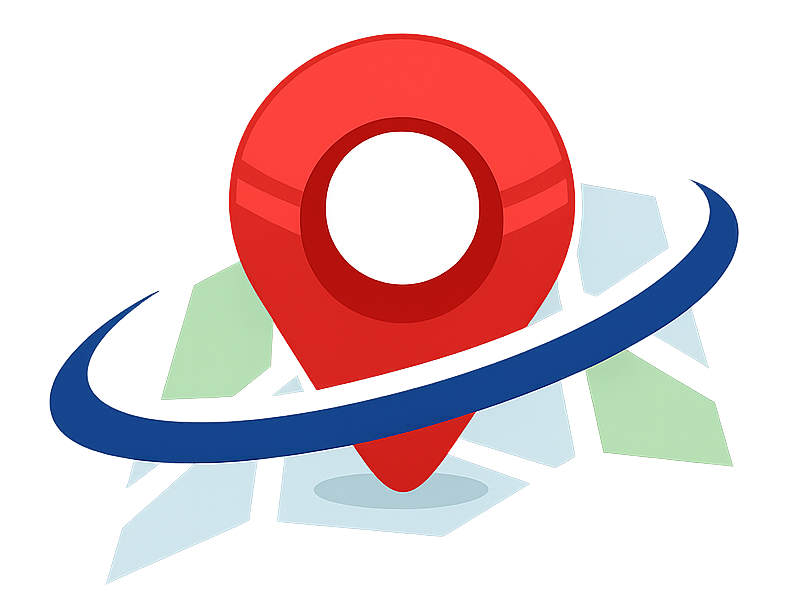
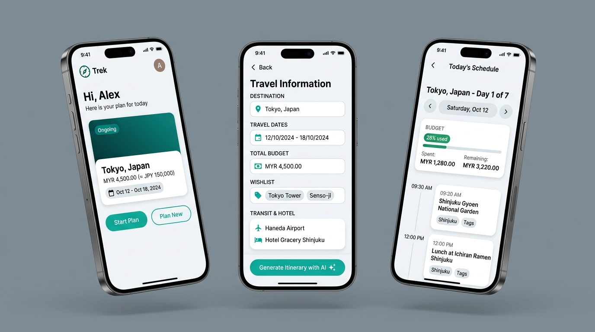
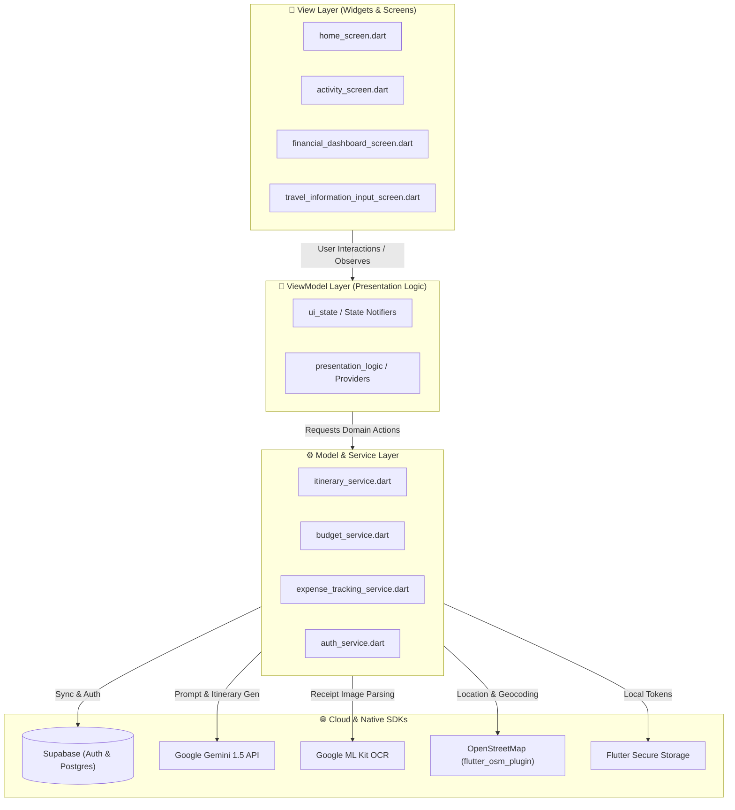

<div align="center">

  

  # 🧭 TREK — Smart Travel Itinerary & Expense Planner

  <p align="center">
    <strong>An AI-powered, offline-ready mobile travel companion engineered for seamless trip planning, real-time multi-currency expense tracking, and OCR receipt intelligence.</strong>
  </p>

  <p align="center">
    <a href="https://flutter.dev"></a>
    <a href="https://dart.dev"></a>
    <a href="https://supabase.com"></a>
    <a href="https://deepmind.google/technologies/gemini/"></a>
    <a href="https://developers.google.com/ml-kit"></a>
    <a href="https://www.openstreetmap.org"></a>
  </p>

  <p align="center">
    <a href="#-ui-showcase--screens">📱 UI Showcase</a> •
    <a href="#-key-features">✨ Key Features</a> •
    <a href="#-system-architecture">🏗 Architecture</a> •
    <a href="#-color-palette--design-system">🎨 Design System</a> •
    <a href="#-getting-started">🚀 Getting Started</a> •
    <a href="#-academic-context">🎓 Academic Info</a>
  </p>

</div>

---

## 📱 UI Showcase & Screens

<div align="center">
  
  <p><em>Figure 1: High-fidelity mobile interface showcase of TREK — 01. Home & Ongoing Trip, 02. Travel Information Input, and 03. Daily Activity Schedule with Budget Tracking.</em></p>
</div>

> [!TIP]
> **Interactive Mockup Available:** You can also preview the live responsive UI mockups directly in your browser by opening [`trek_mockup_preview.html`](trek_mockup_preview.html).

<br/>

### 📱 Core Screen Highlights

| 01 • Home Dashboard | 02 • Travel Information Input | 03 • Daily Activity Schedule |
| :---: | :---: | :---: |
| 🏠 **Trip Hub & Greetings** | 📝 **AI Travel Configurator** | ⏱️ **Daily Schedule & Budget** |
| • Personalized greeting (`Hi, Alex`)<br/>• **Active Plan Card** with `Ongoing` tag<br/>• Dual-currency display (`MYR 4,500 ≈ JPY 150,000`)<br/>• Direct actions: **Start Plan** & **Plan New** | • Destination input with GPS pin<br/>• Date range selector (e.g. 7 Days)<br/>• Currency & total budget limit setup<br/>• Wishlist chips & transit/hotel details<br/>• **"Generate Itinerary with AI"** CTA | • Day switcher (`Day 1 of 7 • Oct 12`)<br/>• Real-time **Budget Progress Bar** (`28% used`)<br/>• Metric stats (`Spent`, `Remaining`, `Overspent`)<br/>• Day timeline cards with time badges & tags |


---

## ✨ Key Features

```
TREK
├── 🤖 AI Itinerary Generation    -> Personalized schedule synthesis powered by Gemini API
├── 💰 Multi-Currency Budgeting   -> Auto-conversions, daily thresholds & alert progress bars
├── 🧾 Smart Receipt Scanner      -> Instant OCR on-device text parsing for rapid expense entry
├── 🗺️ Geolocated Navigation      -> OpenStreetMap integration with live location tracking
├── ☁️ Supabase Cloud Sync        -> Secure authentication, relational data, and encrypted storage
└── 📴 Offline Resilience         -> Local caching and offline persistence via SharedPreferences & Secure Storage
```

### 1. 🤖 AI-Driven Itinerary Synthesis (Google Gemini)
- Automatically compiles structured multi-day travel plans based on travel dates, budget, destination, and user interests.
- Suggests optimized transit intervals between attractions to minimize travel fatigue.

### 2. 💰 Intelligent Budget & Multi-Currency Engine
- Real-time conversion across foreign currencies with customized exchange rates.
- Multi-tier progress bar showing:
  - 🟢 **Safe Zone (0% - 70%)**: Well within planned budget.
  - 🟡 **Caution Zone (70% - 90%)**: Approaching daily limit.
  - 🔴 **Overspend Warning (>100%)**: Visual alert tags preventing unexpected deficit.

### 3. 🧾 On-Device OCR Receipt Scanning (Google ML Kit)
- Take a photo or pick a receipt from gallery.
- Employs **Google ML Kit Text Recognition** and image cropping to extract total amounts, merchant names, and transaction timestamps automatically.

### 4. 🗺️ Interactive Maps & Location Services
- Embedded OpenStreetMap (OSM) rendering with custom markers.
- Continuous distance calculation and route tracking via `geolocator`.

---

## 🏗 System Architecture

TREK strictly implements the **Model-View-ViewModel (MVVM)** architectural pattern layered on top of Flutter's reactive `Provider` state management, ensuring modularity, testability, and clean separation of concerns.



---

## 🎨 Color Palette & Design System

The application features a tailored travel theme built around energizing teal shades and crisp contrast tokens:

| Color Name | Hex Code | Preview | Purpose |
| :--- | :---: | :---: | :--- |
| **Teal A700** | `#14BBA6` | `■` | Primary Brand Color, CTA Buttons, Active Highlights |
| **Teal 800** | `#006B5E` | `■` | App Bars, Hero Gradients, Deep Brand Elements |
| **Teal 50** | `#CCFBF1` | `■` | Tag Backgrounds, Subtle Card Highlights |
| **Gray 900** | `#191C1E` | `■` | Primary Typography & High Contrast Headers |
| **Green Progress** | `#35C460` | `■` | Budget Healthy Indicator |
| **Alert Red** | `#EF4444` | `■` | Overspend Warning, Error Alerts |
| **Amber 200** | `#FFF0BE` | `■` | Warning & Medium Budget Level Tags |

---

## 📁 Repository Structure

```plaintext
TREK/
├── assets/                          # Static branding, logos and showcase graphics
│   ├── header_logo.png              # Header visual badge
│   ├── logo.png                     # High-res primary branding
│   └── trek_ui_showcase.jpg         # High-fidelity mobile UI showcase
├── lib/
│   ├── main.dart                    # Application entrypoint & Provider initialization
│   ├── models/                      # Entities, repositories, and data services
│   │   ├── configurations/          # App constants, API configurations
│   │   ├── entities/                # Core data models (Trip, Activity, Expense, User)
│   │   ├── local_data_source/       # SQLite / SecureStorage / SharedPrefs
│   │   ├── repository/              # Repository pattern implementations
│   │   └── services/                # Supabase, Gemini AI, OCR, & Location services
│   ├── theme/                       # Design tokens, color system, and ThemeData
│   │   ├── app_colors.dart          # Centralized palette constants
│   │   └── app_theme.dart           # Light/Dark Material 3 theme configurations
│   ├── utils/                       # Formatters, currency converters, validators
│   ├── view_models/                 # MVVM Presentation logic & UI state holders
│   ├── views/                       # Flutter UI screens and bottom sheets
│   │   ├── home_screen.dart         # Main landing dashboard
│   │   ├── activity_screen.dart     # Daily itinerary breakdown
│   │   ├── financial_dashboard_screen.dart  # Budget overview and charts
│   │   ├── expense_bottom_sheet.dart        # Quick expense & OCR entry modal
│   │   └── travel_information_input_screen.dart # Smart itinerary setup
│   └── widgets/                     # Reusable UI components & custom controls
├── trek_mockup_preview.html         # Interactive web mockup canvas
├── UC200_Activity_Diagram.drawio    # UML Activity Diagrams
└── pubspec.yaml                     # Dependencies & asset manifests
```

---

## 🚀 Getting Started

### Prerequisites

Ensure your development environment meets the following specifications:
- **Flutter SDK**: `>= 3.10.7`
- **Dart SDK**: `^3.10.7`
- **Android Studio / VS Code** with Flutter & Dart extensions
- **Physical Device or Android Emulator** (API 26+) / iOS Simulator

### 1. Clone & Install Dependencies

```bash
# Clone the repository
git clone https://github.com/AlexHong04/TREK.git

# Navigate into project directory
cd TREK

# Fetch all required Flutter packages
flutter pub get
```

### 2. Configure Environment Variables

Create or configure your API secrets for **Supabase** and **Google Gemini AI**:

```dart
// lib/models/configurations/supabase_config.dart
const String supabaseUrl = 'YOUR_SUPABASE_PROJECT_URL';
const String supabaseAnonKey = 'YOUR_SUPABASE_ANON_KEY';

// lib/models/configurations/gemini_config.dart
const String geminiApiKey = 'YOUR_GOOGLE_GEMINI_API_KEY';
```

### 3. Run the Application

```bash
# Verify attached devices
flutter devices

# Launch on connected device in debug mode
flutter run
```

---

## 🎓 Academic Context

This project is developed as part of the degree assignment for:

- **Institution**: Tunku Abdul Rahman University of Management and Technology (TAR UMT)
- **Programme**: Bachelor of Software Engineering (Honours) — RSW Y3S1
- **Course**: **BMSE3004 Collaborative Development**
- **Project Title**: TREK — Smart Travel Itinerary & Expense Planner Mobile Application

---

<div align="center">
  <sub>Built with ❤️ using Flutter & Dart. © 2024 TREK Team. All rights reserved.</sub>
</div>

